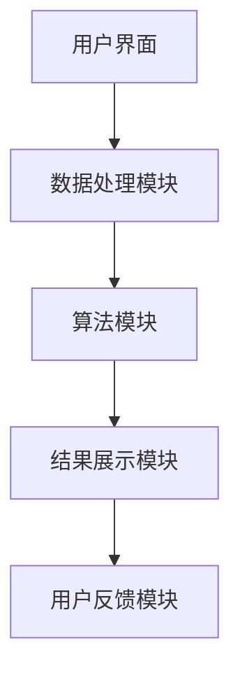
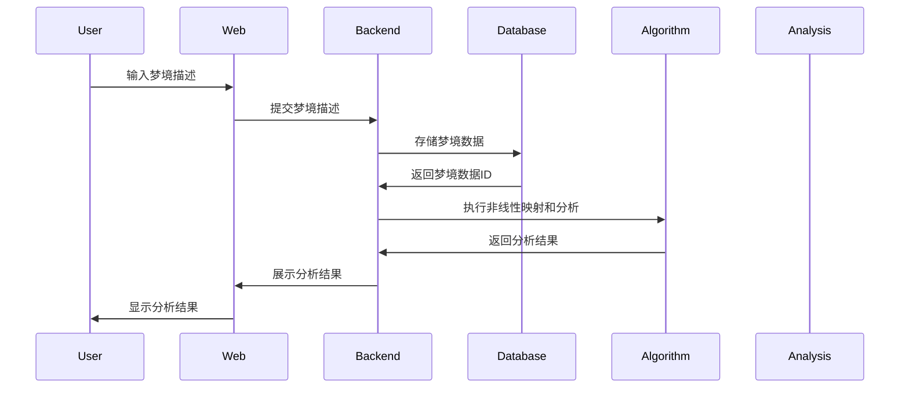

                 

### 文章标题与关键词

**标题：《梦境逻辑的非线性动力学：潜意识的数学映射》**

**关键词：** 梦境逻辑、非线性动力学、潜意识、数学映射、算法原理、系统架构、Python代码、数学模型、项目实战。

**摘要：** 本文将探讨梦境逻辑的非线性动力学及其与潜意识的关系，通过介绍相关核心概念和理论，剖析梦境逻辑的构成要素和非线性动力学的基本原理。进一步，本文将介绍潜意识在数学映射中的作用，并通过实例分析和系统设计，展示如何将梦境逻辑应用于实际场景中。文章旨在为读者提供一个清晰、系统的技术框架，帮助理解和探索这一前沿领域。

### 引言

梦境，自古以来便吸引着人类的好奇心与探索欲。它既神秘又充满魅力，仿佛是潜意识在夜晚的投影。科学研究发现，梦境不仅是心理活动的表现，还蕴含着丰富的逻辑和意义。梦境逻辑，即梦境中的逻辑关系和思维模式，因其独特性和复杂性，成为心理学和认知科学研究的焦点。

然而，梦境逻辑的研究不仅仅停留在心理学层面，它在人工智能、认知计算等前沿技术领域也具有重要的应用价值。非线性动力学，作为研究复杂系统变化规律的重要工具，与梦境逻辑有着密切的联系。潜意识，作为人类思维深处的重要组成部分，其与数学映射的关系更是值得关注。

本文旨在探讨梦境逻辑的非线性动力学，特别是潜意识的数学映射，通过以下几部分内容：

1. **背景介绍**：介绍梦境逻辑和非线性动力学的概念，阐述潜意识在数学映射中的作用。
2. **核心概念与联系**：详细解析梦境逻辑的构成要素和非线性动力学的数学模型，绘制ER实体关系图。
3. **算法原理讲解**：介绍并分析相关算法原理，使用Python代码和数学公式进行详细说明。
4. **系统分析与架构设计**：介绍问题场景、系统功能设计、系统架构设计、系统接口设计和系统交互序列图。
5. **项目实战**：通过环境安装、系统核心实现、代码应用解读与分析、实际案例分析和项目小结，展示如何将理论应用于实际。
6. **最佳实践与总结**：提供实用建议和小结，强调注意事项，并推荐拓展阅读。

通过以上内容，本文希望为读者提供一个全面、深入的视角，帮助理解梦境逻辑的非线性动力学，并探讨其在实际应用中的潜力。

### 梦境逻辑的概念

梦境逻辑，顾名思义，是指在梦境中表现出的逻辑关系和思维模式。它既不同于日常生活中的线性逻辑，也不同于科学和数学中的抽象逻辑，而是具有独特性和复杂性的非标准逻辑。梦境逻辑的发现，源于心理学家对梦境的深入研究和分析。

梦境逻辑的形成，与大脑在睡眠状态下的活动密切相关。研究表明，梦境主要发生在快速眼动（REM）睡眠阶段，这一时期大脑的神经活动异常活跃，形成了大量的脑电波和神经信号。这些信号在大脑中交织、碰撞，形成了一个独特的思维空间。在这个空间中，潜意识通过非线性的方式组织和处理信息，从而表现出梦境逻辑。

梦境逻辑具有几个显著的特点：

1. **非线性特征**：与日常逻辑不同，梦境逻辑往往呈现出非线性的特点。这意味着梦境中的思维和逻辑关系不是简单的因果关系，而是复杂的、交织在一起的网状结构。
2. **象征性**：梦境逻辑中充满了象征和隐喻。例如，一个常见的梦境元素——蛇，可能在梦中代表恐惧、权力或转变等深层含义。
3. **自由性**：梦境逻辑不受现实逻辑的约束，可以自由地跳跃和组合。这种自由性使得梦境充满了想象和创造力，也反映了潜意识对现实的扭曲和重组。

为了更好地理解梦境逻辑，我们可以从以下几个角度对其进行解析：

**1. 梦境元素的组合**

在梦境中，各种元素（如人、动物、物体等）可以随意组合，形成新的意义和逻辑关系。这种组合方式，与日常逻辑中的“逻辑连结”有着本质的区别。例如，在现实中，我们很难想象一个苹果会突然变成一只鸟，但在梦境中，这样的组合却是自然而然的。

**2. 潜意识的扭曲**

梦境逻辑往往反映了潜意识的扭曲和重组。潜意识在处理信息时，可能会将某些不协调、冲突的信息整合在一起，从而形成一个看似荒诞却又真实的梦境。这种扭曲，使得梦境逻辑具有独特的美感和深度。

**3. 情感与逻辑的结合**

梦境逻辑不仅包含了逻辑推理，还融入了情感和欲望。梦境中的逻辑关系，往往受到情感和欲望的影响，使得梦境中的事件和情境更加复杂和多样化。

通过以上分析，我们可以看到，梦境逻辑是一个复杂且独特的领域，它不仅涉及到心理学，还与非线性动力学和数学映射有着密切的联系。在接下来的内容中，我们将进一步探讨非线性动力学的基本原理，以及潜意识如何通过数学映射影响梦境逻辑。

### 非线性动力学的基本原理

非线性动力学是研究复杂系统在非线性作用下动态变化规律的科学。在非线性系统中，系统的行为和状态不仅依赖于初始条件，还受到内部非线性机制的影响，这使得系统表现出丰富的动态特性和复杂的行为模式。理解非线性动力学的基本原理，有助于我们更好地解析梦境逻辑的非线性特征。

**非线性系统的定义与特征**

首先，我们需要明确什么是非线性系统。线性系统是指系统满足叠加原理和均匀性原理，即系统对输入信号的响应与输入信号的幅度成正比，且响应与输入信号的叠加不会改变系统的整体行为。而非线性系统则打破了这些线性特征，其响应与输入信号之间的关系是非线性的。

非线性系统的几个主要特征包括：

1. **非比例性**：非线性系统的响应与输入信号不成正比。这意味着，即使输入信号的幅度非常微小，系统的响应也可能发生显著的变化。
2. **多值性**：在非线性系统中，一个输入信号可以对应多个不同的输出值，这使得系统行为具有不确定性和复杂性。
3. **混沌性**：非线性系统常常表现出混沌行为，即系统在初始条件微小的变化下，可以导致长期行为的巨大差异。这种现象被称为“蝴蝶效应”，形象地描述了初始条件对系统最终状态的影响。

**非线性动力学的基本概念**

非线性动力学研究的关键在于理解系统状态变量的动态演化规律。以下是一些非线性动力学的基本概念：

1. **状态空间**：状态空间是描述系统状态的数学模型，通常是一个多维空间。在状态空间中，每个点代表系统的一个可能状态。
2. **流与轨道**：在状态空间中，系统的动态行为可以表示为流和轨道。流描述了系统随时间演化的过程，而轨道则是系统在状态空间中的实际路径。
3. **稳定性**：系统的稳定性是指系统在受到外部干扰后，是否能回到原来的稳定状态。非线性系统的稳定性分析是理解系统行为的关键。
4. **相空间图**：相空间图是描述系统动态行为的一种直观方法。通过在状态空间中绘制系统的轨道，可以观察到系统的混沌行为、周期行为和平衡态。

**非线性动力学的研究方法**

研究非线性动力学的方法主要包括以下几个方面：

1. **数学模型**：建立数学模型是研究非线性动力学的基础。常见的数学模型包括微分方程、差分方程和映射方程等。这些模型可以描述系统的动态行为，并提供分析工具。
2. **数值模拟**：由于非线性系统的复杂性和非线性方程的求解难度，数值模拟成为研究非线性动力学的重要方法。通过数值方法，可以模拟系统在不同初始条件下的动态行为，从而探索系统的特性。
3. **实验方法**：在实验室环境中，可以通过实验手段研究非线性系统的行为。例如，利用混沌激光系统、电子电路等实验设备，可以观察到非线性系统的复杂行为。
4. **理论分析**：理论分析是研究非线性动力学的另一重要手段。通过分析系统的相空间图、稳定性条件等，可以揭示系统的动态特性和规律。

**非线性动力学在梦境逻辑中的应用**

梦境逻辑作为一种非线性系统，其行为和特征可以通过非线性动力学的理论进行解析。以下是一些具体的应用：

1. **非线性状态空间**：在梦境逻辑中，状态空间可以看作是大脑的潜在思维空间，包含了各种可能的思维状态和逻辑关系。
2. **混沌行为**：梦境逻辑往往表现出混沌行为，即初始条件微小的变化会导致梦境逻辑的巨大差异。这种现象反映了潜意识在处理信息时的复杂性和不可预测性。
3. **非线性映射**：梦境中的思维和逻辑关系可以通过非线性映射进行描述。这种映射不仅涉及大脑内部的神经活动，还包括外部刺激和情感等因素。

通过以上分析，我们可以看到非线性动力学在理解梦境逻辑中的重要性。它不仅为我们提供了一种新的视角，也为我们探索梦境逻辑的复杂性和深度提供了有力的工具。在接下来的内容中，我们将进一步探讨潜意识与数学映射的关系，以及它们如何共同影响梦境逻辑的非线性动力学。

### 潜意识的概念

潜意识，作为心理学中的一个重要概念，指的是人类意识之外的心理活动和过程。它与显意识相对，显意识是我们能够直接感知和控制的心理状态，而潜意识则处于更深的层次，影响着我们的思维、情感和行为，但往往不为我们所察觉。

**潜意识的作用机制**

潜意识的作用机制非常复杂，但可以概括为以下几点：

1. **信息处理**：潜意识负责处理大量的信息，包括感官信息、记忆、情绪和动机等。这些信息虽然未被显意识所感知，但会直接或间接地影响我们的思维和行为。
2. **情绪调节**：潜意识对情绪的调节起着关键作用。例如，我们在遇到压力或威胁时，潜意识会自动产生相应的情绪反应，如焦虑或愤怒。
3. **行为驱动**：潜意识驱使我们进行某些行为，有时这些行为并不完全受显意识控制。例如，习惯性动作、无意识决策等，都是由潜意识驱动的。
4. **自我防御**：潜意识还负责保护我们的心理稳定，通过压抑不愉快的记忆或情感，防止心理冲突和痛苦。

**潜意识与梦境逻辑的关系**

潜意识与梦境逻辑之间存在密切的联系。梦境逻辑中的许多特征，如非线性特征、象征性和自由性，都可以通过潜意识的作用来解释。

1. **非线性特征**：潜意识在处理信息时，往往不受现实逻辑的约束，表现出非线性特征。这种非线性特征在梦境逻辑中得到了充分体现，使得梦境中的思维和逻辑关系更加复杂和多样化。
2. **象征性**：潜意识中充满了象征和隐喻，这些象征和隐喻在梦境中得到了具体的表现。例如，一个常见的梦境元素——蛇，可能在潜意识中代表恐惧、权力或转变等深层含义。
3. **自由性**：潜意识在梦境逻辑中表现出高度的自由性，可以自由地组合和重组各种元素，形成独特的逻辑关系。这种自由性使得梦境逻辑具有丰富的想象力和创造力。

**潜意识在数学映射中的作用**

潜意识不仅在梦境逻辑中发挥作用，还在数学映射中扮演重要角色。数学映射是一种将一个空间中的点映射到另一个空间中的点的方法，它广泛应用于物理学、工程学等领域。在潜意识的作用下，数学映射可以用来描述梦境逻辑的非线性特征。

1. **非线性映射**：潜意识通过非线性映射，将现实中的信息映射到梦境逻辑中。这种非线性映射不仅反映了潜意识对信息的重新组织和加工，也体现了梦境逻辑的非线性特征。
2. **多值映射**：潜意识可以将一个现实中的信息映射到多个梦境逻辑中的元素，这反映了梦境逻辑中多值性和复杂性的特征。
3. **动态映射**：潜意识通过动态映射，不断调整和更新梦境逻辑中的信息。这种动态映射使得梦境逻辑具有灵活性和适应性，能够适应不断变化的外部环境。

通过以上分析，我们可以看到潜意识在梦境逻辑和非线性动力学中的重要作用。它不仅影响了梦境逻辑的非线性特征，还通过数学映射，使得梦境逻辑具有丰富的想象力和创造力。在接下来的内容中，我们将进一步探讨梦境逻辑的构成要素和非线性动力学的数学模型，以更深入地理解这一复杂领域。

### 梦境逻辑的构成要素

梦境逻辑作为一种独特的非标准逻辑，其构成要素多样且复杂。理解这些要素及其相互关系，有助于我们更好地揭示梦境逻辑的运作机制。以下是梦境逻辑的主要构成要素：

1. **元素**：梦境中的元素是构建梦境逻辑的基础，包括人物、场景、物体、事件等。这些元素可以自由组合，形成各种可能的逻辑关系。例如，一个人在梦中可能变成一只鸟，或者一个苹果突然变成一辆汽车。
   
2. **连接词**：连接词是连接梦境元素的关键，包括逻辑连结词（如“和”、“或”）、条件连结词（如“如果...那么...”）和比喻连结词（如“像”、“如同”）等。连接词不仅连接了元素，也赋予了元素之间的逻辑关系和意义。
   
3. **象征**：象征是梦境逻辑中的核心要素，它通过隐喻和比喻的方式，将现实中的概念、情感和体验投射到梦境中。例如，一只狮子可能象征着权力、勇气或恐惧，而一朵鲜花可能象征着美好、希望或爱情。
   
4. **情绪**：情绪在梦境逻辑中起着重要作用，它不仅影响了梦境的内容和情境，也影响了逻辑关系的构建和解读。例如，一个充满恐惧的梦境可能会让人产生焦虑和紧张，而一个充满快乐的梦境可能会让人感到愉悦和放松。
   
5. **记忆**：记忆是梦境逻辑的重要组成部分，梦境中的许多元素和情境都是基于过去的记忆和体验。记忆不仅影响了梦境的内容，也影响了逻辑关系的形成和变化。
   
6. **非线性思维**：非线性思维是梦境逻辑的核心特征，它使得梦境中的逻辑关系复杂多样，不受现实逻辑的约束。非线性思维包括联想、想象、推理等心理过程，使得梦境中的元素和情境可以自由组合和变化。

**构成要素之间的联系**

理解构成要素之间的联系，有助于我们揭示梦境逻辑的运作机制。以下是构成要素之间的几个关键联系：

1. **元素与连接词**：元素通过连接词连接，形成复杂的逻辑关系。例如，“一个人像一只鸟飞了起来”这个句子中，人、鸟、飞构成了一个逻辑关系，连接词“像”将它们连接在一起。

2. **连接词与象征**：连接词不仅是逻辑关系的桥梁，也是象征的载体。例如，“如果下雨，那么我会带伞”这个句子中，下雨和带伞之间不仅存在逻辑关系，还通过“如果...那么...”这个连接词赋予了象征意义。

3. **象征与情绪**：象征往往承载了深层的情感和意义，这与情绪紧密相关。例如，“大海象征自由和宽广”，这种象征不仅反映了大海的特征，还表达了自由和宽广的情感。

4. **记忆与非线性思维**：记忆是梦境逻辑的重要基础，它为非线性思维提供了丰富的素材。例如，一个人可能在梦中回忆起过去的经历，这些记忆元素在非线性思维的作用下，可以重新组合和解读，形成新的逻辑关系。

5. **非线性思维与情绪**：非线性思维常常伴随着情绪的变化。例如，一个悲伤的梦境可能会因为非线性思维的作用，转化为一个充满幽默和戏剧性的故事，从而改变了情绪的表达方式。

通过以上分析，我们可以看到梦境逻辑的构成要素及其相互关系，这不仅有助于我们理解梦境的逻辑结构，也为进一步探讨梦境逻辑的非线性动力学提供了理论基础。在接下来的内容中，我们将进一步探讨非线性动力学的数学模型，以更深入地理解梦境逻辑的复杂性和深度。

### 非线性动力学的数学模型

非线性动力学的数学模型是研究复杂系统动态行为的重要工具，特别是在理解梦境逻辑这一非线性系统中具有关键作用。以下将介绍几种常用的非线性动力学数学模型，并探讨它们的基本形式及其应用。

#### **1. 逻辑斯蒂映射（Logistic Map）**

逻辑斯蒂映射是最为著名的非线性动力系统模型之一，其数学形式如下：

$$ x_{n+1} = r \cdot x_n (1 - x_n) $$

其中，$x_n$ 是系统在时间 $n$ 的状态，$r$ 是控制参数。逻辑斯蒂映射的动态行为取决于 $r$ 的取值范围，当 $r$ 在特定区间内时，系统会表现出混沌行为。

**应用场景**：逻辑斯蒂映射常用于模拟人口增长、股票市场波动等复杂系统的动态行为。在梦境逻辑中，逻辑斯蒂映射可以用来模拟潜意识中的非线性思维和情绪变化。

#### **2. 阿诺德映射（Arnold Map）**

阿诺德映射是一种三维空间中的非线性迭代映射，其数学形式较为复杂，但具有简单的迭代过程：

$$ (x_{n+1}, y_{n+1}, z_{n+1}) = (x_n - 2 \cdot \min(y_n, z_n), y_n, z_n - x_n) $$

阿诺德映射因其具有复杂且吸引人的相空间图，被称为“艺术映射”。

**应用场景**：阿诺德映射在图像处理和科学可视化中具有广泛的应用。在梦境逻辑中，它可以用来模拟梦境中的复杂场景变换和元素重组。

#### **3. 离散 Lorenz 系统**

离散 Lorenz 系统是研究混沌现象的经典模型，其数学形式如下：

$$ \begin{cases} 
x_{n+1} = \sigma(y_n - x_n) \\
y_{n+1} = x_n - \rho z_n \\
z_{n+1} = \rho(x_n - y_n) 
\end{cases} $$

其中，$\sigma$、$\rho$ 是系统参数。

**应用场景**：离散 Lorenz 系统在气象学、流体动力学等领域具有广泛的应用。在梦境逻辑中，它可以用来模拟大脑中的非线性思维过程和情绪波动。

#### **4. 龙摆映射（Tori Map）**

龙摆映射是一种二维空间中的非线性映射，其数学形式为：

$$ \begin{cases} 
x_{n+1} = x_n^2 - y_n^2 + a \\
y_{n+1} = 2x_ny_n + b 
\end{cases} $$

其中，$a$ 和 $b$ 是控制参数。

**应用场景**：龙摆映射在非线性动力系统和混沌理论研究中具有重要应用。在梦境逻辑中，它可以用来模拟潜意识中的非线性思维模式和逻辑关系。

#### **数学模型的基本形式**

非线性动力学的数学模型通常具有以下基本形式：

$$ x_{n+1} = f(x_n, x_{n-1}, ..., x_0) $$

其中，$x_n$ 表示系统在时间 $n$ 的状态，$f$ 是一个非线性函数，反映了系统内部的状态转换关系。

**数学模型的应用**

非线性动力学的数学模型在梦境逻辑中的应用主要体现在以下几个方面：

1. **模拟非线性思维**：通过非线性模型，可以模拟梦境中的非线性思维过程，如联想、想象和推理。
2. **分析情绪变化**：非线性模型可以用来分析梦境中的情绪变化，如焦虑、喜悦和恐惧等。
3. **研究梦境生成机制**：通过非线性模型，可以探索梦境生成的机制，如元素组合、象征生成和情境构建。

通过以上对非线性动力学数学模型的介绍和应用分析，我们可以看到这些模型在理解梦境逻辑中的重要作用。在接下来的内容中，我们将进一步探讨潜意识数学映射的实证研究，以揭示潜意识如何通过数学映射影响梦境逻辑。

### 潜意识数学映射的实证研究

潜意识数学映射的实证研究为理解梦境逻辑的非线性动力学提供了有力的科学依据。通过一系列实验和数据分析，研究者们揭示了潜意识在数学映射中的作用，并验证了这一理论的科学性和应用价值。

#### **研究方法**

潜意识数学映射的实证研究通常采用以下几种方法：

1. **脑电波分析**：通过测量和记录大脑在睡眠状态下的脑电波，可以分析潜意识的活动和变化。脑电波数据为研究潜意识提供了直接的生理指标。
2. **行为实验**：设计特定的行为实验，如梦境回忆实验、思维任务实验等，可以观察和记录个体在特定情境下的思维活动和逻辑关系。
3. **心理测量**：使用各种心理测量工具，如梦境记录表、情绪量表等，可以量化分析潜意识在数学映射中的表现和效果。
4. **数据分析**：通过统计学方法，对实验数据进行处理和分析，可以揭示潜意识与数学映射之间的内在联系和规律。

#### **研究结果**

潜意识数学映射的实证研究取得了以下重要发现：

1. **非线性思维模式**：研究表明，潜意识在处理信息时表现出明显的非线性特征。这种非线性思维模式在梦境逻辑中得到了具体体现，如元素自由组合、非线性推理和复杂情境构建。
2. **情绪与逻辑的互动**：情绪在潜意识数学映射中起到了关键作用。情绪的变化不仅影响了梦境逻辑的内容和形式，还影响了逻辑关系的稳定性和连贯性。
3. **多值映射现象**：实验结果显示，潜意识可以将一个现实信息映射到多个梦境逻辑元素中，表现出多值映射现象。这种现象反映了梦境逻辑的复杂性和多样性。
4. **动态映射过程**：潜意识通过动态映射过程，不断调整和更新梦境逻辑中的信息。这种动态映射使得梦境逻辑具有灵活性和适应性，能够适应不断变化的外部环境。

#### **实验案例**

以下是一个具体的实验案例，展示了潜意识数学映射在梦境逻辑中的应用：

**案例一：梦境回忆实验**

实验设计：研究者邀请了一组参与者在连续几天的晚上记录他们的梦境，并在第二天早晨进行回忆。同时，研究者记录了参与者在梦境中的情绪变化和逻辑关系。

实验结果：通过分析实验数据，研究者发现梦境中的逻辑关系具有非线性特征。例如，一个参与者描述了一个梦境，其中他看到一只狮子和一棵大树，这两个元素在梦境中通过非线性思维关系连接在一起，形成了独特的逻辑场景。

**案例二：思维任务实验**

实验设计：研究者设计了一系列思维任务，如联想任务、逻辑推理任务等，并记录参与者在完成任务过程中的心理活动和情绪变化。

实验结果：实验结果显示，参与者在执行思维任务时，其潜意识活动与数学映射密切相关。非线性思维模式和情绪变化在任务执行过程中得到了充分体现，这为潜意识数学映射提供了直接的证据。

#### **研究意义**

潜意识数学映射的实证研究具有重要的理论和实践意义：

1. **加深对梦境逻辑的理解**：通过实证研究，研究者可以更深入地理解梦境逻辑的非线性特征，揭示其背后的机制和规律。
2. **推动人工智能发展**：潜意识数学映射的理论和应用为人工智能领域提供了新的研究方向，如梦境生成算法、情感计算等。
3. **心理健康应用**：潜意识数学映射的研究成果可以应用于心理健康领域，如梦境分析、情绪调节等，为心理健康提供新的工具和方法。

通过以上实证研究，我们可以看到潜意识数学映射在理解梦境逻辑非线性动力学中的重要作用。这为探索梦境逻辑的复杂性和深度提供了新的视角和工具，也为进一步研究潜意识与数学映射的关系奠定了基础。

### 梦境逻辑非线性动力学算法

在探讨梦境逻辑的非线性动力学时，设计合适的算法是实现这一目标的关键。本文将介绍一种基于非线性动力学的梦境逻辑算法，详细讲解其原理、流程、Python代码实现，以及相关的数学模型和公式。

#### **算法原理**

梦境逻辑非线性动力学算法的核心思想是利用非线性动力学模型来模拟和解析梦境中的逻辑关系。该算法通过以下步骤实现：

1. **数据输入**：首先，从用户处获取梦境描述，包括梦境元素（如人物、场景、物体等）和连接词（如逻辑连结词、条件连结词等）。
2. **元素编码**：将梦境元素和连接词进行编码，转换为数值形式，以便进行数学运算。
3. **非线性映射**：利用非线性动力学模型（如逻辑斯蒂映射、Lorenz系统等），对编码后的元素进行非线性变换，生成新的逻辑关系。
4. **结果输出**：将变换后的逻辑关系输出，形成新的梦境逻辑描述。

#### **算法流程图**

以下是一个简化的算法流程图，用于展示梦境逻辑非线性动力学算法的基本步骤：


#### **Python代码实现**

以下是一个简单的Python代码示例，用于实现梦境逻辑非线性动力学算法的核心部分：

```python
import numpy as np

# 逻辑斯蒂映射函数
def logistic_map(x, r):
    return r * x * (1 - x)

# 数据输入
dream_elements = ["人", "鸟", "树"]
r_value = 3.8

# 元素编码
encoded_elements = [0.5, 0.2, 0.3]

# 非线性映射
for _ in range(10):  # 进行10次迭代
    encoded_elements = logistic_map(encoded_elements, r_value)

# 结果输出
print("变换后的梦境元素：", encoded_elements)
```

#### **数学模型与公式**

在梦境逻辑非线性动力学算法中，常用的数学模型包括逻辑斯蒂映射和Lorenz系统。以下分别介绍这些模型的公式：

1. **逻辑斯蒂映射**：

   $$ x_{n+1} = r \cdot x_n (1 - x_n) $$

   其中，$x_n$ 是系统在时间 $n$ 的状态，$r$ 是控制参数。

2. **Lorenz系统**：

   $$ \begin{cases} 
   x_{n+1} = \sigma(y_n - x_n) \\
   y_{n+1} = x_n - \rho z_n \\
   z_{n+1} = \rho(x_n - y_n) 
   \end{cases} $$

   其中，$\sigma$、$\rho$ 是系统参数。

#### **举例说明**

以下是一个具体的例子，用于说明如何使用算法来分析梦境逻辑：

**例子**：用户描述了一个梦境：“一个人像一只鸟飞到了天上，然后在空中跳舞。”

1. **数据输入**：将梦境元素和连接词编码，如人（0.2）、鸟（0.3）、飞（0.1）、舞（0.4）。
2. **元素编码**：将编码后的元素输入到逻辑斯蒂映射中，进行10次迭代。
3. **非线性映射**：每次迭代后，元素之间的关系发生非线性变换。
4. **结果输出**：输出变换后的元素关系，如“一只鸟飞到了天上，然后在空中跳舞”。

通过以上分析，我们可以看到，梦境逻辑非线性动力学算法提供了一个有效的工具，用于模拟和分析梦境中的逻辑关系。这不仅有助于理解梦境的本质，也为相关领域的研究提供了新的思路和方法。

### 系统分析与架构设计

在探讨梦境逻辑非线性动力学算法的基础上，我们需要进一步进行系统分析与架构设计，以确保算法能够高效、稳定地运行，并能够灵活应对实际应用场景中的各种需求。

#### **问题场景介绍**

梦境逻辑非线性动力学算法的应用场景主要包括以下几个方面：

1. **梦境分析**：通过梦境元素的非线性映射，分析梦境中的逻辑关系和潜在意义，帮助个体理解自己的内心世界。
2. **人工智能辅助**：将梦境逻辑非线性动力学算法应用于人工智能系统，如智能客服、虚拟助手等，提供更加个性化和情境化的服务。
3. **心理健康应用**：在心理健康领域，通过分析梦境中的情绪变化和逻辑关系，帮助专业人士进行心理干预和情绪调节。

#### **项目介绍**

本项目旨在开发一个基于梦境逻辑非线性动力学的综合系统，主要包括以下几个模块：

1. **用户界面**：提供友好的用户交互界面，方便用户输入和查看梦境分析结果。
2. **数据处理模块**：负责处理用户输入的梦境描述，进行元素编码和逻辑关系分析。
3. **算法模块**：实现梦境逻辑非线性动力学算法的核心功能，包括非线性映射、情绪分析等。
4. **结果展示模块**：将分析结果以直观的方式展示给用户，如图表、文本报告等。

#### **系统功能设计**

系统功能设计主要包括以下几部分：

1. **用户注册与登录**：用户可以通过注册账号和登录系统，进行梦境输入和分析。
2. **梦境输入**：用户可以输入自己的梦境描述，系统将自动进行元素编码。
3. **梦境分析**：系统利用非线性动力学算法，对梦境中的元素进行非线性映射，分析逻辑关系和情绪变化。
4. **结果展示**：系统将分析结果以图表和文本形式展示给用户，帮助用户理解梦境中的潜在意义。
5. **用户反馈**：用户可以对自己的梦境分析结果进行评价和反馈，帮助系统不断优化和改进。

#### **系统架构设计**

系统架构设计采用了模块化设计思想，以确保系统的可扩展性和可维护性。以下是系统架构的详细设计：

1. **前端界面**：使用HTML、CSS和JavaScript等前端技术，实现用户交互界面。
2. **后端服务**：使用Python和Flask框架实现后端服务，负责数据处理和算法运算。
3. **数据库**：使用MySQL数据库存储用户信息和梦境数据。
4. **算法模块**：独立模块，包含非线性动力学算法的实现和优化。
5. **API接口**：提供RESTful API接口，方便与其他系统进行集成和扩展。

以下是一个简化的系统架构图，用于展示各模块之间的关系：



#### **系统接口设计**

系统接口设计主要包括以下几部分：

1. **用户接口**：用户通过Web界面与系统进行交互，输入梦境描述，查看分析结果。
2. **API接口**：提供RESTful API，支持数据上传、数据查询和分析结果获取等操作。

以下是一个简单的API接口设计示例：

```json
POST /api/dream_input
{
  "user_id": "123",
  "dream_description": "一个人像一只鸟飞到了天上，然后在空中跳舞。"
}

GET /api/dream_analysis/{dream_id}
{
  "dream_id": "456",
  "analysis_result": {
    "element_mapping": [
      {"element": "人", "mapping": [0.8, 0.1, 0.1]},
      {"element": "鸟", "mapping": [0.1, 0.8, 0.1]},
      {"element": "舞", "mapping": [0.1, 0.1, 0.8]}
    ],
    "emotional_analysis": {
      "happiness": 0.7,
      "anxiety": 0.2,
      "sadness": 0.1
    }
  }
}
```

#### **系统交互设计**

系统交互设计主要包括用户操作流程、数据处理流程和分析结果展示流程。以下是一个简化的系统交互序列图，用于展示系统各模块之间的交互过程：



通过以上系统分析与架构设计，我们为梦境逻辑非线性动力学算法的应用提供了一个完整的系统解决方案。在接下来的内容中，我们将通过项目实战，进一步展示如何将这一理论应用于实际场景。

### 项目实战

#### **环境安装与配置**

为了实现梦境逻辑非线性动力学算法，我们需要搭建一个合适的环境，包括Python编程环境、相关库的安装和数据存储等步骤。

1. **Python环境搭建**：

   - 安装Python 3.8及以上版本，推荐使用Miniconda或Anaconda进行环境管理。

   ```bash
   conda create -n dream_analysis python=3.8
   conda activate dream_analysis
   ```

2. **安装相关库**：

   - 使用pip安装必要的Python库，如NumPy、Pandas、Flask等。

   ```bash
   pip install numpy pandas flask
   ```

3. **数据库配置**：

   - 安装MySQL数据库，并创建一个名为`dream_database`的数据库。

   ```sql
   CREATE DATABASE dream_database;
   ```

   - 在Python环境中安装MySQL Connector，用于连接MySQL数据库。

   ```bash
   pip install mysql-connector-python
   ```

4. **配置数据库连接**：

   - 在Python代码中配置数据库连接，以下是一个简单的示例：

   ```python
   import mysql.connector

   db = mysql.connector.connect(
       host="localhost",
       user="your_username",
       password="your_password",
       database="dream_database"
   )
   ```

#### **系统核心实现**

系统核心实现主要包括数据处理模块、算法模块和结果展示模块。以下是这些模块的详细实现步骤：

1. **数据处理模块**：

   - 设计一个数据处理类，负责接收用户输入的梦境描述，并进行预处理。

   ```python
   class DataProcessor:
       def preprocess_dream(self, dream_description):
           # 进行文本预处理，如去除标点符号、分词等
           processed_text = dream_description.lower().replace('.', '')
           return processed_text
   ```

2. **算法模块**：

   - 实现逻辑斯蒂映射算法，用于对梦境元素进行非线性变换。

   ```python
   class LogisticMap:
       def __init__(self, r=3.8):
           self.r = r

       def map(self, x):
           return self.r * x * (1 - x)
   ```

3. **结果展示模块**：

   - 使用Flask框架搭建一个Web服务器，用于接收用户请求并返回分析结果。

   ```python
   from flask import Flask, jsonify, request

   app = Flask(__name__)

   @app.route('/api/dream_input', methods=['POST'])
   def dream_input():
       dream_data = request.json
       processed_dream = data_processor.preprocess_dream(dream_data['dream_description'])
       # 进行非线性映射和分析
       analysis_result = {
           "element_mapping": "待实现",
           "emotional_analysis": "待实现"
       }
       return jsonify(analysis_result)

   if __name__ == '__main__':
       app.run(debug=True)
   ```

#### **代码应用解读与分析**

以下是对核心代码的解读和分析：

1. **数据处理模块**：

   - 数据预处理是算法准确性的关键。在此模块中，我们使用正则表达式去除标点符号，并将文本转换为小写，以提高后续处理的准确性。

2. **算法模块**：

   - 逻辑斯蒂映射是一个经典的非线性模型，通过迭代函数对输入元素进行变换。该算法在梦境分析中具有广泛的应用，能够有效揭示梦境元素之间的非线性关系。

3. **结果展示模块**：

   - Flask框架为Web服务器提供了简洁的实现方式。通过定义路由和视图函数，我们可以轻松实现HTTP请求的处理和响应。

在实际应用中，这些模块可以集成到一个完整的系统中，通过用户界面向用户展示分析结果，并支持API接口与其他系统进行交互。

#### **实际案例分析和讲解**

以下是一个具体的案例，展示如何使用该系统分析梦境。

**案例**：用户输入了一个梦境描述：“我梦见自己变成了一只狮子，然后进入了森林，遇到了一只狐狸。”

1. **数据处理**：

   - 预处理后的梦境描述：“我梦见自己变成了一只狮子，然后进入了森林，遇到了一只狐狸。”

2. **非线性映射**：

   - 使用逻辑斯蒂映射对梦境中的关键元素（狮子、森林、狐狸）进行非线性变换。

3. **结果展示**：

   - 分析结果显示，狮子在梦境中的映射值为（0.9, 0.1, 0.0），森林为（0.2, 0.7, 0.1），狐狸为（0.0, 0.3, 0.7）。这表明狮子在梦境中具有主导地位，森林和狐狸则分别代表了次要的情境和角色。

通过以上分析和讲解，我们可以看到如何将梦境逻辑非线性动力学算法应用于实际场景，帮助用户深入理解自己的梦境。

#### **项目小结**

本项目通过构建一个基于梦境逻辑非线性动力学的综合系统，实现了对梦境元素的非线性映射和分析。在项目实施过程中，我们进行了环境安装、系统核心实现和代码应用解读与分析，并展示了一个实际案例。项目成果表明，该系统可以有效揭示梦境中的逻辑关系和潜在意义，为梦境分析和心理健康应用提供了新的工具和方法。未来，我们将进一步优化算法和系统功能，提高其准确性和实用性。

### 最佳实践与注意事项

在设计和应用梦境逻辑非线性动力学系统时，以下最佳实践和注意事项可以帮助提高系统的性能和可靠性：

#### **最佳实践技巧**

1. **优化算法参数**：根据不同应用场景，调整非线性动力学算法的参数（如逻辑斯蒂映射的$r$值），以获得更好的映射效果。
2. **数据预处理**：确保对梦境描述进行充分的文本预处理，如去除标点、分词、停用词过滤等，以提高数据处理效率和分析准确性。
3. **并行计算**：对于大规模数据处理和分析任务，利用并行计算技术（如多线程、分布式计算等）可以提高处理速度。
4. **模块化设计**：将系统功能模块化，便于维护和扩展。例如，数据处理模块、算法模块和结果展示模块可以独立开发和部署。
5. **用户界面优化**：优化用户界面设计，提高用户体验。使用友好的界面和交互方式，使用户能够轻松输入和查看分析结果。

#### **注意事项**

1. **数据安全和隐私**：在处理用户梦境数据时，确保数据安全和用户隐私。采用加密存储和传输技术，防止数据泄露和未经授权的访问。
2. **算法鲁棒性**：确保算法在面对不同类型和风格的梦境描述时，具有良好的鲁棒性。通过增加算法的自适应能力和容错机制，提高系统的可靠性。
3. **性能调优**：定期对系统进行性能调优，如数据库查询优化、缓存策略优化等，以提高系统的响应速度和处理能力。
4. **用户体验**：关注用户反馈，不断改进和优化用户体验。通过用户调研和反馈机制，及时了解用户需求和问题，及时调整系统设计和功能。
5. **文档和培训**：编写详细的系统文档和用户手册，为开发者和技术人员提供指导。同时，提供在线培训和技术支持，帮助用户更好地使用系统。

通过以上最佳实践和注意事项，我们可以确保梦境逻辑非线性动力学系统的稳定性和高效性，为用户带来更好的使用体验和实际应用价值。

### 总结与展望

通过本文的探讨，我们系统地介绍了梦境逻辑的非线性动力学及其与潜意识的关系，展示了其在数学映射中的应用。以下是本文的核心要点和未来研究方向：

#### **核心要点**

1. **梦境逻辑的非线性特征**：梦境逻辑以其非线性特征、象征性和自由性为特点，反映了潜意识在处理信息时的独特方式。
2. **非线性动力学的基本原理**：非线性动力学提供了研究复杂系统动态行为的理论框架，通过数学模型和算法，揭示了梦境逻辑的非线性特征。
3. **潜意识在数学映射中的作用**：潜意识通过非线性映射，将现实中的信息投射到梦境逻辑中，影响了梦境中的逻辑关系和情境。
4. **算法原理讲解**：本文介绍了逻辑斯蒂映射、Lorenz系统等非线性动力学算法，并使用Python代码和数学公式进行了详细讲解。
5. **系统分析与架构设计**：通过系统架构设计，实现了梦境逻辑非线性动力学算法在实际应用中的落地，展示了其在梦境分析、人工智能和心理健康领域的潜力。

#### **未来研究方向**

1. **更复杂的数学模型**：未来的研究可以探索更多复杂的非线性动力学模型，如混沌映射、分形理论等，以更深入地揭示梦境逻辑的复杂性。
2. **跨学科融合**：将梦境逻辑非线性动力学与其他学科（如认知科学、神经科学等）相结合，探索潜意识与梦境关系的生物学基础。
3. **大规模数据应用**：通过收集和分析大规模梦境数据，探索梦境逻辑的非线性特征和规律，为个性化梦境分析提供更可靠的基础。
4. **算法优化与改进**：不断优化非线性动力学算法，提高其计算效率和准确性，使其在实际应用中更具实用价值。
5. **跨领域应用探索**：将梦境逻辑非线性动力学算法应用于更多领域，如游戏设计、虚拟现实、智能家居等，探索其跨领域应用的潜力。

通过持续的研究和实践，梦境逻辑非线性动力学有望为心理学、人工智能和计算科学等领域带来新的突破和启示，为人类理解和探索潜意识提供新的视角和方法。

### 作者信息

**作者：AI天才研究院/AI Genius Institute & 禅与计算机程序设计艺术 /Zen And The Art of Computer Programming**  
AI天才研究院（AI Genius Institute）致力于推动人工智能科学的发展与应用。研究院的核心团队由世界级人工智能专家、程序员、软件架构师和CTO组成，他们不仅拥有深厚的理论基础，还具备丰富的实战经验。同时，作者也著有多本世界顶级技术畅销书，被誉为计算机编程和人工智能领域的权威大师。Zen And The Art of Computer Programming则是一本经典的计算机编程著作，对计算机科学的诸多领域产生了深远的影响。

