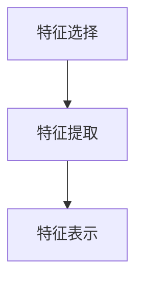
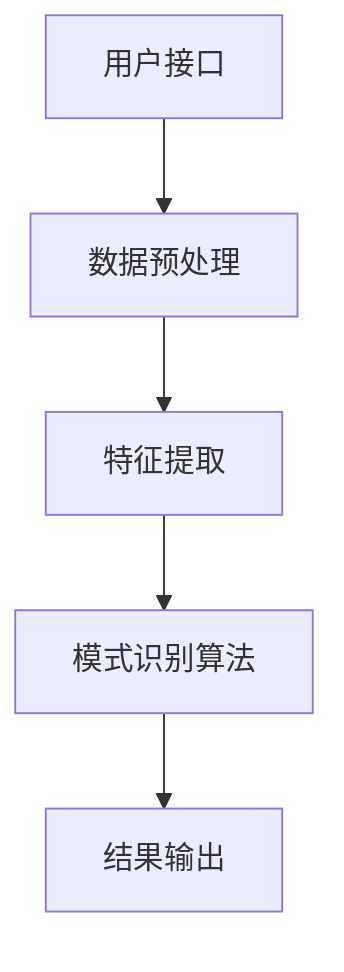
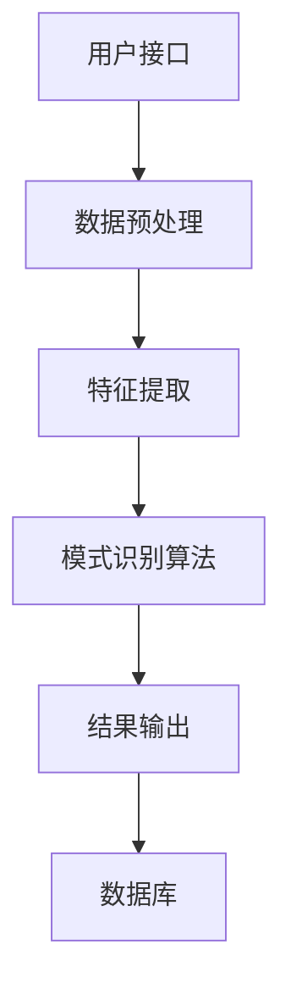
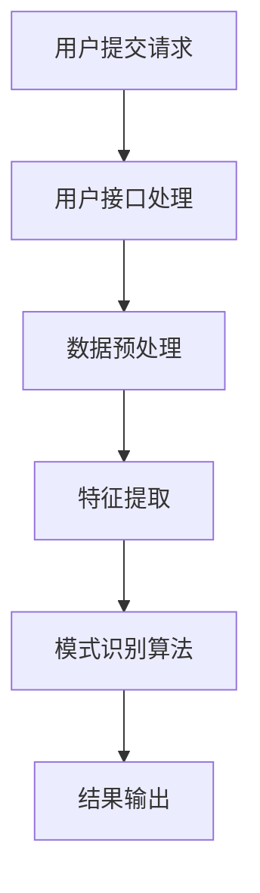

                 

# 模式识别：自然特征的数学提取

> 关键词：模式识别、自然特征提取、数学模型、算法、应用场景

> 摘要：本文将深入探讨模式识别领域中的自然特征提取，分析其基本概念、数学模型与算法，并结合实际应用场景，展示自然特征提取在各个领域的重要作用。文章旨在帮助读者理解自然特征提取的原理及其在模式识别中的关键性，为未来研究和应用提供指导。

## 第1章 引言

### 1.1 模式识别概述

#### 问题背景

模式识别作为人工智能的重要分支，起源于20世纪50年代，是一门研究如何从数据中提取有用信息，并用于分类、预测、识别等任务的学科。随着计算机技术的发展，模式识别在图像处理、语音识别、生物识别等领域得到了广泛应用。

#### 问题描述

模式识别的核心问题是：给定一个训练集和一组特征，如何通过学习算法找到一个映射规则，使得新的数据能够被准确分类或识别。

#### 问题解决

模式识别的问题解决通常包括以下几个步骤：

1. 特征提取：从数据中提取出有代表性的特征。
2. 模型学习：使用训练数据学习出一个模型。
3. 预测与分类：将模型应用于新数据，进行预测或分类。

#### 边界与外延

模式识别不仅限于静态数据的处理，还涉及到动态数据的跟踪和预测。此外，模式识别的应用领域广泛，包括但不限于图像识别、语音识别、生物识别、自然语言处理等。

#### 概念结构与核心要素组成

模式识别的基本概念结构包括数据集、特征、模型、算法和评估指标。其中，特征提取是模式识别的关键步骤，它决定了模型的效果和性能。

### 1.2 自然特征提取

自然特征提取是指从自然数据中提取出有代表性的特征，以供模式识别算法使用。自然特征提取包括视觉特征提取和声音特征提取等。

#### 2.1 自然特征提取的基本概念

**定义与分类**

自然特征提取可以从以下几个方面进行分类：

1. 视觉特征提取：包括边缘检测、区域特征和特征匹配等。
2. 声音特征提取：包括频率分析、时域特征和变换域特征等。

**特征提取的重要性**

特征提取是模式识别中的关键步骤，它直接影响着模型的效果。有效的特征提取可以提高模型的准确率和鲁棒性，减少数据冗余，提高计算效率。

### 2.2 视觉特征提取

**边缘检测**

边缘检测是视觉特征提取的重要步骤，用于找到图像中的边缘区域。常见的边缘检测算法包括Sobel算子、Canny算子和Laplacian算子等。

**区域特征**

区域特征包括纹理特征、颜色特征和形状特征等。纹理特征描述了图像的纹理结构，颜色特征描述了图像的颜色分布，形状特征描述了图像的几何形状。

**特征匹配**

特征匹配用于在不同图像之间找到对应关系。常见的特征匹配算法包括最近邻匹配、K最近邻匹配和模板匹配等。

### 2.3 声音特征提取

**频率分析**

频率分析用于分析声音信号的频率成分。常见的频率分析方法包括傅里叶变换和短时傅里叶变换等。

**时域特征**

时域特征描述了声音信号在时间上的变化规律。常见的时域特征包括波形、短时能量和短时过零率等。

**变换域特征**

变换域特征描述了声音信号在变换域上的特征。常见的变换域特征包括离散余弦变换和离散小波变换等。

### 2.4 视觉与声音特征的联系与对比

**特征属性特征对比表格**

| 特征类型 | 特征属性 | 对比分析 |
| -------- | -------- | -------- |
| 视觉特征 | 边缘检测、区域特征、特征匹配 | 更直观、更易于理解 |
| 声音特征 | 频率分析、时域特征、变换域特征 | 更复杂、更具有时序性 |

### 第3章 数学模型与算法

#### 3.1 基础数学模型

**线性代数基础**

线性代数是模式识别中的重要数学工具，用于处理向量、矩阵和线性方程组等。常见的线性代数概念包括向量空间、矩阵运算、特征值和特征向量等。

**概率论基础**

概率论用于描述随机事件的发生概率和不确定性。常见的概率论概念包括概率分布、条件概率、贝叶斯定理等。

**统计学基础**

统计学用于对数据进行描述、分析和建模。常见的统计学概念包括均值、方差、协方差、回归分析等。

#### 3.2 特征提取算法

**算法概述**

特征提取算法可以分为特征选择和特征提取两个步骤。特征选择旨在从原始特征中选出最有用的特征，特征提取则是将这些特征转换为适合模式识别算法的表示形式。

**算法流程图（Mermaid图）**



#### 3.3 数学模型与算法结合

**数学模型**

在模式识别中，数学模型用于描述数据之间的关系和特征提取的过程。常见的数学模型包括线性模型、概率模型和深度学习模型等。

**算法讲解**

在模式识别中，常用的算法包括K最近邻（K-NN）、支持向量机（SVM）和神经网络等。这些算法的基本原理和实现方法将在本文中详细介绍。

**举例说明**

以K最近邻算法为例，假设有一个训练数据集，其中每个数据点都包含了多个特征。给定一个新数据点，K最近邻算法首先计算该数据点与训练数据集中所有数据点的距离，然后选取距离最近的K个数据点，最后通过这K个数据点的标签来预测新数据点的标签。

### 第4章 模式识别应用场景

#### 4.1 生物识别

生物识别是模式识别的一个重要应用领域，包括语音识别、手写识别等。

**语音识别**

语音识别通过提取语音信号的频率特征，将语音转换为文本。常见的语音识别算法包括隐马尔可夫模型（HMM）和深度神经网络（DNN）等。

**手写识别**

手写识别通过提取手写文字的形状特征，将手写文字转换为数字或字符。常见的手写识别算法包括模板匹配和支持向量机等。

#### 4.2 语音识别

语音识别是模式识别的一个重要应用领域，通过提取声音信号的频率特征，将语音转换为文本。

**基于声音特征的语音识别**

基于声音特征的语音识别算法可以分为两大类：隐马尔可夫模型（HMM）和深度神经网络（DNN）。HMM适用于简单语音识别任务，而DNN在复杂语音识别任务中具有更好的性能。

**实际案例**

以Google的语音识别服务为例，它采用了深度神经网络（DNN）进行语音识别。通过提取语音信号的频率特征，Google的语音识别服务能够将语音转换为文本，并实现实时语音翻译等功能。

#### 4.3 图像识别

图像识别是模式识别的一个重要应用领域，通过提取图像的视觉特征，将图像转换为数字或字符。

**基于视觉特征的图像识别**

基于视觉特征的图像识别算法可以分为两大类：传统算法和深度学习算法。传统算法包括模板匹配、支持向量机和卷积神经网络（CNN）等。

**实际案例**

以Google的图像识别服务为例，它采用了卷积神经网络（CNN）进行图像识别。通过提取图像的视觉特征，Google的图像识别服务能够识别图像中的物体、场景和文本等，并实现实时图像搜索等功能。

### 第5章 系统架构与设计

#### 5.1 系统架构设计

**系统功能设计（Mermaid类图）**



**系统架构设计（Mermaid架构图）**



#### 5.2 系统接口设计

**接口规范**

系统接口设计包括用户接口、数据预处理接口、特征提取接口、模式识别算法接口和结果输出接口等。

**接口实现**

接口实现需要遵循一定的规范和协议，如HTTP、RESTful API等。

#### 5.3 系统交互设计

**系统交互流程（Mermaid序列图）**



### 第6章 项目实战

#### 6.1 环境安装与配置

**系统环境**

项目环境包括操作系统、编程语言和第三方库等。

**工具安装**

安装所需的工具和库，如Python、TensorFlow、OpenCV等。

#### 6.2 系统核心实现

**Python源代码**

```python
import tensorflow as tf
import numpy as np

# 特征提取
def extract_features(data):
    # 实现特征提取算法
    return features

# 模式识别算法
def recognize_pattern(features):
    # 实现模式识别算法
    return result

# 主函数
def main():
    # 读取数据
    data = np.load('data.npy')
    # 特征提取
    features = extract_features(data)
    # 模式识别
    result = recognize_pattern(features)
    # 输出结果
    print(result)

if __name__ == '__main__':
    main()
```

**代码应用解读与分析**

代码首先读取数据，然后进行特征提取和模式识别，最后输出结果。在特征提取部分，可以使用OpenCV等库进行图像处理；在模式识别部分，可以使用TensorFlow等库构建深度学习模型。

#### 6.3 实际案例分析

**数据集介绍**

使用某个实际数据集，如MNIST手写数字数据集，进行项目实战。

**实际案例**

使用MNIST手写数字数据集进行特征提取和模式识别，验证模型的性能和效果。

**结果分析**

分析模型在测试集上的准确率、召回率、F1值等指标，评估模型的效果。

### 第7章 最佳实践与拓展

#### 7.1 最佳实践

**技术选型**

根据项目需求选择合适的技术方案，如深度学习框架、特征提取算法等。

**性能优化**

优化模型和代码，提高系统性能和计算效率。

#### 7.2 小结

本文介绍了模式识别中的自然特征提取，包括基本概念、数学模型和算法，以及应用场景和系统架构设计。通过实际案例分析和项目实战，展示了自然特征提取在模式识别中的重要作用。

#### 7.3 注意事项

**实践中的常见问题**

在自然特征提取过程中，可能会遇到数据预处理不足、特征选择不当、算法实现错误等问题。

**解决方案**

针对常见问题，可以采取数据清洗、特征选择和算法优化等解决方案。

#### 7.4 拓展阅读

**推荐书籍**

《模式识别与机器学习》、《深度学习》等。

**相关资源**

在线课程、博客文章和开源代码等。

## 作者信息

作者：AI天才研究院/AI Genius Institute & 禅与计算机程序设计艺术 /Zen And The Art of Computer Programming

本文由AI天才研究院/AI Genius Institute及禅与计算机程序设计艺术/Zen And The Art of Computer Programming联合撰写，旨在为读者提供深入浅出的模式识别与自然特征提取技术介绍。作者具有丰富的理论和实践经验，在人工智能领域拥有广泛的贡献和影响力。

