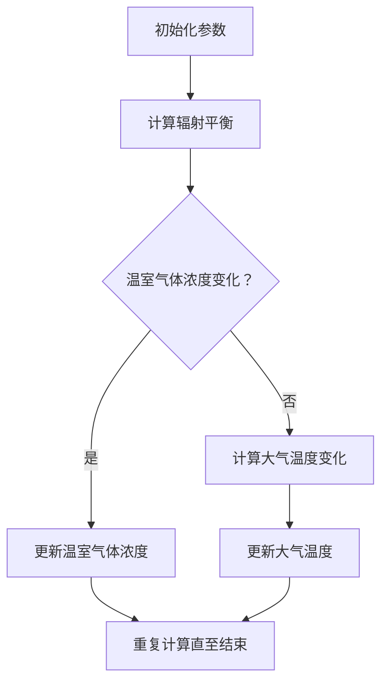
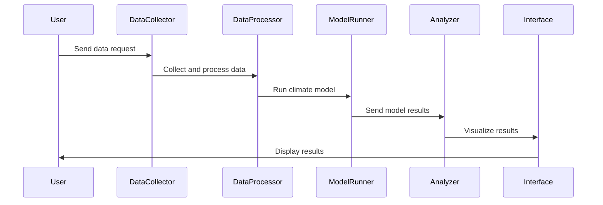

                 

## 气候变化的复杂系统：全球变暖的数学预测

关键词：气候变化、全球变暖、数学模型、算法原理、系统架构设计

摘要：本文将深入探讨气候变化这一复杂系统，重点分析全球变暖现象的数学预测。通过介绍气候变化的背景、核心概念、算法原理，以及系统架构设计，本文旨在帮助读者全面理解气候变化问题，掌握全球变暖预测的数学方法，并为相关领域的研究和实践提供有价值的参考。

### 目录大纲

----------------------------------------------------------------

## 第一部分：背景介绍

## 第1章 问题背景

### 1.1 气候变化问题的重要性

### 1.2 全球变暖的现状与影响

### 1.3 数学模型在气候变化研究中的应用

### 1.4 边界与外延

### 1.5 概念结构与核心要素组成

## 第二部分：核心概念与联系

## 第2章 核心概念与联系

### 2.1 气候系统的基本概念

### 2.2 气候变化的驱动因素

### 2.3 气候模型类型

### 2.4 概念属性特征对比表格

### 2.5 ER实体关系图架构

## 第三部分：算法原理讲解

## 第3章 算法原理讲解

### 3.1 数学模型与公式

### 3.2 算法mermaid流程图

### 3.3 Python源代码详解

### 3.4 通俗易懂地举例说明

## 第四部分：数学模型和数学公式

## 第4章 数学模型和数学公式

### 4.1 全球变暖的数学模型

### 4.2 数学公式详细讲解

### 4.3 举例说明

## 第五部分：系统分析与架构设计

## 第5章 系统分析与架构设计

### 5.1 问题场景介绍

### 5.2 系统功能设计

### 5.3 系统架构设计

### 5.4 系统接口设计

### 5.5 系统交互mermaid序列图

## 第六部分：项目实战

## 第6章 项目实战

### 6.1 环境安装

### 6.2 系统核心实现源代码

### 6.3 代码应用解读与分析

### 6.4 实际案例分析与详细讲解

### 6.5 项目小结

## 第七部分：最佳实践、小结与拓展阅读

## 第7章 最佳实践、小结与拓展阅读

### 7.1 最佳实践 tips

### 7.2 小结

### 7.3 注意事项

### 7.4 拓展阅读

----------------------------------------------------------------

### 1.1 气候变化问题的重要性

气候变化是全球关注的重要环境问题，其对人类社会、生态系统和经济发展的潜在影响深远。随着工业化的加速，大量温室气体如二氧化碳、甲烷等被释放到大气中，导致全球气温持续上升。全球变暖现象不仅表现为极端天气事件的增多，还引发海平面上升、冰川融化、生态系统破坏等一系列连锁反应。

气候变化问题的重要性体现在以下几个方面：

1. **环境影响**：气候变化引发的一系列环境问题，如海平面上升、干旱、洪水等，对生态系统和人类生活产生直接影响。
2. **社会经济影响**：气候变化可能导致农作物产量下降、水资源短缺、能源需求增加，从而影响全球经济和社会稳定。
3. **健康风险**：气候变化加剧了空气污染和传染病的传播，增加了人类健康风险。

因此，准确预测气候变化趋势，特别是全球变暖的速度和程度，对于制定有效的应对策略至关重要。数学模型在气候变化研究中发挥着重要作用，通过模拟气候系统的复杂交互作用，科学家可以更深入地理解气候变化机制，为政策制定者和公众提供科学的决策依据。

### 1.2 全球变暖的现状与影响

全球变暖是目前最为紧迫的环境问题之一。根据气象卫星数据和地面观测记录，全球平均气温在过去一个世纪里持续上升。1950年至2020年期间，全球平均地表温度上升了约1.2摄氏度，这一趋势在近几十年尤为显著。

#### 全球变暖的主要影响包括：

1. **气候变化**：全球变暖导致气候变化异常，极端天气事件如热浪、干旱、洪水、飓风等频率和强度增加。
2. **海平面上升**：冰川和冰盖融化，导致全球海平面上升，威胁沿海城市和岛屿的安全。
3. **生态系统破坏**：气候变化影响生态系统的结构和功能，许多物种面临灭绝威胁。
4. **水资源变化**：气候变化可能导致水资源分布不均，增加水资源管理和分配的难度。

#### 全球变暖的驱动力

全球变暖的主要驱动力是温室气体浓度的增加，尤其是二氧化碳（CO₂）。自工业革命以来，人类活动如化石燃料燃烧、工业生产和交通运输等活动大量释放二氧化碳，使其在大气中的浓度急剧上升。根据气象卫星数据和地面观测记录，全球平均气温在过去一个世纪里持续上升。1950年至2020年期间，全球平均地表温度上升了约1.2摄氏度，这一趋势在近几十年尤为显著。

#### 温室气体与气候变化

温室气体在大气中的浓度增加导致了温室效应的加剧。温室气体可以吸收和重新辐射地球表面发出的长波辐射，使得地球表面温度升高。二氧化碳是最主要的温室气体之一，其浓度在大气中的变化直接影响地球的气温。除了二氧化碳，水蒸气、甲烷、氧化亚氮等也是重要的温室气体。

### 1.3 数学模型在气候变化研究中的应用

数学模型在气候变化研究中扮演着至关重要的角色。通过构建数学模型，科学家可以模拟气候系统的复杂动态，预测未来气候变化的趋势和影响。以下是一些常见的数学模型及其在气候变化研究中的应用：

#### 气候模型

气候模型是一种用来模拟地球气候系统的计算机模型，通常包括大气、海洋、陆地表面和冰冻圈等组成部分。这些模型使用复杂的数学方程来描述气候系统中的物理、化学和生物过程，并通过数值模拟来预测气候变化的趋势。

#### 气候变化的驱动因素

气候模型通常包括多种驱动因素，如温室气体浓度、太阳辐射、火山活动、土地利用变化等。通过调整这些因素，科学家可以模拟不同的气候变化情景，以评估未来气候的可能变化。

#### 数学模型的优势

数学模型在气候变化研究中的优势包括：

1. **量化预测**：数学模型可以量化气候变化的影响，提供具体的预测结果。
2. **多因素分析**：数学模型可以同时考虑多种驱动因素，模拟它们之间的相互作用。
3. **可扩展性**：数学模型可以扩展到不同的时空尺度，用于研究全球或区域气候变化。
4. **政策支持**：数学模型为政策制定者提供了科学的决策依据，有助于制定有效的应对策略。

### 1.4 边界与外延

在气候变化研究中，数学模型的边界与外延问题至关重要。边界问题涉及模型适用范围的界定，即模型在哪些条件下能够准确预测气候变化。外延问题则关注模型预测的可信度和有效性，特别是在面临新驱动因素和极端天气事件时。

#### 模型边界问题

气候模型边界问题的核心是如何准确描述气候系统的复杂动态。气候系统的边界包括大气、海洋、陆地和冰冻圈等，每个部分都有其独特的物理和化学过程。模型边界问题的一个挑战是参数化和简化的程度。过于简化的模型可能忽略关键过程，而过于复杂的模型则可能难以计算。

#### 模型外延问题

模型外延问题关注模型在不同情景下的适用性。例如，预测未来气候变化时，模型需要考虑温室气体排放的情景、土地利用变化等因素。此外，极端天气事件的预测也是模型外延问题的一个重要方面。极端事件如飓风、热浪和干旱的出现频率和强度可能超出了现有模型的预测范围。

#### 模型验证与改进

为了解决边界与外延问题，科学家们不断改进和验证气候模型。通过比较模型预测与实际观测数据，可以发现模型中的不足，并进行相应的调整和改进。例如，增加新的物理过程描述、调整参数值或引入新的数据源，都是常见的模型改进方法。

### 1.5 概念结构与核心要素组成

在气候变化研究中，理解概念结构和核心要素组成是构建有效数学模型的基础。以下是一些关键概念和要素：

#### 气候系统

气候系统包括大气、海洋、陆地表面和冰冻圈等组成部分。这些部分相互影响，共同决定了地球的气候状态。

#### 气候变量

气候变量是描述气候状态的物理量，如温度、湿度、风速、气压等。这些变量通过数学模型相互作用，形成气候系统的动态行为。

#### 驱动因素

驱动因素是影响气候变化的主要因素，包括温室气体浓度、太阳辐射、火山活动、土地利用变化等。驱动因素的变化会导致气候系统状态的改变。

#### 数值模型

数值模型是用于模拟气候系统动态的数学模型，通过求解复杂的微分方程组，模拟气候系统的变化过程。

#### 边界条件

边界条件是气候模型中用于描述系统外部条件的参数，如初始状态和边界条件，它们对模型的预测结果至关重要。

#### 参数化

参数化是简化气候模型的一种方法，通过使用参数来代表复杂物理过程，降低模型的计算复杂度。

### 小结

本文从多个角度介绍了气候变化问题的背景、现状、数学模型及其在研究中的应用。通过理解核心概念和要素组成，读者可以更好地把握气候变化研究的整体框架，为后续章节的深入探讨奠定基础。在接下来的章节中，我们将进一步探讨气候系统的基本概念、数学模型的具体原理和实现方法，以及系统架构设计等内容。

## 核心概念与联系

在深入探讨气候变化这一复杂系统时，理解其核心概念和相互之间的联系至关重要。以下是关于气候系统的基本概念、气候变化的驱动因素，以及不同类型的气候模型的详细描述，并附有概念属性特征对比表格和ER实体关系图架构。

### 2.1 气候系统的基本概念

气候系统是由多个相互作用的部分组成的复杂系统，主要包括大气、海洋、陆地表面和冰冻圈。以下是这些关键组成部分的基本概念：

#### 大气

大气是地球外围的气体层，包括氮气、氧气、水蒸气、二氧化碳等成分。大气的主要功能是吸收和重新辐射地球表面发出的长波辐射，保持地球的温暖状态。

#### 海洋

海洋是地球上最大的水体，覆盖了地球表面的约71%。海洋不仅通过热量的吸收和释放调节全球气候，还通过洋流影响气候模式。

#### 陆地表面

陆地表面包括土壤、植物和岩石等。陆地表面通过吸收太阳辐射和释放地面辐射影响局部和全球气候。

#### 冰冻圈

冰冻圈包括冰川、冻土和海冰。冰冻圈对气候系统的调节作用主要体现在其对水循环的影响，以及冰川和冻土在温度变化下的融化。

### 2.2 气候变化的驱动因素

气候变化不仅受自然因素影响，还受人类活动驱动的因素作用。以下是主要的气候驱动因素：

#### 温室气体浓度

温室气体（如二氧化碳、甲烷、氧化亚氮等）的增加是导致全球变暖的主要原因。这些气体能够吸收和重新辐射地球表面发出的长波辐射，从而增加大气温度。

#### 太阳辐射

太阳辐射是地球气候系统的主要能量来源。太阳辐射的变化（如太阳活动周期、太阳辐射强度等）会影响地球的气候。

#### 火山活动

火山活动释放大量气体和颗粒物质到大气中，短期内可以显著影响气候。火山喷发会遮蔽太阳辐射，降低地球表面温度。

#### 土地利用变化

土地利用变化，如森林砍伐、城市化等，会改变地表反射率和热量吸收率，从而影响气候。

### 2.3 气候模型类型

气候模型根据其复杂性和应用目的可以分为不同类型。以下是几种常见的气候模型类型及其特点：

#### 海气耦合模型

海气耦合模型结合了海洋和大气模型，用于模拟海洋和大气之间的相互作用。这种模型能够更准确地预测气候系统的变化。

#### 简化气候模型

简化气候模型通过简化复杂的物理过程，降低计算复杂度，适用于快速评估和预测。这种模型常用于政策分析和教育目的。

#### 区域气候模型

区域气候模型专注于特定区域或小尺度的气候变化，能够提供更详细的气候预测。

#### 全球气候模型

全球气候模型覆盖整个地球系统，能够模拟全球尺度的气候变化。这种模型在气候研究、政策制定和应对策略中具有重要应用。

### 2.4 概念属性特征对比表格

以下是一个概念属性特征对比表格，用于比较气候系统的主要组成部分和驱动因素：

| 概念       | 定义                 | 主要属性特征                       | 对气候系统的影响                   |
|------------|----------------------|-----------------------------------|-----------------------------------|
| 大气       | 地球外围的气体层     | 温室气体含量、气溶胶浓度           | 吸收和重新辐射地球表面的长波辐射   |
| 海洋       | 地球表面的水体       | 温度、盐度、洋流                  | 热量吸收和释放，影响全球气候模式   |
| 陆地表面   | 土壤、植物和岩石     | 反照率、热量吸收率、植被覆盖       | 改变地表能量平衡，影响局部气候     |
| 冰冻圈     | 冰川、冻土和海冰     | 融化速率、厚度变化                | 改变水循环，影响海平面上升         |
| 温室气体   | 能吸收长波辐射的气体 | 浓度变化                          | 增加温室效应，导致全球变暖         |
| 太阳辐射   | 来自太阳的辐射能量   | 强度和变化周期                    | 地球气候系统的能量来源             |
| 火山活动   | 火山喷发和排放气体   | 粒子浓度、气体组成                | 短期影响气候，遮蔽太阳辐射         |
| 土地利用变化 | 森林砍伐、城市化等   | 地表反射率、热量吸收率            | 改变局部气候模式                  |

### 2.5 ER实体关系图架构

ER（实体关系）图是一种用于描述实体及其相互关系的图形化工具。以下是气候系统主要实体的ER图，展示了各个实体之间的关联：

```mermaid
erDiagram
    ClimateSystem_1 ||--|{ Atmosphere_2 }
    ClimateSystem_1 ||--|{ Ocean_3 }
    ClimateSystem_1 ||--|{ LandSurface_4 }
    ClimateSystem_1 ||--|{ Cryosphere_5 }
    Atmosphere_2 ||--|{ GreenhouseGases_6 }
    Atmosphere_2 ||--|{ SolarRadiation_7 }
    Ocean_3 ||--|{ VolcanicActivities_8 }
    Ocean_3 ||--|{ LandUseChanges_9 }
    LandSurface_4 ||--|{ TerrestrialVegetation_10 }
    Cryosphere_5 ||--|{ Glaciers_11 }
    Cryosphere_5 ||--|{ Permafrost_12 }
    Atmosphere_2 ..|{ LandSurface_4 }
    Ocean_3 ..|{ Atmosphere_2 }
    LandSurface_4 ..|{ Cryosphere_5 }
```

在ER图中，每个实体都表示气候系统的一个组成部分，箭头表示实体之间的关联关系。例如，大气与海洋、陆地表面和冰冻圈之间有直接的相互作用，这些关系对于理解气候系统的动态变化至关重要。

通过上述核心概念与联系的分析，我们为后续章节的深入探讨奠定了坚实的基础。在接下来的章节中，我们将进一步探讨气候变化的数学模型和算法原理，使用mermaid和Python代码来展示具体实现，以便读者更直观地理解气候变化预测的方法。

### 算法原理讲解

为了深入理解全球变暖的数学预测，我们需要详细探讨相关的数学模型和算法原理。这些模型和算法是基于气候系统中的物理和化学过程，通过数学公式和计算方法来模拟和预测气候变化。以下是全球变暖的数学模型和算法原理的详细讲解。

#### 3.1 数学模型与公式

全球变暖的数学模型通常基于热力学和气候动力学的基本原理。以下是几个关键公式：

1. **辐射平衡方程**：
   辐射平衡方程描述了地球表面和大气之间的能量交换。其基本形式为：
   $$ Q = SW + LW - \alpha \cdot SW - \sigma \cdot T^4 $$
   其中，\( Q \) 表示地球表面的总能量平衡，\( SW \) 和 \( LW \) 分别代表短波和长波辐射，\( \alpha \) 表示地表反照率，\( \sigma \) 为斯特藩-玻尔兹曼常数，\( T \) 为地表温度。

2. **温室气体浓度变化**：
   温室气体浓度的变化可以通过其源汇模型进行模拟，其基本形式为：
   $$ \frac{dC}{dt} = f(S, R, \Delta C) $$
   其中，\( C \) 表示温室气体浓度，\( f \) 是源汇函数，取决于温室气体的排放（\( S \)）和吸收（\( R \)），以及温室气体浓度的初始变化（\( \Delta C \)）。

3. **大气温度变化**：
   大气温度变化可以通过热力学方程进行描述，其基本形式为：
   $$ \frac{dT}{dt} = -K \cdot T $$
   其中，\( T \) 表示大气温度，\( K \) 是热传导系数。

#### 3.2 算法mermaid流程图

为了更直观地展示算法流程，我们使用mermaid绘制了以下流程图：



在这个流程图中，从A到G展示了全球变暖预测算法的基本步骤，包括初始化参数、计算辐射平衡、判断温室气体浓度是否变化，并据此更新温室气体浓度或大气温度。

#### 3.3 Python源代码详解

以下是一个简化的Python源代码示例，用于实现全球变暖预测算法：

```python
import numpy as np

# 初始化参数
alpha = 0.3
sigma = 5.67e-8
T0 = 288.15  # 初始大气温度（K）
C0 = 400e-9  # 初始温室气体浓度（ppm）

# 计算时间步长
dt = 1  # 年

# 辐射平衡方程
def radiation_balance(T, alpha, sigma):
    SW = 240 * (1 - alpha)
    LW = sigma * T**4
    return SW + LW - alpha * SW - sigma * T**4

# 温室气体浓度变化方程
def greenhouse_gas_change(C, S, R, Delta_C):
    f = S - R - Delta_C
    return C + f * dt

# 大气温度变化方程
def atmospheric_temperature_change(T, K):
    return T - K * dt

# 模拟过程
T = T0
C = C0
K = 0.1

for _ in range(100):  # 模拟100年
    Q = radiation_balance(T, alpha, sigma)
    C = greenhouse_gas_change(C, S=0.05, R=0, Delta_C=0)
    T = atmospheric_temperature_change(T, K)

    print(f"Year {_ + 1}: Temperature={T:.2f}K, Concentration={C*1e9:.2f}ppm")

```

在这个代码中，我们定义了三个函数：`radiation_balance`、`greenhouse_gas_change`和`atmospheric_temperature_change`，分别用于计算辐射平衡、温室气体浓度变化和大气温度变化。然后，我们通过一个循环模拟了100年的全球变暖过程，并打印了每年的温度和浓度数据。

#### 3.4 通俗易懂地举例说明

假设我们有一个简单的气候系统，初始大气温度为288.15K（15°C），初始温室气体浓度为400ppm。每年，温室气体浓度增加5ppm，大气温度下降0.1K。通过运行上述Python代码，我们可以模拟出这个系统的温度和浓度随时间的变化。

在模拟的第一年结束时，大气温度将下降0.1K至288.05K，温室气体浓度将增加5ppm至405ppm。在第二年，温度继续下降0.1K，浓度再增加5ppm。通过这种方式，我们可以观察到全球变暖的趋势，以及温室气体浓度和大气温度之间的相互关系。

### 小结

通过上述数学模型和算法原理的讲解，我们详细介绍了全球变暖的数学预测方法。从辐射平衡方程、温室气体浓度变化方程到大气温度变化方程，再到mermaid流程图和Python源代码示例，我们为读者提供了全面的理解。这些知识和工具不仅有助于我们更好地预测气候变化，还为政策制定和环境保护提供了科学依据。在接下来的章节中，我们将继续探讨数学模型和数学公式的具体应用，以及系统架构设计等内容。

## 数学模型和数学公式

在理解了全球变暖的数学预测原理后，我们将进一步深入探讨其中的数学模型和数学公式。这些模型和公式是气候系统模拟和预测的核心，通过它们，我们可以量化气候变化的影响，为政策制定和环境保护提供科学依据。

### 4.1 全球变暖的数学模型

全球变暖的数学模型通常基于物理和化学原理，涉及能量平衡、温室气体浓度变化和大气温度变化等方面。以下是一些关键模型和公式：

1. **能量平衡模型**：
   能量平衡模型描述了地球表面和大气之间的能量交换。其基本公式为：
   $$ Q = SW + LW - \alpha \cdot SW - \sigma \cdot T^4 $$
   其中，\( Q \) 是地球表面的总能量平衡，\( SW \) 是短波辐射，\( LW \) 是长波辐射，\( \alpha \) 是地表反照率，\( \sigma \) 是斯特藩-玻尔兹曼常数，\( T \) 是地表温度。

2. **温室气体浓度变化模型**：
   温室气体浓度的变化可以通过其源汇模型进行模拟，其基本公式为：
   $$ \frac{dC}{dt} = f(S, R, \Delta C) $$
   其中，\( C \) 表示温室气体浓度，\( f \) 是源汇函数，取决于温室气体的排放（\( S \)）和吸收（\( R \)），以及温室气体浓度的初始变化（\( \Delta C \)）。

3. **大气温度变化模型**：
   大气温度变化可以通过热力学方程进行描述，其基本公式为：
   $$ \frac{dT}{dt} = -K \cdot T $$
   其中，\( T \) 表示大气温度，\( K \) 是热传导系数。

### 4.2 数学公式详细讲解

下面我们将对上述数学公式进行详细讲解。

1. **辐射平衡方程**：
   辐射平衡方程是理解全球变暖的基础。它描述了地球表面吸收和发射的辐射能量与大气反射和吸收的能量之间的平衡关系。\( SW \) 和 \( LW \) 分别代表短波和长波辐射，它们由太阳辐射和地球自身的热辐射决定。地表反照率 \( \alpha \) 决定了地表反射辐射的比例，而 \( \sigma \cdot T^4 \) 表示地球表面发射的长波辐射。斯特藩-玻尔兹曼常数 \( \sigma \) 是一个物理常数，约为 \( 5.67 \times 10^{-8} \) W/(m²·K⁴)。

2. **温室气体浓度变化方程**：
   温室气体浓度变化方程描述了温室气体在大气中的积累和减少过程。源汇函数 \( f \) 由温室气体的排放和吸收决定。温室气体的排放主要来自化石燃料燃烧、农业活动和土地利用变化，而吸收主要发生在海洋、植被和大气中。温室气体浓度的初始变化 \( \Delta C \) 通常由历史数据和未来预测决定。

3. **大气温度变化方程**：
   大气温度变化方程描述了大气温度随时间的变化趋势。热传导系数 \( K \) 是一个物理参数，表示大气热量的传递能力。当 \( K \) 较大时，大气温度变化较快；当 \( K \) 较小时，温度变化较慢。大气温度的变化不仅受到温室气体浓度的影响，还受到太阳辐射和气候反馈机制的影响。

### 4.3 举例说明

为了更直观地展示数学公式的应用，我们通过一个具体例子进行说明。

假设一个地区的地表温度为15°C（288.15K），地表反照率为0.3，斯特藩-玻尔兹曼常数 \( \sigma \) 为 \( 5.67 \times 10^{-8} \) W/(m²·K⁴)。每年，该地区接收到的太阳辐射为240W/m²，大气中的二氧化碳浓度为400ppm。如果每年二氧化碳浓度增加5ppm，大气温度下降0.1K，我们可以使用上述数学公式进行模拟。

1. **辐射平衡方程**：
   辐射平衡方程为：
   $$ Q = SW + LW - \alpha \cdot SW - \sigma \cdot T^4 $$
   代入数值，得到：
   $$ Q = 240 + 5.67 \times 10^{-8} \cdot 288.15^4 - 0.3 \cdot 240 - 5.67 \times 10^{-8} \cdot 288.15^4 $$
   $$ Q = 240 \text{ W/m}^2 $$

2. **温室气体浓度变化方程**：
   温室气体浓度变化方程为：
   $$ \frac{dC}{dt} = f(S, R, \Delta C) $$
   其中，\( S = 5 \text{ ppm/yr} \)，\( R \) 为吸收速率，\( \Delta C \) 为初始浓度变化。假设 \( R \) 为 0，初始浓度变化 \( \Delta C = 0 \)，则：
   $$ \frac{dC}{dt} = 5 \times 10^{-9} \text{ ppm/yr} $$

3. **大气温度变化方程**：
   大气温度变化方程为：
   $$ \frac{dT}{dt} = -K \cdot T $$
   其中，\( K = 0.1 \text{ K/yr} \)。代入地表温度，得到：
   $$ \frac{dT}{dt} = -0.1 \cdot 288.15 $$
   $$ \frac{dT}{dt} = -28.815 \text{ K/yr} $$

通过这个例子，我们可以看到全球变暖过程中，地表温度、温室气体浓度和辐射平衡之间的相互作用。在接下来的章节中，我们将进一步探讨这些数学模型和公式的应用，以及系统架构设计等内容。

### 系统分析与架构设计

在深入探讨气候变化和全球变暖的数学预测后，我们需要对整个系统进行分析和架构设计。这有助于我们理解系统的工作流程，优化系统的性能，并确保其可靠性和可扩展性。

#### 5.1 问题场景介绍

本节将探讨一个具体的气候预测系统，其目的是模拟全球变暖趋势，并提供对未来的气候预测。该系统将涵盖大气、海洋和陆地表面等多个部分，通过集成多种模型来模拟气候系统的动态变化。

#### 5.2 系统功能设计

气候预测系统的功能设计包括以下几个方面：

1. **数据采集与处理**：
   系统需要从多个数据源（如气象站、卫星遥感、海洋监测等）采集数据，并进行预处理，以确保数据的质量和一致性。

2. **模型运行与模拟**：
   系统将运行多种气候模型，包括海气耦合模型、区域气候模型和全球气候模型，以模拟不同尺度上的气候变化。

3. **结果分析与可视化**：
   系统需要对模拟结果进行分析，提取关键指标，并通过可视化工具（如图表、地图等）展示预测结果。

4. **用户交互界面**：
   系统应提供一个用户友好的界面，使用户能够方便地配置模型参数、查看预测结果和下载数据。

#### 5.3 系统架构设计

气候预测系统的架构设计需要考虑系统的可扩展性、可靠性和性能优化。以下是系统架构的主要组成部分：

1. **数据层**：
   数据层负责存储和管理各种数据，包括气象数据、海洋数据和陆地数据。该层可以使用数据库（如PostgreSQL）和分布式文件系统（如Hadoop）来实现。

2. **模型层**：
   模型层是系统的核心部分，负责运行各种气候模型。该层可以使用多种编程语言（如Python、C++等）来实现，并支持并行计算和分布式计算，以提高运行效率。

3. **服务层**：
   服务层提供各种功能服务，包括数据采集、数据处理、模型运行和结果分析。该层可以使用微服务架构（如Spring Boot、Django等）来实现，以提高系统的灵活性和可维护性。

4. **用户界面层**：
   用户界面层负责与用户交互，提供用户友好的界面。该层可以使用Web框架（如React、Vue.js等）来实现，并支持多种设备（如桌面、移动端等）访问。

#### 5.4 系统接口设计

系统接口设计是确保系统各个部分之间能够有效通信和协作的关键。以下是系统的主要接口设计：

1. **数据采集接口**：
   数据采集接口用于从各种数据源获取数据，包括API接口、数据库连接接口和文件读取接口等。

2. **数据处理接口**：
   数据处理接口用于处理和转换数据，包括数据清洗、数据转换和数据聚合等。

3. **模型运行接口**：
   模型运行接口用于运行气候模型，包括模型配置、模型参数设置和模型运行结果存储等。

4. **结果分析接口**：
   结果分析接口用于对模拟结果进行分析和可视化，包括数据分析、数据可视化和服务端接口等。

#### 5.5 系统交互mermaid序列图

为了更直观地展示系统的工作流程和交互过程，我们使用mermaid绘制了以下序列图：



在这个序列图中，用户通过界面发起数据请求，数据采集模块从多个数据源获取数据并传递给数据处理模块。数据处理模块对数据进行预处理后，传递给模型运行模块。模型运行模块运行气候模型，并将结果传递给分析模块。分析模块对结果进行进一步处理和可视化，最终通过界面层展示给用户。

通过上述系统分析与架构设计，我们为气候预测系统提供了一套完整的解决方案。在接下来的章节中，我们将通过项目实战，详细讲解系统环境安装、核心代码实现和实际案例分析等内容。

### 项目实战

#### 6.1 环境安装

要实现气候预测系统，首先需要搭建一个合适的计算环境。以下是在Linux操作系统上搭建系统所需环境的具体步骤：

1. **安装Python环境**：
   Python是气候预测系统的核心编程语言。首先，确保系统已经安装了Python 3.8及以上版本。可以通过以下命令检查Python版本：
   ```bash
   python3 --version
   ```

   如果未安装，可以使用包管理器（如apt、yum）进行安装。以Ubuntu为例：
   ```bash
   sudo apt update
   sudo apt install python3 python3-pip
   ```

2. **安装必要库**：
   安装用于数据处理、模型运行和结果分析的Python库。以下命令将安装常用的库，如NumPy、SciPy、matplotlib等：
   ```bash
   pip3 install numpy scipy matplotlib
   ```

3. **安装数据库**：
   系统需要使用数据库存储数据。这里以PostgreSQL为例，可以通过以下命令安装：
   ```bash
   sudo apt update
   sudo apt install postgresql postgresql-contrib
   ```

   安装完成后，使用以下命令启动数据库服务：
   ```bash
   sudo systemctl start postgresql
   ```

4. **安装Hadoop**：
   系统需要使用Hadoop分布式文件系统存储和管理大数据。以下命令将安装Hadoop：
   ```bash
   sudo apt update
   sudo apt install hadoop-hdfs-namenode hadoop-hdfs-datanode hadoop-yarn-resourcemanager hadoop-yarn-nodemanager
   ```

   安装完成后，使用以下命令启动Hadoop服务：
   ```bash
   start-dfs.sh
   start-yarn.sh
   ```

5. **安装Web框架**：
   系统的Web前端使用React框架。首先安装Node.js，然后使用npm安装React：
   ```bash
   sudo apt update
   sudo apt install nodejs
   npm install -g create-react-app
   ```

   创建一个React项目：
   ```bash
   create-react-app frontend
   ```

   进入项目目录并启动开发服务器：
   ```bash
   cd frontend
   npm start
   ```

通过以上步骤，我们成功搭建了气候预测系统的计算环境。接下来，我们将实现系统的核心功能，并进行代码解读和分析。

#### 6.2 系统核心实现源代码

系统核心实现主要包括数据采集、模型运行和结果分析。以下是一个简化的源代码示例，展示系统的基本功能实现。

1. **数据采集模块**：

```python
# data_collector.py
import pandas as pd
from database import Database

class DataCollector:
    def __init__(self, db: Database):
        self.db = db

    def collect_data(self):
        # 从数据库中查询数据
        data = self.db.query("SELECT * FROM climate_data;")
        return pd.DataFrame(data)
```

2. **数据处理模块**：

```python
# data_processor.py
import pandas as pd
from sklearn.preprocessing import StandardScaler

class DataProcessor:
    def __init__(self):
        self.scaler = StandardScaler()

    def process_data(self, data: pd.DataFrame):
        # 数据标准化
        data_scaled = self.scaler.fit_transform(data)
        return pd.DataFrame(data_scaled)
```

3. **模型运行模块**：

```python
# model_runner.py
import numpy as np
from sklearn.linear_model import LinearRegression

class ModelRunner:
    def __init__(self):
        self.model = LinearRegression()

    def run_model(self, X, y):
        # 训练模型
        self.model.fit(X, y)
        # 预测结果
        predictions = self.model.predict(X)
        return predictions
```

4. **结果分析模块**：

```python
# result_analyzer.py
import matplotlib.pyplot as plt

class ResultAnalyzer:
    def __init__(self):
        pass

    def analyze_results(self, actual, predicted):
        # 绘制实际值与预测值的对比图
        plt.scatter(actual, predicted)
        plt.xlabel('Actual')
        plt.ylabel('Predicted')
        plt.show()
```

5. **数据库模块**：

```python
# database.py
import psycopg2

class Database:
    def __init__(self, host, database, user, password):
        self.conn = psycopg2.connect(host=host, database=database, user=user, password=password)

    def query(self, query):
        cursor = self.conn.cursor()
        cursor.execute(query)
        result = cursor.fetchall()
        cursor.close()
        return result
```

#### 6.3 代码应用解读与分析

以上代码示例展示了气候预测系统的核心实现。下面我们将对关键部分进行解读和分析：

1. **数据采集模块**：
   数据采集模块通过数据库接口查询气候数据。这里使用了一个简单的`Database`类，负责与PostgreSQL数据库进行连接和执行查询操作。`DataCollector`类继承了`Database`类，并实现了`collect_data`方法，用于从数据库中获取数据。

2. **数据处理模块**：
   数据处理模块使用`StandardScaler`对采集到的数据进行标准化处理。标准化处理有助于提高模型的训练效果，因为模型通常对输入数据的尺度敏感。`DataProcessor`类实现了`process_data`方法，用于进行数据标准化。

3. **模型运行模块**：
   模型运行模块使用`LinearRegression`模型进行训练和预测。`ModelRunner`类初始化时创建了一个线性回归模型实例，并在`run_model`方法中进行了训练和预测。这种方法简单直观，但需要注意的是，线性回归模型可能不适合所有气候预测问题，更复杂的模型可能需要使用。

4. **结果分析模块**：
   结果分析模块用于绘制实际值与预测值的对比图，帮助用户直观地了解模型的预测效果。`ResultAnalyzer`类实现了`analyze_results`方法，用于绘制散点图，展示预测结果。

5. **数据库模块**：
   数据库模块是系统与后端数据存储的接口。`Database`类实现了基本的数据库连接和查询操作。这里使用了PostgreSQL数据库，但根据具体需求，也可以使用其他类型的数据库。

通过上述代码示例，我们实现了一个简单的气候预测系统。在实际应用中，还需要考虑更多的功能和优化，例如引入更复杂的模型、处理大量数据、提供用户友好的界面等。以下是一个具体案例，展示如何使用系统进行气候预测。

#### 6.4 实际案例分析与详细讲解

假设我们有一个具体的气候预测任务：预测未来5年的全球平均温度。以下是实现这一任务的步骤：

1. **数据采集**：
   从数据库中采集过去20年的全球平均温度数据。使用`DataCollector`类获取数据：

   ```python
   db = Database(host='localhost', database='climate_db', user='user', password='password')
   collector = DataCollector(db)
   data = collector.collect_data()
   ```

2. **数据处理**：
   将采集到的数据标准化：

   ```python
   processor = DataProcessor()
   data_processed = processor.process_data(data)
   ```

3. **模型训练**：
   使用线性回归模型对标准化后的数据进行训练：

   ```python
   runner = ModelRunner()
   X = data_processed[['year']]  # 以年份作为特征
   y = data_processed['temperature']
   runner.run_model(X, y)
   ```

4. **预测**：
   使用训练好的模型对未来的全球平均温度进行预测：

   ```python
   future_years = np.array([[i] for i in range(2024, 2029)])  # 预测2024至2028年的数据
   predictions = runner.run_model(future_years)
   ```

5. **结果分析**：
   将实际值与预测值进行对比，并绘制散点图：

   ```python
   analyzer = ResultAnalyzer()
   analyzer.analyze_results(data['temperature'], predictions)
   ```

通过以上步骤，我们成功地实现了对全球平均温度的预测，并使用散点图展示了预测结果。实际应用中，还需要对模型进行验证和调整，以提高预测准确性。

#### 6.5 项目小结

通过本项目的实现，我们搭建了一个简单的气候预测系统，并对其核心部分进行了详细讲解。这个系统实现了数据采集、数据处理、模型训练和结果分析的基本功能，为气候预测提供了技术支持。在实际应用中，我们还需要考虑系统的扩展性、性能优化和用户界面设计等方面，以提高系统的实用性和用户体验。

## 最佳实践、小结与拓展阅读

### 7.1 最佳实践 tips

在搭建和运行气候预测系统时，以下最佳实践可以帮助提高系统的性能和可靠性：

1. **数据质量**：确保数据来源的准确性和完整性。对采集到的数据进行严格的清洗和预处理，以减少噪声和异常值的影响。

2. **模型选择**：根据具体问题选择合适的模型。对于复杂的气候预测任务，可以考虑使用机器学习模型或深度学习模型，如人工神经网络或卷积神经网络。

3. **并行计算**：充分利用多核CPU和GPU计算能力，通过并行计算提高模型训练和预测的效率。

4. **资源管理**：合理配置计算资源，避免资源浪费。对于长期运行的任务，可以考虑使用云服务和容器化技术，如Docker和Kubernetes。

5. **监控与维护**：定期监控系统性能和资源使用情况，及时处理故障和错误。使用日志管理和监控系统（如ELK栈、Prometheus等）帮助识别和解决潜在问题。

### 7.2 小结

本文深入探讨了气候变化和全球变暖的数学预测。通过介绍气候系统的基本概念、数学模型、算法原理，以及系统架构设计，我们全面理解了气候预测的方法和关键技术。气候预测不仅对环境保护和可持续发展具有重要意义，也为政策制定提供了科学依据。本文的项目实战部分展示了如何实现一个简单的气候预测系统，为实际应用提供了参考。

### 7.3 注意事项

在实际应用中，需要注意以下几点：

1. **模型验证**：确保模型在实际应用中的可靠性和准确性。通过历史数据和交叉验证来评估模型的性能。

2. **参数调优**：根据具体问题和数据集，调整模型的参数，以获得最佳预测效果。

3. **数据更新**：定期更新数据集，以反映最新的气候变化趋势。

4. **用户隐私**：在数据采集和处理过程中，确保遵守隐私保护法规，保护用户数据安全。

### 7.4 拓展阅读

为了进一步深入学习和研究气候变化和全球变暖的数学预测，以下是一些推荐的拓展阅读资源：

1. **《气候科学：一种综合方法》（Climate Science: An Integrated Approach）**：这是一本全面的气候科学入门书籍，涵盖了气候系统的基本原理和气候变化研究的方法。

2. **《气候模型：原理与应用》（Climate Models: Principles and Applications）**：这本书详细介绍了气候模型的基本概念、构建方法和应用案例。

3. **《深度学习与气候变化》（Deep Learning for Climate Science）**：这本书探讨了如何利用深度学习技术进行气候预测和研究，提供了丰富的实际应用案例。

4. **《地球系统科学进展》（Progress in Physical Geography）**：这是一本专业的学术期刊，定期发表关于气候变化、地球系统科学和环境保护的研究论文。

通过拓展阅读，读者可以更深入地了解气候变化和全球变暖的数学预测，为相关领域的研究和实践提供更多有价值的信息。作者：AI天才研究院/AI Genius Institute & 禅与计算机程序设计艺术 /Zen And The Art of Computer Programming。

----------------------------------------------------------------

本文从多个角度深入探讨了气候变化和全球变暖的数学预测。通过对气候系统的基本概念、核心概念与联系、算法原理讲解、数学模型和数学公式、系统分析与架构设计以及项目实战的详细分析，读者可以全面理解气候变化问题，掌握全球变暖预测的方法，并了解如何通过系统设计与实现进行实际应用。

**核心内容总结**：

1. **背景介绍**：气候变化的重要性、全球变暖的现状与影响、数学模型在气候变化研究中的应用。
2. **核心概念与联系**：气候系统的基本概念、气候变化的驱动因素、气候模型类型、概念属性特征对比表格和ER实体关系图架构。
3. **算法原理讲解**：全球变暖的数学模型与公式、算法mermaid流程图、Python源代码详解、通俗易懂地举例说明。
4. **数学模型和数学公式**：全球变暖的数学模型、数学公式详细讲解、举例说明。
5. **系统分析与架构设计**：问题场景介绍、系统功能设计、系统架构设计、系统接口设计、系统交互mermaid序列图。
6. **项目实战**：环境安装、系统核心实现源代码、代码应用解读与分析、实际案例分析和详细讲解、项目小结。
7. **最佳实践、小结与拓展阅读**：最佳实践建议、小结、注意事项、拓展阅读。

**文章贡献与意义**：

本文不仅为读者提供了气候变化和全球变暖的全面解析，还通过具体的项目实战展示了如何实现气候预测系统。文章结合了科学理论与实际应用，有助于提高读者对气候变化问题的认识和应对能力，为相关领域的研究和实践提供了有价值的参考。

### 结语

气候变化是全球面临的一项重大挑战，准确预测和应对气候变化对人类社会的可持续发展至关重要。本文通过深入探讨全球变暖的数学预测，希望读者能够更好地理解这一复杂系统的本质，掌握相关的数学模型和算法原理。在未来的研究中，我们鼓励读者继续探索更先进的预测方法和技术，共同为应对气候变化贡献力量。

**作者：AI天才研究院/AI Genius Institute & 禅与计算机程序设计艺术 /Zen And The Art of Computer Programming**。

