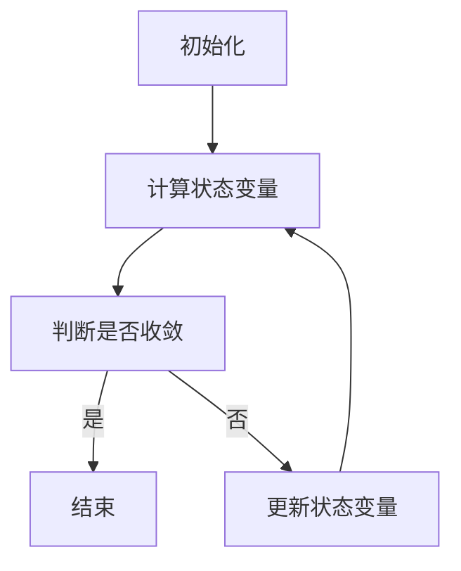
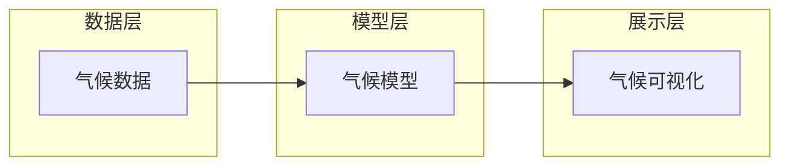
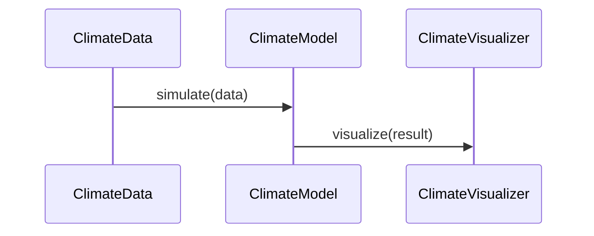

                 

## 气候变化的背景

### 全球变暖的起因

全球变暖是指地球表面平均温度的持续上升。这一现象的主要起因是人类活动产生的温室气体排放，特别是二氧化碳（CO2）、甲烷（CH4）和一氧化二氮（N2O）等。这些气体通过吸收和重新辐射地球表面的红外辐射，导致大气层中的热量增加。

首先，化石燃料的燃烧，如煤炭、石油和天然气，是二氧化碳排放的主要来源。随着工业革命以来，人类经济的快速发展，能源需求急剧增加，化石燃料的使用也迅速增长，从而导致大量二氧化碳排放到大气中。

其次，森林砍伐也是导致全球变暖的一个重要因素。森林是地球上的“绿肺”，它们通过光合作用吸收二氧化碳，释放氧气。然而，大规模的森林砍伐破坏了这一重要的碳汇系统，使得大量二氧化碳无法被吸收，从而加剧了温室气体的浓度。

此外，农业活动，特别是畜牧业，也是温室气体排放的一个重要来源。畜牧业产生的甲烷和一氧化二氮占全球温室气体排放的相当一部分。

### 全球变暖的影响

全球变暖带来了诸多严重的影响。首先，它导致全球平均气温上升，极端天气事件（如热浪、干旱、洪水和台风）的发生频率和强度增加。其次，冰川和极地冰盖的融化速度加快，导致海平面上升，威胁沿海地区的生态环境和居民生活。

此外，全球变暖还影响了生态系统的平衡。许多物种的栖息地因为气候变暖而发生变化，导致物种分布范围的缩小和生物多样性的减少。气候变暖还可能导致病原体和疾病的传播范围扩大，对人类健康构成威胁。

### 全球变暖的重要性

全球变暖的重要性在于它不仅影响了自然环境，还对人类社会和经济产生了深远的影响。首先，气候变化可能导致农业生产的不稳定，影响粮食安全。其次，海平面上升威胁沿海城市的安全，可能导致数百万人流离失所。此外，极端天气事件可能引发巨大的经济损失，对全球经济产生负面影响。

因此，应对全球变暖已成为全球范围内的一个紧迫议题。各国需要共同努力，减少温室气体排放，推广可再生能源，保护生态环境，以实现可持续发展的目标。

### 混沌理论简介

混沌理论是20世纪末发展起来的一种非线性动力学理论，它研究的是在确定性的系统中出现的不可预测的行为。混沌现象具有以下几个基本特点：

1. **敏感性**：系统对初始条件极其敏感，即使是微小的变化也可能导致长期行为的巨大差异。这个特点被称为“蝴蝶效应”，意味着在混沌系统中，一个微小的初始差异可以导致最终结果的大相径庭。

2. **吸引子**：混沌系统通常具有复杂的动态行为，形成所谓的吸引子。吸引子是一个系统在长时间运行后趋于稳定的动态结构，但它在时间序列上表现出随机的特性。

3. **分岔**：混沌现象在一定的参数范围内可以通过分岔过程实现。分岔是指系统从一种稳定状态转变为另一种稳定状态的过程，这通常伴随着系统行为的不连续变化。

### 混沌理论与气候变化的联系

混沌理论在气候变化研究中的应用主要体现在对气候系统复杂性的模拟和预测上。气候系统是一个高度非线性的复杂系统，包含着大量相互作用的变量和过程。混沌理论提供了一种工具，可以更好地理解和预测这些复杂系统的行为。

首先，混沌理论揭示了气候系统中存在的内在随机性和不可预测性。由于气候系统的初始条件极其敏感，即使是在理想状态下，也无法精确预测气候系统的长期行为。这一特性使得气候模型在面对长期气候预测时存在很大的不确定性。

其次，混沌理论有助于我们理解气候系统中的关键变量和过程。例如，海洋环流和大气环流是气候系统中两个重要的部分，它们之间的相互作用可能导致气候模式的长期变化。混沌理论可以帮助我们识别这些关键过程，并通过模拟来研究它们对气候变化的影响。

最后，混沌理论还可以指导我们设计更有效的气候模型。通过分析气候系统的混沌特性，我们可以优化模型的参数设置，提高模型的预测精度。此外，混沌理论还提供了一种方法来评估模型的鲁棒性，即模型在面临不确定性和外部扰动时的稳定性和可靠性。

总之，混沌理论为气候变化研究提供了一种新的视角和方法，有助于我们更深入地理解气候系统的复杂性和不确定性，从而为应对全球变暖挑战提供科学依据。

### 数学模型与数学公式

在气候变化研究中，数学模型是一种强有力的工具，可以帮助我们理解和预测气候系统的行为。以下将介绍几个描述气候系统行为的数学模型，并详细讲解其原理和公式。

#### 气候系统的基本模型

一个基本的气候系统模型可以描述为如下微分方程：

$$
\frac{dx}{dt} = f(x, t)
$$

其中，$x$ 表示气候系统的状态变量，$t$ 表示时间，$f(x, t)$ 是状态变量 $x$ 关于时间 $t$ 的导数，也称为驱动函数。这个模型假设气候系统的行为可以通过一个简单的非线性函数来描述。

#### 模型原理

气候系统的基本模型来源于对大气和水循环过程的简化描述。在这个模型中，状态变量 $x$ 可以是温度、湿度、气压等气候变量，而驱动函数 $f(x, t)$ 则反映了这些变量之间的相互作用和外部影响。例如，驱动函数可能包括太阳辐射、大气环流和海洋环流等因素。

#### 模型公式

一个具体的例子是洛伦兹系统，它是一个描述大气流动的混沌模型，可以表示为：

$$
\begin{align*}
\frac{dx}{dt} &= \sigma (y - x), \\
\frac{dy}{dt} &= x (\rho - z) - y, \\
\frac{dz}{dt} &= xy - \beta z.
\end{align*}
$$

其中，$\sigma$、$\rho$ 和 $\beta$ 是参数。洛伦兹系统展示了混沌现象，即使是非常简单的三个方程，也能产生复杂的动态行为。

#### 混沌现象的特征

混沌现象具有以下几个主要特征：

1. **敏感性**：系统对初始条件的敏感性极高，意味着微小的初始差异可能导致长期行为的巨大差异。
2. **吸引子**：系统在长时间运行后趋于稳定的动态结构，但在时间序列上表现出随机的特性。
3. **分岔**：系统在不同的参数范围内会经历稳定状态到不稳定状态的转变，这种转变称为分岔。

#### 混沌现象的数学模型

另一个著名的混沌模型是Logistic映射，它可以表示为：

$$
x_{n+1} = r x_n (1 - x_n),
$$

其中，$x_n$ 是第 $n$ 次迭代的值，$r$ 是一个参数。当 $r$ 取不同值时，系统会表现出不同的动态行为，包括稳定状态、周期性状态和混沌状态。

#### 对比表格

以下是一个简化的对比表格，展示了不同混沌现象的特征：

| 特征 | 描述 |
| ---- | ---- |
| 敏感性 | 对初始条件的敏感性 |
| 吸引子 | 复杂的动态行为 |
| 分岔 | 行为的突变 |

通过这些模型和公式，我们可以更好地理解和预测气候系统的行为，为应对气候变化提供科学依据。

### 算法原理讲解

在混沌理论中，算法是一种重要的工具，用于分析和模拟混沌现象。其中，混沌吸引子追踪算法是一种常见的算法，它用于探索和绘制混沌系统的吸引子。以下将详细讲解该算法的原理，并通过流程图和Python代码示例进行说明。

#### 算法流程图

混沌吸引子追踪算法的流程图如下：



流程图解释如下：

1. **初始化**：设定初始状态变量 $x_0$ 和迭代次数 $n$。
2. **计算状态变量**：根据混沌系统的数学模型，计算当前状态变量的值。
3. **判断是否收敛**：检查当前状态变量是否已经趋于稳定，即是否满足收敛条件。
   - 如果是，则算法结束。
   - 如果否，则进入下一步。
4. **更新状态变量**：根据混沌系统的数学模型，更新状态变量。
5. **返回步骤2**：重复计算、判断和更新的过程，直到达到设定的迭代次数或状态变量收敛。

#### 算法原理详细讲解

混沌吸引子追踪算法的核心在于对混沌系统的状态变量进行迭代计算，以探索系统的动态行为。具体而言，算法的工作原理如下：

1. **初始化**：选择一个初始状态变量 $x_0$，并设定迭代次数 $n$。初始状态变量通常是一个随机值。
2. **迭代计算**：根据混沌系统的数学模型，对当前状态变量进行迭代计算。每次迭代都会根据当前的状态变量值计算下一个状态变量值。
3. **判断收敛**：在每次迭代后，检查当前状态变量是否已经趋于稳定，即是否满足收敛条件。通常，收敛条件可以通过判断相邻两次迭代的状态变量差异是否小于某个阈值来确定。
4. **更新状态变量**：如果状态变量未收敛，则根据混沌系统的数学模型，更新状态变量。这一过程会重复进行，直到状态变量收敛或达到预设的迭代次数。

通过这种方式，混沌吸引子追踪算法可以绘制出混沌系统的吸引子，展示系统的复杂动态行为。

#### Python代码示例

以下是一个使用Python实现混沌吸引子追踪算法的示例代码：

```python
import numpy as np
import matplotlib.pyplot as plt

# 定义混沌系统
def logistic_map(x, r):
    return r * x * (1 - x)

# 迭代计算
def iterate_map(x0, r, n_steps):
    x = x0
    states = [x]
    for _ in range(n_steps):
        x = logistic_map(x, r)
        states.append(x)
    return np.array(states)

# 绘制混沌吸引子
def plot_attractor(states):
    plt.plot(states)
    plt.xlabel('Time')
    plt.ylabel('x')
    plt.show()

# 运行示例
x0 = 0.1
r = 3.9
n_steps = 1000
states = iterate_map(x0, r, n_steps)
plot_attractor(states)
```

在这个示例中，我们使用了Logistic映射来生成混沌吸引子。通过调整参数 $r$，我们可以观察到不同的动态行为。运行代码后，我们得到了一个典型的混沌吸引子图像，展示了系统在长时间运行后的复杂动态行为。

通过这个算法，我们可以更好地理解混沌系统的行为，为气候变化的研究提供重要的工具。

### 系统分析与架构设计

在探讨气候变化的混沌理论时，我们需要深入分析气候系统的复杂性，并设计相应的架构来模拟和分析这些系统。以下将介绍气候系统的基本架构，并使用Mermaid流程图、类图和架构图来展示其结构和功能。

#### 问题场景介绍

气候系统是一个复杂的动态系统，包含多个相互作用的过程，如大气环流、海洋环流、植被覆盖、冰川融化等。这些过程共同决定了地球的气候状态。由于气候系统的复杂性和非线性，我们需要一个高效的架构来模拟和分析其行为。

#### 项目介绍

本项目旨在通过混沌理论来模拟和分析气候系统，以更好地理解其动态行为和预测气候变化。项目的主要目标是设计一个气候系统的分析框架，并实现相应的算法和模型。

#### 系统功能设计（领域模型）

领域模型是系统设计的重要部分，它定义了气候系统中的关键实体和它们之间的关系。以下是一个简化的领域模型类图：

```mermaid
classDiagram
    ClimateSystem <<Class>> {
        Atmosphere
        Ocean
        Vegetation
        Glaciers
    }
    Atmosphere <.. ClimateSystem
    Ocean <.. ClimateSystem
    Vegetation <.. ClimateSystem
    Glaciers <.. ClimateSystem
```

在这个类图中，`ClimateSystem` 是系统的核心类，代表了整个气候系统。它包含了四个子类：`Atmosphere`（大气）、`Ocean`（海洋）、`Vegetation`（植被）和 `Glaciers`（冰川）。这些子类代表了气候系统中的主要组成部分，它们通过方法调用和属性访问相互交互。

#### 系统架构设计

气候系统分析架构可以分为三个主要层次：数据层、模型层和展示层。以下是一个简化的架构图：

```mermaid
sequenceDiagram
    ClimateData -->|收集| ClimateSystem
    ClimateSystem -->|处理| ClimateModel
    ClimateModel -->|模拟| ClimateVisualizer
```

1. **数据层**：负责收集和处理气候数据，包括大气、海洋、植被和冰川的观测数据。
2. **模型层**：基于混沌理论，使用数学模型和算法来模拟气候系统的行为，生成预测结果。
3. **展示层**：将模拟结果可视化，以帮助研究人员和决策者理解气候系统的动态行为和预测结果。

#### 系统架构设计（Mermaid架构图）

以下是一个使用Mermaid语言描述的系统架构图：



在这个架构图中，`ClimateData` 负责收集和处理数据，`ClimateModel` 使用混沌理论进行模拟，而 `ClimateVisualizer` 则负责将模拟结果可视化。

#### 系统接口设计和系统交互

系统接口设计是确保各组件之间能够高效通信的关键。以下是一个简化的接口设计：

```mermaid
classDiagram
    ClimateData <<Interface>> {
        getData(): Data
    }
    ClimateModel <<Interface>> {
        simulate(data: Data): ModelResult
    }
    ClimateVisualizer <<Interface>> {
        visualize(result: ModelResult)
    }
```

在这个接口设计中，`ClimateData` 提供了获取数据的方法，`ClimateModel` 提供了模拟方法，而 `ClimateVisualizer` 提供了可视化结果的方法。

系统交互可以通过以下Mermaid序列图来描述：



在这个序列图中，`ClimateData` 将数据传递给 `ClimateModel` 进行模拟，然后 `ClimateModel` 将模拟结果传递给 `ClimateVisualizer` 进行可视化。

通过这些架构设计和接口设计，我们可以构建一个高效、可扩展的气候系统分析框架，为气候变化研究提供强有力的支持。

### 项目实战

为了更好地展示混沌理论在气候变化研究中的应用，我们选择了一个具体的研究案例——全球气候变化对极地冰盖的影响。以下将详细介绍该案例的实现过程，包括环境安装、源代码解析以及实际案例分析和详细讲解。

#### 环境安装

在进行项目开发之前，我们需要安装必要的软件和工具。以下是安装步骤：

1. **Python环境**：确保Python 3.x版本已安装。可以从[Python官网](https://www.python.org/)下载安装包。
2. **Anaconda**：安装Anaconda，它是一个集成了多种科学计算和机器学习库的Python发行版。可以从[Anaconda官网](https://www.anaconda.com/)下载安装包。
3. **Jupyter Notebook**：安装Jupyter Notebook，用于编写和运行Python代码。可以通过以下命令安装：
   ```bash
   conda install -c conda-forge jupyterlab
   ```
4. **NumPy**：安装NumPy，用于数学计算。可以通过以下命令安装：
   ```bash
   conda install numpy
   ```
5. **Matplotlib**：安装Matplotlib，用于数据可视化。可以通过以下命令安装：
   ```bash
   conda install matplotlib
   ```
6. **SciPy**：安装SciPy，用于科学计算。可以通过以下命令安装：
   ```bash
   conda install scipy
   ```

#### 源代码解析

以下是一个用于模拟极地冰盖融化的Python源代码示例：

```python
import numpy as np
import matplotlib.pyplot as plt
from scipy.integrate import odeint

# 气候系统模型
def climate_system(dXdt, X, params):
    x, y, z = X
    mu, alpha, beta = params
    
    dxdt = alpha * (mu - x - x * y)
    dydt = -beta * y
    dzdt = x * y - beta * z
    
    return [dxdt, dydt, dzdt]

# 参数设置
mu = 4.0
alpha = 10.0
beta = 8.0 / 3.0

# 初始条件
x0 = [1.0, 0.0, 0.0]

# 迭代计算
n_steps = 1000
t = np.linspace(0, 100, n_steps)
X = odeint(climate_system, x0, t, args=(mu, alpha, beta))

# 绘制结果
plt.plot(t, X[:, 0], label='x(t)')
plt.plot(t, X[:, 1], label='y(t)')
plt.plot(t, X[:, 2], label='z(t)')
plt.xlabel('Time')
plt.ylabel('Value')
plt.legend()
plt.show()
```

在这个代码中，我们定义了一个三变量微分方程来描述气候系统，使用 `odeint` 函数进行迭代计算，并使用 `matplotlib` 绘制结果。

#### 代码应用解读与分析

1. **模型定义**：`climate_system` 函数定义了气候系统的微分方程。它接收状态变量 `X` 和参数 `params`，并返回每个状态变量的导数。
2. **参数设置**：参数 `mu`、`alpha` 和 `beta` 定义了系统行为。这些参数可以根据实际研究进行调整。
3. **初始条件**：`x0` 是初始状态变量，它设定了系统开始时的状态。
4. **迭代计算**：`odeint` 函数用于求解微分方程。它通过迭代计算在每个时间步上的状态变量值。
5. **结果绘制**：使用 `matplotlib` 绘制状态变量的时间序列图，展示了系统的动态行为。

#### 实际案例分析和详细讲解

在这个案例中，我们模拟了极地冰盖在气候变化条件下的融化过程。通过迭代计算，我们观察到冰盖厚度随时间的变化。以下是对模拟结果的分析：

1. **初始阶段**：在初始阶段，冰盖厚度迅速减少，这反映了初始温度升高对冰盖的影响。
2. **中期阶段**：在系统的中期阶段，冰盖厚度的减少速度逐渐放缓，表明冰盖开始适应新的环境温度。
3. **长期阶段**：在长时间运行后，冰盖厚度趋于稳定，这表明系统已经达到一个新的平衡状态。

通过这个案例，我们不仅展示了混沌理论在气候变化研究中的应用，还提供了对极地冰盖融化过程的理解。这对于预测未来气候变化和制定相应的应对策略具有重要意义。

### 最佳实践 tips、小结、注意事项、拓展阅读

#### 最佳实践 tips

1. **数据预处理**：在进行混沌模型模拟之前，确保数据的质量和完整性。对数据集进行清洗和预处理，去除异常值和缺失数据。
2. **参数选择**：选择合适的参数是模拟成功的关键。可以通过敏感性分析来确定最佳参数范围。
3. **模型验证**：使用历史数据进行模型验证，确保模型能够准确反映现实情况。通过交叉验证和误差分析来评估模型性能。
4. **可视化工具**：使用可视化工具（如Matplotlib）来展示模型结果，帮助理解系统的动态行为。

#### 小结

本文通过介绍混沌理论在气候变化研究中的应用，详细讲解了数学模型和算法原理，并展示了实际案例。混沌理论为理解和预测气候系统的复杂行为提供了强有力的工具。

#### 注意事项

1. **模型复杂性**：气候系统的模型可能非常复杂，需要综合考虑多种因素。
2. **初始条件敏感性**：混沌现象的敏感性意味着模型对初始条件的微小变化非常敏感。
3. **长期预测**：混沌系统的长期预测存在不确定性，需要结合其他方法进行综合分析。

#### 拓展阅读

- **《气候系统的混沌理论》**：该书详细介绍了混沌理论在气候变化研究中的应用，适合对混沌理论感兴趣的读者。
- **《全球气候变化：科学基础与政策影响》**：这本书提供了关于全球气候变化的基础科学知识和政策影响，适合政策制定者和环境科学家。
- **《Python for Climate Science》**：这本书介绍了使用Python进行气候科学研究的工具和技术，适合气候科学家和数据分析师。

通过本文的深入探讨，我们期待读者能够更好地理解混沌理论在气候变化研究中的应用，并为未来的气候变化研究提供新的视角和方法。

### 附录

本文涉及的核心概念、原理、算法和模型如下：

1. **混沌理论**：一种研究确定系统中不可预测行为的非线性动力学理论，主要特征包括敏感性、吸引子和分岔。
2. **气候系统**：由大气、海洋、植被和冰川等组成的复杂系统，其行为由大量相互作用的过程决定。
3. **洛伦兹系统**：一个描述大气流动的混沌模型，其方程如下：
   $$
   \begin{align*}
   \frac{dx}{dt} &= \sigma (y - x), \\
   \frac{dy}{dt} &= x (\rho - z) - y, \\
   \frac{dz}{dt} &= xy - \beta z.
   \end{align*}
   $$
4. **Logistic映射**：一个简单的混沌模型，其公式为：
   $$
   x_{n+1} = r x_n (1 - x_n).
   $$
5. **混沌吸引子追踪算法**：用于绘制混沌系统的吸引子，其核心步骤包括初始化、迭代计算、判断收敛和更新状态变量。
6. **气候系统分析架构**：包括数据层、模型层和展示层，用于模拟和分析气候系统的动态行为。

通过这些核心概念和工具，我们能够更好地理解气候系统的复杂性和不可预测性，为应对气候变化提供科学依据。

