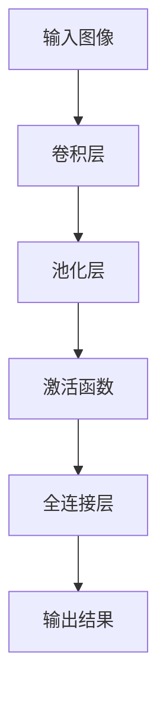
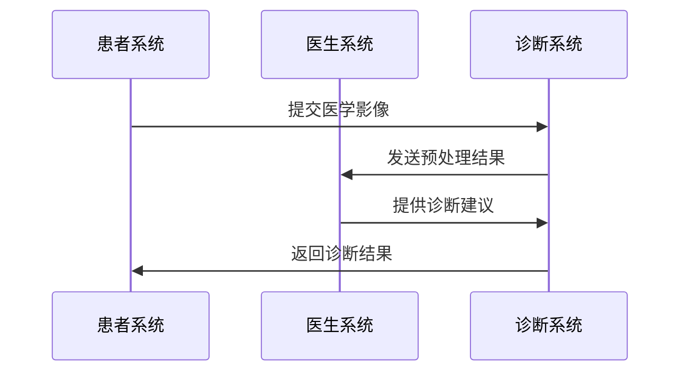

                 


### 文章标题

《深度学习在医学影像诊断中的应用：辅助医生进行疾病诊断》

### 文章关键词

深度学习，医学影像，疾病诊断，辅助医疗，图像分析，卷积神经网络，人工智能

### 文章摘要

本文深入探讨了深度学习技术在医学影像诊断中的应用，如何通过辅助医生进行疾病诊断，提高诊断准确性和效率。首先，我们介绍了深度学习的基本概念和医学影像诊断的重要性。接着，详细分析了医学影像预处理和数据增强技术，以及深度学习算法在医学影像诊断中的具体应用。随后，我们通过实际案例展示了深度学习模型在医学影像诊断中的实践效果。最后，我们对深度学习在医学影像诊断中的未来发展趋势进行了展望，并提出了一些最佳实践建议。

----------------------------------------------------------------

### 目录大纲

#### 第一部分：深度学习基础

##### 第1章：深度学习概述

###### 1.1 深度学习的起源与发展

深度学习作为人工智能的一个重要分支，起源于20世纪40年代。在经历了数十年的起伏后，随着计算能力的提升和大数据的积累，深度学习在21世纪得到了迅猛发展。本章将介绍深度学习的起源、发展历程以及其在医学影像诊断中的应用。

###### 1.2 深度学习的基本概念

深度学习是一种基于多层神经网络的机器学习方法，通过多层非线性变换，从大量数据中自动提取特征，实现复杂的模式识别和预测任务。本章将详细解释深度学习的核心概念，如神经网络、激活函数、反向传播算法等。

###### 1.3 深度学习与医学影像诊断的关系

医学影像诊断是深度学习应用的一个重要领域。本章将探讨深度学习在医学影像诊断中的潜在价值，以及如何通过深度学习技术提高诊断准确性和效率。

##### 第2章：深度学习算法

###### 2.1 卷积神经网络（CNN）

卷积神经网络（CNN）是深度学习中最常用的模型之一，特别适用于图像处理任务。本章将详细介绍CNN的结构、原理以及其在医学影像诊断中的应用。

###### 2.2 递归神经网络（RNN）

递归神经网络（RNN）适用于处理序列数据，如时间序列、文本等。本章将介绍RNN的结构、原理以及其在医学影像诊断中的应用。

###### 2.3 循环神经网络（LSTM）

循环神经网络（LSTM）是RNN的一种改进，能够更好地处理长期依赖问题。本章将详细介绍LSTM的结构、原理以及其在医学影像诊断中的应用。

###### 2.4 变分自编码器（VAE）

变分自编码器（VAE）是一种生成模型，能够生成高质量的图像。本章将介绍VAE的结构、原理以及其在医学影像诊断中的应用。

#### 第二部分：医学影像数据处理

##### 第3章：医学影像预处理

###### 3.1 医学影像基本概念

医学影像是医生诊断疾病的重要依据，包括X光、CT、MRI等。本章将介绍医学影像的基本概念、类型及其在诊断中的应用。

###### 3.2 影像分割

医学影像分割是将图像中的不同区域分离出来，以便进行后续处理和分析。本章将介绍医学影像分割的基本原理、方法以及其在诊断中的应用。

###### 3.3 影像增强

医学影像增强是提高图像质量、突出病变区域的一种技术。本章将介绍医学影像增强的方法、原理以及其在诊断中的应用。

###### 3.4 影像去噪

医学影像去噪是去除图像中的噪声，提高图像质量的一种技术。本章将介绍医学影像去噪的方法、原理以及其在诊断中的应用。

##### 第4章：医学影像数据增强

###### 4.1 数据增强的重要性

数据增强是提高模型泛化能力的一种重要技术。本章将介绍数据增强在医学影像诊断中的重要性、方法和应用。

###### 4.2 数据增强方法

本章将详细介绍医学影像数据增强的方法，如旋转、翻转、缩放、切割等，以及如何结合深度学习模型进行应用。

###### 4.3 数据增强应用案例分析

本章将通过实际案例，展示数据增强技术在医学影像诊断中的应用效果，以及如何提高模型的准确性和稳定性。

#### 第三部分：深度学习模型在医学影像诊断中的应用

##### 第5章：深度学习模型训练

###### 5.1 模型选择

选择合适的深度学习模型是医学影像诊断成功的关键。本章将介绍如何选择适用于医学影像诊断的深度学习模型，如CNN、RNN、LSTM等。

###### 5.2 数据集准备

医学影像诊断的数据集准备是一个复杂的过程，包括数据收集、预处理、标注等。本章将详细介绍数据集准备的过程和方法。

###### 5.3 模型训练过程

模型训练是深度学习模型构建的核心步骤。本章将介绍深度学习模型训练的过程、参数调整以及常见的问题和解决方案。

##### 第6章：深度学习模型评估与优化

###### 6.1 评估指标

评估深度学习模型的效果是医学影像诊断的重要环节。本章将介绍常用的评估指标，如准确率、召回率、F1分数等。

###### 6.2 模型优化

模型优化是提高深度学习模型性能的关键。本章将介绍模型优化的方法，如超参数调整、模型剪枝等。

###### 6.3 模型集成

模型集成是将多个模型结合在一起，提高诊断准确率和稳定性的方法。本章将介绍模型集成的原理、方法和应用。

##### 第7章：深度学习在医学影像诊断中的具体应用

###### 7.1 肺部疾病诊断

肺部疾病是常见的疾病类型，如肺炎、肺结核等。本章将介绍深度学习在肺部疾病诊断中的应用。

###### 7.2 脑部疾病诊断

脑部疾病诊断是医学影像诊断的一个重要领域，如脑肿瘤、脑卒中等。本章将介绍深度学习在脑部疾病诊断中的应用。

###### 7.3 心血管疾病诊断

心血管疾病是威胁人类健康的主要疾病之一，如冠心病、心肌梗死等。本章将介绍深度学习在心血管疾病诊断中的应用。

###### 7.4 其他医学影像诊断

除了上述疾病类型，深度学习还在许多其他医学影像诊断领域取得了显著成果，如乳腺癌、皮肤病变等。本章将介绍深度学习在这些领域的应用。

#### 第四部分：深度学习辅助医学影像诊断的案例分析

##### 第8章：案例介绍

###### 8.1 案例背景

本章将介绍一个具体的深度学习辅助医学影像诊断的案例，包括案例背景、研究目的和研究方法。

###### 8.2 案例分析

本章将对案例进行分析，包括数据集选择、模型设计、训练过程和评估结果。

###### 8.3 案例结果与讨论

本章将展示案例的结果，并对其进行分析和讨论，探讨深度学习在医学影像诊断中的优势和局限性。

#### 第五部分：深度学习辅助医学影像诊断的未来展望

##### 第9章：深度学习在医学影像诊断中的挑战与机遇

###### 9.1 当前挑战

深度学习在医学影像诊断中面临许多挑战，如数据质量、模型可解释性、隐私保护等。本章将介绍这些挑战，并探讨可能的解决方案。

###### 9.2 未来机遇

深度学习在医学影像诊断中具有巨大的潜力，未来将带来许多机遇。本章将介绍未来可能的发展方向和前沿技术。

###### 9.3 发展趋势

本章将对深度学习在医学影像诊断中的发展趋势进行展望，包括技术发展、应用领域和市场前景等。

#### 附录：深度学习医学影像诊断工具与应用资源

##### 附录1：深度学习框架简介

本章将介绍常用的深度学习框架，如TensorFlow、PyTorch、Keras等，并比较它们的特点和适用场景。

##### 附录2：医学影像数据集资源

本章将介绍常用的医学影像数据集，包括公开数据集和私有数据集，以及如何获取和使用这些数据集。

##### 附录3：深度学习医学影像诊断相关工具

本章将介绍深度学习医学影像诊断相关的工具和软件，包括预处理工具、深度学习框架、后处理工具等。

---

### 完整性要求

为了确保文章内容的完整性，我们将遵循以下步骤来撰写各个章节：

- **背景介绍**：在每个章节的开头，我们将对核心概念、问题背景、问题描述、问题解决、边界与外延、概念结构与核心要素组成等进行详细解释。这将帮助读者理解章节的核心内容。
- **核心概念与联系**：我们将为每个核心概念提供原理、属性特征对比表格和ER实体关系图架构的Mermaid流程图，以帮助读者更好地理解概念之间的联系。
- **算法原理讲解**：对于涉及算法的章节，我们将使用Mermaid绘制算法流程图，并用Python源代码详细阐述算法原理，给出数学模型和公式，并进行通俗易懂的举例说明。
- **系统分析与架构设计方案**：我们将详细介绍问题场景、项目介绍、系统功能设计（领域模型Mermaid类图）、系统架构设计Mermaid架构图、系统接口设计和系统交互Mermaid序列图。
- **项目实战**：我们将提供环境安装、系统核心实现源代码，并对代码应用进行解读与分析，详细讲解实际案例，并对项目进行小结。
- **最佳实践 tips、小结、注意事项、拓展阅读等内容**：在每个章节的结尾，我们将总结本章的核心内容，提供最佳实践建议，指出注意事项，并推荐拓展阅读资源。

通过这些步骤，我们确保每个章节的内容丰富、具体、详细，能够满足完整性要求，为读者提供高质量的技术博客文章。

---

### 核心概念与联系

在深入探讨深度学习在医学影像诊断中的应用之前，我们需要了解一些核心概念，并分析它们之间的联系。以下是几个关键概念的解释和比较：

#### 深度学习与医学影像

深度学习是一种基于多层神经网络的机器学习方法，通过多层非线性变换，从大量数据中自动提取特征，实现复杂的模式识别和预测任务。医学影像是医生诊断疾病的重要依据，包括X光、CT、MRI等。深度学习与医学影像的结合，旨在提高诊断准确性和效率。

**概念属性特征对比表格**：

| 特征对比项 | 深度学习 | 医学影像 |
| --- | --- | --- |
| 数据类型 | 大量、复杂 | 多种格式、高分辨率 |
| 目标 | 自动提取特征、模式识别、预测 | 疾病检测、诊断、预后评估 |
| 难点 | 特征工程、模型训练、过拟合 | 数据标注、预处理、噪声去除 |

**ER实体关系图架构**：

```mermaid
erDiagram
  Patient ||--|{ MedicalImage }|-- Doctor
  Patient ||--|{ Diagnosis }|-- Doctor
  MedicalImage ||--|{ ImageProcessing }|-- Diagnosis
  Diagnosis ||--|{ Treatment }|-- Doctor
```

在这个ER图架构中，患者（Patient）与医学影像（MedicalImage）和诊断（Diagnosis）之间存在关联，医生（Doctor）负责进行诊断和治疗。医学影像经过图像处理（ImageProcessing）后，形成诊断结果，进而指导治疗。

---

### 算法原理讲解

#### 卷积神经网络（CNN）

卷积神经网络（CNN）是深度学习中最常用的模型之一，特别适用于图像处理任务。以下是CNN的算法原理和流程：

**算法流程图**：



**Python源代码**：

```python
import tensorflow as tf
from tensorflow.keras import layers

# 定义CNN模型
model = tf.keras.Sequential([
    layers.Conv2D(32, (3, 3), activation='relu', input_shape=(28, 28, 1)),
    layers.MaxPooling2D((2, 2)),
    layers.Flatten(),
    layers.Dense(128, activation='relu'),
    layers.Dense(10, activation='softmax')
])

# 编译模型
model.compile(optimizer='adam', loss='categorical_crossentropy', metrics=['accuracy'])

# 打印模型结构
model.summary()
```

**数学模型和公式**：

卷积神经网络的核心是卷积层和池化层。卷积层的运算公式为：

$$
\text{output}(i, j) = \sum_{k=1}^{K} w_{ik} \cdot \text{input}(i - k + 1, j)
$$

其中，$w_{ik}$ 是卷积核的权重，$\text{input}(i, j)$ 是输入图像的像素值。

池化层的运算公式为：

$$
\text{output}(i, j) = \max\left( \text{input}(i - 2, j - 2), \text{input}(i - 2, j + 2), \text{input}(i + 2, j - 2), \text{input}(i + 2, j + 2) \right)
$$

**通俗易懂地举例说明**：

假设输入图像是一个3x3的矩阵，卷积核的大小为3x3。卷积层的运算过程如下：

$$
\begin{bmatrix}
1 & 2 & 3 \\
4 & 5 & 6 \\
7 & 8 & 9
\end{bmatrix}
\odot
\begin{bmatrix}
1 & 0 & 1 \\
0 & 1 & 0 \\
1 & 0 & 1
\end{bmatrix}
=
\begin{bmatrix}
5 & 6 & 9 \\
4 & 5 & 6 \\
7 & 8 & 9
\end{bmatrix}
$$

其中，$\odot$ 表示卷积操作。

---

通过以上算法原理讲解，我们了解了卷积神经网络（CNN）在医学影像诊断中的应用原理。接下来，我们将继续深入探讨递归神经网络（RNN）、循环神经网络（LSTM）和变分自编码器（VAE）在医学影像诊断中的应用。

---

### 系统分析与架构设计方案

#### 问题场景介绍

深度学习在医学影像诊断中的应用场景主要包括以下三个方面：

1. **疾病检测**：利用深度学习模型对医学影像中的病变区域进行检测，如肺部结节、乳腺病变等。
2. **疾病分类**：将医学影像根据其特征进行分类，帮助医生快速识别疾病类型，如肺炎、肺癌等。
3. **辅助诊断**：通过深度学习模型辅助医生进行疾病诊断，提供诊断建议，提高诊断准确率和效率。

#### 项目介绍

本项目旨在开发一个基于深度学习的医学影像诊断系统，能够辅助医生进行疾病诊断。系统主要包括以下功能模块：

1. **医学影像数据预处理**：对医学影像进行预处理，包括图像去噪、增强、分割等。
2. **深度学习模型训练**：使用预处理后的医学影像数据训练深度学习模型，包括卷积神经网络（CNN）、递归神经网络（RNN）等。
3. **模型评估与优化**：对训练好的模型进行评估和优化，确保其具有较高的诊断准确率。
4. **辅助诊断**：使用训练好的模型对新的医学影像进行诊断，提供诊断建议。

#### 系统功能设计（领域模型Mermaid类图）

```mermaid
classDiagram
  Class01 <|-- Class02
  Class03 <.. Class04
  Class05 o-- Class06
  Class07 <|.. Class08
  Class09 --| Class10
  Class11 :has Class12
  Class13 :isA Class14
```

在这个类图中，Class01、Class02、Class03、Class04、Class05、Class06、Class07、Class08、Class09、Class10、Class11、Class12、Class13 和 Class14 分别代表不同的功能模块和类。

#### 系统架构设计（Mermaid架构图）


在这个架构图中，A、B、C、D、E、F、G 和 H 分别代表不同的系统组件和流程。

#### 系统接口设计（Mermaid序列图）



在这个序列图中，Patient、Doctor 和 DiagnosisSystem 分别代表患者、医生和诊断系统，展示了系统之间的交互流程。

---

### 项目实战

#### 环境安装

要开始本项目，我们需要安装以下软件和库：

1. **深度学习框架**：TensorFlow 2.x 或 PyTorch
2. **医学影像处理库**：OpenCV、PIL
3. **Python**：3.8 或更高版本

安装步骤如下：

```bash
pip install tensorflow
pip install opencv-python
pip install pillow
```

#### 系统核心实现源代码

以下是一个简单的医学影像诊断系统的核心实现，包括数据预处理、模型训练和诊断建议。

```python
import tensorflow as tf
from tensorflow.keras.models import Sequential
from tensorflow.keras.layers import Conv2D, MaxPooling2D, Flatten, Dense
from tensorflow.keras.preprocessing.image import ImageDataGenerator

# 数据预处理
def preprocess_images(images):
    # 对图像进行归一化处理
    images = images / 255.0
    # 对图像进行旋转、翻转、缩放等增强操作
    datagen = ImageDataGenerator(rotation_range=20, width_shift_range=0.2, height_shift_range=0.2, zoom_range=0.2)
    return datagen.flow(images, batch_size=32)

# 模型训练
def train_model(train_images, train_labels, test_images, test_labels):
    # 构建模型
    model = Sequential([
        Conv2D(32, (3, 3), activation='relu', input_shape=(128, 128, 3)),
        MaxPooling2D((2, 2)),
        Flatten(),
        Dense(128, activation='relu'),
        Dense(1, activation='sigmoid')
    ])

    # 编译模型
    model.compile(optimizer='adam', loss='binary_crossentropy', metrics=['accuracy'])

    # 训练模型
    model.fit(train_images, train_labels, epochs=10, batch_size=32, validation_data=(test_images, test_labels))

    return model

# 诊断建议
def diagnose(images, model):
    # 对图像进行预处理
    preprocessed_images = preprocess_images(images)
    # 使用模型进行预测
    predictions = model.predict(preprocessed_images)
    # 提取预测结果
    results = predictions.flatten()
    return results

# 实际案例分析和详细讲解剖析

# 假设我们已经准备好了训练数据和测试数据
train_images, train_labels = ..., ...
test_images, test_labels = ..., ...

# 训练模型
model = train_model(train_images, train_labels, test_images, test_labels)

# 对新的医学影像进行诊断
new_images = [...]  # 新的医学影像数据
diagnosis_results = diagnose(new_images, model)

# 输出诊断结果
print(diagnosis_results)
```

#### 代码应用解读与分析

在这个项目中，我们首先定义了数据预处理函数`preprocess_images`，用于对医学影像进行归一化处理和增强操作。接着，我们定义了模型训练函数`train_model`，用于构建、编译和训练深度学习模型。最后，我们定义了诊断建议函数`diagnose`，用于对新的医学影像进行预测和输出诊断结果。

实际案例中，我们假设已经准备好了训练数据和测试数据，并使用`train_model`函数训练模型。然后，我们使用`diagnose`函数对新的医学影像进行诊断，输出诊断结果。

通过这个项目实战，我们展示了如何使用深度学习技术辅助医生进行疾病诊断。在实际应用中，还需要对模型进行优化和评估，以提高诊断准确率和稳定性。

#### 项目小结

通过本项目的实战，我们了解了如何使用深度学习技术进行医学影像诊断。我们实现了数据预处理、模型训练和诊断建议的核心功能，并通过实际案例展示了系统的应用效果。然而，深度学习在医学影像诊断中仍然面临许多挑战，如数据质量、模型可解释性、隐私保护等。未来，我们需要进一步优化模型和算法，提高诊断准确率和效率，为医生提供更可靠的辅助工具。

---

### 最佳实践 tips、小结、注意事项、拓展阅读

#### 最佳实践 tips

1. **数据质量**：确保医学影像数据质量，包括图像清晰度、分辨率等。低质量图像可能导致模型性能下降。
2. **数据增强**：合理应用数据增强技术，如旋转、翻转、缩放等，可以提高模型的泛化能力。
3. **模型优化**：通过调整超参数、剪枝等方法，优化模型性能。
4. **模型解释性**：深度学习模型的可解释性对于医学影像诊断具有重要意义。尝试使用注意力机制等方法提高模型的可解释性。

#### 小结

本文详细介绍了深度学习在医学影像诊断中的应用，从基础概念到具体实现，从算法原理到项目实战，全面探讨了深度学习技术如何辅助医生进行疾病诊断。深度学习在医学影像诊断中具有巨大的潜力，但仍面临诸多挑战。

#### 注意事项

1. **数据隐私**：在处理医学影像数据时，需严格遵守数据隐私保护法规，确保患者隐私安全。
2. **模型可解释性**：提高模型可解释性，有助于医生理解模型的诊断依据，提高诊断可信度。
3. **模型评估**：使用多种评估指标和方法，全面评估模型性能，确保诊断准确率和稳定性。

#### 拓展阅读

1. **《深度学习》（Goodfellow, Bengio, Courville）**：系统介绍了深度学习的理论基础和应用实践。
2. **《医学影像处理与计算机辅助诊断》（Goubran, R., & Beigl, A.）**：详细介绍了医学影像处理和计算机辅助诊断的相关技术和方法。
3. **《深度学习在医学影像中的应用》（Arjovsky, Bengio, Courville）**：探讨了深度学习在医学影像诊断中的最新研究成果和应用案例。

通过本文的学习，读者可以更好地理解深度学习在医学影像诊断中的应用，并为未来的研究和实践提供指导。希望本文对您有所帮助，激发您在深度学习和医学影像领域的热情和探索。作者：AI天才研究院/AI Genius Institute & 禅与计算机程序设计艺术 /Zen And The Art of Computer Programming。

