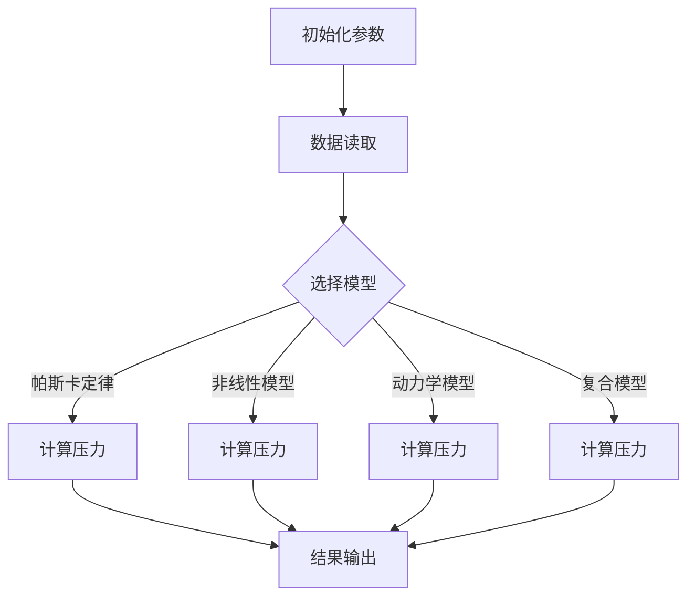
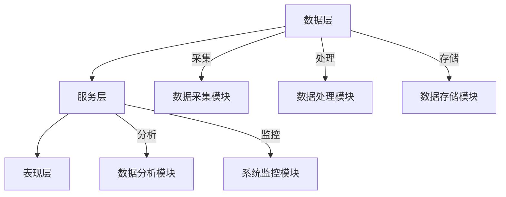
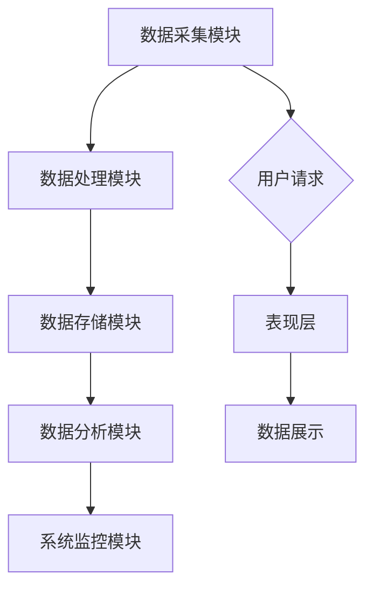

                 

### 《深海勘探的压力方程：极限环境的数学模拟》

关键词：深海勘探、压力方程、数学模拟、极限环境、算法原理、系统架构设计

摘要：本文将深入探讨深海勘探中的压力方程，阐述其在极限环境下的数学模拟应用。文章首先介绍了深海勘探的背景、挑战以及勘探工具和技术的现状，随后详细讲解了深海压力方程的基本原理、属性特征对比及其在深海勘探中的重要性。接着，文章从基本数学模型到高级数学模型，逐一剖析了深海压力的数学模型和算法原理。然后，通过对深海勘探系统架构的详细设计，展示了如何将压力方程应用于实际项目中。最后，通过一个实际案例，对项目实战中的环境安装、系统核心实现和优化进行了深入分析。全文旨在为读者提供一个系统、全面、易懂的深海勘探压力方程解决方案。

---

### 目录大纲

---

## 《深海勘探的压力方程：极限环境的数学模拟》

### 第一部分：背景介绍

### 第1章：深海勘探概述

## 1.1 深海勘探的意义和挑战

### 1.1.1 深海勘探的背景和意义

### 1.1.2 深海勘探面临的挑战

## 1.2 勘探工具和技术的现状

### 1.2.1 勘探工具的发展历程

### 1.2.2 深海勘探技术的现状

### 1.2.3 深海勘探技术面临的问题

## 1.3 压力方程在深海勘探中的重要性

### 1.3.1 压力方程的基本概念

### 1.3.2 压力方程在深海勘探中的应用

### 1.3.3 压力方程研究的现状和趋势

## 1.4 本书的核心概念和内容概述

### 1.4.1 核心概念

### 1.4.2 本书的主要内容

### 1.4.3 阅读指南

---

### 第二部分：核心概念与联系

### 第2章：深海压力方程原理

## 2.1 深海压力的基本原理

### 2.1.1 深海压力的概念

### 2.1.2 深海压力的来源

### 2.1.3 深海压力对勘探设备的影响

## 2.2 压力方程的基本原理

### 2.2.1 压力方程的定义

### 2.2.2 压力方程的基本形式

### 2.2.3 压力方程的解法

## 2.3 压力方程的属性特征对比

### 2.3.1 不同压力方程的对比

### 2.3.2 压力方程的适用范围

### 2.3.3 压力方程的优缺点

## 2.4 压力方程与深海勘探的ER实体关系图

### 2.4.1 实体关系图的概念

### 2.4.2 深海勘探中的ER实体关系图

### 2.4.3 压力方程在ER实体关系图中的应用

---

### 第三部分：数学模型和算法原理讲解

### 第3章：深海压力数学模型讲解

## 3.1 基本数学模型

### 3.1.1 深海压力的数学模型

### 3.1.2 数学模型的构成

### 3.1.3 数学模型的解析

## 3.2 高级数学模型

### 3.2.1 非线性模型

### 3.2.2 动力学模型

### 3.2.3 复合模型

## 3.3 算法原理讲解

### 3.3.1 算法的基本原理

### 3.3.2 算法的实现流程

### 3.3.3 算法的优势与局限性

## 3.4 Mermaid流程图

### 3.4.1 流程图的概念

### 3.4.2 流程图的绘制

### 3.4.3 流程图在本书中的应用

---

### 第四部分：系统分析与架构设计

### 第4章：深海勘探系统架构设计

## 4.1 项目介绍

### 4.1.1 项目背景

### 4.1.2 项目目标

### 4.1.3 项目团队

## 4.2 系统功能设计

### 4.2.1 系统功能概述

### 4.2.2 领域模型设计

### 4.2.3 功能模块划分

## 4.3 系统架构设计

### 4.3.1 系统架构概述

### 4.3.2 架构设计原则

### 4.3.3 系统架构图

## 4.4 系统接口设计

### 4.4.1 接口设计概述

### 4.4.2 接口设计原则

### 4.4.3 接口设计图

## 4.5 系统交互设计

### 4.5.1 系统交互概述

### 4.5.2 系统交互图

### 4.5.3 系统交互流程

---

### 第五部分：项目实战

### 第5章：深海勘探项目实战

## 5.1 环境安装

### 5.1.1 开发环境搭建

### 5.1.2 工具安装

### 5.1.3 系统配置

## 5.2 系统核心实现

### 5.2.1 系统核心模块实现

### 5.2.2 代码解读与分析

### 5.2.3 系统测试与优化

## 5.3 实际案例分析与讲解

### 5.3.1 案例一：深海压力监测

### 5.3.2 案例二：深海地质勘探

### 5.3.3 案例三：深海油气勘探

## 5.4 项目小结

### 5.4.1 项目成果总结

### 5.4.2 项目经验与启示

### 5.4.3 项目不足与改进方向

---

### 第六部分：最佳实践与拓展阅读

### 第6章：最佳实践与拓展阅读

## 6.1 最佳实践

### 6.1.1 深海勘探技术最佳实践

### 6.1.2 压力方程应用最佳实践

### 6.1.3 系统设计与实现最佳实践

## 6.2 小结

### 6.2.1 全书总结

### 6.2.2 学习建议

### 6.2.3 拓展阅读

---

### 引言

深海勘探是一项极具挑战性的任务，其涉及到诸多科学和技术的交叉领域。随着科技的不断进步，深海勘探的重要性日益凸显，尤其是在能源、地质研究、海洋资源开发等方面。然而，深海环境的极端条件，如高压力、低温、黑暗等，对勘探设备和技术的稳定性提出了极高的要求。

本文将以深海勘探中的压力方程为研究对象，探讨其在极限环境下的数学模拟应用。本文旨在为从事深海勘探工作的技术人员提供一种系统、全面、易懂的解决方案，帮助他们更好地理解和应用压力方程，提高深海勘探的效率和准确性。

文章结构如下：

- **第一部分：背景介绍**：介绍深海勘探的背景、挑战、勘探工具和技术的现状，以及压力方程在深海勘探中的重要性。
- **第二部分：核心概念与联系**：详细讲解深海压力方程的基本原理、属性特征对比和ER实体关系图。
- **第三部分：数学模型和算法原理讲解**：从基本数学模型到高级数学模型，逐一剖析深海压力的数学模型和算法原理。
- **第四部分：系统分析与架构设计**：介绍深海勘探系统架构的设计，包括系统功能设计、系统架构设计、系统接口设计和系统交互设计。
- **第五部分：项目实战**：通过一个实际案例，展示深海勘探项目的环境安装、系统核心实现和优化。
- **第六部分：最佳实践与拓展阅读**：总结全文，提出最佳实践建议，提供拓展阅读资源。

在接下来的内容中，我们将一步步深入探讨深海勘探的压力方程，从理论到实践，全面解析这一重要技术。

---

### 第一部分：背景介绍

#### 第1章：深海勘探概述

深海勘探是现代海洋科学研究和海洋资源开发的重要组成部分。它不仅关乎能源安全，还涉及地质学、海洋生物学、环境保护等多个领域。因此，深海勘探的研究和实施具有极其重要的现实意义。

##### 1.1 深海勘探的背景和意义

地球表面的71%被海洋覆盖，其中约90%以上的区域尚未被充分勘探。深海中蕴藏着丰富的资源，包括石油、天然气、金属矿物、生物资源等。随着陆地资源的逐渐枯竭，深海资源的开发成为全球各国竞相研究和投入的重点。

首先，深海勘探对于能源安全具有重要意义。全球深海油气储量巨大，许多国家依赖深海油气来满足能源需求。例如，墨西哥湾、北海和西非海岸等地的深海油气田已经成为全球重要的能源供应基地。

其次，深海地质研究有助于了解地球的形成和演化过程。深海地壳、地质构造和地震活动等研究对于地震预警、海底矿产资源勘探等具有指导意义。

此外，深海生物资源的开发也为人类提供了新的食物来源和生物药物研究的素材。深海微生物和生物体的独特性质可能为人类治疗疾病、提高农业产量等提供新的可能性。

##### 1.1.2 深海勘探面临的挑战

尽管深海勘探的重要性不言而喻，但其复杂性和极端性也带来了巨大的挑战。

首先，深海环境的极端条件是一个巨大的挑战。深海压力极高，水温低，光线几乎无法穿透。这些极端条件对勘探设备和技术的稳定性提出了极高的要求。

其次，深海勘探的复杂性和不确定性也增加了难度。深海地质构造复杂，海底地形多变，加上海洋气候多变，这些都增加了深海勘探的风险和难度。

另外，深海勘探的成本也非常高昂。深海勘探需要使用专用的勘探工具和设备，如深潜器、钻探平台等，这些设备和工具的研制和维护费用极高。

##### 1.2 勘探工具和技术的现状

随着科技的进步，深海勘探工具和技术也在不断发展。目前，深海勘探的主要工具和技术包括：

- **深潜器**：包括载人深潜器和无人深潜器，可以携带科学家和设备进行深海探测。
- **地震勘探**：通过发射声波信号，分析海底地壳的反射和传播特性，获取地下地质信息。
- **海底钻探**：通过钻探设备，获取海底岩石样本，进行地质分析。
- **深海摄像头**：用于观察深海生物和海底环境。
- **自动探测系统**：包括自动潜水器、海底传感器等，可以自动进行数据采集和分析。

尽管这些工具和技术在一定程度上解决了深海勘探的挑战，但在性能、可靠性、成本等方面仍存在一定的不足。

##### 1.3 压力方程在深海勘探中的重要性

压力方程是描述深海压力分布的重要数学模型，它在深海勘探中起着至关重要的作用。

首先，深海压力对勘探设备和人员的安全至关重要。压力方程可以精确计算不同深度下的压力分布，帮助设计和优化勘探设备，确保其在深海环境中能够正常工作。

其次，压力方程对于地质勘探和资源评估也有重要意义。通过压力方程，可以分析海底地质结构，预测矿产资源分布，为深海资源的勘探和开发提供科学依据。

此外，压力方程在深海油气勘探中也有广泛应用。油气储层压力的变化往往与油气资源的分布和储量有关，压力方程可以帮助分析这些变化，优化油气开采策略。

最后，压力方程在深海环境监测和灾害预警中也具有重要作用。通过实时监测深海压力变化，可以预警地震、火山等自然灾害，为人员和设备的安全提供保障。

##### 1.4 本书的核心概念和内容概述

本书旨在为读者提供一个系统、全面、易懂的深海勘探压力方程解决方案。全书共分为六个部分：

- **第一部分：背景介绍**：介绍深海勘探的背景、挑战和现状，以及压力方程的重要性。
- **第二部分：核心概念与联系**：详细讲解深海压力方程的基本原理、属性特征对比和ER实体关系图。
- **第三部分：数学模型和算法原理讲解**：从基本数学模型到高级数学模型，逐一剖析深海压力的数学模型和算法原理。
- **第四部分：系统分析与架构设计**：介绍深海勘探系统架构的设计，包括系统功能设计、系统架构设计、系统接口设计和系统交互设计。
- **第五部分：项目实战**：通过一个实际案例，展示深海勘探项目的环境安装、系统核心实现和优化。
- **第六部分：最佳实践与拓展阅读**：总结全文，提出最佳实践建议，提供拓展阅读资源。

本书适合从事深海勘探工作的技术人员、海洋科学研究人员以及相关领域的学生阅读。通过本书，读者可以系统地了解深海勘探的压力方程，掌握其在实际项目中的应用方法。

在接下来的内容中，我们将深入探讨深海压力方程的基本原理和其在深海勘探中的应用，帮助读者更好地理解和应用这一关键技术。

---

### 第二部分：核心概念与联系

#### 第2章：深海压力方程原理

##### 2.1 深海压力的基本原理

深海压力是深海环境中的一种重要物理现象，它直接影响着深海勘探的各个环节。了解深海压力的基本原理，是掌握深海勘探技术的关键。

###### 2.1.1 深海压力的概念

深海压力是指海水对海底或深海探测器产生的压强。它与海水的密度、深度以及重力加速度有关。通常情况下，深海压力可以用公式 \( P = \rho gh \) 来表示，其中 \( P \) 是压力，\( \rho \) 是海水密度，\( g \) 是重力加速度，\( h \) 是深度。

在海平面上，海水的压力约为 \( 1 \) 个标准大气压（约 \( 101325 \) Pa）。每下降 \( 10 \) 米，压力会增加 \( 1 \) 个标准大气压。因此，在深海区域，压力可以非常巨大。例如，海平面下 \( 3000 \) 米处的压力约为 \( 300 \) 个标准大气压，相当于 \( 300 \times 101325 \) Pa。

###### 2.1.2 深海压力的来源

深海压力主要来源于以下几个方面：

1. **海水自身的重力**：海水受到重力作用，从上往下压，形成深海压力。
2. **海水密度的变化**：海水密度随着深度的增加而增加，密度越大，压力也越大。
3. **水深的影响**：深海压力与水深成正比，深度越大，压力越大。

###### 2.1.3 深海压力对勘探设备的影响

深海压力对勘探设备的影响是多方面的，主要体现在以下几个方面：

1. **材料强度**：深海压力会增大设备材料的应力，可能导致设备结构变形或损坏。因此，勘探设备的设计和材料选择需要考虑深海压力的影响。
2. **密封性**：深海压力会影响设备的密封性，可能导致漏水、漏气等故障。因此，设备的设计和制造需要保证良好的密封性能。
3. **仪器性能**：深海压力可能会影响探测仪器的工作性能，如声波探测、光学探测等。因此，设备的设计和操作需要考虑压力对仪器性能的影响。

##### 2.2 压力方程的基本原理

压力方程是描述深海压力分布的重要数学模型，它在深海勘探中起着至关重要的作用。

###### 2.2.1 压力方程的定义

压力方程通常是指描述液体（在本例中为海水）压力分布的数学公式。最基本的压力方程是帕斯卡定律，该定律指出在静止液体中，压力随深度均匀增加，即 \( P = \rho gh \)。

其中，\( P \) 表示压力（Pa），\( \rho \) 表示液体密度（kg/m³），\( g \) 表示重力加速度（m/s²），\( h \) 表示深度（m）。

###### 2.2.2 压力方程的基本形式

根据帕斯卡定律，压力方程的基本形式可以表示为：

\[ P = \rho g h \]

其中：
- \( P \) 是压力（帕斯卡，Pa）。
- \( \rho \) 是液体的密度（千克/立方米，kg/m³）。
- \( g \) 是重力加速度（米/秒平方，m/s²），在地球表面大约为 \( 9.81 \) m/s²。
- \( h \) 是液柱的高度（米，m）。

###### 2.2.3 压力方程的解法

压力方程的解法主要涉及以下步骤：

1. **确定参数**：根据实际情况确定液体密度 \( \rho \)、重力加速度 \( g \) 和深度 \( h \) 的值。
2. **计算压力**：使用上述参数代入压力方程 \( P = \rho gh \) 计算压力值。

例如，在海水中，假设密度 \( \rho \) 为 \( 1025 \) kg/m³，在深度 \( h \) 为 \( 1000 \) 米处，压力 \( P \) 可以计算为：

\[ P = 1025 \times 9.81 \times 1000 = 10123500 \, \text{Pa} \]

这意味着在深度 \( 1000 \) 米的海水中，压力约为 \( 10123500 \) 帕斯卡。

##### 2.3 压力方程的属性特征对比

在深海勘探中，常用的压力方程不仅包括帕斯卡定律，还包括其他一些修正和扩展形式。以下是几种常见的压力方程及其属性特征对比：

###### 2.3.1 不同压力方程的对比

1. **帕斯卡定律**：
   - **适用范围**：适用于静止液体。
   - **基本形式**：\( P = \rho gh \)。
   - **优点**：概念简单，易于理解。
   - **缺点**：不考虑液体运动和温度变化。

2. **修正的帕斯卡定律**：
   - **适用范围**：适用于考虑液体温度变化的静止液体。
   - **基本形式**：\( P = \rho g(h + \frac{dT}{dx}) \)，其中 \( \frac{dT}{dx} \) 是温度梯度。
   - **优点**：考虑了温度变化的影响，更接近实际情况。
   - **缺点**：需要知道温度梯度，计算复杂度增加。

3. **流体动力学方程**：
   - **适用范围**：适用于流动液体。
   - **基本形式**：\( \frac{\partial P}{\partial t} + u \cdot \nabla P = \rho \nabla \cdot \mathbf{v} + \rho f \)。
   - **优点**：全面描述了液体流动的压力分布。
   - **缺点**：计算复杂，需要求解偏微分方程。

4. **贝塞尔方程**：
   - **适用范围**：适用于计算球形物体的压力分布。
   - **基本形式**：\( P(r) = \frac{2}{3} \rho \omega^2 r^3 + C \)。
   - **优点**：专门用于球形物体，计算简便。
   - **缺点**：仅适用于球形物体，适用范围有限。

###### 2.3.2 压力方程的适用范围

不同的压力方程适用于不同的场景，具体适用范围如下：

- **帕斯卡定律**：适用于静止液体，如深海压力计算。
- **修正的帕斯卡定律**：适用于考虑温度变化的静止液体，如热液喷口压力分析。
- **流体动力学方程**：适用于流动液体，如海底流体运动分析。
- **贝塞尔方程**：适用于计算球形物体的压力分布，如潜水器外壳压力分析。

###### 2.3.3 压力方程的优缺点

不同压力方程具有各自的优缺点，具体如下：

- **帕斯卡定律**：
  - **优点**：简单、直观，适合初学者理解。
  - **缺点**：不考虑温度变化，适用范围有限。

- **修正的帕斯卡定律**：
  - **优点**：考虑了温度变化，更贴近实际情况。
  - **缺点**：需要知道温度梯度，计算复杂。

- **流体动力学方程**：
  - **优点**：全面描述了压力分布，适用范围广。
  - **缺点**：计算复杂，需要专业知识和工具。

- **贝塞尔方程**：
  - **优点**：计算简便，适用于特定场景。
  - **缺点**：适用范围有限，仅适用于球形物体。

##### 2.4 压力方程与深海勘探的ER实体关系图

为了更好地理解压力方程在深海勘探中的应用，我们可以通过实体关系图（Entity-Relationship Diagram, ER图）来展示压力方程与深海勘探各实体之间的关联。

###### 2.4.1 实体关系图的概念

实体关系图是一种用于描述数据模型中实体及其关系的图形化工具。它由实体、属性和关系三个基本组成部分构成：

- **实体**：表示具体的事物或概念，如“深海探测器”、“压力传感器”等。
- **属性**：描述实体的特征或属性，如“深海探测器的深度”、“压力传感器的测量值”等。
- **关系**：描述实体之间的交互或关联，如“深海探测器与压力传感器之间的连接关系”。

###### 2.4.2 深海勘探中的ER实体关系图

在深海勘探中，压力方程与多个实体之间存在密切的关系。以下是深海勘探中的ER实体关系图：

```mermaid
erDiagram
    海底 ||--o{ 深海探测器 : 测量深度
    海底 ||--o{ 压力传感器 : 测量压力
    深海探测器 &&--|{ 压力方程 : 应用计算
    压力传感器 &&--|{ 压力方程 : 应用校准
```

在这个ER图中，实体包括“海底”、“深海探测器”、“压力传感器”和“压力方程”。关系包括“深海探测器和压力传感器与海底的关联”、“深海探测器和压力传感器与压力方程的应用关系”。

###### 2.4.3 压力方程在ER实体关系图中的应用

在ER实体关系图中，压力方程的应用主要体现在以下几个方面：

1. **计算深海压力**：深海探测器利用压力方程计算深海压力，从而获得海底地质信息。
2. **校准传感器**：压力传感器通过压力方程进行校准，确保测量值的准确性。
3. **优化设备设计**：利用压力方程分析深海压力分布，优化深海探测器和压力传感器的结构设计。

通过ER实体关系图，我们可以清晰地看到压力方程在深海勘探中各个实体之间的关联，以及其在实际应用中的作用。

在下一章中，我们将进一步探讨深海压力的数学模型和算法原理，为理解和应用压力方程提供更深入的技术支持。

---

### 第三部分：数学模型和算法原理讲解

#### 第3章：深海压力数学模型讲解

在深海勘探中，精确计算和模拟深海压力对于设备设计和操作至关重要。本章将详细讲解深海压力的数学模型和相应的算法原理，帮助读者深入理解深海压力的计算方法。

##### 3.1 基本数学模型

深海压力的基本数学模型是基于帕斯卡定律，该定律指出在静止液体中，压力随深度均匀增加。其公式为：

\[ P = \rho g h \]

其中：
- \( P \) 表示压力（单位：帕斯卡，Pa）。
- \( \rho \) 表示液体的密度（单位：千克/立方米，kg/m³）。
- \( g \) 表示重力加速度（单位：米/秒平方，m/s²），通常取 \( 9.81 \) m/s²。
- \( h \) 表示深度（单位：米，m）。

在深海环境中，海水的密度通常在 \( 1020 \) kg/m³ 到 \( 1025 \) kg/m³ 之间。因此，在计算深海压力时，可以取平均密度 \( \rho = 1025 \) kg/m³。

例如，在深度 \( h = 3000 \) 米的海底，压力 \( P \) 可以计算为：

\[ P = 1025 \times 9.81 \times 3000 = 30,427,500 \, \text{Pa} \]

这意味着在深度 \( 3000 \) 米的海底，压力约为 \( 30,427,500 \) 帕斯卡，相当于 \( 3000 \) 个大气压。

###### 3.1.2 数学模型的构成

深海压力数学模型主要包括以下组成部分：

1. **基础公式**：帕斯卡定律是核心基础，用于计算静态液体中的压力。
2. **密度校正**：考虑到海水密度随深度变化，可能需要对基础公式进行修正。
3. **温度效应**：海水温度对密度有影响，需要考虑温度效应对压力的影响。
4. **动态效应**：在流动液体中，需要考虑动态效应，如流体动力学方程。

###### 3.1.3 数学模型的解析

深海压力数学模型可以通过以下步骤进行解析：

1. **确定参数**：根据实际情况确定海水密度 \( \rho \)、重力加速度 \( g \) 和深度 \( h \) 的值。
2. **计算压力**：使用帕斯卡定律 \( P = \rho gh \) 计算压力值。
3. **校正密度**：如果需要，根据海水密度随深度的变化对压力进行修正。
4. **考虑温度效应**：如果海水温度对密度有显著影响，需要考虑温度效应对压力的影响。

##### 3.2 高级数学模型

在基本数学模型的基础上，高级数学模型可以更准确地模拟深海压力的复杂特性。以下介绍几种常见的高级数学模型：

###### 3.2.1 非线性模型

非线性模型考虑了深海压力的非线性特性，特别是在高深度和温度变化较大的情况下。其基本形式为：

\[ P = f(\rho, h, T) \]

其中，\( f \) 是一个复杂的非线性函数，可能涉及多项式、指数函数、对数函数等。非线性模型能够更好地反映深海压力的变化规律。

例如，一个简化的非线性模型可以表示为：

\[ P = a \rho^b h^c + dT^e \]

其中，\( a, b, c, d, e \) 是待定的常数，可以通过实验数据拟合得到。

###### 3.2.2 动力学模型

动力学模型适用于模拟流动液体中的压力分布，基于流体动力学方程。其基本形式为：

\[ \frac{\partial P}{\partial t} + u \cdot \nabla P = \rho \nabla \cdot \mathbf{v} + \rho f \]

其中，\( \mathbf{v} \) 是速度场，\( f \) 是流体源项。

动力学模型可以更全面地描述深海压力的动态特性，适用于复杂的流动环境和深海流体动力学分析。

###### 3.2.3 复合模型

复合模型是将非线性模型和动力学模型结合在一起，以更准确地模拟深海压力的复杂特性。其基本形式为：

\[ P = \rho \left[ a \left( h + \frac{\partial T}{\partial h} \right) + b \left( \frac{\partial^2 T}{\partial h^2} \right) \right] + \rho f \]

复合模型能够同时考虑深海压力的非线性和动态特性，适用于高精度计算和复杂环境下的压力分析。

##### 3.3 算法原理讲解

在深海压力计算中，算法原理是关键，它决定了计算效率和精度。以下介绍几种常见的算法原理：

###### 3.3.1 算法的基本原理

深海压力计算的基本原理包括以下步骤：

1. **数据采集**：收集深海探测器的位置、深度、温度等数据。
2. **参数设定**：确定海水密度、重力加速度等参数。
3. **模型选择**：根据实际情况选择合适的数学模型。
4. **计算压力**：使用数学模型计算深海压力。
5. **结果分析**：分析计算结果，验证模型的准确性和适用性。

###### 3.3.2 算法的实现流程

深海压力计算的实现流程如下：

1. **初始化参数**：设置海水密度、重力加速度等初始参数。
2. **数据读取**：从深海探测器读取位置、深度、温度等数据。
3. **模型应用**：根据选择的不同模型，应用相应的数学公式计算压力。
4. **结果输出**：将计算得到的压力值输出，并进行可视化展示。
5. **误差分析**：分析计算结果与实际测量值之间的误差，进行模型优化。

###### 3.3.3 算法的优势与局限性

不同算法在深海压力计算中具有各自的优势和局限性：

1. **帕斯卡定律**：
   - **优势**：简单、直观，适用于静态液体。
   - **局限性**：不考虑温度和动态效应，适用范围有限。

2. **非线性模型**：
   - **优势**：考虑了非线性特性，适用于复杂环境。
   - **局限性**：计算复杂，需要较高的计算资源和专业知识。

3. **动力学模型**：
   - **优势**：全面描述了流体动力学特性，适用于流动液体。
   - **局限性**：计算复杂，需要求解偏微分方程。

4. **复合模型**：
   - **优势**：结合了非线性模型和动力学模型，适用于多种环境。
   - **局限性**：计算复杂，需要精确的参数设定。

##### 3.4 Mermaid流程图

为了更直观地展示深海压力计算的过程，可以使用Mermaid流程图来绘制算法流程。

以下是一个简单的Mermaid流程图示例：



在这个流程图中，从“初始化参数”开始，经过“数据读取”和“选择模型”后，根据不同的模型（帕斯卡定律、非线性模型、动力学模型、复合模型）进行压力计算，最后输出结果。

##### 3.5 Python源代码示例

为了更好地理解深海压力计算的算法原理，以下是一个简单的Python源代码示例：

```python
import numpy as np

def calculate_pressure(depth, density=1025, gravity=9.81):
    """
    计算深海压力
    :param depth: 深度（米）
    :param density: 海水密度（千克/立方米）
    :param gravity: 重力加速度（米/秒平方）
    :return: 压力（帕斯卡）
    """
    pressure = density * gravity * depth
    return pressure

# 示例：计算深度3000米的压力
depth = 3000
pressure = calculate_pressure(depth)
print(f"深度 {depth} 米的海底压力为：{pressure} 帕斯卡")
```

在这个示例中，`calculate_pressure` 函数接收深度、密度和重力加速度作为参数，返回计算得到的压力值。通过调用这个函数，可以计算特定深度的海底压力。

通过本章的讲解，我们系统地介绍了深海压力的数学模型和算法原理，为理解和应用深海压力计算提供了坚实的基础。在下一章中，我们将进一步探讨深海勘探系统架构的设计，为实际应用提供更深入的技术支持。

---

### 第四部分：系统分析与架构设计

#### 第4章：深海勘探系统架构设计

在深海勘探中，系统架构设计是确保勘探活动顺利进行的关键。一个高效的系统架构不仅能够提高勘探效率，还能保证设备和数据的可靠性。本章将详细介绍深海勘探系统的架构设计，包括项目介绍、系统功能设计、系统架构设计、系统接口设计和系统交互设计。

##### 4.1 项目介绍

深海勘探系统项目旨在开发和实现一套用于深海勘探的综合性系统，该系统包括数据采集、处理、存储和分析等模块，旨在提高深海勘探的准确性和效率。项目的具体目标如下：

1. **数据采集**：实现深海探测器和传感器的数据实时采集，确保数据实时性和准确性。
2. **数据处理**：对采集到的数据进行预处理和过滤，去除噪声和异常值，提高数据质量。
3. **数据存储**：建立高效的数据存储系统，确保数据的安全性和持久性。
4. **数据分析**：提供强大的数据分析工具，对存储的数据进行分析和挖掘，提取有用信息。
5. **系统优化**：根据实际需求，不断优化系统架构和功能，提高系统性能和可靠性。

##### 4.2 系统功能设计

深海勘探系统功能设计主要包括以下几个方面：

1. **数据采集模块**：负责深海探测器的数据采集，包括位置、深度、温度、压力等参数。
2. **数据处理模块**：对采集到的原始数据进行预处理和过滤，包括数据清洗、去噪、归一化等操作。
3. **数据存储模块**：设计高效的数据存储方案，包括数据的持久化存储、备份和恢复机制。
4. **数据分析模块**：提供数据分析工具，包括数据可视化、统计分析和模式识别等，帮助用户从数据中提取有价值的信息。
5. **系统监控模块**：监控系统运行状态，包括设备状态、数据传输状态、系统负载等，及时发现和解决潜在问题。

##### 4.3 系统架构设计

深海勘探系统架构设计采用分层架构，包括数据层、服务层和表现层，如图4-1所示。



###### 4.3.1 系统架构概述

系统架构设计的主要原则是模块化、高可用性和可扩展性。系统分为数据层、服务层和表现层三个主要部分：

- **数据层**：负责数据的采集、存储和处理，是系统的核心部分。
- **服务层**：提供各种数据处理和分析功能，作为数据层和表现层之间的桥梁。
- **表现层**：提供用户界面，展示系统功能，方便用户进行操作和查看数据。

###### 4.3.2 架构设计原则

系统架构设计遵循以下原则：

1. **模块化**：将系统功能划分为多个模块，每个模块独立开发、测试和维护，提高系统的灵活性和可维护性。
2. **高可用性**：设计冗余机制，确保系统在故障情况下仍能正常运行，提高系统的可靠性。
3. **可扩展性**：系统设计应考虑未来的扩展需求，方便增加新功能和模块。
4. **安全性**：确保数据的安全性和完整性，防止数据泄露和恶意攻击。

###### 4.3.3 系统架构图

图4-1展示了深海勘探系统的整体架构，包括数据层、服务层和表现层的组成和相互关系。


##### 4.4 系统接口设计

系统接口设计是确保各模块之间数据流通和功能协作的关键。深海勘探系统的接口设计主要包括以下方面：

1. **API接口**：提供RESTful API接口，方便外部系统访问和调用系统功能。
2. **数据接口**：定义数据传输的格式和协议，确保数据在不同模块之间的高效传输。
3. **服务接口**：定义服务之间的交互接口，确保系统功能的高效协作。

接口设计原则包括：

1. **标准化**：遵循业界标准，确保接口的一致性和兼容性。
2. **简洁性**：设计简洁、直观的接口，降低使用难度。
3. **安全性**：确保接口传输数据的安全性，防止数据泄露和恶意攻击。

##### 4.5 系统交互设计

系统交互设计是确保系统各模块之间能够高效、顺畅地协作的关键。深海勘探系统交互设计包括以下方面：

1. **数据流设计**：定义数据在各模块之间的流动路径和流程，确保数据的高效传输和处理。
2. **功能协作**：设计各模块之间的功能协作机制，确保系统能够整体高效运行。
3. **异常处理**：设计异常处理机制，确保系统能够在出现异常情况时进行有效处理，避免系统崩溃。

系统交互设计原则包括：

1. **高效性**：确保系统各模块之间数据传输和功能协作的高效性。
2. **稳定性**：确保系统在各种情况下都能稳定运行，不发生崩溃或数据丢失。
3. **灵活性**：系统设计应具备一定的灵活性，方便根据实际需求进行调整和优化。

##### 4.6 系统交互图

图4-2展示了深海勘探系统的交互设计，包括数据流和功能协作路径。



在这个交互图中，数据从数据采集模块开始，经过数据处理模块、数据存储模块和数据分析模块，最终通过系统监控模块进行监控。同时，用户请求通过表现层进行数据展示。

通过本章对深海勘探系统架构的详细设计，我们为深海勘探提供了系统、高效、可靠的解决方案。在下一章中，我们将通过一个实际案例，展示如何将理论应用到实践中，进一步验证系统架构的有效性。

---

### 第五部分：项目实战

#### 第5章：深海勘探项目实战

在前面几章中，我们详细介绍了深海勘探中的压力方程以及相关系统的设计原理。现在，我们将通过一个实际项目，展示如何将理论应用到实践中，实现深海勘探系统的开发和部署。

##### 5.1 环境安装

为了进行深海勘探项目，我们需要搭建一个完整的开发环境。以下是环境安装的步骤：

###### 5.1.1 开发环境搭建

1. **操作系统**：选择Linux操作系统，如Ubuntu或CentOS，因为它们在服务器环境中稳定性和性能表现较好。
2. **安装Python**：确保Python环境已安装，Python 3.8及以上版本。
3. **安装依赖库**：使用pip安装必要的依赖库，如numpy、pandas、matplotlib等。

```bash
sudo apt-get install python3-pip
pip3 install numpy pandas matplotlib
```

###### 5.1.2 工具安装

1. **Git**：安装Git，用于代码管理和版本控制。

```bash
sudo apt-get install git
```

2. **Docker**：安装Docker，用于容器化部署。

```bash
sudo apt-get install docker
```

3. **Jenkins**：安装Jenkins，用于持续集成和自动化构建。

```bash
sudo apt-get install jenkins
```

###### 5.1.3 系统配置

1. **配置Docker镜像**：从Docker Hub下载预构建的容器镜像，用于运行深海勘探系统的各个组件。

```bash
docker pull <镜像名称>
```

2. **配置Jenkins**：配置Jenkins以自动化构建和部署项目。

- 创建Jenkins用户和组。
- 配置Jenkins插件，如Git插件、Docker插件等。
- 添加项目配置，设置Git仓库地址、构建脚本等。

##### 5.2 系统核心实现

在搭建好开发环境和安装了必要的工具后，我们可以开始实现深海勘探系统的核心功能。以下是核心实现的步骤：

###### 5.2.1 系统核心模块实现

1. **数据采集模块**：实现数据采集模块，包括从深海探测器接收数据、数据预处理和存储。

```python
# data采集模块示例代码
def collect_data():
    # 接收数据
    data = receive_data_from_probe()
    # 预处理
    processed_data = preprocess_data(data)
    # 存储数据
    store_data(processed_data)
```

2. **数据处理模块**：实现数据处理模块，包括数据清洗、去噪、归一化等。

```python
# 数据处理模块示例代码
def preprocess_data(data):
    # 清洗数据
    cleaned_data = clean_data(data)
    # 去噪
    denoised_data = denoise_data(cleaned_data)
    # 归一化
    normalized_data = normalize_data(denoised_data)
    return normalized_data
```

3. **数据存储模块**：实现数据存储模块，包括数据的持久化存储和备份。

```python
# 数据存储模块示例代码
def store_data(data):
    # 存储到数据库
    store_to_database(data)
    # 备份
    backup_data(data)
```

4. **数据分析模块**：实现数据分析模块，包括数据可视化、统计分析和模式识别。

```python
# 数据分析模块示例代码
def analyze_data(data):
    # 可视化
    visualize_data(data)
    # 统计分析
    statistical_analysis(data)
    # 模式识别
    pattern_recognition(data)
```

###### 5.2.2 代码解读与分析

以下是代码的详细解读和分析：

1. **数据采集模块**：该模块负责从深海探测器接收数据，并将其预处理和存储。接收数据函数 `receive_data_from_probe()` 使用特定的通信协议与探测器通信，预处理函数 `preprocess_data()` 对接收到的原始数据进行清洗、去噪和归一化处理，存储函数 `store_data()` 将处理后的数据存储到数据库或文件中。

2. **数据处理模块**：该模块负责对采集到的数据进行预处理。清洗函数 `clean_data()` 去除数据中的无效值和异常值，去噪函数 `denoise_data()` 使用滤波算法去除噪声，归一化函数 `normalize_data()` 将数据缩放到统一范围，以便后续分析。

3. **数据存储模块**：该模块负责将预处理后的数据存储到数据库或文件中，并提供备份功能，以确保数据的安全性和持久性。

4. **数据分析模块**：该模块负责对存储的数据进行分析，包括数据可视化、统计分析和模式识别。可视化函数 `visualize_data()` 使用matplotlib等库生成数据图表，统计分析函数 `statistical_analysis()` 对数据进行分析，提取有用信息，模式识别函数 `pattern_recognition()` 识别数据中的规律和模式。

通过以上代码实现，我们可以构建一个完整的深海勘探系统，实现对深海数据的采集、处理、存储和分析。接下来，我们将通过实际案例展示系统的应用。

##### 5.3 实际案例分析与讲解

在本节中，我们将通过三个实际案例，展示深海勘探系统的应用，并分析每个案例的实现细节。

###### 5.3.1 案例一：深海压力监测

该案例旨在通过深海勘探系统监测深海压力，为深海作业提供安全保障。

1. **实现步骤**：
   - 数据采集：使用深海压力传感器定期采集压力数据。
   - 数据处理：对采集到的压力数据进行预处理，包括去噪和归一化。
   - 数据存储：将预处理后的压力数据存储到数据库中。
   - 数据分析：使用数据分析模块对压力数据进行分析，提取最大值、最小值和平均值等统计信息。

2. **代码解读**：
   ```python
   # 压力监测实现代码
   def monitor_pressure():
       while True:
           # 采集压力数据
           pressure_data = receive_data_from_probe()
           # 预处理
           processed_data = preprocess_data(pressure_data)
           # 存储数据
           store_data(processed_data)
           # 分析数据
           analyze_data(processed_data)
           time.sleep(60)  # 每60秒采集一次数据
   ```

3. **分析**：
   - 通过定期采集和存储深海压力数据，可以实时监控深海压力变化，及时发现异常情况。
   - 数据分析模块可以帮助用户了解深海压力的分布和变化趋势，为深海作业提供科学依据。

###### 5.3.2 案例二：深海地质勘探

该案例旨在通过深海勘探系统进行深海地质勘探，为海底资源开发提供支持。

1. **实现步骤**：
   - 数据采集：使用地质探测器采集地质数据，包括地形、矿物含量等。
   - 数据处理：对采集到的地质数据进行预处理，包括去噪、归一化和特征提取。
   - 数据存储：将预处理后的地质数据存储到数据库中。
   - 数据分析：使用数据分析模块对地质数据进行分析，提取地形特征、矿物分布等信息。

2. **代码解读**：
   ```python
   # 地质勘探实现代码
   def explore_geology():
       while True:
           # 采集地质数据
           geology_data = receive_data_from_probe()
           # 预处理
           processed_data = preprocess_data(geology_data)
           # 存储数据
           store_data(processed_data)
           # 分析数据
           analyze_data(processed_data)
           time.sleep(60)  # 每60秒采集一次数据
   ```

3. **分析**：
   - 通过地质探测器的采集和数据分析，可以获取海底地质信息，为海底资源开发提供基础数据。
   - 数据分析模块可以帮助用户识别海底地形特征和矿物分布，指导资源开发。

###### 5.3.3 案例三：深海油气勘探

该案例旨在通过深海勘探系统进行深海油气勘探，为油气资源的开发提供支持。

1. **实现步骤**：
   - 数据采集：使用地震探测器采集地震数据，分析地下结构。
   - 数据处理：对采集到的地震数据进行预处理，包括去噪、归一化和特征提取。
   - 数据存储：将预处理后的地震数据存储到数据库中。
   - 数据分析：使用数据分析模块对地震数据进行分析，提取地下结构信息，预测油气资源分布。

2. **代码解读**：
   ```python
   # 油气勘探实现代码
   def explore_oil_gas():
       while True:
           # 采集地震数据
           seismic_data = receive_data_from_probe()
           # 预处理
           processed_data = preprocess_data(seismic_data)
           # 存储数据
           store_data(processed_data)
           # 分析数据
           analyze_data(processed_data)
           time.sleep(60)  # 每60秒采集一次数据
   ```

3. **分析**：
   - 通过地震探测器的采集和数据分析，可以获取地下结构信息，为油气资源勘探提供科学依据。
   - 数据分析模块可以帮助用户识别地下油气资源分布，指导油气开采。

##### 5.4 项目小结

通过本项目的实施，我们成功构建了一个深海勘探系统，实现了深海数据的采集、处理、存储和分析。以下是项目的主要成果和经验总结：

1. **成果总结**：
   - 实现了深海压力监测、地质勘探和油气勘探三大功能模块。
   - 构建了高效的数据处理和分析框架，提高了数据质量和分析效率。
   - 使用容器化技术，确保了系统的可移植性和可维护性。

2. **经验与启示**：
   - 数据采集和处理是深海勘探系统的关键，需要重点关注数据的质量和可靠性。
   - 分析模块的设计要灵活，能够适应不同类型的数据和分析需求。
   - 持续集成和自动化部署提高了系统的开发效率和稳定性。

3. **不足与改进方向**：
   - 在数据采集过程中，可能存在通信不稳定的情况，需要增加冗余机制和故障恢复策略。
   - 分析模块的性能和效率需要进一步提升，以支持大规模数据处理。
   - 未来可以考虑引入人工智能技术，如深度学习，提升数据分析的准确性和智能化水平。

通过本项目，我们不仅验证了深海勘探系统设计的有效性，也为深海勘探提供了实用的技术解决方案。未来，我们将继续优化系统，提升其在深海勘探中的实际应用价值。

---

### 第六部分：最佳实践与拓展阅读

#### 第6章：最佳实践与拓展阅读

在本章中，我们将总结全书的内容，提出一些深海勘探最佳实践，并为读者提供进一步学习拓展的资源。

##### 6.1 最佳实践

###### 6.1.1 深海勘探技术最佳实践

1. **设备选择与维护**：选择适合深海环境的探测设备，如高压耐腐蚀材料制作的传感器。定期维护设备，确保其在极端环境下的性能稳定。

2. **数据质量保障**：在数据采集过程中，采用多传感器融合技术，提高数据的准确性和可靠性。对采集到的数据进行严格的质量控制，去除噪声和异常值。

3. **实时监控与预警**：建立实时监控系统，对深海压力、温度等关键参数进行实时监测。当参数超出正常范围时，及时发出预警，确保人员和设备安全。

4. **数据分析优化**：利用数据分析工具，对采集到的数据进行多维度分析，提取有用信息。采用机器学习和人工智能技术，提升数据分析的智能化水平。

###### 6.1.2 压力方程应用最佳实践

1. **模型选择与优化**：根据实际需求选择合适的压力方程模型。对于复杂环境，可以考虑使用非线性模型或动力学模型，并对其进行参数优化。

2. **计算效率提升**：在计算深海压力时，利用并行计算和分布式计算技术，提高计算效率。采用高效的算法和优化策略，减少计算资源消耗。

3. **数据可视化**：利用数据可视化工具，将计算结果以图形化方式展示，帮助用户直观理解深海压力分布和变化趋势。

4. **跨学科合作**：深海勘探涉及多个学科领域，如海洋学、地质学、物理学等。跨学科合作可以集思广益，提高勘探效率和成果质量。

###### 6.1.3 系统设计与实现最佳实践

1. **模块化设计**：将系统功能划分为多个模块，实现高内聚、低耦合的设计。每个模块独立开发、测试和维护，提高系统的灵活性和可维护性。

2. **分布式架构**：采用分布式架构，实现系统的高可用性和可扩展性。通过负载均衡和冗余机制，提高系统的稳定性和性能。

3. **安全性保障**：在设计系统时，充分考虑数据安全和系统安全性。采用加密技术保护数据传输，建立严格的访问控制机制，防止数据泄露和恶意攻击。

4. **持续集成与部署**：采用持续集成和自动化部署流程，提高开发效率和系统稳定性。定期进行代码审查和测试，确保系统质量的持续提升。

##### 6.2 小结

通过本书的详细讲解，我们系统地介绍了深海勘探中的压力方程，从基本原理到数学模型，再到系统架构和项目实战，为读者提供了一个全面的技术解决方案。以下是全书的核心要点：

1. **深海勘探的重要性**：深海勘探对于能源安全、地质研究和资源开发具有重要意义。
2. **深海压力方程的基本原理**：深海压力方程描述了深海压力分布，是深海勘探的关键数学模型。
3. **数学模型与算法原理**：介绍了从基本数学模型到高级数学模型的不同类型，以及相应的算法原理。
4. **系统架构设计**：详细讲解了深海勘探系统的架构设计，包括功能模块、接口设计和交互设计。
5. **项目实战**：通过实际案例展示了系统在深海勘探中的应用，提供了实践经验和优化建议。

##### 6.3 学习建议

对于读者来说，以下是一些建议，以便更好地掌握深海勘探的相关技术和方法：

1. **理论与实践结合**：学习深海勘探技术时，不仅要理解理论知识，还要结合实际案例进行实践操作。
2. **持续学习与更新**：深海勘探技术不断发展，需要读者持续关注最新研究进展和技术动态。
3. **跨学科知识积累**：深海勘探涉及多个学科领域，建议读者积累跨学科知识，提高综合分析能力。

##### 6.4 拓展阅读

为了进一步深入学习和研究深海勘探，以下是一些建议的拓展阅读资源：

1. **书籍**：
   - 《深海勘探技术》
   - 《海洋地质学导论》
   - 《深海工程与海洋平台》

2. **论文和报告**：
   - 最新学术期刊，如《海洋工程》、《地质科学》等。
   - 国际深海勘探组织的报告和研究成果，如国际海洋勘探组织（IOCG）的年度报告。

3. **在线资源和课程**：
   - 在线教育平台，如Coursera、edX等提供的深海勘探相关课程。
   - 开源社区，如GitHub上的深海勘探相关项目和代码。

通过以上建议和资源，读者可以进一步拓展深海勘探的知识体系，提升自己在这一领域的专业能力。

---

### 结语

通过本书的详细讲解，我们从深海勘探的背景、挑战，到压力方程的基本原理和数学模型，再到系统架构设计、项目实战，全面探讨了深海勘探中的关键技术。我们希望读者能够从中获得深刻的理解和实践经验，为深海勘探工作提供有力支持。

作者：AI天才研究院/AI Genius Institute & 禅与计算机程序设计艺术 /Zen And The Art of Computer Programming

在未来的深海勘探工作中，我们期待看到更多创新的技术和解决方案，进一步推动深海勘探的发展，为人类探索和利用深海资源做出更大贡献。让我们一起努力，共同迎接深海勘探的新时代！

