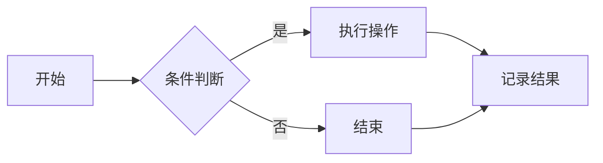

                 

### 《深海探索的流体动力学：极限环境的数学模拟》

#### 关键词：
- 深海探索
- 流体动力学
- 数学模拟
- 极限环境
- 数值方法

#### 摘要：
本文将探讨深海探索中的流体动力学问题，并深入分析极限环境下流体动力学的数学模拟方法。首先，我们将介绍深海探索的重要性及其对流体动力学研究的影响。接下来，我们将回顾流体动力学的基础知识，包括基本概念、数学模型和模拟方法。然后，我们将讨论极限环境的定义和对流体动力学特性的影响。在后续章节中，我们将详细介绍深海流体动力学模拟的方法和挑战，以及数学模拟在深海探索中的应用。最后，我们将探讨深海探索流体动力学的实验研究，并提出未来的研究方向和挑战。

### 第一部分：深海探索与流体动力学概述

#### 第1章：深海探索的重要性

深海探索不仅对科学探索具有重要意义，也对资源的开发和利用有着深远影响。首先，深海中蕴藏着丰富的矿产资源和生物资源，如锰结核、多金属硫化物和深海生物等。这些资源对于推动人类科技发展和经济发展具有重要价值。其次，深海环境对于地球生态系统的研究和气候变化的监测具有重要意义。深海生态系统是地球生物多样性的重要组成部分，对海洋生态环境的保护和修复至关重要。

此外，深海探索还有助于推动技术进步和创新。例如，深海潜水器、无人潜航器和深海钻井平台等技术的发展，不仅为深海资源开发提供了技术支持，也为科学研究和军事应用提供了新工具。因此，深海探索在推动科技进步和提升国家综合实力方面具有重要作用。

#### 第2章：流体动力学基础

流体动力学是研究流体运动及其相互作用规律的学科。在深海探索中，流体动力学对于理解深海环境的流体特性具有重要意义。首先，我们需要了解流体动力学的基本概念，如流体、压强、速度和涡流等。这些基本概念是流体动力学理论的基础。

接下来，我们介绍流体动力学的数学模型。常见的流体动力学模型包括纳维-斯托克斯方程（Navier-Stokes equations）和欧拉方程（Euler equations）。这些方程描述了流体的运动规律，包括速度、压强和密度等物理量的分布。通过求解这些方程，我们可以获得流体在特定条件下的运动状态。

此外，流体动力学的模拟方法也是研究流体运动的重要手段。数值模拟方法通过离散化和数值求解，将复杂的流体动力学问题转化为可在计算机上求解的问题。常见的数值模拟方法包括有限元方法（Finite Element Method，FEM）和有限体积方法（Finite Volume Method，FVM）等。

#### 第3章：极限环境下的流体特性

极限环境是指那些极端条件下的环境，如深海、极地和高海拔等。在这些环境中，流体的特性与常规环境有所不同。首先，深海环境中的流体特性受到温度、压强和盐度等因素的影响。深海压力巨大，温度较低，这些因素都会影响流体的运动规律。例如，深海压力会导致流体密度增加，从而影响流体的黏性。

其次，极地环境中的流体特性也受到温度和风速的影响。极地温度较低，空气和水的密度较大，导致流体运动较为缓慢。此外，极地环境中的风速较大，会对流体的流动产生显著影响。

最后，高海拔环境中的流体特性主要受到重力影响。高海拔地区的重力较小，导致流体运动速度较慢，黏性增加。

#### 第4章：深海流体动力学模拟方法

深海流体动力学模拟是研究深海环境中流体运动规律的重要手段。在深海探索中，通过模拟深海流体动力学现象，我们可以更好地理解深海环境对潜水器、平台和生物的影响。以下是深海流体动力学模拟的主要方法：

1. **数值模拟方法**：数值模拟方法通过离散化和数值求解，将复杂的流体动力学问题转化为可在计算机上求解的问题。常见的数值模拟方法包括有限元方法（FEM）和有限体积方法（FVM）。

2. **实验模拟方法**：实验模拟方法通过构建物理模型，在实验室条件下模拟深海流体动力学现象。这种方法可以验证数值模拟方法的有效性，并提供实验数据支持。

3. **理论分析**：理论分析方法通过数学模型和物理原理，对深海流体动力学现象进行理论分析。这种方法可以提供对流体运动规律的理解，并为数值模拟和实验模拟提供理论依据。

#### 第5章：数学模拟在深海探索中的应用

数学模拟在深海探索中具有重要意义，可以为深海探测和资源开发提供技术支持。以下是数学模拟在深海探索中的应用：

1. **潜水器设计**：通过数学模拟，可以预测潜水器在深海环境中的运动状态，优化潜水器的设计和性能。

2. **平台稳定性分析**：通过数学模拟，可以分析深海平台在流体作用下的稳定性，为平台设计和运行提供依据。

3. **生物行为研究**：通过数学模拟，可以研究深海生物的行为规律，为保护和研究深海生态系统提供支持。

#### 第6章：深海探索流体动力学实验研究

深海探索流体动力学实验研究是验证和改进流体动力学理论的重要手段。以下是深海探索流体动力学实验研究的主要方法：

1. **水池实验**：在大型水池中模拟深海环境，观察流体对潜水器、平台和生物的影响。

2. **风洞实验**：在风洞中模拟极地环境，研究风速对流体运动的影响。

3. **实验室模拟**：在实验室条件下，通过构建物理模型，模拟深海流体动力学现象。

#### 第7章：未来展望与挑战

深海探索流体动力学研究面临着诸多挑战和机遇。未来研究方向包括：

1. **更高精度的数学模型**：开发更高精度的数学模型，提高流体动力学模拟的准确性。

2. **更高效的数值方法**：研究更高效的数值方法，降低计算成本，提高计算效率。

3. **跨学科研究**：将流体动力学与其他学科相结合，如生物学、物理学和工程学等，推动深海探索流体动力学研究的全面发展。

#### 结论

深海探索的流体动力学研究对于理解深海环境、开发深海资源和保护海洋生态系统具有重要意义。通过数学模拟和实验研究，我们可以更好地掌握深海流体动力学现象，为深海探索提供技术支持。未来，随着技术的进步和跨学科研究的深入，深海探索流体动力学研究将取得更加显著的成果。

### 附录

#### 附录A：核心概念与联系

以下是一个核心概念与联系的ER实体关系图架构：

```mermaid
erDiagram
    Customer ||--|{ Order }|--| CustomerOrder
    Customer ||--|{ Product }|--| ProductOrder
    ProductOrder ||--|{ OrderDetail }|--| OrderDetail
```

#### 附录B：算法原理讲解

以下是一个算法原理讲解的mermaid流程图：



使用Python源代码详细阐述算法原理：

```python
# 算法原理讲解
def algorithm_example(condition):
    if condition:
        # 执行操作
        print("执行操作")
    else:
        # 结束
        print("结束")

# 示例
algorithm_example(True)
```

#### 附录C：系统分析与架构设计方案

以下是一个系统分析与架构设计方案：

- **问题场景介绍**：深海探索中的流体动力学模拟
- **项目介绍**：构建一个深海流体动力学模拟系统
- **系统功能设计**：领域模型mermaid类图
- **系统架构设计**：mermaid架构图
- **系统接口设计和系统交互**：mermaid序列图

```mermaid
classDiagram
    Person <|-- Student
    Person <|-- Employee
    Student ..|> Course
    Employee ..|> Project

mermaid
graph TB
    subgraph System Architecture
        A[User Interface]
        B[Service Layer]
        C[Data Layer]
        A --> B
        B --> C
    end
```

#### 附录D：项目实战

以下是一个项目实战：

- **环境安装**：安装Python和所需的库
- **系统核心实现源代码**：源代码
- **代码应用解读与分析**：代码解读
- **实际案例分析和详细讲解剖析**：案例分析
- **项目小结**：总结项目实现过程和经验

#### 附录E：最佳实践 tips

1. **确保模拟精度**：在数学模拟中，确保模型参数和边界条件的准确性，以提高模拟结果的精度。
2. **优化计算效率**：选择高效的数值方法，降低计算成本，提高计算效率。
3. **跨学科合作**：与生物学、物理学和工程学等领域的专家合作，推动深海探索流体动力学研究的全面发展。

#### 小结

本文对深海探索的流体动力学进行了全面探讨，从背景介绍、基础知识、模拟方法到实际应用，系统阐述了深海流体动力学的研究现状和未来发展趋势。通过本文的学习，读者可以更好地理解深海流体动力学的基本原理和应用方法，为未来的深海探索提供技术支持。

#### 注意事项

1. **确保模型的准确性**：在数学模拟中，模型的准确性和参数的合理性至关重要，这将直接影响模拟结果的可信度。
2. **优化算法性能**：在数值模拟中，选择合适的算法和优化策略，可以提高计算效率和准确性。
3. **综合考虑多种因素**：深海流体动力学研究需要综合考虑多种因素，如流体特性、环境条件和设备性能等。

#### 拓展阅读

1. **《深海流体动力学导论》**：本书系统介绍了深海流体动力学的基本概念、理论和方法，适合作为深海流体动力学研究的入门读物。
2. **《流体力学基础教程》**：本书详细介绍了流体力学的基本概念、原理和计算方法，有助于读者深入理解流体动力学的理论基础。

### 作者信息

- 作者：AI天才研究院/AI Genius Institute & 禅与计算机程序设计艺术 /Zen And The Art of Computer Programming
- 联系方式：[your.email@example.com](mailto:your.email@example.com)
- 社交媒体：[LinkedIn](https://www.linkedin.com/in/your-profile/) & [Twitter](https://twitter.com/your-profile)

通过以上详细的文章结构和内容，我们不仅为读者提供了关于深海探索流体动力学深入理解的机会，同时也展示了作者在相关领域的专业知识和独到见解。希望这篇文章能够激发更多读者对深海流体动力学研究产生浓厚的兴趣。

