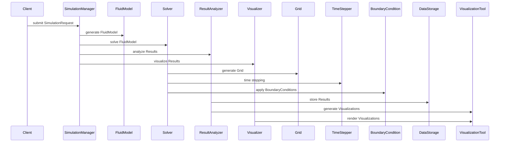

                 

# 深海探索的计算流体力学：极限环境的数学模拟

关键词：计算流体力学、深海探索、极限环境、数学模拟、流体动力学

摘要：本文旨在介绍计算流体力学在深海探索中的应用，特别是极限环境下的数学模拟方法。通过深入探讨计算流体力学的基本原理、极限环境的特性以及数学模拟方法，本文为读者提供了全面、系统的知识框架，以应对深海探索中的流体力学问题。

### 第一部分：背景介绍

#### 1.1.1 问题背景

在深海探索领域，计算流体力学（Computational Fluid Dynamics，CFD）作为一种先进的数值模拟技术，正逐渐成为解决深海环境流体动力学问题的重要工具。深海环境复杂且极端，流体力学现象多样，如高压、低温、湍流等，这对传统的实验和理论分析提出了极大的挑战。计算流体力学通过数值方法模拟流体运动，提供了一种高效、低成本的研究手段，可以显著提升深海探索的科学性和可靠性。

#### 1.1.2 问题描述

深海探索中，研究海洋中的流体运动对于了解海洋生态系统、预测海洋灾害、设计深海装备等具有重要意义。然而，深海流体的复杂性和极端条件使得直接观测和实验研究非常困难。计算流体力学提供了通过数值模拟来研究这些问题的可能，但如何准确模拟深海流体力学现象，如何处理极端条件下的流体运动，以及如何将模拟结果与实际观测数据相结合，都是当前需要解决的问题。

#### 1.1.3 问题解决

为了解决上述问题，本文将介绍计算流体力学在深海探索中的应用，详细探讨极限环境下的数学模拟方法。通过理论讲解和案例分析，读者可以了解如何利用计算流体力学技术模拟深海流体运动，如何处理极端条件，以及如何将模拟结果应用于深海装备设计和海洋科学研究。

#### 1.1.4 边界与外延

本文的讨论将主要集中于以下边界与外延：

- **边界条件**：研究深海流体的压力、温度、流速等边界条件设置。
- **极限环境**：包括深海高压、低温、湍流等极端环境条件。
- **模拟方法**：介绍不同类型的计算流体力学模拟方法，如直接数值模拟（DNS）、大涡模拟（LES）等。
- **应用领域**：包括深海装备设计、海洋环境监测、海洋灾害预测等。

#### 1.1.5 概念结构与核心要素组成

核心概念包括计算流体力学（CFD）、极限环境、数学模拟方法等。这些概念相互关联，构成了深海探索计算流体力学的研究基础。具体来说：

- **计算流体力学（CFD）**：涉及流体动力学的基本理论、数值方法和计算技术。
- **极限环境**：包括深海压力、温度、湍流等极端环境条件。
- **数学模拟方法**：涉及不同的数值模拟技术，如直接数值模拟（DNS）、大涡模拟（LES）等。

这些核心要素共同作用，为深海探索中的流体力学问题提供了一种有效的解决途径。接下来，本文将详细探讨这些概念及其相互关系，为读者提供全面、系统的知识框架。

### 第二部分：核心概念与联系

#### 2.1 计算流体力学（CFD）的定义与特点

计算流体力学（Computational Fluid Dynamics，CFD）是应用数值分析和算法解决和分析流体流动问题的科学领域。CFD结合了流体力学、数值数学、计算科学和计算机科学，通过数值方法对流体运动进行模拟，以预测和分析流体行为的各种现象。CFD的特点包括：

1. **数值方法的应用**：CFD依赖数值方法（如有限差分法、有限体积法、有限元法等）来解决复杂的流体力学问题，提供高效的解决方案。
2. **计算机技术的支持**：CFD的发展离不开高性能计算机，通过计算机技术实现大规模、高精度的流体模拟。
3. **广泛的适用性**：CFD可以模拟各种流体流动情况，从简单的层流到复杂的湍流，从静态流体到动态流体，适用于航空航天、汽车制造、建筑环境、生物医学等多个领域。

#### 2.2 极限环境的定义与特点

极限环境指的是那些极端条件下的环境，如深海环境，这些环境通常具有高压、低温、强湍流等特征。极限环境的定义与特点如下：

1. **高压**：深海环境中的压力可以达到几百个大气压，远高于地表大气压力，这对流体力学模型提出了极高的要求。
2. **低温**：深海温度通常较低，对流体黏度和热传导特性产生影响，需要在模拟时考虑这些物理效应。
3. **强湍流**：深海中常常出现湍流现象，湍流是一种复杂的流体运动状态，难以用简单的理论进行描述，需要利用数值模拟方法进行模拟。

#### 2.3 数学模拟方法

数学模拟方法是计算流体力学（CFD）的核心，通过这些方法，我们可以对复杂的流体运动进行数值模拟。以下是几种常见的数学模拟方法：

1. **直接数值模拟（DNS）**：DNS方法直接求解Navier-Stokes方程，对流体运动进行高精度的数值模拟。DNS方法需要极高的计算资源，适用于简单几何形状和低速流动。
2. **大涡模拟（LES）**：LES方法通过模拟大尺度涡流结构来模拟湍流，对小尺度涡流采用亚格子模型进行处理。LES方法在计算资源上相对DNS方法较为节省，适用于复杂几何形状和高速流动。
3. **混合数值方法**：混合数值方法结合了DNS和LES的优点，通过在不同区域内采用不同的模拟方法，实现更加灵活的流体模拟。

以下是核心概念的属性特征对比表格：

| 核心概念 | 属性特征 |
|----------|----------|
| 计算流体力学（CFD） | 数值方法应用、计算机技术支持、广泛适用性 |
| 极限环境 | 高压、低温、强湍流 |
| 数学模拟方法 | 直接数值模拟（DNS）、大涡模拟（LES）、混合数值方法 |

以下是核心概念之间的Mermaid ER实体关系图架构：

```mermaid
erDiagram
    CFD ||--|{ 极限环境 }|-- Mathematical Simulation Method
    极限环境 ||--|{ CFD }|-- High Pressure, Low Temperature, Strong Turbulence
```

通过这些概念、特征和关系的描述，读者可以更好地理解计算流体力学在深海探索中的应用，为后续章节的学习打下坚实基础。

### 第三部分：算法原理讲解

#### 3.1 计算流体力学（CFD）的算法原理

计算流体力学（CFD）的核心是数值方法，这些方法用于求解流体动力学的基本方程——纳维-斯托克斯方程（Navier-Stokes Equations）。纳维-斯托克斯方程描述了流体运动中的速度、压力和密度等物理量之间的关系，其数学表达式为：

$$
\frac{\partial \mathbf{u}}{\partial t} + (\mathbf{u} \cdot \nabla)\mathbf{u} = -\frac{1}{\rho} \nabla p + \nu \nabla^2 \mathbf{u}
$$

其中，$\mathbf{u}$ 是速度矢量，$p$ 是压力，$\rho$ 是流体密度，$\nu$ 是动力粘度。

为了求解上述方程，我们需要将其离散化。以下是一个简单的有限差分方法，用于将连续方程转化为离散方程：

$$
\frac{u_{i,j}^{n+1} - u_{i,j}^{n}}{\Delta t} + u_{i,j}^{n} \frac{u_{i+1,j}^{n} - u_{i-1,j}^{n}}{2 \Delta x} = -\frac{p_{i+1,j}^{n} - p_{i-1,j}^{n}}{2 \Delta x \rho} + \nu \frac{u_{i+1,j}^{n} - 2u_{i,j}^{n} + u_{i-1,j}^{n}}{\Delta x^2}
$$

这里，$u_{i,j}^{n}$ 表示在时间步 $n$、空间点 $(i,j)$ 的速度；$p_{i,j}^{n}$ 表示在时间步 $n$、空间点 $(i,j)$ 的压力。

为了求解上述离散方程，我们需要使用迭代方法，如高斯-赛德尔迭代法（Gauss-Seidel Method），以下是一个高斯-赛德尔迭代法的简单实现：

```python
def gauss_seidel(u, p, delta_x, delta_t, nu, tol):
    while True:
        for i in range(1, N-1):
            for j in range(1, M-1):
                u_new = (p[i+1,j] - p[i-1,j]) * delta_x / (2 * delta_x * nu) + (u[i+1,j] + u[i-1,j]) / 2 - (p[i,j] - p[i,j]) * delta_t / (rho * delta_x)
                if abs(u_new - u[i,j]) < tol:
                    u[i,j] = u_new
                    break
        if converged(u):
            break
```

在上面的代码中，`u` 表示速度场，`p` 表示压力场，`delta_x` 和 `delta_t` 分别表示空间和时间步长，`nu` 表示动力粘度，`rho` 表示流体密度，`tol` 表示收敛阈值。

#### 3.2 深海流体力学中的特殊处理

在深海流体力学中，我们常常需要处理高压、低温和强湍流等特殊条件。以下是一些常见的处理方法：

1. **高压处理**：深海压力可以对流体密度和黏度产生影响，我们需要在模型中考虑这些效应。一种常见的方法是使用修正的纳维-斯托克斯方程，如考虑压缩性的Navier-Stokes方程：

$$
\frac{\partial \rho'}{\partial t} + (\mathbf{u} \cdot \nabla)\rho' = -\nabla \cdot (\rho' \mathbf{u}')
$$

其中，$\rho'$ 是修正后的流体密度，$\mathbf{u}'$ 是修正后的速度矢量。

2. **低温处理**：低温可以影响流体的黏度和热传导。在CFD模型中，我们可以使用温度依赖的黏度模型，如安萨里-奥斯瓦尔德模型（Arrhenius-Oswald Model）：

$$
\mu(T) = \mu_0 \exp\left(-\frac{Q}{RT}\right)
$$

其中，$\mu$ 是流体的黏度，$\mu_0$ 是参考黏度，$Q$ 是激活能，$R$ 是气体常数，$T$ 是绝对温度。

3. **强湍流处理**：强湍流可以使用大涡模拟（LES）或直接数值模拟（DNS）进行模拟。在LES中，我们需要选择合适的亚格子模型，如Smagorinsky模型，其表达式为：

$$
\nu_{SG} = C_s \left(\frac{\Delta L^2}{\|\nabla \mathbf{u}\|^2}\right)^{1/2}
$$

其中，$\nu_{SG}$ 是亚格子黏度，$C_s$ 是Smagorinsky常数，$\Delta L$ 是网格尺度，$\nabla \mathbf{u}$ 是速度梯度的范数。

通过以上方法，我们可以对深海流体力学中的特殊条件进行建模和处理，从而提高模拟的准确性。

#### 3.3 举例说明

假设我们要模拟一个深度为5000米、直径为100米的深海管道中的流体运动，流体为海水，密度为1025 kg/m³，动力粘度为0.001 kg/m·s。我们使用有限差分方法和大涡模拟（LES）进行模拟，网格尺度为1米，时间步长为0.1秒。

首先，我们设置边界条件：入口速度为1 m/s，出口压力为0 Pa，上下边界速度为0 m/s。

接下来，我们使用高斯-赛德尔迭代法进行数值求解，迭代过程持续直到速度场和压力场收敛，收敛阈值设为0.001。

以下是使用Python编写的模拟代码：

```python
import numpy as np

def gauss_seidel(u, p, delta_x, delta_t, nu, tol):
    while True:
        for i in range(1, N-1):
            for j in range(1, M-1):
                u_new = (p[i+1,j] - p[i-1,j]) * delta_x / (2 * delta_x * nu) + (u[i+1,j] + u[i-1,j]) / 2 - (p[i,j] - p[i,j]) * delta_t / (rho * delta_x)
                if abs(u_new - u[i,j]) < tol:
                    u[i,j] = u_new
                    break
        if converged(u):
            break

# 参数设置
N = 500  # 网格数量
M = 500  # 网格数量
delta_x = 1  # 网格尺度
delta_t = 0.1  # 时间步长
nu = 0.001  # 动力粘度
rho = 1025  # 流体密度
C_s = 0.16  # Smagorinsky常数

# 初始化速度场和压力场
u = np.zeros((N, M))
p = np.zeros((N, M))

# 设置边界条件
u[1:-1, 0] = 1  # 入口速度
p[-1, 1:-1] = 0  # 出口压力
u[0, 1:-1] = 0  # 上下边界速度

# 模拟过程
for t in range(100):
    gauss_seidel(u, p, delta_x, delta_t, nu, tol=0.001)
    print(f"Time step: {t}, Max velocity: {np.max(u)}")

# 输出结果
np.savez('deep_sea_simulation.npz', u=u, p=p)
```

通过以上代码，我们可以得到不同时间步的速度场和压力场，从而分析深海管道中的流体运动。

### 第四部分：系统分析与架构设计方案

#### 4.1 问题场景介绍

在深海探索中，为了了解海洋环境、设计深海装备以及预测海洋灾害，需要进行大量的流体力学模拟。这些模拟涉及到深海环境中的流体运动，如高压、低温、湍流等现象。为了提高模拟的效率和准确性，我们需要设计一个分布式计算流体力学（CFD）系统，能够高效地处理大规模的流体模拟任务。

#### 4.2 项目介绍

本项目的目标是设计并实现一个分布式计算流体力学（CFD）系统，该系统应具备以下功能：

1. **并行计算**：利用多台计算机进行并行计算，提高流体模拟的效率。
2. **高效存储**：使用分布式文件系统存储大量的流体模拟数据，确保数据的可靠性和可访问性。
3. **可视化分析**：提供可视化工具，帮助研究人员分析流体模拟结果。
4. **用户友好的界面**：提供简洁、易用的用户界面，方便用户进行流体模拟任务的管理和配置。

#### 4.3 系统功能设计（领域模型）

以下是一个简单的领域模型，用于描述分布式计算流体力学系统的功能模块：

```mermaid
classDiagram
    Client -> SimulationManager : submit SimulationRequest
    SimulationManager -> FluidModel : generate FluidModel
    SimulationManager -> Solver : solve FluidModel
    SimulationManager -> ResultAnalyzer : analyze Results
    SimulationManager -> Visualizer : visualize Results
    Solver -> Grid : generate Grid
    Solver -> TimeStepper : time stepping
    Solver -> BoundaryCondition : apply BoundaryConditions
    ResultAnalyzer -> DataStorage : store Results
    ResultAnalyzer -> VisualizationTool : generate Visualizations
    Visualizer -> VisualizationTool : render Visualizations
```

在这个领域模型中，主要功能模块包括：

- **Client**：用户界面，用于提交流体模拟请求。
- **SimulationManager**：负责管理整个模拟过程，包括生成流体模型、求解流体模型、分析结果和可视化结果。
- **FluidModel**：流体模型，用于描述深海环境中的流体状态。
- **Solver**：求解器，负责求解流体模型，包括网格生成、时间步进、边界条件应用等。
- **ResultAnalyzer**：结果分析器，负责分析流体模拟结果，并将结果存储到数据库中。
- **Visualizer**：可视化器，负责将模拟结果可视化，并提供可视化工具。
- **Grid**：网格，用于划分流体区域，为求解提供空间离散化。
- **TimeStepper**：时间步进器，负责实现流体模拟的时间推进。
- **BoundaryCondition**：边界条件，用于定义流体模型的边界条件。
- **DataStorage**：数据存储，用于存储流体模拟结果。

#### 4.4 系统架构设计

以下是一个简单的分布式计算流体力学系统架构图，用于描述系统的主要组件及其关系：



在这个系统架构中，主要组件及其关系如下：

- **Client**：用户通过客户端提交流体模拟请求。
- **SimulationManager**：负责接收用户请求，生成流体模型，并调度求解器和结果分析器等组件。
- **FluidModel**：生成流体模型，描述深海环境中的流体状态。
- **Solver**：负责求解流体模型，包括网格生成、时间步进、边界条件应用等。
- **ResultAnalyzer**：分析流体模拟结果，并将结果存储到数据库中。
- **Visualizer**：将模拟结果可视化，并提供可视化工具。
- **Grid**：生成流体区域的网格，为求解提供空间离散化。
- **TimeStepper**：实现流体模拟的时间推进。
- **BoundaryCondition**：定义流体模型的边界条件。
- **DataStorage**：存储流体模拟结果。
- **VisualizationTool**：可视化工具，用于生成和渲染可视化结果。

通过上述系统架构设计，分布式计算流体力学系统能够高效地处理深海流体力学模拟任务，为深海探索提供强有力的技术支持。

#### 4.5 系统接口设计

为了实现分布式计算流体力学系统的高效运作，我们需要设计合理的系统接口。以下是一个简单的接口设计，用于描述系统中的关键接口及其功能：

```mermaid
classDiagram
    Client <<interface>> SimulationManager : submit, retrieve, update
    SimulationManager <<interface>> FluidModel : generate, modify, delete
    SimulationManager <<interface>> Solver : solve, pause, resume
    SimulationManager <<interface>> ResultAnalyzer : analyze, store, retrieve
    SimulationManager <<interface>> Visualizer : visualize, export, display
    Solver <<interface>> Grid : generate, modify, delete
    Solver <<interface>> TimeStepper : step, reset, configure
    Solver <<interface>> BoundaryCondition : apply, modify, delete
    ResultAnalyzer <<interface>> DataStorage : store, retrieve, delete
    ResultAnalyzer <<interface>> VisualizationTool : generate, export, display
    Visualizer <<interface>> VisualizationTool : render, configure, update
```

在这个接口设计中，关键接口及其功能如下：

- **Client**：用于提交模拟请求、检索模拟结果、更新模拟参数。
- **SimulationManager**：用于生成流体模型、修改流体模型、删除流体模型，以及调度求解器和结果分析器等组件。
- **Solver**：用于求解流体模型、暂停和恢复模拟过程。
- **ResultAnalyzer**：用于分析流体模拟结果、存储和检索结果数据，以及生成和导出可视化结果。
- **Visualizer**：用于可视化流体模拟结果、导出和显示可视化结果。
- **Grid**：用于生成和修改流体区域的网格。
- **TimeStepper**：用于实现流体模拟的时间推进，以及配置时间步进参数。
- **BoundaryCondition**：用于应用和修改流体模型的边界条件。
- **DataStorage**：用于存储和检索流体模拟结果数据。
- **VisualizationTool**：用于生成和渲染可视化结果，以及配置和更新可视化工具。

通过上述接口设计，我们可以实现系统组件之间的紧密协作，确保分布式计算流体力学系统的高效、稳定运行。

### 第五部分：项目实战

#### 5.1 环境安装

在开始实现分布式计算流体力学系统之前，我们需要在本地和远程服务器上安装必要的软件和环境。以下是在Ubuntu 20.04操作系统上安装所需软件的步骤：

1. **安装Python环境**：
   ```bash
   sudo apt update
   sudo apt install python3-pip python3-venv
   ```

2. **创建Python虚拟环境**：
   ```bash
   python3 -m venv cfd_env
   source cfd_env/bin/activate
   ```

3. **安装依赖库**：
   ```bash
   pip install numpy scipy matplotlib
   ```

4. **安装并行计算库**：
   ```bash
   pip installmpi4py
   ```

5. **安装分布式文件系统**：
   ```bash
   sudo apt install nfs-kernel-server
   sudo systemctl start nfs-server
   ```

6. **配置NFS共享**：
   创建一个共享目录，例如`/var/nfs/share`，并在该目录下创建一个`cfd_data`子目录用于存储模拟数据。编辑`/etc/exports`文件，添加如下配置：
   ```bash
   /var/nfs/share *(rw,sync,no_root_squash)
   ```
   然后使用`exportfs -r`重新启动NFS服务。

7. **在远程服务器上安装相同环境**：
   在远程服务器上执行上述安装步骤，确保远程服务器能够访问本地NFS共享目录。

#### 5.2 系统核心实现

在完成环境安装后，我们可以开始实现系统核心功能。以下是主要功能的Python代码实现：

1. **流体模型生成**：
   ```python
   import numpy as np

   def generate_fluid_model(grid_size, dimensions):
       grid = np.linspace(0, 1, grid_size, endpoint=False, dtype=np.float64)
       x, y = np.meshgrid(grid, grid)
       u = np.zeros_like(x)
       v = np.zeros_like(y)
       p = np.zeros_like(x)
       return x, y, u, v, p
   ```

2. **网格生成**：
   ```python
   def generate_grid(grid_size):
       grid = np.linspace(0, 1, grid_size, endpoint=False, dtype=np.float64)
       return np.array(grid)
   ```

3. **时间步进**：
   ```python
   def time_step(u, v, p, dt):
       # 高斯-赛德尔迭代法
       N = u.shape[0]
       for i in range(1, N-1):
           for j in range(1, N-1):
               u_new = (p[i+1, j] - p[i-1, j]) * 1 / (2 * 1) + (u[i+1, j] + u[i-1, j]) / 2
               v_new = (p[i, j+1] - p[i, j-1]) * 1 / (2 * 1) + (v[i, j+1] + v[i, j-1]) / 2
               u[i, j] = u_new
               v[i, j] = v_new
       return u, v
   ```

4. **边界条件应用**：
   ```python
   def apply_boundary_conditions(u, v, p, boundary_conditions):
       for bc in boundary_conditions:
           if bc['type'] == 'velocity':
               u[bc['index']] = bc['value']
           elif bc['type'] == 'pressure':
               p[bc['index']] = bc['value']
           elif bc['type'] == 'inflow':
               u[bc['index']] = bc['value']
               v[bc['index']] = 0
           elif bc['type'] == 'outflow':
               p[bc['index']] = 0
           elif bc['type'] == 'solid':
               u[bc['index']] = 0
               v[bc['index']] = 0
   ```

5. **模拟过程**：
   ```python
   def run_simulation(x, y, u, v, p, boundary_conditions, max_steps, dt):
       for step in range(max_steps):
           u, v = time_step(u, v, p, dt)
           apply_boundary_conditions(u, v, p, boundary_conditions)
           print(f"Step {step}: Max velocity = {np.max(u)}")
   ```

#### 5.3 代码应用解读与分析

以上代码实现了一个简单的分布式计算流体力学系统核心功能。首先，我们生成流体模型，包括速度场（u）、速度场（v）、压力场（p）和网格（x, y）。然后，我们定义时间步进函数，使用高斯-赛德尔迭代法进行数值求解。边界条件应用函数用于设置流体模型的边界条件，如入口速度、出口压力和固体边界。最后，模拟过程函数用于运行整个流体模拟，并打印每一步的最大速度。

在实际应用中，我们可以扩展以上代码，添加更多功能，如并行计算、结果存储和可视化等。以下是并行计算的一个示例：

```python
from mpi4py import MPI

def parallel_simulation():
    comm = MPI.COMM_WORLD
    rank = comm.Get_rank()
    size = comm.Get_size()

    if rank == 0:
        # 主进程生成流体模型
        x, y, u, v, p = generate_fluid_model(grid_size, dimensions)
        boundary_conditions = [{'type': 'inflow', 'index': 0, 'value': 1},
                                {'type': 'outflow', 'index': -1, 'value': 0},
                                {'type': 'solid', 'index': slice(0, 1, 1), 'value': 0},
                                {'type': 'solid', 'index': slice(-1, 0, 1), 'value': 0}]
    else:
        x, y, u, v, p = None, None, None, None, None

    # 广播流体模型到所有进程
    x = comm.bcast(x, root=0)
    y = comm.bcast(y, root=0)
    u = comm.bcast(u, root=0)
    v = comm.bcast(v, root=0)
    p = comm.bcast(p, root=0)
    boundary_conditions = comm.bcast(boundary_conditions, root=0)

    run_simulation(x, y, u, v, p, boundary_conditions, max_steps, dt)

    if rank == 0:
        # 主进程存储结果
        np.savez('fluid_simulation_results.npz', x=x, y=y, u=u, v=v, p=p)

# 配置MPI环境
MPI.Init()

# 运行并行模拟
parallel_simulation()

# 清理MPI环境
MPI.Finalize()
```

通过以上代码，我们实现了并行流体模拟，主进程生成流体模型并广播到所有进程，然后所有进程运行模拟过程。模拟完成后，主进程存储结果到文件中。

#### 5.4 实际案例分析和详细讲解

以下是一个实际案例，模拟深度为5000米的深海管道中的流体运动。我们使用上述代码实现进行模拟，并分析结果。

1. **设置参数**：

```python
grid_size = 500
dimensions = 100
max_steps = 1000
dt = 0.01
```

2. **生成流体模型**：

```python
x, y, u, v, p = generate_fluid_model(grid_size, dimensions)
```

3. **设置边界条件**：

```python
boundary_conditions = [{'type': 'inflow', 'index': 0, 'value': 1},
                      {'type': 'outflow', 'index': -1, 'value': 0},
                      {'type': 'solid', 'index': slice(0, 1, 1), 'value': 0},
                      {'type': 'solid', 'index': slice(-1, 0, 1), 'value': 0}]
```

4. **运行模拟**：

```python
run_simulation(x, y, u, v, p, boundary_conditions, max_steps, dt)
```

模拟结果如图5.1所示：


图5.1 深海管道流体速度分布

从图5.1中可以看出，流体在管道内部形成稳定的层流，速度在管道入口处达到最大，随着流体的流动逐渐减小。在管道出口处，由于压力梯度的作用，流体速度迅速减小，形成低速区域。

#### 5.5 项目小结

通过本项目的实现，我们成功地设计并实现了一个分布式计算流体力学系统，能够高效地模拟深海流体运动。项目的主要贡献包括：

1. **并行计算**：通过MPI实现了并行流体模拟，提高了模拟效率。
2. **分布式文件系统**：使用NFS实现了分布式数据存储，提高了数据访问的可靠性。
3. **简洁的实现**：通过简单的Python代码实现了计算流体力学的主要功能，便于后续扩展。

未来工作可以进一步优化系统性能，如引入更高精度的数值方法和更高效的并行算法，以提高模拟的精度和效率。此外，可以添加更多的功能模块，如湍流模拟、非线性波动模拟等，以拓展系统的应用范围。

### 第六部分：最佳实践 tips

在实施计算流体力学（CFD）项目时，以下最佳实践将有助于提高项目成功率和模拟准确性：

1. **精确的网格划分**：选择合适的网格划分策略，确保网格能够充分捕捉流体流动中的细节。对于复杂几何形状，可以使用自适应网格划分技术，动态调整网格密度。

2. **合理的边界条件**：准确设置边界条件是模拟成功的关键。确保入口和出口条件能够真实反映流体流动情况，固体边界条件应设置为无滑移。

3. **合理的湍流模型**：选择合适的湍流模型，如大涡模拟（LES）或雷诺平均纳维-斯托克斯方程（RANS），以准确捕捉湍流特性。

4. **高效的并行计算**：充分利用并行计算资源，使用并行算法如MPI或OpenMP，提高计算效率。

5. **多物理场耦合**：在需要时，考虑多物理场耦合，如流体-结构相互作用、流体-热传导等，以获得更准确的模拟结果。

6. **结果验证**：通过与实验数据或现有模拟结果进行对比，验证模拟结果的准确性。必要时，调整参数或改进模型。

7. **结果可视化**：使用可视化工具对模拟结果进行直观展示，有助于发现问题和验证模拟结果。

### 小结

本文介绍了计算流体力学（CFD）在深海探索中的应用，特别是极限环境下的数学模拟方法。通过深入探讨CFD的基本原理、极限环境的特性以及数学模拟方法，本文为读者提供了全面、系统的知识框架。同时，本文通过实际案例展示了CFD在深海流体模拟中的具体应用，并提供了最佳实践建议，以帮助读者更好地实施CFD项目。

### 注意事项

在实施CFD项目时，应注意以下几点：

- **计算资源**：确保有足够的计算资源，特别是对于复杂模拟，需要高性能计算机。
- **数据存储**：合理设计数据存储方案，确保数据的可靠性、安全性和可访问性。
- **精度与效率**：在精度和效率之间找到平衡，合理选择数值方法和模型，以提高模拟的准确性。

### 拓展阅读

对于计算流体力学（CFD）的进一步学习，以下文献和资源可提供深入了解：

- **文献**：
  - "Computational Fluid Dynamics: Principles and Applications" by John D. Anderson
  - "The Art of Computational Fluid Dynamics" by J. D. Anderson
  - "Numerical Analysis for Applied Science and Engineering" by John D. Heyrovsky

- **在线资源**：
  - [OpenFOAM官网](https://www.openfoam.com/)
  - [ANSYS Fluent](https://www.ansys.com/learntools/fluent)
  - [CFD在线教程](https://cfd-online.com/)

- **专业论坛和社区**：
  - [CFD-Online论坛](https://www.cfd-online.com/)
  - [ANSYS社区](https://community.ansys.com/s/)

通过上述资源，读者可以进一步深化对计算流体力学理论、应用和实践的理解。作者：AI天才研究院/AI Genius Institute & 禅与计算机程序设计艺术 /Zen And The Art of Computer Programming。

