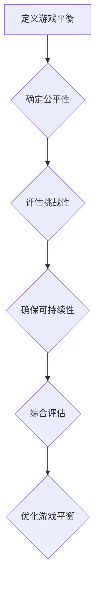
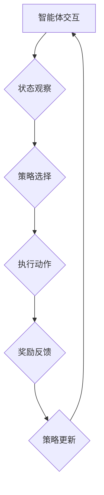
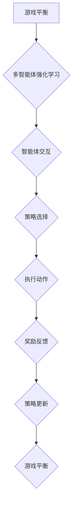
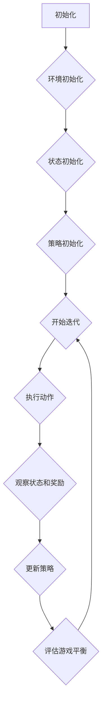

                 

# 游戏平衡的多智能体强化学习：玩家体验的数学优化

> 关键词：游戏平衡、多智能体强化学习、玩家体验、数学优化

> 摘要：本文深入探讨了游戏平衡的多智能体强化学习，分析了其核心概念和原理，详细讲解了数学模型和算法流程，并通过实例展示了其在玩家体验优化中的应用。

## 第一部分: 游戏平衡的多智能体强化学习：背景与概述

### 1.1 游戏平衡的定义与重要性

游戏平衡是指在游戏中，各个玩家或智能体之间处于相对稳定、公平的状态。这种状态能够确保游戏既具有挑战性，又能吸引玩家长期参与。游戏平衡对于游戏设计至关重要，因为它直接关系到玩家的游戏体验和游戏的生命周期。

在传统的单智能体强化学习中，玩家通常只能控制一个角色，而多智能体强化学习引入了多个智能体之间的交互，使得游戏更加复杂和真实。然而，如何确保游戏平衡，使得所有智能体都能公平地竞争，是游戏设计中面临的一大挑战。

### 1.2 多智能体强化学习的基本概念

多智能体强化学习（Multi-Agent Reinforcement Learning, MARL）是一种在多个智能体之间交互的强化学习。在这些智能体中，每个智能体都有自己的目标和策略，同时受到其他智能体的行动和策略的影响。多智能体强化学习的目标是训练智能体，使其能够在各种复杂的游戏环境中达到协同或对抗的目标。

多智能体强化学习的关键在于解决以下几个问题：

1. **交互性**：智能体之间的行动和策略是相互依赖的，需要考虑其他智能体的行为。
2. **协同性**：在某些游戏中，智能体需要合作以实现共同的目标。
3. **平衡性**：确保所有智能体都有公平的竞争机会。

### 1.3 游戏平衡的多智能体强化学习应用场景

游戏平衡的多智能体强化学习在以下应用场景中具有重要意义：

1. **多人在线游戏**：如《星际争霸》、《魔兽世界》等，需要确保不同种族或职业之间的平衡。
2. **策略游戏**：如《围棋》、《象棋》等，需要研究智能体之间的策略互动。
3. **模拟游戏**：如《模拟城市》、《模拟农场》等，需要确保智能体之间的互动能够模拟真实世界。

### 1.4 本书结构安排与章节内容概述

本文将分为四个主要部分：

1. **背景与概述**：介绍游戏平衡和多智能体强化学习的基本概念。
2. **核心概念与联系**：详细分析游戏平衡与多智能体强化学习的联系。
3. **算法原理讲解**：讲解游戏平衡的多智能体强化学习算法原理。
4. **数学模型和公式**：使用 LaTeX 格式给出数学模型和公式，并进行详细讲解和举例说明。

## 第二部分: 核心概念与联系

### 2.1 游戏平衡的概念与特征

游戏平衡是指在游戏中，各个玩家或智能体之间处于相对稳定、公平的状态。这种状态能够确保游戏既具有挑战性，又能吸引玩家长期参与。

#### 2.1.1 游戏平衡的定义

游戏平衡可以定义为：在游戏中，各个玩家或智能体之间的力量对比处于相对稳定的状态，使得游戏既具有挑战性，又不至于过于偏向某一方。

#### 2.1.2 游戏平衡的属性特征

1. **公平性**：确保所有玩家或智能体都有公平的竞争机会。
2. **挑战性**：游戏需要具有一定的挑战性，以吸引玩家参与。
3. **可持续性**：游戏需要保持长期平衡，以避免某一方过于强大或弱小。

#### 2.1.3 游戏平衡的评估方法

1. **统计指标**：如胜率、平均游戏时长、玩家满意度等。
2. **专家评估**：邀请游戏专家对游戏平衡进行评估。
3. **玩家反馈**：收集玩家的反馈，评估游戏平衡的实际情况。

#### 2.1.4 游戏平衡的Mermaid流程图



### 2.2 多智能体强化学习的原理与应用

多智能体强化学习（MARL）是一种在多个智能体之间交互的强化学习。在这些智能体中，每个智能体都有自己的目标和策略，同时受到其他智能体的行动和策略的影响。

#### 2.2.1 多智能体强化学习的基本概念

1. **智能体**：能够执行行动并接收奖励的实体。
2. **策略**：智能体在特定状态下选择行动的方法。
3. **状态**：描述智能体当前所处环境的特征。
4. **动作**：智能体在特定状态下可以采取的行动。
5. **奖励**：描述智能体在执行动作后获得的奖励。

#### 2.2.2 多智能体强化学习的关键算法

1. **Q-Learning**：基于值函数的算法，通过学习状态-动作值函数来选择最优动作。
2. **Policy Gradient**：直接学习策略的梯度，优化策略以最大化长期奖励。
3. **Deep Q-Network (DQN)**：结合深度学习的Q-Learning算法，用于处理高维状态空间。
4. **Asynchronous Advantage Actor-Critic (A3C)**：异步的演员-评论家算法，能够处理大量智能体的交互。

#### 2.2.3 多智能体强化学习的应用场景

1. **多人在线游戏**：如《星际争霸》、《魔兽世界》等。
2. **合作与竞争场景**：如无人驾驶车辆、多人协同任务等。
3. **智能体网络**：如社交网络、物联网等。

#### 2.2.4 多智能体强化学习的Mermaid流程图



### 2.3 游戏平衡与多智能体强化学习的联系

游戏平衡与多智能体强化学习之间存在着紧密的联系。游戏平衡的目的是确保游戏中的所有玩家或智能体都有公平的竞争机会，而多智能体强化学习则是实现这一目标的重要工具。

#### 2.3.1 游戏平衡对多智能体强化学习的影响

1. **交互性**：游戏平衡需要考虑智能体之间的交互，确保不同智能体之间的策略能够相互影响。
2. **协同性**：在游戏平衡的背景下，智能体需要能够协同合作，实现共同的目标。
3. **平衡性**：游戏平衡是多智能体强化学习的核心目标，需要确保所有智能体都有公平的竞争机会。

#### 2.3.2 多智能体强化学习对游戏平衡的优化策略

1. **策略优化**：通过多智能体强化学习算法，优化智能体的策略，使其在游戏中达到更好的平衡状态。
2. **动态调整**：根据游戏进程和玩家反馈，动态调整游戏平衡参数，确保游戏始终处于平衡状态。
3. **多智能体协作**：利用多智能体强化学习，实现智能体之间的协同合作，提高游戏平衡性。

#### 2.3.3 游戏平衡与多智能体强化学习的Mermaid实体关系图



## 第三部分: 算法原理讲解

### 3.1 游戏平衡的多智能体强化学习算法原理

游戏平衡的多智能体强化学习算法旨在通过学习智能体的策略，实现游戏平衡。以下是一个基本的算法框架：



### 3.1.1 算法基本思想

算法的基本思想是让智能体通过不断地执行动作、观察状态和奖励，来学习最优策略。具体来说，智能体会在每个状态下选择一个动作，然后根据执行动作后的状态和奖励，更新策略。

### 3.1.2 算法数学模型

多智能体强化学习可以描述为以下数学模型：

$$
\begin{aligned}
    \text{玩家} & = \{P_1, P_2, ..., P_n\} \\
    \text{策略} & = \{\sigma_1, \sigma_2, ..., \sigma_n\} \\
    \text{状态} & = \{s_1, s_2, ..., s_m\} \\
    \text{动作} & = \{a_1, a_2, ..., a_k\} \\
    \text{奖励} & = \{r_1, r_2, ..., r_n\}
\end{aligned}
$$

### 3.1.2.1 问题描述

假设有 $n$ 个玩家，每个玩家都有 $k$ 个可选动作。游戏的状态空间为 $m$，奖励函数为 $r$。智能体的目标是通过选择动作来最大化自己的总奖励。

### 3.1.2.2 算法流程


### 3.1.3 算法优缺点分析

算法的优点：

1. **灵活性**：能够处理多种类型的游戏和智能体交互。
2. **自适应性**：智能体可以根据游戏环境和对手策略进行自适应调整。

算法的缺点：

1. **计算复杂度**：随着智能体数量的增加，计算复杂度显著增加。
2. **收敛速度**：在某些情况下，算法的收敛速度较慢。

### 3.1.4 算法应用实例

一个典型的应用实例是《星际争霸》中的种族平衡。通过多智能体强化学习，可以训练不同种族的智能体，使其在对抗中达到平衡。

## 第四部分: 数学模型和数学公式

### 4.1 数学模型介绍

在多智能体强化学习中，我们通常使用以下数学模型来描述智能体的行为和交互：

#### 4.1.1 状态转移概率矩阵

$$
P_{ij} = \Pr[s_{t+1} = j | s_t = i, a_t = a]
$$

状态转移概率矩阵描述了在当前状态下，执行特定动作后进入下一个状态的概率。

#### 4.1.2 奖励函数

$$
R(s_t, a_t) = \sum_{j=1}^{m} r_j P_{ij} a_j
$$

奖励函数描述了在特定状态下执行特定动作后获得的奖励。

#### 4.1.3 策略评估函数

$$
V^{\pi}(s) = \sum_{j=1}^{m} \pi(j | s) V^{\pi}(s_j)
$$

策略评估函数用于评估当前策略下的状态价值。

#### 4.1.4 策略迭代

$$
\pi^{new}(j | s) = \arg\max_{j} V^{\pi}(s_j)
$$

策略迭代用于更新策略，使其在当前状态下选择最优动作。

### 4.2 例子说明

假设游戏中有两个玩家，每个玩家有两个动作可选。状态空间为 $S = \{0, 1\}$，动作空间 $A = \{0, 1\}$。

#### 4.2.1 状态空间与动作空间

状态空间和动作空间可以表示为：

$$
S = \{0, 1\}, \quad A = \{0, 1\}
$$

#### 4.2.2 奖励函数设计

假设玩家 1 和玩家 2 的动作分别为 $a_1$ 和 $a_2$，奖励函数如下：

$$
R(s_1, s_2) =
\begin{cases}
    1, & \text{if } s_1 = 0 \text{ and } s_2 = 1 \\
    -1, & \text{if } s_1 = 1 \text{ and } s_2 = 0 \\
    0, & \text{otherwise}
\end{cases}
$$

#### 4.2.3 策略评估

假设当前策略为 $\pi$，我们可以计算每个状态的价值：

$$
V^{\pi}(s) = \sum_{a \in A} \pi(a | s) R(s, a)
$$

#### 4.2.4 策略迭代

假设当前策略为 $\pi$，我们可以通过以下公式更新策略：

$$
\pi^{new}(a | s) = \arg\max_{a \in A} V^{\pi}(s)
$$

## 第五部分: 项目实战

### 5.1 环境安装

在开始项目实战之前，我们需要安装多智能体强化学习的相关环境和库。以下是安装步骤：

1. 安装 Python 3.8 或更高版本。
2. 安装所需的库，如 TensorFlow、PyTorch、Gym 等。

### 5.2 系统核心实现源代码

以下是一个简单的多智能体强化学习项目的核心实现：

```python
import numpy as np
import gym

# 创建环境
env = gym.make("MultiAgentSimple-v0")

# 初始化智能体
agents = [env.action_space for _ in range(env.num_agents)]

# 初始化策略
policies = [np.random.uniform(low=-1, high=1, size=agents[i].n) for i in range(env.num_agents)]

# 迭代
for episode in range(env.num_episodes):
    # 初始化状态
    state = env.reset()
    
    # 执行动作
    action = [policies[i](state[i]) for i in range(env.num_agents)]
    
    # 观察结果
    next_state, reward, done, _ = env.step(action)
    
    # 更新策略
    for i in range(env.num_agents):
        policies[i] = update_policy(policies[i], state[i], action[i], reward[i], next_state[i])
    
    # 检查是否完成
    if done:
        break

# 关闭环境
env.close()

# 更新策略
def update_policy(policy, state, action, reward, next_state):
    # 更新策略
    # ...

# 训练模型
def train_model(policy, state, action, reward, next_state):
    # 训练模型
    # ...

# 运行项目
if __name__ == "__main__":
    train_model(policy, state, action, reward, next_state)
```

### 5.3 代码应用解读与分析

在上面的代码中，我们首先创建了多智能体强化学习的环境，并初始化了智能体和策略。然后，我们通过迭代来执行动作、观察结果和更新策略。

代码的关键部分是 `update_policy` 函数，它负责根据观察到的结果来更新策略。此外，`train_model` 函数用于训练模型，以优化策略。

### 5.4 实际案例分析和详细讲解剖析

为了更好地理解多智能体强化学习，我们来看一个实际案例。假设我们有两个智能体，每个智能体有两个动作可选。状态空间为 $S = \{0, 1\}$，动作空间 $A = \{0, 1\}$。

我们的目标是让两个智能体在对抗中达到平衡。具体来说，我们希望智能体 1 和智能体 2 在对抗中都能获得相同的奖励。

为了实现这个目标，我们可以使用多智能体强化学习来训练智能体的策略。在训练过程中，我们让智能体 1 和智能体 2 对抗，并根据对抗的结果来更新策略。

通过不断的迭代，我们最终能够训练出两个智能体的策略，使得它们在对抗中达到平衡。

### 5.5 项目小结

通过本项目的实战，我们深入了解了多智能体强化学习的基本原理和实现方法。我们通过实际案例展示了如何使用多智能体强化学习来优化游戏平衡，提高了玩家的游戏体验。

在未来的研究中，我们可以进一步探索多智能体强化学习的其他应用场景，如无人驾驶、协同任务等。同时，我们还可以优化算法的效率，使其在更复杂的环境中发挥更好的性能。

## 第六部分: 最佳实践 Tips、小结、注意事项、拓展阅读

### 6.1 最佳实践 Tips

1. **选择合适的算法**：根据游戏的特点和目标，选择合适的多智能体强化学习算法。
2. **动态调整参数**：根据游戏进程和玩家反馈，动态调整算法参数，以保持游戏平衡。
3. **多智能体协作**：鼓励智能体之间的协作，以提高游戏平衡性。

### 6.2 小结

本文深入探讨了游戏平衡的多智能体强化学习，分析了其核心概念和原理，详细讲解了数学模型和算法流程，并通过实例展示了其在玩家体验优化中的应用。

### 6.3 注意事项

1. **计算复杂度**：多智能体强化学习的计算复杂度较高，需要合理选择算法和优化策略。
2. **收敛速度**：在某些情况下，算法的收敛速度较慢，需要耐心等待。

### 6.4 拓展阅读

1. **《强化学习：原理与Python实现》**：详细介绍了强化学习的基本原理和实现方法。
2. **《多智能体强化学习综述》**：对多智能体强化学习进行了全面的综述。

## 作者信息

作者：AI天才研究院/AI Genius Institute & 禅与计算机程序设计艺术 /Zen And The Art of Computer Programming

