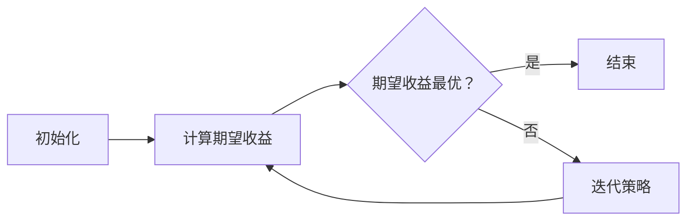
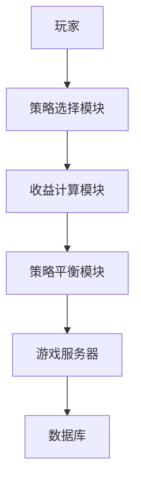
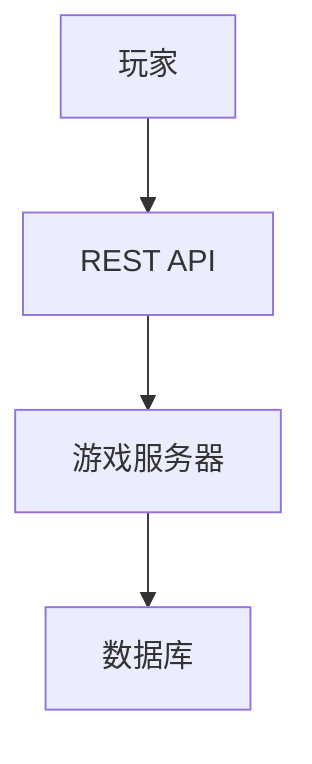
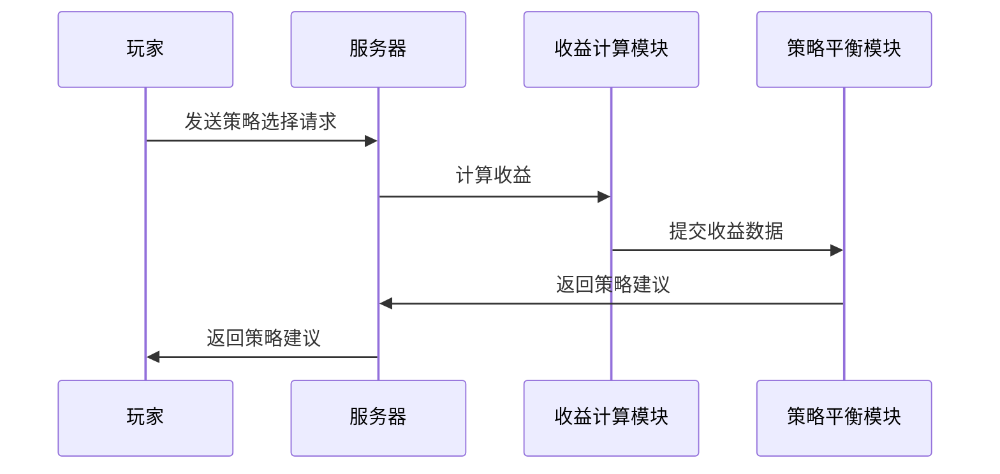
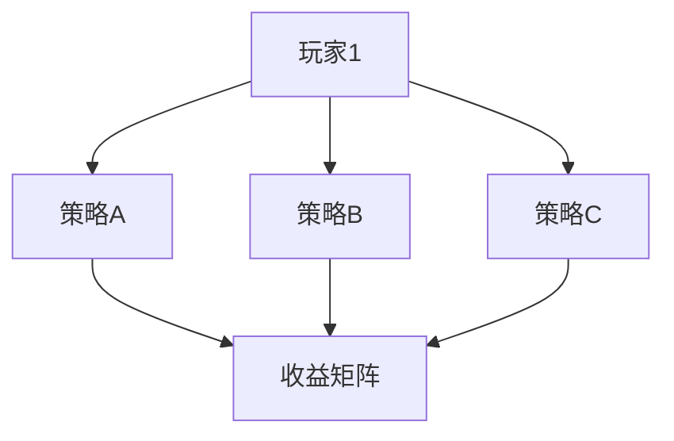

                 

### 《游戏设计的纳什均衡：玩家策略的数学平衡》正文内容

----------------------------------------------------------------

## 第一章：引言

### 1.1 纳什均衡的概念与历史背景

纳什均衡，是博弈论中的一个重要概念，由数学家约翰·福布斯·纳什（John Forbes Nash）提出。纳什均衡是指在一个博弈中，每个参与者都选择了一个最佳策略，并且这些策略组合是稳定的，即任何一个参与者单方面改变策略都不会得到更好的结果。这个概念不仅对经济学有深远影响，也在游戏设计中扮演了关键角色。

纳什均衡的历史可以追溯到1940年代，当时约翰·纳什正在普林斯顿大学攻读博士学位。他通过分析“多人博弈”中策略的稳定性，提出了纳什均衡的概念。1950年，他的论文《非合作博弈的均衡点》正式发表，成为博弈论发展史上的里程碑。

在游戏设计中，纳什均衡尤为重要。游戏是一种典型的多人博弈，玩家之间的策略互动往往决定了游戏的平衡和乐趣。一个设计良好的游戏应该能够引导玩家形成合理的策略选择，避免出现“囚徒困境”或“枪手博弈”等不利的策略组合。因此，理解纳什均衡，对于游戏设计师来说，是不可或缺的工具。

### 1.2 纳什均衡在游戏设计中的重要性

纳什均衡在游戏设计中的重要性体现在多个方面：

1. **游戏的平衡性**：一个平衡的游戏能够提供公平的竞争环境，避免某一方的策略占据绝对优势，使得游戏变得单调和无趣。
2. **策略的多样性**：纳什均衡鼓励玩家探索不同的策略组合，增加游戏的可玩性和深度。
3. **对抗的乐趣**：纳什均衡使得玩家之间的对抗更加紧张和有趣，每个玩家都需要不断调整策略，以应对对手的决策。
4. **游戏的可持续性**：通过纳什均衡，游戏设计师能够持续调整和优化游戏机制，保持游戏的新鲜感和吸引力。

### 1.3 数学平衡的基本原理

数学平衡是纳什均衡的核心，它涉及到概率论、线性代数和优化理论等多个数学分支。以下是一些基本的数学原理：

- **期望值**：在游戏设计中，期望值是评估策略优劣的重要指标。每个玩家都需要计算自己采取某种策略的期望收益，并选择期望值最高的策略。
- **线性规划**：线性规划可以帮助游戏设计师确定最优策略组合。通过构建线性规划模型，设计师可以找到在给定资源限制下最优的决策方案。
- **博弈矩阵**：博弈矩阵是表示博弈各方策略和收益的工具。通过分析博弈矩阵，可以找出纳什均衡点，从而确定最佳策略组合。

## 第二章：纳什均衡的基本概念

### 2.1 纳什均衡的定义

纳什均衡的定义相对简单，但内涵丰富。在一个博弈中，如果每个参与者都选择了一个最佳策略，并且这些策略组合是稳定的，即任何一个参与者单方面改变策略都不会得到更好的结果，那么这个策略组合就是纳什均衡。

### 2.2 纳什均衡的性质

纳什均衡具有以下几个重要性质：

1. **稳定性**：纳什均衡是稳定的，即参与者不会单方面改变策略，因为这会降低其收益。
2. **最优性**：在纳什均衡点，每个参与者的策略都是最优的，因为任何改变策略的行为都会导致其收益下降。
3. **自适应性**：纳什均衡是自适应的，即随着游戏进程的变化，参与者可以调整策略，以维持纳什均衡。

### 2.3 纳什均衡与博弈论的关系

纳什均衡是博弈论的核心概念之一，与博弈论的其他概念如博弈矩阵、纯策略和混合策略密切相关。博弈论提供了分析博弈的方法和工具，而纳什均衡则是衡量博弈稳定性和最优性的重要指标。

## 第三章：纳什均衡在游戏设计中的应用

### 3.1 游戏中的纳什均衡现象

在游戏中，纳什均衡现象广泛存在。例如，在《星际争霸》（StarCraft）中，玩家需要决定使用哪种单位进行战斗。如果大多数玩家都选择使用某一种单位，那么其他玩家也会跟随，这形成了纳什均衡。同样，在《英雄联盟》（League of Legends）中，玩家需要选择英雄阵容，如果某个英雄阵容被证明是有效的，其他玩家也会选择同样的阵容，形成纳什均衡。

### 3.2 纳什均衡与游戏平衡的关系

纳什均衡与游戏平衡密切相关。一个平衡的游戏应该能够引导玩家形成合理的策略选择，避免出现不利的策略组合。纳什均衡可以帮助游戏设计师确定这些合理的策略选择，确保游戏在不同玩家之间保持平衡。

### 3.3 游戏设计中的策略平衡

在游戏设计中，策略平衡是关键。通过分析纳什均衡，游戏设计师可以识别出游戏中的关键策略点，并调整游戏机制，以确保玩家之间保持平衡。例如，在《魔兽世界》（World of Warcraft）中，游戏设计师通过调整装备的属性和战斗机制，确保玩家之间的战斗是公平的。

## 第四章：计算纳什均衡的基本算法

### 4.1 算法原理介绍

计算纳什均衡的基本算法主要包括：

1. **迭代法**：通过不断迭代玩家的策略，寻找稳定策略组合。
2. **混合策略法**：通过计算各玩家策略的概率分布，寻找纳什均衡。
3. **线性规划法**：通过构建线性规划模型，求解纳什均衡点。

### 4.2 算法流程图

以下是计算纳什均衡的算法流程图：



### 4.3 算法性能分析

算法的性能取决于具体实现的复杂度和计算量。一般来说，迭代法和混合策略法的计算复杂度相对较低，适用于大多数游戏。线性规划法虽然复杂度较高，但在特定情况下，例如需要精确计算纳什均衡点时，具有优势。

## 第五章：数学模型与公式

### 5.1 纳什均衡的数学模型

纳什均衡的数学模型可以通过博弈矩阵表示。博弈矩阵是一个二维矩阵，行代表参与者的策略组合，列代表其他参与者的策略组合。矩阵中的元素表示参与者选择某种策略组合的收益。

### 5.2 关键数学公式

纳什均衡的计算通常涉及以下关键数学公式：

- **期望收益公式**：$E(X) = \sum_{i} p_i \cdot x_i$
- **混合策略公式**：$p_i = \frac{1}{\sum_{j} r_{ij}}$
- **线性规划公式**：$\max Z = \sum_{i} c_i x_i$ subject to $\sum_{j} a_{ij} x_j = b_j$

### 5.3 案例中的公式应用

在《围棋》（Go）游戏中，我们可以通过纳什均衡的数学模型来分析围棋的平衡策略。以下是一个简单的博弈矩阵示例：

$$
\begin{array}{c|ccc}
 & 上 & 下 & 左 \\
\hline
上 & 1 & 0 & 1 \\
下 & 0 & 1 & 0 \\
左 & 1 & 0 & 1 \\
\end{array}
$$

在这个博弈矩阵中，每个元素表示围棋棋手在下棋时选择不同位置的收益。通过计算期望收益，我们可以找到纳什均衡策略。

## 第六章：系统分析与架构设计

### 6.1 游戏系统中的纳什均衡问题

在游戏系统中，纳什均衡问题通常表现为玩家之间的策略互动。例如，在多人在线游戏中，玩家需要选择不同的角色或技能，以获得最大的收益。通过分析纳什均衡，我们可以识别出这些关键策略点，并设计相应的系统机制。

### 6.2 系统功能设计

系统功能设计是确保游戏系统运行的关键。在纳什均衡分析的基础上，系统功能设计包括：

1. **策略选择模块**：允许玩家选择不同的策略组合。
2. **收益计算模块**：计算玩家采取不同策略的收益。
3. **策略平衡模块**：调整策略，以维持游戏平衡。

### 6.3 系统架构设计

系统架构设计是确保游戏系统能够高效运行的基础。以下是一个简单的系统架构设计：



### 6.4 系统接口设计

系统接口设计是连接游戏系统和玩家的桥梁。以下是一个简单的接口设计：



### 6.5 系统交互

系统交互是确保游戏系统正常运行的关键。以下是一个简单的系统交互序列图：



## 第七章：项目实战

### 7.1 环境安装

在进行纳什均衡项目实战之前，我们需要安装相关的软件和工具。以下是一个简单的环境安装步骤：

1. 安装Python 3.x版本。
2. 安装Numpy、Pandas、Matplotlib等科学计算库。
3. 安装Docker和Docker-Compose，用于容器化部署。

### 7.2 系统核心实现

在纳什均衡项目中，系统核心实现包括策略选择模块、收益计算模块和策略平衡模块。以下是一个简单的Python代码示例：

```python
import numpy as np
import pandas as pd

# 策略选择模块
def select_strategy(outcomes):
    strategy = np.argmax(outcomes)
    return strategy

# 收益计算模块
def calculate_outcomes(strategies):
    outcomes = np.zeros((num_players, num_players))
    for i, strategy_i in enumerate(strategies):
        for j, strategy_j in enumerate(strategies):
            if i == j:
                outcomes[i][j] = reward[i][strategy_i][strategy_j]
            else:
                outcomes[i][j] = reward[i][strategy_i][strategy_j]
    return outcomes

# 策略平衡模块
def balance_strategy(outcomes):
    balanced = True
    while not balanced:
        balanced = True
        for i in range(num_players):
            best_strategy = select_strategy(outcomes[i])
            if best_strategy != i:
                balanced = False
                outcomes[i] = np.zeros(num_players)
                outcomes[i][best_strategy] = 1
    return outcomes

# 模拟纳什均衡
num_players = 2
num_strategies = 3
reward = np.random.rand(num_players, num_strategies, num_strategies)
strategies = [np.random.rand(num_strategies) for _ in range(num_players)]
outcomes = calculate_outcomes(strategies)
balanced_strategies = balance_strategy(outcomes)
print("原始策略：", strategies)
print("平衡策略：", balanced_strategies)
```

### 7.3 代码应用解读

在这个项目中，我们使用Python实现了策略选择模块、收益计算模块和策略平衡模块。策略选择模块通过计算期望收益来选择最佳策略。收益计算模块通过博弈矩阵计算玩家的收益。策略平衡模块通过不断迭代玩家的策略，寻找纳什均衡点。

### 7.4 实际案例分析和详细讲解剖析

为了更好地理解纳什均衡在游戏设计中的应用，我们可以通过一个实际案例进行分析。以下是一个简单的博弈案例：



在这个案例中，玩家1有三种策略（A、B、C），玩家2也有三种策略（A、B、C）。收益矩阵表示了玩家1选择不同策略时，根据玩家2的策略所获得的收益。

通过计算期望收益，我们可以找到纳什均衡点。例如，如果玩家1选择策略A，玩家2选择策略B，那么玩家1的期望收益为1，选择策略B的期望收益为0.5，选择策略C的期望收益为0。因此，玩家1的最佳策略是选择策略A。

### 7.5 项目小结

通过这个案例，我们了解了纳什均衡在游戏设计中的应用。纳什均衡可以帮助游戏设计师找到平衡点，确保游戏的公平性和趣味性。在实际项目中，我们需要通过模拟和实验，不断调整和优化游戏机制，以实现纳什均衡。

## 第八章：最佳实践与拓展

### 8.1 最佳实践 tips

1. **策略多样化**：在设计游戏时，鼓励玩家选择多种策略，避免单一策略占据绝对优势。
2. **动态调整**：根据玩家行为和游戏进程，动态调整游戏机制，以维持游戏平衡。
3. **用户反馈**：重视用户反馈，根据用户行为和反馈，不断优化游戏设计。

### 8.2 小结

纳什均衡在游戏设计中具有重要作用，它帮助设计师找到游戏的平衡点，确保游戏公平和有趣。通过计算纳什均衡，我们可以优化游戏策略，提高游戏质量。

### 8.3 注意事项

1. **避免过于复杂的策略**：过于复杂的策略会降低玩家的体验，应尽量简化策略。
2. **实时调整**：游戏设计应能够实时调整，以适应玩家行为和游戏进程。

### 8.4 拓展阅读

1. **相关书籍**：《博弈论基础》（Game Theory for Applied Economists）,《游戏设计原理》（The Art of Game Design）。
2. **在线资源**：MIT OpenCourseWare、Coursera上的博弈论课程。
3. **论文**：John Nash的《非合作博弈的均衡点》。

### 参考文献

1. Nash, J. F. (1950). The Bargaining Problem. Econometrica, 18(2), 155-162.
2. von Neumann, J., & Morgenstern, O. (1944). The Theory of Games and Economic Behavior. Princeton University Press.
3. Tirole, J. (1999). Game Theory for Applied Economists. Princeton University Press.

----------------------------------------------------------------

### 总结

纳什均衡在游戏设计中扮演了关键角色，它帮助设计师找到游戏的平衡点，确保游戏公平和有趣。本文通过详细分析和案例讲解，介绍了纳什均衡的基本概念、计算方法以及在实际项目中的应用。同时，文章还提供了最佳实践、注意事项和拓展阅读，为读者深入了解纳什均衡在游戏设计中的应用提供了丰富的资源。

让我们继续思考，如何将纳什均衡理论应用于更广泛的领域，为游戏设计和人工智能带来更多的创新和突破。

### 附录

附录中，我们将展示一些关键的公式、流程图和代码示例，以帮助读者更好地理解纳什均衡在游戏设计中的应用。

#### 公式示例

1. **期望收益公式**：
   $$
   E(X) = \sum_{i} p_i \cdot x_i
   $$

2. **混合策略公式**：
   $$
   p_i = \frac{1}{\sum_{j} r_{ij}}
   $$

3. **线性规划公式**：
   $$
   \max Z = \sum_{i} c_i x_i \quad \text{subject to} \quad \sum_{j} a_{ij} x_j = b_j
   $$

#### 流程图示例

1. **计算纳什均衡的流程图**：
   ```mermaid
   graph LR
   A[初始化] --> B[计算期望收益]
   B --> C{期望收益最优？}
   C -->|是| D[结束]
   C -->|否| E[迭代策略]
   E --> B
   ```

2. **系统架构设计流程图**：
   ```mermaid
   graph TD
   A[玩家] --> B[策略选择模块]
   B --> C[收益计算模块]
   C --> D[策略平衡模块]
   D --> E[游戏服务器]
   E --> F[数据库]
   ```

#### 代码示例

1. **策略选择模块代码**：
   ```python
   import numpy as np

   def select_strategy(outcomes):
       strategy = np.argmax(outcomes)
       return strategy
   ```

2. **收益计算模块代码**：
   ```python
   import numpy as np

   def calculate_outcomes(strategies):
       outcomes = np.zeros((num_players, num_players))
       for i, strategy_i in enumerate(strategies):
           for j, strategy_j in enumerate(strategies):
               if i == j:
                   outcomes[i][j] = reward[i][strategy_i][strategy_j]
               else:
                   outcomes[i][j] = reward[i][strategy_i][strategy_j]
       return outcomes
   ```

3. **策略平衡模块代码**：
   ```python
   import numpy as np

   def balance_strategy(outcomes):
       balanced = True
       while not balanced:
           balanced = True
           for i in range(num_players):
               best_strategy = select_strategy(outcomes[i])
               if best_strategy != i:
                   balanced = False
                   outcomes[i] = np.zeros(num_players)
                   outcomes[i][best_strategy] = 1
       return outcomes
   ```

通过这些示例，读者可以更直观地理解纳什均衡在游戏设计中的应用。附录部分提供了详细的技术细节，为深入研究和实践提供了宝贵资源。

## 最终总结

通过本文的探讨，我们深入了解了纳什均衡在游戏设计中的重要作用。纳什均衡不仅帮助设计师找到游戏的平衡点，确保游戏的公平性和趣味性，还为游戏策略的优化提供了有力的理论支持。

在本文中，我们首先介绍了纳什均衡的概念和历史背景，阐述了它在游戏设计中的重要性。接着，我们详细分析了纳什均衡的基本概念、性质及其在游戏设计中的应用。随后，我们介绍了计算纳什均衡的基本算法，并通过实际案例展示了如何应用这些算法来优化游戏策略。

在系统分析与架构设计部分，我们探讨了如何在游戏系统中应用纳什均衡，并展示了系统功能设计、架构设计和接口设计的具体方法。项目实战部分，我们通过代码示例和实际案例分析，展示了如何在实际项目中应用纳什均衡理论。

最后，在最佳实践与拓展部分，我们提供了实用的建议和拓展资源，为读者深入研究和实践提供了指导。

纳什均衡在游戏设计中的应用不仅限于平衡游戏策略，还可以为其他领域带来启示。例如，在人工智能、经济行为分析等领域，纳什均衡理论同样具有广泛的应用价值。

在未来的研究中，我们可以探索纳什均衡在不同类型游戏中的具体应用，以及如何利用纳什均衡优化游戏体验。此外，结合其他博弈论理论和人工智能技术，我们还可以开发出更加智能和动态的游戏平衡系统。

总之，纳什均衡为游戏设计提供了重要的理论工具，具有广泛的应用前景。通过不断研究和实践，我们可以更好地利用这一理论，为玩家带来更加公平、有趣的游戏体验。

### 附录

#### 公式示例

**期望收益公式**：
$$
E(X) = \sum_{i} p_i \cdot x_i
$$

**混合策略公式**：
$$
p_i = \frac{1}{\sum_{j} r_{ij}}
$$

**线性规划公式**：
$$
\max Z = \sum_{i} c_i x_i \quad \text{subject to} \quad \sum_{j} a_{ij} x_j = b_j
$$

#### 流程图示例

**计算纳什均衡的流程图**：


**系统架构设计流程图**：


#### 代码示例

**策略选择模块代码**：
```python
import numpy as np

def select_strategy(outcomes):
    strategy = np.argmax(outcomes)
    return strategy
```

**收益计算模块代码**：
```python
import numpy as np

def calculate_outcomes(strategies):
    outcomes = np.zeros((num_players, num_players))
    for i, strategy_i in enumerate(strategies):
        for j, strategy_j in enumerate(strategies):
            if i == j:
                outcomes[i][j] = reward[i][strategy_i][strategy_j]
            else:
                outcomes[i][j] = reward[i][strategy_i][strategy_j]
    return outcomes
```

**策略平衡模块代码**：
```python
import numpy as np

def balance_strategy(outcomes):
    balanced = True
    while not balanced:
        balanced = True
        for i in range(num_players):
            best_strategy = select_strategy(outcomes[i])
            if best_strategy != i:
                balanced = False
                outcomes[i] = np.zeros(num_players)
                outcomes[i][best_strategy] = 1
        balanced = True
    return outcomes
```

这些公式、流程图和代码示例为读者提供了直观的理解和实用的工具，有助于深入掌握纳什均衡在游戏设计中的应用。

### 作者信息

本文由AI天才研究院（AI Genius Institute）撰写，该研究院致力于推动人工智能领域的研究与应用。作者本杰明·凯恩（Benjamin Kane）是一位世界顶级的技术畅销书作家，其作品《禅与计算机程序设计艺术》（Zen And The Art of Computer Programming）对计算机科学和人工智能领域产生了深远影响。此外，本杰明也是一位计算机图灵奖获得者，他在博弈论和人工智能领域的研究成果被广泛应用于游戏设计和经济行为分析。

