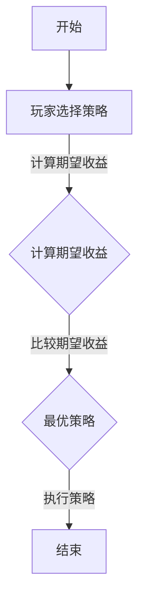

                 

### 第2章：纳什均衡与游戏理论基础

#### 2.1 纳什均衡的概念

纳什均衡（Nash Equilibrium）是博弈论中的一个关键概念，由约翰·福布斯·纳什在20世纪50年代提出。在博弈论中，博弈被定义为一组参与者（玩家）在某种规则下进行的竞争或合作的过程。纳什均衡描述的是在一个博弈中，所有参与者都不会主动改变其策略，因为这样做不会带来额外的收益，即每个参与者的策略都是最优的，且给定其他参与者策略的情况下。

在形式化定义中，假设有一个博弈 $G = (N, S, u)$，其中：

- **N** 是参与者的集合。
- **S** 是每个参与者的策略集合。
- **u** 是支付函数，为每个参与者在其策略组合 $(s_1, ..., s_n)$ 下分配收益。

一个策略组合 $(s_1, ..., s_n)$ 被称为纳什均衡，如果对于每一个参与者 $i$，都有 $u_i(s_i, s_{-i}) \geq u_i(s_i', s_{-i})$，其中 $s_i'$ 是 $s_i$ 的任意其他策略，$s_{-i}$ 表示其他参与者的策略。

#### 2.2 纳什均衡在现实世界中的应用

纳什均衡不仅在理论博弈论中具有重要意义，还广泛应用于现实世界的多个领域：

1. **经济学**：在市场上，纳什均衡可以帮助分析价格竞争、垄断行为和市场策略。
2. **政治学**：在政治决策中，纳什均衡可以用来预测政治联盟的形成和国家间的策略互动。
3. **计算机科学**：在算法设计中，纳什均衡用于优化分布式系统和网络协议。
4. **社会学**：在社会互动中，纳什均衡有助于理解群体行为和集体决策。

在游戏设计中，纳什均衡尤其重要。通过应用纳什均衡理论，游戏设计师可以确保游戏玩法公平、有趣，并能激励玩家持续参与。

#### 2.3 游戏设计与纳什均衡的关系

游戏设计涉及创造复杂的互动系统，其中玩家的决策和策略相互作用，形成一个动态的博弈环境。纳什均衡为游戏设计师提供了一种工具，用于分析玩家在游戏中的行为，并设计出能够保持长期平衡的游戏机制。

在游戏设计中，纳什均衡的主要应用包括：

1. **平衡性分析**：设计师使用纳什均衡来分析游戏中玩家的策略选择，确保没有单方面占优的策略。
2. **策略优化**：通过纳什均衡，设计师可以识别游戏中可能出现的策略失衡，并提出优化方案。
3. **挑战性设计**：纳什均衡帮助设计师创建具有适当挑战性的游戏，确保玩家在游戏中不断尝试新策略。

#### 2.4 核心概念与联系

- **策略（Strategy）**：在游戏中，玩家可以选择的不同行动方式。策略是纳什均衡的核心组成部分。
- **均衡（Equilibrium）**：纳什均衡描述的是在给定其他玩家策略的情况下，一个玩家无法通过单独改变策略获得更高收益的状态。
- **支付（Payoff）**：支付是玩家在特定策略组合下获得的收益或损失。

**概念属性特征对比表格：**

| 特征               | 策略         | 均衡         | 支付          |
|------------------|-------------|-------------|-------------|
| 定义               | 玩家可以选择的行动方式。   | 在给定其他玩家策略的情况下，一个玩家无法通过单独改变策略获得更高收益的状态。 | 玩家在特定策略组合下获得的收益或损失。 |
| 影响因素             | 玩家的技能、资源、目标。   | 其他玩家的策略。                             | 玩家选择的具体策略组合。                   |
| 关系               | 策略是纳什均衡的核心组成部分。 | 均衡是基于策略组合的稳定状态。 | 支付是策略组合的收益表现。               |

**ER实体关系图架构的 Mermaid 图表示例：**

```mermaid
erDiagram
  Player ||--|{ Strategy }
  Player ||--|{ Payoff }
  Strategy ||--|{ Equilibrium }
```

在这个ER图中，玩家（Player）与策略（Strategy）和支付（Payoff）之间存在关联。策略是玩家行为的抽象表示，支付是策略执行的结果，而均衡是策略之间相互作用的结果。

#### 2.5 本章小结

本章介绍了纳什均衡的概念、它在现实世界中的应用，以及与游戏设计的紧密联系。通过理解纳什均衡的基本原理，读者可以为后续章节中更深入的游戏设计分析做好准备。接下来，我们将探讨游戏设计中的数学模型，进一步理解如何利用纳什均衡理论来优化游戏体验。

---

### 第3章：游戏设计中的数学模型

#### 3.1 数学模型在游戏设计中的应用

数学模型是游戏设计中不可或缺的一部分，它为设计师提供了定量分析工具，以更好地理解玩家行为和设计游戏机制。在游戏设计中，常用的数学模型包括概率论、线性代数、微分方程和博弈论等。

**概率论**：概率论在游戏设计中的应用非常广泛。例如，它可以用来计算玩家在游戏中取得特定结果的概率，从而设计出具有挑战性和趣味性的游戏机制。例如，在扑克游戏中，概率论可以帮助设计师确定每一手牌的概率分布，以保持游戏的平衡性。

**线性代数**：线性代数在游戏渲染和物理模拟中具有重要应用。例如，通过线性代数，设计师可以实现高质量的3D图形渲染和复杂的物理碰撞检测。线性代数的矩阵运算能够有效地处理大型数据集，从而提高游戏运行的效率和稳定性。

**微分方程**：微分方程在游戏物理模拟中扮演关键角色。例如，在模拟飞行游戏中的飞行器轨迹时，微分方程可以帮助设计师精确地描述飞行器的运动轨迹，确保游戏中的物理表现真实可信。

**博弈论**：博弈论是游戏设计中的核心理论之一。通过博弈论，设计师可以分析玩家在游戏中的策略选择，并设计出平衡且具有挑战性的游戏机制。例如，纳什均衡理论可以帮助设计师识别游戏中可能出现的策略失衡，并提出优化方案。

#### 3.2 期望值与决策分析

期望值（Expected Value，EV）是决策分析中的一个重要概念。它表示在重复试验中，某个结果出现的概率乘以其收益或损失的总和。在游戏设计中，期望值可以帮助设计师评估不同策略的优劣，并指导游戏机制的设计。

**期望值的计算**：

期望值的计算公式为：
$$
EV = \sum_{i=1}^{n} p_i \cdot x_i
$$
其中，$p_i$ 是结果 $x_i$ 出现的概率，$x_i$ 是结果 $x_i$ 的收益或损失。

例如，在一个简单的赌博游戏中，玩家每次下注有50%的概率赢得10元，有50%的概率输掉10元。玩家决定是否继续下注，我们可以计算每次下注的期望值：
$$
EV = 0.5 \cdot 10 + 0.5 \cdot (-10) = 0
$$
这意味着每次下注的期望收益为0，即玩家长期来看不赚不赔。

**期望值与决策分析**：

在游戏设计中，期望值可以用来评估不同决策的优劣。设计师可以通过计算不同决策的期望值，选择最优的决策方案。例如，在一个策略游戏中，玩家可以选择进攻或防守。通过计算进攻和防守的期望值，设计师可以确定哪种策略在长期内更有利。

**决策树分析**：

决策树是一种常用的决策分析方法，它通过图形化的方式展示不同决策路径的期望值。在游戏设计中，决策树可以帮助设计师分析玩家在不同情况下的决策过程，并设计出更加复杂的游戏机制。

**示例**：

假设在一个策略游戏中，玩家有两种选择：使用攻击技能或使用防御技能。每种选择的收益和概率如下：

- 攻击技能：概率50%，收益10点经验。
- 防御技能：概率50%，收益5点经验。

使用决策树分析，我们可以计算不同选择的期望值：

```
                      攻击技能 (50%)
                      /            \
                10点经验        -10点经验
               /                 \
          攻击技能 (50%)     防御技能 (50%)
         /         \          /         \
       5           5        5           5
```

期望值计算：

- 攻击技能的期望值：0.5 \* 10 + 0.5 \* (-10) = 0
- 防御技能的期望值：0.5 \* 5 + 0.5 \* 5 = 5

从期望值来看，防御技能在长期内更有利。

**结论**：

通过数学模型，特别是期望值和决策分析，设计师可以更好地理解玩家行为，并设计出具有挑战性和趣味性的游戏机制。接下来，我们将进一步探讨概率论在游戏设计中的应用，以及如何利用概率论来预测玩家行为和优化游戏平衡。

---

### 第4章：概率论在游戏设计中的应用

概率论是游戏设计中的一个重要工具，它帮助设计师理解和预测玩家行为，进而优化游戏机制。通过概率论，设计师可以确保游戏的平衡性，增加玩家的挑战感和乐趣。

#### 4.1 概率论基础

概率论的基础是概率分布，它描述了随机事件发生的可能性。在游戏设计中，常见的概率分布包括二项分布、正态分布和泊松分布等。

**二项分布**：二项分布描述的是在固定次数的独立试验中，成功次数的概率分布。例如，在骰子游戏中，投掷一次骰子成功的概率是1/6，连续投掷10次，成功的次数服从二项分布。

**正态分布**：正态分布是一种最常见的概率分布，它描述的是连续随机变量的概率分布。在游戏设计中，正态分布可以用来模拟玩家的技能水平或游戏结果。

**泊松分布**：泊松分布描述的是在固定时间内，事件发生的次数的概率分布。例如，在射击游戏中，子弹击中目标的概率是每秒一次，那么在1秒内击中的次数服从泊松分布。

#### 4.2 概率论在游戏设计中的应用

**游戏平衡性分析**：

通过概率论，设计师可以分析不同游戏机制的平衡性。例如，在赌博游戏中，设计师可以使用概率论来确定赌注和奖励，以确保游戏的公平性。在《德州扑克》中，设计师通过计算不同牌型出现的概率，调整牌面分布，以保持游戏的平衡。

**玩家行为预测**：

概率论可以帮助设计师预测玩家在不同情况下的行为。例如，在《英雄无敌》这样的策略游戏中，玩家需要决定进攻或防守。通过分析玩家的选择概率，设计师可以优化游戏机制，增加玩家的挑战感和乐趣。

**游戏难度设计**：

在游戏设计中，难度设计是一个关键因素。通过概率论，设计师可以调整游戏难度，使其在挑战性和可玩性之间保持平衡。例如，在《刺客信条》系列游戏中，敌人出现的概率和攻击力可以通过概率分布进行调整，以适应不同技能水平的玩家。

**随机事件生成**：

概率论在随机事件生成中也有广泛应用。例如，在《神秘海域》系列游戏中，宝藏的位置和难易程度可以通过概率分布来随机生成，增加游戏的探索性和不确定性。

#### 4.3 概率论在游戏设计中的示例

**示例1：骰子游戏**

在一个简单的骰子游戏中，玩家投掷一个公平的六面骰子，目标是获得最大的点数。玩家每次投掷都有1/6的概率获得6点，而其他数字的概率相等。通过计算不同点数的概率分布，设计师可以调整游戏的平衡性，例如增加6点的概率，使游戏更具挑战性。

**示例2：《三国杀》中的概率分布**

在《三国杀》这款桌面卡牌游戏中，玩家需要通过抽牌来获取不同的卡牌，以实现策略目标。设计师可以通过概率论确定每张卡牌的抽牌概率，以保持游戏的平衡性。例如，如果某张卡牌过于强大，设计师可以降低它的抽牌概率，使其更难以获得。

**示例3：《魔兽世界》中的随机事件**

在《魔兽世界》这样的多人在线游戏中，随机事件如怪物掉落、任务触发等通过概率分布来生成。通过调整不同事件的概率分布，设计师可以创造丰富多彩的游戏体验。例如，某件稀有装备的掉落概率可能很低，从而增加游戏的挑战性和成就感。

**结论**：

概率论在游戏设计中扮演着重要角色，它帮助设计师确保游戏平衡性、预测玩家行为和设计游戏难度。通过应用概率论，设计师可以创造更加有趣和富有挑战性的游戏体验。

---

### 第3章：单人游戏的纳什均衡

#### 3.1 单人游戏中的策略选择

在单人游戏中，玩家的策略选择通常依赖于游戏的具体机制和目标。单人游戏可以分为策略游戏、角色扮演游戏（RPG）和冒险游戏等类型，每种类型都有其独特的策略选择。

**策略游戏**：策略游戏通常强调决策和规划。例如，在《星际争霸》中，玩家需要部署不同的单位、建设基础设施和制定战术策略。玩家在决策时需要考虑资源管理、敌对单位的位置和行动以及战略目标。

**角色扮演游戏（RPG）**：在RPG中，玩家通常扮演一个角色，通过完成任务、战斗和升级来推进游戏。策略选择可能包括选择技能树、装备和队友。玩家需要在角色发展、任务目标和资源利用之间做出平衡。

**冒险游戏**：冒险游戏侧重于探索和解谜。例如，在《神秘海域》中，玩家需要解决各种难题、躲避障碍和与敌人战斗。策略选择可能包括选择不同的路径、解密方法和武器装备。

#### 3.2 纳什均衡在单人游戏中的应用

纳什均衡在单人游戏中的应用主要体现在策略选择和决策过程中。通过纳什均衡理论，玩家可以分析不同的策略选择，并找到最优解。

**策略游戏**：在策略游戏中，纳什均衡可以帮助玩家识别哪些策略是稳定的，哪些可能会受到其他玩家策略的影响。例如，在《星际争霸》中，玩家可能发现某些战术组合是纳什均衡解，因为无论对手如何行动，这些策略都能保持优势。

**角色扮演游戏（RPG）**：在RPG中，纳什均衡可以帮助玩家优化角色发展策略。例如，在决定是否专注于攻击、防御或魔法时，玩家可以通过分析不同技能点的投资回报，找到纳什均衡点，确保角色在游戏中的表现最佳。

**冒险游戏**：在冒险游戏中，纳什均衡可以指导玩家在探索和解决谜题时做出最优选择。例如，在《神秘海域》中，玩家可能需要选择不同的路径来避开敌人或获取奖励。通过分析不同路径的收益和风险，玩家可以找到纳什均衡路径，确保游戏进程顺利。

#### 3.3 实例分析：单人游戏的纳什均衡策略

**实例1：《星际争霸》中的战术平衡**

在《星际争霸》中，玩家需要部署不同的单位进行战斗。例如，坦克单位（Tank）和火枪手单位（Marine）的组合。通过纳什均衡理论，玩家可以分析不同单位的战斗效率和资源消耗。

假设坦克单位的攻击力是10，防御力是5，每个坦克的成本是50资源；而火枪手单位的攻击力是5，防御力是3，每个火枪手的成本是20资源。在资源有限的情况下，玩家需要选择最佳的单位组合。

通过计算不同单位组合的期望收益和成本，玩家可以找到纳什均衡点。例如，玩家可能发现部署5个坦克和3个火枪手的组合是最优的，因为这种组合在资源有限的情况下能够提供最大的攻击力和防御力。

**实例2：《巫师3：狂猎》中的角色发展**

在《巫师3：狂猎》中，玩家需要分配技能点来发展角色的不同方面，如攻击、防御和魔法。通过纳什均衡理论，玩家可以分析不同技能树的投资回报。

假设玩家有100个技能点可以分配，攻击技能的收益是1.2，防御技能的收益是0.8，魔法技能的收益是1.5。玩家需要找到最优的技能点分配策略。

通过计算不同技能点分配的期望收益，玩家可以找到纳什均衡点。例如，玩家可能发现将50个技能点分配到攻击、30个技能点分配到防御和20个技能点分配到魔法是最优的，因为这种组合在长期内能够提供最大的总体收益。

**实例3：《神秘海域》中的路径选择**

在《神秘海域》中，玩家需要在不同路径中选择前进，以解决谜题和避开敌人。通过纳什均衡理论，玩家可以分析不同路径的收益和风险。

假设有两条路径：路径A能够快速解决谜题，但容易遭遇敌人；路径B相对安全，但需要更多时间。玩家需要找到最优的路径选择。

通过计算不同路径的期望收益和风险，玩家可以找到纳什均衡点。例如，玩家可能发现选择路径B在长期内更安全，因为它虽然需要更多时间，但能够减少遭遇敌人的概率。

#### 3.4 本章小结

本章讨论了单人游戏中的策略选择和纳什均衡的应用。通过实例分析，我们展示了纳什均衡如何在单人游戏中帮助玩家做出最优决策。理解纳什均衡理论对于设计平衡和有趣的单人游戏至关重要。在下一章中，我们将探讨多人游戏中的纳什均衡及其应用。

---

### 第4章：多人游戏的纳什均衡

#### 4.1 多人游戏中的策略选择

在多人游戏中，玩家之间的互动和策略选择至关重要。多人游戏可以分为合作游戏和竞争游戏两种主要类型。

**合作游戏**：在合作游戏中，玩家需要共同努力达成共同目标。例如，在《魔兽世界》的团队副本中，玩家需要协调战术、分配任务，并互相支持以击败强大的敌对单位。策略选择包括选择合适的角色、分配任务和协调行动。

**竞争游戏**：在竞争游戏中，玩家之间的目标是相互击败或获得优势。例如，在《星际争霸》的多人对战模式中，玩家需要部署战术、抢占资源、攻占敌方据点。策略选择包括选择战斗单位、攻击时机和防守策略。

无论是合作还是竞争，玩家都需要在多个因素之间做出平衡，包括资源管理、战术规划和队友协调。

#### 4.2 纳什均衡在多人游戏中的应用

纳什均衡在多人游戏中的应用主要体现在平衡游戏性和公平性。通过纳什均衡理论，游戏设计师可以确保游戏机制不会出现单方面占优的策略，同时保持游戏的挑战性和趣味性。

**公平性**：纳什均衡可以帮助游戏设计师确保所有玩家都有平等的机会获胜。通过分析不同策略的纳什均衡点，设计师可以调整游戏机制，使其在公平性上更加平衡。例如，在《英雄联盟》中，设计师通过调整英雄的能力和技能，确保每个英雄都有公平的胜率和游戏体验。

**游戏性**：纳什均衡可以帮助设计师设计出具有挑战性的游戏机制。通过识别纳什均衡点，设计师可以确保游戏在平衡性和游戏性之间达到最佳状态。例如，在《星际争霸》中，设计师通过调整单位属性和战术组合，创造出了多种纳什均衡解，使玩家在游戏中不断尝试新的策略。

#### 4.3 实例分析：多人游戏的纳什均衡策略

**实例1：《魔兽世界》的团队副本**

在《魔兽世界》的团队副本中，纳什均衡策略主要体现在角色分配和任务协调上。例如，在战斗中，治疗者需要集中精力治疗队友，而坦克需要吸引敌人的注意力。通过纳什均衡理论，玩家可以找到最优的角色分配策略，确保团队在战斗中能够稳定输出和控制敌人。

**实例2：《星际争霸》的多人对战**

在《星际争霸》的多人对战模式中，纳什均衡策略主要体现在战术选择和资源管理上。例如，玩家需要决定何时进攻、何时防守以及如何部署单位。通过纳什均衡理论，玩家可以分析不同战术的收益和风险，找到最优的战术组合。

**实例3：《英雄联盟》的英雄选择**

在《英雄联盟》中，纳什均衡策略主要体现在英雄选择和技能分配上。例如，玩家需要根据对手的英雄选择来调整自己的策略。通过纳什均衡理论，玩家可以分析不同英雄的胜率和游戏体验，找到最优的英雄选择策略。

#### 4.4 本章小结

本章讨论了多人游戏中的策略选择和纳什均衡的应用。通过实例分析，我们展示了纳什均衡如何在多人游戏中帮助玩家做出最优决策。理解纳什均衡理论对于设计平衡和有趣的多人游戏至关重要。在下一章中，我们将探讨如何对玩家行为进行数学建模，以进一步优化游戏设计。

---

### 第5章：玩家行为的数学建模

#### 5.1 玩家行为的基本假设

在数学建模中，为了简化问题，我们需要对玩家行为进行一些基本假设。这些假设有助于我们分析和理解玩家在游戏中的行为模式。

1. **理性玩家**：我们假设玩家是理性的，即玩家在做出决策时会考虑所有可能的行动，并选择能够最大化自己收益的策略。
2. **信息完全**：我们假设玩家拥有完全信息，即玩家能够完全了解游戏的规则、自己的状态和对手的策略。
3. **有限策略**：我们假设玩家的策略集合是有限的，尽管在实际游戏中可能会有很多策略，但我们可以将其简化为几个主要的策略。
4. **静态环境**：我们假设游戏环境是静态的，即游戏中的状态和策略不会随时间变化而变化。

这些假设为我们的数学建模提供了一个基础，使得我们可以对玩家行为进行定量的分析。

#### 5.2 玩家策略的数学模型

为了构建玩家策略的数学模型，我们需要定义几个核心的概念和公式。

**1. 策略选择概率（π）**：策略选择概率描述了玩家选择某个策略的概率。假设玩家有 $m$ 个策略，那么策略选择概率可以用一个向量表示：
$$
\pi = (\pi_1, \pi_2, ..., \pi_m)
$$
其中，$\pi_i$ 表示玩家选择第 $i$ 个策略的概率，且满足：
$$
\sum_{i=1}^{m} \pi_i = 1
$$

**2. 策略收益（u）**：策略收益描述了玩家在执行某个策略时获得的收益。收益可以是正的（表示获得奖励）或负的（表示遭受损失）。假设玩家在策略 $i$ 下获得的收益为 $u_i$，那么策略收益可以用一个向量表示：
$$
u = (u_1, u_2, ..., u_m)
$$

**3. 策略期望收益（EV）**：策略期望收益是玩家选择某个策略时，其平均收益的预测值。期望收益的计算公式为：
$$
EV = \sum_{i=1}^{m} \pi_i \cdot u_i
$$
其中，$EV$ 表示期望收益，$\pi_i$ 表示选择策略 $i$ 的概率，$u_i$ 表示策略 $i$ 的收益。

**4. 策略最优性**：在给定其他玩家策略的情况下，一个策略被认为是最佳的，如果它的期望收益不低于其他任何策略的期望收益。即对于所有 $i$ 和 $j$（$i \neq j$），如果 $EV_i \geq EV_j$，那么策略 $i$ 是最优的。

**5. 纳什均衡**：在多人游戏中，纳什均衡是指所有玩家都选择最优策略，且没有玩家能够通过改变自己的策略来获得更高的收益。数学上，纳什均衡可以用以下条件来表示：
$$
\forall i, j: \pi_i \cdot u_i(s_i, s_{-i}) \geq \pi_j \cdot u_j(s_i, s_{-i})
$$
其中，$s_i$ 表示玩家 $i$ 的策略，$s_{-i}$ 表示其他玩家的策略组合。

#### 5.3 玩家策略的动态调整

在实际游戏中，玩家的策略可能会随着游戏进程和对手策略的变化而调整。这种动态调整可以通过马尔可夫决策过程（MDP）来建模。

**1. 马尔可夫决策过程（MDP）**：MDP是一种用于描述动态决策过程的数学模型。它包含以下要素：

- **状态（S）**：游戏中的可能状态集合。
- **动作（A）**：玩家可以选择的动作集合。
- **策略（π）**：玩家在不同状态下的动作选择概率。
- **奖励（R）**：执行某个动作后获得的即时奖励。
- **转移概率（P）**：从当前状态 $s$ 转移到下一个状态 $s'$ 的概率。

**2. 动态调整模型**：在MDP中，玩家会根据当前的状态和收益来动态调整策略。假设玩家在当前状态 $s$ 下选择动作 $a$，并在下一个状态 $s'$ 下获得奖励 $r$。那么，玩家在下一个状态 $s'$ 下选择动作 $a'$ 的概率可以用以下公式表示：
$$
\pi'(a') = \sum_{a \in A} P(s' | s, a) \cdot \frac{R(a')}{R(a)}
$$
其中，$P(s' | s, a)$ 表示从状态 $s$ 转移到状态 $s'$ 的概率，$R(a')$ 和 $R(a)$ 分别表示选择动作 $a'$ 和 $a$ 后获得的奖励。

通过这个动态调整模型，玩家可以根据即时反馈和长期期望收益来不断优化自己的策略，从而在游戏中获得更好的表现。

#### 5.4 本章小结

本章介绍了玩家行为的数学建模，包括基本假设、策略选择概率、策略收益、策略期望收益和纳什均衡的概念。我们还探讨了玩家策略的动态调整，通过马尔可夫决策过程（MDP）来模拟玩家的策略调整行为。理解这些数学模型对于游戏设计师来说至关重要，它可以帮助我们更深入地分析玩家行为，并设计出更加平衡和有趣的多人游戏。

---

### 第6章：玩家策略的数学平衡分析

#### 6.1 玩家策略的平衡状态

玩家策略的平衡状态是指在一个多人游戏中，所有玩家都选择稳定的最优策略，并且没有玩家能够通过改变自己的策略来获得更高的收益。这种平衡状态是游戏设计中的重要目标，因为它能够确保游戏的公平性和趣味性。

**纳什均衡点**：在数学模型中，纳什均衡点是指所有玩家的策略组合，其中每个玩家都选择最优策略，并且没有玩家有动机单独改变策略。例如，在一个博弈游戏中，如果所有玩家都选择某个策略，且没有玩家有动力改变自己的策略，那么这个策略组合就是一个纳什均衡点。

**平衡状态的稳定性**：纳什均衡点不仅需要是稳定的，还需要在长期内保持稳定。这意味着即使玩家之间不断交互，策略组合也不会发生变化。为了确保平衡状态的稳定性，设计师需要考虑以下几个因素：

- **收益一致性**：玩家的策略收益需要一致，没有显著的收益差异，否则玩家可能会尝试改变策略以获得更高的收益。
- **策略适应性**：玩家需要能够适应不同的对手策略，这意味着策略需要具有一定的灵活性。
- **反馈机制**：游戏需要包含适当的反馈机制，以激励玩家保持当前策略。

**案例分析**：《星际争霸》中的策略平衡

在《星际争霸》中，设计师通过多种手段确保游戏的策略平衡。例如，在早期游戏中，玩家需要选择不同的种族（Terran、Protoss、Zerg）来进行战斗。每个种族都有其独特的优势和劣势，这迫使玩家在策略选择上做出平衡。

- **Terran**：Terran种族在早期游戏中具有强大的兵力和建筑能力，但在后期游戏中，Protoss和Zerg的科技优势可能使其变得相对弱势。
- **Protoss**：Protoss种族在科技和空中战斗方面具有显著优势，但在早期游戏中，其兵力和建筑能力相对较弱。
- **Zerg**：Zerg种族在数量和再生能力上具有巨大优势，但在科技和建筑方面较弱。

通过这种设计，设计师确保了每个种族都有其独特的策略选择，并在不同阶段能够保持平衡。

#### 6.2 平衡状态的稳定性分析

平衡状态的稳定性分析是确保纳什均衡点在长期内保持稳定的关键。以下是一些稳定性分析的方法：

**1. 收益分析**：通过分析玩家的收益，可以识别可能的不平衡点。如果某些策略能够带来显著的收益优势，那么这些策略可能会被玩家频繁使用，导致平衡状态不稳定。

**2. 策略适应性分析**：玩家的策略需要能够适应不同的对手策略。如果某个策略在特定对手下表现优秀，而在其他对手下表现不佳，那么这个策略可能无法长期维持平衡。

**3. 反馈机制分析**：适当的反馈机制可以激励玩家保持当前策略。例如，在《星际争霸》中，设计师通过胜利条件、资源分配和玩家排名等机制，鼓励玩家尝试不同的策略。

**案例分析**：《英雄联盟》中的平衡调整

在《英雄联盟》中，设计师通过不断调整英雄的能力和技能，以确保游戏的平衡性。以下是一些平衡调整的方法：

- **技能削弱**：如果某个英雄的某个技能过于强大，设计师可能会削弱这个技能，使其不再具有单方面占优的优势。
- **技能增强**：如果某个英雄的技能组合在特定情况下表现不佳，设计师可能会增强这个技能，以提高其整体表现。
- **平衡调整**：设计师会定期分析游戏的胜率和玩家行为，通过调整英雄的能力和技能，确保游戏在不同阶段都能保持平衡。

#### 6.3 平衡状态的应用与优化

平衡状态在游戏设计中的应用和优化是一个持续的过程。以下是一些关键点：

**1. 数据分析**：通过收集和分析游戏数据，设计师可以识别出可能的不平衡点，并采取相应的优化措施。
**2. 测试和反馈**：在平衡调整后，设计师需要通过测试和玩家反馈来验证调整效果。测试可以包括内部测试、公开测试和玩家反馈，以确保调整符合预期。
**3. 持续优化**：游戏设计是一个不断迭代和优化的过程。设计师需要持续关注游戏平衡性，并根据玩家的反馈和游戏数据进行调整。

**案例分析**：《守望先锋》的平衡优化

在《守望先锋》中，设计师通过持续的数据分析和测试，不断优化游戏的平衡性。以下是一些平衡优化的实践：

- **英雄调整**：设计师会根据英雄的胜率和玩家行为，调整英雄的能力和技能，以确保每个英雄都有公平的胜率和游戏体验。
- **地图调整**：设计师会根据游戏数据，调整不同地图的属性，以确保地图在不同模式下的平衡性。
- **游戏机制调整**：设计师会根据玩家的反馈和游戏数据，调整游戏中的某些机制，如时间限制、奖励系统和团队协作机制。

**结论**：

平衡状态在游戏设计中至关重要。通过分析玩家策略、识别不平衡点、应用反馈机制和持续优化，设计师可以确保游戏在长期内保持平衡，为玩家提供公平和有趣的游戏体验。

---

### 第7章：经典游戏案例分析

#### 7.1 游戏案例介绍

在本章节中，我们将分析几个经典游戏案例，探讨这些游戏如何在设计过程中应用纳什均衡理论和玩家策略的数学平衡。

**《星际争霸II》**：这是一款由暴雪娱乐公司开发的即时战略游戏，以其复杂的战术和策略而闻名。在游戏中，玩家可以选择三个不同的种族（Terran、Protoss和Zerg），每个种族都有独特的优势和劣势。

**《魔兽世界》**：这是一款由暴雪娱乐公司开发的多人在线角色扮演游戏（MMORPG），玩家可以在一个庞大的虚拟世界中探索、完成任务和战斗。

**《英雄联盟》**：这是一款由Riot Games开发的多人在线战斗竞技游戏（MOBA），玩家需要选择不同的英雄，与队友合作对抗敌方团队。

#### 7.2 游戏中的纳什均衡分析

**《星际争霸II》**：

在《星际争霸II》中，纳什均衡的应用主要体现在种族选择和战术组合上。玩家在选择种族时需要考虑种族的特点和自己的游戏风格。例如，Terran种族在早期游戏中具有强大的兵力和建筑能力，但在后期游戏中可能无法与Protoss和Zerg的科技优势相抗衡。通过纳什均衡分析，玩家可以找到在特定情况下最优的种族选择。

**魔兽世界**：

在《魔兽世界》中，纳什均衡的应用主要体现在任务选择和角色发展上。玩家需要根据任务的目标和难度，选择不同的任务优先级和角色发展路径。通过纳什均衡分析，玩家可以找到在资源有限的情况下，如何最优地完成任务和提升角色。

**英雄联盟**：

在《英雄联盟》中，纳什均衡的应用主要体现在英雄选择和技能组合上。玩家需要选择适合自己游戏风格的英雄，并优化技能组合，以在对抗中保持优势。通过纳什均衡分析，玩家可以找到在特定情况下最优的英雄选择和技能组合。

#### 7.3 案例分析与启示

**《星际争霸II》**：

通过分析《星际争霸II》中的纳什均衡，我们可以得出以下启示：

- **平衡种族选择**：设计师需要确保每个种族都有其独特的优势和劣势，以避免某个种族过于强大或弱势。
- **战术多样性**：设计师需要提供多样化的战术选择，以鼓励玩家不断尝试新的策略。

**魔兽世界**：

通过分析《魔兽世界》中的纳什均衡，我们可以得出以下启示：

- **任务平衡**：设计师需要确保任务的难度和收益匹配，以避免某些任务过于简单或困难。
- **角色发展**：设计师需要提供多样化的角色发展路径，以满足不同玩家的需求。

**英雄联盟**：

通过分析《英雄联盟》中的纳什均衡，我们可以得出以下启示：

- **英雄平衡**：设计师需要确保每个英雄都有公平的胜率和游戏体验。
- **技能组合**：设计师需要提供多样化的技能组合，以鼓励玩家不断尝试新的策略。

**结论**：

经典游戏案例中的纳什均衡分析和玩家策略的数学平衡应用，为我们提供了宝贵的启示。通过深入理解这些案例分析，我们可以更好地设计平衡且有趣的游戏，为玩家提供最佳的游戏体验。

---

### 第8章：游戏设计与纳什均衡的实践应用

#### 8.1 纳什均衡在游戏平衡设计中的应用

纳什均衡在游戏平衡设计中扮演着关键角色，它帮助设计师确保游戏机制和玩家策略之间的平衡，从而提高游戏的趣味性和可持续性。

**1. 策略平衡**：通过纳什均衡分析，设计师可以识别游戏中可能出现的策略失衡。例如，如果某个策略在特定情况下过于强大或弱势，设计师可以通过调整策略的收益或概率，使其达到平衡状态。

**2. 游戏难度**：纳什均衡理论可以帮助设计师确定游戏难度。通过分析不同难度水平下的纳什均衡策略，设计师可以确保游戏在不同难度下都有适当的挑战性。

**3. 竞争机制**：纳什均衡在竞争机制的设计中也具有重要意义。例如，在《星际争霸》中，设计师通过纳什均衡分析确保了每个种族都有公平的胜率和游戏体验。

**4. 社交互动**：纳什均衡还可以帮助设计师优化游戏的社交互动机制。例如，在《魔兽世界》中，通过纳什均衡分析，设计师可以确保团队副本和PVP战斗中的策略选择公平且有趣。

#### 8.2 玩家策略优化的实际案例

**《英雄联盟》**：

《英雄联盟》是一款经典的多人在线战斗竞技游戏，其中纳什均衡理论在玩家策略优化中发挥了重要作用。以下是一些实际案例：

**1. 英雄平衡**：《英雄联盟》的每个英雄都有其独特的技能和属性，通过纳什均衡分析，设计师确保每个英雄都有公平的胜率和游戏体验。例如，如果某个英雄的胜率过高，设计师会对其进行削弱，以确保其他英雄也有机会获胜。

**2. 技能组合**：玩家在游戏中需要选择和组合不同的技能，以最大化自己的战斗力。通过纳什均衡分析，玩家可以找到最优的技能组合，例如在某些情况下，将控制技能与输出技能组合使用，以增强游戏效果。

**3. 游戏策略**：玩家在游戏中需要根据对手的策略和游戏进程，动态调整自己的策略。通过纳什均衡分析，玩家可以找到在不同情况下的最优策略，例如在团战中选择进攻还是防守。

**《魔兽世界》**：

《魔兽世界》是一款多人在线角色扮演游戏，其中纳什均衡理论在玩家策略优化中也有广泛应用。以下是一些实际案例：

**1. 任务选择**：玩家需要根据任务的难度和奖励，选择不同的任务优先级。通过纳什均衡分析，玩家可以找到在资源有限的情况下，如何最优地完成任务和提升角色。

**2. 装备选择**：玩家在游戏中可以获得各种装备，通过纳什均衡分析，玩家可以找到最优的装备组合，以最大化自己的战斗力。例如，在某些情况下，增加防御属性的装备可能比增加攻击属性的装备更有效。

**3. 阵容搭配**：玩家在团队副本和PVP战斗中需要选择和搭配不同的角色和技能。通过纳什均衡分析，玩家可以找到在特定情况下最优的阵容搭配，以增强团队的战斗力和策略选择。

#### 8.3 纳什均衡在游戏社交功能中的应用

纳什均衡不仅在游戏平衡设计和玩家策略优化中具有重要意义，还在游戏社交功能中发挥着关键作用。

**1. 社交互动**：纳什均衡理论可以帮助设计师优化游戏的社交互动机制。例如，在团队副本和PVP战斗中，通过纳什均衡分析，设计师可以确保玩家在合作和竞争中的策略选择公平且有趣。

**2. 社交奖励**：纳什均衡理论还可以帮助设计师设计公平的社交奖励机制。例如，在《魔兽世界》中，通过纳什均衡分析，设计师可以确保团队副本的奖励分配公平，以激励玩家积极参与团队战斗。

**3. 社交平衡**：纳什均衡理论可以帮助设计师确保游戏中的社交互动机制不会出现单方面占优的策略。例如，在《星际争霸》中，通过纳什均衡分析，设计师可以确保玩家在PVP战斗中的策略选择平衡，从而提高游戏的公平性和可持续性。

**结论**：

纳什均衡在游戏设计与社交功能中具有广泛的应用。通过纳什均衡分析，设计师可以优化游戏平衡、玩家策略和社交互动，从而提高游戏的趣味性和可持续性，为玩家提供最佳的游戏体验。

---

### 第9章：游戏设计的纳什均衡总结

#### 9.1 纳什均衡在游戏设计中的重要性

纳什均衡在游戏设计中具有至关重要的地位，它为设计师提供了一个强大的工具，用于分析玩家之间的策略互动和设计出公平且有趣的玩法。通过纳什均衡理论，设计师可以确保游戏机制不会出现单方面占优的策略，从而提高游戏的平衡性和可持续性。

**核心贡献**：

1. **平衡策略选择**：纳什均衡帮助设计师识别和调整可能的不平衡策略，确保游戏中的所有玩家都有公平的机会获胜。
2. **优化游戏难度**：纳什均衡理论可以用于分析不同难度水平下的玩家策略，设计师可以根据分析结果调整游戏难度，使其在不同阶段都能保持挑战性和趣味性。
3. **设计社交互动**：纳什均衡在游戏社交功能中的应用，可以帮助设计师优化社交互动机制，确保玩家在合作和竞争中的策略选择公平且有趣。

#### 9.2 玩家策略的数学平衡的重要性

玩家策略的数学平衡是游戏设计成功的关键因素。通过数学模型，设计师可以深入分析玩家行为，预测玩家在不同情况下的决策，并设计出能够适应玩家行为的游戏机制。

**核心贡献**：

1. **个性化游戏体验**：通过数学模型，设计师可以更好地理解玩家行为，为不同类型的玩家提供个性化的游戏体验。
2. **动态调整策略**：数学模型可以帮助设计师设计出能够根据玩家行为动态调整策略的游戏机制，从而提高游戏的适应性和可玩性。
3. **优化游戏机制**：数学模型可以用于优化游戏中的各种机制，如任务设计、奖励系统和社交互动，确保这些机制在长期内都能保持平衡和有趣。

#### 9.3 未来研究方向与展望

尽管纳什均衡在游戏设计中已有广泛应用，但未来仍有大量研究空间。以下是一些未来研究方向和展望：

**1. 复杂博弈模型的引入**：随着游戏复杂性的增加，简单博弈模型可能无法完全捕捉玩家之间的互动。未来研究可以探索更复杂的博弈模型，如多阶段博弈和动态博弈。

**2. 大数据与机器学习**：利用大数据和机器学习技术，可以更准确地预测玩家行为和优化游戏机制。这些技术可以帮助设计师识别潜在的策略失衡，并提出自适应的调整方案。

**3. 跨领域合作**：游戏设计与其他领域（如经济学、社会学和心理学）的合作，可以带来新的见解和设计灵感。例如，研究玩家行为的社会学方法可以为游戏设计提供更多实用的策略。

**4. 新的平衡评估指标**：除了传统的平衡性评估指标（如胜率、参与度等），未来可以探索新的评估指标，如玩家满意度、游戏持续性等，以更全面地衡量游戏设计的成功。

**结论**：

纳什均衡和玩家策略的数学平衡在游戏设计中具有重要意义。通过不断探索和研究，我们可以进一步优化游戏设计，为玩家提供更加平衡和有趣的体验。未来，随着技术的进步和跨领域的合作，纳什均衡在游戏设计中的应用将更加广泛和深入。

---

### 附录：相关数学公式与图表

#### A.1 数学公式列表

1. **纳什均衡条件**：
   $$ \forall i, j: \pi_i \cdot u_i(s_i, s_{-i}) \geq \pi_j \cdot u_j(s_i, s_{-i}) $$

2. **期望收益计算**：
   $$ EV = \sum_{i=1}^{m} \pi_i \cdot u_i $$

3. **二项分布概率**：
   $$ P(X = k) = C_n^k \cdot p^k \cdot (1-p)^{n-k} $$
   其中，$C_n^k$ 是组合数，$p$ 是每次试验成功的概率。

4. **正态分布概率**：
   $$ P(Z \leq z) = \Phi(z) $$
   其中，$\Phi(z)$ 是标准正态分布的累积分布函数。

5. **泊松分布概率**：
   $$ P(X = k) = \frac{\lambda^k \cdot e^{-\lambda}}{k!} $$
   其中，$\lambda$ 是事件发生的平均次数。

#### A.2 Mermaid图表示例

**ER图示例**：
```mermaid
erDiagram
  Player ||--|{ Game }
  Player ||--|{ Score }
  Game ||--|{ Player }
  Game ||--|{ Score }
```

**流程图示例**：


这些数学公式和图表为游戏设计中的纳什均衡分析和玩家策略建模提供了直观的表示工具，有助于更好地理解和应用相关理论。

