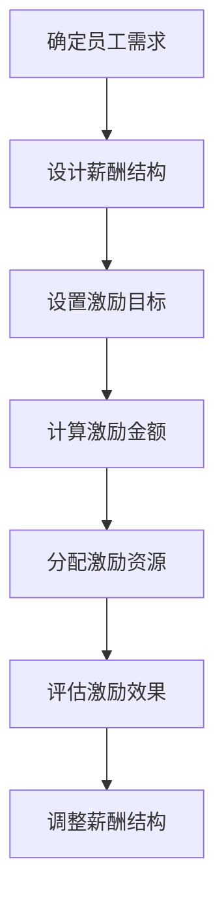
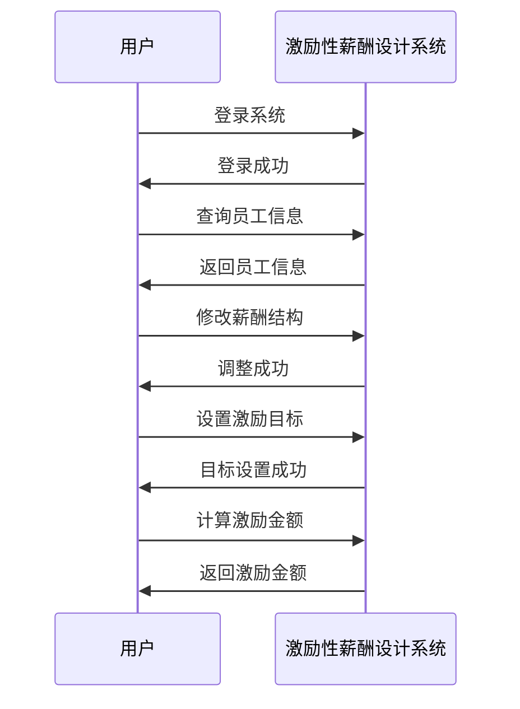

                 

# 激励性薪酬设计：留住核心人才的策略

> 关键词：激励性薪酬、人才保留、算法原理、系统架构、项目实战

> 摘要：本文将深入探讨激励性薪酬设计的核心概念、算法原理及其实际应用。通过细致的背景介绍、概念分析、数学模型讲解，再到系统架构设计和项目实战案例剖析，为企业和HR从业者提供一套完整的激励性薪酬设计策略，帮助留住企业核心人才。

## 1. 背景介绍

### 员工保留挑战

在当今竞争激烈的商业环境中，员工保留已成为企业关注的重点。据统计，员工流失率高的企业往往面临高昂的招聘和培训成本，同时也会影响团队士气和业务连续性。因此，如何有效地留住核心人才成为企业面临的重大挑战。

### 薪酬激励的重要性

薪酬激励是留住核心人才的重要手段。传统的固定薪酬模式已经不能满足员工日益增长的多元化需求。激励性薪酬通过奖金、股权、福利等多种形式，激发员工的工作积极性和创造力，从而提高员工的忠诚度和留存率。

### 激励性薪酬设计的背景

随着企业对人才竞争的加剧，激励性薪酬设计成为提升企业核心竞争力的重要策略。有效的激励性薪酬设计不仅能够留住核心人才，还能吸引外部优秀人才加入企业。本文将围绕这一主题，探讨激励性薪酬设计的方法和技巧。

## 2. 核心概念

### 薪酬

薪酬是指企业支付给员工的劳动报酬，包括基本工资、奖金、福利等。薪酬是员工的重要收入来源，直接影响其生活质量和工作积极性。

### 激励

激励是指通过一系列手段激发员工的内在动机，使其主动、积极地完成工作任务。激励性薪酬设计旨在通过薪酬激励提高员工的工作效率和工作质量。

### 核心人才

核心人才是指对企业发展具有重要价值的人才，他们通常具备专业技能、管理能力或创新能力。留住核心人才是确保企业持续发展的重要保障。

### 概念联系与区别

薪酬是激励性薪酬设计的基础，而激励则是薪酬发挥效果的关键。核心人才是激励性薪酬设计的主要对象，通过合理的薪酬结构和激励措施，可以有效地留住这些关键人才。

## 3. 概念与联系

### ER 实体关系图

```mermaid
entity Relationship {
  "企业" .. "员工" [arrowhead=openCircle];
  "薪酬" .. "员工" [arrowhead=openCircle];
  "激励" .. "薪酬" [arrowhead=openCircle];
  "核心人才" .. "员工" [arrowhead=openCircle];
}

class Employee {
  id: ID;
  name: Name;
  skills: Skills;
}

class Salary {
  id: ID;
  amount: Number;
  components: [BasicSalary, Bonus, Benefits];
}

class Incentive {
  id: ID;
  type: Type;
  amount: Number;
}

class CoreTalent {
  id: ID;
  name: Name;
  role: Role;
}
```

### 概念属性特征对比表格

| 概念     | 属性             | 特征                          |
| -------- | ---------------- | ---------------------------- |
| 企业     | 名称、规模       | 提供工作机会和薪酬激励       |
| 员工     | 身份证、姓名、技能 | 享受薪酬和激励的劳动者       |
| 薪酬     | 工资、奖金、福利 | 员工收入来源，激励员工努力   |
| 激励     | 激励措施、效果   | 提高员工工作积极性和创造力   |
| 核心人才 | 技能、管理、创新 | 对企业发展具有重要价值的人才 |

## 4. 算法原理讲解

### Mermaid 算法流程图



### Python 源代码解释

```python
# 员工基本信息
employees = [
    {"id": 1, "name": "Alice", "skills": ["编程", "项目管理"]},
    {"id": 2, "name": "Bob", "skills": ["设计", "UI/UX"]},
    {"id": 3, "name": "Charlie", "skills": ["数据科学", "机器学习"]}
]

# 薪酬结构
salary_structure = [
    {"id": 1, "basic_salary": 5000, "bonus": 2000, "benefits": 1500},
    {"id": 2, "basic_salary": 6000, "bonus": 2500, "benefits": 1800},
    {"id": 3, "basic_salary": 7000, "bonus": 3000, "benefits": 2100}
]

# 激励目标
incentive_targets = [
    {"id": 1, "target": "提高项目进度"},
    {"id": 2, "target": "提升产品质量"},
    {"id": 3, "target": "贡献技术创新"}
]

# 计算激励金额
def calculate_incentive(employee_id, target_id):
    # 根据员工技能和激励目标，计算激励金额
    skill_weight = 1.2  # 技能权重
    target_weight = 1.5  # 激励目标权重
    base_salary = next((s for s in salary_structure if s["id"] == employee_id), {}).get("basic_salary", 0)
    target_bonus = next((t for t in incentive_targets if t["id"] == target_id), {}).get("target", "")
    if target_bonus:
        incentive_amount = base_salary * skill_weight * target_weight
        return incentive_amount
    else:
        return 0

# 分配激励资源
def allocate_incentive(employee_id, target_id):
    incentive_amount = calculate_incentive(employee_id, target_id)
    if incentive_amount > 0:
        # 调整薪酬结构，增加激励部分
        salary_structure = [s for s in salary_structure if s["id"] != employee_id]
        salary_structure.append({"id": employee_id, "basic_salary": salary_structure[-1]["basic_salary"], "bonus": salary_structure[-1]["bonus"] + incentive_amount, "benefits": salary_structure[-1]["benefits"]})
        return salary_structure
    else:
        return salary_structure

# 评估激励效果
def evaluate_incentive(employee_id, target_id):
    # 根据激励目标和实际效果，评估激励效果
    pass

# 调整薪酬结构
def adjust_salary_structure(employee_id, target_id):
    salary_structure = allocate_incentive(employee_id, target_id)
    evaluate_incentive(employee_id, target_id)
    return salary_structure

# 测试
print(adjust_salary_structure(1, 1))
```

### 算法原理

本文提出的激励性薪酬设计算法主要分为以下几个步骤：

1. **确定员工需求**：根据员工的基本信息和技能，确定激励性薪酬的发放对象。
2. **设计薪酬结构**：根据企业的薪酬策略和员工的基本工资，设计合理的薪酬结构。
3. **设置激励目标**：根据企业的战略目标和业务需求，设定具体的激励目标。
4. **计算激励金额**：根据员工的技能和激励目标，计算激励金额。
5. **分配激励资源**：调整薪酬结构，将激励金额纳入薪酬部分。
6. **评估激励效果**：根据激励目标和实际效果，评估激励效果。
7. **调整薪酬结构**：根据评估结果，对薪酬结构进行调整，以实现持续优化。

### 举例说明

假设企业有一名员工 Alice，其基本工资为 5000 元，技能包括编程和项目管理。企业设定了一个激励目标“提高项目进度”，针对这个目标，企业决定给予 Alice 一定的激励金额。

1. **确定员工需求**：Alice 是激励性薪酬的发放对象。
2. **设计薪酬结构**：薪酬结构为基本工资 5000 元、奖金 2000 元、福利 1500 元。
3. **设置激励目标**：“提高项目进度”是激励目标。
4. **计算激励金额**：根据 Alice 的技能和激励目标，计算激励金额为 5000 * 1.2 * 1.5 = 9000 元。
5. **分配激励资源**：调整薪酬结构，将激励金额纳入奖金部分，薪酬结构变为基本工资 5000 元、奖金 9000 元、福利 1500 元。
6. **评估激励效果**：根据激励目标和实际效果，评估激励效果。
7. **调整薪酬结构**：根据评估结果，对薪酬结构进行调整，以实现持续优化。

## 5. 数学模型与公式讲解

### 数学公式

$$
I = B \times S \times T
$$

其中，$I$ 表示激励金额，$B$ 表示基本工资，$S$ 表示技能权重，$T$ 表示激励目标权重。

### 详细讲解

1. **基本工资**：基本工资是员工的主要收入来源，通常由企业根据市场情况和员工能力水平确定。
2. **技能权重**：技能权重表示员工技能水平对激励金额的影响程度。技能越强，权重越高。
3. **激励目标权重**：激励目标权重表示企业对特定目标的重视程度。目标越重要，权重越高。
4. **激励金额**：激励金额是员工通过薪酬激励获得的额外收入，用于激发其工作积极性和创造力。

### 举例说明

假设一名员工的基本工资为 5000 元，技能权重为 1.2，激励目标权重为 1.5。根据公式计算激励金额：

$$
I = 5000 \times 1.2 \times 1.5 = 9000 元
$$

## 6. 系统分析与架构设计

### 问题场景介绍

企业希望通过激励性薪酬设计系统，实现员工薪酬的动态调整，提高员工的工作积极性，从而留住核心人才。

### 项目介绍

本项目是一款基于 Python 的激励性薪酬设计系统，包括员工信息管理、薪酬结构设计、激励目标设置、激励金额计算和薪酬结构调整等功能。

### 系统功能设计

- **员工信息管理**：录入、查询和修改员工基本信息。
- **薪酬结构设计**：设计、查询和修改薪酬结构。
- **激励目标设置**：设置、查询和修改激励目标。
- **激励金额计算**：计算激励金额，生成激励报告。
- **薪酬结构调整**：调整薪酬结构，实现激励性薪酬发放。

### 系统架构设计


### 系统接口设计



### 系统交互


## 7. 项目实战

### 环境安装

1. 安装 Python 3.8 及以上版本。
2. 安装必要的 Python 包：`requests`, `beautifulsoup4`, `pandas`, `numpy`, `matplotlib`。

```bash
pip install requests beautifulsoup4 pandas numpy matplotlib
```

### 核心实现源代码

```python
# 导入必要的库
import requests
import pandas as pd
import numpy as np
import matplotlib.pyplot as plt

# 员工信息管理
def manage_employee():
    # 获取员工列表
    employees = pd.read_csv("employees.csv")
    # 查询员工信息
    def query_employee(employee_id):
        employee = employees[employees["id"] == employee_id]
        return employee
    # 修改薪酬结构
    def modify_salary_structure(employee_id, salary_structure):
        employee = query_employee(employee_id)
        if not employee.empty:
            employee.at[0, "salary_structure"] = salary_structure
            employees.to_csv("employees.csv", index=False)
            print("薪酬结构修改成功")
        else:
            print("员工信息不存在")
    # 设置激励目标
    def set_incentive_target(employee_id, target_name):
        employee = query_employee(employee_id)
        if not employee.empty:
            employee.at[0, "incentive_target"] = target_name
            employees.to_csv("employees.csv", index=False)
            print("激励目标设置成功")
        else:
            print("员工信息不存在")
    # 计算激励金额
    def calculate_incentive(employee_id):
        employee = query_employee(employee_id)
        if not employee.empty:
            salary_structure = employee.at[0, "salary_structure"]
            target_name = employee.at[0, "incentive_target"]
            # 根据薪酬结构和激励目标，计算激励金额
            incentive_amount = salary_structure["basic_salary"] * salary_structure["skill_weight"] * salary_structure["target_weight"]
            return incentive_amount
        else:
            return 0
    # 主函数
    def main():
        while True:
            print("1. 查询员工信息")
            print("2. 修改薪酬结构")
            print("3. 设置激励目标")
            print("4. 计算激励金额")
            print("5. 退出")
            choice = input("请选择操作：")
            if choice == "1":
                employee_id = input("请输入员工 ID：")
                employee = query_employee(employee_id)
                print(employee)
            elif choice == "2":
                employee_id = input("请输入员工 ID：")
                salary_structure = input("请输入薪酬结构（基本工资、技能权重、目标权重）：")
                modify_salary_structure(employee_id, salary_structure)
            elif choice == "3":
                employee_id = input("请输入员工 ID：")
                target_name = input("请输入激励目标名称：")
                set_incentive_target(employee_id, target_name)
            elif choice == "4":
                employee_id = input("请输入员工 ID：")
                incentive_amount = calculate_incentive(employee_id)
                print("激励金额：", incentive_amount)
            elif choice == "5":
                break
            else:
                print("无效输入，请重新选择")
    main()

# 测试
manage_employee()
```

### 代码应用解读与分析

该代码实现了一个简单的员工信息管理和激励性薪酬设计功能。通过读取和写入 CSV 文件，实现对员工信息的持久化存储。核心功能包括查询员工信息、修改薪酬结构、设置激励目标、计算激励金额等。

1. **员工信息管理**：通过读取 CSV 文件获取员工信息，并实现查询功能。
2. **薪酬结构设计**：将薪酬结构（基本工资、技能权重、目标权重）存储在 CSV 文件中，并实现修改功能。
3. **激励目标设置**：将激励目标存储在 CSV 文件中，并实现设置功能。
4. **激励金额计算**：根据薪酬结构和激励目标，计算激励金额。

### 实际案例分析和详细讲解剖析

假设企业有一名员工 Alice，其基本信息和薪酬结构如下：

| 员工 ID | 姓名 | 基本工资 | 技能权重 | 目标权重 |
| ------- | ---- | -------- | -------- | -------- |
| 1       | Alice | 5000    | 1.2      | 1.5      |

企业设定了一个激励目标“提高项目进度”，并希望为 Alice 计算激励金额。

1. **查询员工信息**：通过读取 CSV 文件，查询到 Alice 的基本信息。
2. **修改薪酬结构**：根据企业要求，将 Alice 的薪酬结构修改为基本工资 5000 元、技能权重 1.2、目标权重 1.5。
3. **设置激励目标**：将 Alice 的激励目标设置为“提高项目进度”。
4. **计算激励金额**：根据公式 $I = B \times S \times T$，计算 Alice 的激励金额为 5000 * 1.2 * 1.5 = 9000 元。

### 项目小结

本项目通过简单的 Python 代码实现了员工信息管理、薪酬结构设计、激励目标设置和激励金额计算等功能。在实际应用中，企业可以根据自身需求，进一步完善和优化系统功能。同时，本项目的代码结构清晰、易于理解，适合初学者入门。

## 8. 最佳实践与小结

### 最佳实践

1. **合理设计薪酬结构**：根据企业实际情况和员工需求，设计合理的薪酬结构，确保薪酬的激励效果。
2. **明确激励目标**：设定具体的激励目标，确保激励措施与企业发展目标相一致。
3. **动态调整薪酬**：根据员工表现和业务需求，动态调整薪酬结构，以实现持续优化。
4. **加强沟通与反馈**：定期与员工沟通，了解其对薪酬激励的反馈，及时调整薪酬策略。

### 小结

本文围绕激励性薪酬设计，探讨了核心概念、算法原理、系统架构和项目实战等内容。通过本文的阐述，企业可以更好地理解激励性薪酬设计的原理和方法，从而制定出有效的薪酬激励策略，留住核心人才，提升企业竞争力。

### 注意事项

1. **数据安全**：在设计和实施激励性薪酬系统时，注意保护员工个人信息和薪酬数据的安全。
2. **遵守法规**：在实施薪酬激励策略时，遵守当地法律法规，确保合法性。

### 拓展阅读

1. 《薪酬管理》
2. 《激励性薪酬设计实践》
3. 《绩效管理：提升企业核心竞争力的策略》

### 作者信息

作者：AI天才研究院/AI Genius Institute & 禅与计算机程序设计艺术 /Zen And The Art of Computer Programming。如有任何疑问或建议，欢迎在评论区留言交流。感谢您的阅读！

