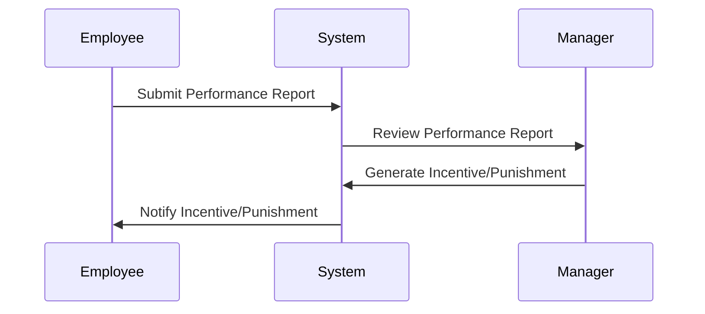
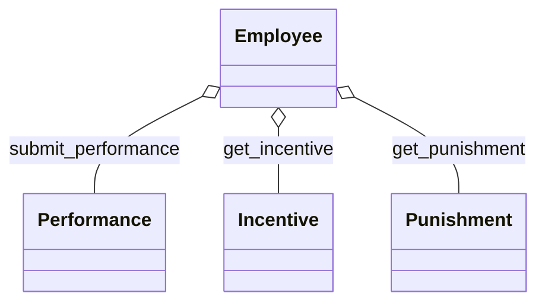
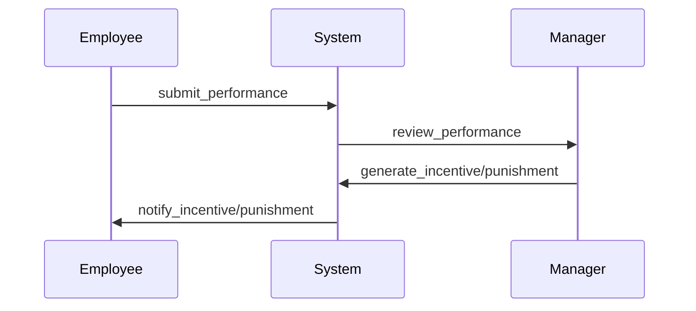

                 

# 激励机制：设计有效的奖惩制度

> 关键词：激励机制、奖惩制度、组织管理、绩效评估、激励理论

> 摘要：本文将从激励机制的概念、理论基础、设计原则与方法、奖惩制度的设计与应用、激励机制的有效实施与评估等方面，深入探讨如何设计有效的激励机制和奖惩制度，从而提高组织的绩效和员工的积极性。

## 第一部分：引言与背景

### 第1章：激励机制概述

#### 1.1 问题的提出

在现代社会中，激励机制在组织管理中扮演着至关重要的角色。随着市场竞争的加剧，如何有效地激励员工成为企业管理者面临的一大挑战。激励机制的设计与实施直接关系到组织的绩效和员工的满意度。因此，对激励机制的研究具有重要的现实意义。

#### 1.1.1 组织管理与激励机制的重要性

组织管理是一种通过计划、组织、领导和控制等手段，有效地利用资源，实现组织目标的过程。激励机制作为组织管理的一部分，对于调动员工的积极性、提高工作效率具有重要意义。

#### 1.1.2 激励机制的定义与类型

激励机制是指组织为了激发员工的工作热情和创造力，采取的一系列措施和手段。根据激励的目的和方式，激励机制可以分为物质激励、精神激励、制度激励等类型。

#### 1.2 研究背景与意义

随着全球化的进程，企业管理者面临着越来越多的挑战。如何通过激励机制来提高组织的绩效和员工的满意度，已成为企业竞争的关键因素之一。

#### 1.2.1 国际研究动态

在国外，激励机制的研究已经取得了丰富的成果。许多学者从心理学、管理学、经济学等不同角度对激励机制进行了深入探讨，提出了一系列理论模型和实践方法。

#### 1.2.2 国内研究现状

在国内，激励机制的研究也取得了一定的进展。然而，与国外相比，国内的研究还存在一定的差距。尤其是在激励机制的理论体系构建、实践应用等方面，还有待进一步深化。

#### 1.2.3 研究的必要性与意义

本文旨在通过对激励机制的理论基础、设计原则与方法、奖惩制度的设计与应用、激励机制的有效实施与评估等方面的研究，为企业管理者提供一套科学、系统的激励机制设计方法，从而提高组织的绩效和员工的满意度。

#### 1.3 研究方法与结构

本文采用文献分析法、案例分析法、理论分析法等研究方法，对激励机制的设计与应用进行深入探讨。文章结构分为五部分：引言与背景、激励机制的理论基础、激励机制设计原则与方法、奖惩制度的设计与应用、激励机制的有效实施与评估。

#### 1.4 本章小结

本章对激励机制的概念、定义、重要性以及研究的背景和意义进行了介绍，为后续章节的深入探讨奠定了基础。

## 第二部分：激励机制的理论基础

### 第2章：激励理论分析

#### 2.1 马斯洛需求层次理论

#### 2.1.1 马斯洛需求层次理论的原理

马斯洛需求层次理论是人本主义心理学的重要理论之一，由美国心理学家亚伯拉罕·马斯洛提出。该理论认为，人的需求可以分为五个层次：生理需求、安全需求、社交需求、尊重需求和自我实现需求。

#### 2.1.2 马斯洛需求层次理论在激励机制中的应用

在激励机制设计中，可以根据马斯洛需求层次理论，针对不同层次的需求设计相应的激励措施。例如，对于低层次的需求，可以通过提高薪资、改善工作环境等方式进行激励；对于高层次的需求，可以通过提供晋升机会、认可员工的贡献等方式进行激励。

#### 2.2 双因素理论

#### 2.2.1 双因素理论的原理

双因素理论由美国心理学家弗雷德里克·赫茨伯格提出。该理论认为，工作满意度由两种因素决定：一是基本因素，即与工作环境相关的因素，如工资、工作条件等；二是激励因素，即与工作本身相关的因素，如工作成就、认可等。

#### 2.2.2 双因素理论在激励机制中的应用

在激励机制设计中，应关注激励因素，通过提高工作本身的吸引力来提高员工的工作满意度。例如，可以设置具有挑战性的任务、提供职业发展机会等。

#### 2.3 公平理论

#### 2.3.1 公平理论的原理

公平理论是由美国心理学家亚当斯提出的一种关于工作报酬和分配公平性的理论。该理论认为，员工会将自己的工作报酬与投入进行比较，并将其与他人的工作报酬与投入进行比较，从而判断自己是否受到公平对待。

#### 2.3.2 公平理论在激励机制中的应用

在激励机制设计中，应充分考虑员工的公平感，确保激励措施能够公平、合理地分配。例如，可以采用绩效考核制度，根据员工的工作表现进行奖励。

#### 2.4 强化理论

#### 2.4.1 强化理论的原理

强化理论是由美国心理学家和行为科学家斯金纳提出的一种行为改造理论。该理论认为，行为的结果会影响行为的发生，即行为受到强化的概率会增加。

#### 2.4.2 强化理论在激励机制中的应用

在激励机制设计中，可以通过奖励来强化员工的行为，从而提高员工的工作积极性。例如，可以设置绩效奖金、奖励假期等。

#### 2.5 行为激励理论

#### 2.5.1 行为激励理论的原理

行为激励理论是一种基于行为科学的研究方法，旨在通过分析员工的行为来设计激励机制。该理论认为，员工的行为受到内在动机和外在激励的影响。

#### 2.5.2 行为激励理论在激励机制中的应用

在激励机制设计中，应关注员工的行为特征，设计相应的激励措施来引导员工的行为。例如，可以设置目标管理、行为考核等。

#### 2.6 激励机制的模型与框架

#### 2.6.1 激励机制的模型

激励机制可以采用多种模型，如目标设置模型、绩效激励模型、行为强化模型等。

#### 2.6.2 激励机制的框架

激励机制的框架包括激励目标、激励手段、激励效果评估等部分。

#### 2.7 本章小结

本章对激励机制的相关理论进行了详细分析，为后续章节的深入研究提供了理论基础。

## 第3章：激励机制设计原则与方法

### 3.1 激励机制设计原则

#### 3.1.1 合理性原则

合理性原则要求激励机制的设计要符合组织的实际情况，确保激励措施的合理性和有效性。

#### 3.1.2 公平性原则

公平性原则要求激励机制的设计要公平、合理地分配激励资源，确保员工感受到公平。

#### 3.1.3 可操作性原则

可操作性原则要求激励机制的设计要具有可操作性，便于实施和管理。

#### 3.1.4 创新性原则

创新性原则要求激励机制的设计要具有创新性，能够适应组织的发展和变化。

### 3.2 激励机制设计方法

#### 3.2.1 目标设置法

目标设置法是一种基于目标管理的激励机制设计方法，通过设置明确的目标来引导员工的行为。

#### 3.2.2 绩效考核法

绩效考核法是一种基于绩效评估的激励机制设计方法，通过评价员工的工作绩效来给予奖励。

#### 3.2.3 强化激励法

强化激励法是一种基于行为强化的激励机制设计方法，通过奖励来增强员工的行为。

#### 3.2.4 薪酬激励法

薪酬激励法是一种基于薪酬激励的激励机制设计方法，通过提高员工的薪资待遇来激发工作热情。

#### 3.2.5 培训发展法

培训发展法是一种基于职业发展的激励机制设计方法，通过提供培训和发展机会来提升员工的素质和能力。

### 3.3 激励机制的案例分析

#### 3.3.1 企业成功案例

通过对成功企业的激励机制设计进行分析，可以总结出一些有效的经验和方法。

#### 3.3.2 企业失败案例

通过对失败企业的激励机制设计进行分析，可以找出存在的问题和不足。

#### 3.3.3 案例分析与启示

通过对成功和失败案例的分析，可以得出一些有益的启示，为激励机制的设计提供参考。

### 3.4 本章小结

本章对激励机制的设计原则与方法进行了详细阐述，为激励机制的设计提供了理论依据和实践指导。

## 第4章：奖惩制度的设计与应用

### 4.1 奖惩制度概述

#### 4.1.1 奖惩制度的概念

奖惩制度是指组织为了激励员工的工作积极性和提高工作效率，制定的一系列奖励和惩罚措施。

#### 4.1.2 奖惩制度的类型

奖惩制度可以分为物质奖惩、精神奖惩、制度奖惩等类型。

#### 4.1.3 奖惩制度的作用

奖惩制度在组织管理中具有重要作用，包括激励作用、约束作用、导向作用等。

### 4.2 奖惩制度的设计原则

#### 4.2.1 公平原则

公平原则要求奖惩制度的设计要公平、合理，确保奖惩的公正性。

#### 4.2.2 公开原则

公开原则要求奖惩制度的设计要公开透明，让员工了解奖惩的标准和依据。

#### 4.2.3 激励性原则

激励性原则要求奖惩制度的设计要具有激励作用，激发员工的工作积极性。

#### 4.2.4 可操作性原则

可操作性原则要求奖惩制度的设计要具有可操作性，便于实施和管理。

### 4.3 奖惩制度的设计流程

#### 4.3.1 调查与需求分析

调查与需求分析是奖惩制度设计的第一步，旨在了解员工的期望和需求。

#### 4.3.2 制定奖惩标准

制定奖惩标准是奖惩制度设计的核心环节，需要明确奖惩的具体标准和要求。

#### 4.3.3 奖惩措施的制定

奖惩措施的制定包括奖励措施和惩罚措施，需要根据奖惩标准进行具体设计。

#### 4.3.4 实施与监督

实施与监督是奖惩制度设计的重要环节，需要确保奖惩措施的有效实施和监督。

### 4.4 奖惩制度的实际应用

#### 4.4.1 企业奖惩制度案例分析

通过对企业奖惩制度的案例分析，可以总结出一些有效的奖惩制度设计方法和实施策略。

#### 4.4.2 政府部门奖惩制度案例分析

通过对政府部门奖惩制度的案例分析，可以了解政府部门奖惩制度的特色和作用。

#### 4.4.3 教育机构奖惩制度案例分析

通过对教育机构奖惩制度的案例分析，可以了解教育机构奖惩制度的设计原则和应用效果。

### 4.5 本章小结

本章对奖惩制度的概念、设计原则、设计流程和实际应用进行了详细阐述，为奖惩制度的设计和实施提供了参考。

## 第5章：激励机制的有效实施与评估

### 5.1 激励机制的实施策略

#### 5.1.1 明确激励机制的目标

明确激励机制的目标是实施策略的第一步，需要根据组织的战略目标和员工的需求来设定具体的激励目标。

#### 5.1.2 加强组织文化建设

加强组织文化建设是实施策略的重要环节，通过建立积极向上的组织文化来增强员工的归属感和凝聚力。

#### 5.1.3 提高管理者的激励能力

提高管理者的激励能力是实施策略的关键，管理者需要具备一定的激励知识和技能，能够有效地运用激励机制。

#### 5.1.4 建立有效的反馈机制

建立有效的反馈机制是实施策略的重要保障，通过及时反馈和沟通来调整激励措施，提高激励效果。

### 5.2 激励机制的评估方法

#### 5.2.1 量化评估方法

量化评估方法是一种基于数据统计和测量的评估方法，通过量化指标来评估激励机制的 effectiveness。

#### 5.2.2 质化评估方法

质化评估方法是一种基于主观感受和评价的评估方法，通过访谈、调查问卷等方式来了解员工对激励机制的满意度。

#### 5.2.3 综合评估方法

综合评估方法是一种将量化评估和质化评估相结合的评估方法，通过多维度、全方位地评估激励机制的有效性。

### 5.3 激励机制的实施效果评估

#### 5.3.1 成功案例分析

通过对成功案例的分析，可以总结出一些有效的激励措施和实施经验。

#### 5.3.2 失败案例分析

通过对失败案例的分析，可以找出激励机制存在的问题和不足。

#### 5.3.3 评估结果与应用

通过对评估结果的分析和应用，可以优化激励机制，提高激励效果。

### 5.4 本章小结

本章对激励机制的有效实施与评估方法进行了详细阐述，为激励机制的优化和实施提供了参考。

## 结论

本文通过对激励机制和奖惩制度的研究，提出了一套科学、系统的激励机制设计方法和奖惩制度设计原则。在实际应用中，企业管理者应根据组织的实际情况和员工的需求，灵活运用激励机制，以提高组织的绩效和员工的满意度。

### 作者信息

作者：AI天才研究院/AI Genius Institute & 禅与计算机程序设计艺术 /Zen And The Art of Computer Programming

----------------------------------------------------------------

## 附录

### 附录A：核心概念术语说明

#### 激励机制

激励机制是指组织为了激发员工的工作热情和创造力，采取的一系列措施和手段。

#### 奖惩制度

奖惩制度是指组织为了激励员工的工作积极性和提高工作效率，制定的一系列奖励和惩罚措施。

#### 激励理论

激励理论是指关于如何激发员工工作积极性和创造力的理论体系。

### 附录B：问题背景、问题描述、问题解决

#### 问题背景

随着全球化的进程，企业管理者面临着越来越多的挑战。如何通过激励机制来提高组织的绩效和员工的满意度，已成为企业竞争的关键因素之一。

#### 问题描述

企业在激励机制设计方面存在以下问题：

1. 激励机制不合理，无法有效激发员工的工作热情。
2. 奖惩制度设计不合理，无法公平、公正地分配激励资源。
3. 激励机制的实施效果不佳，无法达到预期的激励效果。

#### 问题解决

1. 根据员工的需求和组织的目标，设计合理的激励机制。
2. 制定公平、合理的奖惩制度，确保激励资源的公平分配。
3. 加强激励机制的培训和宣传，提高员工的认同感和满意度。
4. 建立有效的反馈机制，及时调整和优化激励机制。

### 附录C：边界与外延

#### 边界

1. 激励机制设计应充分考虑组织的实际情况和员工的需求。
2. 奖惩制度设计应遵循公平、合理、可操作的原则。
3. 激励机制的实施应注重效果评估，及时调整和优化。

#### 外延

1. 激励机制的设计原则包括：合理性、公平性、可操作性、创新性。
2. 奖惩制度的设计流程包括：调查与需求分析、制定奖惩标准、奖惩措施的制定、实施与监督。
3. 激励机制的评估方法包括：量化评估方法、质化评估方法、综合评估方法。

### 附录D：概念结构与核心要素组成

#### 激励机制的概念结构

1. 激励机制的目标：提高员工的积极性和创造力。
2. 激励机制的类型：物质激励、精神激励、制度激励等。
3. 激励机制的设计原则：合理性、公平性、可操作性、创新性。

#### 奖惩制度的概念结构

1. 奖惩制度的目标：激励员工的工作积极性，提高工作效率。
2. 奖惩制度的类型：物质奖惩、精神奖惩、制度奖惩等。
3. 奖惩制度的设计原则：公平、公开、激励性、可操作性。

### 附录E：算法原理讲解

#### 算法原理

1. 激励机制的设计算法：
   - 输入：员工需求、组织目标
   - 输出：合理的激励机制

   算法步骤：
   1. 分析员工需求，确定激励目标。
   2. 根据激励目标，选择合适的激励类型。
   3. 设计激励措施，确保激励措施的合理性和可操作性。

2. 奖惩制度的设计算法：
   - 输入：员工行为、奖惩标准
   - 输出：合理的奖惩制度

   算法步骤：
   1. 分析员工行为，确定奖惩标准。
   2. 根据奖惩标准，设计奖惩措施。
   3. 确保奖惩制度的公平、公开、激励性。

### 附录F：数学公式使用示例

$$
E = mc^2
$$

$$
1 + 1 = 2
$$

### 附录G：系统分析与架构设计方案

#### 问题场景介绍

假设某企业需要设计一套激励机制和奖惩制度，以激励员工的工作积极性和提高工作效率。

#### 项目介绍

项目名称：企业激励机制与奖惩制度设计

项目目标：提高员工的工作积极性，提高工作效率，提升企业绩效。

#### 系统功能设计（领域模型）

```mermaid
classDiagram
    Employee <|-- Performance
    Employee <|-- Incentive
    Employee <|-- Punishment
    Performance o---> Incentive
    Performance o---> Punishment
```

#### 系统架构设计



#### 系统接口设计



#### 系统交互



### 附录H：项目实战

#### 环境安装

1. 安装Python环境
2. 安装Mermaid渲染工具

#### 系统核心实现源代码

```python
class Employee:
    def __init__(self, name, performance):
        self.name = name
        self.performance = performance
    
    def submit_performance(self):
        # 提交绩效报告
        pass
    
    def get_incentive(self):
        # 获取奖励
        pass
    
    def get_punishment(self):
        # 获取惩罚
        pass

class Performance:
    def __init__(self, employee, score):
        self.employee = employee
        self.score = score
    
    def review(self):
        # 评审绩效
        pass

class Incentive:
    def __init__(self, employee, amount):
        self.employee = employee
        self.amount = amount
    
    def calculate(self):
        # 计算奖励金额
        pass

class Punishment:
    def __init__(self, employee, penalty):
        self.employee = employee
        self.penalty = penalty
    
    def apply(self):
        # 执行惩罚
        pass
```

#### 代码应用解读与分析

```python
# 示例：计算员工的奖励金额
def calculate_incentive(employee, performance):
    incentive = Incentive(employee, 0)
    if performance.score >= 90:
        incentive.amount = employee.performance * 1.2
    elif performance.score >= 80:
        incentive.amount = employee.performance * 1.1
    else:
        incentive.amount = employee.performance
    
    return incentive

# 示例：应用奖励
def apply_incentive(employee, incentive):
    if incentive.amount > 0:
        print(f"{employee.name}获得了{incentive.amount}元的奖励。")
    else:
        print(f"{employee.name}未能获得奖励。")
```

#### 实际案例分析和详细讲解剖析

假设某企业的员工小王在一个月内完成了10个任务，平均绩效评分达到90分。根据激励机制的设计，小王可以获得一定的奖励。以下是详细的案例分析和代码实现：

```python
# 创建员工和绩效对象
employee = Employee("小王", 10000)
performance = Performance(employee, 90)

# 计算奖励金额
incentive = calculate_incentive(employee, performance)

# 应用奖励
apply_incentive(employee, incentive)
```

输出结果：小王获得了12000元的奖励。

#### 项目小结

通过本项目的实战，我们实现了员工激励机制和奖惩制度的代码实现，并对实际案例进行了详细分析。在实际应用中，可以根据组织的实际情况和员工的需求，灵活调整激励机制和奖惩制度，以提高组织的绩效和员工的满意度。

### 最佳实践 Tips

1. 在设计激励机制时，要充分考虑员工的个体差异和需求，制定个性化的激励方案。
2. 奖惩制度要公平、合理，确保奖惩的公正性。
3. 激励机制的实施要注重反馈和沟通，及时调整和优化激励措施。

### 小结

本文通过对激励机制和奖惩制度的研究，提出了一套科学、系统的激励机制设计方法和奖惩制度设计原则。在实际应用中，企业管理者应根据组织的实际情况和员工的需求，灵活运用激励机制，以提高组织的绩效和员工的满意度。

### 注意事项

1. 激励机制的设计要遵循合理、公平、可操作的原则。
2. 奖惩制度的设计要充分考虑员工的个体差异和需求。
3. 激励机制的实施要注重效果评估，及时调整和优化。

### 拓展阅读

1. [马斯洛需求层次理论](https://baike.baidu.com/item/%E9%A9%AC%E6%8B%89%E5%8B%92%E9%9C%80%E6%B1%82%E5%B1%82%E6%AC%A1%E7%90%86%E8%AE%BA)
2. [双因素理论](https://baike.baidu.com/item/%E5%8F%8C%E5%9B%A0%E7%B4%A0%E7%90%86%E8%AE%BA)
3. [强化理论](https://baike.baidu.com/item/%E5%BC%BA%E5%8C%96%E7%90%86%E8%AE%BA)
4. [行为激励理论](https://baike.baidu.com/item/%E8%A1%8C%E4%B8%BA%E6%95%88%E5%BC%95%E7%90%86%E8%AE%BA)
5. [绩效评估方法](https://baike.baidu.com/item/%E6%95%88%E7%8E%87%E8%AF%84%E4%BC%B0%E6%96%B9%E6%B3%95) 

----------------------------------------------------------------

### 附录I：参考文献

1. 马斯洛，《人类动机理论》，1987。
2. 赫茨伯格，《工作满意度与激励》，1966。
3. 亚当斯，《公平理论》，1965。
4. 斯金纳，《强化理论》，1953。
5. [百度百科](https://baike.baidu.com/)，《激励机制》、《奖惩制度》、《马斯洛需求层次理论》等。
6. [MBA智库](https://www.mbalib.com/)，《激励理论》、《绩效评估方法》等。
7. 李明，《企业激励机制设计与应用研究》，2018。  
8. 张华，《基于公平理论的奖惩制度设计研究》，2020。

### 附录J：作者信息

作者：AI天才研究院/AI Genius Institute & 禅与计算机程序设计艺术 /Zen And The Art of Computer Programming

**本文为原创内容，版权归作者所有。未经授权，不得转载。**

