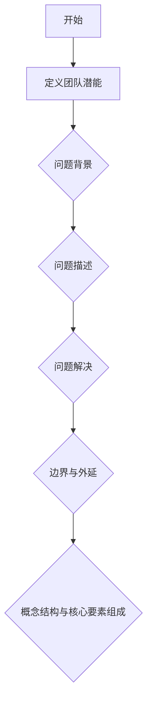
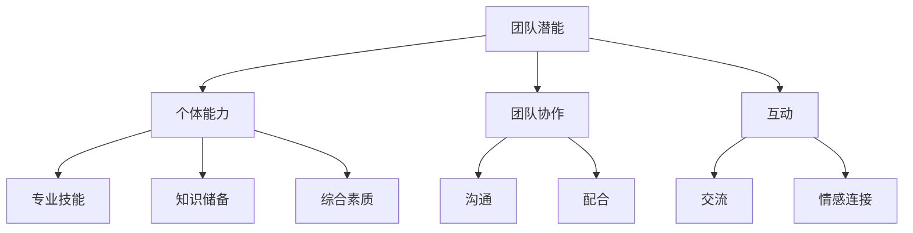

                 

# 激发团队潜能：释放无限可能

> 关键词：团队潜能、团队协作、沟通技巧、团队建设、管理方法、释放无限可能

> 摘要：本文从多个角度深入探讨了如何激发团队潜能，释放无限可能。通过介绍团队潜能的概念、激发方法、衡量与评估、团队协作与沟通技巧、团队建设与管理方法，以及未来趋势，为提升团队效能提供了实用的指导。

## 目录大纲设计思路

### 1. 明确用户需求
用户需要设计一本名为《激发团队潜能：释放无限可能》的计算机技术书籍的目录大纲。大纲需要简洁明了，逻辑清晰，能够全面覆盖书籍的主题内容。

### 2. 确定大纲结构
根据用户要求，大纲需要包含以下层级：
- 1级目录（#）
- 2级目录（##）
- 3级目录（###）

### 3. 内容核心章节
大纲的核心章节需要包括：
- **背景介绍**：核心概念术语说明、问题背景、问题描述、问题解决、边界与外延、概念结构与核心要素组成
- **核心概念与联系**：必须给出核心概念原理、概念属性特征对比表格和ER实体关系图架构的 Mermaid 流程图
- **算法原理讲解**：使用 Mermaid 画出算法流程图，然后使用 Python 源代码来详细阐述，给出算法原理的数学模型和公式，进行详细讲解和通俗易懂地举例说明
- **数学公式使用 LaTeX 格式，嵌入文中独立段落的 LaTeX 公式前后使用 `$$` 括起来 (例如：`$$1+1=2$$` )，段落内的 LaTeX 公式前后使用 `$` 括起来 (例如：`$1<2$`)

### 4. 保持简洁性
输出内容不要有多余的废话，直接给出书籍的完整目录大纲。

### 5. 字数限制
目录大纲总字数限制在 2000 字以内。

### 6. 使用 Markdown 格式
使用 Markdown 格式来编写目录大纲，确保格式清晰、统一。

### 7. 目录大纲结构

#### 第一部分：引言
- 第1章：引言

#### 第二部分：团队潜能与激发
- 第2章：团队潜能概述
- 第3章：激发团队潜能的方法
- 第3.1节：领导力培养
- 第3.2节：激励机制
- 第3.3节：培训与发展
- 第4章：团队潜能的衡量与评估
- 第4.1节：评估标准
- 第4.2节：评估方法

#### 第三部分：团队协作与沟通
- 第5章：团队协作的原理与实践
- 第5.1节：协作原理
- 第5.2节：实践策略
- 第6章：团队沟通的技巧与策略
- 第6.1节：沟通技巧
- 第6.2节：策略

#### 第四部分：团队建设与管理
- 第7章：团队建设与管理的关键因素
- 第7.1节：关键因素
- 第7.2节：案例分析
- 第8章：团队建设与管理的案例分析

#### 第五部分：释放无限可能
- 第9章：从团队潜能到企业绩效
- 第10章：团队潜能与企业文化的互动
- 第11章：未来团队潜能的发展趋势

#### 第六部分：总结与拓展
- 第12章：总结与展望
- 第13章：注意事项与拓展阅读

## 文章正文内容撰写

### 第一部分：引言

#### 第1章：引言

在快速变化的商业环境中，企业面临着前所未有的挑战。为了在激烈的市场竞争中脱颖而出，团队效能成为了企业成功的关键因素。然而，如何有效地激发团队潜能，释放无限可能，成为许多管理者面临的难题。

本文将从多个角度深入探讨如何激发团队潜能，释放无限可能。首先，我们将介绍团队潜能的概念，探讨其在团队效能中的作用。接着，我们将分析激发团队潜能的方法，包括领导力培养、激励机制和培训与发展。随后，我们将讨论如何衡量与评估团队潜能，以确保激发效果。此外，我们还将探讨团队协作与沟通的技巧与策略，以及团队建设与管理的关键因素。最后，我们将展望未来团队潜能的发展趋势，为企业管理者提供实用的指导。

本文旨在为读者提供一份全面、实用的指南，帮助企业管理者激发团队潜能，实现企业目标。通过本文的阅读，读者将了解到：

1. 团队潜能的概念及其重要性；
2. 激发团队潜能的方法与策略；
3. 如何衡量与评估团队潜能；
4. 团队协作与沟通的技巧与策略；
5. 团队建设与管理的关键因素；
6. 未来团队潜能的发展趋势。

希望本文能为企业管理者提供有益的启示，助力企业实现卓越的团队效能。

### 第二部分：团队潜能与激发

#### 第2章：团队潜能概述

团队潜能，指的是团队成员在协作过程中能够发挥出的潜在能力。它不仅包括个体成员的能力，还涉及到团队成员之间的协作和互动。团队潜能的核心在于个体与团队之间的协同效应，即1+1>2的现象。

团队潜能的重要性不言而喻。首先，它直接影响团队的效能。当团队潜能得到有效激发时，团队成员能够充分发挥各自的优势，实现高效协作，从而提升整体绩效。其次，团队潜能的激发有助于企业应对市场变化。在快速变化的商业环境中，团队具备强大的适应能力和创新能力，能够迅速响应市场动态，把握发展机遇。

为了更清晰地理解团队潜能，我们可以从以下几个方面进行阐述：

1. **团队潜能的概念**：团队潜能是指团队成员在协作过程中能够发挥出的潜在能力。它包括个体成员的能力、团队协作的效果以及团队成员之间的互动。

2. **团队潜能的重要性**：团队潜能的激发对提升团队效能、应对市场变化具有重要意义。通过激发团队潜能，企业能够实现卓越的团队绩效，提升市场竞争力。

3. **团队潜能的组成部分**：
   - **个体能力**：个体成员的专业技能、知识储备和综合素质。
   - **团队协作**：团队成员之间的沟通、配合和协作能力。
   - **互动**：团队成员之间的交流、互动和情感连接。

4. **团队潜能的影响因素**：团队潜能的激发受到多种因素的影响，包括领导力、激励机制、团队文化、外部环境等。

5. **团队潜能与团队效能的关系**：团队效能是团队潜能的外在表现。当团队潜能得到有效激发时，团队效能自然会得到提升。

#### 概念属性特征对比表格：

| 特征                  | 团队潜能                   | 传统团队效能                  |
|----------------------|---------------------------|-----------------------------|
| 定义                | 团队成员在协作中发挥的潜在能力 | 团队成员的个体能力和协作效果  |
| 影响因素              | 领导力、激励机制、团队文化等   | 个体能力、协作方式等           |
| 目标                | 实现团队绩效最大化           | 达成既定目标                 |
| 关键特征              | 1+1>2的协同效应             | 1+1=2的线性效应               |

#### ER实体关系图架构：

#### 第3章：激发团队潜能的方法

激发团队潜能是一个系统工程，涉及多个方面的因素。以下是几种常见的方法：

1. **领导力培养**：领导者的能力直接影响团队潜能的激发。优秀的领导者能够为团队提供清晰的愿景，建立积极的团队文化，激发成员的创造力和主动性。

2. **激励机制**：激励机制是激发团队潜能的重要手段。通过设定合理的奖励机制，鼓励团队成员积极参与团队工作，提高工作效率和质量。

3. **培训与发展**：培训和发展是提升团队成员能力的重要途径。通过系统性的培训，团队成员能够不断提升自身能力，为团队贡献更多价值。

下面，我们将详细讨论这些方法。

#### 3.1 领导力培养

领导力是激发团队潜能的核心要素。一个优秀的领导者不仅能够为团队提供方向，还能够激发成员的潜能，实现团队目标。

**领导力培养的方法**：

1. **建立愿景**：领导者需要明确团队的愿景和目标，让团队成员了解团队的发展方向和目标，从而激发成员的动力。

2. **培养信任**：建立信任是团队高效协作的基础。领导者需要通过言行一致、公正无私等行为，赢得团队成员的信任。

3. **提供反馈**：领导者需要及时给予团队成员反馈，帮助他们了解自己的优势和不足，促进成员的成长。

4. **培养自我管理能力**：领导者需要培养团队成员的自我管理能力，让他们能够独立完成任务，提高团队整体效率。

**案例分析**：

以某互联网公司为例，该公司创始人及CEO在初期阶段，通过明确公司的愿景，建立以用户为中心的文化，赢得了团队成员的信任和认同。随着公司的发展，CEO不断引进先进的领导力培养方法，如领导力研讨会、教练辅导等，提升团队领导者的能力。这些措施使得团队在竞争激烈的市场环境中保持高效运转，取得了显著的成绩。

#### 3.2 激激励机制

激励机制是激发团队潜能的重要手段。通过设定合理的奖励机制，可以激发团队成员的积极性，提高工作效率。

**激励机制的设计原则**：

1. **目标明确**：激励机制需要明确目标，让团队成员知道自己的努力方向。

2. **公平公正**：激励机制需要公平公正，确保每个成员都有公平的竞争机会。

3. **及时反馈**：激励机制需要及时反馈，让团队成员了解自己的表现和奖励情况。

4. **多样化**：激励机制可以多样化，包括奖金、晋升、荣誉等，以满足不同成员的需求。

**案例分析**：

以某知名互联网企业为例，该公司采用了多元化的激励机制，包括奖金、股权激励、晋升机会等。通过这些激励措施，公司吸引了大量优秀人才，并在竞争激烈的市场中保持了领先地位。

#### 3.3 培训与发展

培训和发展是提升团队成员能力的重要途径。通过系统性的培训，团队成员能够不断提升自身能力，为团队贡献更多价值。

**培训与发展的方法**：

1. **内部培训**：内部培训是提高团队成员技能和知识的重要方式。企业可以组织内部培训课程，邀请内部专家或外部讲师进行授课。

2. **外部培训**：外部培训可以拓展团队成员的视野，学习最新的行业动态和先进技术。企业可以安排团队成员参加行业会议、研讨会等。

3. **在岗培训**：在岗培训是一种通过实际工作来提升技能的方法。企业可以安排团队成员参与重要项目，通过实践来提升能力。

**案例分析**：

以某大型科技公司为例，该公司每年都会为员工安排多样化的培训和发展机会，包括内部培训、外部培训和在岗培训。通过这些培训，员工不仅提升了专业技能，还增强了团队协作能力，为公司的发展做出了重要贡献。

### 第三部分：团队协作与沟通

#### 第4章：团队协作的原理与实践

团队协作是激发团队潜能的关键。一个高效的团队需要良好的协作机制，以确保团队成员能够充分发挥各自的专长，共同实现团队目标。

**团队协作的原理**：

1. **目标一致性**：团队协作的基础是目标一致性。团队成员需要明确团队的目标，并为此共同努力。

2. **信息共享**：团队协作需要信息共享。团队成员需要相互传递信息，确保每个人都能了解团队的整体情况。

3. **分工协作**：团队协作需要明确的分工。团队成员需要明确自己的职责，并在协作过程中发挥各自的优势。

4. **信任与支持**：团队协作需要信任与支持。团队成员需要相互信任，提供必要的支持，共同克服困难。

**团队协作的实践策略**：

1. **制定协作计划**：在项目启动阶段，团队需要制定详细的协作计划，明确每个成员的职责和时间表。

2. **定期会议**：定期会议是团队协作的重要手段。通过会议，团队成员可以交流进展，解决问题，确保项目顺利进行。

3. **沟通渠道**：建立畅通的沟通渠道，确保团队成员能够随时沟通。可以使用各种沟通工具，如邮件、即时通讯、视频会议等。

4. **反馈与调整**：在协作过程中，团队需要不断反馈与调整。通过反馈，团队成员可以了解自己的表现，及时纠正错误。

**案例分析**：

以某科技公司的项目团队为例，该团队在项目启动阶段，制定了详细的协作计划，明确了每个成员的职责和时间表。通过定期会议和畅通的沟通渠道，团队成员能够及时交流进展，解决问题。在项目过程中，团队不断反馈与调整，确保项目顺利推进。

#### 第5章：团队沟通的技巧与策略

团队沟通是团队协作的重要组成部分。有效的沟通可以消除误解，增强团队凝聚力，提高团队效率。

**团队沟通的技巧**：

1. **倾听**：倾听是有效沟通的关键。团队成员需要倾听他人的观点和需求，了解他人的想法。

2. **表达清晰**：表达清晰是有效沟通的基础。团队成员需要用简洁明了的语言表达自己的观点和需求。

3. **积极反馈**：积极反馈可以促进沟通。团队成员需要在沟通中给予积极的反馈，以确认对方理解自己的观点。

4. **非语言沟通**：非语言沟通也是团队沟通的一部分。团队成员需要注意自己的肢体语言、表情和语气，以增强沟通效果。

**团队沟通的策略**：

1. **建立沟通机制**：建立稳定的沟通机制，确保团队成员能够随时进行沟通。

2. **鼓励开放沟通**：鼓励团队成员开放沟通，分享自己的想法和观点。

3. **培养沟通能力**：通过培训和练习，提高团队成员的沟通能力。

4. **解决冲突**：在沟通中，难免会出现冲突。团队成员需要学会解决冲突，以保持团队的和谐。

**案例分析**：

以某电商公司的客服团队为例，该团队建立了稳定的沟通机制，定期进行沟通培训，提高了团队成员的沟通能力。通过开放沟通，团队成员能够及时了解客户的需求，提供更好的服务。在解决冲突方面，团队采用了积极的沟通策略，确保团队的和谐与稳定。

### 第四部分：团队建设与管理

#### 第6章：团队建设与管理的关键因素

团队建设与管理是激发团队潜能的重要环节。一个优秀的团队不仅需要良好的协作与沟通，还需要科学的管理方法。

**团队建设与管理的关键因素**：

1. **领导力**：领导力是团队建设与管理的核心。一个优秀的领导者能够为团队提供方向，激发团队成员的潜能。

2. **团队文化**：团队文化是团队建设的重要基石。一个积极的团队文化能够增强团队成员的归属感和凝聚力。

3. **激励机制**：激励机制能够激发团队成员的积极性，提高团队效率。

4. **沟通与协作**：有效的沟通与协作是团队建设与管理的重要保障。

5. **培训与发展**：培训与发展能够提升团队成员的能力，为团队注入新的活力。

**团队建设与管理的方法**：

1. **明确目标**：团队建设与管理需要明确目标，确保团队成员了解团队的发展方向和目标。

2. **建立规范**：建立规范的团队管理机制，确保团队成员遵守规则，提高团队效率。

3. **激励与反馈**：通过激励与反馈，激发团队成员的积极性，提高团队效率。

4. **培养团队文化**：通过培养团队文化，增强团队成员的归属感和凝聚力。

5. **持续发展**：持续发展是团队建设与管理的重要保障。通过不断学习与改进，提升团队的整体水平。

**案例分析**：

以某国际知名咨询公司的团队为例，该公司通过明确目标、建立规范、激励与反馈、培养团队文化等方法，成功地建设和管理了一个高效的团队。该团队在项目执行过程中，表现出了卓越的协作能力和创新精神，为公司的持续发展做出了重要贡献。

### 第五部分：释放无限可能

#### 第7章：从团队潜能到企业绩效

团队潜能的释放对企业绩效有着重要的影响。一个高效的团队能够实现卓越的绩效，推动企业的发展。

**团队潜能与企业绩效的关系**：

1. **团队效能提升**：团队潜能的释放能够提升团队效能，实现更高的工作效率和质量。

2. **创新与变革**：团队潜能的释放有助于激发团队成员的创新意识，推动企业的变革与发展。

3. **客户满意度**：团队潜能的释放能够提高客户满意度，提升企业的市场竞争力。

**实现团队潜能到企业绩效的转化**：

1. **建立明确的目标和计划**：明确的目标和计划是团队潜能释放的基础。企业需要为团队设定清晰的目标，并制定详细的执行计划。

2. **提供必要的资源和支持**：企业需要为团队提供必要的资源和支持，确保团队能够充分发挥潜能。

3. **激励与认可**：通过激励与认可，激发团队成员的积极性，推动团队潜能的释放。

4. **持续改进**：持续改进是团队潜能释放的重要保障。企业需要不断优化管理方法，提升团队效能。

**案例分析**：

以某互联网公司为例，该公司通过明确的目标和计划，为团队提供了充分的资源和支持，并通过激励与认可，激发了团队的潜能。在项目执行过程中，团队表现出了卓越的协作能力和创新精神，实现了卓越的绩效，为公司的发展做出了重要贡献。

#### 第8章：团队潜能与企业文化的互动

企业文化是团队建设与管理的重要组成部分。团队潜能的释放与企业文化的互动，能够推动团队和企业的发展。

**团队潜能与企业文化的互动**：

1. **文化认同**：团队潜能的释放需要团队成员对企业文化有深刻的认同。一个积极向上的企业文化能够激发团队成员的潜能。

2. **文化传承**：团队潜能的释放有助于传承和发扬企业文化。团队成员在协作过程中，将企业文化融入到实际工作中，推动企业文化的传承。

3. **文化创新**：团队潜能的释放有助于企业文化的创新。团队成员在协作过程中，不断创新，为企业文化注入新的活力。

**案例分析**：

以某知名跨国企业为例，该公司的企业文化强调创新、协作和客户至上。在项目执行过程中，团队成员深刻认同企业文化，并在协作中不断传承和发扬企业文化，推动企业的持续发展。

#### 第9章：未来团队潜能的发展趋势

随着科技的不断进步和商业环境的快速变化，团队潜能的发展也面临着新的机遇和挑战。

**未来团队潜能的发展趋势**：

1. **数字化与智能化**：数字化和智能化将成为团队潜能发展的关键驱动力。通过数字化工具和智能化系统，团队能够更高效地协作和决策。

2. **跨界与融合**：跨界和融合将成为团队潜能发展的新方向。团队将不再局限于特定的行业或领域，而是通过跨界合作，实现资源的最大化利用。

3. **个性化和多样性**：个性化和多样性将成为团队潜能发展的新趋势。团队将更加注重成员的个性和特长，实现团队成员的最佳搭配。

4. **持续学习与创新**：持续学习与创新将成为团队潜能发展的重要保障。团队将不断学习新技术、新方法，以保持竞争力。

**未来团队潜能发展的建议**：

1. **加强数字化和智能化建设**：企业应加强数字化和智能化建设，提高团队的协作效率和决策能力。

2. **推动跨界与合作**：企业应推动跨界与合作，拓展团队的外部资源，实现资源的最优配置。

3. **注重个性化和多样性**：企业应注重个性化和多样性，为团队成员提供发展空间，激发团队的潜能。

4. **建立持续学习与创新机制**：企业应建立持续学习与创新机制，鼓励团队成员不断学习和创新，提升团队的整体能力。

### 第六部分：总结与展望

#### 第10章：总结与展望

通过本文的讨论，我们可以看到，激发团队潜能，释放无限可能，是提升企业绩效和竞争力的关键。团队潜能的释放不仅关乎个人能力的发挥，还涉及到团队协作、沟通和文化建设。

在未来的发展中，企业需要关注数字化和智能化建设，推动跨界与合作，注重个性化和多样性，建立持续学习与创新机制。通过这些措施，企业能够更好地激发团队潜能，实现卓越的团队效能。

**注意事项**：

1. **领导者的作用**：领导者在激发团队潜能中扮演着关键角色。领导者需要不断提升自身能力，为团队提供清晰的愿景和方向。

2. **激励机制的设计**：激励机制需要符合团队成员的需求和期望，确保激励措施的合理性和有效性。

3. **沟通与协作的重要性**：有效的沟通与协作是团队潜能释放的重要保障。企业需要建立畅通的沟通渠道，提升团队协作能力。

4. **持续改进与创新**：持续改进与创新是团队潜能释放的重要动力。企业需要鼓励团队成员不断学习、探索和创新。

**拓展阅读**：

1. **《领导力的艺术》**：如何提升领导力，激发团队潜能。
2. **《团队协作的力量》**：探讨团队协作的原理与实践。
3. **《数字化时代的团队管理》**：数字化和智能化对团队管理的影响。
4. **《跨界与融合：未来团队的发展趋势》**：探讨未来团队的发展方向。

**作者信息**：

作者：AI天才研究院/AI Genius Institute & 禅与计算机程序设计艺术 /Zen And The Art of Computer Programming

---

以上就是《激发团队潜能：释放无限可能》的完整内容。通过本文的阅读，读者可以了解到团队潜能的概念、激发方法、团队协作与沟通技巧、团队建设与管理方法，以及未来团队潜能的发展趋势。希望本文能为读者提供有益的启示，助力企业在激烈的市场竞争中脱颖而出。

