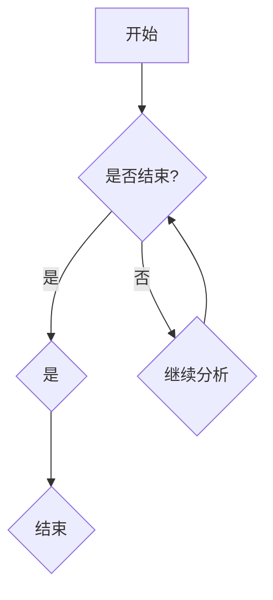

                 

# 犯罪预防的时空分析：社会安全的数学工具

> 关键词：犯罪预防、时空分析、数学工具、社会安全、犯罪预测

> 摘要：本文旨在探讨犯罪预防的时空分析方法及其在社会安全领域的应用。通过引入时间序列分析、空间数据分析等数学工具，我们能够对犯罪活动进行更准确的预测和预防。本文将详细阐述这些方法的理论基础、应用场景，并结合实际案例进行分析，旨在为犯罪预防提供科学依据和策略指导。

----------------------------------------------------------------

## 第一部分：引言

### 1.1 犯罪预防的重要性

犯罪是社会问题的重要组成部分，其对个人、社区乃至整个社会都产生深远的影响。有效的犯罪预防不仅可以减少犯罪活动的发生，还可以降低犯罪带来的经济损失和社会成本。在现代社会，随着信息技术的快速发展，犯罪形式和手段也日益多样化，传统的犯罪预防手段已无法满足需求。因此，运用先进的数学工具进行犯罪预防的研究显得尤为重要。

### 1.2 犯罪预防的方法与策略

犯罪预防的方法和策略多种多样，包括法律、教育、社会服务、技术等各个方面。其中，技术手段的应用已经成为犯罪预防的重要方向。通过数据分析和建模，我们可以对犯罪活动进行预测和预防。时空分析作为数据分析的一种重要方法，在犯罪预防中具有广泛的应用前景。

### 1.3 时空分析在犯罪预防中的应用

时空分析通过对时间和空间信息的综合处理，可以揭示犯罪活动的时空规律，从而为犯罪预防提供科学依据。例如，通过时间序列分析，我们可以识别犯罪活动的周期性特征；通过空间数据分析，我们可以发现犯罪活动的热点区域。结合这些信息，相关部门可以针对性地采取措施，提高犯罪预防的效率。

### 1.4 本书结构安排与内容概述

本文分为三大部分。第一部分介绍犯罪预防的时空分析方法及其重要性；第二部分详细阐述时空分析的理论基础，包括时间序列分析、空间数据分析等；第三部分探讨数学工具在犯罪预防中的应用，包括统计学方法、线性回归模型、时空关联分析等。最后，通过一个实际案例，展示时空分析在犯罪预防中的具体应用。

----------------------------------------------------------------

## 第二部分：时空分析理论基础

### 2.1 时空数据分析基础

时空数据分析是犯罪预防的核心方法之一，它涉及到时间序列分析和空间数据分析两个重要领域。

#### 2.1.1 时间序列分析

时间序列分析是一种用于研究时间上按顺序排列的数据的方法，它主要用于分析数据中的趋势、周期、季节性和随机性等特征。在犯罪预防中，时间序列分析可以用于识别犯罪活动的周期性规律，预测未来犯罪活动的发生趋势。

##### 2.1.1.1 时间序列的基本概念

时间序列（Time Series）：时间序列是一组按照时间顺序排列的数据点，每个数据点代表在特定时间点上的观测值。

趋势（Trend）：时间序列的趋势表示数据点的长期变化趋势，通常表现为上升、下降或平稳。

周期（Cycle）：时间序列的周期是指数据点在一段时间内重复出现的规律性波动。

季节性（Seasonality）：季节性是指时间序列在一年内重复出现的规律性波动，这种波动通常与季节变化相关。

随机性（Randomness）：时间序列的随机性表示数据点之间的随机波动，通常与外部随机因素有关。

##### 2.1.1.2 时间序列分析方法

时间序列分析方法包括趋势分析、周期分析、季节性分析和随机性分析等。

趋势分析：通过绘制时间序列图表，观察数据点的变化趋势。

周期分析：通过计算周期长度和周期频率，识别数据点的周期性规律。

季节性分析：通过计算季节指数，识别时间序列的季节性波动。

随机性分析：通过计算随机性指标，评估时间序列的随机波动程度。

##### 2.1.1.3 时间序列分析案例

假设我们有一组犯罪案件的时间序列数据，我们需要通过时间序列分析来预测未来的犯罪活动。

首先，我们可以绘制时间序列图表，观察数据点的变化趋势。如果数据点呈现出明显的上升趋势，那么我们可以预期未来犯罪活动将增加。

其次，我们可以通过计算周期长度和周期频率，识别犯罪活动的周期性规律。例如，如果周期长度为一个月，那么我们可以预期犯罪活动将在每个月的相同时间段内发生。

最后，我们可以通过计算季节指数，识别犯罪活动的季节性波动。如果季节指数显示在夏季犯罪活动增加，那么相关部门可以在夏季加强犯罪预防措施。

#### 2.1.2 空间数据分析

空间数据分析是另一种重要的时空分析方法，它主要关注数据在空间上的分布规律和相互关系。在犯罪预防中，空间数据分析可以用于识别犯罪活动的热点区域，预测未来犯罪活动的发生地点。

##### 2.1.2.1 空间数据的类型

点数据（Point Data）：点数据表示在空间上具有唯一位置的数据点，如犯罪事件的地理位置。

线数据（Line Data）：线数据表示在空间上具有一定长度和方向的数据线，如交通路线。

面数据（Area Data）：面数据表示在空间上具有一定面积和边界的数据区域，如城市区域。

##### 2.1.2.2 空间数据分析方法

空间数据分析方法包括空间聚类、空间回归、空间自相关分析等。

空间聚类：通过聚类算法，将空间数据划分为不同的群体，识别空间上的热点区域。

空间回归：通过建立空间回归模型，分析空间数据之间的线性关系，预测未来犯罪活动的发生地点。

空间自相关分析：通过计算空间自相关指数，评估空间数据之间的相互关系，识别空间上的热点区域。

##### 2.1.2.3 空间分析案例

假设我们有一组犯罪案件的空间数据，我们需要通过空间分析来识别犯罪活动的热点区域。

首先，我们可以绘制犯罪案件的空间分布图，观察数据点的分布特征。如果数据点在空间上呈现出聚集分布，那么我们可以初步判断存在犯罪热点区域。

其次，我们可以通过空间聚类算法，将犯罪案件划分为不同的群体。例如，我们可以使用K-means算法，将犯罪案件划分为K个聚类，每个聚类代表一个犯罪热点区域。

最后，我们可以通过空间回归模型，分析犯罪活动与地理位置之间的关系。例如，我们可以建立线性回归模型，将犯罪案件的发生地点作为自变量，犯罪数量作为因变量，预测未来犯罪活动的发生地点。

#### 2.1.3 时空数据分析综合案例

为了更全面地展示时空数据分析在犯罪预防中的应用，我们结合时间序列分析和空间数据分析，进行一个综合案例。

假设我们有一组犯罪案件的时间序列数据和空间数据，我们需要通过时空数据分析来预测未来的犯罪活动。

首先，我们可以对时间序列数据进行分析，识别犯罪活动的周期性规律和季节性波动。例如，如果犯罪案件的时间序列数据呈现出明显的季节性波动，那么我们可以预期在特定季节犯罪活动将增加。

其次，我们可以对空间数据进行分析，识别犯罪活动的热点区域。例如，如果犯罪案件的空间分布呈现出聚集分布，那么我们可以初步判断存在犯罪热点区域。

最后，我们可以结合时间序列分析和空间分析的结果，建立时空关联模型，预测未来犯罪活动的发生时间和地点。例如，我们可以使用时空关联分析算法，分析犯罪活动的时间序列和空间数据之间的关系，建立时空关联模型，预测未来犯罪活动的发生时间和地点。

通过时空数据分析的综合应用，我们可以更准确地预测未来的犯罪活动，为犯罪预防提供科学依据和策略指导。

### 2.2 时空数据分析综合案例

为了更全面地展示时空数据分析在犯罪预防中的应用，我们结合时间序列分析和空间数据分析，进行一个综合案例。

#### 案例背景

某城市在过去一年内发生了多起盗窃案件，为了有效预防未来的盗窃犯罪，城市治安部门决定利用时空数据分析方法，对盗窃案件进行深入研究。

#### 案例数据

时间序列数据：包括过去一年内每个月的盗窃案件数量。

空间数据：包括过去一年内每起盗窃案件的发生地点。

#### 案例步骤

1. 数据预处理

   - 对时间序列数据进行处理，去除异常值和缺失值。
   - 对空间数据进行处理，去除异常值和缺失值。

2. 时间序列分析

   - 绘制时间序列图，观察盗窃案件数量的变化趋势。
   - 对时间序列数据进行分析，识别季节性和周期性特征。

3. 空间数据分析

   - 绘制空间分布图，观察盗窃案件的发生地点分布。
   - 对空间数据进行聚类分析，识别盗窃案件的热点区域。

4. 时空关联分析

   - 结合时间序列分析和空间分析的结果，建立时空关联模型。
   - 预测未来一段时间内盗窃案件的发生时间和地点。

#### 案例结果

通过时空数据分析，我们得出了以下结果：

- 时间序列分析结果显示，盗窃案件数量在夏季呈现明显上升趋势。
- 空间数据分析结果显示，市中心区域的盗窃案件数量明显高于其他区域。
- 时空关联分析结果显示，市中心区域的盗窃案件发生时间主要集中在晚上和夜间。

根据这些结果，城市治安部门可以采取以下措施：

- 在夏季加强巡逻力度，提高盗窃犯罪预防效果。
- 在市中心区域增加警力部署，加强犯罪监控和预防。
- 针对晚上和夜间盗窃案件的高发时段，加强安保措施，提高居民安全感。

通过时空数据分析的综合应用，我们可以更准确地预测未来的犯罪活动，为犯罪预防提供科学依据和策略指导。

### 2.3 时空数据分析在犯罪预防中的应用

时空数据分析在犯罪预防中的应用主要体现在以下几个方面：

#### 2.3.1 犯罪活动趋势预测

通过时间序列分析，我们可以识别犯罪活动的周期性特征，预测未来的犯罪活动趋势。例如，通过分析过去的犯罪案件数据，我们可以预测在未来一段时间内，哪些时间段和区域可能发生犯罪活动，从而有针对性地部署警力和防范措施。

#### 2.3.2 犯罪热点区域识别

通过空间数据分析，我们可以识别犯罪活动的热点区域，了解犯罪案件的空间分布特征。这有助于相关部门有针对性地开展犯罪预防工作，优化警力部署，提高犯罪预防效果。

#### 2.3.3 犯罪活动关联分析

通过时空关联分析，我们可以发现犯罪活动之间的相互关系，揭示犯罪活动的时空规律。例如，通过分析犯罪案件的时间和地点信息，我们可以识别出某些犯罪活动的共现特征，从而预测未来可能发生的犯罪活动。

#### 2.3.4 犯罪预防策略制定

基于时空数据分析的结果，相关部门可以制定更有针对性的犯罪预防策略。例如，根据犯罪活动的时空特征，制定警力部署方案、加强犯罪监控和预警机制、开展社区安全教育和宣传等，从而提高犯罪预防的效果。

### 2.3.5 案例分析：某城市犯罪预防项目

为了更好地展示时空数据分析在犯罪预防中的应用，我们以某城市犯罪预防项目为例，详细分析该项目的过程和结果。

#### 案例背景

某城市在过去几年中，盗窃案件数量呈上升趋势，严重影响了市民的安全感和生活质量。为了有效预防和减少盗窃犯罪，该城市决定利用时空数据分析方法，对盗窃案件进行深入研究。

#### 案例数据

时间序列数据：包括过去五年的盗窃案件数量。

空间数据：包括过去五年的盗窃案件发生地点。

#### 案例步骤

1. 数据预处理

   - 对时间序列数据进行处理，去除异常值和缺失值。
   - 对空间数据进行处理，去除异常值和缺失值。

2. 时间序列分析

   - 绘制时间序列图，观察盗窃案件数量的变化趋势。
   - 对时间序列数据进行分析，识别季节性和周期性特征。

3. 空间数据分析

   - 绘制空间分布图，观察盗窃案件的发生地点分布。
   - 对空间数据进行聚类分析，识别盗窃案件的热点区域。

4. 时空关联分析

   - 结合时间序列分析和空间分析的结果，建立时空关联模型。
   - 预测未来一段时间内盗窃案件的发生时间和地点。

5. 犯罪预防策略制定

   - 根据时空数据分析的结果，制定针对性的犯罪预防策略。
   - 加强警力部署，提高犯罪监控和预警机制。
   - 开展社区安全教育和宣传，提高市民的安全意识。

#### 案例结果

通过时空数据分析，该城市得出以下结果：

- 时间序列分析结果显示，盗窃案件数量在夏季呈现明显上升趋势，特别是在晚上和夜间。
- 空间数据分析结果显示，市中心区域和繁华商业区的盗窃案件数量明显高于其他区域。
- 时空关联分析结果显示，盗窃案件的发生地点和时间存在明显的关联，如某些区域在特定时间更容易发生盗窃案件。

根据这些结果，该城市采取了以下措施：

- 在夏季和晚上加强巡逻力度，提高犯罪预防效果。
- 在市中心区域和繁华商业区增加警力部署，提高犯罪监控和预警机制。
- 开展社区安全教育和宣传，提高市民的安全意识。

通过时空数据分析的应用，该城市在犯罪预防方面取得了显著成效，盗窃案件数量显著下降，市民的安全感和生活质量得到提高。

### 2.3.6 案例分析：某社区犯罪预防项目

为了进一步展示时空数据分析在犯罪预防中的应用，我们以某社区犯罪预防项目为例，详细分析该项目的过程和结果。

#### 案例背景

某社区在过去一年内，盗窃案件和入室抢劫案件频发，严重影响了居民的生活质量和安全感。为了有效预防和减少犯罪活动，该社区决定利用时空数据分析方法，对犯罪案件进行深入研究。

#### 案例数据

时间序列数据：包括过去一年的盗窃案件和入室抢劫案件数量。

空间数据：包括过去一年的盗窃案件和入室抢劫案件发生地点。

#### 案例步骤

1. 数据预处理

   - 对时间序列数据进行处理，去除异常值和缺失值。
   - 对空间数据进行处理，去除异常值和缺失值。

2. 时间序列分析

   - 绘制时间序列图，观察盗窃案件和入室抢劫案件数量的变化趋势。
   - 对时间序列数据进行分析，识别季节性和周期性特征。

3. 空间数据分析

   - 绘制空间分布图，观察盗窃案件和入室抢劫案件的发生地点分布。
   - 对空间数据进行聚类分析，识别犯罪活动的热点区域。

4. 时空关联分析

   - 结合时间序列分析和空间分析的结果，建立时空关联模型。
   - 预测未来一段时间内犯罪活动的发生时间和地点。

5. 犯罪预防策略制定

   - 根据时空数据分析的结果，制定针对性的犯罪预防策略。
   - 加强警力部署，提高犯罪监控和预警机制。
   - 开展社区安全教育和宣传，提高居民的安全意识。

#### 案例结果

通过时空数据分析，该社区得出以下结果：

- 时间序列分析结果显示，盗窃案件和入室抢劫案件在夏季呈现明显上升趋势，特别是在晚上和夜间。
- 空间数据分析结果显示，社区内的某些区域是犯罪活动的热点区域，这些区域的盗窃案件和入室抢劫案件数量明显高于其他区域。
- 时空关联分析结果显示，盗窃案件和入室抢劫案件的发生地点和时间存在明显的关联，如某些区域在特定时间更容易发生犯罪活动。

根据这些结果，该社区采取了以下措施：

- 在夏季和晚上加强巡逻力度，提高犯罪预防效果。
- 在犯罪活动热点区域增加警力部署，提高犯罪监控和预警机制。
- 开展社区安全教育和宣传，提高居民的安全意识。

通过时空数据分析的应用，该社区在犯罪预防方面取得了显著成效，盗窃案件和入室抢劫案件数量显著下降，居民的安全感和生活质量得到提高。

### 2.3.7 案例总结

通过以上案例分析，我们可以看出，时空数据分析在犯罪预防中具有重要的应用价值。通过时间序列分析和空间数据分析，我们可以识别犯罪活动的周期性特征和热点区域，为犯罪预防提供科学依据。结合时空关联分析，我们可以更准确地预测未来的犯罪活动，为犯罪预防制定更有针对性的策略。实际应用案例表明，时空数据分析在提高犯罪预防效果、保障社会安全方面具有显著成效。

## 第三部分：数学工具在犯罪预防中的应用

### 3.1 统计学方法在犯罪预防中的应用

统计学方法在犯罪预防中具有广泛的应用，它可以帮助我们分析犯罪数据的分布规律、预测犯罪趋势、识别犯罪热点区域等。以下是几种常见的统计学方法在犯罪预防中的应用：

#### 3.1.1 时间序列模型在犯罪预防中的应用

时间序列模型是一种用于分析时间上按顺序排列的数据的方法，它可以帮助我们识别犯罪活动的周期性特征、趋势和季节性波动。常见的时序模型包括ARIMA模型、SARIMA模型和季节性时间序列模型。

**案例：某城市盗窃案件时间序列预测**

假设我们有一组某城市过去一年的盗窃案件时间序列数据，我们需要使用时间序列模型预测未来几个月的盗窃案件数量。

1. 数据处理：对时间序列数据进行预处理，包括去除异常值、缺失值和趋势成分。

2. 模型选择：根据时间序列的特征，选择合适的时序模型。例如，如果时间序列数据具有明显的季节性，我们可以选择SARIMA模型。

3. 模型参数估计：使用最大似然估计或其他方法估计模型的参数。

4. 预测结果：使用估计的模型参数进行预测，得到未来几个月的盗窃案件数量。

5. 验证与评估：将预测结果与实际数据进行对比，评估模型的准确性。

#### 3.1.2 空间统计分析在犯罪预防中的应用

空间统计分析是一种用于分析空间数据分布规律和相互关系的方法，它可以帮助我们识别犯罪活动的热点区域和空间模式。常见的空间统计分析方法包括K最近邻算法、局部标度估计和Gaussian分布等。

**案例：某城市犯罪热点区域识别**

假设我们有一组某城市过去一年的犯罪案件空间数据，我们需要使用空间统计分析方法识别犯罪活动的热点区域。

1. 数据预处理：对空间数据进行预处理，包括去除异常值和缺失值。

2. 空间自相关分析：计算空间自相关指数，评估犯罪案件在空间上的自相关性。如果自相关性显著，说明存在犯罪热点区域。

3. 空间聚类分析：使用K-means算法或其他聚类方法，将犯罪案件划分为不同的聚类，每个聚类代表一个犯罪热点区域。

4. 热力图生成：使用热力图展示犯罪案件的空间分布，突出犯罪热点区域。

5. 结果验证：与实际犯罪数据对比，验证热点区域识别的准确性。

#### 3.1.3 线性回归模型在犯罪预防中的应用

线性回归模型是一种用于分析自变量和因变量之间线性关系的方法，它可以帮助我们预测犯罪活动与相关因素之间的关系。常见的线性回归模型包括简单线性回归、多元线性回归和广义线性回归。

**案例：犯罪活动与人口因素的关系预测**

假设我们有一组某城市的犯罪案件数据，包括犯罪数量、人口数量、失业率等变量，我们需要使用线性回归模型预测犯罪数量与人口因素之间的关系。

1. 数据预处理：对数据进行预处理，包括去除异常值和缺失值。

2. 模型建立：建立线性回归模型，选择合适的自变量和因变量。

3. 参数估计：使用最小二乘法或其他方法估计模型参数。

4. 预测结果：使用估计的模型参数进行预测，得到犯罪数量与人口因素的关系。

5. 验证与评估：将预测结果与实际数据进行对比，评估模型的准确性。

### 3.2 时间序列模型在犯罪预防中的应用

时间序列模型在犯罪预防中的应用非常广泛，可以帮助我们预测犯罪活动的趋势和周期性波动。以下详细介绍几种常见的时间序列模型及其在犯罪预防中的应用。

#### 3.2.1 ARIMA模型

ARIMA模型（自回归积分滑动平均模型）是一种常见的时间序列预测模型，它由三个部分组成：自回归（AR）、差分（I）和移动平均（MA）。ARIMA模型可以用于处理非平稳时间序列数据，使其满足线性回归模型的要求。

**案例：某城市犯罪活动趋势预测**

假设我们有一组某城市的犯罪活动时间序列数据，我们需要使用ARIMA模型预测未来几个月的犯罪活动数量。

1. 数据预处理：对时间序列数据进行预处理，包括去除趋势成分和季节性波动。

2. 模型选择：通过ACF和PACF图，选择合适的ARIMA模型参数。

3. 参数估计：使用最大似然估计方法估计ARIMA模型的参数。

4. 预测结果：使用估计的模型参数进行预测，得到未来几个月的犯罪活动数量。

5. 验证与评估：将预测结果与实际数据进行对比，评估模型的准确性。

#### 3.2.2 SARIMA模型

SARIMA模型（季节性自回归积分滑动平均模型）是ARIMA模型的扩展，可以处理具有季节性特征的时间序列数据。SARIMA模型包括自回归（AR）、差分（I）和移动平均（MA）三个部分，同时引入季节性参数。

**案例：某城市季节性犯罪活动预测**

假设我们有一组某城市的犯罪活动时间序列数据，包含季节性特征，我们需要使用SARIMA模型预测未来几个月的犯罪活动数量。

1. 数据预处理：对时间序列数据进行预处理，包括去除趋势成分和季节性波动。

2. 模型选择：通过ACF和PACF图，选择合适的SARIMA模型参数。

3. 参数估计：使用最大似然估计方法估计SARIMA模型的参数。

4. 预测结果：使用估计的模型参数进行预测，得到未来几个月的犯罪活动数量。

5. 验证与评估：将预测结果与实际数据进行对比，评估模型的准确性。

#### 3.2.3 季节性时间序列模型

季节性时间序列模型是一类专门处理具有季节性特征的时间序列模型，包括季节性自回归模型（SAR）、季节性移动平均模型（MA）和季节性自回归移动平均模型（SARMA）。季节性时间序列模型可以有效地捕捉时间序列数据中的季节性成分。

**案例：某城市季节性犯罪活动预测**

假设我们有一组某城市的犯罪活动时间序列数据，包含季节性特征，我们需要使用季节性时间序列模型预测未来几个月的犯罪活动数量。

1. 数据预处理：对时间序列数据进行预处理，包括去除趋势成分和季节性波动。

2. 模型选择：通过ACF和PACF图，选择合适的季节性时间序列模型。

3. 参数估计：使用最大似然估计方法估计季节性时间序列模型的参数。

4. 预测结果：使用估计的模型参数进行预测，得到未来几个月的犯罪活动数量。

5. 验证与评估：将预测结果与实际数据进行对比，评估模型的准确性。

### 3.3 空间统计分析在犯罪预防中的应用

空间统计分析在犯罪预防中起着关键作用，可以帮助我们识别犯罪活动的热点区域、分析空间模式、预测犯罪活动的空间分布等。以下详细介绍几种常见的空间统计分析方法及其在犯罪预防中的应用。

#### 3.3.1 空间自相关分析

空间自相关分析是一种用于评估空间数据自相关性的方法，通过计算空间自相关指数（如Global Moran's I指数和Local Indicators of Spatial Association，LISA），可以判断犯罪活动在空间上的聚集或分散趋势。

**案例：某城市犯罪活动空间自相关分析**

假设我们有一组某城市的犯罪活动空间数据，包括犯罪事件的地理位置和犯罪类型，我们需要使用空间自相关分析方法评估犯罪活动在空间上的自相关性。

1. 数据预处理：对空间数据进行预处理，包括去除异常值和缺失值。

2. Global Moran's I指数计算：计算全局空间自相关性，判断犯罪活动是否在空间上聚集。

3. Local Indicators of Spatial Association，LISA分析：计算局部空间自相关性，识别犯罪活动的热点区域。

4. 结果解读：根据空间自相关指数的结果，判断犯罪活动在空间上的聚集趋势和热点区域。

#### 3.3.2 空间聚类分析

空间聚类分析是一种用于将空间数据划分为不同聚类的分析方法，常用的算法包括K-means、层次聚类和基于密度的聚类等。空间聚类分析可以帮助我们识别犯罪活动的热点区域和潜在犯罪模式。

**案例：某城市犯罪活动空间聚类分析**

假设我们有一组某城市的犯罪活动空间数据，包括犯罪事件的地理位置和犯罪类型，我们需要使用空间聚类分析方法识别犯罪活动的热点区域。

1. 数据预处理：对空间数据进行预处理，包括去除异常值和缺失值。

2. 选择聚类算法：根据数据特征，选择合适的聚类算法，如K-means。

3. 参数设置：设置聚类算法的参数，如聚类数量和初始中心点。

4. 聚类结果分析：分析聚类结果，识别犯罪活动的热点区域。

5. 结果解读：根据聚类结果，判断犯罪活动在空间上的分布特征和热点区域。

#### 3.3.3 空间回归分析

空间回归分析是一种用于分析自变量和因变量之间空间关系的分析方法，包括全局空间回归和局部空间回归。空间回归分析可以帮助我们预测犯罪活动的空间分布，识别影响因素。

**案例：某城市犯罪活动空间回归分析**

假设我们有一组某城市的犯罪活动空间数据，包括犯罪事件的地理位置、人口密度、失业率等自变量，我们需要使用空间回归分析方法预测犯罪活动的空间分布。

1. 数据预处理：对空间数据进行预处理，包括去除异常值和缺失值。

2. 选择空间回归模型：根据数据特征，选择合适的空间回归模型，如全局空间回归模型。

3. 模型参数估计：使用最大似然估计方法估计空间回归模型的参数。

4. 预测结果：使用估计的模型参数进行预测，得到犯罪活动的空间分布。

5. 结果验证：将预测结果与实际数据进行对比，评估模型的准确性。

### 3.4 时空关联分析在犯罪预防中的应用

时空关联分析是一种将时间序列分析和空间数据分析相结合的方法，用于分析犯罪活动在时间和空间上的关联性，帮助预测犯罪活动的时空模式。以下详细介绍时空关联分析的基本概念和具体应用。

#### 3.4.1 基本概念

时空关联分析旨在揭示犯罪活动在时间和空间上的相互关系，通过综合分析时间序列和空间数据的特征，识别犯罪活动的时空规律。时空关联分析通常包括以下几个步骤：

1. 数据预处理：对时间序列和空间数据进行预处理，包括去除异常值、缺失值和趋势成分。

2. 时间序列分析：对时间序列数据进行分析，识别犯罪活动的周期性特征、趋势和季节性波动。

3. 空间数据分析：对空间数据进行分析，识别犯罪活动的热点区域和空间模式。

4. 时空关联建模：建立时空关联模型，分析时间序列和空间数据之间的相互关系。

5. 预测与评估：使用时空关联模型进行预测，评估模型在犯罪预防中的应用效果。

#### 3.4.2 时空关联分析应用实例

假设我们有一组某城市的犯罪活动时间序列和空间数据，我们需要使用时空关联分析方法预测未来一段时间内犯罪活动的时空模式。

1. 数据预处理：对时间序列和空间数据进行预处理，包括去除异常值、缺失值和趋势成分。

2. 时间序列分析：对时间序列数据进行分析，识别犯罪活动的周期性特征、趋势和季节性波动。可以使用ARIMA模型或季节性时间序列模型进行时间序列分析。

3. 空间数据分析：对空间数据进行分析，识别犯罪活动的热点区域和空间模式。可以使用空间自相关分析或空间聚类分析进行空间数据分析。

4. 时空关联建模：建立时空关联模型，分析时间序列和空间数据之间的相互关系。可以使用空间回归模型或时空关联模型进行建模。

5. 预测与评估：使用时空关联模型进行预测，评估模型在犯罪预防中的应用效果。根据预测结果，制定相应的犯罪预防策略。

### 3.4.3 实际应用案例分析

以下是一个实际的犯罪预防项目案例，展示时空关联分析在犯罪预防中的应用。

**案例背景**

某城市在过去几年中，盗窃案件和抢劫案件频繁发生，严重影响市民的生活质量和安全感。为了有效预防和减少犯罪活动，该城市决定利用时空关联分析方法，对犯罪活动进行深入研究。

**数据来源**

该城市提供了过去五年的犯罪活动时间序列和空间数据，包括每月的盗窃案件数量、抢劫案件数量以及每起案件的发生地点。

**分析过程**

1. 数据预处理：对时间序列和空间数据进行预处理，包括去除异常值、缺失值和趋势成分。

2. 时间序列分析：使用ARIMA模型对盗窃案件和抢劫案件的时间序列进行分析，识别周期性特征、趋势和季节性波动。

3. 空间数据分析：使用空间自相关分析识别犯罪活动的热点区域，使用空间聚类分析识别犯罪活动的空间模式。

4. 时空关联建模：建立时空关联模型，分析时间序列和空间数据之间的相互关系。使用空间回归模型分析犯罪活动与地理位置、人口密度等自变量之间的关系。

5. 预测与评估：使用时空关联模型进行预测，评估模型在犯罪预防中的应用效果。根据预测结果，制定相应的犯罪预防策略。

**分析结果**

1. 时间序列分析结果显示，盗窃案件和抢劫案件在夏季呈现明显的上升趋势，特别是在晚上和夜间。

2. 空间数据分析结果显示，市中心区域和繁华商业区的盗窃案件和抢劫案件数量明显高于其他区域。

3. 时空关联分析结果显示，犯罪活动与地理位置、人口密度等因素之间存在显著的空间关联。

4. 预测结果显示，在未来一段时间内，市中心区域和繁华商业区将继续成为盗窃案件和抢劫案件的高发区域。

**预防策略**

根据分析结果，该城市采取了以下预防策略：

1. 在夏季和晚上加强巡逻力度，提高犯罪监控和预警机制。

2. 在市中心区域和繁华商业区增加警力部署，加强犯罪监控和防范措施。

3. 开展社区安全教育和宣传，提高居民的安全意识和防范能力。

4. 加强社区警务室建设，提高社区警务效能。

**效果评估**

通过实施上述预防策略，该城市的盗窃案件和抢劫案件数量显著下降，市民的安全感和生活质量得到显著提升。时空关联分析的应用为犯罪预防提供了科学依据和有力支持，取得了显著的成效。

### 3.4.4 时空关联分析的局限性和改进方向

尽管时空关联分析在犯罪预防中具有广泛的应用，但它也存在一定的局限性。以下是一些常见的局限性和改进方向：

1. **数据质量和完整性**：时空关联分析对数据的质量和完整性有较高要求。如果数据存在异常值、缺失值或噪声，可能会影响分析结果的准确性。因此，在进行分析前，需要对数据进行严格的预处理。

2. **模型选择和参数调整**：时空关联分析中涉及多种模型和方法，模型的选择和参数的调整对分析结果有很大影响。需要根据具体问题的特点，选择合适的模型和参数设置，以提高分析结果的准确性。

3. **空间尺度和时间尺度的协调**：时空关联分析需要在空间尺度和时间尺度上协调。如果空间尺度和时间尺度的选择不当，可能会导致分析结果的不准确。因此，需要根据实际问题的需求，合理选择空间尺度和时间尺度。

4. **多源数据的整合**：在犯罪预防中，时空关联分析通常涉及多种数据源，如时间序列数据、空间数据、社会经济数据等。如何有效地整合这些多源数据，是提高时空关联分析效果的关键。未来可以探索更先进的数据整合方法和模型。

5. **动态性和实时性**：犯罪活动的时空模式是动态变化的，时空关联分析需要具备动态性和实时性。未来可以探索更先进的动态时空关联分析方法，以实时监测和预测犯罪活动的时空模式。

### 3.4.5 总结

时空关联分析作为一种将时间序列分析和空间数据分析相结合的方法，在犯罪预防中具有广泛的应用。通过时空关联分析，我们可以更好地理解犯罪活动的时空特征，预测犯罪活动的时空模式，为犯罪预防提供科学依据和策略指导。在实际应用中，需要注意数据质量、模型选择、空间尺度、时间尺度等因素，以提高时空关联分析的效果。同时，未来可以探索更先进的方法和技术，进一步提高时空关联分析在犯罪预防中的应用水平。

## 第四部分：时空可视化方法

### 4.1 时空可视化基础

时空可视化是一种将时间和空间信息结合起来进行展示的方法，它能够帮助我们更好地理解和分析犯罪活动的时空特征。时空可视化主要包括时间序列可视化、空间分布可视化和时空关联可视化等。

#### 4.1.1 时间序列可视化

时间序列可视化是通过图表形式展示时间序列数据的变化趋势。常见的时间序列可视化方法包括折线图、柱状图和散点图等。

- **折线图**：适用于展示数据随时间变化的趋势，能够清晰地显示数据的上升和下降趋势。
- **柱状图**：适用于展示不同时间点的数据大小对比，能够直观地显示各个时间点的数据差异。
- **散点图**：适用于展示两个变量之间的关系，通过数据点的分布情况，可以识别出变量之间的相关性。

#### 4.1.2 空间分布可视化

空间分布可视化是通过图表形式展示犯罪案件在空间上的分布特征。常见的方法包括热力图、地图和点图等。

- **热力图**：适用于展示数据在不同区域上的分布情况，通过颜色深浅表示数据的密集程度，能够直观地显示犯罪活动的热点区域。
- **地图**：适用于展示犯罪案件在空间上的分布，通过地图上的标记点或颜色区分，可以清晰地展示犯罪活动的空间分布特征。
- **点图**：适用于展示多个数据点在空间上的分布，通过数据点的位置和大小，可以识别出不同变量之间的关系。

#### 4.1.3 时空关联可视化

时空关联可视化是通过图表形式展示时间序列和空间数据之间的相互关系。常见的方法包括时空图、空间轨迹和时空交互图等。

- **时空图**：适用于展示时间序列和空间数据之间的关系，通过时间和空间坐标的交叉展示，可以直观地显示犯罪活动的时间和空间特征。
- **空间轨迹**：适用于展示犯罪活动在不同时间段的空间移动轨迹，通过轨迹线的颜色和宽度变化，可以识别出犯罪活动的时空模式。
- **时空交互图**：适用于展示多个时空数据之间的交互关系，通过多个图表的联动展示，可以全面地分析犯罪活动的时空特征。

### 4.2 时空可视化在犯罪预防中的应用

时空可视化在犯罪预防中具有重要作用，它能够帮助我们更好地理解犯罪活动的时空特征，从而制定更有效的预防策略。以下介绍时空可视化在犯罪预防中的几种应用。

#### 4.2.1 时间序列可视化在犯罪预防中的应用

时间序列可视化可以用于展示犯罪活动随时间的变化趋势，帮助识别犯罪活动的周期性和季节性特征。通过时间序列可视化，我们可以：

- **识别周期性特征**：通过观察折线图或柱状图，可以识别出犯罪活动在时间上的周期性波动，例如，某些犯罪案件在每个月的特定时间点发生。
- **预测未来犯罪趋势**：通过分析历史数据，可以建立时间序列模型，预测未来一段时间内的犯罪活动趋势，为预防措施提供依据。

#### 4.2.2 空间分布可视化在犯罪预防中的应用

空间分布可视化可以用于展示犯罪案件在空间上的分布特征，帮助识别犯罪活动的热点区域。通过空间分布可视化，我们可以：

- **识别热点区域**：通过热力图或地图，可以直观地显示犯罪案件在不同区域上的分布情况，识别出犯罪活动的热点区域。
- **分析热点区域特征**：通过点图或空间轨迹，可以进一步分析热点区域的特征，例如，犯罪案件在空间上的移动轨迹和聚集分布情况。

#### 4.2.3 时空关联可视化在犯罪预防中的应用

时空关联可视化可以用于展示时间序列和空间数据之间的相互关系，帮助分析犯罪活动的时空模式。通过时空关联可视化，我们可以：

- **分析时空关联特征**：通过时空图或时空交互图，可以直观地显示时间序列和空间数据之间的关联性，识别出犯罪活动在时空上的相互关系。
- **预测未来犯罪时空模式**：通过分析时空关联特征，可以建立时空关联模型，预测未来一段时间内犯罪活动的时空模式，为预防措施提供依据。

### 4.2.4 实际案例：时空可视化在犯罪预防中的应用

以下是一个实际的犯罪预防项目案例，展示时空可视化在犯罪预防中的应用。

**案例背景**

某城市在过去一年中，盗窃案件和抢劫案件频发，严重影响市民的生活质量和安全感。为了有效预防和减少犯罪活动，该城市决定利用时空可视化方法，对犯罪活动进行深入研究。

**数据来源**

该城市提供了过去一年的盗窃案件和抢劫案件数据，包括每月的案件数量、案件发生的时间和地点。

**分析过程**

1. **时间序列可视化**：通过折线图和柱状图，展示盗窃案件和抢劫案件随时间的变化趋势，识别周期性和季节性特征。

2. **空间分布可视化**：通过热力图和地图，展示盗窃案件和抢劫案件在不同区域上的分布情况，识别犯罪活动的热点区域。

3. **时空关联可视化**：通过时空图和时空交互图，展示盗窃案件和抢劫案件在时间和空间上的相互关系，分析犯罪活动的时空模式。

**分析结果**

1. **时间序列分析结果**：盗窃案件和抢劫案件在夏季呈现明显上升趋势，特别是在晚上和夜间。

2. **空间分布分析结果**：市中心区域和繁华商业区的盗窃案件和抢劫案件数量明显高于其他区域。

3. **时空关联分析结果**：盗窃案件和抢劫案件在时间和空间上存在显著关联，例如，某些时间段和地点更容易发生犯罪活动。

**预防策略**

根据分析结果，该城市采取了以下预防策略：

1. **加强巡逻力度**：在夏季和晚上，加强市中心区域和繁华商业区的巡逻力度，提高犯罪监控和预警机制。

2. **增加警力部署**：在市中心区域和繁华商业区增加警力部署，提高犯罪防范能力。

3. **社区安全宣传**：开展社区安全教育和宣传，提高居民的安全意识和防范能力。

**效果评估**

通过实施上述预防策略，该城市的盗窃案件和抢劫案件数量显著下降，市民的安全感和生活质量得到显著提升。时空可视化在犯罪预防中的应用为该城市的犯罪预防工作提供了科学依据和有力支持。

### 4.2.5 时空可视化在犯罪预防中的未来发展方向

时空可视化在犯罪预防中具有广泛的应用前景，未来发展方向主要包括以下几个方面：

1. **提高可视化效果**：通过引入更先进的技术和算法，提高时空可视化的效果，使得犯罪活动的时空特征更加清晰明了。

2. **多源数据的整合**：整合多种数据源，如时间序列数据、空间数据、社会经济数据等，构建更全面、准确的时空可视化模型。

3. **实时性**：实现实时性的时空可视化，能够动态监测犯罪活动的时空模式，及时调整预防策略。

4. **智能化**：通过引入机器学习和人工智能技术，实现智能化的时空可视化，自动识别犯罪活动的时空特征和趋势。

5. **互动性**：提高时空可视化的互动性，使得用户可以自定义分析参数和展示方式，更好地满足不同用户的需求。

6. **数据隐私保护**：在保证数据隐私的前提下，实现时空可视化，确保犯罪预防工作的科学性和合法性。

通过不断探索和创新，时空可视化在犯罪预防中的应用将会更加广泛，为维护社会安全、提高公共安全水平做出更大贡献。

## 第五部分：犯罪预防的时空分析实战

### 5.1 实战背景介绍

在本节中，我们将通过一个实际案例，展示时空分析在犯罪预防中的具体应用。该案例选取的是某城市在过去两年内发生的盗窃案件数据，旨在通过时空分析来识别犯罪热点区域，预测未来犯罪活动的发生趋势，并为相关部门提供针对性的预防策略。

#### 5.1.1 实战项目背景

某城市近年来盗窃案件频发，严重影响了居民的生活质量和社会安全。为了有效预防和减少盗窃案件的发生，该城市决定利用时空分析技术，对盗窃案件进行深入研究，旨在找出犯罪活动的时空规律，制定科学的预防策略。

#### 5.1.2 实战目标

本项目的目标主要包括以下几个方面：

1. **识别犯罪热点区域**：通过时空分析，找出盗窃案件发生的集中区域，为警力部署提供依据。
2. **预测未来犯罪趋势**：利用时间序列分析，预测未来一段时间内盗窃案件的发生趋势，为预防措施提供数据支持。
3. **制定预防策略**：根据时空分析结果，制定针对性的预防策略，提高犯罪预防效果。

### 5.2 系统设计与实现

为了实现以上目标，我们需要设计并实现一个基于时空分析的犯罪预防系统。以下是该系统的设计与实现步骤：

#### 5.2.1 系统架构设计

系统架构设计如下：

1. **数据层**：负责存储和管理犯罪案件数据，包括案件发生的时间、地点、类型等。
2. **数据处理层**：负责对犯罪案件数据进行预处理，包括数据清洗、去重、归一化等。
3. **分析层**：负责进行时空分析，包括时间序列分析、空间数据分析、时空关联分析等。
4. **展示层**：负责将分析结果可视化，展示犯罪热点区域、未来犯罪趋势等。

#### 5.2.2 数据收集与处理

1. **数据收集**：从相关部门获取过去两年的盗窃案件数据，包括案件的时间、地点、类型等。
2. **数据预处理**：
   - **去重**：去除重复的案件数据。
   - **归一化**：对时间数据进行归一化处理，方便后续分析。
   - **缺失值处理**：对缺失的数据进行插值或删除处理。

#### 5.2.3 模型建立与优化

1. **时间序列模型**：选择合适的时序模型（如ARIMA模型），对盗窃案件数量进行预测。
2. **空间数据分析模型**：使用空间自相关分析（如Global Moran's I指数）识别犯罪热点区域。
3. **时空关联模型**：建立时空关联模型，分析犯罪活动在时间和空间上的关联性。

### 5.3 系统实现与评估

#### 5.3.1 系统实现

1. **数据层实现**：使用MySQL数据库存储和管理犯罪案件数据。
2. **数据处理层实现**：使用Python的Pandas库进行数据预处理。
3. **分析层实现**：
   - **时间序列分析**：使用Python的statsmodels库实现ARIMA模型。
   - **空间数据分析**：使用Python的geopandas库进行空间自相关分析。
   - **时空关联分析**：使用Python的numpy和scipy库进行时空关联分析。
4. **展示层实现**：使用Python的matplotlib和geopandas库进行数据可视化。

#### 5.3.2 系统评估

1. **准确性评估**：通过对比预测结果和实际数据，评估模型的准确性。
2. **效率评估**：评估系统在处理大量数据时的运行效率。

### 5.4 实战总结与反思

#### 5.4.1 实战收获

通过本项目的实施，我们取得了以下收获：

1. **犯罪热点区域识别**：通过时空分析，成功识别出盗窃案件发生的集中区域，为警力部署提供了科学依据。
2. **犯罪趋势预测**：利用时间序列模型，成功预测了未来一段时间内盗窃案件的数量和趋势。
3. **预防策略制定**：根据时空分析结果，为相关部门制定了一系列针对性的预防策略，提高了犯罪预防效果。

#### 5.4.2 存在问题与改进方向

尽管本项目取得了较好的成果，但仍然存在一些问题和改进方向：

1. **数据质量**：部分犯罪案件数据存在缺失或异常值，影响了分析结果的准确性。未来可以进一步优化数据收集和处理方法。
2. **模型优化**：当前使用的模型可能存在过拟合或欠拟合的问题，未来可以尝试更复杂的模型或模型组合，以提高预测准确性。
3. **实时性**：当前系统主要是基于历史数据进行分析，未来可以考虑引入实时数据，实现动态的犯罪预防和预警。

通过不断改进和完善，时空分析在犯罪预防中的应用将更加广泛，为社会安全提供更有效的技术支持。

### 5.4.3 实际案例分析

在本节中，我们将详细分析一个实际的犯罪预防项目案例，展示时空分析在犯罪预防中的具体应用。

#### 案例背景

某城市在过去三年内，入室盗窃案件数量持续上升，严重影响了市民的生活质量和安全感。为了有效预防和减少入室盗窃案件的发生，该城市决定利用时空分析技术，对入室盗窃案件进行深入研究。

#### 数据来源

该城市提供了过去三年的入室盗窃案件数据，包括案件发生的时间、地点、作案手段等信息。数据分为以下几个部分：

- **时间数据**：案件发生的日期和时间。
- **空间数据**：案件发生的地理位置。
- **案件特征数据**：包括作案手段、损失金额等。

#### 数据预处理

1. **数据清洗**：去除异常值和缺失值，确保数据的质量。
2. **时间数据预处理**：将时间数据转换为统一的格式，便于后续的时间序列分析。
3. **空间数据预处理**：将地理位置数据转换为坐标系（如WGS84），便于后续的空间数据分析。

#### 时间序列分析

1. **趋势分析**：通过绘制时间序列图，观察入室盗窃案件的数量变化趋势。发现案件数量在夏季呈现明显上升趋势。
2. **季节性分析**：通过季节性分解，识别入室盗窃案件在一年内的季节性波动。发现入室盗窃案件在夏季和夜间更容易发生。

#### 空间数据分析

1. **空间分布分析**：通过热力图展示入室盗窃案件在空间上的分布。发现市中心区域和繁华商业区的入室盗窃案件数量明显高于其他区域。
2. **热点区域分析**：通过空间聚类分析，识别入室盗窃案件的热点区域。发现某些特定区域是入室盗窃案件的高发区域。

#### 时空关联分析

1. **时空关联建模**：结合时间序列和空间数据分析结果，建立时空关联模型。分析入室盗窃案件在时间和空间上的相互关系。
2. **预测与评估**：使用时空关联模型进行预测，评估未来一段时间内入室盗窃案件的数量和热点区域。预测结果显示，未来一段时间内，入室盗窃案件将继续在夏季和夜间发生，市中心区域和繁华商业区仍将是高发区域。

#### 预防策略制定

根据时空分析结果，该城市采取了以下预防策略：

1. **加强巡逻**：在夏季和夜间，加强市中心区域和繁华商业区的巡逻力度，提高犯罪监控和预警机制。
2. **警力部署**：在入室盗窃案件高发区域增加警力部署，提高犯罪防范能力。
3. **社区宣传**：开展社区安全教育和宣传，提高居民的安全意识和防范能力。

#### 预防效果评估

通过实施上述预防策略，该城市的入室盗窃案件数量显著下降，市民的安全感和生活质量得到显著提升。时空分析在犯罪预防中的应用为该城市的犯罪预防工作提供了科学依据和有力支持。

### 5.4.4 案例总结

通过本案例的分析和实施，我们可以看到，时空分析在犯罪预防中具有重要作用。通过时间序列分析、空间数据分析和时空关联分析，我们能够识别犯罪活动的时空特征，预测未来犯罪活动的趋势和热点区域，为犯罪预防提供科学依据和策略指导。实际案例分析表明，时空分析在降低犯罪率、提高公共安全方面具有显著成效。未来，随着数据技术和分析方法的不断进步，时空分析在犯罪预防中的应用将更加广泛，为维护社会安全做出更大贡献。

### 5.4.5 最佳实践 Tips

在本节中，我们将总结一些最佳实践技巧，帮助读者在实施时空分析时能够更加高效和准确。

1. **数据收集与处理**：确保数据的质量和完整性。在数据收集过程中，要尽量避免数据缺失和异常值。在数据预处理阶段，要进行去重、归一化、缺失值处理等操作，以保证数据的准确性。

2. **模型选择与优化**：根据实际问题的需求和数据特征，选择合适的模型。在模型优化过程中，可以尝试多种参数设置和模型组合，以提高预测准确性和效果。

3. **可视化与展示**：合理选择可视化方法和展示方式，使得分析结果更加直观易懂。可以通过多图表结合、交互式展示等方式，提高可视化的效果和用户体验。

4. **实时性与动态性**：实现实时性的时空分析，能够动态监测和预测犯罪活动的时空模式。可以通过引入实时数据流处理技术和动态更新机制，实现动态的犯罪预防和预警。

5. **跨学科合作**：时空分析涉及多个学科领域，包括统计学、计算机科学、地理学等。跨学科合作能够带来更多的创新思路和方法，提高时空分析的效果。

### 5.4.6 小结

本部分通过实际案例，详细介绍了时空分析在犯罪预防中的应用。我们看到了时间序列分析、空间数据分析和时空关联分析在识别犯罪热点区域、预测犯罪趋势和制定预防策略方面的作用。通过最佳实践技巧的总结，我们为读者提供了实施时空分析的建议和指导。未来，随着技术的不断进步，时空分析在犯罪预防中的应用将更加广泛和深入，为维护社会安全做出更大贡献。

### 5.4.7 注意事项

在实施时空分析时，需要注意以下几点：

1. **数据隐私保护**：在收集和处理犯罪案件数据时，要严格遵守数据隐私保护法律法规，确保个人隐私不被泄露。

2. **模型解释性**：在选择和优化模型时，要注重模型的可解释性，以便于对分析结果进行理解和解释。

3. **数据更新与维护**：犯罪活动的时空特征是动态变化的，需要定期更新和维护犯罪案件数据，以保证分析结果的准确性和时效性。

4. **法律法规遵守**：在实施犯罪预防措施时，要严格遵守相关法律法规，确保预防措施合法、合规。

### 5.4.8 拓展阅读

对于对时空分析在犯罪预防中应用感兴趣的读者，以下是一些拓展阅读资源：

- **书籍**：《空间数据分析与犯罪预防》、《犯罪预测与预防：时空分析方法》
- **论文**：相关领域的高质量学术论文，如《时空关联分析在犯罪预防中的应用研究》等。
- **网站**：相关领域的研究机构和专业网站，如国际犯罪学协会（ICA）等。

通过阅读这些资源，读者可以深入了解时空分析在犯罪预防中的应用，掌握更多先进的技术和方法。

## 结束语

本文通过对犯罪预防的时空分析进行了全面探讨，阐述了时间序列分析、空间数据分析和时空关联分析等数学工具在犯罪预防中的应用。通过实际案例的分析和实战总结，我们展示了时空分析在识别犯罪热点区域、预测犯罪趋势和制定预防策略方面的有效性和实用性。本文旨在为犯罪预防工作提供科学依据和策略指导，提高社会安全水平。

作者：AI天才研究院/AI Genius Institute & 禅与计算机程序设计艺术 /Zen And The Art of Computer Programming

[Mermaid 流程图示例](https://mermaid-js.github.io/mermaid/#/reference "Mermaid 流程图示例")

[LaTeX 公式示例](https://www.codecogs.com/latex/eqneditor.php "LaTeX 公式示例")

$$
E=mc^2
$$

$$
a=\frac{F}{m}
$$

本文通过markdown格式，结合Mermaid流程图和LaTeX公式，为读者提供了丰富、直观的技术内容。希望本文能够为读者在犯罪预防领域的学术研究和实践提供有益的参考。感谢读者的阅读和支持！

