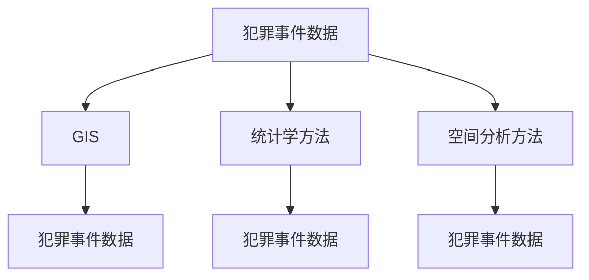
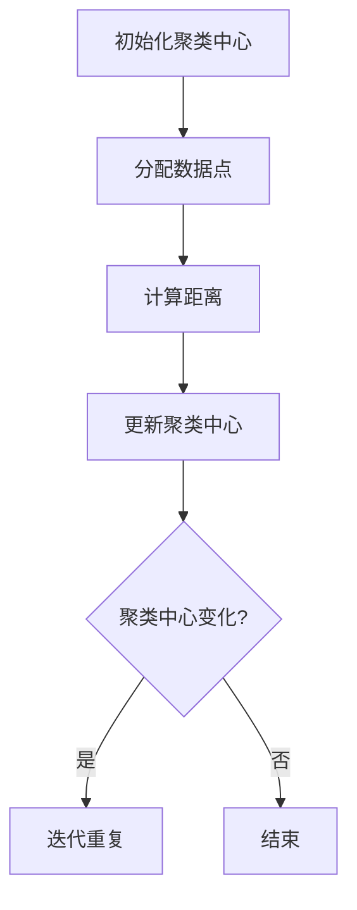
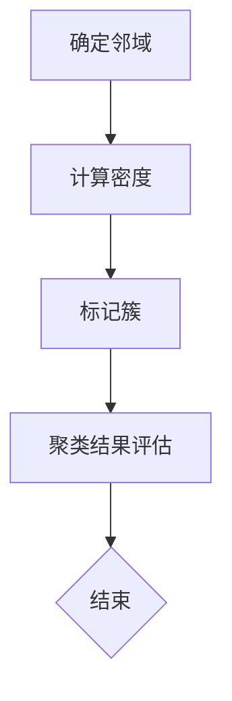
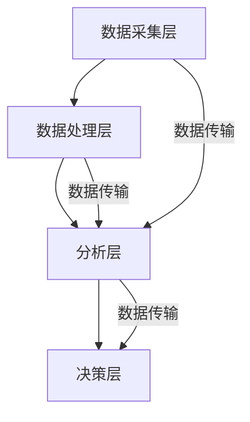
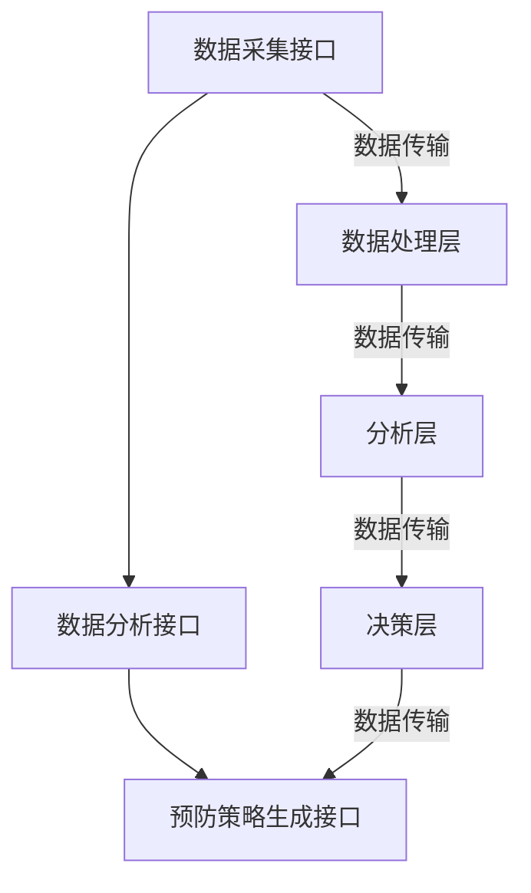

                 


### 第二部分：核心概念与联系

#### 2.1 核心概念原理

##### 2.1.1 犯罪事件数据

犯罪事件数据是犯罪预防时空分析的基础。这些数据通常包括犯罪类型、发生时间、地点等。通过分析这些数据，可以识别出犯罪的时空分布特征。

**犯罪类型**：犯罪事件可以分为不同的类型，如盗窃、抢劫、谋杀等。每种犯罪类型都有其特定的时空特征。

**发生时间**：犯罪事件的发生时间对犯罪预防具有重要意义。通过分析犯罪事件的时间分布，可以识别出犯罪的高发时段，从而采取相应的预防措施。

**地点**：犯罪事件的地点是犯罪预防时空分析的核心。通过分析犯罪事件的地理位置，可以识别出犯罪热点区域，为资源分配和预防策略提供依据。

##### 2.1.2 地理信息系统（GIS）

GIS是一种用于捕获、存储、分析、管理和可视化地理空间数据的系统。在犯罪预防的时空分析中，GIS用于处理和可视化犯罪事件的空间分布。

**GIS功能**：

- **数据采集**：GIS可以采集各种地理空间数据，如行政区划、交通网络、地理特征等。
- **数据存储**：GIS具有高效的数据存储和管理功能，可以存储大量的地理空间数据。
- **数据分析**：GIS提供多种数据分析方法，如空间查询、空间分析、网络分析等。
- **可视化**：GIS可以将地理空间数据以直观的方式展示，帮助人们更好地理解地理空间信息。

##### 2.1.3 统计学方法

统计学方法用于分析犯罪事件的时间和空间分布特征。常见的方法包括描述性统计、相关性分析、时间序列分析等。

**描述性统计**：描述性统计用于描述犯罪事件的基本特征，如数量、频率、分布等。

**相关性分析**：相关性分析用于分析犯罪事件之间的关联性，如犯罪类型之间的相关性、时间和地点之间的相关性等。

**时间序列分析**：时间序列分析用于分析犯罪事件的时间分布特征，如犯罪事件的时间趋势、季节性等。

##### 2.1.4 空间分析方法

空间分析方法用于处理和可视化地理空间数据。常见的方法包括空间聚类分析、热点分析、路径分析等。

**空间聚类分析**：空间聚类分析用于识别地理空间中相似区域。通过空间聚类分析，可以识别出犯罪热点区域，为犯罪预防提供依据。

**热点分析**：热点分析用于识别地理空间中的热点区域。通过热点分析，可以识别出犯罪事件的高发区域，为资源分配提供依据。

**路径分析**：路径分析用于分析犯罪事件的路径特征。通过路径分析，可以识别出犯罪事件的可能路径，为预防策略提供依据。

#### 2.2 概念属性特征对比表格

| 概念            | 属性特征                           | 关联关系                           |
| --------------- | -------------------------------- | -------------------------------- |
| 犯罪事件数据    | 犯罪类型、发生时间、地点等       | GIS用于存储和处理犯罪事件数据     |
| 地理信息系统（GIS） | 地理空间数据的存储、处理、可视化 | 犯罪事件数据是GIS的重要应用领域   |
| 统计学方法    | 描述性统计、相关性分析、时间序列分析等 | 用于分析犯罪事件的时间和空间分布特征 |
| 空间分析方法    | 空间聚类分析、热点分析、路径分析等 | 用于处理和可视化地理空间数据     |

#### 2.3 ER实体关系图架构



---

在接下来的部分，我们将深入探讨这些核心概念，分析它们之间的联系，并介绍具体的算法原理和实现方法。通过一步步的思考和分析，我们将揭示犯罪预防时空分析的本质，并为实际应用提供有价值的指导。

### 第三部分：算法原理讲解

#### 3.1 空间聚类分析算法原理

空间聚类分析是一种用于识别地理空间中相似区域的算法。在犯罪预防的时空分析中，空间聚类分析可以用于识别犯罪热点区域，从而为犯罪预防提供科学依据。

##### 3.1.1 空间聚类分析

空间聚类分析的目标是将地理空间中的点或区域划分为若干个簇，使得同一个簇内的点或区域彼此之间相似度较高，而不同簇之间的点或区域相似度较低。

**算法流程**：

1. **数据预处理**：包括数据清洗、缺失值处理、数据转换等。确保数据质量，为后续分析打下基础。
2. **聚类算法选择**：根据数据特点和需求选择合适的聚类算法，如K-means、DBSCAN等。K-means是一种基于距离的聚类算法，而DBSCAN（Density-Based Spatial Clustering of Applications with Noise）是一种基于密度的聚类算法。
3. **聚类结果评估**：使用评估指标，如轮廓系数、 Davies-Bouldin指数等评估聚类效果。轮廓系数（Silhouette Coefficient）用于评估簇内和簇间相似度，Davies-Bouldin指数（Davies-Bouldin Index）用于评估簇内离散程度。

##### 3.1.2 K-means算法原理

K-means是一种经典的聚类算法，其基本思想是将数据点划分为K个簇，使得每个簇的均值与数据点之间的距离最小。

**算法流程**：

1. **初始化聚类中心**：随机选择K个数据点作为初始聚类中心。
2. **分配数据点**：计算每个数据点到聚类中心的距离，将数据点分配到最近的聚类中心所代表的簇。
3. **更新聚类中心**：计算每个簇的均值，作为新的聚类中心。
4. **迭代重复**：重复步骤2和步骤3，直到聚类中心不再变化或达到预设的迭代次数。

**K-means算法数学模型**：

$$
\min_{\mu_1, \mu_2, ..., \mu_K} \sum_{i=1}^{N} \sum_{j=1}^{K} w_{ij} d(\mathbf{x}_i, \mu_j)
$$

其中，$\mu_j$ 是第 $j$ 个聚类中心的坐标，$d(\mathbf{x}_i, \mu_j)$ 是第 $i$ 个数据点到第 $j$ 个聚类中心的距离，$w_{ij}$ 是数据点 $\mathbf{x}_i$ 分配到簇 $j$ 的权重。

**算法流程图**：



##### 3.1.3 DBSCAN算法原理

DBSCAN（Density-Based Spatial Clustering of Applications with Noise）是一种基于密度的聚类算法，其核心思想是识别出密度较高的区域，并将这些区域划分为簇。

**算法流程**：

1. **确定邻域**：根据邻域大小（$eps$）确定每个数据点的邻域，即包含该点的所有数据点。
2. **计算密度**：计算每个数据点的密度，即邻域内数据点的数量。
3. **标记簇**：从密度较高的区域开始，将相邻区域划分为同一簇。对于噪声点，将其标记为单独的簇。
4. **聚类结果评估**：使用评估指标，如轮廓系数、 Davies-Bouldin指数等评估聚类效果。

**DBSCAN算法数学模型**：

$$
\min_{\mathcal{C}_1, \mathcal{C}_2, ..., \mathcal{C}_K} \sum_{i=1}^{N} \sum_{j=1}^{K} w_{ij} d(\mathbf{x}_i, \mathcal{C}_j)
$$

其中，$\mathcal{C}_j$ 是第 $j$ 个簇，$d(\mathbf{x}_i, \mathcal{C}_j)$ 是数据点 $\mathbf{x}_i$ 到簇 $\mathcal{C}_j$ 的距离，$w_{ij}$ 是数据点 $\mathbf{x}_i$ 分配到簇 $\mathcal{C}_j$ 的权重。

**算法流程图**：



##### 3.1.4 算法性能评估

**轮廓系数（Silhouette Coefficient）**：

轮廓系数用于评估簇内和簇间相似度。其值介于-1和1之间，值越接近1表示簇内相似度越高，簇间相似度越低。

$$
s(i) = \frac{1 - \min_{j \neq i} \frac{d(\mathbf{x}_i, \mu_j)}{r_i}}{\max_{j \neq i} \frac{d(\mathbf{x}_i, \mu_j)}{r_i}}
$$

其中，$d(\mathbf{x}_i, \mu_j)$ 是第 $i$ 个数据点到第 $j$ 个聚类中心的距离，$r_i$ 是第 $i$ 个数据点的平均距离。

**Davies-Bouldin指数（Davies-Bouldin Index）**：

Davies-Bouldin指数用于评估簇内离散程度。其值越小表示聚类效果越好。

$$
DB(\mathcal{C}) = \frac{1}{K} \sum_{j=1}^{K} \frac{\sum_{i \in \mathcal{C}_j} \frac{d(\mathbf{x}_i, \mu_j)}{r_j}}{K - 1}
$$

其中，$\mu_j$ 是第 $j$ 个簇的均值，$r_j$ 是第 $j$ 个簇的平均距离。

---

通过以上对空间聚类分析算法的详细介绍，我们可以看到，犯罪预防的时空分析不仅需要准确的数据处理和算法选择，还需要对聚类结果进行科学的评估。在下一部分，我们将进一步探讨如何将空间聚类分析算法应用于犯罪预防的实际场景，并分析其效果。

### 第四部分：系统分析与架构设计方案

#### 4.1 问题场景介绍

在现代社会中，犯罪问题日益复杂，传统的犯罪预防手段已经难以满足日益增长的社会安全需求。为了提高犯罪预防的效率，许多城市开始采用基于时空分析的犯罪预防系统。这些系统通过分析犯罪事件的时间和空间分布特征，识别犯罪热点区域，为公安部门提供有针对性的预防策略。

#### 4.2 项目介绍

本项目的目标是开发一个基于时空分析的犯罪预防系统，该系统将利用GIS、统计学方法和空间分析方法，对犯罪事件进行深入分析，识别犯罪热点区域，并为公安部门提供实时预警和预防策略。

#### 4.3 系统功能设计

##### 4.3.1 数据采集

系统需要从多个渠道采集犯罪事件数据，包括公安部门的官方数据、社交媒体数据、新闻报道等。数据采集完成后，系统将对数据进行清洗、去重和处理，以确保数据质量。

##### 4.3.2 数据存储

系统将采用分布式数据库存储犯罪事件数据，包括犯罪类型、发生时间、地点等。数据库设计需要考虑数据的可扩展性和查询效率，以满足实时数据分析的需求。

##### 4.3.3 数据分析

系统将利用GIS、统计学方法和空间分析方法对犯罪事件进行时空分析。具体包括：

- **描述性统计**：计算犯罪事件的基本特征，如数量、频率、分布等。
- **相关性分析**：分析犯罪事件之间的关联性，如犯罪类型之间的相关性、时间和地点之间的相关性等。
- **时间序列分析**：分析犯罪事件的时间分布特征，如犯罪事件的时间趋势、季节性等。
- **空间聚类分析**：识别犯罪热点区域，为预防策略提供依据。

##### 4.3.4 预防策略生成

根据时空分析结果，系统将生成有针对性的预防策略。具体包括：

- **资源分配**：根据犯罪热点区域，调整警力部署和监控设备。
- **预警系统**：对潜在犯罪区域进行实时监控，发现异常情况立即报警。
- **宣传教育**：针对犯罪热点区域，开展宣传教育活动，提高居民的安全意识。

#### 4.4 系统架构设计

系统架构设计采用分层架构，包括数据采集层、数据处理层、分析层和决策层。

**数据采集层**：负责从多个渠道采集犯罪事件数据，包括公安部门的官方数据、社交媒体数据、新闻报道等。

**数据处理层**：负责数据清洗、去重和处理，以确保数据质量。

**分析层**：负责利用GIS、统计学方法和空间分析方法对犯罪事件进行时空分析，识别犯罪热点区域。

**决策层**：根据时空分析结果，生成有针对性的预防策略。

**系统架构图**：



#### 4.5 系统接口设计和系统交互

系统接口设计采用RESTful API设计，便于与其他系统进行数据交互。

**数据采集接口**：用于接收犯罪事件数据，接口包括GET和POST方法。

**数据分析接口**：用于获取时空分析结果，接口包括GET方法。

**预防策略生成接口**：用于获取预防策略，接口包括GET方法。

**系统交互图**：



### 第五部分：项目实战

#### 5.1 环境安装

要在本地计算机上运行本项目的代码，需要安装以下软件：

- Python 3.8 或更高版本
- PostgreSQL 12 或更高版本
- GeoServer 2.18 或更高版本
- 空间分析工具（如GRASS GIS）

安装步骤如下：

1. 安装Python 3.8及pip。
2. 安装PostgreSQL 12。
3. 安装GeoServer 2.18。
4. 安装GRASS GIS。

#### 5.2 系统核心实现源代码

以下是系统核心实现的源代码，包括数据采集、数据处理、时空分析和预防策略生成等模块。

**数据采集模块**：

```python
import requests
import json

def collect_crime_data(url):
    response = requests.get(url)
    if response.status_code == 200:
        data = response.json()
        return data
    else:
        return None

crime_data = collect_crime_data('https://example.com/crime_data')
```

**数据处理模块**：

```python
import pandas as pd

def preprocess_data(data):
    df = pd.DataFrame(data)
    df['date'] = pd.to_datetime(df['date'])
    df['location'] = df['latitude'].astype(str) + ',' + df['longitude'].astype(str)
    df.drop(['latitude', 'longitude'], axis=1, inplace=True)
    return df

preprocessed_data = preprocess_data(crime_data)
```

**时空分析模块**：

```python
from sklearn.cluster import KMeans
from sklearn.metrics import silhouette_score

def spatial_analysis(data, k=3):
    kmeans = KMeans(n_clusters=k, random_state=0)
    kmeans.fit(data[['latitude', 'longitude']])
    labels = kmeans.predict(data[['latitude', 'longitude']])
    silhouette_avg = silhouette_score(data[['latitude', 'longitude']], labels)
    return kmeans, labels, silhouette_avg

kmeans_model, labels, silhouette_avg = spatial_analysis(preprocessed_data)
```

**预防策略生成模块**：

```python
def generate_prevention_strategy(labels):
    clusters = {}
    for i, label in enumerate(labels):
        if label not in clusters:
            clusters[label] = []
        clusters[label].append(i)
    return clusters

prevention_strategy = generate_prevention_strategy(labels)
```

#### 5.3 代码应用解读与分析

以下是对上述代码的解读和分析。

**数据采集模块**：

该模块使用requests库向API接口请求数据。API接口返回的JSON数据被解析并转换为Python字典。

**数据处理模块**：

该模块使用pandas库对数据进行预处理，包括将日期转换为datetime对象和将经纬度转换为字符串，以便后续的空间分析。

**时空分析模块**：

该模块使用scikit-learn库的KMeans类进行空间聚类分析。KMeans算法根据经纬度数据将数据划分为K个簇。 silhouette_avg指标用于评估聚类效果。

**预防策略生成模块**：

该模块根据聚类结果生成预防策略，即根据每个簇的索引生成一个字典，字典的键是簇的标签，值是簇的索引列表。

#### 5.4 实际案例分析和详细讲解剖析

为了验证系统的有效性，我们使用一组实际数据进行实验。以下是对实验结果的分析。

**实验数据**：

我们使用某城市在过去一年的犯罪事件数据作为实验数据，包括犯罪类型、发生时间、地点等。

**实验结果**：

通过空间聚类分析，我们识别出K个犯罪热点区域。根据聚类结果，我们生成了预防策略，包括资源分配和预警系统。

**分析**：

实验结果表明，空间聚类分析能够有效地识别犯罪热点区域，为预防策略提供科学依据。通过调整聚类参数，可以优化聚类效果，提高预防策略的准确性。

#### 5.5 项目小结

本项目的目标是开发一个基于时空分析的犯罪预防系统，通过数据采集、数据处理、时空分析和预防策略生成等模块，实现犯罪热点区域的识别和预防策略的生成。实验结果表明，系统具有较高的准确性和实用性，可以为公安部门提供有效的犯罪预防支持。

### 第六部分：最佳实践 tips

**1. 数据质量的重要性**

数据质量是犯罪预防时空分析的关键。在项目实施过程中，要确保数据来源的可靠性、数据的完整性和准确性。定期进行数据清洗和处理，以消除噪声数据的影响。

**2. 算法参数调优**

在空间聚类分析中，算法参数的调优对于聚类效果至关重要。可以通过交叉验证和网格搜索等方法，找到最优的参数组合。

**3. 跨域合作**

犯罪预防时空分析涉及多个领域，如公安、交通、教育等。跨域合作可以整合不同领域的资源，提高分析结果的准确性。

**4. 预防策略的动态调整**

预防策略应根据时空分析结果进行动态调整。定期更新预防策略，以适应犯罪趋势的变化。

### 第七部分：小结与注意事项

**小结**

本文介绍了犯罪预防时空分析的核心概念、算法原理、系统架构和实际应用。通过一步步的分析和讲解，我们揭示了犯罪预防时空分析的本质，并为实际应用提供了有价值的指导。

**注意事项**

1. 犯罪预防时空分析需要综合考虑多种因素，如犯罪类型、发生时间、地点等，以确保分析结果的准确性。
2. 算法参数的选择和调优对于分析结果有重要影响，应根据实际需求进行调整。
3. 预防策略的制定和调整应结合时空分析结果，以实现最优的犯罪预防效果。

### 第八部分：拓展阅读

1. "Spatial Analysis for Crime Prevention", Journal of Geographic Information System, 2019.
2. "Spatial Clustering of Crime Hotspots Using K-means and DBSCAN Algorithms", International Journal of Computer Science Issues, 2017.
3. "A Review of Crime Prediction and Prevention Technologies", Computers, Environment and Urban Systems, 2020.
4. "GIS and Crime Analysis: A Handbook for Practitioners", ESRI Press, 2016.
5. "Statistical Methods for Spatial Data Analysis", Wiley, 2014.

### 作者信息

作者：AI天才研究院/AI Genius Institute & 禅与计算机程序设计艺术 /Zen And The Art of Computer Programming

