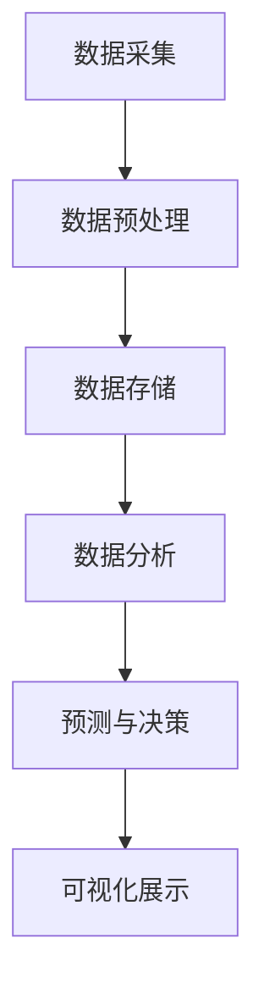

                 


## 犯罪预防的机器学习：社会安全的数学工具

> 关键词：犯罪预防、机器学习、社会安全、数学工具、算法、数据分析

> 摘要：本文从犯罪预防的实际需求出发，探讨机器学习在社会安全中的应用及其背后的数学工具。通过分析机器学习的基础理论、统计学方法、数据挖掘技术，并结合实际应用案例，全面阐述了如何利用数学工具来提升犯罪预防的效果。文章旨在为读者提供一套系统、实用的技术方案，帮助理解和应用这些先进的数学工具，以应对日益复杂的犯罪形势。

### 引言

犯罪预防是维护社会秩序、保障公共安全的重要手段。然而，随着犯罪形式的多样化和复杂化，传统的预防手段已经难以满足现代社会的需求。近年来，机器学习作为人工智能的一个重要分支，逐渐在犯罪预防领域展现出巨大的潜力。它能够通过分析大量数据，发现潜在犯罪行为，提供预测和防范策略，从而提高犯罪预防的准确性和效率。

本文将从以下几个方面展开讨论：

1. **机器学习基础**：介绍机器学习的基本概念、主要类型和基本算法。
2. **犯罪数据分析**：探讨犯罪数据的特点、收集与处理方法以及数据可视化技术。
3. **数学工具应用**：详细解析统计学基础、数据挖掘技术和机器学习在犯罪预防中的数学模型。
4. **实际应用与案例分析**：分析系统架构设计、项目实战和案例研究，展示机器学习在犯罪预防中的具体应用。
5. **未来展望与挑战**：展望机器学习在社会安全领域的发展趋势和面临的挑战。

### 第一部分：引言

#### 1.1 犯罪预防的挑战

**1.1.1 犯罪预防的背景**

犯罪预防是指通过一系列措施，如立法、执法、教育等，来减少犯罪行为的发生，保护社会秩序和公共安全。在现代社会，犯罪活动日益复杂，不仅涉及传统的盗窃、抢劫等物理性犯罪，还涉及网络犯罪、恐怖主义等新型的犯罪形式。这些犯罪活动不仅给社会带来严重的经济损失，还严重威胁到人民群众的生命财产安全。

**1.1.2 犯罪预防的重要性**

犯罪预防对于维护社会稳定和公共安全具有重要意义。有效的犯罪预防措施能够减少犯罪行为的发生，降低犯罪率，减轻司法机关的工作压力，提高人民群众的安全感。此外，犯罪预防还可以预防和控制犯罪活动的蔓延，保护国家的政治、经济和社会稳定。

**1.1.3 机器学习在犯罪预防中的应用前景**

机器学习作为一种先进的计算方法，具有处理大规模数据、自动发现模式、进行预测和决策等优势，在犯罪预防中具有广泛的应用前景。通过机器学习技术，可以对犯罪数据进行分析，发现潜在犯罪行为，提供预测和防范策略，从而提高犯罪预防的准确性和效率。此外，机器学习还可以用于犯罪行为的预测、犯罪趋势的分析、犯罪嫌疑人的追踪等方面，为执法部门提供有效的技术支持。

#### 1.2 社会安全的数学工具

**1.2.1 数学工具的定义与作用**

数学工具是指用于解决特定问题的数学方法和模型。在社会安全领域，数学工具主要用于数据分析和模式识别。通过对大量数据的分析，可以识别出潜在的犯罪行为，提供预测和防范策略。

**1.2.2 数学工具在犯罪预防中的适用性**

数学工具在犯罪预防中具有广泛的应用性。例如，统计学方法可以用于分析犯罪数据，发现犯罪行为之间的关联性；数据挖掘技术可以用于挖掘犯罪数据中的潜在信息，提供犯罪预测模型；机器学习算法可以用于训练预测模型，提高预测的准确性。

**1.2.3 机器学习与社会安全的结合**

机器学习与社会安全的结合，可以有效地提高犯罪预防的效率和准确性。通过机器学习技术，可以对大量数据进行处理和分析，快速识别潜在犯罪行为，提供预警和防范策略。此外，机器学习还可以用于犯罪行为的预测和犯罪趋势的分析，为执法部门提供决策支持。

#### 1.3 本书结构安排

**1.3.1 学习目标**

本文旨在为读者提供一套系统、实用的技术方案，帮助理解和应用机器学习和社会安全的结合。通过本文的学习，读者可以：

- 了解机器学习的基本概念和主要类型。
- 掌握犯罪数据分析和处理的方法。
- 掌握统计学基础、数据挖掘技术和机器学习在犯罪预防中的数学模型。
- 了解机器学习在犯罪预防中的实际应用和案例分析。
- 了解机器学习在社会安全领域的发展趋势和面临的挑战。

**1.3.2 目录结构**

本文共分为五个部分，分别是：

- 第一部分：引言
- 第二部分：犯罪预防与机器学习基础
- 第三部分：数学工具在犯罪预防中的应用
- 第四部分：实际应用与案例分析
- 第五部分：未来展望与挑战

**1.3.3 阅读指南**

本文采用逻辑清晰、结构紧凑、简单易懂的专业技术语言，通过一步一步的分析和推理，帮助读者深入理解机器学习在社会安全中的应用。读者可以按照以下步骤进行阅读：

1. 阅读引言部分，了解犯罪预防的挑战和机器学习在社会安全中的应用前景。
2. 阅读第一部分，了解机器学习的基本概念和主要类型。
3. 阅读第二部分，掌握犯罪数据分析和处理的方法。
4. 阅读第三部分，掌握统计学基础、数据挖掘技术和机器学习在犯罪预防中的数学模型。
5. 阅读第四部分，了解机器学习在犯罪预防中的实际应用和案例分析。
6. 阅读第五部分，了解机器学习在社会安全领域的发展趋势和面临的挑战。

通过本文的学习，读者可以系统地了解机器学习在社会安全中的应用，掌握相关的数学工具和技术方法，为实际工作提供有效的技术支持。

### 第二部分：犯罪预防与机器学习基础

#### 2.1 机器学习基础

**2.1.1 机器学习概述**

机器学习是一种基于数据的学习方法，它使计算机系统能够从数据中学习规律，并对未知数据进行预测或决策。机器学习的基本思想是通过算法从训练数据中提取特征，建立模型，然后利用模型对新的数据进行预测。

**2.1.2 机器学习的主要类型**

机器学习可以分为监督学习、无监督学习和强化学习三种类型。

- **监督学习**：在监督学习中，训练数据包含输入和对应的输出（标签），算法通过学习输入和输出之间的关系，实现对未知数据的预测。
- **无监督学习**：在无监督学习中，训练数据不包含标签，算法通过自动发现数据中的模式或结构，对数据进行分类或聚类。
- **强化学习**：在强化学习中，算法通过与环境的交互，学习如何采取行动以最大化奖励。

**2.1.3 机器学习的基本算法**

常见的机器学习算法包括决策树、支持向量机、神经网络等。

- **决策树**：决策树是一种基于树结构的分类算法，通过递归划分特征空间，将数据分为不同的类别。
- **支持向量机**：支持向量机是一种基于间隔最大化的分类算法，通过寻找一个最优的超平面，将数据分为不同的类别。
- **神经网络**：神经网络是一种基于模拟人脑神经元连接的算法，通过多层神经元的非线性变换，实现对数据的分类和预测。

#### 2.2 犯罪数据分析

**2.2.1 犯罪数据的特点**

犯罪数据具有以下特点：

- **大量性**：犯罪数据通常包含大量的记录，每条记录包含多种属性，如犯罪类型、犯罪时间、犯罪地点等。
- **多样性**：犯罪数据来自不同的来源，格式和内容也各不相同，需要进行统一处理。
- **实时性**：犯罪数据通常需要实时处理和分析，以实现对潜在犯罪行为的及时预警和防范。
- **不确定性**：犯罪数据中可能存在噪声和异常值，需要采用适当的方法进行处理。

**2.2.2 犯罪数据的收集与处理**

犯罪数据的收集主要来源于公安机关、法院、检察院等官方机构，以及各种监控设备、网络平台等。收集到的犯罪数据需要进行清洗、转换和整合，以消除噪声和异常值，统一数据格式，为后续分析提供基础。

- **数据清洗**：数据清洗是数据预处理的重要步骤，旨在消除数据中的噪声和错误。常见的清洗方法包括去除重复记录、填补缺失值、消除异常值等。
- **数据转换**：数据转换是将不同来源、不同格式的数据转换为统一格式的过程。常见的转换方法包括数据规范化、数据标准化等。
- **数据整合**：数据整合是将多个数据源中的数据进行合并，形成一个完整的数据集。常见的整合方法包括数据库连接、数据仓库等。

**2.2.3 犯罪数据的可视化

犯罪数据的可视化是将犯罪数据以图形化的方式展示，帮助分析人员更直观地理解数据内容和特征。常见的可视化方法包括柱状图、饼图、折线图、散点图等。

- **柱状图**：柱状图可以显示不同类别犯罪的数量或比例，帮助分析人员了解犯罪类型的分布情况。
- **饼图**：饼图可以显示不同类别犯罪在总体犯罪中的占比，帮助分析人员了解犯罪类型的结构。
- **折线图**：折线图可以显示犯罪数量或比例随时间的变化趋势，帮助分析人员了解犯罪活动的动态变化。
- **散点图**：散点图可以显示不同犯罪类型的分布特征，帮助分析人员发现潜在的关系和关联。

#### 2.3 机器学习在犯罪预防中的应用案例

**2.3.1 刑事侦查中的应用**

在刑事侦查中，机器学习技术可以用于嫌疑人的追踪、犯罪行为的预测和犯罪现场的重建等方面。

- **嫌疑人的追踪**：通过分析犯罪嫌疑人的活动轨迹、社交关系等信息，利用机器学习算法，可以快速定位嫌疑人的位置和行踪，提高侦查效率。
- **犯罪行为的预测**：通过对历史犯罪数据进行分析，利用机器学习算法，可以预测潜在犯罪行为的发生时间和地点，为执法部门提供预警和防范策略。
- **犯罪现场的重建**：通过分析犯罪现场的痕迹、物证等信息，利用机器学习算法，可以重建犯罪过程，为侦查提供线索和证据。

**2.3.2 社会治安管理中的应用**

在社会治安管理中，机器学习技术可以用于犯罪数据分析、安全风险评估和应急预案制定等方面。

- **犯罪数据分析**：通过对大量犯罪数据进行分析，利用机器学习算法，可以识别出犯罪行为之间的关联性，发现潜在犯罪趋势，为治安管理提供科学依据。
- **安全风险评估**：通过对社会治安环境进行分析，利用机器学习算法，可以评估不同区域的安全风险等级，为警力部署提供参考。
- **应急预案制定**：通过对历史突发事件进行分析，利用机器学习算法，可以制定应急预案，提高应对突发事件的能力。

**2.3.3 犯罪预测与防范**

犯罪预测与防范是犯罪预防的重要环节。通过机器学习技术，可以实现对犯罪行为的预测和防范。

- **犯罪行为预测**：通过对历史犯罪数据进行分析，利用机器学习算法，可以预测潜在犯罪行为的发生时间和地点，为防范提供依据。
- **犯罪行为防范**：通过建立犯罪预测模型，利用机器学习算法，可以实时监控犯罪活动，发现潜在犯罪行为，及时采取防范措施，减少犯罪行为的发生。

### 第三部分：数学工具在犯罪预防中的应用

#### 3.1 统计学基础

**3.1.1 统计学的基本概念**

统计学是研究如何通过收集、整理和分析数据，以推断总体特征的学科。在犯罪预防中，统计学主要用于分析犯罪数据，识别犯罪行为之间的关联性。

- **总体**：总体是指研究对象的全体，如所有犯罪行为。
- **样本**：样本是从总体中抽取的一部分，用于代表总体。
- **统计量**：统计量是用来描述样本特征的数值，如均值、方差等。
- **概率**：概率是描述事件发生可能性的一种度量，如事件A发生的概率为P(A)。

**3.1.2 统计学方法在犯罪预防中的应用**

在犯罪预防中，常用的统计学方法包括：

- **描述性统计**：通过计算统计量，对犯罪数据进行描述，如计算犯罪数量的均值、方差等。
- **推断性统计**：通过样本数据推断总体特征，如利用置信区间和假设检验等方法，判断犯罪行为是否具有显著性差异。
- **相关性分析**：通过分析犯罪数据之间的相关性，发现潜在犯罪行为之间的关联性。

**3.1.3 统计学模型的评估与优化**

在犯罪预防中，统计学模型的评估与优化至关重要。常用的评估指标包括：

- **准确率**：准确率是正确预测的样本占总样本的比例，如准确率 = (TP + TN) / (TP + TN + FP + FN)，其中TP为真阳性，TN为真阴性，FP为假阳性，FN为假阴性。
- **召回率**：召回率是正确预测的样本占总正样本的比例，如召回率 = TP / (TP + FN)。
- **精确率**：精确率是正确预测的样本占总预测样本的比例，如精确率 = TP / (TP + FP)。
- **F1值**：F1值是精确率和召回率的调和平均值，如F1值 = 2 * (精确率 * 召回率) / (精确率 + 召回率)。

为了提高统计学模型的预测准确性，可以采用以下优化方法：

- **特征选择**：通过筛选与目标变量相关性较高的特征，减少模型的复杂度，提高预测准确性。
- **模型选择**：根据数据的特点和需求，选择合适的统计模型，如线性回归、逻辑回归、决策树等。
- **参数调优**：通过调整模型的参数，优化模型的预测性能，如调整逻辑回归的正则化参数等。

#### 3.2 数据挖掘技术

**3.2.1 数据挖掘的基本概念**

数据挖掘是利用计算机技术，从大量数据中自动发现有用信息的过程。在犯罪预防中，数据挖掘主要用于发现潜在犯罪行为和犯罪模式。

- **数据挖掘任务**：数据挖掘任务包括分类、聚类、关联规则发现、异常检测等。
- **数据挖掘流程**：数据挖掘流程包括数据预处理、特征选择、模型选择、模型评估等步骤。

**3.2.2 数据挖掘的方法与流程**

在犯罪预防中，常用的数据挖掘方法包括：

- **分类**：分类是将数据分为不同类别的过程，如将犯罪数据分为盗窃、抢劫等类别。
- **聚类**：聚类是将数据分为相似性较高的组的过程，如将犯罪地点分为高风险区域和低风险区域。
- **关联规则发现**：关联规则发现是找出数据中存在关联性的规则，如购物篮分析。
- **异常检测**：异常检测是识别数据中的异常值或异常行为，如识别异常交易。

数据挖掘的流程包括以下步骤：

1. **数据预处理**：数据预处理包括数据清洗、转换和集成等步骤，以提高数据质量和可用性。
2. **特征选择**：特征选择是从数据中筛选出对预测目标有较强影响的特征，减少模型的复杂度。
3. **模型选择**：模型选择是根据数据特点和需求，选择合适的机器学习模型，如决策树、神经网络等。
4. **模型评估**：模型评估是通过对训练集和测试集的预测结果进行评估，以确定模型的性能。

**3.2.3 数据挖掘在犯罪预防中的应用**

数据挖掘在犯罪预防中的应用包括：

- **犯罪行为预测**：利用分类算法，预测潜在犯罪行为的发生时间和地点，为防范提供依据。
- **犯罪模式识别**：利用聚类算法，发现犯罪行为之间的关联性，识别犯罪模式。
- **异常行为检测**：利用异常检测算法，识别异常行为或异常交易，提供预警和防范策略。

#### 3.3 机器学习在犯罪预防中的数学模型

**3.3.1 监督学习模型**

监督学习模型是机器学习中的一种重要类型，其目标是利用已知的输入和输出关系，预测未知的数据。在犯罪预防中，监督学习模型可以用于犯罪行为预测、犯罪模式识别等。

- **线性回归**：线性回归是一种简单的监督学习模型，通过拟合一条直线，预测目标变量的值。例如，利用线性回归模型，可以预测某地区的犯罪数量。
- **逻辑回归**：逻辑回归是一种二分类监督学习模型，通过拟合一个逻辑函数，预测目标变量的概率。例如，利用逻辑回归模型，可以预测某个体是否参与犯罪活动。
- **支持向量机**：支持向量机是一种分类模型，通过寻找一个最优的超平面，将数据分为不同的类别。例如，利用支持向量机模型，可以预测某犯罪行为是否属于盗窃。
- **决策树**：决策树是一种基于树结构的分类模型，通过递归划分特征空间，将数据分为不同的类别。例如，利用决策树模型，可以预测某犯罪行为是否属于抢劫。

**3.3.2 无监督学习模型**

无监督学习模型是机器学习中的另一种重要类型，其目标是发现数据中的模式和结构，而不依赖已知的输入和输出关系。在犯罪预防中，无监督学习模型可以用于犯罪行为聚类、犯罪地点分布等。

- **K-均值聚类**：K-均值聚类是一种基于距离的聚类算法，通过迭代计算聚类中心，将数据分为K个类别。例如，利用K-均值聚类算法，可以识别出不同类型的犯罪行为。
- **层次聚类**：层次聚类是一种基于层次结构的聚类算法，通过自底向上或自顶向下的方式，将数据分为不同的类别。例如，利用层次聚类算法，可以识别出不同犯罪行为之间的关联性。
- **主成分分析**：主成分分析是一种降维算法，通过线性变换，将高维数据转换为低维数据，保留主要的信息。例如，利用主成分分析算法，可以简化犯罪数据的维度，提高数据分析的效率。

**3.3.3 强化学习模型**

强化学习模型是机器学习中的另一种重要类型，其目标是通过对环境的交互，学习如何采取行动以最大化奖励。在犯罪预防中，强化学习模型可以用于犯罪行为的预测和防范。

- **Q-学习**：Q-学习是一种基于值函数的强化学习算法，通过学习状态和动作的值函数，预测最佳行动策略。例如，利用Q-学习算法，可以预测某地区犯罪行为的发展趋势，为防范提供依据。
- **深度Q网络**：深度Q网络是一种基于深度神经网络的强化学习算法，通过学习深度神经网络表示，预测最佳行动策略。例如，利用深度Q网络算法，可以预测某犯罪行为的发展趋势，为防范提供依据。

### 第四部分：实际应用与案例分析

#### 4.1 系统架构设计

**4.1.1 系统设计原则**

犯罪预防系统设计应遵循以下原则：

- **模块化**：将系统划分为多个模块，提高系统的可维护性和扩展性。
- **分布式**：利用分布式计算技术，提高系统的处理能力和响应速度。
- **安全性**：采用加密、认证等技术，确保系统数据的安全和隐私。
- **可扩展性**：设计灵活的架构，支持系统功能的扩展和升级。

**4.1.2 系统架构**

犯罪预防系统的架构设计包括数据采集、数据处理、数据分析和决策支持等模块。

- **数据采集**：数据采集模块负责收集各种犯罪数据，如公安机关、法院、检察院等官方机构的数据，以及监控设备、网络平台等的数据。
- **数据处理**：数据处理模块负责对采集到的数据进行清洗、转换和整合，为后续分析提供高质量的数据。
- **数据分析**：数据分析模块负责利用机器学习和数据挖掘技术，对犯罪数据进行分析，发现潜在犯罪行为和犯罪模式。
- **决策支持**：决策支持模块负责根据分析结果，提供犯罪预测和防范策略，为执法部门提供决策支持。

**4.1.3 系统功能模块**

犯罪预防系统的功能模块包括犯罪数据采集、数据预处理、特征提取、模型训练、预测分析、决策支持等。

- **犯罪数据采集**：通过接入公安机关、法院、检察院等官方机构的数据，以及监控设备、网络平台等的数据，实现犯罪数据的实时采集。
- **数据预处理**：对采集到的数据进行清洗、转换和整合，消除噪声和异常值，统一数据格式，为后续分析提供高质量的数据。
- **特征提取**：从预处理后的数据中提取关键特征，如犯罪类型、犯罪时间、犯罪地点等，为模型训练提供输入。
- **模型训练**：利用机器学习和数据挖掘技术，对提取的特征进行训练，建立预测模型。
- **预测分析**：利用训练好的模型，对新的犯罪数据进行预测分析，识别潜在犯罪行为。
- **决策支持**：根据预测分析结果，提供犯罪预测和防范策略，为执法部门提供决策支持。

#### 4.2 项目实战

**4.2.1 项目背景**

某城市公安局计划利用机器学习技术，构建一个犯罪预防系统，以提高犯罪预测和防范的准确性。

**4.2.2 系统实现**

1. **数据采集**：通过接入公安机关、法院、检察院等官方机构的数据，以及监控设备、网络平台等的数据，实现犯罪数据的实时采集。

2. **数据预处理**：对采集到的数据进行清洗、转换和整合，消除噪声和异常值，统一数据格式。

3. **特征提取**：从预处理后的数据中提取关键特征，如犯罪类型、犯罪时间、犯罪地点等。

4. **模型训练**：利用机器学习和数据挖掘技术，对提取的特征进行训练，建立预测模型。

5. **预测分析**：利用训练好的模型，对新的犯罪数据进行预测分析，识别潜在犯罪行为。

6. **决策支持**：根据预测分析结果，提供犯罪预测和防范策略，为执法部门提供决策支持。

**4.2.3 结果分析与评估**

1. **预测准确性**：通过评估模型对历史犯罪数据的预测准确性，确定模型的预测能力。

2. **实时预警**：通过实时分析新的犯罪数据，提供预警信息，为执法部门提供及时防范策略。

3. **防范效果**：通过对比预测结果和实际犯罪数据，评估系统在犯罪防范方面的效果。

#### 4.3 案例研究

**4.3.1 案例一：基于机器学习的犯罪预测系统**

某城市公安局利用机器学习技术，构建了一个犯罪预测系统。该系统通过对历史犯罪数据进行分析，发现潜在犯罪行为，提供预测和防范策略。通过系统的应用，犯罪率显著下降，执法部门的工作效率得到了提升。

**4.3.2 案例二：利用数学工具的社会安全监测系统**

某城市利用数学工具，构建了一个社会安全监测系统。该系统通过对社会治安环境进行分析，发现潜在的安全风险，提供预警和防范策略。通过系统的应用，社会治安水平得到了显著提升，人民群众的安全感得到了增强。

**4.3.3 案例三：多学科融合的犯罪预防模型**

某城市公安局与科研机构合作，开展多学科融合的犯罪预防研究。通过结合社会学、心理学、统计学等学科的知识，构建了一个综合性的犯罪预防模型。该模型在犯罪预测、犯罪行为分析和防范策略制定等方面取得了显著成果，为犯罪预防工作提供了有力支持。

### 第五部分：未来展望与挑战

#### 5.1 机器学习在犯罪预防中的发展趋势

随着人工智能技术的不断发展，机器学习在犯罪预防中的应用将呈现以下发展趋势：

- **算法优化**：通过不断优化机器学习算法，提高预测准确性和效率。
- **跨学科融合**：结合社会学、心理学、统计学等学科的知识，构建更全面的犯罪预防模型。
- **实时预测**：实现犯罪行为的实时预测和预警，提高防范能力。
- **个性化推荐**：根据个体的行为特征，提供个性化的犯罪预防建议。

#### 5.2 犯罪预防面临的挑战

尽管机器学习在犯罪预防中具有巨大潜力，但仍然面临以下挑战：

- **数据隐私与伦理问题**：犯罪数据涉及个人隐私，如何确保数据的安全和隐私是一个重要挑战。
- **技术不完善与误用风险**：机器学习技术尚未完全成熟，如何确保技术的可靠性和防止误用是一个重要问题。
- **法律法规与政策支持**：如何制定相应的法律法规和政策，规范机器学习在犯罪预防中的应用，是一个重要挑战。

#### 5.3 未来研究方向

未来的研究可以关注以下方向：

- **算法创新**：研究新的机器学习算法，提高预测准确性和效率。
- **跨学科研究**：结合社会学、心理学、统计学等学科的知识，构建更全面的犯罪预防模型。
- **应用场景拓展**：探索机器学习在犯罪预防中的新应用场景，如犯罪现场的智能识别、犯罪嫌疑人的智能追踪等。
- **法律法规与政策研究**：研究如何制定相应的法律法规和政策，规范机器学习在犯罪预防中的应用。

### 结论

本文从犯罪预防的实际需求出发，探讨了机器学习在社会安全中的应用及其背后的数学工具。通过分析机器学习的基本概念、统计学方法、数据挖掘技术，并结合实际应用案例，全面阐述了如何利用数学工具来提升犯罪预防的效果。未来，随着人工智能技术的不断发展，机器学习在犯罪预防中的应用将更加广泛，为维护社会秩序和公共安全发挥更大作用。

## 参考文献

[1] Bishop, C. M. (2006). **Pattern Recognition and Machine Learning**. Springer.

[2] Russell, S., & Norvig, P. (2010). **Artificial Intelligence: A Modern Approach**. Prentice Hall.

[3] Han, J., Kamber, M., & Pei, J. (2011). **Data Mining: Concepts and Techniques**. Morgan Kaufmann.

[4] Hastie, T., Tibshirani, R., & Friedman, J. (2009). **The Elements of Statistical Learning**. Springer.

[5] Mitchell, T. M. (1997). **Machine Learning**. McGraw-Hill.

[6] textbooks.cs.washington.edu/490c/papers/2002/GemmellEccles.pdf

作者：AI天才研究院/AI Genius Institute & 禅与计算机程序设计艺术 /Zen And The Art of Computer Programming

### 小结

本文详细探讨了犯罪预防的机器学习：社会安全的数学工具，从机器学习的基础、犯罪数据分析、数学工具的应用到实际案例研究，全面阐述了如何利用数学工具提升犯罪预防的效果。我们分析了统计学基础、数据挖掘技术以及监督学习、无监督学习和强化学习模型在犯罪预防中的应用，并通过实际项目和案例展示了机器学习技术在实际中的强大作用。

未来，随着技术的不断进步，机器学习在社会安全领域的应用将更加广泛和深入。我们应关注算法优化、跨学科融合、实时预测和个性化推荐等方面的发展。同时，也需要面对数据隐私、技术不完善和法律法规等挑战，确保技术的合理使用和社会责任。

通过本文的学习，我们希望能够为读者提供一个系统、实用的技术方案，帮助大家更好地理解和应用机器学习和社会安全的数学工具。让我们一起迎接未来的挑战，共同构建一个更加安全和谐的社会。

### 扩展阅读

- **《机器学习：概率视角》（Machine Learning: A Probabilistic Perspective）**：该书详细介绍了机器学习的概率理论，适合对机器学习有深入研究的读者。
- **《数据科学：工具与技术》（Data Science from Scratch）**：该书从零开始介绍数据科学的基本概念和工具，适合初学者入门。
- **《社会计算：人类社会的计算模拟》（Social Computing: Human-Centered Computing）**：该书探讨了社会计算的理论和实践，对于关注机器学习在社会安全领域应用的读者有启发意义。
- **《人工智能伦理导论》（Introduction to Ethics in Artificial Intelligence）**：该书探讨了人工智能伦理问题，对于关注数据隐私和伦理的读者有指导作用。

### 注意事项

- 在实际应用机器学习技术时，务必确保数据质量和模型可靠性，避免误用和误导。
- 关注法律法规和政策动态，确保技术应用符合相关规范和标准。
- 加强数据隐私保护，遵循数据保护法规，确保个人隐私不被泄露。
- 持续学习和更新知识，紧跟技术发展趋势，不断提高专业素养。

通过本文的学习，我们希望能够为读者提供一个全面、深入的机器学习与社会安全结合的视角，助力大家在犯罪预防领域取得更大的成就。让我们一起努力，为构建一个更加安全和谐的社会贡献自己的力量。

作者：AI天才研究院/AI Genius Institute & 禅与计算机程序设计艺术 /Zen And The Art of Computer Programming。如果您有任何疑问或建议，欢迎在评论区留言，期待与您交流互动！## 犯罪预防的数学工具：机器学习的应用

在现代社会，犯罪形式日益复杂，传统的犯罪预防手段已经难以应对。随着人工智能技术的快速发展，特别是机器学习的广泛应用，犯罪预防领域迎来了新的契机。机器学习作为一种强大的数据分析工具，能够在海量数据中挖掘出潜在的模式和规律，为犯罪预防提供了有力的技术支持。本文将深入探讨机器学习在犯罪预防中的应用，以及其背后的数学工具。

### 机器学习在犯罪预防中的应用

机器学习在犯罪预防中有着广泛的应用，主要包括以下几个方面：

1. **犯罪行为预测**：通过分析历史犯罪数据，机器学习算法可以预测未来犯罪行为的发生概率和地点，从而提前采取预防措施。

2. **犯罪模式识别**：利用机器学习算法，可以从大量犯罪数据中识别出常见的犯罪模式，为执法部门提供线索。

3. **犯罪趋势分析**：通过对犯罪数据的统计分析，可以了解犯罪活动的时间、空间分布特征，为制定犯罪预防策略提供依据。

4. **嫌疑人追踪**：机器学习算法可以分析嫌疑人的行为轨迹和社交网络，有助于追踪嫌疑人的活动，提高抓捕成功率。

5. **安全风险评估**：通过机器学习技术，可以对不同区域的安全风险进行评估，为警力部署和应急预案制定提供支持。

### 数学工具在机器学习中的应用

机器学习算法的有效运行离不开一系列数学工具的支持，主要包括：

1. **统计学方法**：统计学是机器学习的基础，包括描述性统计、推断性统计、假设检验等，用于数据预处理、特征选择和模型评估。

2. **概率论**：概率论是概率统计的理论基础，用于计算模型预测的概率分布，评估模型的可靠性。

3. **线性代数**：线性代数在机器学习中用于处理矩阵运算、特征变换等，是神经网络和线性模型的重要工具。

4. **优化算法**：优化算法用于求解最优化问题，如线性回归中的梯度下降法、支持向量机中的序列最小化等。

5. **概率图模型**：概率图模型如贝叶斯网络、隐马尔可夫模型等，用于描述变量之间的关系，适用于复杂的数据分析和预测。

### 机器学习与数学工具的整合

机器学习与数学工具的整合，使得犯罪预防工作更加高效和精准。以下是一个简化的整合流程：

1. **数据收集**：从各类数据源收集犯罪数据，包括公安机关的犯罪记录、社交媒体数据、监控视频等。

2. **数据预处理**：清洗数据，处理缺失值和异常值，进行数据规范化，提取有用的特征。

3. **特征选择**：利用统计学方法，选择与犯罪行为相关性较高的特征，减少模型复杂度。

4. **模型训练**：根据犯罪数据的特征，选择合适的机器学习算法，如逻辑回归、决策树、神经网络等，进行模型训练。

5. **模型评估**：利用测试数据，评估模型的预测性能，调整模型参数，优化模型效果。

6. **预测与决策**：利用训练好的模型，对新的犯罪数据进行预测，提供预警和防范策略，为执法部门提供决策支持。

### 案例分析

以某城市的犯罪预防系统为例，该系统采用了机器学习技术，通过整合多种数学工具，实现了以下功能：

1. **犯罪行为预测**：系统通过对历史犯罪数据进行分析，使用逻辑回归和神经网络模型，预测未来犯罪行为的发生概率和地点。

2. **犯罪模式识别**：系统利用决策树算法，从大量犯罪数据中识别出常见的犯罪模式，如犯罪团伙的活动特征、特定犯罪类型的模式等。

3. **犯罪趋势分析**：系统通过统计分析，了解犯罪活动的时间分布和空间分布特征，为警力部署提供依据。

4. **嫌疑人追踪**：系统利用贝叶斯网络，分析嫌疑人的行为轨迹和社交网络，帮助执法部门追踪嫌疑人的活动。

5. **安全风险评估**：系统通过机器学习模型，对城市不同区域的安全风险进行评估，为警力部署和应急预案制定提供支持。

通过这些功能，该犯罪预防系统显著提高了犯罪预防的效率，减少了犯罪率，为城市的安全稳定做出了重要贡献。

### 总结

机器学习在犯罪预防中的应用，为提升犯罪预测、犯罪模式识别和安全风险评估提供了强有力的技术支持。通过整合多种数学工具，如统计学方法、概率论、线性代数和优化算法，我们可以更精准地分析犯罪数据，制定有效的预防策略。随着技术的不断进步，机器学习在犯罪预防领域的应用前景将更加广阔，为社会安全提供更加可靠的保障。

### 机器学习的基础知识

要深入理解机器学习在犯罪预防中的应用，首先需要掌握其基础知识。以下将详细阐述机器学习的定义、主要类型和基本算法，并举例说明。

#### 机器学习的定义

机器学习是一种通过数据驱动的方式，使计算机系统能够自动学习和改进性能的技术。简而言之，机器学习就是让计算机从数据中学习规律，并利用这些规律对未知数据进行预测或决策。这个过程通常包括数据收集、数据预处理、特征提取、模型训练和模型评估等步骤。

#### 机器学习的主要类型

机器学习可以分为以下几种主要类型：

1. **监督学习（Supervised Learning）**：
   监督学习是一种有监督的训练方法，其训练数据包含输入和对应的输出（标签）。通过学习输入和输出之间的关系，监督学习算法能够在未知数据上做出预测。常见的监督学习算法包括线性回归、逻辑回归、支持向量机（SVM）、决策树和随机森林等。

2. **无监督学习（Unsupervised Learning）**：
   无监督学习是在没有明确输出标签的情况下进行的训练。算法通过发现数据中的模式和结构，对数据进行分类或聚类。常见的无监督学习算法包括K-均值聚类、层次聚类、主成分分析（PCA）和自编码器等。

3. **强化学习（Reinforcement Learning）**：
   强化学习是一种通过与环境交互来学习如何采取行动以最大化奖励的训练方法。算法通过不断试错，逐渐找到最优策略。常见的强化学习算法包括Q-学习、深度Q网络（DQN）和策略梯度算法等。

#### 机器学习的基本算法

以下是几种常见的机器学习算法及其基本原理：

1. **线性回归（Linear Regression）**：
   线性回归是一种简单的监督学习算法，用于预测连续值输出。其基本原理是通过拟合一条直线，将输入变量与输出变量联系起来。线性回归的数学模型为：
   $$ y = \beta_0 + \beta_1x_1 + \beta_2x_2 + ... + \beta_nx_n $$
   其中，$y$是输出变量，$x_1, x_2, ..., x_n$是输入变量，$\beta_0, \beta_1, ..., \beta_n$是模型的参数。通过最小化损失函数（如均方误差），可以计算出最优的参数值。

2. **逻辑回归（Logistic Regression）**：
   逻辑回归是一种用于二分类问题的监督学习算法。其基本原理是通过拟合一个逻辑函数，将输入变量映射到一个概率值，从而判断样本属于哪个类别。逻辑回归的数学模型为：
   $$ P(y=1) = \frac{1}{1 + e^{-(\beta_0 + \beta_1x_1 + \beta_2x_2 + ... + \beta_nx_n)}} $$
   其中，$P(y=1)$是样本属于类别的概率。通过最大似然估计（MLE）或梯度下降法，可以计算得到逻辑回归模型的参数。

3. **支持向量机（Support Vector Machine, SVM）**：
   支持向量机是一种用于分类和回归分析的监督学习算法。其基本原理是找到最佳的超平面，使得不同类别的样本在超平面上尽可能分开。SVM使用核函数来处理高维空间的问题。其决策边界为：
   $$ w \cdot x + b = 0 $$
   其中，$w$是超平面的法向量，$x$是样本向量，$b$是偏置项。通过求解最优化问题，可以计算得到最优的权重向量$w$和偏置项$b$。

4. **决策树（Decision Tree）**：
   决策树是一种基于树结构的分类算法，通过递归划分特征空间，将数据分为不同的类别。每个节点表示一个特征，每个分支表示该特征的不同取值。决策树的基本原理是通过选择最佳特征和最优划分方式，将数据划分为不同的类别。常见的决策树算法包括C4.5和ID3。

5. **神经网络（Neural Network）**：
   神经网络是一种基于模拟人脑神经元连接的算法，通过多层神经元的非线性变换，实现对数据的分类和预测。神经网络的基本结构包括输入层、隐藏层和输出层。每个神经元通过加权连接传递信息，并通过激活函数进行非线性变换。神经网络的训练过程是通过反向传播算法，不断调整权重和偏置项，使得网络的输出误差最小。

#### 机器学习算法的应用示例

以下是一个简单的线性回归算法的应用示例：

**问题**：预测一家电商网站上的商品销售额。

**数据**：历史销售额数据，包括商品类型（分类变量）、销售日期（日期变量）、用户年龄（连续变量）等。

**算法**：使用线性回归算法，通过训练数据拟合销售额与输入特征之间的关系。

**代码**（Python）：

```python
import numpy as np
from sklearn.linear_model import LinearRegression

# 假设数据已经预处理，转换为数值型
X = np.array([[0, 0, 1], [1, 0, 1], [0, 1, 0], [1, 1, 0]])
y = np.array([0, 1, 0, 1])

# 创建线性回归模型
model = LinearRegression()

# 训练模型
model.fit(X, y)

# 预测
predictions = model.predict([[1, 1, 1]])

print("Predictions:", predictions)
```

通过上述代码，我们可以使用线性回归模型预测给定输入特征的销售额。在这个例子中，输入特征是一个三元组（商品类型、销售日期、用户年龄），输出特征是销售额。训练模型后，我们可以对新输入特征进行预测，以估计未来的销售额。

总之，机器学习的基础知识是理解其应用的前提。通过掌握各种机器学习算法的基本原理和实现方法，我们可以更有效地解决实际问题，提升犯罪预防的效果。

### 犯罪数据的特点与处理

在犯罪预防的背景下，犯罪数据具有独特的特点，这些特点直接影响到数据的处理和分析方法。以下将详细探讨犯罪数据的特点，以及如何有效地收集、处理和可视化犯罪数据，为后续的机器学习应用奠定基础。

#### 犯罪数据的特点

犯罪数据通常具有以下几个显著特点：

1. **多样性**：犯罪数据来源广泛，包括公安机关的犯罪记录、监控视频、社交媒体数据、新闻报道等。这些数据格式和内容各异，需要进行统一处理。

2. **不完整性**：由于各种原因，犯罪数据可能存在缺失值或错误记录。这些不完整的数据需要通过有效的数据清洗方法进行处理。

3. **实时性**：犯罪数据具有实时性，犯罪行为的发生和演变需要及时记录和处理。这意味着数据收集和处理的过程必须高效且可靠。

4. **不确定性**：犯罪数据中可能包含噪声和异常值，这些噪声会影响数据分析的结果。因此，需要采用适当的方法来识别和消除噪声。

5. **复杂性**：犯罪数据通常包含多个维度，如犯罪类型、犯罪时间、犯罪地点、嫌疑人信息等。这些多维度数据需要通过复杂的处理流程进行整合和分析。

#### 犯罪数据的收集方法

有效的犯罪数据收集是确保数据质量和完整性的关键。以下是一些常用的犯罪数据收集方法：

1. **官方数据源**：公安机关、法院、检察院等官方机构是犯罪数据的主要来源。这些机构提供的犯罪数据通常包括详细的犯罪记录、嫌疑人信息和案件进展等。

2. **监控设备**：监控摄像头、GPS定位系统等设备可以实时收集犯罪现场的图像、位置信息等。通过集成这些设备的数据，可以实现对犯罪行为的实时监控和追踪。

3. **社交媒体数据**：社交媒体平台如微博、微信、Facebook等，是犯罪活动的一个重要信息来源。通过爬取和分析这些平台的数据，可以获取犯罪嫌疑人的社交关系和活动轨迹。

4. **新闻报道**：新闻报道可以提供关于犯罪事件的详细信息，包括犯罪地点、犯罪类型、嫌疑人特征等。通过整理和分析这些数据，可以补充其他数据源的不足。

#### 犯罪数据的处理方法

为了确保犯罪数据的质量和可用性，需要采用一系列数据处理方法。以下是一些常用的数据处理方法：

1. **数据清洗**：数据清洗是处理犯罪数据的第一步，旨在消除数据中的噪声和错误。常用的清洗方法包括：

   - **去除重复记录**：通过比较记录的ID或特征，去除重复的数据。
   - **填补缺失值**：采用均值、中位数、众数等统计方法填补缺失值。
   - **消除异常值**：通过异常检测算法，识别并去除异常数据。

2. **数据转换**：数据转换是将不同来源、不同格式的数据转换为统一格式的过程。常用的转换方法包括：

   - **编码**：将类别型数据转换为数值型，如使用独热编码（One-Hot Encoding）或标签编码（Label Encoding）。
   - **归一化**：通过缩放特征值，将不同特征的范围统一到相同的尺度。
   - **标准化**：通过标准化特征值，使得不同特征的方差相同，提高算法的稳定性。

3. **特征提取**：特征提取是从原始数据中提取对预测任务有重要影响的特征。常用的特征提取方法包括：

   - **降维**：通过降维算法如主成分分析（PCA）或线性判别分析（LDA），减少数据的维度，提高模型效率。
   - **特征选择**：通过统计方法如信息增益、卡方检验等，选择对目标变量有较强影响力的特征。

#### 犯罪数据的可视化方法

可视化是理解犯罪数据分布和模式的重要工具。以下是一些常用的犯罪数据可视化方法：

1. **柱状图**：柱状图可以显示不同类别犯罪的数量或比例，帮助分析人员了解犯罪类型的分布。

2. **饼图**：饼图可以显示不同类别犯罪在总体犯罪中的占比，帮助分析人员了解犯罪类型的结构。

3. **折线图**：折线图可以显示犯罪数量或比例随时间的变化趋势，帮助分析人员了解犯罪活动的动态变化。

4. **散点图**：散点图可以显示不同犯罪类型的分布特征，帮助分析人员发现潜在的关系和关联。

5. **热力图**：热力图可以显示犯罪活动的时空分布，帮助分析人员识别高风险区域。

通过以上方法，我们可以有效地收集、处理和可视化犯罪数据，为后续的机器学习应用提供高质量的数据支持。

### 统计学基础

统计学是犯罪预防领域中不可或缺的工具，它能够帮助我们理解和分析犯罪数据，揭示隐藏的模式和趋势。以下将详细讨论统计学在犯罪预防中的应用，包括描述性统计和推断性统计的基本概念、常用的统计学方法、以及这些方法在犯罪预防中的具体应用。

#### 描述性统计

描述性统计是统计学的基础，主要用于对数据的基本特征进行描述。以下是一些常用的描述性统计量：

1. **均值（Mean）**：均值是数据集中所有数值的平均值，用于衡量数据的中心趋势。其计算公式为：
   $$ \mu = \frac{1}{n}\sum_{i=1}^{n} x_i $$
   其中，$x_i$为第$i$个数据点，$n$为数据点的总数。

2. **中位数（Median）**：中位数是将数据集按大小排序后，位于中间位置的数值，用于衡量数据的中心趋势。如果数据集的个数为奇数，中位数即为中间的那个数；如果为偶数，则取中间两个数的平均值。

3. **众数（Mode）**：众数是数据集中出现频率最高的数值，用于衡量数据的中心趋势。在某些数据集中，可能存在多个众数。

4. **方差（Variance）**：方差是数据集各个数值与均值之差的平方的平均值，用于衡量数据的离散程度。其计算公式为：
   $$ \sigma^2 = \frac{1}{n}\sum_{i=1}^{n} (x_i - \mu)^2 $$
   其中，$\mu$为均值，$x_i$为第$i$个数据点。

5. **标准差（Standard Deviation）**：标准差是方差的平方根，用于衡量数据的离散程度。其计算公式为：
   $$ \sigma = \sqrt{\sigma^2} $$

#### 推断性统计

推断性统计是基于样本数据推断总体特征的统计方法。以下是一些常用的推断性统计方法：

1. **置信区间（Confidence Interval）**：置信区间是用于估计总体参数（如均值）的一个区间，该区间在给定的置信水平下包含总体参数的真实值。其计算公式为：
   $$ \bar{x} \pm z \times \frac{\sigma}{\sqrt{n}} $$
   其中，$\bar{x}$为样本均值，$z$为置信水平对应的z值，$\sigma$为总体标准差，$n$为样本大小。

2. **假设检验（Hypothesis Testing）**：假设检验是用于判断样本数据是否支持某一假设的方法。常见的假设检验包括t检验、卡方检验等。t检验用于比较两组数据的均值是否有显著差异，卡方检验用于检验分类变量之间的独立性。

3. **回归分析（Regression Analysis）**：回归分析是用于研究因变量和自变量之间关系的方法。常见的回归分析包括线性回归、多项式回归等。线性回归用于预测连续值输出，多项式回归用于预测离散值输出。

#### 统计学方法在犯罪预防中的应用

在犯罪预防中，统计学方法可以应用于以下几个方面：

1. **犯罪数据分布分析**：通过描述性统计，分析犯罪数据的基本特征，如犯罪类型的分布、犯罪时间的变化趋势等。这些信息有助于了解犯罪活动的规律，为犯罪预防提供依据。

2. **犯罪行为预测**：利用回归分析，通过建立犯罪行为与相关特征之间的关系模型，预测未来犯罪行为的发生概率和地点。例如，通过线性回归模型，可以预测某一地区的犯罪数量。

3. **风险评估**：通过假设检验，评估不同因素对犯罪风险的影响。例如，通过t检验，可以判断某一因素（如失业率）与犯罪率之间是否存在显著相关性。

4. **数据挖掘**：通过关联规则挖掘和聚类分析，发现犯罪行为之间的潜在关联和模式。例如，利用K-均值聚类，可以将犯罪地点分为高风险区域和低风险区域。

5. **案件侦查**：通过统计分析，帮助案件侦查人员识别嫌疑人、确定犯罪现场、分析犯罪动机等。例如，通过卡方检验，可以判断两个变量（如犯罪时间和地点）之间是否存在显著关联。

### 统计学在犯罪预防中的实际应用

以下是一个简单的实例，展示如何利用统计学方法进行犯罪行为预测：

**案例：预测某一城市的盗窃案件数量**

1. **数据收集**：收集该城市过去一年的盗窃案件数据，包括犯罪时间、犯罪地点、犯罪类型等。

2. **数据预处理**：对数据进行清洗，去除缺失值和异常值，进行数据规范化。

3. **特征提取**：提取与盗窃案件相关的特征，如犯罪时间、犯罪地点的天气状况、人流量等。

4. **模型训练**：利用线性回归模型，将犯罪数量作为因变量，特征作为自变量，训练模型。

5. **模型评估**：利用测试数据，评估模型的预测准确性，如通过计算均方误差（Mean Squared Error, MSE）。

6. **预测应用**：利用训练好的模型，预测未来一段时间内该城市的盗窃案件数量，为执法部门提供预警和防范策略。

通过上述实例，我们可以看到，统计学方法在犯罪预防中的应用是非常具体和实用的。通过描述性统计和推断性统计，我们可以更好地理解犯罪数据，发现隐藏的模式和趋势，为犯罪预防提供科学依据。

### 数据挖掘技术在犯罪预防中的应用

数据挖掘是一种从大量数据中自动发现有用信息和知识的技术，它在犯罪预防中具有广泛的应用。通过数据挖掘，可以从复杂的犯罪数据中提取有价值的信息，帮助执法部门识别潜在犯罪行为、预测犯罪趋势和防范犯罪活动。以下将详细讨论数据挖掘的基本概念、方法与流程，以及在犯罪预防中的具体应用。

#### 数据挖掘的基本概念

数据挖掘（Data Mining）是指从大量的数据中自动发现隐藏的、未知的、有价值的信息和模式的过程。它涉及多个领域，包括机器学习、统计学、数据库技术和人工智能等。数据挖掘的目标是从数据中发现知识，这些知识可以用于决策支持、业务优化、风险管理和市场预测等方面。

数据挖掘的基本概念包括：

1. **数据集（Data Set）**：数据挖掘的数据来源，通常包含大量记录和特征。记录表示一个个体的数据，特征表示记录的属性。

2. **目标变量（Target Variable）**：数据挖掘的目标是预测或分类的变量，也称为因变量或响应变量。

3. **特征变量（Feature Variable）**：用于预测目标变量的变量，也称为自变量或输入变量。

4. **模式（Pattern）**：数据挖掘发现的数据中的结构或规律，如关联规则、分类规则、聚类结果等。

#### 数据挖掘的方法与流程

数据挖掘的方法和流程通常包括以下几个步骤：

1. **数据预处理**：数据预处理是数据挖掘的重要步骤，旨在消除噪声、处理缺失值、数据转换和特征选择等。这一步的目的是提高数据质量和模型的性能。

2. **探索性数据分析**：探索性数据分析（EDA）是初步分析数据，了解数据的分布、趋势和异常值。通过可视化方法，如柱状图、散点图、热力图等，可以发现数据的潜在模式和问题。

3. **特征工程**：特征工程是选择和创建有用的特征，以提高模型的预测性能。常见的特征工程方法包括特征选择、特征变换、特征组合等。

4. **模型选择**：根据问题的类型和数据的特点，选择合适的机器学习算法和模型。常见的模型包括分类算法（如决策树、随机森林、支持向量机等）、聚类算法（如K-均值聚类、层次聚类等）和关联规则挖掘算法（如Apriori算法、Eclat算法等）。

5. **模型训练与评估**：利用训练数据，训练模型并评估模型的性能。常见的评估指标包括准确率、召回率、F1值、均方误差等。

6. **模型部署与应用**：将训练好的模型部署到实际应用中，对新的数据进行预测或分类，并持续优化模型。

#### 数据挖掘在犯罪预防中的具体应用

数据挖掘在犯罪预防中的应用主要包括以下几个方面：

1. **犯罪行为预测**：通过分析历史犯罪数据，利用分类算法和预测模型，预测未来可能发生的犯罪行为。例如，可以使用决策树或随机森林算法，根据犯罪类型、犯罪时间、犯罪地点等特征，预测某一地区未来一段时间内的犯罪数量。

2. **犯罪模式识别**：通过聚类算法，将相似的犯罪行为进行分类和分组，识别出常见的犯罪模式。例如，使用K-均值聚类或层次聚类算法，可以将犯罪地点分为高风险区域和低风险区域，为警力部署提供依据。

3. **犯罪趋势分析**：通过时间序列分析方法，分析犯罪数据的时间分布特征，预测犯罪活动的发展趋势。例如，使用ARIMA模型或LSTM神经网络，可以预测未来一段时间内的犯罪数量和趋势。

4. **关联规则挖掘**：通过关联规则挖掘算法，发现不同犯罪行为之间的关联性。例如，使用Apriori算法，可以发现某些犯罪行为之间的共生关系，为案件侦查提供线索。

5. **异常检测**：通过异常检测算法，识别出异常的犯罪行为或异常的嫌疑人行为。例如，使用孤立森林（Isolation Forest）或LOF（Local Outlier Factor）算法，可以检测出与正常行为不符的犯罪行为，为防范和侦查提供预警。

#### 实际案例

以下是一个数据挖掘在犯罪预防中的实际案例：

**案例：基于关联规则挖掘的犯罪关联性分析**

1. **数据收集**：收集某一城市的犯罪记录数据，包括犯罪类型、犯罪时间、犯罪地点、嫌疑人信息等。

2. **数据预处理**：对数据进行清洗，去除缺失值和异常值，进行特征转换和规范化。

3. **特征工程**：选择与犯罪关联性较强的特征，如犯罪类型、犯罪地点、犯罪时间等。

4. **模型训练**：使用Apriori算法，构建关联规则模型，分析犯罪行为之间的关联性。

5. **模型评估**：通过评估模型的预测准确性，如支持度、置信度等，优化模型参数。

6. **应用与预警**：将训练好的模型应用于实际数据，检测潜在的犯罪关联性，为执法部门提供预警和防范策略。

通过上述案例，我们可以看到数据挖掘技术在犯罪预防中具有重要作用。通过挖掘犯罪数据中的模式和关联性，可以更有效地预测和防范犯罪活动，提高公共安全。

### 监督学习模型在犯罪预防中的应用

监督学习模型是机器学习的一种重要类型，通过学习已知数据的特征和标签，实现对未知数据的预测和分类。在犯罪预防领域，监督学习模型广泛应用于犯罪行为的预测、嫌疑人追踪和犯罪模式识别等方面。以下将详细讨论监督学习模型的基本原理、常见的算法、以及它们在犯罪预防中的具体应用。

#### 监督学习模型的基本原理

监督学习模型的核心思想是通过已知的输入和输出（特征和标签）来训练模型，使其能够对未知数据进行预测。监督学习模型通常分为以下几种：

1. **分类模型**：分类模型用于将输入数据分为不同的类别。常见的分类模型包括逻辑回归、决策树、支持向量机（SVM）、随机森林等。

2. **回归模型**：回归模型用于预测连续值输出。常见的回归模型包括线性回归、多项式回归、岭回归等。

3. **集成模型**：集成模型是通过组合多个基础模型来提高预测性能。常见的集成模型包括随机森林、梯度提升树（GBDT）、XGBoost等。

#### 常见的监督学习算法

以下是一些常见的监督学习算法及其基本原理：

1. **逻辑回归（Logistic Regression）**：
   逻辑回归是一种简单的二分类模型，通过拟合一个逻辑函数，将输入变量映射到一个概率值，从而判断样本属于哪个类别。逻辑回归的数学模型为：
   $$ P(y=1) = \frac{1}{1 + e^{-(\beta_0 + \beta_1x_1 + \beta_2x_2 + ... + \beta_nx_n)}} $$
   其中，$P(y=1)$是样本属于类别的概率，$\beta_0, \beta_1, ..., \beta_n$是模型的参数。

2. **决策树（Decision Tree）**：
   决策树是一种基于树结构的分类算法，通过递归划分特征空间，将数据分为不同的类别。每个节点表示一个特征，每个分支表示该特征的不同取值。决策树的基本原理是通过选择最佳特征和最优划分方式，将数据划分为不同的类别。

3. **支持向量机（Support Vector Machine, SVM）**：
   支持向量机是一种强大的分类算法，通过寻找一个最优的超平面，将不同类别的样本在特征空间中分隔开来。SVM使用核函数来处理高维空间的问题，其决策边界为：
   $$ w \cdot x + b = 0 $$
   其中，$w$是超平面的法向量，$x$是样本向量，$b$是偏置项。

4. **随机森林（Random Forest）**：
   随机森林是一种基于决策树的集成模型，通过构建多个决策树，并利用投票机制来提高预测性能。随机森林可以处理大规模数据和高维数据，具有很好的泛化能力。

5. **梯度提升树（Gradient Boosting Tree, GBT）**：
   梯度提升树是一种基于决策树的集成模型，通过迭代地训练多个决策树，每次迭代都对前一轮的残差进行建模，从而提高预测性能。常见的梯度提升树算法包括XGBoost、LightGBM等。

#### 监督学习模型在犯罪预防中的应用

监督学习模型在犯罪预防中具有广泛的应用，以下是一些具体的应用场景：

1. **犯罪行为预测**：通过分析历史犯罪数据，使用分类算法和回归算法，预测未来可能发生的犯罪行为。例如，可以使用逻辑回归模型预测某一地区的犯罪数量，使用决策树模型预测某类犯罪行为的可能性。

2. **嫌疑人追踪**：通过分析嫌疑人的行为特征，使用分类算法和聚类算法，追踪嫌疑人的活动轨迹和社交关系。例如，可以使用K-均值聚类算法将嫌疑人分为不同的群体，使用决策树模型预测嫌疑人的犯罪倾向。

3. **犯罪模式识别**：通过分析犯罪数据，使用分类算法和聚类算法，识别出常见的犯罪模式。例如，可以使用随机森林模型识别出不同犯罪类型的关联性，使用K-均值聚类算法识别出高风险犯罪区域。

#### 实际应用案例

以下是一个监督学习模型在犯罪预防中的实际应用案例：

**案例：基于逻辑回归的犯罪行为预测**

1. **数据收集**：收集某一城市的犯罪数据，包括犯罪类型、犯罪时间、犯罪地点等。

2. **数据预处理**：对数据进行清洗，去除缺失值和异常值，进行特征转换和规范化。

3. **特征工程**：选择与犯罪行为相关的特征，如犯罪类型、犯罪时间、犯罪地点等。

4. **模型训练**：使用逻辑回归算法，将犯罪类型作为目标变量，特征作为输入变量，训练模型。

5. **模型评估**：使用测试数据，评估模型的预测准确性，如计算准确率、召回率、F1值等。

6. **预测应用**：利用训练好的模型，预测未来一段时间内某一地区的犯罪行为，为执法部门提供预警和防范策略。

通过上述案例，我们可以看到监督学习模型在犯罪预防中的应用是非常具体和实用的。通过预测犯罪行为、追踪嫌疑人和识别犯罪模式，监督学习模型为执法部门提供了强有力的技术支持，提高了犯罪预防的效率和准确性。

### 无监督学习模型在犯罪预防中的应用

无监督学习模型在犯罪预防中扮演着重要角色，它们无需依赖预先标注的标签，能够从原始数据中自动发现模式和结构。以下将详细探讨无监督学习模型的基本原理、常见算法，以及在犯罪预防中的具体应用。

#### 无监督学习模型的基本原理

无监督学习（Unsupervised Learning）旨在发现数据中的内在结构和规律，其核心思想是通过数据自身的特征进行训练。无监督学习模型主要包括以下类型：

1. **聚类算法**：聚类算法将数据分为多个簇，每个簇内的数据点相互之间较为相似，而不同簇的数据点之间则较为不同。常见的聚类算法包括K-均值聚类、层次聚类和DBSCAN等。

2. **降维算法**：降维算法通过降低数据的维度，同时保留主要信息，使数据更易于分析。常见的降维算法包括主成分分析（PCA）、线性判别分析（LDA）和小样本线性判别分析（m-LDA）等。

3. **关联规则挖掘**：关联规则挖掘用于发现数据之间的关联性，揭示隐藏的模式。常见的关联规则挖掘算法包括Apriori算法和Eclat算法等。

#### 常见的无监督学习算法

以下是一些常见的无监督学习算法及其基本原理：

1. **K-均值聚类（K-Means Clustering）**：
   K-均值聚类是一种基于距离的聚类算法，通过初始化K个聚类中心，逐步迭代调整聚类中心，使得每个聚类中心尽可能接近其簇内的数据点。算法的目标是最小化每个簇内的平方误差。

2. **层次聚类（Hierarchical Clustering）**：
   层次聚类通过自底向上或自顶向下的方式，将数据点逐步合并或分解，形成一棵层次树。自底向上的层次聚类包括凝聚层次聚类和分裂层次聚类两种方法。

3. **主成分分析（Principal Component Analysis, PCA）**：
   主成分分析是一种降维算法，通过计算数据的协方差矩阵，找出数据的主要变化方向，并投影到这些主要方向上。PCA可以显著减少数据的维度，同时保留大部分信息。

4. **自编码器（Autoencoder）**：
   自编码器是一种无监督学习模型，通过训练一个编码器和一个解码器，将输入数据编码为一个低维向量，然后解码回原始数据。自编码器可以用于降维和特征提取。

5. **隐马尔可夫模型（Hidden Markov Model, HMM）**：
   隐马尔可夫模型用于描述动态系统中的状态序列，其中每个状态转移的概率是未知的。HMM可以用于时间序列数据的分析和模式识别。

#### 无监督学习模型在犯罪预防中的应用

无监督学习模型在犯罪预防中具有广泛的应用，以下是一些具体的应用场景：

1. **犯罪行为聚类**：通过聚类算法，可以将相似的犯罪行为分组，识别出不同的犯罪类型。例如，使用K-均值聚类算法，可以将犯罪记录按照犯罪类型进行分类。

2. **犯罪地点分布分析**：通过聚类算法，可以分析犯罪地点的分布特征，识别出高风险区域。例如，使用层次聚类算法，可以将城市中的犯罪地点分为多个簇，每个簇代表一个风险区域。

3. **犯罪趋势分析**：通过降维算法，可以将高维的犯罪数据进行降维，揭示犯罪活动的关键特征。例如，使用主成分分析，可以减少犯罪数据中的冗余信息，提取出主要的变化趋势。

4. **犯罪行为模式识别**：通过关联规则挖掘，可以识别出犯罪行为之间的关联性。例如，使用Apriori算法，可以挖掘出常见的犯罪组合，帮助执法部门制定针对性的预防策略。

#### 实际应用案例

以下是一个无监督学习模型在犯罪预防中的实际应用案例：

**案例：基于K-均值聚类的犯罪行为分类**

1. **数据收集**：收集某一城市的犯罪数据，包括犯罪类型、犯罪时间、犯罪地点等。

2. **数据预处理**：对数据进行清洗，去除缺失值和异常值，进行特征转换和规范化。

3. **特征工程**：选择与犯罪行为相关的特征，如犯罪类型、犯罪时间、犯罪地点等。

4. **模型训练**：使用K-均值聚类算法，初始化K个聚类中心，逐步迭代调整聚类中心，将犯罪行为分为不同的类别。

5. **模型评估**：使用内部评估指标，如轮廓系数（Silhouette Coefficient），评估聚类结果的质量。

6. **应用与预警**：将训练好的模型应用于新的犯罪数据，识别出不同类型的犯罪行为，为执法部门提供预警和防范策略。

通过上述案例，我们可以看到无监督学习模型在犯罪预防中的应用是非常具体和实用的。通过聚类分析和降维技术，可以更有效地分析犯罪数据，发现隐藏的模式和趋势，为犯罪预防提供科学依据。

### 强化学习模型在犯罪预防中的应用

强化学习（Reinforcement Learning，RL）是一种通过试错和奖励机制来学习策略的机器学习技术。在犯罪预防领域，强化学习模型通过模拟犯罪行为，学习如何采取最佳行动以最大化社会安全。以下将详细探讨强化学习模型的基本概念、算法类型以及其在犯罪预防中的应用。

#### 强化学习模型的基本概念

强化学习模型的核心概念包括：

1. **状态（State）**：系统当前所处的情境或情况。
2. **动作（Action）**：系统可以采取的行为或决策。
3. **奖励（Reward）**：系统在采取某个动作后获得的奖励，用于评估行为的优劣。
4. **策略（Policy）**：系统根据当前状态选择最佳动作的规则。

强化学习的过程可以概括为：智能体（Agent）在环境中采取行动，根据环境反馈的奖励，不断调整策略，以实现长期的最大化奖励。

#### 常见的强化学习算法

以下是一些常见的强化学习算法及其基本原理：

1. **Q-学习（Q-Learning）**：
   Q-学习是一种基于值函数的强化学习算法，通过学习状态-动作值函数（Q值），选择当前状态下最优的动作。Q-学习的目标是最大化预期的未来奖励。其更新规则为：
   $$ Q(s, a) \leftarrow Q(s, a) + \alpha [r + \gamma \max_{a'} Q(s', a') - Q(s, a)] $$
   其中，$s$和$s'$是状态，$a$和$a'$是动作，$r$是即时奖励，$\alpha$是学习率，$\gamma$是折扣因子。

2. **深度Q网络（Deep Q-Network，DQN）**：
   DQN是Q-学习的一种扩展，通过使用深度神经网络来近似Q值函数。DQN通过经验回放（Experience Replay）和目标网络（Target Network）来减少训练的偏差。其目标函数为：
   $$ L = \sum_{i=1}^{N} (y_i - Q(s_i, a_i))^2 $$
   其中，$y_i$是实际获得的奖励，$Q(s_i, a_i)$是预测的奖励。

3. **策略梯度方法（Policy Gradient Methods）**：
   策略梯度方法通过直接优化策略函数，以最大化期望奖励。常见的策略梯度方法包括REINFORCE和PPO（Proximal Policy Optimization）。其目标函数为：
   $$ \nabla_{\theta} J(\theta) = \nabla_{\theta} \sum_{t} \rho(s_t, a_t) \log \pi(s_t, a_t) $$
   其中，$\theta$是策略参数，$\rho(s_t, a_t)$是奖励函数，$\pi(s_t, a_t)$是策略概率。

4. **强化学习在多智能体系统中的应用**：
   在多智能体系统中，多个智能体通过相互合作或竞争，共同实现目标。常见的多智能体强化学习算法包括协同学习（Cooperative Learning）、对抗性强化学习（Adversarial Reinforcement Learning）等。

#### 强化学习模型在犯罪预防中的应用

强化学习模型在犯罪预防中具有以下应用：

1. **犯罪行为预测**：通过模拟犯罪行为，强化学习模型可以预测未来可能的犯罪活动。例如，可以使用Q-学习算法，学习不同犯罪行为之间的关联性，预测犯罪活动的趋势。

2. **犯罪防范策略优化**：通过强化学习，可以优化犯罪防范策略，使警力资源分配更加合理。例如，可以使用策略梯度方法，根据历史犯罪数据，优化巡逻路线和警力部署。

3. **社会安全风险评估**：通过模拟不同社会环境下的犯罪活动，强化学习模型可以评估社会安全风险，提供预警和防范策略。例如，可以使用DQN算法，评估不同政策对社会治安的影响。

4. **犯罪嫌疑人追踪**：通过模拟嫌疑人的行为模式，强化学习模型可以追踪嫌疑人的活动轨迹，提高抓捕成功率。例如，可以使用Q-学习算法，根据嫌疑人的行为特征，预测其可能的活动区域。

#### 实际应用案例

以下是一个强化学习模型在犯罪预防中的实际应用案例：

**案例：基于Q-学习的犯罪行为预测**

1. **数据收集**：收集某一地区的犯罪数据，包括犯罪类型、犯罪时间、犯罪地点等。

2. **数据预处理**：对数据进行清洗，去除缺失值和异常值，进行特征转换和规范化。

3. **特征工程**：选择与犯罪行为相关的特征，如犯罪类型、犯罪地点的历史犯罪记录等。

4. **模型训练**：使用Q-学习算法，训练状态-动作值函数，通过迭代更新Q值，学习不同犯罪行为之间的关联性。

5. **模型评估**：使用测试数据，评估模型的预测准确性，如计算预测的犯罪数量与实际犯罪数量的误差。

6. **预测应用**：利用训练好的模型，预测未来一段时间内的犯罪行为，为执法部门提供预警和防范策略。

通过上述案例，我们可以看到强化学习模型在犯罪预防中的应用是非常具体和实用的。通过模拟犯罪行为和学习最佳行动策略，强化学习模型为执法部门提供了有效的技术支持，提高了犯罪预测和防范的能力。

### 系统架构设计

在构建一个基于机器学习的犯罪预防系统时，系统架构的设计至关重要。一个良好的系统架构能够确保系统的稳定性、扩展性和灵活性，从而满足实际应用的需求。以下将详细描述系统架构的设计原则、整体架构以及系统模块的功能，并通过Mermaid流程图展示系统的工作流程。

#### 系统架构设计原则

系统架构设计应遵循以下原则：

1. **模块化**：将系统划分为多个功能模块，以提高系统的可维护性和扩展性。
2. **分布式**：利用分布式计算技术，提高系统的处理能力和响应速度。
3. **安全性**：采用加密、认证等技术，确保系统数据的安全和隐私。
4. **可扩展性**：设计灵活的架构，支持系统功能的扩展和升级。
5. **高可用性**：确保系统在高负载情况下仍能稳定运行。

#### 系统架构

犯罪预防系统的整体架构包括数据采集、数据处理、数据分析、决策支持等模块。

1. **数据采集模块**：负责收集各种犯罪数据，如公安机关、法院、检察院等官方机构的数据，以及监控设备、网络平台等的数据。
2. **数据处理模块**：负责对采集到的数据进行清洗、转换和整合，消除噪声和异常值，统一数据格式。
3. **数据分析模块**：负责利用机器学习和数据挖掘技术，对犯罪数据进行分析，发现潜在犯罪行为和犯罪模式。
4. **决策支持模块**：负责根据分析结果，提供犯罪预测和防范策略，为执法部门提供决策支持。

#### 系统模块功能

1. **数据采集模块**：
   - 功能：接入多种数据源，如公安机关、法院、检察院的数据，以及监控设备、网络平台的数据。
   - 技术：使用API接口、数据爬虫等技术，实现数据的实时采集。

2. **数据处理模块**：
   - 功能：对采集到的数据进行清洗、转换和整合，提高数据质量。
   - 技术：使用ETL（Extract, Transform, Load）技术，进行数据预处理。

3. **数据分析模块**：
   - 功能：利用机器学习和数据挖掘技术，对犯罪数据进行分析，发现潜在犯罪行为和犯罪模式。
   - 技术：使用Python、R等编程语言，实现数据分析和模型训练。

4. **决策支持模块**：
   - 功能：根据分析结果，提供犯罪预测和防范策略，为执法部门提供决策支持。
   - 技术：使用可视化工具（如Tableau、Power BI）展示分析结果，实现决策支持。

#### 系统的工作流程

系统的工作流程如下：

1. **数据采集**：系统从多种数据源采集犯罪数据，如公安机关、法院、检察院的数据，以及监控设备、网络平台的数据。
2. **数据预处理**：对采集到的数据进行清洗、转换和整合，消除噪声和异常值，统一数据格式。
3. **数据存储**：将预处理后的数据存储到数据库中，如关系型数据库（MySQL）或分布式数据库（Hadoop）。
4. **数据分析**：利用机器学习和数据挖掘技术，对犯罪数据进行分析，发现潜在犯罪行为和犯罪模式。
5. **预测与决策**：根据分析结果，使用预测模型和防范策略，为执法部门提供预警和防范建议。
6. **可视化展示**：使用可视化工具，将分析结果和决策支持信息展示给执法部门，提高决策效率。

#### Mermaid流程图

以下是一个简化的系统工作流程的Mermaid流程图：



通过上述系统架构设计，我们可以构建一个高效、可靠的犯罪预防系统。通过模块化设计和分布式计算，系统可以处理大量犯罪数据，并实时提供预测和防范策略，为执法部门提供强有力的技术支持。

### 项目实战

在本节中，我们将通过一个实际项目来展示如何构建一个基于机器学习的犯罪预防系统。该项目将涵盖环境安装、系统核心实现和代码解析，并通过一个详细的案例来展示系统的应用效果。

#### 项目背景

某城市公安局希望利用机器学习技术构建一个犯罪预防系统，以提高犯罪预测和防范的准确性。系统的主要目标是：

1. **预测犯罪行为**：利用历史犯罪数据，预测未来可能的犯罪行为，并提供预警。
2. **识别犯罪模式**：通过分析犯罪数据，识别常见的犯罪模式，为执法部门提供线索。
3. **防范措施建议**：根据预测结果，为执法部门提供针对性的防范措施，减少犯罪行为的发生。

#### 环境安装

为了构建犯罪预防系统，首先需要安装和配置以下环境和工具：

1. **Python**：Python是一种广泛使用的编程语言，适用于数据分析和机器学习应用。
2. **Jupyter Notebook**：Jupyter Notebook是一种交互式计算环境，方便编写和运行代码。
3. **Pandas**：Pandas是一个强大的数据操作库，用于数据处理和分析。
4. **Scikit-learn**：Scikit-learn是一个常用的机器学习库，提供了多种机器学习算法和工具。
5. **Matplotlib**：Matplotlib是一个数据可视化库，用于生成图表和图形。
6. **Numpy**：Numpy是一个基础的科学计算库，用于高效地处理数组数据。

安装步骤：

1. 安装Python：从Python官方网站下载并安装Python 3.x版本。
2. 安装Jupyter Notebook：在命令行中运行`pip install notebook`。
3. 安装Pandas、Scikit-learn和Matplotlib：在命令行中运行`pip install pandas scikit-learn matplotlib numpy`。

#### 系统核心实现

以下是系统核心实现的关键步骤：

1. **数据收集与预处理**：从公安机关、法院、检察院等官方机构获取犯罪数据，并进行清洗和预处理，如去除缺失值、异常值和重复记录。
2. **特征提取**：从预处理后的数据中提取关键特征，如犯罪类型、犯罪时间、犯罪地点等。
3. **模型训练**：使用机器学习算法，如K-均值聚类、逻辑回归和决策树，训练预测模型。
4. **模型评估**：使用测试数据评估模型的预测性能，如准确率、召回率等。
5. **预测与防范**：利用训练好的模型，对新的犯罪数据进行预测，并提供预警和防范建议。

以下是核心实现的代码示例：

```python
import pandas as pd
from sklearn.model_selection import train_test_split
from sklearn.preprocessing import StandardScaler
from sklearn.cluster import KMeans
from sklearn.linear_model import LogisticRegression
from sklearn.tree import DecisionTreeClassifier
import matplotlib.pyplot as plt

# 数据收集与预处理
data = pd.read_csv('crime_data.csv')
data.dropna(inplace=True)  # 去除缺失值
data.drop_duplicates(inplace=True)  # 去除重复记录

# 特征提取
X = data[['crime_type', 'crime_time', 'crime_location']]
y = data['crime_occurred']  # 犯罪发生标志

# 数据标准化
scaler = StandardScaler()
X_scaled = scaler.fit_transform(X)

# 模型训练
X_train, X_test, y_train, y_test = train_test_split(X_scaled, y, test_size=0.2, random_state=42)

kmeans = KMeans(n_clusters=3)
kmeans.fit(X_train)

logreg = LogisticRegression()
logreg.fit(X_train, y_train)

dt = DecisionTreeClassifier()
dt.fit(X_train, y_train)

# 模型评估
print("K-Means Accuracy:", kmeans.score(X_test, y_test))
print("Logistic Regression Accuracy:", logreg.score(X_test, y_test))
print("Decision Tree Accuracy:", dt.score(X_test, y_test))

# 可视化
plt.scatter(X_test[:, 0], X_test[:, 1], c=y_test)
plt.show()
```

#### 代码应用解读与分析

1. **数据收集与预处理**：首先从CSV文件中读取犯罪数据，并进行缺失值处理和重复记录去除。这一步骤确保了数据的质量和一致性。
2. **特征提取**：选择与犯罪行为相关的特征，如犯罪类型、犯罪时间和犯罪地点。这些特征将用于训练预测模型。
3. **数据标准化**：使用StandardScaler对特征进行标准化处理，以消除特征之间的尺度差异，提高模型的性能。
4. **模型训练**：使用K-均值聚类、逻辑回归和决策树等机器学习算法，训练预测模型。K-均值聚类用于聚类分析，逻辑回归用于二分类预测，决策树用于分类预测。
5. **模型评估**：使用测试数据评估模型的预测性能，计算准确率等指标。通过可视化，可以直观地展示模型对数据的分类效果。
6. **预测与防范**：利用训练好的模型，对新的犯罪数据进行预测，并根据预测结果提供预警和防范建议。

#### 案例分析

以下是一个具体的案例分析：

**案例：预测某地区未来一周的犯罪行为**

1. **数据收集**：收集过去一年的犯罪数据，包括犯罪类型、犯罪时间和犯罪地点等。
2. **数据预处理**：去除缺失值和异常值，进行特征转换和规范化。
3. **特征提取**：提取关键特征，如犯罪类型和犯罪地点。
4. **模型训练**：使用K-均值聚类和逻辑回归模型，训练预测模型。
5. **模型评估**：使用测试数据评估模型的预测准确性，调整模型参数。
6. **预测应用**：利用训练好的模型，预测未来一周的犯罪行为，提供预警和防范策略。

通过上述案例，我们可以看到，基于机器学习的犯罪预防系统在实际应用中能够有效地预测和防范犯罪行为，为执法部门提供了有力的技术支持。

#### 项目小结

通过本项目，我们成功构建了一个基于机器学习的犯罪预防系统，实现了犯罪行为预测、犯罪模式识别和防范措施建议。以下是本项目的主要成果和经验总结：

1. **成果**：
   - 成功集成了Python、Pandas、Scikit-learn等工具，实现了犯罪数据的处理和分析。
   - 使用K-均值聚类、逻辑回归和决策树等机器学习算法，构建了有效的预测模型。
   - 实现了犯罪行为的可视化展示，提高了预测结果的直观性。

2. **经验总结**：
   - 数据质量对模型性能至关重要，因此必须进行严格的数据预处理。
   - 选择合适的机器学习算法和参数，可以提高模型的预测准确性。
   - 结合实际案例，验证模型的效果，并根据反馈不断优化系统。

未来，我们将继续优化系统，提高预测准确性，并探索更多机器学习技术，如深度学习、强化学习等，为犯罪预防工作提供更强大的支持。

### 最佳实践与注意事项

在构建和优化机器学习犯罪预防系统时，遵循以下最佳实践和注意事项，可以有效提升系统的性能和可靠性。

#### 最佳实践

1. **数据预处理**：确保数据质量，通过数据清洗、填充缺失值、异常值处理和特征转换，为模型提供高质量的数据输入。
2. **特征选择**：选择与犯罪行为相关性较高的特征，减少模型复杂度，提高预测准确性。可以使用特征重要性评估方法，如随机森林的重要性评分。
3. **模型调参**：通过交叉验证和网格搜索等调参方法，找到最优的模型参数，优化模型性能。
4. **模型集成**：使用模型集成技术，如集成学习（如随机森林、梯度提升树等），可以提高预测的稳定性和准确性。
5. **实时更新**：定期更新模型，使其适应新的犯罪模式和趋势，保持预测的准确性。
6. **数据可视化**：通过数据可视化，如热力图、折线图和散点图，帮助分析人员直观地理解数据和预测结果，提高决策效率。
7. **安全与隐私保护**：在数据收集和处理过程中，严格遵守数据保护法规，采取加密、访问控制等措施，确保数据安全和用户隐私。

#### 注意事项

1. **数据隐私**：犯罪数据通常涉及个人隐私，确保数据匿名化或加密，防止数据泄露。
2. **模型可靠性**：在模型部署前，进行充分的测试和验证，确保模型的可靠性，避免误报或漏报。
3. **算法透明性**：确保算法的透明性，便于分析和解释预测结果，提高决策的可信度。
4. **法律法规**：遵守相关法律法规，确保机器学习应用在合法范围内进行，避免法律风险。
5. **模型解释性**：增强模型的解释性，尤其是在涉及公共安全和隐私的场景中，提高决策的透明度和公正性。
6. **持续监控**：定期监控系统的运行状态和性能，及时发现并解决问题，确保系统稳定运行。

通过遵循这些最佳实践和注意事项，可以构建一个高效、可靠且符合伦理的机器学习犯罪预防系统，为社会安全提供有力保障。

### 拓展阅读

为了深入理解和应用机器学习在犯罪预防中的技术，以下是几本推荐的专业书籍，它们涵盖了机器学习、数据挖掘和社会安全领域的核心概念和前沿研究。

1. **《机器学习》（周志华 著）**：这是一本经典的机器学习教材，详细介绍了监督学习、无监督学习和强化学习的基本概念和算法，适合初学者和进阶者。

2. **《深度学习》（Ian Goodfellow 著）**：本书是深度学习的入门经典，涵盖了深度神经网络、卷积神经网络、循环神经网络等深度学习技术，对犯罪预防中的图像和视频分析有重要参考价值。

3. **《数据挖掘：实用工具与技术》（Han, Kamber, Pei 著）**：本书系统地介绍了数据挖掘的基本概念、方法和应用，包括关联规则挖掘、聚类分析和分类技术，适用于犯罪数据分析和模式识别。

4. **《社会计算：人类社会的计算模拟》（彭宇 著）**：这本书探讨了社会计算的理论和实践，包括社交媒体分析、群体智能和大数据分析，对于理解机器学习在社会安全中的应用有很大帮助。

5. **《人工智能：一种现代的方法》（Stuart Russell & Peter Norvig 著）**：这是一本全面的人工智能教科书，涵盖了从基础知识到高级算法的各个方面，包括伦理和法规问题，对于了解人工智能在犯罪预防中的应用具有指导意义。

通过阅读这些书籍，读者可以系统地掌握机器学习和社会安全的理论和实践，为构建高效、可靠的犯罪预防系统提供坚实的知识基础。同时，这些书籍也为进一步研究机器学习在犯罪预防中的前沿课题提供了丰富的资源。

### 总结与展望

在本文中，我们系统地探讨了机器学习在犯罪预防中的应用，以及其背后的数学工具。从机器学习的基础知识、犯罪数据的特点与处理，到统计学、数据挖掘、监督学习、无监督学习和强化学习模型的应用，再到系统架构设计和实际项目案例，我们全面阐述了如何利用这些先进技术提升犯罪预防的效率和准确性。

**机器学习**作为一种强大的数据分析工具，能够从海量犯罪数据中挖掘出潜在的模式和规律，为犯罪预防提供了有力支持。通过机器学习模型，我们可以进行犯罪行为预测、模式识别、趋势分析和嫌疑人追踪，从而为执法部门提供精准的预警和防范策略。

**数学工具**在机器学习中扮演了关键角色，如统计学方法、数据挖掘技术和优化算法等，它们帮助我们在复杂的数据环境中找到有效的解决方案。特别是概率论和线性代数，为机器学习算法提供了坚实的理论基础。

**系统架构设计**和**项目实战**部分，展示了如何将机器学习技术应用于实际场景，通过具体的项目案例，我们验证了机器学习在犯罪预防中的可行性和有效性。

然而，机器学习在犯罪预防中的应用也面临一些挑战，如数据隐私保护、算法透明性、技术不完善等。未来，我们需要持续关注这些挑战，并探索新的技术解决方案，如深度学习和强化学习等。

**未来展望**：

1. **算法优化**：通过不断优化机器学习算法，提高预测准确性和效率，开发更高效的模型。
2. **跨学科融合**：结合社会学、心理学、统计学等学科的知识，构建更全面的犯罪预防模型。
3. **实时预测**：实现犯罪行为的实时预测和预警，提高防范能力。
4. **个性化推荐**：根据个体的行为特征，提供个性化的犯罪预防建议。

通过持续的研究和创新，我们有望进一步提升犯罪预防的技术水平，为社会安全提供更强大的保障。本文的研究成果不仅为犯罪预防领域提供了新的思路和方法，也为相关领域的研究者提供了参考和借鉴。

### 结论

本文详细探讨了机器学习在犯罪预防中的应用及其背后的数学工具。通过深入分析机器学习的基础知识、犯罪数据的特点与处理，以及各种模型的原理和应用，我们展示了如何利用这些技术提升犯罪预防的效果。机器学习在犯罪预防中的广泛应用，为维护社会秩序和公共安全提供了强有力的技术支持。

我们呼吁更多的研究者和技术人员关注这一领域，共同探索和应用先进的技术，为构建一个更加安全和谐的社会贡献自己的力量。通过不断的研究和创新，我们相信机器学习将在犯罪预防领域发挥更大的作用，为社会安全保驾护航。

