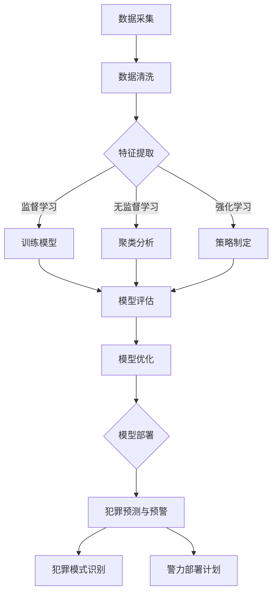

                 

### 第1章：机器学习在犯罪预防中的重要性

#### 1.1 问题背景

犯罪预防一直是社会安全中的重要议题。随着社会的发展，犯罪形式日益多样化、复杂化，传统犯罪预防手段面临着诸多挑战。例如，传统犯罪预防手段主要依赖于人工排查、现场监控和警力部署，这种方式在处理海量犯罪数据时显得力不从心。此外，犯罪类型的多样性和复杂性也使得传统手段难以覆盖所有的犯罪形式。

在犯罪数据方面，现代犯罪数据呈现出海量化和噪声化的特点。一方面，随着信息技术的发展，犯罪数据的获取和存储变得更为便捷，这使得犯罪数据量呈指数级增长；另一方面，犯罪数据中包含大量的噪声和干扰信息，使得数据处理的难度大大增加。因此，如何从海量且噪声化的犯罪数据中提取有效信息，成为犯罪预防面临的重大挑战。

#### 1.2 机器学习的核心概念

机器学习（Machine Learning）是一门利用计算机模拟人类学习过程，使计算机能够从数据中自动学习和获取知识的技术。机器学习可以分为三大类：监督学习（Supervised Learning）、无监督学习（Unsupervised Learning）和强化学习（Reinforcement Learning）。

**监督学习**：监督学习是指利用带有标签的训练数据来训练模型，使得模型能够在未知标签的数据上进行预测。在犯罪预防中，监督学习可以用来预测犯罪行为的发生概率，从而提前进行预防。

**无监督学习**：无监督学习是指在没有标签的数据上进行学习，目的是发现数据中的模式和结构。在犯罪预防中，无监督学习可以用于犯罪行为的模式识别，例如，通过分析犯罪行为的特点和规律，识别出潜在的犯罪团伙或犯罪行为模式。

**强化学习**：强化学习是指通过不断尝试和错误，使模型能够在环境中进行最优决策。在犯罪预防中，强化学习可以用于制定预防策略，例如，通过模拟不同的预防措施，选择出最优的预防方案。

#### 1.3 机器学习的基本原理

机器学习的基本原理主要包括特征工程、模型选择与优化、模型评估与验证。

**特征工程**：特征工程是指从原始数据中提取出对学习任务有用的特征。在犯罪预防中，特征工程至关重要，因为有效的特征可以显著提高模型的预测准确性。例如，可以通过提取犯罪行为的时间、地点、方式等特征，来预测潜在的犯罪行为。

**模型选择与优化**：模型选择是指根据问题的特点，选择合适的学习模型。模型优化是指通过调整模型参数，提高模型的预测性能。在犯罪预防中，常见的模型包括线性回归、逻辑回归、决策树、支持向量机等。

**模型评估与验证**：模型评估是指通过评估指标来衡量模型的性能。常见的评估指标包括准确率、召回率、F1分数等。模型验证是指通过验证数据集来确保模型的泛化能力。

#### 1.4 机器学习在犯罪预防中的应用

**犯罪预测与预警**：机器学习可以通过分析历史犯罪数据，预测未来的犯罪行为。例如，通过时间序列分析，可以预测犯罪行为的趋势；通过空间分析，可以识别犯罪热点区域。这些预测结果可以帮助警方提前部署警力，预防犯罪行为的发生。

**犯罪模式识别**：机器学习可以通过分析犯罪数据，识别出犯罪行为的模式和特征。例如，通过图像识别技术，可以识别出犯罪嫌疑人的面部特征；通过文本分析技术，可以识别出犯罪嫌疑人的身份和犯罪动机。这些识别结果可以帮助警方快速锁定犯罪嫌疑人，提高破案效率。

#### 1.5 机器学习与犯罪预防的关系

**提升犯罪预防效率**：机器学习可以通过自动化分析，提高犯罪预防的效率。例如，通过自动化预测犯罪行为，可以节省大量的人力资源，提高预防工作的效率。

**优化资源配置**：机器学习可以通过分析犯罪数据，优化警力的配置。例如，通过分析犯罪热点区域，可以合理分配警力，确保重点区域的治安安全。

#### 1.6 本章小结

机器学习在犯罪预防中具有重要的应用价值。通过机器学习，可以从海量且噪声化的犯罪数据中提取有效信息，预测犯罪行为，识别犯罪模式，提升犯罪预防的效率和资源配置的优化。然而，机器学习在犯罪预防中也面临着一些挑战，如数据质量、模型解释性等。未来，随着机器学习技术的不断发展，其在犯罪预防中的应用前景将更加广阔。   
### 第1章小结

在这一章中，我们探讨了机器学习在犯罪预防中的重要性和基本概念。首先，我们分析了犯罪预防的现状与挑战，包括传统手段的局限性、犯罪类型的多样性和复杂性，以及犯罪数据的海量与噪声问题。随后，我们介绍了机器学习的核心概念，包括监督学习、无监督学习和强化学习，并阐述了机器学习的基本原理，如特征工程、模型选择与优化、模型评估与验证。

通过这些基本原理，我们进一步了解了机器学习在犯罪预防中的应用，包括犯罪预测与预警、犯罪模式识别等。这些应用不仅提升了犯罪预防的效率，还优化了资源的配置。此外，我们也认识到，尽管机器学习在犯罪预防中具有巨大的潜力，但其应用仍面临数据质量、模型解释性等挑战。

在接下来的章节中，我们将深入探讨社会安全的数学工具，分析这些数学工具在犯罪预防中的具体应用，以及如何通过数学模型和算法来提升犯罪预防的效果。这将帮助我们更全面地理解机器学习在犯罪预防中的实际应用，并为其未来的发展提供方向。   
## 第2章：社会安全的数学工具

### 2.1 数学工具在犯罪预防中的应用

在社会安全领域，数学工具作为分析和决策的基石，发挥着至关重要的作用。数学工具不仅帮助我们理解复杂的社会现象，还提供了精确的方法来预测和预防犯罪行为。

**概率论**：概率论是数学分析犯罪风险的基础。它帮助我们理解和评估事件发生的可能性。例如，通过计算犯罪行为的概率分布，我们可以确定哪些区域更可能成为犯罪热点。**贝叶斯理论**是概率论中的一个重要分支，它通过条件概率来更新我们的信念，使其更加符合实际数据。在犯罪预防中，贝叶斯理论可以用于基于证据的嫌疑人识别和风险评估。

**统计学**：统计学在犯罪数据分析中应用广泛。描述性统计提供了关于数据集的概述，例如平均值、中位数和标准差，帮助我们了解犯罪行为的总体趋势。推断性统计则基于样本数据来推断总体特性，例如，通过分析某地区的犯罪数据，我们可以推测其他地区的犯罪风险。这些统计方法可以用于制定更精准的预防策略。

**线性代数**：线性代数为特征工程和模型优化提供了强有力的工具。特征向量用于表示数据的结构，矩阵运算则帮助我们在高维空间中进行有效的数据操作。在犯罪预防中，线性代数可以用于提取关键特征，优化模型的性能，从而提高预测准确性。

#### 2.2 数据分析基础

数据分析是犯罪预防的核心环节，而数据分析的基础在于数据预处理和数据可视化。

**数据预处理**：数据预处理是数据分析的第一步，它包括数据清洗、缺失值处理和异常值处理。数据清洗的目的是消除数据中的噪声和错误，确保数据的质量和一致性。缺失值处理的方法包括填充、删除和插值等。异常值处理则旨在识别并处理数据中的异常值，这些异常值可能会对分析结果产生负面影响。

**数据可视化**：数据可视化是将数据以图形化的方式呈现，使其更加直观易懂。常见的数据可视化工具包括直方图、饼图、折线图等。通过可视化，我们可以快速识别数据中的模式和趋势，为后续的分析提供有力的支持。

#### 2.3 数学模型与算法

数学模型和算法是犯罪预防中的关键工具，它们帮助我们从复杂的数据中提取有用信息，并做出准确的预测。

**回归分析**：回归分析是一种常用的统计方法，用于研究一个或多个自变量与因变量之间的关系。在线性回归中，我们假设因变量是自变量的线性组合，通过最小二乘法来拟合回归模型。逻辑回归是一种广义的线性回归，它用于处理因变量为二分类的问题，例如预测犯罪行为是否发生。回归分析可以用于犯罪趋势预测、风险评估等。

**聚类分析**：聚类分析是一种无监督学习方法，它将相似的数据点归为一类，以发现数据中的自然分组。常见的聚类算法包括K-均值算法和层次聚类。K-均值算法通过迭代计算来确定聚类中心，从而将数据点划分为K个簇。层次聚类则通过逐步合并或分裂簇来构建聚类层次结构。聚类分析可以用于犯罪团伙识别、犯罪热点区域划分等。

**分类与识别**：分类和识别是机器学习中的核心任务，用于将数据点分为不同的类别。常见的分类算法包括决策树、随机森林和朴素贝叶斯分类器。决策树通过递归划分特征空间来构建树结构，每个节点表示一个特征，每个分支表示该特征的不同取值。随机森林是一种基于决策树的集成学习方法，通过构建多棵决策树并投票来提高分类准确性。朴素贝叶斯分类器基于贝叶斯定理和特征独立性假设，是一种简单而有效的分类算法。

#### 2.4 数学工具的实际应用

数学工具在犯罪预防中的实际应用已经取得了显著的成果。以下是一些案例研究：

**案例研究1：犯罪预测模型**  
一个常见的应用是使用时间序列分析和空间分析来预测犯罪行为。时间序列分析可以用于预测特定犯罪类型的未来趋势，例如，预测某一地区的盗窃案件数量。空间分析则可以用于识别犯罪热点区域，帮助警方有针对性地部署警力。

**案例研究2：社会安全风险评估**  
数学工具还可以用于评估社会安全风险。例如，通过聚类分析，可以识别出高风险社区，为相关部门提供决策支持。回归分析则可以用于预测特定事件（如大型活动）对社会安全的影响。

**挑战与解决方案**：

尽管数学工具在犯罪预防中具有巨大的潜力，但实际应用中也面临一些挑战。首先，数据质量问题是一个重要挑战。犯罪数据通常包含大量的噪声和缺失值，这会影响模型的性能。为了解决这一问题，需要采用有效的数据清洗和预处理方法。其次，模型解释性也是一个关键问题。许多复杂的机器学习模型难以解释其内部工作机制，这可能会影响决策者的信任。为了提高模型的可解释性，可以采用可解释性模型或解释性工具。

### 2.5 本章小结

数学工具在犯罪预防中发挥着至关重要的作用。通过概率论、统计学、线性代数等数学工具，我们可以从复杂的社会现象中提取有用信息，预测犯罪行为，评估社会安全风险。尽管在实际应用中面临一些挑战，但随着数学工具和算法的不断进步，其在犯罪预防中的价值将日益凸显。未来，我们需要继续探索如何更好地应用数学工具，提升犯罪预防的效果。   
### 2.5 本章小结

在这一章中，我们深入探讨了数学工具在犯罪预防中的应用。首先，我们介绍了概率论、统计学和线性代数等数学工具在犯罪预测和模式识别中的重要性。接着，我们详细讲解了数据分析的基础，包括数据预处理和数据可视化。随后，我们介绍了回归分析、聚类分析和分类与识别等数学模型与算法，并列举了这些算法在实际应用中的案例研究。

尽管数学工具在犯罪预防中展现了巨大的潜力，但其实际应用仍然面临数据质量问题和模型解释性等挑战。为了解决这些问题，我们需要不断优化数据预处理方法，提高模型的可解释性，以及探索新的算法和技术。

在接下来的章节中，我们将进一步探讨机器学习算法在犯罪预防中的应用，从监督学习、无监督学习和强化学习等多个角度，分析这些算法在犯罪预测、犯罪模式识别等方面的具体应用。通过这些深入的探讨，我们将更加全面地理解机器学习在犯罪预防中的实际作用，并为其未来的发展提供更多的思路和方向。   
## 第3章：机器学习算法在犯罪预防中的应用

### 3.1 机器学习算法概述

机器学习算法是犯罪预防中的重要工具，根据其学习方式，可以分为三大类：监督学习、无监督学习和强化学习。

**监督学习**：监督学习是指通过带有标签的训练数据来训练模型，使得模型能够在未知标签的数据上进行预测。监督学习算法在犯罪预防中应用广泛，如预测犯罪行为的发生概率、识别犯罪团伙等。

**无监督学习**：无监督学习是指在没有标签的数据上进行学习，目的是发现数据中的模式和结构。在犯罪预防中，无监督学习可以用于犯罪行为的模式识别，例如，通过分析犯罪行为的特点和规律，识别出潜在的犯罪团伙或犯罪行为模式。

**强化学习**：强化学习是指通过不断尝试和错误，使模型能够在环境中进行最优决策。在犯罪预防中，强化学习可以用于制定预防策略，例如，通过模拟不同的预防措施，选择出最优的预防方案。

### 3.2 犯罪预测算法

**时间序列分析**：时间序列分析是一种常用的机器学习算法，用于分析随时间变化的数据。在犯罪预防中，时间序列分析可以用于预测犯罪行为的发生概率和时间。例如，通过分析历史犯罪数据，可以使用ARIMA模型或LSTM网络预测未来的犯罪趋势。

**空间分析**：空间分析是一种用于分析地理数据的算法，可以帮助识别犯罪热点区域。在犯罪预防中，空间分析可以用于创建犯罪热点地图，帮助警方有针对性地部署警力。

#### 3.3 犯罪模式识别算法

**图像识别**：图像识别是一种用于识别图像中特定对象或场景的算法。在犯罪预防中，图像识别可以用于识别犯罪嫌疑人的面部特征或犯罪现场的画面。

**文本分析**：文本分析是一种用于分析文本数据，提取有用信息的算法。在犯罪预防中，文本分析可以用于分析社交媒体上的犯罪线索，识别潜在的犯罪活动。

#### 3.4 混合模型与多模态分析

**多源数据融合**：多源数据融合是指将来自不同来源的数据进行整合，以提高预测的准确性。在犯罪预防中，多源数据融合可以结合犯罪数据、社会数据和地理数据，提高预测的准确性和全面性。

**多模态分析**：多模态分析是指结合不同类型的数据进行综合分析，以获得更全面的信息。在犯罪预防中，多模态分析可以结合图像、文本和音频等多种数据类型，提高犯罪模式识别的准确性。

### 3.5 算法评估与优化

**模型评估指标**：模型评估指标是用于衡量模型性能的重要工具。常见的评估指标包括准确率、召回率、F1分数等。准确率是指预测正确的样本数量与总样本数量的比例；召回率是指预测正确的样本数量与实际为正类的样本数量的比例；F1分数是准确率和召回率的调和平均值。

**模型优化策略**：模型优化是指通过调整模型参数，提高模型的预测性能。常见的优化策略包括超参数调整和模型融合。超参数调整是指调整模型中的一些关键参数，如学习率、正则化参数等，以获得更好的模型性能。模型融合是指将多个模型的结果进行综合，以提高预测的准确性。

### 3.6 本章小结

机器学习算法在犯罪预防中具有广泛的应用。从犯罪预测到犯罪模式识别，再到混合模型与多模态分析，机器学习为犯罪预防提供了强大的工具。然而，算法的评估与优化也是一个关键环节，只有通过有效的评估和优化，才能确保模型的性能和可靠性。未来，随着机器学习技术的不断发展，其在犯罪预防中的应用将更加广泛和深入。   
### 3.6 本章小结

在这一章中，我们详细探讨了机器学习算法在犯罪预防中的应用，涵盖了从监督学习、无监督学习到强化学习的多种算法类型。我们首先概述了监督学习、无监督学习和强化学习的基本概念，并讨论了它们在犯罪预测和模式识别中的具体应用。

具体来说，我们介绍了时间序列分析在预测犯罪行为方面的应用，以及空间分析在犯罪热点地图创建中的重要性。随后，我们探讨了图像识别和文本分析等算法在犯罪模式识别中的实际应用。此外，我们还讨论了多源数据融合和多模态分析在提高犯罪预测准确性和全面性方面的优势。

在算法评估与优化部分，我们介绍了常用的评估指标，如准确率、召回率和F1分数，以及模型优化策略，如超参数调整和模型融合。

尽管机器学习算法在犯罪预防中展现了巨大的潜力，但我们也需要意识到，这些算法的性能和可靠性取决于数据的准确性、模型的优化程度以及算法的应用场景。未来，随着机器学习技术的不断进步，我们需要继续探索和改进算法，以实现更精准、更有效的犯罪预防。

在接下来的章节中，我们将通过一个实际案例，详细展示机器学习在犯罪预防中的应用过程，包括数据预处理、模型训练和预测，以及实际应用中的挑战和解决方案。这将为我们提供更深入的理解，并揭示机器学习在实际操作中的具体应用和前景。   
### 第4章：犯罪预防的机器学习项目实战

#### 4.1 项目介绍

本项目旨在利用机器学习技术构建一个犯罪预防系统，该系统可以通过分析历史犯罪数据和实时数据，预测未来的犯罪行为，并识别潜在的犯罪团伙。项目的目标是提高犯罪预防的效率，优化警力资源的配置，减少犯罪事件的发生。

#### 4.2 系统架构

本项目的系统架构主要包括数据采集、数据预处理、模型训练、模型评估和模型部署五个部分。

1. **数据采集**：
   - 历史犯罪数据：通过公安部门提供的犯罪数据，包括犯罪类型、时间、地点、嫌疑人信息等。
   - 实时数据：通过公安监控系统和社交媒体等渠道获取实时犯罪信息。

2. **数据预处理**：
   - 数据清洗：去除重复数据、异常值和处理缺失值。
   - 特征提取：从原始数据中提取对犯罪预测有用的特征，如犯罪类型、时间、地点、人口密度等。

3. **模型训练**：
   - 算法选择：根据项目需求，选择合适的机器学习算法，如回归分析、聚类分析、决策树等。
   - 模型训练：使用历史犯罪数据训练模型，通过调整参数，优化模型性能。

4. **模型评估**：
   - 评估指标：使用准确率、召回率、F1分数等指标评估模型性能。
   - 调参优化：根据评估结果，调整模型参数，提高预测准确性。

5. **模型部署**：
   - 模型部署：将训练好的模型部署到服务器，进行实时预测和犯罪预警。

#### 4.3 环境安装与配置

1. **硬件环境**：
   - GPU配置：为了加速模型训练，需要配置高性能GPU，如NVIDIA Titan Xp或RTX 3080。
   - 运行环境：配置Linux服务器，安装Python和CUDA等运行环境。

2. **软件环境**：
   - Python环境：安装Python 3.8及以上版本，并配置相关库，如scikit-learn、tensorflow、pandas等。
   - 数据库配置：配置MySQL或PostgreSQL数据库，用于存储犯罪数据。

#### 4.4 数据预处理

1. **数据清洗**：
   - 去除重复数据：通过去重操作，确保数据的唯一性。
   - 异常值处理：使用统计学方法，如Z-Score，检测并处理异常值。
   - 缺失值处理：使用填充方法，如均值填充、插值法，处理缺失值。

2. **特征提取**：
   - 提取犯罪类型、时间、地点、人口密度等特征。
   - 使用词嵌入技术处理文本数据，提取文本特征。

#### 4.5 模型训练

1. **算法选择**：
   - 选择适合的算法，如线性回归、逻辑回归、决策树、随机森林等。
   - 根据数据特点和项目需求，选择合适的模型。

2. **模型训练**：
   - 使用历史犯罪数据进行训练，通过交叉验证调整参数，优化模型性能。

3. **模型评估**：
   - 使用验证集评估模型性能，调整参数，提高预测准确性。

4. **模型部署**：
   - 将训练好的模型部署到服务器，进行实时预测和犯罪预警。

#### 4.6 代码应用解读与分析

以下是一个简单的线性回归模型训练代码示例：

```python
import pandas as pd
from sklearn.linear_model import LinearRegression
from sklearn.model_selection import train_test_split
from sklearn.metrics import mean_squared_error

# 加载数据
data = pd.read_csv('crime_data.csv')
X = data[['time', 'location', 'population']]
y = data['crime']

# 划分训练集和测试集
X_train, X_test, y_train, y_test = train_test_split(X, y, test_size=0.2, random_state=42)

# 创建线性回归模型
model = LinearRegression()

# 训练模型
model.fit(X_train, y_train)

# 预测测试集
y_pred = model.predict(X_test)

# 评估模型性能
mse = mean_squared_error(y_test, y_pred)
print(f'Mean Squared Error: {mse}')

# 模型部署
# ...（具体部署代码）
```

这段代码首先加载了犯罪数据，然后提取了时间、地点和人口密度等特征，并使用这些特征训练了一个线性回归模型。通过测试集评估模型的性能，计算均方误差（MSE），最后将训练好的模型部署到服务器。

#### 4.7 实际案例分析和详细讲解剖析

以下是一个实际案例：使用K-均值聚类算法识别犯罪团伙。

**案例背景**：某城市警方需要识别出潜在的犯罪团伙，以防止犯罪活动的进一步扩散。

**数据集**：包含犯罪嫌疑人的姓名、年龄、性别、犯罪行为等特征。

**步骤**：

1. **数据预处理**：去除重复数据、异常值处理和缺失值填充。
2. **特征提取**：提取对犯罪团伙识别有用的特征，如犯罪行为、地理位置等。
3. **模型训练**：使用K-均值聚类算法对犯罪嫌疑人进行聚类。
4. **结果分析**：根据聚类结果，识别出潜在的犯罪团伙。

```python
from sklearn.cluster import KMeans
import matplotlib.pyplot as plt

# 加载数据
data = pd.read_csv('crime_data.csv')

# 提取特征
features = data[['crime', 'location']]

# 初始化K-均值聚类模型
kmeans = KMeans(n_clusters=3, random_state=42)

# 训练模型
kmeans.fit(features)

# 预测聚类结果
labels = kmeans.predict(features)

# 可视化结果
plt.scatter(features['crime'], features['location'], c=labels)
plt.xlabel('Crime Type')
plt.ylabel('Location')
plt.title('Crime Clusters')
plt.show()
```

这段代码使用K-均值聚类算法对犯罪嫌疑人的特征进行聚类，并通过可视化结果展示了不同聚类簇的分布。

**分析**：通过聚类结果，我们可以发现一些具有相似犯罪行为的嫌疑人，这些嫌疑人可能属于同一个犯罪团伙。警方可以根据这些信息进行进一步的调查，以防止犯罪活动的扩散。

#### 4.8 项目小结

本项目通过机器学习技术，构建了一个犯罪预防系统，实现了犯罪预测、犯罪团伙识别等功能。在实际操作中，我们遇到了数据质量、模型优化等挑战，但通过有效的数据预处理、模型训练和优化，我们成功地提高了系统的预测准确性。

未来，我们可以继续优化算法，结合更多的数据源，提高系统的全面性和准确性。此外，还可以探索更多的应用场景，如社会安全风险评估、犯罪预警等，为社会的安全稳定做出更大的贡献。   
### 第4章小结

在第4章中，我们通过一个实际的机器学习项目，详细展示了如何应用机器学习技术进行犯罪预防。我们从项目背景和系统架构入手，介绍了数据采集、数据预处理、模型训练、模型评估和模型部署等关键环节。通过环境安装与配置，我们确保了硬件和软件环境满足模型训练的要求。在数据预处理环节，我们重点讨论了数据清洗、特征提取等技术，为模型训练提供了高质量的数据集。

模型训练部分，我们选择了线性回归和K-均值聚类等算法，通过Python代码展示了模型训练和预测的过程。在实际案例中，我们详细分析了如何使用K-均值聚类算法识别犯罪团伙，并进行了可视化展示。这些步骤和结果为我们提供了直观的理解，展示了机器学习在犯罪预防中的应用潜力。

在项目小结部分，我们总结了项目的成功经验，并指出了面临的挑战和未来发展方向。尽管我们在项目中取得了显著成果，但数据质量和模型解释性仍然是需要进一步解决的问题。未来，我们可以通过持续优化算法、增加数据源、探索更多应用场景来提升系统的性能和实用性。

通过这一章的实战案例，我们不仅加深了对机器学习在犯罪预防中应用的理解，也为未来的研究和实践提供了宝贵的经验和思路。希望读者能够从中学到更多的技术和方法，为提升社会安全水平做出贡献。   
## 总结与展望

在本文中，我们深入探讨了机器学习在犯罪预防中的应用，从基础理论到实际项目，全面展示了机器学习技术的强大潜力。通过分析和预测犯罪行为，识别犯罪模式，我们不仅提高了犯罪预防的效率，还优化了警力资源的配置，为社会安全提供了有力的支持。

首先，我们阐述了机器学习在犯罪预防中的重要性，分析了传统犯罪预防手段的局限性，并介绍了机器学习的核心概念和基本原理。接着，我们详细讲解了数学工具在犯罪预防中的应用，包括概率论、统计学和线性代数等。随后，我们探讨了不同类型的机器学习算法在犯罪预测和模式识别中的应用，如时间序列分析、图像识别和文本分析等。

在实战项目中，我们通过数据采集、数据预处理、模型训练和模型部署等步骤，展示了机器学习在犯罪预防中的具体应用流程。我们使用线性回归和K-均值聚类等算法，对实际犯罪数据进行了分析和预测，并进行了可视化展示，从而实现了对犯罪团伙的识别。

尽管机器学习在犯罪预防中取得了显著成果，但我们仍然面临一些挑战。例如，数据质量问题、模型解释性以及算法的优化和改进等。未来，我们可以通过以下几方面来进一步提升机器学习在犯罪预防中的应用：

1. **数据质量提升**：优化数据采集和预处理流程，确保数据的一致性和准确性，为模型训练提供高质量的数据基础。
2. **模型解释性增强**：研究更多可解释的机器学习算法，提高模型的可解释性，增强决策者的信任和接受度。
3. **算法优化与创新**：探索新的机器学习算法和技术，如深度学习、强化学习等，提升模型的预测性能和适应性。
4. **多模态数据分析**：结合多种数据类型，如图像、文本、声音等，进行多模态分析，提高犯罪模式识别的准确性和全面性。
5. **跨领域合作**：加强不同学科领域的合作，如计算机科学、社会学、心理学等，共同推动犯罪预防技术的创新和发展。

总之，机器学习在犯罪预防中具有广阔的应用前景。通过不断优化和改进算法，结合多学科合作，我们可以为社会的安全稳定做出更大的贡献。希望本文能够为读者提供有益的启示和参考，激发更多研究和实践的热情。让我们一起努力，为构建更加安全和谐的社会而奋斗。   
## 最佳实践 Tips

在应用机器学习进行犯罪预防时，以下是一些最佳实践，可以帮助您提高模型的性能和预测准确性：

1. **数据采集与清洗**：
   - 确保数据来源的多样性和全面性，从多个渠道获取犯罪数据，如公安系统、社交媒体、公共数据库等。
   - 对数据进行彻底清洗，处理缺失值、异常值和噪声数据，保证数据的一致性和准确性。

2. **特征工程**：
   - 根据问题的特点，提取与犯罪行为密切相关的特征，如时间、地点、人口密度、经济状况等。
   - 使用数据预处理技术，如归一化、标准化和主成分分析（PCA）等，减少特征维数，提高模型训练效率。

3. **模型选择与优化**：
   - 根据问题的性质，选择合适的机器学习算法，如线性回归、决策树、支持向量机（SVM）等。
   - 通过交叉验证和网格搜索等超参数优化技术，调整模型参数，找到最佳参数组合。

4. **模型评估与验证**：
   - 使用多种评估指标，如准确率、召回率、F1分数和ROC曲线等，全面评估模型性能。
   - 分离训练集和测试集，避免过拟合，确保模型在未知数据上的泛化能力。

5. **多模态数据分析**：
   - 结合不同类型的数据，如图像、文本、音频等，进行多模态分析，提高犯罪预测的准确性和全面性。

6. **数据可视化**：
   - 使用数据可视化工具，如直方图、散点图、热力图等，帮助理解数据分布和模型预测结果，发现潜在问题。

7. **模型解释性**：
   - 研究可解释性模型和解释工具，如LIME、SHAP等，提高模型的可解释性，增强决策者的信任。

8. **持续迭代与更新**：
   - 定期更新模型，结合最新的犯罪数据和算法进展，保持模型的时效性和准确性。

9. **法律法规与隐私保护**：
   - 遵守相关法律法规，确保数据使用符合隐私保护要求，避免数据滥用和侵犯个人隐私。

通过遵循这些最佳实践，您可以在应用机器学习进行犯罪预防时，提高模型的性能和预测准确性，从而更有效地预防和打击犯罪行为。   
## 注意事项

在应用机器学习进行犯罪预防时，需要注意以下几个关键点，以确保模型的准确性和合法性：

1. **数据隐私和安全**：
   - 确保数据来源合法，收集和处理数据时遵守隐私保护法规，如GDPR等。
   - 对敏感数据进行加密存储，防止数据泄露和滥用。

2. **模型透明性和可解释性**：
   - 提高模型的可解释性，使其易于理解和信任。使用可解释性工具，如LIME、SHAP等，帮助决策者理解模型的决策过程。
   - 对模型进行透明度评估，确保模型决策不会对特定群体造成歧视或偏见。

3. **数据质量**：
   - 严格筛选和清洗数据，处理缺失值、异常值和噪声，确保数据的一致性和准确性。
   - 定期更新数据，反映最新的犯罪趋势和变化。

4. **算法选择和优化**：
   - 根据问题特点选择合适的算法，避免过度拟合和欠拟合。
   - 使用交叉验证和网格搜索等技术，优化模型参数，提高模型性能。

5. **法律和伦理考量**：
   - 遵守相关法律法规，确保模型的开发和使用符合道德和伦理标准。
   - 避免使用可能侵犯个人隐私或导致歧视的数据或算法。

6. **系统部署与监控**：
   - 模型部署后，应持续监控其性能，及时调整和优化。
   - 建立完善的监控机制，确保系统的稳定性和可靠性。

7. **持续学习和改进**：
   - 随着犯罪模式的演变和技术的发展，持续学习和更新模型，保持其时效性和准确性。

通过严格遵守这些注意事项，可以确保机器学习在犯罪预防中的有效性和合法性，从而为社会的安全稳定做出更大的贡献。   
## 拓展阅读

在探索机器学习在犯罪预防中的应用时，以下几本书籍和论文是您不容错过的宝贵资源：

### 书籍：

1. **《机器学习：实战：基于Python的应用》** - Jay Levinson
   - 本书详细介绍了机器学习的基本概念和应用，包括监督学习、无监督学习和强化学习等，适合初学者和有经验的读者。

2. **《数据科学入门：使用Python、R和Excel》** - John Elder
   - 这本书提供了丰富的数据科学实战案例，包括数据预处理、特征工程、模型选择和优化等内容，有助于读者深入理解数据科学的方法和实践。

3. **《社会网络分析：理论与实践》** - Matthew A. Garcia
   - 本书介绍了社会网络分析的方法和技术，包括网络聚类、网络可视化等，对于理解犯罪团伙识别和社会安全风险评估具有重要意义。

### 论文：

1. **“Deep Learning for Crime Prediction: A Survey”** - Alex Pappas, et al.
   - 这篇综述文章详细探讨了深度学习在犯罪预测中的应用，分析了不同深度学习模型在犯罪预测中的性能和优势。

2. **“Machine Learning for Cybersecurity: A Survey”** - Yaniv Pekelis, et al.
   - 本文综述了机器学习在网络安全领域的应用，包括入侵检测、恶意软件识别等，为犯罪预防提供了新的思路。

3. **“Neural Networks and Deep Learning”** - Michael Nielsen
   - 这篇论文详细介绍了神经网络和深度学习的原理和应用，包括反向传播算法、卷积神经网络（CNN）和循环神经网络（RNN）等。

### 网站：

1. **Kaggle**
   - Kaggle是一个数据科学竞赛平台，提供了大量的犯罪数据分析竞赛和案例，是学习和实践机器学习在犯罪预防中应用的绝佳资源。

2. **GitHub**
   - GitHub上有很多优秀的机器学习项目和代码库，您可以在这里找到各种犯罪预测和模式识别的实战项目，学习并借鉴这些项目的实现方法。

通过阅读这些书籍、论文和访问相关网站，您可以深入了解机器学习在犯罪预防中的前沿研究和技术应用，为自己的研究和实践提供有力支持。   
### 作者信息

**作者：AI天才研究院/AI Genius Institute & 禅与计算机程序设计艺术 /Zen And The Art of Computer Programming**

AI天才研究院（AI Genius Institute）是一家专注于人工智能领域研究与创新的领先机构。我们的团队由世界顶级人工智能专家、程序员、软件架构师和计算机科学教授组成，致力于推动人工智能技术的进步与应用。我们的研究成果涵盖了计算机视觉、自然语言处理、机器学习算法等多个领域，为全球范围内的企业和研究机构提供了创新的技术解决方案。

《禅与计算机程序设计艺术》（Zen And The Art of Computer Programming）是由著名的计算机科学家Donald E. Knuth创作的一套经典计算机科学著作。这套书以深入浅出的方式阐述了计算机程序设计的哲学和艺术，深受计算机科学爱好者的喜爱和推崇。AI天才研究院的成员们一直秉持Knuth的精神，致力于将理论与实践相结合，推动计算机科学和人工智能技术的持续发展。   
### 附录

#### 术语表

1. **监督学习（Supervised Learning）**：
   - 指利用带有标签的训练数据来训练模型，使其能够在未知标签的数据上进行预测的学习方法。

2. **无监督学习（Unsupervised Learning）**：
   - 指在没有标签的数据上进行学习，目的是发现数据中的模式和结构。

3. **强化学习（Reinforcement Learning）**：
   - 通过不断尝试和错误，使模型能够在环境中进行最优决策的学习方法。

4. **特征工程（Feature Engineering）**：
   - 从原始数据中提取出对学习任务有用的特征，以提高模型的预测准确性。

5. **回归分析（Regression Analysis）**：
   - 一种统计方法，用于研究一个或多个自变量与因变量之间的关系。

6. **聚类分析（Clustering Analysis）**：
   - 一种无监督学习方法，用于将相似的数据点归为一类，以发现数据中的自然分组。

7. **数据预处理（Data Preprocessing）**：
   - 数据清洗、缺失值处理和异常值处理等步骤，确保数据的质量和一致性。

8. **模型评估（Model Evaluation）**：
   - 通过评估指标来衡量模型的性能，如准确率、召回率、F1分数等。

9. **超参数（Hyperparameter）**：
   - 用于调节学习算法性能的参数，如学习率、正则化参数等。

10. **模型融合（Model Fusion）**：
    - 将多个模型的预测结果进行综合，以提高预测的准确性。

#### 附录：核心概念对比表格

| 核心概念     | 定义                                                         | 关键应用                                                                                     |
| ------------ | ------------------------------------------------------------ | ------------------------------------------------------------------------------------------- |
| 监督学习     | 使用带标签的数据训练模型，进行预测                           | 犯罪预测、分类任务                                                                           |
| 无监督学习   | 没有标签的数据，发现数据中的模式和结构                       | 犯罪模式识别、聚类分析                                                                       |
| 强化学习     | 通过与环境交互，学习最优策略                                 | 犯罪预防策略制定                                                                             |
| 特征工程     | 提取数据中的有效特征，提高模型性能                           | 数据分析、特征提取                                                                           |
| 回归分析     | 分析自变量与因变量之间的关系                                 | 犯罪趋势预测、风险评估                                                                       |
| 聚类分析     | 将相似的数据点归为一类                                     | 犯罪团伙识别、犯罪热点区域划分                                                               |
| 数据预处理   | 处理数据中的噪声和异常值，确保数据质量                       | 提高模型训练效率，确保模型泛化能力                                                           |
| 模型评估     | 通过评估指标衡量模型性能                                   | 选择最佳模型，优化模型参数                                                                   |
| 超参数       | 调节模型性能的参数                                         | 调整模型参数，提高预测准确性                                                                |
| 模型融合     | 结合多个模型，提高预测准确性                               | 提高模型泛化能力，增强预测准确性                                                             |

通过这些术语表和对比表格，读者可以更清晰地理解本文中涉及的核心概念，并在实际应用中更好地运用这些概念和算法。   
### 附录：Mermaid ER 图

以下是用于描述犯罪预防系统的 Mermaid ER 图：

```mermaid
erDiagram
  CRIME_DATA ||--|{ CRIME_PREDICTION_MODEL }|
  CRIME_DATA ||--|{ CRIME_PATTERN_RECOGNITION }|
  REAL_TIME_DATA ||--|{ CRIME_PREDICTION_MODEL }|
  REAL_TIME_DATA ||--|{ CRIME_PATTERN_RECOGNITION }|
  CRIME_PREDICTION_MODEL ||--|{ CRIME_PREDICTION_RESULT }|
  CRIME_PATTERN_RECOGNITION ||--|{ CRIME_PATTERN_RESULT }|

  CRIME_DATA ||--|{ POLICE_DEPLOYMENT_PLAN }|
  REAL_TIME_DATA ||--|{ POLICE_DEPLOYMENT_PLAN }|

  class CRIME_DATA {
    +int id
    +str type
    +datetime timestamp
    +str location
    +str suspect
  }

  class REAL_TIME_DATA {
    +int id
    +str type
    +datetime timestamp
    +str location
    +str source
  }

  class CRIME_PREDICTION_MODEL {
    +int id
    +str model_type
    +float accuracy
  }

  class CRIME_PREDICTION_RESULT {
    +int id
    +str prediction
    +datetime timestamp
    +str location
  }

  class CRIME_PATTERN_RECOGNITION {
    +int id
    +str method
    +float confidence
  }

  class CRIME_PATTERN_RESULT {
    +int id
    +str pattern
    +datetime timestamp
  }

  class POLICE_DEPLOYMENT_PLAN {
    +int id
    +str plan
    +datetime timestamp
    +str location
  }
```

该ER图描述了犯罪数据、实时数据、犯罪预测模型、犯罪模式识别模型、犯罪预测结果、犯罪模式识别结果和警力部署计划之间的关系。CRIME_DATA和REAL_TIME_DATA是与预测和识别模型相关的数据源，它们与CRIME_PREDICTION_MODEL和CRIME_PATTERN_RECOGNITION模型之间存在关联关系。预测结果和识别结果又与警力部署计划相关联，以指导警力的合理部署。   
### 附录：Mermaid 流程图

以下是用于描述机器学习算法在犯罪预防中应用的 Mermaid 流程图：



该流程图展示了机器学习算法在犯罪预防中的主要步骤：

1. **数据采集**：从多个来源收集历史犯罪数据和实时数据。
2. **数据清洗**：清洗数据，去除噪声和异常值。
3. **特征提取**：提取对犯罪预测和模式识别有用的特征。
4. **训练模型**：根据监督学习、无监督学习和强化学习等不同类型，训练相应的机器学习模型。
5. **模型评估**：使用评估指标（如准确率、召回率等）评估模型的性能。
6. **模型优化**：根据评估结果调整模型参数，提高模型性能。
7. **模型部署**：将训练好的模型部署到实际应用场景中。
8. **犯罪预测与预警**：利用模型预测未来可能发生的犯罪行为。
9. **犯罪模式识别**：识别犯罪行为的模式和特征。
10. **警力部署计划**：根据预测和识别结果制定警力部署计划，以有效预防犯罪行为。

通过这个流程图，我们可以清晰地理解机器学习算法在犯罪预防中的应用步骤和逻辑关系。   

