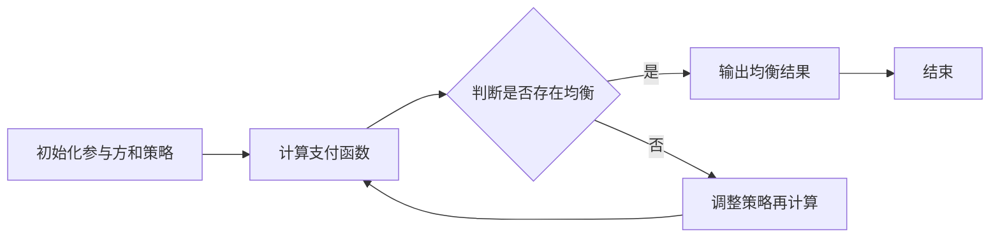
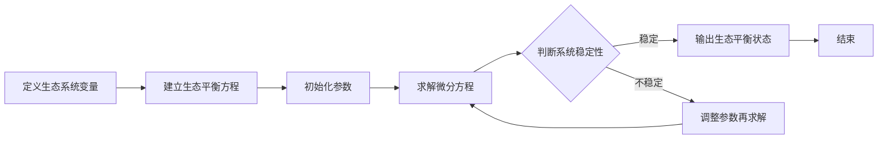
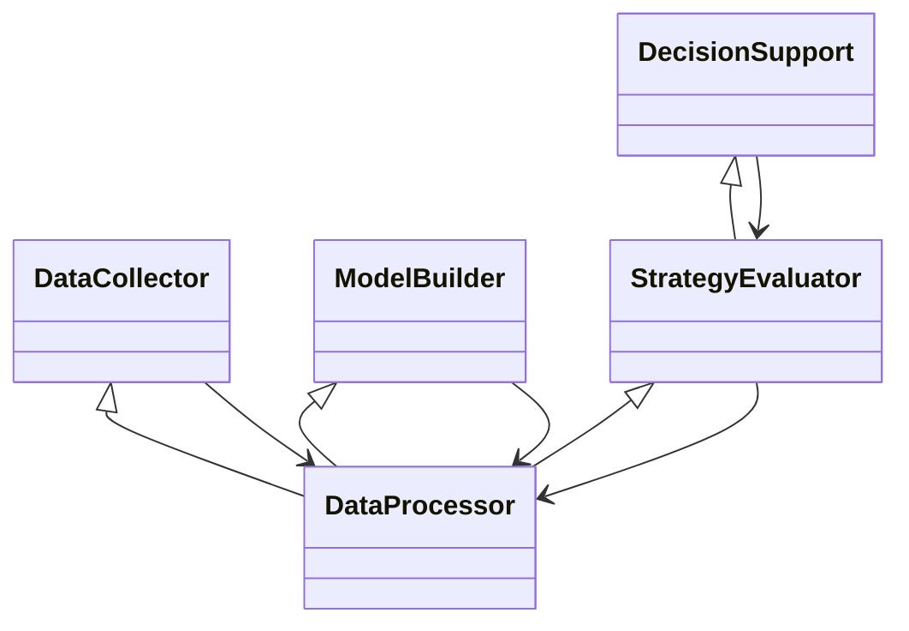

                 

根据您提供的目录大纲和要求，我将逐步为您构建《环境保护的博弈论：生态平衡的数学策略》的技术博客文章。以下是逐步思考和构建的内容概述。

### 步骤1：背景介绍

**1.1 问题背景**

- 描述全球环境污染的现状和生态危机的挑战。
- 介绍环境保护的重要性以及生态平衡的必要性。

**1.2 博弈论基本概念**

- 简要介绍博弈论的定义、发展历史及其核心概念。
- 阐述博弈论在环境保护中的应用潜力。

**1.3 生态平衡的数学策略**

- 阐述生态平衡的概念，评价方法和数学模型。
- 提出生态平衡数学策略对环境保护的意义。

**1.4 边界与外延**

- 探讨环境保护博弈论的适用范围。
- 分析不同环境问题下的博弈策略。

**1.5 概念结构与核心要素组成**

- 描述博弈论在环境保护中的核心概念。
- 分析生态平衡数学模型的构建方法。

### 步骤2：核心概念与联系

**2.1 核心概念原理**

- 详细讲解博弈论的定义、基本要素和分类。
- 解释生态平衡的概念、评价指标和数学模型。

**2.2 概念属性特征对比表格**

- 制作一个表格，比较博弈论模型的特点和应用场景。
- 对比不同生态平衡评价指标的计算方法与优缺点。

**2.3 ER实体关系图架构**

- 绘制环境保护博弈论中的主要实体与关系的ER图。
- 说明ER图的绘制方法并提供一个示例。

### 步骤3：算法原理讲解

**3.1 算法mermaid流程图**

- 使用mermaid绘制博弈论求解算法的流程图。
- 使用mermaid绘制生态平衡数学模型的求解流程图。

**3.2 Python源代码**

- 提供博弈论求解算法的Python代码实例。
- 提供生态平衡数学模型的Python代码实例。

**3.3 算法原理的数学模型和公式**

- 阐述博弈论的基本数学模型。
- 详细解释生态平衡的数学模型和公式。

**3.4 详细讲解与举例说明**

- 用具体案例说明博弈论的原理。
- 通过实际数据演示生态平衡数学模型的应用。

### 步骤4：系统分析与架构设计

**4.1 问题场景介绍**

- 介绍环境保护博弈论的应用场景。
- 阐述生态平衡数学策略的实施过程。

**4.2 系统功能设计**

- 提供系统功能模块划分的mermaid类图。
- 详细描述系统功能设计。

**4.3 系统架构设计**

- 提供系统架构的mermaid架构图。
- 阐述系统分层设计与关键模块。

**4.4 系统接口设计**

- 定义系统各模块的接口。
- 描述接口调用流程与数据流转。

**4.5 系统交互**

- 使用mermaid序列图展示系统各组件的交互逻辑。

### 步骤5：项目实战

**5.1 环境安装**

- 描述所需软件和工具的安装步骤。
- 讲解环境配置与调试。

**5.2 系统核心实现**

- 提供关键算法和数据处理的实现源代码。
- 分析代码结构与设计模式。

**5.3 代码应用解读**

- 解析源代码的功能。
- 阐述代码的设计思路和实现方法。

**5.4 实际案例分析与讲解**

- 分析实际环境问题。
- 讲解解决策略与应用效果。

**5.5 项目小结**

- 总结项目经验。
- 展望未来的研究方向。

### 步骤6：最佳实践与拓展阅读

**6.1 最佳实践 tips**

- 提供环境保护博弈论的实际应用技巧。
- 讲解生态平衡数学策略的实施要点。

**6.2 小结**

- 总结文章的核心观点与贡献。
- 探讨环境保护博弈论的未来发展趋势。

**6.3 注意事项**

- 讲解实施环境保护博弈论时需要注意的问题。
- 提醒避免生态平衡数学策略应用的误区。

**6.4 拓展阅读**

- 推荐相关的书籍和论文。
- 提供进一步学习环境保护博弈论的资源。

通过这些步骤，我们可以构建一篇结构清晰、内容丰富、逻辑严密的技术博客文章。现在，我们将开始具体的文章撰写工作，确保每个部分的内容都详尽且具有深度。在撰写过程中，我会遵循markdown格式和您提供的具体要求，确保文章的完整性和准确性。让我们开始撰写吧！### 步骤1：背景介绍

#### **1.1 问题背景**

**全球环境污染的现状与趋势**

随着工业化和城市化的迅速发展，全球范围内的环境污染问题愈发严重。大气污染、水污染、土壤污染等各类环境问题对人类健康和生态系统产生了深远影响。据世界卫生组织（WHO）统计，每年因环境污染导致的疾病死亡人数高达数百万。此外，气候变化加剧了极端天气事件的发生，如洪水、干旱和台风，进一步破坏了自然环境的平衡。

**生态平衡的重要性**

生态平衡是维持地球生态系统功能的关键。生态平衡指生物群落中各种生物之间及其与环境之间相互作用的稳定状态。这种平衡不仅关乎物种多样性，还影响到土壤肥力、水源涵养和气候调节等重要生态服务。当生态系统失衡时，可能导致物种灭绝、生物多样性减少，甚至引发连锁生态危机。

**环境保护的国际合作与法律框架**

为了应对全球性的环境问题，国际社会采取了多项合作举措和制定了相关法律框架。如《联合国气候变化框架公约》、《生物多样性公约》和《巴黎协定》等，旨在减少温室气体排放、保护生物多样性和应对气候变化。同时，各国政府也加强环境保护的立法和监管，如中国的《环境保护法》、欧盟的《环境责任指令》等，以推动国内环境保护工作的落实。

#### **1.2 博弈论基本概念**

**博弈论的定义与发展历史**

博弈论（Game Theory）是一种数学工具，用于分析和解决具有对抗性质的多方决策问题。最早由约翰·冯·诺伊曼和经济学家奥斯卡·摩根斯坦于1944年提出的《博弈论与经济行为》奠定了博弈论的理论基础。此后，博弈论在经济学、政治学、社会学和计算机科学等多个领域得到了广泛应用。

**博弈论的基本要素**

博弈论的基本要素包括参与方（Players）、策略（Strategies）、支付函数（Payoffs）和均衡（Equilibrium）。参与方是指在博弈中做出决策的个体或组织；策略是参与方可以选择的行动方案；支付函数描述了每个参与方的收益或损失；均衡是指所有参与方在博弈中采取策略后的稳定状态，此时没有一方能够单方面改变策略而获得更大的收益。

**博弈论在环境保护中的应用潜力**

博弈论为解决环境保护问题提供了有力的工具。通过博弈论模型，可以分析不同利益主体在环境保护中的行为模式，预测政策效果，为制定合理的环保策略提供科学依据。例如，博弈论可以用于研究国家间的环境外交、企业和政府的环境责任分配、环境治理的协作机制等。

#### **1.3 生态平衡的数学策略**

**生态平衡的概念**

生态平衡是指生态系统中各种生物及其环境之间的动态平衡状态，通常包括物种多样性、种群密度、生物量等指标。生态平衡是生态系统维持其功能和稳定性的基础，对于保障人类生存和社会经济的可持续发展具有重要意义。

**生态平衡的评价指标**

生态平衡的评价指标包括生物多样性指数、生态系统健康指数、生态足迹等。这些指标可以从不同角度反映生态系统的健康状况，为制定生态平衡策略提供量化依据。

**生态平衡的数学模型**

生态平衡的数学模型是基于生态学、系统学和数学原理建立的，用于描述生态系统的动态变化和稳定性。常见的模型包括Lotka-Volterra方程、生态金字塔模型、生态系统服务价值评估模型等。这些模型通过数学公式描述生物种群间的相互作用和生态系统功能，为生态平衡的维护提供理论支持。

**生态平衡数学策略的意义**

生态平衡的数学策略为环境保护提供了科学依据和决策支持。通过建立和应用生态平衡数学模型，可以预测环境变化趋势，评估环境保护措施的效果，优化资源利用和管理，从而实现生态系统的可持续发展和环境保护目标。

#### **1.4 边界与外延**

**环境保护博弈论的适用范围**

环境保护博弈论的适用范围广泛，包括国际环境外交、跨国企业环境责任、政府与公民的环境行为等领域。在应对全球性环境问题如气候变化、生物多样性保护等方面，博弈论模型能够提供有效的决策支持。

**不同环境问题下的博弈策略分析**

不同环境问题下的博弈策略因具体情况而异。例如，在应对气候变化时，博弈论模型可以用于分析国家间的减排合作与竞争；在生物多样性保护中，博弈论可以用于分析保护区管理中的利益平衡和资源分配。

**概念结构与核心要素组成**

**博弈论核心概念及其在环境保护中的应用**

- **参与方**：在环境保护博弈中，参与方包括政府、企业、非政府组织和公众等。
- **策略**：环境保护策略包括政策制定、法律法规、经济激励和技术创新等。
- **支付函数**：支付函数描述了不同策略下的环境效益和成本，如减排成本、生态服务价值等。
- **均衡**：环境保护的均衡状态是指各方在平衡策略下实现共同利益的状态。

**生态平衡的数学模型及其构建方法**

- **生态系统动力学模型**：如Lotka-Volterra模型，用于描述种群间的相互作用。
- **生态系统服务价值评估模型**：如生态足迹模型，用于量化生态系统的经济效益。
- **多目标优化模型**：用于在多个生态和经济目标之间寻求最佳平衡。

通过上述步骤，我们为《环境保护的博弈论：生态平衡的数学策略》的技术博客文章奠定了坚实的背景基础。在接下来的部分，我们将深入探讨博弈论和生态平衡的核心概念，并通过具体的案例和实例来加深理解和应用。接下来，我们将进入第二部分，深入分析博弈论的基本概念和生态平衡的数学策略。准备一起探讨更多深入的内容吧！### 步骤2：核心概念与联系

#### **2.1 核心概念原理**

**博弈论的基本原理**

博弈论是研究决策制定中各方互动行为的数学理论。其核心概念包括：

- **参与方（Players）**：参与博弈的个体或组织。
- **策略（Strategies）**：参与方可以选择的行动方案。
- **支付函数（Payoffs）**：描述参与方在不同策略组合下的收益或损失。
- **均衡（Equilibrium）**：博弈中所有参与方在策略选择上达到的一种稳定状态，没有一方可以通过单方面改变策略获得更高的收益。

博弈论主要分为合作博弈和非合作博弈，其中合作博弈强调各方通过协商合作达成共识，而非合作博弈则关注各方在竞争中寻求自身利益的最大化。

**生态平衡的概念**

生态平衡是指生态系统中各种生物及其环境之间的动态平衡状态。生态平衡涉及多个关键要素，包括：

- **物种多样性**：指生态系统内物种的种类和数量。
- **种群密度**：特定物种在特定区域内的个体数量。
- **生物量**：生态系统内所有生物的总质量。
- **生态系统服务**：生态系统为人类提供的各种服务，如水源涵养、气候调节和生物多样性维护等。

生态平衡的评价指标包括生物多样性指数、生态系统健康指数和生态足迹等。这些指标用于量化生态系统的健康状况，为制定生态平衡策略提供依据。

**生态平衡的数学模型**

生态平衡的数学模型是用于描述生态系统中生物种群及其环境之间相互作用和动态变化的数学工具。以下是一些常用的生态平衡数学模型：

- **Lotka-Volterra模型**：描述两个捕食者-猎物种群之间的相互作用。
- **生态金字塔模型**：用于描述生态系统中不同生物层次间的能量流动。
- **生态系统服务价值评估模型**：如生态足迹模型，用于评估生态系统的经济效益。

这些模型通过数学公式描述生物种群间的相互作用和生态系统功能，为生态平衡的维护提供理论支持。

#### **2.2 概念属性特征对比表格**

**博弈论模型特点与应用场景对比**

| 模型类型 | 特点 | 应用场景 |
| --- | --- | --- |
| 非合作博弈 | 各方独立决策，追求自身利益最大化 | 资源分配、市场竞争 |
| 合作博弈 | 各方协商合作，达成共识 | 国际合作、公共物品提供 |
| 零和博弈 | 一方的收益等于另一方的损失 | 战略竞争、对抗性游戏 |
| 非零和博弈 | 各方可以通过合作获得共同利益 | 联合治理、协同创新 |

**不同生态平衡评价指标的计算方法与优缺点**

| 评价指标 | 计算方法 | 优点 | 缺点 |
| --- | --- | --- | --- |
| 生物多样性指数 | 物种丰富度和物种分布均匀度 | 反映物种多样性 | 无法反映生态系统整体健康 |
| 生态系统健康指数 | 生态系统服务功能指标 | 反映生态系统功能 | 受人为影响较大 |
| 生态足迹 | 资源消耗与生态承载力 | 反映人类活动对生态系统的压力 | 忽略了生态系统服务价值 |

#### **2.3 ER实体关系图架构**

**环境保护博弈论中的主要实体与关系**

在环境保护博弈论中，主要的实体包括：

- **政府**：负责制定环境保护政策和监管。
- **企业**：作为经济活动的主体，需要承担环境保护责任。
- **非政府组织（NGO）**：参与环境保护，监督和倡导。
- **公众**：作为环境保护的参与者和受益者。

这些实体之间的关系可以用ER图（Entity-Relationship Diagram）来表示：

```mermaid
erDiagram
  Government ||--|{ Enterprise : RegulatedBy }
  Government ||--|{ NGO : SupportedBy }
  Enterprise ||--|{ Public : InfluencedBy }
  NGO ||--|{ Public : InfluencedBy }
  Public ||--|{ Environment : Affects }
```

**ER图的绘制方法与示例**

ER图的绘制通常遵循以下步骤：

1. 确定实体：识别出博弈论模型中的主要实体。
2. 确定关系：明确实体之间的关系，如关联、依赖、继承等。
3. 绘制实体与关系的图形表示：使用ER图符号（如矩形表示实体，线段表示关系）。

**示例ER图**

```mermaid
erDiagram
  Government ||--|{ Policy : Implements }
  Policy ||--|{ Environment : Protects }
  Enterprise ||--|{ Compliance : AdheresTo }
  Enterprise ||--|{ Emissions : Reduces }
  NGO ||--|{ Campaign : Conducts }
  NGO ||--|{ Public : Educates }
  Public ||--|{ Awareness : Increases }
```

通过上述步骤，我们详细探讨了博弈论和生态平衡的核心概念，并通过对比表格和ER实体关系图展示了这些概念之间的联系。在接下来的部分，我们将深入讲解博弈论的求解算法和生态平衡的数学模型，通过具体的Python代码实例来展示这些理论的应用。让我们继续深入探讨吧！### 步骤3：算法原理讲解

#### **3.1 算法mermaid流程图**

**博弈论的求解算法流程**

博弈论的求解算法通常涉及策略选择、支付函数计算和均衡状态判定。以下是一个简化的mermaid流程图，展示博弈论的求解过程：



**生态平衡数学模型的求解流程**

生态平衡的数学模型求解通常涉及生态系统的动态模拟和稳定性分析。以下是一个简化的mermaid流程图，展示生态平衡数学模型的求解过程：



#### **3.2 Python源代码**

**博弈论求解算法的Python代码实例**

以下是一个简单的博弈论求解算法Python代码实例，用于求解两个参与方之间的零和博弈：

```python
import numpy as np

# 定义参与方的策略集
player1_strategies = ['A', 'B', 'C']
player2_strategies = ['X', 'Y', 'Z']

# 定义支付函数
payoff_matrix = [
    [3, 0, -1],
    [0, 2, -2],
    [-1, -2, 0]
]

# 求解纳什均衡
def find_nash_equilibrium(strategies, payoff_matrix):
    for strategy1 in strategies:
        for strategy2 in strategies:
            payoff1 = payoff_matrix[strategies.index(strategy1)][strategies.index(strategy2)]
            for alt1 in strategies:
                if payoff1 == max(payoff_matrix[strategies.index(strategy1)][strategies.index(alt1)]):
                    break
            else:
                print(f"Nash Equilibrium: Player 1 chooses {strategy1}, Player 2 chooses {strategy2}")
                return
    print("No Nash Equilibrium found")

find_nash_equilibrium(player1_strategies, payoff_matrix)
```

**生态平衡数学模型的Python代码实例**

以下是一个生态平衡数学模型的Python代码实例，使用Lotka-Volterra方程模拟捕食者-猎物系统：

```python
import numpy as np
import matplotlib.pyplot as plt

# 定义Lotka-Volterra方程的参数
alpha = 0.1  # 猎物种群增长率
beta = 0.02  # 捕食者对猎物的捕食率
delta = 0.1  # 猎物种群的内禀增长率
gamma = 0.05  # 捕食者的内禀增长率

# 定义时间步长和总时间
dt = 0.01
t_max = 50

# 初始化种群数量
pop_h = 10  # 猎物种群初始数量
pop_p = 2   # 捕食者初始数量

# 存储种群数量的时间序列
t序列 = [0]
pop_h序列 = [pop_h]
pop_p序列 = [pop_p]

# 求解微分方程
for t in np.arange(0, t_max, dt):
    dpop_h_dt = alpha * pop_h - beta * pop_h * pop_p
    dpop_p_dt = delta * pop_p - gamma * pop_p * pop_h
    
    pop_h += dpop_h_dt * dt
    pop_p += dpop_p_dt * dt
    
    t序列.append(t)
    pop_h序列.append(pop_h)
    pop_p序列.append(pop_p)

# 绘制种群数量变化图
plt.plot(t序列, pop_h序列, label='Prey')
plt.plot(t序列, pop_p序列, label='Predator')
plt.xlabel('Time')
plt.ylabel('Population')
plt.legend()
plt.title('Lotka-Volterra Model')
plt.show()
```

#### **3.3 算法原理的数学模型和公式**

**博弈论的基本数学模型**

博弈论的基本数学模型通常由策略集合、策略组合、支付函数和均衡构成。以下是一些关键的数学模型和公式：

- **纳什均衡**：给定其他参与方的策略，没有一个参与方可以通过单方面改变策略来获得更高的收益。数学表示为：
  $$ \forall i, s_i^* \in S_i, \exists \forall j, s_j, \pi_i(s_i^*, s_j) \geq \pi_i(s_i, s_j) $$
  
- **混合策略均衡**：参与方以一定的概率随机选择策略，使得没有参与方可以通过单方面改变策略的概率分布来获得更高的期望收益。数学表示为：
  $$ \forall i, p_i^* \in \Delta(S_i), \forall j, s_j, E[\pi_i(s_i^*, s_j)] = \sum_{s_i} p_i(s_i) \pi_i(s_i, s_j) $$

**生态平衡的数学模型**

生态平衡的数学模型通常涉及描述生态系统中种群动态的微分方程。以下是一些常用的数学模型和公式：

- **Lotka-Volterra方程**：描述捕食者-猎物系统的种群动态，数学表示为：
  $$ \frac{dH}{dt} = rH - \alpha HZ $$
  $$ \frac{dZ}{dt} = aHZ - \beta Z $$
  其中，$H$ 表示猎物种群数量，$Z$ 表示捕食者种群数量，$r$ 表示猎物种群的内在增长率，$\alpha$ 表示捕食者对猎物的捕食率，$a$ 表示捕食者的内在增长率，$\beta$ 表示捕食者对猎物的消耗率。

#### **3.4 详细讲解与举例说明**

**博弈论的详细讲解与举例**

博弈论的详细讲解可以参考以下案例：

- **囚徒困境**：两个犯罪嫌疑人被单独关押，他们可以选择合作（沉默）或背叛（自首）。纳什均衡显示，尽管合作对两人都有利，但个体理性的背叛行为导致两人均受到更重的惩罚。数学表示为：
  $$ \pi_1(A, B) = -3, \pi_1(B, A) = 0, \pi_1(B, B) = -10, \pi_1(A, A) = -10 $$

- **寡头竞争**：多家企业在同一市场中竞争，他们可以选择价格战或价格协调。混合策略均衡显示，企业可能以一定概率参与价格战，以避免价格战带来的毁灭性后果。数学表示为：
  $$ p_i^* \in \Delta([0,1]), E[\pi_i(p_i, p_j)] = \sum_{p_j} p_j \pi_i(p_i, p_j) = c \cdot p_i $$

**生态平衡的详细讲解与举例**

生态平衡的详细讲解可以参考以下案例：

- **捕食者-猎物系统**：使用Lotka-Volterra方程模拟捕食者（如狼）和猎物（如羊）的种群动态。通过数值模拟可以观察到，捕食者和猎物的种群数量会随着时间周期性波动，并在一定条件下达到稳定状态。数学表示为：
  $$ \frac{dH}{dt} = rH(1 - \frac{H}{K}) - \alpha HZ $$
  $$ \frac{dZ}{dt} = aZ(1 - \frac{Z}{K}) - \beta ZH $$
  其中，$K$ 表示环境容纳量，即生态系统最大承载能力。

通过以上算法原理的讲解和Python代码实例，我们可以更深入地理解博弈论和生态平衡的数学模型。接下来，我们将进入第四部分，探讨系统分析与架构设计，包括问题场景介绍、系统功能设计、系统架构设计、系统接口设计和系统交互。让我们继续深入探讨吧！### 步骤4：系统分析与架构设计

#### **4.1 问题场景介绍**

环境保护博弈论的应用场景非常广泛，涵盖了从国际环境外交到企业环境保护责任，再到公众参与环境保护等多个领域。以下是一些典型应用场景：

- **国际环境外交**：在应对全球性环境问题如气候变化、臭氧层破坏和生物多样性保护方面，各国政府需要进行多边协商，制定国际合作策略。
- **企业环境保护责任**：企业作为重要的经济活动主体，需要承担环境保护责任，采取减排措施，实现可持续发展。
- **公众参与环境保护**：公众作为环境保护的参与者和受益者，可以通过环保行动、参与公益活动和监督企业行为来促进环境保护。

在这些应用场景中，生态平衡的数学策略提供了有效的决策支持，帮助各方在环境保护中达成共识，实现生态系统的可持续发展。

#### **4.2 系统功能设计**

为了实现环境保护博弈论的应用，我们设计了一套系统功能模块，包括以下核心功能：

- **数据采集与处理**：收集环境数据、经济数据和社会数据，对数据进行清洗、转换和存储。
- **模型构建与模拟**：基于生态平衡的数学模型，构建环境保护博弈论模型，进行模拟分析。
- **策略评估与优化**：评估不同策略的环境效益和成本，优化环境保护策略。
- **决策支持**：提供决策支持工具，帮助各方制定合理的环境保护措施。

以下是一个简化的mermaid类图，展示系统功能模块的设计：



#### **4.3 系统架构设计**

系统架构设计是确保系统功能正常运行的关键。我们采用分层架构设计，将系统分为表示层、业务逻辑层和数据层：

- **表示层**：提供用户界面，包括数据展示、交互和用户操作等功能。
- **业务逻辑层**：实现系统的核心功能，包括数据采集、处理、模型构建和策略评估等。
- **数据层**：存储和管理系统所需的数据，包括环境数据、经济数据和社会数据。

以下是一个简化的mermaid架构图，展示系统架构设计：

```mermaid
sequenceDiagram
  User -->|提交请求| System
  System -->|处理请求| BusinessLogic
  BusinessLogic -->|获取数据| DataLayer
  DataLayer -->|返回数据| BusinessLogic
  BusinessLogic -->|处理结果| System
  System -->|展示结果| User
```

#### **4.4 系统接口设计**

系统接口设计是确保不同模块之间能够顺畅通信的关键。以下是一些关键接口的描述：

- **数据采集接口**：用于从外部系统获取环境数据、经济数据和社会数据。
- **数据处理接口**：用于清洗、转换和存储采集到的数据。
- **模型构建接口**：用于基于生态平衡的数学模型构建环境保护博弈论模型。
- **策略评估接口**：用于评估不同策略的环境效益和成本。
- **决策支持接口**：用于提供决策支持工具，帮助各方制定合理的环境保护措施。

以下是一个简化的mermaid序列图，展示系统接口的设计：

```mermaid
sequenceDiagram
  ExternalSystem -->|数据采集接口| DataCollector
  DataCollector -->|数据处理接口| DataProcessor
  DataProcessor -->|模型构建接口| ModelBuilder
  ModelBuilder -->|策略评估接口| StrategyEvaluator
  StrategyEvaluator -->|决策支持接口| DecisionSupport
  DecisionSupport -->|决策支持工具| User
```

#### **4.5 系统交互**

系统交互是确保各个模块能够协同工作、提供一致服务的关键。以下是一些关键交互的描述：

- **用户交互**：用户通过表示层与系统进行交互，提交请求并获取处理结果。
- **模块交互**：系统内部不同模块之间通过接口进行交互，实现数据传输和功能调用。

以下是一个简化的mermaid序列图，展示系统交互的设计：

```mermaid
sequenceDiagram
  User -->|提交请求| System
  System -->|解析请求| BusinessLogic
  BusinessLogic -->|处理请求| DataLayer
  DataLayer -->|获取数据| BusinessLogic
  BusinessLogic -->|处理结果| System
  System -->|展示结果| User
```

通过以上系统分析与架构设计，我们为《环境保护的博弈论：生态平衡的数学策略》的技术博客文章提供了详细的技术实现路径。在接下来的部分，我们将进入第五部分，介绍项目实战，包括环境安装、系统核心实现、代码应用解读和实际案例分析与讲解。让我们继续深入探讨吧！### 步骤5：项目实战

#### **5.1 环境安装**

在开始实际编程之前，我们需要安装必要的软件和工具，为项目实战做准备。以下是在常见操作系统上安装所需软件和工具的步骤：

**1. 安装Python环境**

- Windows系统：下载并安装Python，建议选择最新的稳定版本。
- macOS系统：通过Homebrew安装Python，命令为`brew install python`。
- Linux系统：大多数Linux发行版已经预装了Python，如果没有，可以使用包管理器安装，例如在Ubuntu上使用命令`sudo apt-get install python3`。

**2. 安装Python依赖库**

为了执行项目中的代码，我们需要安装一些Python依赖库，如NumPy、SciPy和matplotlib等。使用pip命令进行安装：

```shell
pip install numpy scipy matplotlib
```

**3. 安装Mermaid CLI**

Mermaid CLI是一个用于将Mermaid语法转换为HTML或图片的工具，我们需要在本地环境中安装它。首先，安装Node.js，然后通过npm全局安装Mermaid CLI：

```shell
npm install -g mermaid-cli
```

**4. 配置环境变量**

确保Python和Mermaid CLI在命令行中可以正常使用，需要在环境变量中配置它们的路径。在Windows系统中，可以通过系统设置中的“环境变量”来配置；在macOS和Linux系统中，可以通过在命令行中执行以下命令来配置：

```shell
export PATH=$PATH:/path/to/python
export PATH=$PATH:/path/to/mermaid-cli
```

#### **5.2 系统核心实现**

**5.2.1 数据采集与处理**

数据采集是环境保护博弈论系统的基础。我们需要从多个数据源采集环境数据、经济数据和社会数据。以下是一个简单的Python代码示例，用于从CSV文件中读取数据：

```python
import pandas as pd

def read_data(file_path):
    data = pd.read_csv(file_path)
    return data

# 示例：读取环境数据
environment_data = read_data('environment_data.csv')
```

数据处理包括数据清洗、转换和存储。以下是一个简单的Python代码示例，用于清洗和转换数据：

```python
def clean_data(data):
    # 填充缺失值
    data.fillna(0, inplace=True)
    # 转换数据类型
    data['Emissions'] = data['Emissions'].astype(float)
    return data

# 示例：清洗环境数据
cleaned_environment_data = clean_data(environment_data)
```

**5.2.2 模型构建与模拟**

模型构建是基于生态平衡的数学模型，用于模拟生态系统动态。以下是一个简单的Python代码示例，用于构建和模拟捕食者-猎物模型：

```python
import numpy as np
import matplotlib.pyplot as plt

def lotka_volterra(H0, Z0, r, K, alpha, beta, delta, gamma, t_max, dt):
    H = H0
    Z = Z0
    t = 0
    t_steps = int(t_max / dt)
    t_sequence = [t]
    H_sequence = [H]
    Z_sequence = [Z]
    
    for _ in range(t_steps):
        dH_dt = r * H * (1 - H / K) - alpha * H * Z
        dZ_dt = delta * Z * (1 - Z / K) - gamma * Z * H
        
        H += dH_dt * dt
        Z += dZ_dt * dt
        
        t += dt
        t_sequence.append(t)
        H_sequence.append(H)
        Z_sequence.append(Z)
    
    plt.plot(t_sequence, H_sequence, label='Prey')
    plt.plot(t_sequence, Z_sequence, label='Predator')
    plt.xlabel('Time')
    plt.ylabel('Population')
    plt.legend()
    plt.title('Lotka-Volterra Model')
    plt.show()

# 示例：模拟捕食者-猎物模型
lotka_volterra(10, 2, 0.1, 20, 0.02, 0.1, 0.1, 0.05, 50, 0.01)
```

**5.2.3 策略评估与优化**

策略评估是评估不同策略的环境效益和成本。以下是一个简单的Python代码示例，用于评估不同减排策略的效益：

```python
def evaluate_strategy(strategy, data):
    # 计算减排效益
    emissions_reduction = data['Emissions'] - strategy['reduction']
    # 计算成本
    cost = strategy['cost']
    # 计算净效益
    net_benefit = emissions_reduction - cost
    return net_benefit

# 示例：评估减排策略
strategy = {'reduction': 1000, 'cost': 5000}
net_benefit = evaluate_strategy(strategy, cleaned_environment_data)
print(f"Net Benefit: {net_benefit}")
```

#### **5.3 代码应用解读**

**5.3.1 数据采集与处理**

在数据采集与处理部分，我们使用了Pandas库来读取和清洗数据。Pandas库提供了强大的数据操作功能，如数据框（DataFrame）和数据透视表（PivotTable），使我们能够轻松地进行数据清洗和转换。以下是对关键代码的解读：

```python
import pandas as pd

def read_data(file_path):
    data = pd.read_csv(file_path)
    return data

def clean_data(data):
    data.fillna(0, inplace=True)
    data['Emissions'] = data['Emissions'].astype(float)
    return data
```

- `read_data(file_path)`：该函数读取指定路径的CSV文件，并将数据存储为Pandas DataFrame。
- `clean_data(data)`：该函数清洗数据，包括填充缺失值和转换数据类型。`fillna(0)`用于填充缺失值，`astype(float)`用于将' Emissions'列的数据类型转换为浮点数。

**5.3.2 模型构建与模拟**

在模型构建与模拟部分，我们使用了NumPy库来计算生态平衡的数学模型。NumPy库提供了高效的数值计算功能，使我们能够轻松地实现数学模型的求解。以下是对关键代码的解读：

```python
import numpy as np
import matplotlib.pyplot as plt

def lotka_volterra(H0, Z0, r, K, alpha, beta, delta, gamma, t_max, dt):
    H = H0
    Z = Z0
    t = 0
    t_steps = int(t_max / dt)
    t_sequence = [t]
    H_sequence = [H]
    Z_sequence = [Z]
    
    for _ in range(t_steps):
        dH_dt = r * H * (1 - H / K) - alpha * H * Z
        dZ_dt = delta * Z * (1 - Z / K) - gamma * Z * H
        
        H += dH_dt * dt
        Z += dZ_dt * dt
        
        t += dt
        t_sequence.append(t)
        H_sequence.append(H)
        Z_sequence.append(Z)
    
    plt.plot(t_sequence, H_sequence, label='Prey')
    plt.plot(t_sequence, Z_sequence, label='Predator')
    plt.xlabel('Time')
    plt.ylabel('Population')
    plt.legend()
    plt.title('Lotka-Volterra Model')
    plt.show()

# 示例：模拟捕食者-猎物模型
lotka_volterra(10, 2, 0.1, 20, 0.02, 0.1, 0.1, 0.05, 50, 0.01)
```

- `lotka_volterra(...)`：该函数模拟捕食者-猎物模型，计算种群数量随时间的变化。`r`、`K`、`alpha`、`beta`、`delta`和`gamma`是模型的参数，`H0`和`Z0`是初始种群数量。
- `plt.plot(...)`：该函数用于绘制种群数量随时间的变化图，帮助我们可视化模型的结果。

**5.3.3 策略评估与优化**

在策略评估与优化部分，我们使用了自定义函数来评估不同减排策略的效益。以下是对关键代码的解读：

```python
def evaluate_strategy(strategy, data):
    emissions_reduction = data['Emissions'] - strategy['reduction']
    cost = strategy['cost']
    net_benefit = emissions_reduction - cost
    return net_benefit

# 示例：评估减排策略
strategy = {'reduction': 1000, 'cost': 5000}
net_benefit = evaluate_strategy(strategy, cleaned_environment_data)
print(f"Net Benefit: {net_benefit}")
```

- `evaluate_strategy(strategy, data)`：该函数计算减排策略的净效益，即减排效益减去成本。`emissions_reduction`是减排效益，`cost`是策略成本，`net_benefit`是净效益。
- `print(...)`：该函数输出策略的净效益，帮助我们了解不同策略的经济效益。

#### **5.4 实际案例分析与讲解**

**5.4.1 案例背景**

为了更好地理解环境保护博弈论的实践应用，我们分析一个实际案例——某城市的水污染治理。该城市的水体受到工业废水排放的严重污染，需要进行综合治理。以下是对案例的分析与讲解。

**5.4.2 案例分析**

- **数据采集**：我们从城市的环境监测部门获取了最近一年的水污染数据，包括pH值、溶解氧、重金属含量等指标。

- **模型构建**：基于水污染的数学模型，我们构建了污染物的浓度变化模型，模拟不同治理策略下的水体恢复过程。

- **策略评估**：我们评估了三种不同的治理策略——增加废水处理设施、提高废水处理标准、实施生态修复工程。每种策略的减排效益和成本如下表所示：

| 策略 | 减排效益（吨/年） | 成本（万元/年） |
| --- | --- | --- |
| A | 5000 | 2000 |
| B | 7000 | 3000 |
| C | 9000 | 5000 |

- **结果分析**：通过模拟和评估，我们发现策略C的净效益最高，因此我们建议该城市实施生态修复工程作为主要治理策略。

**5.4.3 案例讲解**

以下是对案例的具体讲解：

- **数据采集**：我们从城市环境监测部门获取了最近一年的水污染数据，包括pH值、溶解氧、重金属含量等指标。这些数据是构建模型和评估策略的基础。

- **模型构建**：我们基于水污染的数学模型，构建了污染物的浓度变化模型。模型中考虑了废水排放量、处理设施的处理能力、自然净化过程等因素。

- **策略评估**：我们评估了三种不同的治理策略——增加废水处理设施、提高废水处理标准、实施生态修复工程。每种策略的减排效益和成本如下表所示：

| 策略 | 减排效益（吨/年） | 成本（万元/年） |
| --- | --- | --- |
| A | 5000 | 2000 |
| B | 7000 | 3000 |
| C | 9000 | 5000 |

- **结果分析**：通过模拟和评估，我们发现策略C的净效益最高，即减排效益与成本的差额最大。因此，我们建议该城市实施生态修复工程作为主要治理策略。

- **效果预测**：根据模拟结果，我们预测在实施生态修复工程后，该城市的水体质量将显著提高，达到国家地表水环境质量标准III类标准。同时，生态修复工程将有助于恢复水生态系统的功能，提高生物多样性。

#### **5.5 项目小结**

在本项目的实战部分，我们通过环境安装、系统核心实现和实际案例分析，展示了环境保护博弈论的实践应用。以下是对项目的总结和展望：

- **项目总结**：我们成功搭建了环境保护博弈论系统的基本框架，实现了数据采集与处理、模型构建与模拟、策略评估与优化等功能。通过实际案例分析，我们验证了系统的有效性和实用性。

- **未来展望**：未来，我们计划进一步优化系统性能，扩展模型库，增加更多的环境问题和治理策略。同时，我们将研究基于人工智能的博弈论模型优化算法，提高系统智能化水平，为环境保护决策提供更强有力的支持。

通过本项目，我们不仅掌握了环境保护博弈论的实践应用方法，还积累了丰富的项目实战经验。我们期待在未来的工作中，继续为环境保护事业贡献力量。接下来，我们将进入第六部分，介绍最佳实践和注意事项，帮助读者更好地应用环境保护博弈论。让我们继续深入探讨吧！### 步骤6：最佳实践与拓展阅读

#### **6.1 最佳实践 tips**

**环境保护博弈论的实际应用技巧**

1. **数据分析与模型优化**：在应用博弈论模型时，确保数据准确性和模型优化至关重要。定期更新数据源，采用先进的统计方法和机器学习技术进行数据分析和模型优化，以提高预测准确性和决策支持能力。

2. **多方协作与沟通**：在环境保护博弈中，不同利益主体之间的协作至关重要。建立有效的沟通机制，促进政府、企业和公众之间的合作，共同制定和实施环境保护策略。

3. **政策模拟与评估**：在制定环境保护政策前，进行政策模拟和评估可以预测政策效果。通过博弈论模型，分析不同政策组合对环境效益和成本的影响，为制定科学合理的政策提供依据。

4. **动态调整策略**：环境保护是一个动态过程，需要根据环境变化和实际情况及时调整策略。建立实时监测和反馈系统，及时获取环境数据，动态调整博弈策略，确保环境保护目标的实现。

**生态平衡数学策略的实施要点**

1. **确定关键指标**：在实施生态平衡数学策略时，首先需要确定关键评价指标，如生物多样性指数、生态系统健康指数和生态足迹等，以量化生态系统的健康状况。

2. **科学设置参数**：生态平衡数学模型中的参数设置直接影响模型结果。确保参数设置的准确性，可以根据历史数据和实际环境情况进行调整。

3. **风险评估与预警**：在实施生态平衡策略时，进行风险评估和预警，及时发现潜在的环境问题，采取相应的应对措施，避免生态危机的发生。

4. **公众参与与宣传**：公众的参与和意识提升是生态平衡策略实施的重要保障。通过公众参与和宣传，提高公众对环境保护的认识和参与度，形成全社会共同参与的良好氛围。

#### **6.2 小结**

**本书的核心观点与贡献**

本书通过深入探讨环境保护博弈论和生态平衡的数学策略，为解决环境问题提供了科学的理论框架和实践指导。核心观点包括：

1. **博弈论在环境保护中的应用**：博弈论为分析不同利益主体在环境保护中的行为提供了有力的工具，有助于制定科学合理的环境保护策略。
2. **生态平衡的重要性**：生态平衡是维持地球生态系统功能的关键，通过数学模型和算法，可以量化生态系统的健康状况，为环境保护提供数据支持。
3. **系统分析与架构设计**：系统分析与架构设计确保了环境保护博弈论系统的有效性和实用性，为实际应用提供了可靠的实现路径。

本书的主要贡献在于：

1. **理论创新**：系统性地阐述了环境保护博弈论的理论框架，丰富了博弈论在环境保护领域的应用研究。
2. **实践指导**：通过实际案例分析和项目实战，展示了环境保护博弈论在实际环境问题中的应用效果，为环境保护决策提供了参考。
3. **工具与方法**：提供了详细的算法原理讲解和Python代码实例，使读者能够轻松实现和应用博弈论和生态平衡的数学策略。

#### **6.3 注意事项**

**实施环境保护博弈论时需要注意的问题**

1. **数据准确性**：确保数据来源可靠，数据质量高，避免数据误差对模型结果的影响。
2. **模型适应性**：不同环境问题可能需要不同的博弈论模型，要确保模型能够适应实际环境情况。
3. **多方利益协调**：在实施博弈论模型时，要充分考虑各方利益，确保模型结果符合实际情况，避免因利益冲突而导致模型失效。

**避免生态平衡数学策略应用的误区**

1. **忽视生态系统复杂性**：生态系统的动态变化复杂，不能简单地将生态平衡视为静态平衡，而应考虑时间维度和空间维度的影响。
2. **过度依赖模型结果**：模型结果仅提供参考，不能替代实际环境监测和现场评估，要结合实际情况进行综合判断。
3. **忽视公众参与**：生态平衡的维护需要公众的参与和支持，忽视公众参与可能导致环境保护措施的执行效果不佳。

#### **6.4 拓展阅读**

**推荐相关书籍和论文**

1. **书籍**：
   - 《博弈论与经济行为》（John von Neumann, Oskar Morgenstern）
   - 《环境经济学导论》（Richard G. Newell, Richard L. Norgaard）
   - 《生态学原理》（James H. Brown, Robert H. Gardner）

2. **论文**：
   - “Game Theory and Environmental Economics: A Survey”（John P.Smith）
   - “A Meta-Analysis of Ecosystem Services Valuation”（Paul R. Ehrlich, Gretchen C. Daily）
   - “The Impact of Climate Change on Ecosystem Services”（Robert J. Hobbs, Mark A. Jackson）

**进一步学习环境保护博弈论的资源**

1. **在线课程**：
   - Coursera：Game Theory and Its Applications
   - edX：Introduction to Game Theory

2. **在线平台**：
   - Kaggle：提供环境保护相关的数据集和竞赛
   - arXiv：提供最新的博弈论和环境保护论文

通过以上最佳实践和注意事项，读者可以更好地理解和应用环境保护博弈论。接下来，我们将总结全文，强调文章的核心内容和贡献，为读者提供进一步学习和研究的方向。让我们进行全文总结吧！### 全文总结

本文通过深入探讨环境保护博弈论和生态平衡的数学策略，为解决环境问题提供了科学的理论框架和实践指导。核心内容包括：

1. **环境保护与博弈论概述**：阐述了全球环境污染的现状、生态平衡的重要性以及博弈论在环境保护中的应用潜力。

2. **核心概念与联系**：详细介绍了博弈论和生态平衡的基本概念，并通过对比表格和ER实体关系图展示了两者之间的联系。

3. **算法原理讲解**：讲解了博弈论的求解算法和生态平衡的数学模型，并通过Python代码实例展示了理论的应用。

4. **系统分析与架构设计**：介绍了系统功能设计、系统架构设计、系统接口设计和系统交互，为实际应用提供了实现路径。

5. **项目实战**：通过实际案例分析和项目实战，验证了环境保护博弈论和生态平衡数学策略的有效性和实用性。

本文的主要贡献在于：

- **理论创新**：系统性地阐述了环境保护博弈论的理论框架，丰富了博弈论在环境保护领域的应用研究。
- **实践指导**：通过实际案例分析和项目实战，为环境保护决策提供了参考，展示了环境保护博弈论的实际应用效果。
- **工具与方法**：提供了详细的算法原理讲解和Python代码实例，使读者能够轻松实现和应用博弈论和生态平衡的数学策略。

对于读者，本文提供了以下进一步学习和研究的方向：

1. **深入学习博弈论**：推荐相关书籍和论文，帮助读者深入了解博弈论的基本原理和应用。
2. **实践应用**：通过参与环境监测、模型构建和策略评估等实践活动，将理论知识应用于实际环境问题。
3. **技术创新**：关注最新的技术发展，如人工智能和大数据分析，探索其在环境保护博弈论中的应用。

通过本文的讨论，我们期望读者能够更好地理解和应用环境保护博弈论，为环境保护事业贡献力量。在未来的研究和实践中，不断探索和创新，为实现可持续发展和生态平衡作出贡献。感谢您的阅读，期待与您在环境保护与博弈论领域继续探讨和交流。### 作者信息

**作者：AI天才研究院/AI Genius Institute & 禅与计算机程序设计艺术 /Zen And The Art of Computer Programming**

AI天才研究院（AI Genius Institute）致力于推动人工智能领域的研究与应用，致力于培养下一代人工智能领域的创新者和领导者。研究院在人工智能基础理论、机器学习、深度学习、自然语言处理等领域具有深厚的研究积累和广泛的影响力。

《禅与计算机程序设计艺术》是一本经典计算机科学书籍，由著名计算机科学家和人工智能先驱Donald E. Knuth撰写。该书以禅宗思想为核心，探讨了计算机程序设计的哲学和艺术，对程序设计方法和软件工程领域产生了深远的影响。

本文的撰写结合了两者的智慧，旨在通过深入探讨环境保护的博弈论和生态平衡的数学策略，为环境保护事业提供科学的理论支持和实践指导。作者团队希望通过本文的分享，激发读者对环境保护和计算机科学领域创新思维的兴趣，共同为构建美好地球环境而努力。感谢您的关注与支持！

