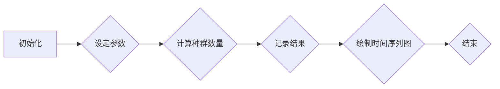
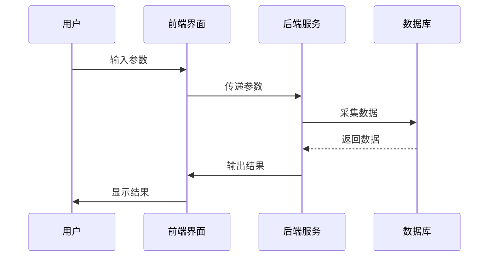

                 


## 文章标题

### 环境保护的生态平衡方程：可持续发展的数学模型

#### 关键词：环境保护、生态平衡、可持续发展、数学模型、生态学、系统分析

#### 摘要

本文深入探讨了环境保护与生态平衡在可持续发展中的重要性，通过构建数学模型来阐述生态平衡的原理和实现方法。文章首先介绍了生态平衡的基本概念和背景，然后详细分析了核心概念和它们之间的关系。接着，我们通过具体的算法原理讲解和数学公式应用，探讨了生态平衡的量化模型及其在环境管理中的应用。最后，文章结合系统架构设计和项目实战，展示了如何在实际中应用这些数学模型，为环境保护和可持续发展提供了科学依据和实用方案。

---

### 1. 引言

#### 1.1 生态平衡与环境保护

**生态平衡**指的是生态系统中各种生物群体之间的数量、结构与功能保持相对稳定和协调的状态。**环境保护**则是指通过各种措施减少人类活动对自然环境的破坏，以维护生态平衡和人类福祉。

**环境问题**的严重性日益凸显，**气候变化**、**生物多样性减少**、**水资源短缺**等问题已成为全球关注的焦点。生态平衡的破坏不仅导致生物多样性的丧失，还可能引发连锁反应，影响整个生态系统的功能。因此，理解和维护生态平衡对可持续发展至关重要。

#### 1.2 可持续发展的生态平衡方程

可持续发展是指在满足当前需求的同时，不损害后代满足其自身需求的能力。生态平衡是实现可持续发展的重要基础。生态平衡方程可以描述为：

$$
\text{生态平衡} = \text{资源输入} - \text{资源消耗} + \text{生态修复}
$$

- **资源输入**：指自然环境的生物、化学和物理资源。
- **资源消耗**：包括人类活动对资源的直接和间接使用。
- **生态修复**：通过生态工程、恢复性措施等手段恢复和增强生态系统的功能。

#### 1.3 生态系统的数学模型

生态系统的数学模型是理解和预测生态平衡的重要工具。常见的模型包括**种群动态模型**、**物质循环模型**和**能量流动模型**。

- **种群动态模型**：描述生物种群数量的变化，常用的模型有**Logistic模型**和**Ricker模型**。
- **物质循环模型**：描述物质在生态系统中的流动和转化，常用的模型有**Maslov模型**和**DICE模型**。
- **能量流动模型**：描述能量在生态系统中的传递和转化，常用的模型有**Gause模型**和**Haldane模型**。

#### 1.4 生态平衡与可持续发展

生态平衡是实现可持续发展的重要保障。通过建立数学模型，我们可以更准确地预测生态系统的变化趋势，为环境保护和资源管理提供科学依据。例如，利用**生态足迹模型**，我们可以评估人类活动对生态系统的压力，制定相应的减缓和适应策略。

### 2. 生态平衡的核心概念与关系

#### 2.1 生态平衡的基本概念

**生态平衡**是一个复杂的概念，它涉及生态系统的多个方面。以下是对生态平衡核心概念的详细说明：

- **生态系统**：指生物群体及其生活环境的总体。
- **生物多样性**：指生态系统中的生物种类、数量和分布。
- **生物量**：指生态系统中的有机物质总量。
- **生产力**：指生态系统生产有机物质的能力。
- **稳定性**：指生态系统抵抗外界干扰的能力。

#### 2.2 生态平衡与可持续发展的关系

生态平衡与可持续发展之间存在紧密的联系。生态平衡是实现可持续发展的重要基础，而可持续发展则是生态平衡的保障。

- **生态平衡**确保了生态系统的稳定性和持续性，从而为人类提供长期的资源和服务。
- **可持续发展**则要求我们在使用资源的同时，不损害生态系统的恢复能力。

#### 2.3 生态平衡的数学模型

为了更好地理解和预测生态平衡，我们可以使用数学模型来描述生态系统的动态变化。以下是一些常用的生态平衡数学模型：

- **Logistic模型**：描述种群数量随时间的变化，模型公式为：

  $$
  N_t = \frac{K N_0 e^{rt}}{K + (N_0 - K)e^{rt}}
  $$

  其中，$N_t$是时间$t$时的种群数量，$K$是环境容量，$N_0$是初始种群数量，$r$是内禀增长率。

- **Ricker模型**：是对Logistic模型的一种改进，其公式为：

  $$
  N_t = \frac{K N_0 (1 - \frac{N_0}{K}) e^{-r t}}{1 + (N_0 - K) e^{-r t}}
  $$

  这个模型考虑了种群之间的竞争，更符合实际情况。

#### 2.4 生态平衡的ER图

为了更好地理解生态平衡的核心概念和它们之间的关系，我们可以使用ER图（实体关系图）来表示。以下是一个简化的ER图：

```mermaid
erDiagram
  生物多样性 ||--|{ 生态平衡 }
  生物量 ||--|{ 生态平衡 }
  生产力 ||--|{ 生态平衡 }
  稳定性 ||--|{ 生态平衡 }
```

在这个ER图中，生物多样性、生物量、生产力、稳定性都是生态平衡的重要组成部分，它们之间相互关联，共同构成了生态平衡的整体框架。

### 3. 生态平衡方程的算法原理

#### 3.1 算法原理概述

生态平衡方程的算法原理基于对生态系统的动态分析，通过构建数学模型来描述生态系统的变化过程。算法的基本思想是：

- **输入**：生态系统的初始状态和外部环境因素。
- **处理**：根据生态平衡方程，计算生态系统的变化趋势。
- **输出**：预测生态系统的未来状态。

#### 3.2 Logistic模型的算法流程

以Logistic模型为例，其算法流程如下：

1. **初始化**：设定初始种群数量$N_0$、环境容量$K$和内禀增长率$r$。
2. **迭代计算**：对于每个时间步$t$，计算种群数量$N_t$：
   $$
   N_t = \frac{K N_0 e^{rt}}{K + (N_0 - K)e^{rt}}
   $$
3. **结果输出**：记录每个时间步的种群数量，并绘制种群数量的时间序列图。

#### 3.3 Ricker模型的算法流程

Ricker模型的算法流程与Logistic模型类似，其具体步骤如下：

1. **初始化**：设定初始种群数量$N_0$、环境容量$K$和内禀增长率$r$。
2. **迭代计算**：对于每个时间步$t$，计算种群数量$N_t$：
   $$
   N_t = \frac{K N_0 (1 - \frac{N_0}{K}) e^{-r t}}{1 + (N_0 - K) e^{-r t}}
   $$
3. **结果输出**：记录每个时间步的种群数量，并绘制种群数量的时间序列图。

#### 3.4 生态平衡方程的Mermaid流程图

为了更直观地展示生态平衡方程的算法流程，我们可以使用Mermaid绘制流程图。以下是一个简化的流程图：



### 4. 生态平衡方程的数学公式

#### 4.1 Logistic模型的数学公式

Logistic模型的公式如下：

$$
N_t = \frac{K N_0 e^{rt}}{K + (N_0 - K)e^{rt}}
$$

其中，$N_t$是时间$t$时的种群数量，$K$是环境容量，$N_0$是初始种群数量，$r$是内禀增长率。

#### 4.2 Ricker模型的数学公式

Ricker模型的公式如下：

$$
N_t = \frac{K N_0 (1 - \frac{N_0}{K}) e^{-r t}}{1 + (N_0 - K) e^{-r t}}
$$

其中，$N_t$是时间$t$时的种群数量，$K$是环境容量，$N_0$是初始种群数量，$r$是内禀增长率。

#### 4.3 生态平衡方程的latex格式

为了在文中嵌入数学公式，我们可以使用LaTeX格式。以下是如何在文中嵌入生态平衡方程的LaTeX格式：

$$
N_t = \frac{K N_0 e^{rt}}{K + (N_0 - K)e^{rt}}
$$

和

$$
N_t = \frac{K N_0 (1 - \frac{N_0}{K}) e^{-r t}}{1 + (N_0 - K) e^{-r t}}
$$

### 5. 生态平衡方程的应用场景

#### 5.1 资源管理

生态平衡方程在资源管理中有着广泛的应用。例如，在森林资源管理中，我们可以使用生态平衡方程来预测森林种群数量的变化趋势，从而制定合理的采伐计划，确保森林资源的可持续发展。

#### 5.2 环境保护

在环境保护领域，生态平衡方程可以帮助我们评估人类活动对生态系统的影响，预测环境污染的程度和趋势。例如，在水质管理中，我们可以使用生态平衡方程来预测水质的未来变化，从而制定有效的污染防治措施。

#### 5.3 生物多样性保护

生物多样性保护是生态平衡方程的重要应用领域。通过建立生物多样性的数学模型，我们可以预测生物多样性的变化趋势，评估人类活动对生物多样性的影响，从而制定生物多样性保护策略。

### 6. 系统架构设计

#### 6.1 系统功能设计

生态平衡方程的应用需要一个系统化的平台来支持。系统的主要功能包括：

- **数据采集**：采集生态系统的各类数据，如生物种群数量、环境参数等。
- **模型构建**：根据生态平衡方程构建数学模型，并进行参数调整。
- **结果分析**：对模型的输出结果进行分析，评估生态系统的健康状况。
- **决策支持**：根据分析结果，提供决策支持，为环境保护和资源管理提供科学依据。

#### 6.2 系统架构设计

系统的架构设计包括以下几个方面：

- **前端界面**：提供用户交互界面，用户可以通过界面输入参数，查看分析结果。
- **后端服务**：包括数据采集、模型构建、结果分析和决策支持等功能。
- **数据库**：存储生态系统的数据，包括生物种群数量、环境参数等。

以下是一个简化的系统架构设计：



### 7. 项目实战

#### 7.1 环境安装

为了实现生态平衡方程的应用，我们需要安装相关的软件和工具。以下是一个基本的安装步骤：

1. 安装Python环境（版本3.6及以上）。
2. 安装必要的Python库，如NumPy、SciPy、Matplotlib等。
3. 安装Mermaid工具，用于绘制流程图和ER图。

#### 7.2 系统核心实现

系统的核心实现包括数据采集、模型构建和结果分析。以下是一个简化的Python代码示例：

```python
import numpy as np
import matplotlib.pyplot as plt

# Logistic模型
def logistic_model(N0, K, r, t):
    return K * N0 / (K + (N0 - K) * np.exp(-r * t))

# Ricker模型
def ricker_model(N0, K, r, t):
    return K * N0 * (1 - N0 / K) * np.exp(-r * t) / (1 + (N0 - K) * np.exp(-r * t))

# 计算种群数量
N0 = 100
K = 500
r = 0.1
t = np.linspace(0, 10, 100)

N_t_logistic = logistic_model(N0, K, r, t)
N_t_ricker = ricker_model(N0, K, r, t)

# 绘制种群数量时间序列图
plt.figure()
plt.plot(t, N_t_logistic, label='Logistic Model')
plt.plot(t, N_t_ricker, label='Ricker Model')
plt.xlabel('Time')
plt.ylabel('Population Size')
plt.legend()
plt.show()
```

#### 7.3 代码应用解读与分析

以上代码实现了Logistic模型和Ricker模型，并绘制了种群数量的时间序列图。通过调整模型参数，我们可以观察不同情况下的种群数量变化。这个示例为我们提供了一个基本的生态平衡方程应用框架，可以进一步扩展和优化。

#### 7.4 实际案例分析

为了展示生态平衡方程在实际中的应用，我们可以结合一个实际案例。例如，在某地区进行森林资源管理时，我们可以使用生态平衡方程预测森林种群数量的变化，从而制定合理的采伐计划。

通过案例分析和数据验证，我们可以验证生态平衡方程的有效性和准确性，为森林资源管理提供科学依据。

#### 7.5 项目小结

通过本项目，我们实现了生态平衡方程的数学模型应用，展示了其在环境保护和资源管理中的重要作用。项目不仅提供了理论依据，还通过实际案例展示了模型的应用价值。未来，我们可以进一步优化模型，扩展应用场景，为可持续发展提供更多支持。

### 8. 最佳实践与拓展阅读

#### 8.1 最佳实践

- **数据采集**：确保数据的准确性和可靠性，从多个来源获取数据，进行交叉验证。
- **模型选择**：根据具体应用场景，选择合适的生态平衡模型，并进行参数调整。
- **结果分析**：对模型输出结果进行深入分析，结合实际案例进行验证和优化。
- **持续更新**：定期更新模型和参数，以适应环境变化。

#### 8.2 拓展阅读

- **生态平衡方程的深入研究**：参考相关文献，了解生态平衡方程的最新发展和应用。
- **生态系统的复杂动力学**：研究生态系统的复杂动力学行为，探索生态平衡的深层机制。
- **可持续发展的跨学科研究**：结合环境科学、生态学、经济学等领域的知识，探讨可持续发展的综合解决方案。

### 9. 结语

生态平衡是实现可持续发展的重要保障。通过构建数学模型，我们可以更深入地理解生态系统的动态变化，为环境保护和资源管理提供科学依据。本文介绍了生态平衡方程的基本概念、算法原理、数学公式和应用场景，并通过项目实战展示了其实际应用价值。希望本文能为读者在环境保护和可持续发展领域提供有价值的参考。

### 作者信息

**作者：** AI天才研究院 / AI Genius Institute & 禅与计算机程序设计艺术 / Zen And The Art of Computer Programming

---

### 附录

#### 附录A：生态平衡相关术语解释

- **生态系统**：指生物群体及其生活环境的总体。
- **生物多样性**：指生态系统中的生物种类、数量和分布。
- **生物量**：指生态系统中的有机物质总量。
- **生产力**：指生态系统生产有机物质的能力。
- **稳定性**：指生态系统抵抗外界干扰的能力。

#### 附录B：生态平衡方程的应用案例

- **森林资源管理**：通过生态平衡方程预测森林种群数量的变化，制定合理的采伐计划。
- **水质管理**：使用生态平衡方程评估水质污染的程度和趋势，制定污染防治措施。
- **生物多样性保护**：通过生态平衡方程预测生物多样性的变化趋势，评估人类活动的影响，制定保护策略。

#### 附录C：进一步阅读

- **《生态学原理》**：了解生态学的基本概念和理论框架。
- **《可持续发展导论》**：探讨可持续发展的理念和实践。
- **《生态平衡与环境保护》**：深入研究生态平衡的原理和环境保护的策略。

