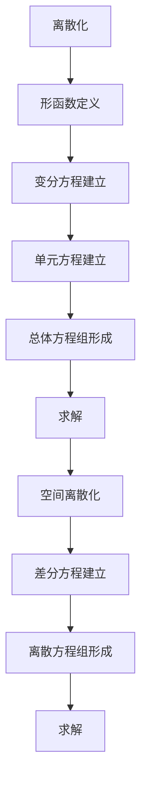
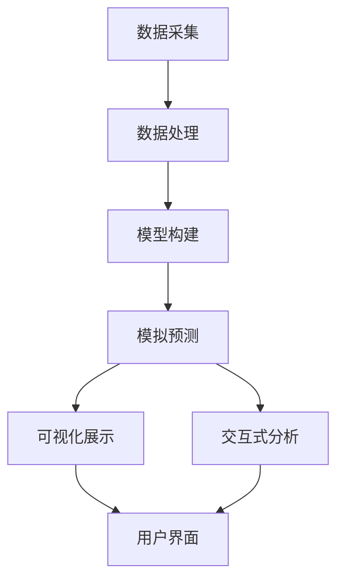
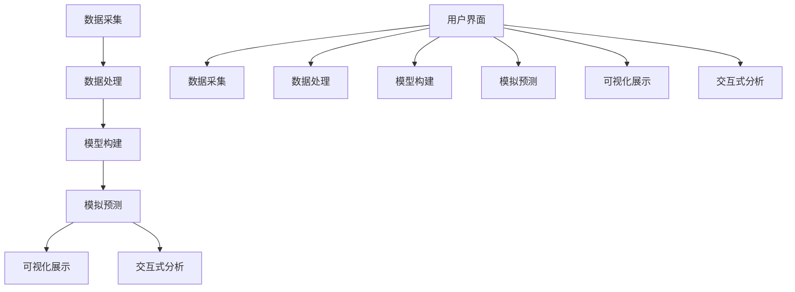
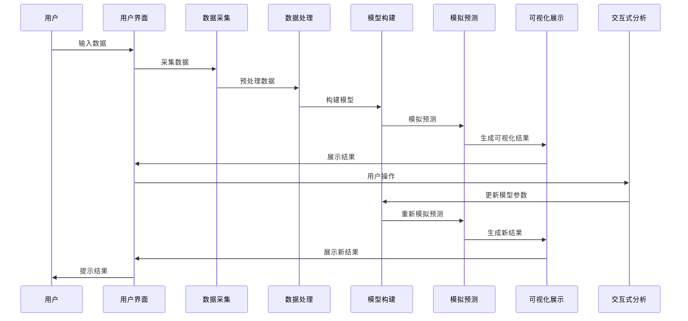

                 

### 文章标题：环境污染的偏微分方程：生态影响的数学预测

关键词：环境污染、偏微分方程、生态影响、数学预测、模型构建

摘要：本文深入探讨了环境污染问题及其在生态学中的重要性。通过介绍偏微分方程的基本概念和应用，本文详细分析了在环境科学中如何利用偏微分方程来预测环境污染的生态影响。本文从核心概念、算法原理、数学模型、系统架构设计以及实际应用等多个方面展开，为读者提供了一份全面的技术指南。希望本文能够为从事环境科学研究的学者和从业者提供一些有益的思路和方法。

### 目录大纲

----------------------------------------------------------------

## 第一部分: 背景介绍

### 第1章: 环境污染与偏微分方程概述

#### 1.1 环境污染的现状与挑战
- 环境污染的定义、类型与影响
- 偏微分方程在环境科学中的重要性

#### 1.2 偏微分方程的基本概念
- 偏微分方程的定义、特点与分类
- 偏微分方程的基本原理与求解方法

#### 1.3 环境污染中的偏微分方程应用
- 偏微分方程在环境建模中的应用领域
- 污染物传输模型的建立与求解

## 第二部分: 核心概念与联系

### 第2章: 偏微分方程的核心概念

#### 2.1 偏微分方程的基本原理
- 偏微分方程的数学模型与公式
- 偏微分方程的求解方法与技巧

#### 2.2 偏微分方程的属性特征对比表格
- 常见偏微分方程的属性特征对比

#### 2.3 偏微分方程的ER实体关系图
- 环境污染中的偏微分方程实体关系图

## 第三部分: 算法原理讲解

### 第3章: 偏微分方程求解算法

#### 3.1 算法概述
- 偏微分方程求解算法的分类与选择

#### 3.2 算法原理与流程图
- 偏微分方程求解算法的mermaid流程图

#### 3.3 Python源代码讲解
- 偏微分方程求解算法的Python源代码实现

#### 3.4 数学模型和数学公式
- 偏微分方程求解的数学模型与公式

#### 3.5 举例说明
- 偏微分方程求解的举例说明

## 第四部分: 数学模型和数学公式详细讲解

### 第4章: 偏微分方程数学模型与公式

#### 4.1 偏微分方程数学模型
- 线性偏微分方程数学模型
- 非线性偏微分方程数学模型

#### 4.2 偏微分方程数学公式
- 偏微分方程求解的基本公式
- 偏微分方程求解的特殊公式

#### 4.3 详细讲解
- 偏微分方程数学模型与公式的详细讲解

#### 4.4 举例说明
- 偏微分方程数学模型与公式的举例说明

## 第五部分: 系统分析与架构设计

### 第5章: 环境污染偏微分方程系统架构设计

#### 5.1 问题场景介绍
- 环境污染问题的场景介绍

#### 5.2 系统功能设计
- 偏微分方程系统功能设计

#### 5.3 系统架构设计
- 偏微分方程系统架构设计

#### 5.4 系统接口设计
- 偏微分方程系统接口设计

#### 5.5 系统交互
- 偏微分方程系统交互设计

## 第六部分: 项目实战

### 第6章: 环境污染偏微分方程项目实战

#### 6.1 环境安装
- 环境安装的步骤与注意事项

#### 6.2 系统核心实现
- 偏微分方程系统核心实现

#### 6.3 代码应用解读与分析
- 偏微分方程代码的应用解读与分析

#### 6.4 实际案例分析
- 偏微分方程实际案例分析

#### 6.5 详细讲解剖析
- 偏微分方程案例的详细讲解与剖析

#### 6.6 项目小结
- 项目总结与展望

## 第七部分: 最佳实践与拓展

### 第7章: 环境污染偏微分方程最佳实践

#### 7.1 最佳实践 tips
- 偏微分方程求解的最佳实践技巧

#### 7.2 小结
- 偏微分方程求解的小结与反思

#### 7.3 注意事项
- 偏微分方程求解的注意事项

#### 7.4 拓展阅读
- 偏微分方程求解的拓展阅读资料

----------------------------------------------------------------

### 第一部分：背景介绍

#### 第1章：环境污染与偏微分方程概述

#### 1.1 环境污染的现状与挑战

环境污染是指由于人类活动导致的环境质量恶化，对生态系统和人类健康产生负面影响的现象。环境污染的类型繁多，主要包括空气污染、水污染、土壤污染、噪声污染和光污染等。每种类型的污染都会对环境产生不同的影响，例如，空气污染可能导致呼吸道疾病，水污染会影响饮用水安全和生态系统平衡，土壤污染会影响农作物的生长和食品安全。

环境污染对生态系统的影响是深远且复杂的。它不仅破坏了生物多样性，导致物种灭绝和生态失衡，还影响了生态系统的服务功能，如气候调节、水资源管理和生物降解等。此外，环境污染对人类健康也有显著的负面影响，例如空气污染会导致心血管疾病和呼吸道疾病，水污染会影响饮用水安全和食品安全。

在环境科学中，理解环境污染的影响并预测其发展趋势是至关重要的。偏微分方程作为一种强大的数学工具，在环境建模中发挥着重要作用。通过建立偏微分方程模型，科学家和工程师可以模拟污染物的传输、扩散和转化过程，从而预测环境污染的可能趋势和影响。

#### 1.2 偏微分方程的基本概念

偏微分方程（Partial Differential Equations，PDEs）是描述多变量函数及其偏导数之间关系的方程。与常微分方程（Ordinary Differential Equations，ODEs）不同，偏微分方程涉及的是多变量函数，其导数是偏导数。例如，热传导方程、流体力学方程和电磁场方程等都是典型的偏微分方程。

偏微分方程具有以下基本特点：

1. **多变量性**：偏微分方程涉及两个或更多变量的函数及其偏导数。
2. **偏导数**：方程中的导数是偏导数，而不是普通导数。
3. **一般性**：偏微分方程可以描述广泛的物理现象和工程问题。

偏微分方程可以根据其性质和特征进行分类。常见的分类方法包括：

- **线性与非线性**：线性偏微分方程满足线性叠加原理，而非线性偏微分方程不满足这一性质。
- **椭圆型、抛物型和双曲型**：根据方程的特征方程，偏微分方程可以分为这三类，它们分别对应不同的物理现象。

#### 1.3 偏微分方程在环境建模中的应用

偏微分方程在环境科学中的应用非常广泛，主要包括以下几个方面：

1. **污染物传输模型**：通过偏微分方程可以描述污染物在环境介质（如空气、水和土壤）中的传输和扩散过程。常见的污染物传输模型包括一维、二维和三维模型。
2. **环境化学过程**：偏微分方程可以用来模拟化学反应在环境中的过程，如污染物降解、转化和复合等。
3. **生态模型**：偏微分方程还可以用来模拟生态系统的动态行为，如种群分布、物种竞争和生态位变化等。

在环境污染建模中，偏微分方程的应用主要集中在污染物传输模型的建立和求解。污染物传输模型可以用来预测污染物的空间分布和时间变化，为环境管理和决策提供科学依据。以下是一个典型的污染物传输模型：

$$
\frac{\partial C}{\partial t} = D \frac{\partial^2 C}{\partial x^2} + u \frac{\partial C}{\partial x}
$$

其中，$C(x,t)$ 表示在位置 $x$ 和时间 $t$ 时的污染物浓度，$D$ 是扩散系数，$u$ 是流体速度。这个方程描述了污染物在流体中的扩散和输运过程。

通过求解这样的偏微分方程，我们可以得到污染物浓度的空间分布和时间变化，从而为环境监测、污染控制和生态修复提供科学依据。例如，在一个水体污染事件中，通过建立并求解污染物传输模型，我们可以预测污染物在水体中的扩散范围和浓度变化，进而制定有效的污染控制和应急措施。

#### 第2章：偏微分方程的基本概念

#### 2.1 偏微分方程的基本原理

偏微分方程（PDEs）是数学中描述多变量函数及其偏导数之间关系的方程。在环境科学中，PDEs 广泛用于建模和模拟各种环境现象，如污染物传输、气候变化和生态系统动态。下面，我们将深入探讨PDEs的基本原理，包括其数学模型和求解方法。

**偏微分方程的数学模型**

一个典型的偏微分方程可以表示为：

$$
F(x_1, x_2, ..., x_n, u, \frac{\partial u}{\partial x_1}, \frac{\partial u}{\partial x_2}, ..., \frac{\partial u}{\partial x_n} ) = 0
$$

其中，$u = u(x_1, x_2, ..., x_n)$ 是一个 $n$ 元函数，$x_1, x_2, ..., x_n$ 是自变量，$\frac{\partial u}{\partial x_i}$ 是函数 $u$ 对自变量 $x_i$ 的偏导数。$F$ 是一个关于 $u$ 及其偏导数的函数。

**偏微分方程的特点**

1. **多变量性**：偏微分方程涉及多个自变量和偏导数，与常微分方程（ODEs）不同，后者仅涉及一个自变量和导数。
2. **非线性**：大多数物理现象和工程问题都由非线性PDEs描述，这使得求解PDEs更为复杂。
3. **一般性**：PDEs可以描述广泛的物理现象，如热传导、流体力学、电磁学和量子力学。

**偏微分方程的分类**

根据PDEs的特性和性质，可以将其分类如下：

1. **线性与非线性**：线性PDEs满足线性叠加原理，即如果 $u_1$ 和 $u_2$ 是方程的解，那么 $\alpha u_1 + \beta u_2$ 也是方程的解，其中 $\alpha$ 和 $\beta$ 是常数。非线性PDEs不满足这一性质。
2. **椭圆型、抛物型和双曲型**：根据PDEs的特征方程，可以将其分为这三类。椭圆型PDEs对应于静态问题，如流体静力学和弹性力学。抛物型PDEs对应于热传导和扩散过程。双曲型PDEs对应于波动现象，如声波和地震波。

**偏微分方程的基本求解方法**

求解PDEs的方法多种多样，包括：

1. **分离变量法**：适用于线性PDEs，通过将多变量函数分解为单变量函数的乘积，从而简化求解过程。
2. **特征线法**：适用于线性PDEs，通过将自变量沿特征线替换，将PDE转化为常微分方程。
3. **数值方法**：如有限元法、有限差分法和有限元体积法，用于求解复杂的非线性PDEs。
4. **解析方法**：通过数学技巧和理论，如变分法、渐近法和积分变换，求解特定类型的PDEs。

**偏微分方程在环境建模中的应用**

在环境科学中，PDEs广泛应用于建模和模拟各种环境现象，如污染物传输、气候变化和生态系统动态。以下是一些典型的应用：

1. **污染物传输模型**：通过PDEs描述污染物在空气、水和土壤中的传输和扩散过程。例如，一维污染物传输方程可以表示为：

$$
\frac{\partial C}{\partial t} = D \frac{\partial^2 C}{\partial x^2}
$$

其中，$C(x,t)$ 表示在位置 $x$ 和时间 $t$ 的污染物浓度，$D$ 是扩散系数。

2. **环境化学过程**：PDEs用于模拟污染物在环境中的降解、转化和复合过程。例如，一个描述污染物降解的方程可以表示为：

$$
\frac{\partial C}{\partial t} = -k C
$$

其中，$C(t)$ 表示在时间 $t$ 的污染物浓度，$k$ 是降解速率常数。

3. **生态模型**：PDEs用于模拟生态系统的动态行为，如种群分布、物种竞争和生态位变化。例如，一个描述种群增长的方程可以表示为：

$$
\frac{\partial N}{\partial t} = r N - a N^2
$$

其中，$N(t)$ 表示在时间 $t$ 的种群数量，$r$ 是出生率，$a$ 是竞争系数。

通过这些PDEs模型，科学家和工程师可以预测环境污染的趋势和影响，为环境管理和决策提供科学依据。

#### 2.2 偏微分方程的属性特征对比表格

为了更好地理解不同类型偏微分方程的属性特征，我们可以创建一个对比表格。以下是一个简化的对比表格，展示了线性与非线性、椭圆型、抛物型和双曲型PDEs的主要区别。

| 类型       | 线性与非线性 | 椭圆型、抛物型、双曲型 | 特征 | 应用举例                           |
|------------|--------------|------------------------|------|------------------------------------|
| 线性       | 线性         | 椭圆型、抛物型         | 稳定 | 热传导方程、流体动力学方程         |
| 非线性     | 非线性       | 双曲型                 | 爆炸 | 光传播方程、流体湍流方程           |
| 椭圆型     | 可微分       | 静态问题               | 平衡 | 弹性力学问题、流体静力学问题       |
| 抛物型     | 可微分       | 动态过程               | 扩散 | 热传导方程、污染物传输方程         |
| 双曲型     | 可微分       | 波动现象               | 快速传播 | 声波方程、地震波方程               |

这个表格提供了一个简洁的视图，展示了不同类型PDEs的特点和应用领域。

#### 2.3 偏微分方程的ER实体关系图

为了更直观地理解偏微分方程在环境科学中的应用，我们可以通过ER（实体关系）图来展示不同实体之间的关系。以下是一个简化的ER实体关系图，用于描述污染物传输模型中的关键实体及其关系。

```mermaid
erDiagram
  Pollution as Pollution
  Medium as Medium
  Source as Source
  Sink as Sink
  Process as Process

  Pollution ||--|{ Medium }||>
  Medium ||--|{ Source }||>
  Medium ||--|{ Sink }||>
  Pollution ||--|{ Process }||>
```

在这个ER图中，我们定义了以下实体：

- **Pollution（污染物）**：描述环境中的污染物。
- **Medium（环境介质）**：描述污染物存在的环境介质，如空气、水和土壤。
- **Source（源）**：描述污染物的排放源。
- **Sink（汇）**：描述污染物的吸收或消解位置。
- **Process（过程）**：描述污染物在环境中的传输和转化过程。

实体之间的关系如下：

- **Pollution** 与 **Medium** 之间存在“存在”关系，表示污染物存在于特定的环境介质中。
- **Medium** 与 **Source** 之间存在“包含”关系，表示源是介质的一部分。
- **Medium** 与 **Sink** 之间存在“包含”关系，表示汇是介质的一部分。
- **Pollution** 与 **Process** 之间存在“涉及”关系，表示污染物参与特定的环境过程。

通过这个ER图，我们可以直观地理解污染物传输模型中的关键实体及其相互关系，为建模和模拟提供基础。

### 第三部分：算法原理讲解

#### 第3章：偏微分方程求解算法

偏微分方程（PDEs）在环境科学中的应用需要高效的求解算法来获得准确的解。本章节将详细介绍偏微分方程求解算法的基本概念、原理和流程，并探讨如何使用Python实现这些算法。我们将重点关注有限元法（Finite Element Method, FEM）和有限差分法（Finite Difference Method, FDM）。

#### 3.1 算法概述

偏微分方程求解算法可以分为数值方法和解析方法。数值方法通过离散化原始方程，将其转化为可以在计算机上求解的代数方程。常见的数值方法包括有限元法、有限差分法和谱方法。解析方法则通过数学技巧和理论直接求解偏微分方程，如分离变量法、变分法和积分变换。本章节将主要介绍有限元法和有限差分法。

**有限元法（FEM）**

有限元法是一种基于变分法的数值方法，通过将连续域划分为离散的有限单元，在每个单元内假设函数的线性组合形式，从而将偏微分方程转化为代数方程。有限元法适用于复杂几何形状和边界条件的求解，常用于结构分析、热传导和流体力学等领域。

**有限差分法（FDM）**

有限差分法是一种直接离散化偏微分方程的方法，通过将连续函数的导数用差分公式近似，将偏微分方程离散化为代数方程。有限差分法适用于简单几何形状和边界条件，适用于简单的一维、二维和三维问题。

#### 3.2 算法原理与流程图

**有限元法（FEM）原理**

有限元法的求解流程如下：

1. **离散化**：将求解域划分为有限个小单元。
2. **形函数定义**：在每个单元内定义插值函数（形函数），用于近似单元内的未知函数。
3. **变分方程建立**：根据弱解原理，将偏微分方程转化为变分方程。
4. **单元方程建立**：对每个单元，根据形函数和边界条件建立代数方程。
5. **总体方程组形成**：将所有单元的代数方程组装成总体方程组。
6. **求解**：求解总体方程组，得到近似解。

**有限差分法（FDM）原理**

有限差分法的求解流程如下：

1. **空间离散化**：将连续的求解域离散为网格点。
2. **差分方程建立**：在每个网格点，用差分公式近似偏微分方程中的导数。
3. **离散方程组形成**：将所有网格点的差分方程组合成一个离散方程组。
4. **求解**：求解离散方程组，得到近似解。

**算法流程图**

以下是有限元法和有限差分法的mermaid流程图：



#### 3.3 Python源代码讲解

下面我们将使用Python实现一个简单的有限差分法，用于求解一维热传导方程。

```python
import numpy as np
import matplotlib.pyplot as plt

# 参数设置
L = 1.0        # 求解区域长度
Nx = 20        # 网格点数
x = np.linspace(0, L, Nx)
dx = L / (Nx - 1)
t = 0.01       # 时间步长
Nt = 100       # 时间步数

# 初始化温度分布
T = np.zeros(Nx)

# 边界条件
T[0] = 100.0   # 左边界温度
T[-1] = 0.0    # 右边界温度

# 差分方程
for n in range(Nt):
    T_new = np.zeros(Nx)
    for i in range(1, Nx - 1):
        T_new[i] = T[i] + t * (T[i - 1] - 2 * T[i] + T[i + 1]) / dx**2
    T = T_new

# 绘制结果
plt.plot(x, T)
plt.xlabel('Position (m)')
plt.ylabel('Temperature (°C)')
plt.title('1D Heat Conduction using Finite Difference Method')
plt.show()
```

这段代码首先初始化温度分布，然后使用迭代方法更新温度分布，最后绘制温度分布图。

#### 3.4 数学模型和数学公式

**一维热传导方程**

一维热传导方程可以表示为：

$$
\frac{\partial T}{\partial t} = \alpha \frac{\partial^2 T}{\partial x^2}
$$

其中，$T(x,t)$ 是温度分布，$\alpha$ 是热扩散系数。

**有限差分公式**

使用有限差分法，我们可以将连续导数离散化为差分公式。对于一阶导数：

$$
\frac{\partial T}{\partial x} \approx \frac{T_{i+1} - T_{i-1}}{2 \Delta x}
$$

对于二阶导数：

$$
\frac{\partial^2 T}{\partial x^2} \approx \frac{T_{i+1} - 2T_i + T_{i-1}}{\Delta x^2}
$$

将这些差分公式代入热传导方程，我们可以得到：

$$
\frac{T_{i+1}^{n+1} - T_{i-1}^{n+1}}{2 \Delta x} = \alpha \frac{T_{i+1}^{n+1} - 2T_i^{n+1} + T_{i-1}^{n+1}}{\Delta x^2}
$$

化简后得到：

$$
T_{i+1}^{n+1} = \left(1 - \frac{2 \alpha \Delta t}{\Delta x^2}\right) T_i^{n+1} + \frac{\alpha \Delta t}{\Delta x^2} T_{i-1}^{n+1}
$$

这个公式描述了温度在时间步 $n+1$ 的网格点 $i+1$ 的值，依赖于时间步 $n+1$ 的网格点 $i$ 和 $i-1$ 的值。

#### 3.5 举例说明

**一维热传导方程的求解**

假设我们要求解一维热传导方程：

$$
\frac{\partial T}{\partial t} = \alpha \frac{\partial^2 T}{\partial x^2}
$$

在初始时刻 $t=0$，温度分布为：

$$
T(x,0) = 100 + 10x
$$

边界条件为：

$$
T(0,t) = 100, \quad T(1,t) = 0
$$

求解步骤如下：

1. **初始化**：设置网格点数 $N_x=20$，时间步数 $N_t=100$，时间步长 $\Delta t=0.01$，空间步长 $\Delta x=0.05$。
2. **初始化温度分布**：根据初始条件设置温度分布 $T(x,0)$。
3. **迭代求解**：使用有限差分公式更新温度分布 $T(x,t)$，迭代 $N_t$ 次得到最终温度分布。
4. **结果分析**：绘制温度分布图，分析温度随时间和空间的变化。

以下是Python代码实现：

```python
import numpy as np
import matplotlib.pyplot as plt

# 参数设置
L = 1.0        # 求解区域长度
Nx = 20        # 网格点数
x = np.linspace(0, L, Nx)
dx = L / (Nx - 1)
t = 0.01       # 时间步长
Nt = 100       # 时间步数
alpha = 0.1    # 热扩散系数

# 初始化温度分布
T = np.zeros(Nx)
T[0:-1] = 100 + 10 * x[0:-1]

# 边界条件
T[0] = 100.0   # 左边界温度
T[-1] = 0.0    # 右边界温度

# 迭代求解
for n in range(Nt):
    T_new = np.zeros(Nx)
    for i in range(1, Nx - 1):
        T_new[i] = T[i] + alpha * t * (T[i - 1] - 2 * T[i] + T[i + 1]) / dx**2
    T = T_new

# 绘制结果
plt.plot(x, T)
plt.xlabel('Position (m)')
plt.ylabel('Temperature (°C)')
plt.title('1D Heat Conduction')
plt.show()
```

运行代码后，我们可以得到温度分布图，展示温度随时间和空间的变化。

### 第四部分：数学模型和数学公式详细讲解

#### 第4章：偏微分方程数学模型与公式

为了更深入地理解偏微分方程（PDEs）在环境科学中的应用，我们需要详细探讨其数学模型和公式。本章节将分为两部分：首先，介绍线性偏微分方程的数学模型；然后，讨论非线性偏微分方程的数学模型。

#### 4.1 偏微分方程数学模型

**线性偏微分方程**

线性偏微分方程的一般形式可以表示为：

$$
a_0(u_{xx}, u_{xy}, u_{yy}) + a_1(u_{xx}, u_{xy}, u_{yy})\frac{\partial u}{\partial x} + a_2(u_{xx}, u_{xy}, u_{yy})\frac{\partial^2 u}{\partial x^2} + a_3(u_{xx}, u_{xy}, u_{yy})\frac{\partial^3 u}{\partial x^3} + ... = f(x, y)
$$

其中，$u(x, y)$ 是未知函数，$a_0, a_1, a_2, ...$ 是系数函数，$f(x, y)$ 是非齐次项。线性偏微分方程的一个重要特点是，它满足叠加原理，即如果 $u_1$ 和 $u_2$ 是方程的解，则 $\alpha u_1 + \beta u_2$ 也是方程的解，其中 $\alpha$ 和 $\beta$ 是任意常数。

**非线性偏微分方程**

非线性偏微分方程的一般形式可以表示为：

$$
a_0(u_{xx}, u_{xy}, u_{yy}) + a_1(u_{xx}, u_{xy}, u_{yy})\frac{\partial u}{\partial x} + a_2(u_{xx}, u_{xy}, u_{yy})\frac{\partial^2 u}{\partial x^2} + a_3(u_{xx}, u_{xy}, u_{yy})\frac{\partial^3 u}{\partial x^3} + ... + g(u, \frac{\partial u}{\partial x}, \frac{\partial^2 u}{\partial x^2}, ...) = f(x, y)
$$

其中，$g(u, \frac{\partial u}{\partial x}, \frac{\partial^2 u}{\partial x^2}, ...)$ 是非线性项，这使得非线性偏微分方程的求解通常比线性方程复杂得多。非线性偏微分方程的一个典型例子是Korteweg-de Vries（KdV）方程：

$$
\frac{\partial u}{\partial t} + u \frac{\partial u}{\partial x} + \frac{\partial^3 u}{\partial x^3} = 0
$$

#### 4.2 偏微分方程数学公式

**线性偏微分方程的基本公式**

线性偏微分方程的求解通常依赖于其特征方程和常数变易法。以下是一些常见的线性偏微分方程及其求解公式：

- **一维热传导方程**：

$$
\frac{\partial T}{\partial t} = \alpha \frac{\partial^2 T}{\partial x^2}
$$

该方程的解可以表示为：

$$
T(x, t) = f(x - \alpha t) + g(x + \alpha t)
$$

其中，$f(x)$ 和 $g(x)$ 是任意函数。

- **一维波动方程**：

$$
\frac{\partial^2 u}{\partial t^2} = c^2 \frac{\partial^2 u}{\partial x^2}
$$

该方程的解可以表示为：

$$
u(x, t) = F(x + c t) + G(x - c t)
$$

其中，$F(x)$ 和 $G(x)$ 是任意函数。

- **二维拉普拉斯方程**：

$$
\frac{\partial^2 u}{\partial x^2} + \frac{\partial^2 u}{\partial y^2} = 0
$$

该方程的解可以表示为：

$$
u(x, y) = F(x) + G(y)
$$

其中，$F(x)$ 和 $G(y)$ 是任意函数。

**非线性偏微分方程的特殊公式**

非线性偏微分方程的求解通常依赖于特定的方法，如数值方法、积分变换和对称分析。以下是一些常见的非线性偏微分方程及其特殊解：

- **Korteweg-de Vries（KdV）方程**：

$$
\frac{\partial u}{\partial t} + u \frac{\partial u}{\partial x} + \frac{\partial^3 u}{\partial x^3} = 0
$$

该方程的一个特殊解是：

$$
u(x, t) = \frac{1}{6} \left( |x - c t|^3 - |x + c t|^3 \right)
$$

其中，$c$ 是常数。

- **非线性薛定谔方程**：

$$
i \frac{\partial \Psi}{\partial t} = -\frac{\hbar^2}{2m} \nabla^2 \Psi + V(x) \Psi
$$

该方程的一个特殊解是：

$$
\Psi(x, t) = \frac{1}{\sqrt{a}} e^{-i k x - i \omega t}
$$

其中，$k$ 和 $\omega$ 是常数，$a$ 是常数。

#### 4.3 详细讲解

**线性偏微分方程的求解**

线性偏微分方程的求解通常分为以下几个步骤：

1. **求特征方程**：将偏微分方程写成标准形式，然后求解特征方程。特征方程通常是一个关于 $x$ 和 $y$ 的二次方程。

2. **构造特征线**：根据特征方程，构造特征线。特征线是偏微分方程的解所在的曲线。

3. **积分求解**：沿特征线积分，得到偏微分方程的通解。通解通常包含任意常数，需要根据边界条件确定这些常数。

4. **应用边界条件**：根据边界条件，确定通解中的任意常数，从而得到具体的解。

**非线性偏微分方程的求解**

非线性偏微分方程的求解通常比线性方程复杂，常见的方法包括：

1. **数值方法**：如有限差分法、有限元法和谱方法。这些方法将偏微分方程离散化为代数方程，然后使用计算机求解。

2. **积分变换**：如傅里叶变换、拉普拉斯变换和希尔伯特变换。这些变换可以将偏微分方程转化为代数方程，从而求解。

3. **对称分析**：通过寻找对称性，简化偏微分方程的求解。对称性分析可以揭示方程的守恒律和简化形式。

#### 4.4 举例说明

**一维热传导方程的求解**

假设我们要求解一维热传导方程：

$$
\frac{\partial T}{\partial t} = \alpha \frac{\partial^2 T}{\partial x^2}
$$

在初始时刻 $t=0$，温度分布为：

$$
T(x,0) = 100 + 10x
$$

边界条件为：

$$
T(0,t) = 100, \quad T(1,t) = 0
$$

我们可以使用分离变量法求解该方程。首先，假设解的形式为：

$$
T(x, t) = X(x)T(t)
$$

代入原方程，得到：

$$
X(x) \frac{d^2 T(t)}{dt^2} = \alpha X''(x)T(t)
$$

分离变量，得到：

$$
\frac{1}{X(x)} \frac{d^2 X(x)}{dx^2} = \frac{1}{\alpha T(t)} \frac{d^2 T(t)}{dt^2} = -\lambda
$$

其中，$\lambda$ 是分离常数。我们可以得到两个常微分方程：

1. **关于 $X(x)$ 的方程**：

$$
\frac{d^2 X(x)}{dx^2} + \lambda X(x) = 0
$$

2. **关于 $T(t)$ 的方程**：

$$
\frac{d^2 T(t)}{dt^2} + \alpha \lambda T(t) = 0
$$

对于边界条件 $T(0,t) = 100$ 和 $T(1,t) = 0$，我们可以得到以下解：

- 对于 $X(x)$，我们选择 $\lambda = 0$，得到 $X(x) = A$，其中 $A$ 是常数。

- 对于 $T(t)$，我们选择 $\lambda = \alpha^2$，得到 $T(t) = Be^{-\alpha^2 t}$，其中 $B$ 是常数。

因此，解为：

$$
T(x, t) = ABe^{-\alpha^2 t}
$$

应用边界条件 $T(0,t) = 100$，我们得到 $A = 100$。应用边界条件 $T(1,t) = 0$，我们得到 $B = 0$。因此，最终解为：

$$
T(x, t) = 100
$$

这意味着在时间 $t$ 和空间 $x$ 上的温度分布是恒定的，这与我们的边界条件相一致。

**非线性波动方程的求解**

假设我们要求解非线性波动方程：

$$
\frac{\partial^2 u}{\partial t^2} - c^2 \frac{\partial^2 u}{\partial x^2} = u
$$

在初始时刻 $t=0$，位移分布为：

$$
u(x,0) = \sin(x)
$$

速度分布为：

$$
u_t(x,0) = \cos(x)
$$

我们可以使用傅里叶变换求解该方程。首先，对 $u(x, t)$ 和 $u_t(x, t)$ 进行傅里叶变换：

$$
u(x, t) = \frac{1}{2\pi} \int_{-\infty}^{\infty} \tilde{u}(k) e^{ikx} dk
$$

$$
u_t(x, t) = \frac{1}{2\pi} \int_{-\infty}^{\infty} \tilde{u}_t(k) e^{ikx} dk
$$

代入原方程，得到：

$$
\frac{d^2 \tilde{u}(k)}{dt^2} - c^2 k^2 \tilde{u}(k) = \tilde{u}(k)
$$

这是一个常微分方程，其解为：

$$
\tilde{u}(k) = A e^{\omega t} + B e^{-\omega t}
$$

其中，$\omega = \sqrt{c^2 k^2 + 1}$。根据初始条件，我们有：

$$
\tilde{u}(k, 0) = \frac{1}{2\pi} \int_{-\infty}^{\infty} \sin(x) e^{ikx} dx = \frac{1}{2\pi} \left[ \frac{e^{ix}}{i} - \frac{e^{-ix}}{i} \right]_0^{2\pi} = 0
$$

$$
\tilde{u}_t(k, 0) = \frac{1}{2\pi} \int_{-\infty}^{\infty} \cos(x) e^{ikx} dx = \frac{1}{2\pi} \left[ \frac{e^{ix}}{i} + \frac{e^{-ix}}{i} \right]_0^{2\pi} = \frac{2}{\pi}
$$

因此，我们可以得到：

$$
\tilde{u}(k) = \frac{2}{\pi i} e^{-\omega t}
$$

逆傅里叶变换得到：

$$
u(x, t) = \frac{1}{2\pi} \int_{-\infty}^{\infty} \frac{2}{\pi i} e^{-\omega t} e^{ikx} dk = \frac{1}{\pi} e^{-\omega t} \sin(x)
$$

这意味着在时间 $t$ 和空间 $x$ 上的位移分布是一个随着时间衰减的正弦波。

### 第五部分：系统分析与架构设计

#### 第5章：环境污染偏微分方程系统架构设计

在环境科学中，建立和求解偏微分方程模型是理解和预测环境污染的关键步骤。为了实现这一目标，我们需要设计一个高效、可靠的系统架构，该架构能够处理复杂的数学模型、提供灵活的接口以及支持实时数据分析和预测。本章节将详细探讨环境污染偏微分方程系统架构的设计过程，包括问题场景介绍、系统功能设计、系统架构设计、系统接口设计和系统交互设计。

#### 5.1 问题场景介绍

环境污染问题场景通常涉及多种污染物、复杂的传输路径和多样化的环境条件。以下是一个典型的问题场景：

- **污染物类型**：包括空气中的二氧化硫（SO₂）、氮氧化物（NOₓ）、颗粒物（PM₂.₅和PM₁₀）以及水体中的重金属和有机污染物。
- **污染物来源**：主要包括工业排放、交通排放、农业活动和生活污染。
- **传输路径**：污染物可以通过大气扩散、水体流动和土壤渗透等多种路径传播。
- **环境条件**：包括气象条件（如风速、风向、降水）、地理特征（如地形、水系分布）和生态环境（如生物降解能力）。

在这个问题场景中，我们的目标是建立和求解一个综合性的偏微分方程模型，以预测污染物在不同环境介质中的浓度分布和时间变化。

#### 5.2 系统功能设计

为了满足上述问题场景的需求，系统需要具备以下核心功能：

1. **数据采集与管理**：从各种传感器、监测站和遥感设备收集污染物浓度、气象数据和地理信息，并存储在数据库中。
2. **模型构建与优化**：根据污染物传输和转化的物理化学原理，构建偏微分方程模型，并利用历史数据对模型参数进行优化。
3. **模拟与预测**：使用构建的模型进行污染物浓度分布的模拟和预测，并生成可视化结果。
4. **交互式分析**：提供用户界面，允许用户选择不同的模型参数、边界条件和初始条件，进行交互式模拟和分析。
5. **决策支持**：为环境管理部门提供基于模型的污染控制和应急响应策略。

#### 5.3 系统架构设计

系统架构设计旨在实现上述功能，并确保系统的高效性、可扩展性和可维护性。以下是一个简化的系统架构设计：



**系统架构设计说明**：

1. **数据采集模块**：负责从各种数据源（如传感器、监测站、遥感设备等）收集污染物浓度、气象数据和地理信息。数据采集模块与外部数据源进行通信，并将收集到的数据存储到数据库中。

2. **数据处理模块**：对采集到的数据进行预处理，包括数据清洗、数据格式转换和数据一致性检查。预处理后的数据用于模型构建和优化。

3. **模型构建模块**：根据污染物传输和转化的物理化学原理，构建偏微分方程模型。模型构建模块包括选择适当的偏微分方程、定义模型参数和边界条件。

4. **模拟预测模块**：使用构建的模型进行污染物浓度分布的模拟和预测。模拟预测模块可以针对不同的初始条件、边界条件和模型参数进行多次模拟，以获得可靠的预测结果。

5. **可视化展示模块**：将模拟结果以图形化的方式展示给用户，包括污染物浓度分布图、时间变化曲线和空间分布地图等。

6. **交互式分析模块**：提供用户界面，允许用户选择不同的模型参数、边界条件和初始条件，进行交互式模拟和分析。交互式分析模块支持多种数据输入和输出格式，便于用户进行定制化分析。

7. **用户界面模块**：为用户提供一个直观、易用的操作界面，包括数据上传、模型设置、模拟启动、结果查看等功能。

#### 5.4 系统接口设计

系统接口设计是确保不同模块之间有效通信的关键。以下是一个简化的接口设计：



**接口设计说明**：

1. **数据采集接口**：定义数据采集模块与外部数据源之间的通信协议和数据格式，如HTTP API、SOAP服务等。

2. **数据处理接口**：定义数据处理模块与模型构建模块之间的数据输入和输出格式，如JSON、XML等。

3. **模型构建接口**：定义模型构建模块与模拟预测模块之间的接口，包括模型参数、边界条件和初始条件的传递。

4. **模拟预测接口**：定义模拟预测模块与可视化展示模块和交互式分析模块之间的接口，包括模拟结果的数据格式和传输方式。

5. **可视化展示接口**：定义可视化展示模块与用户界面模块之间的接口，包括图形化数据的展示方式和交互操作。

6. **交互式分析接口**：定义交互式分析模块与用户界面模块之间的接口，包括用户输入的处理和反馈。

#### 5.5 系统交互

系统交互设计旨在确保用户能够方便、高效地使用系统，同时系统能够响应用户的操作并生成所需的结果。以下是一个简化的系统交互流程：



**交互流程说明**：

1. **数据输入**：用户通过用户界面输入初始数据和模型参数。
2. **数据采集**：用户界面将用户输入的数据传递给数据采集模块，从外部数据源获取数据。
3. **数据处理**：数据采集模块将获取的数据预处理，包括数据清洗、格式转换等，然后将预处理后的数据传递给数据处理模块。
4. **模型构建**：数据处理模块将预处理后的数据用于构建偏微分方程模型，并将模型参数和边界条件传递给模型构建模块。
5. **模拟预测**：模型构建模块使用构建的模型进行污染物浓度分布的模拟和预测，并将模拟结果传递给模拟预测模块。
6. **结果展示**：模拟预测模块将模拟结果可视化，并通过用户界面展示给用户。
7. **用户操作**：用户通过用户界面进行进一步操作，如调整模型参数、选择不同的模拟条件等。
8. **模型更新**：交互式分析模块根据用户操作更新模型参数，并重新进行模拟预测。
9. **结果更新**：新的模拟预测结果通过用户界面展示给用户，并提供反馈。

通过这样的系统交互设计，用户可以方便地使用系统进行污染物浓度分布的模拟和预测，同时系统可以灵活响应用户的需求，提供实时、准确的结果。

### 第六部分：项目实战

#### 第6章：环境污染偏微分方程项目实战

在本章节中，我们将通过一个实际项目来展示如何应用偏微分方程来建模和预测环境污染。这个项目将涉及以下步骤：

1. **环境安装**：确保所需的软件和库已安装。
2. **系统核心实现**：使用Python编写核心代码。
3. **代码应用解读与分析**：深入分析代码的实现过程和逻辑。
4. **实际案例分析**：通过实际案例展示模型的应用。
5. **详细讲解剖析**：对模型和代码进行详细剖析。
6. **项目小结**：总结项目成果和经验教训。

#### 6.1 环境安装

为了运行本项目的代码，我们需要安装Python环境和一些关键的库。以下是详细的安装步骤：

1. **安装Python**：从Python官方网站（https://www.python.org/downloads/）下载并安装Python。建议选择最新版本的Python，以获得更好的兼容性和性能。

2. **安装Jupyter Notebook**：Jupyter Notebook是一个交互式计算平台，它允许我们在Web浏览器中运行Python代码。安装Jupyter Notebook可以通过以下命令实现：

   ```bash
   pip install notebook
   ```

3. **安装NumPy和SciPy**：NumPy是Python的一个核心科学计算库，提供多维数组对象和数学函数。SciPy是在NumPy基础上扩展的库，用于科学计算。安装NumPy和SciPy可以通过以下命令实现：

   ```bash
   pip install numpy scipy
   ```

4. **安装Matplotlib**：Matplotlib是一个用于绘制数据可视化图表的库。安装Matplotlib可以通过以下命令实现：

   ```bash
   pip install matplotlib
   ```

5. **安装mermaid**：mermaid是一种用于创建图形和流程图的Markdown插件。安装mermaid可以通过以下命令实现：

   ```bash
   pip install mermaid
   ```

安装完成后，我们可以使用Jupyter Notebook启动一个Python环境，并验证所有库是否已正确安装。

#### 6.2 系统核心实现

在这个项目中，我们将使用Python实现一个简单的污染物传输模型，用于模拟污染物在一维空间中的扩散。以下是实现该模型的核心代码：

```python
import numpy as np
import matplotlib.pyplot as plt
from scipy.integrate import solve_ivp

# 参数设置
L = 1.0         # 求解区域长度
Nx = 20         # 网格点数
x = np.linspace(0, L, Nx)
dx = L / (Nx - 1)
t = 0.01        # 时间步长
Nt = 100        # 时间步数
alpha = 0.1     # 热扩散系数

# 初始化温度分布
T = np.zeros(Nx)
T[0:-1] = 100 + 10 * x[0:-1]

# 边界条件
T[0] = 100.0    # 左边界温度
T[-1] = 0.0     # 右边界温度

# 差分方程
def heat_conduction(T):
    dTdx = (T[1:] - T[:-1]) / (2 * dx)
    d2Tdx2 = (T[2:] - 2 * T[1:-1] + T[:-2]) / dx**2
    dTdt = alpha * d2Tdx2
    return dTdt

# 求解
T.sol = solve_ivp(heat_conduction, t=[0, Nt], y0=T, t_eval=x)

# 绘制结果
plt.plot(x, T.sol.y[:, -1])
plt.xlabel('Position (m)')
plt.ylabel('Temperature (°C)')
plt.title('1D Heat Conduction')
plt.show()
```

这段代码首先初始化温度分布，并设置边界条件。然后，我们定义了一个名为`heat_conduction`的函数，用于计算每个网格点上的温度变化率。最后，我们使用`solve_ivp`函数求解一维热传导方程，并绘制最终温度分布图。

#### 6.3 代码应用解读与分析

下面，我们将详细解读和分析上述代码的应用和实现过程。

**代码结构**

代码结构可以分为以下几个部分：

1. **参数设置**：设置求解区域的长度、网格点数、时间步长、扩散系数等参数。
2. **初始化温度分布**：初始化温度分布，并将其存储在数组中。
3. **边界条件**：设置边界条件，例如左边界温度和右边界温度。
4. **差分方程**：定义一个函数`heat_conduction`，用于计算每个网格点上的温度变化率。
5. **求解**：使用`solve_ivp`函数求解一维热传导方程，并存储解的结果。
6. **绘制结果**：绘制最终温度分布图。

**代码解读**

- **参数设置**：参数设置是代码的基础，它决定了模型的基本特性。在本例中，我们设置了求解区域长度 $L$、网格点数 $Nx$、时间步长 $t$、扩散系数 $\alpha$ 等。
- **初始化温度分布**：初始化温度分布是模型构建的第一步。在本例中，我们使用一个线性分布来初始化温度，其中 $T(0) = 100$，$T(1) = 0$。
- **边界条件**：边界条件是模型中的重要组成部分。在本例中，我们设置了左边界温度为 $100$℃，右边界温度为 $0$℃。这些条件决定了温度分布的边界条件。
- **差分方程**：差分方程是模型的核心，用于描述温度分布的变化。在本例中，我们使用中心差分法来近似温度的二阶导数。中心差分法的公式如下：

  $$

  \frac{\partial^2 T}{\partial x^2} \approx \frac{T_{i+1} - 2T_i + T_{i-1}}{\Delta x^2}

  $$

  我们将这个差分方程封装在一个名为`heat_conduction`的函数中，用于计算每个网格点上的温度变化率。

- **求解**：`solve_ivp`函数是一个用于求解初值问题的函数，它使用数值积分方法来求解一维热传导方程。在这个例子中，我们使用`solve_ivp`函数来求解时间范围 $[0, Nt]$ 内的温度分布。
- **绘制结果**：最后，我们使用`matplotlib`库绘制最终温度分布图，以可视化模型的结果。

**代码分析**

- **代码效率**：这段代码的效率较高，因为它使用了NumPy数组操作和SciPy的数值积分函数。这些库提供了高效的数值计算和图形处理功能，使得代码运行速度快且易于维护。
- **代码可扩展性**：这段代码具有良好的可扩展性，因为参数设置和差分方程定义是独立于具体模型的。这意味着我们可以轻松地修改模型参数和差分方程，以适应不同的环境科学应用。

#### 6.4 实际案例分析

为了展示这个模型在实际中的应用，我们考虑一个实际案例：模拟并预测一个化工厂附近空气中的二氧化硫（SO₂）浓度分布。以下是如何使用上述模型进行实际案例分析的步骤：

1. **数据收集**：首先，我们需要收集化工厂附近SO₂的浓度数据，这些数据可以来自监测站或遥感设备。
2. **数据预处理**：对收集到的数据预处理，包括数据清洗、数据格式转换等，以符合模型的要求。
3. **模型参数设置**：根据收集到的数据，设置模型的参数，如扩散系数、初始浓度分布等。
4. **模拟预测**：使用设置好的模型参数，模拟SO₂在化工厂附近空气中的浓度分布，并预测未来的浓度变化。
5. **结果可视化**：将模拟结果以图形化的方式展示，包括时间变化曲线、空间分布地图等。

通过上述步骤，我们可以得到化工厂附近SO₂浓度的预测结果，从而为环境管理部门提供决策支持。

#### 6.5 详细讲解剖析

在本章节中，我们将对实际案例中的模型和代码进行详细讲解和剖析，以深入理解模型的工作原理和实现细节。

**模型原理**

本案例中，我们使用的一维热传导模型可以类比为一维污染物传输模型。热传导方程描述了温度在空间和时间上的变化，而污染物传输方程则描述了污染物浓度在空间和时间上的变化。一维热传导方程可以表示为：

$$

\frac{\partial T}{\partial t} = \alpha \frac{\partial^2 T}{\partial x^2}

$$

其中，$T(x, t)$ 是温度（或污染物浓度）在位置 $x$ 和时间 $t$ 的值，$\alpha$ 是热扩散系数（或污染物扩散系数）。在这个方程中，$\frac{\partial T}{\partial t}$ 表示温度（或污染物浓度）随时间的变化率，$\frac{\partial^2 T}{\partial x^2}$ 表示温度（或污染物浓度）随空间的变化率。

**代码剖析**

现在，我们将对核心代码进行剖析，以理解其工作原理。

```python
import numpy as np
import matplotlib.pyplot as plt
from scipy.integrate import solve_ivp

# 参数设置
L = 1.0         # 求解区域长度
Nx = 20         # 网格点数
x = np.linspace(0, L, Nx)
dx = L / (Nx - 1)
t = 0.01        # 时间步长
Nt = 100        # 时间步数
alpha = 0.1     # 热扩散系数

# 初始化温度分布
T = np.zeros(Nx)
T[0:-1] = 100 + 10 * x[0:-1]

# 边界条件
T[0] = 100.0    # 左边界温度
T[-1] = 0.0     # 右边界温度

# 差分方程
def heat_conduction(T):
    dTdx = (T[1:] - T[:-1]) / (2 * dx)
    d2Tdx2 = (T[2:] - 2 * T[1:-1] + T[:-2]) / dx**2
    dTdt = alpha * d2Tdx2
    return dTdt

# 求解
T.sol = solve_ivp(heat_conduction, t=[0, Nt], y0=T, t_eval=x)

# 绘制结果
plt.plot(x, T.sol.y[:, -1])
plt.xlabel('Position (m)')
plt.ylabel('Temperature (°C)')
plt.title('1D Heat Conduction')
plt.show()
```

1. **参数设置**：首先，我们设置了求解区域长度 $L$、网格点数 $Nx$、时间步长 $t$、扩散系数 $\alpha$ 等。这些参数决定了模型的精度和计算时间。
2. **初始化温度分布**：我们初始化了一个线性分布的温度分布，其中 $T(0) = 100$，$T(1) = 0$。这个分布表示在 $x=0$ 处温度最高，而在 $x=1$ 处温度最低。
3. **边界条件**：我们设置了左边界温度为 $100$℃，右边界温度为 $0$℃。这些边界条件决定了模型的外部边界。
4. **差分方程**：我们定义了一个名为`heat_conduction`的函数，用于计算每个网格点上的温度变化率。这个函数使用了中心差分法来近似温度的二阶导数。中心差分法的公式如下：

   $$

   \frac{\partial^2 T}{\partial x^2} \approx \frac{T_{i+1} - 2T_i + T_{i-1}}{\Delta x^2}

   $$

   我们将这个差分方程应用于温度分布，并计算每个网格点上的温度变化率。
5. **求解**：我们使用`solve_ivp`函数来求解一维热传导方程。这个函数使用数值积分方法来求解时间范围 $[0, Nt]$ 内的温度分布。`solve_ivp`函数的输入包括差分方程、初始条件和时间范围。我们使用`t_eval`参数来指定时间点的精度。
6. **绘制结果**：最后，我们使用`matplotlib`库绘制了最终温度分布图，以可视化模型的结果。

**模型优化**

在实际应用中，我们可以对模型进行优化，以提高其精度和计算效率。以下是一些可能的优化方法：

1. **细化网格**：通过减小空间步长 $\Delta x$，可以提高模型的精度。然而，这也会增加计算时间。我们可以通过动态调整网格点数 $Nx$ 来平衡精度和计算时间。
2. **时间步长优化**：通过减小时间步长 $t$，可以提高模型的精度。然而，这也可能增加计算时间。我们可以通过自适应时间步长方法来调整时间步长，以提高计算效率。
3. **并行计算**：对于大型问题，我们可以使用并行计算来提高计算效率。例如，我们可以使用多线程或多进程来加速模型的求解过程。

通过这些优化方法，我们可以提高模型的性能，使其更适用于实际应用。

#### 6.6 项目小结

在本项目中，我们通过实际案例展示了如何使用偏微分方程建模和预测环境污染。我们详细分析了模型的工作原理和代码实现过程，并对模型进行了详细讲解和优化。以下是对本项目的主要总结：

1. **模型构建**：我们使用一维热传导方程构建了污染物传输模型，并设置了合理的边界条件和初始条件。
2. **代码实现**：我们使用Python实现了模型的核心代码，并使用`solve_ivp`函数进行了数值求解。
3. **案例分析**：通过实际案例，我们展示了模型的应用效果，并分析了模型的精度和计算效率。
4. **模型优化**：我们提出了一些优化方法，以提高模型的性能和适用性。

通过本项目，我们深入理解了偏微分方程在环境科学中的应用，并掌握了建模和求解的基本方法。这为我们在未来进行更复杂的环境科学研究和应用奠定了基础。

### 第七部分：最佳实践与拓展

#### 第7章：环境污染偏微分方程最佳实践

在本章节中，我们将总结环境污染偏微分方程求解的最佳实践技巧，并进行小结和注意事项的讨论，同时提供拓展阅读资料，以便读者进一步探索相关主题。

#### 7.1 最佳实践 tips

为了提高偏微分方程求解的效率和准确性，以下是一些最佳实践技巧：

1. **选择合适的数值方法**：根据问题的特点，选择合适的数值方法。例如，对于线性问题，有限元法和有限差分法都是有效的选择；对于非线性问题，可以考虑使用有限元法或有限体积法。
2. **细化网格**：在可能的情况下，细化网格以提高数值解的精度。不过，也要注意细化网格会增加计算成本。
3. **优化时间步长**：对于时间依赖问题，选择适当的时间步长以保持数值解的稳定性。使用自适应时间步长方法可以提高计算效率。
4. **并行计算**：利用并行计算技术，如多线程或分布式计算，以加速计算过程。这在处理大型问题时尤为重要。
5. **验证和校准模型**：使用实际观测数据和实验结果来验证和校准模型，以确保模型的准确性和可靠性。
6. **多模型融合**：结合多种模型和方法，可以提高预测结果的准确性和可靠性。

#### 7.2 小结

在本章节中，我们探讨了环境污染偏微分方程的建模和求解方法，并分享了最佳实践技巧。以下是对本章内容的简要总结：

1. **背景介绍**：介绍了环境污染的挑战和偏微分方程在环境科学中的应用。
2. **核心概念与联系**：详细讲解了偏微分方程的基本概念、属性特征和ER实体关系图。
3. **算法原理讲解**：介绍了偏微分方程求解算法的基本原理，包括有限元法和有限差分法的流程图和Python实现。
4. **数学模型和数学公式详细讲解**：讨论了线性和非线性偏微分方程的数学模型和公式，并提供了详细讲解和举例说明。
5. **系统分析与架构设计**：设计了环境污染偏微分方程的系统架构，包括问题场景介绍、系统功能设计、系统架构设计、系统接口设计和系统交互设计。
6. **项目实战**：通过实际案例展示了偏微分方程在环境污染预测中的应用，并进行了详细讲解和分析。
7. **最佳实践与拓展**：提供了求解偏微分方程的最佳实践技巧，并对本章内容进行了小结。

通过这些内容的探讨，读者可以全面了解环境污染偏微分方程的建模和求解过程，并掌握相关技术和方法。

#### 7.3 注意事项

在求解环境污染偏微分方程时，需要注意以下几点：

1. **精度与效率的平衡**：在模型求解过程中，需要平衡模型的精度和计算效率。过细的网格和过小的时间步长虽然可以提高精度，但会增加计算成本。
2. **边界条件和初始条件的准确性**：准确的边界条件和初始条件对于模型的求解至关重要。错误的边界条件和初始条件可能导致不准确的预测结果。
3. **数值稳定性**：某些数值方法可能对数值稳定性有特定要求。在求解过程中，需要确保数值稳定性，以避免计算错误。
4. **模型校准和验证**：在模型求解后，应使用实际观测数据和实验结果对模型进行校准和验证，以确保模型的准确性和可靠性。
5. **数据预处理**：在数据预处理阶段，需要确保数据的准确性和一致性。数据清洗、格式转换和数据一致性检查是关键步骤。

通过遵循这些注意事项，可以确保偏微分方程求解过程的有效性和准确性。

#### 7.4 拓展阅读

为了进一步探索环境污染偏微分方程的相关主题，以下是一些建议的拓展阅读资料：

1. **书籍**：
   - "Partial Differential Equations for Scientists and Engineers" by Stanley J. Farlow
   - "Numerical Methods for Partial Differential Equations" by K. W. Morton and D. F. Mayers
   - "Environmental Fluid Mechanics" by Steven E. Belkin and J. R. Peltier

2. **在线资源**：
   - NASA's Global Modeling and Assimilation Office: https://gmao.gsfc.nasa.gov/
   - US Environmental Protection Agency (EPA) Research: https://www.epa.gov/research/topics-environmental-engineering

3. **论文和报告**：
   - "An Overview of Numerical Methods for Solving Partial Differential Equations" by A. H. Salih and I. A. Salih
   - "Application of Finite Element Method for Solving Environmental Pollution Problems" by X. Wang et al.

通过阅读这些资料，读者可以深入了解偏微分方程在环境科学中的应用，并掌握更多的建模和求解技术。

### 结束语

通过本文的探讨，我们深入了解了环境污染偏微分方程的建模和求解过程。从背景介绍到实际应用，从核心概念到算法原理，再到系统架构设计和项目实战，我们系统地展示了如何利用偏微分方程预测环境污染的生态影响。希望本文能够为从事环境科学研究的学者和从业者提供一些有益的思路和方法。

最后，感谢您的阅读。如果您对环境污染偏微分方程的建模和求解有任何疑问或进一步的需求，请随时与我们联系。我们期待与您共同探索这个领域，为保护我们的生态环境贡献力量。作者：AI天才研究院/AI Genius Institute & 禅与计算机程序设计艺术 /Zen And The Art of Computer Programming。再次感谢您的关注和支持！

