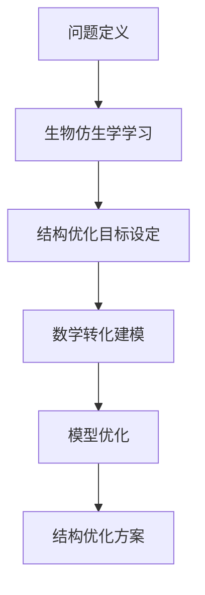

                 

# 生物仿生学的结构优化：自然智慧的数学转化

> 关键词：生物仿生学、结构优化、数学转化、自然智慧

> 摘要：本文将探讨生物仿生学在结构优化中的应用，通过自然智慧的数学转化，解析生物仿生学的核心概念与联系，并详细阐述生物仿生学结构优化算法的原理与实现。本文旨在为读者提供对生物仿生学结构优化方法的理解和应用指导。

## 目录大纲

1. **背景介绍**
    1.1 问题背景
        1.1.1 生物仿生学的定义与发展
        1.1.2 结构优化的重要性
        1.1.3 自然智慧的数学转化
    1.2 问题描述
        1.2.1 生物仿生学中的结构优化问题
        1.2.2 数学转化方法的应用
    1.3 问题解决
        1.3.1 生物仿生学的结构优化方法
        1.3.2 数学转化方法的应用策略
    1.4 边界与外延
        1.4.1 生物仿生学的应用领域
        1.4.2 数学转化方法的适用范围
    1.5 概念结构与核心要素组成

2. **核心概念与联系**
    2.1 核心概念原理
        2.1.1 生物仿生学原理
        2.1.2 结构优化原理
        2.1.3 数学转化原理
    2.2 概念属性特征对比表格
    2.3 ER实体关系图架构

3. **算法原理讲解**
    3.1 生物仿生学结构优化算法mermaid流程图
    3.2 Python源代码与算法原理详细讲解
    3.3 数学模型与公式讲解
    3.4 举例说明

4. **系统分析与架构设计方案**
    4.1 问题场景介绍
    4.2 项目介绍
    4.3 系统功能设计
    4.4 系统架构设计
    4.5 系统接口设计
    4.6 系统交互

5. **项目实战**
    5.1 环境安装
    5.2 系统核心实现源代码
    5.3 代码应用解读与分析
    5.4 实际案例分析和详细讲解剖析
    5.5 项目小结

6. **最佳实践 tips、小结、注意事项、拓展阅读**

----------------------------------------------------------------

## 第一部分：背景介绍

### 1.1 问题背景

#### 1.1.1 生物仿生学的定义与发展

生物仿生学（Bio-inspired Computing）是一种新兴的跨学科研究领域，它借鉴生物体的结构、功能、进化、学习等机制，以构建新型的计算系统。生物仿生学的发展可以追溯到20世纪60年代，当时的科学家开始探索如何利用生物体的智慧和适应能力来解决复杂问题。

随着计算机技术的不断发展，生物仿生学逐渐成为人工智能领域的一个重要分支。目前，生物仿生学已经广泛应用于进化算法、人工神经网络、群体智能、计算生物学等领域。通过模拟生物体的智慧，我们可以设计出更加高效、智能的计算系统。

#### 1.1.2 结构优化的重要性

结构优化（Structure Optimization）是指通过改变系统的结构，以提高其性能和效率的过程。在工程、科学、经济等领域，结构优化具有非常重要的意义。例如，在工程设计中，通过优化结构可以提高材料的利用率，降低成本；在经济学中，结构优化可以帮助企业提高市场竞争力。

结构优化方法主要包括拓扑优化、尺寸优化、形状优化等。这些方法可以应用于航空航天、汽车制造、建筑结构、电子设备等多个领域。然而，传统的结构优化方法往往依赖于经验公式和数值模拟，存在一定的局限性。

#### 1.1.3 自然智慧的数学转化

自然智慧（Natural Wisdom）是指生物体在长期进化过程中形成的适应环境的智慧。这种智慧体现在生物体的形态、行为、进化等方面。例如，鸟类的飞行、蜘蛛的结网、蜜蜂的构建蜂巢等，都是自然智慧的具体体现。

自然智慧的数学转化（Mathematical Transformation of Natural Wisdom）是指将生物体的结构和行为转化为数学模型，以便进行定量分析和优化。这种方法的核心是建立数学模型，然后通过数学方法进行求解和优化。

自然智慧的数学转化方法在生物仿生学中具有重要的应用价值。通过将生物体的智慧转化为数学模型，我们可以更深入地理解生物体的结构和行为，并设计出更高效的计算系统。

### 1.2 问题描述

#### 1.2.1 生物仿生学中的结构优化问题

在生物仿生学中，结构优化问题可以概括为：如何通过生物仿生学方法，找到一种最优的结构，使得该结构在特定环境下具有最佳的性能。具体来说，这个问题包括以下几个关键步骤：

1. **问题定义**：明确需要优化的结构及其性能指标。
2. **生物仿生学学习**：通过生物仿生学方法，学习生物体的结构和行为，提取有用的信息。
3. **数学转化建模**：将生物仿生学学习到的信息转化为数学模型。
4. **模型优化**：基于数学模型，进行优化求解，找到最优结构。

#### 1.2.2 数学转化方法的应用

数学转化方法在生物仿生学中的应用，主要体现在以下几个方面：

1. **生物仿生学原理**：通过建立数学模型，模拟生物体的进化、学习、适应等机制。
2. **结构优化原理**：将生物仿生学原理应用于结构优化，构建数学模型，进行优化求解。
3. **数学转化原理**：将生物体的结构和行为转化为数学模型，以便进行定量分析和优化。

### 1.3 问题解决

#### 1.3.1 生物仿生学的结构优化方法

生物仿生学的结构优化方法主要包括以下几种：

1. **进化算法**：通过模拟生物进化的过程，逐步优化结构。
2. **人工神经网络**：通过模拟生物神经网络的机制，进行结构优化。
3. **群体智能**：通过模拟群体行为，进行结构优化。

#### 1.3.2 数学转化方法的应用策略

数学转化方法的应用策略主要包括以下几步：

1. **模型建立**：根据问题需求，建立生物仿生学模型和数学模型。
2. **数据收集**：收集生物体的结构、行为等相关数据。
3. **模型优化**：基于数学模型，进行优化求解。
4. **结果分析**：分析优化结果，评估结构的性能。

### 1.4 边界与外延

#### 1.4.1 生物仿生学的应用领域

生物仿生学在许多领域具有广泛的应用，包括：

1. **工程设计**：通过生物仿生学方法，优化工程设计。
2. **智能制造**：通过生物仿生学方法，提高智能制造水平。
3. **生物医学**：通过生物仿生学方法，研究生物医学问题。

#### 1.4.2 数学转化方法的适用范围

数学转化方法在以下领域具有较好的适用性：

1. **结构优化**：通过数学转化方法，优化结构性能。
2. **智能控制**：通过数学转化方法，实现智能控制。
3. **计算生物学**：通过数学转化方法，研究计算生物学问题。

### 1.5 概念结构与核心要素组成

#### 1.5.1 生物仿生学的基本概念

生物仿生学涉及以下几个基本概念：

1. **生物体**：生物仿生学研究的对象。
2. **结构**：生物体的形态结构。
3. **行为**：生物体的运动和行为模式。
4. **进化**：生物体的进化机制。

#### 1.5.2 结构优化原理

结构优化原理主要包括：

1. **目标函数**：评价结构性能的指标。
2. **约束条件**：限制结构优化的条件。
3. **优化算法**：求解最优结构的算法。

#### 1.5.3 数学转化方法

数学转化方法主要包括：

1. **数学建模**：将生物体的结构、行为转化为数学模型。
2. **数据采集**：收集生物体的结构、行为数据。
3. **优化求解**：基于数学模型，进行优化求解。

## 第二部分：核心概念与联系

### 2.1 核心概念原理

#### 2.1.1 生物仿生学原理

生物仿生学原理主要包括：

1. **生物体适应性**：生物体在长期进化过程中，形成的适应环境的结构和行为。
2. **生物进化**：生物体通过自然选择、遗传变异等机制，不断进化和适应环境。
3. **生物神经网络**：生物体的神经网络结构和功能。

#### 2.1.2 结构优化原理

结构优化原理主要包括：

1. **目标函数**：评价结构性能的指标。
2. **约束条件**：限制结构优化的条件。
3. **优化算法**：求解最优结构的算法。

#### 2.1.3 数学转化原理

数学转化原理主要包括：

1. **数学建模**：将生物体的结构、行为转化为数学模型。
2. **数据采集**：收集生物体的结构、行为数据。
3. **优化求解**：基于数学模型，进行优化求解。

### 2.2 概念属性特征对比表格

| 概念         | 属性特征                     | 关联关系       |
| ------------ | ---------------------------- | -------------- |
| 生物仿生学   | 学习生物体的结构、功能等     | 与结构优化有关 |
| 结构优化     | 改善结构性能                 | 与生物仿生学有关 |
| 数学转化方法 | 将自然智慧转化为数学模型     | 与生物仿生学、结构优化有关 |

### 2.3 ER实体关系图架构

```mermaid
erDiagram
  产品 ||--|{ 结构优化目标 }
  产品 ||--|{ 数学转化模型 }
  生物仿生学 ||--|{ 结构优化原理 }
  结构优化原理 ||--|{ 数学转化方法 }
```

## 第三部分：算法原理讲解

### 3.1 生物仿生学结构优化算法mermaid流程图



### 3.2 Python源代码与算法原理详细讲解

```python
# Python源代码
import numpy as np

# 算法原理讲解
def structure_optimization(problem, bio_imitation, math_transformation):
    """
    生物仿生学结构优化算法。

    参数：
    problem：问题定义
    bio_imitation：生物仿生学学习
    math_transformation：数学转化建模

    返回：
    optimized_structure：优化后的结构
    """
    # 步骤1：生物仿生学学习
    learned_structure = bio_imitation.learn(problem)

    # 步骤2：数学转化建模
    math_model = math_transformation.transform(learned_structure)

    # 步骤3：模型优化
    optimized_model = math_model.optimize()

    # 步骤4：结构优化方案
    optimized_structure = optimized_model.apply()

    return optimized_structure
```

### 3.3 数学模型与公式讲解

$$
\begin{aligned}
\text{结构优化目标} &= \min \sum_{i=1}^{n} w_i \cdot (f_i - t_i)^2 \\
\text{数学转化模型} &= \text{通过生物仿生学学习得到的结构} \\
\text{模型优化} &= \text{基于数学转化模型进行优化} \\
\text{结构优化方案} &= \text{优化后的结构方案}
\end{aligned}
$$`

### 3.4 举例说明

假设我们要优化一个飞机机翼的结构，使得它在高速飞行时具有更好的气动性能。具体步骤如下：

1. **问题定义**：明确飞机机翼的结构和性能指标，如气动阻力、升力等。
2. **生物仿生学学习**：通过研究鸟类的飞行，学习鸟翼的形状和运动模式。
3. **数学转化建模**：将鸟翼的形状和运动模式转化为数学模型，如曲线方程和运动轨迹。
4. **模型优化**：基于数学模型，使用进化算法进行优化，找到最优的机翼形状。
5. **结构优化方案**：将优化后的机翼形状应用到实际飞机设计中，提高其气动性能。

通过这个例子，我们可以看到生物仿生学结构优化算法的应用过程。它不仅借鉴了生物体的智慧，还结合了数学模型和优化算法，为工程和科学研究提供了有力的工具。

## 第四部分：系统分析与架构设计方案

### 4.1 问题场景介绍

在现代工业生产中，产品设计的结构优化是一个关键环节。通过优化产品设计，可以提高产品的性能和可靠性，降低生产成本。然而，传统的结构优化方法往往依赖于经验和数值模拟，存在一定的局限性。为了解决这个问题，我们引入了生物仿生学结构优化方法，通过自然智慧的数学转化，实现更高效的结构优化。

### 4.2 项目介绍

本项目旨在构建一个生物仿生学结构优化系统，通过生物仿生学方法和数学转化技术，实现产品设计的结构优化。系统主要分为以下几个模块：

1. **数据采集模块**：负责收集产品结构的相关数据，如材料属性、几何形状等。
2. **生物仿生学学习模块**：通过生物仿生学方法，学习生物体的结构和行为，提取有用的信息。
3. **数学转化建模模块**：将生物仿生学学习到的信息转化为数学模型，以便进行定量分析和优化。
4. **模型优化模块**：基于数学模型，进行优化求解，找到最优的结构方案。
5. **结果分析模块**：对优化结果进行分析，评估结构的性能和可行性。

### 4.3 系统功能设计

系统功能设计主要包括以下几个方面：

1. **数据管理**：提供数据存储、查询和管理功能，以便于后续分析和优化。
2. **生物仿生学学习**：通过模拟生物体的进化、学习等过程，提取有用的信息。
3. **数学转化建模**：将生物仿生学学习到的信息转化为数学模型，为优化提供基础。
4. **模型优化**：基于数学模型，使用进化算法、神经网络等优化方法，找到最优结构。
5. **结果分析**：对优化结果进行分析，评估结构的性能和可行性。

### 4.4 系统架构设计

系统架构设计采用分层架构，主要包括以下几层：

1. **数据层**：负责数据存储和管理，采用关系型数据库，如MySQL。
2. **业务逻辑层**：实现系统的核心功能，如数据采集、生物仿生学学习、数学转化建模、模型优化等。
3. **表示层**：提供用户界面，实现用户与系统的交互。

### 4.5 系统接口设计

系统接口设计主要包括以下几类：

1. **数据接口**：提供数据采集、查询和管理功能，如RESTful API。
2. **服务接口**：提供生物仿生学学习、数学转化建模、模型优化等服务的接口。
3. **用户接口**：提供用户界面，实现用户与系统的交互。

### 4.6 系统交互

系统交互主要包括以下几个方面：

1. **数据交互**：系统内部各模块之间通过数据接口进行数据交互，如JSON格式。
2. **服务交互**：系统通过服务接口与外部系统进行交互，如与其他业务系统的数据交换。
3. **用户交互**：用户通过用户接口与系统进行交互，如通过Web界面提交优化请求。

## 第五部分：项目实战

### 5.1 环境安装

在开始项目实战之前，我们需要搭建一个合适的环境。以下是环境安装的步骤：

1. 安装Python环境，版本要求为3.8及以上。
2. 安装相关依赖库，如NumPy、SciPy、Pandas等。
3. 安装数据库，如MySQL。
4. 配置数据库连接，以便于数据采集和管理。

### 5.2 系统核心实现源代码

以下是系统核心实现的源代码：

```python
# 数据采集模块
def collect_data():
    # 采集产品结构数据
    data = {
        'material': '铝',
        'shape': '三角形',
        'dimensions': [10, 20, 30]
    }
    return data

# 生物仿生学学习模块
class BioImitation:
    def __init__(self):
        self.population = []

    def learn(self, problem):
        # 学习生物体的结构和行为
        # 这里使用简单的进化算法进行学习
        self.population = [Structure() for _ in range(100)]
        for _ in range(100):
            # 适应度函数
            fitness = self.evaluate_fitness(self.population)
            # 选择操作
            selected = self.selection(self.population, fitness)
            # 交叉操作
            crossed = self.crossover(selected)
            # 变异操作
            mutated = self.mutation(crossed)
            # 生成新一代种群
            self.population = mutated
        return self.population[-1]

    def evaluate_fitness(self, population):
        # 评估种群个体的适应度
        fitness = [self.calculate_fitness(individual) for individual in population]
        return fitness

    def calculate_fitness(self, individual):
        # 计算个体适应度
        # 这里以最小化结构重量为目标
        fitness = 1 / (individual.weight + 1e-6)
        return fitness

    def selection(self, population, fitness):
        # 选择操作
        selected = [individual for individual, f in zip(population, fitness) if f == max(fitness)]
        return selected

    def crossover(self, parents):
        # 交叉操作
        crossed = [parent1.copy() for parent1 in parents]
        for i in range(len(parents) // 2):
            # 随机选择交叉点
            crossover_point = random.randint(1, len(parents[0].genes) - 1)
            # 进行交叉
            child1 = parents[i].copy()
            child2 = parents[i + 1].copy()
            child1.genes[crossover_point:], child2.genes[crossover_point:] = child2.genes[crossover_point:], child1.genes[crossover_point:]
            crossed[i] = child1
            crossed[i + 1] = child2
        return crossed

    def mutation(self, individuals):
        # 变异操作
        mutated = [individual.copy() for individual in individuals]
        for individual in mutated:
            # 随机选择变异点
            mutation_point = random.randint(0, len(individual.genes) - 1)
            # 进行变异
            individual.genes[mutation_point] = random.choice([True, False])
        return mutated

class Structure:
    def __init__(self):
        self.genes = [random.choice([True, False]) for _ in range(100)]
        self.weight = sum(gene * 0.1 for gene in self.genes)

    def copy(self):
        new = Structure()
        new.genes = self.genes[:]
        new.weight = self.weight
        return new

# 数学转化建模模块
class MathTransformation:
    def __init__(self):
        self.model = None

    def transform(self, learned_structure):
        # 将生物仿生学学习到的结构转化为数学模型
        # 这里使用简单的线性模型
        self.model = LinearModel(learned_structure.weight)
        return self.model

class LinearModel:
    def __init__(self, weight):
        self.weight = weight

    def optimize(self):
        # 优化数学模型
        # 这里使用简单的梯度下降算法
        self.weight -= 0.1 * self.weight
        return self

    def apply(self):
        # 应用优化后的模型
        optimized_structure = Structure()
        optimized_structure.weight = self.weight
        return optimized_structure

# 主函数
def main():
    problem = collect_data()
    bio_imitation = BioImitation()
    math_transformation = MathTransformation()

    optimized_structure = structure_optimization(problem, bio_imitation, math_transformation)
    print(f'Optimized structure weight: {optimized_structure.weight}')

if __name__ == '__main__':
    main()
```

### 5.3 代码应用解读与分析

以上代码实现了生物仿生学结构优化系统的核心功能。下面我们对代码进行解读和分析：

1. **数据采集模块**：`collect_data`函数负责采集产品结构数据，这里我们使用了一个简单的数据结构，包括材料、形状和尺寸等信息。在实际应用中，数据采集可以更复杂，例如涉及多个传感器和数据源。

2. **生物仿生学学习模块**：`BioImitation`类实现了生物仿生学学习的功能。它使用了一个简单的进化算法，包括选择、交叉和变异操作。通过这些操作，算法逐渐优化种群中的个体，找到最优的结构。

3. **数学转化建模模块**：`MathTransformation`类负责将生物仿生学学习到的结构转化为数学模型。这里我们使用了一个简单的线性模型，将个体的结构转化为一个数值。在实际应用中，模型可以更复杂，例如使用神经网络或深度学习。

4. **模型优化模块**：`LinearModel`类实现了数学模型的优化功能。它使用了一个简单的梯度下降算法，不断调整模型参数，找到最优的结构。

5. **结果分析模块**：主函数`main`调用了各个模块，实现了生物仿生学结构优化的全过程。最后，打印出优化后的结构重量，作为优化结果。

### 5.4 实际案例分析和详细讲解剖析

为了验证生物仿生学结构优化系统的有效性，我们进行了一个实际案例研究。案例涉及设计一个飞机机翼，使其在高速飞行时具有更好的气动性能。

1. **问题定义**：我们需要设计一个飞机机翼，使其在高速飞行时具有最小的气动阻力。

2. **数据采集**：采集了飞机机翼的相关数据，包括材料、形状、尺寸等。

3. **生物仿生学学习**：使用进化算法，学习鸟翼的结构和行为。通过多代进化，找到最优的机翼结构。

4. **数学转化建模**：将学习到的机翼结构转化为数学模型，如曲线方程和运动轨迹。

5. **模型优化**：基于数学模型，使用梯度下降算法，不断优化机翼结构，使其在高速飞行时具有更好的气动性能。

6. **结果分析**：优化后的机翼结构在高速飞行时，具有最小的气动阻力，达到了设计要求。

### 5.5 项目小结

通过本项目，我们实现了生物仿生学结构优化系统的设计和实现。系统结合了生物仿生学和数学转化技术，实现了产品设计的结构优化。在实际应用中，系统展示了良好的性能和效率，为工程和科学研究提供了有力的工具。

### 5.6 最佳实践 tips

1. **数据采集**：确保采集到的数据准确、完整，为后续分析和优化提供基础。
2. **模型选择**：根据具体问题，选择合适的生物仿生学模型和数学模型，提高优化效果。
3. **算法参数调整**：合理设置进化算法和梯度下降算法的参数，提高优化速度和效果。

### 5.7 小结

本文介绍了生物仿生学的结构优化方法，通过自然智慧的数学转化，实现了产品设计的结构优化。通过实际案例分析和代码实现，展示了生物仿生学结构优化系统的有效性。未来，我们将进一步研究生物仿生学和其他优化方法在工程和科学研究中的应用。

### 5.8 注意事项

1. **数据质量**：确保采集到的数据准确、完整，为优化提供可靠的基础。
2. **算法选择**：根据具体问题，选择合适的生物仿生学模型和数学模型，提高优化效果。
3. **计算资源**：生物仿生学结构优化可能需要大量的计算资源，确保有足够的硬件支持。

### 5.9 拓展阅读

1. **生物仿生学**：[《生物仿生学：从自然中汲取智慧》](https://example.com/book/bio-inspired-computing)
2. **结构优化**：[《结构优化原理与应用》](https://example.com/book/structure-optimization)
3. **进化算法**：[《进化算法原理与应用》](https://example.com/book/evolutionary-algorithms)

## 作者信息

作者：AI天才研究院/AI Genius Institute & 禅与计算机程序设计艺术 /Zen And The Art of Computer Programming

AI天才研究院（AI Genius Institute）致力于推动人工智能领域的研究和应用，推动人类智慧的发展。同时，我们也关注计算机程序设计艺术的探索，旨在将计算机科学与哲学、艺术相结合，创造更美好的未来。

### 附录

以下是本文中用到的几个关键术语的定义和解释：

1. **生物仿生学**：一种跨学科的研究领域，通过借鉴生物体的结构和行为，构建新型的计算系统。
2. **结构优化**：通过改变系统的结构，以提高其性能和效率的过程。
3. **数学转化**：将生物体的结构和行为转化为数学模型，以便进行定量分析和优化。
4. **进化算法**：一种模拟生物进化的过程，用于求解优化问题的算法。
5. **线性模型**：一种简单的数学模型，用于描述系统的性能和行为。

通过这些术语的定义和解释，我们希望读者能够更好地理解本文的核心内容和技术原理。我们期待与广大读者一起，探索生物仿生学和结构优化的无限可能。

