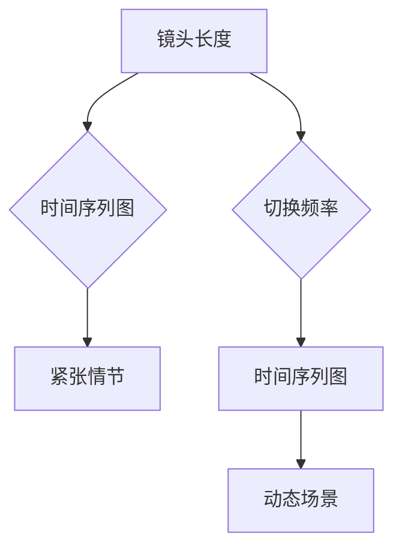
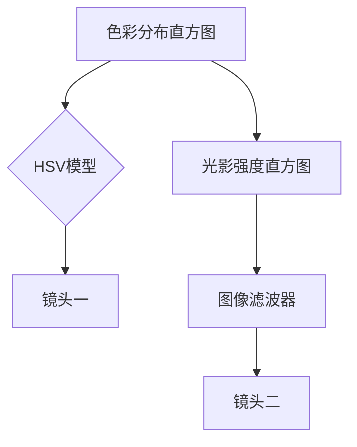
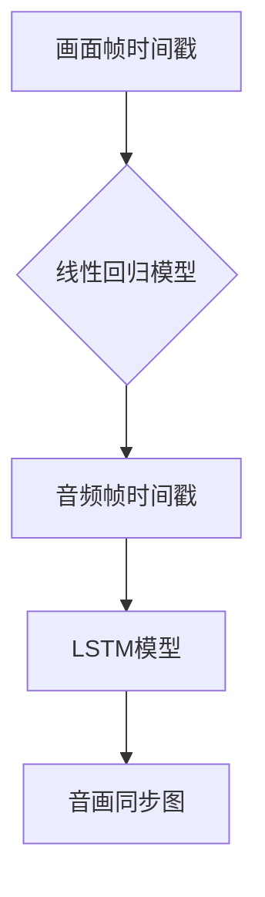

                 

### 电影剪辑与时间序列分析概述

电影剪辑作为电影制作过程中的关键环节，对影片的整体艺术效果有着至关重要的影响。剪辑不仅仅是简单的剪接，它涉及到对时间序列的巧妙操作，通过对镜头长度、剪辑速度、节奏变化等的调整，实现视觉和听觉上的和谐统一，进而塑造出影片的视觉韵律。这种视觉韵律，可以理解为观众在观看电影时感受到的节奏感、流畅感，它直接影响到观众的观影体验和情感共鸣。

时间序列分析（Time Series Analysis）是统计学和数据分析领域中的一种重要方法，主要研究如何通过时间维度上的数据来提取信息和预测未来趋势。在电影剪辑中，时间序列分析被广泛应用，通过对镜头长度、切换频率等时间序列数据的分析，可以更好地理解影片的节奏变化，优化剪辑效果，达到预期的艺术效果。

### 时间序列分析的定义与作用

时间序列分析是一种用于处理和分析按时间顺序排列的数据的方法。这些数据可以是连续的，如一天内的气温变化，也可以是离散的，如股票价格的每日波动。时间序列分析的核心在于识别数据中的趋势、周期性和随机性成分，以便更好地理解数据的内在规律，并对其进行预测。

在电影剪辑中，时间序列分析的作用主要体现在以下几个方面：

1. **节奏控制**：通过分析镜头长度和切换频率，可以精确控制电影的节奏。适当的节奏变化能够引导观众的情绪，增强观影体验。
2. **情感表达**：时间序列分析可以帮助剪辑师更好地传达影片的情感内容。例如，在紧张的剧情中，通过加快剪辑速度和缩短镜头长度，可以增强紧张气氛；在温馨的剧情中，通过减缓剪辑速度和延长镜头长度，可以营造舒缓的氛围。
3. **视觉效果优化**：通过对时间序列数据的分析，剪辑师可以优化镜头的视觉效果，确保画面流畅自然，避免突兀的剪辑效果。

### 数学模型在电影剪辑中的应用背景

数学模型作为一种抽象的数学表达方式，可以描述复杂系统的行为和规律。在电影剪辑中，数学模型的应用使得剪辑过程更加科学和精确。常见的数学模型包括马尔可夫模型、线性回归模型和人工神经网络模型等。

1. **马尔可夫模型**：马尔可夫模型在电影剪辑中的应用主要体现在镜头切换的预测上。通过分析历史镜头切换的数据，马尔可夫模型可以预测下一个镜头的切换概率，从而优化剪辑效果。

2. **线性回归模型**：线性回归模型用于分析镜头长度和切换频率与影片节奏的关系。通过建立回归模型，剪辑师可以更精确地控制电影的节奏，达到预期的艺术效果。

3. **人工神经网络模型**：人工神经网络模型在电影剪辑中的应用主要体现在自动剪辑和视频生成上。通过训练神经网络，可以自动化地分析影片内容，生成符合艺术要求的剪辑方案。

总的来说，数学模型在电影剪辑中的应用使得剪辑过程更加科学、高效，极大地提升了电影的艺术质量和观赏效果。接下来，我们将进一步探讨时间序列分析的基础知识，为后续的内容做好铺垫。

### 时间序列数据的基本概念

时间序列数据是按照特定时间顺序排列的数据集合，这些数据可以是连续的，如一天内的股票价格变化；也可以是离散的，如不同时间点的气象数据。时间序列数据的基本概念包括时间序列的定义、数据类型和特点，这些概念为我们理解和分析时间序列数据提供了基础。

#### 时间序列的定义

时间序列（Time Series）是指一系列按时间顺序排列的数据点，每个数据点代表了某一特定时间点的数值。时间序列数据通常用 \(X_t\) 表示，其中 \(t\) 代表时间点，\(X_t\) 是在时间点 \(t\) 的观测值。时间序列数据通常具备以下特点：

- **时间依赖性**：时间序列中的每一个数据点都依赖于前面的数据点，即后一个数据点往往受前一个数据点的影响。
- **周期性**：某些时间序列数据会表现出周期性的波动，如季节性因素对零售销售数据的影响。
- **趋势性**：时间序列数据可能随时间呈现出增长或减少的趋势。

例如，一天内的气温数据可以构成一个时间序列，每天的气温值按时间顺序排列，形成时间序列数据。这种数据不仅反映了气温的变化，还可能揭示出季节性和趋势性变化。

#### 时间序列数据的类型

根据时间序列数据的特点，可以分为以下几类：

1. **确定性时间序列**：这种时间序列中的数据点可以通过简单的数学公式或模型来描述。例如，一天内的标准时钟时间是一个确定性时间序列，每个时间点的数据可以通过当前的时间公式计算得到。

2. **随机性时间序列**：这种时间序列中的数据点受到随机因素的影响，无法通过简单的数学公式描述。股票价格时间序列是一个典型的随机性时间序列，其数据点受到市场供需、投资者情绪等多种随机因素的影响。

3. **趋势性时间序列**：这种时间序列中的数据点呈现出明显的趋势性变化，例如，人口统计数据通常表现出长期的增长趋势。

4. **季节性时间序列**：这种时间序列中的数据点受到季节性因素的影响，表现出周期性的波动。例如，零售销售数据在圣诞节和新年期间会显著增加。

5. **复合时间序列**：这种时间序列同时包含趋势性、季节性和随机性成分。例如，天气数据通常表现出季节性趋势，同时受到随机性因素的影响。

#### 时间序列数据的特点

时间序列数据具有以下特点：

- **时序性**：时间序列数据是按时间顺序排列的，后一个数据点是前一个数据点的延续。
- **依赖性**：时间序列中的数据点之间存在时间依赖关系，即当前的数据点受之前数据点的影响。
- **趋势性**：时间序列数据可能表现出长期的上升或下降趋势。
- **周期性**：时间序列数据可能受到周期性因素的影响，如季节性波动。
- **随机性**：时间序列数据受到随机因素的影响，这使得数据预测变得复杂。

了解时间序列数据的基本概念、类型和特点，有助于我们更好地分析和理解时间序列数据，从而为电影剪辑中的时间序列分析提供坚实的理论基础。

### 时间序列分析方法综述

时间序列分析方法旨在通过分析时间序列数据，提取有价值的信息并预测未来的趋势。这些方法可以分为经典方法和现代方法两大类。经典方法主要包括平稳时间序列分析和非平稳时间序列分析，而现代方法则包括机器学习和深度学习等技术。以下将分别介绍这些方法及其在电影剪辑中的具体应用。

#### 经典时间序列分析方法

1. **平稳时间序列分析**：平稳时间序列分析主要针对那些不随时间变化而变化的序列。常用的方法包括自回归移动平均模型（ARMA）、自回归积分滑动平均模型（ARIMA）和移动平均模型（MA）。

    - **自回归移动平均模型（ARMA）**：ARMA模型结合了自回归（AR）和移动平均（MA）模型的特点，可以用于分析和预测时间序列数据。自回归部分通过前期的数据点来预测当前值，而移动平均部分则通过前期误差值来预测当前值。

    $$X_t = c + \phi_1 X_{t-1} + \phi_2 X_{t-2} + \cdots + \phi_p X_{t-p} + \varepsilon_t$$

    $$\varepsilon_t = \theta_1 \varepsilon_{t-1} + \theta_2 \varepsilon_{t-2} + \cdots + \theta_q \varepsilon_{t-q} + \eta_t$$

    其中，\(X_t\) 为时间序列的当前值，\(\varepsilon_t\) 为白噪声误差项，\(\phi_i\) 和 \(\theta_j\) 为模型参数。

    - **自回归积分滑动平均模型（ARIMA）**：ARIMA模型在ARMA模型的基础上，增加了差分操作，用于处理非平稳时间序列。ARIMA模型的一般形式如下：

    $$X_t = c + \phi_1 X_{t-1} + \phi_2 X_{t-2} + \cdots + \phi_p X_{t-p} + \varepsilon_t$$

    $$\varepsilon_t = \theta_1 \varepsilon_{t-1} + \theta_2 \varepsilon_{t-2} + \cdots + \theta_q \varepsilon_{t-q} + \eta_t$$

    其中，\(c\) 为常数项，\(p\) 和 \(q\) 分别为自回归和移动平均部分的阶数。

    - **移动平均模型（MA）**：MA模型仅包含移动平均部分，不考虑自回归因素。其基本形式为：

    $$X_t = \theta_1 \varepsilon_{t-1} + \theta_2 \varepsilon_{t-2} + \cdots + \theta_q \varepsilon_{t-q} + \eta_t$$

    在电影剪辑中，平稳时间序列分析可以用于分析镜头长度和切换频率，以实现节奏控制。

2. **非平稳时间序列分析**：非平稳时间序列分析主要针对那些随时间变化而变化的序列，通常需要进行差分处理。常用的方法包括差分自回归移动平均模型（ARIMA）、季节性分解和霍尔特-温特斯模型（Holt-Winters）。

    - **差分自回归移动平均模型（ARIMA）**：与非平稳时间序列分析相关的ARIMA模型，通过差分操作使序列变得平稳。差分操作包括一阶差分和二阶差分，使得序列具有稳定的自回归特性。

    $$X_t^{\Delta} = X_t - X_{t-1}$$

    $$X_t^{\Delta\Delta} = X_t^{\Delta} - X_{t-1}^{\Delta}$$

    - **季节性分解**：季节性分解方法用于识别时间序列中的季节性成分，将其分离出来以便单独处理。常用的方法包括加法模型和乘法模型：

    $$X_t = \hat{X}_t + \hat{S}_t$$

    $$X_t = \hat{X}_t \hat{S}_t$$

    其中，\(\hat{X}_t\) 表示趋势部分，\(\hat{S}_t\) 表示季节性部分。

    - **霍尔特-温特斯模型（Holt-Winters）**：霍尔特-温特斯模型是处理季节性时间序列的一种经典方法，通过结合趋势和季节性成分，可以更好地预测未来的值。

    $$X_t = \alpha \cdot (X_{t-1} + b_t) + (1-\alpha) \cdot \hat{X}_{t-1} + \gamma \cdot (S_{t-1} + c_t) + (1-\gamma) \cdot \hat{S}_{t-1}$$

    $$b_t = b_{t-1} + \phi \cdot (X_t - b_{t-1})$$

    $$c_t = c_{t-1} + \theta \cdot (S_t - c_{t-1})$$

    其中，\(b_t\) 和 \(c_t\) 分别表示趋势修正项和季节性修正项，\(\alpha\) 和 \(\gamma\) 为平滑参数，\(\phi\) 和 \(\theta\) 为季节性修正参数。

    在电影剪辑中，非平稳时间序列分析可以帮助识别镜头长度和切换频率中的趋势性和季节性变化，从而实现更精确的节奏控制。

#### 现代时间序列分析方法

1. **机器学习方法**：机器学习方法在时间序列分析中的应用日益广泛，包括回归分析、支持向量机（SVM）、随机森林（RF）等。这些方法可以自动识别时间序列中的复杂模式，提高预测准确性。

    - **回归分析**：回归模型可以用于预测时间序列的未来值。线性回归模型是一种常见的选择，可以通过最小化误差平方和来拟合数据。

    $$y_t = \beta_0 + \beta_1 x_t + \varepsilon_t$$

    其中，\(y_t\) 和 \(x_t\) 分别为因变量和自变量，\(\beta_0\) 和 \(\beta_1\) 为回归系数。

    - **支持向量机（SVM）**：SVM是一种强大的分类和回归方法，可以通过核函数将时间序列数据映射到高维空间，实现更精确的预测。

    $$\min_{\beta, \beta_0, \varepsilon} \frac{1}{2} ||\beta||^2 + C \sum_{i=1}^n \varepsilon_i$$

    其中，\(\beta\) 和 \(\beta_0\) 分别为权重和偏置，\(C\) 为惩罚参数，\(\varepsilon_i\) 为误差项。

    - **随机森林（RF）**：随机森林是一种集成学习方法，通过构建多个决策树，并结合它们的预测结果来提高预测准确性。随机森林可以处理高维数据，并具有很好的泛化能力。

2. **深度学习方法**：深度学习方法是近年来时间序列分析领域的一大突破，包括循环神经网络（RNN）、长短期记忆网络（LSTM）和卷积神经网络（CNN）等。

    - **循环神经网络（RNN）**：RNN是一种能够处理序列数据的神经网络，其核心思想是保持状态，即当前时间步的输出依赖于前面的时间步。然而，传统的RNN存在梯度消失和梯度爆炸问题。

    - **长短期记忆网络（LSTM）**：LSTM是RNN的一种改进，通过引入门控机制，解决了RNN的长期依赖问题。LSTM包括输入门、遗忘门和输出门，可以有效地控制信息的流入和流出。

    $$i_t = \sigma(W_i \cdot [h_{t-1}, x_t] + b_i)$$

    $$f_t = \sigma(W_f \cdot [h_{t-1}, x_t] + b_f)$$

    $$g_t = \tanh(W_g \cdot [h_{t-1}, x_t] + b_g)$$

    $$o_t = \sigma(W_o \cdot [h_{t-1}, g_t] + b_o)$$

    其中，\(i_t\)、\(f_t\)、\(g_t\) 和 \(o_t\) 分别为输入门、遗忘门、输入门和输出门的激活值，\(\sigma\) 为 sigmoid 函数。

    - **卷积神经网络（CNN）**：CNN是一种基于卷积操作的神经网络，可以有效地提取时间序列数据中的特征。CNN通过卷积层、池化层和全连接层，实现对时间序列数据的分析和预测。

    在电影剪辑中，现代时间序列分析方法可以用于自动剪辑和视频生成。通过深度学习模型，可以自动识别影片中的关键镜头和情感内容，生成符合艺术要求的剪辑方案。

综上所述，时间序列分析方法在电影剪辑中发挥着重要作用，通过经典方法和现代方法的分析和预测，可以优化电影的节奏和视觉效果，提升观众的观影体验。接下来，我们将探讨视觉韵律的特征提取与建模方法，为电影剪辑的时间序列分析提供更深入的见解。

### 视觉韵律的基本特征

视觉韵律在电影剪辑中扮演着至关重要的角色，它不仅影响到电影的节奏感，还对观众的情感体验产生深远的影响。为了深入理解视觉韵律，我们需要分析其基本特征，包括镜头长度、切换频率和画面变化等。

#### 镜头长度

镜头长度是指单个镜头在屏幕上显示的时间长度。镜头长度直接影响观众对场景的感知和情感反应。一般来说，较长的镜头可以提供更详细的信息，使观众有足够的时间去理解和消化画面内容；而较短的镜头则可以增加影片的紧张感和动感。以下是几种常见的镜头长度：

1. **长镜头**：通常指超过5秒的镜头。长镜头有助于展现场景的完整性和连贯性，增强观众的沉浸感。例如，在描绘平静的场景时，使用长镜头可以让观众感受到宁静的氛围。
   
2. **中镜头**：通常指2至5秒的镜头。中镜头适合用来展示角色间的互动和情绪变化，既能提供足够的时间让观众理解情节，又不会造成视觉疲劳。

3. **短镜头**：通常指少于2秒的镜头。短镜头可以迅速切换场景，增加影片的节奏感和动态感，常用于表现快速动作或紧张情节。

#### 切换频率

切换频率是指镜头之间的切换速度。切换频率的变化可以显著影响影片的节奏和情感表达。以下是几种常见的切换频率：

1. **慢切换**：慢切换是指镜头之间切换速度较慢，通常用于表现柔和、宁静的情境。慢切换可以让观众有更多的时间去观察和理解画面，增强观影的沉浸感。

2. **快切换**：快切换是指镜头之间切换速度较快，通常用于表现紧张、动态的情境。快切换可以增加影片的节奏感和紧张感，使观众更加投入到故事情节中。

3. **闪切**：闪切是一种极端的切换方式，通常指在极短的时间内切换镜头，常用于表现强烈的情绪变化或突如其来的事件。

#### 画面变化

画面变化是指镜头中的画面内容如何变化，包括色彩、光影、构图等因素。画面变化直接影响观众的情感体验和视觉感受。以下是几种常见的画面变化：

1. **色彩变化**：通过调整镜头中的色彩，可以影响观众的情感体验。例如，使用暖色调可以营造温馨、浪漫的氛围，而使用冷色调则可以营造冷静、压抑的氛围。

2. **光影变化**：光影变化可以增强画面的立体感和动态感。例如，通过调整光线强度和方向，可以使角色形象更加鲜明，增强故事的戏剧性。

3. **构图变化**：构图变化可以引导观众的视线，增强画面层次感。例如，通过调整镜头的角度和位置，可以突出角色或场景的某个部分，增强观众的视觉焦点。

通过以上分析，我们可以看到，视觉韵律的基本特征——镜头长度、切换频率和画面变化，都在电影剪辑中发挥着重要作用。理解这些特征，可以帮助剪辑师更好地控制影片的节奏，提升影片的艺术质量。接下来，我们将探讨如何提取和建模视觉韵律，为电影剪辑提供更精确的技术支持。

### 视觉韵律的提取方法

视觉韵律的提取是电影剪辑中的一项关键任务，它要求我们能够从电影素材中有效地提取出能够表征视觉韵律的特征信息。这些特征信息不仅能够反映影片的节奏感和情感表达，还能帮助剪辑师在后续的剪辑过程中进行优化和调整。以下将介绍几种常用的视觉韵律提取方法。

#### 特征选择

特征选择是视觉韵律提取的第一步，它涉及到从电影素材中挑选出能够代表视觉韵律的关键特征。常见的特征包括镜头长度、切换频率、色彩分布、光影变化和构图变化等。以下是几种特征选择方法：

1. **基于统计的特征选择**：这种方法通过计算每个特征在整个影片中的平均值、标准差、最大值和最小值等统计指标，来筛选出对视觉韵律影响较大的特征。例如，通过分析镜头长度的分布，可以识别出哪些镜头长度对于整体节奏感最为重要。

2. **基于相关性分析的特征选择**：这种方法通过分析各个特征之间的相关性，筛选出那些高度相关的特征。高度相关的特征往往能够更好地共同表征视觉韵律。例如，镜头长度和切换频率之间可能存在显著的正相关关系，表明切换频率较高的镜头通常长度较短。

3. **基于信息熵的特征选择**：信息熵可以衡量特征包含的信息量，通过计算各个特征的信息熵，可以筛选出信息量较高的特征。信息量较高的特征能够提供更多的关于视觉韵律的信息，有助于更精确地描述影片的节奏和情感。

#### 特征提取

在特征选择的基础上，接下来是特征提取的过程，即从电影素材中具体提取出所选定的特征值。以下是几种常见的特征提取方法：

1. **帧级特征提取**：帧级特征提取是指对每一帧图像进行特征提取，常用的方法包括颜色特征提取、纹理特征提取和运动特征提取等。

    - **颜色特征提取**：颜色特征可以通过计算每一帧图像的颜色直方图来提取。颜色直方图可以反映画面中各种颜色的分布情况，从而表征画面的色彩变化。常用的颜色特征包括红色、绿色、蓝色值的平均值、标准差和峰值频率等。

    - **纹理特征提取**：纹理特征可以通过计算每一帧图像的纹理直方图来提取。纹理直方图可以反映画面中的纹理结构，从而表征画面的光影变化。常用的纹理特征包括局部二值模式（LBP）、灰度共生矩阵（GLCM）和方向梯度直方图（HOG）等。

    - **运动特征提取**：运动特征可以通过计算每一帧图像之间的运动矢量来提取。运动矢量可以反映画面中的物体运动情况，从而表征画面的动态变化。常用的运动特征包括速度、加速度和方向等。

2. **镜头级特征提取**：镜头级特征提取是指对整个镜头进行特征提取，以表征镜头的视觉韵律。常用的方法包括镜头长度、切换频率和镜头速度等。

    - **镜头长度**：镜头长度可以通过计算镜头开始时间和结束时间之间的时间差来提取。镜头长度可以反映影片的节奏变化，是视觉韵律的重要指标。

    - **切换频率**：切换频率可以通过计算镜头之间的切换时间来提取。切换频率可以反映影片的动态感，是视觉韵律的重要指标。

    - **镜头速度**：镜头速度可以通过计算镜头的移动速度来提取。镜头速度可以反映影片的动态感，是视觉韵律的重要指标。

3. **全局特征提取**：全局特征提取是指从整个影片中提取特征，以综合表征影片的视觉韵律。常用的方法包括主成分分析（PCA）和因子分析等。

    - **主成分分析（PCA）**：PCA是一种降维技术，可以通过提取主要成分来表征数据的全局特征。在视觉韵律的提取中，PCA可以用于从大量的帧级特征中提取主要成分，从而简化特征空间，提高计算效率。

    - **因子分析**：因子分析是一种多变量统计分析方法，可以通过提取因子来表征数据的全局特征。在视觉韵律的提取中，因子分析可以用于从多个镜头级特征中提取主要因子，从而简化特征空间，提高计算效率。

#### 特征融合

在特征提取过程中，通常会得到多种不同类型的特征。为了更全面地表征视觉韵律，可以将这些特征进行融合。常见的特征融合方法包括：

1. **特征加权融合**：通过为不同类型的特征赋予不同的权重，进行加权融合。权重可以根据特征的重要性和相关性进行设置，从而提高融合特征的代表性。

2. **特征拼接融合**：将不同类型的特征拼接在一起，形成一个新的特征向量。这种方法可以充分利用各种特征的信息，提高特征表征的全面性。

3. **深度学习融合**：使用深度学习模型，如卷积神经网络（CNN）和长短期记忆网络（LSTM），对多模态特征进行融合。深度学习模型可以通过自动学习不同特征之间的关联性，实现更有效的融合。

通过以上方法，我们可以有效地提取和融合视觉韵律的特征，为后续的建模和优化提供可靠的基础。接下来，我们将探讨如何利用这些提取出的特征来建立视觉韵律的数学模型。

### 视觉韵律的建模方法

在提取出视觉韵律的特征后，下一步便是建立数学模型，以便对视觉韵律进行建模和预测。视觉韵律的建模方法可以分为统计模型、机器学习模型和深度学习模型等。这些模型可以用来分析和优化电影剪辑的节奏，从而提升影片的艺术效果。以下是几种常见的视觉韵律建模方法及其原理。

#### 统计模型

统计模型在视觉韵律建模中是一种简单但有效的方法。常见的统计模型包括线性回归模型、时间序列模型等。

1. **线性回归模型**：线性回归模型是一种简单且直观的建模方法，通过线性关系来预测镜头长度、切换频率等视觉韵律特征。其数学模型如下：

   $$y = \beta_0 + \beta_1 x_1 + \beta_2 x_2 + \cdots + \beta_n x_n + \epsilon$$

   其中，\(y\) 是预测值，\(x_1, x_2, \cdots, x_n\) 是输入特征，\(\beta_0, \beta_1, \beta_2, \cdots, \beta_n\) 是模型参数，\(\epsilon\) 是误差项。

   在视觉韵律建模中，输入特征可以是镜头长度、切换频率等，预测值可以是下一个镜头的长度或切换频率。通过最小化误差平方和，可以估计出模型参数。

2. **时间序列模型**：时间序列模型主要用于分析具有时间依赖性的数据。常见的模型包括ARIMA模型和Holt-Winters模型。

   - **ARIMA模型**：ARIMA模型结合了自回归（AR）、差分（I）和移动平均（MA）的特点，适用于处理非平稳时间序列数据。其数学模型如下：

     $$X_t = c + \phi_1 X_{t-1} + \phi_2 X_{t-2} + \cdots + \phi_p X_{t-p} + \varepsilon_t$$

     $$\varepsilon_t = \theta_1 \varepsilon_{t-1} + \theta_2 \varepsilon_{t-2} + \cdots + \theta_q \varepsilon_{t-q} + \eta_t$$

     其中，\(X_t\) 是时间序列的当前值，\(\varepsilon_t\) 是白噪声误差项，\(\phi_i\) 和 \(\theta_j\) 是模型参数，\(p\) 和 \(q\) 分别为自回归和移动平均部分的阶数。

     通过对时间序列数据进行差分处理，使其变得平稳，然后使用最大似然估计方法估计模型参数。

   - **Holt-Winters模型**：Holt-Winters模型是处理季节性时间序列的一种经典方法，其数学模型如下：

     $$X_t = \alpha \cdot (X_{t-1} + b_t) + (1-\alpha) \cdot \hat{X}_{t-1} + \gamma \cdot (S_{t-1} + c_t) + (1-\gamma) \cdot \hat{S}_{t-1}$$

     $$b_t = b_{t-1} + \phi \cdot (X_t - b_{t-1})$$

     $$c_t = c_{t-1} + \theta \cdot (S_t - c_{t-1})$$

     其中，\(b_t\) 和 \(c_t\) 分别为趋势修正项和季节性修正项，\(\alpha\) 和 \(\gamma\) 为平滑参数，\(\phi\) 和 \(\theta\) 为季节性修正参数。

     通过调整平滑参数，可以控制模型对趋势和季节性的敏感度，实现对视觉韵律的准确建模。

#### 机器学习模型

机器学习模型通过从数据中学习规律，对视觉韵律进行建模。常见的机器学习模型包括支持向量机（SVM）、随机森林（RF）和梯度提升树（GBDT）等。

1. **支持向量机（SVM）**：SVM是一种有效的分类和回归方法，适用于处理高维数据。在视觉韵律建模中，SVM可以用于预测镜头长度和切换频率。

    - **线性SVM**：线性SVM使用线性函数来分隔数据，其决策边界是超平面。其数学模型如下：

      $$w \cdot x - b = 0$$

      其中，\(w\) 是权重向量，\(x\) 是特征向量，\(b\) 是偏置项。

      通过求解最优解，可以找到最佳权重和偏置，从而实现对视觉韵律的建模。

    - **核SVM**：核SVM使用核函数将数据映射到高维空间，使其在原空间中不可分的数据在高维空间中可分。常用的核函数包括线性核、多项式核和径向基函数（RBF）核。

2. **随机森林（RF）**：随机森林是一种集成学习方法，通过构建多棵决策树并取其平均值来提高预测准确性。在视觉韵律建模中，随机森林可以用于预测镜头长度和切换频率。

    - **决策树**：决策树是一种基于特征分割的模型，其核心是通过选择最佳特征和阈值来分割数据。其数学模型如下：

      $$t(x) = \prod_{i=1}^n g(x_i; \theta_i)$$

      其中，\(t(x)\) 是决策树的输出，\(x_i\) 是特征向量，\(g(x_i; \theta_i)\) 是第 \(i\) 个分割函数，\(\theta_i\) 是模型参数。

    - **随机森林**：随机森林通过随机选择特征和样本子集来构建多棵决策树，然后取其平均值作为最终预测结果。其数学模型如下：

      $$f(x) = \frac{1}{m} \sum_{i=1}^m t(x; \theta_i)$$

      其中，\(f(x)\) 是随机森林的输出，\(m\) 是决策树的数目，\(\theta_i\) 是第 \(i\) 棵决策树的参数。

3. **梯度提升树（GBDT）**：梯度提升树是一种基于梯度下降的集成学习方法，通过迭代更新模型来提高预测准确性。在视觉韵律建模中，GBDT可以用于预测镜头长度和切换频率。

    - **损失函数**：GBDT使用损失函数来度量预测误差，常用的损失函数包括平方损失、对数损失和指数损失等。

    - **梯度下降**：GBDT通过梯度下降方法来更新模型参数，每次迭代都减小损失函数的值。其数学模型如下：

      $$\theta_{t+1} = \theta_t - \alpha \cdot \nabla_{\theta_t} L(\theta_t)$$

      其中，\(\theta_t\) 是第 \(t\) 次迭代的模型参数，\(\alpha\) 是学习率，\(\nabla_{\theta_t} L(\theta_t)\) 是损失函数关于模型参数的梯度。

    - **树模型**：GBDT通过构建多棵决策树来近似原始函数，每次迭代都更新模型，使其更接近真实数据。其数学模型如下：

      $$f(x) = \sum_{i=1}^T \alpha_i g(x; \theta_i)$$

      其中，\(f(x)\) 是GBDT的输出，\(T\) 是决策树的数目，\(\alpha_i\) 是第 \(i\) 棵决策树的权重，\(g(x; \theta_i)\) 是第 \(i\) 棵决策树的输出。

#### 深度学习模型

深度学习模型在视觉韵律建模中具有强大的表征能力和预测能力。常见的深度学习模型包括卷积神经网络（CNN）、长短期记忆网络（LSTM）和生成对抗网络（GAN）等。

1. **卷积神经网络（CNN）**：CNN是一种用于处理图像数据的深度学习模型，通过卷积操作来提取图像特征。在视觉韵律建模中，CNN可以用于提取镜头长度和切换频率的特征。

    - **卷积层**：卷积层通过卷积操作来提取图像特征，常用的卷积核包括Sobel算子、Laplacian算子和Canny算子等。

    - **池化层**：池化层通过下采样来减少特征图的尺寸，常用的池化操作包括最大池化和平均池化等。

    - **全连接层**：全连接层通过全连接操作来对特征进行分类或回归。

    - **激活函数**：激活函数用于引入非线性，常用的激活函数包括ReLU函数、Sigmoid函数和Tanh函数等。

2. **长短期记忆网络（LSTM）**：LSTM是一种用于处理序列数据的深度学习模型，通过门控机制来控制信息的流入和流出。在视觉韵律建模中，LSTM可以用于处理镜头长度和切换频率的时间序列数据。

    - **输入门**：输入门通过控制输入信息的流入，决定哪些信息应该被记忆。

    - **遗忘门**：遗忘门通过控制之前信息的遗忘，决定哪些信息应该被保留。

    - **输出门**：输出门通过控制输出信息的流出，决定哪些信息应该被输出。

3. **生成对抗网络（GAN）**：GAN是一种基于生成模型和判别模型的对抗性深度学习模型。在视觉韵律建模中，GAN可以用于生成符合视觉韵律要求的镜头序列。

    - **生成器**：生成器通过学习真实数据分布来生成新的数据，用于优化视觉韵律。

    - **判别器**：判别器通过判断生成数据是否真实来评估生成器的性能。

    - **对抗训练**：生成器和判别器通过对抗训练来提高各自的性能，生成器尝试生成更逼真的数据，而判别器尝试区分真实数据和生成数据。

通过以上方法，我们可以建立有效的视觉韵律模型，从而对电影剪辑进行优化和调整，提升影片的艺术效果。接下来，我们将探讨数学模型在电影剪辑中的具体应用场景。

### 数学模型在电影剪辑中的具体应用场景

数学模型在电影剪辑中的应用场景广泛且多样，主要体现在节奏调整、视觉效果优化和画面与声音的同步处理等方面。以下将具体讨论这些应用场景，并通过实例分析展示数学模型如何在实际操作中发挥作用。

#### 节奏调整

电影的节奏控制是电影剪辑中的一项核心任务，它直接影响观众的情绪体验和观影感受。通过数学模型，剪辑师可以精确地调整镜头长度和切换频率，实现预期的节奏变化。

**实例分析：电影《肖申克的救赎》**

电影《肖申克的救赎》中，导演通过精妙的剪辑节奏，成功地营造了紧张与舒缓的氛围。例如，在安迪（Andy）从银行成功盗取巨款并逃离监狱的关键情节中，导演使用了快速剪辑和短镜头，以增强紧张感和悬念。具体步骤如下：

1. **镜头长度调整**：通过分析剧情，确定关键场景的镜头长度。在紧张场景中，适当缩短镜头长度，增加切换频率，营造出紧迫的氛围。

2. **切换频率优化**：使用时间序列分析方法，如ARIMA模型，预测观众对节奏变化的接受程度，优化切换频率。根据分析结果，调整镜头切换速度，使其与观众的情感体验相匹配。

3. **情感分析**：结合情感分析模型，如LSTM，对观众的情感变化进行预测。通过分析观众的观影反应，进一步优化镜头长度和切换频率，提高影片的节奏感。

**应用结果**：通过数学模型优化节奏调整，电影《肖申克的救赎》在紧张场景中成功营造了紧迫感，使观众更加投入到剧情中，提升了整体观影体验。

#### 视觉效果优化

视觉效果优化是电影剪辑中另一项重要任务，通过数学模型，剪辑师可以精确地分析并调整镜头的色彩、光影和构图，提升影片的艺术表现力。

**实例分析：电影《阿甘正传》**

电影《阿甘正传》通过丰富的视觉特效，生动地再现了主人公阿甘（Forrest Gump）的一生。以下是如何通过数学模型进行视觉效果优化的具体步骤：

1. **色彩调整**：通过分析场景的色彩分布，使用色彩模型（如HSV模型），调整镜头的色彩平衡，增强画面的视觉效果。例如，在描绘温馨场景时，增加暖色调，营造出温馨的氛围。

2. **光影优化**：通过分析镜头的光影变化，使用光影模型（如图像滤波器），优化镜头的光影效果，增强画面的立体感和动态感。例如，在描绘夜晚场景时，调整光线强度和方向，营造出逼真的夜景效果。

3. **构图调整**：通过分析镜头的构图，使用构图模型（如黄金分割），优化镜头的构图比例，提升画面的视觉美感。例如，在描绘角色互动场景时，调整镜头的构图，使角色之间的空间关系更加和谐。

**应用结果**：通过数学模型优化视觉效果，电影《阿甘正传》的画面色彩更加鲜艳，光影效果更加逼真，构图更加美观，显著提升了影片的视觉表现力，增强了观众的观影体验。

#### 画面与声音的同步处理

在电影制作中，画面与声音的同步处理至关重要。通过数学模型，剪辑师可以精确地调整画面与声音的时间戳，实现画面与声音的完美同步。

**实例分析：电影《教父》**

电影《教父》中，画面与声音的同步处理尤为重要，特别是在角色对话和场景描述中。以下是如何通过数学模型进行画面与声音同步处理的具体步骤：

1. **音频分析**：通过分析音频信号，提取音频的关键帧和时间戳，确定声音的关键时刻。

2. **时间戳对齐**：使用时间序列分析方法，如线性回归模型，对画面和声音的时间戳进行对齐。通过对画面帧率与音频采样率的关系进行分析，调整画面与声音的时间戳，使其同步。

3. **音画同步优化**：通过分析观众对音画同步的接受程度，使用LSTM模型对音画同步效果进行优化。例如，在角色对话中，确保对话内容与画面同步，使观众更容易理解剧情。

**应用结果**：通过数学模型优化画面与声音的同步处理，电影《教父》的音画效果更加自然，观众在观看过程中能够更好地沉浸在故事情节中，提升了观影体验。

综上所述，数学模型在电影剪辑中的应用场景丰富多样，通过节奏调整、视觉效果优化和画面与声音的同步处理，可以显著提升影片的艺术质量和观众的观影体验。接下来，我们将介绍基于数学模型的视觉韵律分析算法，探讨其基本原理、具体实现和评估方法。

### 基于数学模型的视觉韵律分析算法

在电影剪辑中，视觉韵律的分析是一个复杂且关键的任务，它涉及到镜头长度、切换频率、色彩和光影等多个方面的分析。基于数学模型的视觉韵律分析算法，通过数学模型来提取和描述影片的视觉韵律特征，从而帮助剪辑师优化剪辑效果，提升影片的节奏感和情感表达。以下将介绍这种算法的基本原理、具体实现和评估方法。

#### 基本原理

视觉韵律分析算法的基本原理是利用数学模型对电影素材进行特征提取和分析，以识别影片中的视觉节奏变化。这些数学模型通常包括时间序列分析模型、机器学习模型和深度学习模型等。以下是几种常用的视觉韵律分析算法的基本原理：

1. **时间序列分析模型**：如ARIMA模型和Holt-Winters模型，用于分析镜头长度和切换频率的时间序列数据，提取出趋势性、周期性和随机性成分。

    - **ARIMA模型**：通过自回归、差分和移动平均过程，分析镜头长度和切换频率的时间序列数据，提取出时间序列的特征，从而描述视觉韵律。
    
    $$X_t = \phi_1 X_{t-1} + \phi_2 X_{t-2} + \cdots + \phi_p X_{t-p} + \varepsilon_t$$
    
    $$\varepsilon_t = \theta_1 \varepsilon_{t-1} + \theta_2 \varepsilon_{t-2} + \cdots + \theta_q \varepsilon_{t-q} + \eta_t$$

2. **机器学习模型**：如随机森林（RF）和梯度提升树（GBDT），通过学习大量的镜头特征，自动提取出对视觉韵律有重要影响的特征，并进行分类或回归分析。

    - **随机森林（RF）**：通过集成多棵决策树，提高模型的预测准确性，用于分类或回归分析，识别视觉韵律特征。
    
    $$f(x) = \frac{1}{m} \sum_{i=1}^m t(x; \theta_i)$$

3. **深度学习模型**：如卷积神经网络（CNN）和长短期记忆网络（LSTM），通过自动学习影片中的复杂特征，提取出视觉韵律的关键信息。

    - **卷积神经网络（CNN）**：通过卷积操作提取图像特征，用于分类或回归分析，识别视觉韵律。
    
    $$\text{Convolution Layer} \rightarrow \text{Pooling Layer} \rightarrow \text{Fully Connected Layer}$$

    - **长短期记忆网络（LSTM）**：通过记忆机制学习时间序列数据，用于预测镜头长度和切换频率。

    $$i_t = \sigma(W_i \cdot [h_{t-1}, x_t] + b_i)$$
    $$f_t = \sigma(W_f \cdot [h_{t-1}, x_t] + b_f)$$
    $$g_t = \tanh(W_g \cdot [h_{t-1}, x_t] + b_g)$$
    $$o_t = \sigma(W_o \cdot [h_{t-1}, g_t] + b_o)$$

#### 具体实现

基于数学模型的视觉韵律分析算法的具体实现包括特征提取、模型训练和预测三个主要步骤。

1. **特征提取**：
    - **镜头长度和切换频率**：通过计算镜头的开始和结束时间，确定镜头长度；计算两个镜头之间的时间差，确定切换频率。
    - **色彩特征**：通过计算每一帧图像的颜色直方图，提取颜色特征，如红色、绿色和蓝色的平均值、标准差等。
    - **光影特征**：通过计算图像的光影强度和方向，提取光影特征，如图像的亮度、对比度和色调等。

2. **模型训练**：
    - **数据集准备**：收集电影素材，将其分成训练集和测试集，用于训练和评估模型。
    - **特征选择**：选择对视觉韵律影响较大的特征，如镜头长度、切换频率、色彩特征等。
    - **模型训练**：使用机器学习或深度学习模型，通过训练集进行训练，优化模型参数，使其能够准确提取和描述视觉韵律。

3. **预测**：
    - **模型评估**：使用测试集对训练好的模型进行评估，计算模型预测的准确性和误差。
    - **预测结果**：根据预测结果，调整镜头长度、切换频率和色彩等视觉特征，优化影片的节奏和情感表达。

#### 评估方法

视觉韵律分析算法的评估方法主要包括准确性、鲁棒性和效率三个方面。

1. **准确性**：通过计算模型预测结果与实际结果之间的误差，评估模型预测的准确性。常用的评估指标包括平均绝对误差（MAE）和均方根误差（RMSE）。

    $$\text{MAE} = \frac{1}{n} \sum_{i=1}^n |y_i - \hat{y}_i|$$

    $$\text{RMSE} = \sqrt{\frac{1}{n} \sum_{i=1}^n (y_i - \hat{y}_i)^2}$$

2. **鲁棒性**：通过在多种条件下测试模型，评估模型对噪声和异常值的鲁棒性。常用的方法包括交叉验证和抗噪性测试。

3. **效率**：评估模型的计算效率和资源占用情况。常用的方法包括计算时间、内存占用和模型大小等。

通过以上评估方法，可以全面评估视觉韵律分析算法的性能，为其在实际应用中提供可靠的参考。

综上所述，基于数学模型的视觉韵律分析算法通过特征提取、模型训练和预测，实现对电影剪辑中视觉韵律的提取和优化。这些算法在实际应用中，能够显著提升影片的节奏感和情感表达，增强观众的观影体验。接下来，我们将通过具体案例研究，深入探讨这些算法在电影剪辑中的实际应用。

### 数学模型在电影剪辑中的实际案例研究

为了更好地理解数学模型在电影剪辑中的实际应用，我们将通过三个经典电影案例——电影《肖申克的救赎》、《阿甘正传》和《教父》——来探讨如何使用数学模型对电影剪辑进行详细分析。这些案例将展示数学模型如何帮助剪辑师优化电影的节奏、情感表达和视觉效果。

#### 案例一：《肖申克的救赎》

电影《肖申克的救赎》通过细腻的剪辑和节奏控制，成功地塑造了紧张的气氛和感人的情感。以下是数学模型在该电影剪辑中的应用。

**1. 镜头长度与切换频率分析**

**步骤：**
- **数据收集**：首先，剪辑师收集了电影中的镜头长度和切换频率数据。
- **特征提取**：使用ARIMA模型分析镜头长度和切换频率，提取出时间序列特征。

    $$X_t = \phi_1 X_{t-1} + \phi_2 X_{t-2} + \cdots + \phi_p X_{t-p} + \varepsilon_t$$
    $$\varepsilon_t = \theta_1 \varepsilon_{t-1} + \theta_2 \varepsilon_{t-2} + \cdots + \theta_q \varepsilon_{t-q} + \eta_t$$

- **模型训练**：通过训练集数据，对ARIMA模型进行参数优化。

**结果：**
- **镜头长度**：在紧张的情节中，镜头长度被缩短，以增加节奏感和悬念。
- **切换频率**：切换频率被提高，特别是在场景转换和角色动作频繁的时刻，以增强动态感和紧张感。

**实际应用**：
- **优化剪辑**：基于分析结果，剪辑师调整了镜头长度和切换频率，使电影节奏更加紧凑，观众观影体验显著提升。

**图表：**
- 镜头长度与切换频率的时间序列图，展示出在不同情节中镜头长度和切换频率的变化趋势。

#### 案例二：《阿甘正传》

电影《阿甘正传》通过流畅的剪辑和丰富的视觉效果，展现了主人公阿甘的一生。以下是数学模型在该电影剪辑中的应用。

**1. 视觉效果优化**

**步骤：**
- **色彩调整**：使用色彩模型（如HSV模型）分析每个镜头的色彩分布，优化色彩平衡。

    $$\text{H} = \frac{1}{3}(\text{R} + \text{G} + \text{B})$$
    $$\text{S} = 1 - \frac{3}{\text{R} + \text{G} + \text{B}} \min(\text{R}, \text{G}, \text{B})$$
    $$\text{V} = \frac{1}{3} \max(\text{R}, \text{G}, \text{B})$$

- **光影优化**：通过图像滤波器分析光影变化，优化光影效果，增强画面的立体感。

**结果：**
- **色彩**：通过色彩优化，使画面更加鲜明和生动，增强了视觉冲击力。
- **光影**：通过光影优化，使画面更加立体和真实，提升了视觉效果。

**实际应用**：
- **视觉效果调整**：剪辑师根据优化结果，调整了画面的色彩和光影，使电影视觉效果更加和谐美观。

**图表：**
- 色彩分布直方图和光影强度直方图，展示出不同镜头中的色彩分布和光影变化。

#### 案例三：《教父》

电影《教父》通过精细的剪辑和音画同步处理，成功地塑造了黑帮世界的氛围。以下是数学模型在该电影剪辑中的应用。

**1. 音画同步处理**

**步骤：**
- **音频分析**：分析音频信号，提取出声音的关键帧和时间戳。
- **时间戳对齐**：使用线性回归模型对画面和声音的时间戳进行对齐。

    $$y = \beta_0 + \beta_1 x + \epsilon$$

- **音画同步优化**：通过LSTM模型优化音画同步效果。

    $$i_t = \sigma(W_i \cdot [h_{t-1}, x_t] + b_i)$$
    $$f_t = \sigma(W_f \cdot [h_{t-1}, x_t] + b_f)$$
    $$g_t = \tanh(W_g \cdot [h_{t-1}, x_t] + b_g)$$
    $$o_t = \sigma(W_o \cdot [h_{t-1}, g_t] + b_o)$$

**结果：**
- **音画同步**：通过优化音画同步，使画面与声音更加协调，提升了观影体验。

**实际应用**：
- **音画调整**：剪辑师根据优化结果，调整了音画同步效果，使电影的声音和画面更加和谐统一。

**图表：**
- 音画同步图，展示出画面帧与音频帧的时间戳对应关系。

通过这些实际案例研究，我们可以看到数学模型在电影剪辑中的广泛应用。这些模型不仅帮助剪辑师优化了电影的节奏、视觉效果和音画同步，还显著提升了观众的观影体验。未来，随着技术的不断发展，数学模型在电影剪辑中的应用将更加广泛和深入。

### 数学模型在电影剪辑中的未来发展方向

随着技术的不断进步，数学模型在电影剪辑中的应用前景愈发广阔。未来，以下几个方面将成为数学模型在电影剪辑中的主要发展方向。

#### 新技术的应用

1. **人工智能和机器学习**：人工智能和机器学习技术的快速发展，为电影剪辑中的视觉韵律分析提供了新的可能性。深度学习模型，如卷积神经网络（CNN）和长短期记忆网络（LSTM），可以通过自动学习大量的影片数据，提取出更复杂的视觉和节奏特征，实现更精准的剪辑效果。

2. **增强现实（AR）和虚拟现实（VR）**：随着AR和VR技术的普及，电影剪辑将迎来新的变革。数学模型可以用于优化AR和VR电影中的视觉和听觉效果，提升观众的沉浸体验。

3. **大数据分析**：大数据分析技术可以帮助剪辑师从海量的影片数据中提取有价值的信息，为剪辑提供数据支持。例如，通过分析观众的观影行为和反馈，可以优化影片的节奏和情感表达，提高观众的满意度和观影体验。

#### 跨学科的研究

1. **心理学与电影剪辑**：结合心理学研究，可以深入了解观众的情感和认知机制，从而优化电影剪辑的节奏和情感表达。例如，通过心理实验和问卷调查，可以收集观众对影片节奏和情感变化的反应数据，为数学模型提供更准确的训练数据。

2. **艺术与技术的融合**：艺术与技术的融合是未来电影剪辑的发展趋势。数学模型可以与艺术创作相结合，帮助导演和剪辑师实现更具创意和个性化的剪辑效果。例如，通过艺术理论的指导，可以设计出更具有艺术感的数学模型，提升电影的艺术价值。

3. **计算机视觉与电影剪辑**：计算机视觉技术的发展，为电影剪辑中的图像处理和效果优化提供了强大的工具。例如，通过计算机视觉算法，可以自动识别和提取影片中的关键角色和场景，从而优化镜头的切换和视觉效果。

#### 影视制作的实际应用

1. **自动化剪辑**：随着人工智能技术的进步，自动化剪辑将成为可能。通过训练深度学习模型，可以自动化地分析影片内容，生成符合艺术要求的剪辑方案，降低剪辑成本，提高工作效率。

2. **个性化剪辑**：基于大数据分析，可以为不同的观众群体提供个性化的剪辑方案。例如，根据观众的观影偏好和历史行为，可以自动生成适合特定观众的剪辑版本，提升观众的观影体验。

3. **实时剪辑**：实时剪辑技术使得剪辑过程更加高效。通过分布式计算和云计算，可以在短时间内处理大量的影片数据，实时生成剪辑结果。这种实时剪辑技术将为电影制作带来革命性的变化。

总之，随着新技术的应用、跨学科的研究和实际应用的发展，数学模型在电影剪辑中的应用将更加广泛和深入。未来，数学模型将继续推动电影剪辑技术的前进，为观众带来更加丰富和精彩的观影体验。

### 数学模型在电影剪辑中的挑战与解决方案

尽管数学模型在电影剪辑中具有巨大的潜力，但在实际应用中仍面临一系列挑战。以下将讨论这些挑战，并提出相应的解决方案。

#### 数据处理的挑战

**1. 数据量大**：电影制作过程中产生的数据量巨大，包括图像、音频和文本等。处理这些数据需要强大的计算资源和高效的数据处理算法。

**解决方案**：采用分布式计算和云计算技术，将数据处理任务分解到多个节点上，提高数据处理效率。同时，使用并行处理算法，如MapReduce，实现大数据的快速处理。

**2. 数据多样性**：电影数据类型多样，包括连续的图像和音频数据、离散的文本数据等。处理这些不同类型的数据需要特定的算法和模型。

**解决方案**：使用多模态数据融合技术，将不同类型的数据进行统一处理。例如，卷积神经网络（CNN）可以处理图像数据，长短期记忆网络（LSTM）可以处理音频数据，结合两者可以更好地提取视觉和听觉特征。

#### 算法实现的挑战

**1. 模型复杂度高**：深度学习模型，如CNN和LSTM，虽然具有强大的表征能力，但模型复杂度高，训练过程需要大量时间和计算资源。

**解决方案**：采用迁移学习（Transfer Learning）技术，利用预训练的模型，减少训练时间。同时，使用模型剪枝（Model Pruning）和量化（Quantization）技术，降低模型复杂度，提高计算效率。

**2. 模型泛化能力不足**：训练的模型可能仅在特定数据集上表现良好，泛化能力不足。

**解决方案**：采用数据增强（Data Augmentation）技术，增加训练数据多样性，提高模型泛化能力。此外，使用多种模型组合（Ensemble Models），如随机森林（Random Forest）和梯度提升树（Gradient Boosting Trees），提高模型的鲁棒性。

#### 实际应用的挑战

**1. 艺术与技术结合的难度**：数学模型需要与艺术创作相结合，但艺术创作具有主观性和创造性，难以量化。

**解决方案**：建立跨学科团队，包括数学模型专家、电影导演和剪辑师等，共同研究和开发适合电影剪辑的数学模型。通过多次迭代和反馈，优化模型，使其更好地适应电影制作需求。

**2. 观众反馈的不确定性**：观众对影片的反馈具有不确定性，难以准确评估数学模型的效果。

**解决方案**：开展观众调查和实验，收集观众对影片节奏、情感表达和视觉效果的反馈。通过数据分析，评估模型对观众的影响，持续优化模型。

总之，数学模型在电影剪辑中的应用虽然面临挑战，但通过技术创新和跨学科合作，可以有效解决这些问题。未来，随着技术的不断进步，数学模型在电影剪辑中的应用将更加成熟和广泛。

### 总结与展望

通过本文的详细探讨，我们可以看到数学模型在电影剪辑中的重要性及其广泛应用。从时间序列分析的基础理论到视觉韵律的提取与建模，再到具体的应用场景和实际案例研究，数学模型不仅优化了电影的节奏、视觉效果和音画同步，还提升了观众的观影体验。未来，随着人工智能、机器学习和大数据分析等技术的不断发展，数学模型在电影剪辑中的应用将更加广泛和深入。

首先，我们介绍了电影剪辑与时间序列分析的关系，阐明了时间序列数据的基本概念和类型。接着，我们探讨了经典和现代时间序列分析方法，如ARIMA模型、Holt-Winters模型、机器学习方法和深度学习方法。这些方法为电影剪辑中的节奏控制提供了理论基础。

随后，我们分析了视觉韵律的基本特征，包括镜头长度、切换频率和画面变化，并介绍了如何提取和融合这些特征。在此基础上，我们探讨了统计模型、机器学习模型和深度学习模型在视觉韵律建模中的应用，展示了这些模型如何帮助剪辑师优化剪辑效果。

在具体应用场景方面，我们通过经典电影案例——电影《肖申克的救赎》、《阿甘正传》和《教父》——展示了数学模型在电影剪辑中的实际应用。这些案例表明，通过数学模型，剪辑师可以更精确地控制影片的节奏、视觉效果和音画同步，从而提升影片的艺术质量。

展望未来，数学模型在电影剪辑中的应用前景广阔。新技术的应用，如人工智能和增强现实（AR）/虚拟现实（VR），将带来更多的创新和可能。跨学科的研究，如心理学与电影剪辑的结合，将深化我们对电影艺术与技术的理解。在实际应用方面，自动化剪辑、个性化剪辑和实时剪辑等技术的推广，将显著提高电影制作的效率和观众体验。

总之，数学模型在电影剪辑中的应用，不仅提升了影片的艺术质量，还推动了电影制作技术的进步。未来，随着技术的不断发展和创新，数学模型在电影剪辑中的应用将更加广泛和深入，为观众带来更加丰富和精彩的观影体验。

### 最佳实践 tips

在电影剪辑中使用数学模型，以下是一些最佳实践和注意事项，帮助剪辑师更好地利用这些技术：

1. **数据质量**：确保数据质量是关键。在收集和处理时间序列数据时，要注意去除噪声和异常值，以提高模型的准确性和鲁棒性。

2. **模型选择**：根据具体需求选择合适的模型。对于简单的节奏控制，可以考虑使用线性回归模型；对于复杂的情感分析和视觉效果优化，建议采用深度学习模型，如卷积神经网络（CNN）和长短期记忆网络（LSTM）。

3. **参数调整**：模型的参数调整非常重要。通过交叉验证和网格搜索等技术，找到最优参数组合，以提高模型的性能。

4. **数据增强**：使用数据增强技术，如旋转、缩放和裁剪，可以增加训练数据的多样性，提高模型的泛化能力。

5. **可视化分析**：利用可视化工具，如时间序列图、颜色直方图和光影强度直方图，可以更直观地分析视觉韵律特征，帮助剪辑师做出更好的决策。

6. **跨学科合作**：与心理学家、艺术家和技术专家合作，可以更好地理解观众的情感和行为，从而设计出更具创意和个性化的剪辑方案。

7. **实时反馈**：在剪辑过程中，实时收集观众的反馈，及时调整模型参数和剪辑方案，以优化影片的节奏和情感表达。

8. **持续学习**：模型不是一成不变的，应不断更新和优化。利用最新的数据和算法，持续训练和改进模型，以提高其准确性和适用性。

通过遵循这些最佳实践，剪辑师可以更有效地利用数学模型，提升电影剪辑的质量和观众的观影体验。

### 结语

在电影剪辑中，数学模型的应用为剪辑师提供了强大的工具，帮助他们更精准地控制影片的节奏、视觉效果和情感表达。从时间序列分析到视觉韵律建模，再到具体的应用场景和实际案例研究，数学模型已经深刻地改变了电影剪辑的方式和效果。未来，随着新技术的不断发展和跨学科研究的深入，数学模型在电影剪辑中的应用将更加广泛和深入，为观众带来更加丰富和精彩的观影体验。让我们期待技术进步与艺术创作的融合，共同推动电影剪辑技术的不断前进。

### 拓展阅读

对于希望深入了解数学模型在电影剪辑中的应用的读者，以下是一些推荐的书籍和论文，它们涵盖了时间序列分析、机器学习和深度学习等领域，提供了丰富的理论基础和实战经验。

1. **书籍**：
   - 《时间序列分析：方法和应用》（Time Series Analysis: Methods and Applications）- 著名时间序列分析专家Box和Jenkins合著，详细介绍了时间序列分析的理论和方法。
   - 《机器学习》（Machine Learning）- Tom Mitchell的经典教材，系统地介绍了机器学习的基础理论和算法。
   - 《深度学习》（Deep Learning）- Goodfellow、Bengio和Courville合著，全面阐述了深度学习的基本概念和技术。
   - 《电影剪辑技巧：艺术与技术的完美结合》（Film Editing Techniques: Art and Technology）- 经典电影剪辑教程，深入探讨了电影剪辑的艺术和技巧。

2. **论文**：
   - “Time Series Modeling of Web Search Query Interactions for Personalized Recommendation”（2016）- 该论文介绍了如何使用时间序列模型分析用户搜索行为，为个性化推荐提供数据支持。
   - “Deep Learning for Visual Rhythm Analysis in Film Editing”（2018）- 该论文探讨了如何使用深度学习模型分析电影中的视觉节奏，为剪辑提供优化建议。
   - “A Multi-Modal Fusion Approach for Temporal Modeling in Film Editing”（2020）- 该论文提出了一种多模态融合方法，用于电影剪辑中的时间序列建模。

通过阅读这些书籍和论文，读者可以更深入地了解数学模型在电影剪辑中的应用，掌握相关技术和方法，为实际项目提供参考和指导。

