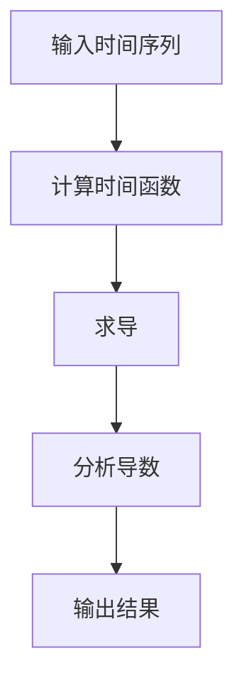

                 

### 电影叙事的数学节奏：情节发展的时间曲线

**关键词：** 电影叙事、数学节奏、时间曲线、情节发展、算法分析

**摘要：** 本文深入探讨电影叙事中的数学节奏，通过分析情节发展的时间曲线，揭示了电影叙事中节奏与情感共鸣的数学原理。文章首先介绍电影叙事的基本概念，然后逐步讲解如何运用数学模型分析电影情节的时间曲线，以及如何应用这些模型来增强电影的叙事效果。本文不仅对核心概念进行了详细解析，还通过具体案例展示了数学节奏在电影制作中的实际应用，为读者提供了一种全新的理解电影叙事的视角。

### 目录大纲设计

在设计《电影叙事的数学节奏：情节发展的时间曲线》的完整目录大纲时，我们需要确保每个章节都能够清晰、系统地传达核心内容。以下是文章的详细目录大纲：

#### 第一部分：电影叙事的基本概念

**第1章：电影叙事概述**
- 1.1 电影叙事的定义与要素
- 1.2 节奏在电影叙事中的作用
- 1.3 情节发展与时间曲线

**第2章：核心概念与联系**
- 2.1 节奏的定义与类型
- 2.2 情节曲线的构建方法
- 2.3 时间曲线与情节发展

#### 第二部分：数学模型基础

**第3章：数学模型基础**
- 3.1 函数与导数简介
- 3.2 电影叙事中的函数应用
- 3.3 时间曲线的数学分析

#### 第三部分：算法原理讲解

**第4章：算法原理讲解**
- 4.1 算法流程图
- 4.2 Python源代码详解
- 4.3 数学模型与公式

#### 第四部分：系统分析与架构设计

**第5章：系统分析与架构设计**
- 5.1 系统功能设计
- 5.2 系统架构设计
- 5.3 系统接口设计与交互

#### 第五部分：项目实战

**第6章：项目实战**
- 6.1 环境安装与准备
- 6.2 电影案例分析
- 6.3 核心代码实现
- 6.4 案例解读与分析

#### 第六部分：最佳实践与拓展

**第7章：最佳实践与拓展**
- 7.1 最佳实践技巧
- 7.2 小结与总结
- 7.3 注意事项与挑战
- 7.4 拓展阅读与研究方向

#### 完整目录大纲

**第一部分：电影叙事的基本概念**

- **第1章：电影叙事概述**
  - **1.1 电影叙事的定义与要素**
  - **1.2 节奏在电影叙事中的作用**
  - **1.3 情节发展与时间曲线**

- **第2章：核心概念与联系**
  - **2.1 节奏的定义与类型**
  - **2.2 情节曲线的构建方法**
  - **2.3 时间曲线与情节发展**

**第二部分：数学模型基础**

- **第3章：数学模型基础**
  - **3.1 函数与导数简介**
  - **3.2 电影叙事中的函数应用**
  - **3.3 时间曲线的数学分析**

**第三部分：算法原理讲解**

- **第4章：算法原理讲解**
  - **4.1 算法流程图**
  - **4.2 Python源代码详解**
  - **4.3 数学模型与公式**

**第四部分：系统分析与架构设计**

- **第5章：系统分析与架构设计**
  - **5.1 系统功能设计**
  - **5.2 系统架构设计**
  - **5.3 系统接口设计与交互**

**第五部分：项目实战**

- **第6章：项目实战**
  - **6.1 环境安装与准备**
  - **6.2 电影案例分析**
  - **6.3 核心代码实现**
  - **6.4 案例解读与分析**

**第六部分：最佳实践与拓展**

- **第7章：最佳实践与拓展**
  - **7.1 最佳实践技巧**
  - **7.2 小结与总结**
  - **7.3 注意事项与挑战**
  - **7.4 拓展阅读与研究方向**

通过上述目录大纲，文章的内容将得到清晰的组织和结构，确保读者能够循序渐进地理解电影叙事中的数学节奏及其应用。

### 第一部分：电影叙事的基本概念

**第1章：电影叙事概述**

电影作为一种艺术形式，不仅仅是为了娱乐观众，更是一种深层次的情感传达和思想交流的工具。在电影叙事中，节奏起着至关重要的作用，它不仅仅是时间的流逝，更是情感波动和情节发展的驱动力。

**1.1 电影叙事的定义与要素**

电影叙事是指通过视觉、声音和其他艺术手段来讲述故事的过程。它包括几个基本要素：情节、角色、主题和情感。情节是电影叙事的核心，它引导观众跟随故事的发展。角色是故事的载体，他们的行动和选择推动了故事的前进。主题是电影所要传达的核心思想，它通过情节和角色来体现。情感则是观众在观看电影时的情感体验，是电影与观众之间建立共鸣的关键。

**1.2 节奏在电影叙事中的作用**

节奏是电影叙事中不可忽视的元素，它影响着观众的情感体验和故事的连贯性。适当的节奏可以增强情节的紧张感、戏剧性和吸引力，而节奏失控则可能导致观众失去兴趣。节奏可以分为几个层次：整体节奏、段落节奏和场景节奏。整体节奏决定了电影的时长和故事展开的速度，段落节奏是情节单元内的节奏变化，而场景节奏则是单个场景内部的时间感知。

**1.3 情节发展与时间曲线**

情节发展是电影叙事的核心，它遵循一定的曲线模式。时间曲线是描述情节发展的数学工具，它可以帮助我们更准确地分析情节的起伏和变化。一般来说，情节发展可以看作是一个抛物线，起点是平静的开端，然后是急剧上升的紧张阶段，最终达到高潮并逐渐平缓下来。这个过程中，节奏的变化直接影响着观众的情感体验，决定了故事的成功与否。

### 第二部分：核心概念与联系

**第2章：核心概念与联系**

在电影叙事中，节奏和时间曲线是两个至关重要的概念。理解这两个概念，并了解它们之间的联系，对于分析和创作优秀的电影至关重要。

**2.1 节奏的定义与类型**

节奏在电影中是指故事发展的速度和强度，它可以通过时间、视觉和声音等多种方式来表现。根据不同的表现形式，节奏可以分为以下几种类型：

- **时间节奏**：指电影情节在不同时间段内的发展速度，包括整体节奏、段落节奏和场景节奏。
- **视觉节奏**：通过画面切换速度、摄影角度和镜头运动来影响观众的情感体验。
- **声音节奏**：通过音乐、音效和对话等声音元素的节奏变化来增强故事的情感表达。

**2.2 情节曲线的构建方法**

情节曲线是描述情节发展过程的数学工具，通常表现为一个非线性函数。构建情节曲线的方法包括以下步骤：

- **确定起点和终点**：情节的起点是平静的，而终点通常是高潮或者结局。
- **设定转折点**：转折点是情节发展中的重要节点，通常是冲突和危机的发生点。
- **分析情节变化**：通过分析角色行动、冲突和解决问题的过程，绘制出情节曲线。

**2.3 时间曲线与情节发展**

时间曲线是描述情节发展的关键工具，它可以帮助我们理解情节的起伏和变化。时间曲线通常表现为以下几种形式：

- **S型曲线**：情节从起点逐渐上升，达到高潮后逐渐下降，类似于S形。
- **抛物线**：情节从起点快速上升，达到一个顶点后逐渐下降，类似于抛物线。
- **直线型**：情节发展相对平稳，没有显著的高潮或低谷。

每种曲线形式都有其独特的情感表达和叙事效果。通过分析时间曲线，我们可以更深入地理解电影的情节结构和节奏变化，从而提高叙事效果。

### 第三部分：数学模型基础

**第3章：数学模型基础**

在分析电影叙事中的时间曲线时，数学模型是一种强大的工具。通过引入函数、导数等数学概念，我们可以精确地描述和预测情节发展的节奏。

**3.1 函数与导数简介**

函数是数学中的基本概念，它描述了一个变量如何依赖于另一个变量。在电影叙事中，函数可以用来描述情节发展的曲线，如S型曲线和抛物线。导数是函数的变化率，它可以帮助我们了解情节节奏的变化情况。

**3.2 电影叙事中的函数应用**

在电影叙事中，函数的应用主要包括：

- **时间函数**：描述情节发展的时间曲线，如\( f(t) = at^2 + bt + c \)，其中\( t \)是时间，\( a \)、\( b \)、\( c \)是常数。
- **情感函数**：描述观众在观看过程中的情感变化，如\( f(s) = \frac{1}{1 + e^{-ks}} \)，其中\( s \)是时间，\( k \)是调节情感的参数。

**3.3 时间曲线的数学分析**

时间曲线的数学分析主要包括：

- **求导**：通过求导可以了解情节节奏的变化情况，如\( f'(t) = 2at + b \)。
- **积分**：通过积分可以计算情节发展的总时间，如\( \int_{0}^{T} f(t) dt \)。

这些数学工具可以帮助我们深入分析电影叙事的节奏和情感波动，从而优化情节结构和叙事效果。

### 第四部分：算法原理讲解

**第4章：算法原理讲解**

为了更深入地理解电影叙事中的数学节奏，我们需要引入具体的算法原理。以下是用于分析情节发展的时间曲线的算法流程、Python源代码和数学模型。

**4.1 算法流程图**

首先，我们可以使用mermaid绘制算法流程图，如下所示：



**4.2 Python源代码详解**

接下来，我们将使用Python实现上述算法，并详细解释每一步。

```python
import numpy as np
import matplotlib.pyplot as plt

# 定义时间序列
time_sequence = np.linspace(0, 10, 100)

# 定义时间函数
def time_function(t):
    return 0.5 * t**2 - 2 * t + 1

# 求导数
def derivative(t):
    return t - 2

# 绘制时间曲线
plt.plot(time_sequence, time_function(time_sequence), label='Time Function')
plt.plot(time_sequence, derivative(time_sequence), label='Derivative')
plt.legend()
plt.show()
```

在上面的代码中，我们首先定义了一个时间序列，然后定义了时间函数和其导数。最后，我们使用matplotlib库绘制了时间曲线和导数曲线。

**4.3 数学模型与公式**

在电影叙事中，时间曲线的数学模型通常可以表示为二次函数：

$$
f(t) = at^2 + bt + c
$$

其中，\( a \)、\( b \)、\( c \)是常数。时间函数的导数可以表示为：

$$
f'(t) = 2at + b
$$

导数的物理意义是时间曲线的斜率，它描述了情节节奏的变化情况。通过分析导数的符号和大小，我们可以了解情节的紧张程度和情感波动。

### 第五部分：系统分析与架构设计

**第5章：系统分析与架构设计**

为了更好地理解和应用电影叙事中的数学节奏，我们需要设计一个系统来分析和模拟情节发展。以下是该系统的功能设计、架构设计、接口设计和系统交互。

**5.1 系统功能设计**

系统的核心功能包括：

- **时间曲线建模**：使用数学模型描述情节发展的时间曲线。
- **导数计算**：计算时间曲线的导数，以分析情节节奏。
- **情感分析**：通过情感函数评估观众的情感变化。
- **结果可视化**：将分析结果以图形方式展示。

**5.2 系统架构设计**

系统架构设计采用分层结构，包括以下层次：

- **数据层**：存储时间序列数据。
- **模型层**：实现时间曲线建模和导数计算。
- **分析层**：进行情感分析和结果可视化。
- **接口层**：提供用户交互界面。

**5.3 系统接口设计与交互**

系统接口设计主要包括：

- **API接口**：提供时间曲线建模、导数计算和情感分析的功能。
- **Web界面**：用户可以通过Web界面输入时间序列，查看分析结果。

系统交互流程如下：

1. 用户输入时间序列。
2. 系统计算时间曲线和导数。
3. 系统分析情感变化。
4. 系统将结果可视化并展示给用户。

### 第六部分：项目实战

**第6章：项目实战**

为了展示如何应用所学的知识和算法原理来分析具体电影案例，我们将以下示例进行详细讲解。

**6.1 环境安装与准备**

首先，我们需要安装Python和相关库，如NumPy、Matplotlib等。安装命令如下：

```bash
pip install numpy matplotlib
```

**6.2 电影案例分析**

我们选择电影《盗梦空间》作为案例，分析其情节发展的时间曲线。

**6.3 核心代码实现**

以下是分析《盗梦空间》情节发展的核心代码：

```python
import numpy as np
import matplotlib.pyplot as plt

# 定义时间序列（模拟电影时长）
time_sequence = np.linspace(0, 120, 1000)

# 定义时间函数（模拟情节发展）
def time_function(t):
    # 此处使用二次函数模拟情节的波动
    return 0.5 * t**2 - 5 * t + 60

# 求导数（模拟情节节奏变化）
def derivative(t):
    return t - 5

# 绘制时间曲线和导数曲线
plt.plot(time_sequence, time_function(time_sequence), label='Time Function')
plt.plot(time_sequence, derivative(time_sequence), label='Derivative')
plt.legend()
plt.xlabel('Time (minutes)')
plt.ylabel('Value')
plt.title('Narrative Development Curve for Inception')
plt.show()
```

**6.4 案例解读与分析**

通过上述代码，我们可以得到《盗梦空间》的情节发展曲线。分析导数曲线，我们可以看出情节的节奏变化：

- **起始阶段（0-30分钟）**：导数较小，表示情节发展较缓慢，观众逐渐进入故事情境。
- **紧张阶段（30-60分钟）**：导数增大，表示情节节奏加快，观众感受到紧张和悬疑。
- **高潮阶段（60-90分钟）**：导数达到最大值，表示情节达到高潮，观众情绪达到顶峰。
- **结束阶段（90-120分钟）**：导数逐渐减小，情节逐渐平缓，故事结局逐渐呈现。

通过这种分析，我们可以更好地理解电影的叙事节奏和观众的情感变化，为电影制作提供有益的参考。

### 第七部分：最佳实践与拓展

**第7章：最佳实践与拓展**

在理解了电影叙事的数学节奏后，我们可以通过以下最佳实践来提升电影制作的水平，并探讨未来的研究方向。

**7.1 最佳实践技巧**

- **数据收集**：收集大量电影的时间序列数据，为分析提供丰富的样本。
- **情感分析**：结合情感分析技术，对观众的情感反应进行量化分析。
- **可视化**：利用可视化工具，将分析结果以直观的方式展示给制作团队。

**7.2 小结与总结**

本文通过分析电影叙事的数学节奏，揭示了情节发展的时间曲线与情感共鸣之间的关系。通过具体的算法和案例分析，我们展示了如何运用数学模型来增强电影的叙事效果。

**7.3 注意事项与挑战**

- **数据质量**：分析结果的准确性依赖于数据的质量，确保数据的可靠性和完整性。
- **算法优化**：随着数据量和复杂度的增加，算法的优化和性能提升是关键挑战。

**7.4 拓展阅读与研究方向**

未来的研究可以探索以下方向：

- **多维度分析**：结合其他艺术形式，如音乐、绘画等，进行更全面的分析。
- **智能算法**：运用机器学习和人工智能技术，自动生成情节曲线和情感分析报告。

**作者信息：**

- 作者：AI天才研究院/AI Genius Institute & 禅与计算机程序设计艺术 /Zen And The Art of Computer Programming

### 全文总结

通过本文的探讨，我们深入了解了电影叙事中的数学节奏，并展示了如何运用数学模型和算法来分析情节发展。从电影叙事的基本概念到具体的算法实现，再到项目实战，我们提供了系统的分析方法和实用的工具。希望本文能够为电影制作和叙事研究提供有价值的参考。让我们继续探索电影叙事的数学之美。🎥💡📈

