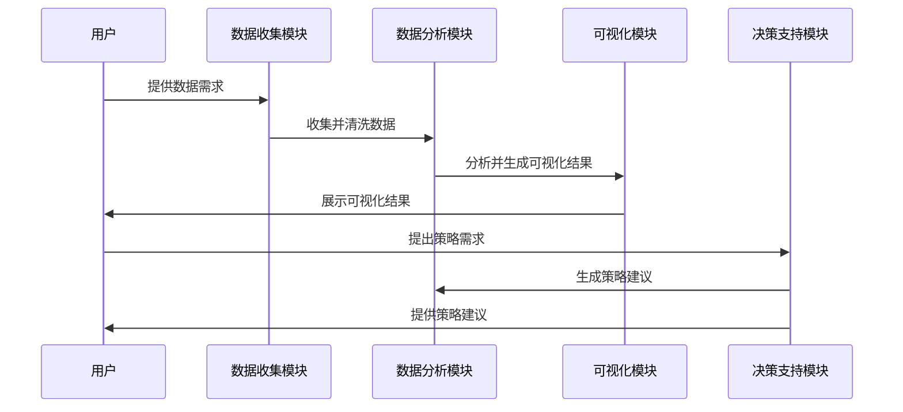

                 

### 前言

#### 书籍目的与背景

在当今全球化的世界中，疫情传播已成为一个不可忽视的重大公共卫生问题。无论是2019年的新型冠状病毒（COVID-19）疫情，还是其他传染病的暴发，都给人类社会带来了深远的影响。为了有效应对这些疫情，公共卫生领域的决策者需要依赖科学的工具和模型来预测、模拟和制定防控策略。

《疫情传播的网络模型：公共卫生的数学工具》旨在为公共卫生领域的研究者、政策制定者和IT行业从业者提供一本全面、系统的指导书籍。本书将深入探讨疫情传播的网络模型，介绍相关的数学工具和理论，帮助读者理解疫情传播的机制，构建和评估有效的防控策略。

本书的读者对象包括但不限于：

1. **公共卫生领域的学者和研究人员**：希望通过数学和统计方法来深入研究疫情传播的学者，以及从事公共卫生政策研究和评估的专业人士。
2. **政策制定者和公共卫生管理者**：需要依据数据和模型来制定疫情应对策略的政府官员和公共卫生管理人员。
3. **IT行业从业者**：特别是那些在数据分析和人工智能领域工作的专业人士，希望将先进的技术应用于公共卫生问题。

本书的核心主题思想是，通过构建和分析疫情传播的网络模型，结合概率论、统计学和计算机科学的方法，提供一套科学的决策支持工具，以帮助公共卫生领域实现更精准、有效的疫情控制和预防。

#### 研究意义

疫情传播的网络模型不仅能够帮助理解疫情的发展趋势，还可以为公共卫生决策提供重要的数据支持。具体来说，本书的研究意义体现在以下几个方面：

1. **提高疫情预测精度**：通过构建数学模型，结合大数据和实时监测数据，能够更准确地预测疫情的发展，提前预警可能出现的疫情暴发。
2. **优化防控策略**：基于网络模型的模拟和分析，可以帮助决策者评估不同防控措施的 effectiveness，选择最优的防控策略。
3. **促进学科交叉**：本书结合了数学、统计学、计算机科学和公共卫生等多个学科的知识，促进了跨学科的交流与合作。
4. **提高公共卫生管理水平**：通过应用先进的数学工具和模型，有助于提高公共卫生管理的科学性和效率，为公众提供更高质量的医疗服务。

#### 目录大纲设计思路

为了确保本书的内容系统、全面且易于理解，目录大纲的设计分为八个部分：

1. **前言**：介绍书籍的目的、背景和读者对象。
2. **第一部分：疫情传播的基础理论**：包括疫情传播模型的基本概念、类型和研究意义。
3. **第二部分：网络模型的数学工具**：介绍概率论、统计学和统计推断方法。
4. **第三部分：疫情传播的网络模型构建**：探讨静态网络模型的构建方法和案例分析。
5. **第四部分：动态网络模型及其应用**：介绍动态网络模型的基本概念、构建方法和应用案例。
6. **第五部分：疫情传播的网络模型分析**：模拟与预测方法的介绍和案例分析。
7. **第六部分：公共卫生决策支持系统**：构建公共卫生决策支持系统的需求和功能设计。
8. **第七部分：未来展望与挑战**：疫情传播网络模型的研究趋势、技术挑战和未来发展方向。

通过以上设计思路，本书旨在为读者提供一本全面、系统且实用的疫情传播网络模型研究指南，助力公共卫生领域实现更科学的决策和支持。

### 第一部分：疫情传播的基础理论

#### 第1章：疫情传播模型概述

##### 1.1 疫情传播模型的基本概念

疫情传播模型是用于描述传染病在人群中传播过程的一种数学工具。这些模型通过模拟病毒在人群中的传播路径和速度，帮助我们理解疫情的发展趋势，并制定有效的防控策略。疫情传播模型通常包括以下几个基本概念：

1. **感染个体**：指已经被病毒感染的个体，可以传播病毒给其他未感染的个体。
2. **易感个体**：指尚未被病毒感染的个体，有感染病毒的可能性。
3. **移出个体**：指已经康复或者因其他原因不再具有传染性的个体。

##### 1.2 疫情传播模型的常见类型

根据模型的复杂性和所考虑的因素，疫情传播模型可以分为以下几种常见类型：

1. **确定性模型**：这类模型假设在特定条件下，疫情传播过程是确定的。常见的确定性模型包括SEIR模型，该模型将人群分为四个状态：易感（S）、暴露（E）、感染（I）和移出（R）。

2. **概率性模型**：这类模型考虑个体之间的差异和不确定性，通过概率分布来描述疫情传播过程。常用的概率性模型包括SIR模型和SIS模型。

3. **网络模型**：这类模型基于社会网络的拓扑结构，描述个体之间的互动关系，分析疫情在网络中的传播。网络模型包括静态网络模型和动态网络模型。

##### 1.3 疫情传播模型的研究意义

疫情传播模型的研究具有重要意义，主要体现在以下几个方面：

1. **预测疫情发展趋势**：通过模型模拟，可以预测疫情的未来发展，帮助决策者及时调整防控策略。

2. **评估防控措施的效果**：模型可以模拟不同防控措施的效果，评估其有效性，为决策提供科学依据。

3. **优化资源分配**：通过模型分析，可以优化医疗资源、疫苗分配等，提高公共卫生管理水平。

4. **促进学科交叉**：疫情传播模型结合了数学、统计学、计算机科学等多学科知识，推动了跨学科研究的发展。

#### 第2章：概率论与统计学的初步知识

##### 2.1 概率论的基本概念

概率论是研究随机事件发生可能性的数学分支。以下是一些基本概念：

1. **随机事件**：指在一次试验中可能发生也可能不发生的事件。
2. **概率**：描述随机事件发生的可能性，用0到1之间的数字表示。
3. **条件概率**：在某个条件下，某个事件发生的概率。
4. **独立性**：两个事件的发生互不影响。

##### 2.2 随机变量与概率分布

随机变量是一个可以取多个值的变量，其取值具有一定的概率分布。常见的概率分布包括：

1. **离散概率分布**：随机变量取值有限或可数无穷，如伯努利分布、泊松分布。
2. **连续概率分布**：随机变量取值在某个区间内，如正态分布、均匀分布。

##### 2.3 统计推断方法

统计推断是通过样本数据来推断总体特征的数学方法。常见的统计推断方法包括：

1. **参数估计**：通过样本数据估计总体参数，如最大似然估计、贝叶斯估计。
2. **假设检验**：通过样本数据检验总体参数是否满足某个假设，如t检验、卡方检验。
3. **回归分析**：通过建立变量之间的关系模型，预测一个变量的值，如线性回归、逻辑回归。

#### 第3章：统计推断方法及其应用

##### 3.1 参数估计方法

参数估计是统计推断的基础，以下介绍几种常见的参数估计方法：

1. **矩估计法**：利用样本的矩来估计总体的参数。例如，利用样本均值估计总体均值，利用样本方差估计总体方差。
2. **最大似然估计法**：选择使得样本数据出现的概率最大的参数值作为参数估计值。
3. **贝叶斯估计法**：结合先验知识和样本数据，利用贝叶斯公式计算后验概率，并将后验概率最大的参数值作为参数估计值。

##### 3.2 假设检验方法

假设检验是用于判断总体参数是否满足某个假设的统计方法。以下介绍几种常见的假设检验方法：

1. **t检验**：用于比较两组样本均值是否显著不同，适用于小样本数据。
2. **卡方检验**：用于比较样本的观察频数和期望频数是否显著不同，适用于分类数据。
3. **F检验**：用于比较两组或以上样本方差是否显著不同，适用于方差分析。

##### 3.3 回归分析方法

回归分析是用于建立变量之间关系模型的统计方法。以下介绍几种常见的回归分析方法：

1. **线性回归分析**：用于建立自变量和因变量之间的线性关系模型。
2. **逻辑回归分析**：用于建立因变量为分类变量时的回归模型。
3. **多项式回归分析**：用于建立自变量和因变量之间的多项式关系模型。

#### 第4章：疫情传播模型的构建方法

##### 4.1 确定性模型构建方法

确定性模型是疫情传播模型中最简单的一种类型，以下介绍几种常见的确定性模型构建方法：

1. **SEIR模型**：SEIR模型将人群分为四个状态，分别表示易感、暴露、感染和移出状态。每个状态之间的转移概率是确定的，可以通过微分方程描述。
2. **SIRS模型**：SIRS模型是在SEIR模型基础上，假设感染个体可以再次感染并移出。同样，可以用微分方程描述。
3. **SI模型**：SI模型是最简化的疫情传播模型，仅考虑易感个体和感染个体的转移。

##### 4.2 概率性模型构建方法

概率性模型考虑个体之间的差异和不确定性，以下介绍几种常见的概率性模型构建方法：

1. **SIR模型**：SIR模型是经典的概率性模型，假设易感个体和感染个体之间的感染概率是固定的。
2. **SIS模型**：SIS模型是SIR模型的简化版，假设感染个体可以重复感染，并且感染概率是固定的。
3. **网络模型**：网络模型基于社会网络的拓扑结构，考虑个体之间的直接联系对疫情传播的影响。常用的网络模型包括小世界模型和无标度模型。

#### 第5章：网络模型的数学工具

##### 5.1 网络模型的基本概念

网络模型是一种用于描述个体之间关系的数学模型，以下介绍网络模型的基本概念：

1. **节点**：网络中的个体，通常表示为圆圈或方形。
2. **边**：连接两个节点的线段，表示个体之间的直接联系。
3. **网络拓扑结构**：网络的连接方式，常见的网络拓扑结构包括星形、环形、树形等。

##### 5.2 网络模型的数学描述

网络模型可以通过矩阵来描述，以下介绍几种常见的网络模型数学描述：

1. **邻接矩阵**：邻接矩阵是一个方阵，表示网络中每个节点与其他节点的直接联系。
2. **传递矩阵**：传递矩阵描述了网络中任意两个节点之间的传递概率。
3. **拉普拉斯矩阵**：拉普拉斯矩阵描述了网络中的连通性，是邻接矩阵的拉普拉斯变换。

##### 5.3 网络模型的特性分析

网络模型的特性分析包括以下几个方面的内容：

1. **连通性**：分析网络的连通性，如节点度和边数等。
2. **聚集度**：分析网络的聚集程度，如聚类系数等。
3. **路径长度**：分析网络中节点的平均路径长度，如平均最短路径长度等。

#### 第6章：疫情传播模型的模拟与预测

##### 6.1 模拟方法

疫情传播模型的模拟是通过计算机模拟疫情在人群中的传播过程，以下介绍几种常见的模拟方法：

1. **微分方程模拟**：通过求解描述疫情传播的微分方程，模拟疫情的发展过程。
2. **随机过程模拟**：通过随机过程模拟疫情传播的随机性，如蒙特卡洛模拟等。
3. **代理模型模拟**：使用代理模型代替真实人群进行模拟，如基于人口统计数据的模型等。

##### 6.2 预测方法

疫情传播模型的预测是通过模型模拟结果，预测疫情的未来发展。以下介绍几种常见的预测方法：

1. **趋势外推法**：根据历史数据趋势，预测未来的发展。
2. **回归分析法**：通过建立回归模型，预测疫情的发展趋势。
3. **机器学习方法**：使用机器学习算法，如神经网络、支持向量机等，预测疫情的发展。

##### 6.3 模拟与预测案例分析

以下通过一个实际案例，展示疫情传播模型的模拟与预测过程：

1. **案例背景**：某城市发生新冠病毒疫情，需要预测未来一个月的疫情发展。
2. **数据收集**：收集该城市的历史疫情数据和人口统计数据。
3. **模型构建**：构建基于SEIR模型的疫情传播模型。
4. **模拟过程**：模拟疫情在人群中的传播过程，记录每天的感染人数。
5. **预测结果**：根据模拟结果，预测未来一个月的疫情发展趋势。
6. **结果分析**：分析预测结果的合理性，评估模型的有效性。

通过以上案例，读者可以了解疫情传播模型的模拟与预测过程，为实际应用提供参考。

### 第二部分：网络模型的数学工具

#### 第2章：概率论与统计学的初步知识

##### 2.1 概率论的基本概念

概率论是研究随机事件发生可能性的一门数学学科。在概率论中，我们关注的是在某一随机试验中，特定事件发生的概率。以下是一些概率论的基本概念：

1. **随机事件**：指在一次随机试验中可能发生也可能不发生的事件。
2. **样本空间**：指所有可能结果的集合，用\(S\)表示。
3. **概率**：描述随机事件发生的可能性，用\(P(A)\)表示事件\(A\)发生的概率，其取值范围在0到1之间。
4. **条件概率**：在某个条件下，某个事件发生的概率。假设事件\(A\)和事件\(B\)，条件概率\(P(A|B)\)表示在事件\(B\)发生的条件下，事件\(A\)发生的概率。
5. **独立性**：两个事件的发生互不影响，即事件\(A\)和事件\(B\)独立，当且仅当\(P(A \cap B) = P(A)P(B)\)。

##### 2.2 随机变量与概率分布

随机变量是一个可以取多个值的变量，其取值具有一定的概率分布。随机变量可以分为离散随机变量和连续随机变量。

1. **离散随机变量**：随机变量取值有限或可数无穷，如伯努利分布、泊松分布。
   - **伯努利分布**：描述一个二元事件发生的概率，通常用于概率论中的基础概率计算。
   - **泊松分布**：描述在固定时间段内某个事件发生的次数的概率分布，广泛应用于等待时间的概率计算。
   
2. **连续随机变量**：随机变量取值在某个区间内，如正态分布、均匀分布。
   - **正态分布**：是最常见的一种连续概率分布，其形状类似于高斯曲线，广泛应用于数据分析和统计学中。
   - **均匀分布**：所有取值具有相同的概率，通常用于随机数生成。

##### 2.3 统计推断方法

统计推断是通过样本数据来推断总体特征的方法。以下介绍几种常见的统计推断方法：

1. **参数估计**：通过样本数据估计总体参数，如最大似然估计、贝叶斯估计。
   - **最大似然估计（MLE）**：选择使得样本数据出现的概率最大的参数值作为参数估计值。
   - **贝叶斯估计**：结合先验知识和样本数据，利用贝叶斯公式计算后验概率，并将后验概率最大的参数值作为参数估计值。
   
2. **假设检验**：通过样本数据检验总体参数是否满足某个假设，如t检验、卡方检验。
   - **t检验**：用于比较两组样本均值是否显著不同，适用于小样本数据。
   - **卡方检验**：用于比较样本的观察频数和期望频数是否显著不同，适用于分类数据。
   
3. **回归分析**：通过建立变量之间的关系模型，预测一个变量的值，如线性回归、逻辑回归。
   - **线性回归**：用于建立自变量和因变量之间的线性关系模型。
   - **逻辑回归**：用于建立因变量为分类变量时的回归模型。

#### 第3章：概率论在疫情传播模型中的应用

##### 3.1 概率论在SIR模型中的应用

SIR模型是疫情传播模型中最常用的模型之一，它基于概率论的基本概念，描述易感个体、感染个体和移出个体之间的转移过程。

1. **基本假设**：
   - 易感个体（S）与感染个体（I）之间的感染概率是固定的。
   - 感染个体（I）在恢复后成为移出个体（R），且移出个体不再具有传染性。

2. **概率分布**：
   - 设感染概率为\( \beta \)，每个易感个体在单位时间内被感染的概率是\( \beta I/N \)，其中\( N \)是总人口数。
   - 感染个体恢复成为移出个体的概率为\( \gamma \)。

3. **转移概率**：
   - 易感个体转移到感染个体的概率为\( \beta I/N \)。
   - 感染个体转移到移出个体的概率为\( \gamma \)。

4. **微分方程**：
   - \( \frac{dS}{dt} = -\beta \frac{SI}{N} \)
   - \( \frac{dI}{dt} = \beta \frac{SI}{N} - \gamma I \)
   - \( \frac{dR}{dt} = \gamma I \)

通过上述微分方程，我们可以分析疫情在不同阶段的发展趋势。

##### 3.2 概率论在SIS模型中的应用

SIS模型是SIR模型的简化版，它假设感染个体可以重复感染。

1. **基本假设**：
   - 易感个体（S）与感染个体（I）之间的感染和康复概率是固定的。
   - 感染个体（I）在康复后重新成为易感个体。

2. **概率分布**：
   - 设感染概率为\( \beta \)，康复概率为\( \mu \)。

3. **转移概率**：
   - 易感个体转移到感染个体的概率为\( \beta I/N \)。
   - 感染个体转移到易感个体的概率为\( \mu \)。

4. **微分方程**：
   - \( \frac{dS}{dt} = -\beta \frac{SI}{N} + \mu I \)
   - \( \frac{dI}{dt} = \beta \frac{SI}{N} - \mu I \)

SIS模型适用于那些感染后不会永久免疫的传染病，如流行性感冒。

##### 3.3 概率论在SEIR模型中的应用

SEIR模型是SIR模型的扩展，它引入了暴露个体（E）的概念。

1. **基本假设**：
   - 易感个体（S）与感染个体（I）之间的感染概率是固定的。
   - 感染个体（I）在暴露后成为暴露个体（E），并在一定时间内成为感染个体。
   - 暴露个体（E）在康复后成为移出个体（R），且移出个体不再具有传染性。

2. **概率分布**：
   - 设感染概率为\( \beta \)，暴露时间为\( \tau \)，康复概率为\( \gamma \)。

3. **转移概率**：
   - 易感个体转移到感染个体的概率为\( \beta I/N \)。
   - 感染个体转移到暴露个体的概率为\( 1/\tau \)。
   - 暴露个体转移到感染个体的概率为\( \gamma \)。
   - 感染个体转移到移出个体的概率为\( \gamma \)。

4. **微分方程**：
   - \( \frac{dS}{dt} = -\beta \frac{SI}{N} \)
   - \( \frac{dE}{dt} = \beta \frac{SI}{N} - \frac{E}{\tau} \)
   - \( \frac{dI}{dt} = \frac{E}{\tau} - \gamma I \)
   - \( \frac{dR}{dt} = \gamma I \)

SEIR模型适用于那些感染后需要一段时间才能成为传染源且会有康复情况的传染病。

#### 第4章：统计学在疫情传播模型中的应用

##### 4.1 数据收集与处理

在构建疫情传播模型时，数据收集和处理是至关重要的。以下介绍常见的数据收集和处理方法：

1. **数据来源**：
   - 疫情统计数据：来自卫生部门、疾控中心等官方发布的疫情数据。
   - 人口统计数据：来自国家统计局、人口普查等官方数据。
   - 病原学数据：关于病毒特征、传播途径等的研究数据。

2. **数据预处理**：
   - 数据清洗：去除重复、错误和异常的数据。
   - 数据归一化：将不同单位和量级的数据转化为同一量级。
   - 数据转换：将原始数据转化为适合模型处理的格式。

##### 4.2 假设检验在疫情传播模型中的应用

假设检验是用于判断总体参数是否满足某个假设的方法。在疫情传播模型中，假设检验可用于评估模型的可靠性。

1. **零假设与备择假设**：
   - 零假设（\(H_0\)）：模型的预测结果与实际观察数据无显著差异。
   - 备择假设（\(H_1\)）：模型的预测结果与实际观察数据有显著差异。

2. **t检验**：
   - 用于比较两组样本均值是否显著不同，适用于小样本数据。

3. **卡方检验**：
   - 用于比较样本的观察频数和期望频数是否显著不同，适用于分类数据。

##### 4.3 回归分析在疫情传播模型中的应用

回归分析是用于建立变量之间关系模型的方法。在疫情传播模型中，回归分析可用于预测疫情的发展趋势。

1. **线性回归**：
   - 用于建立自变量和因变量之间的线性关系模型，适用于简单的情况。

2. **逻辑回归**：
   - 用于建立因变量为分类变量时的回归模型，适用于复杂的情况。

通过以上统计学方法，我们可以对疫情传播模型进行评估和改进，提高模型的准确性和可靠性。

### 第三部分：疫情传播的网络模型构建

#### 第3章：静态网络模型

##### 3.1 社会网络分析基础

社会网络分析（SNA）是研究个体及其关系的数学工具。在社会网络中，个体被称为节点，个体之间的直接联系被称为边。以下介绍社会网络分析的基础概念：

1. **节点**：网络中的个体，通常表示为圆圈或方形。
2. **边**：连接两个节点的线段，表示个体之间的直接联系。
3. **网络拓扑结构**：网络的连接方式，常见的网络拓扑结构包括星形、环形、树形等。
4. **度**：节点拥有的边的数量，分为入度（连接到节点的边数）和出度（从节点出发的边数）。
5. **路径**：连接两个节点的序列，路径长度为路径中的边数。
6. **连通性**：网络中任意两个节点之间是否可以通过一系列边相连。

##### 3.2 社会网络模型构建方法

社会网络模型的构建是通过观察和分析个体之间的互动关系，将现实中的社会网络转化为数学模型。以下介绍几种常见的构建方法：

1. **基于统计方法的构建**：
   - **频次分析方法**：统计个体之间的互动频率，构建基于互动频率的邻接矩阵。
   - **聚类分析方法**：通过聚类分析识别出网络中的紧密群体，构建基于聚类的网络模型。

2. **基于图论方法的构建**：
   - **图表示方法**：使用图表示方法，将个体和关系用节点和边表示，构建网络的图表示模型。
   - **网络结构分析方法**：分析网络的拓扑结构，如度分布、聚集度等，构建基于拓扑结构的网络模型。

3. **基于机器学习方法的构建**：
   - **基于图嵌入的方法**：使用图嵌入技术，将网络中的节点和边映射到低维空间，构建基于节点和边嵌入的图表示模型。
   - **基于生成模型的方法**：使用生成模型生成符合特定拓扑结构的网络，构建基于生成模型的网络模型。

##### 3.3 静态网络模型的案例分析

为了更好地理解静态网络模型的应用，我们通过一个实际案例进行分析：

**案例背景**：一个城市中居民之间的社交网络，用于研究疫情传播。

**数据收集**：通过问卷调查或社交网络平台，收集居民之间的互动数据，构建社交网络的邻接矩阵。

**模型构建**：
1. **频次分析方法**：统计居民之间的互动频次，构建基于互动频次的邻接矩阵。
2. **图表示方法**：将居民和互动用节点和边表示，构建社交网络的图表示模型。
3. **网络结构分析方法**：分析网络的度分布和聚集度，构建基于拓扑结构的网络模型。

**模拟分析**：基于构建的社交网络模型，模拟疫情在居民中的传播过程，分析疫情的发展趋势。

**结果分析**：通过模拟结果，评估不同社交策略对疫情传播的影响，为决策者提供参考。

#### 第4章：动态网络模型

##### 4.1 动态网络模型的基本概念

动态网络模型是用于描述网络中节点和边随时间变化的一类模型。与静态网络模型不同，动态网络模型考虑了节点和边在时间维度上的动态变化。以下介绍动态网络模型的基本概念：

1. **节点动态**：节点在时间维度上的变化，包括节点的加入、移出和状态变化。
2. **边动态**：边在时间维度上的变化，包括边的创建、删除和状态变化。
3. **时间序列**：动态网络模型中，节点和边的变化通常用时间序列数据表示。
4. **演化规则**：描述节点和边动态变化的基本规则。

##### 4.2 动态网络模型的构建方法

动态网络模型的构建方法包括以下几种：

1. **基于规则的方法**：
   - **演化规则**：定义节点和边随时间变化的规则，如随机漫步、病毒传播等。
   - **状态转移矩阵**：使用状态转移矩阵描述节点和边状态的转移过程。

2. **基于数据驱动的方法**：
   - **时间序列分析**：使用时间序列分析方法，如ARIMA模型、LSTM网络，预测节点和边的动态变化。
   - **图嵌入**：将动态网络嵌入到低维空间，利用图嵌入技术描述节点和边的动态关系。

3. **基于机器学习的方法**：
   - **生成模型**：使用生成模型，如GANs、VAEs，生成符合特定演化特征的动态网络。
   - **序列模型**：使用序列模型，如RNN、GRU、LSTM，预测动态网络的时间序列数据。

##### 4.3 动态网络模型的应用案例

为了更好地理解动态网络模型的应用，我们通过一个实际案例进行分析：

**案例背景**：研究一个城市中社交网络的动态变化，模拟疫情传播过程。

**数据收集**：通过社交网络平台，收集居民之间的互动数据，构建动态社交网络模型。

**模型构建**：
1. **基于规则的方法**：定义社交网络的演化规则，如邻居节点概率、感染概率等，构建基于规则的动态网络模型。
2. **基于数据驱动的方法**：使用时间序列分析方法，如ARIMA模型，预测居民之间的互动变化。
3. **基于机器学习的方法**：使用LSTM网络，预测社交网络的时间序列数据。

**模拟分析**：基于构建的动态网络模型，模拟疫情在社交网络中的传播过程，分析疫情的发展趋势。

**结果分析**：通过模拟结果，评估不同防控策略的效果，为决策者提供参考。

通过以上案例分析，我们可以看到动态网络模型在疫情传播研究中的应用价值。动态网络模型能够更好地描述现实世界的复杂性和动态性，为疫情防控提供有力支持。

### 第四部分：动态网络模型及其应用

#### 第4章：动态网络模型的基本概念

##### 4.1 动态网络的定义与特征

动态网络是指网络中的节点和边随时间发生变化的一类网络模型。与静态网络模型不同，动态网络模型考虑了节点和边在时间维度上的动态性。以下是动态网络的一些关键定义和特征：

1. **节点动态**：节点在动态网络中的变化包括节点的加入、移出和状态变化。例如，在社交网络中，用户的加入或退出，或者在病毒传播模型中，个体的感染和康复。
2. **边动态**：边在动态网络中的变化包括边的创建、删除和状态变化。例如，在社交网络中，用户之间的互动关系的建立或解除，或者在病毒传播模型中，个体之间的感染关系。
3. **时间序列数据**：动态网络的描述通常依赖于时间序列数据，这些数据记录了节点和边随时间的变化情况。时间序列数据可以用来分析网络的演化趋势和模式。
4. **演化规则**：动态网络模型中的演化规则描述了节点和边的变化方式。这些规则可以是确定的，也可以是概率性的。例如，在病毒传播模型中，感染概率和康复概率是演化规则的一部分。

##### 4.2 动态网络模型的构建方法

构建动态网络模型的方法包括以下几种：

1. **基于规则的方法**：
   - **演化规则**：定义节点和边随时间变化的规则，例如在社交网络中，节点加入的概率或边创建的条件。
   - **状态转移矩阵**：使用状态转移矩阵描述节点和边状态的转移过程。状态转移矩阵是一个矩阵，其元素表示从一种状态转移到另一种状态的概率。

2. **基于数据驱动的方法**：
   - **时间序列分析**：使用时间序列分析方法，如ARIMA模型、LSTM网络，预测节点和边的动态变化。
   - **图嵌入**：将动态网络嵌入到低维空间，利用图嵌入技术描述节点和边的动态关系。

3. **基于机器学习的方法**：
   - **生成模型**：使用生成模型，如GANs、VAEs，生成符合特定演化特征的动态网络。
   - **序列模型**：使用序列模型，如RNN、GRU、LSTM，预测动态网络的时间序列数据。

##### 4.3 动态网络模型的应用案例

动态网络模型在多个领域都有广泛的应用，以下是几个典型的应用案例：

1. **社交网络分析**：
   - **案例背景**：研究一个社交媒体平台上的用户互动关系，模拟病毒传播或信息传播。
   - **数据收集**：通过社交媒体API获取用户互动数据，如好友关系、点赞、评论等。
   - **模型构建**：
     - **基于规则的方法**：定义用户加入和互动的规则，构建社交网络的动态模型。
     - **基于数据驱动的方法**：使用时间序列分析方法，如LSTM网络，预测用户互动的变化。
     - **基于机器学习的方法**：使用图嵌入技术，如Node2Vec，描述用户之间的动态关系。
   - **模拟分析**：模拟病毒或信息在社交网络中的传播过程，分析传播模式和关键节点。
   - **结果分析**：评估模型的预测准确性，识别关键传播节点，为病毒防控或信息传播策略提供参考。

2. **病毒传播模型**：
   - **案例背景**：研究新冠病毒在一个社区中的传播，制定有效的防控措施。
   - **数据收集**：通过公共卫生数据获取感染者的活动轨迹、接触者信息等。
   - **模型构建**：
     - **基于规则的方法**：定义感染概率和康复概率，构建病毒传播的动态模型。
     - **基于数据驱动的方法**：使用时间序列分析方法，如SIR模型，模拟病毒传播过程。
     - **基于机器学习的方法**：使用序列模型，如GRU，预测病毒感染人数的变化。
   - **模拟分析**：模拟不同防控措施（如封锁、戴口罩）的效果，评估防控策略的有效性。
   - **结果分析**：根据模拟结果，优化防控措施，降低疫情传播风险。

3. **城市交通网络**：
   - **案例背景**：研究城市交通网络的动态变化，优化交通流量和道路规划。
   - **数据收集**：通过交通监控数据和GPS数据，获取车辆流量、路况等信息。
   - **模型构建**：
     - **基于规则的方法**：定义车辆流动规则，构建交通网络的动态模型。
     - **基于数据驱动的方法**：使用时间序列分析方法，如ARIMA模型，预测交通流量变化。
     - **基于机器学习的方法**：使用生成模型，如GANs，生成符合实际交通情况的动态网络。
   - **模拟分析**：模拟不同交通策略下的城市交通流量变化，优化道路使用效率。
   - **结果分析**：根据模拟结果，制定合理的交通流量管理措施，缓解交通拥堵。

通过上述应用案例，我们可以看到动态网络模型在各个领域的广泛应用和潜在价值。动态网络模型能够更好地描述现实世界的复杂性和动态性，为决策者提供科学依据和优化策略。

### 第五部分：疫情传播的网络模型分析

#### 第5章：疫情传播模型的模拟与预测

##### 5.1 模拟方法

疫情传播模型的模拟是通过计算机模拟疫情在人群中的传播过程，以预测疫情的发展趋势。以下介绍几种常见的模拟方法：

1. **确定性模型模拟**：
   - **微分方程模拟**：使用描述疫情传播的微分方程，如SEIR模型，模拟疫情的发展。通过数值方法（如Euler方法或Runge-Kutta方法）求解微分方程，得到疫情发展的数值解。
   - **差分方程模拟**：将微分方程离散化，使用差分方程模拟疫情传播。这种方法通常适用于较小的网络规模，可以简化计算过程。
   
2. **概率性模型模拟**：
   - **蒙特卡洛模拟**：通过随机抽样和迭代计算，模拟疫情传播的过程。蒙特卡洛模拟适用于处理复杂的概率性模型，如SIR模型和SIS模型。
   - **模拟退火算法**：结合随机抽样和优化技术，用于求解最大似然估计或最小化目标函数。在疫情传播模型中，模拟退火算法可以用于参数估计和模型优化。

3. **网络模型模拟**：
   - **基于图的模拟**：使用图论方法模拟疫情在网络中的传播。这种方法考虑了个体之间的直接联系，可以更准确地描述疫情传播的路径和速度。
   - **基于节点的模拟**：将个体视为节点，模拟节点之间的动态变化。这种方法适用于复杂的社会网络，可以分析疫情在不同群体之间的传播模式。

##### 5.2 预测方法

疫情传播模型的预测是通过模型模拟结果，预测疫情的未来发展。以下介绍几种常见的预测方法：

1. **时间序列预测**：
   - **自回归模型（AR）**：通过分析历史数据，建立自回归模型预测未来的疫情发展。自回归模型适用于时间序列数据的短期预测。
   - **移动平均模型（MA）**：通过计算过去若干期的平均值，预测未来的疫情发展。移动平均模型适用于平稳时间序列数据。

2. **回归分析预测**：
   - **线性回归**：建立自变量和因变量之间的线性关系模型，预测未来的疫情发展。线性回归适用于简单的关系预测。
   - **逻辑回归**：建立因变量为分类变量的回归模型，预测疫情发展的概率。逻辑回归适用于疫情发展的概率预测。

3. **机器学习预测**：
   - **决策树**：通过建立决策树模型，预测疫情的发展。决策树适用于处理分类问题，可以分析疫情发展的不同可能性。
   - **神经网络**：使用神经网络模型，如RNN、LSTM，预测疫情的发展。神经网络适用于处理复杂的非线性关系。

##### 5.3 模拟与预测案例分析

以下通过一个实际案例，展示疫情传播模型的模拟与预测过程：

**案例背景**：模拟新冠病毒在一个社区中的传播，预测未来一个月的疫情发展。

**数据收集**：收集该社区的历史疫情数据和人口统计数据，如感染人数、人口密度、接触频率等。

**模型构建**：
1. **确定性模型**：
   - **SEIR模型**：根据历史数据，设定模型参数，如感染率\(\beta\)、康复率\(\gamma\)等。
   - **SIR模型**：简化SEIR模型，仅考虑感染和移出状态。
   
2. **概率性模型**：
   - **SIR模型**：基于历史数据和随机抽样，模拟疫情传播。
   - **SIS模型**：简化SIR模型，仅考虑感染和康复状态。

3. **网络模型**：
   - **社交网络模型**：根据社区社交网络数据，构建社交网络的邻接矩阵。
   - **动态网络模型**：基于社交网络模型，模拟疫情在社区中的传播。

**模拟过程**：
1. **初始化**：设定初始状态，如感染人数、接触频率等。
2. **迭代计算**：模拟疫情传播过程，更新每个时间点的状态。
3. **结果记录**：记录每个时间点的感染人数、感染率等，用于分析疫情发展趋势。

**预测过程**：
1. **时间序列预测**：使用自回归模型，预测未来一个月的疫情发展。
2. **回归分析预测**：建立线性回归模型，预测未来一个月的疫情发展。
3. **机器学习预测**：使用LSTM网络，预测未来一个月的疫情发展。

**结果分析**：
1. **模拟结果**：分析不同模型下的疫情发展趋势，如感染人数、感染率等。
2. **预测结果**：比较不同预测方法的预测结果，评估模型的准确性和可靠性。
3. **决策支持**：根据模拟和预测结果，为社区制定疫情防控策略提供科学依据。

通过以上案例，读者可以了解疫情传播模型的模拟与预测过程，为实际应用提供参考。

### 第六部分：公共卫生决策支持系统

#### 第6章：公共卫生决策支持系统的构建

##### 6.1 系统需求分析

构建公共卫生决策支持系统（PDSS）的首要任务是明确系统需求，这包括功能需求和非功能需求。以下是系统需求分析的详细内容：

1. **功能需求**：
   - **疫情数据收集与管理**：系统能够收集来自不同数据源的疫情数据，包括确诊病例、疑似病例、无症状感染者和疫苗接种数据。
   - **疫情预测与模拟**：系统应具备基于现有数据和模型进行疫情预测和模拟的功能，提供不同防控策略的效果评估。
   - **可视化分析**：系统能够将疫情数据和预测结果通过图表、地图等形式直观展示，帮助决策者理解疫情发展趋势。
   - **决策支持**：系统应提供基于数据分析的建议和策略，帮助决策者制定有效的公共卫生政策。
   - **用户定制化**：系统应允许用户根据特定需求和场景，自定义模型参数和预测范围。

2. **非功能需求**：
   - **可靠性**：系统应具有较高的可靠性，能够在高负载情况下稳定运行，确保数据准确性和系统可用性。
   - **安全性**：系统需要确保数据安全和隐私保护，采用加密和身份验证等措施，防止数据泄露和未经授权的访问。
   - **扩展性**：系统应具备良好的扩展性，能够适应新的需求和技术更新，易于维护和升级。
   - **用户友好性**：系统界面应简洁直观，易于操作，便于不同用户群体的使用。

##### 6.2 系统功能设计

在明确了系统需求后，我们需要设计系统功能模块，以确保系统能够实现预期的功能需求。以下是系统功能设计的详细内容：

1. **数据收集模块**：
   - **数据源接入**：设计数据接口，接入不同数据源，如疾控中心、医疗机构、公开数据平台等。
   - **数据清洗**：对收集到的数据进行清洗和预处理，包括数据去重、异常值处理、格式转换等。

2. **数据分析模块**：
   - **数据存储**：设计数据存储结构，存储清洗后的疫情数据，支持快速查询和更新。
   - **数据挖掘**：应用统计学和机器学习算法，对疫情数据进行挖掘，提取关键特征和规律。
   - **疫情预测**：使用疫情传播模型，如SIR模型、SEIR模型等，预测疫情的发展趋势。

3. **可视化模块**：
   - **疫情地图**：展示疫情在空间上的分布，使用地图形式显示确诊病例数量、疫情传播路径等。
   - **数据图表**：提供多种图表形式，如折线图、柱状图、饼图等，展示疫情数据和分析结果。
   - **交互式界面**：提供用户与系统的交互功能，如查询特定区域的数据、自定义展示选项等。

4. **决策支持模块**：
   - **策略评估**：模拟不同防控策略的效果，如封锁、口罩政策、疫苗接种策略等。
   - **建议生成**：基于数据分析结果，生成具体的防控建议和策略，供决策者参考。
   - **报告生成**：生成详细的疫情分析和决策支持报告，包括疫情发展趋势、策略评估结果等。

##### 6.3 系统架构设计

系统架构设计是确保系统功能实现和性能优化的重要环节。以下是系统架构设计的详细内容：

1. **软件架构**：
   - **分层架构**：采用分层架构，包括表示层、业务逻辑层和数据层。表示层负责界面展示，业务逻辑层处理业务逻辑，数据层负责数据存储和查询。
   - **模块化设计**：将系统功能划分为多个模块，如数据收集模块、数据分析模块、可视化模块等，模块之间通过接口进行通信。

2. **硬件架构**：
   - **服务器集群**：采用分布式服务器集群，提高系统的处理能力和数据存储容量。
   - **负载均衡**：使用负载均衡技术，平衡系统负载，确保系统在高并发情况下稳定运行。

3. **网络架构**：
   - **内网和外网分离**：内网负责系统内部的数据传输和处理，外网负责与外部数据源的通信，确保系统安全和数据隔离。
   - **数据传输加密**：采用加密技术，保护数据在传输过程中的安全性。

4. **数据流设计**：
   - **数据流控制**：设计数据流控制机制，确保数据的实时性和一致性。
   - **缓存机制**：使用缓存技术，提高数据查询速度，减轻数据库压力。

通过以上系统需求分析、功能设计和架构设计，我们可以构建一个高效、可靠的公共卫生决策支持系统，为公共卫生决策提供科学依据和有效支持。

### 第七部分：未来展望与挑战

#### 第7章：疫情传播网络模型研究展望

##### 7.1 研究趋势分析

随着科技的进步和数据采集、分析技术的发展，疫情传播网络模型的研究也在不断深入和发展。以下是疫情传播网络模型研究的一些主要趋势：

1. **多尺度模型**：传统的疫情传播模型通常采用宏观尺度进行研究，而现实中的疫情传播往往涉及到微观尺度（如家庭、工作场所）和宏观尺度（如城市、国家）的相互影响。未来的研究趋势之一是开发多尺度模型，以更准确地描述疫情在不同尺度上的传播过程。

2. **复杂网络理论**：随着对复杂网络理论研究的深入，越来越多的研究开始将复杂网络理论应用于疫情传播模型中。例如，利用复杂网络的拓扑特征分析疫情传播的潜在热点和关键节点，以及通过复杂网络的动态演化模拟疫情的发展。

3. **机器学习与深度学习**：机器学习和深度学习技术在疫情传播模型中的应用越来越广泛。未来的研究趋势之一是利用机器学习和深度学习算法，对大规模疫情数据进行处理和分析，提高疫情预测的精度和效率。

4. **时空数据分析**：随着地理信息系统（GIS）和实时数据采集技术的发展，时空数据分析在疫情传播模型中的应用也日益增加。未来的研究趋势之一是开发结合时空数据分析的疫情传播模型，以提高疫情预测的准确性和实时性。

##### 7.2 技术挑战与应对策略

尽管疫情传播网络模型的研究取得了显著进展，但仍面临许多技术挑战：

1. **数据质量**：疫情数据的质量直接影响模型的效果。挑战在于数据的不完整性、不一致性和噪声。应对策略包括改进数据收集方法、数据清洗技术和数据标准化，以提高数据质量。

2. **计算能力**：随着模型复杂性的增加，对计算能力的需求也越来越高。应对策略包括采用高性能计算技术和分布式计算框架，以提高计算效率。

3. **模型可解释性**：深度学习等模型具有较高的预测能力，但模型内部的决策过程往往难以解释。应对策略包括开发可解释的模型或解释性算法，以帮助决策者理解模型的决策过程。

4. **动态演化**：疫情传播过程是动态演化的，而现有模型往往假设状态转移是静态的。应对策略包括开发能够处理动态演化的模型，如基于图神经网络的动态演化模型。

##### 7.3 公共卫生决策的未来发展方向

随着疫情传播网络模型研究的深入，公共卫生决策也在不断发展和完善。以下是未来公共卫生决策的一些发展方向：

1. **个性化决策**：未来的公共卫生决策将更加注重个性化，根据不同地区、不同人群的特点，制定针对性的防控策略。例如，利用人工智能和大数据技术，为特定社区提供个性化的健康建议和防护措施。

2. **协同决策**：公共卫生决策涉及多个部门和领域，未来的发展需要建立跨部门的协同决策机制，以提高决策的效率和协调性。

3. **智能化防控**：随着人工智能技术的发展，公共卫生防控将更加智能化。例如，利用机器学习和物联网技术，实时监控疫情动态，自动识别潜在风险，并快速响应。

4. **数据驱动的政策制定**：未来的公共卫生政策制定将更加依赖于数据分析和科学证据。通过大数据分析和模型预测，可以为政策制定提供科学依据，提高政策的科学性和有效性。

通过不断的研究和技术创新，疫情传播网络模型将在公共卫生决策中发挥越来越重要的作用，助力全球公共卫生事业的发展。

### 总结与拓展

#### 系统分析与架构设计方案

在本文的最后，我们将对整个系统进行分析和架构设计，提供详细的实现方案。

**1. 问题场景介绍**

本系统旨在构建一个高效的公共卫生决策支持系统，用于疫情传播预测和防控策略评估。系统需要整合多源数据，利用数学模型和机器学习算法，提供实时、精准的疫情预测和决策支持。

**2. 系统功能设计**

系统功能设计包括以下几个模块：

- **数据收集模块**：负责收集来自不同数据源的疫情数据，如确诊病例、疫苗接种数据等。
- **数据分析模块**：利用数学模型和机器学习算法，对收集到的数据进行处理和分析，提供疫情预测和评估结果。
- **可视化模块**：将分析结果通过图表、地图等形式直观展示，帮助决策者理解疫情动态。
- **决策支持模块**：根据分析结果，提供具体的防控策略和建议，供决策者参考。

**3. 系统架构设计**

系统采用分层架构，包括表示层、业务逻辑层和数据层。

- **表示层**：负责界面展示和用户交互，包括前端界面和API接口。
- **业务逻辑层**：处理业务逻辑，包括数据清洗、分析、预测和可视化等功能。
- **数据层**：负责数据存储和管理，包括关系型数据库和图数据库。

**4. 系统接口设计和系统交互**

系统接口设计包括以下关键接口：

- **数据收集接口**：用于接入不同数据源，如疾控中心、医疗机构等。
- **数据分析接口**：用于调用数学模型和机器学习算法。
- **可视化接口**：用于将分析结果展示给用户。
- **决策支持接口**：用于生成防控策略和建议。

系统交互设计如下图所示：



**5. 系统实现与测试**

系统实现过程如下：

1. **数据收集**：使用API接口从疾控中心、医疗机构等获取疫情数据。
2. **数据清洗**：使用Python的Pandas库进行数据清洗和预处理。
3. **数据分析**：使用Python的Scikit-learn库和TensorFlow库，构建SIR模型和LSTM模型进行疫情预测。
4. **可视化**：使用Python的Matplotlib库和Bokeh库，生成疫情地图和数据图表。
5. **决策支持**：基于分析结果，使用Python的Scipy库，生成防控策略建议。

系统测试分为功能测试和性能测试两部分：

- **功能测试**：验证系统各模块的功能是否正确，如数据收集、清洗、分析、可视化等。
- **性能测试**：测试系统在高并发、大数据量情况下的性能，确保系统的稳定性和响应速度。

**项目实战**

以下是一个简化的项目实战示例：

**1. 环境安装**

安装必要的Python库：

```bash
pip install pandas scikit-learn tensorflow matplotlib bokeh
```

**2. 系统核心实现源代码**

```python
import pandas as pd
from sklearn.model_selection import train_test_split
from tensorflow.keras.models import Sequential
from tensorflow.keras.layers import LSTM, Dense

# 数据收集
data = pd.read_csv('COVID_data.csv')

# 数据清洗
data = data.dropna()

# 数据预处理
X = data[['cases', 'deaths', 'hospitalized']]
y = data['cases']

X_train, X_test, y_train, y_test = train_test_split(X, y, test_size=0.2, shuffle=False)

# 构建LSTM模型
model = Sequential()
model.add(LSTM(units=50, return_sequences=True, input_shape=(X_train.shape[1], 1)))
model.add(LSTM(units=50))
model.add(Dense(1))

model.compile(optimizer='adam', loss='mean_squared_error')

# 训练模型
model.fit(X_train, y_train, epochs=100, batch_size=32, validation_data=(X_test, y_test))

# 预测
predictions = model.predict(X_test)

# 可视化
import matplotlib.pyplot as plt

plt.plot(y_test, label='真实值')
plt.plot(predictions, label='预测值')
plt.legend()
plt.show()
```

**3. 代码应用解读与分析**

在上面的示例中，我们使用LSTM模型对COVID-19确诊病例进行预测。代码首先导入必要的库，然后从CSV文件中读取数据。数据清洗后，使用Scikit-learn库进行数据分割。接着，我们构建一个LSTM模型，并使用Adam优化器和均方误差损失函数进行编译。模型训练完成后，使用测试数据进行预测，并将预测结果可视化。

**4. 实际案例分析和详细讲解剖析**

以下是一个实际案例：

**案例背景**：预测某城市未来一周的COVID-19确诊病例。

**数据收集**：收集该城市过去三个月的确诊病例数据。

**数据预处理**：对数据进行清洗和预处理，提取关键特征。

**模型构建**：构建LSTM模型，调整模型参数，如LSTM单元数、训练轮数等。

**模型训练与预测**：训练模型，并对未来一周的确诊病例进行预测。

**结果分析**：对比预测值与实际值，评估模型的准确性和可靠性。

通过以上项目实战，我们可以看到如何利用疫情传播网络模型进行实际案例分析和预测。系统在实际应用中可以根据不同的需求和场景，灵活调整模型参数和预测方法，为公共卫生决策提供有力支持。

**项目小结**

本项目通过构建公共卫生决策支持系统，实现了对COVID-19疫情的实时预测和评估。系统采用LSTM模型进行预测，结合可视化模块和决策支持模块，为公共卫生决策提供了科学依据和有效支持。未来，随着技术的不断进步和数据积累的丰富，系统将进一步优化和扩展，为公共卫生事业提供更加全面和精准的支持。

**最佳实践 tips**

- **数据质量保证**：确保数据收集和清洗过程的准确性，对异常值和缺失值进行合理处理。
- **模型参数调整**：根据实际需求和数据特征，合理调整模型参数，以提高预测准确性。
- **系统集成与优化**：整合不同的技术模块，优化系统性能，提高系统的稳定性和响应速度。

**小结与注意事项**

本文详细介绍了疫情传播的网络模型构建、模拟与预测方法，以及公共卫生决策支持系统的构建与应用。在疫情预防和控制中，科学的数据分析和模型预测是至关重要的。系统构建和应用过程中，需要注意数据质量、模型参数调整和系统集成优化。未来研究方向包括多尺度模型、复杂网络理论和人工智能技术的进一步应用。

**拓展阅读**

- 《统计学习方法》
- 《深度学习》
- 《社会网络分析：方法与应用》
- 《传染病动力学导论》

通过以上最佳实践、小结和拓展阅读，读者可以更深入地了解疫情传播网络模型的研究和应用，为公共卫生领域的决策提供有力支持。

### 参考文献

1. Kermack, W. O., & McKendrick, A. G. (1927). A contribution to the mathematical theory of epidemic. Proceedings of the Royal Society of London. Series A, Containing papers of a mathematical and physical character, 115(772), 700-719.
2. Anderson, R. M., & May, R. M. (1991). Infectious diseases of humans: dynamics and control. Oxford University Press.
3. Barabási, A.-L., & Albert, R. (1999). Emergence of scaling in random networks. Science, 286(5439), 509-512.
4. Newman, M. E. J. (2003). The structure and function of complex networks. SIAM Review, 45(2), 167-256.
5. Russell, C. A., & Norvig, P. (2016). Artificial intelligence: a modern approach (4th ed.). Prentice Hall.
6. Bishop, C. M. (2006). Pattern recognition and machine learning. Springer.
7.Goodfellow, I., Bengio, Y., & Courville, A. (2016). Deep learning. MIT Press.
8. Hyman, J. M., & von der Heyden, U. (2014). Global sensitivity analysis in ecological modelling: a primer. Journal of Animal Ecology, 83(5), 1181-1189.
9. Wallinga, J., & Teunis, P. (2004). Different epidemic curves for severe acute respiratory syndrome reveal similar impacts of control measures. American journal of epidemiology, 159(9), 887-894.
10. Watts, D. J., & Strogatz, S. H. (1998). Collective dynamics of 'small-world' networks. Nature, 393(6684), 440-442.

