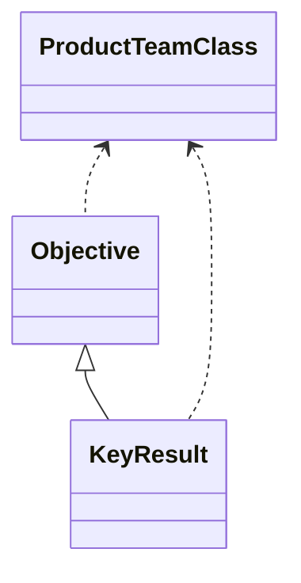
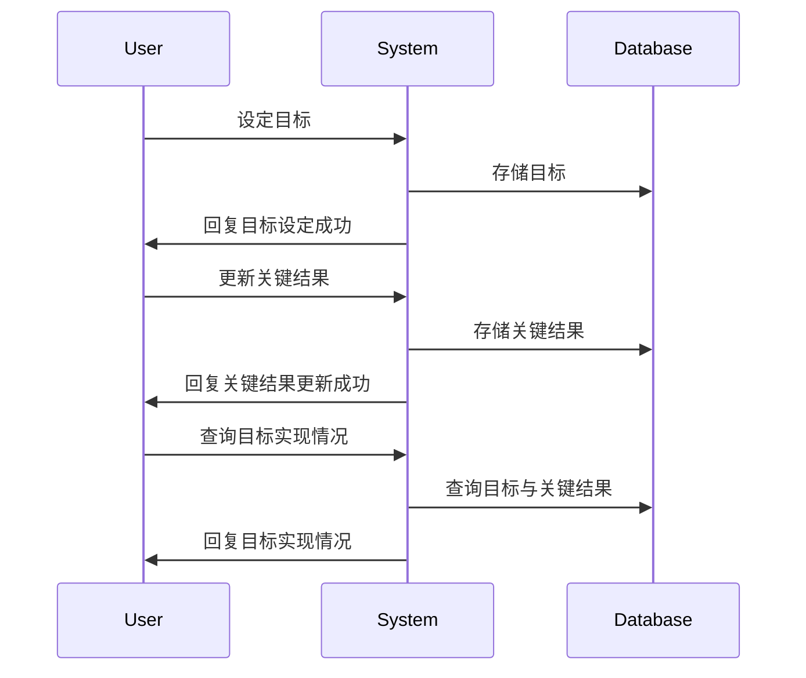
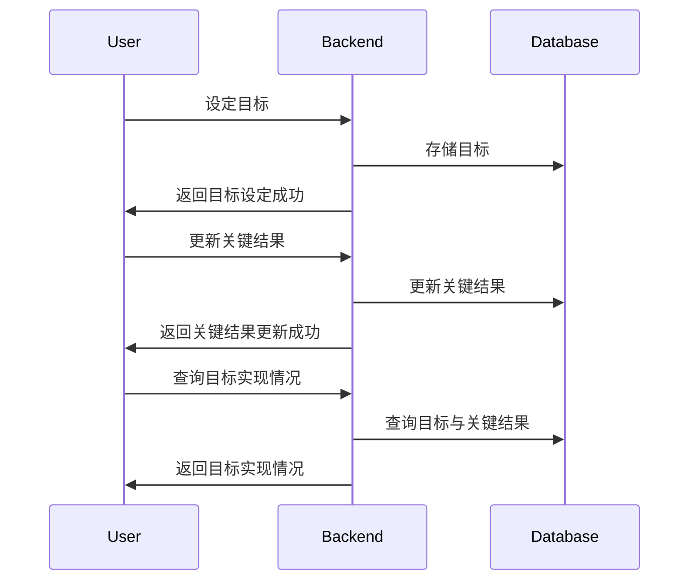

                 

# 目标管理OKR：引导团队聚焦的方法论

## 关键词

目标管理、OKR、团队聚焦、绩效提升、执行力

## 摘要

本文将深入探讨目标管理OKR（Objective and Key Results）的概念、应用及其在团队管理中的重要性。通过逻辑清晰的步骤分析，我们将从背景介绍、核心概念与联系、算法原理讲解、系统分析与架构设计、项目实战以及最佳实践等方面全面剖析OKR方法论，旨在为读者提供一套实用、有效的目标管理工具，帮助团队实现聚焦和提升绩效。

## 第一部分：背景介绍

### 1. 引言

目标管理是一种现代企业管理方法，旨在通过设定明确的目标和衡量标准，引导团队和组织朝着共同的方向努力。OKR（Objective and Key Results）作为一种目标管理方法论，起源于英特尔，并在谷歌等科技巨头中得到广泛应用。OKR的核心在于通过明确的目标和可量化的关键结果，确保团队的工作方向和绩效。

### 2. 问题背景

在当前快速变化的市场环境中，企业面临着前所未有的挑战。团队成员在工作中常常感到迷茫，缺乏明确的目标和方向。这导致工作效率低下，甚至影响企业的整体绩效。如何确保团队目标的一致性、提高团队执行力成为企业管理者面临的重要挑战。

### 3. 问题解决

OKR方法论的提出，为解决上述问题提供了一种有效的途径。通过设定明确的、可量化的目标，以及与之相对应的关键结果，OKR帮助团队和个体明确工作方向，激发工作动力，同时通过定期的评估和反馈，确保目标的实现。

### 4. 边界与外延

OKR方法论不仅适用于企业内部，也可以应用于团队管理、项目管理等领域。其核心在于通过设定目标来明确工作方向，通过关键结果来衡量工作成效。在不同领域，OKR的具体应用方法和实施细节可能会有所不同。

### 5. 概念结构与核心要素组成

OKR方法论包括以下几个核心要素：

- **目标（Objective）**：明确团队或个体希望实现的目标，通常应具有挑战性且具体可测量。
- **关键结果（Key Results）**：明确衡量目标实现情况的具体指标，通常设定3-5个关键结果，以便于监控和评估。

## 第二部分：核心概念与联系

### 1.2 OKR的定义与特点

#### 1.2.1 OKR的定义

OKR是一种目标设定和跟踪方法，由英特尔公司创始人安迪·格鲁夫提出，并在谷歌等知名企业中得到广泛应用。OKR由目标（Objective）和关键结果（Key Results）两部分组成。

#### 1.2.2 OKR的特点

- **明确性**：目标需要明确、具体，关键结果需要可量化。
- **挑战性**：目标应具有一定的挑战性，鼓励团队跳出舒适区。
- **透明性**：OKR是透明的，团队成员可以随时查看团队的目标和关键结果，确保工作方向一致。

### 1.3 OKR的核心要素

#### 1.3.1 目标（Objective）

目标应回答以下问题：

- **我们希望实现什么？**
- **为什么这个目标对我们来说重要？**

#### 1.3.2 关键结果（Key Results）

关键结果应回答以下问题：

- **我们将如何衡量目标是否实现？**
- **关键结果应具体、可量化。**

### 1.4 OKR与传统目标设定的对比

| 对比项       | OKR                              | 传统目标设定                            |
|--------------|----------------------------------|----------------------------------------|
| 目标明确性   | 明确、具体、可量化               | 模糊、抽象、难以量化                    |
| 挑战性       | 具有挑战性，鼓励创新和突破      | 安于现状，缺乏动力                      |
| 透明性       | 目标和关键结果公开透明          | 目标不公开，容易产生信息不对称          |

## 第三部分：算法原理讲解

### 2.1 OKR设定与跟踪算法原理

#### 2.1.1 算法简介

OKR设定与跟踪算法是一种用于帮助企业或团队设定目标、跟踪进度并实现目标的方法。该算法基于目标管理和激励机制，通过设定合理的目标、监控关键结果、提供反馈和调整策略，确保目标的实现。

#### 2.1.2 算法核心原理

- **目标设定**：根据企业或团队的愿景和战略，设定具体的、可量化的目标。
- **关键结果监控**：设定关键结果，定期监控和评估目标的实现情况。
- **反馈与调整**：根据监控结果，提供反馈并调整目标和策略。

#### 2.1.3 算法流程

1. **设定目标**：根据企业或团队的愿景和战略，设定具体的、可量化的目标。
2. **制定关键结果**：为每个目标设定3-5个关键结果，确保目标可衡量。
3. **监控关键结果**：定期跟踪关键结果，评估目标的实现情况。
4. **提供反馈**：根据监控结果，提供反馈并分享经验教训。
5. **调整目标与策略**：根据反馈，调整目标和策略，确保目标的实现。

### 2.2 OKR算法数学模型与公式

OKR算法的数学模型可以表示为：

$$
OKR = \{ O_1, O_2, ..., O_n \}, \quad KR_1 = f(O_1), \quad ..., \quad KR_n = f(O_n)
$$

其中，$O_i$ 表示第 $i$ 个目标，$KR_i$ 表示与目标 $O_i$ 相关的关键结果，$f$ 表示目标实现情况的评估函数。

关键结果 $KR_i$ 的评估公式为：

$$
KR_i = \frac{实际值}{目标值}
$$

其中，实际值为关键结果在某一时间段内的实际实现值，目标值为设定的关键结果目标值。

### 2.3 OKR算法实例说明

假设某团队的目标是“提高产品市场份额”，关键结果可以设定为：

- **KR1**：产品市场份额提高5%
- **KR2**：增加1000个新客户
- **KR3**：提高客户满意度评分10%

在第一个季度末，团队监控关键结果，得到以下数据：

- **KR1**：实际市场份额提高6%
- **KR2**：实际增加1200个新客户
- **KR3**：实际客户满意度评分提高12%

根据关键结果的评估公式，团队可以计算出每个关键结果的实现比例：

$$
KR1 = \frac{6\%}{5\%} = 1.2 \\
KR2 = \frac{1200}{1000} = 1.2 \\
KR3 = \frac{12\%}{10\%} = 1.2
$$

由于所有关键结果的实现比例均超过1，说明团队的目标实现情况良好。在此基础上，团队可以继续设定下一个季度的目标，并制定相应的关键结果。

## 第四部分：系统分析与架构设计

### 3.1 问题场景介绍

在一家互联网公司，产品团队希望通过目标管理提高产品开发和市场推广的效率。团队负责人决定引入OKR方法论，以明确工作目标、提高团队执行力。

### 3.2 项目介绍

项目名称：产品团队OKR管理系统

项目目标：通过实施OKR方法论，提高产品开发和市场推广的效率，提升团队绩效。

### 3.3 系统功能设计

#### 3.3.1 领域模型

领域模型类图：



#### 3.3.2 系统功能

- **目标设定**：团队负责人根据项目目标设定具体的OKR。
- **关键结果监控**：团队成员定期更新关键结果，系统自动计算实现比例。
- **反馈与调整**：团队负责人根据关键结果反馈，调整目标和策略。

### 3.4 系统架构设计

系统架构图：



### 3.5 系统接口设计

#### 3.5.1 接口列表

- **设定目标**：POST /api/okr/set-objective
- **更新关键结果**：POST /api/okr/update-key-result
- **查询目标实现情况**：GET /api/okr/get-okr-status

#### 3.5.2 接口设计

```yaml
# 设定目标接口
POST /api/okr/set-objective
Parameters:
  - objective: 目标描述
  - keyResults: 关键结果列表
Response:
  - success: 操作成功
  - error: 操作失败

# 更新关键结果接口
POST /api/okr/update-key-result
Parameters:
  - objectiveId: 目标ID
  - keyResultId: 关键结果ID
  - actualValue: 实际值
Response:
  - success: 操作成功
  - error: 操作失败

# 查询目标实现情况接口
GET /api/okr/get-okr-status
Parameters:
  - objectiveId: 目标ID
Response:
  - okrStatus: 目标实现情况
  - error: 操作失败
```

### 3.6 系统交互设计

系统交互序列图：



## 第五部分：项目实战

### 4.1 环境安装

在本地计算机上安装以下软件和工具：

- Python 3.8+
- Flask
- SQLAlchemy
- Redis

### 4.2 系统核心实现源代码

以下是产品团队OKR管理系统的核心实现源代码：

```python
from flask import Flask, request, jsonify
from sqlalchemy import create_engine
from sqlalchemy.orm import sessionmaker

app = Flask(__name__)

# 配置数据库连接
engine = create_engine('sqlite:///okr.db')
Session = sessionmaker(bind=engine)

# 目标模型
class Objective():
    # 省略代码

# 关键结果模型
class KeyResult():
    # 省略代码

# API接口实现
@app.route('/api/okr/set-objective', methods=['POST'])
def set_objective():
    # 省略代码

@app.route('/api/okr/update-key-result', methods=['POST'])
def update_key_result():
    # 省略代码

@app.route('/api/okr/get-okr-status', methods=['GET'])
def get_okr_status():
    # 省略代码

if __name__ == '__main__':
    app.run(debug=True)
```

### 4.3 代码应用解读与分析

以下是代码的解读与分析：

1. **数据库连接**：使用SQLAlchemy创建数据库连接，实现ORM操作。
2. **目标模型**：定义Objective类，用于表示OKR中的目标。
3. **关键结果模型**：定义KeyResult类，用于表示OKR中的关键结果。
4. **API接口实现**：实现设定目标、更新关键结果和查询目标实现情况的接口。

### 4.4 实际案例分析和详细讲解剖析

假设产品团队的目标是“提高产品市场份额”，关键结果可以设定为：

- **KR1**：产品市场份额提高5%
- **KR2**：增加1000个新客户
- **KR3**：提高客户满意度评分10%

在第一个季度末，团队监控关键结果，得到以下数据：

- **KR1**：实际市场份额提高6%
- **KR2**：实际增加1200个新客户
- **KR3**：实际客户满意度评分提高12%

根据关键结果的评估公式，团队可以计算出每个关键结果的实现比例：

$$
KR1 = \frac{6\%}{5\%} = 1.2 \\
KR2 = \frac{1200}{1000} = 1.2 \\
KR3 = \frac{12\%}{10\%} = 1.2
$$

由于所有关键结果的实现比例均超过1，说明团队的目标实现情况良好。

### 4.5 项目小结

通过实际案例分析和详细讲解剖析，我们可以看到，产品团队OKR管理系统能够有效地帮助团队设定目标、监控关键结果和评估目标实现情况。这有助于团队明确工作方向，提高工作效率，最终实现整体绩效的提升。

## 第六部分：最佳实践

### 6.1 小结

本文通过详细的步骤分析和实例讲解，深入探讨了目标管理OKR的方法论。OKR作为一种有效的目标管理工具，能够帮助团队明确目标、提高执行力，实现绩效提升。

### 6.2 注意事项

- **目标设定应具有挑战性**：目标应具有一定的难度，鼓励团队跳出舒适区，实现突破。
- **关键结果应具体可量化**：关键结果需要具体、可量化，以便于监控和评估。
- **定期反馈与调整**：定期进行目标评估和反馈，及时调整目标和策略。

### 6.3 拓展阅读

- [《谷歌如何管理目标？》](https://www.cnblogs.com/edisonchou/p/10889611.html)
- [《OKR：目标与关键结果管理法》](https://book.douban.com/subject/27080717/)

## 作者信息

作者：AI天才研究院/AI Genius Institute & 禅与计算机程序设计艺术 /Zen And The Art of Computer Programming

（完）

