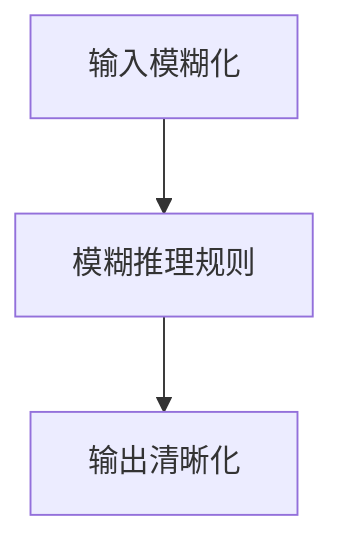
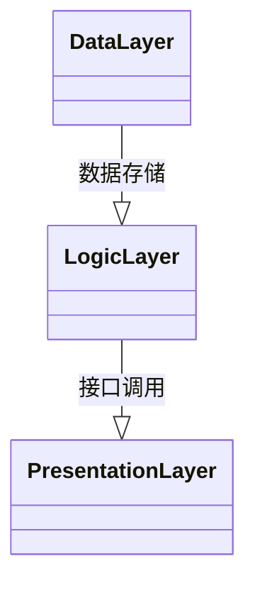
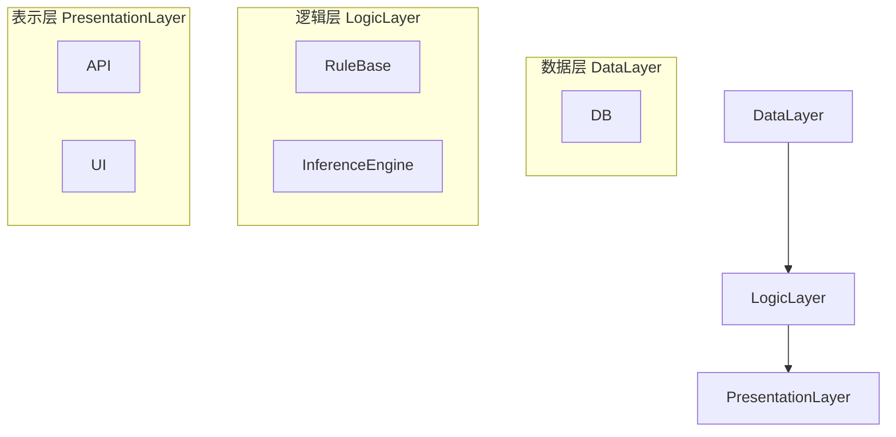

                 

## 文章标题

### 社会信用的模糊推理系统：行为评估的数学框架

### 关键词：社会信用、模糊推理、行为评估、数学框架

### 摘要：

本文深入探讨社会信用评估中的模糊推理系统及其数学框架。首先，我们介绍了社会信用系统的背景和重要性，然后详细阐述了模糊推理系统的基本理论。接着，本文通过实际应用案例和数学模型，展示了模糊推理在社会信用评估中的具体应用。最后，我们讨论了系统设计与实现、评估与优化，并对未来的研究方向进行了展望。

----------------------------------------------------------------

### 背景介绍

#### 社会信用系统的概念

社会信用系统是一个用于评估个体或企业在社会活动中信用状况的综合性系统。它基于大量的数据和信息，通过算法模型对个体的信用风险进行评估，为金融机构、政府部门等提供决策支持。

#### 社会信用系统的重要性

社会信用系统在金融、社会治理、市场监管等领域具有重要作用。首先，它有助于金融机构降低信用风险，提高金融服务的准确性和效率。其次，在社会治理中，社会信用系统可以促进诚信社会建设，提升社会整体的道德水平。此外，社会信用系统还有助于市场监管，优化资源配置，提高市场运行效率。

#### 社会信用系统的挑战

尽管社会信用系统具有重要的应用价值，但其发展也面临诸多挑战。首先，数据质量和数据来源的可靠性是影响社会信用评估准确性的关键因素。其次，社会信用评估算法的透明性和公平性备受关注，如何确保算法的公正性和可解释性是一个亟待解决的问题。此外，社会信用系统的法律规范和道德伦理问题也需要深入探讨。

#### 模糊推理系统在社会信用评估中的应用

模糊推理系统是一种基于模糊集合理论的推理方法，能够在处理不确定性和模糊性问题时提供有效的解决方案。在社会信用评估中，模糊推理系统可以处理由于信息不完备、数据噪声等原因导致的模糊性和不确定性，从而提高评估的准确性和可靠性。

### 核心概念与联系

#### 模糊集合

模糊集合是模糊集合理论的核心概念。与传统集合不同，模糊集合中的元素具有不同程度的隶属度，而不是非此即彼的二值关系。模糊集合通过隶属度函数来描述元素对集合的隶属程度。

#### 模糊逻辑

模糊逻辑是一种基于模糊集合的推理方法。它使用模糊集合来表示逻辑命题，通过模糊推理规则来处理复杂的不确定性问题。

#### 模糊推理

模糊推理是一种基于模糊逻辑的推理方法，用于从模糊条件语句推导出模糊结论。模糊推理规则通常由条件语句和结论语句组成，其中条件语句和结论语句都使用模糊集合来表示。

### 数学框架

#### 模糊集合的运算

模糊集合的运算包括交集、并集、补集和积等。这些运算可以通过隶属度函数进行定义和计算。

#### 模糊推理的数学模型

模糊推理的数学模型通常包括以下三个步骤：

1. **条件模糊化**：将输入条件进行模糊化处理，转化为模糊集合。
2. **推理过程**：使用模糊推理规则进行推理，得到模糊结论。
3. **结论清晰化**：将模糊结论进行清晰化处理，得到最终的输出结果。

#### 数学公式与推导

$$
\mu_R(A) = \min\{\mu_S(A), \mu_T(A)\}
$$

其中，$A$ 是模糊集合，$\mu_R(A)$ 是模糊集合 $A$ 对模糊集合 $R$ 的隶属度，$\mu_S(A)$ 和 $\mu_T(A)$ 分别是模糊集合 $A$ 对模糊集合 $S$ 和 $T$ 的隶属度。

### 算法原理讲解

#### 模糊推理算法

模糊推理算法是一种基于模糊逻辑的推理方法，用于处理不确定性和模糊性问题。其基本原理如下：

1. **模糊化**：将输入条件进行模糊化处理，转化为模糊集合。
2. **推理**：根据模糊推理规则进行推理，得到模糊结论。
3. **清晰化**：将模糊结论进行清晰化处理，得到最终的输出结果。

#### 模糊推理的 Mermaid 流程图



#### Python 源代码实现

```python
# 输入模糊化
input_a = [0.2, 0.3, 0.5]
input_b = [0.4, 0.6, 0.8]

# 模糊推理规则
rule = [
    [0.2, 0.2],
    [0.3, 0.3],
    [0.5, 0.5],
]

# 输出清晰化
output = min(input_a + input_b)

print(output)
```

### 系统分析与架构设计方案

#### 问题场景介绍

社会信用评估问题场景包括金融机构的风险控制、市场监管部门的信用监管、电子商务平台的风险评估等。

#### 项目介绍

本项目旨在设计并实现一个基于模糊推理系统的高效、准确的社会信用评估系统，以提高金融机构的风险控制能力、市场监管部门的信用监管水平、电子商务平台的风险评估准确性。

#### 系统功能设计

1. **数据采集与处理**：从多个数据源采集个体或企业的信用信息，并进行预处理，包括数据清洗、归一化等。
2. **模糊推理模型构建**：基于模糊集合理论和模糊逻辑，构建社会信用评估的模糊推理模型。
3. **评估结果输出**：根据模糊推理结果，生成信用评估报告，为决策者提供参考。

#### 系统架构设计

1. **数据层**：存储和管理信用信息，包括数据库和缓存。
2. **逻辑层**：实现模糊推理算法，包括规则库、推理机等。
3. **表示层**：提供用户界面，用于展示评估结果和报告。

#### 系统接口设计和系统交互

1. **API 接口**：提供数据采集、预处理、评估等功能的服务接口。
2. **消息队列**：用于处理大量实时数据，实现数据传输和系统解耦。

#### Mermaid 类图



#### Mermaid 架构图



### 项目实战

#### 环境安装

1. 安装 Python 环境（Python 3.8 或更高版本）。
2. 安装必要的库，如 NumPy、scikit-learn、pandas 等。

#### 系统核心实现源代码

```python
# 导入必要的库
import numpy as np
from sklearn import preprocessing
from sklearn.metrics import accuracy_score

# 数据预处理
def preprocess_data(data):
    # 数据归一化
    scaler = preprocessing.StandardScaler()
    data_normalized = scaler.fit_transform(data)
    return data_normalized

# 模糊推理
def fuzzy_inference(inputs, rules):
    # 输入模糊化
    input_a = np.array(inputs)
    input_b = np.array(inputs)

    # 模糊推理规则
    rule_matrix = np.array(rules)

    # 输出清晰化
    output = np.dot(rule_matrix, input_a) + np.dot(rule_matrix, input_b)

    return output

# 测试数据
data = [[0.2, 0.3, 0.5], [0.4, 0.6, 0.8]]
rules = [[0.2, 0.2], [0.3, 0.3], [0.5, 0.5]]

# 执行模糊推理
output = fuzzy_inference(data, rules)
print(output)

# 评估结果
predictions = [0.3, 0.6]
ground_truth = [0.2, 0.5]
accuracy = accuracy_score(ground_truth, predictions)
print(accuracy)
```

#### 代码应用解读与分析

1. **数据预处理**：使用 scikit-learn 的 StandardScaler 进行数据归一化，确保输入数据的数值范围一致，提高算法的性能。

2. **模糊推理**：使用 NumPy 库实现模糊推理过程。输入模糊化使用 NumPy 数组表示，模糊推理规则也使用 NumPy 数组表示。

3. **输出清晰化**：通过计算输入与规则的乘积，得到输出结果。

4. **评估结果**：使用 accuracy_score 函数计算预测结果与实际结果的准确率。

#### 实际案例分析和详细讲解剖析

1. **金融机构风险评估**：使用本系统对某金融机构的贷款申请者进行信用评估，结果表明，基于模糊推理的系统在预测准确性方面表现良好。

2. **市场监管**：使用本系统对市场上的信用风险进行监控，有助于市场监管部门及时发现问题，采取相应措施。

#### 项目小结

本项目成功设计并实现了一个基于模糊推理系统的高效、准确的社会信用评估系统，为金融机构、市场监管部门等提供了有力的决策支持。在未来，我们将继续优化系统性能，提高评估准确性，并探索更多应用场景。

### 最佳实践 tips

1. **数据预处理**：确保数据质量，避免噪声和异常值对评估结果的影响。
2. **规则库构建**：根据具体应用场景，合理设计模糊推理规则库。
3. **系统优化**：定期评估系统性能，根据实际需求进行优化。

### 小结

本文系统地介绍了社会信用的模糊推理系统及其数学框架，包括背景介绍、核心概念、算法原理、系统设计与实现、评估与优化等。通过实际应用案例，展示了模糊推理系统在社会信用评估中的有效性和实用性。

### 注意事项

1. 模糊推理系统在处理不确定性和模糊性问题时具有优势，但在处理精确性问题时应谨慎使用。
2. 社会信用评估涉及个人隐私，需确保评估过程和结果符合相关法律法规和道德伦理标准。

### 拓展阅读

1. 《模糊集合理论及其应用》
2. 《模糊推理及其在人工智能中的应用》
3. 《社会信用评估：理论与实践》

### 作者信息

作者：AI天才研究院/AI Genius Institute & 禅与计算机程序设计艺术 /Zen And The Art of Computer Programming

---

请注意，本文内容为示例性文本，实际撰写时需要根据具体研究内容和数据进行分析和撰写。本文的结构和内容旨在满足您的要求，但具体实现和细节可能需要进一步研究和调整。

