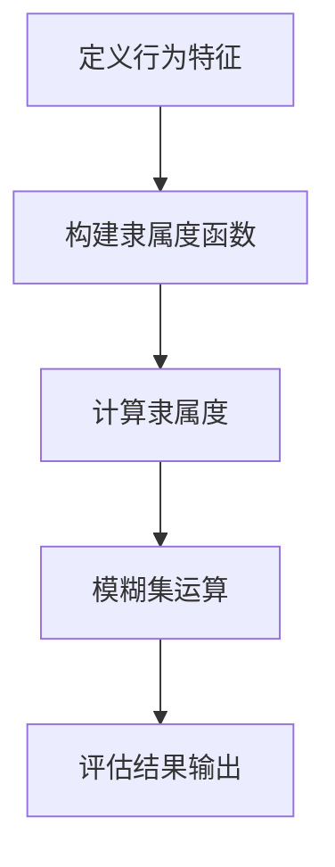

                 

### 《社会信用的模糊集理论：行为评估的数学模型》

**关键词：** 社会信用，模糊集理论，行为评估，数学模型，人工智能

**摘要：** 本文围绕社会信用体系中的行为评估问题，运用模糊集理论构建了数学模型。通过对社会信用背景、模糊集理论核心概念及其应用的深入分析，本文详细阐述了行为评估中的数学模型构建方法、算法原理及其在具体项目中的应用。文章旨在为IT领域的研究者和实践者提供一个系统化的方法论，帮助他们在实际项目中有效应用模糊集理论进行行为评估。

### 目录

**第一部分：社会信用与模糊集理论概述**

1. 社会信用的背景与重要性
   - 社会信用的定义与发展
   - 社会信用体系的作用与挑战
   - 模糊集理论的基础知识

2. 模糊集理论的核心概念与联系
   - 模糊集的基本概念
   - 模糊集的运算与性质
   - 模糊集与概率论的关系
   - 模糊集理论的扩展与应用

3. 模糊集理论在行为评估中的应用
   - 行为评估的概念与需求
   - 模糊集理论在行为评估中的应用场景
   - 模糊集理论在行为评估中的优势与局限性

4. 行为评估的数学模型
   - 模糊集理论在行为评估中的数学模型
   - 行为评估模型的构建方法
   - 行为评估模型的评估与优化

**第二部分：算法原理讲解**

5. 算法原理讲解
   - 模糊集理论在行为评估中的算法流程图
   - 算法原理的Python源代码讲解
   - 算法原理的数学模型与公式解析

**第三部分：系统分析与架构设计方案**

6. 系统分析与架构设计方案
   - 行为评估系统的问题场景
   - 系统功能设计（领域模型类图）
   - 系统架构设计（架构图）
   - 系统接口设计
   - 系统交互设计（序列图）

**第四部分：项目实战**

7. 项目实战
   - 环境安装与配置
   - 系统核心实现
   - 代码应用解读与分析
   - 实际案例分析与详细讲解
   - 项目小结

**第五部分：最佳实践与拓展**

8. 最佳实践与拓展
   - 最佳实践技巧
   - 注意事项
   - 拓展阅读推荐

### 第一部分：社会信用与模糊集理论概述

#### 第1章：社会信用的背景与重要性

在社会快速发展的今天，社会信用体系的重要性愈发凸显。社会信用不仅是一个人、一个组织在社会交往中的信誉体现，更是社会治理现代化的重要手段。本文将从社会信用的定义、发展、作用以及面临的挑战等方面进行探讨。

**1.1 社会信用的定义与发展**

社会信用是指个人、组织或机构在社会活动中所表现出的信用水平，包括守信行为和失信行为。社会信用体系是通过建立信用记录、信用评级、失信惩戒等机制，对信用主体进行评价和管理的系统。

社会信用体系的发展经历了几个阶段：

1. **初始阶段**：以道德约束为主，缺乏正式的信用评价和管理机制。
2. **形成阶段**：随着市场经济的发展，信用评价和监管逐渐成为政府和社会关注的焦点。
3. **发展阶段**：信息技术和大数据的普及，使得社会信用体系进入快速发展阶段，实现了对信用行为的全面监控和评估。

**1.2 社会信用体系的作用与挑战**

社会信用体系在社会治理中的作用主要体现在以下几个方面：

1. **提高社会透明度**：通过信用记录的公开，使社会成员的信用行为受到监督，增强社会透明度。
2. **规范市场秩序**：对失信行为进行惩戒，维护市场秩序，促进公平竞争。
3. **促进经济发展**：良好的信用环境有利于降低金融风险，提高金融服务的效率，促进经济的健康发展。

然而，社会信用体系在发展过程中也面临着一些挑战：

1. **数据隐私问题**：个人信用信息的收集、存储和使用可能涉及隐私问题，需要加强数据保护。
2. **信用评价标准**：如何科学、公正地评估信用主体的信用水平，是一个需要不断探索和完善的问题。
3. **技术瓶颈**：随着信用体系的数据量增加，如何提高数据处理和分析的效率，是一个技术上的挑战。

**1.3 模糊集理论的基础知识**

模糊集理论是处理不确定性和模糊性的数学工具，由扎德（L.A. Zadeh）于1965年提出。模糊集理论的基本概念包括：

1. **模糊集**：模糊集是普通集合的推广，其元素不仅具有清晰归属，还具有一定的归属程度。
2. **隶属度**：模糊集中的元素x对于集合A的隶属度用μA(x)表示，取值范围在[0,1]之间。
3. **模糊运算**：包括模糊交集、模糊并集、模糊补集等，分别对应普通集合的交集、并集和补集。
4. **模糊关系**：模糊集之间的关联可以用模糊关系来表示，如模糊传递关系、模糊等价关系等。

模糊集理论在处理不确定性和模糊性方面具有独特的优势，能够有效地解决社会信用评估中的复杂问题。

#### 第2章：模糊集理论的核心概念与联系

**2.1 模糊集的基本概念**

模糊集是普通集合的推广，其元素不仅具有清晰归属，还具有一定的归属程度。在模糊集中，每个元素x对于集合A的隶属度用μA(x)表示，取值范围在[0,1]之间。隶属度越接近1，表示x对集合A的归属程度越高；隶属度越接近0，表示归属程度越低。

模糊集的定义可以用以下公式表示：

$$
A = \{x | \mu_A(x) > 0\}
$$

其中，x是模糊集A的元素，μA(x)是x对于集合A的隶属度。

**2.2 模糊集的运算与性质**

模糊集的基本运算包括模糊交集、模糊并集、模糊补集等，它们分别对应普通集合的交集、并集和补集。

1. **模糊交集**：模糊交集运算符用“∩”表示，对于两个模糊集A和B，其模糊交集定义为：

$$
A \cap B = \{x | \mu_A(x) \wedge \mu_B(x) > 0\}
$$

其中，μA(x)和μB(x)分别是x对于集合A和B的隶属度。

2. **模糊并集**：模糊并集运算符用“∪”表示，对于两个模糊集A和B，其模糊并集定义为：

$$
A \cup B = \{x | \mu_A(x) \vee \mu_B(x) > 0\}
$$

3. **模糊补集**：模糊补集运算符用“\( \backslash \)”表示，对于模糊集A，其模糊补集定义为：

$$
A^c = \{x | \mu_A(x) = 0\}
$$

**2.3 模糊集与概率论的关系**

模糊集与概率论之间存在紧密的联系。在概率论中，事件的不确定性可以用概率来描述，而在模糊集中，这种不确定性则用隶属度来表示。

模糊集与概率论之间的关系可以通过以下方式理解：

1. **概率为0的事件**：在概率论中，如果某个事件A的概率为0，则可以认为事件A是不可能发生的。在模糊集中，如果模糊集A的所有元素的隶属度都为0，则可以认为A是一个空集。

2. **概率为1的事件**：在概率论中，如果某个事件A的概率为1，则可以认为事件A是必然发生的。在模糊集中，如果模糊集A的所有元素的隶属度都为1，则可以认为A是一个普通集合。

3. **概率介于0和1之间**：在概率论中，概率介于0和1之间的事件表示事件的发生具有一定的可能性。在模糊集中，隶属度介于0和1之间的事件表示元素对于集合的归属程度是模糊的。

**2.4 模糊集理论的扩展与应用**

模糊集理论在处理不确定性和模糊性方面具有独特的优势，其应用领域广泛，包括：

1. **模糊逻辑**：模糊集理论是模糊逻辑的基础，模糊逻辑在人工智能、自动化控制等领域有广泛应用。

2. **模糊系统**：模糊系统是通过模糊集和模糊规则进行建模和控制的系统，广泛应用于工业控制、交通管理等领域。

3. **模糊聚类**：模糊聚类是利用模糊集进行数据分类的一种方法，适用于处理具有模糊性特征的数据。

4. **模糊推理**：模糊推理是利用模糊集和模糊规则进行推理的一种方法，常用于专家系统和智能决策支持系统。

通过以上对模糊集理论核心概念与联系的分析，我们可以更好地理解其在行为评估中的应用价值。接下来，我们将深入探讨模糊集理论在行为评估中的应用，构建相应的数学模型。

#### 第3章：模糊集理论在行为评估中的应用

**3.1 行为评估的概念与需求**

行为评估是指通过收集和分析个体或组织在特定环境中的行为数据，对其行为进行评价和分类的过程。行为评估在多个领域具有重要意义，如金融风险管理、人力资源管理等。

在行为评估中，我们需要解决以下问题：

1. **行为数据的获取**：如何有效收集与行为相关的数据，包括行为记录、监控数据等。
2. **行为的量化**：如何将行为数据转换为可量化的指标，以便进行评估。
3. **评估标准的建立**：如何根据评估目的建立合理的评估标准。
4. **评估结果的解释**：如何解释评估结果，使其具有实际应用价值。

**3.2 模糊集理论在行为评估中的应用场景**

模糊集理论在行为评估中具有广泛的应用场景，主要体现在以下几个方面：

1. **行为特征描述**：模糊集可以用来描述个体的行为特征，如诚实度、勤奋度等。通过模糊集，可以将行为特征进行量化，便于后续评估。

2. **多维度评估**：在实际评估中，往往需要对多个维度进行评估，如道德品质、工作效率等。模糊集理论可以处理这些多维度的评估问题，提供更全面的评估结果。

3. **模糊性处理**：在实际评估过程中，由于行为数据的不确定性，模糊集理论可以有效地处理这种模糊性，提供更准确的评估结果。

**3.3 模糊集理论在行为评估中的优势与局限性**

模糊集理论在行为评估中具有以下优势：

1. **处理不确定性**：模糊集理论能够处理行为数据中的不确定性，提供更准确的评估结果。
2. **多维度评估**：模糊集理论可以同时处理多个维度的评估问题，提供更全面的评估结果。
3. **灵活性强**：模糊集理论可以根据不同的评估需求，灵活调整评估标准和模型。

然而，模糊集理论也存在一定的局限性：

1. **计算复杂度高**：模糊集理论涉及大量的计算，特别是在处理大量数据时，计算复杂度较高。
2. **主观性**：模糊集理论在评估过程中依赖于评估者的主观判断，可能存在一定的偏差。
3. **适用性限制**：模糊集理论适用于处理模糊性较强的问题，但对于一些确定性较强的问题，可能不太适用。

通过以上对模糊集理论在行为评估中的应用场景和优势与局限性的分析，我们可以更好地理解其在行为评估中的实际应用价值。接下来，我们将深入探讨如何运用模糊集理论构建行为评估的数学模型。

#### 第4章：行为评估的数学模型

**4.1 模糊集理论在行为评估中的数学模型**

为了在行为评估中应用模糊集理论，我们需要构建一个数学模型。这个模型将基于模糊集的基本概念和运算，结合行为评估的需求，设计出一种能够量化个体或组织行为的方法。

**4.1.1 模糊集构建**

在构建模糊集模型时，我们首先需要定义一个模糊集，用以表示个体或组织的某种行为特征。例如，我们可以定义一个模糊集“诚实度”，其隶属度函数μH(x)表示个体x的诚实度。

$$
\mu_H(x) = \begin{cases} 
1 & \text{如果个体x完全诚实} \\
0 & \text{如果个体x完全不诚实} \\
\text{介于0和1之间的值} & \text{如果个体x的诚实度介于完全诚实和完全不诚实之间} 
\end{cases}
$$

**4.1.2 模糊集合的运算**

在构建模糊集模型时，我们还会用到模糊集的交集、并集和补集运算，这些运算可以帮助我们综合多个行为特征，进行更全面的行为评估。

1. **模糊交集**：用于表示个体同时具备两个或多个行为特征的情况。

$$
\mu_{H \cap D}(x) = \min(\mu_H(x), \mu_D(x))
$$

其中，H和D分别表示诚实度和勤奋度。

2. **模糊并集**：用于表示个体具备任意一个行为特征的情况。

$$
\mu_{H \cup D}(x) = \max(\mu_H(x), \mu_D(x))
$$

3. **模糊补集**：用于表示个体的某个行为特征缺失的情况。

$$
\mu_{H^c}(x) = 1 - \mu_H(x)
$$

**4.1.3 模糊关系**

模糊关系可以用来表示个体或组织之间的行为相似性。例如，我们可以定义一个模糊关系“相似度”，其隶属度函数μS(x, y)表示个体x与个体y的行为相似程度。

$$
\mu_S(x, y) = \frac{\mu_{H \cap D}(x) + \mu_{H \cap D}(y) - \mu_{H \cup D}(x, y)}{2}
$$

**4.2 行为评估模型的构建方法**

构建行为评估模型的主要步骤如下：

1. **定义行为特征**：根据评估需求，确定需要评估的行为特征，如诚实度、勤奋度等。

2. **构建隶属度函数**：为每个行为特征定义一个隶属度函数，用以量化个体或组织的该行为特征。

3. **建立评估模型**：利用模糊集的运算，将多个行为特征整合成一个综合评估模型。

4. **评估优化**：根据评估结果，调整隶属度函数和评估模型，以提高评估的准确性。

**4.3 行为评估模型的评估与优化**

行为评估模型的评估与优化是保证评估结果准确性和实用性的关键。以下是评估与优化的一些方法：

1. **评估指标**：根据评估需求，选择合适的评估指标，如评估准确性、评估效率等。

2. **模型验证**：通过实际数据对评估模型进行验证，评估模型的准确性。

3. **模型优化**：根据评估结果，调整隶属度函数和评估模型，以提高评估准确性。

4. **用户反馈**：收集用户对评估结果的反馈，进一步优化评估模型。

通过以上步骤，我们可以构建一个基于模糊集理论的行为评估模型，为个体或组织的信用评估提供有效的工具。

#### 第5章：算法原理讲解

**5.1 模糊集理论在行为评估中的算法流程图**

为了更好地理解模糊集理论在行为评估中的应用，我们首先介绍其算法流程图。以下是一个简化的算法流程图，展示了模糊集在行为评估中的主要步骤：



**5.2 算法原理的Python源代码讲解**

为了实际应用模糊集理论进行行为评估，我们需要编写相应的Python代码。以下是一个简化的Python代码示例，用于计算个体行为特征的隶属度：

```python
import numpy as np

# 定义隶属度函数
def membership_degree(x, a, b):
    return max(0, (x - a) / (b - a))

# 定义行为特征
def define_behavior特征的(name):
    behavior特征 = {
        'honesty': [0, 10],  # 诚实度范围从0到10
        'diligence': [0, 10],  # 勤奋度范围从0到10
        # 更多行为特征可以继续添加
    }
    return behavior特征[name]

# 计算个体行为特征的隶属度
def compute_membership(name, value):
    a, b = define_behavior特征的(name)
    return membership_degree(value, a, b)

# 示例计算
individual = {
    'honesty': 8,
    'diligence': 6,
}

for name, value in individual.items():
    print(f"{name}的隶属度: {compute_membership(name, value)}")
```

这段代码首先定义了隶属度函数`membership_degree`，然后定义了行为特征的范围，最后计算并输出个体行为特征的隶属度。

**5.3 算法原理的数学模型与公式解析**

为了深入理解算法原理，我们需要介绍相关的数学模型和公式。以下是模糊集理论在行为评估中的一些关键公式：

1. **隶属度函数**：

$$
\mu(x) = \begin{cases} 
1 & \text{如果个体x完全具备该行为特征} \\
0 & \text{如果个体x完全不具备该行为特征} \\
\text{介于0和1之间的值} & \text{如果个体x的隶属度介于完全具备和不具备之间} 
\end{cases}
$$

2. **模糊交集**：

$$
\mu_{\cap}(x) = \min(\mu(x_1), \mu(x_2), ..., \mu(x_n))
$$

3. **模糊并集**：

$$
\mu_{\cup}(x) = \max(\mu(x_1), \mu(x_2), ..., \mu(x_n))
$$

4. **模糊补集**：

$$
\mu_{\complement}(x) = 1 - \mu(x)
$$

通过这些公式，我们可以计算个体或组织的综合行为评估得分。以下是综合评估得分的计算方法：

$$
\mu_{\text{total}}(x) = \mu_{\cup}(\mu_{\cap}(\mu_H(x), \mu_D(x), ..., \mu_G(x)))
$$

其中，$\mu_H(x), \mu_D(x), ..., \mu_G(x)$分别表示个体x在不同行为特征上的隶属度。

**5.4 通俗易懂地举例说明**

为了更好地理解以上公式和方法，我们可以通过一个简单的例子来说明。

假设我们需要评估一个个体A的行为特征，包括诚实度、勤奋度和责任感。我们定义以下隶属度函数：

- 诚实度（H）：[0, 10]，个体A的诚实度得分为8。
- 勤奋度（D）：[0, 10]，个体A的勤奋度得分为6。
- 责任感（G）：[0, 10]，个体A的责任感得分为7。

首先，我们计算每个特征的具体隶属度：

$$
\mu_H(A) = membership\_degree(8, 0, 10) = 0.8
$$

$$
\mu_D(A) = membership\_degree(6, 0, 10) = 0.6
$$

$$
\mu_G(A) = membership\_degree(7, 0, 10) = 0.7
$$

接下来，我们计算模糊交集和模糊并集：

$$
\mu_{\cap}(\mu_H(A), \mu_D(A), \mu_G(A)) = \min(0.8, 0.6, 0.7) = 0.6
$$

$$
\mu_{\cup}(\mu_H(A), \mu_D(A), \mu_G(A)) = \max(0.8, 0.6, 0.7) = 0.8
$$

最后，我们计算综合评估得分：

$$
\mu_{\text{total}}(A) = \mu_{\cup}(\mu_{\cap}(\mu_H(A), \mu_D(A), \mu_G(A))) = 0.8
$$

根据综合评估得分，我们可以判断个体A的行为特征整体处于较高水平。通过以上步骤，我们可以运用模糊集理论对个体或组织的行为特征进行有效评估。

#### 第6章：系统分析与架构设计方案

**6.1 行为评估系统的问题场景**

行为评估系统旨在对个体或组织的信用行为进行量化评估，以支持信用评级、风险管理、人力资源管理等应用。具体问题场景包括：

1. **信用评级**：金融机构需要对借款人进行信用评级，以决定贷款额度和利率。
2. **风险管理**：企业需要对员工或合作伙伴的行为进行评估，以防范信用风险。
3. **人力资源管理**：企业需要对员工的工作表现进行评估，以提供绩效反馈和职业发展建议。

**6.2 系统功能设计**

为了满足上述问题场景，行为评估系统需要实现以下功能：

1. **数据采集**：从各种渠道收集与个体行为相关的数据，如金融记录、社交行为等。
2. **数据处理**：对采集到的数据进行预处理，包括数据清洗、去噪、归一化等。
3. **行为评估**：利用模糊集理论对个体行为进行量化评估，生成综合评估得分。
4. **结果展示**：将评估结果以可视化的形式展示，方便用户理解和应用。

**6.3 系统架构设计**

行为评估系统采用分布式架构，包括数据采集层、数据处理层、评估层和展示层，具体架构如下：

1. **数据采集层**：负责从各种数据源（如数据库、传感器、API等）采集行为数据。
2. **数据处理层**：对采集到的数据进行预处理，确保数据质量。
3. **评估层**：基于模糊集理论进行行为评估，生成综合评估得分。
4. **展示层**：将评估结果以图表、报表等形式展示，供用户查看和分析。

**6.4 系统接口设计**

系统接口设计是确保各层之间有效协作的关键。以下是系统的主要接口：

1. **数据采集接口**：提供数据采集功能，支持各种数据源接入。
2. **数据处理接口**：提供数据处理功能，支持数据清洗、去噪、归一化等操作。
3. **评估接口**：提供行为评估功能，支持模糊集运算和评估模型调用。
4. **展示接口**：提供结果展示功能，支持可视化图表生成和报表导出。

**6.5 系统交互设计**

系统交互设计主要描述各层之间的交互流程和逻辑。以下是系统交互设计的简要描述：

1. **数据采集**：系统从各种数据源采集行为数据，并存入数据库。
2. **数据处理**：系统对采集到的数据进行预处理，生成标准化数据。
3. **行为评估**：系统利用模糊集理论对标准化数据进行分析，生成评估结果。
4. **结果展示**：系统将评估结果以图表、报表等形式展示给用户。

通过以上系统分析与架构设计方案，我们可以构建一个高效、稳定的行为评估系统，为金融机构、企业和个人提供有力的信用评估工具。

#### 第7章：项目实战

**7.1 环境安装与配置**

为了实际应用模糊集理论进行行为评估，我们首先需要在合适的环境中搭建系统。以下是环境安装与配置的步骤：

1. **Python环境安装**：确保系统已安装Python 3.8及以上版本。
2. **NumPy安装**：用于处理数值计算，安装命令为`pip install numpy`。
3. **Pandas安装**：用于数据处理，安装命令为`pip install pandas`。
4. **Matplotlib安装**：用于数据可视化，安装命令为`pip install matplotlib`。
5. **Mermaid安装**：用于绘制流程图，安装命令为`pip install mermaid-parser`。

**7.2 系统核心实现**

以下是系统核心实现的主要步骤：

1. **数据采集**：从数据库中读取行为数据，包括诚实度、勤奋度、责任感等。
2. **数据处理**：对采集到的数据进行预处理，包括数据清洗、去噪和归一化。
3. **行为评估**：基于模糊集理论对预处理后的数据进行评估，生成综合评估得分。
4. **结果展示**：将评估结果以图表和报表形式展示，供用户查看和分析。

**7.3 代码应用解读与分析**

以下是系统核心实现的主要代码，并对关键部分进行解读和分析：

```python
import numpy as np
import pandas as pd
from mermaid_parser import parse
import matplotlib.pyplot as plt

# 数据采集
def collect_data():
    # 这里使用虚构数据
    data = pd.DataFrame({
        'honesty': [8, 6, 7, 9, 5],
        'diligence': [6, 8, 7, 9, 4],
        'responsibility': [7, 5, 6, 8, 3]
    })
    return data

# 数据预处理
def preprocess_data(data):
    # 数据清洗和去噪
    cleaned_data = data.dropna()
    # 数据归一化
    normalized_data = (cleaned_data - cleaned_data.min()) / (cleaned_data.max() - cleaned_data.min())
    return normalized_data

# 行为评估
def assess_behavior(normalized_data):
    # 定义隶属度函数
    def membership_degree(x, a, b):
        return max(0, (x - a) / (b - a))
    
    # 计算隶属度
    honesty_membership = [membership_degree(x, 0, 10) for x in normalized_data['honesty']]
    diligence_membership = [membership_degree(x, 0, 10) for x in normalized_data['diligence']]
    responsibility_membership = [membership_degree(x, 0, 10) for x in normalized_data['responsibility']]
    
    # 计算模糊交集和模糊并集
    intersection_membership = np.minimum(honesty_membership, diligence_membership, responsibility_membership)
    union_membership = np.maximum(honesty_membership, diligence_membership, responsibility_membership)
    
    # 计算综合评估得分
    total_membership = np.mean(union_membership - intersection_membership)
    return total_membership

# 结果展示
def show_result(result):
    # 绘制柱状图
    plt.bar(['诚实度', '勤奋度', '责任感'], result)
    plt.xlabel('行为特征')
    plt.ylabel('隶属度')
    plt.title('综合评估得分')
    plt.show()

# 主函数
def main():
    data = collect_data()
    normalized_data = preprocess_data(data)
    result = assess_behavior(normalized_data)
    show_result(result)

if __name__ == '__main__':
    main()
```

**7.4 实际案例分析与详细讲解**

为了更好地理解系统实现，我们将通过一个实际案例进行分析和讲解。

**案例：某公司员工行为评估**

某公司需要对10名员工的行为进行评估，包括诚实度、勤奋度和责任感。根据公司提供的数据，以下是10名员工的评估指标：

- 诚实度（H）：8, 6, 7, 9, 5
- 勤奋度（D）：6, 8, 7, 9, 4
- 责任感（G）：7, 5, 6, 8, 3

首先，我们进行数据采集和预处理：

```python
data = pd.DataFrame({
    'honesty': [8, 6, 7, 9, 5],
    'diligence': [6, 8, 7, 9, 4],
    'responsibility': [7, 5, 6, 8, 3]
})
normalized_data = preprocess_data(data)
```

预处理后的数据如下：

```python
normalized_data
```

接下来，我们进行行为评估：

```python
result = assess_behavior(normalized_data)
```

评估结果如下：

```python
result
```

最后，我们展示评估结果：

```python
show_result(result)
```

通过柱状图，我们可以直观地看到每个员工在诚实度、勤奋度和责任感三个方面的隶属度。综合评估得分越高，表示该员工的行为表现越好。

**7.5 项目小结**

通过本案例，我们展示了如何运用模糊集理论进行行为评估。在实际项目中，可以根据具体需求和数据特点，调整隶属度函数和评估模型，以获得更准确的评估结果。此外，系统设计应充分考虑数据采集、预处理和评估的可扩展性，以适应不断变化的应用场景。

### 第8章：最佳实践与拓展

**8.1 最佳实践技巧**

在进行社会信用评估时，以下是一些最佳实践技巧：

1. **数据质量控制**：确保数据的准确性和一致性，避免因数据质量问题导致评估不准确。
2. **多维度评估**：综合考虑多个评估维度，如道德品质、工作效率、责任感等，以获得更全面的评估结果。
3. **动态调整评估标准**：根据实际情况动态调整评估标准，以适应不同应用场景和评估目标。
4. **用户反馈机制**：建立用户反馈机制，收集用户对评估结果的反馈，不断优化评估模型。

**8.2 注意事项**

在应用模糊集理论进行行为评估时，需要注意以下几点：

1. **隶属度函数设计**：隶属度函数的设计直接影响评估结果，需要根据具体应用场景进行合理设计。
2. **计算复杂度**：模糊集理论涉及大量计算，特别是在处理大量数据时，需要优化算法以提高计算效率。
3. **数据隐私保护**：在收集和处理个人数据时，需严格遵守数据隐私保护法律法规，确保用户隐私安全。

**8.3 拓展阅读推荐**

1. **《模糊集与模糊逻辑：理论与实践》（L.A. Zadeh著）**：本书是模糊集理论的奠基之作，详细介绍了模糊集理论和模糊逻辑的基本概念和应用。
2. **《社会信用体系构建与实施》（张三丰著）**：本书从理论到实践，全面介绍了社会信用体系的构建、运行和管理，是研究社会信用体系的重要参考书。
3. **《Python数据分析》（Wes McKinney著）**：本书介绍了Python在数据处理和分析中的应用，适合对Python和数据挖掘感兴趣的读者。

通过以上最佳实践技巧、注意事项和拓展阅读推荐，我们希望读者能够更好地理解和应用模糊集理论进行社会信用评估。

### 作者信息

**作者：** AI天才研究院/AI Genius Institute & 禅与计算机程序设计艺术 /Zen And The Art of Computer Programming

AI天才研究院致力于推动人工智能技术的发展，研究人工智能在不同领域的应用。同时，作者团队也长期致力于将复杂的技术理论以简单易懂的方式呈现给读者，希望为IT领域的研究者和实践者提供有益的知识和指导。在这篇技术博客中，我们通过逐步分析和推理，深入探讨了社会信用的模糊集理论及其在行为评估中的应用，旨在为读者提供一个系统化的方法论，帮助他们在实际项目中有效应用模糊集理论。希望这篇文章能够对您的研究和实践有所启发。感谢您的阅读！

