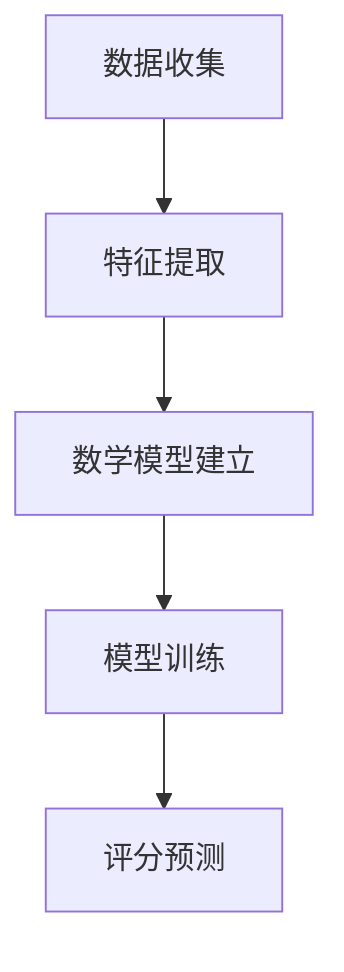

                 

### 社会信用评分算法：行为量化的数学模型

> 关键词：社会信用评分、行为量化、数学模型、算法原理、应用场景

> 摘要：本文将深入探讨社会信用评分算法中的行为量化数学模型。首先，我们简要介绍社会信用评分体系及其重要性，随后详细阐述行为量化模型的定义、原理和具体应用。接下来，文章将分析不同类型的评分算法及其特点，并讲解评分算法的流程与实现。最后，我们将探讨算法性能评估与优化策略，以及社会信用评分在不同领域的实际应用和未来趋势。通过本文的讲解，读者将对社会信用评分算法有一个全面而深刻的理解。

### 第一部分：背景介绍

#### 第1章：社会信用评分概述

**1.1 社会信用体系的重要性**

社会信用体系是国家治理体系和治理能力现代化的重要组成部分，它通过信用记录和信用评价，对个人和企业的行为进行规范和引导，推动社会诚信建设。在当今社会，信用已经不仅仅是一个道德范畴的概念，它已成为经济发展、社会管理的重要工具。

**1.2 社会信用评分的定义与作用**

社会信用评分是指通过对个人或企业的信用信息进行收集、处理和评价，生成一个可以量化其信用水平的分数。这个评分可以用于金融机构的信贷决策、企业的信用评级、政府监管等多个方面。

**1.3 社会信用评分的发展历程**

社会信用评分的发展可以追溯到20世纪初的美国。随着信息技术和大数据技术的发展，信用评分体系在全球范围内得到广泛应用和不断优化。中国也在近年来积极推进社会信用体系建设，形成了独具特色的社会信用评分体系。

**1.4 社会信用评分的应用场景**

社会信用评分的应用场景非常广泛，包括但不限于以下几个方面：

- **金融领域**：信用贷款评分、信用卡审批、反欺诈等。
- **社会治理**：政府监管、公共资源配置、社会保障等。
- **企业运营**：供应商选择、合作伙伴评估、风险控制等。

**1.5 社会信用评分的核心概念与联系**

社会信用评分体系包含多个核心概念，它们相互联系，共同构成了一个完整的评分机制。以下是一个概念属性特征对比表格：

| 核心概念       | 特征对比                 |
|----------------|--------------------------|
| **信用评分模型** | - 定量评估信用水平 - 指标多样 - 实时更新 |
| **行为量化模型** | - 行为特征量化 - 数据驱动 - 评分准确 |
| **预测模型**     | - 预测未来信用风险 - 数据分析 - 精准预测 |
| **风险控制模型** | - 风险评估与控制 - 风险指标 - 动态调整 |
| **反馈机制**     | - 反馈信用评分结果 - 优化评分模型 - 提高准确性 |

#### 第2章：行为量化的数学模型基础

**2.1 行为量化的基本概念**

行为量化是指将个人或企业的行为特征转化为可以量化的指标，以便于进行信用评分。这些行为特征可以是支付习惯、消费行为、社交行为等。

**2.2 行为量化的数学原理**

行为量化模型基于数学和统计学原理，通过特征提取、模型训练和评分预测等步骤，将行为特征转化为信用评分。以下是一个行为量化模型的基本流程图：

**2.2.1 数学模型和公式**

行为量化模型通常采用线性回归模型，其评分公式为：

$$
\text{评分} = \beta_0 + \beta_1 \cdot X_1 + \beta_2 \cdot X_2 + ... + \beta_n \cdot X_n
$$

其中，$\beta_0$为截距，$\beta_1, \beta_2, ..., \beta_n$为各个特征的权重，$X_1, X_2, ..., X_n$为特征值。

**2.2.2 举例说明**

假设有一个信用评分模型，其中两个主要特征是支付准时性（$X_1$）和历史信用记录（$X_2$）。根据模型，评分计算如下：

$$
\text{评分} = 10 + 0.5 \cdot X_1 + 0.3 \cdot X_2
$$

例如，如果支付准时性为90天，历史信用记录为80分，那么评分计算如下：

$$
\text{评分} = 10 + 0.5 \cdot 90 + 0.3 \cdot 80 = 31.7
$$

### 第二部分：社会信用评分算法原理

#### 第3章：评分算法的类型与特点

**3.1 基于规则的评分算法**

基于规则的评分算法是通过预定义的规则来评估信用水平。这种算法简单直观，易于实现，但可能无法适应复杂多变的行为特征。

**3.2 基于统计学的评分算法**

基于统计学的评分算法通过分析历史数据，建立信用评分模型。这种算法具有较高的准确性和稳定性，但需要大量的数据支持。

**3.3 基于机器学习的评分算法**

基于机器学习的评分算法通过学习历史数据，自动提取特征并建立信用评分模型。这种算法具有较强的泛化能力和自适应能力，但可能需要较长的训练时间。

**3.4 深度学习在社会信用评分中的应用**

深度学习是一种强大的机器学习技术，通过多层神经网络自动提取特征。在社会信用评分中，深度学习可以显著提高评分模型的准确性和鲁棒性。

#### 第4章：评分算法的流程与实现

**4.1 数据收集与预处理**

数据收集是信用评分算法的第一步，包括个人或企业的行为数据、财务数据等。数据预处理包括数据清洗、数据转换和数据归一化等步骤，以确保数据的质量和一致性。

**4.2 特征工程**

特征工程是信用评分算法的核心，通过选择和构建特征，将原始数据转化为适用于模型训练的数据。特征工程需要考虑数据的分布、相关性和维度等。

**4.3 模型选择与训练**

模型选择与训练是信用评分算法的关键步骤。根据不同的数据集和业务需求，选择合适的模型并进行训练。训练过程包括模型参数的调整和优化。

**4.4 模型评估与优化**

模型评估与优化是确保信用评分算法准确性和稳定性的重要环节。通过交叉验证、ROC曲线、AUC值等指标评估模型性能，并根据评估结果进行模型优化。

**4.5 评分预测与应用**

评分预测是信用评分算法的最终目标，通过训练好的模型对新的数据进行评分预测。评分预测可以用于金融机构的信贷决策、企业的信用评级等。

### 第三部分：实际应用与案例分析

#### 第6章：社会信用评分在金融领域的应用

**6.1 信用贷款评分**

信用贷款评分是社会信用评分在金融领域的重要应用。通过信用评分模型，金融机构可以准确评估借款人的信用风险，从而做出合理的信贷决策。

**6.2 信用卡欺诈检测**

信用卡欺诈检测是信用卡业务中的重要环节。通过信用评分算法，可以实时监测和识别潜在的欺诈行为，降低金融机构的损失。

**6.3 保险风险评估**

保险风险评估是保险公司制定保费和赔付策略的重要依据。通过信用评分模型，可以评估保险客户的信用风险，从而优化保险产品设计。

#### 第7章：社会信用评分在其他领域的应用

**7.1 网络购物信用评估**

网络购物信用评估是电子商务领域的重要应用。通过信用评分算法，可以评估消费者的信用水平，提高交易的信任度和安全性。

**7.2 政府监管与公共服务**

政府监管与公共服务是社会信用评分在其他领域的重要应用。通过信用评分模型，可以提高政府监管的效率和公平性，优化公共资源配置。

**7.3 企业信用管理**

企业信用管理是企业运营中的重要环节。通过信用评分算法，可以评估供应商和合作伙伴的信用风险，优化供应链管理。

### 第四部分：社会信用评分面临的挑战与未来趋势

#### 第8章：社会信用评分面临的挑战与未来趋势

**8.1 数据隐私保护**

数据隐私保护是社会信用评分面临的重要挑战。在信用评分过程中，涉及大量的个人和企业的敏感信息。如何保护这些信息的安全性和隐私性，是一个亟待解决的问题。

**8.2 算法透明性与公平性**

算法透明性与公平性是社会信用评分的重要问题。信用评分算法的决策过程应该透明，使得个人和企业在接受信用评分时能够理解和接受。同时，算法应该公平，避免对特定群体产生歧视。

**8.3 社会信用评分的可持续发展**

社会信用评分的可持续发展是社会信用体系建设的重要组成部分。通过不断优化和改进信用评分算法，提高评分的准确性和公平性，可以推动社会信用体系的可持续发展。

**8.4 未来发展趋势与展望**

未来，随着大数据、人工智能等技术的不断发展，社会信用评分将越来越精确和智能化。同时，社会信用评分将在更多领域得到应用，成为社会管理和经济发展的重要工具。

### 总结

社会信用评分算法是基于行为量化的数学模型，通过对个人和企业行为的量化分析，生成信用评分。这种算法在金融、政府监管、企业信用管理等多个领域具有广泛的应用。然而，社会信用评分算法也面临着数据隐私保护、算法透明性和公平性等挑战。未来，随着技术的进步，社会信用评分将不断优化和改进，为社会管理和经济发展提供更强大的支持。

### 作者信息

作者：AI天才研究院/AI Genius Institute & 禅与计算机程序设计艺术 /Zen And The Art of Computer Programming

以上是对《社会信用的评分算法：行为量化的数学模型》一文的详细阐述。通过本文的讲解，读者可以对社会信用评分算法有一个全面而深入的理解，为今后的研究和应用奠定坚实的基础。在未来的工作中，让我们继续探索人工智能的无限可能性，为社会发展和人类福祉贡献力量。

