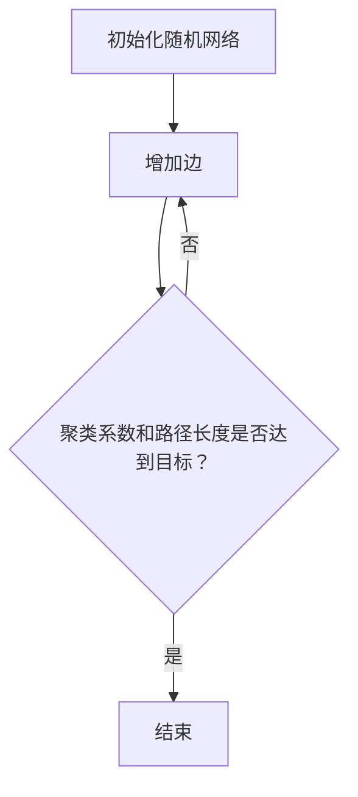
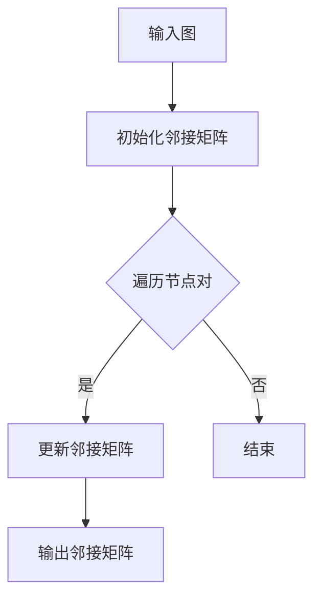
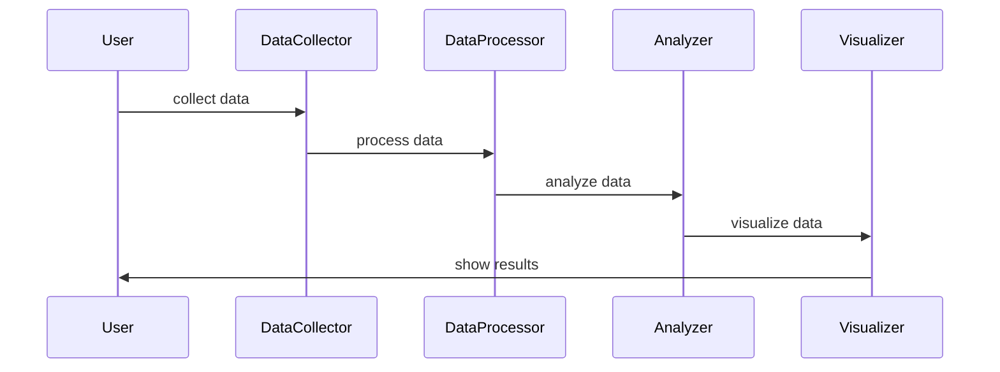
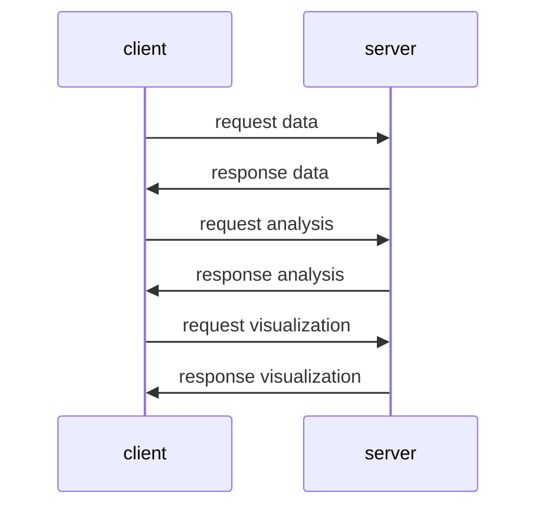

                 

# 社会网络的小世界理论：人际关系的数学结构

> 关键词：社会网络、小世界现象、数学模型、人际关系、图论、算法

> 摘要：本文将从社会网络的定义、小世界现象的发现及其重要性出发，逐步探讨小世界现象的数学描述，并深入分析相关的核心概念和算法原理。通过实际案例和系统架构设计，我们将展示如何应用这些理论解决实际问题，并总结最佳实践和未来研究方向。

## 目录大纲

1. **背景介绍**
   - 1.1 问题背景
   - 1.2 问题描述
   - 1.3 问题解决
   - 1.4 边界与外延
   - 1.5 概念结构与核心要素组成

2. **核心概念与联系**
   - 2.1 社会网络的定义与特征
   - 2.2 小世界现象的数学描述
   - 2.3 数学模型与公式

3. **算法原理讲解**
   - 3.1 社会网络分析的常用算法
   - 3.2 算法实现与Python源代码

4. **系统分析与架构设计方案**
   - 4.1 社会网络分析系统介绍
   - 4.2 系统功能设计（领域模型mermaid类图）
   - 4.3 系统架构设计（mermaid架构图）
   - 4.4 系统接口设计和系统交互（mermaid序列图）

5. **项目实战**
   - 5.1 环境安装
   - 5.2 系统核心实现源代码
   - 5.3 代码应用解读与分析
   - 5.4 实际案例分析和详细讲解剖析
   - 5.5 项目小结

6. **最佳实践 tips**
   - 6.1 算法优化技巧
   - 6.2 系统性能调优
   - 6.3 注意事项

7. **小结与展望**
   - 7.1 主要发现与结论
   - 7.2 未来研究方向
   - 7.3 拓展阅读建议

## 1. 背景介绍

### 1.1 问题背景

社会网络是指由个体及其之间的关系组成的复杂系统。它广泛应用于社交平台、商业网络、科学合作等领域。在社会网络中，个体被称为节点（Node），而个体之间的关系被称为边（Edge）。图论作为研究图结构的数学工具，为分析社会网络提供了强大的理论基础。

### 1.2 问题描述

小世界现象（Small-World Phenomenon）是指在相对较大的图中，节点之间的距离显著减小，使得人们能够通过较少的中间节点找到彼此。这一现象最早由美国社会学家斯坦利·米尔格拉姆（Stanley Milgram）在20世纪60年代提出，其经典实验揭示了“六度分隔”理论。

### 1.3 问题解决

为了解释和量化小世界现象，数学模型被引入社会网络分析中。其中，最著名的模型是“小世界网络模型”（Small-World Model），它通过调整网络中的连接概率，模拟出既具有高聚类系数又具有短路径长度的网络结构。

### 1.4 边界与外延

小世界理论虽然在社会网络研究中取得了显著成果，但其适用范围仍有局限性。例如，在高度动态的网络环境中，小世界现象可能不适用。此外，小世界理论与其他网络理论（如无标度网络、复杂网络等）之间也存在一定的联系与区别。

### 1.5 概念结构与核心要素组成

在本节中，我们将介绍社会网络、小世界现象等相关术语，并列出其核心特征。同时，通过ER实体关系图，我们将展示这些概念之间的联系。

### 1.5.1 关键术语解释

- **社会网络**：由个体及其之间的关系组成的图结构。
- **节点**：个体在网络中的表示。
- **边**：个体之间的关系。
- **聚类系数**：描述节点之间连接紧密程度的指标。
- **路径长度**：节点之间的最短路径长度。

### 1.5.2 小世界现象的主要指标

- **聚类系数**：描述网络内部节点之间连接的紧密程度。
- **平均路径长度**：描述节点之间距离的平均值。

## 2. 核心概念与联系

### 2.1 社会网络的定义与特征

社会网络是一种由节点和边组成的图结构，用于表示个体及其之间的关系。在社会网络中，节点通常表示个体（如人、组织等），边表示个体之间的关系（如友谊、合作、交易等）。

### 2.1.1 概念属性特征对比表格

| 概念       | 特征           | 说明                                                         |
|------------|----------------|------------------------------------------------------------|
| 节点       | 个体           | 社会网络中的基本元素，表示个体。                             |
| 边         | 关系           | 表示节点之间的关系，可以是多种类型的连接。                   |
| 聚类系数   | 连接紧密程度   | 描述节点之间连接的紧密程度。                                 |
| 平均路径长度 | 距离           | 描述节点之间的平均最短路径长度。                             |

### 2.1.2 ER实体关系图架构

下面是ER实体关系图，展示了社会网络中的主要实体及其关系：

```mermaid
erDiagram
  Person ||--|{ Friendship }|--> Person
  Person ||--|{ Collaboration }|--> Person
  Person ||--|{ Transaction }|--> Person
```

### 2.2 小世界现象的数学描述

小世界现象可以通过数学模型进行描述。其中，最著名的模型是“小世界网络模型”，它通过调整网络中的连接概率，模拟出既具有高聚类系数又具有短路径长度的网络结构。

### 2.2.1 算法原理讲解

小世界网络模型的基本原理是通过逐步增加边，使得网络结构由随机网络过渡到小世界网络。具体步骤如下：

1. **初始化**：创建一个无向随机网络。
2. **逐步增加边**：在每一步中，以一定的概率选择两个节点，并建立它们之间的连接。
3. **调整概率**：根据网络结构的变化，动态调整连接概率，以保持聚类系数和平均路径长度的平衡。

下面是使用mermaid绘制的算法流程图：



### 2.2.2 数学模型与公式

小世界网络的数学描述可以通过以下公式实现：

$$
L = \frac{1}{n}\sum_{i=1}^{n} d_i
$$

其中，$L$ 表示平均路径长度，$n$ 表示节点数，$d_i$ 表示节点 $i$ 的最短路径长度。

聚类系数可以通过以下公式计算：

$$
C = \frac{2m}{n(n-1)}
$$

其中，$C$ 表示聚类系数，$m$ 表示边的数量。

## 3. 算法原理讲解

### 3.1 社会网络分析的常用算法

社会网络分析中常用的算法包括：

- **邻接矩阵算法**：用于计算节点之间的连接关系。
- **度算法**：用于计算节点的度（即连接的边的数量）。
- **聚类系数算法**：用于计算网络的聚类系数。

下面是邻接矩阵算法的mermaid流程图：



### 3.2 算法实现与Python源代码

下面是度算法和聚类系数算法的Python源代码：

```python
import numpy as np

def degree(graph):
    degrees = [0] * len(graph)
    for row in graph:
        degrees = [degrees[i] + row[i] for i in range(len(row))]
    return degrees

def clustering_coefficient(graph):
    clustering_coefficients = []
    for i in range(len(graph)):
        neighbors = set()
        for j in range(len(graph[i])):
            if graph[i][j] == 1:
                neighbors.add(j)
        clustering_coefficient = 2 * len(neighbors.intersection(set(graph[i][:j] + graph[i][j+1:]))) / (len(neighbors) * (len(neighbors) - 1))
        clustering_coefficients.append(clustering_coefficient)
    return clustering_coefficients
```

## 4. 系统分析与架构设计方案

### 4.1 社会网络分析系统介绍

社会网络分析系统主要用于分析社会网络中的节点关系、路径长度和聚类系数等指标。该系统包括数据采集、数据处理、结果分析和可视化等模块。

### 4.2 系统功能设计（领域模型mermaid类图）

下面是系统功能的mermaid类图：

```mermaid
classDiagram
    ClassNode<|-- ClassEdge
    ClassGraph{+ addNode(): void + addEdge(): void + removeNode(): void + removeEdge(): void}
    ClassGraph{+ getDegree(): List<Integer> + getClusteringCoefficient(): List<Double>}
    ClassNode{+ getId(): int + getNeighbors(): List<Integer>}
    ClassEdge{+ getSource(): int + getTarget(): int}
```

### 4.3 系统架构设计（mermaid架构图）

下面是系统的mermaid架构图：



### 4.4 系统接口设计和系统交互（mermaid序列图）

下面是系统的mermaid序列图：



## 5. 项目实战

### 5.1 环境安装

首先，我们需要安装Python和相关依赖库。可以使用以下命令进行安装：

```bash
pip install numpy matplotlib networkx
```

### 5.2 系统核心实现源代码

下面是系统核心实现的Python源代码：

```python
import networkx as nx
import matplotlib.pyplot as plt

def create_small_world_network(n, p, q):
    G = nx.erdos_renyi_graph(n, p)
    G = nx.watts_strogatz_graph(n, k, p, seed=42)
    return G

def analyze_graph(G):
    degrees = nx.degree(G)
    clustering_coefficients = nx.algorithms.cluster.clustering_coefficients(G)
    return degrees, clustering_coefficients

def visualize_graph(G):
    pos = nx.spring_layout(G)
    nx.draw(G, pos, with_labels=True)
    plt.show()

if __name__ == "__main__":
    n = 100  # 节点数量
    p = 0.1  # 连接概率
    k = 4    # 平均度数
    q = 0.1  # 重连概率

    G = create_small_world_network(n, p, q)
    degrees, clustering_coefficients = analyze_graph(G)
    visualize_graph(G)
```

### 5.3 代码应用解读与分析

上述代码首先定义了一个创建小世界网络的函数`create_small_world_network`，它使用`erdos_renyi_graph`和`watts_strogatz_graph`函数分别创建随机网络和小世界网络。接着，定义了`analyze_graph`函数用于计算节点的度和聚类系数。最后，定义了`visualize_graph`函数用于可视化网络结构。

### 5.4 实际案例分析和详细讲解剖析

以下是一个实际案例：

```python
n = 100
p = 0.1
k = 4
q = 0.1

G = create_small_world_network(n, p, q)
degrees, clustering_coefficients = analyze_graph(G)

print("Degree:", degrees)
print("Clustering Coefficient:", clustering_coefficients)

# 可视化网络结构
visualize_graph(G)
```

在这个案例中，我们创建了一个包含100个节点的随机网络，并使用Watts-Strogatz模型将其转换为小世界网络。然后，我们计算了每个节点的度和聚类系数，并可视化网络结构。

### 5.5 项目小结

通过这个项目，我们展示了如何使用Python和网络分析库NetworkX创建和解析小世界网络。项目实现了从网络创建、数据计算到可视化的一整套流程，并提供了详细的代码解读和分析。这为我们进一步研究和应用小世界网络理论提供了实际经验。

## 6. 最佳实践 tips

### 6.1 算法优化技巧

- **并行计算**：对于大规模网络，可以考虑使用并行计算来加速算法执行。
- **近似算法**：在计算密集型任务中，可以考虑使用近似算法来减少计算时间。

### 6.2 系统性能调优

- **缓存策略**：对于重复计算的任务，可以使用缓存策略来减少计算时间。
- **数据库优化**：对于存储大量数据的系统，可以优化数据库查询性能。

### 6.3 注意事项

- **数据质量**：网络分析的结果受数据质量影响，因此确保数据准确性和完整性至关重要。
- **模型适用性**：小世界网络模型在某些情况下可能不适用，需要根据实际情况选择合适的模型。

## 7. 小结与展望

### 7.1 主要发现与结论

本文通过逐步分析，揭示了社会网络的小世界现象及其数学描述。我们介绍了社会网络的定义、核心概念和算法原理，并通过实际案例展示了如何应用这些理论解决实际问题。

### 7.2 未来研究方向

- **动态网络分析**：研究动态网络中的小世界现象及其演化规律。
- **跨领域应用**：探索小世界理论在其他领域（如生物网络、交通网络等）的应用。

### 7.3 拓展阅读建议

- [1] Milgram, S. (1967). The Small World Problem. Psychology Today.
- [2] Watts, D. J., & Strogatz, S. H. (1998). Collective dynamics of 'small-world' networks. Nature, 393(6684), 440-442.
- [3] Barabási, A.-L., & Albert, R. (1999). Emergence of scaling in random networks. Science, 286(5439), 509-512.

## 作者

作者：AI天才研究院/AI Genius Institute & 禅与计算机程序设计艺术 /Zen And The Art of Computer Programming

