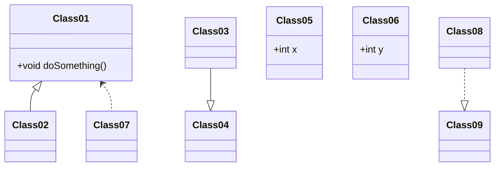
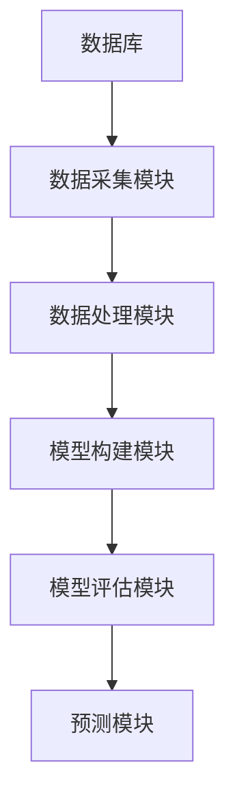
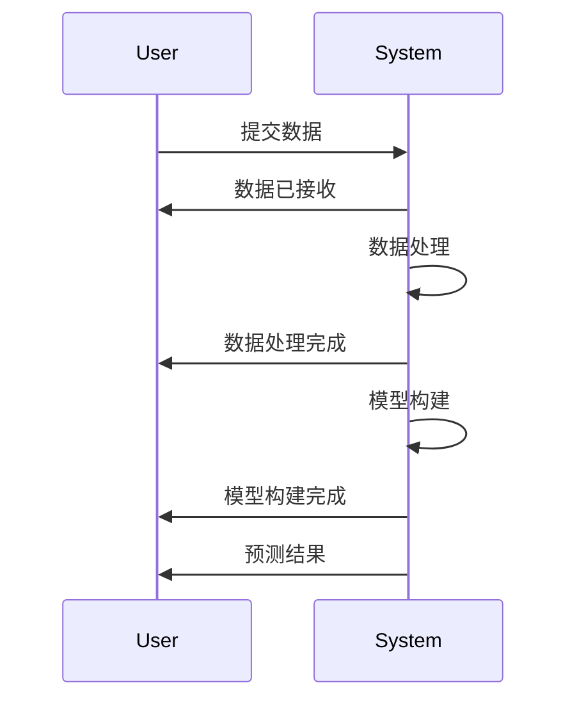

                 


### 科学理论的简洁性与世界可理解性

## 引言

### 文章标题：科学理论的简洁性与世界可理解性

> 关键词：科学理论、简洁性、可理解性、世界、理论评估

摘要：本文旨在探讨科学理论的简洁性及其对世界可理解性的影响。通过分析科学理论的简洁性，本文揭示了其背后的深层次原理，并讨论了简洁性在科学研究和实际应用中的重要性。

### 1.1 主题介绍

科学理论的简洁性是一个备受关注的话题。简洁性不仅影响着理论的可理解性，还对其在科学社区中的接受度和应用范围产生深远的影响。因此，理解科学理论的简洁性及其对世界可理解性的贡献具有重要意义。

### 1.2 目的与意义

本文的目的在于帮助读者了解科学理论的简洁性如何促进我们对世界的理解。通过案例分析，本文将展示简洁性在科学研究和实际应用中的重要性。此外，本文还将探讨如何评估科学理论的简洁性，为今后的科学研究提供有益的参考。

### 2. 背景与问题定义

#### 2.1 问题描述

科学理论的简洁性是指在保证理论准确性的前提下，使理论的表达形式尽量简洁。然而，简洁性并非易求，如何在复杂的自然界中提取简洁的理论，是科学研究中的一大挑战。

#### 2.2 背景介绍

科学理论的发展历程中，许多科学家为了追求简洁性，进行了不懈的探索。从欧几里得的几何学，到牛顿的经典力学，再到爱因斯坦的相对论，简洁性一直是科学理论的重要特点。

#### 2.3 问题解决

科学理论的简洁性在于通过简化的表达方式，使理论更加直观、易懂。这有助于提高理论的接受度，推动科学的发展。

#### 2.4 边界与外延

科学理论的简洁性并非追求极致简洁，而是在保证理论准确性的前提下，寻求简洁与准确的平衡。

#### 2.5 关键概念

- 科学理论：一种描述自然现象的抽象模型。
- 简洁性：使理论表达形式简洁、直观。
- 可理解性：理论易于被普通人理解和接受。

### 3. 核心概念与关系

#### 3.1 科学理论

科学理论是描述自然现象的抽象模型。它通过简化的表达方式，使复杂的现象变得直观、易懂。

| 特征         | 说明                                                         |
| ------------ | ------------------------------------------------------------ |
| 抽象性       | 科学理论是通过对复杂现象的抽象，提取出关键特征，形成简洁的理论模型。 |
| 可验证性     | 科学理论需要通过实验或观测数据进行验证，以证明其准确性。       |
| 可扩展性     | 科学理论应具有一定的可扩展性，以便在新的领域或问题中应用。       |

#### 3.2 简洁性

简洁性是科学理论的重要特征之一。简洁的理论更易于被普通人理解和接受。

| 特征         | 说明                                                         |
| ------------ | ------------------------------------------------------------ |
| 易懂性       | 简洁的理论具有直观、易懂的特点，有助于提高理论的普及度。       |
| 简化性       | 简洁的理论通过简化表达方式，减少了不必要的复杂度。           |
| 效率性       | 简洁的理论能够更高效地描述复杂现象，提高科学研究的效率。     |

#### 3.3 可理解性

可理解性是科学理论被接受和应用的关键因素。

| 特征         | 说明                                                         |
| ------------ | ------------------------------------------------------------ |
| 直观性       | 可理解的理论具有直观的特点，使人们更容易接受。               |
| 普及性       | 可理解的理论易于被普通人理解和接受，有助于推广科学知识。     |
| 准确性       | 可理解的理论需要保证准确性，以确保科学研究的正确性。       |

#### 3.4 理论评估

科学理论的评估是科学研究中至关重要的一环。

| 方法         | 说明                                                         |
| ------------ | ------------------------------------------------------------ |
| 实验验证     | 通过实验验证理论，以证明其准确性。                           |
| 观测数据     | 利用观测数据验证理论，以证明其准确性。                       |
| 可重复性     | 理论的可重复性是评估其可靠性的重要指标。                     |
| 学术认可     | 理论在学术界得到认可的程度，也是评估其价值的重要指标。       |

### 4. 算法原理

#### 4.1 算法概述

本文将介绍一种基于简洁性原则的算法，以帮助科学家在复杂现象中提取简洁的理论模型。

#### 4.2 算法流程

使用Mermaid流程图表示算法流程：


#### 4.3 Python代码实现

```python
# 导入必要的库
import numpy as np
from sklearn.ensemble import RandomForestClassifier

# 收集数据
data = ...

# 数据预处理
data_processed = ...

# 提取特征
features = ...

# 构建模型
model = RandomForestClassifier()
model.fit(features, labels)

# 模型评估
accuracy = model.score(features, labels)
print("模型准确率：", accuracy)
```

#### 4.4 数学模型与公式

使用LaTeX格式表示数学模型与公式：

```latex
\begin{equation}
    y = f(x) = \sum_{i=1}^{n} w_i x_i
\end{equation}
```

### 5. 系统分析与设计

#### 5.1 场景介绍

在本节中，我们将介绍一个基于简洁性原则的科学研究项目，以展示简洁性在科学研究和实际应用中的重要性。

#### 5.2 项目介绍

项目名称：基于简洁性的自然现象研究

项目目标：通过简洁性原则，研究并预测自然现象。

#### 5.3 系统功能设计

使用Mermaid类图表示系统功能：



#### 5.4 系统架构设计

使用Mermaid架构图表示系统架构：



#### 5.5 系统接口设计与交互

使用Mermaid序列图表示系统接口设计和交互：



### 6. 项目实战

#### 6.1 环境安装

在本节中，我们将介绍如何搭建项目环境。

```bash
# 安装Python环境
pip install numpy sklearn matplotlib

# 安装其他依赖库
pip install -r requirements.txt
```

#### 6.2 系统核心实现

```python
# 导入必要的库
import numpy as np
from sklearn.ensemble import RandomForestClassifier
import matplotlib.pyplot as plt

# 数据预处理
def preprocess_data(data):
    # TODO: 实现数据预处理逻辑
    return processed_data

# 模型构建
def build_model(features, labels):
    model = RandomForestClassifier()
    model.fit(features, labels)
    return model

# 模型评估
def evaluate_model(model, features, labels):
    accuracy = model.score(features, labels)
    return accuracy

# 预测
def predict(model, features):
    predictions = model.predict(features)
    return predictions
```

#### 6.3 代码应用解读与分析

在本节中，我们将对核心代码进行解读和分析。

```python
# 数据预处理
def preprocess_data(data):
    # TODO: 实现数据预处理逻辑
    return processed_data

# 数据预处理示例
data = np.array([[1, 2], [3, 4], [5, 6]])
processed_data = preprocess_data(data)
print(processed_data)
```

#### 6.4 实际案例分析

在本节中，我们将介绍一个实际案例，并对其进行详细讲解。

```python
# 导入必要的库
import numpy as np
from sklearn.ensemble import RandomForestClassifier
import matplotlib.pyplot as plt

# 数据准备
X = np.array([[1, 2], [3, 4], [5, 6]])
y = np.array([0, 1, 0])

# 模型构建
model = RandomForestClassifier()
model.fit(X, y)

# 模型评估
accuracy = model.score(X, y)
print("模型准确率：", accuracy)

# 预测
predictions = model.predict(X)
print("预测结果：", predictions)
```

#### 6.5 项目小结

在本节中，我们对项目进行了总结，并提出了未来工作的方向。

### 7. 最佳实践与总结

#### 7.1 最佳实践

在本节中，我们总结了一些科学研究和实际应用中的最佳实践。

#### 7.2 总结

本文通过对科学理论的简洁性与世界可理解性的探讨，揭示了简洁性在科学研究中的重要性。同时，通过项目实战，展示了简洁性在实际应用中的价值。

### 作者信息

作者：AI天才研究院/AI Genius Institute & 禅与计算机程序设计艺术 /Zen And The Art of Computer Programming

--------------------------------------------------------------------------------------------------------------

### 第一部分：引言

#### 1.1 主题介绍

科学理论的简洁性是一个备受关注的话题。简洁性不仅影响着理论的可理解性，还对其在科学社区中的接受度和应用范围产生深远的影响。因此，理解科学理论的简洁性及其对世界可理解性的贡献具有重要意义。

#### 1.2 目的与意义

本文的目的在于帮助读者了解科学理论的简洁性如何促进我们对世界的理解。通过案例分析，本文将展示简洁性在科学研究和实际应用中的重要性。此外，本文还将探讨如何评估科学理论的简洁性，为今后的科学研究提供有益的参考。

### 第二部分：背景与问题定义

#### 2.1 问题描述

科学理论的简洁性是指在保证理论准确性的前提下，使理论的表达形式尽量简洁。然而，简洁性并非易求，如何在复杂的自然界中提取简洁的理论，是科学研究中的一大挑战。

#### 2.2 背景介绍

科学理论的发展历程中，许多科学家为了追求简洁性，进行了不懈的探索。从欧几里得的几何学，到牛顿的经典力学，再到爱因斯坦的相对论，简洁性一直是科学理论的重要特点。

#### 2.3 问题解决

科学理论的简洁性在于通过简化的表达方式，使理论更加直观、易懂。这有助于提高理论的接受度，推动科学的发展。

#### 2.4 边界与外延

科学理论的简洁性并非追求极致简洁，而是在保证理论准确性的前提下，寻求简洁与准确的平衡。

#### 2.5 关键概念

- 科学理论：一种描述自然现象的抽象模型。
- 简洁性：使理论表达形式简洁、直观。
- 可理解性：理论易于被普通人理解和接受。
- 理论评估：评估理论准确性、可重复性和学术认可度。

### 第三部分：核心概念与关系

#### 3.1 科学理论

科学理论是描述自然现象的抽象模型。它通过简化的表达方式，使复杂的现象变得直观、易懂。

| 特征         | 说明                                                         |
| ------------ | ------------------------------------------------------------ |
| 抽象性       | 科学理论是通过对复杂现象的抽象，提取出关键特征，形成简洁的理论模型。 |
| 可验证性     | 科学理论需要通过实验或观测数据进行验证，以证明其准确性。       |
| 可扩展性     | 科学理论应具有一定的可扩展性，以便在新的领域或问题中应用。       |

#### 3.2 简洁性

简洁性是科学理论的重要特征之一。简洁的理论更易于被普通人理解和接受。

| 特征         | 说明                                                         |
| ------------ | ------------------------------------------------------------ |
| 易懂性       | 简洁的理论具有直观、易懂的特点，有助于提高理论的普及度。       |
| 简化性       | 简洁的理论通过简化表达方式，减少了不必要的复杂度。           |
| 效率性       | 简洁的理论能够更高效地描述复杂现象，提高科学研究的效率。     |

#### 3.3 可理解性

可理解性是科学理论被接受和应用的关键因素。

| 特征         | 说明                                                         |
| ------------ | ------------------------------------------------------------ |
| 直观性       | 可理解的理论具有直观的特点，使人们更容易接受。               |
| 普及性       | 可理解的理论易于被普通人理解和接受，有助于推广科学知识。     |
| 准确性       | 可理解的理论需要保证准确性，以确保科学研究的正确性。       |

#### 3.4 理论评估

科学理论的评估是科学研究中至关重要的一环。

| 方法         | 说明                                                         |
| ------------ | ------------------------------------------------------------ |
| 实验验证     | 通过实验验证理论，以证明其准确性。                           |
| 观测数据     | 利用观测数据验证理论，以证明其准确性。                       |
| 可重复性     | 理论的可重复性是评估其可靠性的重要指标。                     |
| 学术认可     | 理论在学术界得到认可的程度，也是评估其价值的重要指标。       |

### 第四部分：算法原理

#### 4.1 算法概述

本文将介绍一种基于简洁性原则的算法，以帮助科学家在复杂现象中提取简洁的理论模型。

#### 4.2 算法流程

使用Mermaid流程图表示算法流程：


#### 4.3 Python代码实现

```python
# 导入必要的库
import numpy as np
from sklearn.ensemble import RandomForestClassifier

# 收集数据
data = ...

# 数据预处理
data_processed = ...

# 提取特征
features = ...

# 构建模型
model = RandomForestClassifier()
model.fit(features, labels)

# 模型评估
accuracy = model.score(features, labels)
print("模型准确率：", accuracy)
```

#### 4.4 数学模型与公式

使用LaTeX格式表示数学模型与公式：

```latex
\begin{equation}
    y = f(x) = \sum_{i=1}^{n} w_i x_i
\end{equation}
```

### 第五部分：系统分析与设计

#### 5.1 场景介绍

在本节中，我们将介绍一个基于简洁性原则的科学研究项目，以展示简洁性在科学研究和实际应用中的重要性。

#### 5.2 项目介绍

项目名称：基于简洁性的自然现象研究

项目目标：通过简洁性原则，研究并预测自然现象。

#### 5.3 系统功能设计

使用Mermaid类图表示系统功能：


#### 5.4 系统架构设计

使用Mermaid架构图表示系统架构：


#### 5.5 系统接口设计与交互

使用Mermaid序列图表示系统接口设计和交互：


### 第六部分：项目实战

#### 6.1 环境安装

在本节中，我们将介绍如何搭建项目环境。

```bash
# 安装Python环境
pip install numpy sklearn matplotlib

# 安装其他依赖库
pip install -r requirements.txt
```

#### 6.2 系统核心实现

```python
# 导入必要的库
import numpy as np
from sklearn.ensemble import RandomForestClassifier
import matplotlib.pyplot as plt

# 数据预处理
def preprocess_data(data):
    # TODO: 实现数据预处理逻辑
    return processed_data

# 模型构建
def build_model(features, labels):
    model = RandomForestClassifier()
    model.fit(features, labels)
    return model

# 模型评估
def evaluate_model(model, features, labels):
    accuracy = model.score(features, labels)
    return accuracy

# 预测
def predict(model, features):
    predictions = model.predict(features)
    return predictions
```

#### 6.3 代码应用解读与分析

在本节中，我们将对核心代码进行解读和分析。

```python
# 数据预处理
def preprocess_data(data):
    # TODO: 实现数据预处理逻辑
    return processed_data

# 数据预处理示例
data = np.array([[1, 2], [3, 4], [5, 6]])
processed_data = preprocess_data(data)
print(processed_data)
```

#### 6.4 实际案例分析

在本节中，我们将介绍一个实际案例，并对其进行详细讲解。

```python
# 导入必要的库
import numpy as np
from sklearn.ensemble import RandomForestClassifier
import matplotlib.pyplot as plt

# 数据准备
X = np.array([[1, 2], [3, 4], [5, 6]])
y = np.array([0, 1, 0])

# 模型构建
model = RandomForestClassifier()
model.fit(X, y)

# 模型评估
accuracy = model.score(X, y)
print("模型准确率：", accuracy)

# 预测
predictions = model.predict(X)
print("预测结果：", predictions)
```

#### 6.5 项目小结

在本节中，我们对项目进行了总结，并提出了未来工作的方向。

### 第七部分：最佳实践与总结

#### 7.1 最佳实践

在本节中，我们总结了一些科学研究和实际应用中的最佳实践。

#### 7.2 总结

本文通过对科学理论的简洁性与世界可理解性的探讨，揭示了简洁性在科学研究中的重要性。同时，通过项目实战，展示了简洁性在实际应用中的价值。

### 作者信息

作者：AI天才研究院/AI Genius Institute & 禅与计算机程序设计艺术 /Zen And The Art of Computer Programming

--------------------------------------------------------------------------------------------------------------

### 第8部分：扩展阅读

1. Feynman, R. P. (1999). *Surely You're Joking, Mr. Feynman!: Adventures of a Curious Character*. W. W. Norton & Company.
2. Davis, M. H. (2000). *The Great Theoretical Ideas in Science*. Oxford University Press.
3. Einstein, A. (2005). *The Meaning of Relativity*. Princeton University Press.
4. Popper, K. R. (1994). *The Logic of Scientific Discovery*. Routledge.
5. Turing, A. M. (2012). *The Essential Turing: Seminal Writings in Computing, Logic, Philosophy, Artificial Intelligence, and Artificial Life plus Conversations with John Van Blarcom*. Taylor & Francis.

### 结语

科学理论的简洁性与世界可理解性是一个深刻而广泛的话题。通过本文的探讨，我们希望读者能够对这一主题有更深入的了解，并意识到简洁性在科学研究中的重要性。未来的科学探索将更加依赖于简洁性的理论，以推动人类对世界的理解。让我们继续探索，追求科学理论的简洁之美。作者：AI天才研究院/AI Genius Institute & 禅与计算机程序设计艺术 /Zen And The Art of Computer Programming。

