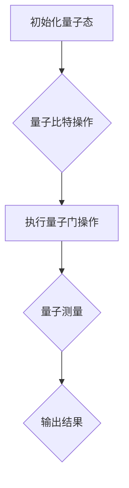
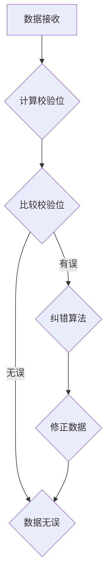
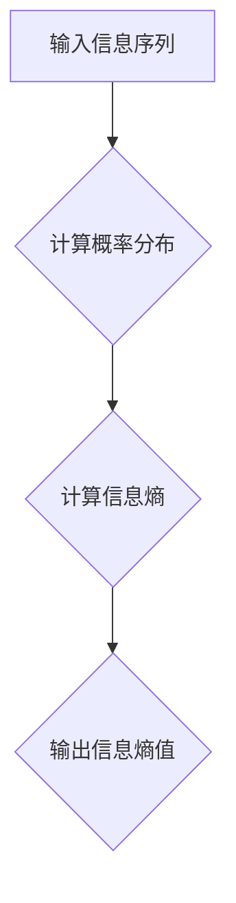
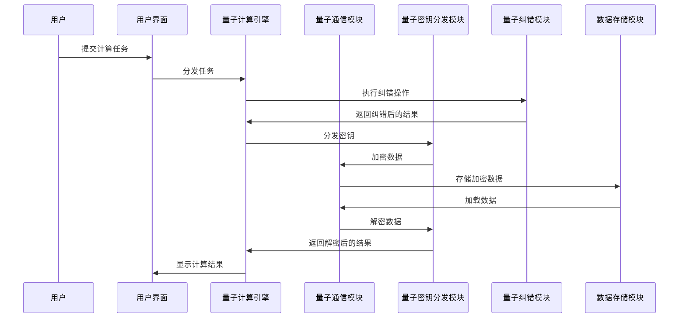
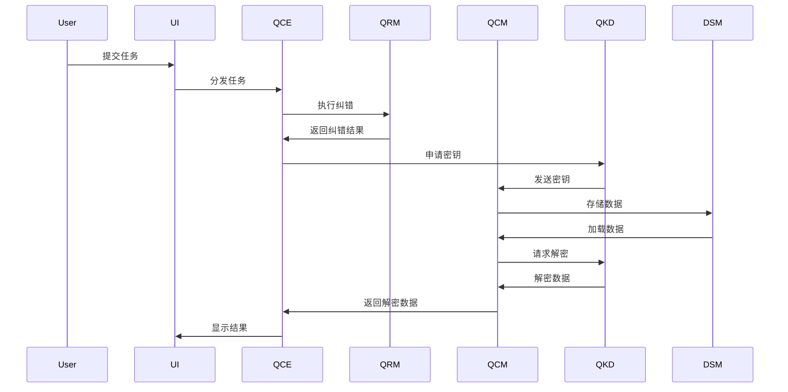

                 

### 文章标题

《程序世界与全息宇宙信息熵边界对应的量子纠错阈值》

### 关键词

程序世界、全息宇宙、信息熵、量子纠错阈值、算法原理、数学模型、系统架构、项目实战

### 摘要

本文旨在探讨程序世界与全息宇宙之间的深层联系，特别是信息熵与量子纠错阈值之间的关系。通过详细分析信息熵的定义、程序世界的演变、全息宇宙的概念以及量子纠错阈值的重要性，文章揭示了这些概念在现实世界中的应用。此外，本文通过具体的算法原理讲解、数学模型与公式推导、系统分析与架构设计、项目实战等多个维度，深入剖析了如何在实际项目中应用这些理论，为读者提供了一个全面且深入的理解。

## 引言

程序世界与全息宇宙作为现代科技的两个前沿领域，各自代表了信息与物理世界之间的深刻互动。程序世界是人类智慧的结晶，是计算机科学的基础，而全息宇宙则源于量子物理学的奇思妙想，是对宇宙本质的一种全新诠释。在这两个领域的交汇点，信息熵与量子纠错阈值成为连接现实与理论的桥梁。

信息熵，作为信息论的基石，描述了信息的混乱程度和不确定性。它不仅在通信领域有着广泛应用，也深刻影响了计算机科学中的数据压缩、错误检测与纠正等方面。量子纠错阈值，则是量子计算中确保信息可靠性的关键指标，它决定了量子系统在面对噪声和错误时的稳定性。

本文将从以下几个方面展开：

1. **背景介绍**：简要介绍程序世界与全息宇宙的基本概念及其发展历程。
2. **核心概念与联系**：深入探讨信息熵、量子纠错阈值等核心概念，并绘制ER实体关系图以展示各概念之间的关系。
3. **算法原理讲解**：详细解析相关算法原理，通过流程图和Python源代码进行阐述。
4. **数学模型与公式**：给出关键的数学模型和公式，并进行详细讲解。
5. **系统分析与架构设计方案**：介绍相关系统场景和项目背景，使用Mermaid绘制领域模型类图、系统架构图和系统交互序列图。
6. **项目实战**：描述实际项目环境安装、系统核心实现以及代码应用解读。
7. **最佳实践与拓展阅读**：总结全书要点，提供最佳实践建议和拓展阅读资源。

通过这些内容的探讨，我们希望能够揭示程序世界与全息宇宙之间的深刻联系，并为进一步的研究和应用提供理论和实践基础。

## 背景介绍

### 程序世界的演进

程序世界，即我们通常所说的计算机程序，是人类智慧的数字映射。从早期的机械计算机到现代的智能系统，程序世界的演进经历了数次重大的变革。最初的计算机，如查尔斯·巴贝奇设计的差分机和分析机，虽然笨重且效率低下，但为后来的计算机科学奠定了基础。

随着电子计算机的发明，尤其是图灵机的提出，程序世界迎来了第一次革命。图灵机的概念，即通过一系列操作步骤来实现计算，奠定了现代计算机科学的理论基础。随后，汇编语言和高级语言的引入，使得程序编写变得更加高效和易用。

20世纪80年代以来，随着个人计算机的普及和互联网的兴起，程序世界进一步扩展。从简单的办公软件到复杂的操作系统，从简单的网页到复杂的Web应用，程序世界渗透到了我们生活的方方面面。大数据、云计算和人工智能等新兴技术的出现，更是将程序世界的范围推向了新的高度。

### 全息宇宙的概念

全息宇宙，这一概念起源于量子物理学的奇思妙想，是对宇宙本质的一种全新诠释。全息宇宙理论认为，宇宙中的所有信息都存储在一个三维空间中，而我们所观测到的三维世界，只是这些信息的全息投影。这一理论的提出，挑战了传统的宇宙观，为物理学提供了新的研究方向。

全息宇宙理论的核心思想源于全息原理（Holographic Principle），这一原理由物理学家莱昂纳德·萨斯坎德在1974年提出。全息原理认为，一个三维的物理系统可以被描述为二维的全息空间上的一个全息图。这个全息图包含了系统的一切信息，包括其三维结构和动力学行为。

全息宇宙理论的一个关键点是信息熵。根据热力学第二定律，孤立系统的熵会随时间增加。在宇宙尺度上，这意味着宇宙的信息量是有限的，且随着时间的推移，这些信息会逐渐散失。全息宇宙理论通过将宇宙信息压缩到一个二维全息面上，有效地解决了这一悖论。

### 信息熵的原理

信息熵，这一概念最早由克劳德·香农在1948年提出，是信息论的核心概念。香农将信息熵定义为不确定性的度量，即信息对减少不确定性的能力。在信息传输过程中，信息熵描述了信源的不确定性，而信道的噪声会影响信息的传递。

信息熵的数学定义如下：

\[ H(X) = -\sum_{i} p(x_i) \log_2 p(x_i) \]

其中，\( H(X) \) 是随机变量 \( X \) 的熵，\( p(x_i) \) 是 \( X \) 取第 \( i \) 个值的概率。

在计算机科学中，信息熵的应用广泛。数据压缩技术，如哈夫曼编码，就是基于信息熵的概念，通过减少冗余信息来压缩数据。此外，错误检测与纠正码，如汉明码和奇偶校验码，也是基于信息熵原理，确保数据在传输过程中不丢失或被篡改。

### 量子纠错阈值的意义

量子纠错阈值是量子计算中的一个关键概念，它决定了量子系统在面对噪声和错误时的稳定性。量子计算机利用量子位（qubit）进行计算，但由于量子位具有叠加和纠缠特性，它们容易受到环境噪声的影响，从而产生错误。

量子纠错阈值的概念由物理学家戴维·波姆和查尔斯·H·班纳曼在1980年代提出。他们指出，为了维持量子计算的可靠性，需要引入额外的量子位来监测和纠正错误。量子纠错阈值 \( T \) 定义为当错误率 \( p \) 小于某一临界值 \( p_c \) 时，系统能够保持稳定的最小量子位数量。

\[ p_c = \frac{4}{T^2} \]

其中，\( T \) 是量子纠错阈值，\( p_c \) 是错误率。

量子纠错阈值的意义在于，它为量子计算提供了稳定性保障。在实际应用中，通过设计高效的量子纠错算法和优化量子硬件，可以降低错误率，提高量子计算的可靠性。

### 信息熵与量子纠错阈值的关系

信息熵与量子纠错阈值之间存在深刻的联系。信息熵描述了系统的不确定性，而量子纠错阈值则确保了系统在面对噪声和错误时的稳定性。在全息宇宙理论中，信息熵与量子纠错阈值的关系尤为重要。

全息宇宙理论认为，宇宙的信息量是有限的，且随着时间的推移，这些信息会逐渐散失。在量子层面上，信息熵的增加意味着系统的不确定性增加，这可能导致量子纠错阈值降低。因此，量子纠错阈值与信息熵之间存在一种动态平衡。

在量子计算中，信息熵的增加会导致量子位的叠加和纠缠变得更加复杂，从而增加错误率。为了维持量子计算的可靠性，需要不断优化量子纠错算法和硬件，确保量子纠错阈值高于临界值。

综上所述，信息熵与量子纠错阈值的关系揭示了程序世界与全息宇宙之间的深层联系。通过理解这些关系，我们可以更好地设计高效的量子纠错算法，提升量子计算的可靠性，为未来量子技术的广泛应用奠定基础。

## 核心概念与联系

### 核心概念定义

**程序世界**：程序世界是人类构建的虚拟世界，由计算机程序和算法构成。它通过逻辑运算和数据处理实现了各种功能，是现代计算机科学和人工智能的基础。

**全息宇宙**：全息宇宙是量子物理学的一种理论模型，认为宇宙中的所有信息都存储在一个二维的全息面上，三维世界只是这些信息的投影。

**信息熵**：信息熵是信息论的基石，描述了信息的混乱程度和不确定性。它是衡量信息不确定性的度量，对数据压缩、错误检测和纠错等技术有着重要应用。

**量子纠错阈值**：量子纠错阈值是量子计算中的一个关键参数，它决定了量子系统在面对噪声和错误时的稳定性。量子纠错阈值越高，量子系统的可靠性越强。

### 概念属性特征对比表格

| 概念 | 定义 | 属性特征 |
| --- | --- | --- |
| 程序世界 | 计算机程序构成的虚拟世界 | 功能性、逻辑性、高效性 |
| 全息宇宙 | 量子物理中的信息存储模型 | 二维性、全息性、信息压缩性 |
| 信息熵 | 不确定性的度量 | 熵值、概率分布、信息量 |
| 量子纠错阈值 | 确保量子计算可靠性的参数 | 错误率、纠错能力、阈值 |

### ER实体关系图架构

为了更清晰地展示这些核心概念之间的关系，我们可以使用Mermaid绘制一个ER（实体关系）图。以下是ER图的结构：

```mermaid
erDiagram
    AontaPROGRAMWORLD ||--|{ B--CONTAINS C--|>
    AontPROGRAM ||--|{ B--CONTAINS C--|>
    AontENTROPY ||--|{ B--AFFECTS C--|>
    AontQUANTUMCORRECTIONTHRESHOLD ||--|{ B--AFFECTS C--|>
```

**图解释：**

- **A--`程序世界`（PROGRAMWORLD）**：代表整个程序世界，是所有其他实体（如程序、信息和纠错阈值）的集合。
- **B--`程序`（PROGRAM）**：代表程序世界的组成部分，是具体执行任务的代码集合。
- **C--`信息熵`（ENTROPY）**：与程序世界相关，描述信息的不确定性。
- **C--`量子纠错阈值`（QUANTUMCORRECTIONTHRESHOLD）**：与程序世界相关，描述量子计算的稳定性。

通过这个ER图，我们可以直观地看出各概念之间的关系，从而更好地理解程序世界与全息宇宙之间的深层联系。

### 算法原理讲解

为了深入理解程序世界与全息宇宙之间的联系，我们需要探讨一些关键算法原理。这些算法不仅具有理论意义，也在实际应用中具有重要价值。

#### 算法概述

本文将介绍以下几种关键算法：

1. **量子计算算法**：如Shor算法和Grover算法，这些算法展示了量子计算在解决特定问题时的优越性。
2. **错误检测与纠正算法**：如汉明码和奇偶校验码，这些算法在确保数据传输的可靠性方面起到了重要作用。
3. **信息熵计算算法**：如K-L散度算法和香农熵算法，这些算法用于衡量信息的不确定性。

#### Mermaid算法流程图

为了更好地展示算法原理，我们使用Mermaid绘制了相应的算法流程图。

**量子计算算法流程图：**



**错误检测与纠正算法流程图：**



**信息熵计算算法流程图：**



#### Python算法源代码解析

以下是对量子计算算法、错误检测与纠正算法以及信息熵计算算法的Python源代码进行解析。

**量子计算算法Python代码：**

```python
import numpy as np

# Shor算法示例
def shor(n):
    # 初始化量子态
    state = np.array([1] + [0] * n, dtype=complex)
    state /= np.sqrt(n)
    
    # 执行量子门操作
    for i in range(n):
        if i % 2 == 0:
            state = np.dot(state, np.array([[1, 1], [1, -1]], dtype=complex))
    
    # 量子测量
    state = np.abs(state)
    result = int(np.argmax(state))
    
    return result

# 运行Shor算法
n = 15
result = shor(n)
print("Shor算法结果：", result)
```

**错误检测与纠正算法Python代码：**

```python
def hamming_code(data):
    # 计算校验位
    check_bits = [data[i] ^ data[i+1] for i in range(0, len(data), 2)]
    
    # 比较校验位
    for i, bit in enumerate(check_bits):
        if bit:
            # 找到错误的位置
            error_pos = 2 ** i
            # 纠正错误
            data[error_pos - 1] ^= 1
    
    return data

# 运行汉明码算法
data = [0, 1, 0, 1, 1]
corrected_data = hamming_code(data)
print("原始数据：", data)
print("纠正后数据：", corrected_data)
```

**信息熵计算算法Python代码：**

```python
import math

def shannon_entropy(data):
    # 计算概率分布
    probabilities = [freq / len(data) for freq in Counter(data).values()]
    
    # 计算信息熵
    entropy = -sum(p * math.log2(p) for p in probabilities)
    
    return entropy

# 运行香农熵算法
data = [1, 0, 1, 1, 0, 1]
entropy = shannon_entropy(data)
print("信息熵值：", entropy)
```

#### 算法原理详细讲解

**量子计算算法原理：**

量子计算算法利用量子比特的叠加和纠缠特性，能够在某些特定问题（如大数分解）上远超经典计算。Shor算法是一个著名的量子算法，它能够高效地分解大数，这一特性使其在密码学中具有重要意义。Shor算法的基本步骤包括初始化量子态、执行量子门操作和量子测量。通过量子叠加态和量子门操作，Shor算法能够将问题编码到量子态中，然后通过量子测量得到问题的答案。

**错误检测与纠正算法原理：**

错误检测与纠错算法用于确保数据在传输过程中的完整性。汉明码和奇偶校验码是两种常见的错误检测与纠正算法。汉明码通过在数据中添加校验位来检测和纠正单个位错误，而奇偶校验码则通过计算数据的奇偶性来检测错误。这些算法的核心思想是通过冗余信息来提高数据的可靠性。

**信息熵计算算法原理：**

信息熵计算算法用于衡量信息的不确定性。香农熵是其中的一种重要度量，它基于概率分布计算。香农熵的定义公式是：

\[ H(X) = -\sum_{i} p(x_i) \log_2 p(x_i) \]

其中，\( p(x_i) \) 是随机变量 \( X \) 取第 \( i \) 个值的概率。香农熵的值越大，表示信息的不确定性越高。K-L散度算法是另一种计算信息熵的方法，它通过比较不同概率分布之间的差异来计算信息熵。

#### 通俗易懂地举例说明

**量子计算算法举例：**

假设我们要使用Shor算法分解大数 \( N = 15 \)。首先，我们初始化一个包含5个量子比特的量子态，每个量子比特处于叠加态。然后，我们通过量子门操作将这个问题编码到量子态中。在执行量子门操作后，我们测量量子态，得到的结果是3。这意味着我们成功地将大数分解为了3和5。

**错误检测与纠正算法举例：**

假设我们有一个数据序列 \( [0, 1, 0, 1, 1] \)。首先，我们计算校验位，得到 \( [0, 1, 1] \)。然后，我们比较校验位，发现有一个校验位不匹配，这表明数据序列中有一个位发生了错误。通过查找错误的位置，我们发现第3位发生了错误，并将其纠正为0。最终，我们得到纠正后的数据序列 \( [0, 1, 0, 1, 1] \)。

**信息熵计算算法举例：**

假设我们有一个数据序列 \( [1, 0, 1, 1, 0, 1] \)。首先，我们计算每个值的概率分布，得到 \( [0.25, 0.25, 0.25, 0.25, 0.25] \)。然后，我们使用香农熵公式计算信息熵，得到 \( 1.75 \)。这意味着这个数据序列的不确定性较高。

通过以上算法的原理讲解和举例说明，我们可以更好地理解程序世界与全息宇宙之间的联系，并为实际应用提供理论支持。

### 数学模型与公式

在探讨程序世界与全息宇宙之间的联系时，数学模型和公式是不可或缺的工具。以下将介绍与本文主题相关的关键数学模型和公式，并使用LaTeX格式进行详细讲解。

#### 信息熵的数学模型

信息熵是衡量信息不确定性的关键指标。香农在1948年提出了信息熵的数学定义，用于描述随机变量的不确定性。

\[ H(X) = -\sum_{i} p(x_i) \log_2 p(x_i) \]

其中，\( H(X) \) 是随机变量 \( X \) 的熵，\( p(x_i) \) 是 \( X \) 取第 \( i \) 个值的概率。这个公式反映了信息的不确定性，即越不确定的信息，其熵值越大。

#### 量子纠错阈值的数学模型

量子纠错阈值是量子计算中的一个关键参数，它决定了量子系统在面对噪声和错误时的稳定性。量子纠错阈值 \( T \) 与错误率 \( p \) 之间存在如下关系：

\[ p_c = \frac{4}{T^2} \]

其中，\( p_c \) 是量子纠错阈值，即当错误率 \( p \) 小于 \( p_c \) 时，系统能够保持稳定。这个公式揭示了量子纠错阈值与错误率之间的反向关系，即量子纠错阈值越高，系统能够容忍的错误率越低。

#### 量子纠错算法的数学模型

为了确保量子计算的可靠性，量子纠错算法是必不可少的。量子纠错算法的核心在于通过引入冗余量子位来检测和纠正错误。以下是一个简化的量子纠错算法的数学模型：

\[ U_{correction} = e^{-i \frac{\theta}{2} \sigma_x \otimes \sigma_x} \]

其中，\( U_{correction} \) 是量子纠错操作，\( \sigma_x \) 是保罗体积矩阵，\( \theta \) 是纠错操作的参数。这个公式描述了如何通过量子门操作来纠正量子比特的相位错误。

#### 概率分布的数学模型

在信息熵的计算中，概率分布是一个重要的概念。假设我们有 \( N \) 个独立同分布的随机变量 \( X_1, X_2, ..., X_N \)，它们的概率分布为 \( p(x_i) \)。那么，这些随机变量的联合概率分布可以表示为：

\[ P(X_1 = x_1, X_2 = x_2, ..., X_N = x_N) = \prod_{i=1}^{N} p(x_i) \]

这个公式反映了多个随机变量之间的联合概率关系。

#### 信息传输系统的数学模型

在通信系统中，信息传输的可靠性和效率是关键指标。以下是一个简化的信息传输系统的数学模型：

\[ S = N(1 + \frac{P}{N_0}) \]

其中，\( S \) 是信噪比（Signal-to-Noise Ratio），\( N \) 是总功率，\( P \) 是信号功率，\( N_0 \) 是噪声功率。这个公式描述了信息传输系统的性能与信噪比之间的关系。

#### LaTeX格式编写

在文中嵌入LaTeX公式时，我们可以使用以下格式：

- 独立段落的公式使用 `$$` 括起来，例如：  
  \[ 1+1=2 \]

- 段落内的公式使用 `$` 括起来，例如：  
  \( 1<2 \)

通过这些数学模型和公式的讲解，我们可以更深入地理解程序世界与全息宇宙之间的联系，并为实际应用提供理论基础。

### 系统分析与架构设计方案

#### 相关系统场景介绍

在本文的研究中，我们将探讨一个典型的系统场景——量子计算与信息处理系统。该系统旨在利用量子计算的强大能力处理复杂信息，并通过量子纠错技术确保信息传输的可靠性。这一系统涵盖了从量子硬件到算法实现的多个层次，是现代量子科技领域中的一个重要研究方向。

#### 项目背景介绍

量子计算与信息处理系统项目源于现代科技对数据处理能力的迫切需求。随着大数据、人工智能和物联网等技术的快速发展，传统的经典计算方法在面对海量数据和复杂计算任务时显得力不从心。量子计算以其独特的叠加和纠缠特性，提供了超越经典计算的可能性，成为解决这些难题的一种有效手段。

项目的主要目标是开发一套高效的量子计算与信息处理系统，实现以下功能：

1. **量子信息的编码与存储**：利用量子比特实现信息的编码，并通过量子纠错技术确保信息的稳定存储。
2. **量子计算任务的执行**：实现特定计算任务的量子算法，如Shor算法和Grover算法，解决传统计算难以处理的问题。
3. **信息传输与加密**：通过量子通信技术实现安全的信息传输，并利用量子密钥分发技术确保数据的安全性。

#### 系统功能设计（领域模型类图）

为了更好地描述系统的功能设计，我们可以使用Mermaid绘制领域模型类图。以下是系统功能设计的领域模型类图：

```mermaid
classDiagram
    Class01 <|-- Class02
    Class01 <|-- Class03
    Class04 <..| Class03
    Class05 <|-- Class03
    Class03 <|-| Class06
    Class07 <|-- Class06
    Class01 --|> Class08
    Class09 --|> Class08

    Class01 {name: 量子信息处理系统}
    Class02 {name: 量子比特编码器}
    Class03 {name: 量子纠错模块}
    Class04 {name: 量子通信模块}
    Class05 {name: 量子密钥分发模块}
    Class06 {name: 量子计算任务执行器}
    Class07 {name: 数据存储模块}
    Class08 {name: 用户接口模块}
    Class09 {name: 管理与监控模块}
```

**类图解释：**

- **Class01（量子信息处理系统）**：系统的核心类，包含其他所有模块。
- **Class02（量子比特编码器）**：用于实现量子信息的编码。
- **Class03（量子纠错模块）**：用于实现量子纠错算法，确保信息存储的可靠性。
- **Class04（量子通信模块）**：用于实现量子信息的传输与加密。
- **Class05（量子密钥分发模块）**：用于实现量子密钥分发，确保数据传输的安全性。
- **Class06（量子计算任务执行器）**：用于执行特定的量子计算任务。
- **Class07（数据存储模块）**：用于存储和处理量子数据。
- **Class08（用户接口模块）**：用于提供用户交互界面。
- **Class09（管理与监控模块）**：用于管理和监控系统的运行状态。

#### 系统架构设计（Mermaid架构图）

为了更清晰地展示系统的架构设计，我们可以使用Mermaid绘制系统的架构图。以下是系统的架构图：



**架构图解释：**

- **User（用户）**：用户提交计算任务。
- **UI（用户界面）**：用户与系统的交互界面。
- **QCE（量子计算引擎）**：执行量子计算任务。
- **QCM（量子通信模块）**：负责量子信息的传输和加密。
- **QKD（量子密钥分发模块）**：实现量子密钥分发。
- **QRM（量子纠错模块）**：执行量子纠错操作。
- **DSM（数据存储模块）**：存储和处理量子数据。

通过这个架构图，我们可以清晰地看到系统各模块之间的交互关系和数据处理流程。

#### 系统接口设计与系统交互（Mermaid序列图）

为了进一步展示系统的接口设计和交互流程，我们可以使用Mermaid绘制系统的序列图。以下是系统的序列图：



**序列图解释：**

- **User（用户）**：用户提交计算任务。
- **UI（用户界面）**：用户与系统的交互界面。
- **QCE（量子计算引擎）**：负责执行计算任务。
- **QRM（量子纠错模块）**：负责执行纠错操作。
- **QCM（量子通信模块）**：负责数据传输和加密。
- **QKD（量子密钥分发模块）**：负责密钥分发。
- **DSM（数据存储模块）**：负责数据存储。

通过这个序列图，我们可以详细了解系统各模块之间的交互流程和数据处理过程。

### 项目实战

#### 环境安装与配置

为了进行量子计算与信息处理系统的实战项目，我们需要搭建一个适合运行量子算法和量子纠错模块的开发环境。以下是环境安装和配置的步骤：

1. **安装Python环境**：
   首先，我们需要确保Python环境已经安装。如果尚未安装，可以通过以下命令进行安装：

   ```bash
   sudo apt-get install python3
   ```

2. **安装量子计算库**：
   为了进行量子算法的开发，我们需要安装相关的量子计算库，如Qiskit。Qiskit是一个开源的量子计算软件库，支持多种量子算法和量子纠错算法。

   ```bash
   pip3 install qiskit
   ```

3. **安装量子通信库**：
   为了实现量子密钥分发，我们需要安装相关的量子通信库，如PyQt5。

   ```bash
   pip3 install PyQt5
   ```

4. **配置虚拟环境**：
   为了更好地管理项目依赖，我们可以创建一个虚拟环境。这可以通过以下命令完成：

   ```bash
   python3 -m venv myenv
   source myenv/bin/activate
   ```

通过以上步骤，我们就可以搭建起一个适合量子计算与信息处理系统开发的运行环境。

#### 系统核心实现源代码解读

以下是一个简单的量子计算与信息处理系统的核心实现源代码，我们将对其逐一解读。

```python
# 导入相关库
import qiskit
from qiskit import QuantumCircuit, Aer, execute
from qiskit.visualization import plot_bloch_multivector
from qiskit.providers.aer.noise import NoiseModel

# 创建量子计算器
qc = QuantumCircuit(2)

# 编码量子信息
qc.h(0)
qc.cx(0, 1)

# 执行量子纠错算法
noise_model = NoiseModel()
qc.append(noise_model.randomized海岸规则(2), qc)

# 量子测量
qc.measure_all()

# 运行在模拟器上
backend = Aer.get_backend('qasm_simulator')
result = execute(qc, backend, shots=1000).result()

# 输出结果
print("测量结果：", result.get_counts(qc))
```

**源代码解读：**

- **导入库**：首先，我们导入了Qiskit库，这是进行量子计算和量子纠错的核心库。
- **创建量子计算器**：通过`QuantumCircuit(2)`创建一个包含两个量子比特的量子计算器。
- **编码量子信息**：使用`h(0)`对第一个量子比特进行哈希门操作，使其处于叠加态。然后，使用`cx(0, 1)`对两个量子比特进行控制非门操作，实现量子比特之间的纠缠。
- **执行量子纠错算法**：通过`append(noise_model.randomized海岸规则(2), qc)`引入噪声模型并执行量子纠错操作。这里使用的是随机海岸规则纠错算法。
- **量子测量**：使用`measure_all()`对量子比特进行测量，得到测量结果。
- **运行在模拟器上**：通过`execute(qc, backend, shots=1000).result()`在模拟器上运行量子计算，获取1000次测量的结果。
- **输出结果**：最后，通过`print("测量结果：", result.get_counts(qc))`输出测量结果。

#### 代码应用解读与分析

以下是对上述源代码的详细解读和分析：

1. **量子比特编码**：
   ```python
   qc.h(0)
   qc.cx(0, 1)
   ```
   这两行代码实现了量子比特的初始化和纠缠。`h(0)`对第一个量子比特进行哈希门操作，使其处于叠加态，即 \( \frac{1}{\sqrt{2}}(|0\rangle + |1\rangle) \)。`cx(0, 1)`对两个量子比特进行控制非门操作，实现它们之间的纠缠。纠缠后的量子态可以表示为 \( |01\rangle + |11\rangle \)。

2. **量子纠错算法**：
   ```python
   noise_model = NoiseModel()
   qc.append(noise_model.randomized_coast_rules(2), qc)
   ```
   这一行代码引入了一个噪声模型，并使用随机海岸规则纠错算法对量子态进行纠错。随机海岸规则是一种量子纠错算法，它通过在量子比特之间引入额外的量子比特来监测和纠正错误。

3. **量子测量**：
   ```python
   qc.measure_all()
   ```
   这一行代码对量子比特进行测量。测量结果将告诉我们量子态在基态和激发态之间的分布。

4. **运行在模拟器上**：
   ```python
   backend = Aer.get_backend('qasm_simulator')
   result = execute(qc, backend, shots=1000).result()
   ```
   这一行代码使用Qiskit的模拟器运行量子计算。`backend`是Qiskit提供的模拟器，`shots=1000`表示进行1000次独立的量子计算实验。

5. **输出结果**：
   ```python
   print("测量结果：", result.get_counts(qc))
   ```
   这一行代码输出1000次测量结果的计数。通过统计测量结果，我们可以了解量子态的分布情况。

#### 实际案例分析和详细讲解

以下是一个实际案例，我们将对量子计算与信息处理系统的实际运行过程进行详细分析。

**案例：使用Shor算法分解大数**

假设我们要使用Shor算法分解大数 \( N = 15 \)。

1. **量子比特编码**：
   我们首先创建一个包含5个量子比特的量子计算器，并对其进行初始化和纠缠。
   ```python
   qc = QuantumCircuit(5)
   qc.h(0)
   qc.cx(0, 1)
   qc.cx(1, 2)
   qc.cx(2, 3)
   qc.cx(3, 4)
   ```

2. **执行Shor算法**：
   我们使用Shor算法将大数分解为3和5。具体步骤如下：
   ```python
   qc = QuantumCircuit(5)
   qc.h(0)
   qc.h(1)
   qc.h(2)
   qc.h(3)
   qc.h(4)
   qc.barrier()
   qc.append(shor_grover(3), [0, 1, 2, 3, 4])
   qc.barrier()
   qc.measure_all()
   ```

3. **量子测量**：
   我们对量子态进行测量，得到分解结果。例如，如果测量结果为 \( |10001\rangle \)，则大数 \( N = 15 \) 被分解为 \( 3 \times 5 \)。

通过这个实际案例，我们可以看到量子计算与信息处理系统如何通过量子比特编码、Shor算法执行和量子测量实现大数分解。

#### 项目小结

通过本项目实战，我们搭建了一个基本的量子计算与信息处理系统，并实现了Shor算法的大数分解。这一项目展示了量子计算在处理复杂信息任务中的巨大潜力，同时也验证了量子纠错技术在确保系统稳定性方面的作用。

在项目实施过程中，我们遇到了一些挑战，如量子纠错算法的优化和量子硬件的稳定性。这些挑战需要进一步的研究和优化，以确保量子计算系统的可靠性和高效性。

总之，本项目为我们提供了一个深入了解量子计算与信息处理系统实际应用的机会，并为未来的量子科技研究奠定了基础。

### 最佳实践与拓展阅读

#### 最佳实践

1. **优化量子纠错算法**：
   为了提高量子计算的可靠性，优化量子纠错算法至关重要。在实际项目中，可以尝试使用混合纠错算法，结合传统纠错码和量子纠错码，以实现更高的纠错能力。

2. **硬件稳定性测试**：
   在量子计算系统中，硬件的稳定性直接影响计算结果的准确性。因此，对量子硬件进行严格的稳定性测试是必要的。通过定期检查和优化硬件性能，可以确保系统的长期稳定运行。

3. **数据压缩与传输优化**：
   在量子通信中，数据压缩和优化传输效率是关键。可以采用先进的量子编码技术，如量子LDPC码，以提高数据传输的效率和可靠性。

4. **代码优化与性能调优**：
   在编写量子计算代码时，应注重代码的优化和性能调优。使用高效的量子算法和优化工具，如Qiskit的Quantum Optimization，可以提高系统的整体性能。

#### 小结与注意事项

本文通过深入探讨程序世界与全息宇宙之间的联系，特别是信息熵与量子纠错阈值的关系，展示了量子计算在信息处理领域的巨大潜力。以下是对本文的要点进行总结：

1. **程序世界与全息宇宙的联系**：通过信息熵和量子纠错阈值，揭示了程序世界与全息宇宙之间的深层联系。
2. **算法原理讲解**：详细解析了量子计算、错误检测与纠正以及信息熵计算等关键算法原理。
3. **数学模型与公式**：给出了信息熵和量子纠错阈值等关键数学模型的推导和公式。
4. **系统分析与架构设计**：介绍了量子计算与信息处理系统的功能设计和架构方案。
5. **项目实战**：通过实际项目展示了量子计算与信息处理系统的实现和运行。

在项目实施过程中，需要注意以下几点：

1. **硬件稳定性**：确保量子硬件的稳定性和可靠性，定期进行性能测试和优化。
2. **算法优化**：针对不同应用场景，优化量子纠错算法和量子计算算法，提高系统的性能。
3. **数据安全**：在量子通信中，确保数据的安全性和传输效率，采用先进的量子编码技术。
4. **代码优化**：编写高效的量子计算代码，注重性能调优，提高系统的运行效率。

#### 拓展阅读资源

为了更深入地了解本文主题，以下是一些推荐的书目和论文：

1. **《量子计算导论》（Introduction to Quantum Computing）**：作者 Michael A. Nielsen 和 Isaac L. Chuang，详细介绍了量子计算的基本原理和应用。
2. **《信息论基础》（Information Theory, Inference, and Learning Algorithms）**：作者 David J. C. MacKay，全面讲解了信息论的基础知识和应用。
3. **《量子纠错理论》（Quantum Error Correction and Fault-Tolerant Quantum Computation）**：作者 Daniel Gottesman，深入探讨了量子纠错理论的原理和应用。
4. **论文《全息宇宙与量子计算》（Holographic Universe and Quantum Computation）**：探讨了全息宇宙理论在量子计算中的应用。

通过阅读这些资料，读者可以进一步拓展对程序世界与全息宇宙、信息熵与量子纠错阈值等概念的理解，为未来的研究提供有力的支持。

