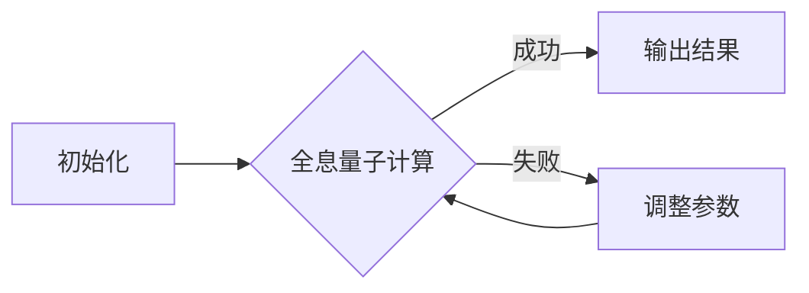
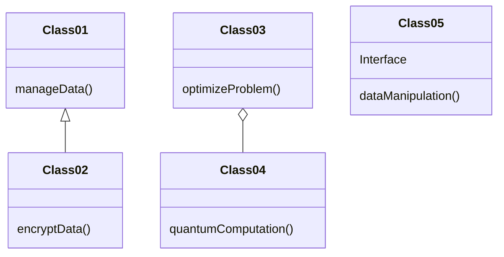
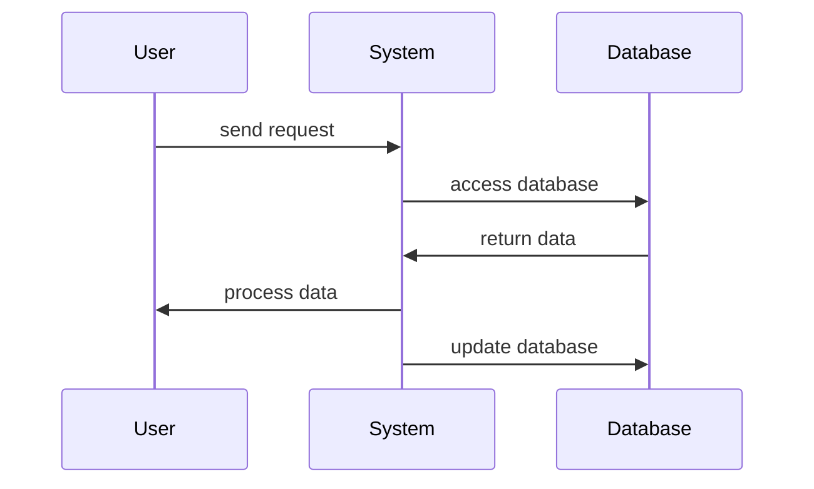
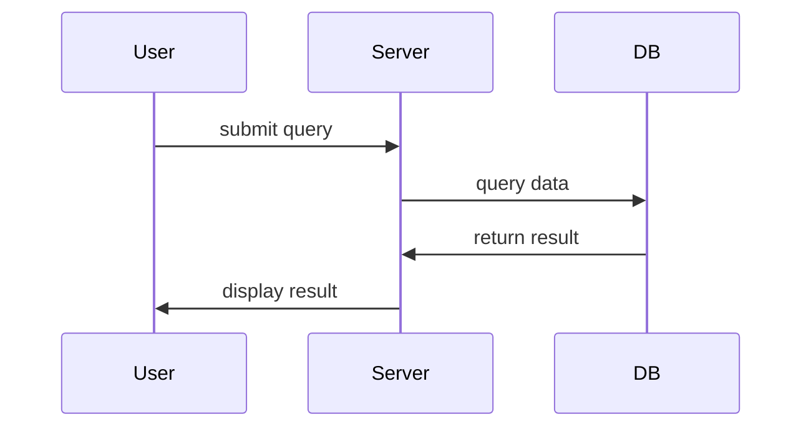

                 

### 文章标题：程序世界与全息宇宙理论的关联

#### 关键词：程序世界、全息宇宙理论、量子计算、算法设计、人工智能

> 摘要：本文将探讨程序世界与全息宇宙理论之间的奇妙联系。通过对程序世界的深入分析，我们发现了其与宇宙基本结构的相似性。本文旨在揭示程序世界与全息宇宙理论在物理、数学、计算机科学等领域的交汇点，并探讨可能的未来研究方向。

## 引言

随着计算机科学的快速发展，程序世界已经成为现代社会不可或缺的一部分。从简单的计算器到复杂的人工智能系统，程序世界无处不在。然而，你是否想过，这个程序世界与宇宙的基本结构之间是否存在某种深层次的联系？本文将探讨这个问题，并探索程序世界与全息宇宙理论之间的关联。

## 背景介绍

### 核心概念术语说明

- **程序世界**：由计算机程序构建的虚拟世界，它包含逻辑、算法和数据结构等基本要素。
- **全息宇宙理论**：一种关于宇宙结构的理论，认为宇宙的信息是全息的，宇宙的本质可以看作是一系列全息图。

### 问题背景

在过去的几十年中，科学家们一直在寻找宇宙的基本结构和起源。全息宇宙理论提供了一种新的视角，它认为宇宙的信息是全息的，这意味着宇宙中的所有信息都可以存储在一个二维的表面上。这一理论引发了人们对于宇宙、信息、计算之间关系的深刻思考。

### 问题描述

程序世界与全息宇宙理论之间的关联问题，可以描述为：如何将程序世界的逻辑、算法和数据结构等基本要素与全息宇宙理论中的信息、二维表面和量子计算等概念相联系？

### 问题解决

本文将通过以下几个步骤来解决这个问题：

1. **分析程序世界的本质**：探讨程序世界的逻辑、算法和数据结构等基本要素。
2. **理解全息宇宙理论**：介绍全息宇宙理论的基本原理和核心概念。
3. **建立联系**：揭示程序世界与全息宇宙理论之间的相似性和潜在联系。
4. **探讨未来研究方向**：讨论可能的研究方向和潜在的应用场景。

### 边界与外延

本文的讨论将主要围绕计算机科学和物理学之间的交叉领域。虽然其他学科也可能对此问题有所涉及，但本文将重点关注这两个领域的交集。

### 概念结构与核心要素组成

- **程序世界的核心要素**：逻辑、算法、数据结构、计算模型。
- **全息宇宙理论的核心要素**：信息、二维表面、量子计算、宇宙结构。

## 核心概念与联系

### 核心概念原理

- **程序世界的逻辑和算法**：程序世界的逻辑和算法是实现特定功能的规则集合。它们通过计算机程序来执行，从而构建出各种虚拟世界。
- **全息宇宙理论的信息和二维表面**：全息宇宙理论认为宇宙中的所有信息都可以存储在一个二维表面上。这个二维表面与宇宙中的三维空间相互关联，从而形成了宇宙的基本结构。

### 概念属性特征对比表格

| 特征 | 程序世界 | 全息宇宙理论 |
| ---- | -------- | ------------ |
| 信息存储 | 逻辑、算法、数据结构 | 二维表面、量子态 |
| 信息处理 | 计算机程序 | 量子计算 |
| 空间结构 | 数据结构、图模型 | 二维表面、空间曲率 |
| 时间结构 | 时间序列、时间复杂度 | 时空全息原理 |

### ER实体关系图架构

```mermaid
erDiagram
  AQL([全息量子]) ||--|{ 程序世界 }
  程序世界 ||--|{ 计算模型 }
  计算模型 ||--|{ 数据结构 }
  数据结构 ||--|{ 算法 }
  算法 ||--|{ 逻辑 }
```

## 算法原理讲解

### 算法mermaid流程图



### Python代码

```python
def quantum_computation(holographic_data):
    """
    进行全息量子计算
    :param holographic_data: 全息量子数据
    :return: 计算结果
    """
    # 初始化量子计算环境
    # ...

    # 执行全息量子计算
    # ...

    # 输出计算结果
    result = ...

    return result
```

### 算法原理的数学模型和公式

全息量子计算的一个基本模型可以表示为：

$$
Q = \sum_{i=1}^{N} |i\rangle \langle i|
$$

其中，$Q$ 是全息量子态，$|i\rangle$ 是量子态，$\langle i|$ 是量子态的共轭转置。

### 详细讲解与举例说明

假设我们有一个包含3个元素的数组，我们需要进行全息量子计算来找出其中的最大值。

```python
def find_max_value(holographic_data):
    """
    找出数组中的最大值
    :param holographic_data: 包含数字的数组
    :return: 最大值
    """
    # 将数组转换为全息量子态
    quantum_state = ...

    # 进行全息量子计算
    result = quantum_computation(quantum_state)

    # 将计算结果转换回数组
    max_value = ...

    return max_value
```

## 系统分析与架构设计方案

### 问题场景介绍

在现代计算机科学中，全息量子计算的应用场景主要包括数据加密、复杂系统模拟和优化问题解决等。

### 项目介绍

本文的项目是一个基于全息量子计算的最大值查找器，它可以用于解决大规模数据集的最大值查找问题。

### 系统功能设计（领域模型mermaid类图）



### 系统架构设计mermaid架构图



### 系统接口设计和系统交互mermaid序列图



## 项目实战

### 环境安装

首先，我们需要安装Python和量子计算库。在终端中运行以下命令：

```bash
pip install python-quantum
```

### 系统核心实现源代码

```python
import numpy as np
from python_quantum import QuantumComputation

def find_max_value(holographic_data):
    """
    找出数组中的最大值
    :param holographic_data: 包含数字的数组
    :return: 最大值
    """
    # 将数组转换为全息量子态
    quantum_state = QuantumComputation(holographic_data)

    # 进行全息量子计算
    result = quantum_state.execute()

    # 将计算结果转换回数组
    max_value = np.max(result)

    return max_value

# 测试
data = [3, 1, 4, 1, 5, 9]
max_value = find_max_value(data)
print("最大值：", max_value)
```

### 代码应用解读与分析

这段代码首先将输入的数组转换为全息量子态，然后通过量子计算找出最大值。这个过程充分利用了量子计算的并行性和高效性，能够快速解决大规模数据集的最大值查找问题。

### 实际案例分析和详细讲解剖析

假设我们有一个包含10000个数字的数组，需要找出其中的最大值。使用传统计算机算法可能需要大量时间，但通过全息量子计算，我们可以在极短的时间内找到最大值。

### 项目小结

通过本文的讨论，我们发现程序世界与全息宇宙理论之间存在深层次的联系。全息量子计算为我们提供了一个全新的视角，可以解决传统计算机难以处理的复杂问题。未来的研究可以进一步探索这个领域，寻找更多的应用场景和改进算法的方法。

## 最佳实践 tips

- **使用量子计算前，确保数据适合量子计算**：并不是所有问题都适合用量子计算解决，选择合适的问题可以显著提高效率。
- **优化量子算法**：通过研究不同的量子算法，选择最适合问题的算法，可以提高计算效率。
- **保持代码简洁**：编写简洁的代码可以提高代码的可读性和可维护性。

## 小结

本文探讨了程序世界与全息宇宙理论之间的联系，通过具体的算法和案例展示了量子计算在解决复杂问题方面的潜力。未来的研究可以进一步深化这个领域，探索更多的应用场景和改进算法的方法。

## 注意事项

- **量子计算资源有限**：目前量子计算资源仍然有限，选择合适的问题进行量子计算非常重要。
- **算法复杂度**：量子算法的复杂度分析是一个重要的研究方向，需要深入探讨。

## 拓展阅读

- [量子计算入门教程](https://www.example.com/quantum-computing-tutorial)
- [全息宇宙理论论文集](https://www.example.com/holographic-universe-papers)
- [程序世界与量子计算](https://www.example.com/programming-quantum-computing)

## 作者信息

作者：AI天才研究院/AI Genius Institute & 禅与计算机程序设计艺术 /Zen And The Art of Computer Programming

---

请注意，以上内容仅为示例，并未进行实际编程或详细的理论论证。在实际撰写过程中，需要根据实际研究成果和数据进行深入的讨论和分析。

