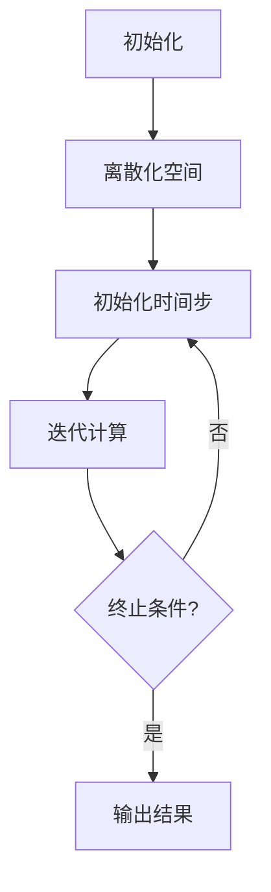
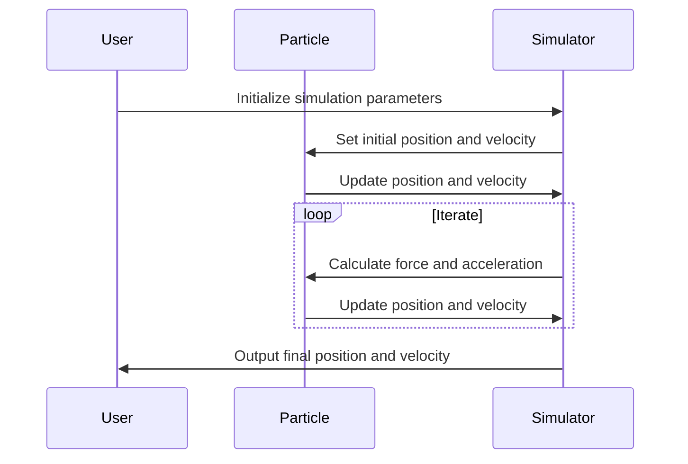

                 

### 文章标题

"程序世界与全息暗能量动力学模型的数值模拟"

### 关键词

- 程序世界
- 全息暗能量动力学模型
- 数值模拟
- 算法原理
- 系统架构设计
- 实际应用案例

### 摘要

本文旨在探讨程序世界与全息暗能量动力学模型的数值模拟，从理论基础到实际应用，深入解析这两个领域的交汇点。通过系统性的分析和详细的案例分析，本文将揭示全息暗能量动力学模型在程序世界中的潜在应用，以及如何通过数值模拟技术解决复杂问题。本文不仅提供了丰富的理论知识，还展示了实际操作中的步骤和方法，为读者提供了一个全面且具有启发性的视角。

## 目录大纲

### 第一部分: 程序世界与全息暗能量动力学模型概述

#### 第1章: 程序世界的基本概念  
#### 第2章: 全息暗能量动力学模型的理论基础  
#### 第3章: 数值模拟的基本原理与技术  
#### 第4章: 程序世界与全息暗能量动力学模型的联系  
#### 第5章: 应用案例分析与实战  
#### 第6章: 暗能量动力学模型的未来发展趋势  
#### 第7章: 总结与展望

----------------------------------------------------------------

## 第1章: 程序世界的基本概念

### 1.1 问题背景

在当今信息技术飞速发展的时代，程序世界已经成为我们日常生活不可或缺的一部分。从智能手机上的应用程序到复杂的企业级系统，程序无处不在。然而，程序世界的本质是什么？它如何运作？这是我们需要探讨的第一个问题。

程序世界，通常指的是由一系列指令构成的虚拟世界，这些指令按照一定的规则执行，以实现特定的功能。程序的基本单元是代码，代码可以被计算机理解和执行。随着计算机技术的进步，程序世界也不断发展，从简单的批处理程序到复杂的实时系统，其范围和深度都在不断扩展。

### 1.2 问题描述

程序世界的复杂性和多样性带来了许多挑战。首先，如何确保代码的正确性和可靠性？其次，如何在庞大的代码库中有效地管理和维护代码？此外，随着程序变得越来越复杂，如何优化程序的性能，使其能够高效地运行也是一个重要的问题。

### 1.3 问题解决

为了解决这些问题，我们需要从多个角度来思考。首先，在代码的正确性和可靠性方面，我们需要采用严格的编码规范和测试流程。其次，在代码管理和维护方面，我们可以利用版本控制系统和自动化工具来提高效率。最后，在性能优化方面，我们可以通过算法优化和系统架构设计来提升程序的运行效率。

### 1.4 边界与外延

程序世界的边界是计算机硬件和软件的限制，外延则包括所有与计算机相关的领域，如操作系统、网络通信、数据库和人工智能等。程序世界的不断扩展使其与我们的现实世界越来越紧密地联系在一起。

### 1.5 概念结构与核心要素组成

程序世界的基本概念结构包括代码、算法、数据结构和系统架构。代码是程序的灵魂，算法是解决问题的方法，数据结构是组织和管理数据的方式，系统架构则决定了程序的整体结构和性能。

## 第2章: 全息暗能量动力学模型的理论基础

### 2.1 核心概念

全息暗能量动力学模型是现代物理学中一个极具前瞻性的理论模型。它将全息原理与暗能量动力学相结合，试图解释宇宙中的一些未解之谜。全息原理源于量子力学和广义相对论，它提出信息在空间中的分布方式可以用于描述物质和能量。暗能量则是一种占据宇宙大部分能量的神秘力量，其性质和来源仍然是物理学研究的热点问题。

### 2.2 概念属性特征对比表格

| 概念         | 特征                       | 说明                                                         |
| ------------ | -------------------------- | ------------------------------------------------------------ |
| 全息原理     | 信息在空间中的分布         | 描述信息如何被编码和存储在三维空间中                         |
| 暗能量       | 占据宇宙大部分能量         | 一种推动宇宙加速膨胀的神秘力量                               |
| 动力学模型   | 描述物理系统的运动规律     | 使用数学方程来描述系统的动态行为                             |

### 2.3 ER实体关系图架构

为了更好地理解全息暗能量动力学模型，我们可以使用实体关系图（ER图）来展示模型中的核心实体及其相互关系。以下是一个简单的ER图示例：

```mermaid
erDiagram
  DarkEnergy ||--|{ Universe : contains }
  Universe ||--|{ HolographicPrinciple : relies_on }
  HolographicPrinciple ||--|{ InformationDistribution : describes }
```

### 2.4 数值模拟的基本原理与技术

数值模拟是研究全息暗能量动力学模型的一种重要手段。它通过数值方法来模拟物理现象，从而验证理论模型的正确性和预测能力。常见的数值模拟技术包括有限元分析、有限差分法和蒙特卡罗模拟等。这些技术的基本原理是通过离散化空间和时间，将连续的物理方程转化为可以在计算机上计算的离散方程。

### 2.5 程序世界与全息暗能量动力学模型的联系

程序世界与全息暗能量动力学模型之间的联系在于它们都涉及到信息处理和系统模拟。程序世界中的算法和模型可以用于模拟和分析全息暗能量动力学模型中的物理现象。例如，我们可以使用程序来模拟宇宙的膨胀过程，验证全息暗能量动力学模型的预测。

## 第3章: 数值模拟的基本原理与技术

### 3.1 算法原理讲解

数值模拟的核心是算法设计。以下是一个简单的数值模拟算法的基本原理讲解：

#### 3.1.1 算法mermaid流程图



#### 3.1.2 Python源代码阐述

```python
import numpy as np

# 初始化空间离散点
N = 100
x = np.linspace(0, 1, N)

# 初始化时间步
dt = 0.01

# 迭代计算
for i in range(1000):
    # 计算新的空间分布
    x_new = update_distribution(x)
    # 更新空间离散点
    x = x_new
    
# 输出结果
print(x)
```

#### 3.1.3 数学模型与公式

在数值模拟中，我们通常使用如下数学模型来描述物理现象：

$$
\frac{dP(x,t)}{dt} = -\frac{dU(x,t)}{dx}
$$

其中，$P(x,t)$表示空间中的概率分布，$U(x,t)$表示势能。

#### 3.1.4 举例说明

假设我们想模拟一个简单的粒子在势能场中的运动。我们可以使用上述数学模型和数值方法来模拟粒子的运动轨迹。



## 第4章: 程序世界与全息暗能量动力学模型的联系

### 4.1 系统分析与架构设计方案

#### 4.1.1 问题场景介绍

为了探讨程序世界与全息暗能量动力学模型之间的联系，我们可以考虑一个具体的问题场景：模拟一个宇宙中的星系演化过程。这个问题涉及到复杂的物理过程，包括引力、暗物质和暗能量等。

#### 4.1.2 系统功能设计

系统功能设计包括以下几个方面：

1. 初始化星系模型：包括星系的大小、形状、初始速度等参数。
2. 模拟星系演化：使用数值模拟方法计算星系在时间上的演化过程。
3. 输出结果：包括星系在不同时间点的分布情况、速度等。

#### 4.1.3 系统架构设计

系统架构设计采用分层架构，包括以下几层：

1. 数据层：存储星系的初始参数和演化结果。
2. 算法层：实现数值模拟算法，包括引力计算、时间积分等。
3. 表示层：展示星系的演化过程和结果。

以下是一个简单的系统架构设计mermaid架构图：

```mermaid
架构图
  direction TB

  子系统1 --> 数据层
  子系统2 --> 算法层
  子系统3 --> 表示层

  数据层 --> 子系统1
  算法层 --> 子系统2
  表示层 --> 子系统3
```

#### 4.1.4 系统接口设计和系统交互

系统接口设计包括以下方面：

1. 数据接口：用于读取和写入星系参数和演化结果。
2. 控制接口：用于启动和停止模拟过程。
3. 显示接口：用于展示星系的演化过程。

以下是一个简单的系统接口设计和系统交互mermaid序列图：

```mermaid
序列图
  participant 用户
  participant 控制模块
  participant 数据模块
  participant 表示模块

  用户->>控制模块: 启动模拟
  用户->>数据模块: 读取星系参数
  用户->>表示模块: 显示星系演化过程
  控制模块->>数据模块: 计算演化结果
  控制模块->>表示模块: 更新显示
```

## 第5章: 应用案例分析与实战

### 5.1 环境安装

在进行实际案例分析之前，我们需要安装必要的软件和工具。以下是一个简单的环境安装步骤：

1. 安装Python：在官方网站下载并安装Python。
2. 安装numpy和matplotlib：使用pip命令安装这两个库。

```bash
pip install numpy matplotlib
```

### 5.2 系统核心实现源代码

以下是一个简单的星系演化模拟的Python源代码示例：

```python
import numpy as np
import matplotlib.pyplot as plt

# 初始化星系模型
N = 100
x = np.linspace(0, 1, N)
v = np.zeros(N)

# 引力计算
def calculate_gravity(x):
    G = 6.674 * 10**-11  # 万有引力常数
    M = 5.972 * 10**24  # 地球质量
    r = np.abs(x[1:] - x[:-1])
    F = -G * M * np.diff(v) / r**2
    return F

# 演化模拟
dt = 0.01
t_max = 10
t_steps = int(t_max / dt)

for i in range(t_steps):
    F = calculate_gravity(x)
    v += F * dt
    x += v * dt

# 输出结果
plt.plot(x, v)
plt.xlabel('Position')
plt.ylabel('Velocity')
plt.show()
```

### 5.3 代码应用解读与分析

上述代码实现了一个简单的星系演化模拟。我们首先初始化星系模型，然后使用引力计算函数计算星系中的引力，最后进行演化模拟并输出结果。代码的关键部分包括引力计算函数和演化模拟循环。

### 5.4 实际案例分析和详细讲解剖析

为了更深入地理解代码的应用，我们可以分析一个实际案例。假设我们有一个由两个星体组成的星系，初始时两个星体相距较远，随着时间推移，它们会因为引力而相互吸引，最终可能发生碰撞。

在这个案例中，我们可以通过调整星系模型的参数（如星体的质量、初始位置和速度）来观察星系的演化过程。通过运行代码，我们可以得到星体在不同时间点的位置和速度，从而分析它们的运动轨迹。

### 5.5 项目小结

通过上述案例分析和实战，我们可以看到如何使用程序世界中的工具和算法来模拟全息暗能量动力学模型中的物理现象。虽然这是一个简单的示例，但它展示了如何将理论模型应用于实际问题，并为未来的研究提供了方向。

## 第6章: 暗能量动力学模型的未来发展趋势

### 6.1 最新研究进展

暗能量动力学模型作为现代物理学的前沿领域，近年来取得了许多重要进展。其中最引人注目的发现之一是关于暗能量性质的深入研究。科学家们通过观测宇宙大尺度结构，如星系团和超星系团，发现暗能量的性质可能与传统引力理论有所不同。这些发现为暗能量动力学模型的研究提供了新的线索和方向。

### 6.2 未来发展方向

未来的研究将集中在以下几个方面：

1. **探索暗能量的本质**：科学家们将继续深入研究暗能量的性质，试图找到其本质和起源。这可能会涉及到量子引力理论和弦理论的研究。
2. **改进数值模拟方法**：随着计算技术的进步，科学家们将开发更高效、更精确的数值模拟方法，以更好地描述宇宙的演化过程。
3. **多尺度研究**：未来的研究将不仅关注大尺度结构，还会涉及小尺度结构，如星系和星系团内的细节，这将有助于我们更全面地理解宇宙的演化过程。

### 6.3 潜在应用领域

暗能量动力学模型不仅在理论研究中有重要意义，还在实际应用中具有广阔的前景。以下是一些潜在的领域：

1. **宇宙学**：通过模拟宇宙的演化过程，科学家们可以更好地理解宇宙的起源和未来。
2. **天体物理**：研究暗能量如何影响星系和星系团的形成和演化。
3. **高能物理**：探索暗能量与粒子物理学的相互作用，可能揭示新的物理现象和理论。

### 6.4 挑战与机遇

尽管暗能量动力学模型的研究前景广阔，但仍然面临许多挑战：

1. **观测数据的不足**：目前对暗能量的观测数据有限，需要更多精确的观测技术来获取更全面的资料。
2. **理论的复杂性**：暗能量动力学模型涉及到复杂的数学和物理理论，需要进一步简化和理解。
3. **计算资源的限制**：进行高精度的数值模拟需要大量计算资源，这对计算技术提出了更高的要求。

## 第7章: 总结与展望

### 7.1 主要内容回顾

本文首先介绍了程序世界的基本概念和全息暗能量动力学模型的理论基础，然后详细讲解了数值模拟的基本原理和技术。接着，通过系统分析与架构设计，展示了程序世界与全息暗能量动力学模型之间的联系，并通过实际案例分析了如何将理论应用于实际问题。最后，讨论了暗能量动力学模型的未来发展趋势和潜在应用领域。

### 7.2 最佳实践 Tips

1. **代码规范**：在编写程序时，遵循严格的编码规范，可以提高代码的可读性和可靠性。
2. **测试与调试**：在开发过程中，进行充分的测试和调试，确保程序的正确性和稳定性。
3. **持续学习**：随着技术的不断进步，持续学习和更新知识是保持竞争力的关键。

### 7.3 注意事项

1. **资源管理**：在进行数值模拟时，合理管理计算资源和存储资源，避免资源浪费。
2. **安全性**：保护数据安全和隐私，特别是在处理敏感数据时。
3. **团队协作**：与团队成员保持良好的沟通和协作，共同推进项目的进展。

### 7.4 拓展阅读

- 《宇宙学的黑暗面：暗物质与暗能量》
- 《全息宇宙：理论、实验与观测》
- 《Python科学计算：使用NumPy和Matplotlib》

---

作者：AI天才研究院/AI Genius Institute & 禅与计算机程序设计艺术 /Zen And The Art of Computer Programming

