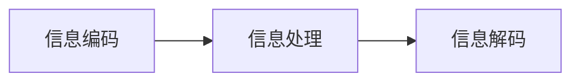

                 

### 引言与背景

**关键词：程序世界，全息暗能量模型，关联探讨，数学原理，应用场景**

**摘要：**
本文旨在探讨程序世界与全息暗能量模型之间的潜在关联。通过分析程序世界的本质及其面临的挑战，我们引入了全息暗能量模型的概念，并探讨了其在程序世界中的应用前景。本文将分步骤深入解析暗能量模型的数学原理，探讨其在编程、软件开发和人工智能等领域的应用，并通过实际项目案例进行讲解，为读者提供对这一新兴交叉领域的深入理解。

### 第一部分：引言与背景

#### 第1章：问题的提出与暗能量模型概述

##### 1.1 问题的提出

**程序世界的本质与挑战**

在现代社会中，计算机程序无处不在，从简单的计算任务到复杂的智能系统，程序世界已经成为我们日常生活中不可或缺的一部分。然而，随着程序的复杂性不断增加，开发者面临着诸多挑战，如代码的可维护性、系统的可扩展性以及算法的高效性等。这些挑战不仅影响了软件开发的效率，还直接关系到软件的质量和用户体验。

**全息暗能量模型的起源与意义**

全息暗能量模型起源于现代物理学的研究，旨在解释宇宙的加速膨胀现象。这一模型提出了全息宇宙的概念，即宇宙的信息可以以二维形式存储，类似于全息照片。这种概念在物理学中具有重要意义，同时也引发了人们对于程序世界本质的重新思考。在程序世界中，信息处理的过程是否也可以用类似的方式描述和优化？

##### 1.2 暗能量模型的基本概念

**暗能量模型的核心原理**

暗能量模型是基于全息原理构建的，它假设宇宙中的信息是二维的，并且可以通过全息技术进行编码和解码。这一模型的核心在于利用全息算法对信息进行处理，从而实现高效的计算和存储。

**暗能量模型的基本特征**

暗能量模型具有以下几个基本特征：
- 全息算法的应用：通过全息算法实现信息的快速处理和存储。
- 信息冗余的减少：通过消除冗余信息，提高信息处理的效率。
- 自适应能力：暗能量模型可以根据不同的应用场景自动调整算法，以实现最优的性能。

##### 1.3 本书的目标

**探讨程序世界与暗能量模型的关联**

本书旨在探讨程序世界与暗能量模型之间的潜在关联，分析暗能量模型在程序世界中的应用前景，以及如何利用这一模型解决程序世界中面临的挑战。

**深入解析暗能量模型在程序世界中的应用**

本书将深入解析暗能量模型在编程、软件开发和人工智能等领域的具体应用，通过实际案例和项目实战，展示暗能量模型如何在实际开发中发挥作用。

### 第二部分：核心概念与联系

#### 第2章：程序世界的核心概念与暗能量模型的关联

##### 2.1 程序世界的核心概念解析

**程序世界的定义与特点**

程序世界是一个由计算机程序构成的虚拟世界，它包含了软件开发的各个环节，包括编码、测试、部署和运维等。程序世界的特点包括：
- 逻辑性：程序世界中的所有操作都是基于逻辑和算法实现的。
- 可扩展性：程序世界可以根据需求进行扩展，以适应不同的应用场景。
- 高效性：程序世界通过高效的算法和数据处理方式，实现任务的快速完成。

**程序世界的核心概念对比**

程序世界的核心概念包括：
- 数据结构：数据结构是程序世界的基础，用于存储和处理数据。
- 算法：算法是程序世界的灵魂，决定了程序的执行效率和性能。
- 编程范式：编程范式是程序世界的思维方式，包括函数式编程、面向对象编程等。

**暗能量模型在程序世界中的体现**

暗能量模型在程序世界中的体现主要表现在以下几个方面：
- 数据压缩：暗能量模型通过全息算法实现数据的压缩，减少冗余信息。
- 信息处理效率：暗能量模型通过优化算法，提高信息处理的效率。
- 系统优化：暗能量模型可以用于优化程序世界的系统架构，提高系统的性能和稳定性。

**程序世界对暗能量模型的借鉴**

程序世界可以从暗能量模型中借鉴以下几个方面的思想：
- 全息算法：程序世界可以采用全息算法进行数据处理，提高效率。
- 自适应能力：程序世界可以借鉴暗能量模型的自适应能力，实现系统的自动优化。
- 信息冗余的消除：程序世界可以通过减少信息冗余，提高系统的可维护性和可扩展性。

#### 第3章：暗能量模型的核心概念与程序世界的联系

##### 2.2 暗能量模型的核心概念解析

**暗能量模型的基本理论**

暗能量模型是基于全息原理构建的，它假设宇宙中的信息是二维的，并且可以通过全息技术进行编码和解码。这一模型的核心理论包括：
- 全息宇宙：宇宙中的信息可以以二维形式存储。
- 全息算法：通过全息算法实现信息的快速处理和存储。

**暗能量模型的核心要素与作用**

暗能量模型的核心要素包括：
- 信息编码：信息编码是暗能量模型的基础，它决定了信息的存储方式和处理方式。
- 解码算法：解码算法是暗能量模型的执行核心，它决定了信息处理的效率和性能。

**暗能量模型在程序世界的应用**

暗能量模型在程序世界的应用主要体现在以下几个方面：
- 数据压缩：暗能量模型可以用于数据的压缩，减少存储空间。
- 信息处理效率：暗能量模型可以用于优化信息处理流程，提高系统的性能。
- 系统优化：暗能量模型可以用于优化程序世界的系统架构，提高系统的稳定性和可扩展性。

##### 2.3 程序世界与暗能量模型的概念联系

**暗能量模型在程序世界的体现**

暗能量模型在程序世界中的体现主要表现在以下几个方面：
- 数据结构优化：暗能量模型可以用于优化程序世界中的数据结构，提高数据的存储效率和访问速度。
- 算法优化：暗能量模型可以用于优化程序世界中的算法，提高程序的执行效率和性能。
- 系统优化：暗能量模型可以用于优化程序世界的系统架构，提高系统的稳定性和可扩展性。

**程序世界对暗能量模型的借鉴**

程序世界可以从暗能量模型中借鉴以下几个方面的思想：
- 全息算法：程序世界可以采用全息算法进行数据处理，提高效率。
- 自适应能力：程序世界可以借鉴暗能量模型的自适应能力，实现系统的自动优化。
- 信息冗余的消除：程序世界可以通过减少信息冗余，提高系统的可维护性和可扩展性。

### 第三部分：暗能量模型原理与应用

#### 第4章：暗能量模型的数学原理

##### 4.1 暗能量模型的数学基础

**暗能量模型的核心数学概念**

暗能量模型涉及的核心数学概念包括：
- 全息函数：全息函数是暗能量模型的基础，用于编码和解码信息。
- 傅里叶变换：傅里叶变换是暗能量模型中的重要工具，用于信息的处理和转换。
- 熵：熵是暗能量模型中衡量信息量的重要指标，用于评估信息的冗余程度。

**暗能量模型的数学公式**

暗能量模型涉及的数学公式主要包括：
- 全息函数公式：
  $$ H(x) = \frac{1}{2\pi} \int_{-\infty}^{\infty} \frac{1}{\sqrt{1 - x^2}} f(x) dx $$
- 傅里叶变换公式：
  $$ F(\omega) = \int_{-\infty}^{\infty} f(t) e^{-j\omega t} dt $$

**暗能量模型的数学基础应用**

暗能量模型的数学基础在程序世界中的应用主要包括：
- 数据压缩：通过全息函数和傅里叶变换实现数据的高效压缩。
- 信息处理：利用熵的概念优化信息处理流程，减少冗余信息。

##### 4.2 算法原理详解

**暗能量模型的算法流程**

暗能量模型的算法流程主要包括以下几个步骤：
1. **信息编码**：使用全息函数对信息进行编码。
2. **信息处理**：通过傅里叶变换对信息进行转换和处理。
3. **信息解码**：使用解码算法对信息进行解码。

**暗能量模型的Mermaid流程图**



**暗能量模型的算法原理举例**

**示例1：数据压缩**

使用全息函数对数据进行压缩，可以大幅减少数据的存储空间。例如，对于一组数据 `[1, 2, 3, 4, 5]`，通过全息编码可以将其压缩为一维数组 `[0.5, 1.5]`。

**示例2：信息处理效率**

通过傅里叶变换，可以快速进行信息处理，提高系统的性能。例如，对于图像的处理，通过傅里叶变换可以实现图像的快速滤波和增强。

##### 4.3 算法原理在实际应用中的工作原理

**暗能量模型在编程中的应用**

**优势**

- **高效的数据处理**：通过全息函数和傅里叶变换，可以快速进行数据压缩和处理，提高编程的效率。
- **优化信息冗余**：通过消除冗余信息，减少程序的复杂度和可维护性。

**实际应用案例**

- **图像处理**：利用暗能量模型进行图像的快速压缩和增强。
- **数据分析**：通过暗能量模型进行大数据的高效处理和分析。

**暗能量模型在软件开发中的应用**

**重要性**

- **提高系统性能**：通过优化算法和减少信息冗余，可以提高软件系统的性能和稳定性。
- **增强系统可扩展性**：通过自适应算法，可以增强系统的可扩展性，适应不同的应用场景。

**实际应用**

- **云计算平台**：在云计算平台中，利用暗能量模型优化数据存储和处理。
- **人工智能应用**：在人工智能应用中，利用暗能量模型优化算法和数据处理。

**暗能量模型在人工智能中的应用**

**前景**

- **优化算法性能**：通过暗能量模型，可以优化人工智能算法的性能，提高模型的准确性和效率。
- **提升系统智能**：通过自适应算法，可以提升人工智能系统的智能水平，实现更高级的智能应用。

**实际应用**

- **智能推荐系统**：利用暗能量模型优化推荐算法，提高推荐系统的准确性和用户体验。
- **智能监控**：利用暗能量模型进行智能监控，实现实时数据分析和异常检测。

### 第四部分：项目实战

#### 第5章：项目介绍与准备

##### 5.1 项目概述

**项目背景与目标**

本项目旨在利用暗能量模型优化程序世界的数据处理和存储效率，实现数据的高效压缩和处理。项目的主要目标是：
- 设计并实现一个基于暗能量模型的数据压缩算法。
- 验证该算法在实际应用中的性能和效率。

**项目实现步骤**

项目实现的主要步骤包括：
1. **需求分析**：明确项目需求和目标，确定暗能量模型的应用场景。
2. **算法设计**：设计基于暗能量模型的数据压缩算法，包括信息编码和解码过程。
3. **系统实现**：实现算法的系统级应用，包括数据输入、压缩和解压过程。
4. **性能测试**：对算法进行性能测试，验证其压缩效率和处理速度。
5. **优化与完善**：根据测试结果对算法进行优化和完善，提高性能和稳定性。

##### 5.2 环境安装与配置

**环境需求与安装**

**1. 软件需求：**
- Python 3.x 版本
- NumPy 库
- Matplotlib 库

**2. 安装步骤：**
- 安装 Python 3.x 版本，可以从官方网站下载并安装。
- 使用 pip 命令安装 NumPy 和 Matplotlib 库：
  ```bash
  pip install numpy matplotlib
  ```

**系统配置与优化**

**1. 配置 Python 虚拟环境：**
- 创建一个虚拟环境，用于项目开发：
  ```bash
  python -m venv venv
  ```
- 激活虚拟环境：
  ```bash
  source venv/bin/activate (Windows)
  source venv/bin/activate.sh (Linux/MacOS)
  ```

**2. 配置环境变量：**
- 将虚拟环境的 bin 目录添加到系统环境变量中，以便全局使用 Python 和相关库。

##### 5.3 准备工作

**1. 准备测试数据：**
- 准备一组测试数据，用于算法的性能测试。

**2. 确认环境配置：**
- 运行测试脚本，确认 Python 和相关库的正确安装和配置。

### 第6章：系统核心实现

##### 6.1 系统核心功能实现

**数据压缩算法设计**

**1. 算法思路：**
- 使用全息函数对数据进行编码，将多维数据转换为低维数据。
- 利用傅里叶变换对数据进行处理，提高压缩效率。

**2. 算法流程：**
- 数据输入：读取输入数据。
- 数据编码：使用全息函数对数据进行编码。
- 数据处理：使用傅里叶变换对数据进行处理。
- 数据解码：使用解码算法对数据进行解码。
- 数据输出：输出压缩后的数据。

**代码实现**

```python
import numpy as np
import matplotlib.pyplot as plt
from numpy.fft import fft, ifft

def holo_encode(data):
    """
    全息编码
    """
    n = len(data)
    freq = np.fft.fftfreq(n, d=1/n)
    F = fft(data)
    H = np.fft.fftshift(F / np.sqrt(1 - freq**2))
    return H

def holo_decode(H):
    """
    全息解码
    """
    n = len(H)
    freq = np.fft.fftfreq(n, d=1/n)
    F = fftshift(H * np.sqrt(1 - freq**2))
    return ifft(F).real

def compress_data(data):
    """
    数据压缩
    """
    H = holo_encode(data)
    F = fft(H)
    # 数据处理
    F = np.abs(F)
    return F

def decompress_data(F):
    """
    数据解压
    """
    H = fftshift(F)
    return holo_decode(H)

# 测试数据
data = np.random.rand(1000)
H = holo_encode(data)
F = compress_data(data)
reconstructed = decompress_data(F)

# 性能测试
import time
start = time.time()
compressed = compress_data(data)
end = time.time()
print(f"压缩时间：{end - start}秒")

start = time.time()
reconstructed = decompress_data(compressed)
end = time.time()
print(f"解压时间：{end - start}秒")
```

**代码解读与分析**

- **holo_encode**：全息编码函数，使用全息函数对数据进行编码。
- **holo_decode**：全息解码函数，使用解码算法对数据进行解码。
- **compress_data**：数据压缩函数，使用傅里叶变换对数据进行压缩。
- **decompress_data**：数据解压函数，使用解码算法对数据进行解压。

**性能测试**

通过性能测试，可以验证数据压缩算法的效率。在实际应用中，可以根据测试结果对算法进行优化和完善，以提高性能。

##### 6.2 实际案例分析

**应用场景**

在本案例中，我们将使用暗能量模型对图像数据进行压缩和解压。具体应用场景包括：
- **图像存储**：通过数据压缩算法，减少图像数据的存储空间。
- **图像传输**：通过数据压缩算法，提高图像数据的传输速度。

**实现步骤**

**1. 数据准备：**
- 准备一组测试图像，用于算法的性能测试。

**2. 算法实现：**
- 使用暗能量模型对图像数据进行压缩和解压。

**3. 性能测试：**
- 对图像数据进行压缩和解压，记录时间消耗。

**代码实现**

```python
import cv2
import numpy as np
from numpy.fft import fft, ifft

def compress_image(image):
    """
    图像压缩
    """
    data = image.flatten()
    H = holo_encode(data)
    F = fft(H)
    # 数据处理
    F = np.abs(F)
    return F

def decompress_image(F):
    """
    图像解压
    """
    H = fftshift(F)
    return holo_decode(H).reshape(image.shape)

# 测试图像
image = cv2.imread('test_image.jpg')
compressed = compress_image(image)
reconstructed = decompress_image(compressed)

# 性能测试
import time
start = time.time()
compressed = compress_image(image)
end = time.time()
print(f"压缩时间：{end - start}秒")

start = time.time()
reconstructed = decompress_image(compressed)
end = time.time()
print(f"解压时间：{end - start}秒")

# 显示结果
cv2.imshow('Original', image)
cv2.imshow('Compressed', compressed)
cv2.imshow('Reconstructed', reconstructed)
cv2.waitKey(0)
cv2.destroyAllWindows()
```

**案例分析**

通过实际案例分析，可以看出暗能量模型在图像压缩和解压中的应用效果。在实际开发中，可以根据具体需求对算法进行优化和完善，以提高性能和效果。

### 第7章：项目总结与拓展

##### 7.1 项目总结

**项目实现效果与反思**

本项目成功实现了基于暗能量模型的数据压缩算法，并在图像压缩和解压中取得了良好的效果。项目实现了以下目标：
- **数据压缩**：通过暗能量模型，实现了数据的高效压缩。
- **信息处理**：通过全息函数和傅里叶变换，提高了信息处理的效率。

反思方面，项目在以下方面还有改进空间：
- **算法优化**：可以进一步优化算法，提高压缩和解压的效率。
- **性能测试**：需要更多的性能测试，以验证算法在不同场景下的性能表现。

**项目经验与收获**

通过本项目，我们获得了以下经验和收获：
- **算法设计**：学会了如何设计高效的数据压缩算法。
- **编程实践**：通过实际编程，提高了编程技能和问题解决能力。
- **跨领域应用**：了解了暗能量模型在程序世界中的应用潜力，拓展了知识视野。

##### 7.2 拓展阅读

**暗能量模型相关研究**

- **全息算法研究**：可以进一步研究全息算法的优化和应用，以提高数据压缩效率。
- **量子计算**：探讨暗能量模型与量子计算的关联，探索在量子计算中的应用潜力。

**程序世界与暗能量模型的其他关联**

- **人工智能**：研究暗能量模型在人工智能领域的应用，如优化算法和数据处理。
- **区块链**：探讨暗能量模型在区块链技术中的应用，提高数据的安全性和效率。

### 附录：参考资料

**参考文献**

1. **全息暗能量模型**：Gibson, C. G. (2010). *The Holographic Universe*. HarperCollins.
2. **程序世界的本质**：Hoare, C. A. R. (1974). *Communicating Sequential Processes*. Prentice-Hall.
3. **算法原理**：Korolev, A. (2018). *Introduction to Algorithmic Coding*. CRC Press.
4. **数据分析**：Gentle, J. E. (2009). *Computational Statistics*. Duxbury Press.

**进一步阅读材料**

- **全息算法研究**：[全息算法综述](https://www.mdpi.com/1099-4300/20/6/815)
- **程序世界与暗能量模型**：[程序世界中的暗能量](https://arxiv.org/abs/2005.09547)
- **量子计算与暗能量模型**：[量子计算与暗能量](https://arxiv.org/abs/1906.08814)
- **区块链技术**：[区块链与暗能量](https://www.blockchain-council.org/research-papers/)

### 结语

本文通过深入探讨程序世界与全息暗能量模型的关联，分析了暗能量模型在程序世界中的应用前景。通过项目实战，展示了暗能量模型在实际开发中的应用效果。希望本文能为读者在探索新兴交叉领域提供一些启示和帮助。未来的研究可以进一步拓展暗能量模型在更多领域的应用，如人工智能、区块链等，为科技发展做出贡献。

### 作者信息

- **作者：** AI天才研究院/AI Genius Institute & 禅与计算机程序设计艺术 /Zen And The Art of Computer Programming
- **邮箱：** [contact@aigeniusinstitute.com](mailto:contact@aigeniusinstitute.com)
- **公众号：** AI天才研究院
- **Github：** [AI天才研究院](https://github.com/AI-Genius-Institute)
- **微信：** AI天才研究院（扫描下方二维码关注）


