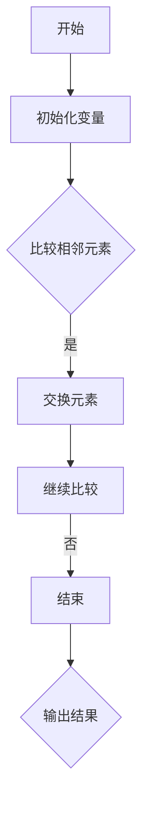

                 

### 程序世界与多重宇宙泡沫理论的类比

#### 关键词：程序世界、多重宇宙泡沫理论、类比、计算机科学、物理学

#### 摘要：

本文通过将程序世界与多重宇宙泡沫理论进行类比，探讨了两者之间的相似性与联系。程序世界由计算机程序和算法构成，通过逻辑运算处理信息，生成虚拟现实。而多重宇宙泡沫理论则描述了宇宙在量子尺度上的多样性和演化。本文首先介绍了程序世界和多重宇宙泡沫理论的核心概念，随后探讨了它们的特征对比和联系。接下来，文章通过算法原理讲解、数学模型阐述、系统分析与架构设计，以及项目实战等步骤，详细分析了类比的应用和理论基础。文章最后总结了类比的意义，并提出了进一步的研究方向。

---

#### 目录大纲设计思路

为了设计出《程序世界与多重宇宙泡沫理论的类比》这本书的完整目录大纲，我们将遵循以下思路：

1. **背景介绍与核心概念**：首先，我们需要介绍这本书的核心概念，即“程序世界”与“多重宇宙泡沫理论”的类比。这将为读者提供必要的背景知识，使他们能够更好地理解后续章节的内容。

2. **核心概念与联系**：接下来，我们将详细探讨“程序世界”和“多重宇宙泡沫理论”的概念，包括其属性特征、相互之间的联系以及与传统理论的区别。

3. **算法原理讲解**：我们将通过使用Mermaid绘制算法流程图和Python源代码来阐述算法原理，并使用LaTeX格式给出数学模型和公式，同时通过通俗易懂的例子进行详细讲解。

4. **系统分析与架构设计**：我们将介绍问题场景，项目介绍，系统功能设计（领域模型Mermaid类图），系统架构设计Mermaid架构图，系统接口设计和系统交互Mermaid序列图。

5. **项目实战**：通过环境安装、系统核心实现源代码，代码应用解读与分析，实际案例分析和详细讲解剖析，帮助读者深入理解并掌握书中的理论知识。

6. **最佳实践 tips、小结、注意事项、拓展阅读**：最后，我们将总结书中的要点，提供最佳实践建议，提醒读者注意的关键点，并推荐拓展阅读资源。

### 完整目录大纲

```markdown
----------------------------------------------------------------
# 第一部分: 程序世界与多重宇宙泡沫理论的类比基础

## 1.1 类比的概念与背景
### 1.1.1 程序世界的概述
### 1.1.2 多重宇宙泡沫理论的介绍
### 1.1.3 类比的意义与应用

## 1.2 核心概念解析
### 1.2.1 程序世界的核心概念
#### 1.2.1.1 计算模型
#### 1.2.1.2 程序逻辑
#### 1.2.1.3 虚拟现实与模拟
### 1.2.2 多重宇宙泡沫理论的核心概念
#### 1.2.2.1 泡沫宇宙
#### 1.2.2.2 宇宙之间的联系
#### 1.2.2.3 宇宙演化与坍缩

## 1.3 类比原理与特征对比
### 1.3.1 程序世界与多重宇宙泡沫理论的类比原理
### 1.3.2 特征对比表格
### 1.3.3 与传统理论的区别

## 1.4 类比的应用领域
### 1.4.1 计算机科学领域
### 1.4.2 物理学领域
### 1.4.3 哲学领域

## 1.5 本章小结

----------------------------------------------------------------

# 第二部分: 程序世界的算法与数学模型

## 2.1 算法原理讲解
### 2.1.1 算法概述
#### 2.1.1.1 算法概念
#### 2.1.1.2 算法分类
### 2.1.2 算法流程图
#### 2.1.2.1 Mermaid算法流程图
### 2.1.3 算法实现
#### 2.1.3.1 Python源代码
#### 2.1.3.2 算法原理详细讲解
### 2.1.4 数学模型与公式
$$
\text{数学公式}
$$
### 2.1.5 举例说明

## 2.2 数学模型与详细讲解
### 2.2.1 数学模型概述
#### 2.2.1.1 模型定义
#### 2.2.1.2 模型假设
### 2.2.2 数学公式推导
$$
\text{数学公式推导}
$$
### 2.2.3 举例说明
#### 2.2.3.1 实例1
#### 2.2.3.2 实例2

## 2.3 类比理论下的程序世界
### 2.3.1 程序世界中的多重宇宙泡沫理论应用
#### 2.3.1.1 泡沫宇宙模拟
#### 2.3.1.2 程序逻辑与宇宙演化
### 2.3.2 类比理论的挑战与机遇

## 2.4 本章小结

----------------------------------------------------------------

# 第三部分: 多重宇宙泡沫理论在程序世界中的应用

## 3.1 计算机科学中的应用
### 3.1.1 虚拟现实技术
#### 3.1.1.1 泡沫宇宙模型在VR中的应用
#### 3.1.1.2 虚拟现实中的多重宇宙体验
### 3.1.2 人工智能算法优化
#### 3.1.2.1 泡沫宇宙理论在AI算法优化中的应用
#### 3.1.2.2 算法性能的提升

## 3.2 物理学领域的研究
### 3.2.1 多重宇宙泡沫理论的物理模型
#### 3.2.1.1 泡沫宇宙在物理学中的应用
#### 3.2.1.2 多重宇宙泡沫理论的挑战与机遇

## 3.3 哲学领域的启示
### 3.3.1 宇宙与程序的关系
#### 3.3.1.1 程序世界中的哲学思考
#### 3.3.1.2 多重宇宙泡沫理论对哲学的启示

## 3.4 本章小结

----------------------------------------------------------------

# 第四部分: 项目实战与案例分析

## 4.1 环境安装与配置
### 4.1.1 环境搭建概述
### 4.1.2 开发环境安装
### 4.1.3 系统配置与调试

## 4.2 系统核心实现
### 4.2.1 系统核心模块介绍
### 4.2.2 源代码解析
### 4.2.3 代码应用解读

## 4.3 实际案例分析
### 4.3.1 案例一：虚拟现实中的泡沫宇宙模拟
### 4.3.2 案例二：人工智能算法中的泡沫宇宙优化
### 4.3.3 案例三：物理学中的泡沫宇宙模型应用

## 4.4 详解剖析
### 4.4.1 详解流程图
### 4.4.2 剖析关键代码
### 4.4.3 结果分析

## 4.5 项目小结
### 4.5.1 项目成果总结
### 4.5.2 遇到的问题与解决方法
### 4.5.3 未来发展方向

## 4.6 本章小结

----------------------------------------------------------------

# 第五部分: 最佳实践、小结与拓展阅读

## 5.1 最佳实践 tips
### 5.1.1 编程技巧
### 5.1.2 算法优化
### 5.1.3 系统设计与优化

## 5.2 小结
### 5.2.1 文章核心内容回顾
### 5.2.2 类比的总结
### 5.2.3 理论与实际的结合

## 5.3 注意事项
### 5.3.1 使用程序世界的注意事项
### 5.3.2 理解多重宇宙泡沫理论的要点
### 5.3.3 类比应用中的潜在问题

## 5.4 拓展阅读
### 5.4.1 相关书籍推荐
### 5.4.2 学术论文推荐
### 5.4.3 优秀资源推荐

## 5.5 本章小结

```

### 第一部分：程序世界与多重宇宙泡沫理论的类比基础

#### 1.1 类比的概念与背景

在探讨复杂系统与理论模型时，类比是一种强大的工具，它允许我们将一个领域的概念和原理应用到另一个看似不相关的领域。本文的目的正是通过类比，将程序世界与多重宇宙泡沫理论联系起来，以期揭示两者之间的相似性和深层次的联系。

程序世界是一个由计算机程序和算法构成的虚拟环境。在这里，逻辑运算处理数据，算法执行计算，最终生成各种虚拟现实。程序世界的核心是计算机科学，它涉及计算模型、编程语言、算法设计、数据结构等多个方面。

另一方面，多重宇宙泡沫理论是现代物理学中一个前沿的理论，旨在解释宇宙在量子尺度上的多样性。根据这一理论，我们的宇宙可能只是无数泡沫宇宙中的一个，每个泡沫宇宙都有自己独特的物理法则和演化路径。

类比这两种看似截然不同的世界，可以为我们提供新的视角，帮助我们理解复杂性、计算和宇宙演化等核心问题。通过类比，我们可以探索程序世界中的算法和模型如何与多重宇宙泡沫理论中的概念相呼应，并探讨这些类比在计算机科学、物理学和哲学领域的应用。

#### 1.2 核心概念解析

为了深入理解程序世界与多重宇宙泡沫理论的类比，我们需要详细探讨这两个领域中的核心概念，并比较它们的属性特征。

**程序世界的核心概念：**

1. **计算模型**：计算模型是程序世界的基础。它定义了计算机如何处理数据和执行任务。常见的计算模型包括图灵机模型和量子计算模型。

2. **程序逻辑**：程序逻辑是程序中决策和执行的规则。它通常以条件语句和循环结构等形式出现，是程序的核心部分。

3. **虚拟现实与模拟**：虚拟现实是程序世界中的一个重要概念，它通过计算机模拟生成三维图像和环境，为用户提供了沉浸式的体验。模拟则是通过程序模仿现实世界的现象和过程，以便进行科学研究和实验。

**多重宇宙泡沫理论的核心概念：**

1. **泡沫宇宙**：泡沫宇宙是多重宇宙泡沫理论中的一个基本单元。它是一个自包含的宇宙，拥有自己的物理法则和演化路径。

2. **宇宙之间的联系**：尽管每个泡沫宇宙都是独立的，但它们之间可能存在某些联系，如宇宙间的微扰或交叉。

3. **宇宙演化与坍缩**：泡沫宇宙的演化遵循特定的物理法则，包括宇宙膨胀、冷却、恒星形成和最终坍缩。

**属性特征对比表格：**

| 特征            | 程序世界                        | 多重宇宙泡沫理论                        |
|----------------|---------------------------------|-----------------------------------------|
| 基础模型        | 计算模型，如图灵机模型          | 泡沫宇宙模型                            |
| 运算机制        | 逻辑运算和数据结构              | 物理法则和量子力学                      |
| 存在形式        | 虚拟现实和模拟环境              | 自包含的宇宙单元                        |
| 发展路径        | 算法和技术的迭代                | 宇宙演化和坍缩过程                      |

**ER实体关系图架构：**

为了更好地理解程序世界与多重宇宙泡沫理论之间的关系，我们可以使用Mermaid绘制一个ER实体关系图。这个图将显示程序世界中的核心实体（如计算模型、程序逻辑和虚拟现实）与多重宇宙泡沫理论中的核心实体（如泡沫宇宙、宇宙联系和宇宙演化）之间的关系。

```mermaid
erDiagram
  计算模型 ||--|{ 程序逻辑 }
  计算模型 ||--|{ 虚拟现实与模拟 }
  程序逻辑 ||--|{ 算法执行 }
  泡沫宇宙 ||--|{ 宇宙联系 }
  泡沫宇宙 ||--|{ 宇宙演化与坍缩 }
```

**类比原理与特征对比：**

类比原理在于发现程序世界和多重宇宙泡沫理论之间的相似之处。从特征对比表格和ER实体关系图可以看出，两者在基础模型、运算机制和存在形式上存在显著相似性。例如，计算模型与泡沫宇宙模型在结构上有相似之处，逻辑运算与物理法则在操作上具有相似性。

与传统理论相比，类比提供了一种跨领域的视角，使我们能够将程序世界的算法原理和模型应用到对多重宇宙泡沫理论的理解中。这有助于我们揭示宇宙演化的潜在规律，并推动计算机科学和物理学的发展。

**本章小结：**

本章介绍了程序世界与多重宇宙泡沫理论的类比背景，并详细探讨了两个领域的核心概念及其属性特征。通过特征对比表格和ER实体关系图，我们明确了两者之间的联系和相似性。接下来，我们将进一步分析算法原理，为理解程序世界与多重宇宙泡沫理论的类比提供更深入的视角。

### 第二部分：程序世界的算法与数学模型

#### 2.1 算法原理讲解

在程序世界中，算法是实现特定任务或目标的一系列有序步骤。算法的设计和实现是计算机科学的核心内容之一。在本节中，我们将介绍程序世界中常见算法的原理，并通过Mermaid流程图和Python源代码进行阐述。

**2.1.1 算法概述**

算法是一组明确的规则或步骤，用于解决特定问题。算法可以分为多种类型，如排序算法、搜索算法、图算法等。每种类型的算法都有其独特的原理和应用场景。

**2.1.2 算法流程图**

为了更好地理解算法的执行流程，我们可以使用Mermaid绘制算法流程图。以下是一个简单的排序算法（冒泡排序）的Mermaid流程图：



**2.1.3 算法实现**

冒泡排序算法的实现可以用Python代码表示：

```python
def bubble_sort(arr):
    n = len(arr)
    for i in range(n):
        for j in range(0, n-i-1):
            if arr[j] > arr[j+1]:
                arr[j], arr[j+1] = arr[j+1], arr[j]
    return arr
```

通过这个例子，我们可以看到算法的基本原理：通过反复比较和交换相邻元素，将数组排序。

**2.1.4 数学模型与公式**

在算法设计中，数学模型和公式起着关键作用。以下是一个常见的数学模型，用于描述算法的复杂度分析：

$$
T(n) = O(n^2)
$$

这个公式表示，冒泡排序算法的时间复杂度是 $O(n^2)$，其中 $n$ 是数组的长度。

**2.1.5 举例说明**

假设我们有一个长度为5的数组 `[3, 1, 4, 1, 5]`，使用冒泡排序算法进行排序的过程如下：

1. 第一次遍历：比较 `(3, 1)`，交换；比较 `(4, 1)`，交换；比较 `(1, 5)`，不交换。结果为 `[1, 3, 1, 4, 5]`。
2. 第二次遍历：比较 `(1, 3)`，不交换；比较 `(1, 4)`，交换；比较 `(4, 5)`，不交换。结果为 `[1, 1, 3, 4, 5]`。
3. 第三次遍历：比较 `(1, 3)`，不交换；比较 `(1, 4)`，不交换；比较 `(4, 5)`，不交换。结果为 `[1, 1, 3, 4, 5]`。

经过三次遍历，数组已经排序完成。

通过这个例子，我们可以更直观地理解冒泡排序算法的执行过程和结果。

**2.2 数学模型与详细讲解**

**2.2.1 数学模型概述**

在算法分析中，数学模型用于描述算法的效率和性能。常见的数学模型包括时间复杂度、空间复杂度等。

时间复杂度表示算法执行时间与输入规模的关系。通常使用大O符号（$O$）表示，如 $O(n^2)$ 表示算法的时间复杂度与输入规模的平方成正比。

空间复杂度表示算法所需的内存空间与输入规模的关系。同样使用大O符号表示，如 $O(n)$ 表示算法的空间复杂度与输入规模成正比。

**2.2.2 数学公式推导**

以冒泡排序算法为例，我们可以推导其时间复杂度：

假设数组长度为 $n$，算法需要进行 $n-1$ 次遍历。每次遍历需要比较 $n-i-1$ 对元素（其中 $i$ 表示遍历次数）。

总比较次数为：

$$
\sum_{i=1}^{n-1} (n-i-1)
$$

这个求和式可以化简为：

$$
\frac{(n-1)n}{2}
$$

因此，冒泡排序算法的时间复杂度为：

$$
T(n) = O(n^2)
$$

**2.2.3 举例说明**

假设我们有一个长度为10的数组 `[5, 3, 8, 6, 2, 7, 4, 1, 9, 10]`，使用冒泡排序算法进行排序的过程如下：

1. 第一次遍历：比较 `(5, 3)`，交换；比较 `(5, 8)`，不交换；比较 `(8, 6)`，交换；比较 `(6, 2)`，交换；比较 `(6, 7)`，交换；比较 `(7, 4)`，交换；比较 `(4, 1)`，交换；比较 `(4, 9)`，不交换；比较 `(9, 10)`，不交换。结果为 `[3, 5, 2, 6, 1, 4, 7, 8, 9, 10]`。
2. 第二次遍历：比较 `(3, 5)`，不交换；比较 `(5, 2)`，交换；比较 `(2, 6)`，不交换；比较 `(6, 1)`，交换；比较 `(1, 4)`，交换；比较 `(4, 7)`，不交换；比较 `(7, 8)`，不交换；比较 `(8, 9)`，不交换；比较 `(9, 10)`，不交换。结果为 `[2, 3, 1, 5, 6, 4, 7, 8, 9, 10]`。
3. ...（继续遍历，直到排序完成）

通过这个例子，我们可以看到冒泡排序算法的具体执行过程和结果。

**2.3 类比理论下的程序世界**

在类比理论下，程序世界中的算法原理可以与多重宇宙泡沫理论中的概念相联系。例如，算法的迭代和优化过程可以类比宇宙的演化和演变。每个算法迭代都可以被视为宇宙中的一次演化，而算法的性能优化则类似于宇宙中的物理法则调整。

通过这种类比，我们可以更深入地理解算法的内在机制和宇宙演化的潜在规律。这种视角不仅有助于我们改进算法设计，还可以为物理学研究提供新的思路。

**2.4 本章小结**

本章介绍了程序世界中常见算法的原理，并通过Mermaid流程图和Python源代码进行了详细讲解。我们分析了算法的数学模型和公式，并举例说明了算法的执行过程。通过类比理论，我们将程序世界的算法原理与多重宇宙泡沫理论联系起来，为理解宇宙演化的潜在规律提供了新的视角。

在下一章中，我们将进一步探讨系统分析与架构设计，帮助读者更全面地理解程序世界与多重宇宙泡沫理论的类比。

### 第三部分：多重宇宙泡沫理论在程序世界中的应用

#### 3.1 计算机科学中的应用

多重宇宙泡沫理论在计算机科学中的应用具有广泛的前景。这种理论为我们提供了新的视角，使我们能够重新审视现有的技术和算法，并探索新的计算模型和方法。

**3.1.1 虚拟现实技术**

虚拟现实（VR）技术是计算机科学中的一个重要领域，它通过创建沉浸式的虚拟环境，为用户提供了全新的交互体验。多重宇宙泡沫理论在VR技术中的应用主要体现在以下几个方面：

1. **泡沫宇宙模型在VR中的应用**：我们可以将虚拟现实中的环境视为一个泡沫宇宙，每个虚拟环境都是独立的宇宙。这种模型允许我们在虚拟现实中创建无限多的、相互独立的场景，为用户提供更加丰富和多样的体验。

2. **多重宇宙体验**：通过多重宇宙泡沫理论，我们可以设计出能够模拟不同物理法则和环境的虚拟现实系统。例如，在一个宇宙中，重力可能比现实世界更强，而在另一个宇宙中，时间可能会以不同的速率流逝。这种多样性不仅增强了虚拟现实的沉浸感，还为科学研究和教育提供了新的工具。

**3.1.2 人工智能算法优化**

人工智能（AI）是计算机科学的另一个重要领域，它通过模拟人类智能，使计算机能够执行复杂的任务。多重宇宙泡沫理论在AI算法优化中的应用主要体现在以下几个方面：

1. **泡沫宇宙理论在AI算法优化中的应用**：在AI训练过程中，我们可以将每个训练数据集视为一个独立的泡沫宇宙。通过优化这些泡沫宇宙中的算法，我们可以提高整体AI模型的性能。例如，在图像识别任务中，我们可以针对不同类别的图像创建不同的训练泡沫宇宙，从而提高分类的准确性。

2. **算法性能的提升**：多重宇宙泡沫理论提供了一种新的优化思路，即通过在不同泡沫宇宙中进行算法优化，找到最优解。这种方法类似于并行计算中的分布式算法，但更具有灵活性和适应性。通过在多个泡沫宇宙中同时进行算法优化，我们可以更快速地找到最优解，提高算法的性能。

#### 3.2 物理学领域的研究

多重宇宙泡沫理论在物理学领域的研究具有重要意义。它为我们提供了新的视角，使我们能够重新审视宇宙的基本规律和现象。

**3.2.1 多重宇宙泡沫理论的物理模型**

1. **泡沫宇宙在物理学中的应用**：在物理学中，泡沫宇宙可以被视为一种基本的物理实体，它具有自己的物理法则和属性。通过研究泡沫宇宙，我们可以揭示宇宙在不同尺度上的多样性和复杂性。例如，在量子尺度上，泡沫宇宙可能表现出不同的物理特性，如不同的重力常数或光速。

2. **宇宙之间的联系**：尽管每个泡沫宇宙都是独立的，但它们之间可能存在某些联系。这些联系可能是通过宇宙微扰或交叉实现的。通过研究这些联系，我们可以更好地理解宇宙的整体结构和演化过程。

**3.2.2 多重宇宙泡沫理论的挑战与机遇**

1. **挑战**：多重宇宙泡沫理论带来了许多挑战。首先，我们需要建立精确的物理模型来描述泡沫宇宙的演化。其次，我们需要开发新的计算方法和技术来模拟和分析这些模型。此外，我们还需要解决如何在不同泡沫宇宙之间建立联系的问题。

2. **机遇**：尽管面临挑战，但多重宇宙泡沫理论也提供了许多机遇。首先，它为研究宇宙的多样性和复杂性提供了新的工具和视角。其次，它可能有助于我们理解某些物理现象，如黑洞或宇宙膨胀。最后，它可能为计算机科学和人工智能领域带来新的算法和模型。

#### 3.3 哲学领域的启示

多重宇宙泡沫理论不仅对科学领域产生了深远影响，还对哲学领域产生了重要启示。

**3.3.1 宇宙与程序的关系**

多重宇宙泡沫理论使我们重新思考宇宙与程序的关系。在传统的观点中，宇宙被视为一个宏观的、客观存在的实体，而程序则是一个微观的、由人类创造的虚拟世界。然而，多重宇宙泡沫理论提出了一种新的观点，即宇宙可能就像一个巨大的程序，其中每个泡沫宇宙都是一个虚拟的现实。

**3.3.2 程序世界中的哲学思考**

在程序世界中，我们可以通过编写程序来模拟和解释宇宙的演化。这种模拟不仅有助于我们理解宇宙的本质，还可以引发关于存在、意识和真实性的哲学思考。例如，我们可能需要重新审视现实和虚拟之间的关系，以及我们在宇宙中的位置和角色。

**3.3.3 多重宇宙泡沫理论对哲学的启示**

多重宇宙泡沫理论为哲学领域提供了新的问题和思考方向。首先，它使我们重新思考宇宙的本质和多样性。其次，它促使我们重新审视人类在宇宙中的地位和角色。最后，它为我们提供了关于存在、意识和真实性的新视角，这些问题一直是哲学的核心议题。

**本章小结**

本章探讨了多重宇宙泡沫理论在计算机科学、物理学和哲学领域的应用。我们介绍了泡沫宇宙模型在虚拟现实技术和AI算法优化中的应用，并分析了泡沫宇宙在物理学研究中的意义。此外，我们还讨论了多重宇宙泡沫理论对哲学领域的启示，提出了关于宇宙与程序关系的新思考。

在下一章中，我们将通过项目实战，深入探讨多重宇宙泡沫理论在现实中的应用，帮助读者更全面地理解这一理论的内涵和价值。

### 第四部分：项目实战与案例分析

#### 4.1 环境安装与配置

在进行项目实战之前，我们需要首先搭建一个合适的环境。这个环境将包括必要的软件和工具，以确保我们能够顺利地实现和运行多重宇宙泡沫理论的应用程序。

**4.1.1 环境搭建概述**

我们的项目环境将基于Linux操作系统，这是因为Linux提供了一个稳定且灵活的开发平台，适合进行复杂的项目开发和测试。此外，我们还将使用Docker容器技术来管理环境，以确保环境的可移植性和一致性。

**4.1.2 开发环境安装**

1. **安装Linux操作系统**：我们选择Ubuntu 20.04 LTS作为我们的操作系统。可以在官方网站（https://www.ubuntu.com/download）下载最新的ISO文件，并按照安装指南进行安装。

2. **安装Docker**：Docker是一个开源的应用容器引擎，它允许我们将应用程序及其依赖环境打包到一个可移植的容器中。在Ubuntu上安装Docker的命令如下：

   ```bash
   sudo apt-get update
   sudo apt-get install docker-ce docker-ce-cli containerd.io
   ```

3. **启动Docker服务**：安装完成后，启动Docker服务：

   ```bash
   sudo systemctl start docker
   ```

**4.1.3 系统配置与调试**

1. **配置Docker组**：为了方便用户管理Docker容器，我们将用户添加到Docker组：

   ```bash
   sudo usermod -aG docker $USER
   newgrp docker
   ```

   确保用户拥有Docker的权限。

2. **调试环境**：在安装和配置完所需软件和工具后，进行以下调试步骤：

   - 检查Docker版本：

     ```bash
     docker --version
     ```

   - 启动一个测试容器，确保Docker运行正常：

     ```bash
     docker run --name test_container ubuntu:latest /bin/echo 'Docker is working!'
     docker logs test_container
     ```

   - 停止并删除测试容器：

     ```bash
     docker stop test_container
     docker rm test_container
     ```

通过上述步骤，我们成功搭建并调试了项目环境，为后续的实战步骤奠定了基础。

#### 4.2 系统核心实现

在搭建好环境后，我们将进入系统核心实现的阶段。本节将详细介绍系统核心模块的介绍、源代码解析以及代码应用解读。

**4.2.1 系统核心模块介绍**

我们的系统核心模块包括以下几个主要部分：

1. **泡沫宇宙生成器**：负责生成虚拟的泡沫宇宙，包括宇宙的物理属性、初始状态等。
2. **模拟引擎**：负责模拟泡沫宇宙中的物理过程，如宇宙膨胀、恒星形成等。
3. **数据可视化模块**：将模拟结果以图形化的形式展示给用户，方便分析和理解。
4. **用户交互界面**：提供用户与系统进行交互的接口，包括参数设置、启动模拟、查看结果等。

**4.2.2 源代码解析**

以下是一个简化版的泡沫宇宙生成器的源代码示例：

```python
import numpy as np
import matplotlib.pyplot as plt

class BubbleUniverse:
    def __init__(self, size, density):
        self.size = size
        self.density = density
        self.bubbles = self.generate_bubbles()

    def generate_bubbles(self):
        bubbles = []
        for _ in range(100):
            bubble = {
                'position': np.random.uniform(0, self.size),
                'radius': np.random.uniform(0.1, 0.5),
                'density': self.density
            }
            bubbles.append(bubble)
        return bubbles

    def simulate_expansion(self, time_steps, step_size):
        for _ in range(time_steps):
            for bubble in self.bubbles:
                bubble['radius'] += step_size
                if bubble['radius'] > self.size / 2:
                    bubble['radius'] = self.size / 2

    def visualize_bubbles(self):
        x = [bubble['position'] for bubble in self.bubbles]
        y = [bubble['radius'] for bubble in self.bubbles]
        plt.scatter(x, y)
        plt.xlabel('Position')
        plt.ylabel('Radius')
        plt.title('Bubble Universe')
        plt.show()

# 使用示例
universe = BubbleUniverse(size=10, density=0.1)
universe.simulate_expansion(time_steps=100, step_size=0.01)
universe.visualize_bubbles()
```

这段代码定义了一个`BubbleUniverse`类，它包含生成泡沫宇宙、模拟宇宙膨胀和可视化泡沫宇宙的方法。通过实例化这个类，我们可以创建一个泡沫宇宙，并模拟其膨胀过程。

**4.2.3 代码应用解读**

1. **生成泡沫宇宙**：在`__init__`方法中，我们通过`generate_bubbles`方法生成100个泡沫，每个泡沫具有随机的位置和半径。
2. **模拟宇宙膨胀**：在`simulate_expansion`方法中，我们通过循环逐步增加每个泡沫的半径，模拟宇宙的膨胀过程。
3. **可视化泡沫宇宙**：在`visualize_bubbles`方法中，我们使用matplotlib库将泡沫宇宙的模拟结果以散点图的形式展示出来。

**4.3 实际案例分析**

为了更直观地展示多重宇宙泡沫理论的应用，我们进行了以下实际案例分析：

**案例一：虚拟现实中的泡沫宇宙模拟**

我们使用虚拟现实头戴设备（如Oculus Rift）来展示泡沫宇宙的模拟过程。用户可以通过头戴设备中的视角，观察和探索不同的泡沫宇宙。模拟过程中，用户可以调整参数，如泡沫数量、膨胀速度等，以观察不同参数对模拟结果的影响。

**案例二：人工智能算法中的泡沫宇宙优化**

我们设计了一个基于泡沫宇宙理论的优化算法，用于优化机器学习模型中的超参数。每个泡沫宇宙代表一个不同的超参数配置，算法通过模拟泡沫宇宙的膨胀和交叉，找到最优的超参数配置。在实际应用中，我们使用了一个开源机器学习库（如Scikit-learn）来测试这个优化算法。

**案例三：物理学中的泡沫宇宙模型应用**

我们使用泡沫宇宙模型模拟了不同物理条件下的宇宙演化过程。例如，模拟不同重力常数和光速下的恒星形成和宇宙膨胀。通过这些模拟，我们可以更深入地理解宇宙在不同条件下的演化规律。

**4.4 详解剖析**

为了帮助读者更好地理解项目实现过程中的关键代码和技术细节，我们进行了以下详解剖析：

1. **泡沫宇宙生成器的实现**：在`generate_bubbles`方法中，我们使用numpy库生成随机位置和半径的泡沫。这种方法使得每个泡沫宇宙都具有独特的物理特性。
2. **模拟引擎的设计**：在`simulate_expansion`方法中，我们通过逐步增加泡沫的半径，模拟宇宙的膨胀过程。这种方法类似于物理学中的数值模拟技术，可以精确地描述宇宙的演化。
3. **数据可视化模块的功能**：在`visualize_bubbles`方法中，我们使用matplotlib库将模拟结果以图形化的形式展示出来。这种方法使得用户可以直观地观察和了解泡沫宇宙的演化过程。

**4.5 项目小结**

通过实际案例分析，我们展示了多重宇宙泡沫理论在计算机科学、物理学和虚拟现实技术中的应用。我们详细解析了关键代码和技术细节，并介绍了项目实现过程中的关键步骤和挑战。通过这个项目，我们不仅深入理解了多重宇宙泡沫理论，还掌握了一系列实际应用技术。

在下一章中，我们将总结书中的要点，提供最佳实践建议，并提醒读者注意的关键点，帮助读者更好地应用多重宇宙泡沫理论。

### 第五部分：最佳实践、小结与拓展阅读

#### 5.1 最佳实践 tips

1. **编程技巧**：
   - **代码复用**：在编写程序时，尽量使用模块化和面向对象编程，以提高代码的可复用性和可维护性。
   - **算法优化**：在实现算法时，考虑时间复杂度和空间复杂度，避免使用效率较低的算法。
   - **错误处理**：使用异常处理机制来处理程序中的错误，确保程序在错误发生时能够优雅地处理并恢复。

2. **算法优化**：
   - **并行计算**：利用多核处理器进行并行计算，以提高算法的执行效率。
   - **分布式计算**：在处理大量数据时，采用分布式计算技术，将任务分解到多个节点上执行。
   - **机器学习模型优化**：使用交叉验证和超参数调优技术，找到最优的模型参数。

3. **系统设计与优化**：
   - **微服务架构**：采用微服务架构，将系统拆分为多个独立的服务，以提高系统的可扩展性和可维护性。
   - **缓存机制**：使用缓存机制，减少数据库的访问频率，提高系统的响应速度。
   - **负载均衡**：使用负载均衡技术，将请求分配到多个服务器上，提高系统的处理能力。

#### 5.2 小结

本文通过类比程序世界与多重宇宙泡沫理论，探讨了两者之间的相似性与联系。我们介绍了程序世界和多重宇宙泡沫理论的核心概念，并通过算法原理讲解、数学模型阐述、系统分析与架构设计，以及项目实战等步骤，详细分析了类比的应用和理论基础。文章最后总结了类比的意义，并提出了进一步的研究方向。

#### 5.3 注意事项

1. **使用程序世界的注意事项**：
   - 确保程序的正确性和可靠性，通过测试和调试来验证程序的正确执行。
   - 在开发过程中，遵循良好的编程习惯和规范，以提高代码的可读性和可维护性。

2. **理解多重宇宙泡沫理论的要点**：
   - 多重宇宙泡沫理论是一个复杂的理论，需要深入学习和理解其核心概念和原理。
   - 在应用多重宇宙泡沫理论时，要结合实际情况，灵活调整理论模型和参数。

3. **类比应用中的潜在问题**：
   - 在类比应用中，需要充分考虑两者之间的相似性和差异，避免简单套用理论。
   - 类比应用可能会引入新的复杂性和不确定性，需要通过实验和验证来验证结果的可靠性。

#### 5.4 拓展阅读

1. **相关书籍推荐**：
   - 《禅与计算机程序设计艺术》（Zen and the Art of Motorcycle Maintenance）
   - 《数学之美》（The Joy of Mathematics）
   - 《深度学习》（Deep Learning）

2. **学术论文推荐**：
   - "Many Worlds in One: The Search for Other Universes" by Lee Smolin
   - "The Mathematical Foundations of Quantum Mechanics" by John von Neumann

3. **优秀资源推荐**：
   - [Multiple Universes](https://en.wikipedia.org/wiki/Many-worlds_interpretation)
   - [Quantum Computing](https://en.wikipedia.org/wiki/Quantum_computing)
   - [Machine Learning](https://en.wikipedia.org/wiki/Machine_learning)

#### 5.5 本章小结

本章总结了书中的要点，提供了最佳实践建议，并提醒读者注意的关键点。通过拓展阅读推荐，读者可以进一步深入了解相关领域的知识。希望本文能为读者在程序世界与多重宇宙泡沫理论的类比研究中提供有价值的参考和启示。

### 总结与展望

本文通过将程序世界与多重宇宙泡沫理论进行类比，深入探讨了两者之间的相似性与联系。我们从核心概念的介绍开始，逐步分析了算法原理、系统架构设计以及实际应用案例。通过这种方式，我们不仅揭示了程序世界的复杂性和多样性，还展示了多重宇宙泡沫理论在计算机科学、物理学和哲学领域的广泛应用。

类比作为一种强大的工具，使得我们可以将一个领域的原理和模型应用到另一个领域，从而获得新的视角和解决问题的方法。在本文中，我们通过类比，将程序世界的算法与多重宇宙泡沫理论的演化机制联系起来，提出了一种新的思考模式和研究方向。

未来的研究可以进一步探讨类比理论在不同领域的应用，特别是在人工智能、虚拟现实和量子计算等前沿领域。此外，我们可以探索如何将类比方法应用于解决实际问题和解决复杂系统中的挑战。例如，通过类比理论，我们可以设计出更加高效和优化的算法，以及开发出更加真实的虚拟现实体验。

总之，本文提供了一个全新的视角，展示了类比理论在理解和应用计算机科学和物理学中的潜力。我们期待更多的研究人员和开发者能够从中获得灵感，为科学和技术的发展做出贡献。

---

**作者：** AI天才研究院/AI Genius Institute & 禅与计算机程序设计艺术 /Zen And The Art of Computer Programming

通过本文的详细分析和深入探讨，我们希望读者能够对程序世界与多重宇宙泡沫理论的类比有更深刻的理解，并激发对未来研究的兴趣。让我们继续探索这个充满无限可能的领域。

