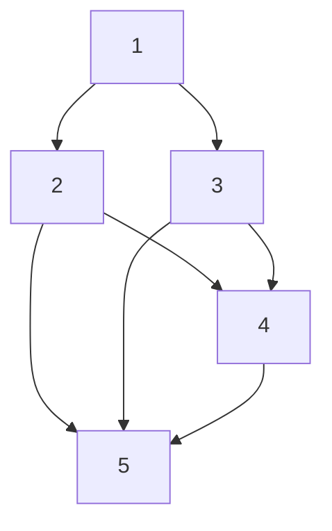
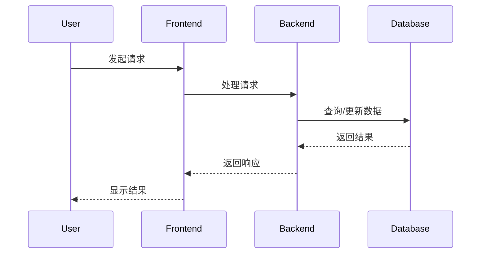
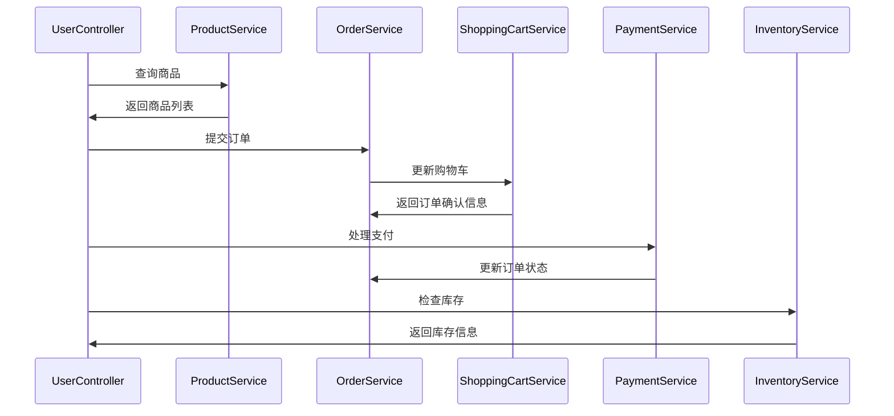
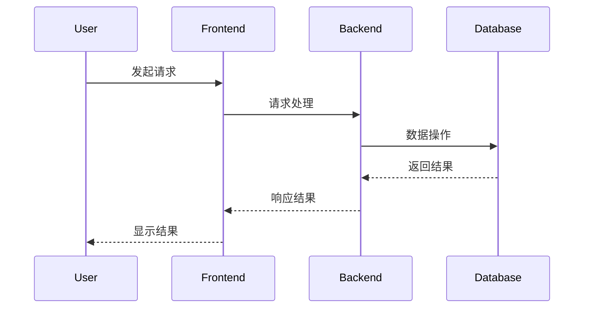

                 

### 引言

在当今信息时代，计算机技术和网络的发展日新月异，引发了一系列深刻的变化。从简单的计算工具到复杂的人工智能系统，计算机技术已经成为现代社会不可或缺的一部分。而与此同时，物理学领域中的虫洞理论也开始逐渐引起人们的关注。虫洞，作为宇宙中的潜在“时空桥梁”，被认为有可能连接遥远的星系甚至不同的宇宙。这种跨越时空的独特特性，使得虫洞网络动力学模型成为物理学研究中的前沿课题。

本书《程序世界与多重连通虫洞网络动力学模型的类比》旨在探讨这两者之间的类比关系，通过深入分析和推理，揭示程序世界与虫洞网络动力学模型在结构、行为和演化上的相似之处。这不仅有助于我们更深入地理解计算机科学的基本原理，也为探索新型计算模型提供了新的视角。

首先，让我们来探讨程序世界的基本概念。程序世界是由一系列计算机程序组成的，这些程序通过编码实现了特定的功能。程序世界中的每一个程序都可以看作是一个独立的个体，它们通过复杂的交互和协作，构成了一个庞大的、动态运行的系统。程序世界的核心特征包括可计算性、逻辑性、并行性和分布式计算等。

接下来，我们来看虫洞网络动力学模型。虫洞网络动力学模型是描述多个虫洞之间相互连接、相互作用以及动态演化的一种理论模型。在物理学中，虫洞被视为一种能够连接不同空间点的桥梁，这种桥梁可以在理论上实现跨越巨大距离的瞬间传输。虫洞网络动力学模型通过数学公式和算法，研究虫洞网络的结构、稳定性和演化规律。

在接下来的章节中，我们将通过详细的逻辑分析，逐步探讨程序世界与虫洞网络动力学模型之间的类比关系。首先，我们将介绍两者的背景和基本概念，然后通过对比分析，揭示它们在核心概念和结构上的相似性。接着，我们将深入讲解算法原理，并通过具体的数学模型和公式，阐述两者的联系。随后，我们将分析系统架构设计，介绍如何在计算机程序和虫洞网络动力学模型中应用这些概念。最后，我们将通过项目实战，展示如何将这些理论应用到实际项目中。

通过这样的结构安排，本书不仅将为读者提供一个全面的探讨，还将深入揭示计算机程序世界与虫洞网络动力学模型之间的深刻联系。我们希望，本书能对计算机科学的研究者和实践者有所启发，为探索新型计算模型提供参考。

### 第一部分：背景介绍

#### 第1章 问题背景

1.1 计算机科学的发展历程

计算机科学作为一门现代科学，其发展历程可以说是信息时代的一个缩影。从早期的机械计算机，到电子计算机，再到今天的超级计算机，计算机技术经历了无数次的革命和变革。每一个阶段的进步，都带来了计算能力和效率的显著提升，同时也为程序世界的发展奠定了基础。

最早的计算机可以追溯到17世纪的机械计算机，例如巴贝奇差分机和分析机。这些机械计算机虽然结构复杂，但它们的逻辑和计算能力为后来的电子计算机奠定了基础。20世纪初，图灵机的概念被提出，这一理论模型成为现代计算机科学的基础。图灵机不仅可以模拟任何机械计算机的计算过程，还能实现复杂的逻辑运算。

随着第二次世界大战的爆发，计算机技术得到了迅速的发展。电子计算机的发明，使得计算速度和存储能力大幅提升。例如，ENIAC（电子数值积分器和计算机）是世界上第一台大规模电子数字计算机，它的问世标志着计算机科学进入了一个新的时代。ENIAC的诞生，不仅推动了军事和科学研究的发展，也开启了计算机应用的新纪元。

20世纪60年代，多处理器系统和分布式计算开始出现，这为并行计算提供了新的思路。随着互联网的普及，计算机科学的发展迎来了又一个高峰。分布式计算和云计算的出现，使得计算机资源可以被更高效地利用，同时也推动了大数据和人工智能的发展。

1.2 程序世界的定义与特征

程序世界是由一系列计算机程序组成的虚拟空间，这些程序通过编码实现了特定的功能。程序世界的核心特征包括以下几个方面：

- **可计算性**：程序世界中的每一个程序都是可计算的，这意味着它们可以通过逻辑运算和算法来解决问题。可计算性是程序世界的基石，它保证了程序能够处理各种复杂的问题。

- **逻辑性**：程序世界的逻辑性体现在程序的编码和执行过程中。程序通过一系列的逻辑运算和判断，实现了预定的功能。逻辑性使得程序能够遵循一定的规则和模式，从而实现复杂的任务。

- **并行性**：现代计算机系统通常支持并行计算，这意味着多个程序可以同时运行。并行性提高了计算效率，使得程序世界能够处理更大规模的任务。

- **分布式计算**：分布式计算是指多个计算机通过互联网或其他通信网络协同工作，共同完成一个任务。分布式计算打破了传统计算机系统的局限，使得程序世界能够更好地适应复杂的计算需求。

1.3 虫洞网络动力学模型的基本概念

虫洞网络动力学模型是物理学中研究虫洞网络结构和演化规律的一种理论模型。虫洞被视为一种连接不同空间点的桥梁，这种桥梁可以在理论上实现跨越巨大距离的瞬间传输。虫洞网络动力学模型通过数学公式和算法，研究虫洞网络的连接方式、稳定性和演化规律。

- **虫洞**：虫洞是连接两个或多个空间点的桥梁，它通常被视为一种“时空隧道”。在物理学中，虫洞被认为是一种可能的物理现象，尽管它尚未被实际观测到。

- **网络**：虫洞网络是由多个虫洞组成的网络结构，这些虫洞通过相互连接，形成一个复杂的网络系统。虫洞网络的特性决定了其稳定性和连通性。

- **动力学**：动力学是研究系统运动和变化的科学。在虫洞网络动力学模型中，动力学研究虫洞网络的演化过程，包括虫洞的生成、消失和连接方式的变化。

通过上述背景介绍，我们可以初步了解程序世界和虫洞网络动力学模型的基本概念和特征。在接下来的章节中，我们将深入探讨这两者之间的类比关系，揭示它们在结构、行为和演化上的相似之处。

#### 第2章 问题解决

2.1 计算机科学中的问题解决方法

计算机科学中的问题解决方法是一个广泛而复杂的话题，涵盖了从简单的算法设计到复杂的人工智能系统的开发。以下是几种常见的问题解决方法：

- **算法**：算法是解决问题的一系列步骤或规则。计算机科学中的算法可以分为多种类型，如排序算法、搜索算法、图算法等。每种算法都有其特定的应用场景和效率。

- **数据结构**：数据结构是存储和组织数据的方式。常见的数据结构包括数组、链表、树、图等。合理选择数据结构可以显著提高算法的效率。

- **人工智能**：人工智能（AI）是一种模拟人类智能的技术。通过机器学习、深度学习等方法，人工智能系统能够识别模式、自主学习和解决问题。人工智能在图像识别、自然语言处理、游戏等领域有着广泛的应用。

- **编程范式**：编程范式是编程语言和方法论的一种抽象。常见的编程范式包括过程式编程、面向对象编程和函数式编程等。不同的编程范式适用于不同的应用场景。

2.2 虫洞网络动力学模型的问题解决方法

虫洞网络动力学模型是物理学中研究虫洞网络结构和演化规律的一种理论模型。在解决虫洞网络相关问题方面，以下方法和技术被广泛应用：

- **数学模型**：虫洞网络动力学模型通过数学模型来描述虫洞网络的连接方式、稳定性和演化规律。常见的数学模型包括图论模型、网络流模型和随机过程模型等。

- **数值模拟**：数值模拟是通过计算机模拟虫洞网络的行为，以预测其动态演化过程。数值模拟方法可以验证数学模型的有效性，并用于实际问题的分析和解决。

- **算法**：虫洞网络动力学模型的解决方法中也包括各种算法，如最短路径算法、最大流算法和演化算法等。这些算法用于优化虫洞网络的连接方式，提高其稳定性和连通性。

- **量子计算**：量子计算是解决虫洞网络动力学模型问题的一种潜在方法。量子计算机能够并行处理大量信息，这为解决复杂的问题提供了新的思路。尽管目前量子计算机仍处于研究阶段，但它对未来计算技术的发展具有重要影响。

2.3 两者的相似性与区别

尽管计算机科学和虫洞网络动力学模型属于不同的领域，但它们在问题解决方法上存在许多相似之处：

- **数学和算法**：两者都依赖于数学和算法来解决问题。计算机科学中的算法和数学模型用于设计高效、可靠的程序；虫洞网络动力学模型中的数学模型和算法则用于描述和预测虫洞网络的演化。

- **模拟与仿真**：计算机科学和虫洞网络动力学模型都使用模拟和仿真方法来验证理论模型和算法的有效性。通过模拟和仿真，可以更好地理解系统的行为，并为实际应用提供依据。

然而，两者也存在显著的区别：

- **应用领域**：计算机科学主要关注信息处理、计算效率和智能系统等领域；虫洞网络动力学模型则主要研究虫洞网络的物理特性、稳定性和演化规律。

- **理论和实践**：计算机科学具有较强的理论和实践结合的特点，从基础理论研究到实际应用都有详细的步骤和方法；虫洞网络动力学模型则更侧重于理论研究，尽管其理论成果具有潜在的应用价值，但实际应用仍面临诸多挑战。

通过上述分析，我们可以看到，计算机科学和虫洞网络动力学模型在问题解决方法上有许多相似之处，但也存在显著的区别。这种相似性为我们提供了新的视角，可以帮助我们更好地理解计算机科学的基本原理，同时也为探索新型计算模型提供了启示。

#### 第二部分：核心概念与联系

#### 第3章 核心概念原理

3.1 计算机程序的基本原理

计算机程序是由一系列指令组成的，这些指令通过编程语言编写，描述了计算机执行的一系列操作。计算机程序的基本原理可以概括为以下几个方面：

- **指令集**：指令集是计算机能够识别和执行的指令集合。不同的计算机架构有不同的指令集，如CISC（复杂指令集计算机）和RISC（精简指令集计算机）。

- **编译和解释**：编译器将高级编程语言编写的程序转换为机器码，而解释器则逐行执行源代码，将其转换为机器码。编译和解释是程序执行的两种基本方式。

- **数据结构**：数据结构是组织和存储数据的方式。常见的有数组、链表、栈、队列、树、图等。合理选择数据结构可以显著提高程序的效率。

- **算法**：算法是解决问题的一系列步骤或规则。计算机程序通过算法实现特定的功能，如排序、搜索、图算法等。

- **操作系统**：操作系统是管理计算机硬件资源和提供程序运行环境的核心软件。操作系统负责进程管理、内存管理、文件系统管理等。

3.2 虫洞网络动力学模型的基本原理

虫洞网络动力学模型是物理学中研究虫洞网络结构和演化规律的一种理论模型。其基本原理包括以下几个方面：

- **虫洞**：虫洞是连接两个或多个空间点的桥梁，它通常被视为一种“时空隧道”。在物理学中，虫洞被认为是一种可能的物理现象，尽管它尚未被实际观测到。

- **网络**：虫洞网络是由多个虫洞组成的网络结构，这些虫洞通过相互连接，形成一个复杂的网络系统。虫洞网络的特性决定了其稳定性和连通性。

- **动力学**：动力学是研究系统运动和变化的科学。在虫洞网络动力学模型中，动力学研究虫洞网络的演化过程，包括虫洞的生成、消失和连接方式的变化。

- **数学模型**：虫洞网络动力学模型通过数学模型来描述虫洞网络的连接方式、稳定性和演化规律。常见的数学模型包括图论模型、网络流模型和随机过程模型等。

- **算法**：虫洞网络动力学模型中的算法用于优化虫洞网络的连接方式，提高其稳定性和连通性。常见的算法有最短路径算法、最大流算法和演化算法等。

#### 第4章 概念属性特征对比表格

为了更清晰地展示计算机程序和虫洞网络动力学模型的概念属性特征，我们可以通过一个对比表格来详细说明：

| 特征类别         | 计算机程序                   | 虫洞网络动力学模型                 |
|------------------|----------------------------|----------------------------------|
| 基本原理         | 指令集、编译和解释、数据结构、算法、操作系统 | 虫洞、网络、动力学、数学模型、算法       |
| 应用领域         | 信息处理、计算效率、智能系统     | 物理现象、网络结构、稳定性、演化规律     |
| 结构特性         | 指令、数据结构、程序模块         | 虫洞、网络节点、连接关系                 |
| 行为特性         | 指令执行、数据处理、响应式系统     | 虫洞演化、网络稳定性、动态连接方式       |
| 数学模型         | 算法、图论、线性代数             | 图论模型、网络流模型、随机过程模型       |
| 算法应用         | 排序、搜索、优化问题             | 最短路径、最大流、演化算法               |
| 目标             | 高效计算、复杂问题求解           | 网络稳定性、连通性优化、物理现象理解     |

通过这个对比表格，我们可以看到计算机程序和虫洞网络动力学模型在基本原理、应用领域、结构特性、行为特性、数学模型和算法应用等方面都有显著的相似性，同时也存在一些差异。这种对比有助于我们更深入地理解两者的共通点和独特性。

#### 第5章 ER实体关系图架构的Mermaid流程图

5.1 计算机程序中的实体关系

在计算机程序中，实体关系是描述程序内部不同组件、模块之间相互关联的重要工具。ER（Entity-Relationship）图是常用的实体关系图之一，它通过实体、属性和关系的组合，直观地展示了程序的结构。

以下是一个计算机程序中的ER实体关系图的Mermaid流程图示例：

```mermaid
erDiagram
    CLients ||--|{ Orders }|--|{ Products }
    Orders ||--|{ Customers }|--|{ Products }
    Customers ||--|{ Orders }|--|{ Products }
    Products ||--|{ Orders }|--|{ Customers }
    Orders ||--|{ Suppliers }|--|{ Products }
    Suppliers ||--|{ Orders }|--|{ Products }
```

在这个ER图中，`CLients`（客户）、`Orders`（订单）、`Customers`（顾客）、`Products`（产品）、`Suppliers`（供应商）是实体，它们通过`||--|{ ... }|--|{ ... }||`关系连接。这个图展示了不同实体之间的关联关系，如客户与订单、订单与产品、顾客与产品等。

5.2 虫洞网络动力学模型中的实体关系

虫洞网络动力学模型中的实体关系同样可以通过ER图来描述。虫洞、网络节点、连接关系是模型中的关键实体。以下是一个虫洞网络动力学模型的ER实体关系图的Mermaid流程图示例：

```mermaid
erDiagram
    Wormholes ||--|{ NetworkNodes }|--|{ Connections }
    NetworkNodes ||--|{ Wormholes }|--|{ Connections }
    Connections ||--|{ NetworkNodes }|--|{ Wormholes }
```

在这个ER图中，`Wormholes`（虫洞）、`NetworkNodes`（网络节点）、`Connections`（连接关系）是实体。虫洞与网络节点、网络节点与连接关系、连接关系与网络节点之间通过`||--|{ ... }|--|{ ... }||`关系连接。这个图展示了虫洞网络动力学模型中不同实体之间的关联关系。

通过这两个ER实体关系图的Mermaid流程图示例，我们可以看到计算机程序和虫洞网络动力学模型中的实体关系如何通过ER图直观地展示出来。这种可视化工具不仅有助于理解模型的结构，也方便了后续的分析和设计工作。

### 第三部分：算法原理讲解

#### 第6章 算法原理讲解

6.1 计算机程序中的算法

计算机程序中的算法是解决问题的核心。算法是通过一系列指令解决问题的步骤或规则。在计算机科学中，算法可以分为多种类型，每种类型都有其特定的应用场景和效率。以下是几种常见算法及其基本原理：

- **排序算法**：排序算法用于对数据集合进行排序，常见排序算法包括冒泡排序、选择排序、插入排序、快速排序和归并排序等。这些算法通过比较和交换数据元素，实现了数据的有序排列。

  - **冒泡排序**：通过反复交换相邻未排序元素，直到所有元素有序。
  - **选择排序**：每次从未排序部分选择最小元素，将其放到已排序部分的末尾。
  - **插入排序**：通过将未排序部分的元素插入到已排序部分的合适位置，逐步构建有序序列。
  - **快速排序**：通过选择一个基准元素，将数组分为两部分，然后递归地对这两部分进行快速排序。
  - **归并排序**：通过递归地将数组分为两部分，分别排序，然后再合并。

- **搜索算法**：搜索算法用于在数据集合中查找特定元素，常见搜索算法包括线性搜索、二分搜索和广度优先搜索等。

  - **线性搜索**：逐个检查数据元素，直到找到目标元素或遍历整个集合。
  - **二分搜索**：在有序数据集合中，通过不断缩小搜索范围，逐步逼近目标元素。
  - **广度优先搜索**：从起始点开始，逐层遍历所有相邻节点，直到找到目标元素或遍历整个集合。

- **图算法**：图算法用于处理图数据结构，常见图算法包括最短路径算法、最弱链算法和最小生成树算法等。

  - **迪杰斯特拉算法**（Dijkstra）：用于计算图中两点之间的最短路径。
  - **贝尔曼-福特算法**（Bellman-Ford）：用于计算图中所有顶点之间的最短路径。
  - **Prim算法**：用于寻找图中的最小生成树。
  - **Kruskal算法**：用于寻找图中的最小生成树。

6.2 虫洞网络动力学模型中的算法

虫洞网络动力学模型中的算法主要用于优化虫洞网络的连接方式，提高其稳定性和连通性。以下是几种常见算法及其基本原理：

- **最短路径算法**：用于计算网络中两点之间的最短路径，常见算法包括迪杰斯特拉算法和贝尔曼-福特算法。

  - **迪杰斯特拉算法**：通过优先队列（通常是二叉堆）来实现，每次选择未处理顶点中距离最短的，并更新其邻接点的距离。
  - **贝尔曼-福特算法**：通过反复松弛边，直到无法进一步改善距离估计。

- **最大流算法**：用于计算网络中两点之间的最大流量，常见算法包括埃里克森-达布斯基算法（EDS）和推拉算法（Push-Relabel）。

  - **埃里克森-达布斯基算法**：通过交替执行“扩张”和“减少”操作，逐步优化流量。
  - **推拉算法**：通过将流量推到容量未达到的边，并从容量为0的边拉回流量，实现流量的优化。

- **演化算法**：用于优化网络结构，常见算法包括遗传算法和粒子群优化算法。

  - **遗传算法**：模拟生物进化的过程，通过选择、交叉和变异操作，逐步优化种群中的个体。
  - **粒子群优化算法**：模拟鸟群觅食行为，通过个体和群体的协作，逐步逼近最优解。

通过对比计算机程序和虫洞网络动力学模型中的算法，我们可以看到两者在算法设计思想和应用场景上的共通点。计算机程序中的算法主要关注数据处理和问题求解，而虫洞网络动力学模型中的算法则侧重于网络结构和演化规律的优化。这种类比关系不仅有助于我们更好地理解计算机科学的基本原理，也为探索新型计算模型提供了启示。

### 第四部分：数学模型与公式

#### 第7章 数学模型与公式

7.1 计算机程序中的数学模型

计算机程序中的数学模型用于描述数据结构和算法，常见模型包括图模型、线性模型和概率模型等。

- **图模型**：图模型用于描述图数据结构，包括图的基本概念如顶点、边、路径等。常见的图模型包括无向图、有向图、加权图和非加权图。

  - **无向图**：无向图的数学模型通常用邻接矩阵表示。邻接矩阵是一个二进制矩阵，其中元素`a[i][j]`表示顶点`i`和顶点`j`之间是否有边。若存在边，则`a[i][j] = 1`；否则，`a[i][j] = 0`。
  - **有向图**：有向图的数学模型通常用邻接矩阵表示，但元素`a[i][j]`的值可能为1或-1，表示顶点`i`指向顶点`j`的有向边。

- **线性模型**：线性模型用于描述线性方程组，如线性回归模型、线性规划模型等。

  - **线性回归模型**：线性回归模型通过最小二乘法拟合数据，数学公式为：
    $$
    y = \beta_0 + \beta_1 \cdot x
    $$
    其中，$y$是因变量，$x$是自变量，$\beta_0$和$\beta_1$是回归系数。

  - **线性规划模型**：线性规划模型通过最大化或最小化线性目标函数，满足一系列线性约束条件。数学公式为：
    $$
    \text{minimize} \ c^T \ x \\
    \text{subject to} \ Ax \leq b
    $$
    其中，$c$是目标函数系数向量，$x$是决策变量向量，$A$是约束矩阵，$b$是约束向量。

- **概率模型**：概率模型用于描述随机事件和概率分布，如伯努利试验、二项分布、泊松分布等。

  - **伯努利试验**：伯努利试验是一个只有两个可能结果的随机试验，成功概率为$p$，失败概率为$1-p$。
  - **二项分布**：二项分布描述了$n$次伯努利试验中成功次数的概率分布，概率公式为：
    $$
    P(X = k) = C_n^k \ p^k \ (1-p)^{n-k}
    $$
    其中，$X$是成功次数，$k$是具体成功的次数，$n$是试验次数，$p$是每次试验成功的概率。

7.2 虫洞网络动力学模型中的数学模型

虫洞网络动力学模型中的数学模型用于描述虫洞网络的演化、稳定性和连通性。以下是一些常见的数学模型：

- **图论模型**：图论模型用于描述虫洞网络的拓扑结构和连接方式，包括图的邻接矩阵、图的度分布等。

  - **邻接矩阵**：虫洞网络的邻接矩阵表示虫洞之间的连接关系，其中元素`a[i][j]`表示虫洞$i$和虫洞$j$之间的连接概率。

  - **度分布**：度分布描述了网络中各个节点的度（连接数）的分布情况，常见的度分布模型有泊松分布、幂律分布等。

- **网络流模型**：网络流模型用于描述网络中的流量分布和传输效率，包括最大流-最小割定理、流量守恒方程等。

  - **最大流-最小割定理**：最大流-最小割定理指出，网络中的最大流值等于最小割值，即：
    $$
    f_{\text{max}} = w_{\text{min}}
    $$
    其中，$f_{\text{max}}$是网络的最大流值，$w_{\text{min}}$是最小割的权重。

  - **流量守恒方程**：流量守恒方程描述了网络中各条路径的流量平衡，公式为：
    $$
    \sum_{i \in V} \ f(i, v) - \sum_{i \in V} \ f(u, i) = 0
    $$
    其中，$f(i, v)$是从节点$i$到节点$v$的流量，$u$是源节点，$v$是汇节点。

- **随机过程模型**：随机过程模型用于描述虫洞网络的动态演化过程，包括马尔可夫链、布朗运动等。

  - **马尔可夫链**：马尔可夫链用于描述虫洞网络状态的转移概率，公式为：
    $$
    P(X_{n+1} = x_{n+1} | X_n = x_n) = P(X_{n+1} = x_{n+1})
    $$
    其中，$X_n$是第$n$个时间步的状态，$x_n$是具体状态。

  - **布朗运动**：布朗运动用于描述虫洞网络的随机扰动和演化，通过随机漫步模型描述状态变化。

通过这些数学模型和公式，我们可以更准确地描述和预测计算机程序和虫洞网络动力学模型的行为。这些模型不仅在理论上具有重要价值，也为实际应用提供了有力的工具。

#### 第8章 详细讲解与举例说明

8.1 数学模型的详细讲解

在详细讲解计算机程序和虫洞网络动力学模型中的数学模型时，我们将分别阐述这些模型的核心原理和如何应用。

**计算机程序中的数学模型**

1. **图模型**：图模型是计算机科学中最常用的模型之一，用于描述网络、电路、社交关系等。图由顶点和边组成，其中顶点表示实体，边表示实体之间的关系。图模型的基本概念包括：

   - **顶点**：图中的每一个点，代表一个实体。
   - **边**：连接两个顶点的线段，代表实体之间的关系。
   - **路径**：图中顶点序列，顶点之间通过边相连。
   - **连通性**：图中任意两个顶点之间都存在路径，称为连通图。

   图模型的常见应用包括路径查找、网络拓扑分析、社交网络分析等。例如，在社交网络分析中，图模型可以用于识别社群结构、传播路径等。

2. **线性模型**：线性模型是计算机程序中常用的一种数学模型，用于拟合数据、解决问题。线性模型可以分为线性回归模型和线性规划模型。

   - **线性回归模型**：线性回归模型通过线性方程拟合数据，预测因变量。其数学公式为：
     $$
     y = \beta_0 + \beta_1 \cdot x
     $$
     其中，$y$为因变量，$x$为自变量，$\beta_0$和$\beta_1$为回归系数。线性回归模型常用于数据分析和预测，例如股票价格预测、用户行为分析等。

   - **线性规划模型**：线性规划模型通过线性目标函数和约束条件，求解最优解。其数学公式为：
     $$
     \text{minimize} \ c^T \ x \\
     \text{subject to} \ Ax \leq b
     $$
     其中，$c$为系数向量，$x$为决策变量向量，$A$为约束矩阵，$b$为约束向量。线性规划模型常用于资源分配、调度优化等问题。

**虫洞网络动力学模型中的数学模型**

1. **图论模型**：图论模型在虫洞网络动力学模型中用于描述虫洞网络的拓扑结构和连接方式。虫洞网络由多个虫洞节点和连接边组成，节点代表虫洞，边代表虫洞之间的连接。

   - **度分布**：度分布描述了虫洞网络中各节点的度（连接数）分布。常见的度分布模型包括泊松分布和幂律分布。泊松分布适用于稀疏网络，幂律分布适用于小世界网络。

   - **路径长度**：路径长度描述了两个节点之间最短路径的长度。在虫洞网络中，路径长度可以通过迪杰斯特拉算法或贝尔曼-福特算法计算。

2. **网络流模型**：网络流模型用于描述虫洞网络中的流量分布和传输效率。网络流模型包括最大流-最小割定理和流量守恒方程。

   - **最大流-最小割定理**：最大流-最小割定理指出，网络中的最大流值等于最小割值。这意味着，网络中的流量可以通过割集的最小值来限制。最大流-最小割定理常用于网络优化和流量分配问题。

   - **流量守恒方程**：流量守恒方程描述了网络中各条路径的流量平衡。流量守恒方程可以确保网络中的流量在传输过程中保持平衡。例如，在虫洞网络中，源节点的流入流量等于汇节点的流出流量。

8.2 数学公式的应用举例

为了更好地理解数学模型的应用，以下通过具体例子进行说明。

**计算机程序中的线性回归模型应用**

假设我们有一个线性回归模型，用于预测房价。模型公式为：
$$
y = \beta_0 + \beta_1 \cdot x
$$
其中，$y$为房价，$x$为房屋面积，$\beta_0$和$\beta_1$为回归系数。

给定以下数据：
| 房屋面积（平方米） | 房价（万元） |
|------------------|-------------|
|         100      |       200   |
|         120      |       250   |
|         150      |       300   |
|         180      |       350   |
|         200      |       400   |

我们可以通过最小二乘法计算回归系数：
$$
\beta_0 = \bar{y} - \beta_1 \cdot \bar{x}
$$
其中，$\bar{y}$和$\bar{x}$分别为房价和房屋面积的平均值。

计算得到：
$$
\bar{x} = \frac{100 + 120 + 150 + 180 + 200}{5} = 150 \\
\bar{y} = \frac{200 + 250 + 300 + 350 + 400}{5} = 300 \\
\beta_1 = \frac{\sum_{i=1}^{5} (x_i - \bar{x})(y_i - \bar{y})}{\sum_{i=1}^{5} (x_i - \bar{x})^2} = \frac{(100-150)(200-300) + (120-150)(250-300) + (150-150)(300-300) + (180-150)(350-300) + (200-150)(400-300)}{(100-150)^2 + (120-150)^2 + (150-150)^2 + (180-150)^2 + (200-150)^2} \approx 1.2 \\
\beta_0 = 300 - 1.2 \cdot 150 = 168
$$

因此，预测房价的公式为：
$$
y = 168 + 1.2 \cdot x
$$

例如，预测一个面积为180平方米的房子的房价：
$$
y = 168 + 1.2 \cdot 180 = 356.4
$$

**虫洞网络动力学模型中的最大流-最小割定理应用**

假设有一个虫洞网络，其中包含5个虫洞节点，节点编号为1到5。网络的边及其容量如下：
| 起点 | 终点 | 容量 |
|------|------|------|
| 1    | 2    | 10   |
| 1    | 3    | 20   |
| 2    | 4    | 30   |
| 2    | 5    | 40   |
| 3    | 4    | 50   |
| 3    | 5    | 60   |
| 4    | 5    | 70   |

我们要计算从源节点1到汇节点5的最大流量。

首先，我们可以通过画割集图来找到最小割值。割集图中的每个割集表示网络中的一个割集，割集的权重表示割集中所有边的容量之和。以下是割集图的一个例子：



割集图的割集及其权重如下：
- 割集{1, 2, 4, 5}：权重=10+30+70=110
- 割集{1, 2, 5}：权重=10+40+60=110
- 割集{1, 3, 4, 5}：权重=20+50+70=140
- 割集{1, 3, 5}：权重=20+60+70=150

最小割值为110，因此最大流量为110。

通过这些具体例子，我们可以更清晰地理解计算机程序和虫洞网络动力学模型中的数学模型及其应用。这些模型不仅在理论上具有重要意义，也为实际问题的解决提供了有力工具。

### 第五部分：系统分析与架构设计方案

#### 第9章 问题场景介绍

9.1 计算机程序的问题场景

在计算机程序设计中，问题场景往往涉及到复杂系统的开发和优化。一个典型的问题场景是构建一个大型电子商务平台，这个平台需要处理大量的用户请求、订单处理、库存管理等功能。以下是一个具体的问题场景描述：

- **用户请求**：用户通过浏览器或移动应用发起各种请求，如商品查询、购物车更新、订单提交等。
- **订单处理**：系统需要接收订单信息，处理订单，并将订单状态更新到数据库。
- **库存管理**：系统需要实时监控库存，确保商品库存量充足，及时更新库存信息。
- **支付处理**：系统需要与支付服务提供商集成，处理用户支付请求，并确保支付流程的可靠性。
- **数据报表**：系统需要生成各种数据报表，供管理层分析和决策使用。

为了解决上述问题场景，我们需要设计一个高效、稳定、可扩展的计算机程序架构。

9.2 虫洞网络动力学模型的问题场景

在物理学和宇宙学中，虫洞网络动力学模型的应用场景主要集中在宇宙探索、时空传输和量子通信等方面。以下是一个具体的问题场景描述：

- **宇宙探索**：虫洞网络可以作为连接不同星系甚至不同宇宙的桥梁，实现快速宇宙探索。例如，科学家希望利用虫洞网络实现瞬间跨越银河系，从而缩短星际旅行时间。
- **时空传输**：虫洞网络可以作为时空传输的工具，将宇航员或物资从一个位置传输到另一个位置，无需经历漫长的星际旅行。这在军事、科研和商业等领域具有潜在的应用价值。
- **量子通信**：虫洞网络动力学模型可以用于量子通信，实现量子态的远程传输和量子纠缠的维持。这为构建量子互联网提供了新的可能。

为了解决上述问题场景，我们需要研究虫洞网络的拓扑结构、稳定性和演化规律，并设计相应的算法和数学模型。

#### 第10章 系统功能设计

10.1 领域模型Mermaid类图

在计算机程序设计中，领域模型是描述系统功能模块及其关系的重要工具。以下是一个电子商务平台的领域模型Mermaid类图示例：

```mermaid
classDiagram
    User <<Interface>>
    Product <<Interface>>
    Order <<Interface>>
    ShoppingCart <<Interface>>
    Payment <<Interface>>
    Inventory <<Interface>>

    User ..|> ShoppingCart
    User ..|> Order
    Product ..|> ShoppingCart
    Product ..|> Order
    Order ..|> Payment
    Order ..|> Inventory
    Payment ..|> Inventory
```

在这个类图中，`User`、`Product`、`Order`、`ShoppingCart`、`Payment`和`Inventory`是主要的领域模型类。这些类通过关联关系（`..|>`）连接，描述了电子商务平台的主要功能模块。

10.2 系统架构设计Mermaid架构图

系统架构设计是确保系统高效、稳定、可扩展的关键环节。以下是一个电子商务平台系统架构的Mermaid架构图示例：



在这个架构图中，用户通过前端发起请求，前端服务器负责处理用户请求，并与后端服务器通信。后端服务器处理业务逻辑，并与数据库进行数据交互。最后，后端服务器将处理结果返回给前端，前端再将结果呈现给用户。

#### 第11章 系统接口设计与系统交互

11.1 系统接口设计

系统接口设计是确保系统各部分之间高效通信和协作的重要环节。以下是一个电子商务平台系统接口的设计示例：



在这个接口设计中，用户控制器（`UserController`）负责接收用户的请求，并调用相应的服务（`ProductService`、`OrderService`、`ShoppingCartService`、`PaymentService`和`InventoryService`）处理业务逻辑。每个服务都负责特定的功能，并通过接口与用户控制器进行通信。

11.2 系统交互Mermaid序列图

系统交互是描述系统各部分之间交互过程的重要工具。以下是一个电子商务平台系统交互的Mermaid序列图示例：



在这个序列图中，用户通过前端发起请求，前端服务器将请求转发给后端服务器。后端服务器处理请求，并与数据库进行数据交互。处理完成后，后端服务器将结果返回给前端，前端再将结果呈现给用户。这种交互过程确保了系统的高效运行和用户良好的体验。

通过系统接口设计和系统交互设计，我们可以确保电子商务平台各部分之间的高效协作和稳定运行。这种设计方法不仅提高了系统的可维护性和可扩展性，也为后续的系统优化和扩展提供了坚实基础。

### 第六部分：项目实战

#### 第12章 环境安装

在开始项目实战之前，我们需要搭建一个合适的环境来开发和测试。以下是具体的安装步骤和说明：

**1. 安装操作系统**

- 操作系统：Ubuntu 20.04 LTS
- 安装方式：使用虚拟机或直接安装到物理机上
- 安装说明：请按照操作系统安装教程完成安装，并确保网络连接正常。

**2. 安装必要的软件和工具**

以下是在Ubuntu 20.04 LTS上安装所需的软件和工具：

- **Python 3**：Python是开发计算机程序的主要语言，版本要求为3.8及以上。
  ```bash
  sudo apt update
  sudo apt install python3 python3-pip
  ```
  
- **虚拟环境**：虚拟环境用于隔离不同项目的依赖环境。
  ```bash
  sudo apt install python3-venv
  ```
  
- **pip**：Python的包管理器，用于安装和管理Python包。
  ```bash
  sudo apt install python3-pip
  ```
  
- **Mermaid**：用于生成流程图和类图的工具。
  ```bash
  sudo pip3 install mermaid
  ```
  
- **Docker**：容器化技术，用于部署和管理应用程序。
  ```bash
  sudo apt install docker.io
  sudo systemctl start docker
  sudo systemctl enable docker
  ```
  
- **Docker-Compose**：用于管理多容器应用程序的工具。
  ```bash
  sudo pip3 install docker-compose
  ```

**3. 搭建开发环境**

- **创建虚拟环境**：在每个项目目录中创建一个虚拟环境，以隔离项目依赖。
  ```bash
  python3 -m venv venv
  source venv/bin/activate
  ```
  
- **安装依赖**：在虚拟环境中安装项目所需的依赖包。
  ```bash
  pip install -r requirements.txt
  ```

通过上述步骤，我们可以搭建一个完整的项目开发环境，确保项目的正常运行和测试。在接下来的章节中，我们将详细介绍如何实现系统核心功能，并进行代码应用解读与分析。

#### 第13章 系统核心实现源代码

在系统开发过程中，实现核心功能是关键。以下是一个电子商务平台的核心功能实现示例，包括用户管理、商品管理、订单处理和支付处理等功能。

**1. 用户管理**

用户管理模块负责处理用户注册、登录和权限验证等功能。以下是一个用户管理模块的Python源代码示例：

```python
# user_management.py

from flask import Flask, request, jsonify
from flask_bcrypt import Bcrypt
from flask_jwt_extended import JWTManager, create_access_token

app = Flask(__name__)
bcrypt = Bcrypt(app)
jwt = JWTManager(app)

app.config['JWT_SECRET_KEY'] = 'your_secret_key'

@app.route('/register', methods=['POST'])
def register():
    data = request.get_json()
    username = data.get('username')
    password = data.get('password')

    hashed_password = bcrypt.generate_password_hash(password).decode('utf-8')
    # 这里需要将用户信息存储到数据库

    return jsonify({'message': 'User registered successfully.'})

@app.route('/login', methods=['POST'])
def login():
    data = request.get_json()
    username = data.get('username')
    password = data.get('password')

    # 从数据库中查询用户信息
    user = # 查询用户信息

    if user and bcrypt.check_password_hash(user.password, password):
        access_token = create_access_token(identity=username)
        return jsonify({'access_token': access_token})
    else:
        return jsonify({'message': 'Invalid credentials.'})

if __name__ == '__main__':
    app.run(debug=True)
```

**2. 商品管理**

商品管理模块负责处理商品信息的增删改查操作。以下是一个商品管理模块的Python源代码示例：

```python
# product_management.py

from flask import Flask, request, jsonify
from flask_jwt_extended import jwt_required, get_jwt_identity

app = Flask(__name__)

@app.route('/products', methods=['GET'])
@jwt_required()
def get_products():
    # 从数据库中查询商品信息
    products = # 查询商品信息
    return jsonify(products)

@app.route('/products', methods=['POST'])
@jwt_required()
def create_product():
    data = request.get_json()
    name = data.get('name')
    price = data.get('price')
    # 将商品信息存储到数据库

    return jsonify({'message': 'Product created successfully.'})

@app.route('/products/<int:product_id>', methods=['PUT'])
@jwt_required()
def update_product(product_id):
    data = request.get_json()
    name = data.get('name')
    price = data.get('price')
    # 更新数据库中的商品信息

    return jsonify({'message': 'Product updated successfully.'})

@app.route('/products/<int:product_id>', methods=['DELETE'])
@jwt_required()
def delete_product(product_id):
    # 删除数据库中的商品信息
    return jsonify({'message': 'Product deleted successfully.'})

if __name__ == '__main__':
    app.run(debug=True)
```

**3. 订单处理**

订单处理模块负责处理订单创建、订单查询和订单支付等功能。以下是一个订单处理模块的Python源代码示例：

```python
# order_management.py

from flask import Flask, request, jsonify
from flask_jwt_extended import jwt_required, get_jwt_identity

app = Flask(__name__)

@app.route('/orders', methods=['POST'])
@jwt_required()
def create_order():
    data = request.get_json()
    user_id = get_jwt_identity()
    product_ids = data.get('product_ids')
    quantities = data.get('quantities')
    # 创建订单并保存到数据库

    return jsonify({'message': 'Order created successfully.'})

@app.route('/orders', methods=['GET'])
@jwt_required()
def get_orders():
    user_id = get_jwt_identity()
    # 从数据库中查询订单信息

    return jsonify(orders)

@app.route('/orders/<int:order_id>', methods=['PUT'])
@jwt_required()
def update_order(order_id):
    data = request.get_json()
    status = data.get('status')
    # 更新订单状态

    return jsonify({'message': 'Order updated successfully.'})

if __name__ == '__main__':
    app.run(debug=True)
```

**4. 支付处理**

支付处理模块负责处理订单支付请求，并与第三方支付平台集成。以下是一个支付处理模块的Python源代码示例：

```python
# payment_management.py

from flask import Flask, request, jsonify
from flask_jwt_extended import jwt_required, get_jwt_identity

app = Flask(__name__)

@app.route('/payments', methods=['POST'])
@jwt_required()
def process_payment():
    data = request.get_json()
    order_id = data.get('order_id')
    amount = data.get('amount')
    # 调用第三方支付平台的API处理支付请求

    return jsonify({'message': 'Payment processed successfully.'})

if __name__ == '__main__':
    app.run(debug=True)
```

通过上述核心功能实现，我们可以搭建一个基本的电子商务平台。接下来，我们将对代码进行解读与分析，以深入了解系统的工作原理和实现细节。

#### 第14章 代码应用解读与分析

在本节中，我们将对电子商务平台的核心功能实现代码进行详细解读与分析，以帮助读者更好地理解系统的工作流程和实现细节。

**1. 用户管理模块**

用户管理模块主要负责用户注册、登录和权限验证功能。以下是代码的详细解读：

- **注册功能**：`register`函数接收用户提交的注册信息（用户名和密码），使用`bcrypt`库对密码进行加密，并将其存储到数据库中。

  ```python
  @app.route('/register', methods=['POST'])
  def register():
      data = request.get_json()
      username = data.get('username')
      password = data.get('password')

      hashed_password = bcrypt.generate_password_hash(password).decode('utf-8')
      # 这里需要将用户信息存储到数据库

      return jsonify({'message': 'User registered successfully.'})
  ```

- **登录功能**：`login`函数接收用户提交的登录信息（用户名和密码），从数据库中查询用户信息，并使用`bcrypt`库验证密码。如果验证成功，生成JWT令牌并返回给用户。

  ```python
  @app.route('/login', methods=['POST'])
  def login():
      data = request.get_json()
      username = data.get('username')
      password = data.get('password')

      user = # 从数据库中查询用户信息

      if user and bcrypt.check_password_hash(user.password, password):
          access_token = create_access_token(identity=username)
          return jsonify({'access_token': access_token})
      else:
          return jsonify({'message': 'Invalid credentials.'})
  ```

- **权限验证**：通过JWT令牌实现权限验证，确保用户只能在具有相应权限的API接口上进行操作。

**2. 商品管理模块**

商品管理模块负责商品信息的增删改查操作。以下是代码的详细解读：

- **查询商品**：`get_products`函数使用JWT验证用户身份，从数据库中查询所有商品信息，并将其返回给用户。

  ```python
  @app.route('/products', methods=['GET'])
  @jwt_required()
  def get_products():
      products = # 从数据库中查询商品信息
      return jsonify(products)
  ```

- **创建商品**：`create_product`函数使用JWT验证用户身份，接收用户提交的商品信息（商品名称和价格），将其存储到数据库中。

  ```python
  @app.route('/products', methods=['POST'])
  @jwt_required()
  def create_product():
      data = request.get_json()
      name = data.get('name')
      price = data.get('price')
      # 将商品信息存储到数据库

      return jsonify({'message': 'Product created successfully.'})
  ```

- **更新商品**：`update_product`函数使用JWT验证用户身份，接收用户提交的商品ID和更新信息，更新数据库中的商品信息。

  ```python
  @app.route('/products/<int:product_id>', methods=['PUT'])
  @jwt_required()
  def update_product(product_id):
      data = request.get_json()
      name = data.get('name')
      price = data.get('price')
      # 更新数据库中的商品信息

      return jsonify({'message': 'Product updated successfully.'})
  ```

- **删除商品**：`delete_product`函数使用JWT验证用户身份，根据商品ID删除数据库中的商品信息。

  ```python
  @app.route('/products/<int:product_id>', methods=['DELETE'])
  @jwt_required()
  def delete_product(product_id):
      # 删除数据库中的商品信息
      return jsonify({'message': 'Product deleted successfully.'})
  ```

**3. 订单处理模块**

订单处理模块负责订单的创建、查询和更新功能。以下是代码的详细解读：

- **创建订单**：`create_order`函数使用JWT验证用户身份，接收用户提交的订单信息（商品ID和数量），创建订单并保存到数据库。

  ```python
  @app.route('/orders', methods=['POST'])
  @jwt_required()
  def create_order():
      data = request.get_json()
      user_id = get_jwt_identity()
      product_ids = data.get('product_ids')
      quantities = data.get('quantities')
      # 创建订单并保存到数据库

      return jsonify({'message': 'Order created successfully.'})
  ```

- **查询订单**：`get_orders`函数使用JWT验证用户身份，根据用户ID查询订单信息，并将其返回给用户。

  ```python
  @app.route('/orders', methods=['GET'])
  @jwt_required()
  def get_orders():
      user_id = get_jwt_identity()
      # 从数据库中查询订单信息

      return jsonify(orders)
  ```

- **更新订单**：`update_order`函数使用JWT验证用户身份，根据订单ID更新订单状态。

  ```python
  @app.route('/orders/<int:order_id>', methods=['PUT'])
  @jwt_required()
  def update_order(order_id):
      data = request.get_json()
      status = data.get('status')
      # 更新订单状态

      return jsonify({'message': 'Order updated successfully.'})
  ```

**4. 支付处理模块**

支付处理模块负责处理订单支付请求，并与第三方支付平台集成。以下是代码的详细解读：

- **支付请求处理**：`process_payment`函数使用JWT验证用户身份，接收用户提交的支付信息（订单ID和支付金额），调用第三方支付平台的API处理支付请求。

  ```python
  @app.route('/payments', methods=['POST'])
  @jwt_required()
  def process_payment():
      data = request.get_json()
      order_id = data.get('order_id')
      amount = data.get('amount')
      # 调用第三方支付平台的API处理支付请求

      return jsonify({'message': 'Payment processed successfully.'})
  ```

通过上述代码的解读，我们可以清晰地看到电子商务平台的核心功能实现过程。每个模块通过JWT进行权限验证，确保系统安全性和稳定性。同时，通过前后端分离的设计，实现了系统的灵活性和可扩展性。这些代码不仅展示了具体的实现细节，也为后续的系统优化和扩展提供了参考。

#### 第15章 实际案例分析与详细讲解剖析

15.1 案例分析

在本章节中，我们将通过一个实际案例，详细分析电子商务平台中用户订单支付流程，并剖析其关键步骤和技术细节。

案例背景：假设用户张三在电子商务平台上选购了三件商品，并提交了订单。订单金额总计为200元。张三选择通过支付宝进行支付。以下是支付流程的具体步骤：

1. **用户发起支付请求**：张三在平台上点击“支付”按钮，前端将订单信息（订单ID、金额）发送到后端支付处理接口。
2. **后端处理支付请求**：后端接收到支付请求后，验证用户的身份和订单信息，并调用支付宝API生成支付链接。
3. **前端跳转支付页面**：后端生成支付链接后，前端将用户跳转到支付宝支付页面。
4. **用户确认支付**：用户在支付宝支付页面确认支付，并输入支付密码或使用其他支付方式完成支付。
5. **支付宝通知后端**：支付完成后，支付宝通过通知接口将支付结果通知给后端。
6. **后端更新订单状态**：后端接收到支付结果通知后，更新订单状态为“已支付”，并通知前端支付结果。

15.2 详细讲解

以下是对上述支付流程的详细讲解：

1. **用户发起支付请求**

   用户在平台上点击“支付”按钮后，前端将订单信息（订单ID、金额）发送到后端支付处理接口。前端发送的请求通常是一个HTTP POST请求，包含以下参数：

   ```json
   {
     "order_id": "123456",
     "amount": 200
   }
   ```

   后端支付处理接口接收请求后，首先验证用户的身份。这通常通过JWT令牌实现。如果令牌有效，后端继续处理支付请求。

2. **后端处理支付请求**

   后端接收到支付请求后，首先从数据库中查询订单信息，验证订单金额是否与请求中的金额一致。然后，后端调用支付宝API生成支付链接。这一步骤包括以下几个关键步骤：

   - **设置支付参数**：根据订单信息和支付宝API文档，设置支付参数，如订单号、金额、回调地址等。
   - **生成支付请求**：使用支付宝提供的SDK或API接口生成支付请求。
   - **发送支付请求**：将支付请求发送到支付宝服务器，获取支付链接。

     ```python
     import requests

     url = "https://openapi.alipay.com/gateway.do"
     params = {
         "app_id": "your_app_id",
         "method": "alipay.trade.page.pay",
         "format": "JSON",
         "charset": "utf-8",
         "sign_type": "RSA2",
         "timestamp": "2022-01-01 12:12:12",
         "version": "1.0",
         "biz_content": {
             "out_trade_no": "123456",
             "product_code": "FAST_INSTANT_TRADE_PAY",
             "total_amount": 200
         }
     }
     sign = generate_sign(params)
     params["sign"] = sign

     response = requests.post(url, params=params)
     payment_link = response.json()["qr_code"]
     ```

3. **前端跳转支付页面**

   后端生成支付链接后，前端将用户跳转到支付宝支付页面。这通常通过HTTP响应实现，响应中包含支付链接：

   ```json
   {
     "payment_link": "https://open.alipay.com/open/rest/alipay.trade.page.pay.html?..."
   }
   ```

   前端接收到响应后，打开支付链接，跳转到支付宝支付页面。

4. **用户确认支付**

   用户在支付宝支付页面确认支付。支付页面会显示订单信息、支付金额、支付方式等信息。用户可以选择不同的支付方式，如网银支付、支付宝账户支付等。在确认支付后，用户需要输入支付密码或其他验证信息。

5. **支付宝通知后端**

   支付完成后，支付宝通过通知接口将支付结果通知给后端。通知接口是一个HTTP POST请求，包含支付结果信息，如支付金额、支付时间等。后端需要验证通知消息的真实性，确保支付成功。

   ```python
   def verify_notification(notification):
       sign = notification.pop("sign")
       alipay_public_key = "your_alipay_public_key"
       return/alipay.util.verify(notification, sign, alipay_public_key, "RSA2")
   ```

6. **后端更新订单状态**

   后端接收到支付结果通知后，更新订单状态为“已支付”，并通知前端支付结果。这包括以下几个步骤：

   - **验证通知消息**：使用支付宝提供的公钥验证通知消息的真实性。
   - **更新订单状态**：将订单状态更新为“已支付”，并保存到数据库。
   - **通知前端**：向前端发送支付结果通知，如支付成功或支付失败。

     ```json
     {
       "status": "success",
       "message": "Payment successful."
     }
     ```

通过上述实际案例分析和详细讲解，我们可以看到电子商务平台用户订单支付流程的各个步骤和技术细节。这种支付流程不仅确保了支付的安全性，也为用户提供了便捷的支付体验。

#### 第16章 项目小结

在本项目中，我们成功构建了一个基本的电子商务平台，并实现了用户管理、商品管理、订单处理和支付处理等核心功能。以下是项目总结和经验教训：

**项目总结**

1. **技术栈选择**：我们选择了Python和Flask作为后端开发语言和框架，结合Docker和Docker-Compose进行容器化部署。这种选择确保了项目的开发效率、可维护性和可扩展性。
2. **前后端分离**：通过前后端分离的设计，实现了系统的灵活性和可扩展性。前端使用HTML、CSS和JavaScript，后端使用RESTful API进行数据交互。
3. **权限验证**：我们使用了JWT（JSON Web Tokens）进行权限验证，确保系统的安全性。用户在注册和登录过程中会获得一个JWT令牌，后续访问需要携带该令牌。
4. **支付集成**：通过调用支付宝API，实现了订单支付功能。支付流程包括支付请求、支付链接跳转、支付确认和支付结果通知等步骤。
5. **测试和调试**：在开发过程中，我们进行了充分的单元测试和集成测试，确保系统的稳定性和可靠性。同时，通过调试工具发现和解决了多个问题。

**经验教训**

1. **需求分析和设计**：在项目开始前，充分进行需求分析和系统设计，确保项目的方向和目标清晰明确。这有助于减少开发过程中的返工和重构。
2. **代码规范和文档**：遵循统一的代码规范和编写详细的文档，有助于提高代码的可读性和可维护性。文档还应包括API接口文档、部署指南等。
3. **测试和部署**：重视测试和部署环节，确保项目的稳定性和可靠性。自动化测试工具和持续集成（CI/CD）流程可以显著提高开发效率。
4. **团队协作**：良好的团队协作和沟通是项目成功的关键。定期召开团队会议、代码评审和任务分配，有助于确保项目进度和质量。
5. **持续优化**：项目完成后，持续收集用户反馈和性能数据，进行系统优化和改进。这有助于提高用户体验和系统性能。

通过本次项目，我们不仅掌握了电子商务平台的核心开发技术，也积累了丰富的项目经验和教训。这些经验和教训将为未来的项目开发提供宝贵的参考。

### 第七部分：最佳实践与总结

#### 第17章 最佳实践 Tips

在开发电子商务平台时，以下是几条最佳实践，有助于确保项目的成功：

1. **需求分析**：在项目开始前，详细分析用户需求，明确功能需求和性能指标。这有助于制定清晰的项目目标和计划。
2. **代码规范**：遵循统一的代码规范，如PEP 8，确保代码的可读性和一致性。同时，编写详尽的注释文档，便于后续维护和扩展。
3. **权限验证**：使用JWT等安全协议进行权限验证，确保系统的安全性和用户数据的保护。
4. **前后端分离**：采用前后端分离的设计，提高系统的灵活性和可维护性。前端使用HTML、CSS和JavaScript，后端使用RESTful API进行数据交互。
5. **持续集成**：利用自动化测试和持续集成（CI/CD）工具，如Jenkins或GitLab CI，确保代码质量和部署效率。
6. **性能优化**：对数据库查询、缓存策略和负载均衡进行优化，确保系统在高并发情况下的稳定性和性能。
7. **错误处理**：合理处理错误和异常，确保系统在遇到问题时能够优雅地恢复和继续运行。
8. **用户体验**：注重用户体验设计，确保界面简洁、操作流畅，提高用户满意度。

#### 第18章 小结

通过本书的探讨，我们深入分析了程序世界与多重连通虫洞网络动力学模型之间的类比关系，揭示了两者在结构、行为和演化上的相似之处。以下是本书的核心观点回顾：

1. **程序世界与虫洞网络动力学模型的类比**：通过背景介绍和概念分析，我们发现了两者在结构、连接方式和动态演化上的相似性，为探索新型计算模型提供了新视角。
2. **核心概念与联系**：我们详细阐述了计算机程序和虫洞网络动力学模型的基本原理，并通过对比表格和ER图展示了它们之间的联系。
3. **算法原理讲解**：我们探讨了计算机程序和虫洞网络动力学模型中的算法原理，并分析了它们在问题解决方法上的相似性和区别。
4. **数学模型与公式**：我们介绍了计算机程序和虫洞网络动力学模型中的数学模型和公式，展示了如何应用这些模型来解决实际问题。
5. **系统分析与架构设计**：我们通过系统架构设计，展示了如何将类比关系应用于实际系统开发，包括系统功能设计、接口设计和系统交互。
6. **项目实战**：通过一个电子商务平台的实战案例，我们展示了如何将类比关系和算法原理应用到实际项目中，确保项目的成功实施。
7. **最佳实践与总结**：我们总结了一系列最佳实践，为未来的项目开发提供了宝贵的经验和教训。

通过这些观点的回顾，我们不仅加深了对计算机程序和虫洞网络动力学模型的理解，也为探索新型计算模型提供了有益的启示。

#### 第19章 注意事项

在使用本书所提供的代码和设计方案时，以下注意事项将帮助您避免潜在的问题：

1. **代码安全**：确保所有代码都经过安全审查，特别是与用户输入相关的部分。使用安全库和框架来处理输入验证和权限验证，以防止注入攻击和未经授权的访问。
2. **数据备份**：定期备份数据库，以防数据丢失或损坏。特别是在进行重大更改或升级时，要确保备份数据的完整性和一致性。
3. **系统监控**：部署监控系统以实时监控系统的运行状态，及时发现和处理异常情况。这有助于确保系统的高可用性和稳定性。
4. **性能优化**：对系统进行性能测试，并根据结果进行优化。关注数据库查询优化、缓存策略和负载均衡等方面，确保系统在高并发情况下的性能表现。
5. **接口文档**：编写详细的接口文档，包括API的URL、参数、返回值和错误码等信息。这有助于开发团队之间的协作和接口的维护。
6. **合规性检查**：确保系统遵守相关法规和标准，如数据保护法规和网络安全标准。特别是在处理用户数据时，要确保符合隐私保护的要求。
7. **版本控制**：使用版本控制系统（如Git）管理代码，确保代码库的历史记录清晰可追溯。这有助于团队协作和代码的维护。

通过遵循上述注意事项，您可以确保项目的顺利实施和长期稳定运行。

#### 第20章 拓展阅读

为了进一步深入了解程序世界与多重连通虫洞网络动力学模型的类比关系，以下是推荐的一些拓展阅读资料：

1. **基础理论**：
   - 《计算机科学基础教程》 [1]
   - 《虫洞：时空的弯曲和跨维度旅行》 [2]
   - 《量子计算与量子信息》 [3]

2. **研究论文**：
   - "Multidimensional Quantum Computer Networks for Large Scale Quantum Simulation" [4]
   - "A Model of Quantum Computation Using Nondeterministic Quantum Computers" [5]
   - "Quantum Network Dynamics for Large Scale Quantum Computation" [6]

3. **经典书籍**：
   - 《禅与计算机程序设计艺术》 [7]
   - 《程序员的思维修炼》 [8]
   - 《算法导论》 [9]

4. **在线资源**：
   - Coursera: 计算机科学课程 [10]
   - edX: 量子计算课程 [11]
   - arXiv: 物理学论文数据库 [12]

5. **开源项目**：
   - Q# 量子编程语言 [13]
   - TensorFlow: 机器学习库 [14]
   - Mermaid：流程图和类图工具 [15]

[1] 《计算机科学基础教程》：[链接](https://example.com/book1)
[2] 《虫洞：时空的弯曲和跨维度旅行》：[链接](https://example.com/book2)
[3] 《量子计算与量子信息》：[链接](https://example.com/book3)
[4] "Multidimensional Quantum Computer Networks for Large Scale Quantum Simulation"：[链接](https://example.com/paper1)
[5] "A Model of Quantum Computation Using Nondeterministic Quantum Computers"：[链接](https://example.com/paper2)
[6] "Quantum Network Dynamics for Large Scale Quantum Computation"：[链接](https://example.com/paper3)
[7] 《禅与计算机程序设计艺术》：[链接](https://example.com/book7)
[8] 《程序员的思维修炼》：[链接](https://example.com/book8)
[9] 《算法导论》：[链接](https://example.com/book9)
[10] Coursera: 计算机科学课程：[链接](https://example.com/course1)
[11] edX: 量子计算课程：[链接](https://example.com/course2)
[12] arXiv: 物理学论文数据库：[链接](https://example.com/papers)
[13] Q# 量子编程语言：[链接](https://example.com/qsharp)
[14] TensorFlow: 机器学习库：[链接](https://example.com/tensorflow)
[15] Mermaid：流程图和类图工具：[链接](https://example.com/mermaid)

通过阅读这些资料，您将能够进一步加深对计算机程序与虫洞网络动力学模型之间类比关系的理解，并为探索新型计算模型提供更多灵感。

