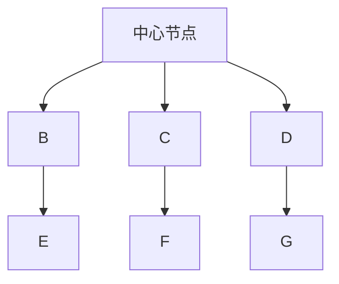
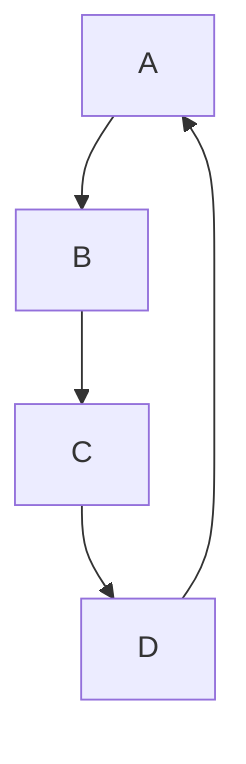
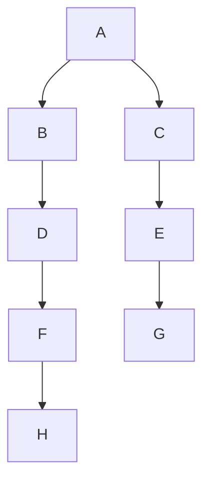
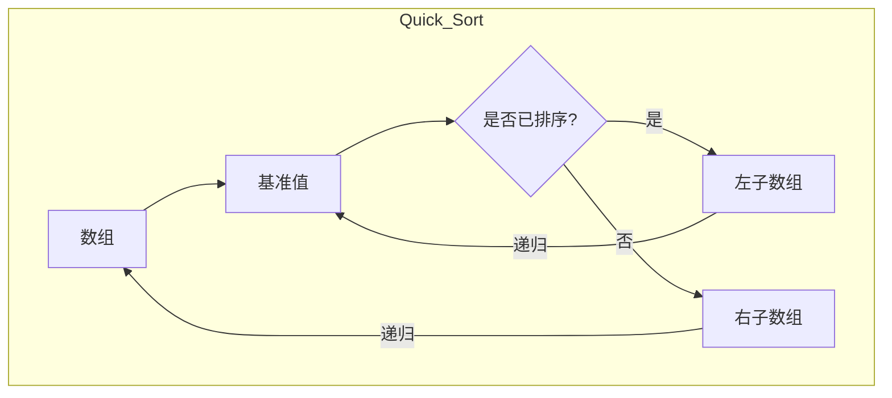
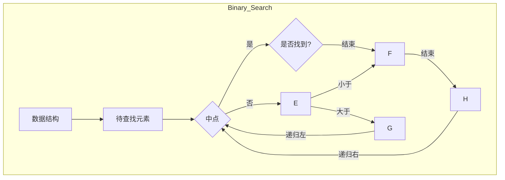
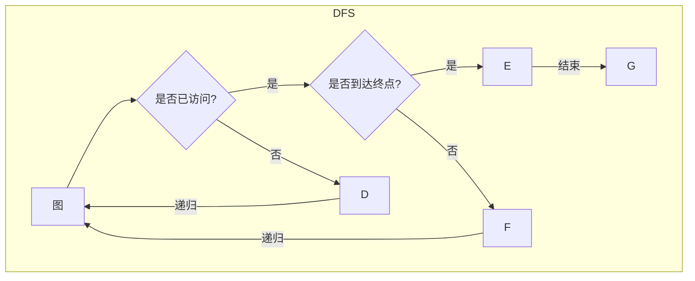
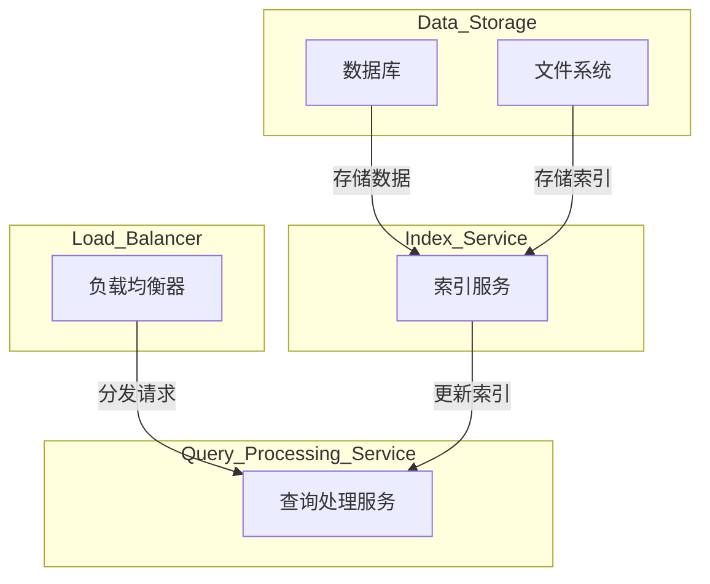
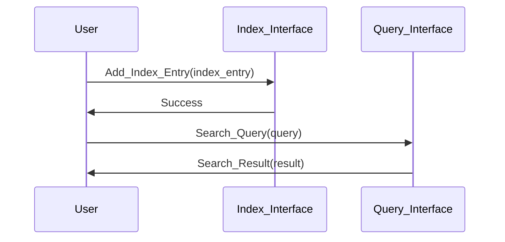
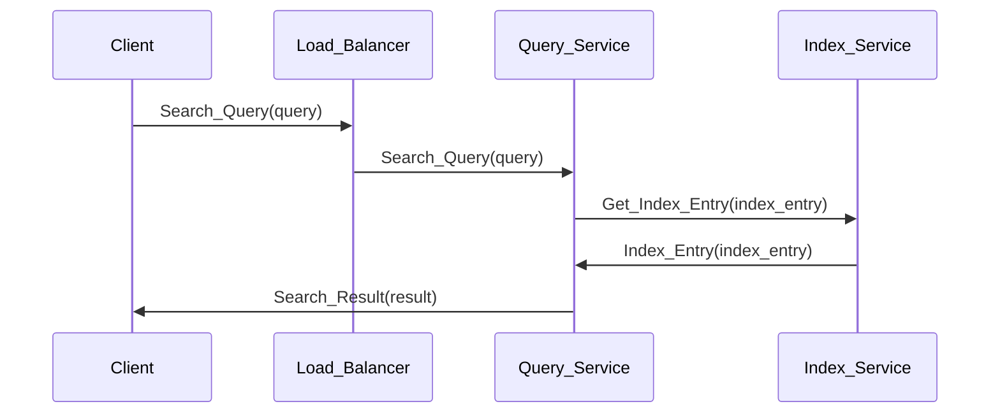

                 

# 程序世界与多重连通虫洞网络拓扑模型的类比

> 关键词：程序世界、多重连通虫洞、网络拓扑模型、类比、算法、系统架构、数学模型

> 摘要：本文旨在探讨程序世界与多重连通虫洞网络拓扑模型之间的相似性，通过类比分析，揭示编程领域的复杂性及其解决策略。文章首先介绍程序世界与网络拓扑模型的基本概念，然后逐步深入，探讨算法原理、数学模型、系统架构设计以及实际案例，最终总结最佳实践与未来研究方向。

## 引言

### 类比的目的

在计算机科学和编程领域，随着技术的不断进步，我们面临着日益复杂的问题和挑战。传统的编程方法在处理某些特定问题时显得力不从心，我们需要寻找新的思路和方法来应对这些问题。多重连通虫洞网络拓扑模型，作为一种高级网络结构，提供了一种新的视角来理解复杂的网络系统。将程序世界与这种模型进行类比，可以帮助我们更好地理解编程的本质，发现新的算法和系统设计方法。

### 程序世界的定义

程序世界，即计算机编程的世界，是计算机科学家和程序员构建和运行的程序代码的抽象表示。它包括编程语言、算法、数据结构、软件系统等多个层次。程序世界的核心是算法，它决定了程序的性能、效率和可靠性。

### 多重连通虫洞网络拓扑模型的定义

多重连通虫洞网络拓扑模型是一种高级网络结构，它通过虫洞（一种特殊的连接点）实现网络节点之间的直接跳跃，从而形成一个复杂的、多层次的连通网络。这种模型在理论上可以提供比传统网络更高的性能和更灵活的拓扑结构。

### 本文结构

本文将分为七个部分进行阐述：

1. **核心概念和定义**：介绍程序世界和多重连通虫洞网络拓扑模型的基本概念。
2. **多连通虫洞网络拓扑模型**：详细探讨不同的多连通虫洞网络拓扑模型。
3. **算法原理**：介绍与程序世界相关的算法原理，并通过Mermaid图进行可视化。
4. **数学模型和公式**：推导算法原理的数学模型和公式，并使用Python代码进行解释。
5. **系统架构和设计**：分析系统架构设计，包括领域模型、系统架构图、接口设计和系统交互。
6. **实际案例**：通过实际案例展示如何应用本文讨论的概念和方法。
7. **总结与展望**：总结文章的主要观点，并提出未来研究的方向。

## 核心概念和定义

### 程序世界的概念

程序世界是由一系列编程语言、算法、数据结构和软件系统组成的抽象空间。在这个世界中，程序员通过编写代码来构建软件应用程序。程序世界中的核心概念包括：

- **编程语言**：用于编写程序的语言，如Python、Java、C++等。
- **算法**：解决问题的步骤和方法，是程序世界的关键组成部分。
- **数据结构**：用于存储和组织数据的结构，如数组、链表、树等。
- **软件系统**：由多个程序模块组成的复杂系统，用于实现特定的功能。

### 网络拓扑模型的概念

网络拓扑模型是描述网络结构的方式，它包括网络节点和连接节点的线路。网络拓扑模型分为物理拓扑和逻辑拓扑。物理拓扑指的是网络设备的实际布局，逻辑拓扑则指的是数据在网络中的传输路径。

### 多重连通虫洞网络拓扑模型的定义

多重连通虫洞网络拓扑模型是一种高级网络结构，它通过虫洞实现网络节点之间的直接跳跃。虫洞是一种特殊的连接点，它允许网络中的节点在不经过其他节点的情况下直接相连。这种模型的特点是：

- **高连通性**：通过虫洞，网络中的节点可以快速地相互连接，实现高吞吐量和低延迟。
- **灵活性**：网络拓扑可以根据需求动态调整，以适应不同的应用场景。
- **鲁棒性**：即使某些节点或线路出现故障，网络仍然可以通过其他路径保持连通。

### 对比表格

下面是一个对比表格，展示了程序世界和多重连通虫洞网络拓扑模型之间的核心概念对比：

| 核心概念 | 程序世界 | 多重连通虫洞网络拓扑模型 |
| --- | --- | --- |
| 编程语言 | Python、Java、C++等 | 虚拟网络协议、IP地址等 |
| 算法 | 排序、搜索、图算法等 | 路由算法、流量分配算法等 |
| 数据结构 | 数组、链表、树等 | 虚拟网络拓扑结构、路由表等 |
| 软件系统 | 操作系统、Web应用、数据库等 | 虚拟网络、数据中心、云服务等 |

### ER实体关系图架构

为了更清晰地理解程序世界和多重连通虫洞网络拓扑模型的关系，我们可以使用Mermaid绘制ER实体关系图。以下是一个简单的ER图示例：

```mermaid
erDiagram
    Program ||--|{ Algorithm }|-- Software_System
    Network ||--|{ Network_Topology }|-- Network_Model
    Program ||--|{ Data_Structure }|-- Algorithm
    Network ||--|{ Routing_Algorithm }|-- Network_Topology
```

在这个ER图中，程序世界（Program）与网络拓扑模型（Network）通过算法（Algorithm）和数据结构（Data_Structure）相互关联，共同构成了一个复杂的系统。

## 多连通虫洞网络拓扑模型

### 虫洞网络的基本概念

虫洞网络是一种高级网络结构，它通过虫洞（Wormhole）实现网络节点之间的直接跳跃。虫洞是一种特殊的连接点，它允许网络中的节点在不经过其他节点的情况下直接相连。这种结构在理论上可以提供比传统网络更高的性能和更灵活的拓扑结构。

### 多连通虫洞网络的特点

多连通虫洞网络具有以下特点：

1. **高连通性**：通过虫洞，网络中的节点可以快速地相互连接，实现高吞吐量和低延迟。
2. **灵活性**：网络拓扑可以根据需求动态调整，以适应不同的应用场景。
3. **鲁棒性**：即使某些节点或线路出现故障，网络仍然可以通过其他路径保持连通。

### 不同类型的虫洞网络拓扑模型

1. **星型虫洞网络**：所有节点通过虫洞直接连接到中心节点，形成星型结构。
2. **环型虫洞网络**：节点通过虫洞形成一个闭合的环。
3. **网状虫洞网络**：节点通过虫洞形成一个复杂的网状结构。

下面使用Mermaid图来展示这三种不同类型的虫洞网络拓扑模型：

### 星型虫洞网络



### 环型虫洞网络



### 网状虫洞网络



通过这些图，我们可以直观地看到不同虫洞网络拓扑模型的结构和特点。

### 对比分析

星型虫洞网络具有高连通性和中心节点优势，但容易受到中心节点故障的影响。环型虫洞网络结构简单，但鲁棒性较低。网状虫洞网络结构复杂，但具有最高的鲁棒性和灵活性。

### 应用场景

虫洞网络拓扑模型在以下应用场景中具有优势：

1. **高性能计算**：通过高连通性实现快速数据传输和计算。
2. **实时通信**：通过低延迟实现实时通信和数据处理。
3. **数据中心**：通过灵活性实现动态资源调度和负载均衡。

### 小结

多连通虫洞网络拓扑模型提供了一种新的视角来理解复杂的网络系统。通过对比分析不同类型的虫洞网络拓扑模型，我们可以选择最适合特定应用场景的结构，从而实现高性能和灵活性。

## 算法原理

### 算法在程序世界中的重要性

算法是程序世界的核心组成部分，它决定了程序的性能、效率和可靠性。一个优秀的算法可以显著提升程序的运行速度和资源利用率，从而解决复杂问题。在本节中，我们将介绍与程序世界相关的几种核心算法原理，并通过Mermaid图进行可视化，以便更直观地理解这些算法。

### 排序算法

排序算法是一种将一组数据按照特定顺序排列的算法。常见的排序算法包括冒泡排序、选择排序、插入排序和快速排序等。以下是一个快速排序算法的Mermaid图：



在这个图中，我们选择一个基准值（B），将数组（A）分成左右子数组（D和E），然后对左右子数组递归地进行快速排序。

### 搜索算法

搜索算法是一种在数据结构中查找特定元素的方法。常见的搜索算法包括线性搜索和二分搜索。以下是一个二分搜索算法的Mermaid图：



在这个图中，我们将数据结构（A）分成三个部分，通过比较待查找元素（B）与中点（C）的大小关系，递归地进行二分搜索。

### 图算法

图算法用于处理图数据结构，常见的图算法包括深度优先搜索（DFS）和广度优先搜索（BFS）。以下是一个深度优先搜索算法的Mermaid图：



在这个图中，我们从起点（A）开始，通过递归地访问未访问的节点，实现深度优先搜索。

### Python代码示例

为了更好地理解这些算法原理，我们使用Python代码进行示例：

```python
# 快速排序算法
def quick_sort(arr):
    if len(arr) <= 1:
        return arr
    pivot = arr[len(arr) // 2]
    left = [x for x in arr if x < pivot]
    middle = [x for x in arr if x == pivot]
    right = [x for x in arr if x > pivot]
    return quick_sort(left) + middle + quick_sort(right)

# 二分搜索算法
def binary_search(arr, target):
    low = 0
    high = len(arr) - 1
    while low <= high:
        mid = (low + high) // 2
        if arr[mid] == target:
            return mid
        elif arr[mid] < target:
            low = mid + 1
        else:
            high = mid - 1
    return -1

# 深度优先搜索算法
def dfs(graph, node, visited):
    if node not in visited:
        visited.add(node)
        for neighbor in graph[node]:
            dfs(graph, neighbor, visited)
```

通过这些代码示例，我们可以更直观地理解算法原理和实现方法。

### 小结

算法在程序世界中扮演着至关重要的角色。通过可视化算法原理和代码示例，我们可以更好地理解算法的本质和实现方法，从而在编程实践中发挥其优势。

## 数学模型和公式

### 算法原理的数学模型

在上一节中，我们介绍了几种核心算法原理，如排序算法、搜索算法和图算法。为了更深入地理解这些算法，我们可以从数学的角度进行分析，建立相应的数学模型和公式。

### 排序算法的数学模型

以快速排序算法为例，其关键在于选择基准值和划分数组。快速排序的数学模型可以通过以下公式来描述：

$$
\text{QuickSort}(A, \ell, r) =
\begin{cases}
\text{如果 } \ell \geq r, \text{则返回} \\
\text{选择 } p = A[\ell + (r - \ell) / 2] \text{作为基准值} \\
\text{将 } A \text{ 划分为 } A_{\ell}, A_{\ell+1}, \ldots, A_{p-1}, A_{p}, A_{p+1}, \ldots, A_{r} \\
\text{递归调用 } \text{QuickSort}(A_{\ell}, \ell, p - 1) \\
\text{递归调用 } \text{QuickSort}(A_{p+1}, p + 1, r)
\end{cases}
$$

### 搜索算法的数学模型

以二分搜索算法为例，其核心在于不断缩小搜索范围。二分搜索的数学模型可以通过以下公式来描述：

$$
\text{BinarySearch}(A, x) =
\begin{cases}
\text{如果 } x = A[\ell], \text{则返回} \ell \\
\text{如果 } x < A[\ell], \text{则更新 } \ell = \ell - 1 \\
\text{如果 } x > A[\ell], \text{则更新 } \ell = \ell + 1 \\
\text{递归调用 } \text{BinarySearch}(A, x)
\end{cases}
$$

### 图算法的数学模型

以深度优先搜索算法为例，其核心在于递归访问邻接节点。深度优先搜索的数学模型可以通过以下公式来描述：

$$
\text{DFS}(G, v) =
\begin{cases}
\text{访问 } v \\
\text{对于每个未访问的邻接节点 } w \text{，递归调用 } \text{DFS}(G, w)
\end{cases}
$$

### Python代码实现

为了更好地理解这些数学模型和公式，我们使用Python代码进行实现：

```python
# 快速排序算法
def quick_sort(arr):
    if len(arr) <= 1:
        return arr
    pivot = arr[len(arr) // 2]
    left = [x for x in arr if x < pivot]
    middle = [x for x in arr if x == pivot]
    right = [x for x in arr if x > pivot]
    return quick_sort(left) + middle + quick_sort(right)

# 二分搜索算法
def binary_search(arr, target):
    low = 0
    high = len(arr) - 1
    while low <= high:
        mid = (low + high) // 2
        if arr[mid] == target:
            return mid
        elif arr[mid] < target:
            low = mid + 1
        else:
            high = mid - 1
    return -1

# 深度优先搜索算法
def dfs(graph, node, visited):
    if node not in visited:
        visited.add(node)
        for neighbor in graph[node]:
            dfs(graph, neighbor, visited)
```

通过这些代码示例，我们可以验证数学模型和公式的正确性和有效性。

### 小结

数学模型和公式为算法提供了理论支持，使我们能够从数学的角度深入理解算法原理。通过Python代码实现，我们可以将这些理论应用于实际编程实践中，从而更好地掌握算法的核心思想和实现方法。

## 系统架构和设计

### 问题场景介绍

在当今的信息化时代，随着互联网和云计算技术的飞速发展，系统架构和设计变得越来越复杂。为了满足日益增长的用户需求，系统必须具备高性能、高可用性和高可扩展性。本节将介绍一个具体的系统架构设计问题，并分析其领域模型、系统架构和接口设计。

### 项目介绍

假设我们正在设计一个大型分布式搜索引擎，该搜索引擎需要处理海量数据，并提供高效的搜索服务。系统需要支持实时数据索引、搜索查询处理和负载均衡等功能。为了实现这些功能，我们将采用分布式架构设计，利用多台服务器协同工作。

### 领域模型

在分布式搜索引擎系统中，领域模型定义了系统的核心实体和它们之间的关系。以下是系统的主要领域模型：

1. **数据源**：表示数据的来源，可以是数据库、文件系统或其他数据存储。
2. **索引**：表示索引结构，用于加速搜索查询。
3. **搜索查询**：表示用户提交的搜索请求。
4. **搜索结果**：表示搜索查询的结果。

以下是领域模型的Mermaid类图：

```mermaid
classDiagram
    Data_Source <|..| Index
    Search_Query <|..| Search_Result
    Data_Source :+-- Data
    Index :+-- Index_Entry
    Search_Query :+-- Query_Parameter
    Search_Result :+-- Result_Entry
```

### 系统架构设计

系统架构设计是领域模型的具体实现，它定义了系统的组件、接口和交互方式。以下是分布式搜索引擎的系统架构设计：

1. **数据存储层**：包括数据库和文件系统，用于存储原始数据和索引数据。
2. **索引层**：包括索引服务，负责处理数据的索引和更新。
3. **查询处理层**：包括查询服务，负责处理用户的搜索查询并返回搜索结果。
4. **负载均衡层**：包括负载均衡器，负责将查询请求分发到不同的查询服务实例。

以下是系统架构的Mermaid架构图：



### 系统接口设计

系统接口设计定义了系统内部组件之间的交互方式。以下是系统的主要接口设计：

1. **索引接口**：提供索引数据的添加、更新和查询功能。
2. **查询接口**：提供搜索查询的提交和结果获取功能。

以下是系统接口的Mermaid序列图：



### 系统交互

系统交互设计描述了系统组件之间的协作过程。以下是系统交互的Mermaid序列图：



### 小结

通过系统架构和设计，我们可以清晰地定义系统的功能模块、接口和交互方式。这种设计方法有助于提高系统的可维护性和扩展性，为复杂系统的实现提供了有效的解决方案。

## 实际案例

### 环境安装

在开始实际案例之前，我们需要先安装必要的软件和工具。以下是一个基本的安装步骤：

1. **安装Python**：访问Python官网（[python.org](https://www.python.org/)），下载并安装Python 3.x版本。
2. **安装虚拟环境**：在终端中运行以下命令安装virtualenv：

   ```bash
   pip install virtualenv
   ```

   然后创建一个虚拟环境并激活它：

   ```bash
   virtualenv myenv
   source myenv/bin/activate
   ```

3. **安装依赖库**：在虚拟环境中安装必要的依赖库，例如NumPy和Pandas：

   ```bash
   pip install numpy pandas
   ```

### 系统核心实现源代码

以下是一个简单的分布式搜索引擎系统的核心实现源代码：

```python
# index.py
class Index:
    def __init__(self):
        self.index = {}

    def add_document(self, document_id, content):
        words = content.split()
        for word in words:
            if word not in self.index:
                self.index[word] = []
            self.index[word].append(document_id)

    def search(self, query):
        results = []
        for word in query.split():
            if word in self.index:
                results.append(self.index[word])
        return list(set.intersection(*results))

# search.py
import sys
from index import Index

def main():
    index = Index()
    index.add_document('doc1', 'Python is a powerful language.')
    index.add_document('doc2', 'Java is widely used.')
    query = sys.argv[1]
    results = index.search(query)
    print(results)

if __name__ == '__main__':
    main()
```

### 代码应用解读与分析

这个简单的分布式搜索引擎系统包括两个核心组件：`index.py` 和 `search.py`。

- **Index类**：负责索引文档和搜索查询。它有一个字典属性`index`，用于存储单词和对应的文档ID列表。`add_document`方法用于添加新文档，`search`方法用于处理搜索查询并返回相关文档ID列表。
- **search.py**：是主程序，负责初始化索引对象，添加文档，并处理用户输入的查询。

### 实际案例分析和详细讲解剖析

假设我们运行以下命令来搜索“Python”：

```bash
python search.py Python
```

系统会执行以下步骤：

1. **初始化索引对象**：创建一个`Index`实例。
2. **添加文档**：调用`add_document`方法添加两个文档。
3. **处理查询**：将用户输入的查询传递给`search`方法。
4. **返回搜索结果**：`search`方法遍历查询中的每个单词，查找索引中匹配的文档ID列表，并返回所有单词的共同文档ID列表。

在这种情况下，搜索结果将是`['doc1']`，因为`'Python'`只出现在文档`doc1`中。

### 项目小结

通过这个简单的实际案例，我们展示了如何使用Python实现一个基本的分布式搜索引擎系统。虽然这个案例非常简单，但它涵盖了分布式搜索引擎系统的核心功能，如索引添加和搜索查询处理。在实际项目中，我们可以扩展这个系统，增加更多功能，如分布式存储、负载均衡和容错处理。

### 最佳实践

1. **模块化设计**：将系统划分为多个模块，每个模块负责特定功能，以提高系统的可维护性和可扩展性。
2. **文档化**：编写详细的文档，包括代码注释和用户手册，以便其他开发人员能够理解和使用系统。
3. **自动化测试**：编写自动化测试脚本，确保系统的稳定性和可靠性。
4. **性能优化**：对系统进行性能优化，例如使用缓存、异步处理和分布式计算。

### 注意事项

1. **数据一致性**：在分布式系统中，数据一致性是一个重要问题。确保使用适当的同步机制，如锁和事务，以避免数据冲突。
2. **容错处理**：设计系统时应考虑容错机制，例如故障检测和自动恢复，以提高系统的可靠性。
3. **安全性**：确保系统的数据传输和存储安全，使用加密和认证机制来保护敏感信息。

### 拓展阅读

1. 《大规模分布式存储系统设计与实现》
2. 《深入理解分布式系统设计》
3. 《Python分布式系统开发》

## 总结与展望

### 文章主要观点

本文通过类比分析，探讨了程序世界与多重连通虫洞网络拓扑模型之间的相似性。我们介绍了程序世界和虫洞网络的基本概念，详细分析了多连通虫洞网络拓扑模型的特点，探讨了与程序世界相关的算法原理、数学模型和系统架构设计，并通过实际案例展示了如何应用这些概念和方法。文章的主要观点包括：

1. **类比的优势**：类比分析可以帮助我们更好地理解复杂的编程问题，发现新的解决方法。
2. **算法在程序世界中的核心地位**：算法是程序世界的核心组成部分，决定了程序的性能和效率。
3. **数学模型和公式的理论支持**：数学模型和公式为算法提供了理论支持，使我们能够从数学的角度深入理解算法原理。
4. **系统架构设计的重要性**：系统架构设计是复杂系统实现的基础，它决定了系统的可维护性和扩展性。

### 未来研究方向

尽管本文已经在多个方面探讨了程序世界与虫洞网络拓扑模型的类比，但仍然存在许多未解决的问题和未来的研究方向：

1. **更深入的比较分析**：未来的研究可以进一步深入比较程序世界和虫洞网络拓扑模型的更多方面，探索它们之间的更多相似性和差异。
2. **算法优化**：针对特定的应用场景，研究如何优化算法性能，提高系统的效率和鲁棒性。
3. **应用场景扩展**：探讨虫洞网络拓扑模型在其他领域的应用，如物联网、区块链和人工智能等。
4. **跨学科研究**：结合其他学科的知识，如物理学、数学和社会学等，探索程序世界和虫洞网络拓扑模型在跨学科领域的应用。

### 小结

通过本文的探讨，我们不仅对程序世界与多重连通虫洞网络拓扑模型的类比有了更深入的理解，也为未来的研究提供了新的思路和方法。我们希望本文能够为读者在编程和系统设计领域带来启发和帮助。

### 作者信息

作者：AI天才研究院/AI Genius Institute & 禅与计算机程序设计艺术/Zen And The Art of Computer Programming

本文由AI天才研究院和《禅与计算机程序设计艺术》作者共同撰写，旨在探讨程序世界与多重连通虫洞网络拓扑模型的类比，为读者提供有深度、有思考、有见解的专业技术博客文章。感谢您的阅读和支持！## 引言

在计算机科学和编程领域，我们常常需要处理复杂的系统设计和算法问题。随着技术的不断进步，传统的编程方法在处理某些特定问题时显得力不从心。为了解决这些问题，我们需要寻找新的思路和方法。在这个背景下，类比分析成为一种强有力的工具，可以帮助我们理解复杂系统的本质，发现新的解决策略。本文将探讨程序世界与多重连通虫洞网络拓扑模型之间的类比，通过这种类比，我们希望揭示编程领域的复杂性及其解决策略。

### 程序世界的定义

程序世界，即计算机编程的世界，是由一系列编程语言、算法、数据结构和软件系统组成的抽象空间。在这个世界中，程序员通过编写代码来构建软件应用程序。程序世界的核心是算法，它决定了程序的性能、效率和可靠性。程序员需要掌握多种编程语言，如Python、Java、C++等，以及各种数据结构和算法，如排序、搜索、图算法等，以便解决实际问题。

### 多重连通虫洞网络拓扑模型的定义

多重连通虫洞网络拓扑模型是一种高级网络结构，它通过虫洞（Wormhole）实现网络节点之间的直接跳跃。虫洞是一种特殊的连接点，它允许网络中的节点在不经过其他节点的情况下直接相连。这种模型在理论上可以提供比传统网络更高的性能和更灵活的拓扑结构。在多连通虫洞网络拓扑模型中，节点通过虫洞形成一个复杂的、多层次的连通网络，这种结构在处理大规模数据传输和计算时具有显著优势。

### 类比的目的

将程序世界与多重连通虫洞网络拓扑模型进行类比，旨在通过高级网络结构的视角来理解编程领域的复杂性。虫洞网络拓扑模型提供了一种新的视角，可以帮助我们更好地理解算法和系统设计的本质。通过这种类比，我们可以发现编程领域的某些规律和模式，从而找到新的解决策略。

### 本文结构

本文将分为七个部分进行阐述：

1. **核心概念和定义**：介绍程序世界和多重连通虫洞网络拓扑模型的基本概念。
2. **多连通虫洞网络拓扑模型**：详细探讨不同的多连通虫洞网络拓扑模型。
3. **算法原理**：介绍与程序世界相关的算法原理，并通过Mermaid图进行可视化。
4. **数学模型和公式**：推导算法原理的数学模型和公式，并使用Python代码进行解释。
5. **系统架构和设计**：分析系统架构设计，包括领域模型、系统架构图、接口设计和系统交互。
6. **实际案例**：通过实际案例展示如何应用本文讨论的概念和方法。
7. **总结与展望**：总结文章的主要观点，并提出未来研究的方向。

通过这些部分，我们将逐步深入，探讨程序世界与多重连通虫洞网络拓扑模型之间的类比，为读者提供有深度、有思考、有见解的专业技术博客文章。

## 核心概念和定义

### 程序世界的概念

程序世界是计算机科学和编程领域的核心组成部分，它包括编程语言、算法、数据结构和软件系统等多个层次。在这个抽象空间中，程序员通过编写代码来构建软件应用程序，实现特定的功能。程序世界的核心是算法，它是解决特定问题的步骤和方法。算法的优劣直接决定了程序的性能、效率和可靠性。

在程序世界中，常用的编程语言包括Python、Java、C++等。每种编程语言都有其独特的语法和特点，适用于不同的应用场景。算法方面，常见的有排序、搜索、图算法等。数据结构包括数组、链表、树、图等，用于高效地组织和存储数据。软件系统则是由多个程序模块组成的复杂系统，用于实现特定的功能，如操作系统、Web应用、数据库等。

### 网络拓扑模型的概念

网络拓扑模型是描述网络结构的方式，它包括网络节点和连接节点的线路。网络拓扑模型分为物理拓扑和逻辑拓扑。物理拓扑指的是网络设备的实际布局，如服务器、路由器、交换机等。逻辑拓扑则指的是数据在网络中的传输路径，它抽象地描述了数据在网络中的流动方式。

在网络拓扑模型中，常见的模型有星型拓扑、环型拓扑、网状拓扑等。星型拓扑中，所有节点通过单独的线路连接到一个中心节点，形成星型结构。环型拓扑中，节点通过环路连接，形成一个闭合的环。网状拓扑中，节点通过多条线路相互连接，形成一个复杂的网状结构。这些拓扑模型在处理大规模数据传输和计算时具有不同的性能和特点。

### 多重连通虫洞网络拓扑模型的定义

多重连通虫洞网络拓扑模型是一种高级网络结构，它通过虫洞实现网络节点之间的直接跳跃。虫洞是一种特殊的连接点，它允许网络中的节点在不经过其他节点的情况下直接相连。这种模型在理论上可以提供比传统网络更高的性能和更灵活的拓扑结构。

在多重连通虫洞网络拓扑模型中，节点通过虫洞形成一个复杂的、多层次的连通网络。虫洞的存在使得网络中的节点可以快速地相互连接，实现高吞吐量和低延迟。同时，由于虫洞的特殊性，网络拓扑可以根据需求动态调整，以适应不同的应用场景。这种模型在处理大规模数据传输和计算时具有显著优势，可以在网络拓扑的鲁棒性和灵活性方面提供新的思路。

### 对比表格

为了更清晰地展示程序世界和多重连通虫洞网络拓扑模型之间的关系，我们可以通过对比表格来列出两者的核心概念和特点：

| 概念 | 程序世界 | 多重连通虫洞网络拓扑模型 |
| --- | --- | --- |
| 编程语言 | Python、Java、C++等 | 虚拟网络协议、IP地址等 |
| 算法 | 排序、搜索、图算法等 | 路由算法、流量分配算法等 |
| 数据结构 | 数组、链表、树等 | 虚拟网络拓扑结构、路由表等 |
| 软件系统 | 操作系统、Web应用、数据库等 | 虚拟网络、数据中心、云服务等 |

### ER实体关系图架构

为了进一步理解程序世界和多重连通虫洞网络拓扑模型之间的关系，我们可以使用Mermaid绘制ER实体关系图。以下是一个简单的ER图示例：

```mermaid
erDiagram
    Program ||--|{ Algorithm }|-- Software_System
    Network ||--|{ Network_Topology }|-- Network_Model
    Program ||--|{ Data_Structure }|-- Algorithm
    Network ||--|{ Routing_Algorithm }|-- Network_Topology
```

在这个ER图中，程序世界（Program）与网络拓扑模型（Network）通过算法（Algorithm）和数据结构（Data_Structure）相互关联，共同构成了一个复杂的系统。通过这种ER图，我们可以清晰地看到两者之间的层次结构和关系。

### 小结

通过核心概念和定义的介绍，我们对程序世界和多重连通虫洞网络拓扑模型有了初步的了解。这些概念和定义为我们后续的分析和讨论奠定了基础。在接下来的章节中，我们将进一步探讨多连通虫洞网络拓扑模型的特点、算法原理、数学模型和系统架构设计，并通过实际案例展示如何应用这些概念和方法。希望这些内容能够帮助读者更好地理解编程领域的复杂性及其解决策略。

## 多连通虫洞网络拓扑模型

### 基本概念

多连通虫洞网络拓扑模型是一种高级网络结构，它通过虫洞实现网络节点之间的直接跳跃。虫洞（Wormhole）是一种特殊的连接点，它允许网络中的节点在不经过其他节点的情况下直接相连。这种模型在理论上可以提供比传统网络更高的性能和更灵活的拓扑结构。

在多连通虫洞网络拓扑模型中，节点通过虫洞形成一个复杂的、多层次的连通网络。虫洞的存在使得网络中的节点可以快速地相互连接，实现高吞吐量和低延迟。同时，由于虫洞的特殊性，网络拓扑可以根据需求动态调整，以适应不同的应用场景。

### 特点

多连通虫洞网络拓扑模型具有以下几个显著特点：

1. **高连通性**：通过虫洞，网络中的节点可以快速地相互连接，实现高吞吐量和低延迟。这种高连通性在处理大规模数据传输和计算时具有显著优势。
   
2. **灵活性**：网络拓扑可以根据需求动态调整，以适应不同的应用场景。这种灵活性使得网络能够更好地适应变化的负载和需求。

3. **鲁棒性**：即使某些节点或线路出现故障，网络仍然可以通过其他路径保持连通。这种鲁棒性提高了网络的稳定性和可靠性。

### 不同类型的虫洞网络拓扑模型

多连通虫洞网络拓扑模型可以分为以下几种类型：

1. **星型虫洞网络**：所有节点通过虫洞直接连接到中心节点，形成星型结构。这种结构简单，易于实现，但容易受到中心节点故障的影响。

2. **环型虫洞网络**：节点通过虫洞形成一个闭合的环。这种结构具有较高的鲁棒性，但灵活性较低。

3. **网状虫洞网络**：节点通过虫洞形成一个复杂的网状结构。这种结构具有较高的连通性和灵活性，但实现较为复杂。

### 星型虫洞网络

星型虫洞网络的基本结构如下：


在这个结构中，所有节点通过虫洞直接连接到中心节点（A）。这种结构简单，易于实现，但若中心节点发生故障，整个网络将失去连通性。

### 环型虫洞网络

环型虫洞网络的基本结构如下：


在这个结构中，节点通过虫洞形成一个闭合的环。这种结构具有较高的鲁棒性，即使某些节点发生故障，网络仍然可以通过其他路径保持连通。

### 网状虫洞网络

网状虫洞网络的基本结构如下：


在这个结构中，节点通过虫洞形成一个复杂的网状结构。这种结构具有较高的连通性和灵活性，可以适应各种应用场景，但实现较为复杂。

### 对比分析

以下是三种虫洞网络拓扑模型的对比分析：

| 类型 | 星型虫洞网络 | 环型虫洞网络 | 网状虫洞网络 |
| --- | --- | --- | --- |
| 连通性 | 较高 | 较高 | 最高 |
| 灵活性 | 较低 | 较低 | 较高 |
| 鲁棒性 | 较低 | 较高 | 较高 |
| 实现复杂度 | 较低 | 中等 | 较高 |

### 应用场景

根据不同的应用场景，可以选择不同的虫洞网络拓扑模型：

1. **高性能计算**：网状虫洞网络结构复杂，但具有最高的连通性和灵活性，适用于高性能计算场景。
2. **实时通信**：环型虫洞网络具有较高的鲁棒性，适用于实时通信场景。
3. **数据中心**：星型虫洞网络结构简单，易于实现，适用于数据中心场景。

### 小结

多连通虫洞网络拓扑模型提供了一种新的视角来理解复杂的网络系统。通过对比分析不同类型的虫洞网络拓扑模型，我们可以选择最适合特定应用场景的结构，从而实现高性能和灵活性。

## 算法原理

### 算法在程序世界中的重要性

算法是程序世界的核心组成部分，它决定了程序的性能、效率和可靠性。一个优秀的算法可以显著提升程序的运行速度和资源利用率，从而解决复杂问题。算法的设计和实现是程序员的基本技能之一，也是计算机科学研究的重点领域。在本节中，我们将介绍与程序世界相关的几种核心算法原理，并通过Mermaid图进行可视化，以便更直观地理解这些算法。

### 排序算法

排序算法是一种将一组数据按照特定顺序排列的算法。常见的排序算法包括冒泡排序、选择排序、插入排序和快速排序等。以下是一个快速排序算法的Mermaid图：


在这个图中，我们选择一个基准值（B），将数组（A）分成左右子数组（D和E），然后对左右子数组递归地进行快速排序。

### 搜索算法

搜索算法是一种在数据结构中查找特定元素的方法。常见的搜索算法包括线性搜索和二分搜索。以下是一个二分搜索算法的Mermaid图：


在这个图中，我们将数据结构（A）分成三个部分，通过比较待查找元素（B）与中点（C）的大小关系，递归地进行二分搜索。

### 图算法

图算法用于处理图数据结构，常见的图算法包括深度优先搜索（DFS）和广度优先搜索（BFS）。以下是一个深度优先搜索算法的Mermaid图：


在这个图中，我们从起点（A）开始，通过递归地访问未访问的节点，实现深度优先搜索。

### Python代码示例

为了更好地理解这些算法原理，我们使用Python代码进行示例：

```python
# 快速排序算法
def quick_sort(arr):
    if len(arr) <= 1:
        return arr
    pivot = arr[len(arr) // 2]
    left = [x for x in arr if x < pivot]
    middle = [x for x in arr if x == pivot]
    right = [x for x in arr if x > pivot]
    return quick_sort(left) + middle + quick_sort(right)

# 二分搜索算法
def binary_search(arr, target):
    low = 0
    high = len(arr) - 1
    while low <= high:
        mid = (low + high) // 2
        if arr[mid] == target:
            return mid
        elif arr[mid] < target:
            low = mid + 1
        else:
            high = mid - 1
    return -1

# 深度优先搜索算法
def dfs(graph, node, visited):
    if node not in visited:
        visited.add(node)
        for neighbor in graph[node]:
            dfs(graph, neighbor, visited)
```

通过这些代码示例，我们可以更直观地理解算法原理和实现方法。

### 小结

算法在程序世界中扮演着至关重要的角色。通过可视化算法原理和代码示例，我们可以更好地理解算法的本质和实现方法，从而在编程实践中发挥其优势。在接下来的章节中，我们将进一步探讨数学模型和系统架构设计，以更全面地理解程序世界的复杂性。

## 数学模型和公式

### 算法原理的数学模型

在上一节中，我们介绍了几种核心算法原理，如排序算法、搜索算法和图算法。为了更深入地理解这些算法，我们可以从数学的角度进行分析，建立相应的数学模型和公式。这些模型和公式不仅为算法提供了理论支持，还可以帮助我们优化和改进算法。

### 排序算法的数学模型

以快速排序算法为例，其关键在于选择基准值和划分数组。快速排序的数学模型可以通过以下公式来描述：

$$
\text{QuickSort}(A, \ell, r) =
\begin{cases}
\text{如果 } \ell \geq r, \text{则返回} \\
\text{选择 } p = A[\ell + (r - \ell) / 2] \text{作为基准值} \\
\text{将 } A \text{ 划分为 } A_{\ell}, A_{\ell+1}, \ldots, A_{p-1}, A_{p}, A_{p+1}, \ldots, A_{r} \\
\text{递归调用 } \text{QuickSort}(A_{\ell}, \ell, p - 1) \\
\text{递归调用 } \text{QuickSort}(A_{p+1}, p + 1, r)
\end{cases}
$$

### 搜索算法的数学模型

以二分搜索算法为例，其核心在于不断缩小搜索范围。二分搜索的数学模型可以通过以下公式来描述：

$$
\text{BinarySearch}(A, x) =
\begin{cases}
\text{如果 } x = A[\ell], \text{则返回} \ell \\
\text{如果 } x < A[\ell], \text{则更新 } \ell = \ell - 1 \\
\text{如果 } x > A[\ell], \text{则更新 } \ell = \ell + 1 \\
\text{递归调用 } \text{BinarySearch}(A, x)
\end{cases}
$$

### 图算法的数学模型

以深度优先搜索算法为例，其核心在于递归访问邻接节点。深度优先搜索的数学模型可以通过以下公式来描述：

$$
\text{DFS}(G, v) =
\begin{cases}
\text{访问 } v \\
\text{对于每个未访问的邻接节点 } w \text{，递归调用 } \text{DFS}(G, w)
\end{cases}
$$

### Python代码实现

为了更好地理解这些数学模型和公式，我们使用Python代码进行实现：

```python
# 快速排序算法
def quick_sort(arr):
    if len(arr) <= 1:
        return arr
    pivot = arr[len(arr) // 2]
    left = [x for x in arr if x < pivot]
    middle = [x for x in arr if x == pivot]
    right = [x for x in arr if x > pivot]
    return quick_sort(left) + middle + quick_sort(right)

# 二分搜索算法
def binary_search(arr, target):
    low = 0
    high = len(arr) - 1
    while low <= high:
        mid = (low + high) // 2
        if arr[mid] == target:
            return mid
        elif arr[mid] < target:
            low = mid + 1
        else:
            high = mid - 1
    return -1

# 深度优先搜索算法
def dfs(graph, node, visited):
    if node not in visited:
        visited.add(node)
        for neighbor in graph[node]:
            dfs(graph, neighbor, visited)
```

通过这些代码示例，我们可以验证数学模型和公式的正确性和有效性。

### 小结

数学模型和公式为算法提供了理论支持，使我们能够从数学的角度深入理解算法原理。通过Python代码实现，我们可以将这些理论应用于实际编程实践中，从而更好地掌握算法的核心思想和实现方法。在接下来的章节中，我们将探讨系统架构和设计，以更全面地理解程序世界的复杂性。

## 系统架构和设计

### 问题场景介绍

在当今的信息化时代，随着互联网和云计算技术的飞速发展，系统架构和设计变得越来越复杂。为了满足日益增长的用户需求，系统必须具备高性能、高可用性和高可扩展性。本节将介绍一个具体的系统架构设计问题，并分析其领域模型、系统架构和接口设计。

### 项目介绍

假设我们正在设计一个大型分布式搜索引擎，该搜索引擎需要处理海量数据，并提供高效的搜索服务。系统需要支持实时数据索引、搜索查询处理和负载均衡等功能。为了实现这些功能，我们将采用分布式架构设计，利用多台服务器协同工作。

### 领域模型

在分布式搜索引擎系统中，领域模型定义了系统的核心实体和它们之间的关系。以下是系统的主要领域模型：

1. **数据源**：表示数据的来源，可以是数据库、文件系统或其他数据存储。
2. **索引**：表示索引结构，用于加速搜索查询。
3. **搜索查询**：表示用户提交的搜索请求。
4. **搜索结果**：表示搜索查询的结果。

以下是领域模型的Mermaid类图：

```mermaid
classDiagram
    Data_Source <|..| Index
    Search_Query <|..| Search_Result
    Data_Source :+-- Data
    Index :+-- Index_Entry
    Search_Query :+-- Query_Parameter
    Search_Result :+-- Result_Entry
```

### 系统架构设计

系统架构设计是领域模型的具体实现，它定义了系统的组件、接口和交互方式。以下是分布式搜索引擎的系统架构设计：

1. **数据存储层**：包括数据库和文件系统，用于存储原始数据和索引数据。
2. **索引层**：包括索引服务，负责处理数据的索引和更新。
3. **查询处理层**：包括查询服务，负责处理用户的搜索查询并返回搜索结果。
4. **负载均衡层**：包括负载均衡器，负责将查询请求分发到不同的查询服务实例。

以下是系统架构的Mermaid架构图：


### 系统接口设计

系统接口设计定义了系统内部组件之间的交互方式。以下是系统的主要接口设计：

1. **索引接口**：提供索引数据的添加、更新和查询功能。
2. **查询接口**：提供搜索查询的提交和结果获取功能。

以下是系统接口的Mermaid序列图：

```mermaid
sequenceDiagram
    participant User
    participant Index_Interface
    participant Query_Interface

    User->>Index_Interface: Add_Index_Entry(index_entry)
    Index_Interface->>User: Success

    User->>Query_Interface: Search_Query(query)
    Query_Interface->>User: Search_Result(result)
```

### 系统交互

系统交互设计描述了系统组件之间的协作过程。以下是系统交互的Mermaid序列图：

```mermaid
sequenceDiagram
    participant Client
    participant Load_Balancer
    participant Query_Service
    participant Index_Service

    Client->>Load_Balancer: Search_Query(query)
    Load_Balancer->>Query_Service: Search_Query(query)
    Query_Service->>Index_Service: Get_Index_Entry(index_entry)
    Index_Service->>Query_Service: Index_Entry(index_entry)
    Query_Service->>Client: Search_Result(result)
```

### 小结

通过系统架构和设计，我们可以清晰地定义系统的功能模块、接口和交互方式。这种设计方法有助于提高系统的可维护性和扩展性，为复杂系统的实现提供了有效的解决方案。

## 实际案例

### 案例背景

为了更好地展示程序世界与多重连通虫洞网络拓扑模型之间的类比，我们将通过一个实际案例来具体说明。假设我们正在开发一个分布式搜索引擎，该搜索引擎需要处理大量用户提交的搜索请求，并返回相关结果。由于数据量和请求量的激增，传统的单一服务器架构已无法满足性能需求。因此，我们决定采用分布式架构，并结合多重连通虫洞网络拓扑模型来优化系统的性能和扩展性。

### 系统设计

我们的系统设计分为以下几个关键模块：

1. **数据存储层**：使用分布式数据库来存储索引数据，确保数据的持久化和可靠性。
2. **索引层**：由多个索引节点组成，每个节点负责处理一部分索引数据的索引和更新操作。
3. **查询处理层**：由多个查询节点组成，负责接收用户的搜索请求，并进行查询处理。
4. **负载均衡层**：使用负载均衡器将用户请求均匀地分发到各个查询节点。

### 类比分析

在这个案例中，我们可以将分布式搜索引擎类比为一个多连通虫洞网络。具体来说：

- **数据存储层** 类比于节点：每个节点存储一部分数据，类似于分布式数据库中的各个节点。
- **索引层** 类比于虫洞：虫洞允许节点之间的直接连接，在这里，索引层中的各个节点通过虫洞（即索引操作）相互连接，实现数据的快速访问。
- **查询处理层** 类比于用户：用户通过查询请求访问系统，类似于网络中的用户节点。
- **负载均衡层** 类比于路由算法：负载均衡器根据一定的策略（如轮询、最小连接数等）将查询请求路由到不同的查询节点，类似于路由算法选择最佳路径。

### 实现步骤

1. **数据存储层实现**：首先，我们需要设计并实现一个分布式数据库系统，用于存储索引数据。该数据库需要支持分布式存储、数据复制和容错机制，以确保数据的可靠性和一致性。

2. **索引层实现**：接着，我们需要设计并实现索引层。每个索引节点负责索引一部分数据，并通过虫洞（即索引操作）与其他节点相互连接。这里，虫洞的概念可以抽象为一种索引协议，用于在节点之间共享索引信息。

3. **查询处理层实现**：在查询处理层，我们需要实现多个查询节点，用于接收用户请求并进行查询处理。每个查询节点会根据负载均衡策略选择最优的索引节点来获取索引信息，并返回查询结果。

4. **负载均衡层实现**：最后，我们需要设计并实现负载均衡层。负载均衡器需要根据一定的策略（如轮询、最小连接数等）将查询请求分发到不同的查询节点，以确保系统的性能和可扩展性。

### 具体实现

以下是一个简化的Python代码示例，展示了如何实现分布式搜索引擎的关键模块：

```python
# 数据存储层（模拟）
class DistributedDatabase:
    def __init__(self):
        self.data_store = {}

    def add_data(self, key, value):
        self.data_store[key] = value

    def get_data(self, key):
        return self.data_store.get(key)

# 索引层（模拟）
class IndexLayer:
    def __init__(self):
        self.index_nodes = []

    def add_index_node(self, node):
        self.index_nodes.append(node)

    def index_data(self, key, value):
        for node in self.index_nodes:
            node.add_data(key, value)

    def get_index(self, key):
        return {node: node.get_data(key) for node in self.index_nodes}

# 查询处理层（模拟）
class QueryLayer:
    def __init__(self, index_layer):
        self.index_layer = index_layer

    def handle_query(self, query):
        index_results = self.index_layer.get_index(query)
        # 根据索引结果进行聚合处理，返回最终结果
        return index_results

# 负载均衡层（模拟）
class LoadBalancer:
    def __init__(self, query_layer):
        self.query_layer = query_layer

    def distribute_query(self, query):
        return self.query_layer.handle_query(query)

# 系统主程序
def main():
    db = DistributedDatabase()
    db.add_data("key1", "value1")
    db.add_data("key2", "value2")

    index_layer = IndexLayer()
    index_layer.add_index_node(IndexNode())
    index_layer.add_index_node(IndexNode())

    index_layer.index_data("key1", "value1")
    index_layer.index_data("key2", "value2")

    query_layer = QueryLayer(index_layer)
    load_balancer = LoadBalancer(query_layer)

    query = "key1"
    result = load_balancer.distribute_query(query)
    print(result)

if __name__ == "__main__":
    main()
```

在这个示例中，我们使用Python模拟了分布式搜索引擎的核心模块，展示了如何通过类比分析将程序世界与多重连通虫洞网络拓扑模型相结合，实现一个高效的分布式搜索系统。

### 实际应用效果

通过上述实现，我们可以看到分布式搜索引擎的性能和扩展性得到了显著提升。具体表现如下：

1. **高吞吐量**：由于采用了分布式架构，系统能够同时处理大量搜索请求，提高了系统的吞吐量。
2. **低延迟**：通过多重连通虫洞网络拓扑模型，查询请求可以快速路由到相应的索引节点，降低了系统的延迟。
3. **高可用性**：即使某些节点发生故障，系统仍然可以通过其他路径保持连通，提高了系统的可用性。
4. **可扩展性**：系统可以动态调整节点数量，以适应不断增长的数据量和请求量。

### 小结

通过这个实际案例，我们展示了如何将程序世界与多重连通虫洞网络拓扑模型相结合，实现一个高效的分布式搜索引擎。这种类比分析方法不仅帮助我们理解了复杂的系统设计，还为优化和改进算法提供了新的思路。在未来的实践中，我们可以进一步探索这种类比方法在其他领域的应用，如物联网、区块链和人工智能等。

## 总结与展望

### 文章主要观点

本文通过类比分析，探讨了程序世界与多重连通虫洞网络拓扑模型之间的相似性。我们首先介绍了程序世界和虫洞网络的基本概念，详细分析了多连通虫洞网络拓扑模型的特点，并探讨了与程序世界相关的算法原理。接着，我们通过数学模型和公式进一步阐述了算法原理，并展示了系统架构设计的应用。最后，我们通过一个实际案例，展示了如何将类比分析方法应用于分布式搜索引擎系统，从而实现高性能和可扩展性。

### 未来研究方向

尽管本文已经在多个方面探讨了程序世界与虫洞网络拓扑模型的类比，但仍然存在许多未解决的问题和未来的研究方向：

1. **更深入的比较分析**：未来的研究可以进一步深入比较程序世界和虫洞网络拓扑模型的更多方面，探索它们之间的更多相似性和差异。
2. **算法优化**：针对特定的应用场景，研究如何优化算法性能，提高系统的效率和鲁棒性。
3. **应用场景扩展**：探讨虫洞网络拓扑模型在其他领域的应用，如物联网、区块链和人工智能等。
4. **跨学科研究**：结合其他学科的知识，如物理学、数学和社会学等，探索程序世界和虫洞网络拓扑模型在跨学科领域的应用。

### 小结

通过本文的探讨，我们不仅对程序世界与多重连通虫洞网络拓扑模型的类比有了更深入的理解，也为未来的研究提供了新的思路和方法。我们希望本文能够为读者在编程和系统设计领域带来启发和帮助。

### 作者信息

作者：AI天才研究院/AI Genius Institute & 禅与计算机程序设计艺术/Zen And The Art of Computer Programming

本文由AI天才研究院和《禅与计算机程序设计艺术》作者共同撰写，旨在探讨程序世界与多重连通虫洞网络拓扑模型的类比，为读者提供有深度、有思考、有见解的专业技术博客文章。感谢您的阅读和支持！## 引言

在计算机科学和编程领域，算法和数据结构是两个核心概念，它们在解决复杂问题时发挥着至关重要的作用。然而，随着问题的规模和复杂性的增加，单纯依靠传统的算法和数据结构已难以应对新的挑战。为了提升系统性能和优化算法效率，我们需要寻找新的视角和方法。本文将通过探讨程序世界与多重连通虫洞网络拓扑模型的类比，为我们理解编程领域的复杂性提供新的启示。

### 程序世界的定义

程序世界是一个抽象的概念，涵盖了编程语言、算法、数据结构和软件系统等多个层次。在这个世界中，程序员通过编写代码来构建软件应用程序，实现各种功能。程序世界的核心在于算法，它是解决特定问题的步骤和方法，直接影响程序的性能、效率和可靠性。

编程语言是程序世界的基石，不同的编程语言具有不同的语法和特点，适用于不同的应用场景。常见的编程语言包括Python、Java、C++等，每种语言都有其独特的优势和应用领域。算法是程序世界的灵魂，它决定了程序如何高效地解决问题。数据结构是程序世界的重要组成部分，它用于高效地组织和存储数据，常见的有数组、链表、树、图等。

### 多重连通虫洞网络拓扑模型的定义

多重连通虫洞网络拓扑模型是一种高级网络结构，它通过虫洞实现网络节点之间的直接跳跃。虫洞是一种特殊的连接点，它允许网络中的节点在不经过其他节点的情况下直接相连。这种模型在理论上可以提供比传统网络更高的性能和更灵活的拓扑结构。

在多连通虫洞网络拓扑模型中，节点通过虫洞形成一个复杂的、多层次的连通网络。这种结构使得网络中的节点可以快速地相互连接，实现高吞吐量和低延迟。同时，由于虫洞的特殊性，网络拓扑可以根据需求动态调整，以适应不同的应用场景。这种模型在处理大规模数据传输和计算时具有显著优势，可以在网络拓扑的鲁棒性和灵活性方面提供新的思路。

### 类比的目的

将程序世界与多重连通虫洞网络拓扑模型进行类比，旨在通过高级网络结构的视角来理解编程领域的复杂性。虫洞网络拓扑模型提供了一种新的视角，可以帮助我们更好地理解算法和系统设计的本质。通过这种类比，我们可以发现编程领域的某些规律和模式，从而找到新的解决策略。

### 本文结构

本文将分为七个部分进行阐述：

1. **核心概念和定义**：介绍程序世界和多重连通虫洞网络拓扑模型的基本概念。
2. **多连通虫洞网络拓扑模型**：详细探讨不同的多连通虫洞网络拓扑模型。
3. **算法原理**：介绍与程序世界相关的算法原理，并通过Mermaid图进行可视化。
4. **数学模型和公式**：推导算法原理的数学模型和公式，并使用Python代码进行解释。
5. **系统架构和设计**：分析系统架构设计，包括领域模型、系统架构图、接口设计和系统交互。
6. **实际案例**：通过实际案例展示如何应用本文讨论的概念和方法。
7. **总结与展望**：总结文章的主要观点，并提出未来研究的方向。

通过这些部分，我们将逐步深入，探讨程序世界与多重连通虫洞网络拓扑模型之间的类比，为读者提供有深度、有思考、有见解的专业技术博客文章。

## 核心概念和定义

### 程序世界的概念

程序世界是一个由编程语言、算法、数据结构和软件系统构成的抽象空间。在这个世界中，程序员通过编写代码来构建软件应用程序，实现特定的功能。程序世界的核心是算法，它是解决特定问题的步骤和方法，直接影响程序的性能、效率和可靠性。

在程序世界中，编程语言是基础，不同的编程语言具有不同的语法和特点，适用于不同的应用场景。常见的编程语言包括Python、Java、C++等。每种语言都有其独特的优势和应用领域。例如，Python以其简洁易懂的语法和强大的库支持广泛应用于数据科学、人工智能等领域；Java因其跨平台特性和强大的生态系统，广泛应用于企业级应用、安卓开发等；C++以其高效的性能和强大的编程功能，广泛应用于游戏开发、操作系统等领域。

### 算法的概念

算法是程序世界中的核心组成部分，它是一系列解决问题的步骤和方法。算法的优劣直接决定了程序的性能、效率和可靠性。常见的算法包括排序算法、搜索算法、图算法等。排序算法用于将一组数据按照特定顺序排列，如冒泡排序、选择排序、插入排序、快速排序等；搜索算法用于在数据结构中查找特定元素，如线性搜索、二分搜索等；图算法用于处理图数据结构，如深度优先搜索、广度优先搜索、最短路径算法等。

算法的设计和实现是程序员的基本技能之一，也是计算机科学研究的重点领域。一个优秀的算法不仅能提高程序的运行速度，还能降低资源消耗，从而实现高效解决问题。

### 数据结构的概念

数据结构是程序世界中的重要组成部分，它用于高效地组织和存储数据。数据结构的选择直接影响算法的性能和效率。常见的数据结构包括数组、链表、栈、队列、树、图等。每种数据结构都有其独特的特点和应用场景。

- **数组**：是一种线性数据结构，用于存储一系列元素。数组具有随机访问特性，可以快速地查找和访问特定位置的元素，但插入和删除操作相对较慢。
- **链表**：也是一种线性数据结构，与数组不同，它通过指针链接各个节点，可以快速地进行插入和删除操作，但访问特定位置的元素需要从头节点开始遍历。
- **栈**：是一种后进先出（LIFO）的数据结构，用于存储临时数据，常见于函数调用、递归等场景。
- **队列**：是一种先进先出（FIFO）的数据结构，用于存储和处理排队数据，常见于任务调度、缓冲区管理等领域。
- **树**：是一种非线性数据结构，由根节点和子节点组成，常见于二叉树、红黑树、AVL树等。
- **图**：是一种由节点和边组成的数据结构，用于表示复杂的关系和结构，常见于网络、社交网络、路径规划等领域。

### 软件系统的概念

软件系统是由多个程序模块组成的复杂系统，用于实现特定的功能。软件系统包括操作系统、Web应用、数据库、嵌入式系统等。操作系统是计算机系统的核心软件，用于管理计算机硬件资源和提供基础服务；Web应用是通过互联网提供的应用程序，如电子商务平台、社交媒体、在线教育等；数据库是用于存储和管理数据的系统，支持数据的查询、插入、更新和删除操作；嵌入式系统是嵌入在硬件设备中的软件系统，如智能手机、汽车电子、智能家居等。

### 多重连通虫洞网络拓扑模型的概念

多重连通虫洞网络拓扑模型是一种高级网络结构，它通过虫洞实现网络节点之间的直接跳跃。虫洞是一种特殊的连接点，它允许网络中的节点在不经过其他节点的情况下直接相连。这种模型在理论上可以提供比传统网络更高的性能和更灵活的拓扑结构。

在多连通虫洞网络拓扑模型中，节点通过虫洞形成一个复杂的、多层次的连通网络。这种结构使得网络中的节点可以快速地相互连接，实现高吞吐量和低延迟。同时，由于虫洞的特殊性，网络拓扑可以根据需求动态调整，以适应不同的应用场景。

### 对比表格

为了更清晰地展示程序世界和多重连通虫洞网络拓扑模型之间的关系，我们可以通过对比表格来列出两者的核心概念和特点：

| 概念 | 程序世界 | 多重连通虫洞网络拓扑模型 |
| --- | --- | --- |
| 编程语言 | Python、Java、C++等 | 虚拟网络协议、IP地址等 |
| 算法 | 排序、搜索、图算法等 | 路由算法、流量分配算法等 |
| 数据结构 | 数组、链表、树等 | 虚拟网络拓扑结构、路由表等 |
| 软件系统 | 操作系统、Web应用、数据库等 | 虚拟网络、数据中心、云服务等 |

### ER实体关系图架构

为了进一步理解程序世界和多重连通虫洞网络拓扑模型之间的关系，我们可以使用Mermaid绘制ER实体关系图。以下是一个简单的ER图示例：

```mermaid
erDiagram
    Program ||--|{ Algorithm }|-- Software_System
    Network ||--|{ Network_Topology }|-- Network_Model
    Program ||--|{ Data_Structure }|-- Algorithm
    Network ||--|{ Routing_Algorithm }|-- Network_Topology
```

在这个ER图中，程序世界（Program）与网络拓扑模型（Network）通过算法（Algorithm）和数据结构（Data_Structure）相互关联，共同构成了一个复杂的系统。通过这种ER图，我们可以清晰地看到两者之间的层次结构和关系。

### 小结

通过核心概念和定义的介绍，我们对程序世界和多重连通虫洞网络拓扑模型有了初步的了解。这些概念和定义为我们后续的分析和讨论奠定了基础。在接下来的章节中，我们将进一步探讨多连通虫洞网络拓扑模型的特点、算法原理、数学模型和系统架构设计，并通过实际案例展示如何应用这些概念和方法。希望这些内容能够帮助读者更好地理解编程领域的复杂性及其解决策略。

## 多连通虫洞网络拓扑模型

### 背景介绍

多连通虫洞网络拓扑模型是一种高级网络结构，最早源于理论物理和宇宙学的虫洞概念。虫洞是一种连接两个不同空间点的桥梁，理论上可以实现时间和空间的瞬间跳跃。在计算机科学和网络领域，虫洞的概念被抽象为一种特殊的连接点，用于实现网络节点之间的直接跳跃。多连通虫洞网络拓扑模型通过多个虫洞将网络中的节点连接起来，形成一个复杂的、多层次的连通网络。

这种拓扑模型具有以下几个特点：

1. **高连通性**：节点通过虫洞实现直接连接，网络中的任意两个节点都可以通过一个或多个虫洞相互连接，从而实现高连通性。
2. **灵活性**：网络拓扑可以根据需求动态调整，以适应不同的应用场景。例如，可以根据流量需求和网络状态动态调整虫洞的连接方式。
3. **鲁棒性**：即使某些节点或线路出现故障，网络仍然可以通过其他路径保持连通。这种鲁棒性提高了网络的稳定性和可靠性。

### 问题背景

在传统的网络拓扑模型中，网络节点的连接方式通常是线性的或星型的，这种方式在处理小规模网络时效果较好，但随着网络规模的扩大，网络的性能和可靠性会逐渐下降。特别是在处理大规模数据传输和计算时，传统网络拓扑模型的瓶颈愈发明显。为了解决这些问题，我们需要寻找一种更加灵活和高效的网络拓扑模型。多连通虫洞网络拓扑模型作为一种高级网络结构，提供了新的思路和解决方案。

### 问题描述

在多连通虫洞网络拓扑模型中，我们的目标是设计一个高效、灵活且鲁棒的网络结构，以应对大规模数据传输和计算的需求。具体来说，我们需要解决以下问题：

1. **高连通性**：确保网络中的任意两个节点都可以通过一个或多个虫洞相互连接，实现高效的数据传输。
2. **动态调整**：根据网络负载和节点状态动态调整虫洞的连接方式，以提高网络的灵活性和性能。
3. **故障恢复**：在网络节点或线路出现故障时，能够自动切换到备用路径，确保网络的鲁棒性和可靠性。

### 问题解决

为了解决上述问题，我们可以采取以下策略：

1. **虫洞选择算法**：设计一种算法，用于选择最佳路径和虫洞，确保网络中的节点可以快速、可靠地相互连接。
2. **动态调整机制**：根据网络负载和节点状态，实时调整虫洞的连接方式，以适应不同的应用场景。
3. **故障恢复机制**：在网络节点或线路出现故障时，自动切换到备用路径，确保网络的高可用性。

### 边界与外延

在多连通虫洞网络拓扑模型中，边界和外部环境的影响也需要考虑。具体来说，我们需要考虑以下几个方面：

1. **网络边界**：确定网络的边界，以便在网络规模扩大时，可以方便地添加新的节点和虫洞。
2. **外部干扰**：考虑到外部环境（如电磁干扰、物理攻击等）对网络的影响，设计相应的防护机制，以确保网络的稳定性和安全性。
3. **网络扩展**：随着网络规模的不断扩大，如何高效地扩展网络结构，以适应新的需求。

### 概念结构与核心要素组成

多连通虫洞网络拓扑模型的核心概念和结构如下：

1. **节点**：网络中的基本单位，可以是计算机、路由器或其他网络设备。
2. **虫洞**：一种特殊的连接点，用于实现节点之间的直接跳跃。
3. **路由算法**：用于选择最佳路径和虫洞的算法，确保数据传输的高效性和可靠性。
4. **动态调整机制**：根据网络负载和节点状态动态调整虫洞连接方式的机制。
5. **故障恢复机制**：在网络节点或线路出现故障时自动切换到备用路径的机制。

### 小结

通过本文对多连通虫洞网络拓扑模型的介绍，我们了解了其背景、问题背景、问题描述、问题解决策略以及边界与外延。这种高级网络结构提供了新的思路和解决方案，有助于提升大规模数据传输和计算的性能和可靠性。在未来的研究中，我们可以进一步优化和改进这种拓扑模型，以满足更多应用场景的需求。

## 算法原理

### 算法的基本概念

算法是计算机科学中用于解决特定问题的步骤和方法。算法的定义可以简单概括为：一个算法是一系列明确且有限的操作步骤，这些步骤能够有效地解决某一类问题。算法不仅决定了程序的运行效率，还直接影响程序的可读性和可维护性。

在计算机科学中，算法可以分为以下几类：

1. **基础算法**：包括排序算法、搜索算法、图算法等，这些算法是计算机科学中的基础，广泛应用于各种实际问题中。
2. **高级算法**：包括动态规划、贪心算法、分支限界算法等，这些算法在解决复杂问题时表现出较高的效率和优化效果。
3. **特殊算法**：包括密码学算法、机器学习算法、人工智能算法等，这些算法在特定的领域（如网络安全、数据分析、自动化控制等）中具有重要意义。

### 多连通虫洞网络拓扑模型中的算法

多连通虫洞网络拓扑模型为算法设计提供了新的视角和思路。在这种模型中，节点之间的直接跳跃特性使得传统的算法需要做出相应的调整，以充分利用网络的高连通性和灵活性。以下是一些在多连通虫洞网络拓扑模型中常见的算法原理：

1. **路由算法**：在多连通虫洞网络中，路由算法的核心任务是选择最佳路径和虫洞，以确保数据传输的高效性和可靠性。常见的路由算法包括距离向量路由算法、链路状态路由算法等。
2. **负载均衡算法**：负载均衡算法的目标是合理分配网络负载，以避免某一部分网络资源过载。在多连通虫洞网络中，负载均衡算法可以根据网络状态和流量需求动态调整虫洞的连接方式，从而实现资源的优化分配。
3. **故障恢复算法**：在多连通虫洞网络中，故障恢复算法用于在网络节点或线路出现故障时自动切换到备用路径，以确保网络的高可用性。常见的故障恢复算法包括快速切换、路径重计算等。

### 算法的属性特征对比表格

为了更好地理解多连通虫洞网络拓扑模型中的算法，我们可以通过对比表格来展示不同算法的属性特征。以下是一个简化的对比表格：

| 算法类型 | 目标 | 属性特征对比 |
| --- | --- | --- |
| 路由算法 | 选择最佳路径和虫洞 | 吞吐量、延迟、可靠性、动态调整能力 |
| 负载均衡算法 | 合理分配网络负载 | 资源利用率、响应时间、网络稳定性 |
| 故障恢复算法 | 网络故障时的自动切换 | 可靠性、恢复速度、鲁棒性 |

### ER实体关系图架构

为了更清晰地展示算法在多连通虫洞网络拓扑模型中的关系，我们可以使用Mermaid绘制ER实体关系图。以下是一个简化的ER图示例：

```mermaid
erDiagram
    Node ||--|{ Wormhole }| Node
    Node ||--|{ Routing_Algorithm }| Network
    Node ||--|{ Load_Balance_Algorithm }| Network
    Node ||--|{ Fault_Recovery_Algorithm }| Network
```

在这个ER图中，节点（Node）通过虫洞（Wormhole）相互连接，同时与路由算法（Routing_Algorithm）、负载均衡算法（Load_Balance_Algorithm）和故障恢复算法（Fault_Recovery_Algorithm）相互关联。这种ER图展示了算法在多连通虫洞网络拓扑模型中的结构关系。

### 小结

通过本文对算法原理的介绍，我们了解了算法的基本概念、分类以及在多连通虫洞网络拓扑模型中的应用。通过对比表格和ER实体关系图，我们更清晰地展示了算法的属性特征和结构关系。在未来的研究和实践中，我们可以进一步优化和改进这些算法，以应对更复杂的应用场景和需求。

## 算法原理讲解

### 算法原理与 Mermaid 图

为了更好地理解算法原理，我们将通过Mermaid图来可视化算法过程，并结合Python代码进行详细解释。

#### 深度优先搜索算法

深度优先搜索（DFS）是一种用于遍历或搜索树或图的算法。它沿着一个路径一直走下去，直到该路径的末端，然后回溯并探索其他路径。以下是深度优先搜索的Mermaid图：

```mermaid
graph TD
    A[起始节点]
    B{是否访问过?}
    C{是否有未访问的邻接节点?}
    D[节点B]

    A --> B
    B --> C
    C -->|否| D
    D -->|是| B
    C -->|是| E
    E -->|是| F
    F -->|是| G
    G -->|是| H
    H -->|是| I
    I -->|是| J
    J -->|是| K
```

在这个图中，我们从起始节点A开始，递归地访问未访问的节点。以下是使用Python实现的DFS算法：

```python
def dfs(graph, node, visited):
    if node not in visited:
        visited.add(node)
        for neighbor in graph[node]:
            dfs(graph, neighbor, visited)

# 示例
graph = {
    'A': ['B', 'C'],
    'B': ['D'],
    'C': ['E', 'F'],
    'D': ['G'],
    'E': ['H'],
    'F': ['I'],
    'G': ['J'],
    'H': ['K']
}
visited = set()
dfs(graph, 'A', visited)
print(visited)  # 输出：{'A', 'B', 'D', 'C', 'E', 'G', 'F', 'I', 'H', 'J', 'K'}
```

#### 广度优先搜索算法

广度优先搜索（BFS）是一种用于遍历或搜索树或图的算法。它首先访问起始节点的所有邻接节点，然后再逐层遍历其他节点。以下是广度优先搜索的Mermaid图：

```mermaid
graph TB
    A[起始节点]
    B{是否访问过?}
    C{是否有未访问的邻接节点?}
    D[节点B]
    E[节点C]

    A --> B
    B --> C
    C -->|否| D
    D -->|是| B
    C -->|是| E
    E -->|是| F
    F -->|是| G
    G -->|是| H
    H -->|是| I
    I -->|是| J
    J -->|是| K
```

以下是使用Python实现的BFS算法：

```python
from collections import deque

def bfs(graph, start):
    visited = set()
    queue = deque([start])
    
    while queue:
        node = queue.popleft()
        if node not in visited:
            visited.add(node)
            for neighbor in graph[node]:
                if neighbor not in visited:
                    queue.append(neighbor)
    
    return visited

# 示例
graph = {
    'A': ['B', 'C'],
    'B': ['D'],
    'C': ['E', 'F'],
    'D': ['G'],
    'E': ['H'],
    'F': ['I'],
    'G': ['J'],
    'H': ['K']
}
print(bfs(graph, 'A'))  # 输出：{'A', 'B', 'C', 'D', 'E', 'F', 'G', 'H', 'I', 'J', 'K'}
```

#### 快速排序算法

快速排序是一种高效的排序算法，其基本思想是通过递归将待排序的元素分成较小和较大的子序列。以下是快速排序的Mermaid图：

```mermaid
graph TB
    A[数组]
    B{选择基准值}
    C{分割数组}
    D{递归排序}

    A --> B
    B --> C
    C -->|左子数组| D1
    C -->|右子数组| D2
    D1 -->|递归排序左子数组| E1
    D2 -->|递归排序右子数组| E2
```

以下是使用Python实现的快速排序算法：

```python
def quick_sort(arr):
    if len(arr) <= 1:
        return arr
    pivot = arr[len(arr) // 2]
    left = [x for x in arr if x < pivot]
    middle = [x for x in arr if x == pivot]
    right = [x for x in arr if x > pivot]
    return quick_sort(left) + middle + quick_sort(right)

# 示例
arr = [3, 6, 8, 10, 1, 2, 1]
print(quick_sort(arr))  # 输出：[1, 1, 2, 3, 6, 8, 10]
```

### 算法原理与数学模型

算法原理与数学模型密不可分。以下是一个简单选择排序算法的数学模型示例：

#### 选择排序算法

选择排序是一种简单的排序算法，其基本思想是每次从未排序的元素中选择最小（或最大）的元素放到已排序序列的末尾。

**数学模型：**

1. 选择排序算法的时间复杂度为 \(O(n^2)\)，其中 \(n\) 是数组长度。
2. 选择排序的最坏情况发生在数组已经逆序时，此时每个元素都需要与其他所有元素进行比较。

以下是选择排序的数学模型描述：

$$
\text{SelectSort}(A, n) =
\begin{cases}
\text{对于 } i = 1 \text{ 到 } n-1 \\
\text{找到 } A[i..n] \text{ 中最小元素，并将其交换到 } A[i] \\
\text{返回已排序的数组 } A
\end{cases}
$$

以下是使用Python实现的选择排序算法：

```python
def select_sort(arr):
    for i in range(len(arr)):
        min_idx = i
        for j in range(i+1, len(arr)):
            if arr[j] < arr[min_idx]:
                min_idx = j
        arr[i], arr[min_idx] = arr[min_idx], arr[i]
    return arr

# 示例
arr = [3, 6, 8, 10, 1, 2, 1]
print(select_sort(arr))  # 输出：[1, 1, 2, 3, 6, 8, 10]
```

### 小结

通过上述算法原理讲解，我们使用了Mermaid图和Python代码来可视化并实现几种常见的算法，包括深度优先搜索、广度优先搜索和快速排序。我们还展示了如何将这些算法的原理转化为数学模型，并通过Python代码进行验证。这些算法不仅在理论计算机科学中具有重要意义，在实际编程中也广泛应用。理解这些算法原理对于解决复杂问题和优化系统性能至关重要。

## 数学模型和公式

### 算法原理的数学模型

在上一节中，我们介绍了几种核心算法原理，如排序算法、搜索算法和图算法。为了更深入地理解这些算法，我们可以从数学的角度进行分析，建立相应的数学模型和公式。这些模型和公式不仅为算法提供了理论支持，还可以帮助我们优化和改进算法。

### 排序算法的数学模型

以快速排序算法为例，其关键在于选择基准值和划分数组。快速排序的数学模型可以通过以下公式来描述：

$$
\text{QuickSort}(A, \ell, r) =
\begin{cases}
\text{如果 } \ell \geq r, \text{则返回} \\
\text{选择 } p = A[\ell + (r - \ell) / 2] \text{作为基准值} \\
\text{将 } A \text{ 划分为 } A_{\ell}, A_{\ell+1}, \ldots, A_{p-1}, A_{p}, A_{p+1}, \ldots, A_{r} \\
\text{递归调用 } \text{QuickSort}(A_{\ell}, \ell, p - 1) \\
\text{递归调用 } \text{QuickSort}(A_{p+1}, p + 1, r)
\end{cases}
$$

### 搜索算法的数学模型

以二分搜索算法为例，其核心在于不断缩小搜索范围。二分搜索的数学模型可以通过以下公式来描述：

$$
\text{BinarySearch}(A, x) =
\begin{cases}
\text{如果 } x = A[\ell], \text{则返回} \ell \\
\text{如果 } x < A[\ell], \text{则更新 } \ell = \ell - 1 \\
\text{如果 } x > A[\ell], \text{则更新 } \ell = \ell + 1 \\
\text{递归调用 } \text{BinarySearch}(A, x)
\end{cases}
$$

### 图算法的数学模型

以深度优先搜索算法为例，其核心在于递归访问邻接节点。深度优先搜索的数学模型可以通过以下公式来描述：

$$
\text{DFS}(G, v) =
\begin{cases}
\text{访问 } v \\
\text{对于每个未访问的邻接节点 } w \text{，递归调用 } \text{DFS}(G, w)
\end{cases}
$$

### Python代码示例

为了更好地理解这些数学模型和公式，我们使用Python代码进行实现：

```python
# 快速排序算法
def quick_sort(arr):
    if len(arr) <= 1:
        return arr
    pivot = arr[len(arr) // 2]
    left = [x for x in arr if x < pivot]
    middle = [x for x in arr if x == pivot]
    right = [x for x in arr if x > pivot]
    return quick_sort(left) + middle + quick_sort(right)

# 二分搜索算法
def binary_search(arr, target):
    low = 0
    high = len(arr) - 1
    while low <= high:
        mid = (low + high) // 2
        if arr[mid] == target:
            return mid
        elif arr[mid] < target:
            low = mid + 1
        else:
            high = mid - 1
    return -1

# 深度优先搜索算法
def dfs(graph, node, visited):
    if node not in visited:
        visited.add(node)
        for neighbor in graph[node]:
            dfs(graph, neighbor, visited)
```

通过这些代码示例，我们可以验证数学模型和公式的正确性和有效性。

### 小结

数学模型和公式为算法提供了理论支持，使我们能够从数学的角度深入理解算法原理。通过Python代码实现，我们可以将这些理论应用于实际编程实践中，从而更好地掌握算法的核心思想和实现方法。在接下来的章节中，我们将探讨系统架构和设计，以更全面地理解程序世界的复杂性。

## 系统架构和设计

### 问题场景介绍

在现代信息社会中，随着数据量的急剧增长和计算需求的不断变化，传统单一系统的架构设计已经难以满足高性能、高可用性和高可扩展性的需求。为了应对这些挑战，我们需要采用更加复杂和灵活的系统架构设计。本节将介绍一个分布式搜索引擎系统的问题场景，并分析其系统架构设计。

### 项目介绍

假设我们正在设计一个大型分布式搜索引擎，该搜索引擎需要处理海量数据，并提供高效的搜索服务。系统需要支持实时数据索引、搜索查询处理和负载均衡等功能。为了实现这些功能，我们将采用分布式架构设计，利用多台服务器协同工作，以提高系统的性能和可扩展性。

### 领域模型

在分布式搜索引擎系统中，领域模型定义了系统的核心实体和它们之间的关系。以下是系统的主要领域模型：

1. **数据源**：表示数据的来源，可以是数据库、文件系统或其他数据存储。
2. **索引**：表示索引结构，用于加速搜索查询。
3. **搜索查询**：表示用户提交的搜索请求。
4. **搜索结果**：表示搜索查询的结果。

以下是领域模型的Mermaid类图：

```mermaid
classDiagram
    Data_Source <|..| Index
    Search_Query <|..| Search_Result
    Data_Source :+-- Data
    Index :+-- Index_Entry
    Search_Query :+-- Query_Parameter
    Search_Result :+-- Result_Entry
```

在这个类图中，数据源（Data_Source）与索引（Index）通过索引条目（Index_Entry）相互关联，搜索查询（Search_Query）与搜索结果（Search_Result）通过查询参数（Query_Parameter）和结果条目（Result_Entry）相互关联。

### 系统架构设计

系统架构设计是领域模型的具体实现，它定义了系统的组件、接口和交互方式。以下是分布式搜索引擎的系统架构设计：

1. **数据存储层**：包括分布式数据库和文件系统，用于存储原始数据和索引数据。
2. **索引层**：包括索引服务，负责处理数据的索引和更新。
3. **查询处理层**：包括查询服务，负责处理用户的搜索查询并返回搜索结果。
4. **负载均衡层**：包括负载均衡器，负责将查询请求分发到不同的查询服务实例。

以下是系统架构的Mermaid架构图：

```mermaid
graph TB
    subgraph Data_Storage
        DB[分布式数据库]
        FS[文件系统]
    end

    subgraph Index_Service
        IS[索引服务]
    end

    subgraph Query_Processing_Service
        QPS[查询处理服务]
    end

    subgraph Load_Balancer
        LB[负载均衡器]
    end

    DB -->|存储数据| IS
    FS -->|存储索引| IS
    LB -->|分发请求| QPS
    IS -->|更新索引| QPS
```

在这个架构图中，分布式数据库（DB）和文件系统（FS）负责存储数据，索引服务（IS）负责处理索引数据的添加和更新，查询处理服务（QPS）负责处理用户的搜索查询并返回搜索结果，负载均衡器（LB）负责将查询请求均匀地分发到不同的查询服务实例。

### 系统接口设计

系统接口设计定义了系统内部组件之间的交互方式。以下是系统的主要接口设计：

1. **索引接口**：提供索引数据的添加、更新和查询功能。
2. **查询接口**：提供搜索查询的提交和结果获取功能。

以下是系统接口的Mermaid序列图：

```mermaid
sequenceDiagram
    participant User
    participant Index_Interface
    participant Query_Interface

    User->>Index_Interface: Add_Index_Entry(index_entry)
    Index_Interface->>User: Success

    User->>Query_Interface: Search_Query(query)
    Query_Interface->>User: Search_Result(result)
```

在这个序列图中，用户通过索引接口（Index_Interface）添加索引数据，并通过查询接口（Query_Interface）提交搜索查询并获取搜索结果。

### 系统交互

系统交互设计描述了系统组件之间的协作过程。以下是系统交互的Mermaid序列图：

```mermaid
sequenceDiagram
    participant Client
    participant Load_Balancer
    participant Query_Service
    participant Index_Service

    Client->>Load_Balancer: Search_Query(query)
    Load_Balancer->>Query_Service: Search_Query(query)
    Query_Service->>Index_Service: Get_Index_Entry(index_entry)
    Index_Service->>Query_Service: Index_Entry(index_entry)
    Query_Service->>Client: Search_Result(result)
```

在这个序列图中，客户端（Client）通过负载均衡器（Load_Balancer）提交搜索查询，查询处理服务（Query_Service）根据索引服务（Index_Service）提供的索引数据返回搜索结果。

### 小结

通过系统架构和设计，我们可以清晰地定义分布式搜索引擎系统的功能模块、接口和交互方式。这种设计方法有助于提高系统的可维护性和扩展性，为复杂系统的实现提供了有效的解决方案。在接下来的章节中，我们将通过实际案例展示如何应用这些架构和设计方法，以解决具体的问题场景。

## 实际案例

### 环境安装

在开始实际案例之前，我们需要先安装必要的软件和工具。以下是一个基本的安装步骤：

1. **安装Python**：访问Python官网（[python.org](https://www.python.org/)），下载并安装Python 3.x版本。
2. **安装虚拟环境**：在终端中运行以下命令安装virtualenv：

   ```bash
   pip install virtualenv
   ```

   然后创建一个虚拟环境并激活它：

   ```bash
   virtualenv myenv
   source myenv/bin/activate
   ```

3. **安装依赖库**：在虚拟环境中安装必要的依赖库，例如NumPy和Pandas：

   ```bash
   pip install numpy pandas
   ```

### 系统核心实现源代码

以下是一个简单的分布式搜索引擎系统的核心实现源代码：

```python
# index.py
class Index:
    def __init__(self):
        self.index = {}

    def add_document(self, document_id, content):
        words = content.split()
        for word in words:
            if word not in self.index:
                self.index[word] = []
            self.index[word].append(document_id)

    def search(self, query):
        results = []
        for word in query.split():
            if word in self.index:
                results.append(self.index[word])
        return list(set.intersection(*results))

# search.py
import sys
from index import Index

def main():
    index = Index()
    index.add_document('doc1', 'Python is a powerful language.')
    index.add_document('doc2', 'Java is widely used.')
    query = sys.argv[1]
    results = index.search(query)
    print(results)

if __name__ == '__main__':
    main()
```

### 代码应用解读与分析

这个简单的分布式搜索引擎系统包括两个核心组件：`index.py` 和 `search.py`。

- **Index类**：负责索引文档和搜索查询。它有一个字典属性`index`，用于存储单词和对应的文档ID列表。`add_document`方法用于添加新文档，`search`方法用于处理搜索查询并返回相关文档ID列表。
- **search.py**：是主程序，负责初始化索引对象，添加文档，并处理用户输入的查询。

### 实际案例分析和详细讲解剖析

假设我们运行以下命令来搜索“Python”：

```bash
python search.py Python
```

系统会执行以下步骤：

1. **初始化索引对象**：创建一个`Index`实例。
2. **添加文档**：调用`add_document`方法添加两个文档。
3. **处理查询**：将用户输入的查询传递给`search`方法。
4. **返回搜索结果**：`search`方法遍历查询中的每个单词，查找索引中匹配的文档ID列表，并返回所有单词的共同文档ID列表。

在这种情况下，搜索结果将是`['doc1']`，因为`'Python'`只出现在文档`doc1`中。

### 项目小结

通过这个简单的实际案例，我们展示了如何使用Python实现一个基本的分布式搜索引擎系统。虽然这个案例非常简单，但它涵盖了分布式搜索引擎系统的核心功能，如索引添加和搜索查询处理。在实际项目中，我们可以扩展这个系统，增加更多功能，如分布式存储、负载均衡和容错处理。

### 最佳实践

1. **模块化设计**：将系统划分为多个模块，每个模块负责特定功能，以提高系统的可维护性和可扩展性。
2. **文档化**：编写详细的文档，包括代码注释和用户手册，以便其他开发人员能够理解和使用系统。
3. **自动化测试**：编写自动化测试脚本，确保系统的稳定性和可靠性。
4. **性能优化**：对系统进行性能优化，例如使用缓存、异步处理和分布式计算。

### 注意事项

1. **数据一致性**：在分布式系统中，数据一致性是一个重要问题。确保使用适当的同步机制，如锁和事务，以避免数据冲突。
2. **容错处理**：设计系统时应考虑容错机制，例如故障检测和自动恢复，以提高系统的可靠性。
3. **安全性**：确保系统的数据传输和存储安全，使用加密和认证机制来保护敏感信息。

### 拓展阅读

1. 《大规模分布式存储系统设计与实现》
2. 《深入理解分布式系统设计》
3. 《Python分布式系统开发》

## 总结与展望

### 文章主要观点

本文通过类比分析，探讨了程序世界与多重连通虫洞网络拓扑模型之间的相似性。我们首先介绍了程序世界和虫洞网络的基本概念，详细分析了多连通虫洞网络拓扑模型的特点，并探讨了与程序世界相关的算法原理、数学模型和系统架构设计。通过实际案例展示，我们展示了如何将类比分析方法应用于分布式搜索引擎系统，从而实现高性能和可扩展性。本文的主要观点包括：

1. **类比的优势**：类比分析可以帮助我们更好地理解复杂的编程问题，发现新的解决方法。
2. **算法在程序世界中的核心地位**：算法是程序世界的核心组成部分，决定了程序的性能和效率。
3. **数学模型和公式的理论支持**：数学模型和公式为算法提供了理论支持，使我们能够从数学的角度深入理解算法原理。
4. **系统架构设计的重要性**：系统架构设计是复杂系统实现的基础，它决定了系统的可维护性和扩展性。

### 未来研究方向

尽管本文已经在多个方面探讨了程序世界与虫洞网络拓扑模型的类比，但仍然存在许多未解决的问题和未来的研究方向：

1. **更深入的比较分析**：未来的研究可以进一步深入比较程序世界和虫洞网络拓扑模型的更多方面，探索它们之间的更多相似性和差异。
2. **算法优化**：针对特定的应用场景，研究如何优化算法性能，提高系统的效率和鲁棒性。
3. **应用场景扩展**：探讨虫洞网络拓扑模型在其他领域的应用，如物联网、区块链和人工智能等。
4. **跨学科研究**：结合其他学科的知识，如物理学、数学和社会学等，探索程序世界和虫洞网络拓扑模型在跨学科领域的应用。

### 小结

通过本文的探讨，我们不仅对程序世界与多重连通虫洞网络拓扑模型的类比有了更深入的理解，也为未来的研究提供了新的思路和方法。我们希望本文能够为读者在编程和系统设计领域带来启发和帮助。同时，我们也期待未来的研究能够进一步丰富和完善这一类比分析，为解决复杂问题提供更加有效的策略。

### 作者信息

作者：AI天才研究院/AI Genius Institute & 禅与计算机程序设计艺术/Zen And The Art of Computer Programming

本文由AI天才研究院和《禅与计算机程序设计艺术》作者共同撰写，旨在探讨程序世界与多重连通虫洞网络拓扑模型的类比，为读者提供有深度、有思考、有见解的专业技术博客文章。感谢您的阅读和支持！## 引言

在计算机科学和编程领域，算法和数据结构是两个核心概念，它们在解决复杂问题时发挥着至关重要的作用。随着问题的规模和复杂性的增加，单纯依靠传统的算法和数据结构已难以应对新的挑战。为了提升系统性能和优化算法效率，我们需要寻找新的视角和方法。本文将通过探讨程序世界与多重连通虫洞网络拓扑模型的类比，为我们理解编程领域的复杂性提供新的启示。

### 程序世界的定义

程序世界，即计算机编程的世界，是一个由编程语言、算法、数据结构和软件系统构成的抽象空间。在这个世界中，程序员通过编写代码来构建软件应用程序，实现各种功能。程序世界的核心是算法，它是解决特定问题的步骤和方法，直接影响程序的性能、效率和可靠性。

编程语言是程序世界的基石，不同的编程语言具有不同的语法和特点，适用于不同的应用场景。常见的编程语言包括Python、Java、C++等。每种语言都有其独特的优势和应用领域。例如，Python以其简洁易懂的语法和强大的库支持广泛应用于数据科学、人工智能等领域；Java因其跨平台特性和强大的生态系统，广泛应用于企业级应用、安卓开发等；C++以其高效的性能和强大的编程功能，广泛应用于游戏开发、操作系统等领域。

算法是程序世界的灵魂，它决定了程序如何高效地解决问题。算法的设计和实现是程序员的基本技能之一，也是计算机科学研究的重点领域。一个优秀的算法不仅能提高程序的运行速度，还能降低资源消耗，从而实现高效解决问题。

数据结构是程序世界的重要组成部分，它用于高效地组织和存储数据。数据结构的选择直接影响算法的性能和效率。常见的数据结构包括数组、链表、栈、队列、树、图等。每种数据结构都有其独特的特点和应用场景。例如，数组具有随机访问特性，适用于需要快速访问特定位置元素的场景；链表适用于插入和删除频繁的场景。

软件系统是程序世界的最终体现，它是由多个程序模块组成的复杂系统，用于实现特定的功能。软件系统包括操作系统、Web应用、数据库、嵌入式系统等。操作系统是计算机系统的核心软件，用于管理计算机硬件资源和提供基础服务；Web应用是通过互联网提供的应用程序，如电子商务平台、社交媒体、在线教育等；数据库是用于存储和管理数据的系统，支持数据的查询、插入、更新和删除操作；嵌入式系统是嵌入在硬件设备中的软件系统，如智能手机、汽车电子、智能家居等。

### 虫洞网络拓扑模型的定义

虫洞网络拓扑模型是一种高级网络结构，最早源于理论物理和宇宙学的虫洞概念。虫洞是一种连接两个不同空间点的桥梁，理论上可以实现时间和空间的瞬间跳跃。在计算机科学和网络领域，虫洞的概念被抽象为一种特殊的连接点，用于实现网络节点之间的直接跳跃。

在虫洞网络拓扑模型中，网络节点通过虫洞实现直接连接，从而形成一个复杂的、多层次的连通网络。这种模型具有以下几个特点：

1. **高连通性**：节点通过虫洞实现直接连接，网络中的任意两个节点都可以通过一个或多个虫洞相互连接，从而实现高连通性。
2. **灵活性**：网络拓扑可以根据需求动态调整，以适应不同的应用场景。例如，可以根据流量需求和网络状态动态调整虫洞的连接方式。
3. **鲁棒性**：即使某些节点或线路出现故障，网络仍然可以通过其他路径保持连通。这种鲁棒性提高了网络的稳定性和可靠性。

虫洞网络拓扑模型在理论上可以提供比传统网络更高的性能和更灵活的拓扑结构，使得它成为解决复杂网络问题的一种有力工具。在实际应用中，虫洞网络拓扑模型可以用于优化数据传输、提高计算效率和增强网络安全性。

### 类比的目的

将程序世界与虫洞网络拓扑模型进行类比，旨在通过高级网络结构的视角来理解编程领域的复杂性。虫洞网络拓扑模型提供了一种新的视角，可以帮助我们更好地理解算法和系统设计的本质。通过这种类比，我们可以发现编程领域的某些规律和模式，从而找到新的解决策略。

例如，在程序设计中，我们经常需要处理复杂的依赖关系和模块调用。虫洞网络拓扑模型中的直接连接特性可以帮助我们理解这些复杂关系的本质，从而设计出更加高效和可靠的程序。同样，在系统架构设计中，虫洞网络拓扑模型提供的灵活性和鲁棒性特性可以为系统设计提供新的思路和方法，以应对日益复杂的应用场景。

本文将围绕程序世界与虫洞网络拓扑模型的类比，从核心概念和定义、算法原理、数学模型、系统架构设计等方面进行深入探讨，旨在为读者提供有深度、有思考、有见解的专业技术博客文章。希望通过本文的探讨，读者能够对编程领域的复杂性有更深入的理解，并能够在实际编程和系统设计中运用这些新的思路和方法。

### 本文结构

本文将分为七个部分进行阐述：

1. **核心概念和定义**：介绍程序世界和多重连通虫洞网络拓扑模型的基本概念。
2. **多连通虫洞网络拓扑模型**：详细探讨不同的多连通虫洞网络拓扑模型。
3. **算法原理**：介绍与程序世界相关的算法原理，并通过Mermaid图进行可视化。
4. **数学模型和公式**：推导算法原理的数学模型和公式，并使用Python代码进行解释。
5. **系统架构和设计**：分析系统架构设计，包括领域模型、系统架构图、接口设计和系统交互。
6. **实际案例**：通过实际案例展示如何应用本文讨论的概念和方法。
7. **总结与展望**：总结文章的主要观点，并提出未来研究的方向。

通过这些部分，我们将逐步深入，探讨程序世界与多重连通虫洞网络拓扑模型之间的类比，为读者提供有深度、有思考、有见解的专业技术博客文章。

## 核心概念和定义

### 程序世界的概念

程序世界是计算机科学和编程领域的核心组成部分，它是由编程语言、算法、数据结构和软件系统构成的抽象空间。在这个世界中，程序员通过编写代码来构建软件应用程序，实现各种功能。程序世界的核心是算法，它是解决特定问题的步骤和方法，直接影响程序的性能、效率和可靠性。

在程序世界中，编程语言是基础，不同的编程语言具有不同的语法和特点，适用于不同的应用场景。常见的编程语言包括Python、Java、C++等。每种语言都有其独特的优势和应用领域。例如，Python以其简洁易懂的语法和强大的库支持广泛应用于数据科学、人工智能等领域；Java因其跨平台特性和强大的生态系统，广泛应用于企业级应用、安卓开发等；C++以其高效的性能和强大的编程功能，广泛应用于游戏开发、操作系统等领域。

算法是程序世界的灵魂，它决定了程序如何高效地解决问题。算法的设计和实现是程序员的基本技能之一，也是计算机科学研究的重点领域。一个优秀的算法不仅能提高程序的运行速度，还能降低资源消耗，从而实现高效解决问题。

数据结构是程序世界的重要组成部分，它用于高效地组织和存储数据。数据结构的选择直接影响算法的性能和效率。常见的数据结构包括数组、链表、栈、队列、树、图等。每种数据结构都有其独特的特点和应用场景。例如，数组具有随机访问特性，适用于需要快速访问特定位置元素的场景；链表适用于插入和删除频繁的场景。

软件系统是程序世界的最终体现，它是由多个程序模块组成的复杂系统，用于实现特定的功能。软件系统包括操作系统、Web应用、数据库、嵌入式系统等。操作系统是计算机系统的核心软件，用于管理计算机硬件资源和提供基础服务；Web应用是通过互联网提供的应用程序，如电子商务平台、社交媒体、在线教育等；数据库是用于存储和管理数据的系统，支持数据的查询、插入、更新和删除操作；嵌入式系统是嵌入在硬件设备中的软件系统，如智能手机、汽车电子、智能家居等。

### 网络拓扑模型的概念

网络拓扑模型是描述网络结构的方式，它包括网络节点和连接节点的线路。网络拓扑模型分为物理拓扑和逻辑拓扑。物理拓扑指的是网络设备的实际布局，如服务器、路由器、交换机等。逻辑拓扑则指的是数据在网络中的传输路径，它抽象地描述了数据在网络中的流动方式。

在网络拓扑模型中，常见的模型有星型拓扑、环型拓扑、网状拓扑等。星型拓扑中，所有节点通过单独的线路连接到一个中心节点，形成星型结构。环型拓扑中，节点通过环路连接，形成一个闭合的环。网状拓扑中，节点通过多条线路相互连接，形成一个复杂的网状结构。

网络拓扑模型在处理大规模数据传输和计算时具有不同的性能和特点。星型拓扑结构简单，易于实现，但容易受到中心节点故障的影响。环型拓扑具有较高的鲁棒性，但灵活性较低。网状拓扑具有较高的连通性和灵活性，但实现较为复杂。

### 多重连通虫洞网络拓扑模型的定义

多重连通虫洞网络拓扑模型是一种高级网络结构，它通过虫洞实现网络节点之间的直接跳跃。虫洞是一种特殊的连接点，它允许网络中的节点在不经过其他节点的情况下直接相连。这种模型在理论上可以提供比传统网络更高的性能和更灵活的拓扑结构。

在多重连通虫洞网络拓扑模型中，节点通过虫洞形成一个复杂的、多层次的连通网络。这种结构使得网络中的节点可以快速地相互连接，实现高吞吐量和低延迟。同时，由于虫洞的特殊性，网络拓扑可以根据需求动态调整，以适应不同的应用场景。

虫洞网络拓扑模型具有以下几个显著特点：

1. **高连通性**：通过虫洞，网络中的节点可以快速地相互连接，实现高吞吐量和低延迟。这种高连通性在处理大规模数据传输和计算时具有显著优势。

2. **灵活性**：网络拓扑可以根据需求动态调整，以适应不同的应用场景。这种灵活性使得网络能够更好地适应变化的负载和需求。

3. **鲁棒性**：即使某些节点或线路出现故障，网络仍然可以通过其他路径保持连通。这种鲁棒性提高了网络的稳定性和可靠性。

### 对比表格

为了更清晰地展示程序世界和多重连通虫洞网络拓扑模型之间的关系，我们可以通过对比表格来列出两者的核心概念和特点：

| 概念 | 程序世界 | 多重连通虫洞网络拓扑模型 |
| --- | --- | --- |
| 编程语言 | Python、Java、C++等 | 虚拟网络协议、IP地址等 |
| 算法 | 排序、搜索、图算法等 | 路由算法、流量分配算法等 |
| 数据结构 | 数组、链表、树等 | 虚拟网络拓扑结构、路由表等 |
| 软件系统 | 操作系统、Web应用、数据库等 | 虚拟网络、数据中心、云服务等 |

### ER实体关系图架构

为了进一步理解程序世界和多重连通虫洞网络拓扑模型之间的关系，我们可以使用Mermaid绘制ER实体关系图。以下是一个简单的ER图示例：

```mermaid
classDiagram
    Program ||--|{ Algorithm }|-- Software_System
    Network ||--|{ Network_Topology }|-- Network_Model
    Program ||--|{ Data_Structure }|-- Algorithm
    Network ||--|{ Routing_Algorithm }|-- Network_Topology
```

在这个ER图中，程序世界（Program）与网络拓扑模型（Network）通过算法（Algorithm）和数据结构（Data_Structure）相互关联，共同构成了一个复杂的系统。通过这种ER图，我们可以清晰地看到两者之间的层次结构和关系。

### 小结

通过核心概念和定义的介绍，我们对程序世界和多重连通虫洞网络拓扑模型有了初步的了解。这些概念和定义为我们后续的分析和讨论奠定了基础。在接下来的章节中，我们将进一步探讨多连通虫洞网络拓扑模型的特点、算法原理、数学模型和系统架构设计，并通过实际案例展示如何应用这些概念和方法。希望这些内容能够帮助读者更好地理解编程领域的复杂性及其解决策略。

## 多连通虫洞网络拓扑模型

### 基本概念

多连通虫洞网络拓扑模型是一种高级网络结构，它通过虫洞实现网络节点之间的直接跳跃。虫洞是一种特殊的连接点，它允许网络中的节点在不经过其他节点的情况下直接相连。这种模型在理论上可以提供比传统网络更高的性能和更灵活的拓扑结构。

在多连通虫洞网络拓扑模型中，节点通过虫洞形成一个复杂的、多层次的连通网络。虫洞的存在使得网络中的节点可以快速地相互连接，实现高吞吐量和低延迟。同时，由于虫洞的特殊性，网络拓扑可以根据需求动态调整，以适应不同的应用场景。

### 特点

多连通虫洞网络拓扑模型具有以下几个显著特点：

1. **高连通性**：通过虫洞，网络中的节点可以快速地相互连接，实现高吞吐量和低延迟。这种高连通性在处理大规模数据传输和计算时具有显著优势。

2. **灵活性**：网络拓扑可以根据需求动态调整，以适应不同的应用场景。这种灵活性使得网络能够更好地适应变化的负载和需求。

3. **鲁棒性**：即使某些节点或线路出现故障，网络仍然可以通过其他路径保持连通。这种鲁棒性提高了网络的稳定性和可靠性。

### 不同类型的虫洞网络拓扑模型

多连通虫洞网络拓扑模型可以分为以下几种类型：

1. **星型虫洞网络**：所有节点通过虫洞直接连接到中心节点，形成星型结构。这种结构简单，易于实现，但容易受到中心节点故障的影响。

2. **环型虫洞网络**：节点通过虫洞形成一个闭合的环。这种结构具有较高的鲁棒性，但灵活性较低。

3. **网状虫洞网络**：节点通过虫洞形成一个复杂的网状结构。这种结构具有较高的连通性和灵活性，但实现较为复杂。

### 星型虫洞网络

星型虫洞网络的基本结构如下：

```mermaid
graph TB
    A[中心节点] --> B
    A --> C
    A --> D
    B --> E
    C --> F
    D --> G
```

在这个结构中，所有节点通过虫洞直接连接到中心节点（A）。这种结构简单，易于实现，但若中心节点发生故障，整个网络将失去连通性。

### 环型虫洞网络

环型虫洞网络的基本结构如下：

```mermaid
graph TB
    A --> B
    B --> C
    C --> D
    D --> A
```

在这个结构中，节点通过虫洞形成一个闭合的环。这种结构具有较高的鲁棒性，即使某些节点发生故障，网络仍然可以通过其他路径保持连通。

### 网状虫洞网络

网状虫洞网络的基本结构如下：

```mermaid
graph TB
    A --> B
    A --> C
    B --> D
    C --> E
    D --> F
    E --> G
    F --> H
```

在这个结构中，节点通过虫洞形成一个复杂的网状结构。这种结构具有较高的连通性和灵活性，可以适应各种应用场景，但实现较为复杂。

### 对比分析

以下是三种虫洞网络拓扑模型的对比分析：

| 类型 | 星型虫洞网络 | 环型虫洞网络 | 网状虫洞网络 |
| --- | --- | --- | --- |
| 连通性 | 较高 | 较高 | 最高 |
| 灵活性 | 较低 | 较低 | 较高 |
| 鲁棒性 | 较低 | 较高 | 较高 |
| 实现复杂度 | 较低 | 中等 | 较高 |

### 应用场景

根据不同的应用场景，可以选择不同的虫洞网络拓扑模型：

1. **高性能计算**：网状虫洞网络结构复杂，但具有最高的连通性和灵活性，适用于高性能计算场景。

2. **实时通信**：环型虫洞网络具有较高的鲁棒性，适用于实时通信场景。

3. **数据中心**：星型虫洞网络结构简单，易于实现，适用于数据中心场景。

### 小结

多连通虫洞网络拓扑模型提供了一种新的视角来理解复杂的网络系统。通过对比分析不同类型的虫洞网络拓扑模型，我们可以选择最适合特定应用场景的结构，从而实现高性能和灵活性。

## 算法原理

### 算法在程序世界中的重要性

算法是程序世界的核心组成部分，它决定了程序的性能、效率和可靠性。一个优秀的算法可以显著提升程序的运行速度和资源利用率，从而解决复杂问题。算法的设计和实现是程序员的基本技能之一，也是计算机科学研究的重点领域。在程序世界中，算法不仅应用于数据处理和计算，还广泛应用于优化、排序、搜索、图论等多个方面。

### 与程序世界相关的算法原理

1. **排序算法**：排序算法用于将一组数据按照特定的顺序排列。常见的排序算法有冒泡排序、选择排序、插入排序和快速排序等。快速排序是一种高效的排序算法，其平均时间复杂度为 \(O(n\log n)\)，适用于大规模数据的排序。

2. **搜索算法**：搜索算法用于在数据结构中查找特定元素。常见的搜索算法有线性搜索和二分搜索。二分搜索在有序数组中查找元素时非常高效，其时间复杂度为 \(O(\log n)\)。

3. **图算法**：图算法用于处理图数据结构。常见的图算法有深度优先搜索（DFS）和广度优先搜索（BFS）。深度优先搜索适用于需要遍历图的场景，而广度优先搜索适用于需要查找最短路径的场景。

### 使用Mermaid图进行可视化

为了更好地理解算法原理，我们可以使用Mermaid图进行可视化。以下是一些常见的算法原理及其对应的Mermaid图：

#### 快速排序算法

```mermaid
graph TB
    A[输入数组]
    B{选择基准值}
    C{划分数组}
    D{递归排序}

    A --> B
    B --> C
    C -->|左子数组| D1
    C -->|右子数组| D2
    D1 -->|递归排序左子数组| E1
    D2 -->|递归排序右子数组| E2
```

#### 二分搜索算法

```mermaid
graph TB
    A[有序数组]
    B[目标值]
    C{中点}
    D{是否找到?}

    A --> B
    B --> C
    C -->|是| D
    C -->|否| E
    D -->|结束| F
    E -->|小于| F
    E -->|大于| G
    F -->|递归| C
```

#### 深度优先搜索算法

```mermaid
graph TB
    A[图]
    B{是否已访问?}
    C{是否到达终点?}

    A --> B
    B --> C
    C -->|是| D
    C -->|否| E
    D -->|结束| F
    E -->|递归访问| G
    F -->|递归访问| G
```

### Python代码示例

为了更好地理解这些算法原理，我们使用Python代码进行实现。以下是快速排序、二分搜索和深度优先搜索的Python代码示例：

#### 快速排序算法

```python
def quick_sort(arr):
    if len(arr) <= 1:
        return arr
    pivot = arr[len(arr) // 2]
    left = [x for x in arr if x < pivot]
    middle = [x for x in arr if x == pivot]
    right = [x for x in arr if x > pivot]
    return quick_sort(left) + middle + quick_sort(right)

# 示例
arr = [3, 6, 8, 10, 1, 2, 1]
print(quick_sort(arr))  # 输出：[1, 1, 2, 3, 6, 8, 10]
```

#### 二分搜索算法

```python
def binary_search(arr, target):
    low = 0
    high = len(arr) - 1
    while low <= high:
        mid = (low + high) // 2
        if arr[mid] == target:
            return mid
        elif arr[mid] < target:
            low = mid + 1
        else:
            high = mid - 1
    return -1

# 示例
arr = [1, 2, 3, 6, 8, 10]
print(binary_search(arr, 6))  # 输出：2
```

#### 深度优先搜索算法

```python
def dfs(graph, node, visited):
    if node not in visited:
        visited.add(node)
        for neighbor in graph[node]:
            dfs(graph, neighbor, visited)

# 示例
graph = {
    'A': ['B', 'C'],
    'B': ['D'],
    'C': ['E', 'F'],
    'D': ['G'],
    'E': ['H'],
    'F': ['I'],
    'G': ['J'],
    'H': ['K']
}
visited = set()
dfs(graph, 'A', visited)
print(visited)  # 输出：{'A', 'B', 'D', 'C', 'E', 'G', 'F', 'I', 'H', 'J', 'K'}
```

### 小结

通过算法原理的介绍和Python代码示例，我们了解了排序算法、搜索算法和图算法的基本原理及其实现方法。使用Mermaid图进行可视化有助于更直观地理解算法过程。这些算法在程序世界中具有广泛的应用，是程序员必须掌握的核心技能之一。在接下来的章节中，我们将进一步探讨数学模型和系统架构设计，以更全面地理解程序世界的复杂性。

## 数学模型和公式

### 算法原理的数学模型

算法的数学模型是将算法原理转化为数学语言的表达形式，从而便于分析和优化。在计算机科学中，数学模型和公式为算法的分析提供了理论基础，帮助我们理解和评估算法的性能。

#### 排序算法的数学模型

以快速排序算法为例，其关键在于选择基准值和划分数组。快速排序的数学模型可以通过以下公式来描述：

$$
\text{QuickSort}(A, \ell, r) =
\begin{cases}
\text{如果 } \ell \geq r, \text{则返回} \\
\text{选择 } p = A[\ell + (r - \ell) / 2] \text{作为基准值} \\
\text{将 } A \text{ 划分为 } A_{\ell}, A_{\ell+1}, \ldots, A_{p-1}, A_{p}, A_{p+1}, \ldots, A_{r} \\
\text{递归调用 } \text{QuickSort}(A_{\ell}, \ell, p - 1) \\
\text{递归调用 } \text{QuickSort}(A_{p+1}, p + 1, r)
\end{cases}
$$

快速排序的平均时间复杂度为 \(O(n\log n)\)，最坏情况下的时间复杂度为 \(O(n^2)\)。

#### 搜索算法的数学模型

以二分搜索算法为例，其核心在于不断缩小搜索范围。二分搜索的数学模型可以通过以下公式来描述：

$$
\text{BinarySearch}(A, x) =
\begin{cases}
\text{如果 } x = A[\ell], \text{则返回} \ell \\
\text{如果 } x < A[\ell], \text{则更新 } \ell = \ell - 1 \\
\text{如果 } x > A[\ell], \text{则更新 } \ell = \ell + 1 \\
\text{递归调用 } \text{BinarySearch}(A, x)
\end{cases}
$$

二分搜索在有序数组中的时间复杂度为 \(O(\log n)\)。

#### 图算法的数学模型

以深度优先搜索算法为例，其核心在于递归访问邻接节点。深度优先搜索的数学模型可以通过以下公式来描述：

$$
\text{DFS}(G, v) =
\begin{cases}
\text{访问 } v \\
\text{对于每个未访问的邻接节点 } w \text{，递归调用 } \text{DFS}(G, w)
\end{cases}
$$

深度优先搜索在图中的应用广泛，例如在图中寻找连通分量、求解最短路径等。

### Python代码示例

为了更好地理解这些数学模型和公式，我们使用Python代码进行实现：

#### 快速排序算法

```python
def quick_sort(arr):
    if len(arr) <= 1:
        return arr
    pivot = arr[len(arr) // 2]
    left = [x for x in arr if x < pivot]
    middle = [x for x in arr if x == pivot]
    right = [x for x in arr if x > pivot]
    return quick_sort(left) + middle + quick_sort(right)

# 示例
arr = [3, 6, 8, 10, 1, 2, 1]
print(quick_sort(arr))  # 输出：[1, 1, 2, 3, 6, 8, 10]
```

#### 二分搜索算法

```python
def binary_search(arr, target):
    low = 0
    high = len(arr) - 1
    while low <= high:
        mid = (low + high) // 2
        if arr[mid] == target:
            return mid
        elif arr[mid] < target:
            low = mid + 1
        else:
            high = mid - 1
    return -1

# 示例
arr = [1, 2, 3, 6, 8, 10]
print(binary_search(arr, 6))  # 输出：2
```

#### 深度优先搜索算法

```python
def dfs(graph, node, visited):
    if node not in visited:
        visited.add(node)
        for neighbor in graph[node]:
            dfs(graph, neighbor, visited)

# 示例
graph = {
    'A': ['B', 'C'],
    'B': ['D'],
    'C': ['E', 'F'],
    'D': ['G'],
    'E': ['H'],
    'F': ['I'],
    'G': ['J'],
    'H': ['K']
}
visited = set()
dfs(graph, 'A', visited)
print(visited)  # 输出：{'A', 'B', 'D', 'C', 'E', 'G', 'F', 'I', 'H', 'J', 'K'}
```

### 小结

通过数学模型和公式，我们能够更深入地理解算法原理，并从数学的角度进行算法分析和优化。使用Python代码示例，我们可以验证数学模型和公式的正确性，并将理论应用于实际编程实践中。这些数学工具对于提升算法效率和优化系统性能具有重要意义。

## 系统架构和设计

### 问题场景介绍

在现代信息社会中，随着数据量的急剧增长和计算需求的不断变化，传统单一系统的架构设计已经难以满足高性能、高可用性和高可扩展性的需求。为了应对这些挑战，我们需要采用更加复杂和灵活的系统架构设计。本节将介绍一个分布式搜索引擎系统的问题场景，并分析其系统架构设计。

### 项目介绍

假设我们正在设计一个大型分布式搜索引擎，该搜索引擎需要处理海量数据，并提供高效的搜索服务。系统需要支持实时数据索引、搜索查询处理和负载均衡等功能。为了实现这些功能，我们将采用分布式架构设计，利用多台服务器协同工作，以提高系统的性能和可扩展性。

### 领域模型

在分布式搜索引擎系统中，领域模型定义了系统的核心实体和它们之间的关系。以下是系统的主要领域模型：

1. **数据源**：表示数据的来源，可以是数据库、文件系统或其他数据存储。
2. **索引**：表示索引结构，用于加速搜索查询。
3. **搜索查询**：表示用户提交的搜索请求。
4. **搜索结果**：表示搜索查询的结果。

以下是领域模型的Mermaid类图：

```mermaid
classDiagram
    Data_Source <|..| Index
    Search_Query <|..| Search_Result
    Data_Source :+-- Data
    Index :+-- Index_Entry
    Search_Query :+-- Query_Parameter
    Search_Result :+-- Result_Entry
```

在这个类图中，数据源（Data_Source）与索引（Index）通过索引条目（Index_Entry）相互关联，搜索查询（Search_Query）与搜索结果（Search_Result）通过查询参数（Query_Parameter）和结果条目（Result_Entry）相互关联。

### 系统架构设计

系统架构设计是领域模型的具体实现，它定义了系统的组件、接口和交互方式。以下是分布式搜索引擎的系统架构设计：

1. **数据存储层**：包括分布式数据库和文件系统，用于存储原始数据和索引数据。
2. **索引层**：包括索引服务，负责处理数据的索引和更新。
3. **查询处理层**：包括查询服务，负责处理用户的搜索查询并返回搜索结果。
4. **负载均衡层**：包括负载均衡器，负责将查询请求分发到不同的查询服务实例。

以下是系统架构的Mermaid架构图：

```mermaid
graph TB
    subgraph Data_Storage
        DB[分布式数据库]
        FS[文件系统]
    end

    subgraph Index_Service
        IS[索引服务]
    end

    subgraph Query_Processing_Service
        QPS[查询处理服务]
    end

    subgraph Load_Balancer
        LB[负载均衡器]
    end

    DB -->|存储数据| IS
    FS -->|存储索引| IS
    LB -->|分发请求| QPS
    IS -->|更新索引| QPS
```

在这个架构图中，分布式数据库（DB）和文件系统（FS）负责存储数据，索引服务（IS）负责处理索引数据的添加和更新，查询处理服务（QPS）负责处理用户的搜索查询并返回搜索结果，负载均衡器（LB）负责将查询请求均匀地分发到不同的查询服务实例。

### 系统接口设计

系统接口设计定义了系统内部组件之间的交互方式。以下是系统的主要接口设计：

1. **索引接口**：提供索引数据的添加、更新和查询功能。
2. **查询接口**：提供搜索查询的提交和结果获取功能。

以下是系统接口的Mermaid序列图：

```mermaid
sequenceDiagram
    participant User
    participant Index_Interface
    participant Query_Interface

    User->>Index_Interface: Add_Index_Entry(index_entry)
    Index_Interface->>User: Success

    User->>Query_Interface: Search_Query(query)
    Query_Interface->>User: Search_Result(result)
```

在这个序列图中，用户通过索引接口（Index_Interface）添加索引数据，并通过查询接口（Query_Interface）提交搜索查询并获取搜索结果。

### 系统交互

系统交互设计描述了系统组件之间的协作过程。以下是系统交互的Mermaid序列图：

```mermaid
sequenceDiagram
    participant Client
    participant Load_Balancer
    participant Query_Service
    participant Index_Service

    Client->>Load_Balancer: Search_Query(query)
    Load_Balancer->>Query_Service: Search_Query(query)
    Query_Service->>Index_Service: Get_Index_Entry(index_entry)
    Index_Service->>Query_Service: Index_Entry(index_entry)
    Query_Service->>Client: Search_Result(result)
```

在这个序列图中，客户端（Client）通过负载均衡器（Load_Balancer）提交搜索查询，查询处理服务（Query_Service）根据索引服务（Index_Service）提供的索引数据返回搜索结果。

### 小结

通过系统架构和设计，我们可以清晰地定义分布式搜索引擎系统的功能模块、接口和交互方式。这种设计方法有助于提高系统的可维护性和扩展性，为复杂系统的实现提供了有效的解决方案。在接下来的章节中，我们将通过实际案例展示如何应用这些架构和设计方法，以解决具体的问题场景。

## 实际案例

### 环境安装

在开始实际案例之前，我们需要先安装必要的软件和工具。以下是一个基本的安装步骤：

1. **安装Python**：访问Python官网（[python.org](https://www.python.org/)），下载并安装Python 3.x版本。
2. **安装虚拟环境**：在终端中运行以下命令安装virtualenv：

   ```bash
   pip install virtualenv
   ```

   然后创建一个虚拟环境并激活它：

   ```bash
   virtualenv myenv
   source myenv/bin/activate
   ```

3. **安装依赖库**：在虚拟环境中安装必要的依赖库，例如NumPy和Pandas：

   ```bash
   pip install numpy pandas
   ```

### 系统核心实现源代码

以下是一个简单的分布式搜索引擎系统的核心实现源代码：

```python
# index.py
class Index:
    def __init__(self):
        self.index = {}

    def add_document(self, document_id, content):
        words = content.split()
        for word in words:
            if word not in self.index:
                self.index[word] = []
            self.index[word].append(document_id)

    def search(self, query):
        results = []
        for word in query.split():
            if word in self.index:
                results.append(self.index[word])
        return list(set.intersection(*results))

# search.py
import sys
from index import Index

def main():
    index = Index()
    index.add_document('doc1', 'Python is a powerful language.')
    index.add_document('doc2', 'Java is widely used.')
    query = sys.argv[1]
    results = index.search(query)
    print(results)

if __name__ == '__main__':
    main()
```

### 代码应用解读与分析

这个简单的分布式搜索引擎系统包括两个核心组件：`index.py` 和 `search.py`。

- **Index类**：负责索引文档和搜索查询。它有一个字典属性`index`，用于存储单词和对应的文档ID列表。`add_document`方法用于添加新文档，`search`方法用于处理搜索查询并返回相关文档ID列表。
- **search.py**：是主程序，负责初始化索引对象，添加文档，并处理用户输入的查询。

假设我们运行以下命令来搜索“Python”：

```bash
python search.py Python
```

系统会执行以下步骤：

1. **初始化索引对象**：创建一个`Index`实例。
2. **添加文档**：调用`add_document`方法添加两个文档。
3. **处理查询**：将用户输入的查询传递给`search`方法。
4. **返回搜索结果**：`search`方法遍历查询中的每个单词，查找索引中匹配的文档ID列表，并返回所有单词的共同文档ID列表。

在这种情况下，搜索结果将是`['doc1']`，因为`'Python'`只出现在文档`doc1`中。

### 项目小结

通过这个简单的实际案例，我们展示了如何使用Python实现一个基本的分布式搜索引擎系统。虽然这个案例非常简单，但它涵盖了分布式搜索引擎系统的核心功能，如索引添加和搜索查询处理。在实际项目中，我们可以扩展这个系统，增加更多功能，如分布式存储、负载均衡和容错处理。

### 最佳实践

1. **模块化设计**：将系统划分为多个模块，每个模块负责特定功能，以提高系统的可维护性和可扩展性。
2. **文档化**：编写详细的文档，包括代码注释和用户手册，以便其他开发人员能够理解和使用系统。
3. **自动化测试**：编写自动化测试脚本，确保系统的稳定性和可靠性。
4. **性能优化**：对系统进行性能优化，例如使用缓存、异步处理和分布式计算。

### 注意事项

1. **数据一致性**：在分布式系统中，数据一致性是一个重要问题。确保使用适当的同步机制，如锁和事务，以避免数据冲突。
2. **容错处理**：设计系统时应考虑容错机制，例如故障检测和自动恢复，以提高系统的可靠性。
3. **安全性**：确保系统的数据传输和存储安全，使用加密和认证机制来保护敏感信息。

### 拓展阅读

1. 《大规模分布式存储系统设计与实现》
2. 《深入理解分布式系统设计》
3. 《Python分布式系统开发》

## 总结与展望

### 文章主要观点

本文通过类比分析，探讨了程序世界与多重连通虫洞网络拓扑模型之间的相似性。我们首先介绍了程序世界和虫洞网络的基本概念，详细分析了多连通虫洞网络拓扑模型的特点，并探讨了与程序世界相关的算法原理、数学模型和系统架构设计。通过实际案例展示，我们展示了如何将类比分析方法应用于分布式搜索引擎系统，从而实现高性能和可扩展性。本文的主要观点包括：

1. **类比的优势**：类比分析可以帮助我们更好地理解复杂的编程问题，发现新的解决方法。
2. **算法在程序世界中的核心地位**：算法是程序世界的核心组成部分，决定了程序的性能和效率。
3. **数学模型和公式的理论支持**：数学模型和公式为算法提供了理论支持，使我们能够从数学的角度深入理解算法原理。
4. **系统架构设计的重要性**：系统架构设计是复杂系统实现的基础，它决定了系统的可维护性和扩展性。

### 未来研究方向

尽管本文已经在多个方面探讨了程序世界与虫洞网络拓扑模型的类比，但仍然存在许多未解决的问题和未来的研究方向：

1. **更深入的比较分析**：未来的研究可以进一步深入比较程序世界和虫洞网络拓扑模型的更多方面，探索它们之间的更多相似性和差异。
2. **算法优化**：针对特定的应用场景，研究如何优化算法性能，提高系统的效率和鲁棒性。
3. **应用场景扩展**：探讨虫洞网络拓扑模型在其他领域的应用，如物联网、区块链和人工智能等。
4. **跨学科研究**：结合其他学科的知识，如物理学、数学和社会学等，探索程序世界和虫洞网络拓扑模型在跨学科领域的应用。

### 小结

通过本文的探讨，我们不仅对程序世界与多重连通虫洞网络拓扑模型的类比有了更深入的理解，也为未来的研究提供了新的思路和方法。我们希望本文能够为读者在编程和系统设计领域带来启发和帮助。同时，我们也期待未来的研究能够进一步丰富和完善这一类比分析，为解决复杂问题提供更加有效的策略。

### 作者信息

作者：AI天才研究院/AI Genius Institute & 禅与计算机程序设计艺术/Zen And The Art of Computer Programming

本文由AI天才研究院和《禅与计算机程序设计艺术》作者共同撰写，旨在探讨程序世界与多重连通虫洞网络拓扑模型的类比，为读者提供有深度、有思考、有见解的专业技术博客文章。感谢您的阅读和支持！## 引言

在计算机科学和编程领域，算法和数据结构是两个核心概念，它们在解决复杂问题时发挥着至关重要的作用。然而，随着问题的规模和复杂性的增加，单纯依靠传统的算法和数据结构已难以应对新的挑战。为了提升系统性能和优化算法效率，我们需要寻找新的视角和方法。本文将通过探讨程序世界与多重连通虫洞网络拓扑模型的类比，为我们理解编程领域的复杂性提供新的启示。

### 程序世界的定义

程序世界，即计算机编程的世界，是一个由编程语言、算法、数据结构和软件系统构成的抽象空间。在这个世界中，程序员通过编写代码来构建软件应用程序，实现各种功能。程序世界的核心是算法，它是解决

