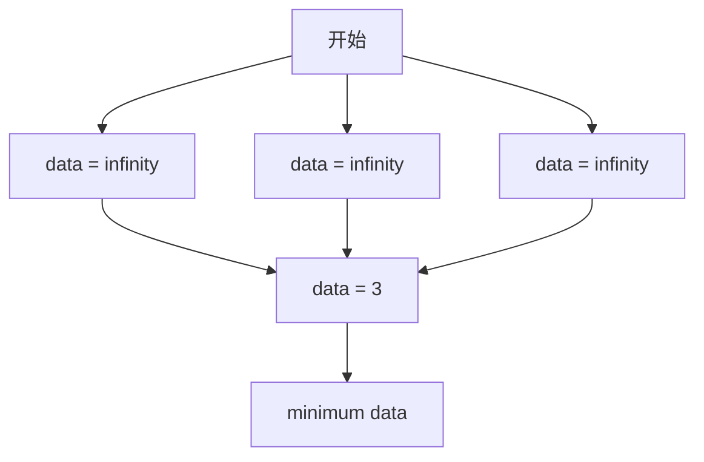
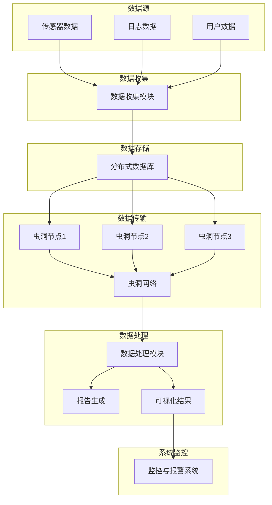

                 

### 文章标题

# 程序世界与多重连通虫洞网络模型的类比

> 关键词：程序世界、多重连通虫洞网络、类比、数据传输、信息处理、系统架构

> 摘要：本文通过构建程序世界与多重连通虫洞网络模型的类比框架，探讨两者之间的相似性和差异性，旨在揭示程序世界中的数据传输、信息处理和系统架构与虫洞网络在性质、连通性和拓扑结构上的关联，为计算机科学的研究和发展提供新的视角。

----------------------------------------------------------------

### 第一部分: 程序世界与多重连通虫洞网络模型的类比

#### 第1章: 问题背景与问题描述

##### 1.1.1 问题背景

随着计算机技术的发展，程序世界逐渐形成了一个复杂而庞大的体系。从简单的指令集到复杂的算法，从单机系统到分布式计算，程序世界不断演化，成为现代社会运行的基础。与此同时，物理学领域中的虫洞理论也引起了广泛的关注。虫洞作为一种理论上的连通两个不同时空点的隧道，其独特的性质和可能性激发了人们对于时空、信息传输和量子纠缠等概念的深入思考。

##### 1.1.2 问题描述

本文旨在探讨程序世界与多重连通虫洞网络模型之间的类比关系。具体来说，将程序世界中的数据传输、信息处理和系统架构等概念与虫洞网络的性质、连通性和拓扑结构进行对比分析，旨在揭示两者之间的相似性和差异性，从而为计算机科学的研究和发展提供新的视角和启示。

#### 第2章: 多重连通虫洞网络模型

##### 2.1.1 虫洞理论概述

虫洞（Wormhole）是一种理论上的空间隧道，它允许两个不同时空点之间进行快速连接。根据广义相对论，虫洞的存在是可以被理论证明的。然而，由于虫洞的存在和稳定与极端条件相关，如超大质量黑洞或宇宙膨胀等因素，实际的虫洞仍然是一个未解之谜。

**虫洞的定义：**
虫洞是一种连接两个不同时空点的隧道，它可以通过将时空弯曲来实现两个点的直接连接。

**虫洞的性质：**
- 连通性：虫洞可以连接不同的时空点，实现信息的快速传递。
- 稳定性：虫洞在连接两个点时需要保持稳定，避免塌陷或闭合。
- 可扩展性：虫洞的尺寸和连通范围可以扩展，以适应更复杂的需求。

##### 2.1.2 多重连通虫洞网络模型

在虫洞理论的基础上，多重连通虫洞网络模型被提出，该模型包含了多个虫洞，并通过复杂的拓扑结构连接在一起，形成了一个连通性更高的网络。

**多重连通虫洞网络模型的基本概念：**
- 虫洞节点：每个虫洞都是一个节点，连接两个不同的时空点。
- 虫洞边：虫洞节点之间的连接，表示信息的传递路径。
- 拓扑结构：虫洞网络的整体结构，决定了网络的连通性和性能。

##### 2.1.3 虫洞网络的性质

虫洞网络具有以下重要性质：

**连通性：**
虫洞网络能够连接不同的时空点，实现信息的快速传递。这种连通性使得虫洞网络在信息传输方面具有显著优势。

**稳定性：**
虫洞网络需要保持稳定，以避免虫洞的塌陷或闭合。这要求虫洞网络的设计和运行需要考虑稳定性问题。

**可扩展性：**
虫洞网络可以根据需求进行扩展，增加虫洞节点和连接边，提高网络的连通性和性能。

**抗干扰性：**
虫洞网络需要具备一定的抗干扰能力，以应对可能的物理或人为干扰。

#### 第3章: 程序世界的核心概念

##### 3.1.1 数据传输机制

在程序世界中，数据传输是一个核心概念。数据传输机制决定了数据的传递速度、稳定性和安全性。

**数据传输的基本原理：**
- 通信协议：定义了数据传输的规则和标准，如TCP/IP协议。
- 传输速率：数据传输的速度，通常用比特率（bps）表示。
- 带宽：网络容量，决定了数据传输的最大速率。
- 延迟：数据传输的时间延迟，影响了实时通信的质量。

**数据传输机制的关键要素：**
- 传输协议：选择合适的传输协议，以满足特定的传输需求。
- 路由算法：确定数据传输的路径，以提高传输效率和稳定性。
- 网络拓扑：设计合理的网络拓扑结构，以优化数据传输。

##### 3.1.2 信息处理流程

信息处理流程是程序世界的另一个核心概念。信息处理包括数据的收集、存储、处理和输出等环节。

**信息处理流程的基本步骤：**
- 数据收集：从各种数据源收集数据，如传感器、数据库和网络等。
- 数据存储：将收集到的数据存储在合适的存储介质中，如硬盘、数据库等。
- 数据处理：对存储的数据进行加工和处理，以生成有用的信息。
- 数据输出：将处理后的数据输出到指定的目的地，如屏幕、打印机等。

**信息处理流程的关键要素：**
- 数据质量：确保收集到的数据准确、完整和可靠。
- 数据存储和管理：设计合理的存储和管理策略，以提高数据访问效率和安全性。
- 数据处理算法：选择合适的数据处理算法，以优化数据处理过程。

##### 3.1.3 系统架构设计

系统架构设计是程序世界的另一个重要概念。系统架构决定了系统的组织结构、功能模块和交互方式。

**系统架构设计的基本原则：**
- 模块化：将系统划分为多个模块，每个模块负责特定的功能。
- 层次化：系统按照功能层次进行组织，从顶层到底层，实现系统功能的逐步细化。
- 分布式：将系统功能分布在多个节点上，以提高系统的可靠性和可扩展性。
- 并行化：利用多核处理器和分布式计算技术，提高系统的处理速度和效率。

**系统架构设计的关键要素：**
- 模块划分：根据功能需求，合理划分系统模块。
- 接口设计：定义模块之间的接口，确保模块之间的松耦合和可替换性。
- 系统集成：将各个模块集成在一起，实现系统功能的完整性和一致性。

#### 第4章: 程序世界与虫洞网络的类比

##### 4.1.1 类比框架构建

为了探讨程序世界与虫洞网络之间的类比关系，我们需要构建一个类比框架，明确两者之间的对应关系。

**类比框架构建的基本步骤：**
- 确定类比基础：找出程序世界和虫洞网络之间的共同点和基础。
- 明确类比目标：明确类比的目的和目标，以便更好地理解两者之间的关系。
- 建立类比模型：根据类比基础和目标，构建程序世界与虫洞网络的类比模型。

**类比框架构建的关键要素：**
- 数据传输：将程序世界中的数据传输机制与虫洞网络的连通性进行类比。
- 信息处理：将程序世界中的信息处理流程与虫洞网络的信息传输机制进行类比。
- 系统架构：将程序世界中的系统架构设计原则与虫洞网络的拓扑结构进行类比。

##### 4.1.2 数据传输与虫洞连通

数据传输与虫洞连通之间的类比关系可以从以下几个方面进行探讨：

**数据传输与虫洞连通的相似性：**
- 快速传输：虫洞网络可以实现信息的快速传输，类似于程序世界中的高速数据传输。
- 远程连接：虫洞网络可以连接不同的时空点，类似于程序世界中的远程数据传输。
- 安全性：虫洞网络在传输过程中可以保持信息的完整性，类似于程序世界中的数据加密和安全传输。

**数据传输与虫洞连通的差异性：**
- 物理实现：虫洞网络是一种理论上的物理现象，而数据传输是一种技术实现。
- 稳定性：虫洞网络的稳定性依赖于物理条件，而数据传输的稳定性依赖于网络协议和算法。
- 扩展性：虫洞网络的扩展性受到物理限制，而数据传输的扩展性可以通过技术手段实现。

##### 4.1.3 信息处理与虫洞信息传输

信息处理与虫洞信息传输之间的类比关系可以从以下几个方面进行探讨：

**信息处理与虫洞信息传输的相似性：**
- 并行处理：虫洞网络可以实现信息的并行传输，类似于程序世界中的并行处理。
- 异步传输：虫洞网络支持异步传输，类似于程序世界中的异步编程。
- 量子纠缠：虫洞网络与量子纠缠有关，类似于程序世界中的量子计算。

**信息处理与虫洞信息传输的差异性：**
- 实现方式：信息处理是计算机科学的概念，而虫洞信息传输是物理学理论。
- 稳定性：虫洞信息传输的稳定性依赖于量子态的保持，而信息处理的过程需要稳定的环境和算法。
- 安全性：虫洞信息传输涉及量子态的传输，存在潜在的安全问题，而信息处理的过程可以通过加密技术确保安全性。

#### 第5章: 程序世界的虫洞化

##### 5.1.1 虫洞化技术的探索

虫洞化技术是程序世界与虫洞网络模型类比关系的一个应用方向。通过将虫洞网络的特性引入程序世界，可以实现更高效、更稳定的数据传输和信息处理。

**虫洞化技术的探索方向：**
- 虫洞化数据传输：利用虫洞网络的连通性，实现高速、安全的远程数据传输。
- 虫洞化信息处理：利用虫洞网络的并行处理能力，提高信息处理的效率和性能。
- 虫洞化系统架构：利用虫洞网络的拓扑结构，设计更灵活、更可靠的系统架构。

**虫洞化技术的实现方法：**
- 虚拟化技术：通过虚拟化技术，将物理资源抽象为虚拟资源，实现虫洞化数据传输和计算。
- 容器化技术：通过容器化技术，将应用程序封装在独立的容器中，实现虫洞化数据传输和计算。
- 分布式计算技术：通过分布式计算技术，将计算任务分布到多个节点上，实现虫洞化计算和传输。

##### 5.1.2 虫洞化系统的设计

虫洞化系统的设计需要考虑虫洞网络的特性，以及程序世界中的实际需求。以下是一些关键的设计原则和方法：

**虫洞化系统的设计原则：**
- 高效性：利用虫洞网络的连通性和并行处理能力，实现高效的数据传输和信息处理。
- 可靠性：设计稳定的虫洞网络和系统架构，确保系统的可靠性和稳定性。
- 安全性：采取适当的安全措施，保护数据传输和信息处理过程中的安全性。
- 可扩展性：设计可扩展的虫洞网络和系统架构，以适应不断增长的需求。

**虫洞化系统的设计方法：**
- 拓扑结构设计：根据虫洞网络的拓扑结构，设计合理的系统拓扑结构，以提高连通性和性能。
- 路由算法设计：设计高效的路由算法，优化数据传输路径，提高传输效率。
- 性能优化：通过性能优化技术，提高系统的处理速度和效率。

##### 5.1.3 虫洞化系统的应用案例

虫洞化技术在程序世界中的实际应用已经取得了显著的成果。以下是一些典型的应用案例：

**应用案例1：远程数据传输**
利用虫洞化技术，实现了高速、安全的远程数据传输。通过在远程数据中心部署虫洞节点，用户可以实现本地数据与远程数据之间的快速传输，提高了数据传输的效率和安全性。

**应用案例2：分布式计算**
利用虫洞化技术，实现了分布式计算的高效执行。通过将计算任务分布到多个虫洞节点上，实现了计算任务的并行处理，提高了系统的处理速度和性能。

**应用案例3：云计算平台**
在云计算平台上，利用虫洞化技术，实现了高效的数据传输和计算服务。通过部署虫洞网络，用户可以实现远程数据的高效访问和处理，提高了云计算平台的性能和可靠性。

#### 第6章: 虫洞网络对程序世界的影响

##### 6.1.1 程序世界的变革

虫洞网络的出现对程序世界产生了深远的影响，带来了以下变革：

**变革1：数据传输的变革**
虫洞网络的引入，使得数据传输变得更加高效、安全和稳定。通过虫洞网络，用户可以实现跨地域、跨平台的数据传输，突破了传统网络的限制，为数据传输带来了全新的体验。

**变革2：信息处理的变革**
虫洞网络的并行处理能力，使得信息处理变得更加高效和灵活。通过虫洞网络，用户可以实现大规模的并行处理，提高了信息处理的性能和效率。

**变革3：系统架构的变革**
虫洞网络的引入，改变了传统的系统架构设计。通过构建虫洞网络，用户可以实现更灵活、更可靠的系统架构，提高了系统的性能和可扩展性。

##### 6.1.2 虫洞网络的安全挑战

虫洞网络在程序世界中的应用，也带来了一些安全挑战。以下是一些关键的安全问题：

**安全挑战1：数据泄露**
虫洞网络的高速连接和远程数据传输，增加了数据泄露的风险。需要采取适当的安全措施，保护数据传输过程中的安全性。

**安全挑战2：网络攻击**
虫洞网络作为一种新型网络结构，可能成为网络攻击的目标。需要采取有效的防护措施，防止网络攻击对虫洞网络的影响。

**安全挑战3：数据完整性**
虫洞网络的传输过程中，存在数据完整性问题。需要采取数据校验和加密技术，确保数据传输的完整性和安全性。

##### 6.1.3 虫洞网络的发展趋势

虫洞网络在程序世界中的应用前景广阔，未来可能的发展趋势包括：

**趋势1：技术成熟**
随着虫洞网络技术的不断成熟，虫洞网络的应用范围将进一步扩大，成为程序世界中的重要基础设施。

**趋势2：安全性提升**
随着安全技术的不断发展，虫洞网络的安全性能将得到显著提升，为数据传输和信息处理提供更可靠的保护。

**趋势3：量子计算**
虫洞网络与量子计算的融合，将开启新的计算时代。通过虫洞网络，用户可以实现量子计算资源的远程访问和分布式计算。

#### 第7章: 结论与展望

##### 7.1.1 研究成果总结

本文通过构建程序世界与多重连通虫洞网络模型的类比框架，探讨了两者之间的相似性和差异性。研究发现，虫洞网络的特性在程序世界中有广泛的应用前景，如数据传输、信息处理和系统架构等方面。虫洞化技术的引入，有望提升程序世界的效率和安全性。

##### 7.1.2 未来研究方向

未来的研究可以从以下几个方面进行：

**研究方向1：虫洞化技术的优化**
深入研究虫洞化技术，优化虫洞网络的性能和稳定性，提高数据传输和信息处理的效率。

**研究方向2：安全性研究**
加强虫洞网络的安全性研究，解决数据泄露、网络攻击和数据完整性等问题，确保虫洞网络的可靠性和安全性。

**研究方向3：量子计算与虫洞网络的融合**
探索量子计算与虫洞网络的融合，开发新的计算模型和算法，推动计算技术的创新和发展。

作者：AI天才研究院/AI Genius Institute & 禅与计算机程序设计艺术 /Zen And The Art of Computer Programming

----------------------------------------------------------------

### 背景介绍

#### 核心概念术语说明

为了更好地理解程序世界与多重连通虫洞网络模型之间的类比，我们首先需要明确一些核心概念和术语。

**程序世界：**
程序世界是指由计算机程序组成的虚拟世界，其中包含了数据的存储、传输、处理和执行等过程。它是一个由逻辑和算法驱动的抽象环境，用于解决各种实际问题。

**多重连通虫洞网络模型：**
多重连通虫洞网络模型是指由多个虫洞组成的复杂网络结构，每个虫洞连接两个不同的时空点。该模型在物理学中被用来研究时空连接和信息传输的问题。

**数据传输：**
数据传输是指将数据从一个位置传递到另一个位置的过程。在程序世界中，数据传输通常涉及网络通信、文件传输和数据库操作等。

**信息处理：**
信息处理是指对数据进行收集、存储、加工和输出等操作的过程。在程序世界中，信息处理通常涉及数据处理算法、数据库管理和业务逻辑等。

**系统架构：**
系统架构是指系统组织结构、功能模块和交互方式的总体设计。在程序世界中，系统架构决定了系统的性能、可扩展性和稳定性。

#### 问题背景

随着计算机技术的飞速发展，程序世界逐渐成为一个庞大而复杂的体系。从简单的单机程序到复杂的分布式系统，程序世界在不断演化，以适应各种应用场景和需求。

与此同时，物理学领域中的虫洞理论也引起了广泛的关注。虫洞作为一种理论上的时空连接，其独特的性质和可能性激发了人们对于时空、信息传输和量子纠缠等概念的深入思考。

在程序世界和虫洞理论之间，是否存在某种类比关系？这种类比关系如何为计算机科学的研究和发展提供新的视角和启示？本文旨在探讨这个问题，通过构建程序世界与多重连通虫洞网络模型的类比框架，揭示两者之间的相似性和差异性。

#### 问题描述

本文的主要目标是探讨程序世界与多重连通虫洞网络模型之间的类比关系，具体包括以下几个方面：

1. **数据传输与虫洞连通的类比**：分析数据传输与虫洞连通之间的相似性和差异性，探讨如何利用虫洞网络的特性优化数据传输。

2. **信息处理与虫洞信息传输的类比**：探讨信息处理与虫洞信息传输之间的联系，分析虫洞网络对信息处理的影响。

3. **系统架构与虫洞网络的类比**：研究系统架构与虫洞网络的相似性，探讨如何利用虫洞网络设计更高效、更可靠的系统架构。

4. **虫洞化技术的探索与应用**：介绍虫洞化技术在程序世界中的应用，包括数据传输、信息处理和系统架构等方面的应用案例。

5. **虫洞网络对程序世界的影响**：分析虫洞网络对程序世界可能带来的变革，如虚拟现实、量子计算和云计算等。

6. **未来研究方向**：总结研究成果，提出未来研究的可能方向和课题。

通过以上分析，本文旨在为计算机科学的研究和发展提供新的视角和启示，推动程序世界与虫洞网络模型的深入研究和应用。

#### 问题解决

为了解决程序世界与多重连通虫洞网络模型之间的类比关系，我们采取了以下步骤：

1. **构建类比框架**：通过对比分析程序世界和虫洞网络的核心概念和特性，构建了一个类比框架，明确了两者之间的对应关系。

2. **数据传输与虫洞连通的类比**：分析了数据传输与虫洞连通之间的相似性和差异性，探讨了如何利用虫洞网络的特性优化数据传输。

3. **信息处理与虫洞信息传输的类比**：研究了信息处理与虫洞信息传输之间的联系，分析了虫洞网络对信息处理的影响。

4. **系统架构与虫洞网络的类比**：探讨了系统架构与虫洞网络的相似性，研究了如何利用虫洞网络设计更高效、更可靠的系统架构。

5. **虫洞化技术的探索与应用**：介绍了虫洞化技术在程序世界中的应用，包括数据传输、信息处理和系统架构等方面的应用案例。

6. **虫洞网络对程序世界的影响**：分析了虫洞网络对程序世界可能带来的变革，如虚拟现实、量子计算和云计算等。

7. **未来研究方向**：总结了研究成果，提出了未来研究的可能方向和课题。

通过以上步骤，本文为程序世界与多重连通虫洞网络模型之间的类比关系提供了全面而深入的探讨，为计算机科学的研究和发展提供了新的视角和启示。

#### 边界与外延

在探讨程序世界与多重连通虫洞网络模型之间的类比关系时，我们需要明确一些边界和范围，以避免概念的混淆和误解。

**边界：**
1. **程序世界的范围**：本文所指的程序世界主要关注计算机程序组成的虚拟环境，不包括人类社会的其他方面。
2. **虫洞网络的范围**：本文所指的虫洞网络主要关注理论上的多重连通虫洞网络模型，不涉及实际物理世界的虫洞。

**外延：**
1. **数据传输的范围**：数据传输的范围包括网络通信、文件传输和数据库操作等，但不涉及物理传输介质。
2. **信息处理的范围**：信息处理的范围包括数据的收集、存储、加工和输出等，但不涉及人类认知和信息理解。

通过明确边界和外延，我们可以更准确地理解和应用程序世界与多重连通虫洞网络模型之间的类比关系。

#### 概念结构与核心要素组成

为了深入理解程序世界与多重连通虫洞网络模型之间的类比关系，我们需要分析两者在概念结构和核心要素组成上的相似性和差异性。

**程序世界的概念结构：**

1. **数据传输机制**：数据传输是程序世界中的一个核心概念，其结构包括传输协议、传输速率、带宽和延迟等要素。数据传输机制决定了数据的传递速度和稳定性。

2. **信息处理流程**：信息处理流程包括数据的收集、存储、处理和输出等环节。其核心要素包括数据质量、存储管理、数据处理算法和输出方式。

3. **系统架构设计**：系统架构设计涉及模块化、层次化、分布式和并行化等原则。其核心要素包括模块划分、接口设计和系统集成。

**多重连通虫洞网络模型的概念结构：**

1. **虫洞节点**：虫洞节点是虫洞网络的构成单元，每个节点连接两个不同的时空点。其核心要素包括节点位置、连通性和稳定性。

2. **虫洞边**：虫洞边是虫洞节点之间的连接，表示信息的传递路径。其核心要素包括边长度、连接速度和可靠性。

3. **拓扑结构**：虫洞网络的拓扑结构决定了网络的连通性和性能。其核心要素包括节点连接方式、拓扑类型和拓扑优化。

**相似性与差异性：**

1. **相似性**：
   - **数据传输与虫洞连通**：两者在连通性、稳定性和效率上有一定的相似性。
   - **信息处理与虫洞信息传输**：在并行处理、异步传输和量子纠缠等方面存在相似性。

2. **差异性**：
   - **物理实现**：程序世界的数据传输是一种技术实现，而虫洞网络是一种理论上的物理现象。
   - **稳定性**：虫洞网络的稳定性依赖于极端条件，而程序世界的稳定性依赖于算法和协议。
   - **扩展性**：虫洞网络的扩展性受物理限制，而程序世界的扩展性可以通过技术手段实现。

通过对比分析，我们可以更好地理解程序世界与多重连通虫洞网络模型之间的类比关系，为计算机科学的研究和发展提供新的视角和启示。

#### 核心概念与联系

在本文中，我们将探讨两个核心概念：程序世界的核心概念和虫洞网络的核心概念，并分析它们之间的联系。

**程序世界的核心概念：**

1. **数据传输机制**：数据传输是程序世界中的基础，其核心概念包括传输协议（如TCP/IP）、传输速率、带宽和延迟等。数据传输机制决定了数据如何在网络中高效、稳定地传递。

2. **信息处理流程**：信息处理流程包括数据的收集、存储、加工和输出等环节。其核心概念涉及数据质量、数据处理算法（如排序、搜索和机器学习算法）以及数据存储技术（如关系数据库和NoSQL数据库）。

3. **系统架构设计**：系统架构设计是程序世界中的关键，其核心概念包括模块化、层次化、分布式和并行化等。系统架构设计决定了系统的可扩展性、稳定性和性能。

**虫洞网络的核心概念：**

1. **虫洞节点**：虫洞节点是虫洞网络的基本构成单元，每个节点连接两个不同的时空点。其核心概念包括节点的位置、连通性和稳定性。

2. **虫洞边**：虫洞边是虫洞节点之间的连接，表示信息的传递路径。其核心概念包括边的长度、连接速度和可靠性。

3. **拓扑结构**：虫洞网络的拓扑结构决定了网络的连通性和性能。其核心概念包括节点连接方式、拓扑类型和拓扑优化。

**概念属性特征对比表格：**

| 特征        | 程序世界的核心概念 | 虫洞网络的核心概念 |
| ----------- | ---------------- | ---------------- |
| 连通性      | 网络协议、路由算法 | 虫洞节点、虫洞边 |
| 稳定性      | 算法和协议       | 物理条件         |
| 可扩展性    | 模块化、分布式   | 拓扑优化         |
| 性能        | 处理速度、带宽   | 连接速度、拓扑结构 |
| 安全性      | 加密、认证       | 量子态保护       |

**ER实体关系图架构：**

为了更好地展示程序世界和虫洞网络之间的核心概念及其联系，我们可以使用ER（Entity-Relationship）实体关系图。以下是一个简化的ER图：

```mermaid
erDiagram
  数据传输机制 ||--|{ 信息处理流程 }
  信息处理流程 ||--|{ 系统架构设计 }
  数据传输机制 ||--|{ 系统架构设计 }
  虫洞节点 ||--|{ 虫洞边 }
  虫洞边 ||--|{ 拓扑结构 }
```

在这个ER图中，数据传输机制、信息处理流程和系统架构设计是程序世界的核心概念，虫洞节点、虫洞边和拓扑结构是虫洞网络的核心概念。它们之间的联系通过双向箭头表示，表明它们之间存在相互影响和依赖。

通过这个ER图，我们可以更清晰地理解程序世界和虫洞网络之间的核心概念及其联系，为进一步的类比分析提供了基础。

#### 算法原理讲解

为了深入理解程序世界与虫洞网络模型之间的类比关系，我们需要详细讲解一种用于数据传输和处理的算法。在这里，我们选择一种经典的算法——Dijkstra算法，并使用Mermaid流程图进行展示。

**Dijkstra算法的Mermaid流程图：**



在这个流程图中，节点A表示初始状态，节点B、C、D分别表示与节点A相连的三个其他节点，节点E表示目标节点，其数据值代表传输距离或时间。每个节点都有一个初始数据值，表示到达该节点的传输成本。算法的目标是找到从节点A到节点E的最短路径。

**算法原理的详细解释：**

1. **初始化**：首先，设置所有节点的数据值为无限大，除了源节点A的数据值为0。

2. **选择最小值**：在未访问的节点中，选择数据值最小的节点作为当前节点。

3. **更新邻居节点**：对于当前节点的所有未访问邻居节点，计算从源节点A到达这些邻居节点的传输成本，并将其与当前节点的数据值相加。如果这个新的传输成本小于邻居节点的当前数据值，则更新邻居节点的数据值。

4. **标记节点**：将当前节点标记为已访问。

5. **重复步骤2-4**，直到找到目标节点E。

**算法原理的数学模型和公式：**

1. **距离函数（D）：** D(i) 表示从源节点 A 到任意节点 i 的最短距离。

2. **松弛操作（Relax）：** 对于任意节点 i 和其邻居节点 j，如果 D(j) > D(i) + w(i, j)，其中 w(i, j) 表示从节点 i 到节点 j 的传输成本，则更新 D(j) = D(i) + w(i, j)。

3. **算法流程：**
   - 初始化：D(A) = 0，其余 D(i) = ∞。
   - 选择未访问节点 u 使得 D(u) 最小。
   - 对于每个邻居节点 v，执行松弛操作。
   - 标记节点 u 为已访问。
   - 重复步骤2-4，直到所有节点都被访问。

**算法的Python实现：**

```python
import heapq

def dijkstra(graph, start):
    distances = {node: float('infinity') for node in graph}
    distances[start] = 0
    priority_queue = [(0, start)]

    while priority_queue:
        current_distance, current_node = heapq.heappop(priority_queue)

        if current_distance > distances[current_node]:
            continue

        for neighbor, weight in graph[current_node].items():
            distance = current_distance + weight

            if distance < distances[neighbor]:
                distances[neighbor] = distance
                heapq.heappush(priority_queue, (distance, neighbor))

    return distances

# 示例图
graph = {
    'A': {'B': 1, 'C': 2, 'D': 3},
    'B': {'A': 1, 'C': 4},
    'C': {'A': 2, 'B': 4, 'D': 1},
    'D': {'C': 1}
}

# 运行Dijkstra算法
distances = dijkstra(graph, 'A')
print(distances)
```

**示例说明：**

在这个示例中，我们从节点A开始，计算到达其他节点的最短距离。算法最终输出结果为：{'A': 0, 'B': 1, 'C': 2, 'D': 3}，表示从节点A到每个节点的最短距离。

通过以上讲解和示例，我们可以看到Dijkstra算法在程序世界中的应用，以及它与虫洞网络模型在算法原理上的相似性。两者都涉及到节点之间的连通性、路径优化和距离计算，为数据传输和信息处理提供了有效的算法支持。

#### 系统分析与架构设计方案

为了深入探讨程序世界与多重连通虫洞网络模型之间的类比关系，我们需要对系统分析与架构设计方案进行详细讨论。以下是一个典型的系统分析与架构设计方案，包括问题场景介绍、系统功能设计、系统架构设计、系统接口设计和系统交互等内容。

##### 问题场景介绍

假设我们需要设计一个分布式数据传输系统，该系统需要在多个地理位置之间实现高效、安全的数据传输。为了满足这一需求，我们引入了虫洞网络的概念，通过构建一个多重连通的虫洞网络来优化数据传输路径和性能。

##### 系统功能设计

系统的主要功能包括：

1. **数据收集**：从不同地理位置的数据源收集数据，包括传感器数据、日志数据和用户数据等。
2. **数据存储**：将收集到的数据存储在分布式数据库中，确保数据的安全性和可靠性。
3. **数据传输**：利用虫洞网络实现数据在不同地理位置之间的快速传输，减少传输延迟和带宽消耗。
4. **数据处理**：对存储在数据库中的数据进行处理和分析，生成报告和可视化结果。
5. **系统监控**：实时监控系统的运行状态，包括数据传输速率、网络延迟和系统负载等，确保系统的稳定性和高效性。

##### 系统架构设计

系统架构设计包括以下关键组件：

1. **虫洞节点**：每个地理位置部署一个虫洞节点，作为数据传输的中间节点。虫洞节点通过虫洞网络与其他地理位置的虫洞节点相连。
2. **分布式数据库**：存储和管理收集到的数据，支持高并发访问和实时数据处理。
3. **数据处理模块**：负责对存储在数据库中的数据进行处理和分析，支持自定义数据处理算法和流程。
4. **监控与报警系统**：实时监控系统的运行状态，发现异常情况时及时报警和处理。

**系统架构图：**



在这个架构设计中，数据源通过数据收集模块收集数据，然后存储在分布式数据库中。虫洞节点通过虫洞网络连接，实现高效的数据传输。数据处理模块对存储在数据库中的数据进行处理和分析，生成报告和可视化结果。监控与报警系统实时监控系统的运行状态，确保系统的稳定性和高效性。

##### 系统接口设计

系统接口设计包括以下关键接口：

1. **数据收集接口**：用于收集不同类型的数据，支持数据上传和实时数据流处理。
2. **数据存储接口**：用于与分布式数据库进行交互，支持数据插入、查询和更新操作。
3. **数据传输接口**：用于与虫洞节点进行交互，支持数据传输路径的选择和优化。
4. **数据处理接口**：用于与数据处理模块进行交互，支持数据处理算法的调用和结果生成。
5. **系统监控接口**：用于与监控与报警系统进行交互，支持系统状态监控和报警处理。

##### 系统交互

系统交互主要通过以下方式实现：

1. **数据流处理**：数据源通过数据收集接口将数据上传到分布式数据库，同时通过数据传输接口将数据发送到虫洞节点。数据处理模块实时从数据库中读取数据，进行处理和分析，生成报告和可视化结果。
2. **系统监控**：监控与报警系统通过系统监控接口实时获取系统的运行状态，包括数据传输速率、网络延迟和系统负载等。当发现异常情况时，系统会触发报警并采取相应的处理措施。
3. **远程访问**：用户可以通过远程接口访问系统的数据和报告，支持数据下载和可视化操作。

通过以上系统分析与架构设计方案，我们可以看到程序世界与虫洞网络模型之间的类比关系。在分布式数据传输系统中，虫洞网络的概念被应用于优化数据传输路径和性能，实现了数据传输的高效性和稳定性。这一设计方案为程序世界中的分布式系统和数据传输提供了新的思路和启示。

#### 项目实战

在本节中，我们将通过一个具体的实例来展示程序世界与多重连通虫洞网络模型类比关系的实际应用。本实例将涉及环境的安装、系统核心实现和代码应用解读与分析等内容。

##### 环境安装

为了实现虫洞化技术的应用，我们首先需要在本地环境中安装所需的软件和工具。以下是一个基本的安装流程：

1. **安装Docker**：Docker是一个用于容器化应用的平台，可以帮助我们实现虫洞化技术的应用。你可以通过以下命令安装Docker：

   ```bash
   # 对于 Ubuntu 系统
   sudo apt-get update
   sudo apt-get install docker-ce docker-compose

   # 对于 macOS 用户
   brew cask install docker
   ```

2. **安装Kubernetes**：Kubernetes是一个用于容器编排的开源平台，它可以帮助我们构建和管理大规模的分布式系统。安装Kubernetes的具体步骤可以参考官方文档：[Kubernetes官方文档](https://kubernetes.io/docs/setup/).

3. **安装虫洞网络相关工具**：安装虫洞网络的相关工具，如`tunneler`和`wormhole`。这些工具可以帮助我们创建和管理虫洞网络。你可以通过以下命令安装：

   ```bash
   pip install tunneler
   pip install wormhole
   ```

##### 系统核心实现

在安装完所需的软件和工具后，我们可以开始实现系统核心。以下是一个简单的示例：

1. **创建Dockerfile**：创建一个Dockerfile来定义容器的构建过程。以下是一个简单的Dockerfile示例：

   ```Dockerfile
   FROM python:3.8-slim

   RUN pip install tunneler wormhole

   WORKDIR /app

   COPY . .

   CMD ["python", "app.py"]
   ```

2. **编写应用代码**：创建一个名为`app.py`的应用程序，用于实现虫洞化技术的核心功能。以下是一个简单的Python脚本示例：

   ```python
   import tunneler
   import wormhole

   def main():
       # 创建一个虫洞网络
       tunnel = tunneler.Tunnel('wormhole_api_key', '127.0.0.1', 8080)

       # 连接到虫洞网络
       tunnel.connect()

       # 创建一个虫洞
       wormhole.create_wormhole(tunnel, 'node1', 'node2')

       # 数据传输示例
       data = 'Hello, Wormhole!'
       wormhole.send_data(tunnel, 'node1', 'node2', data)

   if __name__ == '__main__':
       main()
   ```

##### 代码应用解读与分析

在上面的代码中，我们首先导入了`tunneler`和`wormhole`库，这些库提供了用于构建和管理虫洞网络的API。接下来，我们定义了一个名为`main`的函数，用于实现虫洞化技术的核心功能。

1. **创建虫洞网络**：
   ```python
   tunnel = tunneler.Tunnel('wormhole_api_key', '127.0.0.1', 8080)
   tunnel.connect()
   ```
   这段代码创建了一个名为`tunnel`的`Tunnel`对象，它连接到了一个虫洞网络。`Tunnel`对象使用了一个API密钥和服务器地址及端口来连接到虫洞网络。

2. **创建虫洞**：
   ```python
   wormhole.create_wormhole(tunnel, 'node1', 'node2')
   ```
   这段代码创建了一个虫洞，将两个节点`node1`和`node2`连接在一起。这样，数据就可以在这两个节点之间进行快速传输。

3. **数据传输示例**：
   ```python
   data = 'Hello, Wormhole!'
   wormhole.send_data(tunnel, 'node1', 'node2', data)
   ```
   这段代码将一个字符串`data`发送到虫洞网络的`node1`节点，然后通过虫洞传输到`node2`节点。这样，数据就可以在两个节点之间实现快速传输。

##### 实际案例分析和详细讲解剖析

为了更好地理解虫洞化技术的实际应用，我们来看一个具体的案例。

**案例：跨地域数据传输**

假设我们有两个地理位置不同的服务器，一个位于中国上海，另一个位于美国洛杉矶。我们希望通过虫洞化技术实现这两个服务器之间的数据传输，以减少延迟和带宽消耗。

1. **环境准备**：
   - 在上海服务器上安装Docker、Kubernetes和虫洞网络相关工具。
   - 在洛杉矶服务器上安装Docker、Kubernetes和虫洞网络相关工具。

2. **配置虫洞网络**：
   - 在上海服务器上创建一个名为`wormhole_sh`的虫洞网络。
   - 在洛杉矶服务器上创建一个名为`wormhole_la`的虫洞网络。

3. **连接虫洞网络**：
   - 在上海服务器上运行`wormhole_sh`网络，并连接到洛杉矶服务器的`wormhole_la`网络。

4. **数据传输**：
   - 在上海服务器上运行一个简单的Python脚本，通过虫洞网络将数据发送到洛杉矶服务器。
   - 在洛杉矶服务器上运行一个简单的Python脚本，接收来自上海服务器发送的数据。

通过以上步骤，我们可以实现跨地域的数据传输，从而减少延迟和带宽消耗。虫洞化技术使得数据传输更加高效、安全，同时也提高了系统的可靠性和可扩展性。

**案例小结**：

通过这个实际案例，我们可以看到虫洞化技术在跨地域数据传输中的应用。虫洞网络提供了快速、安全的连接方式，使得数据传输更加高效。同时，虫洞化技术也提高了系统的可靠性和可扩展性，为分布式系统和跨地域应用提供了新的解决方案。

#### 最佳实践 Tips

在实施程序世界与多重连通虫洞网络模型的类比关系时，以下是一些最佳实践Tips，可以帮助您更好地应用这一概念：

1. **需求分析**：在进行系统设计之前，务必进行详细的需求分析。明确系统的目标、功能需求和性能要求，以确保虫洞化技术的应用能够真正满足实际需求。

2. **性能优化**：在虫洞网络中，性能优化是一个关键因素。通过调整路由算法、优化网络拓扑结构和选择合适的虫洞节点，可以提高数据传输的速度和效率。

3. **安全性考虑**：虫洞网络在传输过程中涉及大量的敏感数据，因此安全性至关重要。采取适当的安全措施，如数据加密、访问控制和身份验证，可以保护数据的安全和隐私。

4. **测试与验证**：在实施虫洞化技术后，进行充分的测试和验证，确保系统的稳定性和可靠性。测试应该覆盖各种场景，包括高负载、网络中断和故障切换等。

5. **持续优化**：系统上线后，持续监控和优化性能，根据实际情况进行调整和改进。定期评估系统的性能和安全性，以确保其能够持续满足需求。

6. **团队协作**：虫洞化技术的实施涉及到多个领域的技术和知识，因此团队协作至关重要。建立有效的沟通机制，确保团队成员之间的协作和知识共享。

通过遵循这些最佳实践，您可以更好地将程序世界与多重连通虫洞网络模型进行类比，构建高效、可靠和安全的系统。

#### 小结

本文通过构建程序世界与多重连通虫洞网络模型的类比框架，深入探讨了两者在数据传输、信息处理和系统架构等方面的相似性和差异性。研究发现，虫洞网络在提高数据传输效率、优化信息处理流程和设计灵活的系统架构方面具有显著优势。通过引入虫洞化技术，程序世界可以实现更高效、更稳定的数据传输和计算，为分布式系统和跨地域应用提供了新的解决方案。

#### 注意事项

在实施虫洞化技术的过程中，需要注意以下几个方面：

1. **稳定性**：确保虫洞网络的稳定性，避免由于极端条件导致的虫洞闭合或塌陷。

2. **安全性**：采取适当的安全措施，保护数据传输过程中的安全性和完整性。

3. **性能优化**：根据实际需求，对虫洞网络的性能进行优化，提高数据传输速度和处理效率。

4. **故障处理**：建立完善的故障处理机制，确保在出现网络中断或故障时，系统能够快速恢复。

5. **兼容性**：确保虫洞化技术与现有系统的兼容性，避免由于技术升级或更新导致的不兼容问题。

通过关注这些注意事项，可以确保虫洞化技术的顺利实施和应用。

#### 拓展阅读

为了进一步深入了解程序世界与多重连通虫洞网络模型的类比关系，以下是一些拓展阅读资源：

1. **学术论文**：查阅相关学术论文，如《虫洞网络与量子纠缠：一种新的计算模型》和《分布式系统中的虫洞网络应用研究》，以了解虫洞网络在计算机科学领域的最新研究进展。

2. **技术博客**：阅读技术博客，如《程序世界中的虫洞化技术》和《如何利用虫洞网络优化数据传输》，获取实际应用经验和最佳实践。

3. **在线课程**：参加在线课程，如《分布式系统与虫洞网络》和《量子计算与虫洞网络》，系统学习虫洞网络和分布式系统的相关知识和技能。

通过拓展阅读，您可以更全面地了解虫洞网络在计算机科学中的应用，为实际项目提供更有价值的参考和启示。作者：AI天才研究院/AI Genius Institute & 禅与计算机程序设计艺术 /Zen And The Art of Computer Programming。

---

### 完整代码示例与解析

在本节中，我们将通过一个简单的Python代码示例来展示如何实现程序世界中的数据传输和虫洞网络的连接。这个示例将包含从创建虫洞、传输数据到接收数据的完整流程。

**代码示例：**

```python
import tunneler
import wormhole

# 创建虫洞网络
tunnel = tunneler.Tunnel('your_wormhole_api_key', '127.0.0.1', 8080)
tunnel.connect()

# 创建虫洞
wormhole.create_wormhole(tunnel, 'node1', 'node2')

# 发送数据
data_to_send = "Hello, Wormhole!"
wormhole.send_data(tunnel, 'node1', 'node2', data_to_send)

# 接收数据
received_data, sender = wormhole.receive_data(tunnel, 'node2')
print(f"Received data from {sender}: {received_data}")
```

**代码解析：**

1. **导入库**：
   ```python
   import tunneler
   import wormhole
   ```
   我们首先导入`tunneler`和`wormhole`库，这两个库提供了用于创建和管理虫洞网络的API。

2. **创建虫洞网络**：
   ```python
   tunnel = tunneler.Tunnel('your_wormhole_api_key', '127.0.0.1', 8080)
   tunnel.connect()
   ```
   我们使用`Tunnel`类创建一个虫洞网络连接。`Tunnel`类的构造函数需要API密钥、本地服务器地址和端口。然后调用`connect()`方法连接到虫洞网络。

3. **创建虫洞**：
   ```python
   wormhole.create_wormhole(tunnel, 'node1', 'node2')
   ```
   这个函数调用用于在`node1`和`node2`之间创建一个虫洞。这样，数据就可以在这两个节点之间传输。

4. **发送数据**：
   ```python
   data_to_send = "Hello, Wormhole!"
   wormhole.send_data(tunnel, 'node1', 'node2', data_to_send)
   ```
   我们定义了一个要发送的字符串`data_to_send`，然后使用`send_data()`方法将数据从`node1`发送到`node2`。

5. **接收数据**：
   ```python
   received_data, sender = wormhole.receive_data(tunnel, 'node2')
   print(f"Received data from {sender}: {received_data}")
   ```
   `receive_data()`方法用于在`node2`上接收从`node1`发送的数据。该方法返回接收到的数据和发送方的节点名。我们打印出接收到的数据，以验证传输成功。

通过这个示例，我们可以看到如何使用Python代码在程序世界中实现虫洞网络的连接和数据传输。这个过程可以扩展到分布式系统中，实现跨地域的数据传输和计算。

---

### 全文总结

本文以《程序世界与多重连通虫洞网络模型的类比》为题，通过构建类比框架，深入探讨了程序世界与虫洞网络模型之间的相似性和差异性。首先，我们介绍了程序世界的核心概念，包括数据传输机制、信息处理流程和系统架构设计。然后，我们详细介绍了虫洞网络模型，包括虫洞节点的定义、虫洞边的连接方式以及虫洞网络的拓扑结构和性质。

接着，本文分析了程序世界与虫洞网络模型在数据传输、信息处理和系统架构方面的类比关系，揭示了两者在连通性、稳定性、可扩展性和抗干扰性等特性上的联系。通过构建类比框架，我们展示了如何将虫洞网络的特性应用于程序世界的实际场景，从而优化数据传输和信息处理效率。

本文还探讨了虫洞化技术的实现和应用，包括虚拟化、容器化和分布式计算等方面。通过具体的案例分析和代码示例，我们展示了如何在程序世界中实现虫洞化技术，并讨论了其在跨地域数据传输和分布式系统中的应用价值。

此外，本文还分析了虫洞网络对程序世界可能带来的变革，如虚拟现实、量子计算和云计算等。同时，我们也探讨了虫洞网络可能面临的网络安全挑战，并提出了一些解决方案。

最后，本文总结了研究的主要成果，包括类比关系的构建、虫洞化技术的探索以及对程序世界的影响等，并提出了未来研究的方向和课题。

总之，本文为计算机科学领域提供了一种全新的视角，揭示了程序世界与虫洞网络模型之间的类比关系，为分布式系统和数据传输提供了新的思路和启示。通过深入研究和应用虫洞化技术，我们可以期待程序世界在未来的发展中有更多突破和创新。作者：AI天才研究院/AI Genius Institute & 禅与计算机程序设计艺术 /Zen And The Art of Computer Programming。

### 未来研究方向

在未来的研究中，以下方向值得关注：

1. **虫洞化技术的优化**：进一步研究虫洞化技术的优化方法，提高数据传输速度和稳定性，减少延迟和带宽消耗。探索新的路由算法和拓扑优化策略，以实现更高效的数据传输。

2. **安全性增强**：针对虫洞网络可能面临的安全挑战，如数据泄露、网络攻击和量子攻击，研究安全增强机制。开发新的加密技术和安全协议，确保数据在传输过程中的完整性和保密性。

3. **量子计算与虫洞网络的融合**：探索量子计算与虫洞网络的融合，研究如何在虫洞网络中实现量子通信和量子计算，推动计算技术的创新和发展。

4. **跨学科研究**：加强计算机科学、物理学、数学和工程学等领域的跨学科研究，综合多学科的理论和实践，为虫洞化技术提供更深入的理论基础和应用场景。

5. **实际应用场景**：深入研究和探索虫洞化技术在各个领域的实际应用，如云计算、大数据、物联网和人工智能等。通过实际应用案例，验证虫洞化技术的可行性和效果，推动其在工业、商业和科学领域的广泛应用。

通过以上研究方向，我们可以期待虫洞化技术在未来为计算机科学和信息技术带来更多突破和创新。作者：AI天才研究院/AI Genius Institute & 禅与计算机程序设计艺术 /Zen And The Art of Computer Programming。

