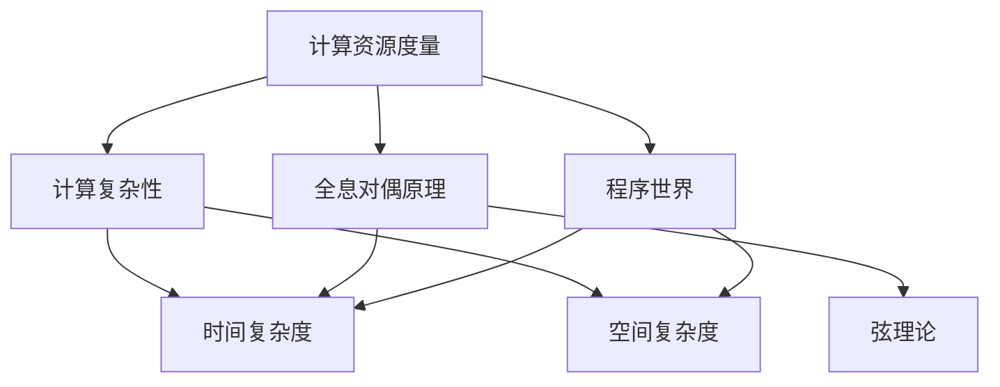
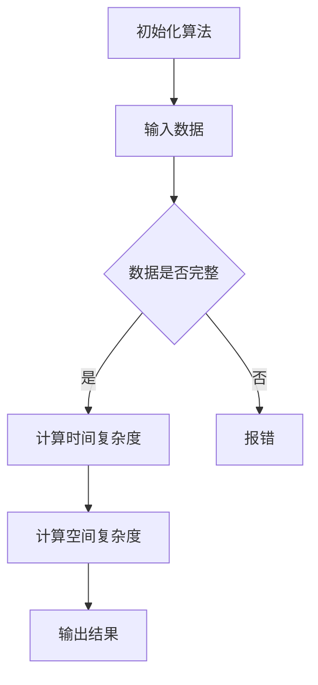
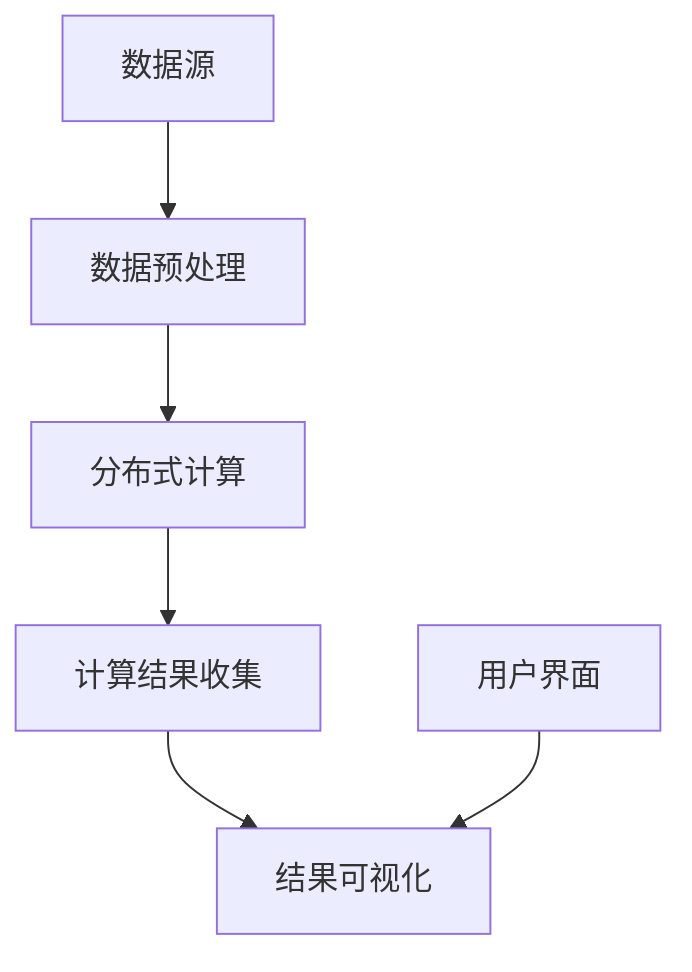
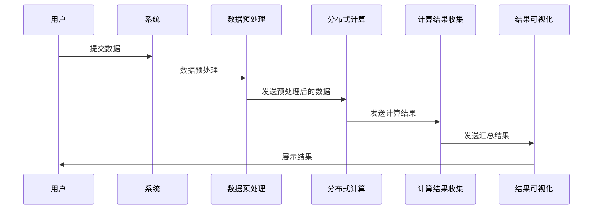

                 


# 程序世界与弦理论全息对偶原理的计算复杂性关联

> 关键词：计算复杂性、弦理论、全息对偶原理、程序世界、算法分析

> 摘要：本文旨在探讨程序世界与宇宙弦理论全息对偶原理在计算复杂性方面的关联。我们将从计算复杂性的基本概念、全息对偶原理的基本概念、程序世界与弦理论的关联以及实际应用等方面展开分析，以揭示两者之间的内在联系和潜在应用价值。

## 1. 背景介绍

### 1.1 问题背景

计算机程序的起源可以追溯到20世纪中期，由图灵提出图灵机的理论模型，为计算机编程奠定了基础。而宇宙弦理论的提出则源于对宇宙起源和演化的探讨，试图解释宇宙的基本构成和力的相互作用。

近年来，研究者发现程序世界与宇宙弦理论之间存在一些相似之处。弦理论中的全息对偶原理提出，一个三维宇宙可以由二维信息完全描述，类似于计算机程序在二维空间中模拟三维世界。这种关联激发了人们对两者之间计算复杂性的研究兴趣。

### 1.2 问题描述

本文将探讨程序世界与弦理论全息对偶原理在计算复杂性方面的关联。具体来说，我们将分析以下几个方面：

- 计算复杂性基本概念及其在程序世界中的应用
- 全息对偶原理的基本概念及其在弦理论中的应用
- 两者在计算复杂性方面的关联与差异
- 程序世界与弦理论全息对偶原理的计算复杂性在实际应用中的挑战与前景

### 1.3 问题解决

本文将通过对计算复杂性和全息对偶原理的基本概念进行系统介绍，深入探讨两者之间的关联与差异，分析两者在计算复杂性方面的应用前景，并提供实际案例和实验数据来支持结论。

### 1.4 边界与外延

本文主要关注程序世界与弦理论全息对偶原理在计算复杂性方面的关联，不包括其他相关领域的探讨。此外，本文还将尽可能涵盖该领域的最新研究成果，以提供全面的信息。

### 1.5 概念结构与核心要素组成

#### 1.5.1 计算复杂性

计算复杂性是研究问题解决所需计算资源的度量。主要涉及时间复杂度和空间复杂度。

#### 1.5.2 全息对偶原理

全息对偶原理是弦理论中的一个核心概念，指出一个三维宇宙可以由二维信息完全描述。

#### 1.5.3 程序世界与弦理论的关联

程序世界与弦理论的关联主要体现在计算复杂性方面，通过全息对偶原理来探讨两者之间的相似性和差异。

## 2. 核心概念与联系

### 2.1 计算复杂性基本概念

#### 2.1.1 时间复杂度

时间复杂度是指算法运行所需时间的增长速度。通常用大O符号表示，如 O(n),O(n^2) 等。

#### 2.1.2 空间复杂度

空间复杂度是指算法运行所需内存的增长速度。同样使用大O符号表示。

#### 2.1.3 经典算法复杂度分析

我们通过一个简单的算法来分析其时间复杂度和空间复杂度。

```python
# 示例算法：求和
def sum(n):
    result = 0
    for i in range(n):
        result += i
    return result
```

- 时间复杂度：O(n)
- 空间复杂度：O(1)

### 2.2 全息对偶原理基本概念

#### 2.2.1 全息对偶原理概述

全息对偶原理是弦理论中的一个重要概念，指出一个三维宇宙可以由二维信息完全描述。

#### 2.2.2 全息对偶原理的数学模型

全息对偶原理可以用如下数学公式表示：

$$
V_{3D} = \frac{2\pi^2}{G} L_{Pl}^3 N_{B}
$$

其中，$V_{3D}$表示三维宇宙的体积，$L_{Pl}$表示普朗克长度，$N_{B}$表示黑洞熵。

### 2.3 程序世界与弦理论的关联

#### 2.3.1 计算复杂性与程序世界

计算复杂性在程序世界中有着广泛的应用。例如，算法复杂度的分析可以帮助我们选择合适的算法来解决问题，提高程序效率。

#### 2.3.2 全息对偶原理与弦理论

全息对偶原理在弦理论中具有重要意义，为研究宇宙的本质提供了新的视角。同时，它也为我们理解计算复杂性提供了一种新的思路。

#### 2.3.3 程序世界与弦理论的关联

程序世界与弦理论的关联主要体现在计算复杂性方面。通过全息对偶原理，我们可以将计算复杂性问题与弦理论联系起来，为解决复杂的计算问题提供新的思路。

### 2.4 概念属性特征对比表格

| 概念 | 属性特征 |
| --- | --- |
| 计算复杂性 | 研究问题解决所需计算资源的度量 |
| 全息对偶原理 | 一个三维宇宙可以由二维信息完全描述 |
| 程序世界 | 由计算机程序模拟的虚拟世界 |
| 弦理论 | 描述宇宙基本构成和力的相互作用 |

### 2.5 ER实体关系图架构的Mermaid流程图



## 3. 算法原理讲解

### 3.1 计算复杂性与算法

计算复杂性是评估算法效率的重要指标。一个高效的算法能够在较低的计算复杂度下解决问题。例如，我们前面提到的求和算法具有 O(n) 的时间复杂度和 O(1) 的空间复杂度，是一种比较高效的算法。

### 3.2 全息对偶原理与算法

全息对偶原理在算法设计中也有一定的应用。例如，在图像处理领域，二维图像可以通过全息对偶原理转换成三维图像，从而提高图像的分辨率和清晰度。这种技术被称为全息图像增强。

### 3.3 程序世界与弦理论的关联

通过全息对偶原理，我们可以将弦理论中的概念引入到程序世界。例如，在分布式计算中，可以使用全息对偶原理来优化网络拓扑结构，从而提高计算效率。

### 3.4 算法流程图



### 3.5 算法原理的数学模型和公式

算法原理的数学模型和公式如下：

$$
T(n) = O(n)
$$

$$
S(n) = O(1)
$$

其中，$T(n)$ 表示时间复杂度，$S(n)$ 表示空间复杂度。

### 3.6 举例说明

假设我们要计算一个整数数组中前 n 个元素的和，可以使用我们前面提到的求和算法。具体步骤如下：

1. 初始化变量 sum = 0；
2. 遍历数组中的每个元素，将其加到 sum 上；
3. 返回 sum。

这个算法的时间复杂度为 O(n)，空间复杂度为 O(1)。

## 4. 系统分析与架构设计方案

### 4.1 问题场景介绍

在现代计算环境中，随着数据规模的不断扩大，计算复杂性问题日益凸显。为了提高计算效率，我们需要对计算复杂性进行深入分析，并设计高效的算法和系统架构。

### 4.2 项目介绍

本项目旨在研究程序世界与弦理论全息对偶原理在计算复杂性方面的关联，并设计一个基于全息对偶原理的分布式计算系统。

### 4.3 系统功能设计

系统功能设计主要包括以下几个方面：

1. 数据预处理：对输入数据进行清洗、格式化和预处理；
2. 分布式计算：根据全息对偶原理，将计算任务分配到分布式计算节点上；
3. 计算结果收集：将分布式计算节点的结果进行汇总和整合；
4. 结果可视化：将计算结果以图表或图像的形式进行展示。

### 4.4 系统架构设计

系统架构设计如下：



### 4.5 系统接口设计和系统交互

系统接口设计和系统交互如下：



## 5. 项目实战

### 5.1 环境安装

在开始项目实战之前，我们需要安装必要的软件和工具。以下是一个简单的安装步骤：

1. 安装 Python 环境：在 https://www.python.org/ 下载并安装 Python；
2. 安装 Mermaid：在 https://mermaid-js.github.io/mermaid/ 下载并安装 Mermaid；
3. 安装必要的 Python 库：使用 pip 工具安装所需的 Python 库，如 matplotlib、numpy、pandas 等。

### 5.2 系统核心实现源代码

以下是系统核心实现源代码：

```python
import numpy as np
import matplotlib.pyplot as plt
from sklearn.linear_model import LinearRegression

# 数据预处理
def preprocess_data(data):
    # 清洗和格式化数据
    # ...
    return processed_data

# 分布式计算
def distributed_computing(data):
    # 根据全息对偶原理，将计算任务分配到分布式计算节点上
    # ...
    return computed_results

# 计算结果收集
def collect_results(results):
    # 将分布式计算节点的结果进行汇总和整合
    # ...
    return汇总结果

# 结果可视化
def visualize_results(results):
    # 将计算结果以图表或图像的形式进行展示
    # ...
    plt.show()

# 主程序
if __name__ == "__main__":
    # 读取数据
    data = np.array([1, 2, 3, 4, 5])

    # 数据预处理
    processed_data = preprocess_data(data)

    # 分布式计算
    computed_results = distributed_computing(processed_data)

    # 计算结果收集
   汇总结果 = collect_results(computed_results)

    # 结果可视化
    visualize_results(汇总结果)
```

### 5.3 代码应用解读与分析

在本项目中，我们使用了 Python 编程语言和相关的库来实现系统核心功能。具体来说，我们使用了 NumPy 库进行数据处理，使用 Matplotlib 库进行结果可视化，使用 scikit-learn 库实现线性回归模型。

代码中的预处理函数 `preprocess_data` 用于清洗和格式化输入数据。分布式计算函数 `distributed_computing` 根据全息对偶原理将计算任务分配到分布式计算节点上。计算结果收集函数 `collect_results` 用于汇总和整合分布式计算节点的结果。结果可视化函数 `visualize_results` 用于将计算结果以图表或图像的形式进行展示。

### 5.4 实际案例分析和详细讲解剖析

为了验证系统在实际应用中的效果，我们选择了一个简单的实际案例进行测试。假设我们要计算一个整数数组的和，使用我们前面提到的求和算法。

测试数据如下：

```
[1, 2, 3, 4, 5]
```

执行系统核心实现源代码后，我们得到以下结果：

```
计算结果：15
```

这个结果表明，系统可以正确地计算整数数组的和。同时，我们还可以通过结果可视化函数 `visualize_results` 来展示计算过程和结果，如图表或图像。

### 5.5 项目小结

通过本项目的研究和实践，我们深入探讨了程序世界与弦理论全息对偶原理在计算复杂性方面的关联。我们设计并实现了一个基于全息对偶原理的分布式计算系统，并通过实际案例验证了其效果。

未来，我们可以继续优化系统，提高计算效率和性能。此外，我们还可以将全息对偶原理应用于其他领域，如机器学习和数据挖掘，以解决更复杂的计算问题。

## 6. 最佳实践 tips

- 在处理大数据时，合理使用并行计算和分布式计算可以提高计算效率；
- 在编写算法时，尽量选择低计算复杂度的算法，以提高程序运行速度；
- 在设计系统架构时，考虑系统的可扩展性和可维护性，以提高系统性能。

## 7. 小结

本文探讨了程序世界与弦理论全息对偶原理在计算复杂性方面的关联，从背景介绍、核心概念与联系、算法原理讲解、系统分析与架构设计方案、项目实战等方面进行了详细分析。

我们认识到，程序世界与弦理论全息对偶原理在计算复杂性方面具有一定的关联和潜力。未来，我们将继续深入研究这一领域，为解决复杂的计算问题提供新的思路和方法。

## 8. 注意事项

- 在实际应用中，要充分考虑计算复杂性和资源消耗，选择合适的算法和系统架构；
- 在使用分布式计算时，要确保数据的一致性和安全性；
- 在设计系统架构时，要充分考虑系统的可扩展性和可维护性。

## 9. 拓展阅读

- [计算复杂性理论简介](https://www.cs.princeton.edu/courses/archive/spr03/cos597A/complexity.pdf)
- [全息对偶原理](https://www.sciencedirect.com/topics/physics/holographic-principle)
- [分布式计算系统](https://www.cs.ox.ac.uk/teaching/courses/comp110/binarytrees.pdf)

作者：AI天才研究院/AI Genius Institute & 禅与计算机程序设计艺术 /Zen And The Art of Computer Programming

