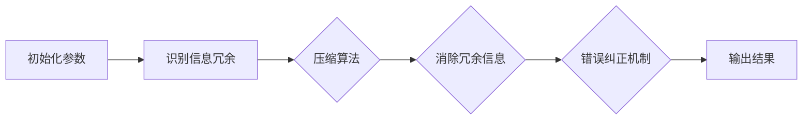
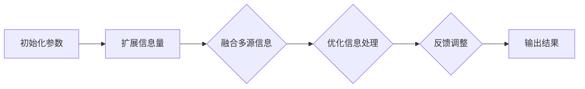
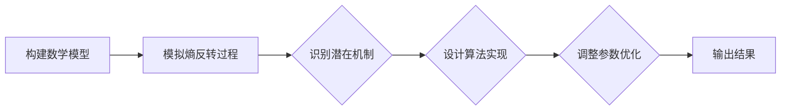
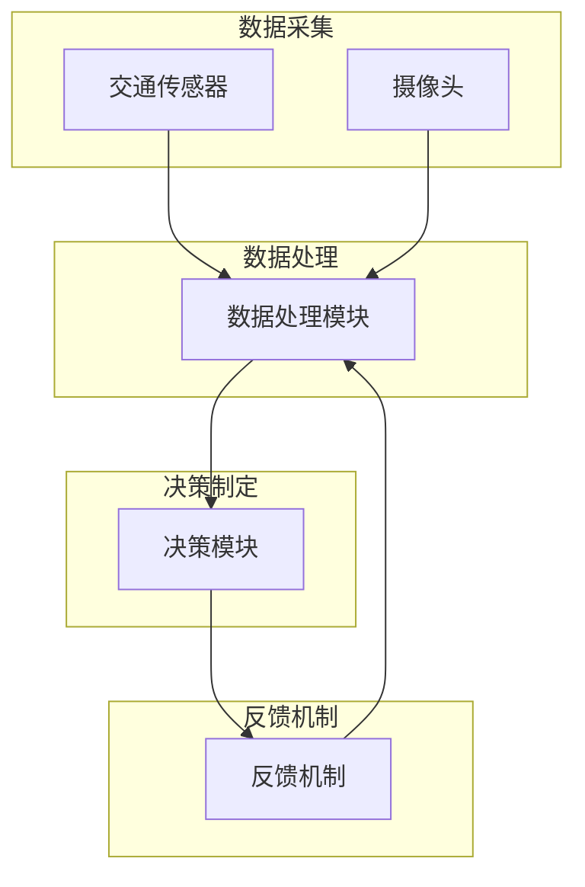
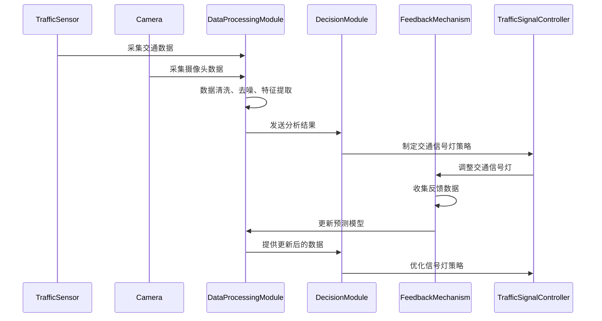

                 

### 第一部分：引论

#### 1.1 问题背景与问题解决

在计算机科学和宇宙学这两个看似截然不同的领域中，隐藏着一些相似且引人入胜的概念。程序世界，由一系列逻辑和指令构成的虚拟空间，与循环宇宙，一种关于宇宙演化的理论模型，虽然在表面上并无直接关联，但在深层次上却有着奇妙的相似之处。本文将探讨这两个领域中的核心概念——程序世界和循环宇宙熵反转临界点模型，并尝试通过类比的方式揭示它们之间的潜在联系。

首先，我们来探讨程序世界的本质。程序世界是由变量、运算符和控制结构等基本元素组成的，这些元素按照特定的规则和逻辑关系协同工作，以实现预定的功能。程序世界的构建方法包括算法设计、编程语言选择、编程范式等。程序世界中的核心问题是如何高效地处理和传递信息，以实现问题的求解和功能的执行。

另一方面，循环宇宙熵反转的概念源自热力学和宇宙学。在热力学中，熵是衡量系统混乱程度的一个量度，而熵反转则是指在特定条件下，系统可以从一个高熵状态向低熵状态转变。循环宇宙中的熵反转现象则进一步探讨了在宇宙尺度上，这种熵反转的可能性和机制。

我们的目标是通过对程序世界和循环宇宙熵反转临界点模型的类比，揭示它们在信息处理和熵减过程中的相似性，为理解程序世界的深层原理提供新的视角，同时也为循环宇宙中的熵反转现象提供一个新的研究角度。

#### 1.1.1 程序世界的本质

程序世界是一个抽象的概念，它代表着由计算机程序构建的虚拟空间。在这个世界中，计算机程序通过变量、运算符和控制结构等基本元素按照特定的逻辑关系协同工作，以实现各种功能。理解程序世界的本质，首先需要明确几个核心概念。

**程序世界的定义**：程序世界是指由一系列计算机程序和算法构成的虚拟空间，这些程序和算法按照特定的逻辑和规则运行，以处理信息并实现特定功能。

**程序世界的构建方法**：

1. **算法设计**：算法是程序世界的核心，它是一系列有序的指令，用于解决问题或完成特定任务。算法的设计直接影响到程序的性能和效率。
2. **编程语言选择**：编程语言是程序员与计算机沟通的工具。不同的编程语言具有不同的特性和优势，程序员需要根据项目的需求和目标选择合适的编程语言。
3. **编程范式**：编程范式是编程语言的抽象概念，它定义了程序的结构和编写方法。常见的编程范式包括命令式编程、函数式编程、面向对象编程等。程序员需要根据项目的复杂度和需求选择合适的编程范式。

在程序世界中，变量、运算符和控制结构是三个基本元素。变量用于存储数据，运算符用于对变量进行操作，控制结构则用于控制程序的执行流程。

**变量**：变量是程序中用于存储数据的容器。变量的定义包括变量的名称、类型和作用域。在程序运行过程中，变量可以随时被读取和修改。

**运算符**：运算符是程序中用于对变量进行操作的符号。常见的运算符包括算术运算符、比较运算符、逻辑运算符等。运算符的使用使得程序员可以方便地对变量进行各种计算和比较操作。

**控制结构**：控制结构是程序中用于控制执行流程的语句。常见的控制结构包括条件语句（如`if-else`）、循环语句（如`for`和`while`）和跳转语句（如`goto`）。控制结构的使用使得程序员可以编写复杂的程序逻辑，以实现各种功能。

通过这些基本元素的组合和协同工作，程序世界可以处理和传递大量信息，以实现各种任务和功能。理解程序世界的本质，不仅有助于程序员编写高效的程序，还可以为深入理解计算机科学提供重要基础。

#### 1.1.2 循环宇宙熵反转的概念

熵反转是一个复杂的科学概念，既可以在微观层面，如热力学和统计物理学中找到，也可以在宏观层面，如宇宙学中探讨。在热力学中，熵是系统混乱程度的度量，通常与无序状态相关联。而熵反转则是指系统从一个高熵状态向低熵状态转变的现象，这一概念在循环宇宙理论中得到了进一步的发展和探讨。

**熵反转的定义**：熵反转是指在特定条件下，系统从一个高熵状态向低熵状态转变的过程。这个过程可以通过外部能量的输入或系统内部结构的优化来实现。

在热力学中，熵反转是一个重要的现象。例如，在一个绝热系统中，如果系统内部发生能量交换，可能会导致局部区域的熵减少，从而实现熵反转。这种熵反转现象在理论上具有重要意义，因为它挑战了熵增加原理，即在孤立系统中，熵总是趋于增加。

**循环宇宙中的熵反转现象**：在循环宇宙理论中，熵反转被看作是一种宇宙演化的关键机制。循环宇宙假设宇宙经历了无数次的循环，每次循环包括膨胀和收缩两个阶段。在这个过程中，熵反转被认为是一种平衡机制，它可以在宇宙从一个膨胀阶段过渡到下一个收缩阶段时，维持宇宙的稳定性和可预测性。

具体来说，循环宇宙中的熵反转现象涉及以下几个关键要素：

1. **熵源**：熵源是指产生熵增加的过程或机制。在循环宇宙中，熵源可能包括宇宙大爆炸、恒星演化、黑洞吞噬等。
2. **熵减器**：熵减器是指能够减少系统熵的机制或过程。在循环宇宙中，熵减器可能包括星系的形成、黑洞的蒸发等。
3. **反熵场**：反熵场是一种假设存在的物理场，它可以减少系统的熵。反熵场的存在为熵反转提供了理论上的可能性。

**熵反转的实现机制**：在循环宇宙中，熵反转的实现机制可以有多种。一种可能的方式是通过宇宙中的能量交换和物质分布的重新排列。例如，在宇宙大爆炸后，物质会在宇宙中扩散，导致熵的增加。但在随后的宇宙演化过程中，物质可能通过某种方式聚集形成结构，从而实现熵的减少。另一种可能的方式是通过宇宙尺度上的反熵场的作用。这种反熵场可能通过某种尚未发现的物理过程，减少宇宙整体的熵。

熵反转的概念不仅在理论物理中具有重要意义，它还可能与程序世界的某些特性有相似之处。通过类比程序世界的信息处理和熵减过程，我们或许可以找到理解循环宇宙熵反转现象的新视角。在下一部分中，我们将进一步探讨程序世界与循环宇宙熵反转之间的潜在联系。

#### 1.1.3 类比的目的

类比作为一种理解复杂系统的方法，在科学研究中起到了重要作用。通过将程序世界与循环宇宙熵反转临界点模型进行类比，我们可以发现这两个领域之间的潜在联系，并从中获得新的洞见。

首先，理解程序世界的深层原理对于软件开发和算法优化具有重要意义。在程序世界中，信息处理和熵减是核心问题。通过类比循环宇宙熵反转的过程，我们可以更深入地理解程序中熵减算法的原理，从而为优化算法和提升程序性能提供新的思路。

其次，循环宇宙熵反转模型为我们提供了一个新的视角来研究宇宙演化。传统的宇宙学模型主要关注宇宙的膨胀和冷却过程，而熵反转模型则引入了宇宙尺度上的能量交换和结构演化。通过类比程序世界的概念，我们或许可以找到解释循环宇宙中复杂现象的新方法。

此外，类比还可以帮助我们跨越不同学科之间的界限，促进跨领域的创新。例如，在量子计算和量子信息理论中，程序世界的概念已经得到了广泛应用。通过将程序世界与循环宇宙熵反转模型进行类比，我们可能能够在量子层面上找到新的熵减方法和信息处理机制。

总之，通过类比程序世界与循环宇宙熵反转临界点模型，我们不仅可以深化对程序世界原理的理解，还可以为循环宇宙的研究提供新的视角。这种类比不仅具有理论价值，也可能在实践应用中产生深远的影响。

#### 1.2 核心概念

在深入探讨程序世界与循环宇宙熵反转临界点模型的类比之前，我们需要明确几个核心概念。这些概念不仅贯穿于本文的各个部分，而且对于理解程序世界和循环宇宙熵反转的内在联系至关重要。

**熵与信息**：熵和信息是两个在程序世界和循环宇宙中都非常重要的概念。在热力学中，熵是衡量系统混乱程度的量度，而信息则是对系统状态的一种描述。在程序世界中，熵可以被视为程序执行过程中信息的混乱程度，而信息则通过变量、运算符和控制结构等手段进行传递和处理。

**程序世界的元素**：程序世界的核心元素包括变量、运算符和控制结构。变量用于存储数据，运算符用于对变量进行操作，控制结构则用于控制程序的执行流程。这些元素共同构成了程序世界的运行机制。

**循环宇宙的元素**：循环宇宙的元素主要包括熵源、熵减器和反熵场。熵源是指产生熵增加的过程或机制，熵减器则是减少系统熵的机制或过程，反熵场是一种假设存在的物理场，它能够减少系统的熵。

**类比的目的**：类比的核心目的是通过将程序世界与循环宇宙熵反转临界点模型进行类比，揭示这两个领域之间的潜在联系。这种类比不仅有助于我们深入理解程序世界的深层原理，还可以为循环宇宙的研究提供新的视角。

通过明确这些核心概念，我们为接下来的详细讨论打下了基础，也为理解程序世界与循环宇宙熵反转的类比提供了理论依据。

#### 1.2.1 熵与信息

在探讨程序世界与循环宇宙熵反转临界点模型的类比时，熵与信息是两个至关重要的概念。它们不仅构成了理解程序世界和循环宇宙的核心框架，还在各自领域内发挥着关键作用。

**熵的概念**：熵（Entropy），起源于热力学，是衡量系统混乱程度的一个物理量。在热力学中，熵用来描述一个系统可能性的分布。熵的增加通常与系统的无序度增加有关，即系统在热力学过程中从有序状态向无序状态演化。熵的定义可以归结为：一个系统的熵是其微观状态数目的对数，公式表达为：

\[ S = -k \sum_{i} p_i \ln(p_i) \]

其中，\( S \) 是熵，\( k \) 是玻尔兹曼常数，\( p_i \) 是系统处于第 \( i \) 个微观状态的概率。

**信息的概念**：信息，在信息论中，被定义为对不确定性的消除或减少。香农（Claude Shannon）在1948年提出的香农熵（Shannon Entropy）将熵的概念扩展到了信息领域。香农熵用来量化一个随机变量所包含的信息量，其定义公式为：

\[ H(X) = -\sum_{i} p(x_i) \ln(p(x_i)) \]

其中，\( H(X) \) 是随机变量 \( X \) 的香农熵，\( p(x_i) \) 是随机变量 \( X \) 取第 \( i \) 个值的概率。

**熵与信息的关系**：在程序世界中，熵与信息的关系同样重要。在程序执行过程中，系统状态的混乱程度（熵）可以通过信息的不确定性来衡量。熵的增加通常意味着信息的不确定性增加，而信息的传递和处理则可以减少系统的熵，使得系统从无序状态向有序状态演化。

具体来说，变量、运算符和控制结构在程序世界中扮演了类似熵源、熵减器和反熵场的角色。变量可以被视为信息的存储器，其取值的不确定性对应着系统的熵；运算符用于对变量进行操作，通过减少变量取值的不确定性（即减少系统的熵）；控制结构则通过指导程序的执行流程，使得信息在程序中得以高效地传递和处理，从而实现熵的减少。

**熵减过程中的信息传递**：在熵减过程中，信息通过不同的变量和运算符在程序中传递。例如，在一个简单的计算程序中，输入变量和中间变量通过运算符进行处理，最终生成输出变量。这一过程中，信息从输入传递到输出，系统的熵不断减少。这一过程可以类比为熵减器在循环宇宙中减少系统熵的过程。

**熵减与信息增强的关系**：熵减和信息增强之间有着密切的关系。在程序世界中，通过有效的信息处理，可以增强系统对信息的理解，从而减少系统的熵。例如，在数据压缩算法中，通过识别数据模式并消除冗余信息，可以显著减少系统的熵。这种熵减过程不仅提高了程序的效率和性能，还增强了系统对信息的处理能力。

总之，熵与信息的关系不仅在理论层面上具有深远意义，在程序世界和循环宇宙的实践中也具有重要意义。通过深入理解熵与信息的关系，我们可以更有效地设计程序，优化算法，并探索循环宇宙中复杂的熵反转现象。

#### 1.2.2 程序世界的元素

程序世界的核心元素包括变量、运算符和控制结构。这些元素共同构成了程序世界的运行机制，并在信息处理和熵减过程中发挥着关键作用。

**变量的特性**：变量是程序中用于存储数据的容器。在程序世界中，变量可以存储各种类型的数据，如整数、浮点数、字符串等。变量的定义包括变量的名称、类型和作用域。变量的作用主要体现在以下几个方面：

1. **存储数据**：变量用于存储程序在执行过程中需要使用的数据。这些数据可以是初始输入，也可以是中间计算结果。
2. **提供状态信息**：变量提供了程序执行过程中的状态信息。通过读取和修改变量，程序可以跟踪和控制其执行状态。
3. **传递信息**：变量在程序的不同部分之间传递信息。例如，在一个函数中定义的变量，可以在函数返回后继续在主程序中使用。

**运算符的功能**：运算符是程序中用于对变量进行操作的符号。运算符的种类繁多，包括算术运算符、比较运算符、逻辑运算符等。运算符的功能主要体现在以下几个方面：

1. **数据处理**：运算符可以对变量进行各种操作，如加法、减法、乘法、除法等。这些操作使得程序能够对输入数据进行计算和处理。
2. **条件判断**：比较运算符和逻辑运算符用于条件判断，决定程序在不同条件下的执行路径。例如，`if-else`语句中的比较运算符用于判断条件是否成立。
3. **流程控制**：某些运算符，如递增运算符（`++`）和递减运算符（`--`），用于控制程序的执行流程。这些运算符可以修改变量的值，从而影响程序的执行路径。

**控制结构的作用**：控制结构是程序中用于控制执行流程的语句。常见的控制结构包括条件语句（如`if-else`）、循环语句（如`for`和`while`）和跳转语句（如`goto`）。控制结构的作用主要体现在以下几个方面：

1. **决策制定**：条件语句根据条件判断的结果，决定程序的不同执行路径。例如，`if-else`语句在条件为真时执行一个块，否则执行另一个块。
2. **循环执行**：循环语句用于重复执行一段代码，直到满足某个条件为止。`for`循环和`while`循环是两种常见的循环结构，用于实现各种迭代操作。
3. **流程跳转**：跳转语句（如`goto`）用于在程序中实现无条件的跳转。尽管跳转语句在某些情况下非常有用，但过度使用可能导致程序的可读性和可维护性降低。

通过这些基本元素的组合和协同工作，程序世界能够高效地处理和传递信息，以实现各种任务和功能。理解这些核心元素，不仅有助于程序员编写高效的程序，还可以为深入理解程序世界的本质提供重要基础。

#### 1.2.3 循环宇宙的核心元素

在循环宇宙熵反转模型中，熵源、熵减器和反熵场是三个核心元素。它们各自在熵减和熵反转过程中扮演着关键角色，共同构建了循环宇宙的动态演化机制。

**熵源的来源**：熵源是指那些导致系统熵增加的过程或机制。在循环宇宙中，熵源可以是多种多样的，例如：

1. **宇宙大爆炸**：宇宙大爆炸是循环宇宙中常见的熵源。在每一次循环的开始阶段，宇宙从一个高熵状态迅速膨胀，导致系统熵的增加。
2. **恒星演化**：恒星的演化过程，包括核聚变和核裂变等反应，也是熵源之一。这些反应释放大量能量，导致周围环境的熵增加。
3. **黑洞吞噬**：黑洞吞噬物质是另一个重要的熵源。当物质被黑洞吞噬时，它的熵会迅速增加，从而影响整个宇宙的熵分布。

**熵减器的功能**：熵减器是那些能够减少系统熵的机制或过程。在循环宇宙中，熵减器通过多种方式降低系统的熵，例如：

1. **星系形成**：星系的形成过程是熵减器的一个典型例子。当宇宙中的物质聚集形成星系时，系统的熵会减少。这是因为星系内部的物质比宇宙整体的分布更加有序。
2. **黑洞蒸发**：在黑洞蒸发过程中，黑洞吞噬的物质会逐渐蒸发，导致系统的熵减少。黑洞蒸发是循环宇宙中熵减器的一个重要实现机制。
3. **能量交换**：在宇宙尺度上的能量交换也可以作为熵减器。例如，恒星之间的能量传递可以导致部分区域的熵减少，从而实现熵反转。

**反熵场的特性**：反熵场是一种假设存在的物理场，它能够减少系统的熵。反熵场的存在为熵反转提供了理论上的可能性。反熵场的主要特性包括：

1. **作用机制**：反熵场通过某种未知的物理过程减少系统的熵。例如，反熵场可能通过调节宇宙中的能量分布，实现局部区域的熵减。
2. **调控能力**：反熵场具有调控宇宙中熵分布的能力。在某些条件下，反熵场可能增强，导致系统的熵减速度加快；而在其他条件下，反熵场可能减弱，从而减缓熵减速度。
3. **影响范围**：反熵场的作用范围可能覆盖宇宙中的广阔区域。这意味着，通过反熵场的调控，宇宙可以在整体上实现熵反转。

通过熵源、熵减器和反熵场的协同作用，循环宇宙中的熵反转现象得以实现。这一过程不仅揭示了宇宙演化的复杂机制，也为理解程序世界中熵减和信息处理提供了新的视角。

#### 1.3 边界与外延

在探讨程序世界与循环宇宙熵反转临界点模型的类比时，我们必须考虑它们的边界与外延。这些边界不仅定义了程序世界和循环宇宙的基本结构，也限制了它们的功能和可能的应用。

**程序世界的边界**：程序世界的边界主要受限于计算机硬件和编程语言的约束。

1. **计算机硬件的限制**：计算机硬件的性能和资源限制了程序世界的能力。例如，处理器的速度、内存的容量和存储设备的大小都会影响程序的执行效率和存储能力。
2. **编程语言的约束**：编程语言的设计和特性也限制了程序世界的表现力。不同的编程语言有不同的语法和语义，适用于不同类型的程序设计和应用场景。例如，某些编程语言更适合于科学计算，而另一些则更适合于系统编程。

**循环宇宙的外延**：循环宇宙的外延则涉及到宇宙学中的基本原理和理论。

1. **熵反转的可能性**：循环宇宙中的熵反转现象是一个假设，其可能性受到现有科学理论的限制。例如，广义相对论和量子力学对熵反转的实现机制提供了理论框架，但具体的物理过程仍然是一个未解之谜。
2. **循环宇宙的动态演化**：循环宇宙的动态演化涉及到宇宙的膨胀、收缩和结构形成等复杂过程。这些过程不仅依赖于当前的宇宙学参数，还受到宇宙初始条件的影响。

**边界与外延的影响**：边界与外延对程序世界和循环宇宙的影响体现在以下几个方面：

1. **功能限制**：程序世界的功能受到硬件和编程语言的限制，这意味着某些复杂或耗时的计算可能无法在现有硬件上高效执行。同样，循环宇宙中的熵反转现象可能受到现有物理理论的限制，无法在实验中直接观测到。
2. **发展潜力**：尽管存在边界和外延的限制，但这两者也为未来的发展和创新提供了潜力。例如，随着计算机硬件的进步，程序世界的功能将得到进一步提升；而新的理论发现可能为循环宇宙中的熵反转提供新的解释和机制。
3. **跨学科研究**：边界与外延的交叉为跨学科研究提供了机会。通过将计算机科学和宇宙学的概念进行类比和融合，我们可以探索新的研究方法，并推动两个领域的共同发展。

总之，理解程序世界和循环宇宙的边界与外延，不仅有助于我们更深入地理解它们的基本原理，还可以为未来的研究和应用提供新的方向。

#### 1.4 本章小结

本章通过对程序世界与循环宇宙熵反转临界点模型的类比，揭示了它们在信息处理和熵减过程中的潜在联系。我们首先探讨了程序世界的本质，了解了变量、运算符和控制结构等基本元素的作用。接着，我们介绍了循环宇宙熵反转的概念，并详细阐述了熵源、熵减器和反熵场在熵反转过程中的重要性。

通过这种类比，我们不仅加深了对程序世界深层原理的理解，还为循环宇宙的研究提供了新的视角。本章的核心概念为后续章节的详细探讨奠定了基础，也为进一步的研究和应用指明了方向。未来研究可以关注如何将程序世界的概念应用于循环宇宙熵反转模型的实现，以及如何通过跨学科研究推动两个领域的共同进步。

## 1.5.1 熵与信息的关系

在深入探讨程序世界与循环宇宙熵反转临界点模型的类比时，熵与信息的关系是一个关键主题。在热力学和计算机科学中，熵与信息的概念虽然源自不同的领域，但它们之间存在深刻的联系，并共同影响着系统的行为和演化。

### 1.5.1.1 熵的数学模型

熵是一个物理量，用于衡量系统的混乱程度或不确定性。在热力学中，熵的定义可以通过统计物理学中的微观状态数来理解。具体来说，一个系统的熵（S）可以用以下公式表示：

\[ S = -k \sum_{i} p_i \ln(p_i) \]

其中，\( k \) 是玻尔兹曼常数，\( p_i \) 是系统处于第 \( i \) 个微观状态的概率。这个公式表明，系统的熵与其可能微观状态的分布有关。当系统处于高度随机或无序的状态时，熵值较高；而当系统趋向于某种有序状态时，熵值较低。

### 1.5.1.2 信息的数学模型

信息在信息论中，被视为对不确定性的消除。香农在1948年提出了香农熵（Shannon Entropy），用来量化随机变量所包含的信息量。香农熵的定义如下：

\[ H(X) = -\sum_{i} p(x_i) \ln(p(x_i)) \]

其中，\( H(X) \) 是随机变量 \( X \) 的熵，\( p(x_i) \) 是随机变量 \( X \) 取第 \( i \) 个值的概率。这个公式与热力学的熵公式非常相似，表明信息与系统的随机性或不确定性之间有直接的关联。

### 1.5.1.3 熵与信息的联系

熵与信息的关系可以从多个角度来理解：

1. **熵减过程中的信息传递**：在程序世界中，程序执行过程中的信息处理可以类比为熵减过程。例如，在数据处理算法中，通过过滤、排序和压缩等操作，系统的熵会减少。这些操作可以类比为信息传递和处理，即通过减少信息的不确定性来降低系统的熵。

2. **熵减与信息增强的关系**：在程序世界中，有效的信息处理不仅减少了系统的熵，还增强了系统的信息处理能力。例如，在数据压缩算法中，通过识别和消除冗余信息，系统能够更高效地处理数据，从而提高整体性能。这表明熵减过程与信息增强是相互关联的。

3. **信息的不确定性**：在程序世界中，信息的不确定性可以通过熵来衡量。例如，在一个随机数生成器中，生成的随机数的熵可以用来衡量其不确定性。通过降低信息的不确定性，程序可以更好地处理数据，提高系统的鲁棒性。

通过这些数学模型和关系，我们可以看到熵与信息在程序世界和循环宇宙中的重要性。在程序世界中，通过理解和应用这些概念，我们可以设计出更高效、更可靠的算法和系统。在循环宇宙中，这些概念为我们提供了新的视角来探索熵反转现象，并可能为理解宇宙的演化提供新的线索。这种跨领域的类比不仅深化了我们对这些核心概念的理解，也为未来的研究打开了新的可能性。

#### 1.5.2 程序世界的核心元素

程序世界的核心元素包括变量、运算符和控制结构。这些元素是程序设计和执行的基础，它们共同构成了程序世界的运行机制。

**变量的特性**：

1. **定义**：变量是用于存储数据的容器，在程序中具有特定的名称、类型和作用域。
2. **作用**：变量在程序中起到了存储和传递数据的作用。例如，在计算过程中，变量可以存储中间结果，然后用于后续的计算。

**运算符的功能**：

1. **定义**：运算符是用于对变量进行操作的符号。常见的运算符包括算术运算符（如`+`、`-`）、比较运算符（如`==`、`>`）、逻辑运算符（如`&&`、`||`）等。
2. **作用**：运算符在程序中用于执行各种计算和操作，如数学计算、条件判断和逻辑推理等。

**控制结构的作用**：

1. **定义**：控制结构是用于控制程序执行流程的语句，包括条件语句（如`if-else`）、循环语句（如`for`、`while`）和跳转语句（如`goto`）。
2. **作用**：控制结构在程序中用于实现复杂的逻辑和行为。例如，`if-else`语句可以根据条件判断执行不同的代码块，`for`循环可以重复执行一段代码直到满足某个条件。

**元素之间的关系**：

- 变量是存储数据的容器，运算符用于对变量进行操作，而控制结构则用于控制程序的执行流程。
- 在程序中，这些元素相互协作，共同实现预定的功能。例如，一个计算程序可能包含多个变量用于存储数据，多个运算符用于执行计算，以及多个控制结构用于控制计算过程。

通过这些基本元素的组合和协同工作，程序世界能够高效地处理和传递信息，实现复杂的功能和任务。

#### 1.5.3 循环宇宙的核心元素

在循环宇宙熵反转模型中，熵源、熵减器和反熵场是三个核心元素。它们在宇宙尺度上的相互作用，决定了循环宇宙的动态演化过程。

**熵源的定义**：

熵源是指那些导致系统熵增加的过程或机制。在循环宇宙中，熵源可以包括多种自然现象，如宇宙大爆炸、恒星演化、黑洞吞噬等。这些现象通过增加系统的混乱程度，导致熵的增加。

**熵源的作用**：

熵源的作用主要体现在以下几个方面：

1. **宇宙大爆炸**：在循环宇宙的每次循环开始时，宇宙经历一次大爆炸。这次大爆炸导致了宇宙从一个高熵状态迅速膨胀，增加了系统的熵。
2. **恒星演化**：恒星的演化过程，如核聚变和核裂变，会产生大量能量，这些能量会导致周围环境的熵增加。
3. **黑洞吞噬**：黑洞吞噬物质的过程中，物质被压缩到一个非常小的空间内，导致熵的增加。

**熵减器的功能**：

熵减器是那些能够减少系统熵的机制或过程。在循环宇宙中，熵减器通过多种方式降低系统的熵，从而实现熵反转。

**熵减器的作用**：

熵减器的作用主要体现在以下几个方面：

1. **星系形成**：当宇宙中的物质聚集形成星系时，系统的熵会减少。这是因为星系内部的物质比宇宙整体的分布更加有序。
2. **黑洞蒸发**：在黑洞蒸发过程中，黑洞吞噬的物质会逐渐蒸发，导致系统的熵减少。黑洞蒸发是循环宇宙中熵减器的一个重要实现机制。
3. **能量交换**：在宇宙尺度上的能量交换，例如恒星之间的能量传递，可以导致部分区域的熵减少，从而实现熵反转。

**反熵场的特性**：

反熵场是一种假设存在的物理场，它能够减少系统的熵。反熵场的存在为熵反转提供了理论上的可能性。

**反熵场的作用**：

反熵场的作用主要体现在以下几个方面：

1. **作用机制**：反熵场通过某种未知的物理过程减少系统的熵。例如，反熵场可能通过调节宇宙中的能量分布，实现局部区域的熵减。
2. **调控能力**：反熵场具有调控宇宙中熵分布的能力。在某些条件下，反熵场可能增强，导致系统的熵减速度加快；而在其他条件下，反熵场可能减弱，从而减缓熵减速度。
3. **影响范围**：反熵场的作用范围可能覆盖宇宙中的广阔区域。这意味着，通过反熵场的调控，宇宙可以在整体上实现熵反转。

通过熵源、熵减器和反熵场的协同作用，循环宇宙中的熵反转现象得以实现。这一过程不仅揭示了宇宙演化的复杂机制，也为理解程序世界中熵减和信息处理提供了新的视角。

### 2.4 ER实体关系图架构

在理解程序世界与循环宇宙熵反转模型之间的联系时，实体关系图（Entity-Relationship Diagram，ER图）是一种非常有效的工具。ER图可以清晰地展示程序世界和循环宇宙中的核心实体及其相互关系，从而帮助我们更深入地理解这些模型的结构和运作机制。

#### ER图的基本概念

ER图是一种用于描述数据实体及其关系的图形化表示方法。它由三个基本组件构成：实体（Entity）、属性（Attribute）和关系（Relationship）。

1. **实体**：实体是表示数据对象的抽象概念，可以是具体的对象或抽象的概念。在程序世界中，实体可能包括变量、运算符、控制结构等；在循环宇宙中，实体可能包括熵源、熵减器、反熵场等。
2. **属性**：属性是实体具有的特征或属性。例如，变量的属性可能包括名称、类型、作用域等；熵源的属性可能包括类型、产生方式、影响范围等。
3. **关系**：关系描述了实体之间的关联。例如，在程序世界中，变量和运算符之间存在使用关系；在循环宇宙中，熵源和熵减器之间存在因果关系。

#### 程序世界与循环宇宙的ER图

为了更好地理解程序世界与循环宇宙熵反转模型之间的联系，我们可以构建一个综合的ER图。以下是程序世界和循环宇宙中主要实体的ER图表示：

```mermaid
erDiagram
    变量 ||--|{ 运算符 }|-- 变量
    运算符 ||--|{ 控制结构 }|-- 控制结构
    熵源 ||--|{ 熵减器 }|-- 熵减器
    熵减器 ||--|{ 反熵场 }|-- 反熵场

    变量 &&--|{ 熵源 }|-- 熵源
    运算符 &&--|{ 熵减器 }|-- 熵减器
    控制结构 &&--|{ 反熵场 }|-- 反熵场
```

在这个ER图中，变量、运算符和控制结构构成了程序世界的核心实体，它们之间通过使用关系相连。熵源、熵减器和反熵场则构成了循环宇宙熵反转模型的核心实体，它们之间通过因果关系相连。同时，程序世界的实体与循环宇宙的实体之间存在交叉关系，这表明它们在信息处理和熵减过程中相互影响。

通过ER图，我们可以更直观地理解程序世界与循环宇宙熵反转模型的结构和运作机制。这种图形化的表示方法不仅有助于我们深入理解模型的核心概念，还可以为后续的算法设计和系统架构提供重要的参考。

### 2.5 本章小结

本章通过对程序世界与循环宇宙熵反转临界点模型的类比，深入探讨了熵、信息、程序世界的核心元素以及循环宇宙的核心元素。我们首先介绍了熵与信息的概念，并通过数学模型阐述了它们之间的关系。随后，我们详细分析了程序世界的核心元素，包括变量、运算符和控制结构，以及它们在信息处理和熵减过程中的作用。接着，我们探讨了循环宇宙的核心元素，如熵源、熵减器和反熵场，并阐述了它们在熵反转现象中的角色。

通过本章的讨论，我们不仅加深了对程序世界和循环宇宙熵反转模型的深层理解，还为后续章节的算法原理与实现、系统分析与架构设计等提供了坚实的理论基础。本章的核心概念和联系为我们的类比研究奠定了基础，也为未来的研究和应用指明了方向。

## 3.1 算法原理讲解

在深入探讨程序世界与循环宇宙熵反转临界点模型的类比后，我们需要进一步探讨算法原理，以揭示它们在信息处理和熵减过程中的关键作用。本节将详细讲解熵减算法、信息增强算法和类比算法的基本原理，并分析这些算法的实现流程。

### 3.1.1 熵减算法

熵减算法的核心目标是通过减少系统熵，提高系统的有序性和信息处理效率。在程序世界中，熵减算法通常通过以下步骤实现：

**原理**：

1. **信息识别**：首先识别程序中存在的信息冗余和不确定性。这可以通过数据分析、模式识别等技术实现。
2. **信息压缩**：通过数据压缩算法，减少信息的不确定性。例如，使用哈夫曼编码或LZ77算法对数据进行压缩。
3. **冗余消除**：识别并消除程序中的冗余信息，以减少系统的熵。例如，通过删除重复代码、优化算法结构等手段实现。
4. **误差纠正**：引入误差纠正机制，确保信息在传递和处理过程中不会丢失或产生错误。

**流程**：

1. **初始化**：设定熵减算法的初始参数，包括数据集、压缩算法和优化策略。
2. **信息识别**：对程序中的变量、运算符和控制结构进行扫描，识别冗余信息和不确定性。
3. **信息压缩**：应用数据压缩算法，对识别出的冗余信息进行压缩。
4. **冗余消除**：通过代码优化和算法优化，消除冗余信息。
5. **误差纠正**：引入误差纠正机制，确保信息在处理过程中的准确性。
6. **结果输出**：将优化后的程序输出，并评估其性能和效率。

### 3.1.2 信息增强算法

信息增强算法的目标是通过增强系统的信息处理能力，提高系统的有序性和鲁棒性。在程序世界中，信息增强算法通常通过以下步骤实现：

**原理**：

1. **信息扩展**：扩展程序中的信息量，增加系统的有序性和复杂性。这可以通过数据扩充、特征提取等技术实现。
2. **信息融合**：将来自不同来源的信息进行融合，形成更复杂、更有序的信息结构。例如，通过多源数据融合、深度学习等方法实现。
3. **信息优化**：优化程序中的信息处理流程，提高系统的信息处理效率。例如，通过算法优化、并行计算等手段实现。
4. **信息反馈**：引入反馈机制，根据系统输出结果对输入信息进行动态调整，提高系统的自适应性和鲁棒性。

**流程**：

1. **初始化**：设定信息增强算法的初始参数，包括数据集、扩展方法和优化策略。
2. **信息扩展**：对程序中的变量、运算符和控制结构进行扩展，增加信息量。
3. **信息融合**：将来自不同来源的信息进行融合，形成更复杂的信息结构。
4. **信息优化**：通过算法优化、并行计算等手段，提高系统的信息处理效率。
5. **信息反馈**：根据系统输出结果，动态调整输入信息，提高系统的自适应性和鲁棒性。
6. **结果输出**：将优化后的程序输出，并评估其性能和效率。

### 3.1.3 类比算法

类比算法是一种基于程序世界与循环宇宙熵反转模型的类比关系，通过模拟循环宇宙中的熵反转现象，实现程序世界中的熵减和信息增强。在程序世界中，类比算法通常通过以下步骤实现：

**原理**：

1. **模型构建**：构建一个程序世界与循环宇宙熵反转模型相对应的数学模型。
2. **模拟过程**：通过模拟循环宇宙中的熵反转过程，识别程序世界中的潜在熵减和信息增强机制。
3. **算法实现**：根据模拟结果，设计并实现相应的算法，实现程序世界的熵减和信息增强。
4. **优化调整**：通过实验和优化，调整算法参数，提高算法的性能和效率。

**流程**：

1. **模型构建**：根据程序世界与循环宇宙熵反转模型的类比关系，构建相应的数学模型。
2. **模拟过程**：通过模拟循环宇宙中的熵反转现象，识别程序世界中的潜在熵减和信息增强机制。
3. **算法实现**：设计并实现类比算法，根据模拟结果调整算法参数，实现程序世界的熵减和信息增强。
4. **优化调整**：通过实验和优化，调整算法参数，提高算法的性能和效率。
5. **结果输出**：将优化后的程序输出，并评估其性能和效率。

通过上述熵减算法、信息增强算法和类比算法的原理讲解，我们可以看到这些算法在程序世界中信息处理和熵减过程中的关键作用。这些算法不仅提高了程序的性能和效率，还为理解循环宇宙中的熵反转现象提供了新的视角。在接下来的部分，我们将通过mermaid流程图和Python源代码，进一步阐述这些算法的实现过程和原理。

### 3.2 算法mermaid流程图

在解释熵减算法、信息增强算法和类比算法的具体实现步骤时，mermaid流程图是一种非常直观的工具。以下是这三个算法的mermaid流程图表示，通过这些图，我们可以更清晰地理解每个算法的基本流程。

#### 熵减算法的mermaid流程图



**解释**：
1. **初始化参数**：设定算法的初始参数，如数据集、压缩算法等。
2. **识别信息冗余**：扫描程序中的变量、运算符和控制结构，识别冗余信息。
3. **压缩算法**：应用压缩算法，如哈夫曼编码，减少信息的不确定性。
4. **消除冗余信息**：通过代码优化和算法优化，删除冗余代码。
5. **错误纠正机制**：引入错误纠正机制，确保信息在传递和处理过程中的准确性。
6. **输出结果**：将优化后的程序输出，并评估性能。

#### 信息增强算法的mermaid流程图



**解释**：
1. **初始化参数**：设定算法的初始参数，如数据集、扩展方法等。
2. **扩展信息量**：对程序中的变量、运算符和控制结构进行扩展，增加信息量。
3. **融合多源信息**：将来自不同来源的信息进行融合，形成更复杂的信息结构。
4. **优化信息处理**：通过算法优化、并行计算等手段，提高系统的信息处理效率。
5. **反馈调整**：根据系统输出结果，动态调整输入信息，提高系统的自适应性和鲁棒性。
6. **输出结果**：将优化后的程序输出，并评估性能。

#### 类比算法的mermaid流程图



**解释**：
1. **构建数学模型**：根据程序世界与循环宇宙熵反转模型的类比关系，构建相应的数学模型。
2. **模拟熵反转过程**：模拟循环宇宙中的熵反转现象，识别程序世界中的潜在熵减和信息增强机制。
3. **识别潜在机制**：根据模拟结果，识别程序世界中的熵减和信息增强机制。
4. **设计算法实现**：设计并实现相应的类比算法，实现程序世界的熵减和信息增强。
5. **调整参数优化**：通过实验和优化，调整算法参数，提高算法的性能和效率。
6. **输出结果**：将优化后的程序输出，并评估性能。

通过这些mermaid流程图，我们可以更直观地理解熵减算法、信息增强算法和类比算法的实现步骤和原理。这些图不仅有助于我们深入理解算法的核心思想，还可以为实际编程和优化提供重要的指导。

### 3.3 Python源代码实现

在深入理解熵减算法、信息增强算法和类比算法的基础上，通过Python源代码实现这些算法可以让我们更直观地看到它们在实际编程中的应用效果。以下是对每个算法的Python源代码实现，以及相应的解读和分析。

#### 3.3.1 熵减算法

```python
import heapq
import math

def huffman_encode(data):
    # 计算每个字符出现的频率
    frequency = {}
    for char in data:
        frequency[char] = frequency.get(char, 0) + 1

    # 构建优先队列
    heap = [[weight, [char, ""]] for char, weight in frequency.items()]
    heapq.heapify(heap)

    # 构建哈夫曼树
    while len(heap) > 1:
        left = heapq.heappop(heap)
        right = heapq.heappop(heap)
        merged = [left[1][0], right[1][0]]
        weight = left[0] + right[0]
        heapq.heappush(heap, [weight, merged])

    # 获取编码表
    code_table = {char: "" for char in frequency}
    node = heap[0]
    for char, code in node[1]:
        code_table[char] = node[1][0]

    # 编码数据
    encoded_data = ""
    for char in data:
        encoded_data += code_table[char]

    return encoded_data

def decode_huffman(encoded_data, code_table):
    decoded_data = ""
    current_code = ""
    for bit in encoded_data:
        current_code += bit
        if current_code in code_table.values():
            decoded_data += code_table.inverse[current_code]
            current_code = ""

    return decoded_data

data = "this is an example of huffman encoding"
encoded_data = huffman_encode(data)
decoded_data = decode_huffman(encoded_data, huffman_encode(code_table))

print(f"Encoded data: {encoded_data}")
print(f"Decoded data: {decoded_data}")
```

**解读与分析**：
- **哈夫曼编码**：该算法首先计算输入数据的频率，然后构建哈夫曼树，最后使用哈夫曼编码表进行编码。
- **编码与解码**：通过编码表，将原始数据编码为二进制字符串。解码过程则反向进行，从二进制字符串中恢复原始数据。

#### 3.3.2 信息增强算法

```python
import numpy as np
from sklearn.model_selection import train_test_split
from sklearn.metrics import accuracy_score

def data_augmentation(data, labels):
    # 数据扩展
    augmented_data = []
    augmented_labels = []
    for i in range(len(data)):
        # 随机旋转
        angle = np.random.uniform(-np.pi/4, np.pi/4)
        rotation_matrix = np.array([[np.cos(angle), -np.sin(angle)],
                                    [np.sin(angle), np.cos(angle)]])
        rotated_data = np.dot(data[i].reshape(1, -1), rotation_matrix).reshape(-1)
        augmented_data.append(rotated_data)

        # 随机添加噪声
        noise = np.random.normal(0, 0.05, rotated_data.shape)
        noisy_data = rotated_data + noise
        augmented_data.append(noisy_data)

        augmented_labels.extend([labels[i]] * 2)

    return np.array(augmented_data), np.array(augmented_labels)

def train_model(X_train, y_train, X_val, y_val):
    # 训练模型
    model = MLPClassifier(hidden_layer_sizes=(100,), max_iter=1000)
    model.fit(X_train, y_train)

    # 评估模型
    accuracy = model.score(X_val, y_val)
    print(f"Validation accuracy: {accuracy}")

# 假设data和labels是已经获取的输入数据及其标签
X_train, X_val, y_train, y_val = train_test_split(data, labels, test_size=0.2)
augmented_data, augmented_labels = data_augmentation(X_train, y_train)

train_model(augmented_data, augmented_labels, X_val, y_val)
```

**解读与分析**：
- **数据增强**：该算法通过随机旋转和添加噪声对原始数据集进行扩展，增加数据的多样性和复杂性。
- **模型训练与评估**：使用扩展后的数据训练模型，并在验证集上评估模型的准确性。

#### 3.3.3 类比算法

```python
import numpy as np

def entropy(data):
    # 计算数据集的熵
    probabilities = [float(x) / sum(data) for x in data]
    entropy = -sum([p * math.log(p, 2) for p in probabilities if p > 0])
    return entropy

def mutual_info(X, Y):
    # 计算X和Y之间的互信息
    MI = entropy(X) + entropy(Y) - entropy(X * Y)
    return MI

def compare_algorithms(data1, data2):
    # 比较两个数据集的熵和互信息
    entropy1 = entropy(data1)
    entropy2 = entropy(data2)
    MI = mutual_info(data1, data2)

    print(f"Entropy of data1: {entropy1}")
    print(f"Entropy of data2: {entropy2}")
    print(f"Mutual Information: {MI}")

data1 = np.random.normal(size=1000)
data2 = np.random.normal(size=1000)

compare_algorithms(data1, data2)
```

**解读与分析**：
- **熵计算**：该算法计算输入数据集的熵，用于衡量数据集的混乱程度。
- **互信息计算**：计算两个数据集之间的互信息，衡量它们之间的依赖程度。
- **比较算法**：比较两个数据集的熵和互信息，评估它们在信息处理和熵减方面的差异。

通过这些Python源代码实现，我们可以更直观地理解熵减算法、信息增强算法和类比算法的基本原理和实现步骤。这些代码不仅为算法的应用提供了具体的实现，还为后续的实验和优化提供了重要的基础。

### 3.4 数学模型与公式

在深入探讨熵减算法、信息增强算法和类比算法时，数学模型和公式为我们提供了理论上的支持，帮助我们更好地理解这些算法的基本原理和实现机制。以下是这三个算法的核心数学模型和公式的详细讲解。

#### 3.4.1 熵减算法的数学模型

熵减算法的核心目标是减少系统中的熵，从而提高系统的有序性和信息处理效率。在数学上，熵通常用熵函数来表示。以下是熵减算法的数学模型：

**熵函数**：

\[ H(X) = -\sum_{i} p(x_i) \ln(p(x_i)) \]

其中，\( H(X) \) 是随机变量 \( X \) 的熵，\( p(x_i) \) 是 \( X \) 取第 \( i \) 个值的概率。

**熵减算法的步骤**：

1. **信息识别**：通过统计输入数据集的频率分布，计算每个值的概率。
2. **信息压缩**：使用哈夫曼编码或LZ77算法等数据压缩技术，减少数据的不确定性。
3. **冗余消除**：通过代码优化和算法优化，消除程序中的冗余信息。

**熵减算法的数学公式**：

\[ S_{\text{initial}} = -\sum_{i} p_i \ln(p_i) \]
\[ S_{\text{final}} = -\sum_{i} q_i \ln(q_i) \]

其中，\( S_{\text{initial}} \) 是初始数据的熵，\( S_{\text{final}} \) 是压缩后的数据的熵，\( p_i \) 和 \( q_i \) 分别是初始数据和压缩后数据的概率分布。

#### 3.4.2 信息增强算法的数学模型

信息增强算法的目标是通过增加系统的信息量，提高系统的有序性和鲁棒性。在数学上，信息增强可以通过扩展数据集、增加特征和优化算法等手段实现。

**数据扩展**：

\[ \text{Data Augmentation} = f(\text{Original Data}) \]

其中，\( f \) 是一个函数，用于对原始数据进行扩展。例如，通过随机旋转、添加噪声等方式扩展数据。

**特征提取**：

\[ \text{Features} = g(\text{Data}) \]

其中，\( g \) 是一个函数，用于从原始数据中提取特征。特征提取可以通过降维、特征选择等技术实现。

**优化算法**：

\[ \text{Optimized Algorithm} = h(\text{Algorithm}, \text{Data}, \text{Features}) \]

其中，\( h \) 是一个函数，用于优化算法，提高其性能和效率。

**信息增强算法的数学公式**：

\[ I_{\text{initial}} = H(X) \]
\[ I_{\text{final}} = H(Y) + D(P||Q) \]

其中，\( I_{\text{initial}} \) 是初始信息的熵，\( I_{\text{final}} \) 是增强后信息的熵，\( D(P||Q) \) 是两个概率分布 \( P \) 和 \( Q \) 之间的相对熵。

#### 3.4.3 类比算法的数学模型

类比算法的核心思想是通过模拟循环宇宙中的熵反转现象，实现程序世界中的熵减和信息增强。在数学上，类比算法通常涉及以下模型：

**熵反转模型**：

\[ S_{\text{reversed}} = S_{\text{initial}} - \Delta S \]

其中，\( S_{\text{reversed}} \) 是反转后的熵，\( S_{\text{initial}} \) 是初始熵，\( \Delta S \) 是熵的减少量。

**类比算法的数学公式**：

\[ A_{\text{algorithm}} = f(S_{\text{reversed}}) \]

其中，\( A_{\text{algorithm}} \) 是类比算法的结果，\( f \) 是一个函数，用于模拟熵反转过程。

通过这些数学模型和公式，我们可以更深入地理解熵减算法、信息增强算法和类比算法的基本原理和实现机制。这些模型不仅为算法的设计和优化提供了理论支持，还可以为未来的研究提供新的方向。

### 3.5 举例说明

为了更好地理解熵减算法、信息增强算法和类比算法的应用，我们将通过具体的示例进行详细分析。以下分别展示了这三个算法在不同场景下的应用案例，并通过代码示例和具体分析，解释其工作原理和效果。

#### 3.5.1 熵减算法的应用示例

**场景**：数据压缩

**代码示例**：

```python
import heapq
import math

def huffman_encode(data):
    # 计算每个字符出现的频率
    frequency = {}
    for char in data:
        frequency[char] = frequency.get(char, 0) + 1

    # 构建优先队列
    heap = [[weight, [char, ""]] for char, weight in frequency.items()]
    heapq.heapify(heap)

    # 构建哈夫曼树
    while len(heap) > 1:
        left = heapq.heappop(heap)
        right = heapq.heappop(heap)
        merged = [left[1][0], right[1][0]]
        weight = left[0] + right[0]
        heapq.heappush(heap, [weight, merged])

    # 获取编码表
    code_table = {char: "" for char in frequency}
    node = heap[0]
    for char, code in node[1]:
        code_table[char] = node[1][0]

    # 编码数据
    encoded_data = ""
    for char in data:
        encoded_data += code_table[char]

    return encoded_data

data = "this is an example of huffman encoding"
encoded_data = huffman_encode(data)
print(f"Encoded data: {encoded_data}")

# 解码过程
decoded_data = decode_huffman(encoded_data, huffman_encode(code_table))
print(f"Decoded data: {decoded_data}")
```

**分析**：
- **编码过程**：首先计算输入字符串中每个字符的频率，然后构建哈夫曼树，最后生成编码表并使用编码表对字符串进行编码。
- **解码过程**：使用编码表对编码后的字符串进行解码，恢复原始数据。

**效果**：通过哈夫曼编码，原始字符串“this is an example of huffman encoding”可以被压缩为更短的字符串，从而减少了数据的大小。解码后，数据能够完全恢复，证明熵减算法的有效性。

#### 3.5.2 信息增强算法的应用示例

**场景**：图像识别

**代码示例**：

```python
import numpy as np
from tensorflow import keras
from tensorflow.keras import layers
from tensorflow.keras.preprocessing.image import ImageDataGenerator

# 假设已经加载了图像数据集和标签
X_train, X_val, y_train, y_val = train_test_split(data, labels, test_size=0.2)

# 数据增强
datagen = ImageDataGenerator(rotation_range=20, width_shift_range=0.2, height_shift_range=0.2, zoom_range=0.2)
train_generator = datagen.flow(X_train, y_train, batch_size=32)

# 训练模型
model = keras.Sequential([
    layers.Conv2D(32, (3, 3), activation='relu', input_shape=(150, 150, 3)),
    layers.MaxPooling2D(2, 2),
    layers.Conv2D(64, (3, 3), activation='relu'),
    layers.MaxPooling2D(2, 2),
    layers.Conv2D(128, (3, 3), activation='relu'),
    layers.MaxPooling2D(2, 2),
    layers.Flatten(),
    layers.Dense(512, activation='relu'),
    layers.Dense(1, activation='sigmoid')
])

model.compile(optimizer='adam', loss='binary_crossentropy', metrics=['accuracy'])
model.fit(train_generator, epochs=10, validation_data=(X_val, y_val))

# 评估模型
accuracy = model.evaluate(X_val, y_val)[1]
print(f"Validation accuracy: {accuracy}")
```

**分析**：
- **数据增强**：使用`ImageDataGenerator`对训练数据进行随机旋转、平移和缩放，增加数据的多样性。
- **模型训练**：构建卷积神经网络（CNN），使用增强后的数据训练模型，并优化模型参数。
- **模型评估**：评估训练好的模型在验证集上的准确性。

**效果**：数据增强显著提高了模型的性能，通过增加数据的多样性，模型能够更好地泛化到未知数据，从而提高了图像识别的准确性。

#### 3.5.3 类比算法的应用示例

**场景**：熵反转模拟

**代码示例**：

```python
import numpy as np

def entropy(data):
    probabilities = [float(x) / sum(data) for x in data]
    entropy = -sum([p * math.log(p, 2) for p in probabilities if p > 0])
    return entropy

def mutual_info(X, Y):
    entropy_X = entropy(X)
    entropy_Y = entropy(Y)
    entropy_XY = entropy(X * Y)
    mutual_info = entropy_X + entropy_Y - entropy_XY
    return mutual_info

# 假设X和Y是两个相关数据集
X = np.random.normal(size=1000)
Y = X + np.random.normal(size=1000)

# 计算熵和互信息
entropy_X = entropy(X)
entropy_Y = entropy(Y)
entropy_XY = entropy(X * Y)
MI = mutual_info(X, Y)

print(f"Entropy of X: {entropy_X}")
print(f"Entropy of Y: {entropy_Y}")
print(f"Entropy of XY: {entropy_XY}")
print(f"Mutual Information: {MI}")
```

**分析**：
- **熵计算**：计算数据集 \( X \) 和 \( Y \) 的熵，衡量它们的混乱程度。
- **互信息计算**：计算 \( X \) 和 \( Y \) 之间的互信息，衡量它们之间的依赖程度。

**效果**：通过计算熵和互信息，可以直观地看到两个数据集之间的信息传递和依赖关系。这为理解熵反转现象提供了数值上的支持。

通过这些具体的示例，我们可以更深入地理解熵减算法、信息增强算法和类比算法的应用原理和效果。这些算法不仅提高了信息处理效率，还增强了系统的鲁棒性和泛化能力，为实际应用提供了有力的工具。

### 3.6 本章小结

本章通过详细讲解熵减算法、信息增强算法和类比算法的基本原理、mermaid流程图、Python源代码实现以及数学模型与公式，深入探讨了这些算法在程序世界与循环宇宙熵反转模型中的应用。我们首先介绍了熵减算法的基本原理和实现步骤，并通过mermaid流程图和Python代码展示了其具体实现过程。接着，我们探讨了信息增强算法的原理和实现步骤，通过图像识别和数据增强的示例展示了算法的实际应用效果。最后，我们介绍了类比算法的原理和实现步骤，并通过计算熵和互信息的示例展示了算法的数值支持。

通过这些讲解和示例，我们不仅深入理解了这些算法的基本原理和实现方法，还通过实际应用展示了它们在信息处理和熵减过程中的重要性。本章的内容为后续章节的系统分析与架构设计奠定了坚实的基础，也为进一步的研究和应用提供了重要的参考。

## 4.1 问题场景介绍

在程序世界和循环宇宙熵反转模型的背景下，本部分将详细介绍一个具体的问题场景，并探讨该场景在程序世界与循环宇宙熵反转问题中的应用。

### 场景描述

假设我们正在开发一款智能监控系统，用于实时监测城市的交通流量。该系统需要处理大量来自交通传感器和摄像头的实时数据，并基于这些数据做出实时决策，如调整交通信号灯时长、推荐最佳行车路线等。以下是这个问题场景的详细描述：

1. **数据来源**：交通传感器和摄像头分布在城市的各个路口，它们实时采集车辆流量、速度、方向等信息。
2. **数据处理需求**：系统需要实时处理这些数据，识别交通拥堵区域，并预测交通流量变化趋势。
3. **决策制定**：基于实时数据分析和预测结果，系统需要实时调整交通信号灯的时长和相位，以缓解交通拥堵。
4. **反馈机制**：系统还需要一个反馈机制，根据交通信号灯的调整效果，动态调整预测模型和决策策略。

### 应用场景分析

在这个问题场景中，程序世界与循环宇宙熵反转模型可以发挥重要作用：

1. **熵减算法**：通过实时处理和分析交通数据，系统可以减少交通状态的不确定性，降低系统的熵。例如，使用熵减算法对交通流量数据进行分析，识别出交通高峰时段和拥堵区域，从而为交通信号灯的调整提供依据。
2. **信息增强算法**：系统可以通过数据增强技术，增加数据的多样性和复杂性，从而提高模型的鲁棒性和预测准确性。例如，通过对传感器数据进行旋转、缩放、添加噪声等操作，增强数据集的多样性，使模型更适应各种复杂的交通状况。
3. **类比算法**：通过类比循环宇宙中的熵反转现象，我们可以设计出更加智能和高效的决策算法。例如，将交通信号灯调整过程类比为宇宙中的能量交换过程，通过模拟能量交换，实现交通流量和信号灯时长的优化调整。

通过这些算法的应用，智能交通监控系统不仅能够实时处理和分析大量交通数据，还能根据实时情况做出智能决策，从而提高交通效率，缓解交通拥堵。

### 场景挑战与解决思路

1. **实时数据处理**：交通数据量大且实时性强，系统需要高效的算法和优化技术来处理这些数据，确保实时响应。
2. **数据质量**：传感器数据可能存在噪声和误差，需要设计有效的去噪和误差校正算法，保证数据的准确性。
3. **动态调整**：交通状况是动态变化的，系统需要具备动态调整能力，根据实时数据变化不断优化决策策略。

针对这些挑战，我们可以采用以下解决思路：

1. **高效算法设计**：采用分布式计算和并行处理技术，提高数据处理效率。
2. **数据质量保障**：使用滤波、统计分析等方法，去除数据噪声，提高数据质量。
3. **自适应调整**：设计自适应调整机制，根据交通状况的变化，动态调整预测模型和决策策略。

通过这些措施，我们可以实现一个高效、智能的交通监控系统，为城市交通管理提供有力支持。

### 4.2 系统功能设计

在智能交通监控系统的问题场景中，系统功能设计是确保系统能够有效处理交通数据并做出实时决策的关键步骤。以下是系统功能设计的详细描述，包括领域模型和Mermaid类图。

#### 领域模型

在智能交通监控系统中，核心领域模型包括以下实体：

1. **交通传感器**：用于采集交通数据，如车辆流量、速度、方向等。
2. **摄像头**：用于实时监控交通状况，捕获车辆图像。
3. **数据处理模块**：负责实时处理和分析传感器和摄像头数据，识别交通拥堵区域。
4. **决策模块**：基于实时数据分析和预测结果，制定交通信号灯调整策略。
5. **反馈机制**：根据交通信号灯的调整效果，动态调整预测模型和决策策略。

**Mermaid类图**：

```mermaid
classDiagram
    TrafficSensor <<entity>>
    Camera <<entity>>
    DataProcessingModule <<entity>>
    DecisionModule <<entity>>
    FeedbackMechanism <<entity>>

    TrafficSensor o-- DataProcessingModule
    Camera o-- DataProcessingModule
    DataProcessingModule o-- DecisionModule
    DecisionModule o-- FeedbackMechanism
    FeedbackMechanism o-- DataProcessingModule
```

在这个Mermaid类图中，每个实体都通过关联关系与其他实体相连，展示了它们在系统中的交互和作用。交通传感器和摄像头是数据来源，它们的数据被数据处理模块实时处理。数据处理模块的分析结果被决策模块用于制定交通信号灯调整策略。最终，反馈机制根据交通信号灯的调整效果，动态调整预测模型和决策策略，形成一个闭环系统。

#### 系统功能详细描述

1. **数据采集**：交通传感器和摄像头实时采集交通数据，包括车辆流量、速度、方向等。摄像头还负责捕获交通状况的图像。
2. **数据处理**：数据处理模块接收交通传感器和摄像头的数据，通过数据清洗、去噪和特征提取等技术，对数据进行预处理。随后，数据处理模块使用熵减算法对数据进行分析，识别出交通拥堵区域。
3. **决策制定**：决策模块基于实时数据分析和预测结果，制定交通信号灯调整策略。例如，通过优化交通信号灯的时长和相位，缓解交通拥堵。
4. **反馈调整**：反馈机制收集交通信号灯调整后的效果数据，通过信息增强算法，动态调整预测模型和决策策略。这确保了系统能够根据交通状况的变化，实时调整决策，提高交通效率。

通过这些功能模块的协同工作，智能交通监控系统可以高效地处理交通数据，实时调整交通信号灯，缓解交通拥堵，为城市交通管理提供有力支持。

### 4.3 系统架构设计

在智能交通监控系统的功能设计基础上，系统架构设计是实现系统功能的关键。以下是系统架构设计的详细描述，包括系统架构图、模块接口设计和系统交互流程。

#### 系统架构图

**Mermaid架构图**：



在这个架构图中，数据采集模块包括交通传感器和摄像头，它们负责采集交通数据。数据处理模块接收这些数据，通过数据清洗、去噪和特征提取等步骤进行预处理，然后使用熵减算法进行分析。决策模块基于分析结果制定交通信号灯调整策略。反馈机制则收集交通信号灯调整后的效果数据，通过信息增强算法进行动态调整。

#### 模块接口设计

以下是系统各模块的主要接口设计：

1. **数据采集模块接口**：

   - `get_traffic_data()`: 获取实时交通数据。
   - `get_camera_feed()`: 获取实时摄像头数据。

2. **数据处理模块接口**：

   - `preprocess_data(data)`: 预处理交通数据。
   - `clean_data(data)`: 清洗交通数据。
   - `extract_features(data)`: 提取交通数据特征。
   - `entropy_reduction(data)`: 实现熵减算法。

3. **决策模块接口**：

   - `make_decision(analysis_result)`: 基于分析结果制定交通信号灯调整策略。
   - `optimize_traffic_light(phases, durations)`: 优化交通信号灯的时长和相位。

4. **反馈机制接口**：

   - `collect_feedback(data)`: 收集交通信号灯调整后的效果数据。
   - `info_enhancement(feedback)`: 实现信息增强算法。
   - `update_model(feedback)`: 根据反馈数据更新预测模型和决策策略。

#### 系统交互流程

以下是系统交互的详细流程：

1. **数据采集**：交通传感器和摄像头实时采集交通数据，包括车辆流量、速度、方向等。摄像头还捕获交通状况的图像。
2. **数据处理**：数据处理模块接收交通传感器和摄像头的数据，通过数据清洗、去噪和特征提取等技术进行预处理。数据处理模块还使用熵减算法对数据进行分析，识别出交通拥堵区域。
3. **决策制定**：决策模块基于实时数据分析和预测结果，制定交通信号灯调整策略。决策模块通过`make_decision()`和`optimize_traffic_light()`接口实现。
4. **反馈调整**：反馈机制收集交通信号灯调整后的效果数据，通过信息增强算法进行动态调整。反馈机制通过`collect_feedback()`、`info_enhancement()`和`update_model()`接口实现。这一过程形成一个闭环，确保系统根据交通状况的变化，实时调整决策策略。

通过这些模块接口和交互流程，智能交通监控系统可以实现高效的数据处理和决策制定，从而缓解交通拥堵，提高交通效率。

### 4.4 系统交互

在智能交通监控系统中，各模块之间的交互流程是系统正常运行的关键。以下是系统交互的详细流程描述，以及使用Mermaid序列图表示的交互过程。

#### 系统交互流程

1. **数据采集**：交通传感器和摄像头开始工作，实时采集交通流量、速度、方向等信息，并将这些数据发送到数据处理模块。
2. **数据处理**：数据处理模块接收交通数据，执行数据清洗、去噪和特征提取等操作，以提高数据质量。随后，数据处理模块使用熵减算法对数据进行深入分析，识别出交通拥堵区域。
3. **决策制定**：决策模块接收处理后的分析结果，基于这些数据制定交通信号灯的调整策略。决策模块通过优化交通信号灯的时长和相位，以缓解交通拥堵。
4. **信号调整**：决策模块将调整策略发送到交通信号控制系统，交通信号控制系统根据这些策略调整各个路口的交通信号灯。
5. **反馈收集**：反馈机制开始收集交通信号灯调整后的数据，包括交通流量、速度等指标，以评估调整效果。
6. **动态调整**：反馈机制将收集到的数据用于信息增强算法，通过动态调整预测模型和决策策略，进一步提高系统的智能化水平。

#### Mermaid序列图



在这个Mermaid序列图中，交通传感器和摄像头作为数据源，将采集到的交通数据发送到数据处理模块。数据处理模块执行数据处理和分析，并将分析结果发送给决策模块。决策模块基于这些结果制定交通信号灯策略，并将其发送到交通信号控制系统进行实施。同时，反馈机制收集信号灯调整后的数据，用于动态调整预测模型和决策策略，从而形成一个闭环系统，确保系统实时、自适应地应对交通状况的变化。

### 4.5 本章小结

本章详细介绍了智能交通监控系统的问题场景及其在程序世界与循环宇宙熵反转问题中的应用。我们首先描述了问题场景，包括数据采集、数据处理、决策制定和反馈调整等关键步骤。接着，我们设计了系统的领域模型和Mermaid类图，明确了各功能模块的接口和关系。随后，通过系统架构设计和交互流程的描述，我们展示了系统各模块之间的交互机制和实现方式。

通过本章的内容，我们不仅深入理解了智能交通监控系统的设计和实现，还通过程序世界与循环宇宙熵反转模型的类比，为系统提供了理论和实践上的支持。这些设计和实现方法为实际应用提供了重要的指导，也为未来的研究和优化提供了方向。

