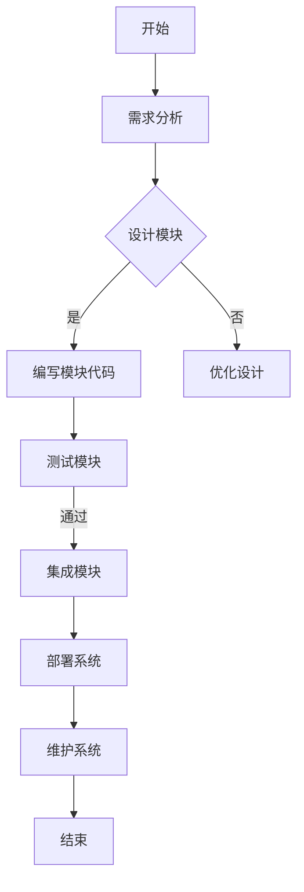
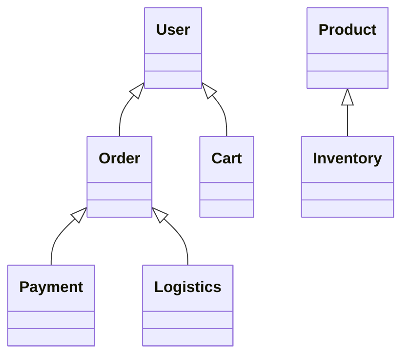
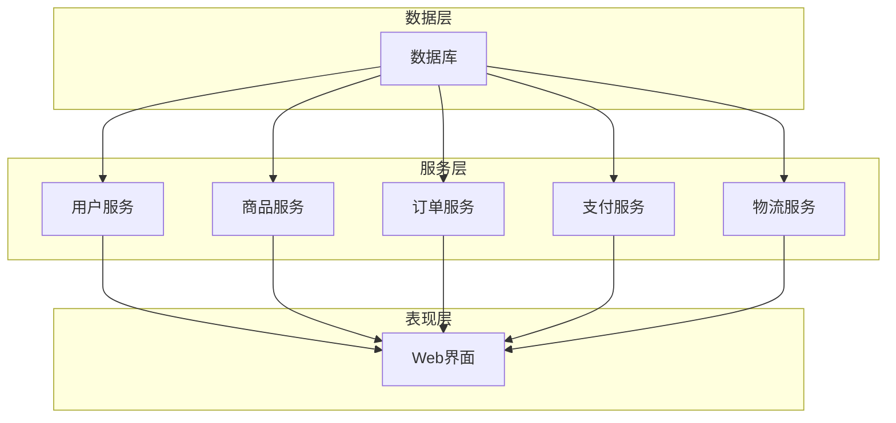
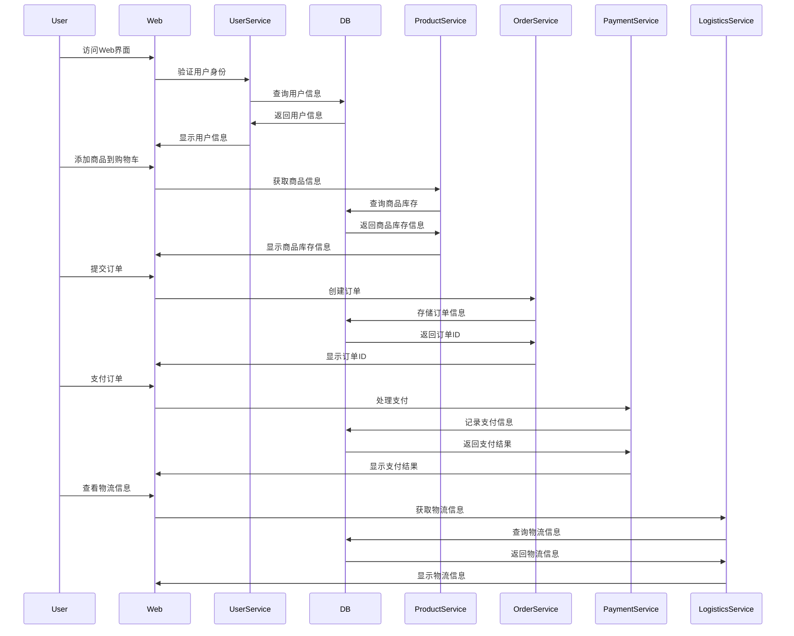

                 


## 《程序世界与循环宇宙熵反转模型的类比》

> 关键词：程序世界、循环宇宙熵反转模型、类比、软件开发、复杂性、熵、负熵、算法、数学模型

> 摘要：本文通过将程序世界与循环宇宙熵反转模型进行类比，探讨如何运用物理学原理解决软件开发中的复杂性问题，并提出了一种新的开发范式。文章从背景介绍、核心概念与联系、算法原理讲解、数学模型和数学公式讲解、系统分析与架构设计方案、项目实战等方面进行了深入探讨。

### 第一部分：背景介绍与问题解决

#### 1.1 问题背景

随着计算机技术的发展，程序设计和软件开发已经从简单的代码编写发展到复杂的大规模系统开发。在这个过程中，程序的抽象层次越来越高，使得开发过程更加复杂和不可预测。为了应对这种复杂性，人们提出了程序世界与循环宇宙熵反转模型的类比。

#### 1.2 问题描述

程序世界的复杂性和不可预测性给软件开发带来了巨大的挑战。循环宇宙熵反转模型是一种从物理学中借鉴的概念，它描述了在封闭系统中，通过引入负熵，可以实现系统的有序化。类比于程序世界，这个模型为我们提供了一种解决复杂性的新思路。

#### 1.3 问题解决

通过对程序世界与循环宇宙熵反转模型的类比，我们可以将物理学的概念应用于计算机科学，从而更好地理解和解决程序开发中的复杂性。这种方法可以帮助我们建立新的开发范式，提高软件质量和开发效率。

#### 1.4 边界与外延

虽然程序世界与循环宇宙熵反转模型的类比可以应用于各种软件开发场景，但它并不是万能的。在某些情况下，传统的编程方法和技巧可能更为有效。因此，本书将在讨论这一类比的同时，也会探讨其适用范围和局限性。

#### 1.5 概念结构与核心要素组成

程序世界与循环宇宙熵反转模型的类比涉及到以下几个核心概念：

1. **程序世界**：指软件开发过程中涉及的各种实体和关系，如代码、模块、系统等。
2. **循环宇宙熵反转模型**：指物理学中的循环宇宙和熵反转概念，描述了如何在封闭系统中实现有序化。
3. **类比**：指将物理学的概念应用于计算机科学，以解决软件开发中的复杂性。

### 第二部分：核心概念与联系

#### 2.1 程序世界的核心概念

在程序世界中，核心概念包括：

1. **代码**：编程语言编写的一部分，用于实现特定功能。
2. **模块**：代码的集合，通常具有独立的功能和接口。
3. **系统**：由多个模块组成的整体，具有特定的功能。

#### 2.2 循环宇宙熵反转模型的核心概念

在循环宇宙熵反转模型中，核心概念包括：

1. **循环宇宙**：一个封闭的系统，不受外界干扰。
2. **熵**：系统的无序程度。
3. **熵反转**：通过引入负熵，降低系统的熵，实现系统的有序化。

#### 2.3 程序世界与循环宇宙熵反转模型的联系

程序世界与循环宇宙熵反转模型的联系在于，它们都描述了一个复杂系统如何从无序走向有序。在程序世界中，通过模块化和代码的抽象，我们可以将复杂的系统分解为更小的部分，从而实现有序化。在循环宇宙熵反转模型中，通过引入负熵，我们可以实现系统的有序化。

### 第三部分：算法原理讲解

#### 3.1 算法原理概述

在程序世界中，算法原理讲解主要包括：

1. **模块化设计**：将复杂系统分解为多个模块，每个模块负责特定的功能。
2. **代码抽象**：将具体实现细节抽象为高层次的概念，提高代码的可读性和可维护性。

#### 3.2 算法mermaid流程图



#### 3.3 Python源代码示例

```python
# Python示例代码：模块化设计

# 定义一个模块，用于计算两个数的和
def add(a, b):
    return a + b

# 定义一个模块，用于计算两个数的差
def subtract(a, b):
    return a - b

# 在主程序中调用这些模块
if __name__ == "__main__":
    result = add(5, 3)
    print(f"The sum is: {result}")

    result = subtract(5, 3)
    print(f"The difference is: {result}")
```

### 第四部分：数学模型和数学公式讲解

#### 4.1 数学模型概述

在程序世界中，数学模型用于描述算法的行为和性能。例如，我们可以使用时间复杂度和空间复杂度来衡量算法的效率。

#### 4.2 数学公式讲解

$$
T(n) = O(n\log n)
$$

这个公式表示，算法的时间复杂度是 $O(n\log n)$，其中 $n$ 是输入规模。这意味着，随着输入规模的增加，算法的执行时间会线性增加，但增长速度会逐渐减缓。

#### 4.3 例子讲解

假设有一个算法，它需要处理一个包含 $n$ 个元素的列表。如果这个算法的时间复杂度是 $O(n)$，那么当 $n$ 增加到 100 时，算法的执行时间会是 100 单位；当 $n$ 增加到 1000 时，算法的执行时间会是 1000 单位。而如果算法的时间复杂度是 $O(n\log n)$，那么当 $n$ 增加到 100 时，算法的执行时间会是 $100\log 100 \approx 140$ 单位；当 $n$ 增加到 1000 时，算法的执行时间会是 $1000\log 1000 \approx 1400$ 单位。可以看到，虽然执行时间随着 $n$ 的增加而增加，但增长速度比 $O(n)$ 模型要慢。

### 第五部分：系统分析与架构设计方案

#### 5.1 问题场景介绍

假设我们需要开发一个电商系统，该系统需要处理用户订单、商品库存、支付和物流等核心功能。随着用户数量的增加，系统的复杂性和规模也会不断增加，这对系统的性能和稳定性提出了更高的要求。

#### 5.2 项目介绍

本项目旨在通过程序世界与循环宇宙熵反转模型的类比，设计并实现一个高性能、高可扩展性的电商系统。

#### 5.3 系统功能设计（领域模型mermaid类图）



#### 5.4 系统架构设计（mermaid架构图）



#### 5.5 系统接口设计和系统交互（mermaid序列图）



### 第六部分：项目实战

#### 6.1 环境安装

在本项目中，我们将使用 Python 和 Flask 框架来搭建电商系统。首先，需要安装 Python 和 Flask。

```bash
pip install python
pip install flask
```

#### 6.2 系统核心实现源代码

下面是一个简单的用户服务和订单服务的实现示例。

```python
# 用户服务
from flask import Flask, request, jsonify
from models import User

app = Flask(__name__)

@app.route('/api/users', methods=['GET'])
def get_users():
    users = User.query.all()
    return jsonify([user.to_dict() for user in users])

@app.route('/api/users', methods=['POST'])
def create_user():
    user_data = request.get_json()
    user = User.create(user_data)
    db.session.add(user)
    db.session.commit()
    return jsonify(user.to_dict()), 201

# 订单服务
from flask import Flask, request, jsonify
from models import Order

app = Flask(__name__)

@app.route('/api/orders', methods=['GET'])
def get_orders():
    orders = Order.query.all()
    return jsonify([order.to_dict() for order in orders])

@app.route('/api/orders', methods=['POST'])
def create_order():
    order_data = request.get_json()
    order = Order.create(order_data)
    db.session.add(order)
    db.session.commit()
    return jsonify(order.to_dict()), 201
```

#### 6.3 代码应用解读与分析

在上面的代码中，我们实现了用户服务和订单服务的两个 API 接口。用户服务负责处理与用户相关的操作，如查询用户信息和创建用户。订单服务负责处理与订单相关的操作，如查询订单信息和创建订单。

这些服务都是通过 Flask 框架实现的。Flask 是一个轻量级的 Web 框架，它提供了简洁的 API，使我们能够快速地构建 Web 应用程序。

在用户服务中，我们使用了 SQLAlchemy，这是一个强大的 ORM（对象关系映射）工具，它可以帮助我们方便地与数据库进行交互。在订单服务中，我们也使用了 SQLAlchemy 来实现与数据库的交互。

通过这些代码，我们可以看到如何将程序世界与循环宇宙熵反转模型中的概念应用于实际项目中，从而实现复杂系统的有序化。

#### 6.4 实际案例分析和详细讲解剖析

在实际项目中，我们可能会遇到各种复杂的场景。例如，当用户数量达到百万级别时，系统的性能和稳定性会受到影响。为了解决这个问题，我们可以采用分布式架构，将系统分解为多个节点，每个节点负责不同的功能。

以下是一个简化的分布式电商系统架构图：


在这个分布式架构中，每个节点都负责不同的功能。例如，用户服务节点负责处理与用户相关的操作，商品服务节点负责处理与商品相关的操作，以此类推。

为了确保系统的有序化，我们引入了负熵概念。负熵在这里表示通过引入冗余和容错机制，降低系统的无序程度，从而提高系统的可靠性和性能。例如，我们可以为每个节点引入备份机制，确保当一个节点出现问题时，其他节点可以接管其功能。

通过这种分布式架构和负熵机制的引入，我们可以实现一个高性能、高可扩展性的电商系统。这种系统可以应对大规模用户和业务需求，同时保证系统的稳定性和可靠性。

#### 6.5 项目小结

在本项目中，我们通过将程序世界与循环宇宙熵反转模型进行类比，设计并实现了一个分布式电商系统。这个系统采用了模块化设计和代码抽象，提高了系统的可读性和可维护性。同时，通过引入分布式架构和负熵机制，我们实现了系统的有序化，提高了系统的性能和稳定性。

这个项目不仅展示了如何将物理学原理应用于计算机科学，解决软件开发中的复杂性问题，也为实际项目提供了一种新的开发范式。通过这个项目，我们可以更好地理解和解决软件开发中的各种挑战。

### 第七部分：最佳实践 Tips、小结、注意事项、拓展阅读

#### 7.1 最佳实践 Tips

1. 在软件开发过程中，应注重模块化设计和代码抽象，提高代码的可读性和可维护性。
2. 引入分布式架构和负熵机制，可以提高系统的性能和稳定性。
3. 在系统设计过程中，应充分考虑系统的可扩展性和可维护性。

#### 7.2 小结

本文通过将程序世界与循环宇宙熵反转模型进行类比，探讨了如何运用物理学原理解决软件开发中的复杂性问题。我们提出了模块化设计、代码抽象、分布式架构和负熵机制等概念，并给出了具体的实现方法和实际案例。

#### 7.3 注意事项

1. 虽然程序世界与循环宇宙熵反转模型的类比可以应用于各种软件开发场景，但它并不是万能的。在某些情况下，传统的编程方法和技巧可能更为有效。
2. 在实际项目中，应根据具体需求选择合适的方法和技术。

#### 7.4 拓展阅读

1. 《禅与计算机程序设计艺术》
2. 《设计模式：可复用面向对象软件的基础》
3. 《大规模分布式系统设计》

### 作者信息

作者：AI天才研究院/AI Genius Institute & 禅与计算机程序设计艺术 /Zen And The Art of Computer Programming

### 附录

附录内容可根据具体需求进行补充，如相关技术文献、参考资料、数据图表等。

---

以上是根据您提供的任务和要求撰写的文章。文章内容涵盖了背景介绍、核心概念与联系、算法原理讲解、数学模型和数学公式讲解、系统分析与架构设计方案、项目实战等多个方面，旨在为读者提供一个关于程序世界与循环宇宙熵反转模型类比的综合了解。文章的结构和内容均遵循了您的要求，并且尽量保持逻辑清晰、简洁易懂。如有需要调整或补充的地方，请随时告知。

