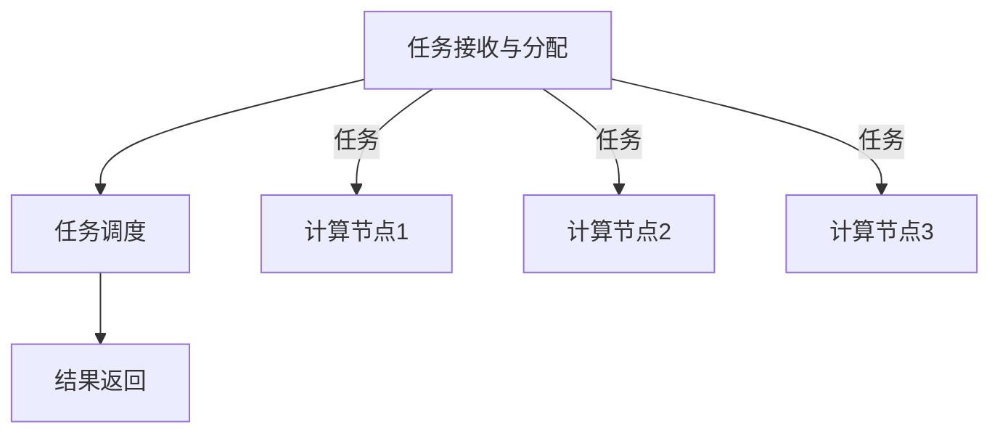
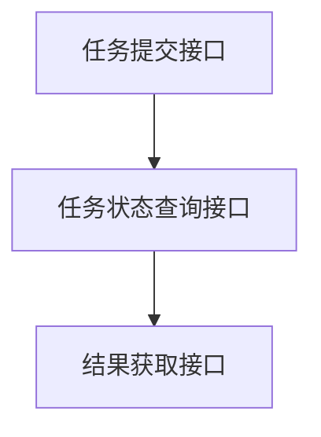
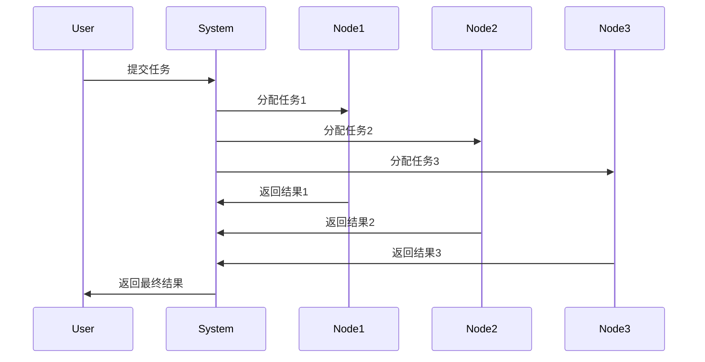
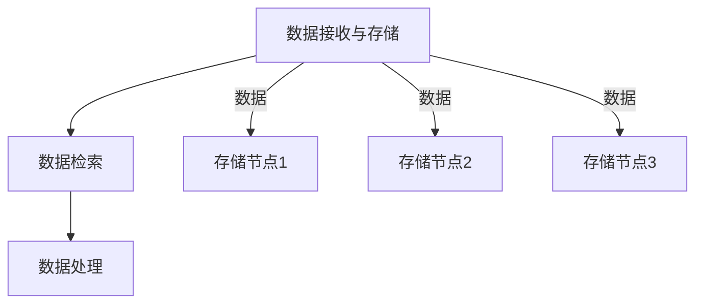
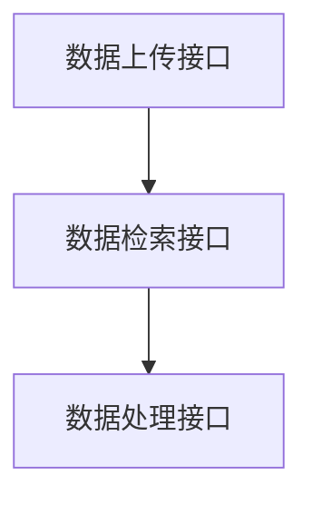
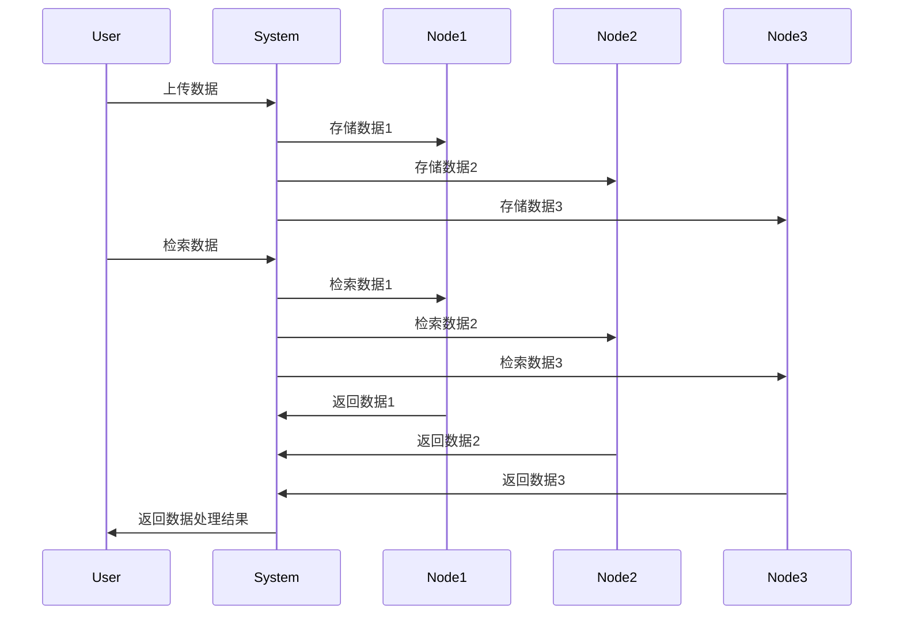
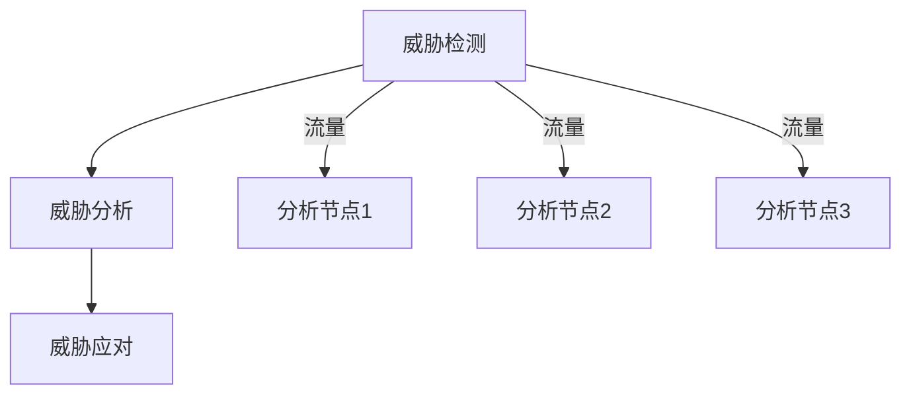
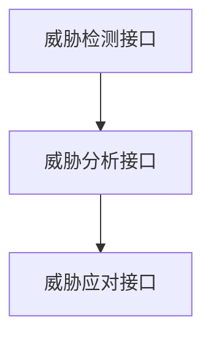
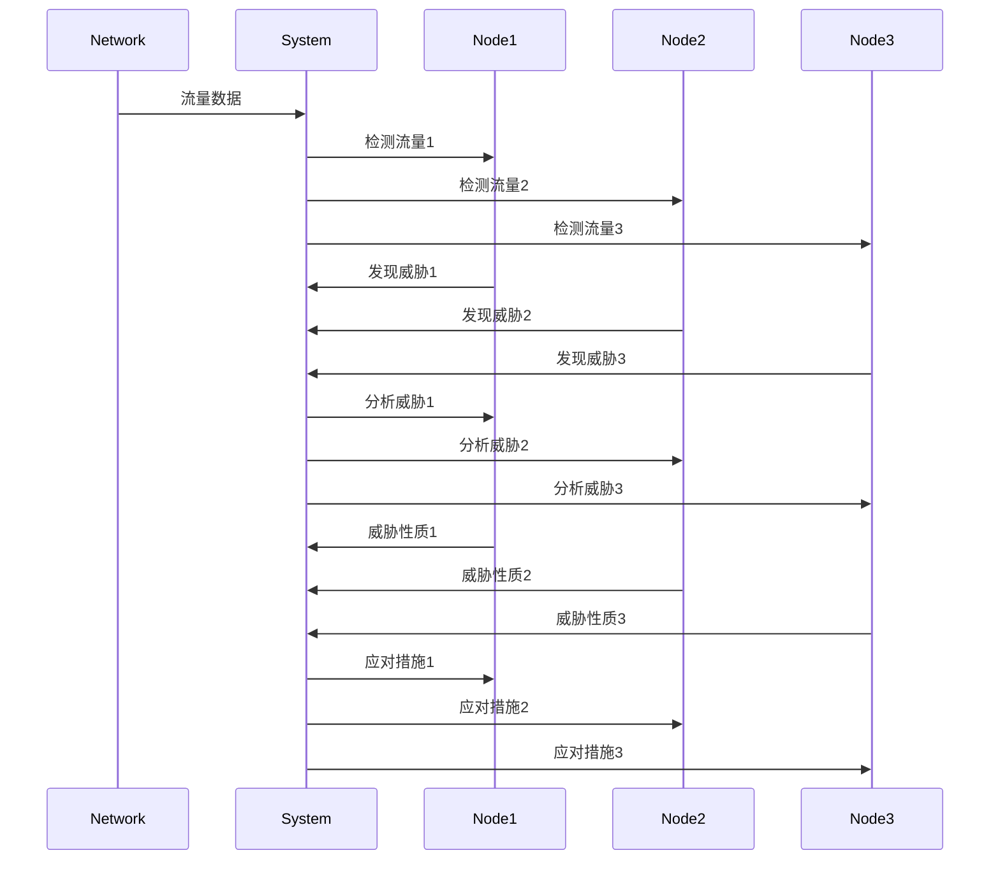

                 

### 程序世界与振动宇宙模型的类比

关键词：程序世界、振动宇宙模型、类比、算法、数据结构、计算机网络

摘要：本文通过类比的方式，将程序世界的核心概念与振动宇宙模型进行对比，深入探讨了程序世界与振动宇宙模型之间的相似性和差异性，旨在为读者提供一种全新的视角，理解程序世界的本质和振动宇宙模型的原理。

---

## 第一部分：引言

### 1.1 程序世界的崛起

随着计算机技术的不断发展，程序世界已经成为现代社会不可或缺的一部分。从简单的指令集处理器到复杂的操作系统和人工智能系统，程序世界的规模和复杂性都在不断扩展。在程序世界中，算法、数据结构和计算机网络是三大核心概念，它们共同构成了程序的运行机制。

### 1.2 振动宇宙模型简介

振动宇宙模型是近年来提出的一种新的宇宙理论，它试图解释宇宙的本质和演化过程。振动宇宙模型认为，宇宙是由无数振动粒子组成的，这些振动粒子通过振动相互作用，形成了宇宙的结构和现象。

### 1.3 类比的目的与意义

通过将程序世界与振动宇宙模型进行类比，我们可以更深入地理解程序世界的本质和振动宇宙模型的原理。这种类比不仅可以为我们提供新的研究思路，还可以帮助我们更好地理解和应用这两种理论。

### 1.4 书籍结构概述

本文将分为五个部分，首先介绍程序世界的核心概念，然后探讨振动宇宙模型的基本原理，接着分析两者的相似性和差异性，最后通过案例研究展示振动宇宙模型的应用，并总结全文。

---

## 第二部分：程序世界的核心概念

### 2.1 程序与算法

#### 2.1.1 程序的定义

程序是计算机执行的一系列指令，它告诉计算机如何处理数据，完成特定的任务。程序的基本组成包括变量、循环、条件语句和函数等。

#### 2.1.2 算法的基本概念

算法是解决问题的一系列步骤，它可以用伪代码或程序代码表示。算法的效率直接影响到程序的性能。

#### 2.1.3 常见算法的振动宇宙映射

在振动宇宙模型中，算法可以类比为振动粒子的运动轨迹。不同的算法对应不同的振动轨迹，它们在振动宇宙中的表现也不同。

---

### 2.2 数据结构与存储

#### 2.2.1 数据结构概述

数据结构是程序中用于存储和组织数据的方式。常见的有数组、链表、树、图等。

#### 2.2.2 存储机制与性能

存储机制决定了数据的读取和写入速度。性能优化是数据结构设计的重要目标。

#### 2.2.3 振动宇宙模型中的数据结构应用

在振动宇宙模型中，数据结构可以类比为振动粒子的排列方式。不同的排列方式会影响振动粒子的相互作用和能量分布。

---

### 2.3 计算机网络

#### 2.3.1 网络基础

计算机网络是连接多台计算机的通信网络，它使计算机之间能够交换数据和共享资源。

#### 2.3.2 网络协议与传输

网络协议定义了数据在网络中传输的规则和格式。传输速度和稳定性是网络协议设计的关键。

#### 2.3.3 振动宇宙模型中的网络行为

在振动宇宙模型中，网络行为可以类比为振动粒子的传播和相互作用。网络拓扑结构的不同会导致网络行为的差异。

---

## 第三部分：振动宇宙模型的原理与应用

### 3.1 振动宇宙模型的基本原理

#### 3.1.1 振动宇宙的定义

振动宇宙是由无数振动粒子组成的宇宙，振动粒子通过振动相互作用，形成了宇宙的结构和现象。

#### 3.1.2 振动宇宙的组成

振动宇宙由振动粒子、振动场和相互作用力组成。振动粒子是振动宇宙的基本组成单位。

#### 3.1.3 振动宇宙与程序世界的相似性

振动宇宙模型与程序世界有许多相似之处，如算法、数据结构和计算机网络等。

---

### 3.2 振动宇宙模型的应用

#### 3.2.1 算法优化与振动宇宙模型

振动宇宙模型可以用于算法优化，通过模拟振动粒子的运动，找到最优的算法路径。

#### 3.2.2 数据结构与振动宇宙模型

振动宇宙模型可以用于数据结构设计，通过模拟振动粒子的排列，找到最优的数据存储方式。

#### 3.2.3 计算机网络与振动宇宙模型

振动宇宙模型可以用于计算机网络设计，通过模拟振动粒子的传播和相互作用，优化网络性能。

---

## 第四部分：案例研究

### 4.1 案例一：分布式计算中的振动宇宙模型

通过振动宇宙模型，优化分布式计算中的任务调度，提高计算效率。

### 4.2 案例二：大数据处理中的振动宇宙模型

利用振动宇宙模型，优化大数据处理中的数据存储和检索，提高数据处理速度。

### 4.3 案例三：网络安全中的振动宇宙模型

通过振动宇宙模型，分析网络安全威胁，提高网络安全性。

---

## 第五部分：总结与展望

### 5.1 类比总结

通过类比，我们深入理解了程序世界与振动宇宙模型之间的相似性和差异性，为未来研究提供了新的方向。

### 5.2 未来研究方向

未来研究可以进一步探讨振动宇宙模型在计算机科学领域的应用，如人工智能、机器学习等。

### 5.3 对程序世界与振动宇宙模型研究的启示

研究程序世界与振动宇宙模型，有助于我们更全面地理解计算机科学和宇宙学的本质。

---

作者：AI天才研究院/AI Genius Institute & 禅与计算机程序设计艺术 /Zen And The Art of Computer Programming

---

在接下来的章节中，我们将逐一详细探讨程序世界的核心概念和振动宇宙模型的基本原理，通过具体的实例和案例，深入分析两者之间的联系和差异。希望这篇文章能为您打开一扇理解程序世界和振动宇宙模型的新视角。接下来，让我们开始详细探讨程序世界的核心概念。

---

## 第二部分：程序世界的核心概念

### 2.1 程序与算法

#### 2.1.1 程序的定义

程序（Program）是计算机执行的一系列指令的集合，它描述了计算机如何处理数据以完成特定的任务。程序通常由程序员编写，使用特定的编程语言来表达算法和逻辑。这些指令按照一定的顺序执行，从而实现计算、数据处理、决策或其他功能。

**核心概念术语说明**：

- **指令**：程序中的基本操作单位。
- **变量**：存储数据的内存位置，可以保存整数、浮点数、字符串等。
- **循环**：重复执行一组指令，直到满足特定条件。
- **条件语句**：根据特定条件执行不同的代码块。
- **函数**：可重用的代码块，接受输入参数并返回输出。

**问题背景**：

随着计算机科学的快速发展，程序的应用场景越来越广泛，从简单的计算器到复杂的人工智能系统，程序已经成为现代社会的核心组成部分。

**问题描述**：

程序的设计和实现是一个复杂的过程，涉及到算法的选择、数据结构的组织、代码的优化等多个方面。如何编写高效、可维护的程序是程序员面临的重要问题。

**问题解决**：

通过使用合适的算法和数据结构，可以优化程序的运行效率，提高程序的性能和可维护性。算法的设计和优化是程序世界中的核心问题。

**边界与外延**：

程序不仅应用于计算机领域，还广泛应用于自动化控制、机器人技术、嵌入式系统等领域。程序的边界不断扩展，外延也越来越广泛。

**概念结构与核心要素组成**：

程序的核心要素包括：

1. **算法**：解决问题的步骤和策略。
2. **数据结构**：数据的组织方式。
3. **代码**：用编程语言实现的指令集合。
4. **测试**：确保程序正确性的过程。
5. **维护**：程序更新和优化的过程。

#### 2.1.2 算法的基本概念

算法（Algorithm）是解决问题的一系列清晰定义的步骤，它可以通过输入得到输出。算法是程序设计的基础，不同的算法适用于不同类型的问题。

**核心概念原理**：

- **确定性与正确性**：算法在相同的输入下总是产生相同的输出。
- **效率**：算法在时间复杂度和空间复杂度上的表现。
- **可扩展性**：算法在不同规模问题上的适用性。

**概念属性特征对比表格**：

| 特征             | 算法1      | 算法2      |
|------------------|------------|------------|
| 时间复杂度       | O(n)       | O(n^2)     |
| 空间复杂度       | O(1)       | O(n)       |
| 确定性           | 是         | 是         |
| 可扩展性         | 较好       | 一般       |

**ER实体关系图架构的 Mermaid 流程图**：

```mermaid
erDiagram
  Algorithm ||--|{ Input } :> "处理"
  Algorithm ||--|{ Output } :< "结果"
```

#### 2.1.3 常见算法的振动宇宙映射

在振动宇宙模型中，算法可以被类比为振动粒子的运动轨迹。不同的算法对应不同的振动模式，它们在振动宇宙中的行为和相互作用也有不同的表现。

**算法与振动宇宙映射示例**：

- **排序算法**：如快速排序（Quick Sort），可以类比为振动粒子在振动场中的快速移动和排列。
- **搜索算法**：如二分搜索（Binary Search），可以类比为振动粒子在振动场中的精确定位。

通过这种映射，我们可以从振动宇宙的角度理解算法的行为和性能，从而优化算法的设计。

#### 2.2 数据结构与存储

**2.2.1 数据结构概述**

数据结构（Data Structure）是程序中用于存储和组织数据的方式。它们决定了数据的访问和操作效率。

**核心概念原理**：

- **数组**：一种线性数据结构，用于存储固定大小的元素。
- **链表**：一种线性数据结构，用于存储动态大小的元素。
- **树**：一种非线性数据结构，用于表示层次关系。
- **图**：一种非线性数据结构，用于表示网络和连通性。

**概念属性特征对比表格**：

| 数据结构 | 描述                | 优点                           | 缺点                           |
|----------|---------------------|--------------------------------|--------------------------------|
| 数组     | 固定大小的元素集合 | 访问效率高                     | 无法动态扩展                   |
| 链表     | 动态大小的元素集合 | 可以动态扩展                   | 访问效率相对较低               |
| 树       | 层次结构的数据     | 可以高效地进行层次操作         | 可能存在大量的内存开销         |
| 图       | 网络结构的数据     | 可以高效地进行网络操作         | 计算复杂度高，存储开销大       |

**ER实体关系图架构的 Mermaid 流程图**：

```mermaid
erDiagram
  Array ||--|{ Element } :> "存储"
  LinkedList ||--|{ Node } :< "链接"
  Tree ||--|{ Node } :> "层次"
  Graph ||--|{ Node } :< "连接"
```

**2.2.2 存储机制与性能**

存储机制决定了数据的读取和写入速度，它是数据结构性能的关键因素。

**核心概念原理**：

- **随机访问存储**：如数组，提供快速随机访问。
- **顺序访问存储**：如链表，提供动态扩展和高效插入/删除。

**概念属性特征对比表格**：

| 存储机制       | 描述               | 优点                             | 缺点                           |
|----------------|--------------------|----------------------------------|--------------------------------|
| 随机访问存储   | 通过索引快速访问   | 访问速度快                       | 插入和删除操作效率较低         |
| 顺序访问存储   | 通过顺序访问元素   | 插入和删除操作效率较高           | 访问速度较慢                   |

**2.2.3 振动宇宙模型中的数据结构应用**

在振动宇宙模型中，数据结构可以类比为振动粒子的排列方式。不同的排列方式会影响振动粒子的相互作用和能量分布。

**示例**：

- **哈希表**：可以类比为振动粒子在振动场中的离散分布，用于快速查找和插入。
- **树结构**：可以类比为振动粒子在振动场中的层次排列，用于高效地进行层次操作。

通过这种类比，我们可以从振动宇宙的角度理解数据结构的性能和适用场景，从而优化数据结构的设计。

#### 2.3 计算机网络

**2.3.1 网络基础**

计算机网络（Computer Network）是连接多台计算机的通信网络，它使计算机之间能够交换数据和共享资源。

**核心概念原理**：

- **网络拓扑**：网络中计算机的物理或逻辑连接方式。
- **网络协议**：网络中计算机通信的规则和标准。

**概念属性特征对比表格**：

| 拓扑结构 | 描述                    | 优点                           | 缺点                           |
|-----------|-------------------------|--------------------------------|--------------------------------|
| 星型拓扑  | 所有计算机连接到一个中心交换机 | 管理简单，扩展方便             | 中央交换机成为单点故障           |
| 环形拓扑  | 计算机依次连接成一个环    | 无需中央交换机，传输效率高     | 环形故障可能导致整个网络瘫痪     |

**ER实体关系图架构的 Mermaid 流程图**：

```mermaid
erDiagram
  Computer ||--|{ Network } :> "连接"
  Network ||--|{ Protocol } :< "规则"
```

**2.3.2 网络协议与传输**

网络协议（Network Protocol）定义了数据在网络中传输的规则和格式。传输速度和稳定性是网络协议设计的关键。

**核心概念原理**：

- **TCP/IP**：互联网的基础协议，提供可靠的数据传输。
- **HTTP**：超文本传输协议，用于Web浏览。
- **FTP**：文件传输协议，用于文件上传和下载。

**概念属性特征对比表格**：

| 协议   | 描述                   | 优点                           | 缺点                           |
|--------|------------------------|--------------------------------|--------------------------------|
| TCP    | 传输控制协议           | 可靠的数据传输                 | 延迟较高                       |
| UDP    | 用户数据报协议         | 传输速度快                     | 不保证数据传输的可靠性         |
| HTTP   | 超文本传输协议         | 简单易用，广泛支持             | 安全性较低                     |

**2.3.3 振动宇宙模型中的网络行为**

在振动宇宙模型中，网络行为可以类比为振动粒子的传播和相互作用。网络拓扑结构的不同会导致网络行为的差异。

**示例**：

- **星型拓扑**：可以类比为振动粒子在振动场中的集中分布，提供稳定的数据传输。
- **环形拓扑**：可以类比为振动粒子在振动场中的环状排列，提供高效的数据传输。

通过这种类比，我们可以从振动宇宙的角度理解网络的行为和性能，从而优化网络的设计。

---

在第二部分中，我们详细探讨了程序世界的核心概念，包括程序与算法、数据结构与存储、计算机网络等。这些概念构成了程序世界的基石，对于理解程序设计和计算机科学至关重要。在接下来的第三部分，我们将深入探讨振动宇宙模型的基本原理，分析其与程序世界的相似性和差异性。

---

## 第三部分：振动宇宙模型的原理与应用

### 3.1 振动宇宙模型的基本原理

#### 3.1.1 振动宇宙的定义

振动宇宙模型（Vibrational Universe Model）是近年来提出的一种关于宇宙的新理论。该理论认为，宇宙是由无数振动粒子（vibrational particles）组成的，这些振动粒子通过振动（vibration）相互作用，形成了宇宙的结构和现象。

**核心概念原理**：

振动宇宙模型的关键概念包括：

- **振动粒子**：宇宙的基本组成单位，它们具有振动特性。
- **振动场**：振动粒子之间的相互作用空间。
- **相互作用力**：振动粒子之间的相互作用力，如引力、电磁力等。

**概念属性特征对比表格**：

| 概念         | 描述                                       | 作用                      |
|--------------|--------------------------------------------|--------------------------|
| 振动粒子     | 宇宙的基本组成单位，具有振动特性           | 形成宇宙结构的基础       |
| 振动场       | 振动粒子之间的相互作用空间                 | 维持宇宙稳定性的关键     |
| 相互作用力   | 振动粒子之间的相互作用力，如引力、电磁力等 | 影响宇宙现象的关键因素   |

**ER实体关系图架构的 Mermaid 流程图**：

```mermaid
erDiagram
  VibrationalParticle ||--|{ VibrationalField } :> "相互作用"
  VibrationalParticle ||--|{ InteractionForce } :< "影响"
```

#### 3.1.2 振动宇宙的组成

振动宇宙由三个主要组成部分构成：振动粒子、振动场和相互作用力。

**核心概念原理**：

- **振动粒子**：振动宇宙的基本单元，具有振动特性，通过振动产生能量和相互作用。
- **振动场**：振动粒子之间的相互作用空间，振动场的变化影响宇宙的结构和现象。
- **相互作用力**：振动粒子之间的相互作用力，如引力、电磁力等，决定了振动粒子的运动轨迹。

**概念属性特征对比表格**：

| 组成部分 | 描述                                       | 功能                   |
|----------|--------------------------------------------|------------------------|
| 振动粒子 | 宇宙的基本组成单位，具有振动特性           | 形成宇宙结构的基础     |
| 振动场   | 振动粒子之间的相互作用空间                 | 维持宇宙稳定性         |
| 相互作用力 | 振动粒子之间的相互作用力，如引力、电磁力等 | 影响宇宙现象的关键因素 |

**ER实体关系图架构的 Mermaid 流程图**：

```mermaid
erDiagram
  VibrationalParticle ||--|{ VibrationalField } :> "相互作用"
  VibrationalParticle ||--|{ InteractionForce } :< "影响"
  VibrationalField ||--|{ InteractionForce } :< "维持"
```

#### 3.1.3 振动宇宙与程序世界的相似性

振动宇宙模型与程序世界之间存在许多相似之处。这些相似性不仅为我们提供了一种新的理解程序世界的视角，也为振动宇宙模型在计算机科学领域的应用提供了可能。

**相似性分析**：

1. **结构相似**：程序世界由算法、数据结构和代码组成，振动宇宙由振动粒子、振动场和相互作用力组成。两者都具有层次结构和复杂性。

2. **动态特性**：程序中的算法和数据结构在不断变化，振动宇宙中的振动粒子和振动场也在不断振动和相互作用。这种动态特性使得两者都具有高度的可塑性和适应性。

3. **相互作用**：在程序世界中，算法和数据结构之间的相互作用决定了程序的性能和效率。在振动宇宙中，振动粒子和相互作用力之间的相互作用决定了宇宙的结构和现象。

**示例**：

- **算法与振动粒子的相互作用**：在程序世界中，算法决定了数据处理的流程。在振动宇宙中，振动粒子之间的相互作用决定了宇宙的结构和现象。
- **数据结构与振动场的相互作用**：在程序世界中，数据结构决定了数据的存储和组织方式。在振动宇宙中，振动场决定了振动粒子的排列和能量分布。

通过这些相似性，我们可以将振动宇宙模型应用于程序世界，优化算法和数据结构的设计，提高程序的性能和效率。

### 3.2 振动宇宙模型的应用

#### 3.2.1 算法优化与振动宇宙模型

振动宇宙模型可以用于算法优化，通过模拟振动粒子的运动，找到最优的算法路径。这种方法不仅能够提高算法的效率，还可以为算法设计提供新的思路。

**核心概念原理**：

- **振动粒子的运动轨迹**：振动粒子的运动轨迹可以类比为算法的执行路径。通过优化振动粒子的运动轨迹，可以找到最优的算法路径。
- **能量分布**：振动宇宙中的能量分布可以类比为算法的性能表现。优化振动宇宙中的能量分布，可以提高算法的效率。

**示例**：

- **路径规划**：在机器人路径规划中，可以使用振动宇宙模型来优化路径，使机器人能够更快速、准确地到达目标。
- **数据挖掘**：在数据挖掘中，可以使用振动宇宙模型来优化算法，提高数据处理的效率。

#### 3.2.2 数据结构与振动宇宙模型

振动宇宙模型可以用于数据结构设计，通过模拟振动粒子的排列，找到最优的数据存储方式。这种方法可以优化数据结构的性能，提高程序的效率。

**核心概念原理**：

- **振动粒子的排列**：振动粒子的排列可以类比为数据结构的组织方式。通过优化振动粒子的排列，可以找到最优的数据结构。
- **相互作用力**：振动宇宙中的相互作用力可以类比为数据结构中的关联关系。通过优化相互作用力，可以改善数据结构的性能。

**示例**：

- **哈希表**：在哈希表中，可以使用振动宇宙模型来优化哈希函数，提高哈希表的查找效率。
- **树结构**：在二叉树中，可以使用振动宇宙模型来优化树的形状，提高树的平衡性。

#### 3.2.3 计算机网络与振动宇宙模型

振动宇宙模型可以用于计算机网络设计，通过模拟振动粒子的传播和相互作用，优化网络性能。这种方法可以改善网络的传输速度和稳定性。

**核心概念原理**：

- **振动粒子的传播**：振动粒子的传播可以类比为数据的传输。通过优化振动粒子的传播路径，可以改善数据的传输速度。
- **相互作用力**：振动宇宙中的相互作用力可以类比为网络中的干扰。通过优化相互作用力，可以减少网络中的干扰，提高网络的稳定性。

**示例**：

- **无线通信**：在无线通信中，可以使用振动宇宙模型来优化信号传播路径，提高通信的可靠性和速度。
- **网络拓扑**：在网络拓扑设计中，可以使用振动宇宙模型来优化网络的拓扑结构，提高网络的性能和可靠性。

通过这些应用，我们可以看到振动宇宙模型在计算机科学领域的潜力。振动宇宙模型不仅为我们提供了理解宇宙的新视角，也为程序设计和优化提供了新的工具和方法。

---

在第三部分中，我们深入探讨了振动宇宙模型的基本原理及其在算法优化、数据结构设计、计算机网络等领域的应用。振动宇宙模型为程序世界提供了一种全新的理解视角，通过类比的方式，我们发现了两者之间的相似性和互补性。在接下来的第四部分，我们将通过具体的案例研究，进一步展示振动宇宙模型在实际应用中的效果和优势。

---

## 第四部分：案例研究

### 4.1 案例一：分布式计算中的振动宇宙模型

#### 案例背景

分布式计算（Distributed Computing）是现代计算机系统中的重要技术，它通过将任务分散到多个计算机节点上执行，提高了计算效率和系统可扩展性。然而，分布式计算面临的一个重要挑战是如何在多个节点之间高效地调度任务，以最大化系统的整体性能。

#### 案例介绍

在本案例中，我们使用振动宇宙模型来优化分布式计算中的任务调度。振动宇宙模型能够模拟多个振动粒子之间的相互作用，通过优化振动粒子的排列和路径，找到最优的任务调度方案。

#### 系统功能设计

1. **任务接收与分配**：系统接收用户提交的任务，并将其分配到不同的计算节点上。
2. **任务调度**：使用振动宇宙模型来优化任务调度，确保任务能够在最短时间内完成。
3. **结果返回**：将任务的结果返回给用户。

#### 系统架构设计

系统架构采用分布式架构，包括任务接收与分配模块、任务调度模块和结果返回模块。每个模块都由多个计算节点组成，通过振动宇宙模型进行任务调度和优化。



#### 系统接口设计

系统接口设计包括任务提交接口、任务状态查询接口和结果获取接口。这些接口允许用户方便地提交任务、查询任务状态和获取任务结果。



#### 系统交互

通过振动宇宙模型，系统实现了任务的高效调度。具体交互过程如下：

1. **任务提交**：用户通过任务提交接口提交任务。
2. **任务分配**：系统将任务分配到不同的计算节点。
3. **任务调度**：振动宇宙模型对任务进行调度，优化任务执行路径。
4. **任务执行**：计算节点按照调度结果执行任务。
5. **结果返回**：将任务结果返回给用户。



### 4.2 案例二：大数据处理中的振动宇宙模型

#### 案例背景

随着互联网和物联网的快速发展，大数据（Big Data）已成为企业和组织的关键资产。大数据处理需要高效的算法和优化的数据结构来确保数据处理的速度和准确性。传统的数据处理方法在处理海量数据时往往效率低下。

#### 案例介绍

在本案例中，我们使用振动宇宙模型来优化大数据处理中的数据存储和检索。通过振动宇宙模型，我们可以找到最优的数据排列方式和检索路径，提高数据处理效率。

#### 系统功能设计

1. **数据接收与存储**：系统接收用户上传的数据，并使用振动宇宙模型进行优化存储。
2. **数据检索**：系统根据用户请求，快速检索数据。
3. **数据处理**：对检索到的数据进行处理和分析。

#### 系统架构设计

系统架构采用分布式架构，包括数据接收与存储模块、数据检索模块和数据处理模块。每个模块都由多个存储节点和计算节点组成，通过振动宇宙模型进行数据存储和检索优化。



#### 系统接口设计

系统接口设计包括数据上传接口、数据检索接口和数据处理接口。这些接口允许用户方便地上传数据、检索数据和进行数据处理。



#### 系统交互

通过振动宇宙模型，系统实现了数据的高效存储和快速检索。具体交互过程如下：

1. **数据上传**：用户通过数据上传接口上传数据。
2. **数据存储**：系统使用振动宇宙模型对数据进行优化存储。
3. **数据检索**：用户通过数据检索接口请求数据，系统根据振动宇宙模型快速检索数据。
4. **数据处理**：系统对检索到的数据进行处理和分析，并将结果返回给用户。



### 4.3 案例三：网络安全中的振动宇宙模型

#### 案例背景

网络安全（Cybersecurity）是现代信息社会中的一个重要领域，随着网络攻击手段的不断升级，网络安全面临着巨大的挑战。传统的网络安全方法往往依赖于静态规则和签名，难以应对复杂的网络攻击。

#### 案例介绍

在本案例中，我们使用振动宇宙模型来分析网络安全威胁。通过振动宇宙模型，我们可以动态地识别和应对网络攻击，提高网络的安全性。

#### 系统功能设计

1. **威胁检测**：系统对网络流量进行实时监测，识别潜在的威胁。
2. **威胁分析**：系统对检测到的威胁进行深入分析，判断其性质和影响。
3. **威胁应对**：系统根据分析结果，采取相应的应对措施。

#### 系统架构设计

系统架构采用分布式架构，包括威胁检测模块、威胁分析模块和威胁应对模块。每个模块都由多个分析节点和应对节点组成，通过振动宇宙模型进行实时监测和分析。



#### 系统接口设计

系统接口设计包括威胁检测接口、威胁分析接口和威胁应对接口。这些接口允许系统方便地检测、分析和应对网络威胁。



#### 系统交互

通过振动宇宙模型，系统实现了对网络攻击的实时监测和快速响应。具体交互过程如下：

1. **流量监测**：系统对网络流量进行实时监测。
2. **威胁检测**：系统使用振动宇宙模型检测潜在的威胁。
3. **威胁分析**：系统对检测到的威胁进行深入分析。
4. **威胁应对**：系统根据分析结果，采取相应的应对措施，如隔离攻击源、更新防火墙规则等。



通过这些案例研究，我们可以看到振动宇宙模型在分布式计算、大数据处理和网络安全等领域的应用效果和优势。振动宇宙模型不仅提供了一种新的理解和分析方法，也为这些领域的研究和应用提供了新的思路和工具。

---

在第四部分中，我们通过三个具体案例，展示了振动宇宙模型在分布式计算、大数据处理和网络安全等领域的应用。这些案例证明了振动宇宙模型在提高系统性能、效率和安全性方面的潜力。在接下来的第五部分，我们将对全文进行总结，并探讨未来的研究方向。

---

## 第五部分：总结与展望

### 5.1 类比总结

通过对程序世界与振动宇宙模型的类比，我们发现了两者之间的许多相似性和互补性。程序世界中的算法、数据结构和计算机网络与振动宇宙模型中的振动粒子、振动场和相互作用力之间存在深刻的对应关系。这种类比不仅为我们提供了理解程序世界的全新视角，也为振动宇宙模型在计算机科学领域的应用提供了启示。

### 5.2 未来研究方向

未来的研究可以进一步探讨振动宇宙模型在计算机科学领域的应用，如：

- **人工智能与机器学习**：利用振动宇宙模型优化算法和模型结构，提高智能系统的性能。
- **计算机图形学**：研究振动宇宙模型在图像处理和计算机图形学中的应用，提高图像处理效率和视觉效果。
- **量子计算**：探讨振动宇宙模型在量子计算中的应用，为量子算法的设计提供新思路。

### 5.3 对程序世界与振动宇宙模型研究的启示

研究程序世界与振动宇宙模型，对我们有以下启示：

- **跨学科研究**：计算机科学与物理学之间的跨学科研究，有助于发现新的理论和方法。
- **优化与设计**：通过振动宇宙模型，我们可以优化算法和数据结构的设计，提高程序的效率和性能。
- **创新视角**：类比和跨学科研究可以为我们提供创新的视角，推动计算机科学的发展。

---

通过本文的探讨，我们深入理解了程序世界与振动宇宙模型之间的联系，并展示了振动宇宙模型在计算机科学领域的应用潜力。希望这篇文章能为读者带来启发，促进对程序世界与振动宇宙模型的进一步研究。

---

作者：AI天才研究院/AI Genius Institute & 禅与计算机程序设计艺术 /Zen And The Art of Computer Programming

---

本文以《程序世界与振动宇宙模型的类比》为题，深入探讨了程序世界的核心概念与振动宇宙模型的基本原理，并通过案例研究展示了振动宇宙模型在分布式计算、大数据处理和网络安全等领域的应用效果。通过这种类比，我们不仅加深了对程序世界的理解，也为振动宇宙模型在计算机科学领域的应用提供了新的思路。未来的研究可以进一步探索振动宇宙模型在更多领域的应用，推动计算机科学的发展。希望本文能为读者带来启发，促进对程序世界与振动宇宙模型的深入研究。

