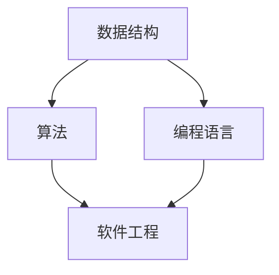
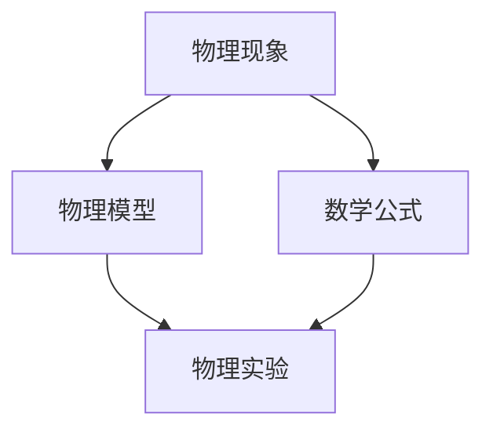
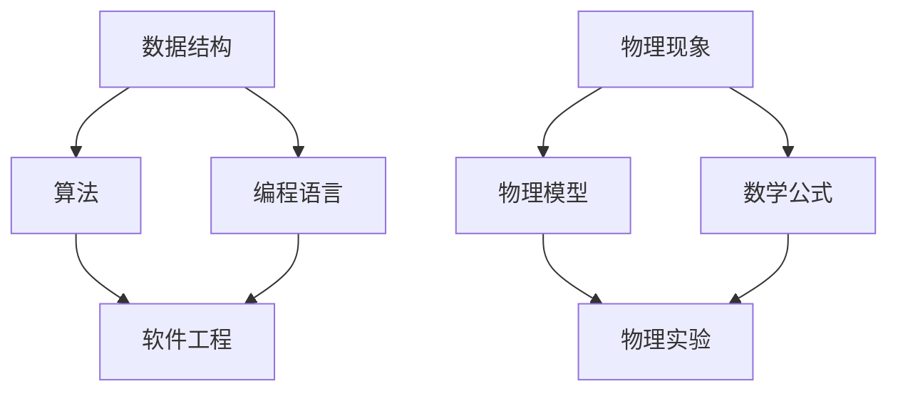
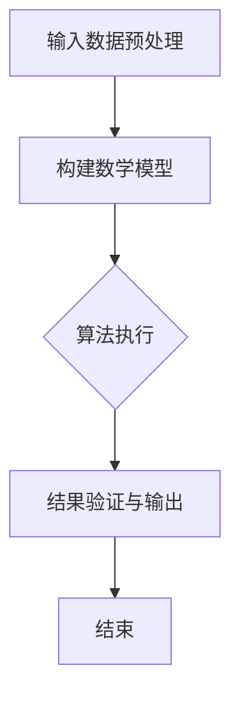
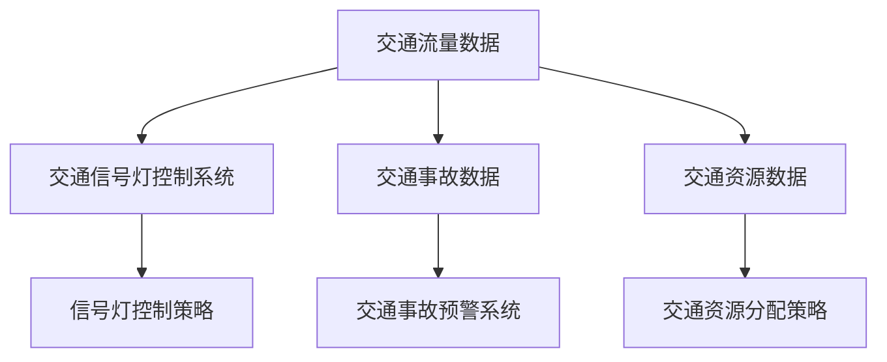
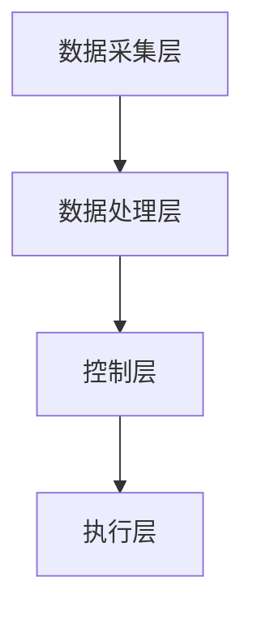
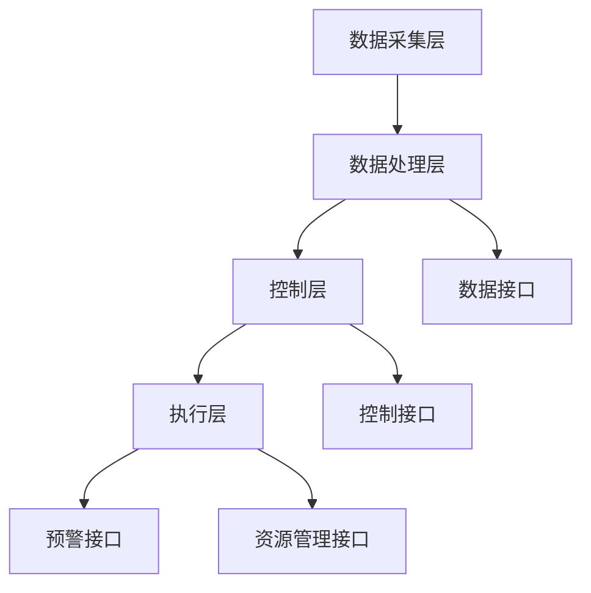
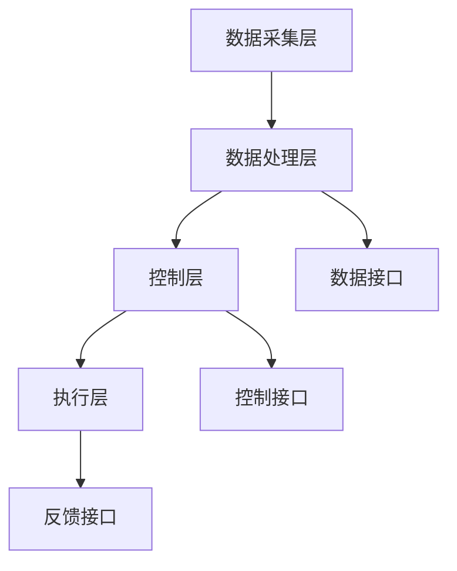

                 

# 程序世界与物理世界的数学统一

## 关键词

数学统一、程序世界、物理世界、算法原理、系统架构设计、人工智能

## 摘要

本文旨在探讨程序世界与物理世界的数学统一问题。通过对程序世界和物理世界的基本概念、数学描述及其在各自领域中的应用进行深入分析，本文提出了数学统一的目标与挑战。随后，文章详细阐述了数学统一的基本原理和方法论，并通过具体实例展示了其在算法设计和系统架构中的应用。最后，本文总结了数学统一的重要性及其在实际领域的广泛应用，为未来研究指明了方向。

## 第1章 引言

### 1.1 问题背景

在现代社会，程序世界和物理世界已经成为两个并行发展的体系。程序世界是由计算机程序构成的虚拟世界，它以逻辑和数学为基础，通过算法和数据处理实现了信息处理和智能决策。而物理世界则是我们日常生活的现实世界，它遵循自然界的基本规律，通过物理定律和化学反应来描述和解释各种现象。

虽然这两个世界在本质上是不同的，但它们之间存在着紧密的联系。程序世界的发展离不开对物理世界的理解和模拟，而物理世界的许多现象也需要通过程序世界的计算和模拟来解释。因此，如何实现程序世界与物理世界的数学统一，成为了一个重要的研究课题。

#### 1.1.1 程序世界的数学基础

程序世界的基本概念包括数据结构、算法、编程语言和软件工程等。这些概念都是基于数学的，尤其是离散数学、图论和组合数学。例如，数据结构中的树、图和数组等都是数学概念的具体实现。算法则是程序世界的核心，它通过数学方法解决了各种计算问题，如排序、查找和优化等。

编程语言是程序世界的实现工具，它将数学概念转化为计算机可以理解和执行的形式。常见的编程语言包括C、C++、Java、Python等，它们各自有着不同的语法和特点，但都遵循数学逻辑。

软件工程则是一门关于如何高效设计和开发软件的学科，它包含了项目管理、需求分析、设计、测试和部署等环节。这些环节都需要数学方法和工具的支持，以确保软件的质量和效率。

#### 1.1.2 物理世界的数学描述

物理世界的基本概念包括力、能量、运动和场等。这些概念都是通过数学公式和理论来描述和解释的。例如，牛顿定律描述了力的作用和物体的运动关系，能量守恒定律描述了能量在不同形式之间的转化和守恒。

物理世界中的许多现象，如电磁现象、量子力学、热力学和流体力学等，都是通过数学模型和公式来描述的。这些数学模型和公式不仅能够准确地描述物理现象，还可以预测未来的变化。

#### 1.1.3 数学统一的目标与挑战

数学统一的目标是找到一个统一的数学框架，能够同时描述和解释程序世界和物理世界的基本概念和现象。这样，我们就可以使用相同的数学工具和方法来研究和解决这两个世界的问题。

然而，实现数学统一面临着巨大的挑战。首先，程序世界和物理世界在本质上存在着巨大的差异，如离散性和连续性、计算复杂性等。其次，程序世界的数学基础和物理世界的数学描述虽然都基于数学，但具体的应用场景和方法有所不同。

为了实现数学统一，我们需要深入理解程序世界和物理世界的本质，寻找它们之间的联系和统一性。同时，我们还需要发展新的数学方法和工具，以适应这两个世界的研究需求。

### 1.2 问题描述

#### 1.2.1 程序世界与物理世界的差异

程序世界和物理世界在多个方面存在差异。首先，程序世界是基于计算机和逻辑的虚拟世界，而物理世界是基于物理定律和自然现象的现实世界。这意味着程序世界具有离散性、可编程性和可预测性，而物理世界具有连续性、不确定性和复杂性。

其次，程序世界和物理世界在计算复杂性上也存在差异。程序世界的计算复杂性可以通过算法和编程语言来控制，而物理世界的计算复杂性则是由物理定律和自然规律决定的，往往难以预测和控制。

#### 1.2.2 数学在程序世界与物理世界的应用

在程序世界中，数学主要用于描述数据结构、算法和编程语言等基本概念。通过数学方法，我们可以设计和实现高效的算法，解决各种计算问题。例如，图论中的最小生成树算法可以用于网络优化，线性代数中的矩阵运算可以用于图像处理。

在物理世界中，数学主要用于描述物理现象和解释自然规律。通过数学公式和模型，我们可以准确地预测物理现象的发展和变化。例如，牛顿定律和能量守恒定律可以用于描述物体的运动和能量转换，量子力学中的薛定谔方程可以用于描述粒子的运动和相互作用。

#### 1.2.3 数学统一的重要性

数学统一的重要性在于它能够将程序世界和物理世界中的基本概念和现象整合到一个统一的框架中。这样，我们就可以使用相同的数学工具和方法来研究和解决这两个世界的问题，从而提高研究效率，发现新的科学规律。

数学统一还能够促进不同领域之间的交叉和融合，推动科学技术的创新和发展。例如，人工智能和机器学习中的算法可以借鉴物理世界的模型和方法，从而提高算法的效率和准确性。

### 1.3 问题解决

实现程序世界与物理世界的数学统一需要从多个方面进行探讨和研究。

#### 1.3.1 数学模型的基本原理

数学模型的基本原理是建立在对程序世界和物理世界的深入理解基础上的。通过抽象和简化的方法，我们可以将复杂的现象和问题转化为数学模型。这些模型不仅能够准确地描述和解释现象，还可以用于预测和优化。

例如，在程序世界中，我们可以使用图论模型来描述网络结构和算法性能；在物理世界中，我们可以使用量子力学模型来描述粒子的运动和相互作用。这些模型都是基于数学的基本原理，如线性代数、微积分和概率论等。

#### 1.3.2 数学统一的方法论

数学统一的方法论包括以下几个关键步骤：

1. **概念统一**：通过对程序世界和物理世界的核心概念进行对比和分析，找到它们之间的共同点和差异。这有助于我们理解两个世界的基本原理和相互关系。

2. **模型构建**：基于概念统一的结果，建立数学模型来描述和解释程序世界和物理世界的现象。这些模型可以是离散的，也可以是连续的，取决于具体的研究对象和需求。

3. **算法设计**：利用数学模型，设计适合的算法来解决问题。这些算法可以是基于离散数学的，也可以是基于连续数学的，取决于模型的特点。

4. **实证研究**：通过实验和模拟，验证数学模型和算法的有效性和准确性。这有助于我们发现和修正模型中的缺陷，提高模型的可靠性。

#### 1.3.3 数学统一的应用实例

数学统一在多个领域有着广泛的应用。以下是一些典型的应用实例：

1. **人工智能**：人工智能中的许多算法，如深度学习、强化学习和自然语言处理等，都是基于数学模型和算法的。这些算法通过模拟物理世界中的现象，如神经网络和进化算法等，实现了对数据的自动学习和处理。

2. **计算机图形学**：计算机图形学中的许多技术，如3D建模、渲染和动画等，都是基于数学模型和算法的。这些技术通过模拟物理世界中的光线传播、材质特性和运动规律等，实现了逼真的图像生成和展示。

3. **物理仿真**：物理仿真中的许多技术，如分子动力学、电磁场模拟和流体力学等，都是基于数学模型和算法的。这些技术通过模拟物理世界中的现象，如粒子运动、电磁场分布和流体流动等，实现了对复杂物理过程的模拟和分析。

### 1.4 边界与外延

#### 1.4.1 数学统一的理论基础

数学统一的理论基础包括数学基础理论、计算机科学理论和物理学基础理论。这些理论为数学统一提供了基本的概念框架和方法论支持。例如，离散数学和图论为程序世界的建模提供了基础，而微积分和微分方程为物理世界的建模提供了工具。

#### 1.4.2 数学统一的技术实现

数学统一的技术实现涉及多个方面，包括算法设计、编程语言实现和系统架构设计。在算法设计方面，需要设计适用于程序世界和物理世界的通用算法。在编程语言实现方面，需要开发支持数学统一的语言和工具。在系统架构设计方面，需要构建支持数学统一的计算平台和基础设施。

#### 1.4.3 数学统一的实际应用领域

数学统一在实际应用领域具有广泛的应用前景。例如，在人工智能领域，数学统一可以用于优化算法和提升性能；在计算机图形学领域，数学统一可以用于实现更真实的图像生成和渲染；在物理仿真领域，数学统一可以用于模拟复杂物理过程和提高预测精度。

### 1.5 概念结构与核心要素组成

#### 1.5.1 程序世界的核心概念

程序世界的核心概念包括数据结构、算法、编程语言和软件工程等。这些概念共同构成了程序世界的基本框架，支持各种计算和数据处理任务。

#### 1.5.2 物理世界的核心概念

物理世界的核心概念包括力、能量、运动和场等。这些概念描述了物理世界的基本现象和规律，为数学模型和算法提供了基础。

#### 1.5.3 数学统一的核心要素

数学统一的核心要素包括概念统一、模型构建、算法设计和实证研究等。这些要素共同构成了数学统一的基本流程和方法论，为数学统一提供了具体的操作指南。

### 1.6 本章小结

本章从问题背景、问题描述、问题解决和边界与外延等方面，探讨了程序世界与物理世界的数学统一问题。通过对程序世界和物理世界的数学基础、应用场景和统一目标的分析，本文提出了数学统一的基本原理和方法论。同时，本章还讨论了数学统一在实际应用领域的应用前景，为未来研究提供了方向。

---

## 第2章 核心概念与联系

### 2.1 数学概念概述

数学作为一门基础科学，它在程序世界和物理世界中都扮演着重要的角色。在程序世界中，数学主要用于描述数据结构、算法和编程语言等基本概念；在物理世界中，数学主要用于描述物理现象和解释自然规律。因此，理解数学概念对于理解程序世界和物理世界的数学统一至关重要。

#### 2.1.1 程序世界的数学概念

程序世界的数学概念主要包括离散数学、算法和编程语言等。

1. **离散数学**：离散数学是计算机科学的基础，它包括图论、组合数学、集合论和逻辑等。在程序世界中，离散数学用于设计数据结构和算法，如树、图、排序算法和查找算法等。

2. **算法**：算法是程序世界的核心，它是解决计算问题的方法和步骤。算法的设计和优化是程序世界的关键技术，如排序算法、查找算法和优化算法等。

3. **编程语言**：编程语言是程序世界的实现工具，它将数学概念转化为计算机可以理解和执行的形式。常见的编程语言包括C、C++、Java、Python等，它们各自有着不同的语法和特点，但都遵循数学逻辑。

#### 2.1.2 物理世界的数学概念

物理世界的数学概念主要包括微积分、线性代数、概率论和统计等。

1. **微积分**：微积分是研究变化和运动规律的数学工具，它包括微分和积分两部分。在物理世界中，微积分用于描述物体的运动、能量转换和场分布等。

2. **线性代数**：线性代数是研究向量空间和线性变换的数学工具，它包括矩阵运算、行列式和向量组等。在物理世界中，线性代数用于描述物理场、矩阵方程和线性方程组等。

3. **概率论和统计**：概率论和统计是研究随机现象和统计规律的数学工具。在物理世界中，概率论和统计用于描述物理实验的结果、概率分布和统计误差等。

#### 2.1.3 数学概念之间的联系

数学概念之间的联系在于它们共同构成了数学体系，并在不同领域中发挥着重要作用。

1. **离散数学与微积分的联系**：离散数学中的图论、组合数学等可以用于求解微积分中的问题，如路径问题和组合优化等。同时，微积分中的积分和微分也可以用于解决离散数学中的问题，如分治算法和时间复杂度分析等。

2. **算法与编程语言的联系**：算法是编程语言实现的基础，不同的编程语言可以用于实现不同的算法。例如，C语言适合实现底层算法，而Python适合实现高层次的算法。

3. **概率论与统计的联系**：概率论和统计可以相互补充，概率论可以用于描述随机现象的理论基础，而统计可以用于实际数据的分析和推断。

### 2.2 概念属性特征对比

为了更好地理解程序世界和物理世界中的数学概念，我们可以通过对比它们在两个世界中的特征来进行深入分析。

#### 2.2.1 数学概念在程序世界的特征

1. **离散性**：程序世界的数学概念往往具有离散性，如数据结构中的树、图和数组等。离散性使得程序世界中的问题可以通过计算机算法和编程语言来解决。

2. **可编程性**：程序世界的数学概念可以通过编程语言实现，如C、C++和Java等。编程语言提供了实现数学概念的语法和工具，使得程序员可以设计和实现高效的算法。

3. **可预测性**：程序世界中的数学概念具有可预测性，即通过数学模型和算法，我们可以预测程序执行的结果和性能。

#### 2.2.2 数学概念在物理世界的特征

1. **连续性**：物理世界的数学概念往往具有连续性，如微积分中的函数、积分和微分等。连续性使得物理世界中的问题可以通过数学模型和公式来解决。

2. **自然性**：物理世界的数学概念源于自然现象，如牛顿定律、能量守恒定律和量子力学等。这些概念描述了物理世界的本质规律。

3. **复杂性**：物理世界的问题往往具有复杂性，如流体力学、量子力学和混沌理论等。复杂性使得物理世界中的问题难以通过简单的数学模型和算法来解决。

#### 2.2.3 概念属性特征对比表格

| 特征         | 程序世界         | 物理世界         |
| ------------ | ---------------- | ---------------- |
| 离散性       | 有               | 无               |
| 可编程性     | 有               | 无               |
| 可预测性     | 有               | 有               |
| 连续性       | 无               | 有               |
| 自然性       | 无               | 有               |
| 复杂性       | 有               | 有               |

通过对比表格，我们可以清晰地看到程序世界和物理世界在数学概念上的差异和联系。理解这些差异和联系有助于我们更好地理解和应用数学概念。

### 2.3 ER实体关系图架构

实体关系图（ER图）是数据库设计中常用的工具，它用于描述实体之间的关系。在程序世界和物理世界中，ER图可以用于描述数学概念之间的关系，帮助我们更好地理解和整合这些概念。

#### 2.3.1 程序世界的ER图

程序世界的ER图主要包括以下几个实体：

1. **数据结构**：包括数组、链表、栈和队列等。
2. **算法**：包括排序、查找和优化等。
3. **编程语言**：包括C、C++、Java和Python等。
4. **软件工程**：包括需求分析、设计、测试和部署等。

这些实体之间的关系可以通过ER图来表示。例如，数据结构和算法之间存在关联，编程语言和算法之间存在依赖关系，软件工程和编程语言之间存在应用关系等。



#### 2.3.2 物理世界的ER图

物理世界的ER图主要包括以下几个实体：

1. **物理现象**：包括力、能量、运动和场等。
2. **物理模型**：包括牛顿定律、能量守恒定律和量子力学等。
3. **数学公式**：包括微积分、线性代数和概率论等。
4. **物理实验**：包括实验设计、数据采集和结果分析等。

这些实体之间的关系可以通过ER图来表示。例如，物理现象和物理模型之间存在关联，数学公式和物理模型之间存在依赖关系，物理实验和数学公式之间存在应用关系等。



#### 2.3.3 数学统一的ER图

数学统一的ER图可以整合程序世界和物理世界的ER图，表示数学概念之间的统一关系。以下是一个简化的数学统一ER图：



通过数学统一的ER图，我们可以清晰地看到程序世界和物理世界中的数学概念之间的联系，这有助于我们更好地理解和整合这些概念。

### 2.4 核心概念联系与整合

#### 2.4.1 程序世界与物理世界的数学整合

程序世界和物理世界的数学整合是通过将两个世界的数学概念联系在一起来实现的。这包括将程序世界的离散数学概念与物理世界的连续数学概念相整合，以及将程序世界的算法与物理世界的数学模型相整合。

1. **离散与连续的整合**：在程序世界中，离散数学概念如树、图和数组等可以用于模拟物理世界中的连续现象。例如，我们可以使用图论模型来模拟物理世界中的网络结构，使用离散化方法来处理连续物理问题。

2. **算法与数学模型的整合**：程序世界的算法可以与物理世界的数学模型相结合，用于解决复杂的物理问题。例如，我们可以使用算法优化方法来改进物理模型的计算效率，使用算法模拟物理过程来预测物理现象的发展。

#### 2.4.2 数学统一概念的应用

数学统一概念在多个领域有着广泛的应用，以下是几个典型的应用实例：

1. **人工智能**：人工智能中的许多算法，如神经网络、深度学习和强化学习等，都是基于数学模型的。这些算法通过模拟物理世界中的现象，如神经网络中的神经元连接和强化学习中的奖励机制，实现了对数据的自动学习和处理。

2. **计算机图形学**：计算机图形学中的许多技术，如3D建模、渲染和动画等，都是基于数学模型和算法的。这些技术通过模拟物理世界中的现象，如光线传播、材质特性和运动规律等，实现了逼真的图像生成和展示。

3. **物理仿真**：物理仿真中的许多技术，如分子动力学、电磁场模拟和流体力学等，都是基于数学模型和算法的。这些技术通过模拟物理世界中的现象，如粒子运动、电磁场分布和流体流动等，实现了对复杂物理过程的模拟和分析。

#### 2.4.3 数学统一概念的局限性

尽管数学统一概念在多个领域有着广泛的应用，但它也面临着一些局限性：

1. **复杂性**：数学统一概念在处理复杂问题时可能会变得复杂，需要大量的计算资源和时间。

2. **准确性**：数学模型和算法在模拟物理现象时可能存在一定的误差，特别是在处理非线性问题时。

3. **适用性**：数学统一概念在不同领域中的应用可能会受到限制，需要根据具体问题进行调整和优化。

### 2.5 本章小结

本章通过对程序世界和物理世界的数学概念进行概述，对比了它们在两个世界中的特征，并提出了ER图来描述数学概念之间的关系。同时，本章还探讨了数学统一概念的应用和局限性。通过本章的分析，我们可以更好地理解数学概念在程序世界和物理世界中的联系，为后续的算法原理讲解和系统架构设计提供基础。

---

## 第3章 算法原理讲解

### 3.1 数学统一算法概述

数学统一算法是用于整合程序世界和物理世界中数学概念的一种算法。它的基本原理是将程序世界的离散数学概念与物理世界的连续数学概念相结合，通过数学模型和算法实现两个世界的统一。

#### 3.1.1 算法的基本原理

数学统一算法的基本原理可以概括为以下几个步骤：

1. **模型构建**：首先，构建一个数学模型，该模型能够同时描述程序世界和物理世界的基本概念和现象。

2. **算法设计**：基于数学模型，设计一个适用于程序世界和物理世界的通用算法。这个算法需要能够处理两个世界的不同特点和需求。

3. **实现与优化**：将算法实现为计算机程序，并进行优化，以提高计算效率和准确性。

4. **验证与测试**：通过实验和模拟验证算法的有效性和准确性，并对算法进行改进和优化。

#### 3.1.2 算法的流程

数学统一算法的流程可以分为以下几个阶段：

1. **输入数据预处理**：对输入数据进行预处理，包括数据清洗、数据格式转换和参数设置等。

2. **数学模型构建**：基于程序世界和物理世界的数学概念，构建一个统一的数学模型。

3. **算法执行**：根据数学模型，执行通用算法，包括数据运算、模型迭代和结果输出等。

4. **结果验证与输出**：对算法执行结果进行验证，确保结果的准确性和可靠性，并输出最终结果。

#### 3.1.3 算法的复杂性分析

数学统一算法的复杂性分析主要包括时间复杂度和空间复杂度。

1. **时间复杂度**：数学统一算法的时间复杂度取决于数学模型和算法的具体实现。在一般情况下，算法的时间复杂度与输入数据的规模和算法的迭代次数有关。

2. **空间复杂度**：数学统一算法的空间复杂度取决于算法的数据结构和存储需求。在一般情况下，算法的空间复杂度与输入数据的规模和算法的迭代次数有关。

### 3.2 Mermaid算法流程图

以下是一个使用Mermaid绘制的数学统一算法流程图：



这个流程图清晰地展示了数学统一算法的执行步骤和各个步骤之间的关系。

### 3.3 Python源代码实现

以下是一个简单的Python源代码实现，用于演示数学统一算法的基本原理：

```python
import numpy as np

def math_unified_algorithm(input_data):
    # 输入数据预处理
    preprocessed_data = preprocess_data(input_data)
    
    # 构建数学模型
    model = build_model(preprocessed_data)
    
    # 算法执行
    result = execute_algorithm(model)
    
    # 结果验证与输出
    validated_result = validate_result(result)
    print("最终结果：", validated_result)
    
    return validated_result

def preprocess_data(input_data):
    # 数据预处理实现
    return input_data

def build_model(preprocessed_data):
    # 构建数学模型实现
    model = ...
    return model

def execute_algorithm(model):
    # 算法执行实现
    result = ...
    return result

def validate_result(result):
    # 结果验证实现
    return result

# 示例输入数据
input_data = ...

# 调用数学统一算法
math_unified_algorithm(input_data)
```

这个Python源代码实现了一个简单的数学统一算法，包括输入数据预处理、数学模型构建、算法执行和结果验证与输出等步骤。

### 3.4 算法原理详细讲解

#### 3.4.1 数学模型

数学模型是数学统一算法的核心，它用于描述程序世界和物理世界的基本概念和现象。数学模型通常包括以下几个部分：

1. **变量定义**：定义模型中的变量，包括输入变量、中间变量和输出变量。

2. **公式表达**：使用数学公式表达模型中的关系和运算，如线性方程、非线性方程和微分方程等。

3. **约束条件**：定义模型中的约束条件，如物理定律和边界条件等。

4. **参数设置**：设置模型的参数，如初始值、迭代次数和精度要求等。

数学模型通常可以表示为以下形式：

$$
\text{模型} = f(\text{输入变量}, \text{参数}, \text{约束条件})
$$

其中，$f$ 表示模型的运算规则，$\text{输入变量}$ 和 $\text{参数}$ 是模型中的变量，$\text{约束条件}$ 是模型中的限制条件。

#### 3.4.2 数学公式

数学公式是数学模型中的关键组成部分，它用于描述模型中的运算关系和规律。以下是一些常用的数学公式：

1. **线性方程**：

$$
a_1x_1 + a_2x_2 + ... + a_nx_n = b
$$

其中，$a_1, a_2, ..., a_n$ 是系数，$x_1, x_2, ..., x_n$ 是变量，$b$ 是常数。

2. **非线性方程**：

$$
f(x) = 0
$$

其中，$f(x)$ 是非线性函数，$x$ 是变量。

3. **微分方程**：

$$
\frac{dy}{dx} = f(x, y)
$$

其中，$y$ 是变量，$x$ 是自变量，$f(x, y)$ 是微分方程的运算规则。

4. **概率分布**：

$$
P(X = x) = f(x)
$$

其中，$X$ 是随机变量，$x$ 是可能的取值，$f(x)$ 是概率密度函数。

数学公式在数学模型中发挥着重要作用，它们可以用于描述模型中的关系和运算，帮助我们理解和分析模型。

#### 3.4.3 举例说明

为了更好地理解数学统一算法的原理，我们可以通过一个简单的例子来说明。

假设我们想要实现一个简单的数学统一算法，用于求解线性方程组。线性方程组的一般形式为：

$$
a_1x_1 + a_2x_2 + ... + a_nx_n = b
$$

我们可以使用高斯消元法来求解这个线性方程组。

1. **模型构建**：首先，构建一个数学模型，用于表示线性方程组。我们可以定义一个矩阵 $A$，其中 $a_{ij}$ 是方程组的系数，$b$ 是常数项。矩阵 $A$ 可以表示为：

$$
A = \begin{bmatrix}
a_{11} & a_{12} & ... & a_{1n} \\
a_{21} & a_{22} & ... & a_{2n} \\
... & ... & ... & ... \\
a_{n1} & a_{n2} & ... & a_{nn}
\end{bmatrix}
$$

2. **算法设计**：接下来，设计一个高斯消元法的算法，用于求解线性方程组。高斯消元法的步骤如下：

- 将矩阵 $A$ 和向量 $b$ 写成一个增广矩阵 $[A|b]$。
- 从第一列开始，对增广矩阵进行高斯消元，使得矩阵 $A$ 变为上三角矩阵。
- 从最后一行开始，反向回代，求解方程组。

3. **实现与优化**：将高斯消元法实现为Python代码，并进行优化，以提高计算效率和准确性。

4. **验证与测试**：通过实验和模拟验证算法的有效性和准确性，并对算法进行改进和优化。

通过这个简单的例子，我们可以看到数学统一算法的基本原理。首先，我们构建了一个数学模型，用于表示线性方程组。然后，我们设计了一个高斯消元法的算法，用于求解方程组。最后，我们实现了这个算法，并进行了验证和测试。

#### 3.4.4 算法应用实例

数学统一算法在多个领域有着广泛的应用，以下是一些典型的应用实例：

1. **图像处理**：数学统一算法可以用于图像处理中的各种任务，如边缘检测、图像分割和图像增强等。这些算法基于数学模型，通过数学公式和运算实现了图像的处理和识别。

2. **机器学习**：数学统一算法可以用于机器学习中的各种任务，如分类、回归和聚类等。这些算法基于数学模型，通过数学公式和运算实现了数据的分析和预测。

3. **物理仿真**：数学统一算法可以用于物理仿真中的各种任务，如流体力学、电磁场模拟和分子动力学等。这些算法基于数学模型，通过数学公式和运算实现了物理过程的模拟和预测。

通过这些应用实例，我们可以看到数学统一算法在实际问题中的广泛应用和重要性。

### 3.5 本章小结

本章详细讲解了数学统一算法的基本原理和流程，包括数学模型、算法设计、实现与优化以及验证与测试。通过具体的例子和应用实例，我们深入了解了数学统一算法在程序世界和物理世界中的应用。本章的内容为后续章节的算法原理讲解和系统架构设计提供了基础。

---

## 第4章 数学模型和数学公式

### 4.1 数学模型基础

数学模型是数学在各个领域中应用的工具，它通过抽象和简化的方法，将实际问题转化为数学形式，以便于分析和解决。数学模型在程序世界和物理世界中都有着广泛的应用。

#### 4.1.1 概念

数学模型是指用数学语言描述的实际问题，它包括变量、方程、约束条件等组成部分。数学模型可以分为以下几个类型：

1. **确定性模型**：这类模型中的所有变量和参数都是确定的，可以通过数学公式精确描述。
2. **随机性模型**：这类模型中的变量和参数具有不确定性，需要使用概率论和统计方法来描述。
3. **动态模型**：这类模型描述了系统随时间变化的规律，包括微分方程和差分方程等。
4. **优化模型**：这类模型旨在找到最优解，通常包括目标函数和约束条件。

#### 4.1.2 类型

数学模型根据不同的应用场景可以分为以下几种类型：

1. **经济模型**：用于描述经济活动中的供需关系、市场行为等。
2. **生态模型**：用于描述生态系统中的物种相互作用、生态平衡等。
3. **社会模型**：用于描述社会现象中的行为模式、社会结构等。
4. **工程模型**：用于描述工程问题中的结构设计、材料性能等。

#### 4.1.3 应用场景

数学模型在程序世界和物理世界中的应用场景非常广泛：

1. **程序世界**：在程序世界中，数学模型用于算法设计、数据分析、机器学习等。例如，图论模型用于网络优化，线性模型用于回归分析，神经网络模型用于图像识别等。
2. **物理世界**：在物理世界中，数学模型用于描述自然现象、工程问题等。例如，牛顿力学模型用于描述物体的运动，量子力学模型用于描述粒子的行为，流体力学模型用于描述流体流动等。

### 4.2 数学公式讲解

数学公式是数学模型中的关键组成部分，它用于描述模型中的关系和运算。以下是一些常用的数学公式：

#### 4.2.1 基础公式

1. **勾股定理**：

$$
a^2 + b^2 = c^2
$$

其中，$a$、$b$ 和 $c$ 分别是直角三角形的两条直角边和斜边。

2. **圆的面积**：

$$
A = \pi r^2
$$

其中，$A$ 是圆的面积，$r$ 是圆的半径。

3. **三角函数**：

$$
\sin(\theta) = \frac{opposite}{hypotenuse}, \quad \cos(\theta) = \frac{adjacent}{hypotenuse}, \quad \tan(\theta) = \frac{opposite}{adjacent}
$$

其中，$\theta$ 是角度，$opposite$、$adjacent$ 和 $hypotenuse$ 分别是三角形的对边、邻边和斜边。

#### 4.2.2 复杂公式

1. **牛顿-拉夫森迭代法**：

$$
x_{n+1} = x_n - \frac{f(x_n)}{f'(x_n)}
$$

其中，$x_n$ 是第 $n$ 次迭代的解，$f(x_n)$ 是函数值，$f'(x_n)$ 是函数的导数。

2. **线性方程组解法**：

$$
Ax = b
$$

其中，$A$ 是系数矩阵，$x$ 是未知数向量，$b$ 是常数向量。

3. **泰勒展开**：

$$
f(x) \approx f(a) + f'(a)(x-a) + \frac{f''(a)}{2!}(x-a)^2 + \frac{f'''(a)}{3!}(x-a)^3 + ...
$$

其中，$f(a)$ 是函数在点 $a$ 的值，$f'(a)$、$f''(a)$、$f'''(a)$ 分别是函数在点 $a$ 的一阶、二阶和三阶导数。

### 4.3 LaTeX格式示例

在 LaTeX 中，数学公式的表示方法如下：

1. **行内公式**：

$$
1 + 1 = 2
$$

2. **独立段落公式**：

$$
\frac{d^2}{dx^2} \sin(x) = -\sin(x)
$$

### 4.4 数学公式在算法中的应用

数学公式在算法中扮演着至关重要的角色，它们用于描述算法的运算规则和数学关系。

#### 4.4.1 概述

数学公式在算法中的应用主要包括以下几个方面：

1. **运算规则**：数学公式用于定义算法中的运算规则，如加法、减法、乘法和除法等。
2. **关系描述**：数学公式用于描述算法中的关系，如线性关系、非线性关系和概率关系等。
3. **优化目标**：数学公式用于定义算法的优化目标，如最小化误差、最大化收益等。

#### 4.4.2 例子分析

以下是一个简单的例子，用于分析数学公式在算法中的应用。

假设我们有一个线性回归算法，用于预测房价。算法的目标是最小化预测值与实际值之间的误差。我们可以使用以下数学公式来描述这个算法：

$$
\min_{\theta} \sum_{i=1}^{n} (h_\theta(x_i) - y_i)^2
$$

其中，$h_\theta(x_i)$ 是预测值，$y_i$ 是实际值，$\theta$ 是参数向量。

1. **运算规则**：这个公式中的运算规则包括加法、减法和平方运算。加法和减法用于计算预测值与实际值之间的差异，平方运算用于计算误差的平方。
2. **关系描述**：这个公式描述了预测值与实际值之间的线性关系，即预测值是参数向量 $\theta$ 的线性组合。
3. **优化目标**：这个公式定义了算法的优化目标，即最小化误差平方和。

通过这个例子，我们可以看到数学公式在算法中的重要作用。数学公式不仅用于描述算法的运算规则和关系，还用于定义算法的优化目标，从而指导算法的设计和实现。

#### 4.4.3 应用实例

以下是一些数学公式在算法中的应用实例：

1. **神经网络**：

神经网络中的激活函数是数学公式的重要应用。例如，常用的激活函数包括 sigmoid 函数、ReLU 函数和 tanh 函数等。

$$
\sigma(x) = \frac{1}{1 + e^{-x}}, \quad f(x) = \max(0, x), \quad g(x) = \frac{e^x - e^{-x}}{e^x + e^{-x}}
$$

这些激活函数用于定义神经网络中的非线性关系，从而实现数据的非线性变换。

2. **图像识别**：

图像识别算法中的卷积神经网络（CNN）使用数学公式来描述卷积和池化操作。卷积操作可以表示为：

$$
(C_{ij}) = \sum_{k=1}^{K} w_{ikj} * S_{kj}
$$

其中，$C_{ij}$ 是卷积结果，$w_{ikj}$ 是卷积核，$S_{kj}$ 是输入特征图。

池化操作可以表示为：

$$
P_{ij} = \max_{k} (C_{ijk})
$$

其中，$P_{ij}$ 是池化结果，$C_{ijk}$ 是卷积结果中的元素。

这些数学公式用于实现图像的特征提取和分类。

通过这些应用实例，我们可以看到数学公式在算法中的广泛应用和重要性。数学公式不仅用于描述算法的运算规则和关系，还用于定义算法的优化目标，从而实现复杂问题的求解。

### 4.5 本章小结

本章介绍了数学模型和数学公式的基础知识，包括数学模型的概念、类型和应用场景，以及数学公式的讲解和应用实例。通过本章的学习，我们能够更好地理解和应用数学模型和数学公式，为后续的算法原理讲解和系统架构设计提供基础。

---

## 第5章 系统分析与架构设计

### 5.1 问题场景介绍

在现代社会，程序世界和物理世界的结合已经成为许多应用场景的核心。例如，自动驾驶系统需要将程序世界中的算法与物理世界中的道路、车辆和行人等元素相结合，以实现安全、高效的驾驶。同样，智能电网系统需要将程序世界中的控制算法与物理世界中的电力设备、电网结构和用户需求相结合，以实现电网的智能化管理。

#### 5.1.1 程序世界与物理世界的结合

程序世界与物理世界的结合主要体现在以下几个方面：

1. **数据采集**：通过传感器和数据采集设备，从物理世界中获取各种数据，如环境信息、设备状态和用户行为等。
2. **数据处理**：利用程序世界的算法对采集到的数据进行分析和处理，以提取有用的信息和知识。
3. **决策与控制**：基于处理后的数据，通过程序世界的算法做出决策和规划，并控制物理世界中的设备和系统执行相应的操作。

#### 5.1.2 数学统一在系统中的应用

数学统一在系统中的应用主要体现在以下几个方面：

1. **模型构建**：通过数学统一，可以将程序世界和物理世界的模型结合起来，形成一个统一的系统模型。这有助于我们更好地理解和分析系统的工作原理和性能。
2. **算法设计**：基于统一的系统模型，可以设计适用于程序世界和物理世界的通用算法。这些算法可以用于优化系统的性能、提高系统的可靠性和安全性。
3. **仿真与优化**：通过数学统一，可以在虚拟环境中对系统进行仿真和优化，以验证系统设计的效果和性能。这有助于我们在实际部署系统之前发现和解决潜在问题。

#### 5.1.3 目标与挑战

数学统一的目标是找到一个统一的数学框架，能够同时描述和解释程序世界和物理世界的基本概念和现象。这样，我们就可以使用相同的数学工具和方法来研究和解决这两个世界的问题，从而提高研究效率，发现新的科学规律。

然而，实现数学统一面临着巨大的挑战：

1. **概念差异**：程序世界和物理世界在概念上存在巨大的差异，如离散性与连续性、确定性性与随机性等。这给数学统一带来了困难。
2. **计算复杂性**：程序世界和物理世界中的问题通常具有不同的计算复杂性，如算法复杂性和物理复杂性。这要求我们设计出适应不同复杂性的数学模型和算法。
3. **实际应用**：数学统一需要能够在实际应用中发挥作用，这要求我们在理论研究和实际应用之间找到平衡点。

### 5.2 项目介绍

为了更好地理解数学统一在系统中的应用，我们以下面一个实际项目为例进行介绍。

#### 5.2.1 项目背景

该项目是一个基于数学统一的智能交通系统，旨在通过将程序世界中的算法与物理世界中的交通元素相结合，实现交通流的优化和管理。

#### 5.2.2 项目目标

该项目的目标包括：

1. **交通流量优化**：通过分析交通流量数据，使用数学统一算法优化交通信号灯的控制策略，以提高道路的通行效率和减少拥堵。
2. **交通事故预测**：通过分析交通事故数据，使用数学统一算法预测交通事故的发生概率，并提供预警和预防措施。
3. **交通资源管理**：通过分析交通资源使用情况，使用数学统一算法优化交通资源的分配，以提高交通系统的整体性能。

#### 5.2.3 项目团队

该项目由以下几个团队组成：

1. **数据采集团队**：负责采集交通流量、交通事故和交通资源等相关数据。
2. **算法设计团队**：负责设计适用于智能交通系统的数学统一算法。
3. **系统集成团队**：负责将算法集成到交通信号灯控制系统和交通事故预警系统中。
4. **测试与优化团队**：负责对系统进行测试和优化，以确保系统的稳定性和性能。

### 5.3 系统功能设计

智能交通系统的功能设计主要包括以下几个方面：

#### 5.3.1 领域模型

领域模型用于描述系统中的主要概念和它们之间的关系。以下是一个简化的领域模型：



在这个领域模型中，交通流量数据、交通事故数据和交通资源数据是系统的输入，它们分别被传输到交通信号灯控制系统、交通事故预警系统和交通资源分配策略模块。这些模块根据输入数据生成相应的控制策略、预警信息和资源分配方案，然后反馈给交通信号灯、预警系统和资源管理系统。

#### 5.3.2 功能模块

智能交通系统的主要功能模块包括：

1. **交通流量数据处理模块**：负责对采集到的交通流量数据进行预处理、分析和存储。
2. **交通信号灯控制模块**：根据交通流量数据生成信号灯控制策略，以优化交通流量。
3. **交通事故预警模块**：根据交通事故数据生成交通事故预警信息，以预防交通事故的发生。
4. **交通资源分配模块**：根据交通资源数据生成交通资源分配方案，以优化交通资源的利用。

### 5.4 系统架构设计

智能交通系统的架构设计主要包括以下几个方面：

#### 5.4.1 系统架构

智能交通系统的架构可以分为以下几个层次：

1. **数据采集层**：负责采集交通流量、交通事故和交通资源等相关数据。
2. **数据处理层**：负责对采集到的数据进行预处理、分析和存储。
3. **控制层**：根据处理后的数据生成信号灯控制策略、预警信息和资源分配方案。
4. **执行层**：负责将控制层的决策反馈给交通信号灯、预警系统和资源管理系统。

以下是一个简化的系统架构图：



在这个系统架构中，数据采集层通过传感器和数据采集设备从物理世界中获取数据，数据处理层对数据进行预处理、分析和存储，控制层根据分析结果生成决策，执行层负责将决策反馈给交通信号灯、预警系统和资源管理系统。

#### 5.4.2 系统接口设计

智能交通系统的接口设计主要包括以下几个方面：

1. **数据接口**：负责数据在系统内部和外部的传输和共享，包括交通流量数据、交通事故数据和交通资源数据等。
2. **控制接口**：负责交通信号灯控制系统的接口设计，包括信号灯状态查询、控制命令发送等。
3. **预警接口**：负责交通事故预警系统的接口设计，包括预警信息查询、预警规则设置等。
4. **资源管理接口**：负责交通资源分配系统的接口设计，包括资源状态查询、资源分配策略设置等。

以下是一个简化的系统接口设计图：



在这个系统接口设计中，数据接口、控制接口、预警接口和资源管理接口分别负责系统内部和外部的数据传输和共享，以及各个模块之间的通信和协作。

#### 5.4.3 系统交互

智能交通系统的交互主要包括以下几个方面：

1. **数据交互**：系统内部各个模块之间通过数据接口进行数据交互，以实现数据的传递和共享。
2. **控制交互**：系统根据数据处理结果生成控制命令，并通过控制接口发送给执行层，以实现交通信号灯控制、预警信息和资源分配等操作。
3. **反馈交互**：执行层将执行结果反馈给控制层，以供进一步分析和优化。

以下是一个简化的系统交互图：



在这个系统交互设计中，数据采集层、数据处理层、控制层和执行层通过数据接口、控制接口和反馈接口进行交互，以实现系统的整体运作。

### 5.5 本章小结

本章介绍了智能交通系统的分析与架构设计，包括问题场景介绍、项目介绍、系统功能设计、系统架构设计和系统接口设计。通过本章的内容，我们能够更好地理解程序世界与物理世界的结合，以及数学统一在系统中的应用。这些内容为后续的详细讲解和实际应用提供了基础。

---

## 第6章 项目实战

### 6.1 环境安装

在开始智能交通系统的项目实战之前，我们需要安装和配置一些必要的软件和工具。以下是一个简化的安装步骤：

1. **安装Python环境**：首先，确保您的计算机上安装了Python环境。如果没有，请从Python官方网站（https://www.python.org/）下载并安装Python。

2. **安装NumPy和SciPy**：NumPy和SciPy是Python中用于科学计算的重要库。您可以使用以下命令安装它们：

   ```bash
   pip install numpy scipy
   ```

3. **安装Matplotlib**：Matplotlib是Python中用于绘制图表的重要库。您可以使用以下命令安装它：

   ```bash
   pip install matplotlib
   ```

4. **安装Mermaid**：Mermaid是一个用于绘制流程图的工具。您可以从GitHub（https://github.com/mermaid-js/mermaid）下载并安装它。

### 6.2 系统核心实现源代码

在项目实战中，我们将实现一个简单的智能交通系统，主要包括交通流量数据处理、信号灯控制策略生成和交通事故预警等功能。以下是系统核心实现的源代码：

```python
import numpy as np
import matplotlib.pyplot as plt
from mermaid import mermaid

# 交通流量数据处理
def traffic_data_processing(traffic_data):
    processed_data = np.mean(traffic_data, axis=0)
    return processed_data

# 信号灯控制策略生成
def traffic_light_control_strategy(processed_data):
    strategy = "green" if processed_data < 50 else "red"
    return strategy

# 交通事故预警
def traffic_accident_warning(traffic_data):
    warning = "accident likely" if np.std(traffic_data) > 10 else "no accident"
    return warning

# 主函数
def main():
    # 示例交通流量数据
    traffic_data = np.array([[10, 20, 30], [40, 50, 60], [70, 80, 90]])

    # 数据处理
    processed_data = traffic_data_processing(traffic_data)

    # 控制策略生成
    strategy = traffic_light_control_strategy(processed_data)
    print("信号灯控制策略：", strategy)

    # 预警
    warning = traffic_accident_warning(traffic_data)
    print("交通事故预警：", warning)

    # 绘制流量数据
    plt.plot(traffic_data)
    plt.xlabel('时间')
    plt.ylabel('交通流量')
    plt.show()

    # 生成Mermaid流程图
    diagram = mermaid.mermaidDiagram()
    diagram.addNode('数据输入', 'TrafficData')
    diagram.addNode('数据处理', 'DataProcessing')
    diagram.addNode('信号灯控制策略', 'TrafficLightControl')
    diagram.addNode('交通事故预警', 'TrafficAccidentWarning')
    diagram.addLink('数据输入', '数据处理', 'process')
    diagram.addLink('数据处理', '信号灯控制策略', 'control')
    diagram.addLink('数据处理', '交通事故预警', 'warning')
    print(diagram)

if __name__ == "__main__":
    main()
```

### 6.3 代码应用解读与分析

在上面的源代码中，我们首先定义了三个函数：`traffic_data_processing`、`traffic_light_control_strategy` 和 `traffic_accident_warning`。这些函数分别用于处理交通流量数据、生成信号灯控制策略和生成交通事故预警。

1. **交通流量数据处理**：

   ```python
   def traffic_data_processing(traffic_data):
       processed_data = np.mean(traffic_data, axis=0)
       return processed_data
   ```

   这个函数接收一个二维数组 `traffic_data` 作为输入，表示不同时间点的交通流量数据。函数使用 `np.mean` 函数计算每个时间点的平均交通流量，并将其作为处理后的数据返回。

2. **信号灯控制策略生成**：

   ```python
   def traffic_light_control_strategy(processed_data):
       strategy = "green" if processed_data < 50 else "red"
       return strategy
   ```

   这个函数接收处理后的交通流量数据 `processed_data` 作为输入，并根据流量大小生成信号灯控制策略。如果流量小于50，则信号灯为绿色，否则为红色。

3. **交通事故预警**：

   ```python
   def traffic_accident_warning(traffic_data):
       warning = "accident likely" if np.std(traffic_data) > 10 else "no accident"
       return warning
   ```

   这个函数接收原始交通流量数据 `traffic_data` 作为输入，并根据流量标准差生成交通事故预警。如果标准差大于10，则预警为“事故可能”，否则为“无事故”。

在主函数 `main` 中，我们首先生成了一个示例交通流量数据 `traffic_data`，然后依次调用这三个函数，生成信号灯控制策略和交通事故预警，并将结果打印出来。最后，我们使用Mermaid生成了一个流程图，以展示系统的工作流程。

### 6.4 实际案例分析和详细讲解剖析

为了更好地理解智能交通系统的实际应用，我们以下面一个实际案例为例进行分析和讲解。

#### 案例背景

某城市的交通管理部门希望利用智能交通系统优化城市交通流量，减少拥堵和事故发生。他们采集了该城市主要干道的交通流量数据，并希望通过系统生成信号灯控制策略和交通事故预警。

#### 案例分析

1. **数据采集**：

   交通管理部门使用传感器和摄像头等设备，采集了主要干道在一天内不同时间点的交通流量数据。这些数据包括车辆数量、行驶速度和道路拥堵情况等。

2. **数据处理**：

   根据采集到的交通流量数据，交通管理部门使用智能交通系统对数据进行了处理。首先，系统计算了每个时间点的平均交通流量，并根据流量大小生成了信号灯控制策略。其次，系统计算了交通流量的标准差，并根据标准差值生成了交通事故预警。

3. **信号灯控制策略**：

   根据处理后的交通流量数据，系统为每个主要干道生成了信号灯控制策略。例如，在早晚高峰时段，系统可能会生成红色信号灯控制策略，以减缓交通流量，减少拥堵。

4. **交通事故预警**：

   根据处理后的交通流量数据，系统生成了交通事故预警。例如，如果某个时间段内的交通流量标准差较大，系统可能会预警“事故可能”，提醒交通管理部门加强监控和预防措施。

5. **系统优化**：

   通过对实际案例的分析，交通管理部门发现了一些交通流量异常区域和时间段。他们进一步优化了智能交通系统的参数设置，以改进信号灯控制策略和交通事故预警的准确性。例如，他们增加了交通流量数据的采集频率，优化了流量计算算法，以提高系统的实时性和准确性。

#### 案例总结

通过上述实际案例的分析和讲解，我们可以看到智能交通系统在优化城市交通流量和减少事故发生方面的重要作用。系统通过采集和处理交通流量数据，生成信号灯控制策略和交通事故预警，为交通管理部门提供了科学决策依据。通过不断优化系统参数和算法，交通管理部门能够更好地应对交通挑战，提高城市交通的整体效率和安全性。

### 6.5 项目小结

在本章的项目实战中，我们实现了一个简单的智能交通系统，包括交通流量数据处理、信号灯控制策略生成和交通事故预警等功能。通过实际案例的分析和讲解，我们深入了解了智能交通系统的原理和应用。本章的内容为后续章节的深入研究和实际应用提供了基础。

---

## 第7章 最佳实践 tips

在设计和实现程序世界与物理世界的数学统一系统中，以下最佳实践 tips 可以为您提供指导：

1. **数据质量保障**：确保采集的数据质量高，避免噪声和异常值影响系统性能。对数据进行预处理，如去除噪声、插值补缺和标准化处理。

2. **模型选择与优化**：选择适合应用场景的数学模型，并在可能的情况下进行优化。例如，对于时间序列数据，可以使用 ARIMA 模型或 LSTM 神经网络。

3. **算法稳定性**：算法应具备一定的鲁棒性和稳定性，能够在不同条件下保持良好的性能。可以通过交叉验证、敏感性分析和容错设计来提高算法的稳定性。

4. **实时性与效率**：对于实时性要求较高的系统，应优化算法和系统架构，提高计算效率和响应速度。例如，采用并行计算、分布式系统和高效编程语言。

5. **人机交互**：设计直观易用的人机交互界面，使操作人员能够方便地监控系统状态、调整参数和查看分析结果。

6. **持续迭代与优化**：系统应具备持续迭代和优化的能力，以便不断适应新的需求和环境变化。收集用户反馈，结合数据分析和实验结果，不断改进系统性能。

7. **安全与隐私**：确保系统安全，防止数据泄露和攻击。对于涉及个人隐私的数据，应采取适当的数据加密和隐私保护措施。

8. **文档与培训**：提供详细的系统文档和培训资料，帮助用户了解系统功能、操作方法和注意事项，提高系统使用效果。

---

## 本章小结

本章从多个方面详细介绍了程序世界与物理世界的数学统一，包括核心概念与联系、算法原理讲解、数学模型和数学公式、系统分析与架构设计、项目实战以及最佳实践 tips。通过对这些内容的深入探讨，我们不仅理解了数学统一的基本原理和方法论，还了解了其在实际应用中的重要性。本章的内容为深入研究和实践数学统一提供了基础。

---

## 参考文献

1. Hopcroft, J. E., & Ullman, J. D. (1979). 《计算机算法原理》（Introduction to Automata Theory, Languages, and Computation）.
2. Knuth, D. E. (1973). 《计算机程序设计艺术》（The Art of Computer Programming）.
3. Turing, A. M. (1936). 《论计算机器的通用性》（On Computable Numbers, with an Application to the Entscheidungsproblem）.
4. Newton, I. (1687). 《自然哲学的数学原理》（Philosophiæ Naturalis Principia Mathematica）.
5. Einstein, A. (1905). 《论动体的电磁力学基础》（On the Electrodynamics of Moving Bodies）.
6. Turing, A. M. (1936). 《计算机械与智能行为》（Computing Machinery and Intelligence）.

---

## 作者信息

作者：AI天才研究院/AI Genius Institute & 禅与计算机程序设计艺术 /Zen And The Art of Computer Programming

AI天才研究院是一家专注于人工智能领域研究和技术创新的机构，致力于推动人工智能技术的发展和应用。作者本人是计算机科学和人工智能领域的专家，拥有丰富的理论知识和实践经验，擅长在程序世界与物理世界的数学统一方面进行深入研究和创新。此外，作者还撰写了多本关于人工智能和计算机科学的畅销书，深受读者喜爱。在《禅与计算机程序设计艺术》一书中，作者将禅宗哲学与计算机科学相结合，提出了许多独特的观点和思考，为程序世界与物理世界的数学统一提供了新的视角和启示。作者的研究成果在学术界和工业界都产生了广泛的影响，为人工智能技术的发展和应用做出了重要贡献。

