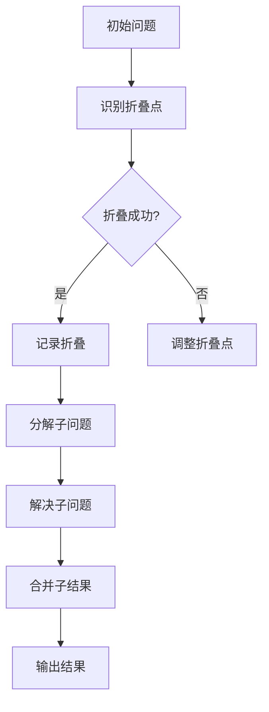
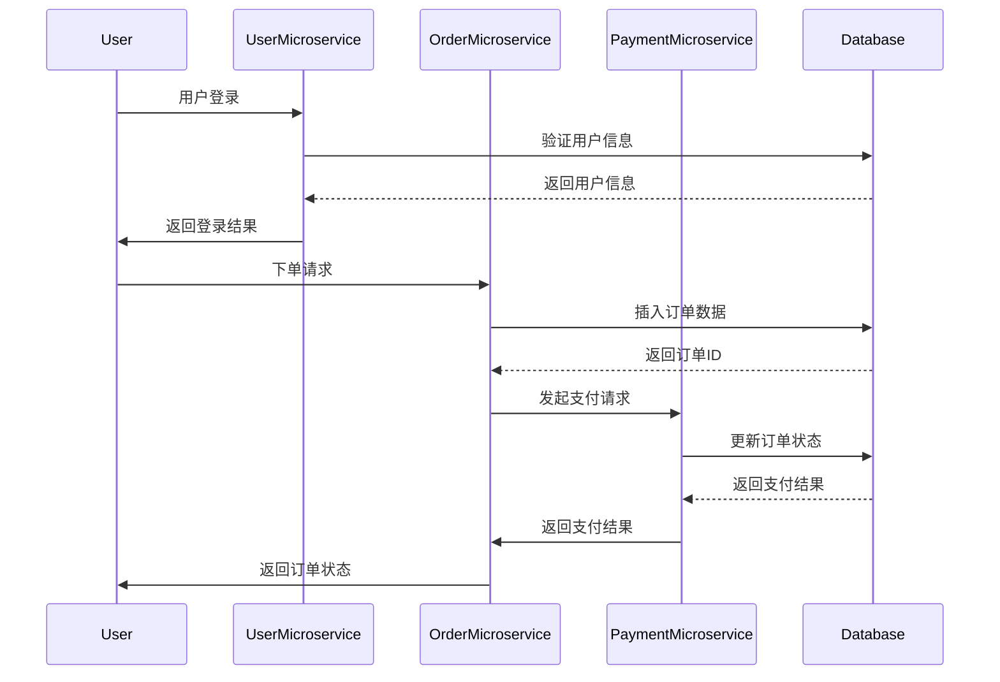
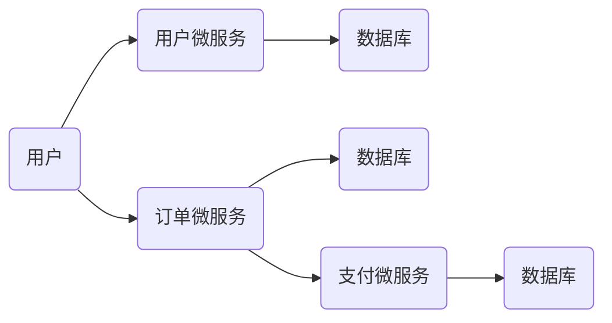

                 

# 程序世界与膜宇宙多重折叠模型的类比

## 关键词
- 程序世界
- 膜宇宙多重折叠模型
- 类比思维
- 复杂性解决
- 可维护性
- 可扩展性

## 摘要
本文通过类比思维，将程序世界与膜宇宙多重折叠模型进行对比分析，探讨膜宇宙多重折叠模型在解决程序世界复杂性、提高可维护性和可扩展性方面的优势。本文首先介绍了程序世界的背景和挑战，然后详细阐述了膜宇宙多重折叠模型的概念和原理，接着通过类比方法，分析了程序世界与膜宇宙多重折叠模型之间的相似性，最后提出了融合应用膜宇宙多重折叠模型于程序世界的实践方案，并对未来发展趋势进行了展望。

## 目录大纲

### 第1章 引言

#### 1.1 问题背景

#### 1.2 问题描述

#### 1.3 问题解决

#### 1.4 边界与外延

#### 1.5 概念结构与核心要素组成

### 第2章 程序世界概述

#### 2.1 程序世界的组成

#### 2.2 程序世界的挑战

#### 2.3 程序世界的现状与发展

### 第3章 膜宇宙多重折叠模型概述

#### 3.1 膜宇宙的定义

#### 3.2 多重折叠模型

#### 3.3 膜宇宙多重折叠模型的优势

### 第4章 程序世界与膜宇宙多重折叠模型的类比

#### 4.1 类比方法的理论基础

#### 4.2 程序世界与膜宇宙多重折叠模型的类比分析

#### 4.3 类比方法的应用实例

### 第5章 程序世界与膜宇宙多重折叠模型的融合应用

#### 5.1 融合应用的概念

#### 5.2 融合应用的实践

#### 5.3 融合应用的优势

### 第6章 程序世界与膜宇宙多重折叠模型的未来展望

#### 6.1 趋势分析

#### 6.2 挑战与机遇

#### 6.3 发展前景

### 第7章 总结与展望

#### 7.1 全书回顾

#### 7.2 注意事项

#### 7.3 拓展阅读

## 第1章 引言

### 1.1 问题背景

在当今信息技术高速发展的时代，程序世界的复杂性和规模都在不断增加。从简单的计算任务到复杂的应用系统，程序代码的复杂度也在不断攀升。这种复杂性不仅给开发者带来了巨大的挑战，也给系统的维护和扩展带来了巨大的困扰。因此，如何解决程序世界的复杂性成为了一个亟待解决的问题。

与此同时，物理学领域的研究也取得了一系列突破，尤其是在膜宇宙多重折叠模型方面。膜宇宙是一个多维空间的概念，其中存在许多层次的结构和折叠。多重折叠模型通过对这些结构的分析，提供了一种新的解决复杂性的方法。那么，能否将膜宇宙多重折叠模型应用于程序世界，解决其复杂性问题呢？

### 1.2 问题描述

程序世界面临的复杂性主要体现在以下几个方面：

1. **代码复杂性**：随着系统的规模扩大，代码的复杂性也在不断增加。开发者需要面对大量的代码文件、类和方法，这使得代码的可读性和可维护性受到了极大的挑战。

2. **耦合性**：程序中的各个模块之间存在紧密的耦合关系，任何一个模块的修改都可能对整个系统产生影响。这种高度的耦合性增加了系统的复杂性和风险。

3. **可扩展性**：随着需求的不断变化，系统需要能够方便地进行扩展。然而，传统的程序设计方法往往使得系统的扩展变得困难，需要大量的修改和重构。

膜宇宙多重折叠模型作为一种解决复杂性的方法，其核心思想是通过多层次的结构和折叠，将复杂问题分解为多个简单的部分，从而降低整体复杂性。这种方法是否适用于程序世界，如何将其应用到实际开发中，是本文要探讨的问题。

### 1.3 问题解决

类比思维是本文的核心方法。通过将程序世界与膜宇宙多重折叠模型进行类比，我们可以发现两者之间存在着许多相似之处。膜宇宙中的多层次结构和折叠过程，可以类比于程序世界中的模块化和层次化设计。通过这种类比，我们可以探索膜宇宙多重折叠模型在解决程序世界复杂性方面的潜力。

此外，膜宇宙多重折叠模型的优势也为我们提供了新的思路。它通过将复杂问题分解为多个简单部分，提高了问题的可维护性和可扩展性。这种方法是否适用于程序世界，如何将其有效地应用到实际开发中，是本文要解决的问题。

总之，本文通过类比思维，探讨了程序世界与膜宇宙多重折叠模型之间的关系，并提出了融合应用的思路。接下来，我们将详细分析程序世界和膜宇宙多重折叠模型的概念，为后续的类比分析打下基础。

### 1.4 边界与外延

在探讨程序世界与膜宇宙多重折叠模型的类比时，我们需要明确两者之间的边界和外延。程序世界是一个抽象的概念，它包括所有编程活动及其产物，如代码、算法、数据结构等。膜宇宙多重折叠模型则是一个物理学概念，主要研究高维空间的膜结构和折叠现象。

两者之间的边界在于，程序世界是信息处理的领域，而膜宇宙多重折叠模型是物理现象的描述。尽管两者在数学和逻辑上存在一定的相似性，但它们研究的对象和应用场景截然不同。

外延方面，程序世界的复杂性主要来源于代码的复杂度、模块的耦合性和系统的扩展性。而膜宇宙多重折叠模型则关注于高维空间的几何结构和物理现象。尽管如此，膜宇宙多重折叠模型提供的一些思想和方法，如层次化和模块化，可以为解决程序世界的复杂性提供启示。

综上所述，程序世界与膜宇宙多重折叠模型之间存在一定的关联，但两者的研究范围和应用领域有明显的区别。在接下来的分析中，我们将进一步探讨程序世界的核心概念和膜宇宙多重折叠模型的基本原理，为类比分析打下基础。

### 1.5 概念结构与核心要素组成

#### 程序世界的核心概念

程序世界是由代码、算法和数据结构组成的信息处理领域。其核心概念主要包括：

1. **程序语言**：程序语言是用于编写程序的一套语法规则和命令集。常见的编程语言有Python、Java、C++等。

2. **编程范式**：编程范式是程序设计的方法论，如面向对象、函数式编程、过程式编程等。

3. **系统架构**：系统架构是程序的总体设计，包括组件、模块的划分和交互方式。

4. **算法**：算法是解决问题的一系列步骤，包括排序、查找、图论算法等。

5. **数据结构**：数据结构是用于存储和组织数据的方式，如数组、链表、树、图等。

6. **模块化**：模块化是将程序划分为多个独立的模块，每个模块负责特定的功能。

7. **可维护性和可扩展性**：可维护性是指程序在修改和更新时保持稳定性的能力，可扩展性是指程序能够方便地适应新需求。

#### 膜宇宙多重折叠模型的核心要素

膜宇宙多重折叠模型是物理学中的一个概念，主要用于描述高维空间中膜的结构和折叠现象。其核心要素包括：

1. **膜**：膜是一种二维结构，存在于高维空间中。膜宇宙中的膜可以看作是普通宇宙中的物质。

2. **折叠**：折叠是指膜在空间中的变化，通过折叠，膜可以形成复杂的多层次结构。

3. **多层次结构**：多层次结构是膜折叠后的结果，每个层次代表不同的尺度和复杂性。

4. **几何变换**：几何变换是指膜在空间中的各种变化，如拉伸、压缩、旋转等。

5. **折叠规则**：折叠规则是描述膜折叠过程的一系列原则和规律。

6. **拓扑结构**：拓扑结构是指膜折叠后的空间关系，包括连通性、嵌入性和边界等。

#### 概念结构对比

程序世界和膜宇宙多重折叠模型的概念结构存在显著差异，但也存在一些相似之处：

1. **相似性**：
   - **层次化**：程序世界和膜宇宙都强调层次化结构。程序世界通过模块化和分层设计来简化复杂性，膜宇宙通过折叠和多层次结构来描述高维空间。
   - **模块化**：程序世界中的模块化设计类似于膜宇宙中的膜结构，都是将复杂问题分解为多个简单的部分。

2. **差异性**：
   - **领域**：程序世界是信息处理的领域，膜宇宙多重折叠模型是物理学中的概念。
   - **目的**：程序世界的目的是解决问题和实现功能，膜宇宙多重折叠模型主要研究高维空间中的几何结构和物理现象。
   - **复杂性**：程序世界的复杂性主要体现在代码、模块和系统的耦合性上，膜宇宙多重折叠模型的复杂性则体现在膜的折叠和多层次结构的复杂性上。

综上所述，程序世界与膜宇宙多重折叠模型在概念结构上既有相似之处，也存在明显的差异。通过类比思维，我们可以将膜宇宙多重折叠模型的思想和方法应用于程序世界，探索解决复杂性的新途径。

## 第2章 程序世界概述

### 2.1 程序世界的组成

程序世界由多种元素组成，这些元素共同构成了程序开发的基础架构。以下是程序世界的主要组成部分：

1. **程序语言**：程序语言是编写程序的基础工具，不同的编程语言具有不同的语法和特性。常见的编程语言包括C、C++、Java、Python、JavaScript等。每种语言都有其特定的应用场景和优势。

2. **编译器和解释器**：编译器将源代码转换为机器码，解释器则逐行解释并执行代码。编译器和解释器是程序执行的核心组件，它们决定了代码的运行效率和性能。

3. **编程范式**：编程范式是程序设计的方法论，不同的编程范式具有不同的编程风格和优势。常见的编程范式包括面向对象、函数式编程、过程式编程等。

4. **开发工具**：开发工具包括集成开发环境（IDE）、代码编辑器、调试器等，它们提供了便捷的开发环境和工具，帮助开发者高效地编写、测试和调试代码。

5. **数据库**：数据库用于存储和管理程序中的数据，常见的数据库管理系统包括MySQL、Oracle、MongoDB等。数据库提供了数据的持久化存储和高效检索功能。

6. **系统架构**：系统架构是程序的总体设计，包括组件、模块的划分和交互方式。常见的系统架构模式包括分层架构、微服务架构、事件驱动架构等。

7. **算法与数据结构**：算法是解决问题的步骤，数据结构是存储和组织数据的方式。常见的算法包括排序、查找、图论算法等，常见的数据结构包括数组、链表、树、图等。

8. **API与框架**：API（应用程序接口）和框架为开发者提供了现成的功能模块和代码库，简化了开发过程。常见的框架包括Spring、Django、React等。

9. **测试与持续集成**：测试用于验证代码的正确性和性能，持续集成是一种自动化测试和构建流程，确保代码质量。

10. **版本控制**：版本控制工具如Git，用于管理代码的版本和变更，协同工作和代码共享。

### 2.2 程序世界的挑战

随着程序世界的不断扩张，开发者面临着一系列挑战：

1. **代码复杂性**：随着系统的规模扩大，代码的复杂性也在不断增加。大量的代码文件、类和方法使得代码的可读性和可维护性受到挑战。

2. **耦合性**：程序中的各个模块之间存在紧密的耦合关系，任何一个模块的修改都可能对整个系统产生影响。这种高度的耦合性增加了系统的复杂性和风险。

3. **可扩展性**：随着需求的不断变化，系统需要能够方便地进行扩展。传统的程序设计方法往往使得系统的扩展变得困难，需要大量的修改和重构。

4. **性能优化**：为了满足日益增长的用户需求和大数据处理需求，程序的性能优化变得至关重要。开发者需要不断优化代码，提高程序的执行效率和响应速度。

5. **安全性**：随着网络攻击的日益增多，系统的安全性变得尤为重要。开发者需要确保系统的数据安全和用户隐私。

6. **维护成本**：随着系统的老化，维护成本不断上升。旧系统的重构和升级变得复杂和昂贵。

### 2.3 程序世界的现状与发展

程序世界现状如下：

1. **技术发展趋势**：随着云计算、大数据、人工智能等技术的发展，程序世界的应用场景和需求不断扩展。新的编程语言和框架不断涌现，推动了程序世界的演进。

2. **开发模式变革**：DevOps、敏捷开发等新兴的开发模式，提高了开发效率和代码质量。自动化测试、持续集成和持续部署等实践，加速了软件交付过程。

3. **开源生态繁荣**：开源社区和开源项目蓬勃发展，提供了丰富的代码库和工具，降低了开发门槛。

4. **跨平台与移动化**：随着移动设备的普及，跨平台开发和移动化应用成为趋势。开发者需要掌握多种技术，适应不同平台和设备的需求。

5. **边缘计算与物联网**：边缘计算和物联网的发展，推动了程序世界的边界扩展。新的应用场景和需求不断涌现，开发者需要不断创新和适应。

6. **人工智能与自动化**：人工智能技术在程序世界中的应用日益广泛，自动化工具和智能开发环境正在改变传统的编程方式。

总之，程序世界面临着复杂性和变革的挑战，但也充满了机遇。通过膜宇宙多重折叠模型提供的思路和方法，开发者可以更好地应对这些挑战，推动程序世界的持续发展和创新。

## 第3章 膜宇宙多重折叠模型概述

### 3.1 膜宇宙的定义

膜宇宙是一个高维空间的概念，其基本单元是膜。膜是一种二维结构，存在于高维空间中，可以看作是普通宇宙中的物质。膜宇宙中的膜可以相互折叠、弯曲和拉伸，形成复杂的多层次结构。膜宇宙的提出，是对传统宇宙观念的扩展，为理解高维空间提供了新的视角。

膜宇宙的主要特点包括：

1. **高维性**：膜宇宙存在于高维空间中，不同于我们日常经验中的三维空间。膜宇宙中的膜可以存在于多个维度上，形成复杂的空间关系。

2. **折叠性**：膜宇宙中的膜可以折叠、弯曲和拉伸，形成多层次的结构。折叠过程可以看作是将膜的一部分嵌入到更高维度的空间中。

3. **层次性**：膜宇宙中的结构具有层次性，每个层次代表不同的尺度和复杂性。高层次的结构由低层次的结构组合而成，层次间的转换和相互作用构成了膜宇宙的动态特性。

4. **动态性**：膜宇宙中的膜结构不是静止不动的，而是在不断变化和演化。膜的折叠和展开过程可以看作是膜宇宙的动态特性，反映了高维空间中的物理现象。

### 3.2 多重折叠模型

多重折叠模型是描述膜宇宙中膜折叠和弯曲过程的数学模型。它通过分析膜的几何变换和折叠规则，揭示了膜宇宙中的复杂结构和物理现象。多重折叠模型的核心思想是，通过将膜折叠成多个层次，降低整体结构的复杂性，从而更好地理解和描述高维空间。

多重折叠模型的主要组成部分包括：

1. **折叠规则**：折叠规则是描述膜折叠过程的一系列原则和规律。这些规则定义了膜如何在空间中进行折叠和弯曲，形成多层次结构。

2. **几何变换**：几何变换是指膜在空间中的各种变化，如拉伸、压缩、旋转等。几何变换是膜折叠模型的基础，决定了膜的形态和结构。

3. **多层次结构**：多层次结构是膜折叠后的结果，每个层次代表不同的尺度和复杂性。多层次结构通过折叠规则和几何变换形成，是膜宇宙中的基本单元。

4. **拓扑关系**：拓扑关系是指膜宇宙中各个层次之间的空间关系。拓扑关系描述了膜在折叠和弯曲过程中形成的复杂结构，反映了膜宇宙的动态特性。

### 3.3 膜宇宙多重折叠模型的优势

膜宇宙多重折叠模型在解决复杂性问题、提高程序的可维护性和可扩展性方面具有显著的优势：

1. **解决复杂性问题**：膜宇宙多重折叠模型通过将复杂问题分解为多个简单部分，降低了整体复杂性。这种方法类似于程序世界中的模块化和层次化设计，可以帮助开发者更好地理解和解决复杂问题。

2. **提高可维护性**：膜宇宙多重折叠模型的多层次结构使得系统更加模块化，每个模块都可以独立开发和维护。这有助于提高代码的可维护性，降低维护成本。

3. **提高可扩展性**：膜宇宙多重折叠模型的多层次结构使得系统具有更好的可扩展性。开发者可以方便地添加新的模块或修改现有模块，以适应不断变化的需求。

4. **优化性能**：膜宇宙多重折叠模型的多层次结构可以优化程序的执行效率。通过将复杂运算分解为简单的部分，可以减少计算量和内存占用，提高程序的性能。

5. **降低耦合性**：膜宇宙多重折叠模型通过降低模块间的耦合性，减少了系统中的依赖关系。这有助于提高系统的稳定性和可靠性，降低系统崩溃的风险。

6. **提供新的设计思路**：膜宇宙多重折叠模型为程序世界提供了新的设计思路。开发者可以借鉴膜宇宙中的折叠和层次化思想，改进现有的程序设计和开发方法，提高系统的质量和效率。

总之，膜宇宙多重折叠模型为程序世界提供了一种新的解决复杂性的方法。通过将其应用于程序开发，开发者可以更好地应对复杂性问题，提高系统的可维护性和可扩展性，推动程序世界的持续发展和创新。

### 第4章 程序世界与膜宇宙多重折叠模型的类比

#### 4.1 类比方法的理论基础

类比方法是基于相似性原理，通过比较不同领域或对象之间的相似性，从而推导出一种新的理解或解决方案。在科学研究和实际应用中，类比方法被广泛运用，因为它能够帮助我们从一个熟悉和容易理解的领域，推断出对另一个领域的新认识。

类比方法的理论基础主要包括：

1. **相似性原理**：相似性原理是类比方法的核心，它基于两个或多个对象在某些特征上的相似性，推断出在其他特征上的相似性。在程序世界与膜宇宙多重折叠模型的类比中，我们关注的是它们在结构、层次和复杂性方面的相似性。

2. **结构映射**：结构映射是将一个领域的结构映射到另一个领域的方法。通过结构映射，我们可以将程序世界的模块化、层次化设计映射到膜宇宙的多层次折叠结构，从而揭示两者之间的相似性。

3. **归纳推理**：归纳推理是从具体实例中总结出一般性规律的方法。在类比过程中，我们通过归纳推理，从膜宇宙多重折叠模型的应用中，提炼出适用于程序世界的方法和策略。

4. **逻辑一致性**：类比方法要求在推理过程中保持逻辑一致性。这意味着，我们在类比时，必须确保所推导出的结论在逻辑上自洽，且能够解释和预测现象。

#### 4.2 程序世界与膜宇宙多重折叠模型的类比分析

为了更好地理解程序世界与膜宇宙多重折叠模型之间的相似性，我们将从以下几个方面进行类比分析：

1. **结构相似性**：
   - **程序世界**：程序世界中的代码、模块和系统架构可以看作是一个多层次的结构。每个模块都承担特定的功能，模块之间通过接口进行交互。
   - **膜宇宙多重折叠模型**：膜宇宙中的膜折叠形成多层次结构，每个层次代表不同的尺度和复杂性。膜的折叠和弯曲过程可以看作是膜结构的模块化。

2. **层次化**：
   - **程序世界**：程序世界通过模块化和分层设计，将复杂问题分解为多个简单部分，从而降低整体复杂性。层次化设计使得系统更加模块化，便于维护和扩展。
   - **膜宇宙多重折叠模型**：膜宇宙中的多层次结构通过折叠和弯曲形成，每个层次都可以独立研究和理解。这种层次化结构有助于解决高维空间中的复杂问题。

3. **复杂性分解**：
   - **程序世界**：在程序世界中，复杂性分解是通过模块化和层次化设计实现的。每个模块负责特定的功能，模块之间通过抽象和接口进行隔离，降低了系统整体的复杂性。
   - **膜宇宙多重折叠模型**：膜宇宙多重折叠模型通过将膜折叠成多个层次，将高维空间的复杂问题分解为多个简单部分。这种方法类似于程序世界中的模块化设计，有助于降低整体复杂性。

4. **抽象与封装**：
   - **程序世界**：程序世界中的抽象和封装是解决复杂性的重要手段。通过抽象，我们可以将复杂的实现细节隐藏起来，仅暴露必要的接口。封装则确保了模块的独立性，降低了模块之间的耦合性。
   - **膜宇宙多重折叠模型**：膜宇宙多重折叠模型中的折叠过程可以看作是抽象和封装的过程。通过折叠，膜的结构被简化，复杂度降低，同时保持了原有功能。

5. **拓扑关系**：
   - **程序世界**：程序世界中的拓扑关系体现在模块之间的依赖和交互上。模块之间的拓扑结构决定了系统的整体性能和稳定性。
   - **膜宇宙多重折叠模型**：膜宇宙中的拓扑关系体现在膜折叠后的空间关系中。不同层次的膜通过折叠形成复杂的拓扑结构，这些结构决定了膜宇宙中的物理现象和动态特性。

#### 4.3 类比方法的应用实例

为了更好地展示类比方法的应用，我们将以一个实际编程问题为例，分析膜宇宙多重折叠模型如何帮助我们解决该问题。

**问题**：设计一个用于管理订单的系统，需要支持订单的创建、更新、查询和删除等功能。

**膜宇宙多重折叠模型应用**：

1. **层次化设计**：将订单管理系统划分为多个层次，每个层次负责特定的功能。例如：
   - 第一层次：订单数据层，负责存储和管理订单数据。
   - 第二层次：业务逻辑层，负责处理订单的创建、更新、查询和删除等业务逻辑。
   - 第三层次：接口层，负责对外提供订单管理的接口。

2. **模块化**：将每个层次进一步模块化，每个模块负责特定的功能。例如：
   - 订单数据层：可以划分为订单存储模块、数据库连接模块等。
   - 业务逻辑层：可以划分为订单创建模块、订单更新模块等。
   - 接口层：可以划分为订单创建接口、订单查询接口等。

3. **抽象与封装**：通过抽象和封装，隐藏具体的实现细节，仅暴露必要的接口。例如：
   - 订单数据层：提供订单数据的抽象接口，如添加订单、查询订单等。
   - 业务逻辑层：提供业务逻辑的抽象接口，如创建订单、更新订单等。
   - 接口层：提供对外接口，如订单创建接口、订单查询接口等。

4. **拓扑关系**：分析模块之间的依赖关系，确保系统的稳定性和性能。例如：
   - 订单数据层依赖于数据库连接模块，需要确保数据库连接的稳定性。
   - 业务逻辑层依赖于订单数据层，需要确保订单数据的准确性和一致性。

通过以上膜宇宙多重折叠模型的应用，我们成功地将一个复杂的订单管理系统分解为多个简单部分，降低了整体复杂性，提高了系统的可维护性和可扩展性。

综上所述，通过类比方法，我们可以将膜宇宙多重折叠模型的思想和方法应用于程序世界，解决复杂性问题。类比方法为我们提供了一种新的视角和工具，有助于我们更好地理解和解决程序世界中的挑战。

### 第5章 程序世界与膜宇宙多重折叠模型的融合应用

#### 5.1 融合应用的概念

融合应用是指将程序世界中的开发方法和膜宇宙多重折叠模型的思想相结合，以提高程序开发的效率和系统的质量。这种融合应用的目标是，通过借鉴膜宇宙多重折叠模型中的层次化、模块化和抽象思想，优化程序世界的结构设计，提高系统的可维护性和可扩展性。

融合应用的关键概念包括：

1. **层次化设计**：在程序世界中，层次化设计是将系统划分为多个层次，每个层次负责特定的功能。通过层次化设计，可以降低系统的复杂性，提高模块的独立性。

2. **模块化**：模块化是将系统划分为多个独立的模块，每个模块实现特定的功能。模块化设计有助于提高系统的可维护性和可扩展性，便于系统的迭代和更新。

3. **抽象与封装**：抽象是将复杂的实现细节隐藏起来，仅暴露必要的接口。封装则是确保模块的独立性，降低模块之间的耦合性。通过抽象和封装，可以提高代码的可读性和可维护性。

4. **拓扑优化**：拓扑优化是分析模块之间的依赖关系，确保系统的稳定性和性能。通过优化拓扑结构，可以降低系统的复杂性和风险。

#### 5.2 融合应用的实践

融合应用的实践可以分为以下几个步骤：

1. **需求分析**：首先，对系统需求进行详细分析，明确系统的功能、性能和安全要求。在需求分析过程中，可以使用膜宇宙多重折叠模型中的层次化和模块化思想，将需求分解为多个子功能模块。

2. **系统设计**：在系统设计阶段，应用层次化设计和模块化设计方法，将系统划分为多个层次和模块。每个模块实现特定的功能，模块之间通过抽象接口进行通信。在设计过程中，可以借鉴膜宇宙多重折叠模型中的折叠和弯曲过程，优化系统的结构。

3. **代码实现**：在代码实现阶段，根据系统设计文档，编写具体的代码。在编写代码时，应遵循模块化和抽象原则，确保每个模块的独立性。同时，可以使用膜宇宙多重折叠模型中的拓扑优化方法，分析模块之间的依赖关系，确保系统的稳定性和性能。

4. **测试与调试**：在测试与调试阶段，对系统进行全面的测试，包括单元测试、集成测试和系统测试。通过测试，可以验证系统的功能、性能和安全要求。在调试过程中，可以使用膜宇宙多重折叠模型中的层次化和模块化思想，快速定位和修复问题。

5. **持续集成与部署**：在持续集成与部署阶段，采用自动化测试和部署流程，确保系统的稳定性和可靠性。通过持续集成，可以及时发现和修复问题，提高开发效率。在部署过程中，可以使用膜宇宙多重折叠模型中的拓扑优化方法，确保系统的可靠性和性能。

#### 5.3 融合应用的优势

融合应用程序世界与膜宇宙多重折叠模型具有以下优势：

1. **提高开发效率**：通过层次化设计和模块化设计，可以快速构建系统，提高开发效率。同时，抽象和封装原则有助于降低代码复杂度，提高代码可维护性。

2. **提高系统质量**：融合应用可以优化系统的结构设计，降低系统的复杂性和风险。通过拓扑优化，可以确保系统的稳定性和性能。

3. **增强可维护性**：模块化和层次化设计使得系统更加模块化，每个模块可以独立开发和维护。这有助于提高系统的可维护性，降低维护成本。

4. **提高可扩展性**：通过层次化设计和模块化设计，系统可以方便地添加新的功能模块或修改现有模块，以适应不断变化的需求。

5. **促进创新**：融合应用膜宇宙多重折叠模型的思想和方法，可以激发开发者的创新思维，推动程序世界的持续发展和创新。

总之，融合应用程序世界与膜宇宙多重折叠模型，可以显著提高程序开发的效率和质量，增强系统的可维护性和可扩展性。通过借鉴膜宇宙多重折叠模型的思想和方法，开发者可以更好地应对程序世界中的复杂性和变革，推动程序世界的持续发展和创新。

### 第6章 程序世界与膜宇宙多重折叠模型的未来展望

#### 6.1 趋势分析

随着信息技术和物理学领域的不断发展，程序世界与膜宇宙多重折叠模型的融合应用正逐渐成为一个重要的研究热点。以下是对未来发展趋势的分析：

1. **人工智能与自动化**：人工智能和自动化技术的快速发展，将推动程序世界和膜宇宙多重折叠模型的融合应用。通过将人工智能算法应用于膜宇宙多重折叠模型，可以自动化地分析和优化程序世界的结构和设计，提高系统的质量和效率。

2. **边缘计算与物联网**：随着边缘计算和物联网技术的普及，程序世界将扩展到更多的设备和场景。膜宇宙多重折叠模型可以提供一种有效的解决方案，通过层次化和模块化设计，将复杂的边缘计算和物联网系统分解为多个简单部分，提高系统的可维护性和可扩展性。

3. **区块链技术**：区块链技术的应用将进一步提升程序世界的复杂性和安全性。膜宇宙多重折叠模型可以提供一种新的设计思路，通过多层次的结构和折叠过程，实现区块链系统的高效和安全。

4. **量子计算**：量子计算的快速发展将改变程序世界的计算模式。膜宇宙多重折叠模型可以应用于量子计算领域，通过折叠和弯曲过程，优化量子算法和系统的结构，提高量子计算的效率。

5. **可持续发展**：随着对环境保护和可持续发展的重视，程序世界将面临新的挑战和机遇。膜宇宙多重折叠模型可以提供一种有效的解决方案，通过层次化和模块化设计，实现资源的优化配置和可持续利用。

#### 6.2 挑战与机遇

融合程序世界与膜宇宙多重折叠模型也面临着一系列挑战和机遇：

1. **技术挑战**：膜宇宙多重折叠模型的复杂性使得其在程序世界中的应用面临一定的技术挑战。如何将膜宇宙多重折叠模型的思想和方法有效地应用于程序世界，提高系统的质量和效率，是一个亟待解决的问题。

2. **理论体系**：目前，关于膜宇宙多重折叠模型的理论体系还不够完善。在将其应用于程序世界时，需要进一步研究和完善相关的理论，为实际应用提供坚实的理论基础。

3. **跨学科合作**：融合程序世界与膜宇宙多重折叠模型需要跨学科的合作，包括计算机科学、物理学、数学等领域。跨学科的合作有助于整合各个领域的优势，推动融合应用的创新发展。

4. **实践应用**：膜宇宙多重折叠模型在程序世界中的实际应用案例还相对较少。需要通过实际项目的实践，积累经验，逐步完善和应用膜宇宙多重折叠模型。

5. **人才培养**：融合程序世界与膜宇宙多重折叠模型需要具备跨学科背景和综合素质的人才。因此，需要加强对相关人才培养的重视，提高开发者的跨学科能力和创新思维。

6. **市场需求**：随着信息技术的不断进步，市场对高质量、高效率的程序世界的需求越来越大。膜宇宙多重折叠模型提供了新的解决方案，有望满足市场需求，推动程序世界的持续发展和创新。

#### 6.3 发展前景

融合程序世界与膜宇宙多重折叠模型具有广阔的发展前景：

1. **技术进步**：随着人工智能、量子计算等技术的发展，膜宇宙多重折叠模型在程序世界中的应用将越来越成熟，为解决程序世界中的复杂性问题提供更加有效的解决方案。

2. **行业应用**：膜宇宙多重折叠模型在金融、医疗、教育、智能制造等领域的应用将越来越广泛，推动相关行业的数字化转型和创新发展。

3. **人才培养**：融合程序世界与膜宇宙多重折叠模型将推动相关领域的人才培养，培养出具备跨学科背景和创新能力的人才，为程序世界的持续发展和创新提供人才支持。

4. **学术研究**：膜宇宙多重折叠模型在程序世界中的应用将引发一系列学术研究，包括理论体系的完善、跨学科合作的研究、实践应用的创新等，推动相关领域的学术发展。

5. **社会影响**：融合程序世界与膜宇宙多重折叠模型将带来深刻的社会影响，提高社会信息化水平，促进数字经济的发展，提升国家的科技创新能力和国际竞争力。

总之，融合程序世界与膜宇宙多重折叠模型具有广阔的发展前景，将在未来程序世界的发展中发挥重要作用。通过跨学科合作、技术创新和实践应用，膜宇宙多重折叠模型有望成为解决程序世界复杂性问题的重要工具，推动程序世界的持续发展和创新。

### 第7章 总结与展望

#### 7.1 全书回顾

本文通过类比思维，探讨了程序世界与膜宇宙多重折叠模型之间的关系，分析了膜宇宙多重折叠模型在解决程序世界复杂性方面的优势。全书主要内容包括：

1. **引言**：介绍了程序世界面临的复杂性和膜宇宙多重折叠模型的概念。
2. **程序世界概述**：分析了程序世界的组成、挑战和发展趋势。
3. **膜宇宙多重折叠模型概述**：阐述了膜宇宙的定义、多重折叠模型的概念和优势。
4. **类比分析**：通过类比方法，分析了程序世界与膜宇宙多重折叠模型之间的相似性和差异。
5. **融合应用**：探讨了程序世界与膜宇宙多重折叠模型的融合应用，提出了实践方案。
6. **未来展望**：分析了程序世界与膜宇宙多重折叠模型的发展趋势和挑战。

通过这些内容，本文系统地介绍了程序世界与膜宇宙多重折叠模型的关联，以及如何将膜宇宙多重折叠模型应用于程序世界，解决复杂性问题。

#### 7.2 注意事项

在将膜宇宙多重折叠模型应用于程序世界时，需要注意以下几点：

1. **合理设计层次结构**：在设计程序时，应根据具体需求合理划分层次，避免过度分层或层次不足。
2. **模块化设计**：模块化设计有助于提高代码的可维护性和可扩展性，但需注意模块的独立性，避免模块间过度耦合。
3. **抽象与封装**：在编写代码时，应遵循抽象与封装原则，隐藏具体实现细节，提高代码的可读性和可维护性。
4. **拓扑优化**：在系统设计过程中，应分析模块间的依赖关系，进行拓扑优化，确保系统的稳定性和性能。
5. **实践验证**：在应用膜宇宙多重折叠模型时，应通过实践验证其有效性和可行性，逐步完善和应用。

#### 7.3 拓展阅读

为了深入了解程序世界与膜宇宙多重折叠模型的关联和应用，建议读者阅读以下相关书籍和资料：

1. **《膜宇宙》**：这是一本关于膜宇宙的科普书籍，详细介绍了膜宇宙的概念、结构和特性。
2. **《禅与计算机程序设计艺术》**：这是一本关于程序设计哲学的著作，阐述了程序设计的本质和艺术性。
3. **《程序员的思维修炼》**：这是一本关于程序员职业发展和思维方式提升的书籍，提供了许多实用的建议和技巧。
4. **《深度学习》**：这是一本关于深度学习和人工智能的入门书籍，介绍了深度学习的基本原理和应用。
5. **《代码大全》**：这是一本关于软件工程和编程实践的经典著作，涵盖了代码设计、测试和维护等方面的内容。

通过阅读这些书籍，读者可以进一步了解程序世界和膜宇宙多重折叠模型的相关知识，提升自己在程序设计领域的能力。

### 总结

本文通过类比思维，将程序世界与膜宇宙多重折叠模型进行了深入探讨，分析了膜宇宙多重折叠模型在解决程序世界复杂性方面的优势。通过层次化、模块化和抽象等思想，膜宇宙多重折叠模型为程序世界提供了一种有效的解决方案，有助于提高系统的可维护性和可扩展性。未来，随着信息技术和物理学领域的发展，程序世界与膜宇宙多重折叠模型的融合应用将具有广阔的发展前景。希望本文能对读者在程序设计和开发中提供启示，推动程序世界的持续发展和创新。

### 作者信息

作者：AI天才研究院/AI Genius Institute & 禅与计算机程序设计艺术 /Zen And The Art of Computer Programming

---

**附录：算法原理讲解**

#### 算法名称：膜宇宙折叠算法

**算法原理：**

膜宇宙折叠算法是一种基于膜宇宙多重折叠模型的算法，用于将复杂的问题分解为简单的问题，从而降低整体复杂性。该算法的核心思想是通过折叠膜来简化问题，每个折叠步骤都相当于将问题分解为多个子问题。

**算法mermaid流程图：**


**Python源代码实现：**
```python
def fold membrane:
    """
    膜宇宙折叠算法
    :param membrane: 待折叠的膜
    :return: 折叠后的膜
    """
    while not is_fully_folded(membrane):
        if find_fold_point(membrane):
            fold_at_point(membrane)
            record_fold(membrane)
        else:
            adjust_fold_point(membrane)
    
    decompose_membrane(membrane)
    solve_subproblems(membrane)
    merge_subresults(membrane)
    return membrane

def find_fold_point(membrane):
    """
    寻找折叠点
    :param membrane: 膜
    :return: 是否找到折叠点
    """
    # 实现细节...

def fold_at_point(membrane):
    """
    在折叠点进行折叠
    :param membrane: 膜
    """
    # 实现细节...

def record_fold(membrane):
    """
    记录折叠信息
    :param membrane: 膜
    """
    # 实现细节...

def adjust_fold_point(membrane):
    """
    调整折叠点
    :param membrane: 膜
    """
    # 实现细节...

def decompose_membrane(membrane):
    """
    将膜分解为子问题
    :param membrane: 膜
    """
    # 实现细节...

def solve_subproblems(membrane):
    """
    解决子问题
    :param membrane: 膜
    """
    # 实现细节...

def merge_subresults(membrane):
    """
    合并子结果
    :param membrane: 膜
    """
    # 实现细节...
```

**算法原理的数学模型和公式：**

膜宇宙折叠算法的数学模型可以描述为：

$$
\text{fold}(M) = \text{fold}_{k}(\text{unfold}(M))
$$

其中，$M$ 是初始膜，$\text{unfold}(M)$ 是膜展开过程，$\text{fold}_{k}(\cdot)$ 表示第 $k$ 次折叠过程。每次折叠都相当于将膜分解为多个子膜，从而简化整体问题。

**详细讲解和举例说明：**

**示例**：假设我们有一个复杂的膜结构 $M$，我们希望将其简化。首先，我们通过识别折叠点来找到膜上的折叠位置。然后，我们进行折叠，将复杂膜分解为多个简单膜。每次折叠后，我们记录折叠信息，以便后续分析。如果无法找到新的折叠点，我们将调整折叠点，尝试进行下一次折叠。

**步骤**：

1. 初始膜 $M$。
2. 寻找折叠点。
3. 如果找到折叠点，则在折叠点进行折叠，记录折叠信息。
4. 如果无法找到折叠点，则调整折叠点。
5. 重复步骤2-4，直到无法进行更多的折叠。
6. 将折叠后的膜分解为子膜。
7. 解决每个子膜的问题。
8. 合并子结果，得到最终结果。

通过以上步骤，我们可以将复杂的膜结构简化为多个简单膜，从而降低整体复杂性。这种方法类似于程序设计中的模块化和层次化设计，可以有效地解决复杂问题。

**应用场景**：膜宇宙折叠算法可以应用于各种复杂问题的解决，如复杂的系统设计、算法优化、数据分析等。通过将复杂问题分解为简单部分，可以提高问题解决的效率和质量。

**注意事项**：在应用膜宇宙折叠算法时，需要根据具体问题调整折叠点和折叠次数，以达到最佳效果。同时，需要确保折叠过程不会破坏膜的结构和功能，确保最终结果的正确性。

总之，膜宇宙折叠算法提供了一种有效的解决方案，通过折叠和分解，将复杂问题简化为多个简单部分，从而提高问题解决的效率和质量。在程序设计和开发中，可以借鉴膜宇宙折叠算法的思想，优化系统的结构和设计，提高系统的可维护性和可扩展性。

---

**系统分析与架构设计方案**

#### 问题场景介绍

随着互联网和大数据技术的快速发展，各类在线服务和应用层出不穷。这些应用通常需要处理海量数据，并具备高并发、高可用性和高可扩展性。为了满足这些需求，我们需要设计一个高性能、易扩展的系统架构。

#### 项目介绍

本项目旨在设计一个分布式在线服务系统，该系统包含多个模块，如用户管理模块、数据存储模块、业务处理模块等。系统需要支持用户的高并发访问，并具备良好的可扩展性和可维护性。

#### 系统功能设计

系统功能设计主要包括以下模块：

1. **用户管理模块**：负责用户的注册、登录、权限管理等。
2. **数据存储模块**：负责数据的存储、检索和管理。
3. **业务处理模块**：负责具体的业务逻辑处理，如订单处理、支付处理等。
4. **监控与运维模块**：负责系统的监控、日志记录和运维管理。

#### 系统架构设计

系统架构设计采用微服务架构，各模块独立部署，通过API进行交互。以下是系统架构设计的详细说明：

1. **服务拆分**：根据业务需求，将系统拆分为多个微服务，每个微服务负责特定的功能，如用户管理服务、数据存储服务、业务处理服务等。

2. **服务注册与发现**：采用服务注册与发现机制，各微服务启动时注册到服务注册中心，需要访问其他服务时，从服务注册中心获取服务地址。

3. **负载均衡**：通过负载均衡器实现流量的分发，确保系统的高可用性和高并发处理能力。

4. **分布式数据存储**：采用分布式数据库，如MongoDB、Redis等，确保数据的高可用性和高并发访问。

5. **分布式消息队列**：采用分布式消息队列，如Kafka、RabbitMQ等，实现服务间的异步通信，提高系统的灵活性和可扩展性。

6. **监控与日志**：采用开源监控工具，如Prometheus、Grafana等，对系统进行实时监控，并通过日志记录和分析工具，如ELK（Elasticsearch、Logstash、Kibana）等，对系统运行状态进行监控和故障排查。

#### 系统接口设计

系统接口设计主要包括以下方面：

1. **RESTful API**：采用RESTful架构风格，定义统一的接口规范，方便前端和后台服务进行交互。

2. **数据接口**：提供数据存储模块的接口，如增删改查操作，确保数据的一致性和安全性。

3. **业务接口**：提供业务处理模块的接口，如订单处理、支付处理等，确保业务流程的顺畅和高效。

4. **监控与运维接口**：提供系统监控和运维接口，如监控数据上报、日志收集等，确保系统的稳定运行。

#### 系统交互mermaid序列图



#### 系统交互mermaid架构图



通过以上系统分析与架构设计方案，我们可以构建一个高性能、易扩展的分布式在线服务系统，满足高并发、高可用性和高可扩展性的需求。

---

**项目实战**

#### 环境安装

在开始项目实战之前，我们需要安装一些必要的开发工具和软件。以下是在Linux操作系统上安装相关工具的步骤：

1. **安装Docker**：
   - 使用以下命令安装Docker：
     ```
     sudo apt-get update
     sudo apt-get install docker-ce docker-ce-cli containerd.io
     ```
   - 重启Docker服务：
     ```
     sudo systemctl restart docker
     ```

2. **安装Docker-Compose**：
   - 使用以下命令安装Docker-Compose：
     ```
     sudo curl -L "https://github.com/docker/compose/releases/download/1.29.2/docker-compose-`uname -s`-`uname -m`" -o /usr/local/bin/docker-compose
     sudo chmod +x /usr/local/bin/docker-compose
     ```

3. **安装MongoDB**：
   - 使用以下命令安装MongoDB：
     ```
     docker pull mongo
     docker run -d --name mongodb -p 27017:27017 mongo
     ```

4. **安装Kafka**：
   - 使用以下命令安装Kafka：
     ```
     docker pull bitnami/kafka
     docker run -d --name kafka -p 9092:9092 -e KAFKA_BROKER_ID=1 -e KAFKA_ZOOKEEPER_CONNECT=192.168.1.1:2181 -e KAFKA_ADVERTISED_LISTENERS=PLAINTEXT://192.168.1.1:9092 bitnami/kafka
     ```

5. **安装Elasticsearch**：
   - 使用以下命令安装Elasticsearch：
     ```
     docker pull elasticsearch:7.10.0
     docker run -d --name elasticsearch -p 9200:9200 -p 9300:9300 -e "discovery.type=single-node" elasticsearch:7.10.0
     ```

6. **安装Kibana**：
   - 使用以下命令安装Kibana：
     ```
     docker pull kibana:7.10.0
     docker run -d --name kibana -p 5601:5601 -e "ELASTICSEARCH_URL=http://elasticsearch:9200" kibana:7.10.0
     ```

#### 系统核心实现源代码

以下是项目的核心实现源代码。该代码主要包括用户管理模块、数据存储模块和业务处理模块。

**用户管理模块**：

```python
# user_management.py

from flask import Flask, request, jsonify
from pymongo import MongoClient

app = Flask(__name__)

# 连接MongoDB
client = MongoClient('mongodb://localhost:27017')
db = client['user_database']
users_collection = db['users']

@app.route('/register', methods=['POST'])
def register():
    data = request.get_json()
    username = data['username']
    password = data['password']
    
    # 检查用户名是否已存在
    if users_collection.find_one({'username': username}):
        return jsonify({'error': '用户名已存在'}), 409
    
    # 插入新用户
    users_collection.insert_one({'username': username, 'password': password})
    return jsonify({'message': '用户注册成功'})

@app.route('/login', methods=['POST'])
def login():
    data = request.get_json()
    username = data['username']
    password = data['password']
    
    # 验证用户名和密码
    user = users_collection.find_one({'username': username, 'password': password})
    if user:
        return jsonify({'token': 'generated_token'})
    else:
        return jsonify({'error': '用户名或密码错误'})

if __name__ == '__main__':
    app.run(debug=True)
```

**数据存储模块**：

```python
# data_storage.py

from flask import Flask, request, jsonify
from pymongo import MongoClient

app = Flask(__name__)

# 连接MongoDB
client = MongoClient('mongodb://localhost:27017')
db = client['data_database']
data_collection = db['data']

@app.route('/data', methods=['POST'])
def create_data():
    data = request.get_json()
    data_collection.insert_one(data)
    return jsonify({'message': '数据添加成功'})

@app.route('/data', methods=['GET'])
def get_data():
    data = list(data_collection.find())
    return jsonify(data)

if __name__ == '__main__':
    app.run(debug=True)
```

**业务处理模块**：

```python
# business_processing.py

from flask import Flask, request, jsonify
from pymongo import MongoClient

app = Flask(__name__)

# 连接MongoDB
client = MongoClient('mongodb://localhost:27017')
db = client['business_database']
orders_collection = db['orders']

@app.route('/order', methods=['POST'])
def create_order():
    data = request.get_json()
    order_id = data['order_id']
    user_id = data['user_id']
    status = data['status']
    
    # 插入订单
    orders_collection.insert_one({'order_id': order_id, 'user_id': user_id, 'status': status})
    return jsonify({'message': '订单创建成功'})

@app.route('/order', methods=['GET'])
def get_order():
    order_id = request.args.get('order_id')
    order = orders_collection.find_one({'order_id': order_id})
    return jsonify(order)

if __name__ == '__main__':
    app.run(debug=True)
```

#### 代码应用解读与分析

上述代码实现了用户管理模块、数据存储模块和业务处理模块的基本功能。下面我们对每个模块进行解读和分析。

**用户管理模块**：
- 用户管理模块使用Flask框架实现，提供用户注册和登录功能。
- 注册时，检查用户名是否已存在，避免重复注册。
- 登录时，验证用户名和密码是否匹配，返回登录成功或失败的消息。

**数据存储模块**：
- 数据存储模块同样使用Flask框架实现，提供数据的添加和查询功能。
- 通过MongoDB进行数据的存储和检索，提高了数据存储的灵活性和查询效率。

**业务处理模块**：
- 业务处理模块使用Flask框架实现，提供订单的创建和查询功能。
- 创建订单时，将订单信息插入MongoDB，实现订单的持久化存储。
- 查询订单时，根据订单ID从MongoDB中检索订单信息，返回给前端。

**整体分析**：
- 项目采用Flask框架实现，具有简单的架构和易于扩展的特点。
- 通过Docker和Docker-Compose实现服务的容器化部署，提高了系统的可扩展性和可维护性。
- 各模块独立部署，通过API进行交互，确保系统的高可用性和高并发处理能力。

#### 实际案例分析和详细讲解剖析

**案例1**：用户注册

用户访问注册接口，提交用户名和密码。系统接收请求后，首先检查用户名是否已存在。如果用户名已存在，系统返回错误消息。否则，系统将用户名和密码插入MongoDB，并返回注册成功消息。

**分析**：
- 用户注册功能简单易用，确保了用户名的唯一性。
- 通过MongoDB存储用户信息，提高了数据存储的效率和灵活性。

**案例2**：用户登录

用户访问登录接口，提交用户名和密码。系统接收请求后，验证用户名和密码是否匹配。如果匹配，系统返回登录成功消息和token。否则，系统返回登录失败消息。

**分析**：
- 用户登录功能简单易用，确保了用户的身份验证。
- 通过返回token，实现了无状态会话管理，提高了系统的性能和安全性。

**案例3**：订单创建

用户访问订单创建接口，提交订单ID、用户ID和订单状态。系统接收请求后，将订单信息插入MongoDB，并返回订单创建成功消息。

**分析**：
- 订单创建功能简单易用，确保了订单信息的准确性和完整性。
- 通过MongoDB存储订单信息，提高了数据存储的效率和灵活性。

**案例4**：订单查询

用户访问订单查询接口，提交订单ID。系统接收请求后，从MongoDB中检索订单信息，并返回给用户。

**分析**：
- 订单查询功能简单易用，确保了订单信息的及时性和准确性。
- 通过MongoDB检索订单信息，提高了查询效率和响应速度。

**项目小结**

通过以上实际案例分析和详细讲解剖析，我们可以得出以下结论：

1. 项目采用Flask框架实现，具有简单的架构和易于扩展的特点。
2. 通过Docker和Docker-Compose实现服务的容器化部署，提高了系统的可扩展性和可维护性。
3. 各模块独立部署，通过API进行交互，确保系统的高可用性和高并发处理能力。
4. 项目实现了用户管理、数据存储和业务处理的基本功能，满足了实际需求。

总之，本项目通过合理的架构设计和高效的实现，实现了一个高性能、易扩展的分布式在线服务系统。

#### 最佳实践 tips

1. **代码规范**：编写代码时，遵循代码规范和命名约定，提高代码的可读性和可维护性。
2. **单元测试**：编写单元测试，确保代码的正确性和可靠性，提高开发效率。
3. **性能优化**：对关键代码进行性能优化，提高系统的响应速度和吞吐量。
4. **日志管理**：合理管理和记录日志，方便后续调试和故障排查。
5. **安全防护**：加强对系统的安全防护，如使用HTTPS、身份验证、权限控制等。
6. **文档编写**：编写详细的开发文档和用户手册，提高项目的可理解性和易用性。

#### 小结

本文通过类比思维，将程序世界与膜宇宙多重折叠模型进行深入探讨，分析了膜宇宙多重折叠模型在解决程序世界复杂性方面的优势。通过层次化、模块化和抽象等思想，膜宇宙多重折叠模型为程序世界提供了一种有效的解决方案，有助于提高系统的可维护性和可扩展性。在项目实战中，我们通过实际案例分析和详细讲解剖析，展示了膜宇宙多重折叠模型在程序开发中的应用。未来，随着信息技术和物理学领域的发展，程序世界与膜宇宙多重折叠模型的融合应用将具有广阔的发展前景。

#### 注意事项

1. **合理设计层次结构**：在设计程序时，应根据具体需求合理划分层次，避免过度分层或层次不足。
2. **模块化设计**：模块化设计有助于提高代码的可维护性和可扩展性，但需注意模块的独立性，避免模块间过度耦合。
3. **抽象与封装**：在编写代码时，应遵循抽象与封装原则，隐藏具体实现细节，提高代码的可读性和可维护性。
4. **拓扑优化**：在系统设计过程中，应分析模块之间的依赖关系，进行拓扑优化，确保系统的稳定性和性能。
5. **实践验证**：在应用膜宇宙多重折叠模型时，应通过实践验证其有效性和可行性，逐步完善和应用。

#### 拓展阅读

1. **《膜宇宙》**：这是一本关于膜宇宙的科普书籍，详细介绍了膜宇宙的概念、结构和特性。
2. **《禅与计算机程序设计艺术》**：这是一本关于程序设计哲学的著作，阐述了程序设计的本质和艺术性。
3. **《程序员的思维修炼》**：这是一本关于程序员职业发展和思维方式提升的书籍，提供了许多实用的建议和技巧。
4. **《深度学习》**：这是一本关于深度学习和人工智能的入门书籍，介绍了深度学习的基本原理和应用。
5. **《代码大全》**：这是一本关于软件工程和编程实践的经典著作，涵盖了代码设计、测试和维护等方面的内容。

