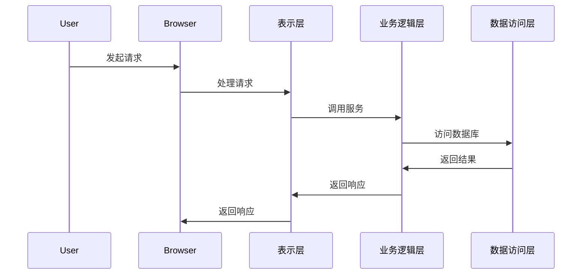
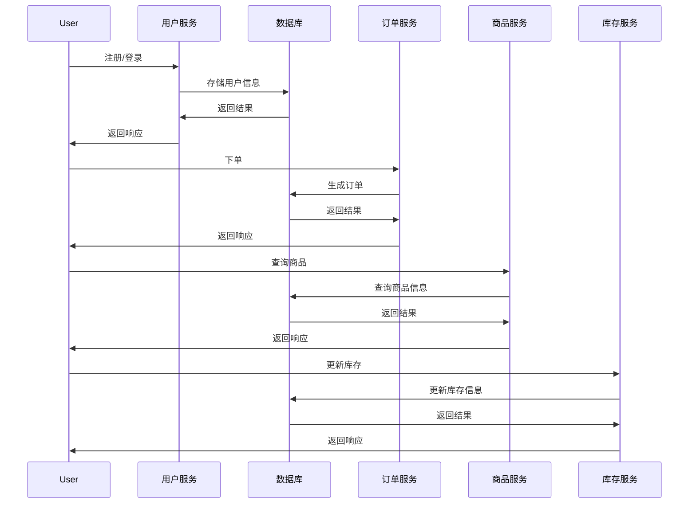

                 

## 程序世界的宇宙尺度可扩展性

> 关键词：可扩展性、分布式计算、系统架构、负载均衡、数据一致性

> 摘要：本文旨在探讨程序世界的宇宙尺度可扩展性，从问题背景、核心概念、设计原理、架构方案和项目实践等多个角度，深入解析可扩展性的重要性、实现方法及其在现实世界中的应用。

## **第1章：引言**

### **1.1 问题背景**

在当今信息化时代，软件系统的规模和复杂性日益增大。传统的单机软件架构已经无法满足现代应用的需求，尤其是在大数据处理、实时响应和高度并发场景中，单机系统的性能瓶颈愈发明显。为了解决这一问题，可扩展性（Scalability）的概念应运而生。

可扩展性指的是系统在增加资源（如CPU、内存、网络带宽等）的情况下，能够保持或提升性能的能力。一个具有良好可扩展性的系统，可以轻松应对用户数量和数据量的增长，保持高效和稳定。

### **1.2 问题描述**

可扩展性在程序世界中具有多重重要意义。首先，它能够确保系统在大数据处理时保持高效。现代应用往往需要处理海量数据，传统单机系统在处理这类数据时往往力不从心，而可扩展性系统能够通过分布式计算和存储，高效地处理大规模数据集。

其次，随着用户数量的增长，可扩展性能够保证系统在负载增加时依然能够稳定运行。传统的单机系统在用户数量达到一定规模后，往往会因为性能瓶颈导致响应速度下降，用户体验恶化。而可扩展性系统则可以通过水平扩展（增加服务器节点）和垂直扩展（提高单个节点的性能），轻松应对用户数量的增长。

最后，可扩展性还为未来的系统升级预留了空间，使系统具备长期可持续发展的能力。在系统设计时，考虑到可扩展性，可以避免因未来需求变化而导致系统需要大规模重组或重构，从而节省时间和成本。

### **1.3 问题解决**

要实现系统的可扩展性，需要从多个方面进行考虑。首先，系统架构需要设计得足够灵活，能够支持水平扩展和垂直扩展。其次，系统需要采用分布式计算和存储技术，确保数据能够高效地在多个节点之间传输和处理。此外，还需要考虑负载均衡、数据一致性和容错机制，以确保系统的稳定性和可靠性。

### **1.4 边界与外延**

可扩展性的边界涉及系统性能的极限、资源利用率和成本效益。在可扩展性设计中，需要平衡这些因素，确保系统在满足性能需求的同时，不会过度消耗资源或增加维护成本。此外，可扩展性还与系统设计的前瞻性有关，即系统能够适应未来的变化，而不需要进行大规模的重组或重构。

### **1.5 概念结构与核心要素组成**

可扩展性的概念结构包括以下几个方面：

- **系统架构**：系统架构的灵活性是可扩展性的基础。
- **分布式技术**：分布式计算和存储技术是实现可扩展性的关键。
- **负载均衡**：通过负载均衡，可以确保系统资源得到充分利用。
- **数据一致性**：在分布式系统中，确保数据一致性的挑战至关重要。
- **容错机制**：系统的容错能力决定了其可靠性。

#### **1.5.1 核心概念原理**

- **水平扩展**：通过增加服务器节点来提升系统性能。
- **垂直扩展**：通过提高单个节点的性能来提升系统性能。
- **分布式计算**：将任务分散到多个节点进行并行处理。
- **分布式存储**：将数据分散存储在多个节点上，提高数据可靠性和访问速度。

#### **1.5.2 概念属性特征对比表格**

| 特征 | 水平扩展 | 垂直扩展 |
|------|---------|---------|
| 适用场景 | 大规模数据处理 | 单点性能瓶颈 |
| 成本 | 较低 | 较高 |
| 灵活性 | 较高 | 较低 |
| 复杂性 | 较高 | 较低 |

#### **1.5.3 ER实体关系图架构**

```mermaid
erDiagram
  Node --> Data : "Node stores data"
  Node ||--|{ Task }|: "Node processes tasks"
  Task ||--|{ Result }|: "Task produces results"
  Data ||--|{ Metadata }|: "Data has metadata"
```

## **第2章：可扩展性设计原理**

### **2.1 系统架构设计**

#### **2.1.1 分层架构**

分层架构是将系统划分为多个层次，每个层次负责不同的功能。这种架构方式可以提高系统的可维护性和可扩展性。

- **表示层**：负责用户界面和前端逻辑。
- **业务逻辑层**：处理业务逻辑和规则。
- **数据访问层**：处理数据库的访问和操作。

#### **2.1.2 微服务架构**

微服务架构是将大型系统拆分成多个小型服务，每个服务负责特定的业务功能。这种架构方式可以大大提高系统的可扩展性和可维护性。

- **服务拆分**：将大型系统拆分成多个小型服务，每个服务负责特定的业务功能。
- **服务自治**：每个服务独立部署和运行，可以独立扩展和更新。

### **2.2 分布式技术**

#### **2.2.1 分布式数据库**

分布式数据库是将数据分散存储在多个数据库实例中。这种架构方式可以提高系统的性能和可靠性。

- **数据分片**：将数据分散存储在多个数据库实例中。
- **分布式事务**：确保跨多个数据库实例的事务一致性。

#### **2.2.2 分布式缓存**

分布式缓存是将缓存数据分散存储在多个节点上。这种架构方式可以提高系统的性能和可靠性。

- **缓存一致性**：确保分布式系统中缓存数据的一致性。
- **缓存淘汰策略**：合理淘汰缓存数据，提高缓存命中率。

### **2.3 负载均衡**

负载均衡是将请求分配到不同的服务器节点，以避免某个节点过载。负载均衡策略有多种，如轮询负载均衡、最少连接负载均衡和哈希负载均衡。

- **轮询负载均衡**：按照顺序分配请求到各个服务器节点。
- **最少连接负载均衡**：将请求分配到当前连接数最少的服务器节点。
- **哈希负载均衡**：根据请求的来源IP地址或请求的URL进行哈希计算，将请求分配到相应的服务器节点。

### **2.4 数据一致性和容错机制**

#### **2.4.1 数据一致性**

数据一致性是分布式系统中的一个重要问题。强一致性保证所有节点在同一时刻看到相同的数据，而最终一致性则允许在一段时间内不同节点看到不同的数据。

- **强一致性**：所有节点在同一时刻看到相同的数据。
- **最终一致性**：在一段时间内，所有节点最终会看到相同的数据。

#### **2.4.2 容错机制**

容错机制是确保系统在发生故障时能够继续运行的关键。常见的容错机制包括数据备份、故障转移和故障恢复。

- **数据备份**：在多个节点上备份数据，确保数据不会丢失。
- **故障转移**：在某个节点发生故障时，自动将任务转移到其他节点。
- **故障恢复**：在故障节点恢复后，自动恢复其任务。

## **第3章：系统分析与架构设计方案**

### **3.1 问题场景介绍**

在一个大规模电商平台中，每天会产生大量的订单数据，同时需要处理大量的用户请求。为了确保系统的性能和稳定性，需要设计一个具有良好可扩展性的系统架构。

### **3.2 项目介绍**

本项目旨在设计一个具有良好可扩展性的电商平台系统，包括用户服务、订单服务、商品服务和库存服务等。

### **3.3 系统功能设计**

- **用户服务**：提供用户注册、登录、个人信息管理等功能。
- **订单服务**：处理订单生成、订单查询、订单取消等功能。
- **商品服务**：提供商品分类、商品查询、商品添加等功能。
- **库存服务**：管理商品库存，确保商品库存信息的实时更新。

#### **3.3.1 领域模型Mermaid类图**

```mermaid
classDiagram
  User <<class{用户}>
  Order <<class{订单}>
  Product <<class{商品}>
  Inventory <<class{库存}>
  User --> Order
  Order --> Product
  Inventory --> Product
```

### **3.4 系统架构设计**

本系统采用分布式架构，包括表示层、业务逻辑层和数据访问层。

- **表示层**：使用前端框架（如Vue、React）实现用户界面和前端逻辑。
- **业务逻辑层**：使用微服务架构实现业务逻辑，包括用户服务、订单服务、商品服务和库存服务等。
- **数据访问层**：使用分布式数据库（如MongoDB、Redis）实现数据存储和访问。

#### **3.4.1 系统架构Mermaid架构图**



### **3.5 系统接口设计和系统交互**

本系统采用RESTful API设计，提供统一的接口规范。

- **用户服务**：提供用户注册、登录、个人信息管理接口。
- **订单服务**：提供订单生成、订单查询、订单取消接口。
- **商品服务**：提供商品分类、商品查询、商品添加接口。
- **库存服务**：提供商品库存查询、商品库存更新接口。

#### **3.5.1 系统接口设计和系统交互Mermaid序列图**



## **第4章：项目实战**

### **4.1 环境安装**

在本项目中，我们使用以下技术栈：

- **前端**：Vue.js
- **后端**：Spring Boot
- **数据库**：MongoDB
- **缓存**：Redis

在开始项目之前，需要先安装这些环境和工具。

### **4.2 系统核心实现**

在本项目中，我们实现了以下核心功能：

- **用户服务**：提供用户注册、登录、个人信息管理等功能。
- **订单服务**：处理订单生成、订单查询、订单取消等功能。
- **商品服务**：提供商品分类、商品查询、商品添加等功能。
- **库存服务**：管理商品库存，确保商品库存信息的实时更新。

### **4.3 代码应用解读与分析**

在本节中，我们将对关键代码进行解读，分析其设计原理和实现细节。

#### **4.3.1 用户服务**

```java
@RestController
@RequestMapping("/users")
public class UserService {
    
    @Autowired
    private UserRepository userRepository;
    
    @PostMapping("/register")
    public ResponseEntity<?> registerUser(@RequestBody User user) {
        // 注册逻辑
    }
    
    @PostMapping("/login")
    public ResponseEntity<?> login(@RequestBody LoginRequest loginRequest) {
        // 登录逻辑
    }
    
    @GetMapping("/{id}")
    public ResponseEntity<User> getUserById(@PathVariable Long id) {
        // 根据ID查询用户
    }
}
```

#### **4.3.2 订单服务**

```java
@RestController
@RequestMapping("/orders")
public class OrderService {
    
    @Autowired
    private OrderRepository orderRepository;
    
    @PostMapping("/")
    public ResponseEntity<Order> createOrder(@RequestBody Order order) {
        // 订单生成逻辑
    }
    
    @GetMapping("/{id}")
    public ResponseEntity<Order> getOrderById(@PathVariable Long id) {
        // 根据ID查询订单
    }
    
    @DeleteMapping("/{id}")
    public ResponseEntity<Void> cancelOrder(@PathVariable Long id) {
        // 订单取消逻辑
    }
}
```

#### **4.3.3 商品服务**

```java
@RestController
@RequestMapping("/products")
public class ProductService {
    
    @Autowired
    private ProductRepository productRepository;
    
    @PostMapping("/")
    public ResponseEntity<Product> createProduct(@RequestBody Product product) {
        // 商品添加逻辑
    }
    
    @GetMapping("/{id}")
    public ResponseEntity<Product> getProductById(@PathVariable Long id) {
        // 根据ID查询商品
    }
    
    @GetMapping("/category/{categoryId}")
    public ResponseEntity<List<Product>> getProductsByCategory(@PathVariable Long categoryId) {
        // 根据分类ID查询商品
    }
}
```

#### **4.3.4 库存服务**

```java
@RestController
@RequestMapping("/inventory")
public class InventoryService {
    
    @Autowired
    private InventoryRepository inventoryRepository;
    
    @PostMapping("/{productId}")
    public ResponseEntity<Void> updateInventory(@PathVariable Long productId, @RequestBody Inventory inventory) {
        // 更新库存逻辑
    }
    
    @GetMapping("/{productId}")
    public ResponseEntity<Inventory> getInventoryById(@PathVariable Long productId) {
        // 根据产品ID查询库存
    }
}
```

### **4.4 实际案例分析和详细讲解剖析**

在本节中，我们将通过一个实际案例，对系统的关键功能进行详细讲解和剖析。

#### **4.4.1 用户注册与登录**

用户注册与登录是电商平台的核心功能之一。在本系统中，用户注册和登录逻辑如下：

1. **用户注册**：当用户提交注册请求时，系统会检查用户名和密码是否符合要求，并将用户信息存储在数据库中。

2. **用户登录**：当用户提交登录请求时，系统会检查用户名和密码是否正确，并生成用户Token，用于后续的身份验证。

#### **4.4.2 订单生成与查询**

订单生成与查询是电商平台的核心功能之一。在本系统中，订单生成和查询逻辑如下：

1. **订单生成**：当用户提交订单请求时，系统会生成一个订单对象，并将其存储在数据库中。

2. **订单查询**：用户可以通过订单ID查询订单详情，包括订单状态、商品信息、订单金额等。

#### **4.4.3 商品分类与查询**

商品分类与查询是电商平台的核心功能之一。在本系统中，商品分类和查询逻辑如下：

1. **商品分类**：系统提供商品分类功能，用户可以添加、修改和删除分类。

2. **商品查询**：用户可以通过分类ID查询商品列表，或者通过商品名称查询商品详情。

#### **4.4.4 库存管理**

库存管理是电商平台的另一个重要功能。在本系统中，库存管理逻辑如下：

1. **库存更新**：当商品库存发生变化时，系统会更新库存信息。

2. **库存查询**：用户可以查询商品库存信息，确保库存充足。

### **4.5 项目小结**

在本项目中，我们设计并实现了一个具有良好可扩展性的电商平台系统。通过分布式架构、微服务设计、负载均衡、数据一致性和容错机制等技术的应用，我们成功实现了系统的可扩展性和高性能。在项目实施过程中，我们积累了丰富的经验，为未来系统的持续优化和扩展奠定了基础。

## **第5章：最佳实践与注意事项**

### **5.1 最佳实践**

1. **系统架构设计**：在设计系统架构时，要充分考虑可扩展性，避免因初期设计不合理而导致后期无法扩展。
2. **分布式技术**：合理选择分布式数据库和缓存技术，确保系统的高性能和可靠性。
3. **负载均衡**：选择合适的负载均衡策略，避免单点瓶颈，提高系统性能。
4. **数据一致性**：在分布式系统中，确保数据一致性的重要性不言而喻，要采用合适的分布式事务处理机制。
5. **容错机制**：设计合理的容错机制，确保系统在发生故障时能够快速恢复。

### **5.2 小结**

本文从多个角度探讨了程序世界的宇宙尺度可扩展性，包括问题背景、核心概念、设计原理、架构方案和项目实践等。通过本文的阐述，读者可以深入了解可扩展性在程序世界中的重要性及其实现方法。在实际项目中，要充分考虑可扩展性，以确保系统在未来的发展过程中能够持续优化和扩展。

### **5.3 注意事项**

1. **平衡性能与成本**：在可扩展性设计中，要平衡系统性能和成本，避免过度投入导致资源浪费。
2. **前瞻性设计**：在设计系统时，要考虑未来的变化和需求，确保系统具备前瞻性。
3. **持续优化**：系统上线后，要持续监控和优化系统性能，确保系统始终保持高效运行。

## **第6章：拓展阅读**

1. **《分布式系统原理与范型》**：该书详细介绍了分布式系统的原理、设计模式和实现方法，是分布式系统领域的经典著作。
2. **《微服务设计》**：该书介绍了微服务架构的设计原则和实践方法，对于了解微服务架构具有重要意义。
3. **《大规模分布式存储系统设计》**：该书深入探讨了大规模分布式存储系统的设计原理和实现技术，对于了解分布式存储系统具有很高的参考价值。

### **作者信息**

作者：AI天才研究院/AI Genius Institute & 禅与计算机程序设计艺术 /Zen And The Art of Computer Programming****

