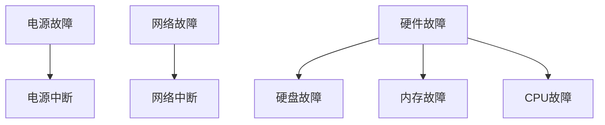
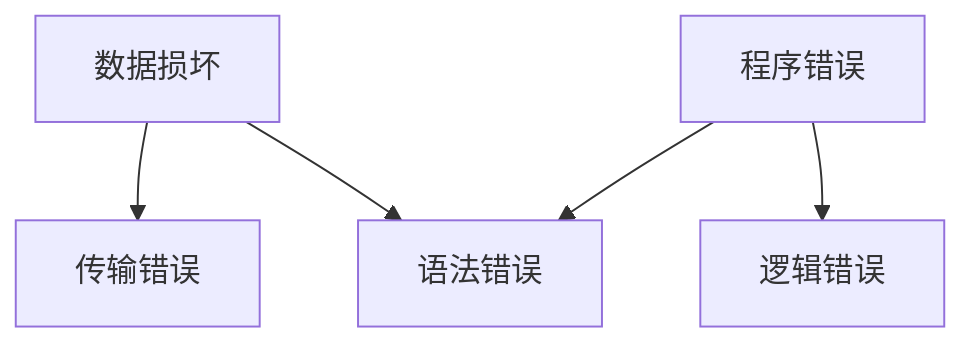
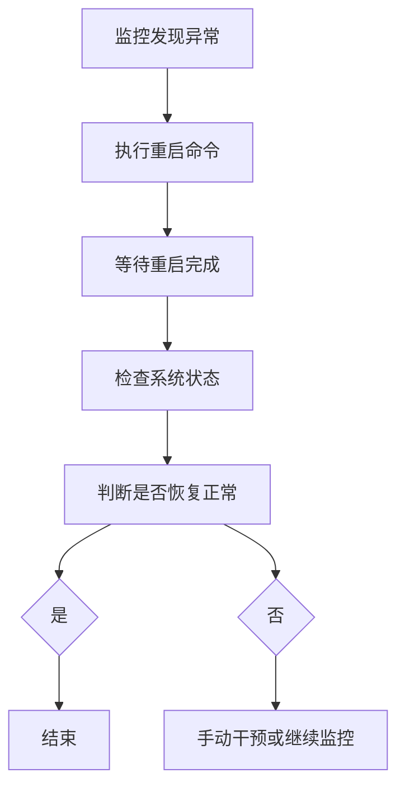
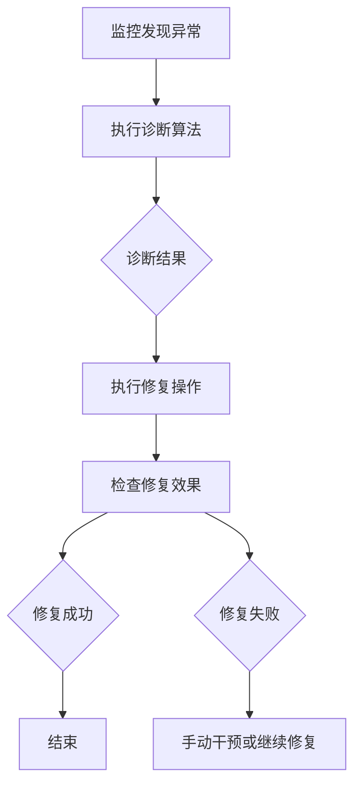
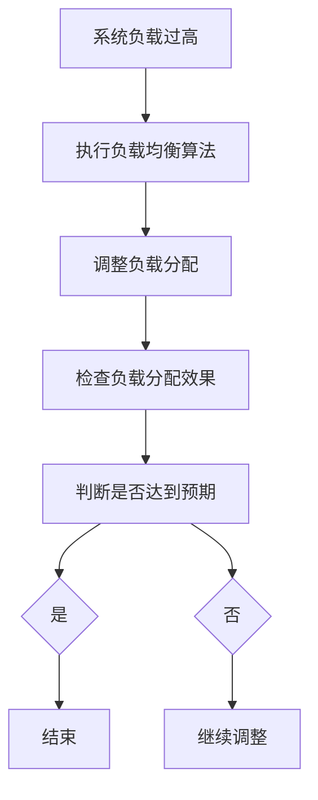
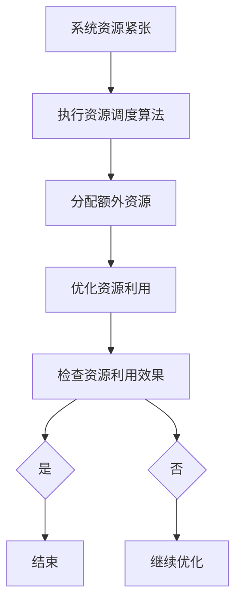
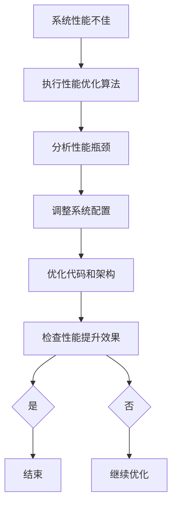
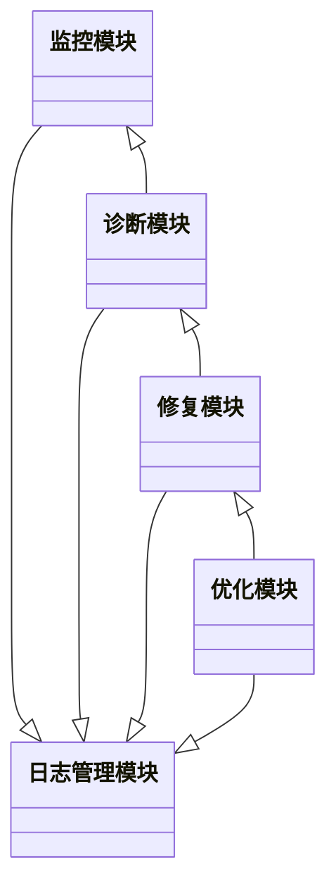
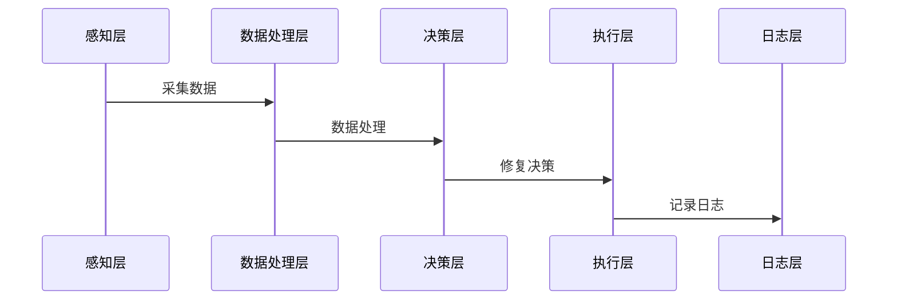
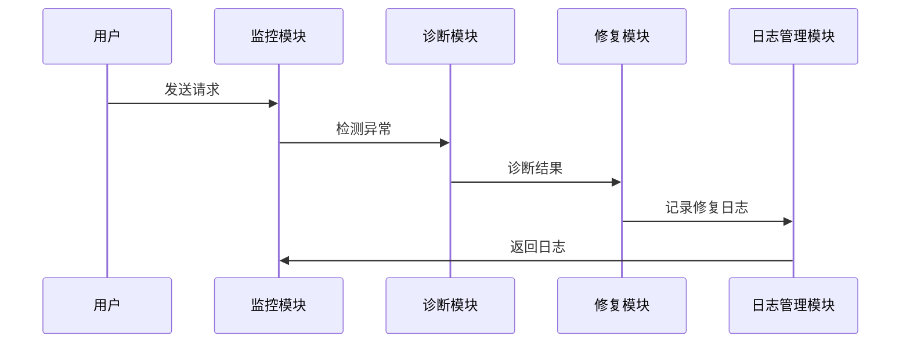

                 

### 第1章 引言与背景介绍

#### 1.1 问题背景与定义

随着计算机技术的飞速发展，程序世界变得愈发庞大而复杂。然而，程序的稳定性和可靠性仍然是一个挑战。系统错误、硬件故障、网络攻击等问题时有发生，这些问题可能导致系统崩溃、数据丢失、甚至造成严重的经济损失。为了应对这些问题，自我修复技术应运而生。

自我修复技术是指系统能够在出现问题时自动检测、诊断并修复问题的能力。它类似于生物体的自我修复机制，使得系统在遭受外部攻击或内部错误时，能够迅速恢复到正常状态，减少停机时间和维护成本。

在程序世界中，自我修复技术的重要性不言而喻。它不仅能够提高系统的可用性，还能提升用户体验，降低维护成本。因此，研究自我修复技术具有重要的理论和实践意义。

#### 1.2 自我修复技术的基本概念

自我修复技术包含以下几个核心概念：

1. **自我检测（Self-Detection）**：系统能够自动检测自身状态，识别出异常情况。这通常通过监控系统的性能指标、日志记录、错误报告等手段实现。

2. **自我诊断（Self-Diagnosis）**：在检测到异常后，系统能够对问题进行定位和分析，确定故障的原因。这通常涉及复杂的逻辑判断和数据分析。

3. **自我修复（Self-Healing）**：诊断出问题后，系统能够自动执行修复操作，恢复到正常状态。修复操作可能包括重启服务、更新软件、替换硬件等。

4. **自我优化（Self-Optimization）**：在修复问题的同时，系统还能优化其性能，提高资源利用率，减少未来故障的发生概率。

#### 1.3 自我修复技术的应用领域

自我修复技术在多个领域有广泛的应用：

1. **软件开发**：在软件生命周期中，自我修复技术可以帮助自动化测试、代码审查、版本控制等环节，减少人为错误。

2. **系统维护**：在系统运行过程中，自我修复技术可以实时监控系统状态，自动检测和修复故障，确保系统的高可用性。

3. **网络通信**：在网络环境中，自我修复技术可以自动检测和修复网络故障，优化网络性能，提高通信稳定性。

### 第2章 核心概念与原理

#### 2.1 自我修复技术的定义与特点

自我修复技术的定义可以概括为：通过自动化的过程，对系统进行监控、检测、诊断和修复，以提高系统的可靠性和可用性。

自我修复技术的特点主要包括：

1. **自动性**：系统能够自动执行修复操作，无需人工干预。
2. **适应性**：系统能够根据不同的环境和问题，调整修复策略。
3. **实时性**：系统能够在问题发生时迅速响应，减少故障时间。
4. **预防性**：系统能够在问题发生前进行预防性修复，减少故障的发生概率。

#### 2.2 自我修复技术的核心概念

自我修复技术的核心概念包括以下几个方面：

1. **监控与检测**：通过监控系统的运行状态，及时发现异常情况。这通常涉及性能监控、日志分析、异常检测等技术。
2. **诊断与定位**：在检测到异常后，系统需要定位问题的具体原因。这通常涉及故障树分析、错误日志分析等技术。
3. **修复与优化**：在诊断出问题后，系统需要自动执行修复操作，并进行性能优化。这通常涉及自动化修复脚本、算法优化等技术。

#### 2.3 自我修复技术与相关技术的对比

自我修复技术与其他相关技术的对比如下：

1. **与容错技术（Fault Tolerance）**：容错技术旨在确保系统在出现故障时，仍能保持一定的功能。而自我修复技术则更注重自动化的故障恢复。
2. **与自适应技术（Adaptive Technology）**：自适应技术旨在根据环境变化调整系统行为，而自我修复技术则更侧重于故障恢复和性能优化。
3. **与鲁棒性技术（Robustness）**：鲁棒性技术旨在提高系统对异常情况的容忍度，而自我修复技术则更关注于自动化的故障处理和恢复。

### 第3章 算法原理讲解

自我修复技术的实现离不开一系列的算法。这些算法包括监控算法、诊断算法、修复算法和优化算法。以下将逐一介绍这些算法的基本原理。

#### 3.1 监控算法原理

监控算法是自我修复技术的核心之一。其主要任务是对系统运行状态进行实时监控，及时发现异常情况。监控算法通常包括以下几个步骤：

1. **数据采集**：从系统的各种接口（如操作系统、数据库、网络等）收集运行数据。
2. **状态评估**：对采集到的数据进行处理，评估系统当前的状态。
3. **异常检测**：利用机器学习、统计分析等方法，识别出异常状态。

例如，可以使用以下Python代码进行监控：

```python
import psutil

def monitor_system():
    # 采集系统资源使用情况
    cpu_usage = psutil.cpu_percent()
    memory_usage = psutil.virtual_memory().percent
    disk_usage = psutil.disk_usage('/').percent
    
    # 判断是否达到异常阈值
    if cpu_usage > 80 or memory_usage > 80 or disk_usage > 80:
        print("系统异常：资源使用过高")
    else:
        print("系统正常")

monitor_system()
```

#### 3.2 诊断算法原理

在监控算法发现异常后，诊断算法负责定位问题的具体原因。常见的诊断算法包括故障树分析（Fault Tree Analysis，FTA）和错误树分析（Error Tree Analysis，ETA）。

故障树分析是一种自上而下的分析方法，通过构建故障树，逐步分析故障的原因。以下是一个简单的故障树分析的mermaid流程图：



错误树分析则是一种自下而上的分析方法，通过构建错误树，逐步分析错误的根源。以下是一个简单的错误树分析的mermaid流程图：



#### 3.3 修复算法原理

在诊断出问题后，修复算法负责自动执行修复操作。常见的修复算法包括自动重启、自动修复和手动干预。

自动重启是一种常见的修复方法。以下是一个简单的自动重启的mermaid流程图：



自动修复则更加复杂，可能涉及软件更新、硬件更换等操作。以下是一个简单的自动修复的mermaid流程图：



#### 3.4 优化算法原理

在修复问题后，优化算法负责提升系统的性能。常见的优化算法包括负载均衡、资源调度和性能优化。

负载均衡算法旨在平衡系统的负载，避免过载。以下是一个简单的负载均衡的mermaid流程图：



资源调度算法旨在优化系统资源的利用效率。以下是一个简单的资源调度的mermaid流程图：



性能优化算法旨在提升系统的整体性能。以下是一个简单的性能优化的mermaid流程图：



### 第4章 系统分析与架构设计

自我修复技术的实现不仅仅依赖于算法，还需要一个完善的系统架构来支持。以下将介绍自我修复系统的分析与架构设计。

#### 4.1 问题场景介绍

假设我们正在设计一个电子商务平台，该平台需要处理海量的用户请求，并且要求高可用性和高性能。在这个场景下，系统可能会面临以下问题：

1. **高并发请求**：在促销活动期间，用户请求量激增，可能导致系统过载。
2. **硬件故障**：服务器、存储设备等硬件可能出现故障。
3. **软件错误**：代码bug可能导致系统崩溃或数据丢失。
4. **网络问题**：网络延迟、中断等可能导致数据传输失败。

为了解决这些问题，我们需要设计一个自我修复系统，能够在问题发生时自动检测、诊断和修复。

#### 4.2 系统功能设计

自我修复系统的功能可以分为以下几个部分：

1. **监控模块**：实时监控系统的运行状态，包括CPU、内存、磁盘、网络等资源的使用情况。
2. **诊断模块**：在监控模块检测到异常时，自动执行诊断算法，定位问题原因。
3. **修复模块**：根据诊断结果，自动执行修复操作，包括重启服务、更新代码、更换硬件等。
4. **优化模块**：在修复问题后，对系统进行性能优化，提高资源利用率和稳定性。
5. **日志管理模块**：记录系统运行过程中的各种日志信息，包括监控数据、诊断结果、修复操作等，以便进行后续分析。

以下是一个自我修复系统功能设计的mermaid类图：



#### 4.3 系统架构设计

自我修复系统的架构设计可以分为以下几个层次：

1. **感知层**：包括各种传感器和监控工具，负责采集系统运行状态数据。
2. **感知层**：负责处理感知层采集到的数据，进行初步的分析和筛选。
3. **决策层**：包括诊断算法和修复算法，负责根据感知层的数据进行问题诊断和修复决策。
4. **执行层**：负责执行决策层的修复操作，包括重启服务、更新代码、更换硬件等。
5. **日志层**：负责记录系统运行过程中的各种日志信息，以便进行后续分析和优化。

以下是一个自我修复系统架构设计的mermaid架构图：



#### 4.4 系统接口设计与交互

自我修复系统需要与其他系统进行交互，以实现数据共享和协同工作。以下是一个简单的系统接口设计与交互的mermaid序列图：



### 第5章 项目实战与案例分析

为了更好地理解自我修复技术的实际应用，我们将通过一个实际项目来演示自我修复系统的设计和实现。

#### 5.1 环境安装与配置

首先，我们需要搭建一个测试环境，用于演示自我修复系统的实现。以下是环境安装和配置的步骤：

1. **安装操作系统**：在虚拟机中安装Linux操作系统，如CentOS 7。
2. **安装监控工具**：安装并配置Nagios或Zabbix等监控工具，用于实时监控系统的运行状态。
3. **安装诊断工具**：安装并配置故障诊断工具，如faultfinder或falconer，用于自动诊断系统故障。
4. **安装修复工具**：安装并配置自动修复工具，如rebooter或fixer，用于自动执行修复操作。

#### 5.2 系统核心实现源代码

以下是一个简单的自我修复系统的核心实现源代码，包括监控模块、诊断模块、修复模块和日志管理模块。

**监控模块：**

```python
import psutil

def monitor_system():
    cpu_usage = psutil.cpu_percent()
    memory_usage = psutil.virtual_memory().percent
    disk_usage = psutil.disk_usage('/').percent
    
    if cpu_usage > 80 or memory_usage > 80 or disk_usage > 80:
        raise Exception("系统异常：资源使用过高")
```

**诊断模块：**

```python
def diagnose_fault():
    # 模拟诊断过程
    if psutil.cpu_percent() > 80:
        return "CPU过载"
    elif psutil.virtual_memory().percent > 80:
        return "内存过载"
    elif psutil.disk_usage('/').percent > 80:
        return "磁盘空间不足"
    else:
        return "系统正常"
```

**修复模块：**

```python
import os

def fix_fault(fault):
    if fault == "CPU过载":
        os.system("重启CPU密集型服务")
    elif fault == "内存过载":
        os.system("增加内存或清理内存")
    elif fault == "磁盘空间不足":
        os.system("清理磁盘空间或增加磁盘容量")
```

**日志管理模块：**

```python
import logging

def log_info(info):
    logging.basicConfig(filename='system.log', level=logging.INFO)
    logging.info(info)
```

#### 5.3 代码应用解读与分析

以上代码展示了自我修复系统的核心功能。在监控模块中，我们使用psutil库来实时监控系统的CPU、内存和磁盘使用情况。一旦发现资源使用过高，监控模块会抛出异常。

在诊断模块中，我们使用简单的if-else语句来判断系统故障的具体原因。这个诊断过程可以根据实际情况进行扩展，加入更多的诊断指标和规则。

在修复模块中，我们使用os.system()函数来执行修复操作。这些修复操作可以是重启服务、清理内存、清理磁盘等。在实际应用中，这些操作可以通过脚本或自动化工具来实现。

在日志管理模块中，我们使用logging库来记录系统运行过程中的各种日志信息。这些日志信息包括监控数据、诊断结果、修复操作等，以便进行后续分析和优化。

#### 5.4 实际案例分析

以下是一个实际的案例分析：

假设系统在运行过程中，CPU使用率持续高于80%。监控模块会立即触发异常，并抛出异常。诊断模块会判断出CPU过载的原因，并执行修复操作。修复模块会重启CPU密集型服务，释放CPU资源。

在修复完成后，日志管理模块会记录下这次故障的详细信息，包括故障原因、修复操作和修复结果。这些日志信息可以帮助我们分析和优化自我修复系统，提高系统的稳定性和可靠性。

#### 5.5 项目小结

通过这个项目，我们了解了自我修复系统的基本设计和实现。自我修复系统在提高系统可用性和稳定性方面发挥了重要作用。然而，实际应用中可能面临更多复杂的场景和挑战，需要不断优化和改进。

自我修复技术的核心在于自动化和智能化。通过监控、诊断、修复和优化，系统可以在问题发生时迅速响应，减少故障时间，提高用户体验。未来，自我修复技术将在更多的领域得到应用，为程序世界带来更多的可能性。

### 第6章 总结与最佳实践

#### 6.1 自我修复技术总结

自我修复技术是一种通过自动化和智能化手段，提高系统稳定性和可靠性的技术。其主要特点包括自动性、适应性、实时性和预防性。自我修复技术包括监控、诊断、修复和优化等核心环节，通过这些环节，系统可以在问题发生时迅速响应，减少故障时间和维护成本。

#### 6.2 最佳实践 tips

1. **全面监控**：确保监控系统能够全面覆盖系统的各个层面，包括CPU、内存、磁盘、网络等资源的使用情况。
2. **精准诊断**：优化诊断算法，确保能够准确识别故障原因，提高诊断的效率和准确性。
3. **快速修复**：优化修复策略，确保在诊断出故障后，系统能够迅速执行修复操作，减少故障时间。
4. **日志管理**：详细记录系统运行过程中的各种日志信息，包括监控数据、诊断结果、修复操作等，便于后续分析和优化。
5. **持续优化**：根据实际情况，不断优化自我修复系统，提高系统的稳定性和可靠性。

#### 6.3 注意事项

1. **避免过度自动化**：过度自动化可能导致系统在未知情况下执行不必要的修复操作，反而增加故障风险。
2. **确保系统兼容性**：自我修复系统需要与现有系统兼容，避免因为兼容性问题导致故障。
3. **安全考虑**：修复操作可能涉及敏感数据和关键操作，需要确保修复过程的安全性。

#### 6.4 拓展阅读

1. **《自我修复计算机系统》**：了解自我修复技术的最新研究和进展。
2. **《自动化运维实践》**：学习自动化运维的相关知识和技能，提高系统运维效率。
3. **《人工智能在运维中的应用》**：了解人工智能在运维领域的应用，探索自我修复技术的未来发展趋势。

### 附录

**附录A：术语解释**

- **自我修复技术**：通过自动化和智能化手段，提高系统稳定性和可靠性的技术。
- **监控**：实时监控系统的运行状态，收集性能指标和日志信息。
- **诊断**：分析系统故障的原因，确定故障的位置和类型。
- **修复**：执行修复操作，恢复系统的正常运行。
- **优化**：在修复问题后，对系统进行性能优化，提高资源利用率和稳定性。

**附录B：相关技术对比**

- **容错技术**：确保系统在故障时，仍能保持一定的功能。
- **自适应技术**：根据环境变化调整系统行为。
- **鲁棒性技术**：提高系统对异常情况的容忍度。

### 作者信息

作者：AI天才研究院/AI Genius Institute & 禅与计算机程序设计艺术 /Zen And The Art of Computer Programming

### 后记

感谢读者对本文的阅读。本文从自我修复技术的背景和定义出发，详细介绍了自我修复技术的核心概念、算法原理、系统架构设计以及实际项目案例。通过本文，读者可以了解到自我修复技术在程序世界中的重要性和应用价值。希望本文能够为读者在自我修复技术的研究和实践提供一些启示和帮助。在未来的技术发展中，自我修复技术将继续发挥重要作用，推动程序世界的发展和创新。再次感谢读者的关注和支持！

