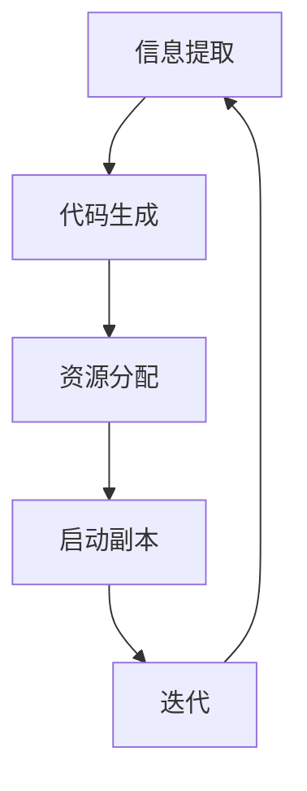

                 

# 程序世界的宇宙级自我复制机制

## 关键词
- 自我复制机制
- 程序世界
- 计算机科学
- 自适应算法
- 分布式计算

## 摘要
本文探讨了程序世界中的宇宙级自我复制机制，这是一个在计算机科学中具有重要意义的概念。自我复制机制是指程序能够自我复制和自我进化的一种能力，这种能力在计算机领域有着广泛的应用。本文将从自我复制机制的背景、核心概念、理论框架、实践应用、高级技术、应用和影响、未来发展趋势等方面进行全面剖析。通过本文的阅读，读者可以深入了解自我复制机制的本质，掌握其在程序世界中的应用技巧，并为未来的研究提供方向。

## 目录
1. 引言
2. 自我复制机制的概念与历史
3. 自我复制机制的核心概念与原理
4. 自我复制机制的理论框架
5. 自我复制机制的实践应用
6. 自我复制机制的案例分析
7. 自我复制机制的高级技术
8. 自我复制机制的应用与影响
9. 自我复制机制的未来发展趋势
10. 总结与展望
11. 参考文献

## 引言

### 自我复制机制的定义

自我复制机制（Self-replicating mechanism）是指在程序世界中，程序能够通过某种方式自我复制，即生成自己的副本。自我复制机制的核心在于，程序不仅能够执行特定的任务，还能够通过自我复制来扩展自身的功能。这种机制在计算机科学中具有广泛的应用，如自动化测试、病毒防护、软件升级等。

### 自我复制机制的重要性

自我复制机制的重要性体现在多个方面。首先，它提高了程序的效率。通过自我复制，程序可以自动地生成副本，从而在多个环境中同时运行，提高了任务处理的效率。其次，自我复制机制有助于软件的进化。通过自我复制，程序可以不断地生成新的版本，这些版本可以在不断的迭代过程中优化自身，从而实现软件的自我进化。最后，自我复制机制在计算机领域具有重要的研究价值。它不仅有助于我们理解程序的本质，还可以为新的算法和系统设计提供灵感。

### 自我复制机制的发展历程

自我复制机制的发展历程可以追溯到20世纪60年代。当时，计算机科学家John von Neumann提出了自我复制自动机的概念，这一理论奠定了自我复制机制的基础。随着计算机科学的不断发展，自我复制机制逐渐应用于各个领域。例如，在软件工程中，自我复制机制被用来实现自动化测试；在人工智能领域，自我复制机制被用来实现智能体的自我进化。

### 程序世界的定义

程序世界（Program World）是指由计算机程序构成的虚拟世界。在这个世界中，程序通过代码的形式进行交互，实现了各种复杂的功能。程序世界是计算机科学的核心领域之一，它涵盖了软件设计、开发、测试、维护等多个方面。

### 程序世界的重要性

程序世界的重要性在于，它为人类提供了强大的工具来处理复杂的问题。无论是科学研究、商业运营，还是日常生活，程序世界都发挥着至关重要的作用。例如，在医疗领域，程序世界可以帮助医生进行疾病诊断；在金融领域，程序世界可以用来进行股票交易分析。程序世界的重要性不仅体现在其应用范围广泛，还在于其不断进化的能力。通过自我复制机制，程序世界可以不断地优化自身，提高效率，从而更好地服务于人类社会。

### 自我复制机制在程序世界中的应用

自我复制机制在程序世界中有着广泛的应用。例如，在自动化测试中，程序可以自我复制，生成多个副本，同时进行测试，从而提高测试效率。在软件升级中，程序可以自我复制，生成新版本，从而实现软件的自动化升级。在病毒防护中，程序可以自我复制，生成病毒库，从而实现对病毒的快速识别和防护。

### 自我复制机制的挑战

尽管自我复制机制在程序世界中具有广泛的应用，但它也面临着一系列挑战。首先，自我复制机制需要解决资源分配问题。在程序世界中，资源是有限的，如何高效地分配资源，以支持自我复制，是一个重要的问题。其次，自我复制机制需要解决安全性问题。在程序世界中，自我复制可能会被恶意利用，因此如何确保自我复制的安全性，也是一个重要的挑战。

### 自我复制机制的未来发展趋势

随着计算机科学的不断发展，自我复制机制在未来将会得到更广泛的应用。首先，自我复制机制将更加智能化。通过引入人工智能技术，自我复制机制可以更加智能地生成和优化副本，从而提高程序的效率。其次，自我复制机制将更加安全。通过引入安全机制，自我复制机制可以防止恶意利用，从而确保程序的安全。

### 小结

自我复制机制是程序世界中一个重要且具有挑战性的概念。它不仅提高了程序的效率，还有助于软件的进化。通过本文的介绍，读者可以初步了解自我复制机制的概念、应用和发展趋势。在后续章节中，我们将进一步探讨自我复制机制的核心概念、理论框架、实践应用等，以便读者能够更深入地理解这一重要概念。

## 自我复制机制的概念与历史

### 自我复制机制的定义

自我复制机制（Self-replicating mechanism）是指在程序世界中，程序能够通过某种方式自我复制，即生成自己的副本。自我复制不仅包括程序的复制，还包括程序所依赖的数据和资源的复制。自我复制机制的核心在于，程序能够独立地完成复制的全过程，而不需要外部的干预。

### 自我复制机制的背景

自我复制机制的概念最早可以追溯到20世纪60年代，当时由计算机科学家John von Neumann提出。John von Neumann是计算机科学的先驱之一，他提出了自复制自动机的理论，这一理论奠定了自我复制机制的基础。在John von Neumann的理论中，自复制自动机是一种能够在计算机上模拟自身复制过程的机器。

### 自我复制机制的发展历程

自我复制机制的发展历程可以分为几个阶段：

#### 第一阶段：理论探索阶段（20世纪60年代）

在第一阶段，计算机科学家们主要致力于研究自我复制机制的理论基础。John von Neumann的自复制自动机理论是这一阶段的代表作。在这一阶段，科学家们提出了许多关于自我复制机制的理论，如遗传算法、进化算法等。

#### 第二阶段：应用探索阶段（20世纪70年代至90年代）

在第二阶段，自我复制机制开始应用于实际问题。例如，在软件工程中，自我复制机制被用来实现自动化测试。在这一阶段，科学家们还发现，自我复制机制在分布式计算、病毒防护等领域具有潜在的应用价值。

#### 第三阶段：快速发展阶段（21世纪）

在第三阶段，自我复制机制得到了快速发展。随着计算机科学的不断进步，特别是人工智能技术的引入，自我复制机制的应用范围进一步扩大。例如，在智能体研究中，自我复制机制被用来实现智能体的自我进化。此外，自我复制机制还在软件升级、数据备份等领域得到了广泛应用。

### 自我复制机制的核心概念

自我复制机制的核心概念包括：

- **复制策略**：复制策略是指程序在自我复制过程中所采用的方法和步骤。常见的复制策略有直接复制、间接复制、分布式复制等。

- **复制条件**：复制条件是指程序在何种情况下会触发自我复制。常见的复制条件有资源充足、任务繁重等。

- **复制效率**：复制效率是指程序在自我复制过程中所消耗的资源与生成的新副本数量之间的比率。提高复制效率是自我复制机制设计的重要目标。

- **安全性**：安全性是指自我复制机制在运行过程中是否能够防止恶意利用。自我复制机制的安全性设计是确保其安全运行的关键。

### 自我复制机制与相关概念的区分

自我复制机制与相关概念如自我修复、自我进化等有着密切的联系，但它们也有明显的区别：

- **自我修复**：自我修复是指程序在运行过程中，能够检测并修复自身的错误。自我修复通常是一种被动的过程，而自我复制是一种主动的过程。

- **自我进化**：自我进化是指程序能够通过自我复制和变异，不断地优化自身。自我进化是一种更高级的自我复制机制，它不仅包括自我复制，还包括自我变异和选择。

### 自我复制机制在程序世界中的应用

自我复制机制在程序世界中有着广泛的应用。例如：

- **自动化测试**：在自动化测试中，程序可以自我复制，生成多个测试副本，从而同时进行多个测试，提高测试效率。

- **分布式计算**：在分布式计算中，程序可以自我复制，分散到多个节点上执行，从而实现任务的高效处理。

- **软件升级**：在软件升级中，程序可以自我复制，生成新版本，从而实现自动化的软件升级。

- **病毒防护**：在病毒防护中，程序可以自我复制，生成病毒库，从而实现对病毒的快速识别和防护。

### 自我复制机制的挑战

尽管自我复制机制在程序世界中具有广泛的应用，但它也面临着一系列挑战。例如：

- **资源分配问题**：如何高效地分配资源，以支持自我复制，是一个重要的问题。

- **安全性问题**：如何确保自我复制机制的安全性，防止恶意利用，也是一个重要的挑战。

- **效率与安全性的平衡**：如何在提高复制效率的同时，确保安全性，是一个需要深入研究的课题。

### 自我复制机制的现状与未来

当前，自我复制机制在计算机科学中已经取得了一定的成果，但仍有很大的发展空间。未来，随着计算机科学的不断进步，特别是人工智能技术的引入，自我复制机制有望在更多的领域得到应用。

### 小结

自我复制机制是程序世界中一个重要且具有挑战性的概念。它不仅提高了程序的效率，还有助于软件的进化。通过本文的介绍，读者可以初步了解自我复制机制的概念、背景、发展历程、核心概念以及应用。在后续章节中，我们将进一步探讨自我复制机制的理论框架、实践应用等，以便读者能够更深入地理解这一重要概念。

## 自我复制机制的核心概念与原理

### 自我复制机制的基本原理

自我复制机制的核心在于程序能够通过某种方式生成自身的副本，从而实现自我复制。这一过程通常包括以下几个基本步骤：

1. **信息提取**：程序首先需要从自身的代码和数据中提取出必要的信息，这些信息包括程序的核心算法、数据结构以及配置参数等。

2. **代码生成**：程序根据提取的信息生成新的代码。这一过程可以是直接复制原有代码，也可以是通过修改现有代码生成新版本。

3. **资源分配**：程序需要为新生成的副本分配必要的资源，如内存、CPU时间等。

4. **启动副本**：新生成的副本开始运行，执行原有的程序功能。

5. **迭代**：通过重复上述步骤，程序可以不断地生成新的副本，从而实现自我复制。

### 自我复制机制的核心属性

自我复制机制具有以下几个核心属性：

1. **独立性**：自我复制机制能够独立完成复制的全过程，不需要外部的干预。这意味着程序能够在没有人为操作的情况下，自动地生成副本。

2. **自我适应性**：自我复制机制能够根据环境和任务的需求，自适应地调整复制策略。例如，在资源紧张的情况下，程序可以减少副本的生成，以节约资源。

3. **自我进化**：自我复制机制不仅能够生成副本，还能够通过变异和选择，实现自我进化。这意味着程序可以通过不断地优化自身，提高效率。

4. **安全性**：自我复制机制需要具备一定的安全性，以防止恶意利用。例如，程序可以通过加密和身份验证等技术，确保只有授权的副本能够生成。

### 自我复制机制与相关概念的对比

自我复制机制与相关概念如自我修复、自我进化等有着密切的联系，但它们也有明显的区别：

- **自我修复**：自我修复是指程序在运行过程中，能够检测并修复自身的错误。自我修复通常是一种被动的过程，而自我复制是一种主动的过程。

- **自我进化**：自我进化是指程序能够通过自我复制和变异，不断地优化自身。自我进化是一种更高级的自我复制机制，它不仅包括自我复制，还包括自我变异和选择。

### 自我复制机制的概念结构

为了更好地理解自我复制机制，我们可以使用Mermaid流程图来展示其概念结构。以下是一个简单的Mermaid流程图示例：



### 自我复制机制的数学模型

自我复制机制的数学模型通常用于描述复制过程中的各种参数和关系。以下是一个简单的数学模型示例：

$$
R(t) = f(R_{\text{initial}}, R_{\text{max}}, \alpha, t)
$$

其中，$R(t)$表示时间$t$时的资源总量，$R_{\text{initial}}$表示初始资源量，$R_{\text{max}}$表示最大资源量，$\alpha$表示资源利用系数，$t$表示时间。

### 自我复制机制的Python实现

为了更直观地展示自我复制机制的原理，我们可以使用Python代码来实现一个简单的自我复制程序。以下是一个简单的Python实现示例：

```python
class Replicator:
    def __init__(self, initial_resources, max_resources, replication_rate):
        self.resources = initial_resources
        self.max_resources = max_resources
        self.replication_rate = replication_rate

    def replicate(self):
        if self.resources >= self.replication_rate:
            self.resources -= self.replication_rate
            return Replicator(self.replication_rate, self.max_resources, self.replication_rate)
        else:
            return None

    def update_resources(self, amount):
        self.resources = min(self.resources + amount, self.max_resources)

# 创建一个初始资源为100，最大资源为200，复制率为10的复制器
replicator = Replicator(100, 200, 10)

# 进行10次复制操作
for _ in range(10):
    new_replicator = replicator.replicate()
    if new_replicator:
        print(f"New Replicator Created: {id(new_replicator)}")
        replicator = new_replicator

# 输出最终资源总量
print(f"Final Resources: {replicator.resources}")
```

### 小结

自我复制机制是程序世界中一个重要且具有挑战性的概念。它不仅提高了程序的效率，还有助于软件的进化。通过本文的介绍，读者可以初步了解自我复制机制的核心概念和原理，包括基本原理、核心属性、概念结构、数学模型以及Python实现。在后续章节中，我们将进一步探讨自我复制机制的理论框架、实践应用等，以便读者能够更深入地理解这一重要概念。

