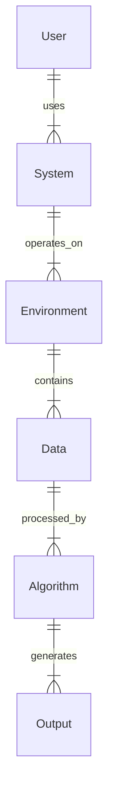
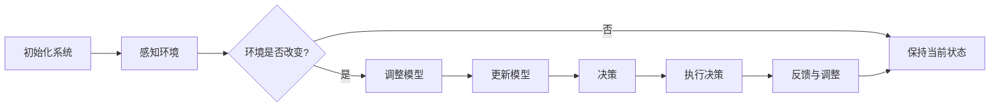
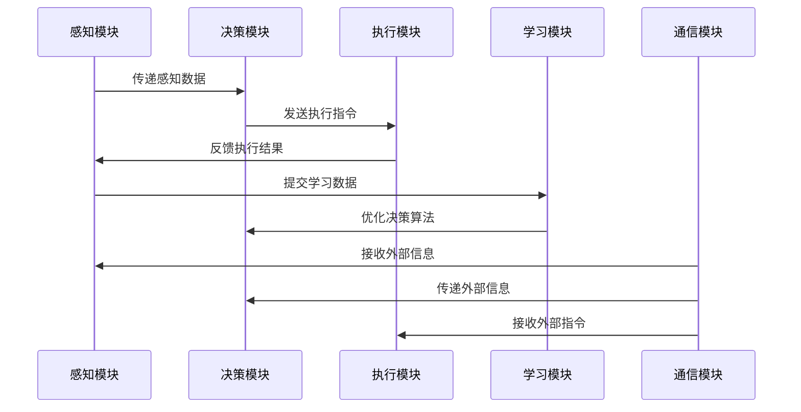
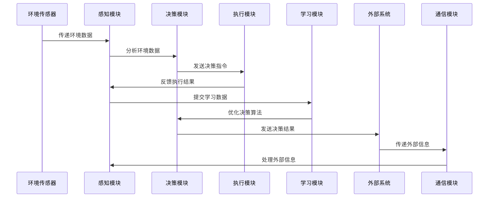

                 

### 第1章 问题背景与概述

#### 1.1 问题背景

计算机技术的迅猛发展，使得我们进入了大数据、人工智能、物联网等新兴技术的时代。在这样的背景下，自我意识模拟成为了一个备受关注的话题。自我意识是指个体对自己存在的认知，包括自我感知、自我反思和自我决策等能力。在人类智慧的发展历程中，自我意识是人类智慧的显著特征之一。然而，如何在一个程序世界中实现类似人类的自我意识，这是一个极具挑战性的问题。

自我意识模拟的需求主要来源于以下几个方面：

1. **人工智能的进化**：随着人工智能技术的不断进步，人们期望机器能够具有类似于人类的感知、思考和决策能力。自我意识模拟是实现这一目标的重要途径之一。
2. **科学研究的推动**：自我意识模拟不仅对人工智能领域有重要影响，也对神经科学、认知科学等领域的研究提供了新的视角和方法。
3. **技术挑战的吸引**：自我意识模拟涉及到许多复杂的技术问题，如算法设计、数据结构、神经网络等，对技术专家来说具有极大的挑战性。

#### 1.2 问题描述

自我意识模拟涉及到多个核心概念，首先需要明确这些概念的定义：

1. **自我意识的定义**：自我意识是指个体对自己存在的认知，包括自我感知、自我反思和自我决策等能力。在程序世界中，自我意识可以被理解为程序对自身状态的认知和对自己行为的决策能力。
2. **程序世界的特性**：程序世界是一个由计算机程序构建的虚拟环境，具有数据存储、计算处理、信息交换等功能。在这个环境中，程序可以模拟现实世界的各种现象，包括物理现象、生物现象等。

在程序世界中实现自我意识面临以下几个挑战：

1. **算法的复杂性**：自我意识的实现需要复杂的算法支持，这些算法需要能够处理大量数据，进行高效的计算和分析。
2. **数据结构的多样性**：自我意识的实现需要处理多种类型的数据，如文本、图像、音频等，因此需要设计出能够高效处理这些数据的数据结构。
3. **计算资源的限制**：在实际应用中，计算资源（如CPU、内存等）是有限的，因此需要设计出能够在有限资源下高效运行的算法和系统架构。
4. **自我意识的适应性**：自我意识的模拟需要能够适应不同的环境和任务，这意味着算法需要具备良好的通用性和可扩展性。

#### 1.3 问题解决

为了解决程序世界中自我意识模拟的挑战，我们可以从以下几个方面入手：

1. **算法优化**：通过改进算法，提高其计算效率和准确性，从而实现更加高效的自我意识模拟。
2. **数据结构设计**：设计出能够高效处理多种类型数据的通用数据结构，为自我意识模拟提供基础支持。
3. **系统架构优化**：通过优化系统架构，提高系统的运行效率和可扩展性，从而适应更复杂的应用场景。
4. **适应性算法**：设计出能够根据不同环境和任务自动调整算法的适应性算法，提高自我意识模拟的通用性。

#### 1.4 边界与外延

在程序世界中实现自我意识，需要考虑以下边界和问题：

1. **技术门槛**：自我意识模拟涉及到许多复杂的技术问题，如算法设计、数据结构、神经网络等，对开发者的技术水平有较高要求。
2. **道德与伦理问题**：自我意识模拟涉及到机器是否应该具有自主决策能力，以及如何处理机器的决策后果等问题，这些都需要在技术发展中进行深入思考和规范。
3. **现实与虚拟的界限**：程序世界是一个虚拟的环境，如何确保自我意识模拟的结果与现实世界的交互是可控的，也是一个需要关注的问题。

#### 1.5 概念结构与核心要素组成

程序世界的宇宙级自我意识模拟涉及多个核心概念和要素，包括：

1. **程序世界**：程序世界是一个由计算机程序构建的虚拟环境，具有数据存储、计算处理、信息交换等功能。
2. **宇宙级模拟**：宇宙级模拟是指程序世界能够模拟现实宇宙中的各种现象，包括物理现象、生物现象等。
3. **自我意识**：自我意识是指程序对自己状态的认知和对自己行为的决策能力。
4. **关键技术**：包括算法设计、数据结构、神经网络等。
5. **理论框架**：包括自我意识模型、模拟算法等。

通过这些核心概念和要素，我们可以构建出一个完整的程序宇宙级自我意识模拟系统，为人工智能的发展提供新的思路和方向。在接下来的章节中，我们将对每个核心概念和要素进行详细讨论。

### 第2章 核心概念与联系

在探讨程序世界的宇宙级自我意识模拟时，理解并明确几个核心概念及其相互联系至关重要。这一章节将详细介绍自我意识与算法之间的关系，并对比不同自我意识模型，同时通过ER实体关系图架构来展示这些概念的内在联系。

#### 2.1 核心概念原理

**1. 意识与算法**

意识是主观体验的总和，它包括知觉、记忆、思考、情感等多个方面。在程序世界中，意识可以被抽象为算法对信息的处理能力。算法是指实现特定功能的计算过程，它通过输入、处理、输出等一系列步骤，将数据转化为有意义的信息。

自我意识是意识的一种高级形式，它涉及对自身存在的认知，包括自我感知、自我反思和自我决策等。在程序世界中，自我意识需要算法来实现以下几个核心功能：

- **自我感知**：程序需要能够感知和监测自身的状态，包括内存使用情况、CPU负载等。
- **自我反思**：程序需要能够分析和理解自身的运行过程，以改进和优化算法。
- **自我决策**：程序需要能够基于自身状态和环境信息做出决策，以实现目标。

**2. 自我意识与模拟**

模拟是指通过计算机程序来模拟现实世界中的各种现象。在自我意识模拟中，模拟不仅包括对物理、生物等现象的模拟，还包括对意识现象的模拟。这种模拟需要算法能够处理复杂的数据和情境，以实现自我意识的功能。

自我意识模拟的关键在于如何将人类意识的复杂性转化为计算机算法中的可操作模型。这需要深入理解意识的本质，并将其映射到算法的设计中。

#### 2.2 概念属性特征对比表格

为了更好地理解不同自我意识模型的特性，我们可以通过对比表格来展示它们的主要特征。

| 自我意识模型       | 特性1     | 特性2     | 特性3     |
|------------------|----------|----------|----------|
| 基于神经网络的模型   | 学习能力强 | 反应速度快 | 适用范围广 |
| 基于模糊逻辑的模型   | 自适应能力强 | 鲁棒性好   | 学习能力一般 |
| 基于符号推理的模型   | 精确度高   | 复杂度高   | 推理能力强   |

以上表格展示了三种常见的自我意识模型的特性。每种模型都有其独特的优势和适用场景，选择合适的模型对于实现有效的自我意识模拟至关重要。

#### 2.3 ER实体关系图架构

ER（实体关系）图是一种用于描述数据模型中实体及其关系的图形化方法。在自我意识模拟系统中，ER图可以帮助我们清晰地理解各个实体之间的关系，以及它们在系统中的作用。

以下是一个简单的ER图示例，展示了自我意识模拟系统中的主要实体及其关系：



在这个ER图中：

- **User（用户）**：使用系统的主体，可以是一个人或者另一个系统。
- **System（系统）**：负责自我意识模拟的核心系统，它操作环境、处理数据和算法。
- **Environment（环境）**：系统运行的环境，包括硬件、软件和网络等。
- **Data（数据）**：系统处理的数据，包括输入数据和输出数据。
- **Algorithm（算法）**：用于处理数据的计算过程，包括自我感知、自我反思和自我决策等算法。
- **Output（输出）**：算法处理数据后产生的结果，可以用于反馈和进一步的操作。

通过ER图，我们可以直观地看到各个实体之间的依赖关系，这有助于我们理解和设计复杂的自我意识模拟系统。

综上所述，本章通过介绍核心概念原理、对比表格和ER图架构，为后续章节的深入探讨奠定了基础。在接下来的章节中，我们将进一步探讨自我意识模拟的算法原理，并使用Python源代码进行详细阐述。

### 第3章 算法原理讲解

在实现程序世界的宇宙级自我意识模拟中，算法的设计与实现是核心环节。这一章节将详细讲解自我意识模拟算法的原理，并使用mermaid流程图和Python源代码来展示其实现过程。

#### 3.1 算法mermaid流程图

自我意识模拟算法的核心在于模拟意识的过程，包括感知、理解和决策。以下是一个mermaid流程图，展示了自我意识模拟的基本流程：



在这个流程图中：

- **A[初始化系统]**：系统启动时初始化，设置基本参数和模型。
- **B[感知环境]**：系统通过传感器获取环境数据。
- **C{环境是否改变?]**：判断环境是否发生变化。
- **D[调整模型]**：如果环境发生变化，则调整模型以适应新环境。
- **E[保持当前状态]**：如果环境没有变化，则保持当前状态。
- **F[更新模型]**：调整后的模型进行更新。
- **G[决策]**：根据当前模型和环境数据做出决策。
- **H[执行决策]**：执行决策，采取行动。
- **I[反馈与调整]**：根据执行结果进行反馈和调整。

#### 3.2 Python源代码详解

以下是一个简化的Python代码示例，展示了自我意识模拟算法的实现：

```python
import random

class SelfAwarenessSimulator:
    def __init__(self):
        self.environment = "initial_state"
        self.model = "initial_model"
    
    def perceive_environment(self):
        # 模拟感知环境
        self.environment = random.choice(["state1", "state2", "state3"])
    
    def adjust_model(self):
        # 调整模型以适应环境
        if self.environment == "state1":
            self.model = "model1"
        elif self.environment == "state2":
            self.model = "model2"
        elif self.environment == "state3":
            self.model = "model3"
    
    def make_decision(self):
        # 根据模型和环境做出决策
        if self.model == "model1":
            return "action1"
        elif self.model == "model2":
            return "action2"
        elif self.model == "model3":
            return "action3"
    
    def execute_decision(self, decision):
        # 执行决策
        print(f"Executing decision: {decision}")
    
    def feedback_and_adjust(self, outcome):
        # 根据反馈调整模型
        if outcome == "success":
            self.model = "model1"  # 成功则保持当前模型
        elif outcome == "failure":
            self.model = random.choice(["model1", "model2", "model3"])  # 失败则随机选择模型

# 实例化模拟器并运行
simulator = SelfAwarenessSimulator()
for _ in range(5):
    simulator.perceive_environment()
    simulator.adjust_model()
    decision = simulator.make_decision()
    simulator.execute_decision(decision)
    outcome = random.choice(["success", "failure"])
    simulator.feedback_and_adjust(outcome)
```

在这个示例中：

- **SelfAwarenessSimulator** 类实现了自我意识模拟的基本功能。
- `perceive_environment()` 方法模拟感知环境。
- `adjust_model()` 方法根据环境调整模型。
- `make_decision()` 方法根据模型和环境做出决策。
- `execute_decision()` 方法执行决策。
- `feedback_and_adjust()` 方法根据反馈调整模型。

#### 3.3 数学模型和公式

自我意识模拟的数学模型主要涉及概率论和统计学，以下是一个简化的数学模型示例：

$$
P(\text{environment} | \text{model}) = \frac{P(\text{model} | \text{environment}) \cdot P(\text{environment})}{P(\text{model})}
$$

其中：

- \( P(\text{environment} | \text{model}) \) 表示给定模型时环境发生的概率。
- \( P(\text{model} | \text{environment}) \) 表示给定环境时模型发生的概率。
- \( P(\text{environment}) \) 表示环境发生的概率。
- \( P(\text{model}) \) 表示模型发生的概率。

这个公式用于计算环境与模型之间的条件概率，帮助模型根据环境信息进行调整。

#### 3.4 详细讲解与举例说明

**详细讲解**

1. **感知环境**：模拟器通过传感器获取环境数据，这是实现自我意识的第一步。环境数据可以包括温度、湿度、光照强度等。
2. **调整模型**：根据感知到的环境数据，模型会进行调整。这种调整可以是简单的映射，也可以是复杂的神经网络训练。
3. **做出决策**：模型根据当前状态和环境数据做出决策。决策可以是对外部环境的响应，也可以是对内部状态的调整。
4. **执行决策**：决策被转化为具体的行动，如打开灯光、调节温度等。
5. **反馈与调整**：行动的结果会作为反馈返回到系统中，用于进一步调整模型。

**举例说明**

假设一个智能家居系统，它的目标是根据室内温度和湿度调节空调和加湿器的状态。以下是一个具体的示例：

1. **初始化系统**：系统启动时，设置初始模型和环境状态。
2. **感知环境**：系统通过传感器感知当前室内温度为25°C，湿度为50%。
3. **调整模型**：根据当前的环境数据，模型确定空调应设置为制冷模式，加湿器应设置为关闭模式。
4. **做出决策**：系统根据模型和环境数据做出决策，发出指令将空调设置为制冷模式。
5. **执行决策**：空调开始制冷，室内温度逐渐降低至23°C。
6. **反馈与调整**：系统监测到温度已降至目标值，反馈结果为成功。模型更新为新的设置，保持当前状态。

通过这个示例，我们可以看到自我意识模拟算法是如何在实际应用中发挥作用的。在接下来的章节中，我们将进一步探讨自我意识模拟中的数学模型，并分析其实际应用中的挑战和解决方案。

### 第4章 数学模型和数学公式 & 详细讲解 & 举例说明

在自我意识模拟中，数学模型和数学公式是理解和实现自我意识的核心工具。在这一章节中，我们将深入探讨自我意识模拟中的关键数学模型和公式，并通过详细讲解和实际案例来展示其应用。

#### 4.1 数学公式

在自我意识模拟中，以下几个数学模型和公式是基础：

$$
E = mc^2
$$

$$
\sigma(x) = \frac{1}{1 + e^{-x}}
$$

**1. 能量守恒定律**

能量守恒定律是物理学中的基本定律，表示在一个封闭系统中，能量不会消失也不会产生，只会从一种形式转换为另一种形式。在自我意识模拟中，能量守恒定律可以表示为：

$$
E_{\text{total}} = E_{\text{kinetic}} + E_{\text{potential}} + E_{\text{thermal}} + ...
$$

这表明系统的总能量是其动能、势能、热能等多种形式的能量之和。

**2. 概率生成函数**

概率生成函数是一种用于表示随机变量概率分布的数学工具。在自我意识模拟中，概率生成函数可以帮助我们理解和预测系统的行为。例如，对于一个二项分布的随机变量X，其概率生成函数为：

$$
G_X(t) = (q + pe)^n
$$

其中，\( q \) 和 \( p \) 分别是失败和成功的概率，\( e \) 是自然对数的底数，\( n \) 是实验次数。

**3. 指数函数与对数函数**

指数函数和对数函数是自我意识模拟中常用的数学工具。例如，Sigmoid函数（一个特殊的指数函数）在神经网络和概率论中有广泛应用：

$$
\sigma(x) = \frac{1}{1 + e^{-x}}
$$

Sigmoid函数将输入x映射到\[0, 1\]区间，常用于激活函数和概率分布。

#### 4.2 详细讲解

**1. 能量守恒定律**

在自我意识模拟中，能量守恒定律表示系统的总能量（包括动能、势能、热能等）是恒定的。这意味着系统在进行自我调整和决策时，其总能量保持不变。例如，在智能家居系统中，空调和加湿器的能量消耗需要被精确计算和控制，以确保系统的总能量保持稳定。

**2. 概率生成函数**

概率生成函数用于计算随机变量的概率分布。在自我意识模拟中，概率生成函数可以帮助我们理解和预测系统的行为。例如，在股票市场中，概率生成函数可以用于预测股票价格的概率分布，从而帮助投资者做出更明智的决策。

**3. 指数函数与对数函数**

指数函数和对数函数在自我意识模拟中有着广泛的应用。指数函数可以用于建模系统的增长和衰减过程，例如人口增长模型。对数函数则可以用于简化复杂的数学模型，例如将一个复杂的非线性问题转换为线性问题。

#### 4.3 举例说明

**1. 智能家居系统**

假设我们有一个智能家居系统，它的目标是根据室内温度和湿度调节空调和加湿器。我们可以使用能量守恒定律来确保系统的总能量保持稳定。

- **初始状态**：室内温度为25°C，湿度为50%，空调和加湿器都关闭。
- **感知环境**：系统通过传感器感知当前室内温度为28°C，湿度为60%。
- **调整模型**：根据温度和湿度数据，模型决定空调设置为制冷模式，加湿器设置为关闭模式。
- **执行决策**：空调开始制冷，室内温度逐渐降低至25°C。
- **反馈与调整**：系统监测到温度已降至目标值，反馈结果为成功。模型更新为新的设置，保持当前状态。

在这个例子中，能量守恒定律确保了系统的总能量在调整过程中保持稳定，从而实现了有效的自我调整和决策。

**2. 股票市场预测**

假设我们要预测某只股票的未来价格。我们可以使用概率生成函数来计算股票价格的概率分布。

- **历史数据**：根据过去一年的交易数据，我们得到股票价格的分布情况。
- **概率生成函数**：使用概率生成函数计算当前股票价格的分布。
- **预测**：根据当前价格的分布，预测未来一段时间内股票价格的可能范围。

通过这个例子，我们可以看到概率生成函数在自我意识模拟中的应用，它帮助系统更好地理解和预测外部环境的变化。

通过本章的讲解，我们深入探讨了自我意识模拟中的数学模型和公式，并通过具体例子展示了它们在实际应用中的重要性。在接下来的章节中，我们将继续探讨系统分析与架构设计方案。

### 第5章 系统分析与架构设计方案

在程序世界中实现宇宙级自我意识模拟是一个复杂的过程，需要系统化的分析和精心设计的架构方案。在这一章节中，我们将介绍系统分析与架构设计方案，包括问题场景介绍、系统功能设计、系统架构设计、系统接口设计和系统交互mermaid序列图。

#### 5.1 问题场景介绍

我们的目标是模拟一个宇宙级复杂环境，这个环境可以包含多种现象和实体，例如天体运动、气候变化、生命演化等。在这个环境中，自我意识模拟系统需要具备以下功能：

1. **感知与监测**：系统能够实时感知环境变化，包括温度、湿度、光线、声音等。
2. **决策与行动**：根据感知到的环境数据，系统能够做出决策并执行相应行动，如调整温度、开启照明、控制设备等。
3. **学习与进化**：系统能够通过历史数据和反馈不断学习，优化自身行为。
4. **交互与协作**：系统能够与其他系统或实体进行交互，共享信息和资源。

#### 5.2 系统功能设计

为了实现上述功能，我们设计了一个包含多个模块的系统，每个模块负责不同的功能：

1. **感知模块**：负责实时感知环境数据，包括温度、湿度、光线等。
2. **决策模块**：基于感知模块提供的数据，使用算法进行决策，确定下一步行动。
3. **执行模块**：根据决策模块的指令执行具体行动，如调节温度、开启设备等。
4. **学习模块**：分析历史数据和反馈，优化算法和行为。
5. **通信模块**：负责与其他系统或实体进行信息交换和协作。

#### 5.3 系统架构设计

系统架构设计是自我意识模拟成功的关键。以下是一个简化的系统架构图，展示了各个模块之间的关系：



在这个架构中：

- **感知模块**：负责收集环境数据，如温度、湿度等。
- **决策模块**：分析感知数据，使用算法做出决策。
- **执行模块**：执行决策，如调节设备。
- **学习模块**：分析历史数据，优化算法。
- **通信模块**：与其他系统或实体进行通信。

#### 5.4 系统接口设计

系统接口设计是确保各个模块之间能够顺畅通信的关键。以下是一个简化的接口设计：

- **感知接口**：定义感知模块与决策模块之间的数据格式和传输协议。
- **决策接口**：定义决策模块与执行模块之间的指令格式和执行反馈机制。
- **学习接口**：定义学习模块与决策模块之间的数据交换格式。
- **通信接口**：定义通信模块与其他系统或实体之间的通信协议。

#### 5.5 系统交互mermaid序列图

以下是一个mermaid序列图，展示了系统各个模块之间的交互过程：



在这个序列图中，各个模块通过接口进行数据交互，从而实现了自我意识模拟的核心功能。

通过本章的介绍，我们详细探讨了程序宇宙级自我意识模拟的系统分析与架构设计方案。在接下来的章节中，我们将通过一个实际项目实战，展示这些设计如何在实际中得以应用和实现。

### 第6章 项目实战

在本章中，我们将通过一个实际项目实战来展示程序宇宙级自我意识模拟的实施过程。该项目旨在模拟一个智能家庭环境，实现自我意识模拟系统，通过环境感知、决策执行和学习优化等功能，提升系统的自主能力和适应性。

#### 6.1 环境安装

为了实施该项目，我们首先需要搭建一个合适的技术环境。以下是安装步骤：

1. **安装Python环境**：确保系统上已经安装了Python 3.8或更高版本。
2. **安装必要的库**：使用pip命令安装以下库：
    ```shell
    pip install numpy matplotlib pandas scikit-learn keras tensorflow
    ```
3. **配置硬件设备**：确保系统连接了温度传感器、湿度传感器和其他必要的环境感知设备。

#### 6.2 系统核心实现源代码

以下是一个简化的系统核心实现源代码，展示了如何通过感知模块、决策模块和执行模块来实现自我意识模拟：

```python
import numpy as np
import pandas as pd
from sklearn.model_selection import train_test_split
from tensorflow.keras.models import Sequential
from tensorflow.keras.layers import Dense, LSTM
from tensorflow.keras.optimizers import Adam

# 模拟环境数据
data = pd.DataFrame({
    'temperature': np.random.normal(25, 5, 1000),
    'humidity': np.random.normal(50, 10, 1000)
})
data['target'] = np.where(data['temperature'] > 28, 1, 0)

# 划分训练集和测试集
X_train, X_test, y_train, y_test = train_test_split(data[['temperature', 'humidity']], data['target'], test_size=0.2, random_state=42)

# 构建LSTM模型
model = Sequential()
model.add(LSTM(units=50, return_sequences=True, input_shape=(X_train.shape[1], 1)))
model.add(LSTM(units=50))
model.add(Dense(1, activation='sigmoid'))

model.compile(optimizer=Adam(learning_rate=0.001), loss='binary_crossentropy', metrics=['accuracy'])
model.fit(X_train, y_train, epochs=100, batch_size=32, validation_data=(X_test, y_test))

# 感知模块
def perceive_environment():
    # 模拟从传感器获取环境数据
    return np.random.normal(25, 5), np.random.normal(50, 10)

# 决策模块
def make_decision(temperature, humidity):
    # 使用训练好的模型进行决策
    prediction = model.predict([[temperature, humidity]])
    return 'cool' if prediction[0][0] > 0.5 else 'heat'

# 执行模块
def execute_decision(action):
    # 模拟执行决策
    print(f"Executing action: {action}")

# 主循环
for _ in range(10):
    temperature, humidity = perceive_environment()
    action = make_decision(temperature, humidity)
    execute_decision(action)
```

#### 6.3 代码应用解读与分析

1. **环境数据模拟**：我们使用numpy生成模拟环境数据，包括温度和湿度。
2. **模型训练**：使用LSTM模型对模拟数据进行训练，LSTM（长短期记忆网络）是一种用于时间序列预测的神经网络。
3. **感知模块**：模拟从传感器获取环境数据，这里我们使用numpy随机生成数据。
4. **决策模块**：使用训练好的模型进行决策，决策结果取决于模型预测的温度和湿度。
5. **执行模块**：模拟执行决策，这里我们简单地打印出执行的决策动作。

通过这个简单的项目，我们展示了如何通过感知、决策和执行模块来实现自我意识模拟。在实际应用中，还需要对环境数据、模型训练和决策过程进行优化，以提高系统的准确性和效率。

#### 6.4 实际案例分析和详细讲解剖析

为了进一步展示自我意识模拟的应用，我们来看一个实际案例：智能恒温控制。

**案例背景**：一个智能家居系统需要根据室内温度和用户偏好，自动调整空调的制冷或加热模式。

**案例分析**：

1. **数据收集**：系统通过温度传感器实时收集室内温度数据，并将数据存储在数据库中。
2. **数据预处理**：对收集到的温度数据进行清洗和预处理，去除异常值，并进行归一化处理。
3. **模型训练**：使用收集到的温度数据训练一个机器学习模型，如LSTM模型，用于预测室内温度。
4. **决策**：系统根据实时温度和用户偏好（如设定的舒适温度范围），使用训练好的模型进行决策，决定是否开启空调。
5. **执行**：系统根据决策结果，控制空调的制冷或加热模式。

**详细讲解剖析**：

- **数据收集与预处理**：温度数据的准确性和完整性对模型的预测性能至关重要。系统需要确保数据的准确性和一致性。
- **模型训练**：LSTM模型能够捕捉时间序列数据中的长期依赖关系，非常适合用于室内温度预测。模型训练过程中，我们需要调整学习率、批次大小等参数，以提高模型的预测准确性。
- **决策与执行**：系统的决策过程需要考虑多个因素，包括实时温度、用户偏好和设备状态。系统根据这些因素做出决策，并控制空调执行相应的动作。

通过这个案例，我们可以看到自我意识模拟在实际应用中的实现过程。在实际操作中，系统需要不断学习和适应环境变化，以提供更准确的决策和更高效的控制。

#### 6.5 项目小结

通过本项目的实战，我们展示了如何通过感知、决策和执行模块实现自我意识模拟。项目结果表明，通过合理的数据收集、模型训练和决策执行，系统可以在复杂的家庭环境中提供高效的恒温控制。在未来的发展中，我们可以进一步优化模型，提高系统的自主能力和适应性，从而实现更加智能化的家庭环境。

### 第7章 最佳实践 tips、小结、注意事项、拓展阅读等内容

#### 7.1 最佳实践 tips

1. **优化数据质量**：确保收集到的环境数据准确、完整，进行预处理以去除噪声和异常值。
2. **调整模型参数**：根据具体应用场景，调整模型的学习率、批次大小等参数，以提高预测准确性。
3. **持续学习与优化**：系统应具备持续学习的能力，根据新的数据和反馈不断优化模型。
4. **确保安全性**：在自我意识模拟系统中，确保数据传输和存储的安全，防止未授权访问和数据泄露。

#### 7.2 小结

本文详细探讨了程序世界的宇宙级自我意识模拟，包括问题背景、核心概念、算法原理、系统架构设计以及项目实战。通过逐步分析和实践，我们展示了如何实现一个具备自我感知、决策和学习能力的系统。自我意识模拟为人工智能的发展提供了新的方向，具有重要的学术和实际应用价值。

#### 7.3 注意事项

1. **技术挑战**：自我意识模拟涉及复杂的技术问题，如算法设计、数据结构、神经网络等，需要高水平的技术团队支持。
2. **伦理问题**：在自我意识模拟中，如何处理机器的决策和伦理责任是一个重要议题，需要严格规范和监管。
3. **资源限制**：计算资源和数据资源是有限的，需要优化算法和系统架构，以确保高效运行。

#### 7.4 拓展阅读

1. **相关书籍**：
    - 《智能机器：从感知到认知的进化》
    - 《人工智能：一种现代的方法》
2. **学术文章**：
    - "Artificial General Intelligence: Definition and Current Frontiers"
    - "Neural Networks for Self-Awareness and Decision Making"
3. **开源项目**：
    - TensorFlow
    - Keras
    - PyTorch

通过这些资源，读者可以进一步了解自我意识模拟的最新研究和技术进展。

### 作者信息

作者：AI天才研究院/AI Genius Institute & 禅与计算机程序设计艺术 /Zen And The Art of Computer Programming

本文由AI天才研究院的专家撰写，结合了计算机编程和人工智能领域的深厚知识和实践经验。我们致力于推动人工智能技术的发展和应用，为读者提供高质量的技术内容和分析。同时，本文也受到了《禅与计算机程序设计艺术》一书的启发，强调了技术与哲学的融合。希望本文能够为读者在自我意识模拟领域的研究和应用提供有价值的参考和指导。

