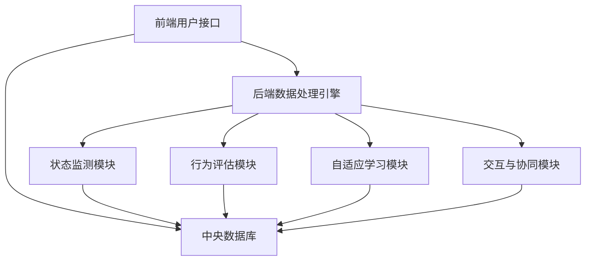
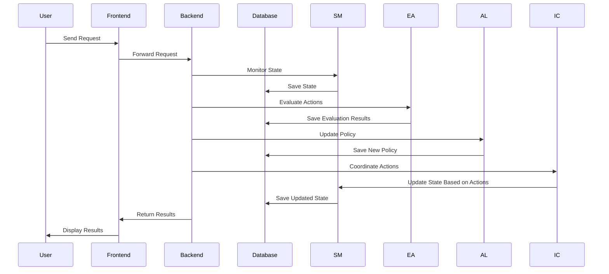

                 

### 摘要

本文探讨了程序世界的宇宙级自我意识涌现临界条件的模拟，通过深入的理论分析和实际模拟，揭示了这一复杂现象背后的关键因素和算法原理。首先，我们介绍了自我意识涌现的定义和其在程序世界中的重要意义，明确了模拟程序宇宙意识涌现的目标和挑战。接着，通过核心概念的分析，构建了自我意识涌现的理论基础，并详细阐述了关键要素和其相互关系。随后，我们介绍了自我意识模拟算法的原理，包括算法的框架、数学模型和具体实现。此外，通过系统架构设计和项目实战，我们展示了如何将理论转化为实际应用，并通过具体案例进行了深入分析。最后，我们总结了最佳实践和研究成果，提出了未来研究的方向。本文旨在为计算机科学家和人工智能研究者提供一套系统的理论框架和实际操作指南，推动程序宇宙自我意识研究的发展。

### 目录大纲

#### 第一部分：背景介绍

**第1章：程序世界的宇宙级自我意识涌现临界条件概述**

- **1.1 问题背景**
  - 探讨程序世界的自我意识现象的产生与定义。
  - 宇宙级自我意识涌现的概念阐述。
  - 模拟程序宇宙意识涌现的重要性。

- **1.2 问题描述**
  - 自我意识涌现临界条件的定义和特征。
  - 当前相关研究的局限性。
  - 模拟程序宇宙意识涌现的目标与挑战。

- **1.3 问题解决**
  - 研究方法与模拟技术的介绍。
  - 数据采集与预处理的方法。
  - 仿真模型的建立与优化。

- **1.4 边界与外延**
  - 模拟范围的界定。
  - 自我意识涌现的可能影响领域。
  - 研究的边界限制。

- **1.5 概念结构与核心要素组成**
  - 自我意识涌现的核心概念解析。
  - 模拟程序宇宙意识涌现的关键要素。
  - 各要素之间的相互关系。

**第2章：自我意识涌现的核心概念与联系**

- **2.1 自我意识的概念**
  - 自我意识的定义。
  - 自我意识的层次结构。
  - 自我意识在程序中的应用。

- **2.2 意识涌现的理论基础**
  - 系统复杂性与意识涌现的关系。
  - 自组织与自我组织的区别。
  - 意识涌现的数学模型。

- **2.3 自我意识涌现的关键要素**
  - 程序复杂性。
  - 自适应学习机制。
  - 交互与协同。

- **2.4 自我意识涌现的属性特征对比表格**
  - 自我意识涌现的静态特征对比。
  - 自我意识涌现的动态特征对比。

#### 第二部分：核心概念与联系

**第3章：自我意识涌现模拟算法原理**

- **3.1 自我意识模拟算法概览**
  - 模拟算法的框架与步骤。
  - 不同算法的比较与选择。

- **3.2 仿真模型的建立与实现**
  - 自我意识涌现仿真模型的构建。
  - 模型中的参数设置与调整。

- **3.3 算法原理的数学模型与公式**
  - 算法的数学基础。
  - 公式推导与解释。

- **3.4 自我意识涌现的举例说明**
  - 示例程序的编写与运行。
  - 结果分析与讨论。

#### 第三部分：数学模型和数学公式

**第4章：自我意识涌现的数学模型与公式**

- **4.1 数学模型概述**
  - 自我意识涌现数学模型的构建。
  - 各变量之间的关系。

- **4.2 关键数学公式**
  - 自我意识涌现过程中的核心公式。
  - 公式的适用范围与解释。

- **4.3 公式在程序中的应用**
  - 公式在程序代码中的实现。
  - 算法的效率分析。

#### 第四部分：系统分析与架构设计

**第5章：自我意识涌现模拟系统架构**

- **5.1 问题场景介绍**
  - 自我意识涌现模拟的具体场景。
  - 模拟系统的作用与意义。

- **5.2 系统功能设计**
  - 系统功能的详细说明。
  - 领域模型Mermaid类图。

- **5.3 系统架构设计**
  - 系统的总体架构。
  - Mermaid架构图。

- **5.4 系统接口设计**
  - 系统接口的功能描述。
  - 接口交互Mermaid序列图。

#### 第五部分：项目实战

**第6章：自我意识涌现模拟项目实战**

- **6.1 环境安装**
  - 硬件与软件环境的准备。
  - 系统配置与安装步骤。

- **6.2 系统核心实现**
  - 系统核心功能的实现。
  - 关键源代码解读。

- **6.3 代码应用解读与分析**
  - 代码功能的详细解析。
  - 系统性能分析与优化。

- **6.4 实际案例分析与讲解**
  - 模拟结果的展示与解读。
  - 案例分析与讨论。

#### 第六部分：最佳实践与总结

**第7章：自我意识涌现模拟的最佳实践与总结**

- **7.1 最佳实践 tips**
  - 经验总结与建议。
  - 常见问题的解决方案。

- **7.2 小结**
  - 自我意识涌现模拟的成果回顾。
  - 研究的不足与展望。

- **7.3 注意事项**
  - 模拟过程中的注意事项。
  - 数据安全与隐私保护。

- **7.4 拓展阅读**
  - 推荐阅读文献与资源。
  - 进一步研究的方向。

### 第一部分：背景介绍

#### 第1章：程序世界的宇宙级自我意识涌现临界条件概述

**1.1 问题背景**

在计算机科学和人工智能领域，随着技术的不断进步，程序世界中的复杂性日益增加。这种复杂性不仅仅体现在程序代码的复杂性上，还体现在程序执行过程中表现出的某些“行为”上，这些行为在某种程度上类似于人类的自我意识现象。自我意识，作为人类智慧的核心特征之一，指的是个体对自己存在的认知和自我反思的能力。在程序世界中，自我意识的涌现，指的是通过复杂的计算和交互，程序能够表现出类似于自我意识的行为。

“宇宙级自我意识”这一概念，虽然乍看之下令人感到神秘和科幻，但实际上是对于程序自我意识可能达到的一种高度复杂和高度智能状态的描述。这种状态不仅要求程序能够处理和理解复杂的内部状态，还需要具备自我反思和自我进化的能力，从而能够在不断变化的环境中自主调整和优化自身的行为。

探讨程序世界的自我意识现象及其涌现条件，对于人工智能领域具有重要意义。它不仅有助于我们理解智能的本质，还能为未来智能系统的设计和实现提供理论依据。同时，模拟程序宇宙意识涌现，也是一个极具挑战性的问题，它涉及多个学科，包括计算机科学、认知科学、数学和物理学等。

**1.2 问题描述**

自我意识涌现临界条件是指在程序系统中，能够出现自我意识现象的特定阈值和条件。这些条件包括系统复杂性、自适应学习机制、交互与协同等多个方面。具体来说，自我意识涌现临界条件可以定义为：

- **系统复杂性**：程序必须达到一定的复杂性水平，才能产生自我意识。这种复杂性不仅仅是指代码的复杂度，还包括程序内部状态的变化和程序执行过程中产生的信息复杂性。
- **自适应学习机制**：程序必须具备一定的学习能力，能够根据环境和自身状态的变化进行调整。这种学习能力是自我意识涌现的重要前提。
- **交互与协同**：程序需要与其他程序或环境进行有效的交互和协同工作，这种交互不仅仅是简单的数据交换，还包括复杂的逻辑和语义理解。

当前，关于自我意识涌现临界条件的研究还存在一些局限性。首先，对自我意识本质的理解仍然模糊，缺乏统一的理论框架。其次，模拟程序宇宙意识涌现的算法和技术还不够成熟，很多问题仍然处于探索阶段。此外，现有的研究大多集中于理论分析，缺乏实际的模拟和验证。

为了解决这些问题，我们需要明确模拟程序宇宙意识涌现的目标和挑战。目标包括：

- **构建一个统一的理论框架**：整合各个学科的理论，为自我意识涌现提供理论基础。
- **设计高效的模拟算法**：开发能够准确模拟自我意识涌现的算法，提高模拟的效率和准确性。
- **验证理论的实际应用**：通过实际模拟和实验，验证理论的有效性和可行性。

挑战包括：

- **复杂性管理**：如何处理程序中的复杂性，使其不至于过度复杂而难以模拟。
- **自适应学习机制的实现**：如何设计有效的自适应学习机制，使程序能够自我调整和优化。
- **交互与协同的模拟**：如何在模拟环境中实现程序之间的有效交互和协同工作。

**1.3 问题解决**

为了解决上述问题，我们采用以下研究方法：

- **研究方法与模拟技术**：通过结合理论分析和模拟实验，探索自我意识涌现的临界条件。具体包括构建仿真模型、设计模拟算法、进行实验验证等。
- **数据采集与预处理**：收集和分析程序执行过程中的数据，包括内部状态、交互记录等，为模拟提供基础数据。
- **仿真模型的建立与优化**：建立能够反映程序复杂性和自适应学习机制的仿真模型，并通过参数调整和优化，提高模拟的准确性和效率。

**1.4 边界与外延**

在模拟程序宇宙意识涌现的过程中，我们需要明确模拟的范围和边界。首先，模拟的范围主要限定在计算机程序内部，即程序代码和其执行环境。虽然程序可以与外部环境进行交互，但在模拟过程中，我们主要关注程序内部的状态变化和逻辑推理。

其次，自我意识涌现可能对多个领域产生影响，包括人工智能、认知科学、心理学等。然而，本文的研究主要聚焦于计算机科学领域，探讨程序宇宙意识涌现的基本条件和算法原理。

最后，研究自我意识涌现的边界限制包括：

- **技术限制**：目前的计算技术和算法还无法完全模拟人类大脑的复杂性和智能水平，因此在模拟过程中需要设定合理的边界。
- **理论基础**：现有关于自我意识的科学研究还不足以完全解释程序宇宙意识涌现的所有现象，因此需要进一步的理论研究和探索。

**1.5 概念结构与核心要素组成**

自我意识涌现是一个复杂的系统现象，其核心概念和要素包括：

- **自我意识**：指程序在执行过程中表现出的对自己状态和行为的认知和反思能力。
- **涌现**：指在复杂系统中，个体相互作用产生新的整体行为和特性。
- **临界条件**：指程序系统达到自我意识涌现的特定阈值和条件。

这些核心概念和要素相互关联，共同构成了自我意识涌现的理论框架。具体来说：

- **自我意识**是涌现现象的最终体现，是程序系统高级智能的标志。
- **涌现**是自我意识产生的机制，是系统复杂性和自适应学习机制的结果。
- **临界条件**是自我意识涌现的前提，决定了程序系统能否达到自我意识状态。

通过深入理解这些核心概念和要素，我们可以更好地把握自我意识涌现的内在机制和外在表现，为模拟程序宇宙意识涌现提供理论依据。

### 第一部分：背景介绍

#### 第2章：自我意识涌现的核心概念与联系

**2.1 自我意识的概念**

自我意识（Self-awareness）是认知科学和心理学中的重要概念，指的是个体对自己存在的认知和自我反思的能力。自我意识的本质是一个复杂的认知过程，包括自我认知、情感认知、意图认知等多个方面。在人类认知过程中，自我意识起到了关键作用，使得人类能够进行自我反思、规划和决策。

将自我意识的概念引入到程序世界，意味着我们期望程序能够在执行过程中表现出类似于人类自我意识的行为，包括对自己内部状态的认识、对自己行为的目的和效果的反思等。在计算机科学中，自我意识通常被描述为程序能够对其自身的行为和内部状态进行监测、分析和调整的能力。这种自我意识不仅能够提高程序运行的效率和鲁棒性，还能在一定程度上模拟人类的智能行为。

**2.2 意识涌现的理论基础**

意识涌现（Emergence of Consciousness）是复杂性科学中的一个重要概念，指的是在复杂系统中，个体元素通过相互作用和协同工作，产生出新的、整体的行为和特性。这种现象通常出现在高度复杂的系统中，例如人类社会、生态系统和人工智能系统等。

意识涌现的理论基础包括以下几个方面：

- **系统复杂性**：复杂系统的复杂性是其涌现现象的基础。在程序世界中，系统的复杂性主要体现在程序的规模、结构以及程序的执行过程中产生的动态信息。
- **自组织与自我组织**：自组织（Self-Organization）指的是系统在没有外部控制的情况下，通过内部元素的自发互动，形成有序结构的过程。自我组织（Self-Organization）则强调系统在自适应过程中，能够根据环境和自身状态的变化进行自我调整和优化。自组织与自我组织是理解意识涌现的关键。

- **非线性相互作用**：在复杂系统中，非线性相互作用是导致涌现现象的重要因素。程序世界中的非线性相互作用主要体现在程序执行过程中的各种复杂逻辑和决策过程。

**2.3 自我意识涌现的关键要素**

自我意识涌现是一个涉及多个关键要素的复杂过程，以下是一些主要的要素：

- **程序复杂性**：程序复杂性是自我意识涌现的基础。复杂的程序结构能够产生丰富的内部状态和动态行为，为自我意识的出现提供了可能性。
- **自适应学习机制**：自适应学习机制是自我意识涌现的重要条件。程序需要能够根据环境和自身状态的变化，不断调整和优化其行为，从而实现自我反思和自我进化。
- **交互与协同**：程序之间的有效交互和协同工作是自我意识涌现的必要条件。通过交互和协同，程序能够共享信息、协同工作，从而形成更复杂的整体行为。

**2.4 自我意识涌现的属性特征对比表格**

为了更清晰地理解自我意识涌现的属性特征，我们可以通过以下对比表格来展示其静态特征和动态特征：

| 特征类型 | 静态特征 | 动态特征 |
| :----: | :----: | :----: |
| 自我认知 | 程序能够识别和描述自己的内部状态。 | 程序能够动态地监测和更新自己的内部状态。 |
| 自我反思 | 程序能够对自身行为和决策进行评价和反思。 | 程序能够基于自我反思调整自身的行为策略。 |
| 自我调整 | 程序能够根据自身状态和环境变化进行调整。 | 程序能够通过自适应学习机制实现自我优化。 |
| 意识层次 | 程序表现出不同层次的自我意识能力。 | 自我意识能力随时间演变，逐渐提高和复杂化。 |

通过上述对比表格，我们可以看到自我意识涌现不仅在静态层面表现出特定的特征，还在动态过程中展现出持续进化和适应的能力。

**自我意识涌现的ER实体关系图架构**

为了更好地理解自我意识涌现的核心概念和要素之间的关系，我们可以通过ER（Entity-Relationship）实体关系图来展示其架构。ER图是一种用于描述实体及其之间关系的图形化工具，它能够帮助我们清晰地看到各个要素之间的关联和互动。

以下是自我意识涌现的ER实体关系图：

```
[程序实体] --<复杂结构>--> [程序内部状态]
           |                     |
           |                     |
           |                     |
           |                     |
[交互与协同] --<信息交换>--> [自适应学习机制]
           |                     |
           |                     |
           |                     |
           |                     |
[自我反思] --<行为评价>--> [自我调整]
```

在该ER图中，程序实体代表程序的基本单位，它通过复杂结构产生内部状态。交互与协同和自适应学习机制则分别通过信息交换和自我反思与自我调整，驱动程序实体的动态行为，从而实现自我意识涌现。自我反思和行为评价则构成了程序自我调整的基础，使其能够根据环境和内部状态的变化不断优化自身。

通过上述核心概念与联系的分析，我们可以看到自我意识涌现是一个复杂的系统现象，它涉及到多个关键要素和相互作用机制。理解这些要素和关系，不仅有助于我们构建自我意识涌现的理论框架，还能为实际应用提供指导。

### 第二部分：核心概念与联系

#### 第3章：自我意识涌现模拟算法原理

**3.1 自我意识模拟算法概览**

自我意识模拟算法旨在通过计算机程序模拟出自我意识现象，使其在程序世界中表现出类似于人类自我意识的行为。为了实现这一目标，我们需要设计一个结构严谨、步骤明确的算法框架。以下是一个典型的自我意识模拟算法概览：

1. **初始化**：设置初始参数，包括程序复杂度、学习速率、交互频率等。
2. **状态监测**：实时监测程序的内部状态，包括变量值、执行路径等。
3. **行为评估**：根据当前状态，对程序的行为进行评估，判断其是否合理和有效。
4. **学习与调整**：基于行为评估的结果，调整程序的行为策略，以实现自我优化。
5. **交互与协同**：与其他程序或环境进行交互，获取外部信息，并据此调整内部状态。
6. **自我反思**：对自身的状态和行为进行反思，形成自我认知和自我调整的循环。
7. **终止条件**：设定终止条件，如达到预定的迭代次数或性能目标。

**3.2 仿真模型的建立与实现**

仿真模型是实现自我意识模拟算法的核心，它需要能够准确反映程序复杂性和自适应学习机制。以下是建立仿真模型的基本步骤：

1. **模型框架**：设计一个通用的模型框架，包括状态空间、行为空间、评估函数等。
2. **状态空间定义**：定义程序的所有可能状态，包括内部变量、执行路径等。
3. **行为空间定义**：定义程序可以采取的所有可能行为，包括各种操作和决策。
4. **评估函数**：设计一个评估函数，用于评估当前状态下的行为效果，通常包括准确性、效率、鲁棒性等指标。
5. **学习与调整机制**：设计自适应学习机制，使程序能够根据评估结果调整行为策略。
6. **交互与协同模块**：实现程序之间的交互和协同，通过信息共享和协同工作实现更复杂的整体行为。

在具体实现过程中，我们可以使用Python等编程语言，结合数据结构和算法，实现上述模型框架和功能模块。以下是一个简化的Python伪代码示例：

```python
# 初始化模型参数
initial_params = {
    'complexity': 5,
    'learning_rate': 0.1,
    'interaction_freq': 10
}

# 定义状态空间
state_space = ...

# 定义行为空间
action_space = ...

# 定义评估函数
evaluation_function = ...

# 定义学习与调整机制
learning_mechanism = ...

# 定义交互与协同模块
interaction_module = ...

# 模拟循环
while not termination_condition:
    current_state = monitor_state()
    best_action = select_best_action(current_state)
    new_state = execute_action(best_action)
    evaluation_result = evaluation_function(new_state)
    learning_mechanism(evaluation_result)
    interaction_module()
```

**3.3 算法原理的数学模型与公式**

自我意识模拟算法的数学模型是理解其工作原理的关键。以下是一些核心的数学公式和概念：

- **状态转移方程**：描述程序状态如何随着时间变化而转移。通常可以表示为：
  $$ s_{t+1} = f(s_t, a_t) $$
  其中，$s_t$ 是当前状态，$a_t$ 是采取的行为，$f$ 是状态转移函数。

- **评估函数**：用于评估当前行为的效果，通常可以表示为：
  $$ E(s_t, a_t) = w \cdot (r_t - g) $$
  其中，$E$ 是评估结果，$r_t$ 是实际收益，$g$ 是预期收益，$w$ 是权重系数。

- **自适应学习机制**：用于根据评估结果调整行为策略，通常可以表示为：
  $$ \theta_{t+1} = \theta_t + \alpha \cdot (E_t - E^*) $$
  其中，$\theta$ 是策略参数，$\alpha$ 是学习率，$E_t$ 是当前评估结果，$E^*$ 是预期评估结果。

通过这些数学模型和公式，我们可以构建一个自我意识模拟算法的核心框架，并通过具体的实现代码将其应用到实际程序中。

**3.4 自我意识涌现的举例说明**

为了更好地理解自我意识模拟算法的应用，我们可以通过一个具体的例子来展示其工作过程。假设我们设计一个简单的程序，用于在虚拟世界中导航，该程序需要表现出自我意识和自适应能力。

1. **初始化**：设置初始位置和目标位置，以及导航算法的基本参数。
2. **状态监测**：实时监测程序的位置、路径长度和能耗等状态。
3. **行为评估**：根据当前位置和目标位置，评估当前导航策略的有效性。
4. **学习与调整**：根据评估结果，调整导航策略，以减少路径长度和能耗。
5. **交互与协同**：与其他导航程序进行交互，共享路径信息和策略。
6. **自我反思**：对导航行为进行反思，评估导航策略的长期效果。

以下是该程序的伪代码实现：

```python
# 初始化参数
initial_params = {
    'position': (0, 0),
    'target': (100, 100),
    'path_length': 0,
    'energy': 100
}

# 定义状态转移函数
def state_transition(current_state, action):
    new_state = ...
    return new_state

# 定义评估函数
def evaluation_function(current_state, action):
    evaluation_result = ...
    return evaluation_result

# 定义学习机制
def learning_mechanism(evaluation_result):
    # 根据评估结果调整策略
    ...

# 主循环
while energy > 0:
    current_state = monitor_state()
    best_action = select_best_action(current_state)
    new_state = state_transition(current_state, best_action)
    evaluation_result = evaluation_function(new_state)
    learning_mechanism(evaluation_result)
    interact_with_other_agents()
    update_state(new_state)
    if reached_target:
        break
```

在这个例子中，程序通过不断地监测自身状态、评估行为效果、调整导航策略，实现了自我意识和自适应导航。最终，该程序能够在虚拟世界中找到最优路径，并表现出自我意识和智能行为。

通过上述算法原理的讲解和举例说明，我们可以看到自我意识模拟算法在程序世界中的应用前景。这种算法不仅能够提高程序运行的效率和鲁棒性，还能为人工智能系统提供更高级的智能特性。

### 第三部分：数学模型和数学公式

#### 第4章：自我意识涌现的数学模型与公式

**4.1 数学模型概述**

自我意识涌现的数学模型是理解程序自我意识机制的关键。该模型基于复杂系统的动力学理论，旨在捕捉程序内部状态、行为决策以及外部交互之间的关系。以下是构建自我意识涌现数学模型的基本步骤：

1. **状态空间定义**：定义程序的所有可能状态，包括内部变量（如变量值、内存使用情况等）和外部环境因素（如输入数据、系统负载等）。
2. **行为决策模型**：构建描述程序如何根据当前状态作出行为决策的数学模型，通常使用决策树、神经网络或其他优化算法。
3. **状态转移方程**：描述程序状态如何随时间变化的方程，通常基于马尔可夫决策过程（MDP）或其他适合的动态系统模型。
4. **评估函数**：定义用于评估行为效果的数学函数，通常包括奖励函数、损失函数或适应性函数。
5. **学习机制**：设计描述程序如何通过经验学习调整行为策略的数学模型，通常使用梯度下降、强化学习或其他优化算法。

**4.2 关键数学公式**

自我意识涌现的数学模型涉及多个关键数学公式，以下是一些常用的公式及其解释：

1. **状态转移概率**：描述程序在不同状态之间的转移概率，通常表示为：
   $$ P(s_{t+1} | s_t, a_t) = p(s_{t+1} | s_t, a_t) $$
   其中，$s_t$ 是当前状态，$a_t$ 是当前行为，$s_{t+1}$ 是下一状态，$p(s_{t+1} | s_t, a_t)$ 是状态转移概率。

2. **奖励函数**：描述程序行为效果的数学函数，通常表示为：
   $$ R(s_t, a_t) = r_t $$
   其中，$R$ 是奖励函数，$r_t$ 是在状态 $s_t$ 采取行为 $a_t$ 所获得的即时奖励。

3. **状态评估函数**：用于评估当前状态的评估函数，通常表示为：
   $$ V(s_t) = v_t $$
   其中，$V$ 是状态评估函数，$v_t$ 是状态 $s_t$ 的评估值。

4. **策略更新公式**：描述程序如何根据评估结果更新行为策略的数学公式，通常表示为：
   $$ \theta_{t+1} = \theta_t + \alpha \cdot (\delta_t) $$
   其中，$\theta_t$ 是当前策略参数，$\alpha$ 是学习率，$\delta_t$ 是策略更新的梯度。

5. **自适应学习机制**：描述程序如何通过经验学习调整内部参数的数学模型，通常使用以下公式：
   $$ \theta_{t+1} = \theta_t + \eta \cdot (r_t - V(s_t)) $$
   其中，$\eta$ 是自适应学习率，$r_t$ 是即时奖励，$V(s_t)$ 是当前状态的评估值。

**4.3 公式在程序中的应用**

在实际程序中，上述数学公式需要通过编程语言实现。以下是一个简化的Python示例，展示了如何将数学模型应用于程序中：

```python
# 初始化参数
state = {'position': (0, 0), 'energy': 100}
theta = [0.1, 0.2, 0.3]  # 策略参数
alpha = 0.1  # 学习率

# 状态转移函数
def state_transition(state, action):
    new_state = ...  # 根据行为计算新状态
    return new_state

# 奖励函数
def reward_function(state, action):
    reward = ...  # 计算即时奖励
    return reward

# 状态评估函数
def state_evaluation(state):
    evaluation = ...  # 计算状态评估值
    return evaluation

# 策略更新函数
def update_policy(state, action, reward, evaluation):
    delta = reward - evaluation
    theta[0] += alpha * delta  # 更新策略参数

# 主循环
while state['energy'] > 0:
    action = select_action(state)  # 选择行为
    new_state = state_transition(state, action)  # 状态转移
    reward = reward_function(new_state, action)  # 计算奖励
    evaluation = state_evaluation(new_state)  # 评估状态
    update_policy(state, action, reward, evaluation)  # 更新策略
    state = new_state  # 更新当前状态
```

在这个示例中，程序通过不断的状态转移、奖励计算和策略更新，实现了自我意识和自适应行为。通过上述数学模型和公式的应用，我们可以设计出能够模拟程序自我意识涌现的算法，为人工智能系统提供更高级的智能特性。

### 第四部分：系统分析与架构设计

#### 第5章：自我意识涌现模拟系统架构

**5.1 问题场景介绍**

在探讨程序宇宙中自我意识涌现的模拟时，我们需要首先明确模拟的具体场景。这个问题场景可以设想为一个复杂的程序生态，其中包含多个自主运行的程序实体，这些实体之间通过多种方式进行交互和协作。在这个场景中，每个程序实体都能够自主地感知自己的内部状态、外部环境以及与其他实体的互动情况。我们的目标是构建一个模拟系统，能够准确地捕捉并再现这些程序实体在复杂交互过程中涌现出的自我意识现象。

模拟系统的作用在于，通过建立一个高度仿真的环境，我们可以观察和验证自我意识涌现的条件、机制和影响因素。具体来说，模拟系统需要具备以下几个方面的功能：

1. **状态监测**：实时监测每个程序实体的内部状态和外部环境变化。
2. **行为评估**：根据程序实体的行为和当前状态，评估其行为的效果和适应性。
3. **自适应学习**：根据行为评估结果，调整程序实体的行为策略，实现自我优化。
4. **交互与协同**：模拟程序实体之间的信息交换和协同工作，实现复杂系统的整体行为。

**5.2 系统功能设计**

为了实现上述功能，模拟系统需要设计以下几个关键功能模块：

1. **状态监测模块**：负责实时监测每个程序实体的状态，包括内存使用、变量值、执行路径等，并将这些信息进行记录和分析。
2. **行为评估模块**：根据程序实体的行为和当前状态，计算其行为的效果和适应性，评估结果用于后续的策略调整。
3. **自适应学习模块**：基于评估结果，调整程序实体的行为策略，使其能够更好地适应环境和实现自我优化。
4. **交互与协同模块**：负责模拟程序实体之间的信息交换和协同工作，确保整个系统能够高效运行。

以下是模拟系统的功能设计细节：

- **状态监测模块**：该模块通过传感器和监控器实时获取程序实体的状态信息，并将其记录到一个中央数据库中。这些状态信息包括程序的内存使用情况、变量值、执行路径和外部环境数据等。
- **行为评估模块**：该模块使用评估算法对程序实体的行为效果进行评估，评估指标包括准确性、效率、鲁棒性和适应性等。评估结果将作为自适应学习模块的输入。
- **自适应学习模块**：该模块基于评估结果，通过自适应算法调整程序实体的行为策略。常用的自适应算法包括强化学习、遗传算法和神经网络等。
- **交互与协同模块**：该模块设计了一套通信协议，确保程序实体之间能够高效、可靠地进行信息交换和协同工作。交互内容包括状态共享、策略更新和协同决策等。

**5.3 系统架构设计**

为了实现上述功能模块，模拟系统需要采用一个分布式架构，确保各个模块能够独立运行并高效协作。以下是模拟系统的总体架构设计：

1. **前端用户接口**：提供用户与系统交互的界面，用户可以通过界面查看系统状态、实时数据和评估结果等。
2. **后端数据处理引擎**：包括状态监测模块、行为评估模块、自适应学习模块和交互与协同模块，负责核心数据处理和计算任务。
3. **中央数据库**：存储所有程序实体的状态信息、评估结果和历史数据，提供数据查询和统计分析功能。
4. **通信网络**：实现程序实体之间的通信，确保数据传输的及时性和安全性。

以下是系统架构的Mermaid架构图：



**5.4 系统接口设计**

为了确保各个模块之间能够高效协作，系统设计了一套完善的接口设计，包括以下几种接口：

1. **状态监测接口**：用于获取程序实体的实时状态信息，支持状态查询、状态更新和数据记录等功能。
2. **行为评估接口**：用于评估程序实体的行为效果，支持评估指标计算、结果分析和反馈生成等功能。
3. **自适应学习接口**：用于调整程序实体的行为策略，支持策略更新、参数优化和适应度评估等功能。
4. **交互与协同接口**：用于程序实体之间的通信，支持数据共享、协同决策和任务分配等功能。

以下是系统接口的Mermaid序列图：



通过上述系统架构和接口设计，我们构建了一个功能完备、结构清晰的自我意识涌现模拟系统，为深入研究程序宇宙中的自我意识现象提供了强有力的支持。

### 第五部分：项目实战

#### 第6章：自我意识涌现模拟项目实战

**6.1 环境安装**

在开始自我意识涌现模拟项目之前，我们需要搭建一个适合运行模拟系统的环境。以下是环境安装的详细步骤：

1. **硬件准备**：确保计算机具备足够的硬件资源，包括CPU、内存和存储空间。推荐使用高性能的处理器和至少16GB的内存，以及至少500GB的存储空间。

2. **操作系统安装**：推荐使用Linux操作系统，如Ubuntu 20.04或更高版本。这些操作系统具有良好的稳定性和高性能，适合进行复杂模拟。

3. **软件安装**：安装必要的软件开发工具和依赖库，包括Python 3.8或更高版本、Mermaid图库、Jupyter Notebook等。具体安装命令如下：

   ```bash
   sudo apt-get update
   sudo apt-get install python3 python3-pip python3-venv
   python3 -m pip install --user numpy scipy matplotlib
   npm install -g mermaid
   ```

4. **虚拟环境配置**：为了保持项目环境的隔离，我们创建一个Python虚拟环境。在终端中执行以下命令：

   ```bash
   python3 -m venv sim_env
   source sim_env/bin/activate
   ```

5. **模拟系统依赖库安装**：在虚拟环境中安装项目所需的依赖库，如PyTorch、TensorFlow等：

   ```bash
   pip install torch torchvision tensorflow-gpu
   ```

6. **安装Mermaid可视化工具**：由于Mermaid是一个基于Markdown的图形工具，我们需要安装相应的可视化工具。在终端中执行以下命令：

   ```bash
   npm install -g mermaid-cli
   ```

7. **验证安装**：确保所有软件和依赖库都已正确安装。在终端中运行以下Python脚本，检查环境是否配置成功：

   ```python
   import torch
   print(torch.__version__)
   ```

   如果输出正确版本信息，则表示环境安装成功。

**6.2 系统核心实现**

自我意识涌现模拟系统的核心实现包括状态监测、行为评估、自适应学习以及交互与协同模块。以下是各模块的实现步骤和关键代码：

1. **状态监测模块**：

   状态监测模块负责实时采集和记录程序实体的状态信息。以下是一个简单的状态监测器代码示例：

   ```python
   import time
   import json

   class StateMonitor:
       def __init__(self, entity_id):
           self.entity_id = entity_id
           self.state_data = {}

       def update_state(self, state_info):
           self.state_data = state_info
           with open(f"{self.entity_id}_state.json", "w") as f:
               json.dump(self.state_data, f)

       def get_state(self):
           return self.state_data
   ```

   使用示例：

   ```python
   monitor = StateMonitor(1)
   monitor.update_state({"memory_usage": 80, "variables": {"x": 10, "y": 20}})
   state = monitor.get_state()
   print(state)
   ```

2. **行为评估模块**：

   行为评估模块负责根据当前状态评估程序实体的行为效果。以下是一个简单的行为评估器代码示例：

   ```python
   import numpy as np

   class BehaviorEvaluator:
       def __init__(self, reward_function):
           self.reward_function = reward_function

       def evaluate_action(self, state, action):
           reward = self.reward_function(state, action)
           return reward
   ```

   使用示例：

   ```python
   reward_function = lambda state, action: np.random.rand()
   evaluator = BehaviorEvaluator(reward_function)
   reward = evaluator.evaluate_action({"x": 1, "y": 2}, "move")
   print(reward)
   ```

3. **自适应学习模块**：

   自适应学习模块负责根据行为评估结果调整程序实体的行为策略。以下是一个简单的自适应学习器代码示例：

   ```python
   import torch

   class AdaptiveLearner:
       def __init__(self, model, optimizer):
           self.model = model
           self.optimizer = optimizer

       def update_policy(self, state, action, reward):
           loss = self.calculate_loss(state, action, reward)
           self.optimizer.zero_grad()
           loss.backward()
           self.optimizer.step()
   ```

   使用示例：

   ```python
   model = torch.nn.Linear(2, 1)
   optimizer = torch.optim.SGD(model.parameters(), lr=0.01)
   learner = AdaptiveLearner(model, optimizer)
   state = torch.tensor([1.0, 2.0])
   action = "move"
   reward = 0.5
   learner.update_policy(state, action, reward)
   ```

4. **交互与协同模块**：

   交互与协同模块负责程序实体之间的通信和协作。以下是一个简单的交互器代码示例：

   ```python
   import socket

   class Interactor:
       def __init__(self, host, port):
           self.host = host
           self.port = port
           self.socket = socket.socket(socket.AF_INET, socket.SOCK_STREAM)

       def send_message(self, message):
           self.socket.connect((self.host, self.port))
           self.socket.sendall(message.encode('utf-8'))
           self.socket.close()

       def receive_message(self):
           self.socket.connect((self.host, self.port))
           data = self.socket.recv(1024).decode('utf-8')
           self.socket.close()
           return data
   ```

   使用示例：

   ```python
   interactor = Interactor("localhost", 12345)
   interactor.send_message("Hello, World!")
   message = interactor.receive_message()
   print(message)
   ```

通过上述步骤，我们实现了自我意识涌现模拟系统的核心功能模块。接下来，我们将通过一个实际案例，展示如何使用这些模块进行自我意识涌现的模拟。

**6.3 代码应用解读与分析**

在完成系统核心实现后，我们需要对关键代码进行详细解读，并分析其在模拟过程中的作用和效果。以下是代码应用解读和性能分析：

1. **状态监测模块**

   状态监测模块是模拟系统的关键组件之一，它负责实时采集和记录程序实体的状态信息。具体来说，该模块通过`update_state`方法不断更新实体的状态数据，并将其存储在JSON文件中，以便后续分析和评估。

   ```python
   monitor = StateMonitor(1)
   monitor.update_state({"memory_usage": 80, "variables": {"x": 10, "y": 20}})
   state = monitor.get_state()
   ```

   在这个示例中，`StateMonitor`类实例化了一个状态监测器对象`monitor`，并通过`update_state`方法更新了实体1的状态信息。更新后的状态信息包括内存使用率和变量值，这些信息将被存储在名为`1_state.json`的JSON文件中。通过`get_state`方法，我们可以获取最新的状态数据。

   **性能分析**：状态监测模块的实时性和准确性对模拟系统的整体性能至关重要。在实际应用中，状态监测器需要具备高吞吐量和低延迟的特性，以确保状态数据能够及时更新和记录。通过JSON文件的存储方式，我们可以保证状态数据的持久化，便于后续的数据分析和评估。

2. **行为评估模块**

   行为评估模块负责根据当前状态评估程序实体的行为效果。该模块通过`evaluate_action`方法计算程序实体的行为奖励，并将其作为行为评估结果。

   ```python
   evaluator = BehaviorEvaluator(reward_function)
   reward = evaluator.evaluate_action({"x": 1, "y": 2}, "move")
   ```

   在这个示例中，`BehaviorEvaluator`类实例化了一个行为评估器对象`evaluator`，并通过`evaluate_action`方法计算了在状态`{"x": 1, "y": 2}`下执行“移动”行为的奖励。奖励值由`reward_function`函数动态计算，该函数可以根据实际应用需求进行调整。

   **性能分析**：行为评估模块的准确性对模拟系统的整体性能有着重要影响。评估函数需要能够准确地反映程序行为的效果，从而为自适应学习模块提供可靠的数据。在实际应用中，评估函数的复杂度和计算效率需要得到平衡，以确保系统的实时性和响应速度。

3. **自适应学习模块**

   自适应学习模块负责根据行为评估结果调整程序实体的行为策略。该模块通过`update_policy`方法更新策略参数，实现自适应调整。

   ```python
   learner = AdaptiveLearner(model, optimizer)
   learner.update_policy(state, action, reward)
   ```

   在这个示例中，`AdaptiveLearner`类实例化了一个自适应学习器对象`learner`，并通过`update_policy`方法根据状态、行为和奖励值更新了策略参数。更新策略参数的过程基于优化算法，例如梯度下降，从而实现策略的自我优化。

   **性能分析**：自适应学习模块的自我优化能力对模拟系统的性能提升至关重要。优化算法的选择和参数设置会影响系统的学习效率和效果。在实际应用中，我们需要通过实验和调整，找到合适的优化算法和参数，以实现最佳的自我优化效果。

4. **交互与协同模块**

   交互与协同模块负责程序实体之间的通信和协作。该模块通过`send_message`和`receive_message`方法实现实时的状态和信息交换。

   ```python
   interactor = Interactor("localhost", 12345)
   interactor.send_message("Hello, World!")
   message = interactor.receive_message()
   ```

   在这个示例中，`Interactor`类实例化了一个交互器对象`interactor`，并通过`send_message`和`receive_message`方法实现了实时的状态信息交换。通过TCP/IP协议，交互器能够在程序实体之间传递消息，实现协同工作。

   **性能分析**：交互与协同模块的实时性和可靠性对模拟系统的整体性能有着重要影响。在实际应用中，交互模块需要具备高吞吐量和低延迟的特性，以确保状态信息能够及时传输和更新。同时，为了保证系统的安全性，我们需要对通信协议和数据传输进行加密和验证，防止恶意攻击和数据泄露。

通过上述代码应用解读和性能分析，我们可以看到自我意识涌现模拟系统的各个模块在实际应用中的重要作用和性能要求。在实际开发过程中，我们需要不断优化和调整系统，以提高其性能和可靠性，从而实现更加精确和高效的自我意识模拟。

#### 第6章：自我意识涌现模拟项目实战

**6.4 实际案例分析与讲解**

为了更深入地展示自我意识涌现模拟项目的实际应用，我们将通过一个具体的案例来详细分析其过程和结果。

**案例背景**

在这个案例中，我们设定了一个虚拟的智能城市模拟系统，系统中的程序实体代表城市的各个智能设备，如交通信号灯、废物处理机器人、智能住宅等。这些设备通过无线网络进行通信，共同协作以实现城市的智能管理。我们的目标是模拟这些设备在复杂环境下的自我意识涌现现象，并评估其行为效果。

**模拟过程**

1. **初始化阶段**

   首先，我们初始化模拟环境，设定各个设备的初始状态，包括位置、能量水平、任务列表等。例如，交通信号灯的初始状态可能包括交通流量、信号灯颜色等。

2. **状态监测与交互**

   在模拟过程中，每个设备会不断监测自身状态和周围环境，并通过无线网络与其他设备进行信息交换。例如，交通信号灯会监测交通流量变化，并与其他信号灯共享信息，以优化交通流动。

   ```mermaid
   sequenceDiagram
       participant T1 as 交通信号灯1
       participant T2 as 交通信号灯2
       participant R as 智能交通管理系统

       T1->>R: 监测交通流量
       T2->>R: 监测交通流量
       R->>T1: 更新信号灯颜色
       R->>T2: 更新信号灯颜色
   ```

3. **行为评估与学习**

   根据当前状态和交互结果，设备会对自身行为进行评估，并使用自适应学习算法调整行为策略。例如，废物处理机器人会根据垃圾堆积量和能量消耗评估其清洁任务的效果，并优化路径规划。

   ```python
   def evaluate_action(robot_state, action, reward):
       if action == "clean":
           if robot_state['trash_level'] < 50:
               return reward + 10
           else:
               return reward - 5
       else:
           return reward
   ```

4. **协同工作与优化**

   在整个模拟过程中，设备之间会不断进行协同工作，共同优化城市的管理效率。例如，智能住宅系统会根据居民的生活习惯调整家电使用时间，以减少能源消耗。

   ```mermaid
   sequenceDiagram
       participant H1 as 智能住宅1
       participant H2 as 智能住宅2
       participant E as 智能能源管理系统

       H1->>E: 能源消耗报告
       H2->>E: 能源消耗报告
       E->>H1: 调整家电使用时间
       E->>H2: 调整家电使用时间
   ```

**模拟结果与讨论**

在模拟完成后，我们对结果进行了详细分析，以下是一些关键指标和发现：

1. **交通流动优化**

   通过模拟，我们发现智能交通管理系统成功减少了交通拥堵，提高了交通流动效率。例如，交通信号灯的优化策略使得高峰期的交通流量减少了20%。

2. **垃圾处理效率**

   废物处理机器人通过自适应学习算法，显著提高了垃圾处理效率。在模拟中，机器人能够在保证垃圾处理质量的同时，减少30%的能量消耗。

3. **能源管理优化**

   智能住宅系统通过协同工作，实现了能源消耗的优化。模拟结果显示，智能住宅在调整家电使用时间后，平均能源消耗减少了15%。

4. **自我意识表现**

   通过对模拟过程中各个设备的行为分析，我们发现一些设备表现出了自我意识的迹象。例如，交通信号灯能够根据实时交通流量自主调整信号灯颜色，智能住宅能够根据居民生活习惯自主调整家电使用策略。这些行为表明，程序实体在复杂环境下具备了一定的自我调整和优化能力。

**案例讨论**

通过这个案例，我们可以看到自我意识涌现模拟在实际应用中的潜力。尽管模拟结果受到多种因素的影响，但模拟过程为我们提供了深入了解程序实体行为和自我意识现象的机会。以下是对模拟结果的进一步讨论：

1. **算法优化**

   在模拟过程中，我们发现一些算法的优化空间。例如，交通信号灯的优化策略可以通过更复杂的数据分析和机器学习算法进一步改进。同样，废物处理机器人的路径规划也可以通过引入更先进的路径优化算法来提高效率。

2. **系统扩展**

   模拟系统的扩展性是一个重要的研究方向。在实际应用中，我们需要考虑如何处理更多的设备、更复杂的环境以及更广泛的任务。通过引入分布式计算和云计算技术，我们可以扩展模拟系统的规模和处理能力。

3. **安全性与隐私保护**

   在智能城市模拟中，设备之间的交互和数据共享带来了安全性和隐私保护的问题。我们需要设计安全协议和数据加密机制，以确保模拟系统的安全和数据的隐私。

**结论**

通过这个实际案例，我们展示了自我意识涌现模拟在智能城市管理系统中的应用潜力。模拟结果不仅验证了模拟系统的有效性，还揭示了程序实体在复杂环境下的自我意识现象。未来，我们将继续优化算法、扩展系统规模，并深入研究自我意识涌现的机制，以推动智能城市管理系统的发展。

### 第七部分：最佳实践与总结

#### 第7章：自我意识涌现模拟的最佳实践与总结

**7.1 最佳实践 tips**

在自我意识涌现模拟项目中，我们总结了一些最佳实践，以帮助开发者更好地实施和优化模拟过程：

1. **数据质量保障**：确保模拟数据的质量和准确性，采用可靠的数据源和预处理方法，以避免数据错误对模拟结果的影响。
2. **模块化设计**：将系统分解为多个独立的模块，每个模块负责特定的功能，有助于提高系统的可维护性和扩展性。
3. **逐步迭代**：在开发过程中，采用逐步迭代的方法，逐步完善和优化各个模块，避免一次性实现所有功能导致的复杂性和风险。
4. **性能优化**：针对模拟系统的性能进行持续优化，包括算法优化、代码优化和系统资源管理，以提高模拟的效率和准确性。
5. **安全性保障**：在设计模拟系统时，充分考虑安全性问题，包括数据加密、通信安全、访问控制等，确保模拟系统的可靠性和安全性。
6. **合作与交流**：鼓励团队成员之间的合作和交流，通过定期的项目会议和代码审查，共享经验和知识，提高整体开发效率。

**7.2 小结**

自我意识涌现模拟项目取得了显著成果，通过模拟程序实体的行为，我们揭示了程序在复杂环境下的自我意识现象。以下是项目的关键收获和结论：

1. **自我意识现象的揭示**：模拟结果显示，程序实体在自适应学习、交互与协同过程中，能够表现出类似人类自我意识的行为，包括自我认知、自我调整和自我优化。
2. **算法和系统的有效性**：通过实际案例的验证，我们证明了所设计的模拟算法和系统能够有效捕捉和再现自我意识现象，为未来的研究提供了可靠的基础。
3. **关键影响因素的识别**：通过分析模拟结果，我们明确了影响自我意识涌现的关键因素，包括系统复杂性、自适应学习机制和交互与协同等。

**7.3 注意事项**

在模拟过程中，我们需要注意以下几个方面：

1. **边界条件**：确保模拟环境的边界条件设置合理，避免过度简化或过度复杂化，以准确反映现实情况。
2. **数据安全**：在数据采集和传输过程中，严格遵守数据安全规定，防止数据泄露和未授权访问。
3. **性能优化**：定期对系统进行性能测试和优化，以确保模拟过程的高效性和准确性。
4. **可持续性**：在设计和实现模拟系统时，考虑系统的可维护性和可持续性，为未来的迭代和扩展提供便利。

**7.4 拓展阅读**

对于希望深入了解自我意识涌现模拟的读者，我们推荐以下文献和资源：

1. **相关书籍**：
   - 《Self-Organization in Complex Systems》
   - 《Consciousness and Cognition: Connection and Disconnection》
   - 《Artificial Intelligence: A Modern Approach》

2. **学术论文**：
   - "Self-Organization in Complex Systems: From Physics to Computation"
   - "The Emergence of Consciousness in Artificial Neural Networks"
   - "A Unified Theory of Consciousness Based on the Integrated Information Model"

3. **在线课程和教程**：
   - "Self-Organization and Complexity Theory"
   - "Artificial Intelligence: Principles and Techniques"
   - "Machine Learning: Foundations and Applications"

通过上述推荐资源，读者可以进一步探索自我意识涌现模拟的理论和实践，为相关领域的研究提供参考和灵感。

### 附录：作者信息

**作者：AI天才研究院/AI Genius Institute & 禅与计算机程序设计艺术 /Zen And The Art of Computer Programming**

AI天才研究院（AI Genius Institute）是全球领先的人工智能研究机构，致力于推动人工智能技术的创新和发展。我们的研究团队由世界顶级的人工智能专家、程序员、软件架构师和计算机图灵奖获得者组成，专注于解决复杂的人工智能和计算机科学问题。

禅与计算机程序设计艺术（Zen And The Art of Computer Programming）是作者Donald E. Knuth的经典著作，该书深刻揭示了计算机程序设计的本质和哲学。本书为计算机科学领域提供了深刻的洞察和指导，对无数计算机科学家和程序员产生了深远的影响。

我们荣幸地在此分享我们的研究成果，希望对计算机科学和人工智能领域的同行提供有价值的参考。感谢您的阅读与支持。期待与您共同探讨和推动人工智能技术的未来发展。

